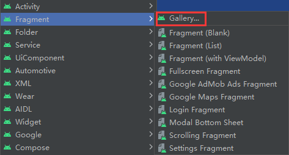

[[toc]]

# Android

开发Andorid可以使用Java或者[Kotlin](https://kotlinlang.org/)

- [官方文档](https://developer.android.google.cn/guide)
- [界面](https://developer.android.google.cn/guide/topics/ui)
- [Gradle](https://gradle.org/#close-notification)

## Android Studio

[Android Studio](https://developer.android.google.cn/studio)是官方的IDE

### 汉化

Android Studio 里面没有汉化插件但是可以使用[jetbrains](https://plugins.jetbrains.com/)的汉化插件, 搜索`Chinese`, 然后下载对应版本的插件(版本查询`Help -> About`)

 

解压然后在 Android Studion里面安装即可

 

## 代码片段设置

 

 

 

 

## 工程目录结构

App工程分为两个层次, 一个是项目, 一个是模块, 

模块依附于项目, 一个项目可以有多个模块, 运行项目其实就是运行项目中的某一个模块

- `app`: 通常 Android 的各个组成部分放在此目录中, 其中 res 主要存放一些资源文件, 如图片、layout、values 等资源

  - `build`: 构建目录
  - `libs`: 依赖的包
  - [`AndroidManifest.xml`](https://developer.android.google.cn/guide/topics/manifest/manifest-intro?hl=zh-cn):  清单文件, 包含了APP的配置信息
  - `src`: 项目目录
    - `androidTest`: android 单元测试的目录
    - `main`:
      - `Java`: 写 Java 代码的地方
      - `MainActivity`: 是一个人机交互 的程序, 相当于人与计算机沟通的手段, 在这里面写 Java 代码, 从而达到想要实现的目的
      - `res`: 资源文件, 资源文件都是`.xml`文件一般用来存一些常量或是配置项, 在java代码中可以通过[`android.R`资源类](https://developer.android.google.cn/guide/topics/ui/declaring-layout#id)进行获取
        - `drawable`: 图像资源, 存放各种位图文件, (`png`, `jpg`,`gif`等)除此之外可能是一些其他的 `drawable` 类型的文件
        - `layout`: 布局资源该目录下存放的就是App的布局文件, 可以通过`R`这个资源类的进行获取
          - `activity_main.xml`: 是控制 Android 界面显示的文件, 所有的配置控件都可以在这里进行设计, 每一个`.xml`文件会对应一个`.java`文件
        - `mipmap`: 应用启动图像资源, 会有对应的分辨率后缀的文件, 例如`mipmap-hdpi`, `mipmap-xxhdpi`
        - `menu`: 菜单资源, 在以前有物理菜单按钮, 即在 Menu 键的手机上用的较多, 现在用的并不多, 菜单项相关的资源可在这里定义
        - `values`: 常量资源, 会变成`R`这个资源类的子类, 例如:在java文件中通过`R.string.xxx`获取`string.xml`里面的`xxx`, 在xml标签中通过`@string/xxx`使用
          - `amin`: 动画资源
          - `colors`: 色彩资源
          - `string`: 字符串资源
          - `demens`: css配置文件, 定义尺寸资源
          - `styles`: 定义样式资源

- [`Gradle Script`](https://gradle.org/#close-notification): Gradle [编译](https://developer.android.google.cn/studio/build?hl=zh_cn)配置目录 

    - `build.gradle`: 有两个这样的文件一个是工程级别的(全局), 一个是模块级别的, 下面是模块级别的介绍: 

        ```groovy
        plugins {
            // 使用到的插件, 对应 build.gradle(工程级)里的 plugins.id
            id 'com.android.application'
        }
        
        android {
          	// 命名空间
            namespace 'com.example.learn_androd'
            // 指定编译使用的 SDK 版本号
            compileSdk 33
        
            defaultConfig {
                // 项目的应用编号, 必须是唯一的
                applicationId "com.example.learn_androd"
                // 指定App适合运行的最小SDK版本
                minSdk 24
                // 指定目标设备的SDK版本号
                targetSdk 33
                // 指定App的应用版本号
                versionCode 1
              	// 指定App的应用版本名称
                versionName "1.0"
        				
                // 单元测试类
                testInstrumentationRunner "androidx.test.runner.AndroidJUnitRunner"
            }
        
            buildTypes {
                release {
                    minifyEnabled false
                    // 混淆文件
                    proguardFiles getDefaultProguardFile('proguard-android-optimize.txt'), 'proguard-rules.pro'
                }
            }
            compileOptions {
                sourceCompatibility JavaVersion.VERSION_11
                targetCompatibility JavaVersion.VERSION_11
            }
            buildFeatures {
                viewBinding true
            }
        }
        
        // App的依赖信息
        dependencies {
        		// 兼容性库
            implementation 'androidx.appcompat:appcompat:1.4.1'
            implementation 'com.google.android.material:material:1.5.0'
            implementation 'androidx.constraintlayout:constraintlayout:2.1.3'
            implementation 'androidx.navigation:navigation-fragment:2.4.1'
            implementation 'androidx.navigation:navigation-ui:2.4.1'
          	// 单元测试库
            testImplementation 'junit:junit:4.13.2'
            androidTestImplementation 'androidx.test.ext:junit:1.1.3'
            androidTestImplementation 'androidx.test.espresso:espresso-core:3.4.0'
        }
        ```

    - `proguard-rules.pro`: 配置项目java代码的混淆规则

    - `gradle.properties`: 配置编译工程的命令行参数, 一般不用修改

    - `gradle-wrapper.properties`: 配置编译工程的一些配置, 如: gradle地址和构建版本

    - `local.properties`: 描述开发者电脑的配置信息, 如: sdk本地目录, ndk本地目录

    - `settings.gradle`: 表示需要编译那些模块, 默认是`include ':app'`表示只构建app模块


### 三个重要文件

 

`super.onCreate(savedInstanceState)` 的作用: 调用其父类 Activity 的 onCreate 方法来实现对界面的图画绘制工作。在实现自己定义的 Activity 子类的 onCreate 方法时一定要记得调用该方法, 以确保能够绘制界面

`setContentView(R.layout.main)` 的作用: 加载一个界面, 该方法中传入的参数是 “R.layout.main”, 其含义为 R.java 类中静态内部类 layout 的静态常量 main 的值, 而该值是一个指向 res 目录下的 layout 子目录下的 main.xml 文件的标识符, 因此代表着显示 main.xml 所定义的画面

 

 

  

## Log

Android 采用`android.util.Log`工具类打印日志，它将各类日志划分为五个等级(越往下优先级越高):

-   Log.e: 表示错误信息, 比如可能导致程序崩溃的异常
-   Log.w: 表示警告信息
-   Log.i: 表示一般消息
-   Log.d: 表示调试信息，可把程序运行时的变量值打印出来，方便跟踪调试。
-   Log.v: 表示冗余信息

>   也可以使用java的`System.out.println`进行调试

## adb

Android Studio和模拟器或者手机是通过`adb`这个工具来通信的, 这个工具一般是在Android SDK目录下的`platform-tools`目录下面 

## 常用XML控件

Andorid的视图层是使用`XML`编写而且是命令式编写的, 类比于前端的`JQuery`, 官方在推出声明时Ui就是

[Jetpack Compose)](https://developer.android.google.cn/jetpack/compose?hl=zh-cn), 使用Java或者Kotlin来编写程序逻辑

### ViewGroup 和 View

- **ViewGroup**: 可以嵌套多个空间, 必须要要结束标签(**不能自闭合**)
- **View**: 不可以嵌套控件, 可以闭合

### TextView

[文本框](https://developer.android.google.cn/guide/topics/ui/look-and-feel/autosizing-textview)

#### 基本属性

- **layout_width**: 组件的宽度, 基本常用属性如下: 
  - **match_parent**: 依据容器, 父级的大小
  - **wrap_content**: 根据自身内容
  - **xxxdp**: 使用具体的数字的话, 单位是`dp`
- **layout_height**: 组件的高度, 同组件的宽度一样
- **id**: 为控件设置一个组件id, 格式为: `@+id/xxx`, 用于在Java文件通过`findViewById(R.id.xxx)`获取该控件对象, 类比html中的id
- **text:** 设置显示的文本内容
- **textColor**: 设置字体颜色, 格式为`ARGB`, 注意: 透明度(`A`)是在前面的, 如果写成RGB格式的话透明度默认为`FF`
- **textStyle **: 设置字体风格, 三个可选值: normal(无效果), bold(加粗),italic(斜体)textSize:字体大小, 单位使用`sp`
- **background**: 控件的背景颜色, 可以理解为填充整个控件的颜色, 可以是图片
- **gravity**: 设置控件中内容的对齐方向, 常用属性包括: `center`,`center_vertical`,`center_vertical`

TextView基本使用: 

```xml
<!-- src\main\res\layout\activity_main.xml -->

<?xml version="1.0" encoding="utf-8"?>

<!-- 容器 -->
<LinearLayout xmlns:android="http://schemas.android.com/apk/res/android"
    android:layout_width="match_parent"
    android:layout_height="match_parent"
    android:orientation="vertical">

    <TextView
        android:layout_width="200dp"
        android:layout_height="200dp"
        android:id="@+id/myTextView"
        android:textColor="#ff0000"
        android:textStyle="italic"
        android:background="#ffff00"
        android:gravity="center"
        android:textSize="50sp"
        android:text="hello world!">
    </TextView>
</LinearLayout>
```

```java
// java/com/example/learn_android/MainActivity.java  onCreate 

public class MainActivity extends AppCompatActivity {
    @Override
    protected void onCreate(Bundle savedInstanceState) {
        super.onCreate(savedInstanceState);
        setContentView(R.layout.activity_main);
        
        // 获取id为 myTextView 的组件
        TextView myTextView = findViewById(R.id.myTextView);
        // 设置文本为 hello world!
        myTextView.setText("java setText TextView text content");
        System.out.println(myTextView);
    }
}
```

<kbd>F12</kbd>或者<kbd>alt</kbd>+<kbd>点击属性</kbd>就可以查看对应属性的值

 

如下: 

 

> [布局资源](https://developer.android.google.cn/guide/topics/resources/layout-resource)

#### 引用资源

控件中的一些属性, 比如颜色, 文本, 数值一般都不会写死的, 而是在项目的配置文件`res/values`中读取的, 

项目创建默认对应有三个values文件`colors.xml`(颜色),`strings.xml`(文本),`themes.xml`(主题), 里面有一些默认的属性, 也可以自己添加一些属性, 如下:

```xml
<!-- res/values/colors.xml -->
<resources>
	...
    <color name="red">#ff0000</color>
    <color name="yellow">#ffff00</color>
</resources>
```

```xml
<!-- res/values/strings.xml -->

<resources>
    ...
    <string name="hi">hello world!</string>
</resources>
```

在控件中引入使用: 

```xml
<TextView
    android:layout_width="500dp"
    android:layout_height="500dp"
    android:textColor="@color/red"
    android:background="@color/yellow"
    android:text="@string/hi">
</TextView>
```

> `res`下的一些图片资源目录是可以在`xml`或者`Java`代码中被直接引入使用的, 比如: `drawable`,`mipmap`

#### 阴影属性

- **shadowColor**: 设置阴影颜色, 需要与**shadowRadius—起使用**
- **shadowRadius**: 设置阴影的模糊程度,设为0.1就变成字体颜色了, 建议使用3.0
- **shadowDx**: 设置阴影在水平方向的偏移就是水平方向阴影开始的横坐标位置, 使用数字不带单位,例如: 10.0
- **shadowDy**: 设置阴影在竖直方向的偏移就是竖直方向阴影开始的纵坐标位置

#### 跑马灯效果

- **singleLine**: 内容单行显示
- **focusable**: 是否可以获取焦点
- **focusableInTouchMode**: 用于控制视图在触摸模式下是否可以聚焦
- **ellipsize**: 在哪里省略文体
- **marqueeRepeatLimit**: 字幕动画重复的次数

**基本使用:**

```xml
<?xml version="1.0" encoding="utf-8"?>

<LinearLayout xmlns:android="http://schemas.android.com/apk/res/android"
    android:layout_width="match_parent"
    android:layout_height="match_parent"
    android:orientation="vertical">

    <TextView
        android:layout_width="match_parent"
        android:layout_height="100dp"
        android:textSize="20sp"
        android:ellipsize="marquee"
        android:focusable="true"
        android:focusableInTouchMode="true"
        android:gravity="center"
        android:marqueeRepeatLimit="marquee_forever"
        android:singleLine="true"
        android:text="hello world! hello world! hello world!hello world! hello world! hello world! hello world!">
    </TextView>
</LinearLayout>
```

这是文本并不会自动转动, 原因是TextView没有获取焦点可以添加`android:clickable="true"`这样可以手动点击后触发焦点, 一般不会使用它, 而是使用自动获取焦点的方式, 可以在TextView标签内添加`<requestFocus/>`去请求焦点

```xml
<TextView
	...
    >

    <!-- 请求焦点 -->
    <requestFocus/>
</TextView>
```

#### java文件中获取通过id对应的控件

```java
package com.example.learn_androd;
import android.os.Bundle;
import android.util.Log;
import android.view.View;
import android.widget.TextView;

import androidx.appcompat.app.AppCompatActivity;
public class MainActivity extends AppCompatActivity {
    // 保存 TextView 控件对象
    public TextView view;

    @Override
    protected void onCreate(Bundle savedInstanceState) {
        super.onCreate(savedInstanceState);
        setContentView(R.layout.activity_main);

        // 获取控件对象, 通过资源类 R 获取到对应的id
        view = findViewById(R.id.myTextView);
        // 绑定点击事件
        view.setOnClickListener(new View.OnClickListener() {
            @Override
            public void onClick(View v) {
                Log.d("an", "TextView 控件被点击了");
                // 修改里面的文本
              	view.setText("我修改了");
            }
        });
    }
}
```

### Button

[按钮](https://developer.android.google.cn/guide/topics/ui/controls/button)

`Button`继承自`TextView`, `TextView`有的属性`Button`也能使用, 按钮只多了两个属性一个是`onClick`(点击事件), 一个是`textAllCaps`字母是否为大写(默认为`true`)

注意: 按钮的背景色在`Android29`以后的设置是有问题的需要修改`values/themes.xml`文件

```xml
<resources xmlns:tools="http://schemas.android.com/tools">
    <!-- 默认的 -->
    <!-- <style name="Theme.Learnandroid" parent="Theme.MaterialComponents.DayNight.DarkActionBar"> -->
    <!-- parent属性添加 .Bridge 即可 -->
    <style name="Theme.Learnandroid" parent="Theme.MaterialComponents.DayNight.DarkActionBar.Bridge">
        ...
    </style>
</resources>
```

>   **enabled**属性控制按钮的是否启用

#### Button事件处理

常用事件有三个: 

1. 点击事件
2. 长按事件
3. 触摸事件

**事件的基本使用: ** 

**MainActivity:**

```java
// onCreate

// 获取页面的按钮, findViewById() 等价于 this.findViewById()
Button btn = findViewById(R.id.my_btn);

// 点击事件(支持Lambda表达式)
btn.setOnClickListener(view -> System.out.println("按钮被点击了"));

// 长按事件
btn.setOnLongClickListener(new View.OnLongClickListener() {
    @Override
    public boolean onLongClick(View view) {
        System.out.println("按钮被长按了: ", ((Button)view).getText());
        // 返回true则该事件回调会把触摸事件也消费(就是前端的, 取消事件冒泡)
        return false;
    }
});

// 触摸事件
btn.setOnTouchListener(new View.OnTouchListener() {
    @Override
    public boolean onTouch(View view, MotionEvent motionEvent) {
        System.out.println("按钮被触摸了" + motionEvent.getAction());
        // 返回true则该事件回调会把长按事件和点击事件也一起消费(这两个事件的事件回调也会执行这个回调)
        return false;
    }
});
```

>   触摸事件的事件对象的`getAction()`的返回的对应MotionEvent类的 `ACTION_DOWN`(0), `ACTION_UP`(1), `ACTION_MOVE`(2)

除了上面的在生命周期中动态的绑定事件, 还可以在XML中绑定事件格式为: `android:onXxx="方法名"`这个方法名对应`MainActivity`类的方法名

```xml
<!-- 绑定点击事件, 事件处理函数是MainActivity类的handleClick方法 -->
<Button android:onClick="handleClick"/>
```

```java
// src/main/java/com/example/learn_android/MainActivity.java

public class MainActivity extends AppCompatActivity {
    // ...
    public void handleClick(View view) {
        System.out.println("XML中处理点击事件");
    }
}
```

#### 通用点击事件

当一个类实现 `View.OnClickListener` 这个接口然后重写 `onClick` 方法即可处理 `onClick` 事件

基本使用如下: 

```xml
<?xml version="1.0" encoding="utf-8"?>
<LinearLayout xmlns:android="http://schemas.android.com/apk/res/android"
    xmlns:tools="http://schemas.android.com/tools"
    android:layout_width="match_parent"
    android:layout_height="match_parent"
    android:orientation="vertical"
    tools:context=".MainActivity">

    <Button
        android:layout_width="match_parent"
        android:layout_height="wrap_content"
        android:id="@+id/btn1"
        android:text="按钮1" />

    <Button
        android:layout_width="match_parent"
        android:layout_height="wrap_content"
        android:id="@+id/btn2"
        android:text="按钮2" />

    <Button
        android:layout_width="match_parent"
        android:layout_height="wrap_content"
        android:id="@+id/btn3"
        android:text="按钮3" />

    <TextView
        android:layout_width="match_parent"
        android:layout_height="wrap_content"
        android:id="@+id/text"
        android:gravity="center"
        android:text="我是 textview" />


</LinearLayout>
```

```java
package com.example.learn_androd;

import android.os.Bundle;
import android.util.Log;
import android.view.View;
import android.widget.Button;
import android.widget.TextView;
import androidx.appcompat.app.AppCompatActivity;

// 让当前类实现 View.OnClickListener 这个接口然后重写 onClick 即可处理 onClick 事件
public class MainActivity extends AppCompatActivity implements View.OnClickListener {
    // 保存控件对象
    private Button btn1;
    private Button btn2;
    private Button btn3;
    private TextView text;

    @Override
    protected void onCreate(Bundle savedInstanceState) {
        super.onCreate(savedInstanceState);
        setContentView(R.layout.activity_main);

        // 获取控件对象
        btn1 = findViewById(R.id.btn1);
        btn2 = findViewById(R.id.btn2);
        btn3 = findViewById(R.id.btn3);
        text = findViewById(R.id.text);

        // 因为当前上下文已经实现了 View.OnClickListener 接口就可以处理 onClick
        btn1.setOnClickListener(this);
        btn2.setOnClickListener(this);
        btn3.setOnClickListener(this);
    }

    @Override
    public void onClick(View view) {
        String msg = new String();

      	// 根据当前点击的控件id进行判断是点击了那个按钮
        switch (view.getId()) {
            case R.id.btn1:
                msg = "刚刚点击了按钮1";
                break;
            case R.id.btn2:
                msg = "刚刚点击了按钮2";
                break;
            case R.id.btn3:
                msg = "刚刚点击了按钮3";
                break;
        }

        // 这里要把 view 转成 Button 才有 getText() 方法
        Log.d("test", "点击了 -> " + ((Button)view).getText());
        // 设置 TextView 文本
        text.setText(msg);
    }
}
```

### StateListDrawable

StateListDrawable是Drawable资源的一种, 可以根据使用它的控件的不同状态, 设置不同的图片效果, 关键节点`<selector>`, 只需要将Button的background属性设置为该drawable资源即可轻松实现, 按下按钮时不同的按钮颜色或背景, 常用属性如下: 

**drawable**: 引用的Drawable位图

**state_focused**: 是否获得焦点

**state_pressed**: 控件是否被按下

**state_enabled**:控件是否可用

**state_selected**:控件是否被选择,针对有滚轮的情况

**state_checked**:控件是否被勾选

**state_checkable**:控件可否被勾选

state_window_focused:是否获得窗口焦点

state_active:控件是否处于活动状态

state_single:控件包含多个子控件时,确定是否只显示一个子控件

state_first:控件包含多个子控件时,确定第一个子控件是否处于显示状态

state_middle:控件包含多个子控件时,确定中间一个子控件是否处于显示状态

state_last:控件包含多个子控件时,确定最后一个子控件是否处于显示状态

#### 新建Drawble

 

给定文件名`btn_select`新建即可

```xml
<?xml version="1.0" encoding="utf-8"?>
<selector xmlns:android="http://schemas.android.com/apk/res/android">
    <!-- item 标签表示可以选择的每一项 -->
    <!-- drawable属性不能使用values中的变量, 必须使用Drawable位图 -->
    <item android:drawable=""></item>
</selector>
```

Android Studio自带了一些内置的Drawable位图, 如下方式新建: 

 

 

**定义drawable各个状态所显示的位图**

```xml
<!-- drawable/btn_select.xml -->

<?xml version="1.0" encoding="utf-8"?>
<selector xmlns:android="http://schemas.android.com/apk/res/android">
    <!-- 按下时图片为 drawable/ic_launcher_foreground -->
    <item android:drawable="@drawable/ic_android_black_24dp" android:state_pressed="true"></item>
    <!-- 默认为 drawable/ic_baseline_accessibility_24 -->
    <item android:drawable="@drawable/ic_baseline_accessibility_24"></item>
</selector>
```

#### 按钮引用drawable

**activity_main:**

```xml
<Button
    android:layout_width="100dp"
    android:layout_height="50dp"
    android:text="我是按钮"
    android:id="@+id/my_btn"
    android:background="@drawable/btn_select"
    ></Button>
```

运行代码后可以看到点击按钮后按钮的背景图片会改变

#### 定义颜色选择器

`res`下新建`color`目录在该目录下新建`Color Resource File`里面的每个`item`标签使用`android:color="#xxx"`, 页面使用时使用`android:backgroundTint="@color/xxx"`引用即可

> 很多控件都支持使用`android:background`属性设置成`drawable`, 只是各自的根节点和`item`或子节点的属性不一样

### EditText

功能文本框

EditText也是继承自TextView, 常用属性如下: 

- **hint**: 输入提示
- **textColorHint**: 输入提示文字的颜色
- **inputType**: 输入类型, `phone`手机号码, `numberPassword`数字密码,`textPassword`文本密码
- **drawableXxx**: 在输入框的指定方位添加位图(drawble), 如:  `drawableLeft`
- **drawablePadding**: 设置图片与输入内容的间距
- **paddingXxx**: 设置内容与边框的间距, 如:  `paddingLeft`, 类别CSS的`padding-xxx`
- **layout_marginXxx**: 类比CSS的`margin-xxx` 
- **background**: 背景色

**activity_main:** 

```xml
<EditText
    android:id="@+id/userName"
    android:layout_width="match_parent"
    android:layout_height="30dp"
    android:background="#3f000000"
    android:drawableLeft="@drawable/person"
    android:hint="请输入用户名"
    android:inputType="text"
    android:textSize="12dp"
    android:paddingLeft="20dp"/>

<EditText
    android:id="@+id/password"
    android:layout_width="match_parent"
    android:layout_height="30dp"
    android:background="#3f000000"
    android:hint="请输入密码"
    android:inputType="textPassword"
    android:textColorHint="@color/red"
    android:textSize="12dp"
    android:drawableLeft="@drawable/lock"
    android:drawablePadding="80dp"
    android:paddingLeft="20dp"/>

<Button
    android:id="@+id/btn"
    android:layout_width="100dp"
    android:layout_height="50dp"
    android:text="提交"/>
```

获取EditText中的文本, 通过其`getText().toString()`方法来获取, 如下: 

```java
Button btn = findViewById(R.id.btn);
EditText userName = findViewById(R.id.userName);
EditText password = findViewById(R.id.password);

btn.setOnClickListener(new View.OnClickListener() {
    @Override
    public void onClick(View view) {
        // 获取用户名
        String u = userName.getText().toString();
        // 获取密码
        String p = password.getText().toString();
        System.out.println("用户名是:" + u);
        System.out.println("密码是:" + p);
    }
});
```

### HorizontalScrollView 和 ScrollView

滚动条控件

- HorizontalScrollView:水平滚动
- ScrollView:  垂直滚动

> 滚动条控件只能有一个子控件, 要放多个子控件可以放一个ViewGroup然后在ViewGroup里嵌套

### ImageView

图片标签, 开发中一般使用`Glide`库

- **src**: 设置图片资源
- **scaleType**: 设置图片缩放类型
- **maxHeight**: 最大高度,  本身的`layout_width`和`layout_height`是`wrap_content`才有用
- **maxWidth**: 同上只不是设置其最大宽度
- **adjustViewBounds**: 调整`view`的界限, 使其设置的最大高度和最大宽度生效

>   在`Java`代码中, 通过`setImageResource()`方法设置值, 参数为`R.drawable.xxx`(不含图片扩展名)

```xml
<ImageView
    android:layout_width="wrap_content" 
    android:layout_height="wrap_content"
    android:maxHeight="200dp"
    android:maxWidth="200dp"
    android:adjustViewBounds="true"
    android:src="@drawable/np"/>
```

**ScaleType的可选值: **

- **fitStart**: 保持宽高比缩放图片, 直到较长的边与Image的边长相等, 缩放完成后将图片放在lmageView的左上角
- **fitCenter**: `默认值`, 同fitStart, 缩放后放于中间
- **fitEnd**: 同fitStart, 缩放后放于右下角
- **fitXY**: 对图像的横纵方向进行独立缩放, 使得该图片完全适应ImageView, 图片的宽高比可能会发生改变
- **center**: 保持原图的大小, 显示在lmageView的**中心**; 当原图的大小大于lmageView的大小, 原图超出部分裁剪处理
- **centerCrop**: 保持宽高比缩放图片, 直到完全覆盖ImageView, 可能会出现图片的显示不完全
- **centerlnside**: 保持宽高比缩放图片, 直到ImageView能够完全地显示图片
- **matrix**: 不改变原图的大小, 从lmageView的**左上角**开始绘制原图, 原图超出的部分作裁剪处理

> 还有对应的`ImageButton`

### ProgressBar

进度条

- **max:** 进度条的最大值

- **progress:** 进度条已完成进度值

- **indeterminate:** 如果设置成`true`, 则进度条不精确显示进度, 就会一直滚动

- `style="?android:attr/progressBarStyleHorizontal"`水平进度条

**activity_main**: 

```xml
<?xml version="1.0" encoding="utf-8"?>

<LinearLayout xmlns:android="http://schemas.android.com/apk/res/android"
    android:layout_width="match_parent"
    android:layout_height="match_parent"
    android:orientation="vertical">

    <ProgressBar
        android:id="@+id/bar1"
        android:layout_width="wrap_content"
        android:layout_height="wrap_content" />

    <Button
        android:id="@+id/btn1"
        android:layout_width="wrap_content"
        android:layout_height="wrap_content"
        android:onClick="handleClick1"
        android:text="弧度进度条显示/隐藏" />

    <ProgressBar
        android:id="@+id/bar2"
        style="?android:attr/progressBarStyleHorizontal"
        android:layout_width="300dp"
        android:layout_height="wrap_content"
        android:layout_marginTop="20dp"
        android:max="100" />

    <Button
        android:id="@+id/btn2"
        android:layout_width="wrap_content"
        android:layout_height="wrap_content"
        android:onClick="handleClick2"
        android:text="模拟下载" />

    <ProgressBar
        style="?android:attr/progressBarStyleHorizontal"
        android:layout_width="300dp"
        android:layout_height="wrap_content"
        android:layout_marginTop="20dp"
        android:indeterminate="true" />
</LinearLayout>
```

**AppCompatActivity: **

```java
package com.example.learn_android;

import androidx.appcompat.app.AppCompatActivity;

import android.os.Bundle;
import android.view.MotionEvent;
import android.view.View;
import android.widget.Button;
import android.widget.EditText;
import android.widget.ProgressBar;

public class MainActivity extends AppCompatActivity {
    // 保存进度条对象
    private ProgressBar bar1;
    private ProgressBar bar2;

    @Override
    protected void onCreate(Bundle savedInstanceState) {
        super.onCreate(savedInstanceState);
        setContentView(R.layout.activity_main);

        // 获取进度条对象
        bar1 = findViewById(R.id.bar1);
        bar2 = findViewById(R.id.bar2);
    }
    // 弧形进度条click事件
    public void handleClick1(View view) {
        // 当前正在显示
        if (bar1.getVisibility() == View.GONE) {
            // 设置为隐藏
            bar1.setVisibility(View.VISIBLE);
        } else {
            // 设置为显示
            bar1.setVisibility(View.GONE);
        }
    }
    // 水平进度条click事件
    public void handleClick2(View view) {
        // 获取进度值
        int progress = bar2.getProgress();
        // 每次点击 + 10
        bar2.setProgress(progress + 10);

        // 大于或等于最大值时
        if (progress >= bar2.getMax()) {
            // 归零
            bar2.setProgress(0);
        }
    }
}
```

### Notification

[通知](https://developer.android.google.cn/guide/topics/ui/notifiers/notifications)

#### NotificationMange

`NotificationManager`类是一个通知管理器类, 这个对象是由系统维护的服务, 是以单例模式的方式获得, 所以一般并不直接实例化这个对象。在`Activity`中, 可以使用`getSystemService(String)`方法获取, 该方法可以通过Android系统级服务的句柄, 返回对应的对象, 在这里需要返回`NotificationManager`, 所以直接传递`NOTIFICATION_SERVICE`即可

```java
// 获取通知管理类对象
NotificationManager manager = 
    (NotificationManager) getSystemService(NOTIFICATION_SERVICE);
```

#### NotificationChannel

Android8.0引入通知渠道的概念, 允许你为要显示的每种通知类型创建用户可自定义的渠道, 需要通过`NotificationChannel`类去设置, 如下:

```java
// Android8.0 需要配置通知渠道
if (Build.VERSION.SDK_INT >= Build.VERSION_CODES.O) {
    NotificationChannel channel = new NotificationChannel(
            "hello", // 渠道id
            "测试通知", // 这个是通知的标题
            NotificationManager.IMPORTANCE_HIGH); // 这个是通知的重要性程度

    // manager 使用 channel
    manager.createNotificationChannel(channel);
}
```

通知的重要性程度具体的值都存在`NotificationManager`的常量下: 

- **IMPORTANCE_NONE**: 关闭通知
- **IlMPORTANCE_MIN**: 开启通知, 不会弹出, 但没有提示音, 状态栏中无显示
- **IMPORTANCE_LOw**: 开启通知, 不会弹出, 不发出提示音, 状态栏中显示
- **IMPORTANCE_DEFAULT**: 开启通知, 不会弹出, 发出提示音, 状态栏中显示
- **IMPORTANCE_HIGH**: 开启通知, 会弹出, 发出提示音, 状态栏中显示

### Notification

使用`NotificationCompat`类的`Builder`构造器的`buiid()`方法来创建Notification对象, 可以保证程序在所有的版本上都能正常工作, Android8.0需要添加通知渠道, 如果没有设置, 则通知**无法在Android8.0的机器上显示**

常用方法(支持链式调用): 

- **setContentTitle(String string)**: 设置标题
- **setContentText(String string)**: 设置文本内容
- **setSmalllcon( int icon)**: 设置小图标
- **setLargelcon(Bitmap icon)**: 设置通知的大图标
- **setColor(int argb)**: 设置小图标的颜色
- **setContentIntent(Pendinglntent intent)**: 设置点击通知后的跳转意图
- **setAutoCancel(boolean boolean)**: 设置点击通知后自动清除通知
- **setWhen(long when)**: 设置通知被创建的时间, 默认当前时间

一个最简单的通知如下: 

```java
// 创建 Notification 对象
Notification notification = new NotificationCompat
        .Builder(this, "hello") // 这个 hello 就是对应上面的渠道id
        .setContentTitle("官方通知")
        .setContentText("世界那么大, 我想去看看!")
        .setSmallIcon(R.drawable.ic_launcher_foreground) // 引用 drawable 下的位图
        .build();
```

一个通知只要设置了`setContentTitle()`,`setContentText()`,`setSmallIcon()`就可以显示了

注意: Android从5.0系统开始, 对于通知栏图标的设计进行了修改, 现在Google要求, 所有应用程序的通知栏图标, 应该**只使用alpha图层来进行绘制**, 而**不应该包持RGB图层**, 简单说图片不能带颜色

### 通知的使用

**activity_main:**

```xml
<?xml version="1.0" encoding="utf-8"?>
<LinearLayout xmlns:android="http://schemas.android.com/apk/res/android"
    android:layout_width="wrap_content"
    android:layout_height="wrap_content"
    android:orientation="vertical">

    <Button
        android:layout_width="wrap_content"
        android:layout_height="wrap_content"
        android:onClick="sendNotice"
        android:text="发出通知"/>

    <Button
        android:layout_width="wrap_content"
        android:layout_height="wrap_content"
        android:onClick="closeNotice"
        android:text="取消通知"/>
</LinearLayout>
```

 **MainActivity:**

```java
package com.example.notification;

import androidx.appcompat.app.AppCompatActivity;
import androidx.core.app.NotificationCompat;

import android.app.Activity;
import android.app.Notification;
import android.app.NotificationChannel;
import android.app.NotificationManager;
import android.app.PendingIntent;
import android.content.Intent;
import android.graphics.Bitmap;
import android.graphics.BitmapFactory;
import android.graphics.Color;
import android.os.Build;
import android.os.Bundle;
import android.view.View;

public class MainActivity extends AppCompatActivity {
    private NotificationManager manager;
    private Notification notification;

    @Override
    protected void onCreate(Bundle savedInstanceState) {
        super.onCreate(savedInstanceState);
        setContentView(R.layout.activity_main);

        // 获取通知管理类对象
        manager = (NotificationManager) getSystemService(NOTIFICATION_SERVICE);

        // Android8.0 需要配置通知渠道
        if (Build.VERSION.SDK_INT >= Build.VERSION_CODES.O) {
            NotificationChannel channel = new NotificationChannel(
                    "hello", // 对应上面的渠道id
                    "测试通知", // 这个是通知的标题
                    NotificationManager.IMPORTANCE_HIGH); // 这个是通知的重要性程度

            // 使用channel
            manager.createNotificationChannel(channel);
        }

        // 创建PendingIntent(就是通知要跳转的页面)
        Intent intent = new Intent(this, NotificationActivity.class);
        PendingIntent pendingIntent =
                PendingIntent.getActivity(this, 0, intent, 0);


        // 创建 Notification 对象
        notification = new NotificationCompat
                .Builder(this, "hello") // 这个 hello 就是对应上面的渠道id
                .setContentTitle("官方通知")
                .setContentText("世界那么大, 我想去看看!")
                .setSmallIcon(R.drawable.ic_launcher_foreground) // 引用 drawable 下的位图
                // 大图标可以使用其他的图片不过格式要转换成 Bitmap
                .setLargeIcon(BitmapFactory.decodeResource(getResources(), R.drawable.np))
                // 小图标的颜色是要int类型的所以需要转换一下
                .setColor(Color.parseColor("#ff0000"))
                // 点击通知后跳转到 NotificationActivity 页面
                .setContentIntent(pendingIntent)
                .setAutoCancel(true)
                .build();
    }

    // 发出通知按钮回调
    public void sendNotice(View view) {
        // 发送id为1的通知
        manager.notify(1, notification);
    }

    // 取消通知按钮回调
    public void closeNotice(View view) {
        // 取消id为1的通知
        manager.cancel(1);
    }
}
```

**NotificationActivity:**

在`src/main/java/com/example/项目名`下面新建`NotificationActivity.java`文件(通知要跳转的页面), 如下: 

```java
package com.example.notification;

import android.app.Activity;
import android.os.Bundle;
import androidx.annotation.Nullable;

// 继承自 Activity 类
public class NotificationActivity extends Activity {
    @Override
    protected void onCreate(@Nullable Bundle savedInstanceState) {
        super.onCreate(savedInstanceState);
        // 打印日志
        System.out.println("onCreate: 进入了 NotificationActivity ");
    }
}
```

**注册页面:**

在`src/main/AndroidManifest.xml`下面注册上面新建的NotificationActivity, 如下: 

```xml
<application
    ...
    <!-- 注册一个 NotificationActivity -->
    <activity android:name=".NotificationActivity" />
</application>
```

### Toolbar

[应用栏](https://developer.android.google.cn/training/appbar)

应用的`<stye>`标签的属性`parent="Theme.MaterialComponents.DayNight.NoActionBar"`可以去掉默认的Toolbar

 

而使用自定义的Toolbar使用的是`androidx.appcompat.widget.Toolbar`而不是默认的Toolbar

常用属性(注意前缀是**app:**): 

- **android:layout_width**: 一般都是`"match_parent"`
- **android:layout_height**: 一般都是`"?attr/actionBarSize"`
- **android:background**: 背景色
- **app:navigationlcon**: 位图, 可以引用drawable
- **app:title**: 标题
- **app:titleTextColor**: 标题文字颜色
- **app:titleMarginStart**: 标题距离开始位置的距离
- **app:subtitle**: 子标题
- **app:subtitleTextColor**: 子标题文字颜色
- **app:logo**: 位图可以引用drawable或者mipmap

**activity_main.xml:** 

```xml
<androidx.appcompat.widget.Toolbar
    android:id="@+id/back"
    android:layout_width="match_parent"
    android:layout_height="?attr/actionBarSize"
    android:background="#ff0000"
    app:navigationIcon="@drawable/ic_baseline_arrow_back_24"
    app:title="返回"
    app:titleTextColor="@color/white"
    app:titleMarginStart="50dp"
    app:subtitle="子标题"
    app:subtitleTextColor="@color/black"
    app:logo="@mipmap/ic_launcher"/>
```

当点击其设置的`app:navigationIcon`位图时触发的不是`click`事件, `setNavigationOnClickListener`

```java
// 这个 Toolbar 是导入的 androidx.appcompat.widget.Toolbar 不是默认的
Toolbar toolbar = findViewById(R.id.back);
toolbar.setNavigationOnClickListener(new View.OnClickListener() {
    @Override
    public void onClick(View view) {
        Log.e("test", "onClick: toolbar 返回位图被点击了");
    }
});
```

除了在`xml`中设置Toolbar的属性, 还可以在Java代码中设置, 如下: 

```java
Toolbar toolbar = findViewById(R.id.back);
toolbar.setNavigationIcon(R.drawable.ic_baseline_arrow_back_24);
toolbar.setBackgroundColor(Color.parseColor("#00ff00"));
toolbar.setTitle("返回");
toolbar.setTitleTextColor(Color.parseColor("#ff0000"));
toolbar.setTitleMarginStart(50);
toolbar.setSubtitle("子标题");
toolbar.setSubtitleTextColor(Color.parseColor("#ff0000"));
toolbar.setLogo(R.mipmap.ic_launcher);
toolbar.setNavigationOnClickListener(new View.OnClickListener() {
    @Override
    public void onClick(View view) {
        Log.e("test", "onClick: toolbar 返回位图被点击了");
    }
});
```

### 文本居中的Toolbar

要实现文本居中的Toolbar只需要在Toolbar内部放一个TextView然后设置其`android:layout_gravity="center"`就可以如下: 

```xml
<androidx.appcompat.widget.Toolbar
    android:layout_width="match_parent"
    android:layout_height="?attr/actionBarSize"
    app:navigationIcon="@drawable/ic_baseline_arrow_back_24"
    android:background="#ff0000">

    <TextView
        android:layout_width="wrap_content"
        android:layout_height="wrap_content"
        android:layout_gravity="center"
        android:text="我是居中的文本" />
</androidx.appcompat.widget.Toolbar>
```

### AlertDialog

[通知](https://developer.android.google.cn/guide/topics/ui/notifiers/notifications)

通过`AlertDialog.Builder`构造方法来获取构建器, 然后构建AlertDialog的各种参数

```java
AlertDialog.Builder builder = new AlertDialog.Builder(context);
```

常用方法(支持链式调用): 

- **Builder.setlcon(int iconld)**: 添加ICON

- **Builder.setTitle(CharSequence title)**: 添加标题
- **Builder.setMessage(CharSequence message)**: 添加消息 
- **Builder.setView(View view)**: 设置自定义布局
- **Builder.setPositiveButton(String textId, OnClickListener listener)**: 确定按钮
- **Builder.setNegativeButton(String textId, OnClickListener listener)**: 取消按钮
- **Builder.setNeutralButton(String textId, OnClickListener listener)**: 中间按钮
- **Builder.create()**: 创建Dialog
- **Builder.show()**: 显示对话框

**activity_main:**

```xml
<Button
    android:layout_width="wrap_content"
    android:layout_height="wrap_content"
    android:onClick="handlAlertDialog"
    android:text="显示 AlertDialog" />
```

**MainActicity: **

```java
// 按钮回调函数
public void handlAlertDialog(View view) {
    // 获取构建器
    AlertDialog.Builder builder = new AlertDialog.Builder(this);
    builder.setIcon(R.mipmap.ic_launcher)
            .setTitle("我是对话框")
            .setMessage("我是内容")
            .setPositiveButton(
                    "确定",
                    // 这个类是 DialogInterface.OnClickListener
                    new DialogInterface.OnClickListener() {
                        @Override
                        public void onClick(DialogInterface dialogInterface, int i) {
                            Log.e("test", "onClick: 确定按钮被点击了");
                        }
                    })
            .setNegativeButton(
                    "取消",
                    (dialogInterface, i) -> Log.e("test", "onClick: 取消按钮被点击了"))
            .setNeutralButton(
                    "中间按钮",
                    (dialogInterface, i) -> Log.e("test", "onClick: 取消按钮被点击了"))
            .create() // 这里只是创建了
            .show(); // 显示, 这个一定要放到最后
}
```

**Builder.setView(View view)** 自定义布局的使用需要新建一个`Android Resource File`, 然后随便自定义一些控件如下: 

```xml
<!-- layout/dialog_view.xml -->
<?xml version="1.0" encoding="utf-8" ?>

<LinearLayout xmlns:android="http://schemas.android.com/apk/res/android"
    android:layout_width="match_parent"
    android:layout_height="match_parent"
    android:background="#ff0000"
    android:orientation="vertical">

    <ImageView
        android:layout_width="wrap_content"
        android:layout_height="wrap_content"
        android:src="@drawable/ic_launcher_background" />

    <TextView
        android:layout_width="wrap_content"
        android:layout_height="wrap_content"
        android:text="hello world!" />
</LinearLayout>
```

然后加载该View:

```java
View dialogView = getLayoutInflater().inflate(R.layout.dialog_view, null);
// 使用
builder.setView(dialogView)
```

自定义的效果如下:

 

### PopupWindow

通过构造方法来构建PopupWidow

常用方法如下: 

- **setContentView(View contentView)**: 设置PopupWindow显示的view
- **showAsDropDown(View anchor)**: 相对某个控件的位置(正左下方), 无偏移
- **showAsDropDown(View anchor, int xoff, int yoff)**: 相对某个控件的位置, 有偏移
- **setFocusable(boolean focusable)**: 设置是否获取焦点
- **setBackgroundDrawable(Drawable background)**: 设置背景
- **dismiss()**: 关闭弹窗
- **setAnimationStyle(int animationStyle)**: 设置加载动画
- **setTouchable(boolean touchable)**: 设置PopupWindow的触摸使能, 点击本身
- **setOutsideTouchable(boolean touchable)**: 设置PopupWindow外面的触摸使能

可以通过上述的方法去一个一个的设置属性, 还可以通过其带参构造方法或方法去设置, 如下: 

**activity_main:**

```xml
<?xml version="1.0" encoding="utf-8"?>

<LinearLayout xmlns:android="http://schemas.android.com/apk/res/android"
    android:layout_width="match_parent"
    android:layout_height="match_parent"
    android:orientation="vertical">

    <Button
        android:layout_width="wrap_content"
        android:layout_height="wrap_content"
        android:onClick="handleClick"
        android:text="显示popupwindow"/>
</LinearLayout>
```

**popup_view:**

```xml
<?xml version="1.0" encoding="utf-8" ?>

<LinearLayout xmlns:android="http://schemas.android.com/apk/res/android"
    android:layout_width="match_parent"
    android:layout_height="match_parent"
    android:orientation="vertical">

    <Button
        android:id="@+id/btn1"
        android:layout_width="wrap_content"
        android:layout_height="wrap_content"
        android:text="按钮1" />
    <Button
        android:id="@+id/btn2"
        android:layout_width="wrap_content"
        android:layout_height="wrap_content"
        android:text="按钮2" />
</LinearLayout>
```

**MainActicity: **

```java
// 按钮回调函数
public void handleClick(View view) {
    // 自定义的view
    View popupView = getLayoutInflater().inflate(R.layout.popup_view, null);

    // 构建PopupWindow
    PopupWindow popupWindow = new PopupWindow(
            popupView, // view
            ViewGroup.LayoutParams.WRAP_CONTENT, // x方向偏移, 等价于 wrap_content
            ViewGroup.LayoutParams.WRAP_CONTENT, // y方向偏移
            true); // 失去焦点, 隐藏popupWindown

    // 设置背景图片, 必须要在显示之前设置
    popupWindow.setBackgroundDrawable(getResources().getDrawable(R.drawable.dy));
    popupWindow.setWidth(400);
    popupWindow.setHeight(600);

    // 显示 popupWindow 并设置其相对于view的偏移
    popupWindow.showAsDropDown(view, view.getWidth(), -view.getHeight());

    // 获取 popupView 里的控件
    Button btn1 = popupView.findViewById(R.id.btn1);
    btn1.setOnClickListener(new View.OnClickListener() {
        @Override
        public void onClick(View view) {
            Log.e("test", "onClick: 按钮1 被点击了");
            // 关闭popupWindow
            popupWindow.dismiss();
        }
    });

    Button btn2 = popupView.findViewById(R.id.btn2);
    btn2.setOnClickListener(v -> Log.e("test", "onClick: 按钮2 被点击了"));
}
```

### 布局

#### LinearLayout

[线性布局](https://developer.android.google.cn/guide/topics/ui/layout/linear)( 绝对布局)

-   **xmlns:android**: 命名空间就是`android:`前缀的属性

- **orientation**: 布局中组件的排列方式, `verical`(垂直排列), `horizontal`(水平排列)
- **gravity**: 控制组件所包含的子元素的对齐方式, 可多个组合, 使用(`|`)连接
- **layout_gravity**: 控制该组件在父容器里的对其方式, 收父容器**gravity**限制是控制垂直还是水平
- **background**: 为该组件设置一个背景图片, 或者是直接用颜色覆盖
- **divider**: 分割线, 会显示在每个子控件之间
- **showDividers**: 设置分割线所在的位置, none(无), beginning(开始), end(结束),middle(每两个组件间)
- **dividerPadding**: 设置分割线的 padding
- **layout_weight(权重)**: 该属性是用来等比例的划分区域(基于自身的**layout_height**或者**layout_width**来分配具体得看父容器的**orientation**), 类似于CSS的**flex**, 一般自身**layout_height**或者**layout_width**给定**0dp**, 然后就可以按照权重自动分配剩余空间了

```xml
<LinearLayout xmlns:android="http://schemas.android.com/apk/res/android"
    android:layout_width="match_parent"
    android:layout_height="match_parent"
    android:gravity="center|right"
    android:orientation="vertical">

    <LinearLayout
        android:layout_width="100dp"
        android:layout_height="0dp"
        android:layout_weight="2"
        android:background="#ff0000"/>

    <LinearLayout
        android:layout_width="100dp"
        android:layout_height="0dp"
        android:layout_weight="1"
        android:background="#00ff00"/>

    <LinearLayout
        android:layout_width="100dp"
        android:layout_height="0dp"
        android:layout_weight="1"
        android:background="#0000ff"/>
</LinearLayout>
```

#### 布局信息

-   `getLayoutParams`可以获取布局信息

-   `gsetLayoutParams`可以设置布局

#### RelativeLayout

[相对布局](https://developer.android.google.cn/guide/topics/ui/layout/relative)(相对布局)

#### 根据父容器定位

- **layout_alignParentTop**: 顶部对齐
- **layout_alignParentBottom**: 底部对齐
- **layout_alignParentLeft**: 左对齐
- **layout_alignParentRight**: 右对齐
- **layout_centerHorizontal**: 水平居中
- **layout_centerVertical**: 垂直居中
- **layout_centerInParent**: 中间位置

#### 根据兄弟组件定位

根据兄弟组件定位是要给定那个兄弟元素的`id`来定位的

- **layout_above**: 放置于参考组件的上方
- **layout_below**: 放置于参考组件的下方
- **layout_toLeftOf**: 放置于参考组件的左边
- **layout_toRightOf**: 放置于参考组件的右边
- **layout_alignTop**: 对齐参考组件的上边界
- **layout_alignBottom**: 对齐参考组件的下边界
- **layout_alignLeft**: 对齐参考组件的左边界
- **layout_alignRight**: 对齐参考组件的右边界

```xml
<RelativeLayout xmlns:android="http://schemas.android.com/apk/res/android"
    android:layout_width="match_parent"
    android:layout_height="match_parent"
    android:orientation="vertical">

    <RelativeLayout
        android:id="@+id/rl1"
        android:layout_width="100dp"
        android:layout_height="100dp"
        android:layout_centerInParent="true"
        android:background="#ff0000"/>

    <RelativeLayout
        android:layout_width="100dp"
        android:layout_height="100dp"
        android:layout_toLeftOf="@id/rl1"
        android:background="#00ff00"/>

    <RelativeLayout
        android:layout_width="100dp"
        android:layout_height="100dp"
        android:layout_toRightOf="@id/rl1"
        android:background="#0000ff"/>

    <RelativeLayout
        android:layout_width="100dp"
        android:layout_height="100dp"
        android:layout_centerVertical="true"
        android:background="#00000f"/>
</RelativeLayout>
```

#### 通用属性

#### margin
设置组件与父容器的边距, 同CSS的`margin-xxx`

- **layout_margin**: 上下左右偏移
- **layout_marginLeft**: 左偏移
- **layout_marginRight**: 右偏移
- **layout_marginTop**: 上偏移
- **layout_margiBottom**: 下偏移

#### padding

设置组件内部元素的边距, 格式为`layout_xxx`, 同CSS的`padding-xxx`

```xml
<RelativeLayout xmlns:android="http://schemas.android.com/apk/res/android"
    android:layout_width="match_parent"
    android:layout_height="match_parent"
    android:paddingTop="50dp"
    android:orientation="vertical">

    <RelativeLayout
        android:layout_width="100dp"
        android:layout_height="100dp"
        android:layout_margin="50dp"
        android:background="#ff0000"/>

    <RelativeLayout
        android:layout_width="100dp"
        android:layout_height="100dp"
        android:layout_marginTop="20dp"
        android:layout_marginLeft="20dp"
        android:background="#00ff00"/>
</RelativeLayout>
```

#### FrameLayout

帧布局的重叠区域会直接被覆盖, 一个一个网上堆的

常用属性: 

- **foreground**: 设置前景
- **foregroundGravity**: 设置前景位置, 可以使用(`|`)

```xml
<FrameLayout xmlns:android="http://schemas.android.com/apk/res/android"
    android:layout_width="match_parent"
    android:layout_height="match_parent"
    android:orientation="vertical">

    <FrameLayout
        android:layout_width="400dp"
        android:layout_height="400dp"
        android:foreground="@drawable/dy"
        android:foregroundGravity="center"
        android:background="#ff0000"/>

    <FrameLayout
        android:layout_width="300dp"
        android:layout_height="300dp"
        android:background="#00ff00"/>

    <FrameLayout
        android:layout_width="200dp"
        android:layout_height="200dp"
        android:foreground="@drawable/np"
        android:foregroundGravity="center|left"
        android:background="#0000ff"/>
</FrameLayout>
```

#### TableLayout

表格布局下的控件默认占用一行的大小, 如果需要一行放多个控件需要配合`<TableRow>`控件, 基本使用如下: 

```xml
<?xml version="1.0" encoding="utf-8" ?>

<TableLayout xmlns:android="http://schemas.android.com/apk/res/android"
    android:layout_width="match_parent"
    android:layout_height="match_parent">

    <Button
        android:layout_width="wrap_content"
        android:layout_height="wrap_content"
        android:text="第1个" />

    <Button
        android:layout_width="wrap_content"
        android:layout_height="wrap_content"
        android:text="第2个" />

    <TableRow>
        <Button
            android:layout_width="wrap_content"
            android:layout_height="wrap_content"
            android:text="第3个" />
        <Button
            android:layout_width="wrap_content"
            android:layout_height="wrap_content"
            android:text="第4个" />
        <Button
            android:layout_width="wrap_content"
            android:layout_height="wrap_content"
            android:text="第5个" />
    </TableRow>

    <TableRow>
        <Button
            android:layout_width="wrap_content"
            android:layout_height="wrap_content"
            android:text="第6个" />
        <Button
            android:layout_width="wrap_content"
            android:layout_height="wrap_content"
            android:text="第7个" />
        <Button
            android:layout_width="wrap_content"
            android:layout_height="wrap_content"
            android:text="第8个" />
        <Button
            android:layout_width="wrap_content"
            android:layout_height="wrap_content"
            android:text="第9个超过不会换行" />
    </TableRow>

</TableLayout>
```

常用属性: 

以下属性都支持使用(`,`)分割多个

- **collapseColumns**: 设置需要被隐藏的列的序号, 从0开始, 
- **stretchColumns**: 设置允许被拉伸(**前提是有拉伸的空间**)的列的列序号, 从0开始
- **shrinkColumns**: 设置允许被收缩的(**前提是有超出一行的空间**)列的列序号, 从0开始

```xml
<TableLayout xmlns:android="http://schemas.android.com/apk/res/android"
    android:layout_width="match_parent"
    android:layout_height="match_parent"
    android:collapseColumns="0, 2"
    android:stretchColumns="3"
    android:orientation="vertical">
    
    ...
</TableLayout>
```

子控件设置属性:

下面的属性最少需要两列才可以生效

- **layout_column**: 从第几列开始显示(**默认从0开始**)
- **layout_span**: 一个控件横向跨几列(**默认跨1列**)

```xml
<TableRow>
    <Button
        android:layout_width="wrap_content"
        android:layout_height="wrap_content"
        android:layout_span="2"
        android:layout_column="1"
        android:text="第3个" />
    <Button
        android:layout_width="wrap_content"
        android:layout_height="wrap_content"
        android:text="第4个" />
    <Button
        android:layout_width="wrap_content"
        android:layout_height="wrap_content"
        android:text="第5个" />
</TableRow>

<TableRow>
    <Button
        android:layout_width="wrap_content"
        android:layout_height="wrap_content"
        android:text="第6个" />
</TableRow>
```

#### GridLayout

网格布局, 类似于TableLayout但是网格布局更加强大和灵活

常见属性: 
- **orientation**: 设置水平显示(`horizontal`默认)还是垂直显示(`vertical`)
- **columnCount**: 设置一个行最多显示几个, 前提是`android:orientation="horizontal"`
- **rowCount**: 设置列的显示个数, 前提是`android:orientation="vertical"`

```xml
<?xml version="1.0" encoding="utf-8" ?>

<GridLayout xmlns:android="http://schemas.android.com/apk/res/android"
    android:orientation="horizontal"
    android:columnCount="3"
    android:layout_width="match_parent"
    android:layout_height="match_parent">
    <!--
        android:orientation="vertical"
        android:rowCount="3"
    -->

    <Button
        android:layout_width="wrap_content"
        android:layout_height="wrap_content"
        android:text="第1个" />
    <Button
        android:layout_width="wrap_content"
        android:layout_height="wrap_content"
        android:text="第2个" />
    <Button
        android:layout_width="wrap_content"
        android:layout_height="wrap_content"
        android:text="第3个" />
    <Button
        android:layout_width="wrap_content"
        android:layout_height="wrap_content"
        android:text="第4个" />
    <Button
        android:layout_width="wrap_content"
        android:layout_height="wrap_content"
        android:text="第5个" />
    <Button
        android:layout_width="wrap_content"
        android:layout_height="wrap_content"
        android:text="第6个" />
    
</GridLayout>
```

子控件属性:

- **layout_column**: 显示在第几列
- **layqut_columnSpan**: 横向跨几列
- **layout_columnWeight**: 横向剩余空间分配方式
- **layout_gravity**: 在网格中的显示位置
- **layout_row**: 显示在第几行
- **layout_rowSpan**: 横向跨几行
- **layout_rowWeight**: 纵向剩余空间分配方式

```xml
<?xml version="1.0" encoding="utf-8" ?>

<GridLayout xmlns:android="http://schemas.android.com/apk/res/android"
    xmlns:tools="http://schemas.android.com/tools"
    android:layout_width="match_parent"
    android:layout_height="match_parent">

    <Button
        android:layout_width="wrap_content"
        android:layout_height="wrap_content"
        android:text="第1个" />

    <Button
        android:layout_width="wrap_content"
        android:layout_height="wrap_content"
        android:layout_row="1"
        android:text="第2个" />

    <Button
        android:layout_width="wrap_content"
        android:layout_height="wrap_content"
        android:layout_row="2"
        android:layout_column="2"
        android:layout_columnWeight="1"
        android:text="第3个" />

    <Button
        android:layout_width="wrap_content"
        android:layout_height="wrap_content"
        android:layout_column="1"
        android:text="第4个" />

    <!-- 还可以配合 layout_gravity 去使用 -->
    <Button
        android:layout_width="wrap_content"
        android:layout_height="wrap_content"
        android:layout_row="4"
        android:layout_column="0"
        android:layout_columnSpan="2"
        android:layout_gravity="center"
        android:text="第5个" />

    <Button
        android:layout_width="wrap_content"
        android:layout_height="wrap_content"
        android:layout_row="5"
        android:layout_rowWeight="1"
        android:layout_column="1"
        android:text="第6个" />

</GridLayout>
```

效果如下: 

 

#### ConstraintLayout

[约束布局](https://developer.android.google.cn/training/constraint-layout), 默认创建的模板就是约束布局, 该布局一般使用`Design`模式进行编辑

 

```xml
<?xml version="1.0" encoding="utf-8"?>
<androidx.constraintlayout.widget.ConstraintLayout xmlns:android="http://schemas.android.com/apk/res/android"
    xmlns:app="http://schemas.android.com/apk/res-auto"
    xmlns:tools="http://schemas.android.com/tools"
    android:layout_width="match_parent"
    android:layout_height="match_parent"
    tools:context=".MainActivity">

    <TextView
        android:layout_width="wrap_content"
        android:layout_height="wrap_content"
        android:text="Hello World!"
        app:layout_constraintBottom_toBottomOf="parent"
        app:layout_constraintLeft_toLeftOf="parent"
        app:layout_constraintRight_toRightOf="parent"
        app:layout_constraintTop_toTopOf="parent" />

</androidx.constraintlayout.widget.ConstraintLayout>
```

约束布局下可以拖动控件到画布上, 默认位置是左上角, 需要对其四个点进行约束**(拖动**那一个点到边上就是约束到哪一边(靠边布局), 如果拖动到四边就是**居中**)


删除对应的那个点就是删除哪一步的约束

两个控件的点相对于就是相对于它进行布局

 

 

设置约束填充和关系

 

指导线

 

<kbd>ctrl</kbd>+鼠标单击可以切换百分比

然后控件可以相对于指导线进行约束

 

 

推导约束可以让画布上的控件自动约束, 画布上是什么样运行就是什么样的

### ListView

ListView类似于前端的虚拟列表, ListView布局里的每一项都是一个item(可以自定义布局)

页面布局**activity_main.xml**

```xml
<?xml version="1.0" encoding="utf-8"?>

<LinearLayout xmlns:android="http://schemas.android.com/apk/res/android"
    android:layout_width="match_parent"
    android:layout_height="match_parent"
    android:orientation="vertical">

    <ListView
        android:id="@+id/lv"
        android:layout_width="match_parent"
        android:layout_height="match_parent"/>

</LinearLayout>
```

创建Item布局**list_item.xml**

```xml
<?xml version="1.0" encoding="utf-8"?>
<LinearLayout xmlns:android="http://schemas.android.com/apk/res/android"
    android:layout_width="match_parent"
    android:layout_height="match_parent"
    android:orientation="vertical">

    <TextView
        android:id="@+id/tv"
        android:textSize="30sp"
        android:layout_width="wrap_content"
        android:layout_height="wrap_content" />

</LinearLayout>
```

新建数据类**DataBean.java**

```java
package com.example.learn_android;

public class DataBean {
    private String text;

    public DataBean() {
    }

    public DataBean(String text) {
        this.text = text;
    }

    public String getText() {
        return text;
    }

    public void setText(String text) {
        this.text = text;
    }
}
```

**MainActivity.java**

```java
package com.example.learn_android;

import androidx.appcompat.app.AppCompatActivity;

import android.os.Bundle;
import android.widget.ListView;

import java.util.ArrayList;

public class MainActivity extends AppCompatActivity {
    // 存储数据的list
    private ArrayList<DataBean> dataList = new ArrayList<>();

    @Override
    protected void onCreate(Bundle savedInstanceState) {
        super.onCreate(savedInstanceState);
        setContentView(R.layout.activity_main);

        // 模拟请求数据
        for (int i = 0; i < 100; i++) {
            DataBean data = new DataBean("数据" + i);
            dataList.add(data);
        }

        // 获取ListView对象
        ListView listView = findViewById(R.id.lv);
        // 创建Adapter
        listView.setAdapter(new MyAdapter(dataList, this));
        
        // 绑定ListView里的每个item的点击事件(支持Lanbda表达式)
        listView.setOnItemClickListener(new AdapterView.OnItemClickListener() {
            @Override
            public void onItemClick(AdapterView<?> parent, View view, int position, long id) {
                System.out.println(id == position);
                Log.e("click", "onItemClick: " + position);
            }
        });
    }
}
```

创建辅助(适配器)类**MyAdapter**需要继承**BaseAdapter**

```java
package com.example.learn_android;

import android.content.Context;
import android.util.Log;
import android.view.LayoutInflater;
import android.view.View;
import android.view.ViewGroup;
import android.widget.BaseAdapter;
import android.widget.TextView;

import java.util.ArrayList;

public class MyAdapter extends BaseAdapter {
    // 存储数据
    private ArrayList<DataBean> dataList;
    // 存储 Context
    private Context context;

    public MyAdapter(ArrayList<DataBean> dataList, Context context) {
        this.dataList = dataList;
        this.context = context;
    }

    // 获取数据的总数
    @Override
    public int getCount() {
        return dataList == null ? 0 :dataList.size();
    }

    // 获取item
    @Override
    public Object getItem(int position) {
        return dataList.get(position);
    }

    // 获取item的id
    @Override
    public long getItemId(int position) {
        return position;
    }

    // 返回的 View 即每一个 item(会多次调用)
    @Override
    public View getView(int position, View convertView, ViewGroup parent) {
        ViewHolder viewHolder = new ViewHolder();

        // 这个item是可以复用的
        if (convertView == null) {
            // 获取ListView里的item布局, 赋值给convertView
            convertView = LayoutInflater.from(context).inflate(R.layout.list_item, parent, false);
            // 获取item里的控件
            viewHolder.tv = convertView.findViewById(R.id.tv);
            // 绑定给 convertView
            convertView.setTag(viewHolder);
        } else {
            viewHolder = (ViewHolder) convertView.getTag();
        }

        // 获取item里的控件(不是最优解)
        // TextView textView = convertView.findViewById(R.id.item);

        // position 就是第n个item的索引, 根据索引拿数据
        DataBean data = dataList.get(position);

        // 填充给控件
        viewHolder.tv.setText(data.getText());

        Log.e("test", "getView: " + position);
        return convertView;
    }

    // 这个类专门用来获取item里的控件
    private final class ViewHolder {
        TextView tv;
    }
}
```

### RecyclerView

[RecyclerView](https://developer.android.google.cn/guide/topics/ui/layout/recyclerview)类似于ListView但是更加灵活和强大, 使用RecyclerView必须先在 `build.gradle`里的`dependencies`导入依赖包

```java
dependencies {
	...
        
    // 添加 RecyclerView 的依赖包
    testImplementation 'androidx.recyclerview:recyclerview:1.2.1'
}
```

布局文件

```xml
<?xml version="1.0" encoding="utf-8"?>

<LinearLayout xmlns:android="http://schemas.android.com/apk/res/android"
    android:layout_width="match_parent"
    android:layout_height="match_parent"
    android:orientation="vertical">

    <!-- 这里使用的是依赖包的 RecyclerView -->
    <androidx.recyclerview.widget.RecyclerView
        android:id="@+id/rv"
        android:layout_width="match_parent"
        android:layout_height="match_parent"/>

</LinearLayout>
```

item和数据类和ListView是一样的

**MainActivity.java**

```java
package com.example.myrecyclerview;

import androidx.appcompat.app.AppCompatActivity;
import androidx.recyclerview.widget.GridLayoutManager;
import androidx.recyclerview.widget.LinearLayoutManager;
import androidx.recyclerview.widget.RecyclerView;
import androidx.recyclerview.widget.StaggeredGridLayoutManager;

import android.os.Bundle;
import android.util.Log;

import java.util.ArrayList;

public class MainActivity extends AppCompatActivity {
    // 存储数据的list
    private ArrayList<DataBean> dataList = new ArrayList<>();


    @Override
    protected void onCreate(Bundle savedInstanceState) {
        super.onCreate(savedInstanceState);
        setContentView(R.layout.activity_main);


        // 模拟请求数据
        for (int i = 0; i < 100; i++) {
            DataBean data = new DataBean("数据" + i);
            dataList.add(data);
        }

        // 获取RecyclerView对象
        RecyclerView recyclerView = findViewById(R.id.rv);

        // // 创建线性布局
        // LinearLayoutManager linearLayoutManager = new LinearLayoutManager(this);
        // // 指定recyclerView的布局, 同LiveView
        // recyclerView.setLayoutManager(linearLayoutManager);

        // 网格布局, 一行显示3个
        GridLayoutManager gridLayoutManager = new GridLayoutManager(this, 3);
        recyclerView.setLayoutManager(gridLayoutManager);

        // 瀑布流布局, 一行或一列是3个(当宽高不齐的话会自动对齐)
        // StaggeredGridLayoutManager.VERTICAL 对应 android:orientation="vertical"
        // StaggeredGridLayoutManager.HORIZONTAL 对应 android:orientation="horizontal"
        // StaggeredGridLayoutManager staggeredGridLayoutManager =
        //         new StaggeredGridLayoutManager(3, StaggeredGridLayoutManager.VERTICAL);
        // recyclerView.setLayoutManager(staggeredGridLayoutManager);


        // 创建Adapter
        MyAdapter myAdapter = new MyAdapter(dataList, this);
        recyclerView.setAdapter(myAdapter);


        // 监听点击事件
        myAdapter.setmRecyclerItemClickListener(new MyAdapter.OnRecyclerItemClickListener() {
            @Override
            public void OnRecyclerItemClick(int position) {
                Log.e("click", "OnRecyclerItemClick: " + position);
            }
        });
    }
}
```

RecyclerView的辅助类是继承**RecyclerView.Adapter\<VH>**的这个泛型就是上面ListView的ViewHolder内部类

```java
package com.example.myrecyclerview;

import android.content.Context;
import android.util.Log;
import android.view.View;
import android.view.ViewGroup;
import android.widget.TextView;

import androidx.annotation.NonNull;
import androidx.recyclerview.widget.RecyclerView;

import java.util.ArrayList;

public class MyAdapter extends RecyclerView.Adapter<MyAdapter.myViewHolder> {
    // 存储数据
    private ArrayList<DataBean> dataList;
    // 存储 Context
    private Context context;

    public MyAdapter(ArrayList<DataBean> dataList, Context context) {
        this.dataList = dataList;
        this.context = context;
    }

    // 创建 item
    @NonNull
    @Override
    public myViewHolder onCreateViewHolder(@NonNull ViewGroup parent, int viewType) {
        // 拿到item布局
        View view = View.inflate(context, R.layout.recyclerview_item, null);
        // 将其实例化为myViewHolder返回即可
        return new myViewHolder(view);
    }

    // 绑定item的数据
    @Override
    public void onBindViewHolder(@NonNull myViewHolder holder, int position) {
        // 获取到对应的数据
        DataBean data = dataList.get(position);
        // 设置数据
        holder.tv.setText(data.getText());
        Log.e("test", "onBindViewHolder: " + position);
    }

    // 获取数据总数
    @Override
    public int getItemCount() {
        return dataList == null ? 0 : dataList.size();
    }

    public class myViewHolder extends RecyclerView.ViewHolder {
        private TextView tv;

        public myViewHolder(@NonNull View itemView) {
            super(itemView);
            // 获取 TextView, 并赋值
            tv = itemView.findViewById(R.id.tv);

            // 绑定每个item的点击事件
            itemView.setOnClickListener(new View.OnClickListener() {
                @Override
                public void onClick(View v) {
                    if (mOnRecyclerItemClickListener != null) {
                        mOnRecyclerItemClickListener.OnRecyclerItemClick(getAdapterPosition());
                    }
                }
            });
        }
    }

    // 监听对象
    private OnRecyclerItemClickListener mOnRecyclerItemClickListener;

    // 设置监听对象
    public void setmRecyclerItemClickListener(OnRecyclerItemClickListener listener) {
        mOnRecyclerItemClickListener = listener;
    }

    // 创建接口用于item点击事件
    public interface OnRecyclerItemClickListener {
        void OnRecyclerItemClick(int position);
    }
}
```

### ViewPage

页面轮播效果

需要新建三个布局文件,`layout1`,`layout2`,`layout3`

```xml
<?xml version="1.0" encoding="utf-8"?>
<LinearLayout xmlns:android="http://schemas.android.com/apk/res/android"
    android:layout_width="match_parent"
    android:layout_height="match_parent"
    android:background="#ff0050"
    android:orientation="vertical">

    <TextView
        android:layout_width="wrap_content"
        android:layout_height="wrap_content"
        android:text="layout1"
        android:textSize="50dp" />

</LinearLayout>
```

**activity_main.xml**

```xml
<?xml version="1.0" encoding="utf-8"?>
<LinearLayout xmlns:android="http://schemas.android.com/apk/res/android"
    android:layout_width="match_parent"
    android:layout_height="match_parent"
    android:orientation="vertical">

    <androidx.viewpager.widget.ViewPager
        android:id="@+id/vp"
        android:layout_width="wrap_content"
        android:layout_height="wrap_content">

    </androidx.viewpager.widget.ViewPager>
</LinearLayout>
```

ViewPage效果也是需要一个适配器继承`PagerAdapter`类, 如下: 

```java
package com.example.myapplication;

import android.view.View;
import android.view.ViewGroup;

import androidx.annotation.NonNull;
import androidx.viewpager.widget.PagerAdapter;

import java.util.List;

public class MyAdapter extends PagerAdapter {
    // 存放所有的view
    private List<View> mListView;

    public MyAdapter(List<View> mListView) {
        this.mListView = mListView;
    }

    // ViewPage 中有多少个 View
    @Override
    public int getCount() {
        return mListView.size();
    }

    // 创建 vite
    @NonNull
    @Override
    public Object instantiateItem(@NonNull ViewGroup container, int position) {
        // 获取 view(item)
        View view = mListView.get(position);
        // 添加到 container
        container.addView(view, 0);
        return view;
    }

    // 是否是同一页面
    @Override
    public boolean isViewFromObject(@NonNull View view, @NonNull Object object) {
        return view == object;
    }

    // 页面销毁
    @Override
    public void destroyItem(@NonNull ViewGroup container, int position, @NonNull Object object) {
        // 获取 view
        View view = mListView.get(position);
        // 移除 view
        container.removeView(view);
    }
}
```

## 资源访问

Android应用程序, 除了应用程序的编码, 还需要关注各种各样的资源，诸如你用到的各种静态内容，如位图，颜色，布局定义，用户界面字符串，动画等等。这些资源一般放置在项目的`res`下独立子目录中

| 目录       | 资源类型                                                     |
| :--------- | :----------------------------------------------------------- |
| `anim`     | 定义动画属性的XML文件。它们被保存在`res/anim/`文件夹下，通过`R.anim`类访问 |
| `color`    | 定义颜色状态列表的XML文件。它们被保存在`res/color/`文件夹下，通过`R.color`类访问 |
| `drawable` | 图片文件，如.png,.jpg,.gif或者XML文件，被编译为位图、状态列表、形状、动画图片。它们被保存在`res/drawable/`文件夹下，通过`R.drawable`类访问 |
| `layout`   | 定义用户界面布局的XML文件。它们被保存在`res/layout/`文件夹下，通过`R.layout`类访问 |
| `menu`     | 定义应用程序菜单的XML文件，如选项菜单，上下文菜单，子菜单等。它们被保存在res/menu/文件夹下，通过`R.menu`类访问 |
| `raw`      | 任意的文件以它们的原始形式保存。需要根据名为`R.raw.filename`的资源ID，通过调用`Resource.openRawResource()`来打开raw文件 |
| `values`   | 包含简单值(如字符串，整数，颜色等)的XML文件。这里有一些文件夹下的资源命名规范。<br />`colors.xml`代表颜色资源，通过`R.color`类访问, `xml`中通过`@colors/xxx`访问；<br />`dimens.xml`代表维度值，通过`R.dimen`类访问；<br />`strings.xml`代表字符串资源，通过`R.string`类访问, `xml`中通过`@string/xxx`访问；<br />`styles.xml`代表样式资源，通过`R.style`类访问 |
| `xml`      | 可以通过调用`Resources.getXML()`来在运行时读取任意的XML文件。可以在这里保存运行时使用的各种配置文件 |

xml布局文件中的`android:@+id/xxx`所有的ID会被收集到`R.id`这个类下面

当 Android 应用程序被编译，生成一个`R` 类，其中包含了所有`res`目录下资源的 ID, 你可以使用`R`类，通过`子类+资源名`或者直接使用资源 ID 来访问资源

```java
// 获取 res/layout/*.xml 里面控件 android:id="@+id/btn1" 的控件对象
Button btn1 = findViewById(R.id.btn1);

// 从 res/values/string.xml 中获取 name="app_name" 的值
String app_name = getString(R.string.app_name);
```

## 元数据获取

除了资源文件`res`, 还有一些数据是配置在清单文件中的, 如: 高德地图的`key`, `token`:

```xml
<activity
    android:name=".MainActivity"
    android:exported="true"
    android:launchMode="singleInstance"
    android:label="@string/app_name"
    android:theme="@style/Theme.Learn_androd.NoActionBar">
    <intent-filter>
        <action android:name="android.intent.action.MAIN" />
        <category android:name="android.intent.category.LAUNCHER" />
    </intent-filter>
    
    <!-- @string/xxx 则可以引用 res 里面对应的数据 -->
    <meta-data android:name="wechat" android:value="元数据"/>
</activity>
```

在Java代码中获取元数据分三步:
- 调用`getPackageManager`方法获得当前应用的包管理器;
- 调用包管理器的`getActivitylnfo`方法获得当前活动的信息对象;
- 活动信息对象的`metaData`是`Bundle`包裹类型, 调用包裹对象的`getString`即可获得指定名称的参值;

```java
// 获取包管理器
PackageManager packageManager = getPackageManager();
try {
    // 获取信息
    ActivityInfo info = packageManager.getActivityInfo(
            getComponentName(), // 要获取的组件名
            packageManager.GET_META_DATA // 什么数据
    );
    Bundle bundle = info.metaData;
    // android:name 的值获取元数据
    String wechat = bundle.getString("wechat");
    Log.d("test", String.format("wechat: %s", wechat));
} catch (PackageManager.NameNotFoundException e) {
    throw new RuntimeException(e);
}
```

## 动画

[动画](https://developer.android.google.cn/training/animation)

- 逐帧动画(frame-by-frame animation)

- 补间动画(tweened animation)

- 属性动画(property animation)

## 单位和尺寸

1. **px**: pixels(像素)不同设备显示效果相同
2. **pt**: point, 是一个标准的长度单位, 1pt=1/72英寸, 常用于印剧业
3. **dip**: device independent pixels(设备独立像素)不同设备有不同的显示效果,这个和设备硬件有关, 一般我们为了支持wVGA、HVGA和QVGA推荐使用这个, 不依赖像素, 
4. **dp(常用)**: 推荐使用, 可以让不同尺寸的手机显示为相同的比例
2. **sp**: scaled pixels(放大像素)主要用于字体大小会跟随系统的字体大小而适配

### LayoutParams

LayoutParams相当于一个Layout的信息包, 它封装了Layout的位置、高、宽等信息, 一般在Java代码中使用

**MainActivity.java**

```java
// 创建 LinearLayout
LinearLayout linearLayout = new LinearLayout(this);
// 创建 LinearLayout参数
LinearLayout.LayoutParams layoutParams = new LinearLayout.LayoutParams(
        ViewGroup.LayoutParams.MATCH_PARENT, // 等价于 android:layout_width="match_parent"
        ViewGroup.LayoutParams.MATCH_PARENT);
linearLayout.setLayoutParams(layoutParams);

TextView textView = new TextView(this);
LinearLayout.LayoutParams textLayoutParams = new LinearLayout.LayoutParams(200,200); // 这里的单位是px
textView.setText("我是文本");
textView.setBackgroundColor(0xffff0000);
textView.setLayoutParams(textLayoutParams);

// 将 textView 添加到 linearLayout
linearLayout.addView(textView);

// 将 linearLayout 添加到当前activity(页面)
setContentView(linearLayout);
```

## Activity

[Activity](https://developer.android.google.cn/guide/components/activities/intro-activities)就是一个活动页面, 继承了AppCompatActivity的类就是一个Activity, 可以使用idea快速新建

 

### 注册Activity

每一个Activity都需要在`AndroidManifest.xml`清单文件里面注册, 如下

```xml
<application
    ...
    <activity
        android:name=".MainActivity2"
        android:exported="false" />
</application>
```

### Activity启动和跳转

```java
// 从当前 Activity 跳转到 目标页面
startActivity(new Intent(this, 目标页面.class));

// 在回调函数中 this 会丢失则使用对应 类名.this 获取上下文
startActivity(new Intent(源页面.this, 目标页面.class));

// 从当前页面返回到上一个页面(关闭当前页面)
finish(); // 结束当前的活动页面
```

### Activity生命周期

[Activity生命周期](https://developer.android.google.cn/guide/components/activities/activity-lifecycle)

-   `onCreate()`: 必须实现此回调, 它会在系统首次创建 Activity 时触发, 常用来做**初始化操作**, 如: 获取控件

-   `onStart()`: Activity 进入**就绪**状态

-   `onResume()`: Activity 进入**恢复**状态时, 能够于用户进行正常交互, 如: 响应事件, 运行用户输入

-   `onPause()`: 进入**暂停活动**状态用户, 将要离开您的 Activity (并不意味着 Activity 会被销毁)

-   `onStop()`:  进入**停止活动**状态, Activity 不再对用户可见

-   `onRestart()`: 进入**重启活动**状态后, Activity 重新加载内存中页面的数据
    -   如果 Activity 返回, 系统将调用 `onRestart()`
    -   如果 Activity 结束运行, 系统将调用 `onDestroy()`

-   [`onDestroy()`](https://developer.android.google.cn/reference/android/app/Activity#onDestroy()): 销毁 Activity 之前, 系统会先调用 `onDestroy()`; 系统调用此回调的原因如下: 

    -   Activity 即将结束(由用户彻底关闭 Activity 或由系统为 Activity 调用 [`finish()`](https://developer.android.google.cn/reference/android/app/Activity#finish()))

    -   由于配置变更(例如设备旋转或多窗口模式), 系统暂时销毁 Activity

-   `onNewIntent()`: 重用已有的活动实例

下面是比较直观的调用方式: 

```java
// 打开新页面的方法调用
onCreate -> onStart -> onResume

// 关闭旧页面的方法调用
onPause -> onStop -> onDestroy
```

### 启动模式

`Activity`默认是使用**栈**的存储形式的, 可以在清单文件中配置`android:launchMode`即可:

```xml
<activity android:name=".MainActivity" android:launchMode="standard"></activity>
```

清单文件中配置的启动模式主要有如下的几种: 

-   `standard`(默认启动): 每启动一个Activity, 则**压入**一个Activity到栈顶, 点击返回则依次出栈
-   `singleTop`(栈顶复用): **栈顶**是要启动的Activity, 则不压栈
-   `singleTask`(栈内复用): 只要栈内存在已有的Activity, 则复用, 常用于程序主界面, 耗费资源的界面
-   `singleInstance`(全局唯一): 每个Activity都存在一个特殊的栈中, 复用时则唤醒对应的Activity

#### 动态设置启动模式

可以在Activity跳转的时候动态的设置, 下面是常用的两个例子:

##### 两个Activity之间交替跳转

比如有A和B两个页面, 如果一直相互跳转, 然后有会需要返回很多次, 可以使用`Intent.FLAG_ACTIVITY_CLEAR_TOP`启动标志, 来保证活动栈中只有唯一的一个Activity:

```java
// 创建 Intent
Intent intent = new Intent(this, MainActivity2.class);
// 设置启动标志
intent.setFlags(Intent.FLAG_ACTIVITY_CLEAR_TOP);
// 启动
startActivity(intent);
```

##### 登录成功之后不再返回登录页面

使用`Intent.FLAG_ACTIVITY_CLEAR_TASK`和`Intent.FLAG_ACTIVITY_NEW_TASK`标志即可:

```java
// 创建 Intent
Intent intent = new Intent(this, MainActivity2.class);
// 设置启动标志, | 表示叠加的意思
intent.setFlags(Intent.FLAG_ACTIVITY_CLEAR_TASK|Intent.FLAG_ACTIVITY_NEW_TASK);
// 启动
startActivity(intent);
```

## Intent

[Intent](https://developer.android.google.cn/reference/android/content/Intent)(*意图*)是各个组件之间信息沟通的桥梁, 它用于在Android各个组件之间的通信, 作用如下:

-   标明本次通信请求从哪里来、到哪里去、要怎么走
-   发起方携带本次通信需要的数据内容，接收方从收到的意图中解析数据
-   发起方若想判断接收方的处理结果，意图就要负责让接收方传回应答的数据内容

Intent的组成部分:

| 元素名称  | 设置方法     | 说明                                                |
| --------- | ------------ | --------------------------------------------------- |
| Component | setComponent | 组件, 它指定意图的来源与目标                        |
| Action    | `setAction`  | 动作, 它指定意图的动作行为                          |
| Data      | setData      | 即`Uri`, 它指定动作要操纵的数据路径, 常用于系统应用 |
| Category  | addCategory  | 类别, 它指定意图的操作类别, 常用于系统应用          |
| Type      | setType      | 数据类型, 它指定消息的数据类型                      |
| Extras    | `putExtras`  | 扩展信息, 它指定装载的包裹信息(携带的数据)          |
| Flags     | `setFlags`   | 标志位, 它指定活动的启动标志                        |

### 显式Intent

显式Intent, 直接指定来源活动与目标活动, 属于精确匹配

它有三种构建方式:

-   在`new Intent()`中指定

    ```java
    Intent intent = new Intent(this, 目标页面.class)
    ```

-   调用意图对象的`setClass`方法指定

    ```java
    Intent intent = new Intent();
    intent.setClass(this, 目标页面.class);
    ```

-   调用意图对象的`setComponent`方法指定

    ```java
    Intent intent = new Intent();
    ComponentName component = new ComponentName(this, 目标页面.class);
    // ComponentName component = new ComponentName("MainActivity1", "com.MainActivity2.class"); // 可以根据 字符串进行解析
    intent.setComponent(component);
    ```

### 隐式Intent

没有明确指定要跳转的目标活动，只给出一个动作字符串让系统自动匹配, 属于模猢匹配, 常用于系统动作:

| lntent类的系统动作常量名 | 系统动作的常量值             | 说明            |
| ------------------------ | ---------------------------- | --------------- |
| lntent.ACTION_MAIN              | android.intent.action.MAlIN  | App启动时的入口 |
| lntent.ACTION_vIEw              | android.intent.action.vIEw   | 向用户显示数据  |
| lntent.ACTION_SEND              | android.lintent.action.SEND  | 分享内容        |
| lntent.ACTION_CALL              | android.lintent.action.CALL  | 直接拨号        |
| lntent.ACITON_DIAL              | android.intent.action.DlAL   | 准备拨号        |
| lntent.ACTION_SENDTO            | android.intent.action.SENDTO | 发送短信        |
| lntent.ACTION_ANSWER            | android.intent.actionNSWER   | 接听电话        |

>   如果碰到多个匹配的, 则系统会提示用户进行选择

#### 跳转到拨号界面

```java
Intent intent1 = new Intent();
// 设置 uri(默认填充的电话号码)
Uri uri1 = Uri.parse("tel:10086");
// 指定动作为, 准备拨号
intent1.setAction(Intent.ACTION_DIAL);
// 设置数据
intent1.setData(uri1);
startActivity(intent1);
```

#### 跳转到发短信界面

```java
Intent intent2 = new Intent();
intent2.setAction(Intent.ACTION_SENDTO);
// 指定收件人电话
Uri uri2 = Uri.parse("smsto:10086");
// 填充短信内容
intent2.putExtra("sms_body", "短信内容");
intent2.setData(uri2);
startActivity(intent2);
```

#### 跳转到清单文件的中注册 Activity

注意对应的Activity需要设置`android:exported="true"`, 运行被启动

```java
Intent intent3 = new Intent();
// 对应清单文件的中注册 Activity 的 intent-filter -> action
intent3.setAction("android.intent.action.MAIN");
// 对应清单文件的中注册 Activity 的 intent-filter -> category
intent3.addCategory(Intent.CATEGORY_DEFAULT);
startActivity(intent3);
```

### 向下一个Activity传递数据

`Intent`使用`Bundle`来向下一个Activity(跳转到的Activity)来传递数据, `Bundle`对象有各种各样类型的`putxxx`方法, 基本使用如下: 

-   跳转时指定数据: 

    ```java
    Intent intent = new Intent(this, MainActivity2.class);
    
    // 创建 Bundle
    Bundle bundle = new Bundle();
    // 添加数据到 Bundle 中
    bundle.putString("name", "张三");
    bundle.putInt("age", 18);
    // 将 Bundle 添加到意图中
    intent.putExtras(bundle);
    
    // 或者可以直接添加到意图对象中
    intent.putExtra("info", "直接添加到intent中");
    
    startActivity(intent);
    ```

>   意图对象的`putExtra`方法支持多种数据类型的重载

-   目标Activity获取数据, 则调用`Bundle`对象的`getxxx`方法(同样有多种类型的)

    ```java
    // 获取当前页面的意图对象
    Intent intent = getIntent();
    // 获取 Bundle 对象
    Bundle bundle = intent.getExtras();
    
    // 获取数据
    String name = bundle.getString("name");
    int age = bundle.getInt("age");
    String info = bundle.getString("info", "默认值");
    
    Log.d("test", String.format("name: %s, age:%s, info: %s", name, age, info));
    ```

### 向上一个Activity返回数据

TODO

## 注册快捷方式

Android7.0之后才支持

 

## 数据存储

### SharedPreferences

`SharedPreferences`以Map的形式存储配置信息, 首选项, 类似于前端的本地存储

#### 添加SharedPreferences

```java
// 模式 Context.MODE_PRIVATE: 常规, Context.MODE_APPEND: 追加
SharedPreferences sp = getSharedPreferences("spName", Context.MODE_PRIVATE); 
// 添加一个配置信息
sp.edit().putString("userName", "张三").apply();
```

> sp数据默认保存到`data -> data -> 项目包名文件目录下`, 项目包名在`AndroidManifest`清单文件下`package`字段下

#### 获取SharedPreferences

```java
SharedPreferences sp = getSharedPreferences("spName", Context.MODE_PRIVATE); 
// 获取配置信息
String value = sp.getString("userName", "默认用户");
```

### SQLite

在Android平台上, 集成了一个嵌入式关系型数据库: SQLite

SQLite3支持**NULL**, **INTEGER**, **REAL(浮点数字)**, **TEXT(字符串文本)**和**BLOB(二进制对象)**数据类型, 虽然它支持的类型只有五种(不支持布尔值, 会自动转换为0和1)

但实际上sqlite3也接受**varchar(n)**, **char(n)**, **decimal(p,s)**等数据类型, 只不过在运算或保存时会转成对应的五种数据类型;

SQLite最大的特点是可以把各种类型的数据保存到**任何字段**中, 但是主键只能是**Integer类型**

Sqlite数据库一般要求主键是**_id**,当然也可以是**id**

> android里面的数据库是由底层的**sqilte.c**的代码来动态生成的

#### SQLiteDatabase

`SQLiteDatabase`是SQlint的数据库管理类, 它体用了若干操作数据库表的API, 常用的方法如下: 

-   管理类, 用于数据库层面的操作

    - `openDatabase`: 打开(创建)指定路径的数据库
    - `deleteDatabase`: 删除数据库

    - `isOpen`: 判断数据库是否已打开

    - `close`: 关闭数据库

    - `getVersion`: 获取数据库的版本号

    - `setVersion`: 设置数据库的版本号

-   事务类, 用于事务层面的操作
    - `beginTransaction`: 开始事务
    - `setTransactionSuccessful`: 设置事务的成功标志
    - `endTransaction`: 结束事务

-   数据处理类, 用于数据表层面的操作
    - `execSQL`: 执行拼接好的SQL控制语句
    - `delete`: 删除符合条件的记录
    - `update`: 更新符合条件的记录
    - `insert`: 插入一条记录
    - `query`: 执行查询操作，返回结果集的游标
    - `rawQuery`: 执行拼接好的SQL查询语句，返回结果集的游标

##### 创建数据库

```java
// 获取当前上下文的路径
String path = String.valueOf(getFilesDir());
// Context.MODE_PRIVATE: 表示模式数据库不存在则创建
SQLiteDatabase db = openOrCreateDatabase(path + "/user_info.db", Context.MODE_PRIVATE, null);
if (db != null) {
    Log.d("test", "数据库创建成功: " + db.getPath());
} else {
    Log.d("test", "数据库创建失败了");
}
```

在Android Studio中可以快速的查看本地的数据库, 如下: 


##### 删除数据库

```java
String path = String.valueOf(getFilesDir());
boolean result = deleteDatabase(path + "/user_info.db");
if (result) {
    Log.d("test", "数据库删除成功" );
} else {
    Log.d("test", "数据库删除失败了");
}
```

#### SQLiteOpenHelper

`SQLiteOpenHelper`是Android提供的数据库辅助工具类, 用于指导开发者进行SQLite的合理使用

- `SQLiteOpenHelper`的具体使用步骤如下:
    - 新建一个继承自`SQLiteOpenHelper`的数据库操作类(一般是单例模式), 重写`onCreate`和`onUpgrade`两个方法
    - 封装保证数据库安全的必要方法
    - 提低对表记寻进行增加, 删除, 修改, 查询的操作方法

数据库的初始化操作如下: 

```java
package com.example.learn_androd.sqlint;

import android.content.Context;
import android.database.sqlite.SQLiteDatabase;
import android.database.sqlite.SQLiteOpenHelper;

import androidx.annotation.Nullable;

public class UserSQLiteOpenHelper extends SQLiteOpenHelper {
    // 数据库名
    private static final String DB_NAME = "user.db";
    // 数据库表名
    private static final String TABLE_NAME = "user_info";
    // 数据库版本
    private static final int DB_VERSION = 1;
    // 数据库操作实例
    private static UserSQLiteOpenHelper mHelper = null;
    // 数据库实例(读操作)
    private static SQLiteDatabase mRDB = null;
    // 数据库实例(写操作)
    private static SQLiteDatabase mWDB = null;

    // 构造方法
    private UserSQLiteOpenHelper(@Nullable Context context) {
        super(context, DB_NAME, null, DB_VERSION);
    }

    // 获取数据库实例(单例模式)
    public static synchronized UserSQLiteOpenHelper getSQLiteHelper(Context context) {
        if (mHelper == null) {
            mHelper = new UserSQLiteOpenHelper(context);
        }
        return mHelper;
    }

    // 打开数据库的读连接
    public SQLiteDatabase openReadLink() {
        if (mRDB == null || !mRDB.isOpen()) {
            mRDB = mHelper.getReadableDatabase();
        }
        return mRDB;
    }

    // 打开数据库的写连接
    public SQLiteDatabase openWriteLink() {
        if (mWDB == null || !mWDB.isOpen()) {
            mWDB = mHelper.getWritableDatabase();
        }
        return mWDB;
    }

    // 关闭数据库连接
    public void closeLink() {
        if (mWDB != null && mWDB.isOpen()) {
            mWDB.close();
            mWDB = null;
        }
        if (mRDB != null && mRDB.isOpen()) {
            mRDB.close();
            mRDB = null;
        }
    }

    // 数据库初始化时调用(只会调用一次)
    @Override
    public void onCreate(SQLiteDatabase db) {
      	Log.d("SQLint Helper", "onCreate");
      
        // 定义 sql语句, 作用是新建表, 字段 _id 为主键并且自增, name 字段(text), age字段(int)
        String sql = "create table " + TABLE_NAME + "(_id integer primary key autoincrement, name text NOT NULL, age int NOT NULL)";
        // 执行sql语句, 创建的数据库会在 `data -> data ->  项目名` 目录下
        db.execSQL(sql);
    }

    // 数据库版本更新时调用
    @Override
    public void onUpgrade(SQLiteDatabase sqLiteDatabase, int i, int i1) {
 				Log.d("SQLint Helper", "onUpgrade");
      
      	// 增加一个 sex 字段
        String sql = "alter table " + TABLE_NAME + " add column sex text;";
        // 执行 sql
        db.execSQL(sql);
      
        // 其他的操作 ... 
    }

    ///////////// 上面是数据库的初始化操作
}
```

> [菜鸟教程SQL](https://www.runoob.com/sql/sql-tutorial.html)

##### 新建一个用户类

```java
package com.example.learn_androd.bean;

// 用户类字段对应数据表里的字段
public class User {
    public String name;
    public int age;

    public User() {
    }

    public User(String name, int age) {
        this.name = name;
        this.age = age;
    }

    @Override
    public String toString() {
        return "User{" +
                "name='" + name + '\'' +
                ", age=" + age +
                '}';
    }
}
```

##### 数据库初始操作

数据库的初始操作只需要在对应的生命周期中写就可以了

```java
	// ...  

	// 数据库操作实例
  private UserSQLiteOpenHelper mHelper;

	@Override
  protected void onStart() {
      super.onStart();

      // 初始化数据库操作实例
      mHelper = UserSQLiteOpenHelper.getSQLiteHelper(this);
      // 打开读写连接
      mHelper.openReadLink();
      mHelper.openWriteLink();
  }

  @Override
  protected void onStop() {
      super.onStop();

      // 关闭连接
      mHelper.closeLink();
  }
```

##### 插入数据

给`UserSQLiteOpenHelper`类添加一个`insert`方法如下:

```java
package com.example.learn_androd.sqlint;

import android.content.ContentValues;
import android.content.Context;
import android.database.sqlite.SQLiteDatabase;
import android.database.sqlite.SQLiteOpenHelper;

import androidx.annotation.Nullable;

import com.example.learn_androd.bean.User;

public class UserSQLiteOpenHelper extends SQLiteOpenHelper {
 		// ...
    ///////////// 上面是数据库的初始化操作

    // 插入数据操作返回行号
    public long insert(User user) {
        // 里面添加数据库要插入的数据
        ContentValues values = new ContentValues();
        values.put("name", user.name);
        values.put("age", user.age);

        // 第一个参数是: 表名
        // 第二个参数是: 如果添加的数据为空时, 会赋值为null(不然会报错)
        // 第三个参数是: 要插入的数据
        return mWDB.insert(TABLE_NAME, null, values);
    }
}
```

代码中使用:

```java
User user = new User("张三", 18);
// 前提是得提前初始化 mHelper 
long n = mHelper.insert(user);
if (n > 0) {
    Log.d(TAG, "数据插入成功 " + n);
} else {
    Log.d(TAG, "数据插入失败");
} 
```

##### 删除数据

给`UserSQLiteOpenHelper`类添加一个`deleteByName`方法如下:

```java
// 根据用户名删除数据, 返回删除的数量
public long deleteByName(String name) {

    // 删除所有的数据
    // mWDB.delete(TABLE_NAME, "1 = 1", null);

    // 多个条件
    // mWDB.delete(TABLE_NAME, "name = ? and sex = ?", new String[]{ "李四", "男" });

    return mWDB.delete(TABLE_NAME, "name = ?", new String[]{ name });
}
```

代码中使用:

```java
long n = mHelper.deleteByName("张三");

if (n > 0) {
    Log.d(TAG, "删除了 " + n + "条数据");
} else {
    Log.d(TAG, "没有删除数据");
}
```

##### 更新数据

给`UserSQLiteOpenHelper`类添加一个`updateByName`方法如下:

```java
// 根据用户名进行更新数据, 返回更新的数量
public long updateByName(User user) {
    ContentValues values = new ContentValues();
    values.put("name", user.name);
    values.put("age", user.age);
    return mWDB.update(TABLE_NAME, values,"name = ?", new String[]{ user.name });
}
```

代码中使用:

```java
private void updateByName() {
    User user = new User("张三", 20);
    long n = mHelper.updateByName(user);
    if (n > 0) {
        Log.d(TAG, "更新 " + n + "条数据");
    } else {
        Log.d(TAG, "没有更新数据");
    }
}
```


```java
SQLiteOpenHelper helper = MySQLiteOpenHelper.getSQLiteHelper(this);
SQLiteDatabase db = helper.getReadableDatabase();
// 数据库打开成功
if (db.isOpen()) {
    // sql语句加参数, 返回一个游标
    Cursor cursor = db.rawQuery("select * from persons", null);

    // 迭代游标
    while (cursor.moveToNext()) {
        // 返回 _id 对应的列索引
        int idIdx = cursor.getColumnIndex("_id");
        int _id = cursor.getInt(idIdx);

        String name = cursor.getString((int)cursor.getColumnIndex("name"));
        System.out.printf("quert: _id: %d, name: %s \r\n", _id, name);
    }
    // 关闭数据库
    db.close();
    // 关闭游标
    cursor.close();
}
```

##### 查询数据

给`UserSQLiteOpenHelper`类添加查询的方法, 如下: 

```java
// 查询所有的数据
public List<User> queryAll() {
    List<User> list = new ArrayList<>();

    // 这里使用读连接, 返回一个游标(类似于JS的迭代器)
    // 第一个参数: 表名
    // 第二个参数: 要查询出来的字段, 如: new String[]{"name", "sex"}
    // 第三个参数: 查询的参数, 如: new String[]{"张三", "男"}
    // 其它参数分别对应SQL的: groupBy, having, orderBy, limit
    Cursor cursor = mRDB.query(TABLE_NAME, null, null, null, null, null, null, null);
		
  	// 传递对应的条件即可查询指定的数据
    // Cursor cursor = mRDB.query(TABLE_NAME, null, "name = ?", new String[]{"张三"}, null, null, null, null);
  
    // 是否存在下一行的数据
    while (cursor.moveToNext()) {
        User user = new User();

        // 返回 name 对应的列索引
        int nameIdx = cursor.getColumnIndex("name");
        // 根据索引获取对应的值
        user.name = cursor.getString(nameIdx);

        int ageIdx = cursor.getColumnIndex("age");
        user.age = cursor.getInt(ageIdx);

        // 添加到集合中
        list.add(user);
    }

    return list;
}
```

代码中使用

```java
// 查询所有的数据
List<User> userList = mHelper.queryAll();

// 根据用户名查询
User user = new User("张三", 20);
List<User> userList = mHelper.queryByName(user);

for (User _user: userList) {
    Log.d(TAG, _user.toString());
}
```

#### 事务操作

事务是一组操作的集合，它是一个不可分割的工作单位，事务会把所有的操作作为一个整体一起向系统提交或撤销操作请求，所以这些操作要么同时成功，要么同时失败

事务的四大特性: 

-   原子性(Atomicity): 事务是不可分割的最小操作单元，要么全部成功，要么全部失败
-   一致性(Consistency): 事务完成时，必须使所有的数据都保持一致状态
-   隔离性(Isolation): 数据库系统提供的隔离机制，保证事务在不受外部并发操作影响的独立环境下运行
-   持久性(Durability): 事务一旦提交或回滚，它对数据库中的数据的改变是永久的

下面是事务的基本使用, 两个操作要么一起成功要么就会一起失败, 如下: 

```java
ContentValues values = new ContentValues();
values.put("name", user.name);
values.put("age", user.age);

try {
    // 开启事务
    mWDB.beginTransaction();

    // 执行第一个操作
    mWDB.insert(TABLE_NAME, null, values);

    // 这里模拟操作出错了
    int i = 10 / 0;

    // 执行第二个操作
    mWDB.insert(TABLE_NAME, null, values);

    // 事务执行成功
    mWDB.setTransactionSuccessful();
} catch (Exception e) {
    e.printStackTrace();
} finally {
    // 结束实物
    mWDB.endTransaction();
}
```

#### 数据库升级


### Room

Room是对SQLite的一种抽象封装, Room提供三个注解来创建三个角色: 

- `Entity`: 对应数据库中的表，可以使用`@Entity`注解将一个类变成数据库中的一张表结构。
- `DAO`: 全称Database Access Object, 定义了对数据库中数据的读写等操作, DAO中可以使用SQL语句来操作数据库, 对应注解`@Dao`
- `RoomDatabase`: 数据库持有类, 用于创建数据库或者连接到数据库, 内部包含DAO和Entity, 对应注解`@Datavase`

```java
@Entity
class Students {} // 创建表

@Dao
class StudentDao {} // 对表进行增删改查

@Datavase(数据表, 版本号)
class StudentDB {} // 创建数据库
```

#### 编写三个角色

添加依赖

```java
// Room 的依赖
def room_version = "2.2.0-alpha01"
implementation "androidx.room:room-runtime:$room_version"
annotationProcessor "androidx.room:room-compiler:$room_version" // Room 注解解析器
```

创建表(**Entity**)

```java
import androidx.room.ColumnInfo;
import androidx.room.Entity;
import androidx.room.PrimaryKey;

// 一张表
@Entity
public class Student {
    public static final String TABLE_NAME = "Student";

    // 定义为主键且主键自动增长
    @PrimaryKey(autoGenerate = true)
    private int id;

    // 表中字段名跟类中的成员变量名不同
    @ColumnInfo(name = "myName")
    private String name;

    // @NonNull 表示字段, 方法, 参数返回值不能为空
    private int age;


    public Student(String name, int age) {
        this.name = name;
        this.age = age;
    }

    // 省略 getter 和 setter
}
```

创建**DAO**

```java
package com.example.qmui;

import androidx.room.Dao;
import androidx.room.Delete;
import androidx.room.Insert;
import androidx.room.Query;
import androidx.room.Update;

import java.util.List;

@Dao
public interface StudentDao {

    // 插入
    @Insert
    void insertStudents(Student... students);

    // 条件删除
    @Delete
    void deleteStudents(Student... students);

    // 全部删除(这里可以写自定义sql的语句)
    @Query("DELETE FROM " + Student.TABLE_NAME)
    void deleteAllStudents();

    // 修改
    @Update
    void updateStudents(Student... students);

    // 全部查询
    @Query("SELECT * FROM " + Student.TABLE_NAME)
    List<Student> getAllStudent();

    // 根据id查找
    @Query("SELECT * FROM Student WHERE id = :id")
    Student getStudentById(int id);
}
```

创建数据库(**Database**)

```java
import android.content.Context;
import androidx.room.Database;
import androidx.room.Room;
import androidx.room.RoomDatabase;

// 数据库管理之前的表, 版本为1, 不导出文件夹(.db文件)
@Database(entities = {Student.class}, version = 1, exportSchema = false)
public abstract class StudentDataBase extends RoomDatabase {

	// 只需声明一下即可, 暴露dao, 给用户对表增删改查
    public abstract StudentDao getStudentDao();

    // 单例模式
    private static StudentDataBase INSTANCE;
    public synchronized static StudentDataBase getInstance(Context context) {
        if (INSTANCE == null) {
            // 构建数据库
            INSTANCE = Room.databaseBuilder
                    (context.getApplicationContext(),StudentDataBase.class,"Room 数据库")
                    // 数据库的操作默认是异步线程, 可以强制开启主线程也可以操作数据库(慎用)
                    // .allowMainThreadQueries()
                    .build();
        }
        return INSTANCE;
    }
}
```

创建一个引擎类用于提供操作数据库

```java
package com.example.qmui;

import android.content.Context;
import android.os.AsyncTask;

import java.util.List;

public class DBEngine {

    private StudentDao studentDao;

    public DBEngine(Context context) {
        StudentDataBase studentDataBase = StudentDataBase.getInstance(context);
        studentDao = studentDataBase.getStudentDao();
    }

    // 提供操作数据库的方法--------------------------
    // 插入
    public void insertStudents(Student... students) {
        new InsertStudents(studentDao).execute(students);
    }

    // 添加删除
    public void deleteStudents(Student... students) {
        new DeleteStudents(studentDao).execute(students);
    }

    // 全部删除
    public void deleteAllStudents() {
        new DeleteAllStudents(studentDao).execute();
    }

    // 修改
    public void UpdateStudents(Student... students) {
        new UpdateStudents(studentDao).execute(students);
    }

    // 查询所有
    public void getAllStudent() {
        new GetAllStudent(studentDao).execute();
    }

    // 根据id查询
    public void getStudentById(int id) {
        new GetStudentById(studentDao).execute(id);
    }


    // 异步操作(操作数据库需要开启工作者线程)--------------------------

    // 插入数据
    private static class InsertStudents extends AsyncTask<Student, Void, Void> {
        private StudentDao dao;

        public InsertStudents(StudentDao studentDao) {
            dao = studentDao;
        }

        @Override
        protected Void doInBackground(Student... Students) {
            dao.insertStudents(Students);
            return null;
        }
    }

    // 条件删除
    private static class DeleteStudents extends AsyncTask<Student, Void, Void> {
        private StudentDao dao;

        public DeleteStudents(StudentDao studentDao) {
            dao = studentDao;
        }

        @Override
        protected Void doInBackground(Student... Students) {
            dao.deleteStudents(Students);
            return null;
        }
    }

    // 全部删除
    private static class DeleteAllStudents extends AsyncTask<Void, Void, Void> {
        private StudentDao dao;

        public DeleteAllStudents(StudentDao studentDao) {
            dao = studentDao;
        }

        @Override
        protected Void doInBackground(Void... voids) {
            dao.deleteAllStudents();
            return null;
        }
    }

    // 修改
    private static class UpdateStudents extends AsyncTask<Student, Void, Void> {
        private StudentDao dao;

        public UpdateStudents(StudentDao studentDao) {
            dao = studentDao;
        }

        @Override
        protected Void doInBackground(Student... students) {
            dao.updateStudents(students);
            return null;
        }
    }

    // 全部查询
    private static class GetAllStudent extends AsyncTask<Void, Void, Void> {
        private StudentDao dao;

        public GetAllStudent(StudentDao studentDao) {
            dao = studentDao;
        }

        @Override
        protected Void doInBackground(Void... voids) {
            List<Student> allStudent = dao.getAllStudent();
            if (allStudent.size() != 0) {
                for (Student s : allStudent) {
                    System.out.println(s.toString());
                }
            } else {
                System.out.println("没有数据");
            }
            return null;
        }
    }

    // 根据id查询
    private static class GetStudentById extends AsyncTask<Integer, Void, Void> {
        private StudentDao dao;

        public GetStudentById(StudentDao studentDao) {
            dao = studentDao;
        }

        @Override
        public Void doInBackground(Integer... ids){
            Student student = dao.getStudentById(ids[0]);
            System.out.println(student.toString());
            return null;
        }
    }
}
```

使用

```java
package com.example.qmui;

import androidx.appcompat.app.AppCompatActivity;

import android.os.Bundle;
import android.view.View;


public class MainActivity extends AppCompatActivity {
    private DBEngine db;

    @Override
    protected void onCreate(Bundle savedInstanceState) {
        super.onCreate(savedInstanceState);
        setContentView(R.layout.activity_main);

        db = new DBEngine(this);
    }

    // 查询
    public void handle1(View view) {
        db.getAllStudent();
    }

    // 删除
    public void handle2(View view) {
        Student student = new Student(null, 0);
        student.setId(1);
        // 删除id为1的数据
        db.deleteStudents(student);
    }

    // 全部删除
    public void handle3(View view) {
        db.deleteAllStudents();
    }

    // 修改
    public void handle4(View view) {
        Student student = new Student("尼古拉斯-张三", 999);
        // 修改id为1的数据
        student.setId(1);
        db.UpdateStudents(student);
    }

    // 插入
    public void handle5(View view) {
        Student student1 = new Student("张三", 18);
        Student student2 = new Student("李四", 28);
        Student student3 = new Student("王五", 38);
        db.insertStudents(student1, student2, student3);
    }

    // 根据id查询
    public void handle6(View view) {
        db.getStudentById(1);
    }
}
```

AsyncTask类被弃用后，Android给出了两个替代的建议: 

- `java.util.concurrent`包下的相关类, 如[Executor](https://links.jianshu.com/go?to=https%3A%2F%2Fdeveloper.android.com%2Freference%2Fjava%2Futil%2Fconcurrent%2FExecutor)，[ThreadPoolExecutor](https://links.jianshu.com/go?to=https%3A%2F%2Fdeveloper.android.com%2Freference%2Fjava%2Futil%2Fconcurrent%2FThreadPoolExecutor)，[FutureTask](https://links.jianshu.com/go?to=https%3A%2F%2Fdeveloper.android.com%2Freference%2Fjava%2Futil%2Fconcurrent%2FFutureTask)

- **kotlin**就使用**协程 - [Coroutines](https://links.jianshu.com/go?to=https%3A%2F%2Fdeveloper.android.com%2Fkotlin%2Fcoroutines)**

## Service

[服务](https://developer.android.google.cn/guide/components/services)可以在后台默默运行, 例如: 音乐播放器

继承了Service的类就是一个服务, 服务和 Activity 一样是需要在清单文件里注册的

```xml
<service android:name=".MyService"/>
```

### 启动和关闭服务

```java
// 启动服务
startService(new Intent(this, MyService.class));


// 停止服务
stopService(new Intent(this, MyService.class));
```

### 生命周期

#### 后台生命周期

后台的生命周期与Activity无关, Activity销毁后台服务也依然还存在, 生命周期如下: 

`onCreate()`: 首次创建服务时，系统会(在调用 `onStartCommand()` 或 `onBind()` 之前)调用此方法来执行一次性设置程序。如果服务已在运行，则不会调用此方法

`onStartCommand()`: 当另一个组件(如 Activity)请求启动服务时，系统会通过调用 `startService()` 来调用此方法, 执行此方法时，服务即会启动并可在**后台无限期运行**

`onStart()`: 使用`onStartCommand()`代替

`onDestroy`:当不再使用服务且准备将其销毁时，系统会调用此方法

#### 前台生命周期

前台生命周期与Activity挂钩, 也就是桥梁, Activity销毁了这些服务也就销毁了

`onBind()`: 当另一个组件想要与服务绑定(例如执行 RPC)时, 系统会通过调用`bindService()`来调用此方法

`onUnbind()`:  解除绑定时调用

```java
// Activity 和 MyService 之间的桥梁
private ServiceConnection connection = new ServiceConnection() {
    @Override
    public void onServiceConnected(ComponentName name, IBinder service) {

    }

    @Override
    public void onServiceDisconnected(ComponentName name) {

    }
};

// 绑定服务
bindService(new Intent(this, MyService.class),
        connection,
        Context.BIND_AUTO_CREATE); // 访问模式

// 解绑服务, 一般会在Activity被销毁的时候, 去解绑服务
unbindService(connection);
```

> 前台服务的生命周期处于`onCreate()`和`onDestroy()`中间

### Receiver

[广播](https://developer.android.google.cn/guide/components/broadcasts)分为系统广播和用户自定义广播:

系统广播: 常见的有网络连接断开, 蓝牙连接断开, 手机电量低等, 这种广播一般只需要监听它然后做一些事情即可

用户自定义广播: 可以自定义广播

#### 静态注册接受广播

定义广播接受者类, 继承BroadcastReceiver的类

```java
package com.example.qmui;

import android.content.BroadcastReceiver;
import android.content.Context;
import android.content.Intent;
import android.util.Log;

// 广播接受者类
public class CustomReceiver extends BroadcastReceiver {
    @Override
    public void onReceive(Context context, Intent intent) {
        Log.e("广播接受者", "onReceive...");
    }
}
```

清单文件注册

```xml
<!-- 静态注册广播接受者 -->
<receiver android:name=".CustomReceiver">
    <intent-filter>
        <!-- 这个标记随便写, 但是要保持唯一 -->
        <action android:name="hello"/>
    </intent-filter>
</receiver>
```

Android8.0 以下发送广播

```java
Intent intent = new Intent();
// 这里的标记一定要是对应清单文件里注册的保持一致
intent.setAction("hello");
// 发送广播
sendBroadcast(intent);
```

Android8.0 及以上发送静态广播

```java
Intent intent = new Intent();
intent.setAction("test");
// Android8.0 及以上需要加上 Component
intent.setComponent(new ComponentName(this, CustomReceiver.class));
sendBroadcast(intent, null);
```

#### 动态注册接受广播

动态注册广播同样需要准备一个广播接受者

```java
package com.example.qmui;

import android.content.BroadcastReceiver;
import android.content.Context;
import android.content.Intent;
import android.util.Log;

// 广播接受者类
public class CustomReceiver extends BroadcastReceiver {
    @Override
    public void onReceive(Context context, Intent intent) {
        Log.e("广播接受者", "onReceive...");
    }
}
```

可以在Java代码中动态的注册, 一般是在`onCreate()`: 

```java
// 注册广播接受者
CustomReceiver customReceiver = new CustomReceiver();
IntentFilter filter = new IntentFilter();
// 这里的标记一定要是对应发送广播里的保持一致
filter.addAction("test");
registerReceiver(customReceiver, filter);
```

发送广播是一样的

```java
Intent intent = new Intent();
// 这里的标记一定要是对应注册的广播保持一致
intent.setAction("test");
// 发送广播
sendBroadcast(intent);
```

## 上下文获取

- 直接使用`this`
- 如果在匿名内部类中, 使用`类名.this`
- 在Fragment中没有上下文使用, `Fragment类名.this.getContext()`

### Context类型

Android应用都是使用Java语言来编写的，Android程序不像Java程序一样，随便创建一个类，写个main()方法就能跑了，而是要有一个完整的Android工程环境，在这个环境下，有像Activity、Service、BroadcastReceiver等系统组件，而这些组件并不是像一个普通的Java对象new一下就能创建实例的了，而是要有它们**各自的上下文环境**，也就是`Contex`t, Context是维持Android程序中各组件能够正常工作的一个核心功能类

### getApplication()和getApplicationContext()

`getApplication()`方法是用来获取Application实例的，但是这个方法只有在`Activity`和`Service`中才能调用的到。那么也许在绝大多数情况下我们都是在Activity或者Service中使用Application的，但是如果在一些其它的场景，比如BroadcastReceiver中也想获得Application的实例，这时就可以借助`getApplicationContext()`方法了。也就是说，`getApplicationContext()`方法的作用域会更广一些，任何一个Context的实例，只要调用`getApplicationContext()`方法都可以拿到我们的Application对象。

## Fragment

[Fragment](https://developer.android.google.cn/guide/fragments)的特点:

1. 具备生命周期(Fragment可以理解为是一个子activity)
2. 必须委托在activity中才能运行

Fragment其实就是一个控件不过这个控件是由一个xml文件提供UI, 由一个java文件提供逻辑, 类似于前端的组件

一个Activity可以有多个Fragment

xml属性

- **name**: 该属性需要引用Fragment对应的java类名全地址
- **id**: Fragment控件`id`属性是必须要给的

创建一个Fragment取名`BlankFragment`

 

会自动生成一个`BlankFragment.java`文件和`fragment1_blank.xml`文件, 修改为如下: 

**fragment1_blank.xml**:

```xml
<?xml version="1.0" encoding="utf-8"?>
<LinearLayout xmlns:android="http://schemas.android.com/apk/res/android"
    android:layout_width="match_parent"
    android:layout_height="match_parent"
    android:orientation="vertical">

    <TextView
        android:layout_width="wrap_content"
        android:layout_height="wrap_content"
        android:id="@+id/tv"
        android:text="hello world Fragment" />

    <Button
        android:layout_width="wrap_content"
        android:layout_height="wrap_content"
        android:id="@+id/btn"
        android:text="按钮" />

</LinearLayout>
```

**BlankFragment.java**: 

```java
package com.example.learn_android;
import android.os.Bundle;
import androidx.fragment.app.Fragment;
import android.view.LayoutInflater;
import android.view.View;
import android.view.ViewGroup;
import android.widget.Button;
import android.widget.TextView;

public class BlankFragment extends Fragment {
    // 保存 fragment
    private View root;
    private TextView textView;
    private Button button;
    private int n = 0;

    @Override
    public void onCreate(Bundle savedInstanceState) {
        super.onCreate(savedInstanceState);

    }

    @Override
    public View onCreateView(LayoutInflater inflater, ViewGroup container,
                             Bundle savedInstanceState) {
        if (root == null) {
            // inflater 是解析器可以解析 fragment
            root = inflater.inflate(R.layout.fragment_blank, container, false);
        }

        button = root.findViewById(R.id.btn);
        textView = root.findViewById(R.id.tv);
        // 绑定按钮事件
        button.setOnClickListener(view -> textView.setText(String.valueOf(n++)));
        return root;
    }
}
```

**activity_main.xml**

```xml
<?xml version="1.0" encoding="utf-8"?>
<LinearLayout xmlns:android="http://schemas.android.com/apk/res/android"
    android:layout_width="wrap_content"
    android:layout_height="wrap_content"
    android:orientation="vertical">

    <!-- 注意 name 属性, id属性必须要给定 -->
    <fragment
        android:name="com.example.learn_android.BlankFragment"
        android:id="@+id/BlankFragment"
        android:layout_width="wrap_content"
        android:layout_height="wrap_content" />

</LinearLayout>
```

### 动态添加Fragment

动态添加Fragment需要一个`FrameLayout`控件占位, 然后动态的往这个控件里添加或者替换Fragment, 有点像前端的路由, 具体步骤如下: 

- 创建一个待处理的fragment
- 获取fragmentManager, 一般都是通过`getFragmentManager()`获取
- 获取事务transaction, 一般都是通过`FragmentManager`的`beginTransaction()`获取
- 使用transaction进行fragment的替换或其他操作
- 提交事务

**activity_main.xml**

```xml
<?xml version="1.0" encoding="utf-8"?>
<LinearLayout xmlns:android="http://schemas.android.com/apk/res/android"
    android:layout_width="match_parent"
    android:layout_height="match_parent"
    android:orientation="vertical">

    <Button
        android:id="@+id/btn1"
        android:layout_width="wrap_content"
        android:layout_height="wrap_content"
        android:text="按钮1" />

    <Button
        android:id="@+id/btn2"
        android:layout_width="wrap_content"
        android:layout_height="wrap_content"
        android:text="按钮2" />


    <!-- 注意这个是 FrameLayout -->
    <FrameLayout
        android:id="@+id/frameLayout"
        android:background="#ff00ffff"
        android:layout_width="match_parent"
        android:layout_height="match_parent" />

</LinearLayout>
```

新建两个不同的Fragment, `BlankFragment1`和`ItemFragment2`内容默认, 导入的`Fragment`如果类型不对要改一下

```java
// 默认导入的是这个
// import androidx.fragment.app.Fragment;

// 改成下面的
import android.app.Fragment;
```

**MainActivity.java**

```java
package com.example.learn_android;

import androidx.appcompat.app.AppCompatActivity;
import android.app.Fragment;

import android.app.FragmentManager;
import android.app.FragmentTransaction;
import android.os.Bundle;
import android.widget.Button;

public class MainActivity extends AppCompatActivity {

    @Override
    protected void onCreate(Bundle savedInstanceState) {
        super.onCreate(savedInstanceState);
        setContentView(R.layout.activity_main);

        Button btn1 = findViewById(R.id.btn1);
        Button btn2 = findViewById(R.id.btn2);

        btn1.setOnClickListener(view -> {
            replaceFragment(new BlankFragment1());
        });

        btn2.setOnClickListener(view -> {
            replaceFragment(new ItemFragment2());
        });
    }

    // 动态切换 Fragment
    private void replaceFragment(Fragment fragment) { // import androidx.fragment.app.Fragment;
        // 获取 FragmentManager(管理Fragment)
        FragmentManager fragmentManager = getFragmentManager();
        // 获取 FragmentTransaction(操作Fragment, 里面是一个栈结构, 可以对Fragment进行添加, 删除, 隐藏, 显示, 替换等)
        FragmentTransaction transform = fragmentManager.beginTransaction();
        // 将 fragment 替换到 R.id.frameLayout 对应的控件上(触发事件)
        transform.replace(R.id.frameLayout, fragment);
        // 将当前的 fragment 添加到栈中, 这样当用户点击返回时会依次将 fragment 出栈显示
        // 不添加这行代码用户点击返回时会直接退出
        transform.addToBackStack("栈名称");
        // 提交事件
        transform.commit();
    }
}
```

### Activity 与 Fragment 通信

#### Bundle

原生方案Bundle, 具体步骤如下: 

- 在`Activity`里构建`Bundle`对象并存储(`putXxx`)需要通信的数据
- 将需要显示的`Fragment`通过`setArguments(Bundle bundle)`设置好携带的数据

- 然后就可以在该`Fragment`里的任意地方使用了, 通过`getArguments()`获取

**Activity通过Bundle传递数据给Fragment**

```java
btn1.setOnClickListener(view -> {
    // 创建 Bundle
    Bundle bundle = new Bundle();
    // 设置需要传递的数据
    bundle.putString("message", "我是MainActivity传递的数据");
    BlankFragment1 bk = new BlankFragment1();
    // 将 Bundle 传递给 Fragment 即可
    bk.setArguments(bundle);
    replaceFragment(bk);
});
```

**Fragment里使用Bundle数据**

```java
// 获取 Bundle
Bundle bundle = getArguments(); 
// 获取数据
String message = bundle.getString("message");
Log.e("test", "onCreateView: " + message);
```

#### 接口

通过接口也是可以实现Activity和Fragment的互相通信

- 新建一个接口, 有两个抽象方法分别是
  - Fragment 发送消息到 Acticity
  - Acticity 从 Fragment 获取消息
- 在Fragment 里定义一个私有属性和公共方法
  - 私有属性存储接口实现对象
  - 公共方法设置接口实现对象
- 在Activity中Fragment来实现上面的接口并将这个实现保存到私有属性中
- 

**定义接口**

严格一点是要定义两个接口的, 这样可以使用Lambda

```java
package com.example.learn_android;

// Fragment 和 Acticity 互相通信的接口
public interface IFragmentCallbak {

    // Fragment 发送消息到 Acticity
    void sendMsgToActicity(String msg);

    // Acticity 从 Fragment 读取消息
    String getMsgFromActicity(String msg);
}
```

`Fragment` 类下

```java
// 持有接口实现对象
private IFragmentCallbak fragmentCallbak;
// 设置接口实现对象
public void setFragmentCallbak(IFragmentCallbak callbak) {
    fragmentCallbak = callbak;
}
```

`Activity`类下

```java
Button btn1 = this.findViewById(R.id.btn1);

btn1.setOnClickListener(view -> {
    BlankFragment1 bk = new BlankFragment1();

    // 对应的Fragment去实现 IFragmentCallbak 接口
    // 因为是在 Activity 下所以可以通信
    bk.setFragmentCallbak(new IFragmentCallbak() {
        @Override
        public void sendMsgToActicity(String msg) {
            // Log.e("test", "sendMsgToActicity: " + msg);
            Toast.makeText(MainActivity.this, msg, Toast.LENGTH_SHORT).show();
        }

        @Override
        public String getMsgFromActicity(String msg) {
            return msg + "我是ToActicity的数据";
        }
    });
    replaceFragment(bk);
});
```

`Fragment` 类接受和发送数据

```java
// 发送数据到 Activity
fragmentCallbak.sendMsgToActicity("fragment 发送的数据");

// 从Activity读取数据
String msg = this.fragmentCallbak.getMsgFromActicity("fragmentCallbak");

// Log.e("test", "onCreateView: " + msg);
Toast.makeText(BlankFragment1.this.getContext(), msg, Toast.LENGTH_SHORT).show();
```

### 其他方案

如eventBus, LiveData, 属于发布订阅模式

### Fragment生命周期

[Fragment生命周期](https://developer.android.google.cn/guide/fragments/lifecycle)

| Acticity State | Fragment Callbacks                                           |
| -------------- | ------------------------------------------------------------ |
| Created        | `onAttach()`: Fragment与Activity进行绑定<br/>`onCreate()`: Fragment的创建<br/>`onCreateView()`: Fragment UI的创建<br />`onActivityGreated()`: Activity已经创建 |
| Starled        | `onStart()`                                                  |
| Resumed        | `onResume()`                                                 |
| Paused         | `onPause()`                                                  |
| Stopped        | `onStop()`                                                   |
| Destroyed      | `onDestroyView()`: Fragment UI的销毁<br/>`onDestroy()`: Fragment的销毁<br/>`onDetach()`: 与Activity进行解绑 |

```java
1.打开界面
onCreate() -> onCreateView() -> onActivityCreated() -> onStart() -> onResume()

2.按下主屏键
onPause() -> onStop()

3.重新打开界面
onStart() -> onResume()

4.退出应用(按后退键)
onPause() -> onStop() -> onDestroyView() -> onDestroy() -> onDetach()
```

当把Fragment保存到栈内存`transform.addToBackStack(null);`时, 生命周期会有点不一样

```java
1.切换Fragment时
onPause() -> onStop() -> onDestroyView()

2.切换回来之前的Fragment时
onCreateView() -> onActivityCreated() -> onStart() -> onResume()

3.退出应用(每个Fragment都会触发)
onDestroy() -> onDetach()
```

## OkHttp

网络请求框架

`app/build.gradle`文件的`dependencies`里面添加依赖:

```java
implementation("com.squareup.okhttp3:okhttp:4.9.0")
```

### 配置请求权限

#### 分离配置文件

安卓7开始默认不允许HTTP请求可以手动配置开启, 新建文件`xml/network_security_config.xml`

```xml
<?xml version="1.0" encoding="utf-8"?>
<network-security-config>
    <!--  默认配置, 允许HTTP -->
    <base-config cleartextTrafficPermitted="true"></base-config>
  
    <!--  配置某个域名是否开启HTTP -->
    <domain-config cleartextTrafficPermitted="true">
        <domain includeSubdomains="true">android.bugly.qq.com</domain>
        <domain includeSubdomains="true">155.25.62.33</domain>
    </domain-config>
</network-security-config>
```

清单文件引用

```xml
<?xml version="1.0" encoding="utf-8"?>
<manifest xmlns:android="http://schemas.android.com/apk/res/android"
    package="com.example.qmui">
	
  	<!-- 网络请求权限 -->
    <uses-permission android:name="android.permission.INTERNET" />
    <uses-permission android:name="android.permission.ACCESS_NETWORK_STATE" />
  
  
  	<!-- 网络请求配置引用指定的文件 -->
    <application android:networkSecurityConfig="@xml/network_security_config">
    </application>

</manifest>
```

#### 直接写死值

或者清单文件直接写死值(不推荐)

```xml
<?xml version="1.0" encoding="utf-8"?>
<manifest xmlns:android="http://schemas.android.com/apk/res/android"
    package="com.example.qmui">
		
  	<!-- 网络请求权限 -->
    <uses-permission android:name="android.permission.INTERNET" />
    <uses-permission android:name="android.permission.ACCESS_NETWORK_STATE" />
  
    <!-- 直接定义允许 HTTP -->
    <application android:usesCleartextTraffic="true">
    </application>

</manifest>
```

### 发送请求

#### 同步get请求

```java
OkHttpClient okHttpClient = new OkHttpClient();

// 发送网络请求必须开启一个线程
new Thread(() -> {
    // 构造请求
    Request request = new Request.Builder()
            .url("https://www.httpbin.org/get?a=1&b=2")
            // get请求(默认)
            .get()
            .build();
    // 准备好请求的 call 对象
    Call call = okHttpClient.newCall(request);

    try {
        // 发送请求
        Response response = call.execute();
        // response.body().byteStream() 二进制相关的响应
        Log.e(TAG, "同步get请求: " + response.body().string());
    } catch (IOException e) {
        e.printStackTrace();
    }

}).start();
```

#### 异步get请求

```java
OkHttpClient okHttpClient = new OkHttpClient();

// 异步请求不需要开启线程
Request request = new Request.Builder()
        .url("https://www.httpbin.org/get?a=1&b=2")
        .build();
Call call = okHttpClient.newCall(request);

// 发送异步请求(内部自动创建子线程)
call.enqueue(new Callback() {
    // 失败回调
    @Override
    public void onFailure(@NonNull Call call, @NonNull IOException e) {
        Log.e(TAG, "异步get请求失败: " + e.getMessage());
    }

    // 响应回调
    @Override
    public void onResponse(@NonNull Call call, @NonNull Response response) throws IOException {
        // 成功回调
        if (response.isSuccessful()) {
            Log.e(TAG, "异步get请求: " + response.body().string());
        }
    }
});
```

#### post请求

其他和get请求一样同步需要开启子线程

```java
// 构建请求体数据
FormBody formBody = new FormBody.Builder().add("a", "1").add("b", "2").build();
Request request = new Request.Builder()
        .url("https://www.httpbin.org/post")
        // 发送post请求
        .post(formBody)
        .build();
Call call = okHttpClient.newCall(request);
```

指定数据格式

```java
// 构建请求体数据(数据格式为json)
RequestBody formBody = 
        RequestBody.create("{\"a\":1, \"b\":2}", MediaType.parse("application/json"));
```

## Gson

Gson可以完成Java对象的序列化和反序列化

`app/build.gradle`文件的`dependencies`里面添加依赖:

```java
implementation("com.google.code:gson-gson:2.8.6")
```

基本使用

```java
// 将`json`反序列化为`ResponseBean`类
ResponseBean bean = new Gson().formJson(json, ResponseBean.class);
// 将`bean`序列化为JSON
String json = new Gson().toJson(bean);
```

反序列化中存在泛型的问题, 因为List里面可以指定泛型的, 泛型在Java中是会被擦除的, 所以需要提前声明类型

```java
// 获取类型
Type type = new TypeToken<List<User>>(){}.getType();
// 传递给反序列化, 这样才能反序列化出来指定的类型
List<User> list = new Gson().formJson(json, type);
```

同理, `Map`和`Set`的反序列化都需要提前获取类型

```java
Type type = new TypeToken<Map<String, User>>(){}.getType();
Map<String, User> Map = new Gson().formJson(json, type);
```

Gson在序列化和反序列化时会默认以属性的字段名作为key

`@SerializedName(field)`注解可以用来控制字段在序列化和反序列化时的key命名

```java
// 序列化和反序列化时以`class`字段命名
@SerializedName("class")
private int cls;
```

控制字段是否参与序列化和反序列化使用`@Expose`注解控制, 默认参与

使用了该注解以后就不能直接使用`new Gson()`来创建Gson对象, 必须使用`new GsonBuilder()`如下:

```java
Gson gson = new GsonBuilder().excludeFieldsWithoutExposeAnnotation().create();
// 其他使用同上
```

> 另外`transient`关键字也可以控制字段是否参与序列化和反序列化

## Retrofit

进一步封装了OkHttp的网络请求库

`app/build.gradle`文件的`dependencies`里面添加依赖:

```java
implementation("com.squareup.retrofit2:retrofit:2.9.0")
```

定义请求接口

```java
package com.example.learn_android;

import okhttp3.ResponseBody;
import retrofit2.Call;
import retrofit2.http.Field;
import retrofit2.http.FormUrlEncoded;
import retrofit2.http.GET;
import retrofit2.http.POST;
import retrofit2.http.Query;

public interface HttpbinService {

    // URL地址: xxx/get?userName=${uName}&password=${pwd}
    @GET("get")
    Call<ResponseBody> sendGET(@Query("userName") String uName, @Query("password") String pwd);


    // URL地址: xxx/post
    // body参数: userName=${uNmae} password=${pwd}
    @POST("post")
    @FormUrlEncoded // 以 FormUrlEncoded 的形式传递参数
    Call<ResponseBody> sendPOST(@Field("userName") String uName, @Field("password") String pwd);
}
```

基本使用

注意Call的引入是`import retrofit2.Call;`

```java
Retrofit retrofit = new Retrofit.Builder().baseUrl("https://www.httpbin.org/").build();
HttpbinService httpbinService = retrofit.create(HttpbinService.class);
Call<ResponseBody> call = httpbinService.sendGET("张三", "123456");

// 发送异步请求
call.enqueue(new Callback<ResponseBody>() {
    // 请求完成回调
    @Override
    public void onResponse(Call<ResponseBody> call, Response<ResponseBody> response) {
        try {
            Log.e(TAG, "异步get请求: " + response.body().string());
        } catch (IOException e) {
            e.printStackTrace();
        }
    }

    // 请求失败回调
    @Override
    public void onFailure(Call<ResponseBody> call, Throwable t) {
		Log.e(TAG, "请求失败");
    }
});

// post请求使用同OkHttp
Call<ResponseBody> call2 = httpbinService.sendPOST("李四", "654321");
```

### Retrofit的注解

- 方法注解: `@GET`, `@POST`, `@PUT`, `@DELETE`,`@PATH`,`@HEAD`, `@OPTIONS`, `@HTTP`
- 标记注解: `@FormUrlEncoded`, `@Multipart`, `@Streaming`
- 参数注解: `@Query`, `@QueryMap`, `@Body`, `@Field`, `@FieldMap`, `@Part`, `@PartMap`
- 其他注解: `@Path`, `@Header`,`@Headers`, `@Url`

### Retrofit转换器

#### 自动转换响应结果为JavaBean

添加依赖

```java
implementation("com.squareup.retrofit2:converter-gson:2.9.0")
```

修改接口的返回值为从`ResponseBody`修改为`ResponseBean`对象

```java
@POST("post")
@FormUrlEncoded
Call<ResponseBean> post(@Field("userName") String uName, @Field("password") String pwd);
```

添加转换器

```java
Retrofit retrofit = new Retrofit.Builder()
                .baseUrl("https://www.httpbin.org/")
                .addConverterFactory(GsonConverterFactory.create()) // 添加转换器
                .build();

Call<ResponseBean> call = httpbinService.post("李四", "654321");
// 返回的数据就会自动转换成指定的JavaBean
Response<ResponseBean> response = call.execute();
ResponseBean bean = response.body();
```

### Retrofit的嵌套请求

使用Retrofit的适配器 + `rxjava3`可以更优雅的实现嵌套请求, 避免回调地狱

添加依赖

```java
implementation("com.squareup.retrofit2:adapter-rxjava3:2.9.0")
// 安卓项目再引入一个依赖
implementation("io.reactivex.rxjava3:rxandroid:3.0.0")
```
