:::v-pre


# ArcGIS

[ArcGIS](https://developers.arcgis.com/) 是一个可伸缩的平台，无论是在桌面应用，在服务器，还是通过Web，为个人用户也为群体用户提供 [GIS](https://baike.baidu.com/item/%E5%9C%B0%E7%90%86%E4%BF%A1%E6%81%AF%E7%B3%BB%E7%BB%9F/171830?fromtitle=GIS&fromid=31541) 的功能

要想使用 ArcGIS 需要先[注册](https://developers.arcgis.com/dashboard/)一个开发者账号, 以获得 **API密钥**

> 适合 JavaScript 的 ArcGIS [API](https://developers.arcgis.com/javascript/latest/)


[[toc]]


## 前置设置

- 如果使用[工具构建](https://developers.arcgis.com/javascript/latest/tooling-intro/), 官方推荐AMD模块, ES模块不完全支持(不推荐使用)

- 地图的显示需要一个DOM容器

  ```js
  // html
  <div id="viewDiv"></div>
      
  // style
  html, body, #viewDiv {
      padding: 0;
      margin: 0;
      height: 100%;
      width: 100%;
  }
  ```

  > 注意: 地图容器必须使用 `id` 选择器

  > 官方[教程案例](https://developers.arcgis.com/javascript/latest/display-a-map/), [核心概念](https://developers.arcgis.com/javascript/latest/maps-and-views/)

## 显示地图、场景和图层

地图是从[`Map`](https://developers.arcgis.com/javascript/latest/api-reference/esri-Map.html)类创建的`Map`对象总是传递给一个`View`对象有两个`View`类用于显示地图：[`MapView`](https://developers.arcgis.com/javascript/latest/api-reference/esri-views-MapView.html)用于 2D 地图而[`SceneView`](https://developers.arcgis.com/javascript/latest/api-reference/esri-views-SceneView.html)类则用于 3D 地图的类

### [地图的工作原理(2D)](https://developers.arcgis.com/documentation/mapping-apis-and-services/maps/maps-2d/)

一个地图 和 一个地图视图 共同展示层在 2D 中地图管理图层，地图视图显示图层数据

地图通常包含一个底图图层 和 一个或多个数据层. 地图视图将所有图层和任何图形组合到一个显示中

#### 数据源

每个层在地图中引用了 数据源, 图层的数据源提供显示在地图视图, 来源数据层 可以是文件、本地数据的集合或 数据服务

#### 层序

当 地图视图 显示地图时，图层和图形的显示是自下而上显示的

底图图层在最下面, 然后是数据层, 最上面是图形, 效果如下: 

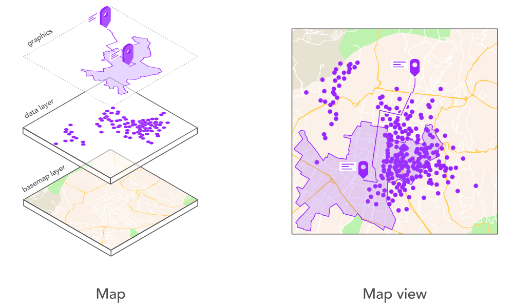

*上图: 地图和地图视图协同工作以显示图层和图形*

> 在3D情况下底图之下还有 [ground](https://developers.arcgis.com/javascript/latest/api-reference/esri-Map.html#ground) 表示地面的效果

### 地图

创建地图的一种方法是创建[`Map`](https://developers.arcgis.com/javascript/latest/api-reference/esri-Map.html)类的新实例，同时指定[底图](https://developers.arcgis.com/javascript/latest/api-reference/esri-Map.html#basemap)和可选的[图层集合](https://developers.arcgis.com/javascript/latest/layers-and-data/)

底图图层是地图中最重要的图层，它提供了地图的整体视觉上下文

一个特定的`Map`对象的底图可以用`basemap`属性来控制，这个属性可以是一个字符串或一个[`Basemap`](https://developers.arcgis.com/javascript/latest/api-reference/esri-Basemap.html)对象

- 常用属性:
  - basemap: 指定地图的底图
  - layers: 地图所有图层的集合 (将图层添加这个数组可以加载对应图层)

> [参数列表](https://developers.arcgis.com/javascript/latest/api-reference/esri-Map.html#properties-summary), [相关方法](https://developers.arcgis.com/javascript/latest/api-reference/esri-Map.html#methods-summary)

示例:

```js
// 引入 esri-loader 加载 ArcGIS API
import { loadModules } from "esri-loader";

// 引入 地图
const [ Map ] = await loadModules([ "esri/Map" ]);

// 新建地图
const map = new Map({
  // 底图设置
  basemap: "streets-vector",
  // layers: additionalLayers // 可选的其他层
});
```

### [网络地图](https://developers.arcgis.com/javascript/latest/api-reference/esri-WebMap.html)

创建地图的第二种方法是加载[web 地图](https://developers.arcgis.com/documentation/core-concepts/web-maps/)（对于 2D 地图）或[web 场景](https://developers.arcgis.com/documentation/core-concepts/web-scenes/)（对于 3D 地图）

Web 地图和 Web 场景是包含地图或场景设置的 JSON 结构包括底图、图层、图层样式、弹出窗口、图例、标签等的设置

它们通常与[ArcGIS Online 地图查看器](https://developers.arcgis.com/documentation/mapping-apis-and-services/maps/tutorials/tools/create-a-web-map/)或[ArcGIS Online 场景查看器](https://developers.arcgis.com/documentation/mapping-apis-and-services/maps/tutorials/tools/create-a-web-scene/)交互创建 [ArcGIS Online](https://www.arcgis.com/home/) 或 [ArcGIS Enterprise](https://enterprise.arcgis.com/en/portal/latest/administer/windows/what-is-portal-for-arcgis-.htm) 为它们分配一个唯一 ID 并将它们存储为[门户项目](https://developers.arcgis.com/javascript/latest/api-reference/esri-portal-PortalItem.html)

该[`WebMap`](https://developers.arcgis.com/javascript/latest/api-reference/esri-WebMap.html)和[`WebScene`](https://developers.arcgis.com/javascript/latest/api-reference/esri-WebScene.html)类可以通过其独特的ID被用来访问和负载Web地图和Web的场景

- 常用属性:
  - portalItem: 门户项目
    - id: 需要加载的门户项目ID
    - portal: 门户项目网址

可以在[地图查看器](https://www.arcgis.com/home/webmap/viewer.html?webmap=41281c51f9de45edaf1c8ed44bb10e30)和[场景查看器](https://www.arcgis.com/home/webscene/viewer.html?webscene=579f97b2f3b94d4a8e48a5f140a6639b)的 URL或项目页面中标识项目的 ID 

默认门户为 ArcGIS Online，URL 为`https://www.arcgis.com`

如果要使用 ArcGIS Enterprise，则必须指定门户 URL

```js
const webmap = new WebMap({
  portalItem: { // 自动转换为 new PortalItem()  
    id: "e691172598f04ea8881cd2a4adaa45ba", // 指定网络地图的ID
    portal: "https://www.arcgis.com"  // 设置门户 URL
  }
});
```

> [参数列表](https://developers.arcgis.com/javascript/latest/api-reference/esri-WebMap.html#properties-summary), [相关方法](https://developers.arcgis.com/javascript/latest/api-reference/esri-WebMap.html#methods-summary)

### [地图视图](https://developers.arcgis.com/documentation/mapping-apis-and-services/maps/maps-2d/#map-view)

地图视图用于显示地图图层并处理用户交互、弹出窗口、小部件和地图位置

```js
const view = new MapView({
    // 地图
    map: webmap,
    // DOM容器
    container: "viewDiv",
    // 视图的中心点, 经纬度单位
    center: [107.21265, 32.454617],
    // 地图缩放级别, 越小越远
    zoom: 4,
});
```

- 常见参数:
  - map: 地图对象
  - container: DOM容器的ID选择器字符串
  - center：显示地图视图的中心位置, 使用 经纬度或 x/y 坐标空间参考
  - zoom：地图的缩放比例, 越小越远
  - scale：表示视图中心的地图级别
  - rotation: 视图顺时针旋转的度数 
  - extent: 定义视图的显示范围
  - constraints: 限制MapView的缩放、缩放和旋转的约束
  - popup: 弹出的模板
  - ui: 地图的小部件

> [参数列表](https://developers.arcgis.com/javascript/latest/api-reference/esri-views-MapView.html#properties-summary), [相关方法](https://developers.arcgis.com/javascript/latest/api-reference/esri-views-MapView.html#methods-summary)

一个简单的网络地图例子:

```js
// 引入 esri-loader 加载 ArcGIS API
import { loadModules } from "esri-loader";
// 开发者个人密钥
import { myKeyAPI } from "../config";

// 引入 网络地图, 地图视图, 全局配置对象
const [WebMap, MapView, esriConfig] = await loadModules([
    "esri/WebMap",
    "esri/views/MapView",
    "esri/config",
]);
// 配置开发者的密钥
esriConfig.apiKey = myKeyAPI;

// 新建地图
const webmap = new WebMap({
    // 指定网络地图的ID
    portalItem: {
      id: "01abd28a6d7844028f498004b504ee76",
    },
});

// 新建地图视图
const view = new MapView({
    // 地图
    map: webmap,
    // DOM容器
    container: "viewDiv",
    // 视图的中心点, 经纬度单位
    center: [107.21265, 32.454617],
    // 地图缩放级别, 越小越远
    zoom: 4,
});

// 移除所有默认UI组件，除了属性(下边的文字)
view.ui.remove("attribution");

// css 去掉地图聚焦边框
.esri-view-surface--inset-outline:focus::after {
  outline: none !important;
}
```

### 3D视图场景

创建 3D 场景需要 [`SceneView`](https://developers.arcgis.com/javascript/latest/api-reference/esri-views-SceneView.html)模块, 

常见参数:

- map: 地图对象
- container: DOM容器的ID选择器字符串
- zoom：地图的缩放比例, 越小越远
- scale：表示视图中心的地图比例尺
- ground: 指定地面的表面属性 (只在3D情况下有效)
  - surfaceColor: 设置底图的颜色 (没有底图可用时，地面默认显示网格)
  - opacity: 地面的不透明度 (场景包含地下数据可以看到)
- camera: 设置相机位置
  - position
    - x: 视图的经度
    - y: 视图的维度
    - z: 视图的高度(米)
  - tilt: 设置相机视角向下投射的度数
  - heading: 相机正面的罗盘航向（以度为单位）
- viewingMode: 设置视图中的地图的可见部分
- constraints: 限制 SceneView的[相机倾斜](https://developers.arcgis.com/javascript/latest/api-reference/esri-Camera.html#tilt)和高度的约束
- popup: 弹出的模板
- ui: 地图的小部件

常见图层:

- [`ElevationLayer`](https://developers.arcgis.com/javascript/latest/api-reference/esri-layers-ElevationLayer.html):  可以自定义高程图, 需要添加至`map.ground.layers`生效
- [`SceneLayer`](https://developers.arcgis.com/javascript/latest/api-reference/esri-layers-SceneLayer.html): 专门为显示大量数据而设计, 支持 [Point](https://developers.arcgis.com/javascript/latest/api-reference/esri-geometry-Point.html) 和 3D Object
- [`IntegratedMeshLayer`](https://developers.arcgis.com/javascript/latest/api-reference/esri-layers-IntegratedMeshLayer.html): 可以用来表现真实的 3D 场景
- [`PointCloudLayer`](https://developers.arcgis.com/javascript/latest/api-reference/esri-layers-PointCloudLayer.html#constructors-summary): 在浏览器中创建点云数据的可视化, 点云数据如: [激光雷达数据](https://desktop.arcgis.com/en/arcmap/latest/manage-data/las-dataset/what-is-lidar-data-.htm)

> [参数列表](https://developers.arcgis.com/javascript/latest/api-reference/esri-views-SceneView.html#properties-summary), [相关方法](https://developers.arcgis.com/javascript/latest/api-reference/esri-views-SceneView.html#methods-summary)

简单的3D地图例子: 

```js
import { loadModules } from "esri-loader";
import { myKeyAPI } from "../config";
const [WebMap, SceneView, esriConfig] = await loadModules([
    "esri/WebMap",
    "esri/views/SceneView",
    "esri/config"
]);

esriConfig.apiKey = myKeyAPI;

const map = new WebMap({
    portalItem: { // 自动转换为 new PortalItem()
      id: "01abd28a6d7844028f498004b504ee76",
    },
});

// 新建 3D 视图  
const view = new SceneView({
    // 容器
    container: "viewDiv",
    // 地图 
    map: map,
    // 查看模式
    viewingMode: 'global', // global 球体 local 平面
    // 相机配置
    camera: {
      // 位置
      position: {
        x: 107.21265, // 经度
        y: 32.454617, // 维度
        z: 10000000, // 高度(米)
      },
      tilt: 0, // 视角度数
    },
});
```

## 视图的常用方法

### goTo

- **view.goTo(target, [options]) **`Promise`

[goTo](https://developers.arcgis.com/javascript/latest/api-reference/esri-views-MapView.html#goTo) 方法可以通过编程的方式改变视图的位置, 可以从一个地方 "飞" 到另一个地方

- target: 可以接受 **带有经纬度的数组** **Viewpoint**  [`Camera`](https://developers.arcgis.com/javascript/latest/api-reference/esri-Camera.html)  [`Geometry`](https://developers.arcgis.com/javascript/latest/api-reference/esri-geometry-Geometry.html) [`Graphic`](https://developers.arcgis.com/javascript/latest/api-reference/esri-Graphic.html)或[`Viewpoint`](https://developers.arcgis.com/javascript/latest/api-reference/esri-Viewpoint.html)对象
- options: 
  - animate: 视图是否有过渡, 如果设置为 false, 则直接忽略 duration 和 easing
  - duration: 动画的持续时间（毫秒）
  - easing:  动画的缓动函数, 如: 线性, 缓入, 缓出等

```js
view.goTo({                      
  target: { // 要去点的目标点
      center: [ -114, 39 ] 
  }, 
  zoom: 15
  { duration: 5000 } // 动画持续时间
);
```

### toMap 和 toScreen

- **view.toMap(screenPoint)** 

将给定的屏幕点转换为[地图点](https://developers.arcgis.com/javascript/latest/api-reference/esri-geometry-Point.html)。屏幕点表示相对于视图左上角的像素点

语法: **view.toScreen(point)**

将给定的[地图点](https://developers.arcgis.com/javascript/latest/api-reference/esri-geometry-Point.html)转换为屏幕点。屏幕点表示相对于视图左上角的像素点

### hisTask

- **view.hitTest (screenPoint, [options ])**
  - screenPoint: 单击视图的屏幕坐标（或本地鼠标事件）
  - options : 用于指定在 hitTest 中包含或排除的内容的选项

返回与指定屏幕坐标相交的每一层的最顶层要素

### when

- **view.when(callback, [errback])** `Promise`

view加载完成就会调用成功的回调, 否则就会调用失败的回调

### on

**view.on(type, modifiersOrHandler, [handler])** 

侦听 view 的[事件](https://developers.arcgis.com/javascript/latest/api-reference/esri-views-MapView.html#on), 返回一个事件对象

- type: 要侦听的[事件类型](https://developers.arcgis.com/javascript/latest/api-reference/esri-views-MapView.html#events-summary)

  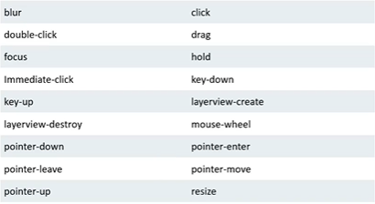

- modifiersOrHandler: 额外的事件修饰键

- handler: 事件的回调, 参数 event 就是 `事件对象`

#### remove

view.on 的返回值对象调用 remove 方法就可以解绑事件

### watch

- **view.watch(path, callback)**

监视实例上的属性更改, 这是[Accessor.watch()](https://developers.arcgis.com/javascript/latest/api-reference/esri-core-Accessor.html#watch)的别名

- path: 属性值字符串, 如 **"map.basemap.title"**, **"zoom"**
- callback: 属性改变时的回调, 有四个参数 `newValue, oldValue, propertyName, target`

同样会返回一个对象, 调用 `remove`方法即可取消监视

### widget

可以将[小部件](https://developers.arcgis.com/javascript/latest/api-reference/esri-widgets-Widget.html)和[HTML 元素](https://developer.mozilla.org/en-US/docs/Web/API/Element)添加到视图中。在`view.ui`提供了一个[DefaultUI](https://developers.arcgis.com/javascript/latest/api-reference/esri-views-ui-DefaultUI.html)其用于显示该视图的窗口小部件容器。

使用`view.ui.add`方法将其他小部件和 HTML 元素添加到视图中

#### 底图切换

点击切换底图需要使用, [BasemapToggle](https://developers.arcgis.com/javascript/latest/api-reference/esri-widgets-BasemapToggle.html) 模块

使用 `view.ui.add` 方法可以将指定部件添加到视图指定位置上

> [参数列表](https://developers.arcgis.com/javascript/latest/api-reference/esri-widgets-BasemapToggle.html#properties-summary), [相关方法](https://developers.arcgis.com/javascript/latest/api-reference/esri-widgets-BasemapToggle.html#methods-summary)

```c
// 引入 BasemapToggle 底图切换
const [BasemapGallery] = await loadModules([ "esri/widgets/BasemapToggle"]);

// 新建视图切换小部件
const basemapToggle = new BasemapToggle({
    view: view, // 视图
    nextBasemap: "streets-vector" // 下一张底图切换到 streets-vector
});

// 将小部件 basemapToggle 添加到 view 的右下方
view.ui.add(basemapToggle,"bottom-right");
```

#### 从图库中选择底图

可以使用[BasemapGallery](https://developers.arcgis.com/javascript/latest/api-reference/esri-widgets-BasemapGallery.html)模块来选择不同的底图

`query` 的 `source` 属性会自动搜索 “World Basemaps for Developers" 底图组

> [参数列表](https://developers.arcgis.com/javascript/latest/api-reference/esri-widgets-BasemapGallery.html#properties-summary), [相关方法](https://developers.arcgis.com/javascript/latest/api-reference/esri-widgets-BasemapGallery.html#methods-summary)

```js
// 引入 BasemapToggle 底图切换
const [BasemapGallery] = await loadModules([ "esri/widgets/BasemapGallery"]);

const basemapGallery = new BasemapGallery({
    view: view,
    source: {
      // 设置小部件显示的底图来源
      query: {
        // 搜索 World Basemaps for Developers 相关的库图组
        title: '"World Basemaps for Developers" AND owner:esri',
      },
    },
});

view.ui.add(basemapGallery, "top-right"); 
```

#### 自定义底图样式

创建和显示地图 或者 场景使用您自己的自定义样式、标签和颜色

创建带样式的底图图层，需要使用 ArcGIS 矢量切片样式编辑器

编辑器会将自定义的样式存储在地理信息系统

> 使用自定义地图需要开发者的[个人密钥](https://developers.arcgis.com/dashboard/)

进入 [**ArcGIS Online官网**](https://www.arcgis.com/home/index.html) - 地图 - 自定义地图 - 共享地图 - 所有人(公共) - 地址栏URL会生成一个ID

网络地图可以直接使用这个ID

### 显示弹出窗口

[PopupTemplate](https://developers.arcgis.com/javascript/latest/api-reference/esri-PopupTemplate.html#properties-summary)

#### 弹出文本

```js
const popupTrailheads = {
    "title": "我是标题",
    "content": "我是内容"
}

const trailheads = new FeatureLayer({
	url:"https://services3.arcgis.com/GVgbJbqm8hXASVYi/arcgis/rest/services/Trailheads_Styled/FeatureServer/0",
    outFields: ["TRL_NAME","CITY_JUR","X_STREET","PARKING","ELEV_FT"], // 获取URL服务中的对应字段(可以在 popupTemplate 对象的 fieldName 字段使用
    popupTemplate: popupTrailheads // 弹出模板
  });

map.add(trailheads);
```

#### 弹出图表

```js
const popupTrails = {
    title: "图表标题",
    content: [{
     type: "media", // 对于非文本类型始终应该为 media
      mediaInfos: [{ // 自动转换为 new MediaContent() 媒体信息
        type: "column-chart", // 类型
        caption: "", // 图表标题
        value: { // 定义图表的值
          fields: [ "ELEV_MIN","ELEV_MAX" ], // 需要显示的字段名称数组
          normalizeField: null, // 图表中的值会除以该值
          tooltipField: "我是个提示" // 同一图层或相关图层/表中字段的工具提示
          }
        }]
    }]
  }

const trails = new FeatureLayer({
    url: "https://services3.arcgis.com/GVgbJbqm8hXASVYi/arcgis/rest/services/Trails_Styled/FeatureServer/0",
    outFields: ["TRL_NAME","ELEV_GAIN"],
    popupTemplate: popupTrails
  });

  map.add(trails,0); // 指定添加到 map.layers 索引为0的图层
```

弹出表格设置`type`为`fields`并定义[`fieldInfos`](https://developers.arcgis.com/javascript/latest/api-reference/esri-PopupTemplate.html#fieldInfos)数组

> [参数列表](https://developers.arcgis.com/javascript/latest/api-reference/esri-PopupTemplate.html#properties-summary), [相关方法](https://developers.arcgis.com/javascript/latest/api-reference/esri-PopupTemplate.html#methods-summary)

- [ScaleBar](https://developers.arcgis.com/javascript/latest/api-reference/esri-widgets-ScaleBar.html): 例尺小部件在地图上或指定的 HTML 节点中显示比例尺

```js
const scaleBar = new ScaleBar({
    view: view,
});
view.ui.add(scaleBar, "bottom-left");
```

- [`Search`](https://developers.arcgis.com/javascript/latest/api-reference/esri-widgets-Search.html): 搜索小部件

```js
const search = new Search({
    view: view,
});
view.ui.add(search, "top-right");
```

## [图层](https://developers.arcgis.com/javascript/latest/api-reference/esri-layers-Layer.html)

图层是可在Map中使用的数据集合

图层数据可以在前端创建，或者由 ArcGIS Online 和 ArcGIS Enterprise 发布，或由外部服务器托管

图层通常用来管理和显示大量的要素(*FeatureLayer*)集合要素集合又分为结构化和非结构化如果要显示要素集合时，一般的做法是：

- 如果数据是结构化的，使用[`FeatureLayer`](https://developers.arcgis.com/javascript/latest/layers-and-data/#displaying-data-sources-with-a-featurelayer)来显示数据
- 如果是非结构化的，使用[`GraphicsLayer`](https://developers.arcgis.com/javascript/latest/layers-and-data/#displaying-graphics-with-a-graphicslayer)来显示数据

[参数列表](https://developers.arcgis.com/javascript/latest/api-reference/esri-layers-Layer.html#properties-summary), [相关方法](https://developers.arcgis.com/javascript/latest/api-reference/esri-layers-Layer.html#methods-summary)

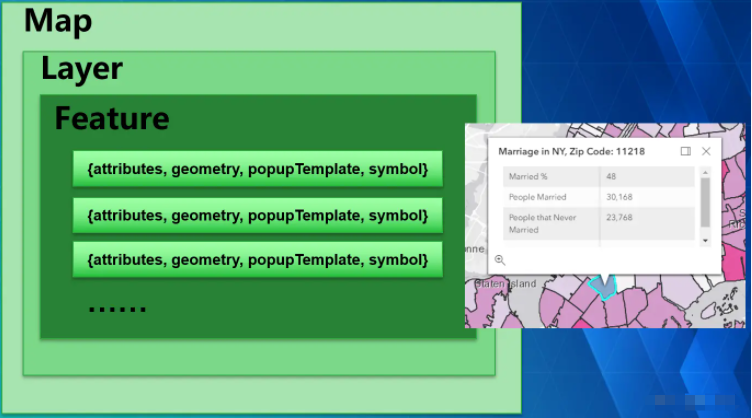

> Map 作为数据的容器，存放着各种不同类型的图层，图层又是由要素集合组成，每个要素都要包含`attributes`、`geometry`、`symbol` 属性才能正常显示，`popupTemplate`为可选属性，定义了要素弹出窗口的显示内容

### 常见图层类型

ArcGIS API for JavaScript有许多图层类，可用于访问和显示图层数据所有的图层类都继承于`Layer`使用哪种图层类取决于数据的格式和数据的存储位置每个图层类还带有不同的方法

常用图层类型如下：BaseTileLayer

| 类                                                           | 数据存储                                            | 使用范围                                                     |
| ------------------------------------------------------------ | --------------------------------------------------- | ------------------------------------------------------------ |
| [`FeatureLayer`](https://developers.arcgis.com/javascript/latest/api-reference/esri-layers-FeatureLayer.html) | 存储在 ArcGIS Enterprise 中的地理数据,              | 主要用于显示、查询、过滤和编辑大量的地理要素                 |
| [`GraphicsLayer`](https://developers.arcgis.com/javascript/latest/api-reference/esri-layers-GraphicsLayer.html) | 临时存储在内存中的地理数据                          | 主要用于在地图上以几何图形[`Graphic`](https://developers.arcgis.com/javascript/latest/api-reference/esri-Graphic.html)或文字的形式显示少数地理要素 |
| [`CSVLayer`](https://developers.arcgis.com/javascript/latest/api-reference/esri-layers-CSVLayer.html)/ <br/> [`KMLLayer`](https://developers.arcgis.com/javascript/latest/api-reference/esri-layers-KMLLayer.html)/[`GeoJSONLayer`](https://developers.arcgis.com/javascript/latest/api-reference/esri-layers-GeoJSONLayer.html) | 存储在可通过网络访问的外部文件中的地理数据          | 主要用于将外部文件存储的地理数据显示为一个图层               |
| [`TileLayer`](https://developers.arcgis.com/javascript/latest/api-reference/esri-layers-TileLayer.html)/[`VectorTileLayer`](https://developers.arcgis.com/javascript/latest/api-reference/esri-layers-VectorTileLayer.html) | 缓存服务从缓存中直接获取切片, 不需要动态缓存        | 主要用于在地理背景中显示底图和其他切片数据集                 |
| [`MapImageLayer`](https://developers.arcgis.com/javascript/latest/api-reference/esri-layers-MapImageLayer.html) | 存储在ArcGIS Server中并动态生成图片展示相应地理数据 | 主要用于展示由[地图服务](https://enterprise.arcgis.com/en/server/latest/publish-services/windows/what-is-a-map-service.htm)动态渲染的图层或者[子图层的](https://developers.arcgis.com/javascript/latest/api-reference/esri-layers-MapImageLayer.html#sublayers)数据 |
| [`ImageryLayer`](https://developers.arcgis.com/javascript/latest/api-reference/esri-layers-ImageryLayer.html) | 存储在 ArcGIS Enterprise 中的地理相关影像           | 主要用于展示卫星或其他影像数据                               |

#### FeatureLayer

[`FeatureLayer`](https://developers.arcgis.com/javascript/latest/api-reference/esri-layers-FeatureLayer.html)的数据源可以是内存中由应用程序加载的数据，也可以是从ArcGIS Enterprise上托管的REST API服务中请求的数据, 每个要素图层包含一个[Geometry](https://developers.arcgis.com/javascript/latest/api-reference/esri-geometry-Geometry.html) (几何图形)，以及一组 [attributes](https://developers.arcgis.com/javascript/latest/api-reference/esri-Graphic.html#attributes) (数据), 属性可以被[弹出窗口](https://developers.arcgis.com/javascript/latest/api-reference/esri-layers-FeatureLayer.html#popupTemplate)使用

```js
// 引用 url 创建 FeatureLayer
const fl = new FeatureLayer({
    url: "xxx"
});
map.add(fl);

// 引用 ArcGIS Online 或 ArcGIS Enterprise 的项目ID 创建 FeatureLayer
const f2 = new FeatureLayer({
  portalItem: {  // 自动转换为 new PortalItem()
    id: "8444e275037549c1acab02d2626daaee"
  }
});
map.add(f2); 
```

>  [ArcGIS Developers](https://developers.arcgis.com/documentation/mapping-apis-and-location-services/data-hosting/tutorials/tools/import-data-as-a-feature-layer/)和[ArcGIS Online](https://developers.arcgis.com/documentation/mapping-apis-and-location-services/data-hosting/tutorials/tools/create-a-new-feature-layer/)提供了用于导入 GeoJSON、Excel、CSV、文件地理数据库和 shapefile 等数据的工具。导入数据会在 ArcGIS Online 中创建一个可用作[服务器端数据源](https://developers.arcgis.com/javascript/latest/layers-and-data/#server-side-data-sources)的要素图层项目

##### 客户端构建图层

通常情况下，图层数据是从ArcGIS Enterprise上托管的REST API服务加载的，但也可以直接从内存中的要素集合中创建一个`FeatureLayer`

示例JSON数据：

```js
{
  "places": [
    {
      "id": 1,
      "address": "皇后大道东100号",
      "longitude": -118.24354,
      "latitude": 34.05389
    },
    {
      "id": 2,
      "address": "天安门广场999号",
      "longitude": -118.31966,
      "latitude": 34.13375
    }
  ]
}
```

从示例JSON数据中创建一个`FeatureLayer`需要以下步骤：

- 将`places`数组每一项转化为一个具有属性和几何的[`Graphic`](https://developers.arcgis.com/javascript/latest/api-reference/esri-Graphic.html)对象

- `Graphic`对象主要包含`attributes`和`geometry`属性

  | 属性                                                         | 类型                                                         | 描述                                                         |
  | ------------------------------------------------------------ | ------------------------------------------------------------ | ------------------------------------------------------------ |
  | [`attributes`](https://developers.arcgis.com/javascript/latest/api-reference/esri-Graphic.html#attributes) | `Object`                                                     | 用于存储有关要素的属性 名值对结构                            |
  | [`geometry`](https://developers.arcgis.com/javascript/latest/api-reference/esri-Graphic.html#geometry) | [`Geometry`](https://developers.arcgis.com/javascript/latest/api-reference/esri-geometry-Geometry.html) | 提供要素相对于[坐标系的位置](https://developers.arcgis.com/documentation/spatial-references/), 可选的值是[`Point`](https://developers.arcgis.com/javascript/latest/api-reference/esri-geometry-Point.html)[`Polygon`](https://developers.arcgis.com/javascript/latest/api-reference/esri-geometry-Polygon.html)和[`Polyline`](https://developers.arcgis.com/javascript/latest/api-reference/esri-geometry-Polyline.html)对象 |

  ```js
  const graphics = places.map( place => {
    return new Graphic({
      attributes: { // 一些数据
        ObjectId: place.id, // 唯一标识
        address: place.address // 地址
      },
      geometry: { // 几何对象
        longitude: place.longitude, // 经度
        latitude: place.latitude // 纬度
      }
    });
  });
  ```

  创建一个`FeatureLayer`对象，并指定`objectIdField` `fields` `renderer` 和`source`属性

  | 属性                                                         | 类型                                                         | 描述                                                         |
  | ------------------------------------------------------------ | ------------------------------------------------------------ | ------------------------------------------------------------ |
  | [`source`](https://developers.arcgis.com/javascript/latest/api-reference/esri-layers-FeatureLayer.html#source) | `Collection<Graphic>`                                        | 该[集合](https://developers.arcgis.com/javascript/latest/api-reference/esri-core-Collection.html)的[`Graphic`](https://developers.arcgis.com/javascript/latest/api-reference/esri-Graphic.html)对象用于创建功能层 |
  | [`renderer`](https://developers.arcgis.com/javascript/latest/api-reference/esri-layers-FeatureLayer.html#renderer) | [`Renderer`](https://developers.arcgis.com/javascript/latest/api-reference/esri-renderers-Renderer.html) | 属性用于设置要素的渲染器                                     |
  | [`objectIdField`](https://developers.arcgis.com/javascript/latest/api-reference/esri-layers-FeatureLayer.html#objectIdField) | `String`                                                     | 用于标识该要素的唯一地段名，可理解为指定哪个字段为`id`字段   |
  | [`fields`](https://developers.arcgis.com/javascript/latest/api-reference/esri-layers-FeatureLayer.html#fields) | [`Field[]`](https://developers.arcgis.com/javascript/latest/api-reference/esri-layers-support-Field.html) | 层中的字段数组 每个字段代表一个属性，用于指定要素含有哪些字段及值类型 |
  | [`outFields`](https://developers.arcgis.com/javascript/latest/api-reference/esri-layers-FeatureLayer.html#outFields) | `String[]`                                                   | 获取服务中的字段, 获取所有字段可以使用 `["*"]`               |
  | [`popupTemplate`](https://developers.arcgis.com/javascript/latest/api-reference/esri-layers-FeatureLayer.html#popupTemplate) | [`PopupTemplate`](https://developers.arcgis.com/javascript/latest/api-reference/esri-PopupTemplate.html) | 弹出窗口属性                                                 |
  
  ```js
  const featureLayer = new FeatureLayer({
    source: graphics,
    renderer: {
      type: "simple", // 自动转换为 new SimpleRenderer()                  
      symbol: {                          
        type: "simple-marker", // 自动转换为 new SimpleMarkerSymbol()
        color: "#102A44",
        outline: {                       
          color: "#598DD8",
          width: 2
        }
      }
    },
    objectIdField: "ObjectID", // 必须在 Graphic 对象创建时定义唯一标识 
    fields: [ // 层中的字段数组 每个字段代表一个属性，用于指定要素含有哪些字段及值类型
      { 
        name: "ObjectID",  // 字段的名称
        alias: "ObjectID", // 字段的显示名称
        type: "oid" // 字段的数据类型
      },
      {
        name: "address",
        alias: "address",
        type: "string"
      }
    ]
  });
  
  map.layers.add(featureLayer); // 添加到地图图层集合
  ```
  
  > 关于自动转换js对象可以见, [autocasting](https://developers.arcgis.com/javascript/latest/programming-patterns/#autocasting), 
  >
  > 目前，由于TypeScript的限制，Autocasting在非TypeScript应用程序中效果最好

一个类是否可以 Autocasting，查看每个类的文档。如果一个属性可以被 Autocasting，就会出现以下标识

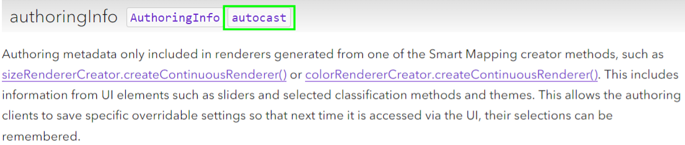

##### 服务端构建图层

`FeatureLayer`支持从REST API服务返回的要素集合生成图层这是访问和显示大型数据集的最有效方式

```js
var layer = new FeatureLayer({
    url:"https://services3.arcgis.com/GVgbJbqm8hXASVYi/arcgis/rest/services/Trailheads/FeatureServer/0"
});

map.layers.add(layer);
```

除了引用 URL 之外，还可以引用存储在 ArcGIS Online 或 ArcGIS Enterprise 中的图层项目

这些项目引用 REST API 服务，该服务存储层的数据以及其他配置选项

```js
const layer = new FeatureLayer({
  portalItem: {
    id: "883cedb8c9fe4524b64d47666ed234a7",
    portal: "https://www.arcgis.com"    // 默认值是：ArcGIS Online Portal
  }
});

map.layers.add(layer);
```

#### GraphicsLayer

主要是以 [Graphic](https://developers.arcgis.com/javascript/latest/api-reference/esri-Graphic.html) 图形 或 文字的形式 显示要素

| 属性                                                         | 类型                                                         | 描述                                                         |
| ------------------------------------------------------------ | ------------------------------------------------------------ | ------------------------------------------------------------ |
| [`graphics`](https://developers.arcgis.com/javascript/latest/api-reference/esri-layers-GraphicsLayer.html#graphics) | [`Collection<Graphic>`](https://developers.arcgis.com/javascript/latest/api-reference/esri-core-Collection.html) | 图层中的[几何图形](https://developers.arcgis.com/javascript/latest/api-reference/esri-Graphic.html)集合 |

- `graphicsLayer.add(graphic)` 添加图像到图层集合 [graphics](https://developers.arcgis.com/javascript/latest/api-reference/esri-layers-GraphicsLayer.html#graphics) 中(只能添加一个)
- `graphicsLayer.addMany([graphic1, graphic2])`添加一组图像到图层集合 [graphics](https://developers.arcgis.com/javascript/latest/api-reference/esri-layers-GraphicsLayer.html#graphics) 中

```js
 const point = { 
    type: "point", // 自动转换为 new Point()
    longitude: -118.80657463861,
    latitude: 34.0005930608889
 };
 const simpleMarkerSymbol = {
    type: "simple-marker", // 自动转换为 new SimpleMarkerSymbol()
    color: [226, 119, 40],  // 颜色
    outline: {
        color: [255, 255, 255], // 边框颜色
        width: 1 // 边框宽度
    }
 };

 const pointGraphic = new Graphic({
    geometry: point, // 设置的图形位置也是一个几何图形对象
    symbol: simpleMarkerSymbol // 图形的符号对象
 });

const polygon = {
    type: "polygon", // 自动转换为 new Polygon()
    rings: [ // 每个点的经纬度(五边形) 
        [-118.818984489994, 34.0137559967283], 
        [-118.806796597377, 34.0215816298725], 
        [-118.791432890735, 34.0163883241613], 
        [-118.79596686535, 34.008564864635],  
        [-118.808558110679, 34.0035027131376]  
    ]
 };

 const simpleFillSymbol = {
    type: "simple-fill", // 自动转换为 new SimpleFillSymbol()
    color: [227, 139, 79, 0.8], 
    outline: {
        color: [255, 255, 255],
        width: 1
    }
 };

 const polygonGraphic = new Graphic({
    geometry: polygon,
    symbol: simpleFillSymbol,
    attributes: { // 与图形关联的属性 名值对结构 
      Name: "我是标题",
      Description: "我是描述字段"
    },
    popupTemplate: { // 弹出窗口
      title: "{Name}", // 弹出窗口标题 使用{xxx}语法可以访问 attributes 属性里的值
      // title: "我是标题",
      content: "{Description}" // 弹出窗口内容
    }
 });


 // 添加到 图形集合中 
 graphicsLayer.addMany([pointGraphic,polygonGraphic]);
 // or
 graphicsLayer.graphics.push(pointGraphic,polygonGraphic); // 一样的效果
```

> 很多图层对象里都会有一个图层集合,  有类似`add`方法可以添加到图层到集合上, 其实使用`push`方法也是可以的

> [参数列表](https://developers.arcgis.com/javascript/latest/api-reference/esri-layers-GraphicsLayer.html#properties-summary), [相关方法](https://developers.arcgis.com/javascript/latest/api-reference/esri-layers-GraphicsLayer.html#methods-summary)

#### REST API 服务

在 REST API 中所有的内容, 图层, 数据都是一个URL, 如下是它们之间通信的工作流程:

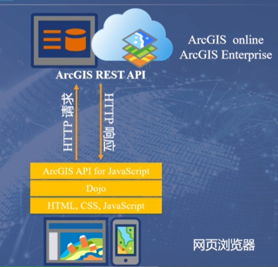


## 显示图像

图形通常用于向地图添加具有不同几何形状的文本、形状和图像。创建图形层的最简单方法是创建[`Graphic`](https://developers.arcgis.com/javascript/latest/api-reference/esri-Graphic.html)对象传递给[`GraphicsLayer`](https://developers.arcgis.com/javascript/latest/api-reference/esri-layers-GraphicsLayer.html#properties-summary)对象的`graphics`属性, 以数组的形式

每个`Graphic`类都包含以下属性：

| 属性                                                         | 类型                                                         | 描述                                                         |
| ------------------------------------------------------------ | ------------------------------------------------------------ | ------------------------------------------------------------ |
| [`attributes`](https://developers.arcgis.com/javascript/latest/api-reference/esri-Graphic.html#attributes) | `Object`                                                     | 用于存储有关要素的地理信息的键值对                           |
| [`geometry`](https://developers.arcgis.com/javascript/latest/api-reference/esri-Graphic.html#geometry) | [`Geometry`](https://developers.arcgis.com/javascript/latest/api-reference/esri-geometry-Geometry.html) | 提供的位置相对于一个特征[的坐标系](https://developers.arcgis.com/documentation/spatial-references/)  可选的值是[`Point`](https://developers.arcgis.com/javascript/latest/api-reference/esri-geometry-Point.html)[`Polygon`](https://developers.arcgis.com/javascript/latest/api-reference/esri-geometry-Polygon.html)和[`Polyline`](https://developers.arcgis.com/javascript/latest/api-reference/esri-geometry-Polyline.html)对象 |
| [`popupTemplate`](https://developers.arcgis.com/javascript/latest/api-reference/esri-Graphic.html#popupTemplate) | [`PopupTemplate`](https://developers.arcgis.com/javascript/latest/api-reference/esri-PopupTemplate.html) | 图形的弹出模板                                               |
| [`symbol`](https://developers.arcgis.com/javascript/latest/api-reference/esri-Graphic.html#symbol) | [`Symbol`](https://developers.arcgis.com/javascript/latest/api-reference/esri-symbols-Symbol.html) | 定义图形在图层中的渲染方式                                   |

```js
const pointGraphic = new Graphic({
    attributes: { // 相关信息
      name: "张三", 
      address: "广东广州",
    },
    geometry: { // 自动转换 new Point() 
      type: "point", // 地图标点 
      longitude: 113.27, // 经度
      latitude: 23.13, // 维度
    },
    symbol: { // 自动转换 new SimpleMarkerSymbol() 
      type: "simple-marker", // 标记符号
      color: [226, 119, 40], // 颜色
      size: 10, // 大小
      style: 'triangle', // 符号类型
      outline: {  // 自动转换为 SimpleLineSymbol()
        color: [255, 255, 255], // 边框色
        width: 1, // 边框宽度
      },
    },
    popupTemplate: { // 自动转换为 new PopupTemplate()
      title: "弹出模板的标题", // 点击标记弹框标题
      content: [
        {
          type: "fields",
          fieldInfos: [ // 弹出窗口显示的所有字段相关
            {
              fieldName: "name", // 对应字段 name 的数据
              label: "Name", // 显示的标签名
              visible: true, // 是否可见
            },
            {
              fieldName: "address", // 对应字段 address 的数据
              label: "Address", // 显示的标签名
              visible: true, // 是否可见
            },
          ],
        },
      ],
    },
  });

  // 构造 GraphicsLayer 时添加图形 pointGraphic
  const graphicsLayer = new GraphicsLayer({ 
    graphics: [pointGraphic], 
  });

  map.layers.add(graphicsLayer);
```

### 外部数据源图层介绍

外部数据源的数据和文件是由`Layer`类的不同子类支持的包括用于处理外部文件（如`CSV`或`GeoJSON`文件）或加载外部地图（如GeoQ，高德，Bing Maps）的特定类型的层

常见的外部数据源图层有以下几种：

| 子类                                                         | 数据源                                                       | 数据类型                   | 特征                                                 | 限制                                                         |
| ------------------------------------------------------------ | ------------------------------------------------------------ | -------------------------- | ---------------------------------------------------- | ------------------------------------------------------------ |
| [`CSVLayer`](https://developers.arcgis.com/javascript/latest/api-reference/esri-layers-CSVLayer.html) | CSV 文件                                                     | 矢量图形为点               | 客户端地理处理、弹出模板、带有 2D 和 3D 符号的渲染器 | 根据功能的数量，可能需要大量下载                             |
| [`GeoJSONLayer`](https://developers.arcgis.com/javascript/latest/api-reference/esri-layers-GeoJSONLayer.html) | GeoJSON 文件                                                 | 矢量图形为点、折线和多边形 | 从[GeoJSON](http://geojson.org/)数据创建图层         | 每个 GeoJSON 图层只能接受一个单一几何类型 , 数据必须符合[RFC 7946 规范](https://tools.ietf.org/html/rfc7946) |
| [`OGCFeatureLayer`](https://developers.arcgis.com/javascript/latest/api-reference/esri-layers-OGCFeatureLayer.html) | [OGC API - 功能](https://www.opengeospatial.org/standards/ogcapi-features) | 点、折线、多边形           | 渲染器、标签、弹出窗口                               | 数据必须符合 RFC 7946 规范，该规范指出坐标在 SpatialReference WGS84 中 |
| [`WFSLayer`](https://developers.arcgis.com/javascript/latest/api-reference/esri-layers-WFSLayer.html) | WFS 服务                                                     | 点、多点、折线、多边形     | 渲染器、标签、弹出窗口                               | 数据必须是 GeoJSON 格式，仅支持 2.0.0 版本                   |
| [`WMSLayer`](https://developers.arcgis.com/javascript/latest/api-reference/esri-layers-WMSLayer.html) | WFS Service 服务                                             | 服务a图像                  | OGC规范                                              | 不适用                                                       |
| [`WMTSLayer`](https://developers.arcgis.com/javascript/latest/api-reference/esri-layers-WMTSLayer.html) | WMTS 服务                                                    | 切片图像                   | OGC规范                                              | 不适用                                                       |
| [`OpenStreetMapLayer`](https://developers.arcgis.com/javascript/latest/api-reference/esri-layers-OpenStreetMapLayer.html) | OpenStreetMap 服务                                           | 切片图像                   | 显示 OpenStreetMap 的切片地图                        | 不适用                                                       |

以上每个图层在初始化的时候都需要不同的属性，请参考每个图层类型[官方文档](https://developers.arcgis.com/javascript/latest/layers-and-data/#working-with-external-data-sources)了解更多

*创建CSVLayer的示例：*

```js
const Layer = new CSVLayer({
  url: "https://earthquake.usgs.gov/earthquakes/feed/v1.0/summary/2.5_week.csv",
  copyright: "USGS Earthquakes", // 版权信息
  latitudeField: "latitude", // 默认为“纬度”
  longitudeField: "longitude" // 默认为“经度”
});

// 将图层添加到图层集合上
map.add(layer);
// or
// 将图层添加到图层集合的末尾
map.layers.push(layer);
```

## ArcGIS Server服务介绍

[`MapImageLayer`](https://developers.arcgis.com/javascript/latest/api-reference/esri-layers-MapImageLayer.html)用于显示ArcGIS Enterprise发布的 [Map Service](https://developers.arcgis.com/rest/services-reference/enterprise/map-service.htm)Map Service通常包含多个子图层和复杂的制图地图服务将数据渲染成服务器端的图像，并在客户端显示

```js
const layer = new MapImageLayer({
    url: "https://sampleserver6.arcgisonline.com/arcgis/rest/services/Census/MapServer",
});
// 使用add方法添加层
map.add(layer);
```

[`ImageryLayer`](https://developers.arcgis.com/javascript/latest/api-reference/esri-layers-ImageryLayer.html)用于显示ArcGIS Enterprise发布的 [Image Service](https://developers.arcgis.com/rest/services-reference/enterprise/image-service.htm) 的图像或其他栅格数据

```js
const layer = new ImageryLayer({
      url: "https://sampleserver6.arcgisonline.com/arcgis/rest/services/NLCDLandCover2001/ImageServer",
      format: "jpgpng" // 服务器导出为JPG或PNG格式
});

const map = new Map({
      basemap: "gray-vector",
      layers: [layer] // 添加 ImageryLayer 层
});
```

## 图层和图层视图

当图层被添加到[MapView](https://developers.arcgis.com/javascript/latest/api-reference/esri-views-MapView.html)或[SceneView](https://developers.arcgis.com/javascript/latest/api-reference/esri-views-SceneView.html)时，会创建一个[LayerView](https://developers.arcgis.com/javascript/latest/api-reference/esri-views-layers-LayerView.html)。该[LayerView](https://developers.arcgis.com/javascript/latest/api-reference/esri-views-layers-LayerView.html)负责视图渲染功能

图层视图还提供了方法和属性，使开发人员能够在客户端视图中查询、过滤和突出显示图形

#### 服务器端层

**图层**: [FeatureLayer](https://developers.arcgis.com/javascript/latest/api-reference/esri-layers-FeatureLayer.html) , [SceneLayer](https://developers.arcgis.com/javascript/latest/api-reference/esri-layers-SceneLayer.html)和[StreamLayer](https://developers.arcgis.com/javascript/latest/api-reference/esri-layers-StreamLayer.html)

**初始化**: 通过将其 **url** 属性设置为指向服务器端功能、场景或流服务来创建

```js
const layer = new FeatureLayer({
    url: “service url”
  });
view.map.add(layer);
```

**初始特征获取**: 该层仅从服务器获取所需的特征

**层视图初始化**: FeatureLayer、SceneLayer 或 StreamLayer 被初始化，包含可用于绘制的特征

```js
view.whenLayerView(layer).then(function(layerView){
  // 可以访问 layerView
  // 表示视图中图层的对象
});
```

**后续网络请求**: 根据需要**会**进行后续的网络请求

#### 客户端层

**图层**: [CSVLayer](https://developers.arcgis.com/javascript/latest/api-reference/esri-layers-CSVLayer.html)、[GeoJSONLayer](https://developers.arcgis.com/javascript/latest/api-reference/esri-layers-GeoJSONLayer.html)和[客户端 FeatureLayer](https://developers.arcgis.com/javascript/latest/api-reference/esri-layers-FeatureLayer.html)

**初始化**: **CSVLayer** 和 **GeoJSONLayer** 是通过设置它们的 **url** 属性来创建的。**客户端 FeatureLayer** 是通过设置其 **source** 属性来创建的

```js
const layer = new CSVLayer({
    url: "csv file url"
  });
view.map.add(layer);
```

**初始特征获取**: 该层在初始化时获取其所有功能并将其存储在客户端上

**层视图初始化**: CSVLayer，GeoJSONLayer，或FeatureLayer被初始化的含有可用于绘图功能

```js
view.whenLayerView(layer).then(function(layerView){
  // 可以访问 layerView
  // 表示视图中图层的对象
});
```

**后续网络请求**: 后续**不会**有网络请求, 所有功能都是在加载时获取的

## 查询过滤

#### [查询](https://developers.arcgis.com/javascript/latest/api-reference/esri-rest-support-Query.html)

共有三种类型的查询：属性、空间和统计, 可以在图层或其图层视图上进行查询

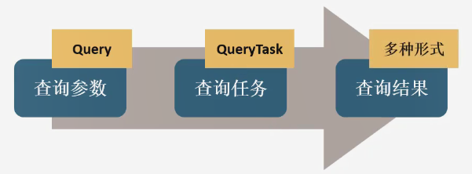

- 属性查询: 
  - [`Query.where`](https://developers.arcgis.com/javascript/latest/api-reference/esri-rest-support-Query.html#where)相当于 `SQL where 子句`
  - [`Query.text`](https://developers.arcgis.com/javascript/latest/api-reference/esri-rest-support-Query.html#text) 相当于 `SQL like 子句` 
    - 只能查询服务发布目录的  **Display Field** 字段
- 空间查询:
  - 通过 [`Query.geometry`](https://developers.arcgis.com/javascript/latest/api-reference/esri-rest-support-Query.html#geometry)+[`Query.spatialRelationship`](https://developers.arcgis.com/javascript/latest/api-reference/esri-rest-support-Query.html#spatialRelationship) 指定查询条件
  - 可选参数: [distance](https://developers.arcgis.com/javascript/latest/api-reference/esri-rest-support-Query.html#distance)(距离) 和 [units](https://developers.arcgis.com/javascript/latest/api-reference/esri-rest-support-Query.html#units)(单位)
- 统计查询: 
  - 通过 [`Query.outStatistics`](https://developers.arcgis.com/javascript/latest/api-reference/esri-rest-support-Query.html#outStatistics)指定条件, 该参数需要一组[StatisticDefinition](https://developers.arcgis.com/javascript/latest/api-reference/esri-rest-support-StatisticDefinition.html)对象

> `QueryTask` 4.20版本开始弃用改用 `Query`

#### 查询图层特征

#### 服务器端和客户端查询

有一些图层是有查询方法调用并传入[查询参数](http://localhost:8888/javascript/4.21/api-reference/esri-rest-support-Query.html)

当对应的`query...`在[服务器端层](https://developers.arcgis.com/javascript/latest/query-filter/#server-side-and-client-side-layers)调用方法时，会发出服务器端查询。针对服务中可用的所有功能执行查询

```js
(Feature|Scene)Layer // 对应图层实例
  .queryFeatures(options) // 查询所有特征并返回一个特征集
  .queryExtent(options) // 查询所有特征返回满足查询的特征范围
  .queryFeatureCount(options) // 查询所有特征并返回特征计数
  .queryObjectIds(options) // 查询所有特征并返回 objectIds 特征数组
```

当对应的`query...`在[客户端层](https://developers.arcgis.com/javascript/latest/query-filter/#server-side-and-client-side-layers)或任何[层视图](https://developers.arcgis.com/javascript/latest/query-filter/#layer-and-layerview)上调用方法时，会发出客户端查询。针对图层或图层视图中的所有可用要素执行查询

```js
(Feature|CSV|GeoJSON)Layer  // 对应图层实例
(Feature|CSV|GeoJSON|Scene|Stream)LayerView // 对应图层视图实例
  .queryFeatures(options) // 查询特征并返回一个特征集
  .queryExtent(options) // 查询功能并返回满足查询的功能范围
  .queryFeatureCount(options) // 查询功能并返回功能计数
  .queryObjectIds(options) // 查询功能并返回 ObjectIds 功能数组
```

#### 客户端查询和服务器端查询的区别

| 重要指标         | 服务器端查询                                                 | 客户端查询                                                   |
| ---------------- | ------------------------------------------------------------ | ------------------------------------------------------------ |
| 速度和响应能力   | **不适**用于[服务器端层](https://developers.arcgis.com/javascript/latest/query-filter/#server-side-and-client-side-layers)<br/>正在发出网络请求，因此与客户端查询相比速度较慢 | **是**的, [客户端层](https://developers.arcgis.com/javascript/latest/query-filter/#server-side-and-client-side-layers)和[层视图](https://developers.arcgis.com/javascript/latest/query-filter/#layer-and-layerview)。 |
| 几何精度         | **是的, **几何精度得以保留<br/>在使用精确几何体获得精确结果很重要时使用 | **是的**，[客户端层](https://developers.arcgis.com/javascript/latest/query-filter/#server-side-and-client-side-layers)可以查询用户提供的几何图形<br/>**不适**用于图层视图，因为几何图形已针对绘图进行了概括, 结果可能不精确并且会随着用户放大地图而发生变化<br/>示例包括计算选定几何图形的面积，或获取多边形中包含的点 |
| 必须查询每个功能 | **是的, **使用服务器端查询确保查询针对所有功能运行<br/>当您需要获得超过最大记录数时，必须完成分页查询 | **是的，**适用于 CSVLayer、GeoJSONLayer 和客户端 FeatureLayer<br/>对于 layerViews **没有**，因为查询只会针对客户端可用的功能运行 |

#### 查询的注意点: 

- 在层初始化时将字段添加到层的[outFields](https://developers.arcgis.com/javascript/latest/api-reference/esri-layers-FeatureLayer.html#outFields)以确保您可以在客户端访问这些字段。默认情况下，图层视图仅获取图层渲染、标签、高程信息所必需的字段
- 如果您在应用加载时查询 layerView，那么就**必须**等到 layerView 的[更新](https://developers.arcgis.com/javascript/latest/api-reference/esri-views-layers-FeatureLayerView.html#updating)属性变为`false`确保使用 layerView 加载功能。如果查询在初始化时只需要运行一次，可以使用[watchUtils.whenFalseOnce](https://developers.arcgis.com/javascript/latest/api-reference/esri-core-watchUtils.html)。
- 如果每次视图范围更改时都查询 layerView，则**必须**等到 layerView 的[更新](https://developers.arcgis.com/javascript/latest/api-reference/esri-views-layers-FeatureLayerView.html#updating)属性变为`false`确保 layerView 完成获取该范围的要素。
- 客户端属性值区分大小写

### 过滤

过滤器会影响图层中要素的可用性或图层视图中要素的可见性

满足过滤器要求的特征将显示在视图中, 过滤可以在服务器端或客户端进行

#### 服务器端和客户端过滤

本节中涵盖的所有图层都有一个[definitionExpression](https://developers.arcgis.com/javascript/latest/api-reference/?search=definitionexpression)属性

`definitionExpression`在[服务器端层](https://developers.arcgis.com/javascript/latest/query-filter/#server-side-and-client-side-layers)设置时会触发网络请求以获取满足该表达式的特征

当数据集很大并且不想将所有要素都交给客户端进行分析时，设置定义表达式非常有用

如果将图层添加到地图后再设置定义表达式，则视图将会自动刷新并重新显示以满足定义表达式的特征

```js
// 从服务中获取满足 type = 'name' 的所有特征
(Feature|Scene|Stream)Layer
  .definitionExpression = "type = 'name'";
```

在[客户端层](https://developers.arcgis.com/javascript/latest/query-filter/#server-side-and-client-side-layers)`definitionExpression`中将只会显示满足定义表达式的要素

```js
// 仅显示 age > 18 的图层中的要素
(Feature|CSV|GeoJSON)Layer
  .definitionExpression = "age > 18";
```

如果图层具有定义表达式，则所有 layerView 查询和过滤器都将遵循`definitionExpression`, 这意味着只有满

足图层定义表达式的要素才会被图层视图的查询和过滤操作评估


可以通过`filter`在[LayerView](https://developers.arcgis.com/javascript/latest/query-filter/#layer-and-layerview)上设置对可用于绘图的功能应用过滤器。所述[FeatureFilter](https://developers.arcgis.com/javascript/latest/api-reference/esri-views-layers-support-FeatureFilter.html)允许您显示满足

在层视图过滤器的要求的功能。由于过滤器应用于图层视图，因此这会在客户端针对可用于绘制的功能发生

```js
(Feature|CSV|GeoJSON|Scene|Stream)LayerView
   // 仅显示满足图层中要求的要素
  .filter = {
    where: "age > 35";
  }
```

可以根据[属性](https://developers.arcgis.com/javascript/latest/api-reference/esri-views-layers-support-FeatureFilter.html#where)、[时间](https://developers.arcgis.com/javascript/latest/api-reference/esri-views-layers-support-FeatureFilter.html#timeExtent)和/或[几何体](https://developers.arcgis.com/javascript/latest/api-reference/esri-views-layers-support-FeatureFilter.html#geometry)应用过滤器。使用`featureFilter`显示满足要求的功能子集[示例](https://developers.arcgis.com/javascript/latest/sample-code/?search=FeatureFilter)

### 定位

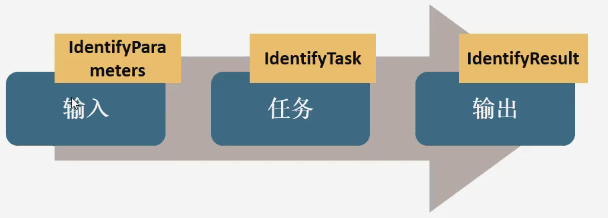

- [IdentifyParameters](https://developers.arcgis.com/javascript/latest/api-reference/esri-rest-support-IdentifyParameters.html) 对象可以为定位操作设置多个属性, [参数列表](https://developers.arcgis.com/javascript/latest/api-reference/esri-rest-support-IdentifyParameters.html#properties-summary)

- IdentifyTask 4.20版本开始弃用了改用 [identify](https://developers.arcgis.com/javascript/latest/api-reference/esri-rest-identify.html) 对象
- 查询返回的结果是[IdentifyResult](https://developers.arcgis.com/javascript/latest/api-reference/esri-rest-support-IdentifyResult.html) 对象实例

### 查找

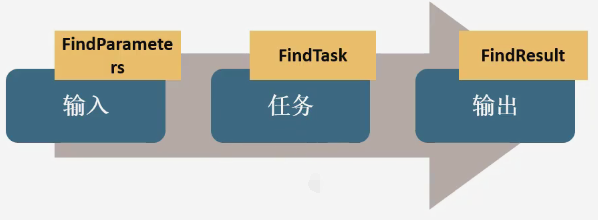

- [FindParameters](https://developers.arcgis.com/javascript/latest/api-reference/esri-rest-support-FindParameters.html) 对象可以为定位操作设置多个属性, [参数列表](https://developers.arcgis.com/javascript/latest/api-reference/esri-rest-support-FindParameters.html#properties-summary)

- FindTask 4.20版本开始弃用了改用 [Find](https://developers.arcgis.com/javascript/latest/api-reference/esri-rest-find.html) 对象
- 查询返回的结果是 [FindResult](https://developers.arcgis.com/javascript/latest/api-reference/esri-rest-support-FindResult.html) 对象实例

### Query Identify 和 Find 比较

|                      | Query | Identify | Find |
| :------------------: | :---: | :------: | :--: |
|   是否支持属性查询   |  是   |    否    |  是  |
|   是否支持空间查询   |  是   |    是    |  否  |
|      查询图层数      |   1   |    ≥1    |  ≥1  |
| 是否支持指定返回字段 |  是   |    否    |  否  |

### 地理处理任务

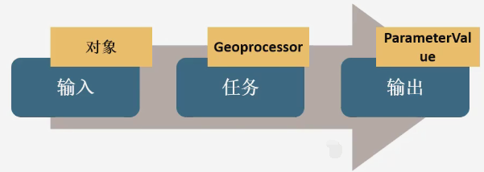

设置地理处理任务需要知道三个参数, **地理处理服务URL, 输入和输出参数, 同步还是异步**

- 当执行类型为同步时使用 [execute](https://developers.arcgis.com/javascript/latest/api-reference/esri-rest-geoprocessor.html#execute) 方法
- 当执行类型为异步时使用 [submitJob](https://developers.arcgis.com/javascript/latest/api-reference/esri-rest-geoprocessor.html#submitJob) 方法

## ArcGis API的编程模式

### 加载类

使用`AMDmodule` 或者 `CS6module`将 ArcGIS API [加载](https://developers.arcgis.com/javascript/latest/tooling-intro/)到应用程序中

[查看文档](https://developers.arcgis.com/javascript/latest/api-reference/)找到需要使用的 API 类的完整命名空间

> 并非每个模块都需要加载, 有些模块可以使用[自动转换](https://developers.arcgis.com/javascript/latest/programming-patterns/#autocasting)从构造函数中初始化许多类

### 构造函数

ArcGIS API for JavaScript中的所有类都有一个构造函数，所有属性都可以通过向构造函数传递参数来设置

```js
const map = new Map({
  basemap: "topo-vector"
});

const view = new MapView({
  map: map,
  container: "viewDiv",
  center: [ -122, 38 ],
  scale: 5
});
```

另外，对象的属性可以直接使用[setters](https://developers.arcgis.com/javascript/latest/programming-patterns/#setters)来指定

```js
const map = new Map();
const view = new MapView();

map.basemap = "topo-vector";           // 使用 .xxx 的形式赋值

// or

const viewProps = {                    // 定义一个完整的对象
  container: "viewDiv",
  map: map,
  scale: 5000,
  center: [ -122, 38 ]
};
view.set(viewProps);                   // 使用 set 方法直接赋值整个对象
```

ArcGIS for JavaScript 中比较重要的类如下:

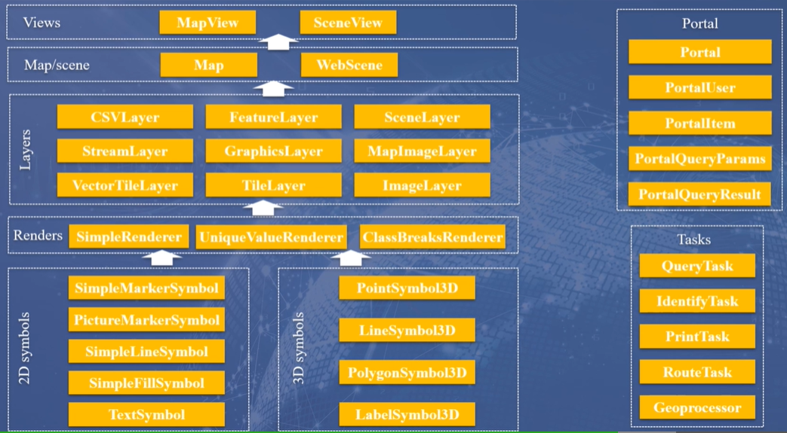

### 特性

ArcGIS API for JavaScript 支持以简单、一致的方式获取、设置和查看类的所有属性。

许多 API 类是[`Accessor`](https://developers.arcgis.com/javascript/latest/api-reference/esri-core-Accessor.html)该类的子类，它定义了以下方法:

| 方法名称                                                     | 返回类型                                                     | 描述                                                         |
| ------------------------------------------------------------ | ------------------------------------------------------------ | ------------------------------------------------------------ |
| [`get(propertyName)`](https://developers.arcgis.com/javascript/latest/api-reference/esri-core-Accessor.html#get) | 因属性而异                                                   | 获取具有名称的属性的值 `propertyName`                        |
| [`set(propertyFields)`](https://developers.arcgis.com/javascript/latest/api-reference/esri-core-Accessor.html#set) | 没有返回值                                                   | 对于每个`key`/ `value`配对`tyFields`，此方法将名称`key`的属性值设置为`value` |
| [`watch(propertyName, callback)`](https://developers.arcgis.com/javascript/latest/api-reference/esri-core-Accessor.html#watch) | [`WatchHandle`](https://developers.arcgis.com/javascript/latest/api-reference/esri-core-Accessor.html#WatchHandle) | `callback`每当具有名称的属性的值`propertyName`更改时调用回调函数 |

#### getters

[`get`](https://developers.arcgis.com/javascript/latest/api-reference/esri-core-Accessor.html#get)方法返回一个属性的值，这个方法是一个快捷方法，因为如果不使用`get()`，要返回嵌套属性的值，例如，要返回一个`Map`对象的属性`basemap`的标题，需要一个`if`语句来检查`basemap`是否未定义或为空

```js
const basemapTitle = null;
if (map.basemap) {                     // Make sure `map.basemap` exists
  basemapTitle = map.basemap.title;
}
```

`get` 方法不需要 `if` 语句，如果 `map.basemap` 存在，则返回 `map.basemap.title` 的值，否则返回 `null`

```js
const basemapTitle = map.get("basemap.title");
```

> 注意: 也可以采用可选链(`?.`)操作规避这类问题，但是需要考虑浏览器兼容性
>
> ```js
> const basemapTitle = map?.basemap.title;
> ```

#### setters

可以直接设置属性的值

```js
view.center = [ -100, 40 ];
view.zoom = 6;
map.basemap = "oceans";
```

当需要更改多个属性值时,[`set()`](https://developers.arcgis.com/javascript/latest/api-reference/esri-core-Accessor.html#set)可以传递一个带有属性名和新值的对象

```js
const newViewProperties = { 
  center: [ -100, 40 ],
  zoom: 6
};

view.set(newViewProperties);
```

#### watch

使用 [`watch()`](https://developers.arcgis.com/javascript/latest/api-reference/esri-core-Accessor.html#watch) 来监听属性的变化，它带有两个参数：作为字符串的属性名称，当属性值改变时触发的回调函数

`watch()`返回一个`WatchHandle`实例

代码示例监听一个`Map`对象的`basemap.title`属性，每当底图标题发生改变时，就调用`titleChangeCallback`函数

```js
const map = new Map({
  basemap: "streets-vector"
});

function titleChangeCallback (newValue, oldValue, property, object) {
  console.log("New value: ", newValue,
              "<br>Old value: ", oldValue,
              "<br>Watched property: ", property,
              "<br>Watched object: ", object); // 记录映射对象
};

const handle = map.watch('basemap.title', titleChangeCallback);
```

可以在 `WatchHandle` 对象上调用 `remove` 方法来停止监听

```js
handle.remove();
```

并非所有的属性都可以被监听, 例如[collections](https://developers.arcgis.com/javascript/latest/api-reference/esri-core-Collection.html), 注册一个事件处理程序，以便在一个集合发生[change](https://developers.arcgis.com/javascript/latest/api-reference/esri-core-Collection.html#event-change)时可以被监听

> `FeatureLayer.source`和`GraphicsLayer.graphics`属性都是集合，使用`on()`而不是`watch()`来监听这些属性的变化

### 异步数据

ArcGIS中支持 `Promise`

```js
require([
  "esri/tasks/GeometryService",
  "esri/tasks/support/ProjectParameters",
  ], (GeometryService, ProjectParameters) => {
    const geoService = new GeometryService( "https://sampleserver6.arcgisonline.com/arcgis/rest/services/Utilities/Geometry/GeometryServer" );
    const projectParams = new ProjectParameters({
      geometries: [points],            
      outSR: outSR,
      transformation = transformation
    });
    geoService.project(projectParams)
      .then((projectedGeoms) => {
       console.log("projected points: ", projectedGeoms);
      }, (error) => {
        console.error(error);
      });
});
```

示例中，`GeometryService`被用来将几个点的几何图形投射到一个新的空间参考

在[`GeometryService.project`](https://developers.arcgis.com/javascript/latest/api-reference/esri-tasks-GeometryService.html#project)的文档中，`project()`返回一个Promise，该Promise解析为一个投影的几何体数组

> 推荐使用`async`,`await`关键词

### [符号化](https://developers.arcgis.com/javascript/latest/visualization/symbols-color-ramps/)

#### 常用符号的分类:

2D symbols:

| Symbol(符号类型)    | Geometry(几何图形)       |
| ------------------- | ------------------------ |
| SimpleMarkerSymbol  | Point, Polygon           |
| PictureMarkerSymbol | Point, Polygon           |
| SimpleLineSymbol    | Polyline                 |
| SimpleFillSymbol    | Polygon                  |
| PictureFillSymbol   | Polygon                  |
| TextSymbol          | Point, Polyline, Polygon |

3D symbols:

| Symbol(符号类型) | Geometry(几何图形)       |
| ---------------- | ------------------------ |
| PointSymbol3D    | Point                    |
| LineSymbol3D     | Polyline                 |
| PolygonSymbol3D  | Polygon                  |
| MeshSymbol3D     | Mesh                     |
| LabelSymbol3D    | Point, Polyline, Polygon |

- WebStyleSymbol: 可以创建矢量 2D 符号和逼真的主题 3D 符号的类

#### [自定义渲染器](https://developers.arcgis.com/javascript/latest/api-reference/esri-renderers-Renderer.html)

渲染器定义了如何图层中直观地表示每个特征

渲染一般有如下几个类型: 

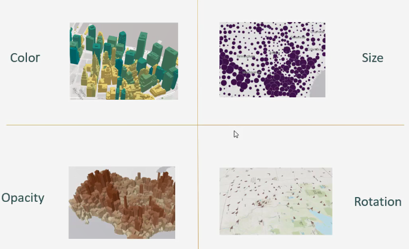

下面是 [FeatureLayer](https://developers.arcgis.com/javascript/latest/api-reference/esri-layers-FeatureLayer.html#properties-summary) 使用 [简单渲染器](https://developers.arcgis.com/javascript/latest/api-reference/esri-renderers-SimpleRenderer.html) 渲染图片标记和文本标签的例子: 

```js
const trailheadsRenderer = {
    "type": "simple", // 会自动转换为 new SimpleRenderer() 简单渲染器类型 
    "symbol": { // 符号对象相关属性
      "type": "picture-marker", // 自动转换为 new PictureMarkerSymbol() 图片符号
      "url": "http://static.arcgis.com/images/Symbols/NPS/npsPictograph_0231b.png",// 图片
      "width": "18px", // 图片宽度
      "height": "18px" // 图片高度
    }
  };

// 这是个标签对象
const trailheadsLabels = {
    symbol: {
      type: "text", //  渲染器类型 会自动转换为 new TextSymbol() 文本符号
      color: "#FFFFFF", // 颜色
      haloColor: "#5E8D74", // 文本符号的光晕点颜色
      haloSize: "2px", // 文本符号的光晕点大小
      font: { // 自动转换为 new Font()
        size: "12px", // 大小
        family: "Noto Sans", // 字体
        style: "italic", // 斜体
        weight: "normal" // 加粗
      }
    },
    labelPlacement: "above-center", // 标签位置
    labelExpressionInfo: {
      expression: "$feature.TRL_NAME" // 标签表达式 支持 SQL 语法
    }
  };

// 创建 FeatureLayer
const trailheads = new FeatureLayer({
    url: "https://services3.arcgis.com/GVgbJbqm8hXASVYi/arcgis/rest/services/Trailheads/FeatureServer/0"
    renderer: trailheadsRenderer, // 指定 FeatureLayer 的渲染器
    labelingInfo: [trailheadsLabels] // 标签信息 自动转换为 new LabelClass()
  });

  map.add(trailheads);
```

### 手动加载

如果`View`是用`Map`实例构造的，那么`load`方法会自动执行，加载`View`和关联的`Map`中引用的所有资源。简单来讲，当实例化的图层并没有被map或view引用时，图层服务的所有资源并不会自动加载，需要手动调用[`load`](https://developers.arcgis.com/javascript/latest/api-reference/esri-portal-PortalItem.html#load)方法加载它所需的资源来完成初始化。

可加载类的[loadStatus](https://developers.arcgis.com/javascript/latest/api-reference/esri-portal-PortalItem.html#loadStatus)属性返回可加载资源的状态。四种状态是可能的

| 状态         | 描述                                                        |
| ------------ | ----------------------------------------------------------- |
| `not-loaded` | 资源尚未加载其元数据，并且其状态未正确初始化                |
| `loading`    | 资源正在异步加载其元数据                                    |
| `failed`     | 资源无法加载其元数据，遇到的错误可从`loadError`属性中获取。 |
| `loaded`     | 资源成功加载其元数据并且其状态已正确初始化。                |

下面的状态转换代表了一个可加载资源所经历的阶段

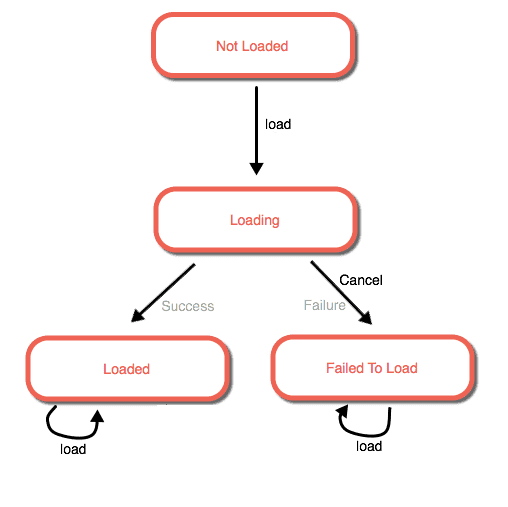

> 更详细的经过, 见官方[负载状态](https://developers.arcgis.com/javascript/latest/programming-patterns/#load-status)

```js
async initMap() {
      const [
        Map,
        MapView,
        esriConfig,
        FeatureLayer,
      ] = await loadModules([
        "esri/Map",
        "esri/views/MapView",
        "esri/config",

        "esri/layers/FeatureLayer",
      ]);

      esriConfig.apiKey = myKeyAPI;

      const map = new Map({
        basemap: "osm",
      });
      const view = new MapView({
        map, 
        container: "viewDiv",
      });
      const layer = new FeatureLayer({
        url: "https://sampleserver6.arcgisonline.com/arcgis/rest/services/USA/MapServer/0",
      });
      console.log(layer.loadStatus); // 查看状态load状态
      console.log(layer.fields); // 查看字符数组

      layer.load().then(() => {
        console.log(layer.loadStatus); 
        console.log(layer.fields);
      }).catch(err=>{
        console.log(err);
      });
```

这是一个没有与`Map`或者`View`关联的`FeatureLayer`，在实例化之后输出它的加载状态和包含的字段属性，并在手动调用`load()`之后再次输出加载状态和包含的字段。浏览器输出如下所示：

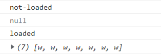

### fromJSON 方法

许多类，包括所有[符号](https://developers.arcgis.com/javascript/latest/api-reference/esri-symbols-Symbol.html)、[几何图形](https://developers.arcgis.com/javascript/latest/api-reference/esri-geometry-Geometry.html)、[相机](https://developers.arcgis.com/javascript/latest/api-reference/esri-Camera.html)、[视点](https://developers.arcgis.com/javascript/latest/api-reference/esri-Viewpoint.html)、[颜色](https://developers.arcgis.com/javascript/latest/api-reference/esri-Color.html)和[FeatureSet](https://developers.arcgis.com/javascript/latest/api-reference/esri-rest-support-FeatureSet.html)，都包含`fromJSON()`方法

`fromJSON`方法从ArcGIS产品生成的`JSON`中创建一个指定类的实例。这种格式的`JSON`通常由`toJSON()`方

法或通过`REST API`的查询创建。不能与一般的`JSON`或[`GeoJSON`](https://developers.arcgis.com/javascript/latest/api-reference/esri-layers-GeoJSONLayer.html)混用。

#### jsonUtils 辅助方法

在使用`fromJSON()`实例化一个对象时，有几个`jsonUtils`类作为工具类提供。

- [`esri/geometry/support/jsonUtils`](https://developers.arcgis.com/javascript/latest/api-reference/esri-geometry-support-jsonUtils.html)
- [`esri/renderers/support/jsonUtils`](https://developers.arcgis.com/javascript/latest/api-reference/esri-renderers-support-jsonUtils.html)
- [`esri/symbols/support/jsonUtils`](https://developers.arcgis.com/javascript/latest/api-reference/esri-symbols-support-jsonUtils.html)

当一个`JSON`对象是来自REST API的几何体、渲染器或符号，但对象类型未知时，这些类可以快速处理这种情

况。例如，当一个图层的渲染器来自于REST请求，并且不确定该渲染器是否是`UniqueValueRenderer`时，调用

`esri/renderers/support/jsonUtils`类来帮助确定该渲染器的类型

```js
  const [
    FeatureLayer,
    rendererJsonUtils
  ] = await loadModules([
    "esri/layers/FeatureLayer",
    "esri/renderers/support/jsonUtils"
  ]);

const rendererJSON = {               // 通过REST请求获得的渲染对象
 "authoringInfo":null,
 "type":"uniqueValue",
 "field1":"CLASS",
 "field2":null,
 "field3":null,
 "expression":null,
 "fieldDelimiter":null,
 "defaultSymbol":{
    "color":[235,235,235,255],
    "type":"esriSLS",
    "width":3,
    "style":"esriSLSShortDot"
 },
 "defaultLabel":"Other major roads",
 "uniqueValueInfos":[
    {
       "value":"I",
       "symbol":{
          "color":[255,170,0,255],
          "type":"esriSLS",
          "width":10,
          "style":"esriSLSSolid"
       },
       "label":"Interstate"
    },
    {
       "value":"U",
       "symbol":{
          "color":[223,115,255,255],
          "type":"esriSLS",
          "width":7,
          "style":"esriSLSSolid"
       },
       "label":"US Highway"
    }
 ]
};

// 将这个JSON表示的对象创建为渲染器对象
const flRenderer = rendererJsonUtils.fromJSON(rendererJSON);

// 在图层上设置渲染器
const layer = new FeatureLayer({
	renderer: flRenderer
});
```

> [要素转JSON(转换)](https://pro.arcgis.com/zh-cn/pro-app/latest/tool-reference/conversion/features-to-json.htm)

## 事件

弹出点击信息窗口

```js
// 设置 Popup 允许或禁止单击事件传播
view.popup.autoOpenEnabled = false;
view.on("click", (event) => {
    // 获取位置信息
    const {mapPoint, mapPoint:{latitude, longitude}} = event;
    // 获取经纬度后3位
    const lat = latitude.toFixed(3);
    const lon = longitude.toFixed(3);

    // 打开弹出窗口
    view.popup.open({
      // 弹出窗口内容
      title: "位置是: [" + lon + ", " + lat + "]",
      location: mapPoint, // 弹出窗口的点
    });
});
```

:::