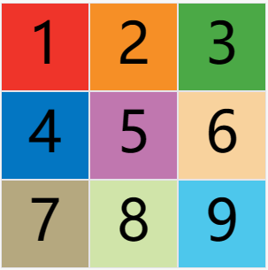
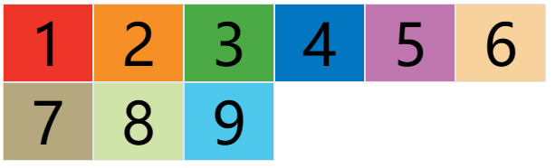
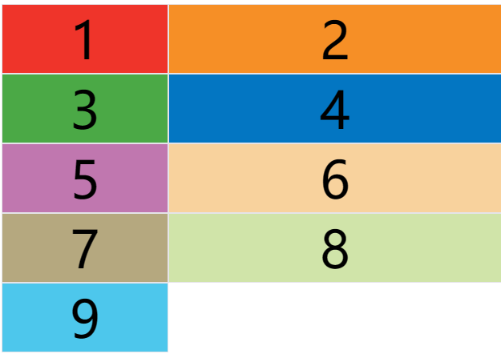
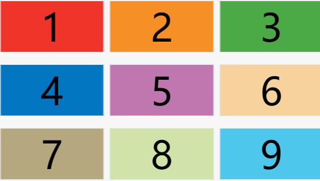
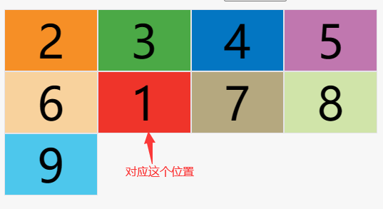
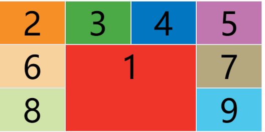
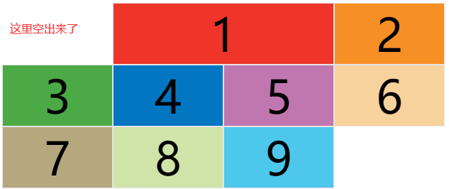

[[toc]]

# CSS

[MDN CSS](https://developer.mozilla.org/zh-CN/docs/Web/CSS)

[张鑫旭的博客](https://www.zhangxinxu.com/wordpress/category/css/)

[jsbin](https://jsbin.com/?html,css,output)

## css选择器

>   更多选择器可见 [W3C选择器](https://www.w3school.com.cn/cssref/css_selectors.asp)

css选择器的选择机制是自右向左选择, 所以选择器越短性能越好

### 常规选择器

| 选择器名称     | 描述                                  | 例子                        |
| :------------- | :------------------------------------ | --------------------------- |
| 通配选择器     | 选中页面中的所有元素                  | *{}                         |
| 元素选择器     | 根据标签名来了选中指定的元素          | a{}, p{}, div{}             |
| 类选择器       | 根据元素的 `class` 属性值选中一组元素 | .box{}, .title{}            |
| id选择器       | 根据元素的 `id` 属性选中一个元素      | #box{}, #title{}            |
| 交集选择器     | 选中同时符合多个条件的元素            | 选择器1选择器2选择器n{}     |
| 并集选择器     | 同时选中多个选择器对应的元素          | 选择器1, 选择器2, 选择器n{} |
| 子元素选择器   | 选中指定父元素的指定子元素            | 父元素 > 子元素{}           |
| 后代元素选择器 | 选中指定元素内的指定后代元素          | 祖先元素  后代元素{}        |
| 兄弟元素选择器 | 选中指定元素下的 `指定 `兄弟元素      | 前一个元素 + 后一个元素{}   |
| 兄弟元素选择器 | 选中指定元素内下的 `所有` 兄弟元素    | 前一个元素 ~ 后一个元素{}   |

> 交集选择器中如果有元素选择器，则必须使用元素选择器开头

### 属性选择器

| 操作选择器名称    | 描述                                                     | 例子             |
| :---------------- | -------------------------------------------------------- | ---------------- |
| [属性名]          | 选择含有指定 `属性` 的元素                               | p[color]{}       |
| [属性名=属性值]   | 选择含有指定 `属性` 和 `属性值` 的元素                   | p[color=abc]{}   |
| [属性名\^=属性值] | 选择属性值以指定值 `开头` 的元素                         | p[color\^=abc]{} |
| [属性名\$=属性值]  | 选择属性值以指定值`结尾`的元素                           | p[color\$=abc]{}  |
| [属性名\*=属性值] | 选择属性值含有`指定值`的元素（任意位置含有指定值都可以） | p[color\*=e]{}   |

### 伪元素

表示页面中一些特殊的并不存在的元素（特殊的位置, 状态）
伪元素使用`::`开头

- `::first-letter` 表示第一个字母

- `::first-line` 表示第一行

- `::selection` 表示选中时的状态

- `::before` 表示元素开始位置

- `::after` 表示元素最后的位置

  >  `::before` 和 `::after` 属性需要结合`content`属性来使用
  

### 其他选择器

-   `:not(select)`: 选择非指定元素
-   `div:nth-child(n)`: 选择属于其父元素的第`n`个元素
    -   `div:nth-child(3n+0)`: 从`0`开始选择`3`的倍数的元素

-   `div:nth-last-child(n)`:  选择属于其父元素的第`n`个元素(**倒过来数**)
-   `div:nth-last-child(n)`: 同上
-   `div:nth-of-type(n)`: 选择属于其父元素第`n`个`<div>`元素的每个`<div>`元素
-   `div:nth-last-of-type(n)`: 同上(**倒过来数**)

## 选择器的优先级

[mdn](https://developer.mozilla.org/zh-CN/docs/Web/CSS/Specificity)

### 样式的冲突

```
当通过使用不同的选择器，选中相同的元素，并且为相同的样式设置不同的值，此时就发生了样式的冲突
发生样式冲突时，应用哪一个样式由选择器的权重（优先级）决定
```

### 选择器的权重

```
内联样式        1,0,0,0
id选择器        0,1,0,0
类和伪类选择器   0,0,1,0
元素选择器       0,0,0,1
通配选择器       0,0,0,0
继承的样式       没有优先级 
```

### 优先级的比较

- 比较优先级时，需要将所有的选择器的优先级进行相加计算，最后优先级越高，则优先显示（分组/交集选择器是单独计算的）

- 选择器的累加不会超过其最大的数量级， `类选择器` 再高也不会超过 `id选择器`

- 如果优先级计算后相同，此时则优先使用靠下的样式, 可以在某一个样式后面添加 `!important`，则该样式会获的最高优先级

  > `!important` 这个属性慎用

### 样式穿透

有时候在Vue里使用UI框架需要修改组件的样式, 使用`!important`也不生效这时候就是使用样式穿透, 

官方叫做深度选择器, 就是在想穿透的选择器前边添加 `>>>` , `/deep/`, `::v-deep` 或者 `:deep()`,

建议使用后面三种

```css
& >>> .el-radio__label {...}
/deep/ .el-radio__label {...}
::v-deep .el-radio__label {...}
div:deep(.el-radio__label) {...}
```

## 盒子模型

- css会将页面中的所有元素设置为了一个矩形的盒子
- 将元素设置为矩形的盒子后，对网页的布局就变成将不同的盒子摆放到不同的位置
- 每一个盒子都有以下几个部分组成：
    - 内容区（content）
    - 内边距（padding）
    - 边   框（border）
    - 外边距（margin）

### 盒子模型分类

```
使用 box-sizing 属性设置盒子模型类型
```

- `content-box` 默认值，指定盒子模型为W3C（标准盒模型）, 宽度和高度用来设置内容区的大小，盒子整体大小会算上内边距和边框
- `border-box ` 为IE盒子模型（怪异盒模型）宽度和高度用来设置整个盒子的可见框大小
  - width 和 height 指的是内容区, 可见框和边框的总大小

### 元素的水平方向的布局

```
一个元素在其父元素中，水平布局必须满足以下的等式
margin-left + border-left + padding-left + width + padding-right + border-right + margin-right = 父元素内容区的宽度（必须满足）
```

- 以上等式必须满足，如果相加结果使等式不成立，则被称为过渡约束，则等式会 `自动调整`

- 调整的情况：如果这七个值中没有为 auto 的情况，则浏览器会自动调整 margin-right值以使等式满足

  > 这七个值中可以设置为 auto 的是: `width` `margin-right` `margin-left`

### 元素的垂直布局

```
子元素是在父元素的内容区中排列的，如果子元素的大小超过了父元素的，则子元素会从父元素中溢出
可以使用 overflow 属性来设置父元素如何处理溢出的子元素
```

- overflow 属性:
  - visible 默认值，子元素会从父元素中溢出，在父元素外部的位置显示 
  - hidden 溢出的内容将被裁减不会显示
  - scroll 生成两个滚动条，通过滚动条来查看完整的内容
  - auto 根据需要生成滚动条

### 行内元素的盒子模型

```
行内元素不支持设置宽度和高度    
行内元素可以设置 padding，但是垂直方向的 padding 不会影响页面的布局
行内元素可以设置 border，垂直方向的 padding 不会影响页面的布局
行内元素可以设置 margin，垂直方向的 margin 不会影响页面的布局
    总结：垂直方向不影响页面布局，宽高不能设置
```

- display 属性:
  - inline 将元素设置为行内元素 
  - block 将元素设置为块元素
  - inline-block 将元素设置为行内块元素
    - 行内块元素，既可以设置宽度和高度又不会独占一行
  - table 将元素设置为一个表格
  - table-cell 将元素设置为单元格 td
  - none 元素不在页面中显示
  
- visibility 属性
  - visible 默认值，元素在页面中正常显示
  - hidden 元素在页面中隐藏，不显示，但是依然占据页面的位置

## 浮动

通过 float 属性来设置元素的浮动

- 可选值
  - none 默认值，元素不浮动
  - left 元素向左浮动
  - right 元素向右浮动

> 元素设置浮动以后，水平布局的等式便不需要强制成立，元素会完全从文档流中脱离，不再占据文档流中的位置，所以元素下边的还在文档流中的元素会自动向上移动

### 浮动的特点

1. 浮动的元素会完全脱离文档流，不再占据文档流中的位置
2. 设置浮动以后元素会向父元素的左侧或右侧移动
3. 浮动元素默认不会从父元素中移出
4. 浮动元素向左或者向右移动时，不会超过它前边的其他浮动元素
5. 如果浮动元素的上边是一个没有浮动的块元素，则浮动元素无法上移
6. 浮动元素不会超过它上边浮动元素的兄弟元素，最多就是和它一样高

## BFC(块级格式化环境)

```
BFC是一个独立的渲染区域，让处于 BFC 内部的元素与外部的元素相互隔离，使内外元素的定位不会相互影响
```

- 元素开启BFC后的特点
	- 开启BFC的元素不会被浮动元素所覆盖
	- 开启BFC的元素子元素和父元素外边距不会重叠
	- 开启BFC的元素可以包含浮动的子元素

- 可以通过一些特殊的方式来开启元素的BFC
  - 设置元素的浮动
  - 将元素设置为行内块元素
  - 将元素的overflow设置为一个非visible的值

### 垂直外边距的重叠

```
相邻的垂直方向外边距会发生重叠现象
```

#### 兄弟元素

- 兄弟元素间的相邻垂直外边距会取两者之间的较大值（两者都是正值）

#### 特殊情况

- 如果相邻的外边距一正一负，则取两者的和，如果相邻的外边距都是负值，则取两者中绝对值较大的

- 兄弟元素之间的外边距重叠，一般都是有利的，所以一般不需要处理

#### 父子元素

- 父子元素间的相邻垂直外边距，子元素的会传递给父元素（上外边距）
- 父子外边距的重叠是会影响到页面的布局

#### 解决外边距重叠的方法

```
使用伪元素::before 的 content 添加一个空内容

display: table 就可以解决父子垂直外边距重叠的问题
```

### 高度塌陷的问题

```
在浮动布局中，父元素的高度默认(未设置高度)是被子元素撑开的，当子元素浮动后，其会完全脱离文档流，

子元素从文档流中脱离，将会无法撑起父元素的高度，导致父元素的高度丢失，

父元素的高度丢失以后，其下的元素会自动上移，导致页面的布局混乱
```

- `clear`属性
  - left 清除左侧浮动元素对当前元素的影响
  - right 清除右侧浮动元素对当前元素的影响
  - both 清除两侧中最大影响的那侧

#### 解决高度塌陷的方法

```
使用伪元素::after 的 content 在（父元素）最后面添加一个空内容

再使用display: block 最后使用clear:both 清除浮动就可以解决高度塌陷的问题
```

> 父元素可以通过开启 overflow: hidden 来解决高度塌陷和外边距重叠的问题

### clearfix

完美的解决高度塌陷和垂直外边距重叠的样式

```css
.clearfix::before,
.clearfix::after{
    content: " ";
    display: table;
    clear: both;
}
/* IE 6/7 */
.clearfix { 
  zoom: 1;
}
```

## 定位

```
定位是一种更加高级的布局手段
通过定位可以将元素摆放到页面的任意位置
使用 position 属性来设置定位
```

- 可选值
  - static 默认值，元素是静止的没有开启定位
  - relative 开启元素的相对定位
  - absolute 开启元素的绝对定位
  - sticky 开启元素的粘滞定位
  - fixed 开启元素的固定定位

### 偏移量

当元素开启了定位以后(position不是static值)，就可以可以通过设置偏移量来设置元素的位置

- 可选值
  - top 定位元素和定位位置上边的距离
  - bottom 定位元素和定位位置下边的距离
  - left  定位元素和定位位置左侧的距离
  - right  定位元素和定位位置右侧的距离

### 绝对定位

- 开启绝对定位后，元素会从文档流中脱离
- 绝对定位相对于它的包含块定位的
  - 绝对定位的包含块就是离他最近的开启了定位的元素
  - 如果所有的祖先元素都没有开启定位则根元素就是它的包含块

### 固定定位

- 和绝对定位唯一不同的是固定定位永远参照于浏览器的视口进行定位的，其它特点不变
  - 固定定位的元素不会随网页的滚动条滚动

### 相对定位

- 相对定位是参照于元素在文档流中的位置进行定位的
- 相对定位是不会元素脱离文档流
- 相对定位不会改变元素的性质，块还是块，行内还是行内

> 相对定位适合用来给其子元素的绝对定位参照位置

### 粘滞定位

- 粘滞定位和相对定位的特点基本一致
  - 不同的是粘滞定位可以在元素到达某个位置是将其固定
- 也是相对于其最近的祖先元素包含块进行定位的

### z-index属性

- z-index需要一个整数作为参数，值越大元素的层级越高

- 元素的层级越高越优先显示 

- 层级一样时，优先显示HTML结构靠下的元素

 > 祖先元素的层级再高也不会遮住后代元素

## CSS 常见其他属性

| 属性名                                                       | 描述                     | 例子                            |
| ------------------------------------------------------------ | ------------------------ | ------------------------------- |
| color                                                        | 为元素设置文本颜色       | color: red                      |
| border-radius                                                | 用来设置圆角(支持百分比) | border-radius :10px             |
| opacity                                                      | 为元素设置透明效果(0-1)  | opacity:0.5                     |
| border                                                       | 为元素设置边框样式       | border:1px red solid            |
| box-shadow                                                   | 为元素设置阴影样式       | box-shadow: 0 0 5px red;        |
| background                                                   | 背景相关的简写属性       | background: red no-repeat cover |
| [font](https://www.w3school.com.cn/cssref/css_websafe_fonts.asp) | 字体相关的简写属性       | font:bold italic 20px  微软雅黑 |
| line-height                                                  | 为元素设置行高           | line-height: 20px               |
| text-align                                                   | 文本居中                 | text-align: center              |
| indent                                                       | 文本首行缩进             | indent: 2em                     |
| letter-spacing                                               | 文本字距                 | letter-spacing: 1px             |

-  background: 可以设置 背景颜色 背景图片, 背景图片位置, 背景图片重复位置,背景大小等
  - `background-size` 必须写在`background-position`的后面，并且使用/隔开`background-position/background-size`
- font: 可以设置 加粗 斜体 字体大小/行高 字体族（注意: 字体大小和字体族必须写还要写到最后面）

> 更多常见属性见 [W3C参考手册](https://www.w3school.com.cn/cssref/index.asp)

## 图标字体

```
网页中经常需要使用一些图标
    但是图片大小本身比较大，并且非常不灵活
    
所以在使用图标时，还可以将图标直接设置为字体, 
    然后通过font-face的形式来对图片进行引入

这样就可以通过使用字体的形式来使用图片
```

使用:

下载需要使用的图标, 并引入项目

以下使用 阿里巴巴图标库 举例:

- 使用图标字体的几种方式:
  
  - 使用类名来设置图标字体
  
    ```html
    <i classs="iconfont icon-icon-user"></i>
    ```
  
  - 使用伪元素来设置图标字体
  
    ```css
    i::before{
        content: '\e699';
        font-size: 24px;
        color: red;
    }
    <i class="iconfont"></i>
    ```
  
  - 使用 unicode 码来设置图标字体
  
    ```html
    <i class="iconfont">&#xe699</i>
    ```

## 雪碧图

```
将多个图片统一保存到一个大图片中，然后通过 background-position 来调整需要显示的图片
这样就可以有效的避免出现图片闪烁的问题
```

- 使用步骤:
  - 测量图标的大小
  - 创建一个对应大小的元素
  - 将雪碧图设置为元素的背景图片
  - 设置一个偏移量以显示正确的图片

## [音视频](https://www.w3school.com.cn/tags/html_ref_audio_video_dom.asp)

## transition(过渡)

```
通过 transition 可以指定一个属性发生变化时切换的过渡方式
要实现这一点，必须规定两项内容:
    指定要添加效果的CSS属性
    指定效果的持续时间
```

| 属性                       | 描述                           | 例子                               |
| -------------------------- | ------------------------------ | ---------------------------------- |
| transition-propert         | 指定要执行过渡的属性           | transition-propert: all            |
| transition-duration        | 指定过渡效果的持续时间(s)      | transition-duration: 1s            |
| transition-timing-function | 过渡的时序函数，指定过渡的方式 | transition-timing-function: linear |
| transition-delay           | 过渡效果的延迟                 | transition-delay: 1s               |
| transition                 | 可以同时设置过渡相关的所有属性 | transition: left .3s, top .3s      |

## animation(动画)

```
动画和过渡类似，都是可以实现一些动态的效果，
    不同的是过渡需要在某个属性发生改变时才会触发
    动画可以自动触发 
    具体的属性大部分和过渡效果类似
```

- 设置动画效果，必须要先设置一个关键帧，关键帧设置了动画执行的每一个步骤

  - ```css
    /* @keyframes 动画名 */
    @keyframes test {
     /* from 表示动画的开始位置，也可以使用 0% */
     from{
         margin-left: 0;
         background-color: red;
     }
    
    /* to 表示动画的结束位置，也可以使用 100% */
     to{
         margin-left: 500px;
         background-color: yellow;
     }
    ```


| 属性                      | 描述                           | 例子                                |
| ------------------------- | ------------------------------ | ----------------------------------- |
| animation-name            | 要对当前元素生效的关键帧的名字 | animation-name: test                |
| animation-duration        | 设置动画的执行时间             | animation-duration: 1s              |
| animation-delay           | 设置动画的延迟                 | animation-delay: 1s                 |
| animation-iteration-count | 动画执行的次数                 | animation-iteration-count: infinite |
| animation-direction       | 指定动画运行的方向             | animation-direction: reverse        |
| animation-play-state      | 设置动画的执行状态             | animation-play-state: paused        |
| animation-fill-mode       | 动画的填充模式                 | animation-fill-mode: forwards       |
| animation                 | 同时设置动画相关的所有属性     | animation: test 1s infinite         |

> animation 动画的简写属性  如果要写延迟时间， 则两个值中第一个为持续时间，第二个为延迟时间

> 更多动画见 [MDN动画](https://developer.mozilla.org/zh-CN/docs/Web/CSS/animation)

## transform(转换)

```
transform 就是指通过css来改变元素的形状或位置
transform 不会影响到页面的布局
```

| 属性             | 描述                                                    | 例子                             |
| ---------------- | ------------------------------------------------------- | -------------------------------- |
| translate        | 用来设置元素的变形效果（X轴 Y轴方向平移）               | transform: translate(-50%,-50%)  |
| translateZ       | z轴方向平移(默认情况下网页不支持透视, 需设置网页的视距) | transform: translateZ(800px)     |
| rotate           | 对元素进行旋转的函数                                    | rotateX(360deg), rotateY(180deg) |
| scale            | 对元素进行缩放的函数                                    | scaleX(50px),scaleY(50px)        |
| transform-origin | 设置元素变形的原点                                      | transform-origin: 100px          |

转换可以分为 2D 和 3D , 以上为 2D 转换

> 转换只能对**块元素有效**, 行内元素需要先设置`display: inline-block;`才有效

## flex(弹性布局)

[MDN Flex](https://developer.mozilla.org/zh-CN/docs/Web/CSS/CSS_Flexible_Box_Layout/Basic_Concepts_of_Flexbox)

```
flexible Box 意为 弹性布局, 用来为盒状模型提供最大的灵活性, 任何一个容器都可以指定 flex 布局
```

- 是css中的又一种布局手段，它主要用来代替浮动来完成页面的布局

- flex可以使元素具有弹性，让元素可以跟随页面大小的改变而改变

- flex不分行内元素和块级元素

### 弹性容器

- 要使用弹性盒，必须先将一个元素设置为弹性容器
- 通过 display 来设置弹性容器
    - `display: flex` 设置块级弹性容器
    - `display: inline-flex` 设置行内的弹性容器

#### 弹性容器的样式

```
justify 开头的属性都是表示主轴的
align 开头的属性都是表示辅轴的(交叉轴)
```


##### flex-direction

```
指定弹性容器中弹性元素的排列方式 
```

```
可选值：
    row 默认值，弹性元素在容器中水平排列（自左向右）
        主轴：自左向右

    row-reverse 弹性元素在容器中反向水平排列（自右向左）
        主轴：自右向左

    column 弹性元素纵向排列（自上向下）
        主轴：自上向下

    column-reverse 弹性元素纵向反向排列（自下向上）
        主轴；自下向上

                主轴：(由flex-direction决定)
                    弹性元素的排列方向称为主轴
                侧轴：
                    与主轴垂直方向的称为侧轴(交叉轴)
```

##### flex-wrap

```
设置弹性元素在弹性容器中是否自动换行
```

```
在 flex-shrink 设置为 0 不收缩的情况下
    可选值：
        nowrap 默认值，元素不会自动换行
        wrap 元素沿着辅轴方向自动换行
        wrap-reverse 元素沿着辅轴反方向换行
```

##### flex-flow

```
可以同时设置 flex-direction 和 flex-wrap 的属性
```

##### flex-grow

```
指定弹性元素伸展的系数
```

```
默认值：0
- 当父元素有多余的空间时，子元素如何伸展

- 父元素的剩余空间，会按照比例进行分配
    flex-grow:1; // 最小
    flex-grow:2; // 中间
    flex-grow:3; // 最大
```

##### flex-shrink

```
指定弹性元素的收缩系数
```

```
默认值：1  自动收缩相同大小, 设置为0 表示不收缩        
- 当父元素中的空间不足以容纳所有的字元素时，如何对子元素进行收缩

- 缩减系数的计算方式比较复杂

- 缩减多少是根据 缩减系数 和 元素大小 来计算(值越大收缩越多)
```

##### justify-content

```
设置如何分配主轴上的空白空间（主轴上的元素如何排列）
```

```
在 flex-shrink 设置为 0 不收缩的情况下
    可选值:
        flex-start 默认值，元素沿着主轴的起边排列
        flex-end 元素沿着主轴的终边排列
        center 元素居中排列
        space-around 空白区域分布到元素的两侧（空白中间大两边小）
        space-between 空白区域均匀分布到元素间（空白中间有两边没有）(常用)
        space-evenly 空白区域分布到元素的单侧（空白两边有且一样大）
```

##### align-items

```
元素在辅轴上如何对齐, 元素间的关系
```

```
可选值：
    stretch 默认值，将元素的长度设置为相同的值
    flex-start 元素不会拉伸，沿着辅轴起边对齐
    flex-end 元素不会拉伸，沿着辅轴终边对齐
    center 元素不会拉伸，居中对齐
    baseline 文字基线对齐

- 利用弹性盒可以设置水平垂直双方向居中
    justify-content: center;
    align-items: center;
```

##### align-content

```
辅轴空白空间的分布
```

```
可选值:
    stretch 默认值，将元素的长度设置为相同的值
    flex-start 元素沿着辅辅的起边排列
    flex-end 元素沿着辅辅的终边排列
    center 元素居中排列
    space-around 空白区域分不到元素的两侧（空白中间大两边小）
    space-between 空白区域均匀分布到元素间（空白中间有两边没有）(常用)
    space-evenly 空白区域分布到元素的单侧（空白两边有且一样大）
```

### 弹性元素

- 弹性容器的直接子元素才是弹性元素（弹性项）

- 一个元素可以同时是弹性容器和弹性元素

#### gap

```
设置行列的间距
```

#### flex-basis

```
指定元素在主轴上的基础长度
```

```
如果主轴是 横向的 则指定的就是元素的宽度

如果主轴是 纵向的 则指定的就是元素的高度

    - 默认值是 auto，表示参考元素自身的高度或宽度

    - 如果传递了一个具体的数值，则以该值为准(会修改弹性元素的宽高)
```

#### flex

```
可以设置弹性元素的简写属性
```

```
flex 可以设置弹性元素所有的三个样式,有规定的顺序要求，还有一些系统的可选值

    简写属性：
            flex 增长系数 缩减系数 基础长度;

     可选值：
         initial --> flex: 0 1 auto 弹性元素只能缩减
            auto --> flex: 1 1 auto 弹性元素可增可缩
            none --> flex: 0 0 auto 弹性元素没有弹性
```

#### order

```
决定弹性元素的排列顺序
要每个弹性元素都设置才会生效(手动设置排列顺序值越小越靠前)
```

#### align-seif

```
用来单独覆盖当前弹性元素上的 align-items 辅轴空白空间的分布
用来对个别元素单独设置辅轴空白空间分布
```

## grid(网格布局)

[阮一峰 CSS Grid 网格布局教程](https://www.ruanyifeng.com/blog/2019/03/grid-layout-tutorial.html)

[MDN Grid](https://developer.mozilla.org/zh-CN/docs/Web/CSS/CSS_Grid_Layout/Basic_Concepts_of_Grid_Layout)

[jsbin grid](https://jsbin.com/kuzuvowixu/edit?html,css,output)

使用`display: grid;`或`display: inline-grid;`就可以开启元素的网格布局

### 容器属性

当元素开启了网格布局, 内部的子元素就有了行(row)和列(column)的概念, 容器是属性都是有设置行和设置列的属性

### grid-template-columns和grid-template-rows

容器指定了网格布局以后，接着就要划分行和列。`grid-template-columns`属性定义每一列的列宽，`grid-template-rows`属性定义每一行的行高

```css
.container {
  /* 开启网格布局 */
  display: grid;
  /* 一列占3个, 每个100px */
  grid-template-columns: 100px 100px 100px;
  /* 一行占3个, 每个100px */
  grid-template-rows: 100px 100px 100px;
}
```

 

除了使用绝对单位，也可以使用百分比

```css
.container {
  display: grid;
  grid-template-columns: 33.33% 33.33% 33.33%;
  grid-template-rows: 33.33% 33.33% 33.33%;
}
```

### repeat()函数

有时候, 重复写同样的值非常麻烦, 尤其网格很多时, 这时, 可以使用`repeat()`函数, 简化重复的值, 以上面的为例:

```css
.container {
  display: grid;
  /* 重复 3 次 33.33% 的大小 */
  grid-template-columns: repeat(3, 33.33%);
  grid-template-rows: repeat(3, 33.33%);
}
```

`repeat()`重复某种模式也是可以的

```css
.container {
  display: grid;
  /* 重复 2 次 10% 20% 30% 的模式 */
  grid-template-columns: repeat(2, 10% 20% 30%);
  grid-template-rows: repeat(2, 10% 20% 30%);
}
```

### auto-fill关键字

有时，单元格的大小是固定的，但是容器的大小不确定。如果希望每一行（或每一列）容纳尽可能多的单元格，这时可以使用`auto-fill`关键字表示自动填充

```css
.container {
  display: grid;
  /* 每列的宽度为 100px 知道放不下为止 */
  grid-template-columns: repeat(auto-fill, 100px);
}
```

 

### fr单位

网格布局提供了`fr`关键字, 方便表示比例关系, 如果两列的宽度分别为`1fr`和`2fr`，就表示后者是前者的两倍

```css
.container {
  display: grid;
  grid-template-columns: 1fr 2fr;
}
```

  

`fr`可以与绝对长度的单位结合使用

```css
.container {
  display: grid;
  grid-template-columns: 150px 1fr 2fr;
}
```

### minmax()函数

`minmax()`函数产生一个长度范围，表示长度就在这个范围之中。它接受两个参数，分别为最小值和最大值

```css
.container {
  display: grid;
  /* minmax(100px, 1fr) 列宽在 100px ~ 1fr 之间 */
  grid-template-columns: 100px 150fr minmax(100px, 1fr);
}
```

### auto关键字

`auto`关键字表示由浏览器自己决定长度

```css
grid-template-columns: 100px auto 100px;
```

### grid-gap

`grid-gap`是`grid-row-gap`(行间距)和`grid-column-gap`(列间距)的缩写

```css
.container {
  display: grid;
  grid-template-columns: repeat(3, 33.33%);

  /* 行与行的间距 10px */
  /* grid-column-gap: 10px; */
  /* 列与列的间距 10px */
  /* grid-row-gap: 20px; */

  /* 简写 */
  grid-gap: 10px 20px;
}
```

 

### justify-items 和 align-items

`justify-items`属性设置单元格内容的水平位置（左中右）

`align-items`属性设置单元格内容的垂直位置（上中下）

效果和flex布局基本是一致的

```css
.container {
  justify-items: start | end | center | stretch;
  align-items: start | end | center | stretch;
}
```

### justify-content 和align-content

`justify-content`属性是整个内容区域在容器里面的水平位置（左中右）

`align-content`属性是整个内容区域的垂直位置（上中下）

效果和flex布局基本是一致的

```css
.container {
  justify-content: start | end | center | stretch | space-around | space-between | space-evenly;
  align-content: start | end | center | stretch | space-around | space-between | space-evenly;  
}
```

### grid-column和grid-row

`grid-column`的值为`在列的那个开始位置/占多少份列`

`grid-row`的值为`在行的那个开始位置/占多少份行`

```css
.container {
  display: grid;
  grid-template-columns: repeat(4, 25%);
}

.item-1 {
  background-color: #ef342a;
  /* 在列的第2个位置 */
  grid-column: 2;
  /* 在行的第2个位置 */
  grid-row: 2;
}
```

效果如下:

 

还可以通过`span n`来指定对应的大小

```css
.container {
  display: grid;
  grid-template-columns: repeat(4, 25%);
}

.item-1 {
  background-color: #ef342a;
  /* 在列的第2个位置, 占两份列的大小 */
  grid-column: 2/span 2;
  /* 在行的第1个位置, 占两份行的大小 */
  grid-row: 1/span 2;
}
```

 

如果省略行或者列的配置则会空出来这个位置

```css
.container {
  display: grid;
  grid-template-columns: repeat(4, 25%);
}

.item-1 {
  background-color: #ef342a;
  /* 在列的第2个位置, 占两份列的大小 */
  grid-column: 2/span 2;
  /* 没有配置行的位置*/
}
```

  

## [单位](https://www.w3school.com.cn/cssref/css_units.asp)

### 长度单位

- 像素
  - 不同屏幕的像素大小是不同的，像素越小的屏幕显示效果越清晰
  - 所以在同样的像素下不同的设备下显示的效果不一样
- 百分比
  - 也可以将属性 设置为相对于其父元素属性的百分比
  - 设置百分比可以使子元素跟随父元素的改变而改变
- em
  - em 是相对于元素的字体大小来计算的
  - 1em = 1font-size
- rem
  - rem 是相对于根元素（HTML）的字体大小来计算的
- vh / vw
  - vh 是相对于浏览器视口的高来计算的
  - vw 是相对于浏览器视口的宽来计算的

### [颜色单位](https://www.w3school.com.cn/cssref/css_colors_legal.asp)

- RGB值
  - R（red），G（green），B（blue)
  - 每一种颜色的范围在 0 ~ 255（0% ~ 100%）之间, 基于光的三原色计算的
  - 语法：RGB（红色，绿色，蓝色）
  - 可以使用 十六进制
- RGBA
  - 就是在RGB的基础上增加了一个A表示不透明度
  - 需要填写四个值，前三个和RGB一样，第四个表示不透明度
  - 1表示完全不透明, 0表示完全透明, .5表示半透明
- HSL值 ~ HSLA值
  - H 色相（ 0 ~ 360）
  - S 饱和度，颜色的浓度 0% ~ 100%
  - L 亮度，颜色的亮度 0% ~ 100%
  - A 不透明度 1表示完全不透明 0表示完全透明 .5表示半透明

## CSS 变量

### 变量的声明

- 声明变量的时候，变量名前面需要加前缀 --
- 变量名大小写敏感
- 变量也是有作用域的(其子元素都可以使用)
- root 表示根元素

```css
body{
  --height: 200px;
  --width: 200px;
}
```

### var() 函数

```
用于读取变量
```

```css
body{
    --width: 200px;
    --height: 200px;
    --color: red;
    width: var(--width);
    height: var(--height);
    background-color: var(--color);
}
```

var()函数还可以使用第二个参数，表示变量的默认值。如果该变量不存在，就会使用这个默认值

>  注意: 变量值只能用作属性值，不能用作属性名

### calc() 函数

```
用于计算变量
```

```css
.box1 {
    --width: 100px;
    width: calc(var(--width) * 2); /* 200px */
    height: calc(var(--width) * 3); /* 300px */
    background: red;
}
```

> 注意: 运算符左右需加空格

> 更多函数见 [W3C函数](https://www.w3school.com.cn/cssref/css_functions.asp)

## 响应式布局

- 网页可以根据不同的设备或者窗口大小呈现出不同的效果
- 使用响应式布局，可以使一个网页适用于所有的设备
- 响应式布局的关键就是 媒体查询
- 通过媒体查询，可以为不同的设备，或设备不同的状态来分别设置样式

### 媒体查询

```css
语法：@media 查询规则{}
    媒体类型：
        all 所有设备
        print 打印设备
        screen 带屏幕的设备
        speech 屏幕阅读器
```

- 可以使用, 连接多个媒体类型, 这样它们之间就是或的关系
- 可以在媒体类型前加一个 only, 表示只有
- only的使用主要是为了兼容一些老版本浏览器

### 媒体特性

```
width 视口的宽度
height 视口的高度 
win-width  视口的最小宽度（视口大于指定宽度时生效）
mix-width 视口的最大宽度 （视口小于指定宽度时生效）
```

### 响应式断点

```
样式切换的分界点，称其为响应式断点，也就是网页的样式在这个点时就会发生变化 

    一般比较常用的断点
    小于768px  超小屏幕 max-width = 768px
    大于768px  小屏幕   min-width = 768px
    大于992px  中性屏幕 min-width = 992px
    大于1200px 大屏幕   min-width = 1200px
```

```css
/*
  媒体条件中间用 ,隔开表示或者的关系  and 隔开表示与的关系
      前面加个 not 表示否定除了的意思
*/
    
 /* 
    @media not screen (min-width:550px),(max-width:700px){ 
 */
   @media only screen (min-width:550px) and (max-width:700px){
       body{
          background-color: #bfa;             
      }
   }

  /* 也可以这样写 */
   @media only screen{
       @media (min-width:550px) and (max-width:700px){
           body{
               background-color: #bfa; 
           }
       }
   }
```

## 浏览器的私有前缀

```
浏览器私有前缀是为了兼容老版本的写法, 比较新版本的浏览器无需添加
```

- `-moz-`: 代表 Firefox 浏览器私有属性
- `-ms-`: 代表 IE 浏览器私有属性
- `-webkit-`: 代表 Safari Charome 浏览器私有属性
- `-o-`: 代表 Opera 浏览器私有属性 

```css
/* 禁止选中文本 图片 */
.unselect {
    -webkit-user-select: none; 
    -moz-user-select: none;    
    -ms-user-select: none;    
    -o-user-select: none;
    user-select: none;  
}  
```

> 更多浏览器兼容性见 [W3C浏览器支持](https://www.w3school.com.cn/cssref/css_browsersupport.asp), [caniuse](https://caniuse.com/)

## 滚动条样式

- `::-webkit-scrollbar`: 滚动条整体部分
- `::-webkit-scrollbar-thumb`: 滚动条里面的小方块（即滚动条滑块）, 能向上向下移动（或横向滚动条可往左往右移动）
- `::-webkit-scrollbar-track`: 滚动条的轨道（对应上图滚动条凹槽, 里面装有Thumb, 即滚动条滑块）
- `::-webkit-scrollbar-button`: 滚动条的轨道的两端按钮, 允许通过点击微调小方块的位置
- `::-webkit-scrollbar-corner`: 边角, 即两个滚动条的交汇处
- `::-webkit-scrollbar-track-piece`: 内层轨道, 滚动条中间部分
- `::-webkit-resizer`: 两个滚动条的交汇处上用于通过拖动调整元素大小的小控件

```scss
// 滚动条整体样式
&::-webkit-scrollbar {
  width: 4px;
  height: 8px;
  background-color: white;
}
// 滚动条里面小方块
&::-webkit-scrollbar-thumb {
  border-radius: 10px;
  box-shadow: inset 0 0 5px rgba(97, 184, 179, 0.1);
  background: $theme;
}
// 滚动条里面轨道
&::-webkit-scrollbar-track {
  box-shadow: inset 0 0 5px rgba(0, 0, 0, 0.2);
  background: #ededed;
  border-radius: 10px;
}
```

> [mdn](https://developer.mozilla.org/zh-CN/docs/Web/CSS/::-webkit-scrollbar)

## content 属性

`content` 属性一般与 `:before` 及 `:after` 伪元素配合使用，来插入生成内容

## 常用的css片段

**固定宽度居中布局**

```css
.wrap {
    width: 800px;
    margin: 0 auto;
}
```

**水平居中布局**

```css
/* transform */
position: relative;
top: 50%;
left: 50%;
transform: translate(-50%, -50%);


/* flex */
display: flex;
justify-content: center;
align-items: center;


/* grid */
.parent {
	display: grid; 
}

.child {
  margin: auto;
}
```

**清除浮动**

```css
.clearfix::before,
.clearfix::after{
    content: " ";
    display: table;
    clear: both;
}
/* IE 6/7 */
.clearfix { 
  zoom: 1; 
}
```

**滚动条底部向上填充**

```scss
&::after {
    content: "";
    display: block;
    height: 2px; // 填充高度
    width: 100%;
}
```

**单行省略**(前提必须要有宽度, 如果父级使用了`flex`布局可能会失效)

```css
width: 50%;
display: inline-block;
white-space: nowrap;
overflow: hidden;
text-overflow: ellipsis;
```

**多行省略**(前提必须要有宽度)

```css
width: 50%;
display: -webkit-box;
overflow: hidden;
-webkit-line-clamp: 3; /* 这里指定多少行 */
-webkit-box-orient: vertical;
```

**文本换行居中**

```css
/* 容器 */
display: table;

/* 文本 */
display: table-cell;
vertical-align:middle;
text-align:center;
```

**设置placeholder的样式**

```css
input::-webkit-input-placeholder {
  /* Chrome/Opera/Safari */
  color: red;
}

input::-moz-placeholder {
  /* Firefox 19+ */
  color: red;
}

input:-ms-input-placeholder {
  /* IE 10+ */
  color: red;
}

input:-moz-placeholder {
  /* Firefox 18- */
  color: red;
}
```

**小三角形**

```css
width: 0;
height: 0;
border: 20px solid transparent;
border-bottom-color: red; /* 这个决定方向(反着来) */
```

**字母大小写转换**

```css
p {text-transform: uppercase}  // 将所有字母变成大写字母
p {text-transform: lowercase}  // 将所有字母变成小写字母
p {text-transform: capitalize} // 首字母大写
p {font-variant: small-caps}   // 将字体变成小型的大写字母
```

**禁止用户选择**

```css
-webkit-touch-callout: none;
-webkit-user-select: none;
-khtml-user-select: none;
-moz-user-select: none;
-ms-user-select: none;
user-select: none;
```

**空数据提示**

```css
/* :empty为空时匹配 */
div:empty:after {
  content: "暂无数据";
  color: red;
}

div {
  border: 1px solid blue;
  width: 100px;
  height: 50px;
  display: flex;
  justify-content: center;
  align-items: center;
  margin: 10px 0;
}


<!--html-->
<div>有内容数据</div>
<div></div>
```

**元素点击事件失效**

```css
pointer-events: none;
cursor: default;
```

**页面灰度模式**

```css
body {
  filter: grayscale(80%);
}
```

**图片灰度模式**

```css
img {
  filter: url(filters.svg#grayscale); /* Firefox 3.5+ */
  filter: gray; /* IE6-9 */
  -webkit-filter: grayscale(1); /* Google Chrome, Safari 6+ & Opera 15+ */
}
```

**包裹长文本**

```css
pre {    
  white-space: pre-line;    
  word-wrap: break-word;
}
```

**插入图片**

```css
.loading:before {
  content: url("./test.jpg");
  vertical-align: middle;
}
```

**省略号loading**

```css
.loading:after {
    content: ".";
    animation: loading 2s ease infinite;
}
 
@keyframes loading {
    33% {
        content: "..";
    }
    66% {
        content: "...";
    }
}

<!--html-->
<div class="loading">加载中</div>
```

**圆环loading**

```css
.loading {
  border: 10px solid #f3f3f3;
  border-radius: 50%;
  border-top: 10px solid #3498db;
  width: 30px;
  height: 30px;
  -webkit-animation: spin 2s linear infinite;
  animation: spin 2s linear infinite;
}

@-webkit-keyframes spin {
  0% {
    -webkit-transform: rotate(0deg);
  }
  100% {
    -webkit-transform: rotate(360deg);
  }
}

@keyframes spin {
  0% {
    transform: rotate(0deg);
  }
  100% {
    transform: rotate(360deg);
  }
}
```

**计算章节数**

```css
ul {
  counter-reset: section;
}

li {
  list-style-type: none;
  counter-increment: section;
}

li:before {
  content: counters(section, '-') '.';
}


<!--html-->
<ul>
  <li>章节一</li>
  <li>章节二
    <ul>
      <li>章节二一</li>
      <li>章节二二</li>
      <li>章节二三</li>
    </ul>
  </li>
  <li>章节三</li>
  <li>章节四</li>
  <li>章节五
    <ul>
      <li>章节五一</li>
      <li>章节五二</li>
    </ul>
  </li>
  <li>章节六</li>
</ul>
```

**全屏背景**

```css
html {
    background: url('images/bg.jpg') no-repeat center center fixed;
    -webkit-background-size: cover;
    -moz-background-size: cover;
    -o-background-size: cover;
    background-size: cover;
}
```

**渐变模板**

```css
.bg {
  background-image: -webkit-gradient(linear, left top, left bottom, from(#83b842), to(#629721));
  background-image: -webkit-linear-gradient(top, #83b842, #629721);
  background-image: -moz-linear-gradient(top, #83b842, #629721);
  background-image: -ms-linear-gradient(top, #83b842, #629721);
  background-image: -o-linear-gradient(top, #83b842, #629721);
  background-image: linear-gradient(top, #83b842, #629721);
}
```

**@font-face模板**

```css
@font-face {
    font-family: 'MyWebFont';
    src: url('webfont.eot'); /* IE9 Compat Modes */
    src: url('webfont.eot?#iefix') format('embedded-opentype'), /* IE6-IE8 */
    url('webfont.woff') format('woff'), /* Modern Browsers */
    url('webfont.ttf')  format('truetype'), /* Safari, Android, iOS */
    url('webfont.svg#svgFontName') format('svg'); /* Legacy iOS */
}
body {
    font-family: 'MyWebFont', Arial, sans-serif;
}
```

**文本渐变**

```css
span {
  -webkit-background-clip: text;
  -webkit-text-fill-color: transparent;
  background-image: linear-gradient(to right, #ec2239, #40a4e2, #ea96f5);
  width: 320px;
}
```

**斑马线**

```css
tbody tr:nth-child(odd) {
	background-color: #ccc;
}

<!-- 或者 -->

tbody tr:nth-child(even) {
	background-color: #ccc;
}
```

**三角项目符号**

```css
ul {
  margin: 0.75em 0;
  padding: 0 1em;
  list-style: none;
}

li:before {
  content: "";
  border-color: transparent #111;
  border-style: solid;
  border-width: 0.35em 0 0.35em 0.45em;
  display: block;
  height: 0;
  width: 0;
  left: -1em;
  top: 0.9em;
  position: relative;
}
```

**面包屑菜单**

```css
ul > li {
  display: inline-block;
  font-weight: bold;
}

ul > li:not(:last-child):after {
  content: "\276D";
  margin: 5px;
}
```

**可点击的元素上强制手型**

```css
a[href], input[type='submit'], input[type='image'], 
label[for], select, button, .pointer {
    cursor: pointer;
}
```

**气泡提示**

```css
/* css */
body {
  background-color: #ccc;
}

.box {
  width: 180px;
  height: 80px;
  padding: 10px;
  border-radius: 5px;
  background: #fff;
  position: relative;
  /* overflow-y: auto; */
}

.box:after {
  content: '';
  position: absolute;
  bottom: -20px;
  right: 20px;
  width: 0;
  height: 0;
  border: 10px solid transparent;
  border-top-color: #fff;
}


<!--html-->
<div class="box">这里提示消息</div>
```

**对话气泡**

```scss
.chat-bubble {
  background-color: #ededed;
  border: 2px solid #666;
  font-size: 35px;
  line-height: 1.3em;
  margin: 10px auto;
  padding: 10px;
  position: relative;
  text-align: center;
  width: 300px;
  -moz-border-radius: 20px;
  -webkit-border-radius: 20px;
  -moz-box-shadow: 0 0 5px #888;
  -webkit-box-shadow: 0 0 5px #888;
  font-family: 'Bangers', arial, serif;
  &-arrow-border {
    border-color: #666 transparent transparent transparent;
    border-style: solid;
    border-width: 20px;
    height: 0;
    width: 0;
    position: absolute;
    bottom: -42px;
    left: 30px;
  }
  &-arrow {
    border-color: #ededed transparent transparent transparent;
    border-style: solid;
    border-width: 20px;
    height: 0;
    width: 0;
    position: absolute;
    bottom: -39px;
    left: 30px;
  }
}
```

**悬浮气泡**(通过`data-tooltip`属性执行悬浮的文本提示)

```css
a {
  border-bottom: 1px solid #bbb;
  color: #666;
  display: inline-block;
  position: relative;
  text-decoration: none;
}

a:hover,
a:focus {
  color: #36c;
}

a:active {
  top: 1px;
}

/* Tooltip styling */
a[data-tooltip]:after {
  border-top: 8px solid #222;
  border-top: 8px solid hsla(0, 0%, 0%, .85);
  border-left: 8px solid transparent;
  border-right: 8px solid transparent;
  content: "";
  display: none;
  height: 0;
  width: 0;
  left: 25%;
  position: absolute;
}

a[data-tooltip]:before {
  background: #222;
  background: hsla(0, 0%, 0%, .85);
  color: #f6f6f6;
  content: attr(data-tooltip);
  display: none;
  font-family: sans-serif;
  font-size: 14px;
  height: 32px;
  left: 0;
  line-height: 32px;
  padding: 0 15px;
  position: absolute;
  text-shadow: 0 1px 1px hsla(0, 0%, 0%, 1);
  white-space: nowrap;
  -webkit-border-radius: 5px;
  -moz-border-radius: 5px;
  -o-border-radius: 5px;
  border-radius: 5px;
}

a[data-tooltip]:hover:after {
  display: block;
  top: -9px;
}

a[data-tooltip]:hover:before {
  display: block;
  top: -41px;
}

a[data-tooltip]:active:after {
  top: -10px;
}

a[data-tooltip]:active:before {
  top: -42px;
}
```

**链接显示其地址**

```css
a:after {
  content: " (" attr(href) ")";
}
```

**修改input的光标颜色**

```css
input {
  caret-color: red;
}
```

**方格背景**

```css
body {
    background-color: white;
    background-image: linear-gradient(45deg, black 25%, transparent 25%, transparent 75%, black 75%, black),
      linear-gradient(45deg, black 25%, transparent 25%, transparent 75%, black 75%, black);
    background-size: 100px 100px;
    background-position: 0 0, 50px 50px;
  }
```

**试卷方块效果**

```css
ul.box {
  position: relative;
  z-index: 1;
  /* prevent shadows falling behind containers with backgrounds */
  overflow: hidden;
  list-style: none;
  margin: 0;
  padding: 0;
}

ul.box li {
  position: relative;
  float: left;
  width: 250px;
  height: 150px;
  padding: 0;
  border: 1px solid #efefef;
  margin: 0 30px 30px 0;
  background: #fff;
  -webkit-box-shadow: 0 1px 4px rgba(0, 0, 0, 0.27), 0 0 40px rgba(0, 0, 0, 0.06) inset;
  -moz-box-shadow: 0 1px 4px rgba(0, 0, 0, 0.27), 0 0 40px rgba(0, 0, 0, 0.06) inset;
  box-shadow: 0 1px 4px rgba(0, 0, 0, 0.27), 0 0 40px rgba(0, 0, 0, 0.06) inset;
}

ul.box li:before,
ul.box li:after {
  content: '';
  z-index: -1;
  position: absolute;
  left: 10px;
  bottom: 10px;
  width: 70%;
  max-width: 300px;
  /* avoid rotation causing ugly appearance at large container widths */
  max-height: 100px;
  height: 55%;
  -webkit-box-shadow: 0 8px 16px rgba(0, 0, 0, 0.3);
  -moz-box-shadow: 0 8px 16px rgba(0, 0, 0, 0.3);
  box-shadow: 0 8px 16px rgba(0, 0, 0, 0.3);
  -webkit-transform: skew(-15deg) rotate(-6deg);
  -moz-transform: skew(-15deg) rotate(-6deg);
  -ms-transform: skew(-15deg) rotate(-6deg);
  -o-transform: skew(-15deg) rotate(-6deg);
  transform: skew(-15deg) rotate(-6deg);
}

ul.box li:after {
  left: auto;
  right: 10px;
  -webkit-transform: skew(15deg) rotate(6deg);
  -moz-transform: skew(15deg) rotate(6deg);
  -ms-transform: skew(15deg) rotate(6deg);
  -o-transform: skew(15deg) rotate(6deg);
  transform: skew(15deg) rotate(6deg);
}
```

**横幅提示**

```css
.featureBanner {
  position: relative;
  margin: 20px
}

.featureBanner:before {
  content: "横幅文本";
  position: absolute;
  top: 5px;
  left: -8px;
  padding-right: 10px;
  color: #232323;
  font-weight: bold;
  height: 0px;
  border: 15px solid #ffa200;
  border-right-color: transparent;
  line-height: 0px;
  box-shadow: -0px 5px 5px -5px #000;
  z-index: 1;
}

.featureBanner:after {
  content: "";
  position: absolute;
  top: 35px;
  left: -8px;
  border: 4px solid #89540c;
  border-left-color: transparent;
  border-bottom-color: transparent;
}
```

**滚动条样式**

```css
.scrollBar::-webkit-scrollbar {
  /*滚动条整体样式*/
  width: 10px;
  /*高宽分别对应横竖滚动条的尺寸*/
  height: 1px;
}

.scrollBar::-webkit-scrollbar-thumb {
  /*滚动条里面小方块*/
  border-radius: 10px;
  background-color: skyblue;
  background-image: -webkit-linear-gradient(45deg,
      rgba(255, 255, 255, 0.2) 25%,
      transparent 25%,
      transparent 50%,
      rgba(255, 255, 255, 0.2) 50%,
      rgba(255, 255, 255, 0.2) 75%,
      transparent 75%,
      transparent);
}

.scrollBar::-webkit-scrollbar-track {
  /*滚动条里面轨道*/
  box-shadow: inset 0 0 5px rgba(0, 0, 0, 0.2);
  background: #ededed;
  border-radius: 10px;
}
```

**隐藏滚动条同时又可以滚动**

```css
.scrollBar::-webkit-scrollbar {
  display: none; /* Chrome Safari */
}

.scrollBar {
  scrollbar-width: none; /* firefox */
  -ms-overflow-style: none; /* IE 10+ */
  overflow-x: hidden;
  overflow-y: auto;
}
```

**图片鼠标移入变彩色, 移出变灰**

```css
.img{
  -webkit-filter: grayscale(100%);
  -moz-filter: grayscale(100%);
  -ms-filter: grayscale(100%);
  -o-filter: grayscale(100%);   
  filter: grayscale(100%);
  filter: gray;
}
.img:hover{
  filter: none;
  -webkit-filter: grayscale(0%);
}
```

**图片自适应**

```css
img{
    width: 100%;
    height: 100%;
    object-fit: cover;
}
```

模仿二维码扫描效果

```html
<!DOCTYPE html>
<html lang="zh">

<head>
  <meta charset="UTF-8">
  <meta http-equiv="X-UA-Compatible" content="IE=edge">
  <meta name="viewport" content="width=device-width, initial-scale=1.0">
  <title>qr-scanner</title>
</head>

<style>
  html,
  body {
    height: 100%;
    margin: 0;
  }

  .qr-scanner {
    background-image:
      linear-gradient(0deg,
        transparent 24%,
        rgba(32, 255, 77, 0.1) 25%,
        rgba(32, 255, 77, 0.1) 26%,
        transparent 27%,
        transparent 74%,
        rgba(32, 255, 77, 0.1) 75%,
        rgba(32, 255, 77, 0.1) 76%,
        transparent 77%,
        transparent),
      linear-gradient(90deg,
        transparent 24%,
        rgba(32, 255, 77, 0.1) 25%,
        rgba(32, 255, 77, 0.1) 26%,
        transparent 27%,
        transparent 74%,
        rgba(32, 255, 77, 0.1) 75%,
        rgba(32, 255, 77, 0.1) 76%,
        transparent 77%,
        transparent);
    background-size: 3rem 3rem;
    background-position: -1rem -1rem;
    width: 100%;
    height: 100%;
    position: relative;
    background-color: #111;
  }

  .qr-scanner .box {
    width: 75vw;
    height: 75vw;
    max-height: 75vh;
    max-width: 75vh;
    position: relative;
    left: 50%;
    top: 50%;
    transform: translate(-50%, -50%);
    overflow: hidden;
    border: 0.1rem solid rgba(0, 255, 51, 0.2);
  }

  .qr-scanner .line {
    height: calc(100% - 2px);
    width: 100%;
    background: linear-gradient(180deg, rgba(0, 255, 51, 0) 43%, #00ff33 211%);
    border-bottom: 3px solid #00ff33;
    transform: translateY(-100%);
    animation: radar-beam 2s infinite;
    animation-timing-function: cubic-bezier(0.53, 0, 0.43, 0.99);
    animation-delay: 1.4s;
  }

  .qr-scanner .box:after,
  .qr-scanner .box:before,
  .qr-scanner .angle:after,
  .qr-scanner .angle:before {
    content: '';
    display: block;
    position: absolute;
    width: 3vw;
    height: 3vw;
    border: 0.2rem solid transparent;
  }

  .qr-scanner .box:after,
  .qr-scanner .box:before {
    top: 0;
    border-top-color: #00ff33;
  }

  .qr-scanner .angle:after,
  .qr-scanner .angle:before {
    bottom: 0;
    border-bottom-color: #00ff33;
  }

  .qr-scanner .box:before,
  .qr-scanner .angle:before {
    left: 0;
    border-left-color: #00ff33;
  }

  .qr-scanner .box:after,
  .qr-scanner .angle:after {
    right: 0;
    border-right-color: #00ff33;
  }

  @keyframes radar-beam {
    0% {
      transform: translateY(-100%);
    }

    100% {
      transform: translateY(0);
    }
  }
</style>

<body>
  <div class="qr-scanner">
    <div class="box">
      <div class="line"></div>
      <div class="angle"></div>
    </div>
  </div>
</body>

</html>
```


## less

在 less 中可以使用 ` ~'xxx'` 跳过less编译

- less是一个css的增强版，通过less可以编写更少的代码实现更强大的样式

- 在less中添加了许多的新特性

 - less的语法大体上和css语法一致，只是less中添加了许多对css的扩展，

- 浏览器无法直接执行less代码，必须要将less转换成css

### less的语法

需下载插件 `Easy LESS`

使用 less后缀文件编写外部样式表时会自动生成一个同名的 css 样式表 

```less
// less中的单行注释，注释中的内容不会解析到css文件中

/*
    css中的注释，内容会解析到css文件中
*/
.box1{
    background-color: #bfa;
    // 写到子元素中会自动生成子元素选择器
    .box2{
        background-color: red;

        .box4{
            background-color: pink;
        }
    }

    .box3{
        color: orange;
    }
}

// 变量，在变量中可以存储一个任意的值
//  并且我们可以在需要的时候，任意的修改变量中的值
//  变量的语法：@:变量名;
@a:200px;
@b:#bfa;
@c:box6;

.box5{
    // 使用变量名时，如果直接使用则以 @变量名 的形式使用
    width: @a;
    background-color: @b;
}

// 作为类名，或者一部分值使用时必须以 @{变量名} 的形式使用
.@{c}{
    color: @b;
    background-image: url("@{c}/1.png");
}


@d:200px;
@d:300px;

div{
    // 变量发生重名时，会优先使用比较近的变量
    @d:150px;
    width: @d;
    height: @e;
}
// 可以在变量声明前就使用变量，不建议这样使用
@e:1000px;

img{
    width: 300px;
    // 新特性 3.0 版本才支持
    // height: $width;
}
.box1{
    .box2{
        color: red;
    }

    > .box3{
        color: yellow;

        &:hover{
            color: #bfa;
        }
    }
    ~ .box4{
        color: blue;
    } 

    // 为box1设置hover
    // &表示外层的父元素
    &:hover{
        color: silver;
    }

    div &{
        color: black;
    }
}

.p1{
    width: 100px;
    height: 100px;
}

// :extend() 对当前选择器扩展指定的选择器的样式（选择器分组）
.p2:extend(.p1){
    color: red;
}

.p3:extend(.box1 > .box3){
    color: olivedrab;
}
// 直接对指定的样式进行引用，这里相当于将p1的样式在这里进行了复制
// mixin 混合函数
.p4{
    .p1;
    .p2;
    .p3;
}


// 使用类选择器时可以在选择器后面添加一个括号，这时实际上就创建了一个mixins（混合函数）
.p5(){
    width: 100px;
    height: 100px;
    background-color: #bfa;
}

.p6{
    .p5;
}

// 混合函数 在混合函数中可以直接设置变量 在设置的时候也可以传递默认值
// .test(@w, @h, @bg-color){
.test(@w:10px, @h:10px, @bg-color:#bfa){
    width: @w;
    height: @h;
    background-color: @bg-color;
}

div{
    // 调用混合函数，按顺序传递参数，也可以指定变量名传递
    // .test(red, 1000px,1000px); 顺序错误 编译出来的css代码对不上
    // .test(1000px, 1000px, red); 顺序填写
    .test();
    // .test(@bg-color:red, @h:1000px, @w:1000px);指定变量名传递
}

// 引用已经创建好的混合函数
span{
    // 取两个颜色的平均值 average()
    color: average(red, yellow);
}

body{
    height: 1000px;
    width: 1500px;
    border: 10px orange solid;
    background-color: red;
}
body:hover{
    // 颜色加深 darken()
    background-color: darken(#bfa, 30%);
}
//可以通过@import来将其他的less引入到当前less中
@import url(./syntax2.less);


.box1{
    // 在less中所有的数值都可以直接进行运算
    // + - * /
    width: 100px + 200px;
    height: 100px;
    background-color: #bfa;
}
```

## scss

[官方文档](https://www.sass.hk/docs/)

```scss
// 定义变量
$theme: #ff0;
$width: 5em;

.cls {
  // 使用变量
  color: $theme;
  width: $width;
}

.wrap {
  // & 引用父级选择器
  &-child { // 编译为 .wrap-child
    
  }
}

// 引入css
@import "foo.scss";
@import "http://foo.com/bar";
@import url("./foo.scss");

// 深度选择器
>>> .cls {}
/deep/ .cls {}
::v-deep .cls {}
::deep(.cls)

// 循环 1~3次
@for $i from 1 through 3 {
  .item-#{$i} { width: 2em * $i; }
}

// 编译为

.item-1 {
  width: 2em; 
}
.item-2 {
  width: 4em; 
}
.item-3 {
  width: 6em; 
}
```
