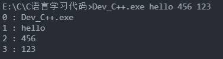

:::v-pre


# C语言


[[toc]]

## [程序结构](https://www.runoob.com/cprogramming/c-program-structure.html)

[stdio.h](https://www.runoob.com/cprogramming/c-standard-library-stdio-h.html) 标准库

```c
# include <stdio.h>

int main()
{
    ...
	return 0;
}
```

## 常用内置函数

### [printf](https://www.runoob.com/cprogramming/c-function-printf.html)

格式化输出指定的类型

```c
printf("Hello World");

// %d 说明后面有一个整数要输出在这个位置上
printf("%d\n",23+43);
printf("23+43=%dn",23+43);
```

### [scanf](https://www.runoob.com/cprogramming/c-function-sprintf.html)

scanf函数可以输入

```c
int price = 0;
printf("请输入: ");
scanf("%d", &price); // scanf 将读取到的整数(%d)赋值给 price
printf("你输入的值是%d\n", price);

// 还可以接受多个输入
int a, b;
printf("请输入两个整数: ");
scanf("%d %d", &a, &b);
printf("%d + %d = %d\n", a, b, a + b);
```

- 注意点:
  - scanf括号里写什么格式, scanf 就必须要读取到什么格式的数据, 如:
    1. `scanf("%d,%d", &a, &b);` 接受的输入必须是 `整数1,整数2`
    2. `scanf("%d %d,", &a, &b);` 接受的输入必须是 `整数1 整数2,`
    3. `scanf("hello %d %d", &a, &b);` 接受的输入必须是 `hello 整数1 整数2`

### rand

随机生成一个整数

```c
#include <stdio.h>
#include <stdlib.h>
#include <time.h> 

int main()
{
    srand(time(0));
	int a = rand();
	printf("%d\n", a);
	return 0; 
}
```

```
\n 换行
\t 制表符
```

## [数据类型](https://www.runoob.com/cprogramming/c-data-types.html)

```c
// 定义变量
int a; 
int b, c;
// 定义常量
const int AMOUNT = 1;
```

### 整数

chart: 1字节 -128 ~ 127

short: 2字节 -32768 ~ 32767

init: 取决于编译器(CPU), 通常的意义是" 一个字 "

long: 4字节

long long: 8字节

> 没有特殊需要, 只使用 int 就可以了

> c语言中没有布尔值类型, 可以使用1或者0表示, 1表示 true, 0表示 false

#### 计算机内部表达负数

使用补码的形式

希望 -1 + 1 —> 0
    0 -> 00000000
    1 -> 00000001
    11111111 + 00000001 -> 1 00000000

因为 0 - 1 -> -1, 所以, -1=
    1 0000000 - 00000001 -> 11111111

111111111当作纯二进制看待时, 是255, 被当作补码看待时是-1
    同理, 对于-a, 其补码就是0-a, 实际是 **2<sup>n</sup>-a**, n是这种类型的位数

> 补码的意义就是那补码和原吗可以加出一个溢出的 " 零 "

#### 数的范围

对于一个字节(8位), 可以表达的是:
    00000000 - 11111111

其中
    00000000 > 0
    11111111 ~ 100000000 -> -1 ~ -128 // 负数范围
    00000001 ~ 01111111 -> 1 ~ 127 // 正数范围

```c
char c = 255;
int i = 255;
printf("c=%d, i=%d\n", c, i); // c=-1, i=255
// char 1个字节 11111111 -> -1(最高位为1是负数)
// int 8个字节 00000000 00000000 00000000 11111111 -> 255
```

> 计算一个整数类型的范围: **-2<sup>n-1</sup> ~ -2<sup>n-1</sup>-1** 

#### unsigned

**以二进制的方式进行计算(没有补码)**

如果一个字面量常数想要表达自己是 unsigned
	可以在后面加u或∪, 例如: 255U
用l或L表示long(long)

```c
unsigned char c = 255;
int i = 255;
printf("c=%d, i=%d\n", c, i); // c=255, i=255
// unsigned 以二进制的方式进行计算(没有补码)
// char 1个字节 00000000 -> 11111111 -> 0 ~ 255
```

> unsigned 的初衷并非扩展数能表达的范围, 而是为了做**纯二进制运算**, 主要是为了**移位**

#### 整数越界

```
整数是以纯二进制方式进行计算的,所以
11111111 + 1 —> 100000000 —> 0 (-1 + 1)
01111111 + 1 -> 10000000 -> -128 ( 127 + 1 )  // 二进制最高位为1表示负数, 故等于-128
10000000 - 1 -> 01111111 -> 127 (-128-1)
```

```c
// 正负数越界
char c = 127 + 1;
char d = -128 - 1;
printf("c=%d, d=%d\n", c, d); // c=-128 d=127

// 二进制越界
unsigned char e = 255 + 1;
unsigned char f = 0 - 1;
printf("unsigned e=%d\n", e); // unsigned e=0
printf("unsigned f=%d\n", f); // unsigned f=255
```

#### 整数的输入输出

- 只有两种形式: int 或 long long

  - `%d`: int
  - `%u`: unsigned  int
  - `%ld`: long long
  - `%lu`: unsigned long long

  > **等于 int 或 比 int 小的整数都用 %d, 比 int 大的都用 %ld 但是输入 short 要使用 %hd**

#### 8进制和16进制

一个以 `0` 开始的数字字面量是**8进制**
一个以 `0x `开始的数字字面量是**16进制**

`%o`用于8进制, `%x` 或者 `%X`用于16进制

```c
int c = 012;
int i = 0x12;
// 以十进制输出 c 和 i
printf("c=%d, i=%d\n", c, i); // c=10, i=18

// 以8进制输出c, 以16进制输出i
printf("c=%o, i=%x\n", c, i); // c=12, i=12
```

> 使用 printf 输出8进制或者16进制是**不带前缀的**需要的话可以手动添加

### 浮点数

float: 4字节, (1.2E-38 ~ 3.4E+38) , 7位有效位

double: 8字节,  (2.3E-308 ~ 1.7E+308), 15位有效位

long double: 16字节, (3.4E-4932 ~ 1.1E+4932), 19位有效位

> 没有特殊需要, 只使用 double 就可以了

#### 浮动数输入输出

- float
  - scanf: `%f`
  - printd: `%f, %e`
- double
  - scanf: `%lf`
  - printf: `%f, %e` 
- long double

#### 输出精度

在%和f之间加上.n可以指定输出小数点后几位, 这样的输出是做4舍5入的

```js
printf("%.3f\n", -0.0049); // -0.005
printf("%.4f\n", -0.00049); // -0.000
printf("%.30f\n", -0.0049);// -0.004899999999999999800000000000
```

#### 浮动运算精度

```c
float a, b, c;
a = 1.345f;
b = 1.123f;
c = a + b;
if (c == 2.468){
    printf("相等\n");
} else {
    printf("不相等! c=%.10f, 或%f\n", c, c); // 不相等! c=2.4679999352, 或2.468000
}
```

带小数点的字面量**是double**而非float

float需要用 **f 或者 F 后缀来表明身份**

int 表示 正无穷大

-int 表示负无穷大

nan 表示不是一个数

### 字符类型

char 是一种整数, 也是一种特殊的类型: 字符。
这是因为: 
	用**单引号**表示的字符字面量如: **'a', '1'**
	**''** 也是一个字符
	在 printf 和 scanf 里用`%c`来输入输出字符

#### bool

布尔值类型, 需引入 `#include <stdbool.h>`

```c
bool b = 6>5;
bool t = true; 
bool f = false;
printf("%d\n", b); // 1
printf("%d\n", t); // 1
printf("%d\n", f); // 0
```

> 实际上还是整数 1 或者 0, 来表示 true 或者 false

## sizeof

运算符, 可以给出指定类或变量在内存中的所占据的字节大小

```c
double n=3.14;
printf("sizeof(int)=%ld\n",sizeof(int)); // 4
printf("sizeof(n)=%ld\n",sizeof(n)); // 8
```

> sizeof 是静态运算符, 括号里面不可以做运算 (运算不生效)

## [循环](https://www.runoob.com/cprogramming/c-loops.html)

### switch 语句

- **witch** 语句条件是常量表达式，必须是一个**整型或枚举类型**

### goto

**goto** 语句允许把控制无条件转移到同一函数内的被标记的地方

```c
for (int i = 0; i < 10; i++) {
    for (int j = 0; j < 10; j++) {
        printf("%d ", j);
        if (j == 5)
            goto out;
    }
}
out:
printf("我跳出来了");
```

> 只在**跳出多重循环**时建议使用 goto, 在其他地方尽量不要使用 goto 语句

## [转义字符](https://www.runoob.com/cprogramming/c-constants.html)

转义字符(逃逸字符)是用来表达无法印出来的控制字符或者特殊字符，它由一个反斜杠 \ 开头，后面跟上另一个字符，这两个字符合起来，组成一个字符

| 字符 | 意义     | 字符 | 意义   |
| ---- | -------- | ---- | ------ |
| \b   | 回退一格 | \\"  | 双引号 |
| \t   | 制表符   | \\'  | 单引号 |
| \n   | 换行     | \\\  | 反斜杠 |
| \r   | 回车     |      |        |

## 类型转换

### 运算自动转换

当运算符的两边出现不一致的类型时, 会自动转换成较大的类型

大的意思是能表达的数的范围更大

char -> short -> int -> long -> long long
int -> float -> double

### 输入输出转换

对于 printif, **任何小于int的类型会被转换成int; foat会被转换成 double**

但是 scant不会, 要输入 short, 需要`%hd`

### 强制类型转换

要把一个强制转换成另一个类型(通常是较小的类型), 需要: 

```c
// (类型)值
(int)10.2;
(short)32;
```

需要注意安全性, 小的变量不一定能表示大的量: 

```c
printf("%d\n",(char)32768); // 0
printf("%d\n",(short)32768); // -32768
```

强制类型转换并不改变那个变量的值或者类型, 只是计算出了一个新的类型的值

```c
int i = 32768;
short s = (short)i;
printf("%d\n",s); // -32768
printf("%d\n",i); // 32768
```

> 强制类型转换的计算优先级高于四则运算

## [函数](https://www.runoob.com/cprogramming/c-functions.html)

```c
// 函数定义语法
返回值类型 函数名(形参1类型 形参1, 形参2类型 形参2){
    ...
}

void hello(){ // void 表示没有返回值
    printf("hello function\n");
}
```

> 使用 void 定义的函数不能 return 值出去, 也不能做函数返回值赋值

函数参数的注意点:

- 函数调用时参数类型和函数定义的类型不匹配时, c语言的编译器会自动进行类型转换, 
  - 但是自动转换后的结果可能就不对了
- c语言在调用函数时, 永远只能传递值给函数 (没有引用关系)

### 函数的原型

可以在 min 函数前声明需要用到的函数原型

```c
void hello(void); // 声明hello函数原型, 没有返回值, 不接受参数

int main(){
    hello();
    hello();
    return 0;
}

void hello(){ // 定义hello函数 
    printf("hello function\n");
}
```

> 在函数内部 **`__func__`** 变量使用 **`%s`** 可以获得函数的名字

#### 函数原型的定义问题:

1. 函数的原型和定义需要保持一致

2. 函数的原型可以只写参数类型不写参数名, 一般不推荐这样写

3. 函数在声明原型时如果不接受参数, 建议写成 `void fnName(void);` 避免出现不必要的麻烦
4. c语言不允许函数嵌套定义 (main函数不算)

#### main函数

main函数是c语言程序的入口, return 0是有意义的

### [作用域](https://www.runoob.com/cprogramming/c-scope-rules.html)

#### 局部变量 (本地变量)

- 函数的每次运行,就产生了一个独立的变量空间, 在这个空间中的变量,
  - 是函数的这次运行所独有的,称作局部变量 (本地变量)

- 定义在函数内部的变量就是局部变量, 参数也是局部变量

#### 全局变量

- 定义在函数外面的变量是全局变量

- 全局变量具有全局的生存期和作用域
  - 它们与任何函数都无关
  - 在任何函数内部都可以使用它们
- 全局变量和函数的局部变量冲突, 以局部变量为主 (全局变量会隐藏)

#### 全局变量的初始化

- 没有做初始化的全局变量会得到0值
  - 指针会得到NULL值

- 只能用编译时刻已知的值来初始化全局变量

- 它们的初始化发生在 main 函数之前

### 静态全局变量

- 在本地变量定义时加上 **static ** 修饰符就成为静态本地变量

- 当函数离开的时候,静态本地变量会继续存在并保持其值

- 静态本地变量的初始化只会在第一次进入这个函数时做
  - 以后进入函数时会保持上次离开时的值

```c
void f(void);

int main()
{
    f(); // 1 3
    f(); // 3 5
    f(); // 5 7
    return 0;
}
void f(void)
{
    static int all = 1;
    printf("%s, %d\n", __func__, all);
    all += 2;
    printf("%s, %d\n", __func__, all);
}
```

静态本地变量实际上是特殊的全局变量它们位于相同的内存区域

静态本地变量具有全局的生存期,函数内的局部作用域

statIc 在这里的意思是局部作用域(本地可访问)

### 变量的生存期和作用域

- 生存期: 什么时候这个变量开始出现了, 到什么时候它消亡了

- 作用域: 在 (代码的) 什么范围内可以访问这个变量 (这个变量可以起作用)

- 对于局部变量, 这两个问题的答案都是在大括号内——块

## [数组](https://www.runoob.com/cprogramming/c-arrays.html)

- c语言的数组是固定的容器, 其中所有的元素具有相同的数据类型,

- 一旦创建大小不能改变, 数组中的元素在内存中是连续依次排列的, 

定义指定长度的数组: 

```c
// 定义数组时数组的长度必须是整数
int nums[10]; // nums 数组里的每个元素都是int类型, 长度是10
double dous[20]; // dous 数组里的每个元素都是double类型, 长度是20
```

定义数组并初始化值:

```c
// 定义时在大括号里给出数组所有元素的初始值
int nums[] = {1,2,3,4,5};

// 未指定的位置默认为0
int a[5] = {1, 2};// a ==> 1 2 0 0 0

// 可以指定一个0来默认初始化数组的所有变量都为0
int b[5] = {0};// b ==> 0 0 0 0 0

// 还可以初始化指定位置的变量
int c[5] = {[1] = 2, [2] = 3, 4}; // c ==> 0 2 3 4 0
```

### 数组的有效下标范围

编译器和运行环境都不会检查数组下标是否越界, 无论是对数组单元做读还是写

一旦程序运行, 越界的数组访问可能造成问题, 导致程序崩溃

所以需要保证程序只使用有效的数组下标值: `0 ~ 数组的大小-1`

利用 `sizeof`来计算数组的大小:

```c
int a[5];
printf("a数组的总内存大小: %lu\n", sizeof(a)); // 20
printf("a数组的单个元素内存大小: %lu\n", sizeof(a[0])); // 4
printf("a数组的长度: %lu\n", sizeof(a)/sizeof(a[0])); // 5
```

> :bulb:xxx数组的长度为: `sizeof(xxx) / sizeof(xxx[0]);`

### 数组的赋值

数组变量本身不能被赋值

要把一个数组的所有元素交个另一个数组, 必须使用循环遍历, 逐个赋值

### 数组作为函数的参数(形参)时:

不能在 参数[] 中给出数组的长度

不能在使用 sizeof 来计算数组的长度

```c
// 找出 key 在数组 a 中的位置
int search(int key, int a[], int length){
    int ret = -1;
    for (int i = 0; i < length; i++){
        if (a[i] == key){
            ret = i;
            break;
        }
    }
    return ret;
}
```

### 二维数组的初始化

```c
int a[][5] = {	
    {0,1,2,3,4},	
    {2,3,4,5,6},
};
```

列数必须给出, 行数自动生成

每行一个 {}, 逗号分隔,

省略列里的某些表示补零

也可以用定位

## 运算符&

`scanf(“%d",&i);`里的&

是获得变量的地址,它的操作数必须是变量

```c
int i; printf(%p",&i);
```

输出使用: `%p` 以内存地址的方式输出 (十六进制)

### &不能取的地址

&不能对没有地址的东西取地址, 如: `int p = &(i++);`

### 数组的地址

**数组的地址等于数组的第0个元素的地址**

**数组里相邻元素的地址相差一个数组元素类型**

```c
int a[10];
printf("%p\n", a); // 000000000061FDF0
printf("%p\n", &a); // 000000000061FDF0
printf("%p\n", &a[0]); // 000000000061FDF0
printf("%p\n", &a[1]); // 000000000061FDF4
printf("%p\n", &a[2]); // 000000000061FDF8
```

## [指针](https://www.runoob.com/cprogramming/c-pointers.html)

就是保存地址的变量

```c
int i = 10;
int *p = &i; // 定义一个 int 类型的指针变量p, 指向i的值

// p是一个指针 *p是指针指向的值
```

- 指针定义时需带上 * 表示指针变量
- 定义以后 *p 表示 指针指向的值, p表示是一个指针

### 指针变量

指针变量的值是内存的地址

普通变量的值是实际的值

**指针变量的值是具有实际值的变量的地址**

### 作为参数的指针

```c
void f(int *p);
```

在被调用的时候得到了某个变量的地址

```c
int i=10; 
f(&i);
```

在函数里面可以通过这个指针访问外面的这个 i 变量

```c
void f(int *p){
    printf(" p=%p", p);	 // 读取 p 指针的地址
    printf("*p=%d", *p); // 读取 p 指针地址对应的值
    *p = 123;            // 修改 p 指针地址对应的值
}
```

使用 * 可以访问指针地址的变量

可以做左值也可以做右值

```c
int k = *p; // 读取 p 指针地址对应的值
*p = 123; // 修改 p 指针地址对应的值
```

左值之左右叫左值是因为出现在赋值号左边的不是变量, 而是值,

是表达式 (如 *, [] ) 计算的结果: 是特殊的值,所以叫做左值

### 返回指针的函数

- 返回局部变量的地址是危险的
  - 离开函数局部变量就不存在了

- 返回 全局变量或静态本地变量的地址 是安全的

- 返回在函数内 malloc 的内存是安全的, 但是容易造成问题

- 最好的做法是返回传入的指针

```c
#include <stdio.h>

int *f(void);
void g(void);

int main()
{
    int *p = f();
    printf("*p=%d\n", *p); // 10
    g();                   
    printf("*p=%d\n", *p); // 99 f函数返回的 i的指针的地址被分配给g函数里面的k了
    return 0;
}
int *f(){ // OK
    int i = 10;
    return &i;
}
void g(){ // NG
    int k = 99; // 这里k的地址就是f函数里面 i分配过的地址
    printf("k =%d\n", k); // 99
}
```

> :warning: 指针返回局部变量的地址是危险的, 当这个函数使用完以后这个地址会被继续分配给其他的函数使用

- 不要使用全局变量来在函数间传递参数和结果
- 尽量避免使用全局变量
- 使用全局变量和静态本地变量的函数的线程不安全的

### 指针的运算符 & 和 *

互相反作用

```c
int yptr = 100;
*&yptr -> *(&yptr) -> *(yptr的地址) -> 得到那个地址上的变量 -> 100
&*yptr -> &(*yptr) -> &(yptr) -> 得到yptr的地址
```

### 指针的使用:

函数返回多个值, 需要通过指针返回

```c
// 交换两个变量
void swap(int *pa, int *pb){
    int t = *pa;
    *pa = *pb;
    *pb = t;
}
```

函数返回运算的状态, 通过指针返回

常用的是让函数返回特殊的不属于有效范围内的值来表示出错

-1 或者 0 (在文件操作时经常会看到)

```c
// 两数相除, 成功返回1, 失败返回0
int divide(int a, int b, int *result){
    int ret = 1;
    if (b == 0){
        ret = 0;
    } else {
        *result = a / b;
    }
    return ret;
}
```

> :warning: 指针的常见错误: 定义了指针变量, 还没有指向任何变量, 就开始使用指针

### 传入函数的数组

传入函数参数的数组实际上是一个指针

```c
int a[10];
arr(a);
void arr(int a[]){ // 在函数中使用 sizeof 相当于是计算指针的大小    
    sizrof(a); // ==> sizeof(*a);
}
```

数组变量就是特殊的指针

​	数组变量本身表达的就是地址

```c
int a[10];
printf("%p\n", a); // 无需用 & 取地址
// 但是取数组的每个元素的值, 必须使用 & 取地址
printf("%p\n", &a[1]);
printf("%p\n", &a[2]);
```

指针也可以使用 [] 运算符, 类似于数组的数组下标的使用

```c
int a[] = {1, 2, 3};
int *p = a; // 无需用 & 取地址
printf("%d\n", a[2]); // 3
printf("%d\n", p[2]); // 3
```

数组也可以使用 * 运算符, 类似于指针的用法 (默认访问数组的第0位)

```c
int a[] = {1, 2, 3};
printf("%d\n", *a); // 1
a[0] = 999;
printf("%d\n", *a); // 999
```

数组变量实际上是 const 的指针, 不能被赋值

```c
int a[10]; // --> int * const a = ...
int b = a; // Error! 不能被直接赋值 
```

### 指针和const

指针可以是 const

指针指向的值也可以是 const

#### 指针是const

表示指针一旦得到某个变量的地址, 就不能再指向其他的变量

```c
int i = 1;
int * const q = &i; // q这个指针是 const 的 
*q = 999; // 可s以修改 q指针指向的值
// q++; // Error! 不可以再修改 q指针的指向
```

指针所指向的值是 const

```c
int i = 1;
int const *p = &i;
// *p = 999; // Error! p指针指向的值(*p)是 const 的不允许修改
i = 123; // ok
int j = 2; 
p = &j; // ok
```

const 在 * 的前面还是后面是不一样的

​	const 在 * **前面**表示: 不能通过**该指针去修改该指针所指向的值**

​	const 在 * **后面**表示: 不能**再次修改该指针的指向**

### 非const的值转换为const

总是可以把一个非const的值转换为const

```c
void f(const int *x);
int a = 1;
f(&a); // ok

const int b = 2;
f(&b); // ok

// 在对应的函数里不能修改 const 的参数
void f(const int *x){
    x = 999; // Error!
}
```

#### const数组

数组变量本身就是 const 的指针, 下面的 const 表示数组里的每一项都是 const

```c
const int a[] = {1, 2, 3, 4, 5};
```

> const 数组必须通过初始化赋值才可以指定数组的每一项都是 const 

#### 保护数组的值

把数组传入函数时传递的是地址, 所以在那个函数内部可以修改数组的值
为了保护数组不被函数破坏, 可以设置参数为 const

```c
// 函数定义时指定参数为 const void arr(const int a[]);
```

### 指针运算

给一个指针加1表示要让指针指向下一个变量
如果指针不是指向一片连续分配的空间
如数组, 则这种运算没有意义

```c
int ac[] = {0, 1, 2, 3, 4, 5, 6, 7, 8, 9};
int *p = ac;
printf("p  = %p\n", p); // 0x61FDF0
printf("p+1= %p\n", p+1); // 0x61FDF4
printf("*(p+5)= %d\n", *(p+5)); // 5 --> *(p+n) -> ac[n]
```

指针还可以做: +, +=, -, -=, ++/--

```c
int ac[] = {0, 1, 2, 3, 4, 5, 6, 7, 8, 9};
int *p = ac;
int *p1 = &ac[5];
printf("p1 - p = %d\n", p1 - p); // 6 --> ac[0] ~ ac[6] 之间的字节数 24字节(4*6)
```

#### *p++

取出p指针所指向的数据来, 之后顺便把p移到下一个位置去

*的优先级没有++高, 常用于**数组类的连续空间操作**

在某些CPU上,这可以直接被翻译成一条汇编指令

```c
int ac[] = {0, 1, 2, 3, 4, 5, 6, 7, 8, 9, -1};
int *p = ac;// 利用指针后移遍历数组
while (*p != -1){
    printf("%d ", *p++); // 0 1 2 3 4 5 6 7 8 9}
}
```

#### 指针比较

<, <=, ==, !=, >, >= 都可以用于指针

比较它们在内存中的地址

数组中的每个元素的地址是线性递增的

#### 0地址

- 内存中有0地址, 但是0地址通常是不能随便碰的地址

- 所以指针中不应该具有0值, 因此可以用0地址来表示特殊的事情
  - 返回的指针是无效的

  - 指针没有被真正初始化(先初始化为0或者Null)

- NUL是一个预定定义的符号, 表示0地址
  - 有的编译器不愿意让开发者使用用0来表示0地址

### 指针的类型

无论指向什么类型, 所有的指针的大小都是一样的, 都是地址

但是指向不同类型的指针是不能直接互相赋值的

这是为了避免用错指针

#### 指针的类型转换

- `void*` 表示不知道指向什么东西的指针

  - 计算时与 `char*` 相同(但不相通)

- 指针也可以转换类型 `(类型*)指针`

  ```c
  int i = 1;
  int *p = &i; // 将 p指针的类型转换为 void(类型不知道) 赋值给 q指针
  void *q = (void*)p;// 将 p指针的类型转换为 int 赋值给 a指针int *a = (int*)p;
  ```

  这并没有改变p所指的变量的类型, 而是让用不同的眼光通过p看它所指的变量
  
  我不再当你是int啦, 我认为你就是个void

### 指针的使用场景

- 需要传入较大的数据时用作函数参数
- 传入数组后对数组做操作
- 函数返回不止一个结果
  - 需要用函数来修改不止一个变量
- 动态申请内存

#### malloc

动态申请内存空间, 需引入 [<stdlib.h>](https://www.runoob.com/cprogramming/c-standard-library-stdlib-h.html) 标准库

```c
#include <stdlib.h>
void* malloc(size_t size);
```

向 malloc 申请的空间大小是以字节为单位的

返回的结果是void*, 需要类型转换为自己需要的类型

```c
(int*)malloc(n*sizeof(int));
```

> malloc 申请内存空间失败返回0, 或者NULL

##### malloc 可以申请的最大内存空间

```c
void *p;
int cnt = 0;
while ((p = malloc(100 * 1024 * 1024))){
    cnt++;
}
printf("一共分配了%d00MB的空间\n", cnt);
```

#### free

把 malloc 申请的空间归还 "系统"

申请过的空间, 最终都应该要还

```c
int number;
scanf("%d", &number);
int *a;// malloc 动态申请内存
a = malloc(number * sizeof(int));
// free 归还内存
free(a);
```

> free 可以释放 0 或者 NULL 不会报错, 所以要养成初始化指针为 0 或者 NULL 的习惯

##### free常见问题

- 申请了内存没有 free --> 长时间运行内存会逐渐内存下降

- free 过了再 free

- malloc 申请来的地址变了, 直接 free

## [字符串](https://www.runoob.com/cprogramming/c-strings.html)

以0(整数0)结尾的一串字符

0 或 '\0' 是一样的, 但是和 '0' 不同

- 0标志字符串的结束, 但它不是字符串的一部分
  - 计算字符串长度的时候不包含这个 '\0' (终止符)
- 字符串以数组的形式存在,以数组或指针的形式都可以访问
  - 更多的是以指针的形式使用
  - [string.h](https://www.runoob.com/cprogramming/c-standard-library-string-h.html) 标准库里有很多处理字符串的函数

```c
char word1[] = {'H', 'e', 'l', 'l', 'o'}; // 字符数组
char word2[] = {'H', 'e', 'l', 'l', 'o', '\0'}; // 字符串
```

### 字符串常量

也叫 字符串字面量

```c
char *str = "Hello"; // 字符串指针
char word[] = "Hello"; // 字符串数组
char line[10] = "Hello"; // 没用上的为空字符串 
```

- "Hello" 会被编译器变成一个字符数组放在某处, 这个数组的长度是6, 结尾还有表示**结束的0**
- c语言相邻的字符串常量会被自动连接起来

```c
printf("你好! "     
       "Hello"); // 你好! Hello
// 或者这样
printf("你好! \
Hello"); // 你好! Hello
```

- c语言的字符串是以字符串数组的形式存在的
  - 不能用运算符对字符串做运算
  - 通过数组的方式可以变量字符串
- 唯一特殊的地方就是字符串字面量可以用来初始化字符数组

#### 字符串常量的一些问题

如下: s 和 s2 是指向同一个内存地址

使用字符串常量定义的字符串是不能修改的 (默认使用 const)

如果修改会到导致程序崩溃

```c
char *s = "Hello World";
char *s2 = "Hello World";
// s[0] = 'B'; // Error! 不能修改字符串常量的值
printf("%p\n", s); // 0x404000
printf("%p\n", s2); // 0x404000
printf("%c\n", s[0]); // H
```

如果需要修改字符串, 应该使用字符串数组:

```c
char s3[] = "Hello World";
s3[0] = 'B';
printf("%p\n", s3);  // 0x61FE14
printf("%c\n", s3[0]); // B
```

- 如果要构造一个字符串 —> 字符串数组
- 如果要处理一个字符串 一> 字符串指针

### 字符串赋值

并没有产生新的字符串, 只是让指针 s 指向了

t 指针所指向的字符串, 对 s 的任何操作就是对 t 做的

```c
char *t = "title";
char *s = t;
```

### 字符串输入和输出

```c
char string[8];
scanf("%s", string);
printf("%s\n", string);
```

scanf 读入 **%s** 时会读入一个单词 (到结束, tab或回车为止)

scanf 读入 **%s** 是不安全的, 因为不知道要读入的内容的长度

#### 安全的输入

在 % 和 s 之间的数字表示最多允许读入字符的数量, 这个数字应该比数组的大小要小1

```c
char string[8];
scanf("%7s", string);
```

> scanf 超过指定大小的字符数会被交给下一次 scanf 读取

#### 常见错误

##### 字符串指针未初始化

```c
char *string;
scanf("%s", string);
```

以为 char* 就是定义了一个字符串类型的变量 string就直接使用

由于没有对 string初始化为 0 或 NULL, 所以运行时不一定会出错

##### 空字符串

`char buf[100] = "";` 这是一个空的字符串, 实际就是`buf[0] == '\0'`

如果这样写: `char buf2[] = "";` 这个字符串数组的长度只有1, 只有一个元素就是 `'\0'`

#### 程序参数

main函数也是有参数的

```c

int main(int argc, char *argv[])
{
    for (int i = 0; i < argc; i++){    
    	printf("%d : %s\n", i,argv[i]); // 0 : E:\C\C语言学习代码\Dev_C++.exe
	}	
    return 0;
}

```

argv[0] 是命令本身 (命令行执行这个程序的名称)

后续携带的参数被 argc 和 argv 所读取到



#### putchar

```c
int putchar(int c);
```

向标准输出写入一个字符

返回写了几个字符, EOF(-1)表示写入失败

#### getchar

```c
int getchart(void);
```

从标准输入读入一个字符

返回值类型是 int 是为了返回 EOF(-1)

#### 利用 putchar 和 getchar 行编辑

```c
int ch;
while( (ch=getchar()) != EOF ){    
    putchar(ch);
}
printf("EOF\n");
```

- windown --> Ctrl + Z
- UXlinux --> Ctrl + D

> Ctrl + C 会强制退出程序不会输出 EOF

## [string.h](https://www.runoob.com/cprogramming/c-standard-library-string-h.html)

**string .h** 头文件定义了一个变量类型、一个宏和各种操作字符数组的函数

### [strlen](https://www.runoob.com/cprogramming/c-function-strlen.html)

返回 s 的字符串长度(不包括结尾的0)

```c
size_t strlen(const char *str);
```

```c
char line[] = "Hello";
printf("strlen=%lu\n", strlen(line)); // 5
printf("sizeof=%lu\n", sizeof(line)); // 6 sizeof 不准确
```

#### [strcmp](https://www.runoob.com/cprogramming/c-function-strcmp.html)

比较两个字符串 (ASCII码)

0 表示相等

1 表示 str2 大

-1 表示 str1大

```c
int strcmp(const char *str1, const char *str2);
```

```c
char s1[] = "abc";
char s2[] = "abc";
char s3[] = "bbc";
char s4[] = "Abc";
printf("%d\n", strcmp(s1, s2)); // 0
printf("%d\n", strcmp(s1, s3)); // -1
printf("%d\n", strcmp(s1, s4)); // 1
```

##### strncmp

- strncmp 的 size_t 参数表示只比较前 n 个字符

```c
int strncmp(const char *str1, const char *str2, size_t n);
```

### [strcpy](https://www.runoob.com/cprogramming/c-function-memcpy.html)

把 src 的字符串拷贝到 dst

```c
char *strcpy(char *dst, const char *src);
```

可以使用 restrict 关键字来表明 src 和 dst 是不重叠的 (互相之间没有重叠的关系)

```c
char *strcpy(char *restrict dst, const char *src);
```

返回 dst, 方便后面的链式调用

#### 复制一个字符串

```c
// strlen 获取的长度需要+1
char *dst = (char*)malloc(strlen(src)+1);
strcpy(dst, src);
```

### [strcat](https://www.runoob.com/cprogramming/c-function-strcat.html)

```c
char *strcat(char *des, const char *src);
```

把 src 拷贝到 des 的后面, 拼接成一个长的字符串, 返回 des;

des 必须具有足够的空间

使用 restrict 关键字

```c
char *strcat(char *restrict des, const char *restrict src);
```

### strcpy 和 strcat 的安全问题

如果目的地没有足够的内存空间

- 可以使用安全版本的 strcpy 和 strcat 
  - 函数名多一个字母 n
  - 多一个参数 size_t 表示最大可以拷贝的内存空间

```c
char *strncpy(char *restrict dst, const char *src, size_t n);
char *strncat(char *restrict des, const char *restrict src, size_t n);
```

### [strchr](https://www.runoob.com/cprogramming/c-function-strchr.html)

在参数 **str** 所指向的字符串中搜索**第一次**出现字符 **c**（一个无符号字符）的位置

返回 NULL 表示没有找到

```c
char *strchr(const char *str, char c)
```

#### [strrchr](https://www.runoob.com/cprogramming/c-function-strrchr.html)

在参数 **str** 所指向的字符串中搜索**最后**一次出现字符 **c**（一个无符号字符）的位置

返回 NULL 表示没有找到

```c
char *strrchr(const char *str, char c)
```

#### 找第二个指定字符串

```c
char s[] = "hello";
char *p = strchr(s, 'l'); // 找第一个'l' --> p ==> 'llo'
p = strchr(p+1, 'l'); // 在 p 上继续找第二个'l'
printf("%s\n", p); // lo
```

## [枚举](https://www.runoob.com/cprogramming/c-enum.html)

枚举是一种用户定义的数据类型, 使用关键字 **enum** 定义:

```c
enum 枚举类型的名字 {名字0, 名字2, ..., 名字n};
```

枚举类型名字通常并不使用, 要用的是在大括号里的名字, 因为它们就是常量符号, 

它们的类型是 **int**, 值则依次从 **0 到 n**. 如: 

```c
enum colors {red, yellow, green};// 创建三个常量, red为0, yellow为1, green为2
```

- 枚举可以作为值
- 枚举类型可以跟上 **enum** 作为类型
- 实际上是以整数来做内部计算和外部输入输出的

```c
#include <string.h> 
enum color{red, yellow, green}; // 定义的枚举类型为 colo 值是red,yellow,green ==> 0, 1, 2
void fn(enum color c); // fn 函数接受的参数类型是 枚举类型 color
int main()
{
    enum color t = green; 
    scanf("%d", &t);      // 整数(int)接受输入
    fn(t);
    return 0;
}
void fn(enum color c){
    printf("%d\n", c); // 2  整数(int)接受输出
}
```

声明枚举时可以在最后面加一个 **numxxx** 的值来表示有多少个枚举类型的值

这样需要遍历所有的枚举量或者需要建立一个用枚举量做下标的数组的时候就很方便了

```c
enum COLOR {RES, YELLOW, GREEN, numColors};
char *colorNames[numColors] = { red, yellow, green };
```

### 指定枚举量

声明枚举量时可以指定值

```c
enum COLOR {RES=1, YELLOW, GREEN=99}; 	// ==>  RES = 1, YELLOW = 2, GREEN = 99
int main(){   	
    printf("YELLOW = %d", YELLOW); // YELLOW = 2   
    return 0;
}
```

> 即使给枚举类型的变量赋不存在的整数值也没有任何 warning 或 eror

```c
enum COLOR {RES=1, YELLOW, GREEN=99}; 
int main(){   	
    enum COLOR color = 0;	
    printf("color = %d", color); // color = 0    
    return 0;
}
```

- 虽然枚举类型可以当作类型使用, 但是实际上**很少使用**
- 如果有意义上排比的名字, 用枚举比 const int 方便
- 枚举比宏( macro)好, 因为枚举有int类型

## [结构类型](https://www.runoob.com/cprogramming/c-structures.html)

```c
struct date {    
    int year;    
    int month;    
    int day;
};
struct date today;
    today.year = 2021;
    today.month = 11;
    today.day = 21;
    printf("现在的时间是: %i-%i-%i",today.year,today.month,today.day); 
    	 // 现在的时间是: 2021-11-21 
```

### 声明结构类型

- 和局部变量一样, 在函数内部声明的结构类型只能在函数内部使用
- 通常在函数外部声明结构类型, 这样可以被多个函数所使用

#### 形式一

```c
// 声明结构体
struct point{  // 声明 point 结构的变量  
    int x;    
    int y;
}; 
struct point p1, p2; // p1和p2 里面都有 x和y
// 赋值
p1.x = xxx;
p2.y = xxx;
```

#### 形式二

```c
// 声明结构体
struct {    
    int x;    
    int y;
} p1, p2;// p1和p2 都是一种无名结构, 里面都有 x和y
```

#### 形式三

```c
struct point{    
    int x;    
    int y;
} p1, p2;// p1和p2 都是 point结构, 里面都有 x和y
```

> 第一和第三种形式, 都声明了**结构 point**, 但是第二种形式**没有声明结构的名字**, 只是定义了两个变量

### 结构的初始化

```c
struct date {    
    int year;    
    int month;    
    int day;
};
// 按照顺序赋值
struct date today1 = {2021, 11, 21};// ==> 按照顺序依次赋值
// 指定属性赋值
struct date today2 = {.year=1999, .month=4};// ==>  指定了属性的赋指定值, 未指定的为 0
```

### 结构成员

结构成员和数组成员有点像

数组使用 **[] 运算符和下标**来访问其成员

结构变量使用 **. 运算符和名字**来访问其成员

### 结构运算

要访问整个结构, 直接用结构变量的名字

对于整个结构, 可以做赋值、取地址, 也可以传递给函数参数

```c
struct point{    
    int x;    
    int y;
};// 先定义 p1, p2 为 point 结构
struct point p1, p2;
p1 = (struct point){5,10}; // 相当于p1.×=5; p1.y = 10;
p1 = p2; // 相当于p1.x = p2.x; p1.y = p2.y;
// 上面赋值以后 p1和p2 就是完全分开的两个结构, 之间没有任何关系
```

### 结构指针

和数组不同呢, 结构变量的名字并不是结构变量的地址, 必须使用 &运算符

```c
struct date *pDate = &today;
```

### 结构作为函数参数

```c
int fn(struct date d);
```

- 可以将整个结构可以作为参数的值传入函数 (不推荐这样做)

  - 这时候是在函数内新建一个结构变量, 并**复制调用者的结构的值** 

- **最好的做法是传递结构的指针**

  ```c
  struct date* fn(struct date *d);
  struct date* fn(const struct date *d);
  ```

### 指针访问结构里的成员

- 使用 **->** 运算符(不带 \*运算符)
- \*(p).xxx 的方式

```c
struct date {    
    int year;    
    int month;    
    int day;
};
struct date today = {2021, 11, 21};
struct date *pDate = &today; 
pDate->year = 9999; // 使用指针修改 today 结构里的 year
// 或者
(*pDate).year = 9999; 
```

### 结构中的结构

数组结构

```c
struct date {    
    int year;    
    int month;    
    int day;
};
struct date todays[] = {  
    {1999, 4, 1}, {2000, 5, 1}, {2001, 6, 1}, {2002, 7, 1}
};
```

结构类型里还有结构

```c
// 两个结构类型
struct date { int x; int y; };
struct time { int a; int b; };
// 结构里放结构
struct dateAndTime{    
    struct date d;    
    struct time t;
};
struct dateAndTime DA;

// 正常修改
DA.d.x = xxx;
DA.t.a = xxx;

// 指针访问结构的结构成员
int *p = &DA;
p->d.x = xxx;
// 或者
(*p).d.x = xxx;

// p->d->x = xxx; Error! 因为 d 不是指针
```

## 自定义数据类型

C语言提供了一个叫做 **[typedef](https://www.runoob.com/cprogramming/c-typedef.html)** 的功能来声明一个已有的数据类型的新名字, 比如:

```c
typedef int myInt; // typedef 原来的类型名 新的类型名
```

使得 **myInt** 成为 **int** 类型的别名这样,

**myInt** 这个名字就可以代替 **int** 出现在变量定义和参数声明的地方了

```c
myInt a, b, len; // ==> int a, b, len;
myInt numbers[10]; // ==> int numbers[10];
```

使用 typedef 可以重载已有的类型名字, 使其更清晰, 更有可读性

```c
typedef long int64_t; // long 的别名为 int64_t
typedef struct myDate {
// typedef struct{  匿名的也可以    
    int year;    
    int month;    
    int day;
} date; // myDate 的别名为 date
int64_t i = 10000000;
date d = {2021, 11, 21};
```

## 联合体 (共同体)

**联合体**是一种特殊的数据类型，允许您在相同的内存位置存储不同的数据类型

- 所有成员共享一个内存空间
- 同一时间只有一个成功是有效的
- union 的大小是其最大的成员
- 只对第一个成员做初始化

```c
union AnElt{    
    int i;    
    char c;
} elt1, elt2;

elt1.i = 1;
elt1.c = 'a';
elt2.i = 999;
```

## \#define

\# 开头的都是预处理指令

它们不是C语言的成分, 但是C语言程序离不开它们

\# define用来定义一个宏

```c
#include <stdio.h>

#define PI 3.14159 // 定义一个宏(PI) 值为 3.14159 
#define FORMAT "%f\n" // 定义一个宏(FORMAT) 值为 "%f\n" 
#define PI2 2*PI  // 定义一个宏(PI2) 值为 2*PI 
#define PRI printf("hello ");\ // 定义一个宏(PRI) 值为两次 printf
            printf("world")

int main()
{
    printf(FORMAT, PI2 * 3.0); // 18.849540
    PRI; // hello world
    return 0;
}
```

注意点: 

- 结尾是**没有分号**的, 因为不是C的语句
- 名字必须是一个单词, 值可以是各种东西 (包括空格)
  - 使用了宏会在C语言的编译器开始编译之前, 
  - 编译预处理程序(cpp)会把程序中的名字换成值, 完全的**文本替换**

- 如果一个宏的值中有其他的宏的名字, 也是可以的
- 如果一个宏的值超过一行, 最后一行之前的行末需要**加 \\**
- 宏的值后面出现的注释不会被当作宏的值的一部分

> 也可以定义没有值的宏, 一般用于条件编译

### 预先定义的宏

c语言预先有定义一些宏

- __LINE\_\_
  - 源代码文件的行号
- __FILE\_\_
  - 源代码的文件名
- __DATE\_\_
  - 编译时的日期
- __TIME\_\_
  - 编译时的日期
- __STDC\_\_
  - 当要求程序严格遵循**ANSIC标准时**该标识符被赋值为1

```C
printf("%s\n",__FILE__); // E:\C\C语言学习代码\Dev_C++.c
printf(":%d\n",__LINE__); // :6
printf("%s\n",__DATE__); // Nov 22 2021
printf("%s\n",__TIME__); // 21:04:54
```

### 携带参数的宏

有点类似于函数 (参数没有类型检查)

如果需要类型检查可以使用 **[inline](https://www.runoob.com/w3cnote/cpp-inline-usage.html) 函数**

```c
#include <stdio.h>

#define cube(x)((x)*(x)*(x)) // 定义一个宏(cube)有参数x 值为((x)*(x)*(x))

int main()
{
    printf("%d\n", cube(5)); // ==> (5)*(5)*(5)
    return 0;
}
```

❌ 错误的宏定义方式:

```c
#include <stdio.h>
#define A1(x)(x * 100) // Error
#define A2(x)(x) * 100 // Error
int main()
{    
    printf("%d\n", A1(5+2)); // 205       
    // 替换为 ==>  (5+2 * 100)    
    
    printf("%d\n", 200 / A2(1)); // 20000       
    // 替换为 ==>  200/(1) * 100   
    
    return 0;
}
```

### 带参数的宏定义原则

- 一切都要带括号
  - 整个值要括号
  - 参数出现的每个地方都要括号

```C
#define A1(x)((x) * 100)
```

多种类型的参数宏定义:

```c
#define MIN(a,b)((a)<(b)?(a):(b))// 也可以组合(嵌套)其他的宏
```

> :warning: 宏定义最后一定一定不要加**分号 (;)**

## 项目

在DevC++中新建一个项目, 然后把几个源代码文件加入进去

对于项目, DeVC++的编译会把一个项目中所有的源代码文件都编译后, 链接起来

有的IDE有分开的编译和构建两个按钮, 前者是对单个源代码文件编译, 后者是对整个项目做链接

### 头文件

把函数原型放到一个头文件 **(以.h结尾)** 中,在需要

**调用 / 定义** 这个函数的源代码文件(.c文件)中 **#include** 这个头文件,

就能让编译器在编译的时候知道函数的原型

> 在头文件里是可以引入其他的头文件的

> 💡一般的做法就是**任何.c文件**都有对应**同名的.h文件**, 把所有对外公开的函数的原型和全局变量的声明都放进去

头文件的一些规则: 

- 声明才可以被放在头文件中
  - 这是规则不是一定要遵守的
  - 否则会造成一个项目中多个编译单元里有重名的实体
- 某些编译器允许几个编译单元 (.c文件) 中存在同名的函数, 或者用 [weak](https://blog.csdn.net/sinat_36544290/article/details/104635316) 修饰符来强调这种存在

### \#include

\#include 是一个编译预处理指令, 和宏一样, 在编译之前就处理了

它把那个文件的全部文本内容原封不动地插入到它所在的地方

所以也不是一定要在c文件的最前面 \#include

### 使用 "" 或 <>

\#include 有两种形式来指出要插入的文件

- **\#include "xxx.h"** 要求编译器首先在当前目录(c文件所在的目录)
  - 寻找这个文件, 如果没有则到编译器指定的目录去找
- **\#include <xxx.h>** 让编译器只在指定的目录去找
- 编译器自己知道自己的标准库的头文件在哪里
- 环境变量和编译器命令行参数也可以指定寻找头文件的目录

### #include的误区

- \#include 不是用来引入库的
- **stdio.h** 里只有 printf 的原型, printf 的代码在另外的地方,某个.lib( Windows)或.a(Unix)中
- 现在的C语言编译器默认会引入所有的标准库
- **\#include < stdio. h>**只是为了让编译器知道printf 函数的原型
  - 保证你调用时给出的参数值是正确的类型

### 头文件中不对外公开的函数

- 在函数前面加上 **static** 就使得它成为只能在所在的编译单元(.c文件)中被使用的函数
- 在全局变量前面加上 **statIc** 就使得它成为只能在所在的编译单元(.c文件)中被使用的全局变量

### 头文件定义全局变量

变量和函数一样也是有声明的

- 变量的定义: **`int i;`**

- 变量的声明: **`extern int i;`**
  - 变量声明的时候不能初始化

### 声明和定义

- 声明不产生代码的东西, 告诉编译器有这个声明的东西存在
  - 函数声明 (原型)
  - 变量声明
  - 结构声明
  - 枚举声明
  - 类型声明 (typedef)
  - 宏声明
  - inline 函数

- 定义是产生代码的东西

同一个编译单元里, 同名的结构不能被重复声明

如果你的头文件里有结构的声明, 很难这个头文件不

会在一个编译单元里被 #include 多次

所以需要 “标准头文件结构", 如下:

```c
#ifndef _MAX_H_ // 如果 _MAX_H_ 这个宏没有定义则往下走, 否则不会往下走
#define _MAX_H_ // 定义这个宏
// 声明下面的一些东西

int max(int a, int b);
extern int gAll;

#endif // 结束 
```

运用条件编译和宏, 保证这个头文件在

​	一个编译单元中只会被 **\#include一次**

**\#pragma once** 也能起到相同的作用,

​	但是不是所有的编译器都支持

## 格式化输入输出

- [printf](https://www.runoob.com/cprogramming/c-function-printf.html)

  printf函数格式化输出指定的类型

  - `%[flags][width][.prec][hIL]type`

  |  flag   |             含义             |
  | :-----: | :--------------------------: |
  |    -    |            左对齐            |
  |    +    | 在前面放 + 或 - (不影响结果) |
  | (space) |           正数留空           |
  |    0    |            0填充             |

  ```c
  printf("%9d\n", 123);  //      123
  printf("%09d\n", 123); //000000123
  printf("%-9d\n", 123); // 123
  printf("%+9d\n", 123); //      +123
  ```

  | width 或 prec |            含义            |
  | :-----------: | :------------------------: |
  |    number     |         最小字符数         |
  |      \*       |     下一个参数是字符数     |
  |   \.number    |       小数点后的位数       |
  |     \.\*      | 下一个参数是小数点后的位数 |

  ```c
  printf("%9.2f\n", 123.0); //    123.00
  // ==> 9.2 整个输出占9个位置小数点后2位
  
  printf("%*d\n", 6, 123); //   123
  // ==> 整数并且整个输出占6个位置, 前面补空白
  
  printf("%6d\n", 123); //   123
  // 和上面一样
  
  printf("%.*d\n", 5, 123); // 00123
  // ==> 整数并且整个输出占6个位置, 前面补0
  
  printf("%.5d\n", 123); // 00123
  // 和上面一样
  ```

  | 类型修饰(hIL) |    含义     |
  | :-----------: | :---------: |
  |      hh       |  单个字节   |
  |       h       |    short    |
  |       l       |    long     |
  |      ll       |  long long  |
  |       L       | long double |

  |  type  |        用于        |  type  |        用于        |
  | :----: | :----------------: | :----: | :----------------: |
  | i 或 d |        int         |   g    |       float        |
  |   u    |    unsigned int    |   G    |       float        |
  |   o    |       八进制       | a 或 A |    十六进制浮点    |
  |   x    |      十六进制      |   c    |        char        |
  |   X    | 字母大写的十六进制 |   s    |       字符串       |
  | f 或 F |      float, 6      |   p    |        指针        |
  | e 或 E |        指数        |   n    | 读入 /  写出的个数 |

- [scanf](https://www.runoob.com/cprogramming/c-function-sprintf.html)

  scanf函数可以输入

  - `%[flag]type`

  | flag |    含义    | flag |     含义      |
  | :--: | :--------: | :--: | :-----------: |
  |  \*  |    跳过    |  l   | long / double |
  | 数字 | 最大字符数 |  ll  |   long long   |
  |  hh  |    char    |  L   |  long double  |
  |  h   |   short    |      |               |

  ```c
  int num;
  scanf("%*d%d", &num); // 输入 10 99 
  printf("%d\n", num); // 跳过 10 输出 99 
  ```

  |  type   |           用于            | type  |     用于     |
  | :-----: | :-----------------------: | :---: | :----------: |
  |    d    |            int            |   s   | 字符串(单词) |
  |    i    | 可以为 整数 16进制 8 进制 | [...] | 所允许的字符 |
  |    u    |       unsigned int        |   p   |     指针     |
  |    o    |          八进制           |   x   |   十六进制   |
  | a,e,f,g |           float           |   c   |     char     |

### printf 和 scanf 的返回值

- 读入的项目数
- 输出的字符数
- 在要求严格的程序中, 应该判断每次调用 printf 或
  - scanf 的返回值,从而了解程序运行中是否存在问题

```c
int num;
int i1 = scanf("%i", &num); // 输入 1234
int i2 = printf("%d\n", num); 
printf("%d:%d\n", i1, i2); // i1=1 i2=5(\n算一个字符)
```

## 文件的输入输出

命令行使用 > 和 < 做重定向可以让文件的输入输出到指定文件中去

### [fopen](https://www.runoob.com/cprogramming/c-function-fopen.html)

使用 fopen函数 读取文件的基本代码

```c
#include<stdio.h>

int main() {
    FILE *fp = fopen("hello.txt", "r");
    if (fp){
    	int num; 
        fscanf(fp, "%d", &num);
        printf("%d\n", num);
        fclose(fp);
    } else {
        printf("无法打开文件\n");
    }
   	return 0;
}
```

|  参数  |                        含义                        |
| :----: | :------------------------------------------------: |
|   r    |                      打开只读                      |
|   r+   |               打开读写, 从文件头开始               |
|   W    |     打开只写。如果不存在则新建, 如果存在则清空     |
|   W+   |     打开读写。如果不存在则新建, 如果存在则清空     |
|   a    | 打开追加。如果不存在则新建, 如果存在则从文件尾开始 |
| [w/a]x |          只新建, 如果文件已存在则不能打开          |

## 二进制文件

- 其实所有的文件最终都是二进制的
- 文本文件无非是用最简单的方式可以读写的文件
  - more、tail
  - cat
  - vi
- 而二进制文件是需要专门的程序来读写文件
- 文本文件的输入输出是格式化，可能经过转码

### 文本 和 二进制

- 文件的优势是方便人类读写, 而且却跨平台
  - 文本的缺点是程序输入输出要经过格式化, 开销大

- 二进制的缺点是人类读取困难, 而却不跨平台
  - int的大小不一致, 大小端问题
  - 二进制的优点是程序读写块

### 程序为什么要文件

- 配置
  - Unix用文本，Windows用注册表
- 数据
  - 稍微有点量的数据都放数据库了
- 媒体
  - 这个只能是二进制的
- 现实是，程序通过第三方库来读写文件，很少直接读写二进制文件了

### 二进制读写

#### [fread](https://www.runoob.com/cprogramming/c-function-fread.html)

读取文件以二进制形式

```c
size_t fread(void *ptr, size_t size, size_t nitem, FILE *stream)
```

参数

- **ptr**: 这是指向要被写入的元素数组的指针
- **size**: 这是要被写入的每个元素的大小，以字节为单位。
- **nitem**: 这是元素的个数，每个元素的大小为 size 字节
- **stream**: 这是指向文件指针

- 返回的是成功读取的字节数

> 二进制文件的读写一般都是通过对一个结构变量的操作来进行的, nitem参数就是用来说明这次读写几个结构变量

#### [fwrite](https://www.runoob.com/cprogramming/c-function-fwrite.html)

写入文件以二进制形式

```c
size_t fwrite(const void *ptr, size_t size, size_t nitem, FILE *stream)
```

参数和 `fread函数类似`

#### 文件定位

##### [ftell](https://www.runoob.com/cprogramming/c-function-ftell.html)

 返回给定流 stream 的当前文件位置

```c
long ftell(FILE *stream);
```

##### [fseek](https://www.runoob.com/cprogramming/c-function-fseek.html)

```c
int fseek(FILE *stream, long offset, int whence);
```

offset: 相对 whence 的偏移量，以字节为单位

whence常量:  

- SEEK_SET: 从头开始
- SEEK_CUR: 从当前位置开始
- SEEK_END: 从尾开始（倒过来）

## [按位运算](https://www.runoob.com/w3cnote/bit-operation.html)

c语言是有按位运算符的运算符:

| 运算符  |    含义    |
| :-----: | :--------: |
| **.&**  |  按位的与  |
| **.\|** |  按位的或  |
| **.~**  |  按位取法  |
| **.^**  | 按位的异或 |
| **.<<** |    左移    |
| **.>>** |    右移    |

### 按位与 &

- 如果 **(x)<sub>i</sub> == 1** <b style="color:#fd6331">并且</b> **(y)<sub>i</sub> == 1**, 那么 **(x & y)<sub>i</sub> = 1**

- 否则的话 **(x & y)<sub>i</sub> = 0**

- 按位与常用于两种应用：
  - 让某一位或某些位的值为0: **x & 0xFE**
  - 取一个数中的一段: **x & 0xFF**

> 当两个二进制都为 1 时, 按位与的值为1, 否则为0

### 按位或 |

- 如果 **(x)<sub>i</sub> == 1** <b style="color:#fd6331">或</b> **(y)<sub>i</sub> == 1**, 那么 **(x | y)<sub>i</sub> = 1**

- 否则的话 **(x | y)<sub>i</sub> = 0**

- 按位或常用于两种应用：
  - 使的一位或几个位的值为1: **x | 0x01**
  - 把两个数拼起来: **0x00FF | 0xFF00**

> 当两个二进制有一个为 1 时, 按位或的值为1, 只有两个都为0, 才为0

### 按位取反 ~

- **(~x)<sub>i</sub> = 1 - (~x)<sub>i</sub>**

- **把1位变0, 0位变1**

- 想得到全部位为1的数: **~0**
- 7的二进制是0111
  - **x | 7 **使得 **低3位为1**
  - **x & ~7** 使得 **低3位为0**

> 按位取反会将二进制位上的数取反, **1变0, 0变1**

### 逻辑运算 和 按位运算

对于逻辑运算，它只看到两个值：0和1

可以认为逻辑运算相当于把所有非0值都变成1，然后做按位运算

- **5 & 4 --> 4** 然后 **5 && 4 ---> 1 & 1 ---> 1**
- **5|4 --> 5** 然后 **5 ‖ 4 --> 1|1 --> 1**
- **~4 --> 3** 然后 **!4 --> !1 --> 0**

### 按位异或 ^

- 如果 **(x)<sub>i</sub> == (y)<sub>i</sub>** , 那么 **(x ^ y)<sub>i</sub> = 0**

- 否则的话 **(x ^ y)<sub>i</sub> = 1**

- 如果两个位相等，那么结果为0；不相等则结果为1
- 如果x和y相等，那么 **x^y** 的结果为0
- 对一个变量用**同一个值异或两次**，等于什么也没做
  - **x ^ y ^ y --> x**

### 左移 <<

- **i << j**
- **i** 中所有的位**向左移动j个位置右边填入0**
- 所有小于int的类型，移位以int的方式来做，结果是int
- **x <<= 1** 等价于 **x \*= 2**
- **x <<= n** 等价于 **x \*= 2<sup>n</sup>**

### 右移 >>

- **i >> j**
- **i** 中所有的**位向右移j个位置**
- 所有小于int的类型，移位以int的方式来做，结果是int
- 对于 unsigned 的类型，左边填入0
- 对于signed的类型，左边填入原来的最高位（保持符号不变）
- **x >>= 1** 等价于 **x /= 2**
- **x >>= n** 等价于 **x /= 2<sup>n</sup>**

```c
int a = 0x80000000;
unsigned int b = 0x80000000;
printf("a=%d\n", a); // -2147483648
printf("b=%u\n", b); // 2147483648
printf("a>>1=%d\n", a>>1); // -1073741824
printf("b>>1=%u\n", b>>1); // 1073741824
```

> 移位的位数不要使用负数, 这是没有定义的行为

输出一个数的二进制

```c
#include <stdio.h>

int main()
{
    int number;
    // scanf("%d", &number);
    number = 5;
    unsigned mask = 1u << 31; // unsigned 省略类型默认为 int
    for (; mask; mask >>= 1){
        printf("%d", number & mask ? 1 : 0); 
        // 00000000000000000000000000000101
    }
    printf("\n");
    return 0;
}
```

### 位段

把一个 int 若干位组合成一个结构

```c
struct {
    unsigned int a: 3; // a 占 3个比特
    unsigned int b: 1; // b 占 1个比特
	unsigned int c: 1; // c 占 1个比特
	int d: 11; // d 占 11个比特
};
```

- 可以直接用位段的成员名称来访问
  - 比移位、与、或还方便
- 编译器会安排其中的位的排列，不具有可移植性
- 当所需的位超过一个 int 时会采用多个 int 保存

:::