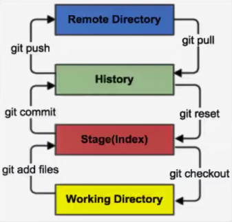
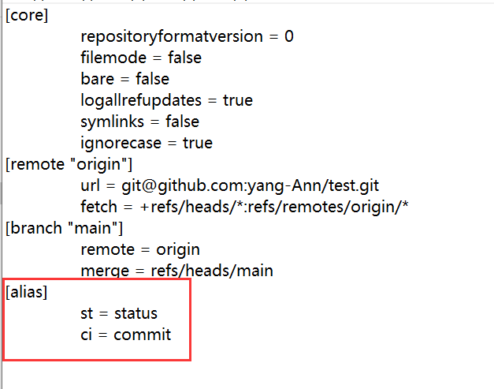
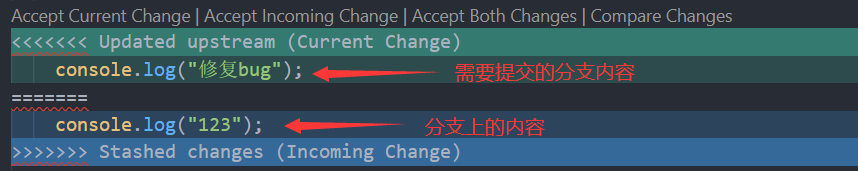
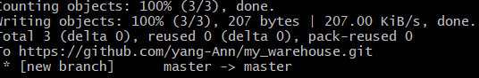
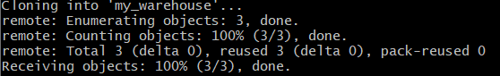

# Git

> [官方参考](https://git-scm.com/docs), [廖雪峰教程](https://www.liaoxuefeng.com/wiki/896043488029600), [giree教程汇总相关](https://gitee.com/all-about-git )

[[toc]]

## Git 安装

> [Git官网](https://git-scm.com/), [淘宝镜像](http://npm.taobao.org/mirrors/git-for-windows/)

安装成功后在开始菜单中会有Git对应的选项, 菜单下有3个程序：任意文件夹下右键也可以看到如下对应的程序

 

**Git Bash**：Unix与Linux风格的命令行, 使用最多

**Git CMD**：Windows风格的命令行

**Git GUI**:  图形界面的Git

##  三个区域

Git本地有三个工作区域：

  工作目录（Working Directory）、暂存区(Stage/Index)、资源库(Repository或Git Directory)

如果在加上远程的git仓库就可以分为四个工作区域, 文件在这四个区域之间的转换关系如下:


 


- Workspace：工作区, 就是平时存放项目代码的地方
- Index / Stage：暂存区, 用于临时存放你的改动, 事实上它只是一个文件, 保存即将提交到文件列表信息
- Repository：仓库区（或本地仓库）, 就是安全存放数据的位置, 这里面有你提交到所有版本的数据. 其中HEAD指向最新放入仓库的版本
- Remote：远程仓库, 托管代码的服务器, 如: GitHub, Gitee

## Git的基本操作

### 本地库初始化

进入需要使用Git的文件夹

```shell
git init # 在当前目录初始化git仓库

git init dirname # 在指定目录初始化git仓库
```

生成的`.git`目录中存放的就是本地库相关配置文件, 默认会创建一个`master`分支

### 设置签名

当初始化完 Git 本地库应该做的第一件事就是设置你的**用户名称与邮件地址**。这样做很重要，因为每一个 Git 的提交都会使用这些信息，并且它会写入到你的每一次提交中，不可更改：

- 项目(仓库)级别`仅在当前本地库有效`

    ```shell
    git config user.name xxx  #设置用户名
    git config user.email xxx@qq.com #设置用户邮箱
    ```

- 系统用户级别`仅在当前登录的操作系统用户有效`

  ```shell
  git config --global user.name xxx
  git config --global user.email xxx@qq.com
  
  git config -l #查看当前文件下git的所有配置
  ```
  
- 项目(仓库)级别信息保存位置：`cat ./.git/config`

- 系统用户级别信息保存位置：` cat ~/.gitconfig`   

- 单独查看某个配置: `git config user.name`,`git config user.email`

签名优先级别：`项目级别`  >  `系统级别`

> 当 git 输出提示太长的文本信息时空格显示更多, 出现**END**表示显示完毕输入`:q`即可退出

### 基本操作

有时会提示**‘/xxx/lock’: File exists**(锁文件存在问题), 删除`.gte/index.lock`文件即可

#### 状态查看

```shell
git status   #查看工作区、暂存区状态
git status -s #简洁查看
```

#### 添加

```shell
git add 文件名  #将工作区的指定文件添加到暂存区
git add . #将工作区的所有文件添加到暂存区
```

#### 换行符问题

在Windows中使用CRLF标识一行的结束，而在Linux/UNIX系统中只使用LF标识一行的结束

默认情况下, Git库不会自动修改文件内容，但是默认会将入库的文件的行尾符设置为`LF`，会将检出的文件的行尾符设置为`CRLF`。但是在执行如下操作时出现如下警告：

```sh
$ git add .
warning: LF will be replaced by CRLF in package.json. 
The file will have its original line endings in your working directory
```

设置`core.autocrlf`属性为`false`即可去除警告

```shell
git config core.autocrlf false
```

#### 提交

```shell
git commit -m "内容日志" 文件名 #将暂存区内容提交到本地库
# 可以直接使用 git commit 跳过 git add 步骤
```

#### 推送

```sh
# git push 别名 远程分支名
git push origin master

# 首次提交
git push origin master-u
```

如果推送代码时报如下的警告

```sh
warning: ----------------- SECURITY WARNING ----------------
warning: | TLS certificate verification has been disabled! |
warning: ---------------------------------------------------
warning: HTTPS connections may not be secure. See https://aka.ms/gcmcore-tlsverify for more information.
```

这个警告是`ssl`的警告, 对应的配置里的`http.sslVerify`

可以直接通过命令修改, 也可以直接通过`.gitConfig`配置文件修改

```sh
# 修改全局的 http.sslVerify 为 false
git config --global http.sslVerify false

# .gitConfig 配置文件配置
http.sslVerify=false
```

#### 区分文件大小写

git默认是不区分文件名的大小写的, 如下配置可以打开: 

```sh
git config --get core.ignorecase # 默认是不区分文件名的大小写
git config core.ignorecase false # 设置文件名区分大小写
```

#### 忽略文件

有些时候我们不想把某些文件纳入版本控制中, 比如数据库文件, 临时文件, 设计文件, 第三方包文件等

 在主目录下建立`.gitignore`文件或是在`.git\info\exclude`文件中设置, 有如下常用规则：

```shell
#为注释
node_modules # 忽略node_modules文件
dist		 # 忽略dist文件
*.txt        # 忽略所有 .txt结尾的文件
!lib.txt     # lib.txt 文件除外
build/       # 忽略 build/ 目录下的所有文件
doc/*.txt    # 会忽略 doc/* 下所有的 .txt 文件, 但不包括 doc/*/*.txt
```
`.gitignore` 和 `.git/info/exclude` 文件的区别:

- `.gitignore` 这个文件本身会提交到版本库中去, 用来保存的是公共的需要排除的文件
- `.git/info/exclude` 里设置的则是自己本地需要排除的文件, 它不会影响到其他人, 也不会提交到版本库中

也可以删除已经提交了的文件缓存

```sh
git rm -r --cached unpackage
```

#### 查看记录

有两种命名`git log`和`git reflog`

**log**: 查看提交历史 包括HEAD, 提交作者, 提交日期, message(回退以后记录会消失)

**reflog**: 查看命令历史(HEAD, message)

```shell
git log #查看版本库的状态

git log --pretty=oneline #漂亮一行显示
git log --oneline #简洁显示

git reflog  #输出历史记录(常用)

#输出信息说明：HEAD@{移动到当前版本需要多少步}
```

#### 版本前进后退

- 基于索引值`推荐`

  ```shell
  git reset --hard 指针位置
  git reset --hard a6ace91 # 回到这个指针的状态
  ```

- 使用 **^** 符号`只能后退`

  ```shell
  git reset --hard "HEAD^" # 后退一次的提交
  git reset --hard "HEAD^^" # 后退两次的提交
  ```
  
- 使用 **~** 符号`只能后退`

  ```shell
  git reset --hard "HEAD~n"
  git reset --hard "HEAD~3"  #后退3步
  ```

#### 撤销修改

##### 撤销工作区修改

工作区修改了但是还**没有添加到了暂存区**时, 使用`git restore 文件名`撤销修改

```shell
git restore index.html #撤销index.html文件的修改
git restore . #撤销所有文件的修改
```

##### 撤销暂存区修改

```shell
git reset HEAD index.html #将index.html文件从暂存区清除
git reset HEAD . #将所有文件从暂存区清除

git rm --cached README.MD # 删除暂存区的某个文本(保存到工作区)
```

#### 撤销操作

有时候我们提交完了才发现漏掉了几个文件没有添加，或者提交信息写错了, 此时, 可以运行带有`--amend`选项的提交命令来重新提交

进入vim操作, 按`i`才可以编辑, 编辑完以后按`esc`输入`:wq`保存退出

```shell
git commit --amend # 这个命令会替换掉上一次的commit
```

##### 恢复到指定的commit

```shell
git reset --hard 指针位置 # 恢复到指定的commit, 同时重置暂存区和工作区
git reset --mixed 指针位置 # 恢复到指定的commit, 重置暂存区, 工作区不变
git reset --soft 指针位置 # 恢复到指定的commit, 暂存区和工作区保留不变
```

> 使用`git reset --soft "HEAD^"`可以撤销上一次的提交恢复到提交前的样子, 使用`--mixed`也可以, 如果使用`--hard`则会**丢失暂存区和工作区内容**

#### 文件差异比较

```shell
git diff 文件名
git diff 哈希值 文件名  #和历史中的一个版本比较
git diff #不带文件名, 则比较多个文件
```

#### 删除git本地仓库

```shell
#删除Git本地仓库的根本原理是删除 "Git本地仓库" 里面的根目录下面的隐藏文件夹 ".git" 
rm -rf .git
```

> 手动也可以删除 **.git**文件(隐藏的)

#### 删除存储库中的文件

```sh
git rm -r -f --cached fileName
```

#### 删除一个文件的所有记录

```sh
#!/bin/base

git filter-branch --force --index-filter "git rm --cached --ignore-unmatch 删除的文件地址" --prune-empty --tag-name-filter cat -- --all

git add .
git commit -m "clear config"

# 强制提交到线上存储库
git push origin master --force --tags
```

### Tag标签

为了清晰的版本管理, 可以给每个大的版本加上标签

```sh
git tag -a v1.0 -m '版本介绍' #创建本地tag信息
git tag -d v1.0 #删除tag

git push origin v1.0 #将本地v1.0标签推送到远程库
git push origin --tags #将本地tag信息全部推送到远程库
git pull origin --tags #拉取到本地

git checkout V0.1 #切换tag
git clone -b v0.1 地址 #克隆指定 tag 版本的代码

git tag #查看所有标签
git show v1.0 #查看指定的标签信息

git tag -d v1.0 #删除本地tag
git push origin :refs/tags/v1.0 #删除远程库tag
```

### 配置别名

有的时候每次都要写很长的命令, 有时会经常敲错命令, 所以Git提供一个别名功能, 例如: 

```shell
git config --global alias.st status #在全局下添加一个别名 st 对应 status
```

现在可以使用`git st`命令了相当于是执行`git status`

下次碰到很长的命令就可以通过配置别名来简写

```shell
git config --global --unset alias.st #删除别名

git config --global -l #查看全局配置中可以看到所有的配置, 包括别名
```

在不加`--global`参数的情况下别名会存储在每个项目的`.git/config`文件中找到, 全局配置下可以在用户名主目录下的隐藏文件`.gitconfig`中, 在该文件删除对应的配置也可以

 

### "储藏"当前工作现场

再修复bug时，我们会通过创建新的bug分支进行修复，然后合并，最后删除

当手头工作没有完成时，先把工作现场"储存"一下(类似于快照)，然后去修复bug，修复后，再恢复储存并回到工作现场

**储存现场**

```sh
git stash #将当前的修改"储存"起来
git stash push -m "这是消息" #将当前的修改"储存"起来(携带消息)
```

**查看储存**

```sh
git stash list #查看已经"储存"的记录
```

**恢复储存**

```sh
git stash pop #恢复最近的一次"储存", 并删除储存记录
git stash apply stash@{0} #恢复到第stash@{0}次的"储存"记录(不会储存删除记录)
```

**删除储存**

```sh
git stash drop stash@{0} #删除第stash@{0}次的"储存"记录
git stash clear #删除所有的储存记录
```

### git cherry-pick

`git cherry-pick`可以提交指定分支的内容到当前分支, 语法: 

```sh
git cherry-pick <commit> #提交特定commit的内容到当前分支重新提交一次
```

#### 配置项

- `-e`,`--edit`

编辑提交信息

- `-n`, `--no-commit`

只更新工作区和暂存区, 不产生提交

- `-x`

在提交信息的末尾追加一行`(cherry picked from commit ...)`, 方便以后查询这个提交信息

- `-s`, `--signoff`

在提交信息的末尾追加一行操作者的签名, 表示是谁进行了这个操作

## git commit message 规范

常见的`git commit message`格式为: 

```sh
<type>: <subject>
```

完整的格式为:

```sh
<type>: <subject>

[body]

[footer]
```

> - **type:** 当次`commit`的类型
>
> - **subject:** 当次`commit`的简短描述
>
> - **body:** `commit` 具体修改内容, 可以分为多行
>
> - **footer:** 一些备注, 通常是 破坏性变化 或修复的 issues 链接, 如: #1

**常见的type如下:**

| type           | 说明                                                         |
| -------------- | ------------------------------------------------------------ |
| `add`            | 创建功能                                                     |
| `del`            | 删除功能                                                     |
| `feat`           | 新功能(新特性)                                               |
| `fix`            | 解决问题                                                     |
| `docs`           | 文档更改                                                     |
| `style`          | 不影响代码含义的更改(空白、格式化、缺少分号等)               |
| `reformat`       | 代码格式化                                                   |
| `chore`          | 其他不修改`src`或测试文件的更改                              |
| `test`           | 测试文件修改或新增                      |
| `conf`           | 配置文件修改                                                 |
| `bump`           | 修改某个版本号                                               |
| `start`          | 开始做某事，比如创建分支等                                   |
| `end`            | 结束做某事，比如删除分支等                                   |
| `revert`         | 还原上一次提交                                               |
| `perf`, `optimize` | 改进性能的代码更改                                           |
| `refactor`       | 重构代码                                                     |
| `scope`          | `commit` 影响的范围, 比如: route, component, utils, build... |
| `build`          | 影响构建系统或外部依赖关系的更改(例如: gulp, broccoli, npm)  |
| `ci`             | `CI`配置文件和脚本的更改(例如: Travis, Circle, BrowserStack, SauceLabs) |

> 可以使用 [commitlint](https://www.npmjs.com/search?q=keywords:commitlint) 一些第三方包来交易`git commit`

## 分支管理

- 在版本控制中, 使用分支同时推进多个功能开发, 提高开发效率
- 某一分支开发失败, 不会对其它分支有任何影响

### 分支操作

- 创建分支

```shell
git branch 分支名
```

- 重命名本地分支名

```sh
git branch -m <oldName> <newName>
```

- 查看分支

```shell
git branch #仅显示分支名
git branch -v #会显示分支的详细信息

git branch -r #远程分支
```

- 切换分支

```shell
git checkout 分支名
git checkout -b 分支名   #创建分支并直接切换到该分支
```

- 合并分支`相当于把修改了的文件拉过来`

```shell
git merge 要合并的分支名
```

合并分支的时候要明确谁合并谁, 我在a分支里面修改了代码 要合并到master, 就切换到master, 然后合并a分支

默认分支合并是没有历史记录的, 可以添加`--no-ff`参数, 这时Git就会在merge时生成一个新的commit, 如下: 

```shell
#因为本次合并要创建一个新的commit，所以加上`-m`参数，把commit描述写进去
git merge --no-ff -m "使用--no-ff参数合并分支" dev
```

- 删除分支

```shell
git branch -d 分支名
git branch -D 分支名 #强制删除
```

> 如果要删除一个没有被合并过的分支请使用`-D`强行删除

- 删除远程分支名

```sh
git push --delete origin <oldName>
```

- 上传新的分支名

```sh
git push origin <newName>
```

- 本地分支与远程分支关联

```sh
git branch --set-upstream-to origin/<newName>
```

### 解决冲突

冲突的表现如下: 

 

冲突的解决:
- 第一步：编辑, 删除特殊标记`<<<` `===` `>>>`

- 第二步：修改到满意位置, 保存退出

- 第三步：添加到缓存区  `git add 文件名`

- 第四步：提交到本地库 `git commit -m "日志信息" `  


> 特别注意⚠️：合并冲突的 `commit  `后面一定不能带文件名

## Git 结合远程库

### 创建远程库地址别名

```shell
git remote -v  # 查看远程地址和别名
git remote get-url --all 别名 # 查看指定别名远程库的url
git remote add 别名 远程地址 # 添加别名
git remote remove 别名 # 删除别名
git remote rename 别名 新别名 # 重命名别名
```

首次创建远程仓库, 第一次`push`需要和远程仓库建立联系

```sh
# origin 对应远程仓库别名
# master 当前分支在远程分支对应的名称
git push -u origin master
# or
git push --set-upstream origin master 
```

如果遇到`refusing to merge unrelated histories`这个提示是因为两个仓库记录不同, 无法`pull`

要把两个不同的项目合并需要添加`--allow-unrelated-histories`参数, 让Git合并两边的的历史

```sh
# 合并两个仓库的历史记录
git pull origin master --allow-unrelated-histories

# 然后再提交
git push --set-upstream origin master
```

如果遇到`error: src refspec master does not match any`这个报错, 说明是分支名不兼容, 修改分支名即可: 

```sh
# 查看分支名
git show-ref 

# 修改分支名
git branch -m <oldName> <newName>
```

### 推送

开发修改完把本地库的文件推送到远程仓库, 前提是提交到了本地库才可以推送

```shell
git push 别名 分支名
git push -u 别名 分支名 # -u 指定默认分支(首次 push 时使用)
```

 

### 克隆

完整就是把远程库克隆到本地

```shell
git clone url	# 克隆指定仓库地址
git clone -b 分支名 仓库地址 # 克隆指定分支
```

 

克隆的作用: 
- 完整的把远程库下载到本地 
- 自动创建 origin 远程地址别名 
- 初始化本地库

> 如果碰到项目很大, 克隆很慢, 可以添加`--depth=1`参数表示只克隆最近一次`commit`的数据, 不会下载 Git 操作的历史记录和分支信息, 适合用来拉取源代码学习

### 拉取合并

本地存在`clone`下来的文件  就用`pull`更新

**细分操作**

```sh
git fetch 分支名  #抓取(下载)远程库的文件(不会修改本地的文件)
git merge 分支名  #合并远程库下载的和本地文件
```

**访问抓取的文件**

```sh
git checkout 分支名
cat xxx 或 vim xxx
```

**一步到位操作**

```shell
#pull就相当于是 fetch + merge
git pull 别名 分支名
```

> 一般简单的都是直接使用 `pull` 更新即可

为分支设置跟踪信息

```sh
git branch --set-upstream-to=origin/<branch> origin
```

### 解决冲突


- 如果不是基于远程库最新版做的修改不能 `push`
- 必须先 `pull `下来按照 `冲突办法解决` 操作即可, 注意：解决完冲突后的`commit`是不能带文件名的

## Git Hook

在`.git/hooks`目录下面有全部的`git hook`示例(带`sample`后缀), `pre`表示执行操作之前, `post`表示执行操作之后,可以利用[`husky`](https://github.com/typicode/husky)+`git hook`在提交代码时进行代码格式化, 测试等操作

## SSH 免密登录

### GitHub

[Github文档](https://docs.github.com/zh)

**生成.ssh**

命令行输入:`ssh-keygen -t rsa -C GitHub仓库地址`, 可以在用户主目录里找到`.ssh`目录, 进入的`.ssh`目录, 里面有`id_rsa`和`id_rsa.pub`两个文件，这两个就是SSH Key的秘钥对，`id_rsa`是私钥，不能泄露出去，`id_rsa.pub`是公钥，可以放心地告诉任何人, 复制`id_rsa.pub`文件内容

**GitHub添加公钥**

登录GitHub `Settings`  --> `SSH and GPG keys ` --> `New SSH Key    `->填入key和title->`Add SSH key`

回到Git通过远程仓库的ssh地址关联远程库:  

```shell
git remote add 别名 仓库地址  
#别名一般都是使用 origin
```

然后关联的第一次提交需要携带`-u`参数: `git push -u origin main`

> Gitee为`master`, GitHub的默认主分支名为`main`

### Gitee

github 是有墙的, 比较慢, 在国内的话, 一般使用 gitee 

- 设置本机绑定SSH公钥, 实现免密码登录

```sh
ssh-keygen -t rsa  #生成公钥
```

会在`C:\Users\{用户名}\.ssh`目录下生成的`id_rsa`(私钥)和`id_rsa.pub`(公钥)

将`id_rsa.pub`文件内容复制到Gitee上的SSH公钥里
