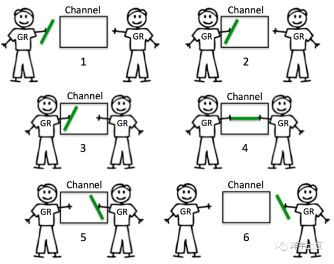
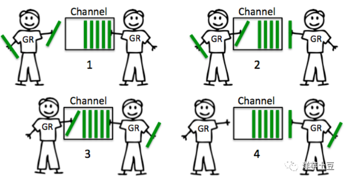

[[toc]]

# Go

[官网](https://go.dev/)

[官方教程](https://go.dev/doc/)

[标准库(英文)](https://pkg.go.dev/std)

[标准库(中文)](https://studygolang.com/pkgdoc)

[示例教程](https://gobyexample.com/)

`Go` 是 Google 开发的一种编译型、并发型，并具有垃圾回收功能的编程语言

## 环境搭建

-   [下载安装包](https://go.dev/dl/)

    -   命令行输入`go version`

-   `vscode`装插件

    -   `Go`
    -   <kbd>F1</kbd>输入`Go: Install/Update Tools`全选安装一些必要的工具

-   如果碰到下载卡住了, 可以更换国内代理:

    ```sh
    # 查看 go 的所有配置, go 的配置都是通过环境变量进行操作的
    go env
    
    # go mod 更换国内代理
    go env -w GOPROXY=https://goproxy.cn,direct
    ```

## 命令行使用

新建`src/main.go`文件

进入`src/main.go`输入:

```go
package main // 声明为 main 包

import ( // 引入 fmt 模板
	"fmt"
)

// 注意 mian 函数的格式必须严格这样写, 不能将花括号换行
func main() {
	fmt.Println("hello world") // 控制台输出指定的字符串
}
```

执行命令

```sh
# 运行指定的文件(可以跟多个文件)
go run main.go

# 运行所有的 .go 文件(需要 go.mod 文件)
go run .

# 生成可执行文件
go build

# 重命名生成的包文件
go build -o newMain.exe

# 将编译结果移动到`$GOPATH/bin`目录下面
go install main.go
```

### build指定图标

`go`在执行`build`时生成的可执行文件是默认是不带图标, 设置自定义图标的步骤如下:

1.   安装`rsrc`

```sh
go install github.com/akavel/rsrc@latest
```

2.   在`main.go`的同级目录下创建`main.manifes`

```xml
<?xml version="1.0" encoding="UTF-8" standalone="yes"?>
<assembly xmlns="urn:schemas-microsoft-com:asm.v1" manifestVersion="1.0">
    <assemblyIdentity version="1.0.0.0" processorArchitecture="*" name="SomeFunkyNameHere" type="win32"/>
    <dependency>
        <dependentAssembly>
            <assemblyIdentity type="win32" name="Microsoft.Windows.Common-Controls" version="6.0.0.0" processorArchitecture="*" publicKeyToken="6595b64144ccf1df" language="*"/>
        </dependentAssembly>
    </dependency>
    <application xmlns="urn:schemas-microsoft-com:asm.v3">
        <windowsSettings>
            <dpiAwareness xmlns="http://schemas.microsoft.com/SMI/2016/WindowsSettings">PerMonitorV2, PerMonitor</dpiAwareness>
            <dpiAware xmlns="http://schemas.microsoft.com/SMI/2005/WindowsSettings">True</dpiAware>
        </windowsSettings>
    </application>
</assembly>
```

3.   生成`ico`图标(网上有很多可以图片直接生成的[网站](https://ico.nyaasu.top/)), 将生成的`main.ico`图标放到`main.go`同级目录中

4.   生成`main.syso`, 命令如下: 

```sh
# 使用 main.manifest 配置, 将 main.ico 生成 main.syso
rsrc -manifest main.manifest -ico main.ico -o main.syso
```

>   `main.syso`生成后, 如果不修改ico图标, 不需要再执行上面的命令, 只要`main.syso`与`main.go`在同级目录即可, 如果修改ico图标了则需要再次生成

5.   打包Go二进制

```sh
# 打包
go build
# 打包并重命名
go build -o test.exe

# 执行时去掉cmd窗口
go build -ldflags="-H windowsgui  -w -s"
```

## 控制台打印

`fmt.Print`不换行, `fmt.Println`换行, 都可以接受任意多个参数

`Go`的四则运算和一般的语言是一样的:

```go
package main

import (
	"fmt"
)

func main() {
	fmt.Print("--不换行--")
	fmt.Println("换行")
	fmt.Println(1 + 1, 10 * 10, "hello", 3 / 1)
}
```

结果:

```sh
--不换行--换行
2 100 hello 3
```

>   也可以使用`log.Println`函数, 常用于记录调试, 会带上当前的时间和打印内容

### 格式化打印

`fmt.Printf`格式化打印, 第一参数必须是字符串, 类似于`%v`这样的格式化动词, 后续的参数则会进行填充:

```go
package main

import (
	"fmt"
)

func main() {
	fmt.Printf("1 + 1 = %v\n%v", 1+1, "hello\n")
	// 1 + 1 = 2
	// hello
}
```

>   格式化动词都可以使用在`fmt.Sprintf`函数上, 来创建各种字符串

### 填充空格

对齐文本在格式化动词中可以指定一个宽度, 如: `%-4v`表示向右填充**4**个空格

-   正数表示向左填充空格
-   负数表示向右填充空格

```go
package main

import (
	"fmt"
)

func main() {
	fmt.Printf("%-4v %4v\n", "水果", "价格(元)")
	fmt.Printf("%-4v %4v\n", "苹果", "10")
	fmt.Printf("%-4v %4v\n", "香蕉", "8")
}
```

结果:

```sh
水果   价格(元)
苹果     10
香蕉      8
```

### 指定打印小数位数

指定打印小数位数在格式化动词中可以使用`%f`, 如: 

-   `%.3f`表示小数显示`3`位
-   `%6.2f`表示左边显示`6`位, 不足则补空格, 小数则显示`2`位
-   `%06.2f`表示左边显示`6`位, 不足则补`0`, 小数则显示`2`位

```go
package main

import (
	"fmt"
)

func main() {
	const t = 1.0 / 3

	fmt.Printf("%v\n", t)     // 0.3333333333333333
	fmt.Printf("%f\n", t)     // 0.333333
	fmt.Printf("%.3f\n", t)   // 0.333
	fmt.Printf("%6.2f\n", t)  //   0.33
	fmt.Printf("%06.2f\n", t) // 000.33
}
```

### 输出变量类型

使用`%T`格式化动词可以打印具体变量的类型:

```go
package main

import "fmt"

func main() {
	year := 2022
	x := 1.2
	flog := true

	fmt.Printf("year 类型 %T\n", year) // year 类型 int
	fmt.Printf("x 类型 %T\n", x)       // x 类型 float64
	fmt.Printf("flog 类型 %T\n", flog) // flog 类型 bool
}
```

### 其他格式动词

```go
%v          可以填充一个变量
%+v         添加字段名(一般用于结构体 struct)
%#v         比`%+v`多了结构体路径
%T          变量的具体类型
%%          字符串%
%s          字符串
%d          十进制整数
%f, %g, %e  浮点数: 3.141593 3.141592653589793 3.141593e+00
%e					科学计数法
%b					字符串的二进制表示, 可以是字符('a')或者数字(97)
%x, %o, %b  十六进制, 八进制, 二进制整数
%t          布尔值
%c          字符(rune) (Unicode码点)
%q          带双引号的字符串"abc"或带单引号的字符'c'
%p          输出变量的内存地址
```

## 包

`.go`文件的第一行代码(除了空行和注释)都是声明这个文件是那个包, 如下: 

```go
package xxx
```

包名一般都是小写的, 尽量避免和标准库重名, 一个`.go`文件可以是一个包, 但是同一个目录下的只能是同一个包名, 不能将不同的包放在同一个目录下, 否则报错

>   推荐一个目录就是一个包

如果要编写一个可执行程序, 就必须有一个`main`包, 这个包的`main`函数是这个可执行程序的入口函数

## init函数

`init `函数是一个特殊的函数, 一般称为**初始化函数, 不能被调用** 在每个文件里面, 当程序启动或者文件被作为包引用的时候, `init()` 函数就会**自动执行, 一般用来做一些包的初始化操作**

`init() 函数`没有参数，也没有返回值

```go
func init() {
   // ...
}
```

`init`函数常用于包变量初始化: 

```go
package main

import "fmt"

var (
    pageIndex int
    pageSize  int
)

func init() {
    pageIndex = 1
    pageSize = 20
}

func main() {
  fmt.Printf("pageIndex: %d\n", pageIndex) // 1
  fmt.Printf("pageSize: %d\n", pageSize) // 20
}
```

## 基本数据类型

| 类型     | 关键字                                                       | 说明                                                         |
| -------- | ------------------------------------------------------------ | ------------------------------------------------------------ |
| 字符串   | `string`                                                     | 使用`双引号`(**会转义字符**)或`反引号`(**不会转义字符, 支持换行**)括起来定义, 不能用`单引号`定义 |
| 布尔     | `bool`                                                       | 只有 `true` 和 `false`                                       |
| 整型     | `int8`,`uint8`<br/>`int16`,`uint16`<br/>`int32`,`uint32`<br/>`int64`,`uint64` | `intxx`开头表示**无符号整型**, `uintxx`开头表示**有符号整型** |
| 特殊整型 | `int`(**i32**),`uint`(**i64**)                               | 具体长度取决于 CPU 位数, 默认的整数类型是`int`               |
| 浮点型   | `float32`,`float64`                                          | 默认的浮点类型是`float64`                                    |
| 字符     | `rune`                                                       | 它是`int32`的类型别名, 主要用于**Unicode**, 使用`''`定义字符 |
| 字节     | `byte`                                                       | 它是`uint8`的类型别名, 主要用于**二进制数据**                |

>   整数的一些常量都在`math`包里, 如: `math.MaxInt`, `math.Pi`

### 整数环绕

`Go`中的也会有和`Rust`一样的**整数环绕**效果, 即溢出当前类型的最大表示时则会从头计算:

```go
package main

import "fmt"

func main() {
	var x int8 = 127
	x++
	fmt.Println("x =", x) // -128

	var y uint8 = 255
	y++
	fmt.Println("y =", y) // 0
}
```

>   当碰到很大的数字需要计算时, 可以使用`math/big`包

## 常量和变量

**常量**使用`const`声明常量, 常量不可变, **变量**使用`var`声明变量, 常量和变量都**不能重复定义**, 类型可省略, 因为会自动推断出来: 

```go
var 变量名 [类型] = 值
const 变量名 [类型] = 值

// 同时声明多个常量
const 变量名1, 变量名2, 变量名3 = 值1, 值2, 值3
```

在声明变量时可以省略类型, 因为会自定推导出具体的类型:

```go
package main

import (
	"fmt"
)

func main() {
	const x = 1
	var y int32 = 2

	fmt.Printf("x + y = %v", x+y) // x + y = 3

	// 修改变量
	y = 20

	fmt.Println()
	fmt.Println(y) // 20
}
```

>   **常量**在定义时没有指定类型就是`untyped`表示无类型的, 不影响使用, 因为底层是使用`big`完成的, 所有常量可以直接赋值为变量

### 同时声明多个变量

基本的的写法如下:

```go
package main

func main() {
	// 声明变量
	var (
		a = 1
		b = 2
	)

	// 声明常量
	const (
		c = 3
		d = 4
	)

	// 还可以这样
	const e, f = 5, 6

	// 短声明
	j, h := 7, 8
}
```

### 变量必须要使用

定义的变量必须要被使用, 不然代码无法编译通过, 常量没有限制

### 忽略变量

`Go`中使用`_`可以忽略任何的变量

```go
package main

func main() {
	var a = 1

	_ = a // 没有这行代码, 则会报 a 没有被使用的错误
}

```

### 零值

`Go`里面每个类型都有一个默认值, 它称作**零值** 当声明变量却不对它进行初始化的时候, 它的值就是零值: 

```go
package main

import (
	"fmt"
)

func main() {
	var x int32
	var y float64

	fmt.Printf("x = %v, y = %v", x, y) // x = 0, y = 0
}
```

## 运算符

`Go`中**没有**前置自增运算符

```go
package main

import "fmt"

func main() {
	var x = 1
	fmt.Println("x =", x) // x = 1
	x += 1

	fmt.Println("x =", x) // x = 2
	x++

	// ++x // Error

	fmt.Println("x =", x) // x = 3
}
```

## 条件判断

条件判断和一般的语言差不多, 只不过`if`中的条件不带小括号:

```go
package main

import (
	"fmt"
	"strings"
)

func main() {
	const s = "hello go"

	// 注意条件不带小括号
	if strings.Contains(s, "go") {
		fmt.Println("x 包含 \"go\" 字符")
	} else if strings.Contains(s, "hi") {
		fmt.Println("x 包含 \"hi\" 字符")
	} else {
		fmt.Println(s)
	}
}
```

## switch

`Go`的`switch`语句, 不会发生**case穿透**的问题(即不需要加`break`关键字), 

```go
package main

import "fmt"

func main() {
	const s = "hi"

	// 注意条件不带小括号
	switch s {
	case "hi", "welcome":
		fmt.Println("匹配 hi 或者 welcome")
	case "go":
		fmt.Println("匹配 go")
	case "hello":
		fmt.Println("匹配 hello")
	default:
		fmt.Println("默认")
	}
}
```

### fallthrough

`Go`的`switch`语句, 匹配到指定项以后就会停止, 如果需要继续匹配则添加`fallthrough`关键字: 

```go
package main

import "fmt"

func main() {
	const s = "hi"

	switch s {
	case "hi", "welcome":
		fmt.Println("匹配 hi 或者 welcome")
		fallthrough // 继续向下执行
	case "other":
		fmt.Println("other")
	}
}
```

### switch里使用表达式

```go
package main

import (
	"fmt"
)

func main() {
	n := 1

	switch n * 10 { // 这里可以写运行表达式
	case 1:
		fmt.Println("n = 1")
	case 10, 20, 30: // 这里可以写多个值, 是或的关系
		fmt.Println("n = 10 | 20 | 30")
	case 0:
		fmt.Println("n = 0")
	}
}
```

### 省略switch的条件

`switch`语句是可以省略条件的, 那样将会和`if...else`语句是相同的效果

```go
package main

import (
	"fmt"
)

func main() {
	n := 1

	switch { // 这里没有写表达式
	case n == 1:
		fmt.Println("n = 1")
	case n == 10 || n == 20 || n == 30: // 这里可以写表达式
		fmt.Println("n = 10 | 20 | 30")
	}
}
```

### 类型断言

`switch` 可以 `.(type)` 来实现类型断言, 判断某个值是否为某个数据类型

`````go
package main

import (
	"fmt"
)

func main() {
	var n interface{}

	n = 1

	switch n.(type) {
	case nil:
		fmt.Println("n 是 nil 类型")
	case int:
		fmt.Println("n 是 int 类型")
	case float64:
		fmt.Println("n 是 float64 类型")
	case bool:
		fmt.Println("n 是 bool 类型")
	case string:
		fmt.Println("n 是 string 类型")
	default:
		fmt.Println("n 不是基本数据类型")
	}
}
`````

## 循环

`Go`使用`for`关键字执行循环, 后面可以跟一个表达式, 注意无法在`for`中使用`var`关键字:

```go
package main

import (
	"fmt"
	"time"
)

func main() {

	var i = 0

	for ; i < 5; i++ {
		time.Sleep(time.Second / 2) // 阻塞 0.5 秒
		fmt.Println(i)
	}
}
```

不跟表达式则是无限循环, 可以通过`break`退出循环:

```go
package main

import (
	"fmt"
	"math/rand"
	"time"
)

func main() {

	for {
		time.Sleep(time.Second / 2) // 阻塞 0.5 秒

		// 生成 0 ~ 10 的随机数
		var n = rand.Intn(10) + 1
		fmt.Println(n)

		if n >= 9 {
			break
		}
	}
}
```

## go mod

`Go`中使用`import`关键字可以导入包, 可以从标准库或者自定义的包中导入, 语法就是`import 包名`, 例如:

```go
// 导入 fmt 包, 加包名前缀使用如: fmt.Println("hi")
import fmt

// 导入 fmt 包并重命名为 myFmt, 使用例子: myFmt.Println("hi")
import myFmt "fmt"

// 导入 fmt 包把其内部的函数转发到package作用域(省略包名), 可以省略包名直接调用如: Println("hi")
import . fmt

// 导入多个包(也可以 指定包名 或者 省略包名)
import (
	fmt
  time
)
```

### 导入自定义的包

`Go`的包可以按照文件夹进行分类, 除了`main`包, `main`是主包, 也是二进制文件的入口包

-   先运行`git init mod 本地模块名`(*本地模块名一般可以叫项目名*), 初始化`go.mod`文件, 默认内容如下: 

    ```json
    module learn-go // 模块名
    
    go 1.19 // go 的版本
    ```

-   新增一个本地的目录(包), 举例为`hello`, 这个目录下面可以新建任意的`.go`文件, 只需要声明为`package hello`即可, 例如: 

    ```go
    // /hello/index.go
    
    package hello // 声明hello包(一般与目录同名)
    
    import "fmt"
    
    // 注意导入的函数必须是大写字母开头
    func SayHi() {
    	fmt.Println("我是hello包里的 SayHi 函数")
    }
    ```

-   然后就可以在项目中的其他包中导入使用了:

    ```go
    package main
    
    import (
    	"learn-go/hello"         // 以模块名开头, 根据目录就可以进行导入
      . "learn-go/hello"       // 在调用这个包时可以省略包名, 直接使用其成员, 例如: hello.SayHi() 则变成 SayHi()
    	_ "learn-go/hello"       // 不会导入任何成员, 只执行对应包的初始化操作(init函数)
    	myHello "learn-go/hello" // 导入对应的包并重命名
    
    	"learn-go/abcd/ok" 			 // 多级目录, 对应目录层级即可
    	"github.com/fatih/color" // 第三方包, 可点击跳转到 pkg.go.dev
    )
    
    func main() {
    	hello.SayHi()
    	myHello.SayHi() // 使用重命名的包
    	SayHi()         // 对应 import . xxx
    
    	ok.Hi()
    }
    ```
    
    >   上面的导入语法也适用与标准库的导入

### 非go mod导入

如果是在一个非`go mod`模块进行导入的话, go编译器会根据环境变量`%GOROOT%`和`%GOPATH%`进行路径的查找: 

```SH
go env GOROOT
# C:\Program Files\Go

go env GOPATH
# C:\Users\[用户名]\go
```

导入规则是`%GOROOT%/src/包名`和`%GOPATH%/src/包名`进行查找导入:

```go
import "fmt" 					 // -> C:\Program Files\Go\src\fmt
import "encoding/json" // -> C:\Program Files\Go\src\encoding\json
```


### go mod 常用命令

go的包都是存放在[pkg.go.dev](https://pkg.go.dev/)

```sh
# 生成 go.mod 文件
go mod init projectName

# 安装指定的包到 go.mod, 注意这依赖于 git
go get github.com/fatih/color

# 全局安装命令
go install github.com/akavel/rsrc@latest

# 整理现有的依赖(可以自动下载和清理依赖)
go mod tidy

# 下载 go.mod 文件的所有依赖
go mod download

# 查看现有的依赖结构
go mod graph

# 导出项目所有的依赖到 vendor 目录
go mod vendor

# 校验一个模块是否被篡改过
go mod verify

# 查看为什么需要依赖某模块
go mod why
```

#### 相关的环境变量

- GO111MODULE
  - auto: 只要项目包含了 `go.mod` 文件的话启用 Go modules, 目前在 Go1.11 ~ Go1.14 是默认值
  - on: 启用 Go modules(推荐)
  - off: 禁用 Go modules

  设置命令:

  ```sh
  go env -w GO111MODULE=on
  ```

-   GOPROXY
    用于设置Go模块代理, 默认值: `https://proxy.golang.org,direct`
    国内设置如下: 

    - 阿里云: `https://mirrors.aliyun.com/goproxy/`

    - 七牛云: `https://goproxy.cn,direct`

    设置命令: 

    ```sh
    go env -w GOPROXY=https://goproxy.cn,direct
    ```

## 短声明

短声明可以看成是一种声明变量的语法糖, 如下: 

```go
package main

import "fmt"

func main() {

	// 正常声明变量
	var x = 1

	// 短声明
	y := 2

	// 声明多个值
	a, b := 3, 4

	fmt.Printf("x = %v, y = %v\n", x, y) // x = 1, y = 2
	fmt.Println(a, b)                    // 3 4
}
```

短声明左边的变量可以是多个, 但是至少有一个是新声明的变量, 其他变量可以是之前声明过的, 否则编译会报错

```go
package main

import (
	"fmt"
	"os"
)

func main() {
	var bs []byte
	var err error

	// 这里会报错, 因为 := 左边的变量已经声明过了
	// bs, err := os.ReadFile("./main.go")

	// 正确用法
	bs, err = os.ReadFile("./main.go")

	if err != nil {
		panic(err)
	}

	fmt.Println(string(bs))
}
```


### 短声明使用场景

短声明的语法更短, 而且可以在无法使用`var`的地方使用短声明, 下面是几个使用场景

**在`for`循环中使用短声明**:

```go
package main

import (
	"fmt"
	"time"
)

func main() {

	for i := 0; i < 5; i++ {
		time.Sleep(time.Second / 2) // 阻塞 0.5 秒
		fmt.Println(i)
	}
}
```

**在`if`中使用短声明**:

```go
package main

import (
	"fmt"
	"math/rand"
)

func main() {

	if n := rand.Intn(10); n > 5 {
		fmt.Println("生成的随机数大于5")
	} else if n <= 5 {
		fmt.Println("生成的随机数小于等于5")
	}
}
```

**在`switch`中使用短声明**:

```go
package main

import (
	"fmt"
	"math/rand"
)

func main() {
	switch n := rand.Intn(10); n {
	case 1, 2, 3, 4, 5:
		fmt.Println("1 | 2 | 3 | 4 | 5")
	default:
		fmt.Println("other")
	}
}
```

## package作用域

`Go`的变量和作用域和一般的编程语言是一样的, 有一个**package作用域**有点像是全局作用域, **package作用域**的变量**不能使用短声明来声明变量**:

```go
package main

import "fmt"

const name = "foo"

// age := 18 // Error

func main() {
	fmt.Println(name)

	say_hi()
}

func say_hi() {
	fmt.Println(name)
}
```

## 类型别名

`Go`中也有类型别名的功能, 使用`type`关键字定义:

```go
type MyInt = int64
```

类型别名还是原来的类型:

```go
package main

import "fmt"

func main() {
	type MyInt = int64

	var x MyInt = 1

	fmt.Printf("%T", x) // int64
}
```

## 字符串

字符串分为:

-   字符串字面值(*string iteral*): **会转义字符, 不支持换行**, 使用**双引号**声明
-   原始字符串(*raw string iteral*): **不会转义字符, 支持换行**, 使用**反引号**声明

```go
package main

import "fmt"

func main() {
	// 字符串字面值(会转义字符)
	s := "\t hello \n world"

	// 原始字符串(不会转义字符)
	msg := `\t hello \n 
	world
	支持换行`

	fmt.Println(s)
	fmt.Println(msg)
}
```

### 字符串本身不可变

可以给某个变量赋值不同的`string`值, 但是`string`本身是不可变的

```go
package main

import "fmt"

func main() {
	s := "hello"

	fmt.Printf("s[0] = %c\n", s[0]) // s[0] = h

	// Error 报错
	// s[2] = 'a'
}
```

但是可以通过重新赋值进行修改

### 处理utf8

处理`utf8`可以使用`"unicode/utf8"`包

### fmt.Sprintf

`fmt.Sprintf`类似于`fmt.Printf`只不过是用于拼接字符串, 同样支持各种格式化动词:

```go
package main

import (
	"fmt"
)

func main() {
	x := 1
	s := fmt.Sprintf("1 * 2 = %v", x*2)

	fmt.Println(s) // 1 * 2 = 2
}
```

### 计算字符串长度

字符串不同编码是可以有不同的计算方式

#### ASCII

直接使用`len()`方法即可, 需要注意的是**中文算三个字符**

```go
package main

import "fmt"

func main() {
	s1 := "hello"
	s2 := "你好"
	fmt.Println(len(s1)) // 5
	fmt.Println(len(s2)) // 6
}
```

#### 中文算一个长度

如果需要把中文和英文一样的计算方式可以使用`unicode/utf8`包的`RuneCountInString`方法

```go
package main

import (
	"fmt"
	"unicode/utf8"
)

func main() {
	s1 := "hello"
	s2 := "你好"
	fmt.Println(utf8.RuneCountInString(s1)) // 5
	fmt.Println(utf8.RuneCountInString(s2)) // 2
}
```

### 操作字符串

操作字符串可以使用[`strings`](https://studygolang.com/pkgdoc)包里的函数

-   `strings.Split()`切割数组

```go
package test

import (
	"fmt"
	"strings"
)

func main() {
	s := "hello world"
	list := strings.Split(s, " ")
	fmt.Println(list) // [hello world]
}
```

-   `strings.ToUpper()`和`strings.ToLower()`转换大小写
-   `strings.Repeat()`重复字符串
-   `strings.Join()`拼接字符串

```go
package main

import (
	"fmt"
	"strings"
)

func main() {
	s := [...]string{
		"a",
		"b",
		"c",
	}
	new_s := strings.Join(s[:], "*")
	fmt.Println(new_s) // a*b*c
}
```

-   使用切片(`Slice`)截取字符串

```go
package main

import (
	"fmt"
)

func main() {
	s := "hello world"
	fmt.Println(s[:])  // hello world
	fmt.Println(s[:5]) // hello
	fmt.Println(s[3:]) // lo world
}
```

-   `strings.Trim()`去除两边指定的字符串

```go
package main

import (
	"fmt"
	"strings"
)

func main() {
	fmt.Println(strings.Trim("  hello world  ", " ")) // hello world
	fmt.Println(strings.Trim("hello world", "hello")) //  world
}
```

>   还有`TrimFunc()`,`TrimLift()`,`TrimRight()`等方法也是类似

### 遍历字符串

遍历字符串可以使用`range` 或者`for`循环, 无论是那种循环, 得到的值都是`Unicode`编码的, 需要使用`string()`或者`%c`转换成字符串

```go
package main

import (
	"fmt"
	"strings"
)

func main() {
	s1 := "hello"

	// range 遍历 (Unicode)
	for _, v := range s1 {
		fmt.Printf("unicode: %v, char: %c, string: %s\n", v, v, string(v))
	}

	fmt.Println(strings.Repeat("-", 30))

	// for 循环 + 索引访问(ASCII)
	for i := 0; i < len(s1); i++ {
		v := s1[i]
		fmt.Printf("unicode: %v, char: %c, string: %s\n", v, v, string(v))
	}
}
```


## 内置函数

`Go`里面有一些[内置的函数](https://pkg.go.dev/builtin#pkg-functions), 比如: `len`用于获取字符串的长度

| 函数             | 说明                                                         |
| ---------------- | ------------------------------------------------------------ |
| `append`         | 用来追加元素到数组, slice中,返回修改后的数组, slice          |
| `close`          | 主要用来关闭`channel`                                        |
| `delete`         | 从`map`中删除`key`对应的`value`                              |
| `panic`          | 停止常规的`goroutine`  (panic和recover: 用来做错误处理)      |
| `recover`        | 允许程序定义`goroutine`的**panic**动作                       |
| `real`           | 返回`complex`的实部(complex, real imag：用于创建和操作复数)  |
| `imag`           | 返回`complex`的虚部                                          |
| `make`           | 用来分配内存, 返回`Type`本身(只能应用于`slice`, `map`, `channel`) |
| `new`            | 用来分配内存, 主要用来分配值类型, 比如`int`, `struct`。返回指向指定类型的指针 |
| `cap`            | `capacity`是容量的意思, 用于返回某个类型的最大容量(只能用于`slice`和 `map`) |
| `copy`           | 用于复制和连接`slice`, 返回复制的数目                        |
| `len`            | 求长度, 比如`string`, `array`, `slice`, `map`, `channel`, 返回长度 |
| `print, println` | 底层打印函数, 在部署环境中建议使用`fmt`包                    |

```go
package main

import (
	"fmt"
)

func main() {
	s1 := "hello"
	s2 := "你好"

	fmt.Println(len(s1)) // 5
	fmt.Println(len(s2)) // 6
}
```

## range

使用`range`关键字, 可以遍历各种集合:

```go
package main

import (
	"fmt"
)

func main() {
	s := "hello world"

  // 遍历字符串
	for i, c := range s {
		fmt.Printf("索引: %v, 字符: %c\n", i, c)
	}
}
```

>   如果使用`range`关键字遍历不需要索引的话, 可以使用`_`来省略不需要的变量

## 类型转换

不同类型是不能直接拼接或者四则运算的, 需要进行转换, 类型转换有两种方式: 

1.   调用**对应类型的函数**转换:

```go
package main

import (
	"fmt"
)

func main() {
	x := 1
	y := 2.0
	// fmt.Println(x * y) // Error

	fmt.Println(x * int(y))
	fmt.Println(float64(x) * y)
	fmt.Println(int(y))

	var c rune = 65
	fmt.Println("c:", string(c)) // c: A
	fmt.Printf("c: %c\n", c)     // c: A

	var b byte = byte('h')
	var bs []byte = []byte("hello world")
	fmt.Println("b:", b)   // b: 104
	fmt.Println("bs:", bs) // bs: [104 101 108 108 111 32 119 111 114 108 100]
}
```

>   注意: 如果是使用`string(false)`, `int(false)`, `bool(1)`, `bool("yes")`类似的方式进行转换编译器会报错

2.   `interface{}`或者`any`类型的转换, 语法如下:

     ```go
     newVar, ok := var.(T)
     ```

     基本使用: 

     ```go
     package main
     
     import "fmt"
     
     // x 类型为任意值
     var x interface{}
     // var x any
     
     func main() {
     	x = 3.14
     	// 先判断是否可以转换为目标类型再进行其他操作
     	if _, ok := x.(float64); ok {
     		fmt.Printf("x变量的类型是: %T, 值是: %v\n", x, x) // x变量的类型是: float64, 值是: 3.14
     	}
     }
     ```

## 函数

使用`func`函数进行函数声明, 下面以`rand`包的`Intn`函数的声明为例:

```go
func Intn(n int) int { 
	// ...
}
```

`Intn`函数, 接受一个参数`n`类型是`int`返回值的类型是`int`

### 匿名函数

`Go`中的匿名函数和js很像, 也是可以直接赋值给一个变量, 然后重复使用

```go
var add = func(a, b int) int {
  return a + b
}

fmt.Println(add(1, 2))
fmt.Println(add(1, 3))
```

#### 匿名函数立即执行

`Go`中匿名函数也是`iife`的一种, 如下:

```go
// 类似于 js 的 iife
func() {
  fmt.Println("iife")
}()

// 也可以传递参数
func(msg string) {
  fmt.Println("iife", msg)
}("hello")
```

### 函数的默认导出

在`Go`里, **大写字母开头的函数, 变量或者其他的标识符都会被导出, 对其他包可用**, 小写字母开头的就不行

当函数声明在同一个包中时, 可以不用导包直接使用函数名调用该函数

### 函数参数类型简化

当一个函数接受的多个参数类型都是一样的就可以简化, 只在最后一个参数写上类型: 

```go
package main

import (
	"fmt"
)

func main() {
	sum := add(1, 2)
	fmt.Println(sum) // 3
}

// 函数参数类型都是 int
func add(a, b int) int {
	return a + b
}
```

### 函数返回多个值

函数可以声明为返回多个值, 语法如下:

```go
// 完整写法
func test1() (x int, y float64) {}

// 简写
func test2() (int, float64) {}
```

基本使用:

```go
package main

import (
	"fmt"
)

func main() {
	x1, y1 := test1()
	x2, y2 := test2()
}

// 完整写法
func test1() (x int, y float64) {
	return 1, 2.0
}

// 简写
func test2() (int, float64) {
	return 1, 2.0
}
```

### 可变参数

以`fmt.Println`函数为例, 它的类型声明如下:

```go
func Println(a ...any) (n int, err error) {
	// ...
}
```

`...`表示类型的参数是可变的, `any`表示可以是任意的类型, 也可以这样写`interface{}`

当`...`和`any`组合时就可以接受任意数量和任意类型的参数了, 如下: 

```go
package main

import (
	"fmt"
)

func main() {

	test(1, "2", true, 3.14)
}

func test(args ...any) {

	// fmt.Println(args...) // 相当于是 JS 的展开运算

	for _, item := range args {
		fmt.Println("item: ", item)
	}
}
```

### 函数的变长参数

函数的参数可以定义一个变长参数, 语法是`...类型`表示可以接受任意个类型的参数

```go
package main

import "fmt"

func main() {
	fmt.Println(add(1))       // 1
	fmt.Println(add(1, 2))    // 3
	fmt.Println(add(1, 2, 3)) // 6
}

// 可以接收任意个 int 类型的参数
func add(args ...int) int {
	fmt.Println("args: ", args)

	var sum = 0
	for _, v := range args {
		sum += v
	}

	return sum
}
```

### 传递多个参数

数组和Slice类型的变量可以使用`变量...`来将里面的值都展开传递, 类似于js的展开运算符

```go
package main

import "fmt"

// type Persion struct {
// 	Name string
// 	Age  int
// 	Sex  string
// }

func main() {
	MyPrimtln(1, 2, 3)                 // 1 2 3
	MyPrimtln("hello", 2, true)        // hello 2 true
	MyPrimtln([]int{1, 2, 3}, "world") // [1 2 3] world
}

// ...interface{} 和...any 都可以表示任何类型
func MyPrimtln(args ...interface{}) {
  
  // 注意... 是放在变量之后的
	fmt.Println(args...)
}
```

### 参数默认值

`Go`中没有提供参数默认值的语法, 但是可以利用可变参数模拟:

```go
package main

import "fmt"

func main() {
	test()
	test(false)
	test(true)
}

func test(isError ...bool) {
	var val bool

	if len(isError) > 0 {
		fmt.Println("有传递值, 取索引为0的值")

		val = isError[0]
	} else {
		fmt.Println("没有传递值, 取默认值")

		val = false
	}

	fmt.Println(val)
}

```

### 函数作为参数传递

函数也可以作为函数的参数, 类似于js的回调函数一样, 如下: 

```go
package main

import "fmt"

// 声明一个函数类型
type Callback func(a, b int) int

func main() {
	var cb Callback = func(a, b int) int {
		return a + b
	}

	fnAdd(1, 2, cb) // a + b = 3
}

func fnAdd(a, b int, fn Callback) {
	fmt.Printf("a + b = %v", fn(a, b))
}
```

### 闭包

闭包的概念在js中常见于科里化操作, 就是将一个函数作为返回值返回, 在`Go`也是支持闭包的, 下面是一个科里化的例子: 

```go
package main

import "fmt"

func main() {
	fmt.Println(CurryingAdd(1)(2)) // 3
	fmt.Println(CurryingAdd(3)(4)) // 7
}

type Callback = func(int) int

func CurryingAdd(a int) Callback {

	// 返回的函数可以使用外部的变量
	return func(b int) int {
		return a + b
	}
}
```

## defer

`Go`中的`defer`关键字可以提供一种延迟调用的机制, 常用于做一些收尾的动作, 如: 释放资源, 关闭文件句柄, 类似于`Java`或`JS`中的

`try/catch/finally`中的`finally`块, 可以将被`defer`关键字标记的语句或者函数可以在函数执行结束后被执行

```go
package main

import "fmt"

func main() {
	// 这句代码会在 main 结束时调用
	defer fmt.Println("defer 4")

	// 可以指定多个(指定多个 defer 的话会依次逆序执行)
	defer fmt.Println("defer 5")

	// 也可以是一个函数
	defer func() {
		fmt.Println("defer 6")
	}()

	fmt.Println("---start---")
	fmt.Println("1")
	fmt.Println("2")
	fmt.Println("3")
	fmt.Println("---end---")
}
```

结果如下:

```
---start---
1
2
3
---end---
defer 6
defer 5
defer 4
```

>   注意: 当调用`os.Exit()`方法来退出程序时, `defer`定义的语句将不会被执行

### defer常用的地方

`defer`关键字常用于做一些收尾的动作, 如: 释放资源, 关闭文件句柄:

```go
package main

import (
	"fmt"
	"os"
)

func main() {
	fileName, fileContent := "./test.txt", "hello world"

	// 创建文件
	file, err := os.Create(fileName)
	if err != nil {
		fmt.Println(err.Error())
		os.Exit(1)
	}

	// 写入内容到文件中
	_, err = fmt.Fprintln(file, fileContent)
	if err != nil {
		fmt.Println(err.Error())
		os.Exit(1)
	}

	// 可以直接指定一个语句
	defer fmt.Println("main 函数执行完毕")

	// 也可以指定为一个匿名函数
	defer func() {
		// 关闭文件
		err := file.Close()
		if err != nil {
			panic(err)
		}
	}()
}
```

>   `defer`并不是专门做错误处理的, 而是用来消除必须时刻惦记执行资源释放的负担

## 方法

### 声明新类型

声明新类型和类型别名差不多如下:

```go
// 注意: 没有 = 号
type MyInt int64
```

声明的新类型不能和原类型混用:

```go
package main

import "fmt"

func main() {
	type MyInt int64
	var x MyInt = 1
	fmt.Printf("%T\n", x) // main.MyInt

	var y int = 2
	fmt.Printf("%T\n", y) // int

  // Error 类型混用了
	// fmt.Println(x + y)
}
```

### 通过方法添加行为

在`Go`里, 它提供了方法, 但是没有提供类和对象, `Go`的方法很灵活, 可以将方法与同包中的声明的任何类型相关联, 但是不可以是`int`,`float64`这样内置的类型相关联:

```go
package main

import "fmt"

func main() {
	MyInt.test(1, 2, 3.0) // m: 1, a: 2, b: 3
}

type MyInt int

// 将 test 函数关联为 MyInt 类型的方法
func (m MyInt) test(a int, b float64) {
	fmt.Printf("m: %v, a: %v, b: %v", m, a, b)
}
```

上面例子中的`(n MyInt)`是`test`函数的类型接收者(每个方法只能有一个类型接收者)

## 数组

数组是一种**固定长度且有序的元素集合**, 数组声明了但是没有赋值就是这个类型的零值, 数组的**长度也是类型的一部分**, 数组的类型表示为 `[2]string`, `[5]int`, 基本使用如下

```go
package main

import "fmt"

func main() {

	var v [5]string
	v[0] = "hello"
	v[1] = "world"

	fmt.Println(v[2] == "") // true
	fmt.Println(len(v))     // 5
	fmt.Println(v)          // [hello world   ]
}
```

### 数组越界

`Go`中数组越界会报错

```go
package main

import "fmt"

func main() {

	var v [5]string

	fmt.Println(v[99]) // Error 索引越界
}
```

### 复合字面值初始化数组

`Go`的复合字面值语法可以一步就完成声明数组和初始化数组和两步操作:

```go
package main

import "fmt"

func main() {

	colors := [3]string{"red", "blue", "yellow"}
	fmt.Println(colors) // [red blue yellow]

	// 使用 ... 作为长度, 让编译器自动推断数组长度
	v := [...]int{1, 2, 3}
	fmt.Println(v) // [1 2 3]
}
```

>   无论是使用那种方式声明的数组长度都是固定的

### 遍历数组

遍历数组可以使用`for`循环或者`range`: 

```go
package main

import "fmt"

func main() {

	colors := [...]string{"red", "blue", "yellow"}

	// for循环
	for i := 0; i < len(colors); i++ {
		item := colors[i]
		fmt.Println(i, item)
	}

	// range
	for i, item := range colors {
		fmt.Println(i, item)
	}
}
```

### 数组的复制

无论数组是赋值给新的变量还是将它传递给函数, 都会产生一模一样的**数组副本**:

```go
package main

import "fmt"

func main() {

	colors := [...]string{"red", "blue", "yellow"}

  // 直接进行了复制
	v := colors

	colors[0] = "green"

	fmt.Println("colors: ", colors) // colors:  [green blue yellow]
	fmt.Println("v: ", v)           // v:  [red blue yellow]
}
```

数组也是一种值, 函数通过值进行传递来接收参数, 所以数组作为参数是非常低效的:

```go
package main

import "fmt"

func main() {

	colors := [...]string{"red", "blue", "yellow"}

	forEachArray(colors)

	fmt.Println("colors: ", colors) // colors:  [red blue yellow]
}

// 直接接收数组的函数, 效率是很低的, 而且数组的类型不通用
func forEachArray(list [3]string) {
	// 修改每一个元素的值
	for i, v := range list {
		list[i] = "New" + v
	}
	fmt.Println("list: ", list) // list:  [Newred Newblue Newyellow]
}
```

>   函数一般是使用`slice`(切片)作为参数而不是直接使用数组

### 二维数组

```go
package main

import "fmt"

func main() {

	// 内层数组长度不可省略, 对应类型为: [3][3]int
	v := [...][3]int{
		{1, 2, 3},
		{4, 5, 6},
		{7, 8, 9},
	}

	fmt.Println("v: ", v)             // v:  [[1 2 3] [4 5 6] [7 8 9]]
	fmt.Println("v[0]: ", v[0])       // v[0]:  [1 2 3]
	fmt.Println("v[0][0]: ", v[0][0]) // v[0][0]:  1

	// 遍历的话就需要两层遍历
	for _, list := range v {
		for _, item := range list {
			fmt.Println(item)
		}
	}
}
```

## Slice(切片)

`Slice`(*切片*)代表变长的序列, 序列中每个元素都有相同的类型, 一个`Slice`类型一般写作`[]T`，其中`T`代表`Slice`中元素的类型, `Slice`的语法和数组很像, 只是没有固定长度而已

### 创建切片

创建切片可以使用`make()`方法, 默认创建的切片是这个类型的零值

```go
package main

import "fmt"

func main() {
	// 创建 int 类型的切片, 长度为 3
	s1 := make([]int, 3)
	fmt.Println("s1 = ", s1) // s1 =  [0 0 0]

	// 创建 string 类型的切片, 长度为 5
	s2 := make([]string, 5)
	fmt.Println("s2 = ", s2) // s2 =  [    ]

	// 创建 *bool 类型的切片, 长度为 3
	s3 := make([]*bool, 3)
	fmt.Println("s3 = ", s3) // s3 =  [<nil> <nil> <nil>]
  
  // 字面量的形式创建切片, 类似数组不过长度会自动识别
  s4 := []int{1, 2, 3}
  fmt.Println("s4 = ", s4) // s4 =  [1 2 3]
}
```

### 从数组中创建切片

假设有一个数组`colors`,那么`colors[0:4]`就是一个 `Slice`, 它取出数组的前四个元素, 切片数组不会导致数组被修改, 它只是创建一个指向数组的窗口或视图, 这种视图就是`Slice`类型, `Slice`使用的是半开区间, 包括开始索引但不包括结束索引: 

```go
package main

import "fmt"

func main() {

	v := [...]int{1, 2, 3, 4, 5, 6, 7, 8, 9}

	// 切片可以省略开始索引或者结束索引
	v1 := v[:4]
	v2 := v[2:4]
	v3 := v[4:]
	v4 := v[:]

	fmt.Println("v1: ", v1) // v1: [1 2 3 4]
	fmt.Println("v2: ", v2) // v2: [3 4]
	fmt.Println("v3: ", v3) // v3: [5 6 7 8 9]
	fmt.Println("v4: ", v4) // v4: [1 2 3 4 5 6 7 8 9]
}
```

>   切片语法的注意点: 
>
>   -   `slice`的索引不能是负数
>   -   快速切片的完整语法是: `[开始索引:结束索引:容量]`

### Slice切分字符串

`Slice`也可以切片字符串:

```go
package main

import "fmt"

func main() {

	s := "hello world"

	s1 := s[:5]
	fmt.Println(s1) // hello

	// 修改原先的字符串不会影响已经切片的数据
	s = "abcd"
	fmt.Println(s1) // hello
}
```

### Slice的复合字面值

`Go`里面很多函数倾向于使用`Slice`而不是数组作为参数, 经常使用`T[:]`或者直接使用符合值来快速快速获取切片:

```go
package main

import "fmt"

func main() {

	// 注意: 这个是数组
	v := [...]int{1, 2, 3, 4, 5, 6, 7, 8, 9}

	// 快速切片
	v1 := v[:]

	// 手动声明切片
	v2 := []int{1, 2, 3, 4, 5, 6, 7, 8, 9}

	fmt.Println(v1) // [1 2 3 4 5 6 7 8 9]
	fmt.Println(v2) // [1 2 3 4 5 6 7 8 9]

	fmt.Printf("数组类型 %T, 切片类型 %T", v, v1) // 数组类型 [9]int, 切片类型 []int
}
```

### Slice作为函数参数

`Slice`作为函数参数是会影响原先的数组的:

```go
package main

import (
	"fmt"
	"strings"
)

func main() {

	colors := [...]string{"  red ", " yellow  ", "blue  "}

	fmt.Println("before colors: ", colors) // before colors:  [  red   yellow   blue  ]

	stringArrayTrim(colors[:])

	fmt.Println("after colors: ", colors) // after colors:  [red yellow blue]
}

func stringArrayTrim(list []string) {
	for i, v := range list {
    // 去除空格
		list[i] = strings.TrimSpace(v)
	}
}
```

### 为切片绑定方法

```go
package main

import (
	"fmt"
	"strings"
)

func main() {

	// 声明为新类型
	colors := MySlice{"  red ", " yellow  ", "blue  "}

	fmt.Println("befote colors: ", colors) // after colors:  [red yellow blue]

	// 调用绑定的方法
	colors.stringArrayTrim()
	fmt.Println("after colors: ", colors) // after m:  [red yellow blue]
}

type MySlice []string

func (m MySlice) stringArrayTrim() {
	for i, v := range m {
		m[i] = strings.TrimSpace(v)
	}
}
```

### 可变的Slice

`Go`通过`Slice`和`append`函数实现可变的切片:

```go
package main

import "fmt"

func main() {

	colors := []string{"red", "yellow", "blue"}

	// 重新覆盖之前的切片
	colors = append(colors, "pink")
	fmt.Println("colors: ", colors) // colors:  [red yellow blue pink]

  // 可以一次添加多个
	colors = append(colors, "block", "green")
	fmt.Println("colors: ", colors) // colors:  [red yellow blue pink block green]
}
```

### 切片大小和容量

切片的长度可以使用`len`函数获取, 切片的容量可以使用`cap`函数获取, 切片底层会有数组来存储数据

`make()`函数创建切片时还可以指定第三个参数用来指定**容量的大小**(容量不能小于长度), 当`Slice`的容量不足以执行`append()`操作时, `Go`会**自动扩容一倍**的大小, 然后创建新数组并复制旧数组中的内容(切片底层会有数组来存储数据), 如下: 

```go
package main

import "fmt"

func main() {
	// 长度为 3, 容量 4 (不指定容量则默认等于长度)
	v := make([]int, 3, 4)
	sliceInfo(v) // 长度: 3, 容量: 4, 数据: [0 0 0]

	v = append(v, 4, 5)
	sliceInfo(v) // 长度: 5, 容量: 8, 数据: [0 0 0 4 5]

	v = append(v, 7, 8, 9, 10, 11)
	sliceInfo(v) // 长度: 10, 容量: 16, 数据: [0 0 0 4 5 7 8 9 10 11]
}

func sliceInfo(list []int) {
	fmt.Printf("长度: %v, 容量: %v, 数据: %v\n", len(list), cap(list), list)
}
```

### 循环切片元素

切片的循环可以使用`range`或者`for`循环的方式:

```go
package main

import (
	"fmt"
	"strings"
)

func main() {
	s1 := make([]int, 3)
	// range 循环赋值
	for i := range s1 {
		s1[i] = i + 1
	}
	fmt.Println("s1 = ", s1)

	fmt.Println(strings.Repeat("-", 30))

	// for 循环
	for i := 0; i < len(s1); i++ {
		item := s1[i]
		fmt.Println("item = ", item)
	}
}
```

结果如下: 

```go
➜ go run main/main.go
s1 =  [1 2 3]
------------------------------
item =  1
item =  2
item =  3
```

### 切片实现常见数据结构和基础算法

Go 内置的 `append()` 和 `copy()` 两个函数非常强大，通过配合 `slice` 组合操作, 可以实现大多数 `容器类` 数据结构和基础算法，例如 `栈`, `队列` 的常规操作

#### 复制切片数据到另一个切片

可以使用`copy()`方法来快速复制切片数据

```go
package main

import "fmt"

func main() {
	v1 := []int{1, 2, 3}

	// 创建一个空的切片
	v2 := make([]int, len(v1))
	// 将 v1 的内容复制到 v2
	copy(v2, v1)

	fmt.Println("v1 = ", v1)
	fmt.Println("v2 = ", v2)
}

/** 结果输出
  ➜ go run main/main.go
  v1 =  [1 2 3]
  v2 =  [1 2 3] 
*/
```

#### 删除一个元素

```go
package main

import "fmt"

func main() {
	v := []int{1, 2, 3, 4, 5}

	fmt.Println(v)

	// 将第三个元素删除掉(索引为2)
	copy(v[2:], v[3:])

	fmt.Println(v)

	// 重新赋值
	v = v[:len(v)-1]

	fmt.Println(v)
}

/** 结果输出
➜ go run main/main.go
	[1 2 3 4 5]
	[1 2 4 5 5]
	[1 2 4 5]
*/
```

#### 删除一段元素

```go
package main

import "fmt"

func main() {
	v := []int{1, 2, 3, 4, 5}

	fmt.Println(v)

	// 将索引 2, 3, 4 位置的元素删掉
	copy(v[1:], v[4:])

	fmt.Println(v)

  // 注意这里是 -3(删几个元素则减去多少)
	v = v[:len(v)-3]

	fmt.Println(v)
}

/** 结果输出
➜ go run main/main.go
	[1 2 3 4 5]
	[1 5 3 4 5]
	[1 5]
*/
```

#### 插入一个元素到指定位置

```go
package main

import "fmt"

func main() {
	v1 := []int{1, 2, 3, 4, 5}

	fmt.Println("v1 = ", v1)

	// 在第 3 和 4 个位置之间插入值(索引 2 和 3 中间)
	v2 := append(v1)
	copy(v2[4:], v2[3:])
	v2[3] = 999 // 值为 999

	fmt.Println("v2 = ", v2)
}

/** 结果输出
➜ go run main/main.go
	v1 =  [1 2 3 4 5]
	v2 =  [1 2 3 999 4]
*/
```

#### 插入一段元素到指定的位置

```go
package main

import "fmt"

func main() {
	v := []int{1, 2, 3, 4, 5}

	fmt.Println(v)

	newItem := []int{100, 200, 300}

	// 在索引为 2的位置上插入指定的数据
	v = append(
		v[:2],                        // 把前面的切片保留
		append(newItem, v[2:]...)..., // 这里插入新的切片并展开
	)

	fmt.Println(v)
}

/** 结果输出
➜ go run main/main.go
	[1 2 3 4 5]
	[1 2 100 200 300 3 4 5]
*/
```

#### 栈追加(Push)

使用`append()`方法并重新赋值即可

```go
package main

import "fmt"

func main() {
	v := make([]int, 3)
	// 指定位置赋值
	v[0] = 1

	// 追加元素
	v = append(v, 3)

	// 追加多个元素
	v = append(v, 4, 5, 6)

	fmt.Println(v) // [1 0 0 3 4 5 6]
}
```

#### 栈弹出(Pop)

```go
package main

import "fmt"

func main() {
	v := []int{1, 2, 3, 4, 5}

  // 最后一个元素
	pop := v[len(v)-1:]
	fmt.Println("pop = ", pop)

  // 删除最后一个元素
	v = v[:len(v)-1]
	fmt.Println("v = ", v)
}

/** 结果输出
➜ go run main/main.go
	pop =  [5]
	v =  [1 2 3 4]
*/
```

#### 队列入栈(EnQueue)

```go
package main

import "fmt"

func main() {
	v := []int{1, 2, 3, 4, 5}

	fmt.Println(v)

	newItem := []int{100, 200, 300}

	v = append(newItem, v...)
	fmt.Println(v)
}

/** 结果输出
➜ go run main/main.go
	[1 2 3 4 5]
	[100 200 300 1 2 3 4 5]
*/
```

#### 队列出栈(DeQueue)

```go
package main

import "fmt"

func main() {
	v := []int{1, 2, 3, 4, 5}

	unShift := v[:1]
	fmt.Println("unShift = ", unShift)

	v = v[1:]
	fmt.Println("v = ", v)
}

/** 结果输出
➜ go run main/main.go
	unShift =  [1]
	v =  [2 3 4 5]
*/
```

#### 元素反转

```go
package main

import "fmt"

func main() {
	v := []int{1, 2, 3, 4, 5}

	fmt.Println(v)

	for i := len(v)/2 - 1; i >= 0; i-- {
		opp := len(v) - 1 - i
		v[i], v[opp] = v[opp], v[i]
	}

	fmt.Println(v)
}

/** 结果输出
➜ go run main/main.go
	[1 2 3 4 5]
	[5 4 3 2 1]
*/
```

#### 洗牌算法

##### rand.Intn()

```go
package main

import (
	"fmt"
	"math/rand"
)

func main() {
	v := []int{1, 2, 3, 4, 5}

	fmt.Println(v)

	for i := len(v) - 1; i > 0; i-- {
		ri := rand.Intn(i + 1)
		v[i], v[ri] = v[ri], v[i]
	}

	fmt.Println(v)
}

/** 结果输出
➜ go run main/main.go
	[1 2 3 4 5]
	[1 5 3 4 2]
*/
```

##### rand.Shuffle() 实现

```go
package main

import (
	"fmt"
	"math/rand"
)

func main() {
	v := []int{1, 2, 3, 4, 5}

	fmt.Println(v)

	rand.Shuffle(len(v), func(i, j int) {
		v[i], v[j] = v[j], v[i]
	})

	fmt.Println(v)
}

/** 结果输出
➜ go run main/main.go
	[1 2 3 4 5]
	[3 1 2 5 4]
*/
```


## map(字典)

`Go`中的`map`跟其他的语言是差不多的意思, 键值对格式的数据结构, `map`需要声明键值对的类型, 形如`map[string] int`: 

```go
package main

import "fmt"

func main() {
	// 键的类型为: string, 值的类型为: int
	o := map[string]int{
		"red":    1,
		"blue":   2,
		"yellow": 3,
	}

	o["green"] = 4
	fmt.Println(o) // map[blue:2 green:4 red:1 yellow:3]

	red := o["red"]
	fmt.Println(red) // 1

	// 获取不存在的键时, 会获取到对应类型的零值
	fmt.Println(o["hello"]) // 0

	// key 也可以是一个变量
	k := "yellow"
	fmt.Println(o[k]) // 3
}
```

>   `map`类型不是并发安全的

### 逗号和ok写法

一般的业务是获取一个值, 如果这个值**存在**则执行什么操作, 否则就执行另外的操作, **逗号和ok写法**的写法就是一种语法糖:

```go
package main

import "fmt"

func main() {
	o := map[string]int{
		"red":    1,
		"blue":   2,
		"yellow": 3,
	}

	if item, ok := o["hello"]; ok {
		fmt.Println(item)
	} else {
		fmt.Println("hello 的key不存在")
	}
}
```

### map不会被复制

`map`作为参数或者传递给别的变量时**不会被复制**:

```go
package main

import "fmt"

func main() {
	o := map[string]int{
		"red":    1,
		"yellow": 2,
	}

	fmt.Println(o) // map[red:1 yellow:2]
	test(o)
	fmt.Println(o) // map[red:999]
}

func test(m map[string]int) {
	m["red"] = 999

	delete(m, "yellow") // 删除指定的 key
}
```

### make函数对map进行预分配

除非使用符合字面量进行初始化`map`, 否则就只能使用`make`函数进行预分配:

```go
package main

import "fmt"

func main() {
	o := make(map[string]int)

	mapInfo(o) // key长度: 0, 数据: map[]
	o["red"] = 1
	mapInfo(o) // key长度: 1, 数据: map[red:1]
}

func mapInfo(m map[string]int) {
	fmt.Printf("key长度: %v, 数据: %v\n", len(m), m)
}
```

### 遍历map

可以使用`range`可以遍历`map`, 但是顺序不能保证:

```go
package main

import "fmt"

func main() {
	o := map[string]int{
		"red":    1,
		"yellow": 2,
		"green":  3,
	}

	for k, v := range o {
		fmt.Printf("键: %v, 值: %v\n", k, v)
	}
}
```

### 将map用作set

`Go`中没有提供`set`的数据结构, 但是可以使用`map`代替:

```go
package main

import "fmt"

func main() {
	v := []int{1, 2, 2, 3, 4, 1, 1, 4, 5}

	set := make(map[int]bool)

	for _, item := range v {
		if _, ok := set[item]; ok {
			fmt.Println("重复的元素", item)
		} else {
			set[item] = true
		}
	}

	fmt.Println(set)
}
```

## struct(结构体)

`Go`中也有结构体类型, 使用`struct`关键字声明, 大写开头的字段是默认导出的: 

```go
package main

import "fmt"

func main() {
	// 声明 p 变量为对应的机构体类型
	var p struct {
		name string
		age  int
	}

	p.name = "张三"
	p.age = 18

	fmt.Println(p)      // {张三 18}
	fmt.Println(p.name) // 张三
}
```

>   上面没有使用`type`定义的结构体叫匿名机构体

### 根据类型生成结构体

可以使用`type`来定义对应的结构体类型, 好处是可以复用:

```go
package main

import "fmt"

func main() {
	// 使用 type 定义一个 Persion 结构体
	type Persion struct {
		name string
		age  int
	}

	p1 := Persion{
		name: "张三",
		age:  18,
	}
	fmt.Println(p1) // {张三 18}

	var p2 Persion
	p2.name = "李四"
	p2.age = 28
	fmt.Println(p2) // {李四 28}
}
```

### 复合字面量初始化struct

复合字面量初始化`struct`有两种写法

-   通过**键值对**进行初始化
-   按字段**定义的顺序**进行初始化

```go
package main

import "fmt"

func main() {
	type Persion struct {
		name string
		age  int
	}

	// 成对的字段和值
	p1 := Persion {
		name: "张三",
		age:  18,
	}
	fmt.Printf("p1: %v\n", p1) // p1: {张三 18}

  // 注意: 这里是按照字段定义的顺序进行初始化的
	p2 := Persion{"李四", 28}
	fmt.Printf("p2: %+v\n", p2) // p2: {name:李四 age:28}

	var p3 = Persion{"王五", 38}
	fmt.Printf("p3: %+v\n", p3) // p3: {name:王五 age:38}
}
```

>   使用`%+v`和`%#v`格式化动词可以打印出字段`key`和值的结构

### 结构体的复制

结构体赋值或者作为参数传递是会完整复制的:

```go
package main

import "fmt"

type Persion struct {
	name string
	age  int
}

func main() {
	p1 := Persion{
		name: "张三",
		age:  18,
	}

	p2 := p1
	p2.name = "hello"

	fmt.Println(p1) // {张三 18}
	fmt.Println(p2) // {hello 18}
}
```

### 将方法关联到struct

`Go`中没有`Class`, 但是可以使用`struct`模拟出来:

```go
package main

import (
	"fmt"
)

func main() {
	p := NewPersion("张三", 18)

	p.fmtInfo() // {name:张三 age:18}
}

type Persion struct {
	name string
	age  int
}

// 构造函数
func NewPersion(name string, age int) Persion {
	return Persion{name, age}
}

// Persion 的方法
func (p Persion) fmtInfo() {
	fmt.Printf("%+v\n", p)
}
```

### New函数

有一些用于构造的函数名称就是`New`, 例如: `errors`包里的`New`函数

```go
package main

import (
	"errors"
	"fmt"
)

func main() {
	err := errors.New("error message")

	test(err)
}

func test(e error) {
	fmt.Println(e.Error())
}
```

>   因为`Go`没有构造函数的概念, 所以以`new`或者`new`开头加一个类型的函数, 可以理解为是某个类型的构造函数

### 临时添加结构体属性

```go
package main

import "fmt"

// 通用结构体
type HttpSuccess struct {
	Code    int               `json:"code"`
	Success bool              `json:"success"`
	Msg     string            `json:"msg"`
	Data    map[string]string `json:"data"`
}

type MenuResponse struct {
	HttpSuccess // 这里指定结构体即可, 如果是小写字母开头则需要无法触发转发
	// *HttpSuccess                     				// 也可以指定为指针类型
	Data     []map[string]string `json:"data"` // 这个会覆盖之前的字段类型
	MenuData []string            `json:"menuData"`
}

func main() {
	successRsp := &MenuResponse{}
	successRsp.MenuData = []string{"hello", "world"}

	fmt.Printf("%v\n", successRsp.Code)
	fmt.Printf("%#v\n", successRsp)
}
```

## type

`type`关键字不仅可以定义结构体类型, 还可以定义一个别名, 这样可以在这个别名之上绑定方法:

```go
package main

import "fmt"

func main() {
	var m MyString = "hello"
	fmt.Println(m.getLen()) // 5
  
	// 实际底层类型还是字符串
	m = "hi"

	// 但是打印出来的类型会显示成别名类型
	fmt.Printf("%v, %T", m.getLen(), m) // 2, main.MyString
}

// 定义一个别名 MyString 实际还是 string 类型
type MyString string

// 利用定义的别名就可以绑定方法了
func (m MyString) getLen() int {
	return len(m)
}
```

>   标准库的`int`或者`string`是不能直接绑定方法的, 如果需要只能间接的通过`type`得到一个别名的方式来进行绑定方法

## 组合和转发

### 组合

在面向对象的世界中, 对象由更小的对象组合而成, `Go`中没有面向对象中的**继承**, 但是提供了更灵活的方式**组合**:

```go
package main

import "fmt"

func main() {
	info := UserInfo{
		height: 180,
		weight: 100,
	}

	u := User{
		name:    "张三",
		age:     18,
		address: "广东省",
		info:    info}

	fmt.Printf("%+v\n", u) // {name:张三 age:18 address:广东省 info:{height:180 weight:100}}
}

// 组合成用户类型
type User struct {
	name    string
	age     uint8
	address string
	info    UserInfo
}

// 用户信息
type UserInfo struct {
	height uint8
	weight uint32
}
```

### 转发

利用**组合**的类型可以很轻松的使用**转发**进行搭积木一样进行搭建实现类型**继承**的效果:

```go
package main

import "fmt"

func main() {
	info := UserInfo{
		height: 180,
		weight: 100,
	}

	u := User{
		name:    "张三",
		age:     18,
		address: "广东省",
		info:    info,
  }

	// 调用转发的方法
	u.showUserInfo() // {height:180 weight:100}

	// 不调用转发的方法
	u.info.showUserInfo() // {height:180 weight:100}
}

type User struct {
	name    string
	age     uint8
	address string
	info    UserInfo
}

// 方法的转发
func (u User) showUserInfo() {
	u.info.showUserInfo()
}

// 用户信息
type UserInfo struct {
	height uint8
	weight uint32
}

func (i UserInfo) showUserInfo() {
	fmt.Printf("%+v\n", i)
}
```

### struct嵌入

当使用**组合**的时候可以直接写一个类型, 这时**该类型的方法和字段可以直接被转发到目标类型上面**实现类似于**继承**的效果:

```go
package main

import "fmt"

func main() {
	info := UserInfo{
		height: 180,
		weight: 100,
	}

	u := User{
		name:     "张三",
		age:      18,
		address:  "广东省",
		UserInfo: info,
  }

	// 可以直接调用 UserInfo 上的方法
	u.showUserInfo() // {height:180 weight:100}
	// 可以直接调用 UserInfo 上的字段
	fmt.Println(u.height, u.weight) // 180 100

	// 手动调用 UserInfo 上面的方法
	u.UserInfo.showUserInfo() // {height:180 weight:100}
}

type User struct {
	name     string
	age      uint8
	address  string
	UserInfo // 这里只写了一个类型, 表示字段名和类型同名
}

type UserInfo struct {
	height uint8
	weight uint32
}

func (i UserInfo) showUserInfo() {
	fmt.Printf("%+v\n", i)
}
```

>   转发可以转发**任意类型**, 包括内置的类型(不推荐)

### 命名冲突

当使用`struct 嵌入`时, 如果**组合**类型中存在同名的方法, 就会出现命名冲突, 这时就必须使用对应类型上面的方法了, **不能直接使用自动转发的方法**:

```go
package main

import "fmt"

func main() {
	u := User{
		UserInfo1: UserInfo1{180, 100},
		UserInfo2: UserInfo2{150, 90}}

	// u.showUserInfo() // Error 不知道调用那个方法

	// 需要明确是调用哪个类型上面的方法
	u.UserInfo1.showUserInfo() // {height:180 weight:100}
	u.UserInfo2.showUserInfo() // {height:150 weight:90}
}

type User struct {
	UserInfo1
	UserInfo2
}

type UserInfo1 struct {
	height uint8
	weight uint32
}

func (i UserInfo1) showUserInfo() {
	fmt.Printf("%+v\n", i)
}

////

type UserInfo2 struct {
	height uint8
	weight uint32
}

func (i UserInfo2) showUserInfo() {
	fmt.Printf("%+v\n", i)
}
```

>   注意: 如果本身定义有和**转发**同名的方法则**本身的方法优先级最高**

## 接口

在`Go`中声明接口也是使用`interface`关键字, **Go 接口是隐式实现, ** 对于一个数据类型, 无需声明它实现了哪些接口, 只需要实现接口必需的方法即可

>    `interface{}`也可以用来表示任何的类型

### 接口变量

接口变量一般是一次性的使用, 针对的是单个的变量: 

```go
package main

import "fmt"

func main() {
	// t 就是一个接口变量
	var t interface {
		// 需要一个 add 方法
		add(a, b int) int
    // 其它方法...
	}

	// Obj 类型实现了 t 变量接口的类型
	t = Obj{}

	fmt.Println(t.add(1, 2)) // 3
}

type Obj struct{}

func (o Obj) add(a, b int) int {
	return a + b
}
```

### 接口类型

为了复用, 通常会把接口声明为类型, 按照约定接口的类型名通常以`er`结尾, 接口类型可以使用到任何类型可以使用的地方:

```go
package main

import "fmt"

// 声明接口类型
type adder interface {
	add(a, b int) int
}

// 定义结构体
type Obj struct{}

func (o Obj) add(a, b int) int {
	return a + b
}


// 自定义结构体应用在函数参数上面
func test(t adder, a, b int) {
  sum := t.add(a, b)
	fmt.Println("a + b = ", sum)
}


func main() {

	// 应用在类型上面
	var t adder = Obj{}
	fmt.Println(t.add(1, 2)) // a + b = 3

	test(t, 3, 4) // a + b = 7
}
```

>   接口可以和`struct 嵌入`特性一起使用

### 判断是否实现接口

`Go`中没有类似`implements`, `typeof`, `instanceof`类似的操作符来判断一个结构体的类型, 这时需要使用到类型断言, 语法如下:

```go
// 判断 obj 是否实现了接口 MyImpl
if _, ok := obj.(MyImpl); ok {
  fmt.Println("obj 实现了 MyImpl 接口")
} else {
  fmt.Println("obj 没有实现 MyImpl 接口")
}
```

基本使用:

```go
package main

import (
	"fmt"
)

func main() {

	// 要定义为接口类型
	var me interface{}

	me = MyError{
		msg: "自定义错误",
	}

	// 判断是否实现了某个类型
	if _, ok := me.(MyError); ok {
		fmt.Println("me变量实现了 error 接口")
	} else {
		fmt.Println("me变量没有实现 error 接口")
	}
}

// 自定义错误结构体
type MyError struct {
	msg string
}

// 实现 Error 方法(对应的是 error 接口)
func (e MyError) Error() string {
	return e.msg
}
```

`writeString`函数源码例子:

```go
func writeString(w io.Writer, s string) (n int, err error) {
    // 内部定义一个接口
    type stringWriter interface {
        WriteString(string) (n int, err error)
    }
  
    // 判断是否"实现"这个接口
    if sw, ok := w.(stringWriter); ok {
        return sw.WriteString(s) // 实现则调用对应的方法
    }
    return w.Write([]byte(s))
}
```

## 指针

指针是执行另一个变量地址的变量, `Go`中的指针同时也是强调安全性的, 虽然没`Rust`的所有权那么强大, 但是也不会出现迷途指针

`Go`中也是通过`&`表示地址操作符, 用于取变量的内存地址, `*`表示解引用, 取内存地址对应的值: 

```go
package main

import "fmt"

func main() {

	x := 1
	p1 := &x
  
	fmt.Println("p1内存地址: ", p1)   // p1内存地址:  0xc0000180a8
	fmt.Println("p1指针对应的值: ", *p1) // p1指针对应的值:  1

	// 使用 new 函数也可以创建指针
	p2 := new(int)
  // 通过解引用修改指针指向的值
	*p2 = 2
  
	fmt.Println("p2内存地址: ", p2)   // p2内存地址:  0xc0000180a8
	fmt.Println("p2指针对应的值: ", *p2) // p2指针对应的值:  2
}
```

>   `&`操作符无法获得字符串/数值/布尔字面值的地址

>   在一些语言中, 如: C, Rust, 可以直接对指针进行操作, 如指向下一个内存地址, 在`Go`中是不允许的

### 指针的类型

指针类型存储的值内存地址, 如: `*int`,`*string`等, 它可以使用在其他类型可以使用的任何位置: 

```go
package main

import "fmt"

func main() {

	x := 1
	var p *int = &x

	fmt.Printf("int指针的类型: %T ", p) // int指针的类型: *int
}
```

### 指针操作

指针可以直接进行比较, 修改指向的值

```go
package main

import "fmt"

func main() {

	x := 1
	p1 := &x
	p2 := &x

	fmt.Printf("p1: %v, p2: %v\n", p1, p2) // p1: 0xc0000180a8, p2: 0xc0000180a8

	// 比较
	fmt.Println(p1 == p2) // true

	// 修改指向的值
	*p1 = 2
	fmt.Println(x) // 2
}
```

### 指针指向结构体

指针可以直接指向复合字面量, **对字段的访问可以直接访问也可以解引用访问**: 

```go
package main

import "fmt"

func main() {
	p := &Persion{"张三", 18}

	fmt.Println(p)  // &{张三 18}
	fmt.Println(*p) // {张三 18}

	// 可以跳过解引用直接读取下面的字符
	fmt.Println(p.name) // 张三

	// 也可以通过解引用读取
	fmt.Println((*p).name) // 张三
}

type Persion struct {
	name string
	age  uint
}
```

### 指向数组的指针

指向数组的指针, 也可以直接进行访问, 也可以解引用进行访问: 

```go
package main

import "fmt"

func main() {
	v := &[...]int{1, 2, 3}

	fmt.Println(v)  // &[1 2 3
	fmt.Println(*v) // [1 2 3]

	// 可以直接访问索引, 也可以解引用访问
	fmt.Println(v[0])    // 1
	fmt.Println((*v)[0]) // 1

	// 直接应用于切片
	fmt.Println(v[:]) // [1 2 3]
}
```

### 指向`Slice`和`map`的指针

指针可以指向`Slice`和`map`, 但是`Go`并没有提供自动解引用的功能:

```go
package main

import "fmt"

func main() {
	v := &[]int{1, 2, 3}

	fmt.Println(v)  // &[1 2 3
	fmt.Println(*v) // [1 2 3]

	// 必须解引用访问
	fmt.Println((*v)[0]) // 1

	////
	m := &map[string]int{
		"red": 1,
	}
	fmt.Println(m)  // &map[red:1]
	fmt.Println(*m) // map[red:1]
	// 必须解引用访问
	fmt.Println((*m)["red"]) // 1
}
```

### 指针作为参数

`Go`的函数和方法都是按值进行传递参数, 但是有的时候需要按引用传递, 这时可以使用指针: 

```go
package main

import "fmt"

func main() {
	per := Persion{"张三", 18}

	fmt.Println(per) // {张三 18}

	update(&per)

	fmt.Println(per) // {李四 20}
}

type Persion struct {
	name string
	age  uint
}

func update(p *Persion) {
	p.name = "李四"
	p.age = 20
}
```

### 指针接收者

指针作为接收者跟指针作为函数的参数很像: 

```go
package main

import "fmt"

func main() {
	per := Persion{"张三", 18}

	fmt.Println(per) // {张三 18}

  // 不加引用是一样的(会自动加 & 进行调用)
	per.update()
	(&per).update()

	fmt.Println(per) // {李四 20}
}

type Persion struct {
	name string
	age  uint
}

func (p *Persion) update() {
	p.name = "李四"
	p.age = 20
}
```

### 内部指针

`&`操作符不仅可以获得结构体的内存地址, 也可以获取结构体中指定字段的地址:

```go
package main

import "fmt"

func main() {
	per := Persion{"张三", 18, UserInfo{100, 180}}

	// 这里使用的就是内部指针
	show(&per.UserInfo) // 100 180
}

type Persion struct {
	name string
	age  uint
	UserInfo
}

type UserInfo struct {
	height uint
	weight int
}

func show(u *UserInfo) {
	fmt.Println(u.height, u.weight)
}
```

### 指针修改数组

```go
package main

import "fmt"

func main() {
	colors := [...]string{"red", "blue", "yellow"}

	fmt.Println(colors) // [red blue yellow]

	test(&colors)

	fmt.Println(colors) // [green blue yellow]
}

type Persion struct {
	name string
	age  uint
	UserInfo
}

type UserInfo struct {
	height uint
	weight int
}

func test(colors *[3]string) {
	colors[0] = "green"
}
```

### 隐式的指针

`Go`里一些内置的集合类型就在暗中使用指针

-   `map`在被赋值或者作为参数传递的时候不会被复制, 因为`map`就是一种隐式指针
-   `Slice`也是一种指向数组的隐式指针, 每个`Slice`都保存三个元素的结构: **数组的指针, 切片的容量, 切片的长度**

## nil

`Go`里面的`nil`有点像一些语言中的`null`, 它是一些类型的零值

-   一个指针如果没有明确的指向, 那它就是`nil`
-   还有`slice`,`map`和`interface`的零值都是`nil`
-   `nil`会导致程序*panic*

`nil`被经常用来判断操作是否成功: 

```go
package main

import (
	"fmt"
	"strconv"
)

func main() {
	// string 转换为 int
	n, err := strconv.Atoi("1")

	// 判断是否有错误
	if err != nil {
		fmt.Println("转换发生了错误, ", err.Error())
	}

	fmt.Println("转换结果: ", n)
}
```

对`nil`解引用会导致程序*panic*

```go
package main

import "fmt"

func main() {
	var p *int
	fmt.Println(p) // <nil>

	fmt.Println(*p) // Error 程序 panic 了
}
```

### 防止nil导致的程序panic

在以指针为接收值或者参数时, 需要防止指针为`nil`导致的程序*panic*:

```go
package main

import "fmt"

func main() {
	var p *int
	test(p) // 非法的指针参数
}

func test(p *int) {
	if p == nil {
		fmt.Println("非法的指针参数")
		return
	}

	*p++
}
```

### 函数参数的默认值也是nil

函数参数的默认值也是`nil`, 所以必要的时候可以提供函数参数的默认值: 

```go
package main

import "fmt"

func main() {
	var fn func(s string)
	test(fn) // hello world
}

func test(fn func(s string)) {

	// 当函数参数为 nil 时, 使用默认的函数
	if fn == nil {
		fmt.Println("使用默认的函数")
		fn = func(s string) {
			fmt.Println(s)
		}
	}

	fn("hello world")
}
```

### 内置的函数处理nil

一些内置的函数是可以处理`nil`的情况的, 比如: `range`,`append`,`len`都可以处理: 

```go
package main

import "fmt"

func main() {
	var v []string

	fmt.Println(v == nil) // true

	fmt.Println(len(v)) // 0

	for _, item := range v {
		fmt.Println(item)
	}

	v = append(v, "hello")
	fmt.Println(v) // [hello]
}
```

>   虽然空的`Slice`和`nil`并不相等, 但是也需要等效的处理

## 文件操作

### 基本操作

-   `os.Create()`: 创建文件

-   `os.Remove()`: 删除文件
-   `os.Mkdir("/tmp/1", 0755)`: 创建**一级**目录
-   `os.MkdirAll("/tmp/1/2/3", 0755)`: 创建**多级**目录
-   `os.RemoveAll()`: 删除目录

- `os.Stat()`+`os.IsExist()`: 判断文件(目录)是否存在

  ```go
  package main
  
  import (
  	"fmt"
  	"os"
  )
  
  func main() {
      // os.IsExist() 判断文件存在
      // os.IsNotExist() 判断文件不存在
  	if f, err := os.Stat("./test.txt"); os.IsExist(err) {
  		fmt.Println("文件不存在", err.Error())
  	} else {
  		fmt.Println("文件是否为目录: ", f.IsDir())
  	}
  }
  ```

-   `os.IsPermission()`: 检查是否拥有权限

    ```go
    package main
    
    import (
    	"fmt"
    	"os"
    )
    
    func main() {
    
    	content, err := os.ReadFile("/root/passwd")
    	if err != nil && os.IsPermission(err) {
    		fmt.Println(err.Error())
    	} else {
    		fmt.Println(string(content))
    	}
    }
    ```

### 目录遍历

目录遍历使用`path/filepath` 包, `filepath.Walk()` 方法非常强大:

```go
package main

import (
	"fmt"
	"io/fs"
	"path/filepath"
)

func main() {
	filepath.Walk("./", func(path string, info fs.FileInfo, err error) error {
		var typ string
		if info.IsDir() {
			typ = "目录"
		} else {
			typ = "文件"
		}
		fmt.Printf("[%s]: %s\n", typ, path)
		return nil
	})
}
```

>   还有`filepath.WalkDir`方法用法是一样的, `filepath.WalkDir`不遵循符号链接, 它总是使用斜杠(`/`)分隔路径

### 写入和读取

IO操作可以使用[`io`](https://pkg.go.dev/io@go1.20)标准库

#### 读取

##### 读取全部文件

```go
package main

import (
	"fmt"
	"os"
)

func main() {
	context, err := os.ReadFile("./main.go")
	if err != nil {
		fmt.Println(err.Error())
		os.Exit(0)
	}

	fmt.Println(string(context))
}
```

##### 获取文件句柄后读取

`OpenFile(文件地址, 权限, 模式)`可以获取文件句柄

-   权限可见[os常量](https://pkg.go.dev/os#pkg-constants)

    ```go
    const (
        O_RDONLY int = syscall.O_RDONLY // 只读模式打开文件
        O_WRONLY int = syscall.O_WRONLY // 只写模式打开文件
        O_RDWR   int = syscall.O_RDWR   // 读写模式打开文件
        O_APPEND int = syscall.O_APPEND // 写操作时将数据附加到文件尾部(追加)
        O_CREATE int = syscall.O_CREAT  // 如果不存在将创建一个新文件
        O_EXCL   int = syscall.O_EXCL   // 和O_CREATE配合使用，文件必须不存在
        O_SYNC   int = syscall.O_SYNC   // 打开文件用于同步I/O
        O_TRUNC  int = syscall.O_TRUNC  // 如果可能，打开时清空文件
    )
    ```

-   模式见官方文档[文件模式](https://pkg.go.dev/io/fs#FileMode), 
    
    ```go
    读（r）：4
    写（w）：2
    执行（x）：1
    ```
    
    -   对应的Linux里面的权限常见的模式如下:
        -   `0755`: 即用户具有读/写/执行权限，组用户和其它用户具有读写权限；
        -   `0644`: 即用户具有读写权限，组用户和其它用户具有只读权限
    


```go
package main

import (
	"fmt"
	"os"
)

func main() {
	file, err := os.OpenFile("./main.go", os.O_RDWR, 0755)
	if err != nil {
		panic(err)
	}

	defer file.Close()

	bytes := make([]byte, 1024) // 切片长度就代表每次读取的长度
	n, err := file.Read(bytes)  // n 就是读取到的长度
	if err != nil {
		panic(err)
	}
	fmt.Printf("读取了%v个长度的字节数据\n", n)
	fmt.Printf("读取的字节数据: %v\n", string(bytes))
}
```

##### 逐行读取

使用[`bufio`](https://pkg.go.dev/bufio@go1.20)包的`NewScanner`函数可以开启一个扫描器

```go
package main

import (
	"bufio"
	"fmt"
	"os"
)

func main() {
	file, err := os.Open("../main.go")
	if err != nil {
		fmt.Println(err.Error())
		return
	}

	defer file.Close()

	// 创建扫描器
	file_scanner := bufio.NewScanner(file)

	for file_scanner.Scan() {
		line := file_scanner.Text()
		fmt.Println("line:", line)
	}
}
```

#### 写入

##### 直接写入

```go
package main

import (
	"os"
)

func main() {
	err := os.WriteFile("./test.txt", []byte("hello world"), 0755)

	if err != nil {
		panic(err)
	}
}
```

##### 获取文件句柄后写入

```go
package main

import (
	"fmt"
	"os"
)

func main() {
	// 打开文件, os.O_CREATE 表示文件不存在则新建(支持多个模式)
	file_obj, err := os.OpenFile("../test.txt", os.O_CREATE|os.O_RDWR, 0755)
	if err != nil {
		fmt.Println(err.Error())
		return
	}

	defer file_obj.Close()

	// 写入字节数据
	b1 := []byte("hello world\n")
	count, err := file_obj.Write(b1)
	if err != nil {
		fmt.Println(err.Error())
		return
	}
	fmt.Printf("写入了长度为 %v 的字节数据\n", count)

	// 写入字符串数据
	count, err = file_obj.WriteString("world")
	if err != nil {
		fmt.Println(err.Error())
		return
	}
	fmt.Printf("写入了长度为 %v 的字符串数据\n", count)

	// 写入字节数据, 偏移量为 0
	b2 := []byte("xxxxxxxx\n")
	count, err = file_obj.WriteAt(b2, 0)
	if err != nil {
		fmt.Println(err.Error())
		return
	}
	fmt.Printf("写入了长度为 %v 的字节数据\n", count)
}
```

##### 追加文件

```go
package main

import (
  "fmt"
  "os"
)

func main() {
  // 追加文件
  file_obj, err := os.OpenFile(filePath, os.O_WRONLY|os.O_APPEND, 0666)
  if err != nil {
    colorLog.LogError("没有读取到 " + filePath + " 文件")
  }
  defer file_obj.Close()

  count, err = file_obj.WriteString("world")
  if err != nil {
    fmt.Println(err.Error())
    return
  }
  fmt.Printf("写入了长度为 %v 的字符串数据\n", count)
}
```

>   清空文件可以使用`Truncate()`方法

##### 多次写入(缓冲区)

使用 [`bufio`](https://pkg.go.dev/bufio@go1.20) 里的 `Writer` 结构体去操作，它会开辟一个缓冲区，默认大小为 `4096` 字节。在数据没有被刷入磁盘之前，所写入的数据都会暂时保存到缓冲区里

```go
package main

import (
	"bufio"
	"fmt"
	"os"
)

func main() {
	// 打开文件, os.O_CREATE 表示文件不存在则新建, 模式为: 0
	file_obj, err := os.OpenFile("../test.txt", os.O_CREATE, 0)
	if err != nil {
		fmt.Println(err.Error())
		return
	}

	defer file_obj.Close()

	writer := bufio.NewWriter(file_obj)

	// 写入字节
	if err = writer.WriteByte(62); err != nil {
		fmt.Println(err.Error())
		return
	}

	var count int

	// 写入字符
	if count, err = writer.WriteRune('a'); err != nil {
		fmt.Println(err.Error())
		return
	}
	fmt.Printf("写入了 %v 个长度的字符数据", count)

	if count, err = writer.WriteString("hello"); err != nil {
		fmt.Println(err.Error())
		return
	}
	fmt.Printf("写入了 %v 个长度的字符串数据", count)

	// 将缓存区中的数据写入到文件中
	writer.Flush()
}
```

## 路径操作

使用`path/filepath`包来完成:

```go
package main

import (
	"fmt"
	"os"
	"path/filepath"
)

func main() {
	p := "./main.go"
	mainPath, err := filepath.Abs(p)
	if err != nil {
		fmt.Println(err.Error())
	}

	fmt.Println("main.go 绝对路径: ", mainPath)
	fmt.Println("文件名称: ", filepath.Base(mainPath))
	fmt.Println("文件所在目录: ", filepath.Dir(mainPath))
	fmt.Println("文件扩展名: ", filepath.Ext(mainPath))

	fmt.Println("构建路径: ", filepath.Join("./temp", "code", "test", "main.go"))
	fmt.Println("构建路径(支持上一级): ", filepath.Join("./temp", "code", "../", "main.go"))

	__fileName := os.Args[0]
	fmt.Println("当前执行文件地址: ", __fileName)
	fmt.Println("当前执行文件目录: ", filepath.Dir(__fileName))
}
```

## 错误处理

`Go`运行函数和方法返回多个值, 按照惯例, 函数在返回错误时, 最后边的值应该表示错误, 调用者调用后需要检查是否发生了错误, 

-   没有错误, 最后面的值为`nil`
-   发生了错误, 最后面的值就是对应的错误

```go
package main

import (
	"fmt"
	"io/ioutil"
	"os"
)

func main() {
	// 读取当前目录
	files, err := ioutil.ReadDir(".")

	// 判断是否发生了错误
	if err != nil {
		fmt.Println(err.Error())
		os.Exit(1)
	}

	for _, v := range files {
		fmt.Println(v.Name())
	}
}
```

### 函数返回多个值

我们自己在书写可能发生错误的函数时, 也可以依照惯例, 来返回错误: 

```go
package main

import (
	"errors"
	"fmt"
	"os"
)

func main() {
	res, err := test(true)

	if err != nil {
		fmt.Println(err.Error())
		os.Exit(1)
	}

	fmt.Println(res)
}

func test(isError bool) (int, error) {
	if isError {
		// 发生了错误, 则返回对应的错误
		return 0, errors.New("error message")
	} else {
		// 没有错误, 返回 nil
		return 1, nil
	}
}
```

### 自定义错误处理

`error`类型是一个内置的接口: 任何类型只要实现了返回`string`的`Error()`方法就满足了该接口, 就可以创建新的错误类型: 

```go
package main

import (
	"fmt"
)

func main() {
	err := test()

	fmt.Println(err.Error())
}

// 自定义错误结构体
type MyError struct {
	message string
}

// 实现错误接口
func (m MyError) Error() string {
	return m.message
}

func test() error {
	return MyError{"自定义错误消息"}
}
```

### 类型断言

使用类型断言, 你可以把接口类型转化成底层的具体类型, 例如: `err.(SudokuError)`

```go
package main

import (
	"fmt"
)

func main() {
	err := test()
	
  // 断言错误类型
	if _, ok := err.(MyError); ok {
		fmt.Println("err 是 MyError 类型")
	} else {
		fmt.Println("other error")
	}
}

type MyError struct {
	message string
}

func (m MyError) Error() string {
	return m.message
}

func test() error {
	return MyError{"自定义错误消息"}
}
```

>   如果类型满足多个接口，那么类型断言可使它从一个接口类型转化为早一个接口类型

### 手动panic

可以调用内置函数`panic`进行手动*panic*:

```go
package main

func main() {
	panic("手动 panic")
}
```

### 错误值, panic, os.Exit

通常, 更推荐使用**错误值**, 其次才是`panic`
`panic`比 `os.Exit`更好, `panic`后会执行所有`defer`的动作, 而`os.Exit`则不会

### recover

为了防止 `panic`导致程序崩溃, `Go`提供了`recover`函数, `defer`的动作会在函数返回前执行, 即使发生了`panic`, 但如果`defer`的函数里面调用了`recover`函数，`panic`就会停止, 程序将继续运行

```go
package main

import "fmt"

func main() {
	defer func() {
		e := recover()

		if e != nil {
			fmt.Println("panic 消息", e)
			fmt.Println("我继续执行了")
		}
	}()

	panic("手动 panic")
}
```

## goroutine

`goroutine`也叫**协程**, 是`Go`中的一个特点, `Go`的`goroutine`创建效率非常的高, 可以简单的理解为一个`后台运行`的`超轻量的线程`, 是处理**并发**的一大利器

### main 函数就是 一个 goroutine

当一个程序启动时, 只有一个 `goroutine` 调用 `main` 函数，称为`主 goroutine`, 当 `main` 函数返回时, 所有 `goroutine` 都会终止 (不论其是否运行完成与否), 然后程序退出

### 启动 goroutine

启动`goroutine`的语法很简单只需要在函数调用前添加`go`关键字即可

```go
package main

import (
	"fmt"
	"time"
)

func main() {
	// 添加 go 关键字进行调用(会起一个独立的任务进行运行)
	go sleepHi()

	// 也可以是一个匿名函数
	go func() {
		fmt.Println("匿名函数的 goroutine")
	}()

	// 让 主goroutine 等待 2s
	time.Sleep(time.Second * 2)
}

func sleepHi() {
	time.Sleep(time.Second)
	fmt.Println("sleepHi函数的 goroutine")
}
```

### 多个goroutine

每次使用`Go`关键字都会产生一个新的`goroutine`, 从表面上看, `goroutine`似乎在同时运行, 但由于计算机处理单元有限, 其实技术上来说, 这些`goroutine`不是真的在同时运行, 而是利用了**分时**技术, 在多个`goroutine`上轮流花费一些时间执行, 所以多个`goroutine`的执行顺序是无法保证的: 

```go
package main

import (
	"fmt"
	"time"
)

func main() {
	for i := 0; i < 5; i++ {
    // 5个 goroutine 的顺序是无法确定
		go sleepHi(i)
	}
	time.Sleep(time.Second * 2)
}

func sleepHi(index int) {
	time.Sleep(time.Second)
	fmt.Println("hello", index)
}
```

#### 匿名无法goroutine直接使用外部变量

下面的`i`永远都是5, 因为goroutine是后台启动的, 当goroutine开始执行时, for循环已经结束了: 

```go
package main

import (
	"fmt"
	"time"
)

func main() {
	for i := 0; i < 5; i++ {
		go func() {
			time.Sleep(time.Second)
			fmt.Println("hello", i) // i永远都是5
		}()
	}
	time.Sleep(time.Second * 2)
}
```

正确的写法是将需要访问的变量通过函数调用进行传递, 这样每个goroutine内部都会存在对应的值的, 如下: 

```go
package main

import (
	"fmt"
	"time"
)

func main() {
	for i := 0; i < 5; i++ {
		go func(idx int) {
			time.Sleep(time.Second)
			fmt.Println("hello", idx)
		}(i) // 将外部变量通过参数进行传递
	}
	time.Sleep(time.Second * 2)
}
```

### 获取并发线程数量

`runtime.GOMAXPROCS()` 函数可以获得并发的线程数量, 在 CPU 核大于 1 个的情况下，系统会尽可能调度等于核心数的线程并行运行

```go
package main

import (
	"fmt"
	"runtime"
)

func main() {
	GOMAXPROCS := runtime.GOMAXPROCS(0)
	fmt.Println("当前线程的数量是: ", GOMAXPROCS)
}
```

## mutex(互斥锁)

对于任一共享资源, 同一时间保证只有一个操作者, 这种方法称为 `互斥机制`

`Go`中的互斥锁, 可以从`sync.Mutex`实例中获得, 它的 `Lock` 方法用于获取锁, `Unlock` 方法用于释放锁, 在 `Lock`和 `Unlock` 之间的代码, 可以读取和修改共享资源, 这部分区域称为`临界区`, 如下: 

```go
package main

import (
	"sync"
)

// 声明全局变量, 是一个 sync.Mutex 类型
var mu sync.Mutex

func main() {
	// 获取锁
	mu.Lock()
  
  // 在这个区域的操作是 mu 这个互斥锁的临界区(安全区域)
	
	// 释放锁
	defer mu.Unlock()
}
```

### 错误的并发

`map`类型的值不是并发不安全, 下面的代码同时启动 100 个 `goroutine` 同时修改 `map` 的值, 代码执行会报错: 

```go
package main

import (
	"fmt"
	"time"
)

func main() {
	m := make(map[int]bool)

	// 启动 100 个 goroutine 同时修改 map 的值
	for i := 0; i < 100; i++ {
		go func(k int) {

			m[k] = true // 设置值

		}(i) // 索引作为参数传递
	}

	time.Sleep(1 * time.Second)
	fmt.Println("map 的最终值为: ", m)
}

/* 报错信息
fatal error: concurrent map writes
fatal error: concurrent map writes

goroutine 7 [running]:
main.main.func1(0x1)
        F:/study/learn-go/main/main.go:14 +0x2c
created by main.main
        F:/study/learn-go/main/main.go:13 +0x34
*/
```

### 正确的并发操作

一种简单的方案是在并发临界区域进行加互斥锁操作, **互斥锁保证了同一时刻 只有一个 `goroutine` 获得锁，其他 `goroutine` 全部处于等待状态**，这样就把并发写入变成了串行写入, 就可以消除报错问题, 如下:

```go
package main

import (
	"fmt"
	"sync"
	"time"
)

func main() {
	// 声明一个 Mutex
	var mu sync.Mutex
	m := make(map[int]bool)

	for i := 0; i < 100; i++ {
		go func(k int) {
			// 先获取锁(只会有一个 goroutine 可以拿到)
			mu.Lock()

      m[k] = true // 设置值

			// 释放锁
			mu.Unlock()
		}(i)
	}

	time.Sleep(1 * time.Second)
	fmt.Println("map 的最终值为: ", m)
}
```

## channel(通道)

`Golang`里面有一句名言就是: **不要通过共享内存来通信, 要通过通信来共享内存**, 其中的"通信"就是通过`channel`实现的, `channel`可以在多个`goroutine`之间安全的传值, `channel`可以使用在变量, 参数, 结构体字段等所有可以使用的地方

### 创建channel

可以使用`make`函数创建`channel`, 类型是`chan 通道要传递的类型`

```go
package main

import (
	"fmt"
)

func main() {
	// 创建一个 channel, 传递的类型是 int
	c := make(chan int)

	test(c)
}

// 接收一个 channel 作为参数
func test(c chan int) {
	fmt.Println(c) // 0xc00001a120
}
```

#### 通过channel通信

使用左箭头操作符`<-`可以往`channel`里发送和接收值: 

```go
package main

import (
	"fmt"
	"time"
)

func main() {
	c := make(chan int)

  // 后台持续等待接收值
	go func() {
		// 从 c 这个通道中读取值到 data 变量中
		data := <-c
		fmt.Println("获取到通道的值: ", data)

		// 也可以从第二个返回值中判断通道是否已经关闭
		if data, ok := <-c; ok {
			fmt.Println("获取到通道的值: ", data)
		} else {
			fmt.Println("通道已经关闭了")
		}
	}()

	// 向 channel 发送 1 这个值
	c <- 1

  // 关闭通道
	close(c)

	time.Sleep(time.Second)
}
```

注意点: 

-   向`channel`发送值, 发送操作会等待直到另外一个`goroutine`对其进行接收数据为止, 发送期间的`goroutine`无法执行其他的操作
-   从`channel`中接收值, 执行接收操作的`goroutine`也会等待直到另外一个`goroutine`对其发送完毕数据为止

#### 一个`channel`可以给多个`goroutine`使用

```go
package main

import (
	"fmt"
	"time"
)

func main() {
	c := make(chan int)

	// 执行 5次 goroutine
	for i := 0; i < 5; i++ {
		go send(i, c)
	}

	// 读取 5次channel的值
	for i := 0; i < 5; i++ {
		goFnId := <-c
		fmt.Println("接收到的channel值: ", goFnId)
	}
	time.Sleep(time.Second * 2)
}

func send(index int, c chan int) {
	time.Sleep(time.Second)

	// 向 channel 发送值
	c <- index
}
```

#### time.After

`time.After`函数是标准库内置的函数它返回一个通道(计算器通道), 该通道在指定时间后会接收到一个值(发送该值的`goroutine`是`Go`运行时的一部分)

#### nil通道

如果不使用`make`函数初始化通道, 那么通道变量的值就是`nil`

-   对`nil`通道进行发送或接收不会引起*panic*，但会导致永久阻塞
-   对`nil`通道执行`close`函数(**释放通道**), 那么会引起*panic*

```go
package main

import (
	"fmt"
)

func main() {
	// 没有使用 make 函数初始化 channel
	var c chan int

	fmt.Println(c)        // <nil>
	fmt.Println(c == nil) // true
}
```

`nil`通道的用处:

-   对于包含`select`语句的循环, 如果不希望每次循环都等待`select`所涉及的所有通道, 那么可以先将某些通道设为`nil`，等到发送值准备就绪之后, 再将通道变成一个非`nil`值并执行发送操作

### 阻塞和死锁

当`goroutine`在等待通道的发送或接收时, 就说它被**阻塞**了, 

除了`goroutine`本身占用少量的内存外, 被阻塞的`goroutine`并不消耗任何其它资源, 等待解除阻塞

当一个或多个`goroutine`因为某些永远无法发生的事情被阻塞时, 这种情况被称为**死锁**, 

而出现死锁的程序通常会崩溃或挂起, 如下的几个例子都会导致**死锁**:

**没有发送者**

```go
package main

func main() {
	c := make(chan int)
	<-c // 这里会导致死锁, 因为没有人给 c 发送值, c 会一直等待着接收值
}
```

**主 `goroutine`直接发送, 没有其他`goroutine`接收值**

```go
package main

func main() {
	c := make(chan int)
	c <- 1 // 这里会一直阻塞, 等待接收值, 没人往里面写入值, 代码就不会继续往下执行

	<-c
}
```

**主 `goroutine`直接接收, 没有其他`goroutine`发送值**

```go
package main

func main() {
	c := make(chan int)
	<-c // 这里会一直阻塞, 等待其他的 goroutine 接收, 会导致死锁, 代码就不会继续往下执行

	c <- 1
}
```

#### 正确写法

正确的写法是在`channel`发送或者接收操作之前, 必须要有对应的`goroutine`来对应匹配操作(**发送则需要有接收, 接收则需要有发送**), 这样才不会出现阻塞和死锁问题, 如下:

```go
package main

import (
	"fmt"
	"time"
)

func main() {
	c := make(chan int)

	go func() {
		// 这里会发生阻塞, 但是在其他 goroutine 中只要有写入值就不会发生死锁
		data := <-c
		fmt.Println("接收到通道的值为:", data)
	}()

	c <- 1 // 主 goroutine 发送值

	time.Sleep(time.Second)
}
```

### 检测通道是否关闭

`Go`允许在没有值可供发送的情况下通过`close()`函数关闭通道, 

通道被关闭后无法写入任何值,如果尝试写入将引发 *panic*

尝试读取被关闭的通道会获得与通道类型对应的零值

>   注意: 如果循环里读取一个已关闭的通道，并没检查通道是否关闭, 那么该循环可能会一直运转下去, 耗费大量 CPU时间, 可以先判断通道是否已经关闭`data, ok := <- c`在做操作

```go
package main

import (
	"fmt"
	"time"
)

func main() {
	c := make(chan int)

	// 提前关闭通道
	close(c)

	go func() {
		data, ok := <-c

		if !ok {
			fmt.Println("通道已经关闭了")
			return
		}

		fmt.Println("读取到通道的值: ", data)
	}()

	c <- 1

	time.Sleep(time.Second)
}
```

### range和channel

有一种很常用的模式是从通道里面读取值, 直到它关闭为止, `Go`提供了一个语法糖, 就是使用`range`关键字:

```go
package main

import (
	"fmt"
	"time"
)

func main() {
	c := make(chan int)

	go func() {
    // 只要通道没关闭就可以一直读取值
		for data := range c {
			fmt.Println("读取到通道的值: ", data)
		}
	}()

  // 隔 1s 发送一次值
	time.Sleep(time.Second)
	c <- 1
	time.Sleep(time.Second * 2)
	c <- 2

	time.Sleep(time.Second * 3)
}
```

### 方向通道

通道默认值支持发送和接收的, 也可以手动声明为**仅接收**或者**仅发送**, 如下:

```go
package main

func main() {
	// 默认可接收和可发送
	ch1 := make(chan string)

	// 仅接收(只能接收)
	ch2 := make(<-chan string)

	// 仅发送(只能发送)
	ch3 := make(chan<- string)
}
```

通道方向一般是使用在函数的参数上面:

```go
package main

import (
	"fmt"
	"time"
)

func main() {
	ch1 := make(chan string)
	ch2 := make(chan string)

	go ping(ch1)

	go func() {
		pc := <-ch1
		fmt.Println("ping:", pc)

		ch2 <- pc + " hello"
	}()

	go pone(ch2)

	time.Sleep(time.Second)
}

// 参数声明为通道只能写入
func ping(pc chan<- string) {
	// <-pc // Error 不能从通道里面读取值

	pc <- "ping"
}

// 参数声明为只能读取通道
func pone(po <-chan string) {
	// po <- "pone" // Error 不能往通道里面写入

	s := <-po
	fmt.Println("pone:", s)
}
```

结果如下:

```go
ping: ping
pone: ping hello
```

#### 通道转换

双向通道可以转换为单向通道, 但是单向通道无法转换为双向通道

### 非缓冲通道和缓冲通道

调用 `make()` 函数来初始化一个通道, `make()` 函数的第二个参数为通道长度, 如果未指定或指定为 0，则该通道为非缓冲通道 (**阻塞通道**), 否则该通道为缓冲通道 (**非阻塞通道**)

```go
ch1 := make(chan string)     // 非缓冲通道
ch2 := make(chan string, 0)  // 非缓冲通道
ch3 := make(chan string, 10) // 缓冲通道, 容量为 10
```

#### 阻塞(非缓冲)通道

非阻塞通道进行发送操作将会被阻塞, 直到另一个 `goroutine` 在对应的通道上面完成接收操作，两个 `goroutine` 才可以继续执行, 如下图所示: 

 

代码示例: 

```go
package main

import (
	"fmt"
	"time"
)

func main() {
	ch1 := make(chan string) // 非缓冲通道

	go func() {
		ch1 <- "hello"
	}()

	data := <-ch1 // 非缓冲通道这里会一直阻塞, 直到接收到消息
	fmt.Println("data:", data)

	time.Sleep(time.Second)
}
```

#### 缓冲通道

-   如果通道已满 (元素数量达到容量), 发送操作将会阻塞，直到另一个 `goroutine` 在对应的通道上面完成接收操作, 两个 `goroutine` 才可以继续执行
-   如果通道未满, 发送操作不会阻塞

 

代码示例:

```go
package main

import (
	"fmt"
	"time"
)

func main() {
	ch1 := make(chan string, 2) // 缓冲通道

	ch1 <- "hello" // 缓冲通道这里不会直接阻塞(没有超过最大的缓冲数量)
	ch1 <- "world"
	// ch1 <- "abcd" // 这里会发生阻塞, 导致死锁

	fmt.Println(<-ch1)
	fmt.Println(<-ch1)

	time.Sleep(time.Second)
}
```

## select

`select`语句可以可以用来等待多个不同类型的`channel`(`select`和`switch`有点像)

-   `select`语句包含的每个`case`都持有一个通道, 用来发送或接收数据

-   `select`会等待直到某个`case`分支的操作就绪, 然后就会执行该`case`分支

语法如下:

```go
select {
case <- ch1: // 匹配 ch1 的通道
// 匹配 ch1 的通道时执行的代码
case v2 := <- ch2: // 匹配 ch2 的通道, 并把接收到的值赋值到 v2
// 匹配 ch2 的通道时执行的代码
default:
// 当上面所有的通道都不满足时, 执行这个分支的代码
}
```

基本使用: 

```go
package main

import (
	"fmt"
	"math/rand"
	"time"
)

func main() {
	c := make(chan int)

	// 执行 5次 goroutine
	for i := 0; i < 5; i++ {
		go send(i, c)
	}

	// 定时器 channel(3s后返回值)
	timeout := time.After(time.Second * 3)

	// 读取 5次channel的值
	for i := 0; i < 5; i++ {
    
		select {
		case date := <-timeout: // 3s之后走这个 channel
			fmt.Println("定时器返回了值退出程序: ", date)
			return
		case goFnId := <-c: // send 函数时间到了则走这个 channel
			fmt.Println("接收到的channel值: ", goFnId)
		}
	}
}

func send(index int, c chan int) {
	// 0 ~ 5s 随机睡眠时间
	randTime := time.Duration(rand.Intn(5000)) * time.Millisecond

	time.Sleep(randTime)

	// 向 channel 发送值
	c <- index
}
```

>   注意: 即使已经停止等待`goroutine`，但只要`main`函数还没结束, 仍在运行的`goroutine`将会继续占用内存

>   `select`语法在不包含任何`case`的情况下将会永远等下去

### select执行顺序

`select`语句的执行顺序:

-    当同时存在**多个满足条件**的通道时, **随机选择**一个执行

-   如果没有满足条件的通道时，检测是否存在 `default` 分支

-   -   如果存在则执行
    -   否则阻塞等待

通常情况下, 把含有 `default`分支的 `select` 操作称为 `无阻塞通道操作`

#### select随机执行一个

```go
package main

import (
	"fmt"
	"time"
)

func main() {
	ch1 := make(chan int)
	ch2 := make(chan bool)
	ch3 := make(chan string)

	go func() {
		ch1 <- 1
	}()

	go func() {
		ch2 <- true
	}()

	go func() {
		ch3 <- "hello"
	}()

	// 等待1s, 上面所有的 goroutine 都满足条件
	time.Sleep(time.Second)

	// 每次执行都会输出不同的值
	select {
	case i := <-ch1:
		fmt.Println("ch1: ", i)
	case b := <-ch2:
		fmt.Println("ch2: ", b)
	case s := <-ch3:
		fmt.Println("ch3: ", s)
	}

	// 关闭通道
	close(ch1)
	close(ch2)
	close(ch3)
}
```

#### 无阻塞通道操作

通过给`select`语句添加`default`分支, 则可以实现无阻塞通道操作: 

```go
package main

import (
	"fmt"
	"time"
)

func main() {
	ch1 := make(chan int)
	ch2 := make(chan bool)
	ch3 := make(chan string)

	go func() {
		time.Sleep(time.Second)
		ch1 <- 1
	}()

	go func() {
		time.Sleep(time.Second)
		ch2 <- true
	}()

	go func() {
		time.Sleep(time.Second)
		ch3 <- "hello"
	}()

	// 上面的每个 gorutine 都在休眠中, 则会执行 default 分支的代码
	select {
	case i := <-ch1:
		fmt.Println("ch1: ", i)
	case b := <-ch2:
		fmt.Println("ch2: ", b)
	case s := <-ch3:
		fmt.Println("ch3: ", s)
	default:
		fmt.Println("default")
	}

	// 关闭通道
	close(ch1)
	close(ch2)
	close(ch3)
}
```

### 长时间运行的工作进程(worker)

使用`for`循环和`select`语句即可实现:

```go
package main

func main() {
	// 以 goroutine 方式启动
	go worker()
}

func worker() {
	for {
		select {
			// 在这里可以无限的等待 channel
		}
	}
}
```

### 超时控制

说到超时控制就要提到`time.After()`方法了, `time.After()`方法是`Go`编译器提供的一个用于定时返回通道值的方法, `time.After()` 接受一个时长参数，然后会**等待这个时长**, 等待时间到后, 将等待完成时所处时间点写入到`channel`中并返回这个只读`channel`

超时控制可以利用`time.After()` 和 `channel` 实现, 如下: 

```go
package main

import (
	"fmt"
	"time"
)

func main() {
	// 业务使用的通道
	ch := make(chan int)

	go func() {
    time.Sleep(5 * time.Second) // 模拟耗时操作, 这里要大于 time.After() 的值
		ch <- 1
	}()

	for {
		select {
		case n := <-ch:
			fmt.Println("代码正常执行: ", n)
			return
		case <-time.After(2 * time.Second): // 2s 系统自动发一次值, 即表示2s超时
			fmt.Println("超时了")
			return
		}
	}
}
```

### 定时器

定时器可以使用`time.NewTicker`方法+`channel`模拟即可

```go
package main

import (
	"fmt"
	"time"
)

func main() {
  // 一秒执行一次
	ticker := time.NewTicker(time.Second)
  
  // 停止定时器
	defer ticker.Stop()

	// 是否完成
	done := make(chan bool)

	go func() {
		time.Sleep(5 * time.Second) // 模拟耗时操作
		done <- true
	}()

	for {
		select {
		case <-done:
			fmt.Println("已完成")
			return // 完成则退出
		case <-ticker.C:
			fmt.Println(time.Now().Format("2006-01-02 15:04:05")) // 定时打印当前时间
		}
	}
}
```

## 同步原语

在前面使用`goroutine`的例子中为了, 让多个`goroutine`可以在`主 goroutine`结束之前都执行完, 会使用`time.Sleep()` 来`主 goroutine`睡眠等待, 

这样的方式存除了实现不优雅之外, 最大的问题在于: `time.Sleep()` 接受的是一个硬编码的时间参数, 这就要求我们实现必须要指定一个时间可以让每个`goroutine`都执行完成, 这在大多数场景下是没办法做到的

如果主进程能够知道每个 `goroutine` 是何时结束的，并且在结束之后发一个通知给主进程， 那么问题就可以完美解决了。Go 提供的 `sync.WaitGroup` 就是针对这种场景的解决方案

### sync.WaitGroup

`sync.WaitGroup`实例提供了三个方法: `Add()` ,`Done()` 和`Wait()`

-   `Add()` 和 `Done()` 方法必须配对使用, `Wait()` 方法必须在程序退出前调用
-   `Add()`, `Done()`, `Wait()` 三者必须同属一个作用域

基本使用如下:

```go
package main

import (
	"fmt"
	"sync"
	"time"
)

func main() {
	defer fmt.Println("主线程执行结束")

	// 声明 sync.WaitGroup 实例
	var wg sync.WaitGroup

	// 参数 为 3, 正好对应了 3 个 goroutine (可以多次调用, 每次调用都会加上值)
	wg.Add(3)

	go func() {
		time.Sleep(time.Second * 1)
		fmt.Println("执行 goroutine1")
		defer wg.Done() // 通知主线程, 这个 goroutine 执行完了
	}()

	go func() {
		time.Sleep(time.Second * 2)
		fmt.Println("执行 goroutine2")
		defer wg.Done() // 通知主线程, 这个 goroutine 执行完了
	}()

	go func() {
		time.Sleep(time.Second * 3)
		fmt.Println("执行 goroutine3")
		defer wg.Done() // 通知主线程, 这个 goroutine 执行完了
	}()

	// 等待所有 goroutine 全部执行完
	wg.Wait()
}
```

运行结果如下:

```go
➜ go run main.go
执行 goroutine1
执行 goroutine2
执行 goroutine3
主线程执行结束
```

## 泛型

Go在`1.18`版本开始才支持泛型

### 泛型类型参数语法

Go的泛型类型参数语法如下:

```
[K, T constraint1, P constraint2]
```

上面定义了一个类型参数列表，列表里可以包含一个或者多个类型参数

`K`, `T`和`P`都是参数, `constraint1`和`constraint2`是类型限制(类似于`Java`中的接口或抽象类, `Rust`的类型约束), 类型参数列表使用方括号`[]`表示

### 泛型的使用

先看一个求两个数的最大值的例子:

```go
func intMax(a, b int) int {
	if a > b {
		return a
	} else {
		return b
	}
}
```

上面这个例子的函数只能求`int`类型的最大值, 如果要求其他类型的最大值就不行了(`Go`中没有函数重载这个特性), 这时就可以使用泛型了, 如下:

```go
func max(T constraints.Ordered) (a, b T) T {
	if a > b {
		return a
	} else {
		return b
	}
}

// 调用泛型函数
m := max[int](2, 3)
```

TODO

## 常用标准库

完整的标准库文档见[官方](https://pkg.go.dev/std)

### log

[`log`](https://pkg.go.dev/log@go1.20)是日志常用库, 使用和`fmt`基本差不多

```go
package main

import "log"

func main() {
	log.Println("这是一个日志1") // 2023/02/12 10:05:15 这是一个日志1

	// 设置前缀
	log.SetPrefix("[前缀]")
	log.Println("这是一个日志2") // [前缀]2023/02/12 10:05:15 这是一个日志2
  
  log.Fatal("发生了错误") // 打印输出后, 调用 os.Exit(1)
}
```

#### 将日志写入到文件中

```go
package main

import (
	"fmt"
	"log"
	"os"
)

func main() {
	file, err := os.Create("./test.log")
	if err != nil {
		fmt.Println(err.Error())
	}

  // 释放文件
	defer func() {
		err := file.Close()
		if err != nil {
			panic(err)
		}
	}()

	// 将输出指向文件
	log.SetOutput(file)

	log.SetPrefix("[前缀]")
	log.Println("写入到文件的日志1")
	log.Println("写入到文件的日志2")
}
```

### time

[`time`](https://pkg.go.dev/time@go1.20)是获取时间相关的函数, 基本使用如下: 

```go
package main

import (
	"fmt"
	"time"
)

func main() {
	// 注意这个 YMDhms 的值(2006-01-02 15:04:05)是写死的,
	// 对应的格式为: yyyy-MM-DD hh:mm:ss, 表示 Go 诞生的日期
	const YMDhms string = "2006-01-02 15:04:05"
	now := time.Now()

	f := now.Format(YMDhms)
	fmt.Println(f) // 2023-03-01 23:25:02

	// 对应 yyyy-MM-DD
	f = now.Format("2006-01-02")
	fmt.Println(f) // 2023-03-01

	// 年月日时分秒
	fmt.Println(now.Year())
	fmt.Println(now.Month())
	fmt.Println(now.Day())
	fmt.Println(now.Hour())
	fmt.Println(now.Minute())
	fmt.Println(now.Second())

	fmt.Println(now.Unix())      // 秒
	fmt.Println(now.UnixMilli()) // 毫秒
	fmt.Println(now.UnixMicro()) // 微妙
	fmt.Println(now.UnixNano())  // 纳秒
}
```

#### 时间戳获取和解析

```go
package main

import (
	"fmt"
	"time"
)

func main() {
	const YMDhms string = "2006-01-02 15:04:05"

	var timestamp int64 = 1677930774156
	t := time.UnixMilli(timestamp) // 对应毫秒
	// t := time.Unix(timestamp, 0) // 对应秒
	fmt.Println(t.Format(YMDhms)) // 2023-03-04 19:52:54
}
```

#### 时间计算和比较

```go
package main

import (
	"fmt"
	"time"
)

func main() {
	const YMDhms string = "2006-01-02 15:04:05"
	now := time.Now()

	fmt.Println(now.Format(YMDhms)) // 2023-03-01 23:25:02
  
  // 时间计算
	fmt.Println(
		"减去2个小时",
		now.Add(-2*time.Hour).Format(YMDhms),
	) // 减去2个小时 2023-03-01 23:25:02

	fmt.Println(
		"加上2个小时",
		now.Add(2*time.Hour).Format(YMDhms),
	) // 加上2个小时 2023-03-01 23:25:02

	// 时间比较
	fmt.Println("比较时间之前: ", now.Add(2*time.Hour).After(now))
	fmt.Println("比较时间之前: ", now.After(now.Add(2*time.Hour)))

	fmt.Println("比较时间之后: ", now.Add(-2*time.Hour).Before(now))
	fmt.Println("比较时间之后: ", now.Before(now.Add(-2*time.Hour)))
}
```

#### 计算程序执行时间

```go
package main

import {
	"fmt"
	"time"
}


func main() {
	
	start := time.Now()

	// ...

	elapsed := time.Since(start)

	fmt.Println("函数执行用了: ", elapsed)
}
```

### os

[`os`](https://pkg.go.dev/os@go1.20)是获取和系统相关的, 比如: `os.Stdout`标准输入, `os.Stdin`标准输出, `os.Stderr`标准错误

```go
package main

import (
	"fmt"
	"os"
	"path/filepath"
	"strings"
)

func main() {
	fmt.Println("命令行参数: ", os.Args)
	__fileName := os.Args[0]
	fmt.Println("当前执行的文件地址: ", __fileName)
	fmt.Println("当前执行的文件名: ", filepath.Base(__fileName))
	fmt.Println("当前执行的目录名: ", filepath.Dir(__fileName))
	fmt.Println("path 环境变量: ", os.Getenv("path"))
	fmt.Println("系统分割符: ", string(os.PathSeparator))
	os.Setenv("abcd", "测试的环境变量") // 程序结束后, 环境变量就失效
	fmt.Println("进程id: ", os.Getpid())
	fmt.Println("父进程id: ", os.Getppid())
	fmt.Println("父进程id: ", getEnvs())
  fmt.Println("所有的环境变量: ", getEnvs())

	// 退出程序
	os.Exit(1)
}

// 获取所有的环境变量
func getEnvs() map[string]string {
	envs := os.Environ()
	m := make(map[string]string)
	for _, e := range envs {
		parts := strings.SplitN(e, "=", 2)
		if len(parts) == 2 {
			m[string(parts[0])] = string(parts[1])
		} else {
			fmt.Println("异常的环境变量: ", parts)
		}
	}
	return m
}
```

### os/exec

[`os/exec`](https://pkg.go.dev/os/exec)可以用来执行系统命令, 如下: 

```go
package main

import (
	"fmt"
	"os"
	"os/exec"
)

func main() {
	// 基本的 shell 命令
	cmd := exec.Command("go", "version")
	data, err := cmd.Output()
	if err != nil {
		fmt.Println(err.Error())
	}
	fmt.Println(string(data))

	// 长时间命令
	cmd = exec.Command("ping", "www.baidu.com")
	cmd.Stdout = os.Stdin
	cmd.Run() // 会阻塞等待命令完成
}
```

#### 执行二进制文件

```go
func main() {
  cmd := exec.Command("cmd.exe", "/c", "start ./test.exe")
  cmd.Run()
}
```

### JSON

JSON一般都是和结构体进行互相转换的使用`encoding/json`包

#### 将struct编码为JSON

使用`Marshal(T)`方法来将`struct`中的数据转换为`JSON`格式(**只有被导出的字段才可以转换**):

```go
package main

import (
	"encoding/json"
	"fmt"
	"os"
)

// 字段都是大写(表示是被导出的)
type Persion struct {
	Name string
	Age  int
}

func main() {
	p := Persion{
		Name: "张三",
		Age:  18,
	}

	bytes, err := json.Marshal(p)

	if err != nil {
		fmt.Println("转换发生了错误: ", err.Error())
		os.Exit(1)
	}

	fmt.Println("json: ", string(bytes)) // json:  {"Name":"张三","Age":18}
}
```

如果想格式化的字段重命名的话, 就需要特地的标签注明

```go
// 自定义json化的字段名
type Persion struct {
	Name string `json:"name"`
	Age  int    `json:"age"`
}
```

#### JSON 字符串转为结构体

使用`Unmarshal([]byte, &T)`方法即可, 也支持自定义字段名: 

```go
package main

import (
	"encoding/json"
	"fmt"
)

type Persion struct {
	Name string `json:"name"` // 也可以自定义json化的字段名
	Age  int
}

func main() {
	// json 字符串格式必须正确, 不然会报错
	jsonStr := `{
		"name": "张三",
		"age": 18
	}`

	var p Persion
	err := json.Unmarshal([]byte(jsonStr), &p) // 注意参数是 []byte 和 指针
	if err != nil {
		panic(err)
	}

	fmt.Printf("json字符串解析出的数据: %+v", p) // {Name:张三 Age:18}
}
```

#### 输出格式化 JSON 字符串

调用 `MarshalIndent(T, 前缀, 缩进符)` 方法完成

```go
package main

import (
	"encoding/json"
	"fmt"
)

type Persion struct {
	Name string `json:"name"`
	Age  int    `json:"age"`
}

func main() {
	p := Persion{
		Name: "张三",
		Age:  18,
	}

	// 前缀为空字符串, 缩进符为两个空格
	jsonStr, err := json.MarshalIndent(p, "", "  ")
	if err != nil {
		panic(err)
	}

	fmt.Println("json: ", string(jsonStr))
}

/* 输出如下:
json:  {
  "name": "张三",
  "age": 18
}
*/
```

#### JSON忽略公开值

某些场景下, 需要将结构体字段设置为**公开可导出**, 但是又不希望 JSON 序列化时输出该字段,  可以使用 `-` 符号标识:

```go
package main

import (
	"encoding/json"
	"fmt"
)

type Persion struct {
	Name string `json:"name"`
	Age  int    `json:"-"` // 这个字段不会被导出
}

func main() {
	p := Persion{
		Name: "张三",
		Age:  18,
	}

	jsonStr, err := json.MarshalIndent(p, "", "  ")
	if err != nil {
		panic(err)
	}

	fmt.Println("json: ", string(jsonStr))
}

/* 输出如下:
json:  {
  "name": "张三"
}
*/
```

#### 忽略零值

使用`omitempty`标志表示该属性为空时不输出到JSON, 一般是搭配值类型为指针类型即可: 

```go
package main

import (
	"encoding/json"
	"fmt"
)

type Person struct {
	Name string `json:"name"`
	Age  *int   `json:"age,omitempty"` // omitempty 表示为零值则不输出到json
}

func main() {
	age := 18
	p1 := Person{
		Name: "张三",
		Age:  &age,
	}

	p2 := Person{
		Name: "李四",
		Age:  nil, // 这个值将不会输出到 JSON
	}

	bytes, _ := json.MarshalIndent(p1, "", "  ")
	fmt.Printf("p1 json: %+v\n", string(bytes))
	/* age 有值则输出
	p1 json: {
		"name": "张三",
		"age": 18
	}
	*/

	bytes, _ = json.MarshalIndent(p2, "", "  ")
	fmt.Printf("p2 json: %+v\n", string(bytes))

	/* age 没有值则不输出
	p2 json: {
		"name": "李四"
	}
	*/
}
```

#### json业务对接技巧

##### 临时忽略某个字段

比如在接口中输出用户信息时, 希望过滤掉 **密码** 字段

```go
package main

import (
	"encoding/json"
	"fmt"
)

type User struct {
	UserName string `json:"userName"`
	Email    string `json:"email"`
	Password string `json:"password"`
}

func main() {
	u := &User{
		UserName: "root",
		Email:    "123@qq.com",
		Password: "123456",
	}

	data, err := json.Marshal(
		struct { // 这里使用一个内嵌的结构体
			User
			Password string `json:"password,omitepty"` // 这里使用一个内嵌的字段覆盖原字段
		}{User: *u})

	if err != nil {
		panic(err)
	}

	fmt.Printf("%s\n", data)
  // {"userName":"root","email":"123@qq.com","password":""}
}
```

##### 临时添加字段

比如在接口中输出用户信息时, 希望添加一个 **Token** 字段

```go
package main

import (
	"encoding/json"
	"fmt"
)

type User struct {
	UserName string `json:"userName"`
	Email    string `json:"email"`
	Password string `json:"password"`
}

func main() {
	u := &User{
		UserName: "root",
		Email:    "123@qq.com",
		Password: "123456",
	}

	data, err := json.Marshal(
		struct { // 这里使用一个内嵌的结构体
			User
			Password string `json:"password,omitepty"`
			Token    string `json:"token"` // 这里新增一个字段
		}{
			User:  *u,
			Token: "token", // 这里新增对应字段的数据
		})

	if err != nil {
		panic(err)
	}

	fmt.Printf("%s\n", data)
	// {"userName":"root","email":"123@qq.com","password":"","token":"token"}
}
```

##### 字段字符串和数字转换

接口对接时, 可能会存在双方字段名称一样, 但是类型不一样的的情况

```go
package main

import (
	"encoding/json"
	"fmt"
)

type User struct {
	UserName string `json:"userName"`
	Email    string `json:"email"`

	// 字段类型是 int, JSON 输出时更改为 string 类型
	Age int `json:"age,string"`
}

func main() {
	u := &User{
		UserName: "root",
		Email:    "123@qq.com",
		Age:      18,
	}

	data, err := json.Marshal(*u)

	if err != nil {
		panic(err)
	}

	fmt.Printf("%s\n", data)
	// {"userName":"root","email":"123@qq.com","age":"18"}
}
```

### XML

`XML`操作可以使用`encoding/xml`包, 具体方法跟`encoding/json`包是一致的, 只不过多了一个 `attr` 属性用来标识这个字段是一个属性值, 而不是一个选项

```go
package main

import (
	"encoding/xml"
	"fmt"
)

type Person struct {
	Version string `xml:"version,attr"` // attr 关键字将字段标记为属性
	Name    string `xml:"name"`
	Age     int    `xml:"age"`
}

func main() {
	u := Person{
		Version: "0.0.1",
		Name:    "张三",
		Age:     18,
	}

	xmlStr, err := xml.MarshalIndent(u, "", "    ")
	if err != nil {
		panic(err)
	}

	fmt.Printf("%s\n", xmlStr)
}

/* ➜ go run main/main.go
	<Person version="0.0.1"> // 这样看这里 version 变成一个属性了
			<name>张三</name>
			<age>18</age>
	</Person>
*/
```

### 正则表达式

使用`regexp`包

-   `regexp.MatchString()`是否匹配

```go
package main

import (
	"fmt"
	"regexp"
)

func main() {
	match, err := regexp.MatchString("^hello", "hello world")
	if err != nil {
		panic(err)
	}
	fmt.Println(match) // true

	match, err = regexp.MatchString("d{0,4}", "1234")
	if err != nil {
		panic(err)
	}
	fmt.Println(match) // true

	// 匹配中文
	match, err = regexp.MatchString("\\x{4e00}-\\x{9fa5}", "hello world")
	if err != nil {
		panic(err)
	}
	fmt.Println(match) // false
}
```

-   `regexp.Compile().ReplaceAll()`替换子字符串

```go
package main

import (
	"fmt"
	"regexp"
)

func main() {
	// 构建正则表达式
	re, err := regexp.Compile("^hello")
	if err != nil {
		panic(err)
	}

	// 根据正则进行替换
	res := re.ReplaceAll([]byte("hello world"), []byte("你好"))
	fmt.Println(string(res)) // 你好 world
}
```

-   `regexp.Compile().FindAllString()`匹配所有的子字符串

```go
package main

import (
	"fmt"
	"regexp"
)

func main() {
	// 构建正则表达式
	re, err := regexp.Compile("h[a-z]")
	if err != nil {
		panic(err)
	}

	// 匹配所有的子字符串
	res1 := re.FindAllString("hello world", -1)
	fmt.Println(res1) // [he]

	res2 := re.FindAllString("hello world hi ha h1", -1)
	fmt.Println(res2) // [he hi ha]
}
```


### 常见加密算法

#### base64

```go
package main

import (
	"encoding/base64"
	"fmt"
)

func main() {
	s := "hello world"

	// 加密为 base64
	encode := base64.StdEncoding.EncodeToString([]byte(s))
	fmt.Printf("%v 加密为 base64: %v\n", s, encode)
	// hello world 加密为 base64: aGVsbG8gd29ybGQ=

	// 解密 base64
	decode, err := base64.StdEncoding.DecodeString(encode)
	if err != nil {
		panic(err)
	}

	fmt.Printf("%v 解密 base64: %v\n", encode, string(decode))
	// aGVsbG8gd29ybGQ= 解密 base64: hello world
}
```

#### md5

```go
package main

import (
	"crypto/md5"
	"fmt"
)

func main() {
	s := "hello world"

	h := md5.New()
	h.Write([]byte(s))
	has := h.Sum(nil) // 追加哈希值
  md5Str := fmt.Sprintf("%x", has) // 使用 %x 格式动词将 []byte 转成十六进制
	fmt.Printf("%v 加密为 md5: %s\n", s, md5Str)
	// hello world 加密为 md5: 5eb63bbbe01eeed093cb22bb8f5acdc3
}
```

#### sha256

```go
package main

import (
	"crypto/sha256"
	"fmt"
)

func main() {
	s := "hello world"

	h := sha256.New()
	h.Write([]byte(s))
	has := h.Sum(nil) // 追加哈希值
  sha256Str := fmt.Sprintf("%x", has) // 使用 %x 格式动词将 []byte 转成十六进制
	fmt.Printf("%v 加密为 sha256: %s\n", s, sha256Str)
	// hello world 加密为 sha256: b94d27b9934d3e08a52e52d7da7dabfac484efe37a5380ee9088f7ace2efcde9
}
```

#### 随机数

```go
package main

import (
	"fmt"
	"math/rand"
	"time"
)

func main() {
	rand.Seed(time.Now().UnixNano()) // 以当前时间的纳秒单位为种子

	for i := 0; i < 5; i++ {
		fmt.Println(rand.Int())
	}
}
/** 结果(每次的结果都不一样)
	5528252283805221096
	8829822305440074354
	2832370316733187903
	46770142514361478
	3966571905404866539
*/
```

#### 随机生成指定区间数字

```go
package main

import (
	"fmt"
	"math/rand"
	"time"
)

func main() {
	s := rand.NewSource(time.Now().UnixNano()) // 以当前时间的纳秒单位为种子
	r := rand.New(s)

	for i := 0; i < 5; i++ {
		fmt.Println(r.Intn(10)) // 0 ~ 10
	}
}

/** 结果(每次的结果都不一样)
	0
	5
	4
	7
	2
*/
```

## 网络请求

可以使用`resty`库, 基本使用如下: 

```go
package main

import (
	"encoding/json"
	"fmt"
	"time"

	"github.com/go-resty/resty/v2"
)

const LOGIN_URL = "https://www.xjfw.top/api/sys/auth/login"

// 接口请求体数据(注意字段要大写并且指定转换为 json)
type LoginBody struct {
	CaptchaCode string `json:"captchaCode"`
	Password    string `json:"password"`
	Username    string `json:"username"`
}

// 响应结构体数据(注意字段要大写并且指定转换为 json)
type HttpSuccess struct {
	Code    int               `json:"code"`
	Success bool              `json:"success"`
	Msg     string            `json:"msg"`
	Data    map[string]string `json:"data"`
}

func main() {
  // 创建实例
	client := resty.New()

	// 设置实例超时时间
	client.SetTimeout(30 * time.Minute)

	// 请求重试操作见: https://github.com/go-resty/resty#retries

	// 设置实例代理
	// client.SetProxy("http://proxyserver:8888")

  // 成功响应数据结构体
	successRsp := &HttpSuccess{}
  // 失败响应数据结构体
	errorRsp := &HttpSuccess{}

	resp, err := client.R().

		// 添加请求头字段
		SetHeader("Accept", "application/json").
		// SetHeaders(map[string]string{
		// 	"Content-Type": "application/json",
		// 	"User-Agent": "My custom User Agent String",
		// }).

		// 添加 Authorization 请求头字段
		// SetAuthToken("xxx").

		// 添加 cookie
		// SetCookie(&http.Cookie{}).
    
        // 添加 pathParam 参数
        // SetPathParam("bizCode", bizCode).
    
		// 添加 params 参数
		// SetQueryParam("id", "1").
		// SetQueryParams(map[string]string { "name": "张三" }).

		// 添加 FormData 参数
		// SetFormData(map[string]string{ "access_token": "xxx" }).

		// 添加 body 参数
		SetBody(LoginBody{
			CaptchaCode: "",
			Password:    "0ded074c4189673a9f4b4456e1f2cbcd",
			Username:    "admin",
		}).
		// SetBody(`"name": "张三"`).

		// 将成功响应自动转换为 json
		SetResult(successRsp).

		// 将失败响应自动转换为 json
		SetError(errorRsp).

		// 发送 post 请求, 其他的请求方法则调用其他的请求方法
		Post(LOGIN_URL)

	if err != nil {
		panic(err)
	}

	fmt.Println("StatusCode", resp.StatusCode())
	// fmt.Println("resp.Body", string(resp.Body()))

	if successRsp.Code != 200 {
		fmt.Println(successRsp.Msg)
	} else {
		bytes, err := json.MarshalIndent(successRsp, "", "  ")
		if err != nil {
			panic(err)
		}
		fmt.Println(string(bytes))
	}
}
```

## 第三方库

汇总的资源可见[awesome-go](https://github.com/avelino/awesome-go)

| 包名    | 源地址引用                       | 说明                                                         |
| ------- | -------------------------------- | ------------------------------------------------------------ |
| Survey  | github.com/AlecAivazis/survey/v2 | 命令行交互                                                   |
| go-sh   | github.com/codeskyblue/go-sh     | 执行shell命令                                                |
| color   | github.com/fatih/color           | 终端彩色输出                                                 |
| copy    | github.com/otiai10/copy          | 递归复制目录                                                 |
| wails   |                                  | 桌面开发框架(类比tauri, 都是使用[webview2](https://developer.microsoft.com/en-us/microsoft-edge/webview2/#download-section)来渲染前端页面) |
| resty   | github.com/go-resty/resty/v2     | http网络请求                                                 |
| goquery | github.com/PuerkitoBio/goquery   | 解析网页, 可以使用JQuery语法选择指定的元素                   |

