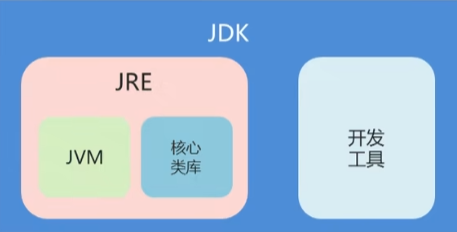

# Java

Java 是由 Sun Microsystems 公司于 1995 年推出的一门面向对象程序设计语言; 2010 年 Oracle(甲骨文)公司收购 Sun Microsystems, 之后由 Oracle 公司负责 Java 的维护和版本升级

Java 还是一个平台; Java 平台由 **Java 虚拟机(JVM)**和 **Java 应用编程接口(API)**构成; Java 应用编程接口为此提供了一个独立于操作系统的标准接口, 可分为基本部分和扩展部分; 在硬件或操作系统平台上安装一个 Java 平台之后, Java 应用程序就可运行

> [Java官方教程](https://docs.oracle.com/javase/tutorial/), 
>
> [Java8标准文档](https://docs.oracle.com/javase/8/docs/)
>
> [Java11中文API文档](https://www.runoob.com/manual/jdk11api/)

[[toc]]

## Java 体系

按应用范围, Java 可分为 3 个体系, 即 `Java SE`,`Java EE` 和 `Java ME`

### Java SE

**Java SE(Java Platform Standard Edition, Java 平台标准版)**以前称为 **J2SE**, 它允许开发和部署在桌面、服务器、嵌入式环境和实时环境中使用的 Java 应用程序; Java SE 包含了支持 Java Web 服务开发的类, 并为 Java EE 提供基础, 如 Java 语言基础、JDBC 操作、I/O 操作、网络通信以及多线程等技术

Java SE的体系结构图如下: 

 

### Java EE

**Java EE(Java Platform Enterprise Edition, Java 平台企业版)**以前称为 **J2EE**; 企业版本帮助开发和部署可移植、健壮、可伸缩且安全的服务器端 Java 应用程序; Java EE 是在 Java SE 基础上构建的, 它提供 Web 服务、组件模型、管理和通信 API, 可以用来实现企业级的面向服务体系结构(SOA)和 Web 2.0 应用程序

### Java ME

**Java ME(Java Platform Micro Edition, Java 平台微型版)**以前称为 **J2ME**, 也叫 **K-JAVA**;  Java ME 为在移动设备和嵌入式设备(比如手机、PDA、电视机顶盒和打印机)上运行的应用程序提供一个健壮且灵活的环境

Java ME 包括灵活的用户界面、健壮的安全模型、丰富的内置网络协议以及对可以动态下载的联网和离线应用程序; 基于 Java ME 规范的应用程序 只需编写一次就可以用于许多设备, 而且可以利用每个设备的本机功能

> 2005 年 6 月, JavaOne 大会召开, SUN 公司公开 Java SE 6; 此时, Java 的各种版本已经更名, 以取消其中的数字 "2"：J2EE 更名为 Java EE, J2SE 更名为Java SE, J2ME 更名为 Java ME

##  环境搭建

### JDK下载

下载 Java SDK(**推荐Java8**): https://www.oracle.com/java/technologies/downloads/archive/

#### JDK目录介绍

JDK 安装目录下具有多个子目录和一些网页文件, 其中重要目录和文件的说明如下:

 

- `bin`：提供 JDK 工具程序, 包括 javac、java、javadoc、appletviewer 等可执行程序
- `include`：存放用于本地访问的文件
- `jre`：存放 Java 运行环境文件
- `lib`：存放 Java 的类库文件, 工具程序实际上使用的是 Java 类库; JDK 中的工具程序, 大多也由 Java 编写而成
- `src.zip`：Java 提供的 API 类的源代码压缩文件; 如果需要查看 API 的某些功能是如何实现的, 可以査看这个文件中的源代码内容

**查看JDK是否安装成功:**

cmd 窗口下运行 `java` 或者 `java -version`命令有对应输出即表示JDK安装成功

#### 环境变量配置

添加环境变量`JAVA_HOME`

```sh
# 本机安装的JDK文件夹的绝对路径
C:\Program Files\Java\jdk1.8.0_91
```

修改系统变量`Path`

添加**两条**路径

```sh
%JAVA_HOME%\bin
%JAVA_HOME%\jre\bin
```

**cmd** 窗口测试`javac`命令有对应输出即可

> 如果不行就把用户变量`path`也加上那两条路径

## HelloWord

在 Java 中都是使用面向对象思想进行编码的

```java
// HelloWrold.java

// 定义公共类 HelloWrold
public class HelloWrold {
  // 公共的静态方法 main 没有返回值
  public static void main(String [] arys) {
    // 输出 HelloWrold
    System.out.println("HelloWrold");
  }
}
```

关键字跟 JS 和 TS 中的意思基本一致

- `public` 表示访问说明符, 表明该类是一个公共类, 可以控制其他对象对类成员的访问
- `class` 用于声明类, 其后所跟的字符串是类的名称
- `static` 表示该方法是类的静态方法
- `void` 表示 `main()` 方法没有返回值

> **`main()` 方法是所有程序的入口, 最先开始执行**

### 编译运行

**cmd** 进入 java 代码文件目录`javac 文件名.java`编译(生成`.class`文件), `java 类名`运行(不需要加`.class`)即可

碰到文件编码问题可以使用`javac -encoding UTF-8 文件名.java `指定字符集编译

 

### 执行流程

 Java程序运行流程如下: 

 

**字节码文件**是一种和任何具体机器环境及操作系统环境无关的**中间代码 **;它是一种二进制文件, 是 Java 源文件由 Java 编译器编译后生成的目标代码文件

编程人员和计算机都无法直接读懂字节码文件, 它必须由专用的 Java 解释器来解释执行, 因此 Java 是一种在编译基础上进行解释运行的语言

Java 解释器负责将字节码文件翻译成具体硬件环境和操作系统平台下的机器代码, 以便执行

因此 Java 程序**不能直接**运行在现有的操作系统平台上, 它必须运行在被称为 **Java 虚拟机**的软件平台之上


**Java 虚拟机(JVM)**是运行 Java 程序的软件环境, Java 解释器是 Java 虚拟机的一部分; 在运行 Java 程序时, 首先会启动 JVM, 然后由它来负责解释执行 Java 的字节码程序, 并且 Java 字节码程序只能运行于 JVM 之上; 这样利用 JVM 就可以把 Java 字节码程序和具体的硬件平台以及操作系统环境分隔开来, 只要在不同的计算机上安装了针对特定平台的 JVM, Java 程序就可以运行


JVM 把这种不同软、硬件平台的具体差别隐藏起来, 从而实现了真正的二进制代码级的跨平台移植; JVM 是 Java 平台架构的基础, Java 的跨平台特性正是通过在 JVM 中运行 Java 程序实现的, 如下: 

 

Java 语言这种**"一次编写, 到处运行"**的方式, 有效地解决了目前大多数高级程序设计语言需要针对不同系统来编译产生不同机器代码的问题, 即硬件环境和操作平台的异构问题, 大大降低了程序开发、维护和管理的开销; 

> Java 程序通过 JVM 可以实现跨平台特性, 但 JVM 是**不跨平台**的, 就是说, 不同操作系统之上的 JVM 是不同的, Windows 平台之上的 JVM 不能用在 Linux 平台, 反之亦然

### JVM、JRE和JDK

**JVM**

JVM(Java Virtual Machine, Java 虚拟机)是整个 Java 实现跨平台的最核心的部分, 能够运行以 Java 语言书写的软件程序

**JRE**

JRE(Java Runtime Environment, Java 运行环境)是运行 JAVA 程序所必须的环境的集合, 包含 JVM 标准实现及 Java 核心类库

**JDK**

(Java Development Kid, Java 开发开源工具包)是Java程序开发工具包, `包含JRE`和开发人员使用的工具

其中的**开发**工具: 编译工具(`javac.exe`)和运行工具(`java.exe`) , 想要**开发**一个全新的Java程序, 那么必须安装`JDK`

**JDK, JRE 和 JVM**的关系图如下

 

由上图可以看到

- **JDK**: **JRE** + 多种Java开发工具
- **JRE**: **JVM** + 各种类库
- 这三者的关系是一层层的嵌套关系: **JDK** > **JRE** > **JVM**

## 集成开发工具

- [Notepad++](https://notepad-plus.en.softonic.com/)
- [Eclipse](https://www.eclipse.org/downloads/)
- [IntelliJ IDEA](https://www.jetbrains.com/idea/download/#section=windows)

### IDEA中的项目结构

项目下包含多个模块, 模块下包含多个包, 包下包含多个类

 

#### 项目结构操作

文件里的**项目结构**(`File -> Project Structure`)可以新建/删除相关的文件, 还可以修改指定模块的JDK版本

> 模块文件下的右键**移除模块**(`Remove Module`)并不会真正的删除文件目录而是在当前项目中移除了而已

## 数据类型

### 计算机的数据单位

计算机存储设备的最小信息单元叫**“位(bit)**", 我们又称之为“**比特位**”, 通常用小写的字母”**b**”表示; 而计算机中最小的存储单元叫“**字节(byte)**", 通常用大写字母”**B**”表示, 字节是由**连续的8个位**组成

除了字节外还有一些常用的存储单位:

- 1B(字节) = 8bit
- 1KB = 1024B
- 1MB = 1024KB
- 1GB = 1024MB
- 1TB = 1024GB

### 基本数据类型

基本数据类型包括 boolean(布尔型)、float(单精度浮点型)、char(字符型)、byte(字节型)、short(短整型)、int(整型)、long(长整型)和 double (双精度浮点型)共 8 种

| 类型名称               | 关键字  | 占用内存 | 取值范围                                     |
| ---------------------- | ------- | -------- | -------------------------------------------- |
| 字节型                 | byte    | 1 字节   | -128 ~ 127                                   |
| 短整型                 | short   | 2 字节   | -32768 ~ 32767                               |
| 整型(**默认**)         | int     | 4 字节   | -2147483648 ~ 2147483647                     |
| 长整型                 | long    | 8 字节   | -9223372036854775808L ~ 9223372036854775807L |
| 单精度浮点型           | float   | 4 字节   | +/-3.4E+38F(6~7 个有效位)                    |
| 双精度浮点型(**默认**) | double  | 8 字节   | +/-1.8E+308 (15 个有效位)                    |
| 字符型                 | char    | 2 字节   | ISO 单一字符集(0 ~ 65535)                    |
| 布尔型                 | boolean | 1 字节   | true 或 false                                |

Java 中的基本数据类型注意点:

- 整数默认是`int`类型, 浮动数默认是`double`类型

- `char` (字符)类型的值使用单引号定义(`'`), 实际上字符型也是一种整数类型, 相当于无符号整数类型, 并且两个字符类型的值运算会使用其 ASCII(Unicode码)的值计算

- `boolean`(布尔)类型的值**不能转换成任何数据类型**, **true** 常量不等于 **1**, 而 **false** 常量也不等于 **0**, 这两个值**只能赋给声明为 boolean 类型的变量**或者用于布尔运算表达式中

Java 数据类型的结构如下: 

 

### 引用数据类型

引用数据类型建立在基本数据类型的基础上, 包括数组、类和接口, 引用数据类型是由用户自定义, 用来限制其他数据的类型; 另外, Java 语言中不支持 [C++](http://c.biancheng.net/cplus/) 中的指针类型、结构类型、联合类型和枚举类型

引用类型有一种特殊的 `null` 类型; 所谓引用数据类型就是对一个对象的引用, 对象包括实例和数组两种; 实际上, 引用类型变量就是一个指针, 只是 Java 语言里不再使用指针这个说法; 

空类型(null type)就是 `null` 值的类型, 这种类型没有名称; 因为 `null` 类型没有名称, 所以不可能声明一个 `null` 类型的变量或者转换到 `null` 类型

空引用(null)是 `null` 类型变量**唯一的值**, 表示不指向任何有效对象, 空引用可以转换为**任何引用类型**(**不能**转换成基本类型)

### 变量使用

**变量定义**语法: `类型 变量名 = 初始值`

```java
int x = 1, y = 2, z = 3;

String name, message;
name = "张三";
message = "定义变量";

char gender = '男';
```

Java 中使用变量时需要注意以下事项：

- 不能**重复**定义变量

- 变量没有赋值是**不能**直接使用的
- 定义`long`和`float`类型是需要显式的指定(可以在对应值的后面添加后缀`L`或`F`)

- 变量是类或者结构中的字段, 如果**没有显式地初始化**, 默认状态下创建变量并默认初始值为 0
- 方法中的变量必须**显式地初始化**, 否则在使用该变量时就会出错

```java
public class HelloWrold {
  // 只定义未初始化
  String name;
  int count;

  public static void main(String [] args) {
    long l;
    // int l = 1; // Error 重复定义变量

    // System.out.println(l); // Error 变量没有赋值是不能直接使用的

    // l = 10000000000; // int类型超出了范围  
    l = 10000000000L; // 显示定义为 long 类型

    // float f = 3.14; // 不能将double类型转换为float类型  
    float f = 3.14F; // 显式定义为 long 类型
      
    HelloWrold hi = new HelloWrold();
    System.out.println(hi.name); // => null
    System.out.println(hi.count); // => 0
  }
}
```

## 类型转换

### 自动类型转换

如果以下 2 个条件都满足, 那么将一种类型的数据赋给另外一种类型变量的时, 将执行**自动类型转换**(automatic type conversion); 

- 两种数据类型彼此兼容
- 目标类型的取值范围大于源数据类型(低级类型数据转换成高级类型数据)

 

```java
int i = 1;
long l = 2;

// 自动转换为 double
double d = i;
System.out.println(d); // 1.0

byte b = 9;
// char c = b; // Error 类型不兼容

// i = i * 0.5; // Error 不能将double类型转换为int类型
```

### 强制类型转换

尽管自动类型转换是很有帮助的, 但并不能满足所有的编程需要; 有时有需要**将数据范围大的值或变量**转换为数据**范围小**的变量

强制类型转换语法: `目标数据类型 变量名 = (目标数据类型)值或者变量`

```java
// int n = 1.23; // Error 不能将 double 类型转换为 int 类型  
int n = (int)1.23; // 强制转换为 int类型
System.out.println(n); // 1(小数被去掉了)
```

> 注意: 强制类型转换有时会丢失数据的精确度

## 内置包装类

在 Java 的设计中提倡一种思想, 即一切皆对象; 但是从数据类型的划分中, 我们知道 Java 中的数据类型分为基本数据类型和引用数据类型, 但是基本数据类型怎么能够称为对象呢？于是 Java 为每种基本数据类型分别设计了对应的类, 称之为**包装类(Wrapper Classes)**, 也有地方称为外覆类或数据类型类

包装类和基本数据类型的关系如下表所示: 

| 基本数据类型 |  包装类   |
| :----------: | :-------: |
|     byte     |   Byte    |
|    short     |   Short   |
|     int      |  Integer  |
|     long     |   Long    |
|     char     | Character |
|    float     |   Float   |
|    double    |  Double   |
|   boolean    |  Boolean  |

> 包装类都存在于[java.lang](https://www.apiref.com/java11-zh/java.base/java/lang/package-summary.html)包下是默认导入的

### 装箱和拆箱

装箱: 把基本数据类型转换为对应的包装类类型

拆箱: 把包装类类型转换为对应的基本数据类型

```java
// 自动装箱
Integer i1 = 2;
System.out.println(i1); // 2

// 自动拆箱
int i2 = i1 + 10;
System.out.println(i2); // 12
```

自动装箱的小问题:

包装类的默认值都是`null`, 当值为`null`时自动装箱会有空指针异常问题

```java
Integer i1 = null; // 相当于是 Integer.valueOf(null);
i1 += 1; // 相当于是 null.intValue() + 1;
System.out.println(i1); // 空指针异常 NullPointerException
```

使用前判断不是`null`就可以了

```java
Integer i1 = null;
if (i1 != null) {
    i1 += 1; 
}
System.out.println(i1); // null
```

> 在使用包装类型的时候, 操作前最好先判断是否为`null`, 包括使用其他引用数据类型是时也最好检查一下不为`null`

### 包装类的应用

#### int 和 integer 相互转换

`int` 转换为 `integer`(装箱): 通过`Integer.valueOf()`或者 `Integer`构造方法

`integer` 转换为 `int`(拆箱): 通过`Integer.intValue()`

```java
// 手动装箱
Integer i1 = Integer.valueOf(1); // 可以是字符串的数字类型
System.out.println(i1); // 1

// 手动拆箱
int i2 = i1.intValue() + 3;
System.out.println(i2); // 4
```

#### 将字符串转换为数值类型

在 [Integer](https://www.apiref.com/java11-zh/java.base/java/lang/Integer.html) 和 [Float](https://www.apiref.com/java11-zh/java.base/java/lang/Float.html) 类中分别提供了以下两种方法：

Integer 类(String 转 int ): `parseInt()`

Float 类(String 转 float ): `parseFloat()`

```java
int n = Integer.parseInt("99");
float f = Float.parseFloat("99.45");
System.out.println(n); // 99 
System.out.println(f); // 99.45
```

> 使用以上两种方法时, 字符串中的数据必须由数字组成, 否则转换时会出现程序错误

#### 整数转换为字符串

`Integer.toString()`方法可以完成转换

```java
String s = Integer.toString(99);
System.out.println(s); // 99
System.out.println(s instanceof String); // true
```

通过String类的[`valueOf()`](https://www.apiref.com/java11-zh/java.base/java/lang/String.html#valueOf(int))或者拼一个空的字符串也可以实现数字转字符串

```java
int n = 123;
String s1 = n + "";
String s2 = String.valueOf(n);
System.out.println(s1 instanceof String); // true
System.out.println(s2 instanceof String); // true
```

> 实际使用中推荐使用包装类来代替基本类型, 因为包装类的默认都是`null`, 基本数据类型的默认值各有各的, 一旦漏赋值使用, 很容易造成各种问题

## 运算

### 数值类型的运算

算术表达式中包含多个基本数据类型的值的时候, 整个算术表达式的类型会**自动提升**至最高等级:

- `byte`, `short` 和`char`都将被提升到`int`
- 类型等级顺序: `byte, short, char`-> `int` ->`long` ->`float` -> `double`

```java
char c = 'c';
// char n = c + 1; // Error 不能从 int 转换为 char 类型
int n = c + 1; // char 类型自动提升为 int 类型
```

扩展的赋值运算符**隐含**了类型转换:

```java
int n = 10;
n += 10; // 隐含了类型转换
// n = n + 10; 
System.out.println(n); // => 20

// short s = n + 10; // Error 不能从 int 转换为 short (类型提升)
short s = (short)(n + 10); // 可以使用强制类型转换(不推荐这样写)
```

> 整数的除法对于**除数为0**时运行时将报错, 但编译不会报错

### 整数溢出

要特别注意, 整数由于存在范围限制, 如果计算结果超出了范围, 就会产生溢出, 而溢出**不会出错**, 却会得到一个奇怪的结果:

```java
int x = 2147483640;
int y = 15;
int sum = x + y;
System.out.println(sum); // => -2147483641
```

要解释上述结果, 需要把整数`2147483640`和`15`换成二进制做加法：

```ascii
  0111 1111 1111 1111 1111 1111 1111 1000
+ 0000 0000 0000 0000 0000 0000 0000 1111
-----------------------------------------
  1000 0000 0000 0000 0000 0000 0000 0111
```

由于最高位计算结果为`1`, 因此, 加法结果变成了一个负数

要解决上面的问题, 可以把`int`换成`long`类型

```java
long sum = x + y;
```

### 浮动数溢出

整数运算在除数为`0`时会报错, 而浮点数运算在除数为`0`时, 不会报错, 但会返回几个特殊值：

- `NaN`表示*Not a Number*
- `Infinity`表示无穷大
- `-Infinity`表示负无穷大

```java
double d1 = 0.0 / 0; // NaN
double d2 = 1.0 / 0; // Infinity
double d3 = -1.0 / 0; // -Infinity
```

### HelloWrold

以为**IDEA**为例, 先新建**空项目**(`File -> New -> project`), 在该项目下新建**模块**(`New -> Module`), 在该模块的`src`目录下新建**包**(`New -> Package`), 再在该包下新建一个**类**(`New -> Java Class`), 编写代码, 右键新建点击`Run`即可运行代码

**IDEA**运行**Java**代码生产的字节码文件(`.class`)文件会统一生成到**当前项目目录**下的`out`目录下

> **.java**文件的文件名必须和其文件内书写的类名同名不然运行代码会报找不到类名

## 数组

Java 中的数组只能存储**相同**数据类型

数组的定义格式有两种: 

**数据类型 []  变量名**

```java
int[] arr; // 定义一个`int`类型的数组, 数组名是`arr`
```

**数据类型  变量名 []**

```java
int arr[]; // 定义一个`int`类型的变量, 变量名时`arr`数组
```

> 两种效果都一样推荐使用第一种

### 数组的初始化

Java中的数组必须先初始化, 然后才能使用
所谓初始化: 就是为数组中的数组元素分配内存空间, 并为每个数组元素赋值

#### 动态初始化

初始化只指定**数组的长度,** 由系统为数组分配**初始值**, 格式: `数组类型[] 变量名 = new 数组类型[数组长度]`

```java
int[] listNum = new int[3];
        
System.out.println("listNum 数组的内存地址: " + listNum); // [I@16d3586

// 索引访问
listNum[0] = 999;

// 循环
for(int i = 0; i < listNum.length; i++) {
    System.out.printf("%d ", listNum[i]); // 999 0 0
}
```

数组在初始化时, 会为存储空间添加默认值:

|           类型           | 默认值 |
| :----------------------: | :----: |
|           整数           |   0    |
|          浮点数          |  0.0   |
|          布尔值          | false  |
|           字符           |   ''   |
| 引用数据类型(包括字符串) |  null  |

```java
int[] listNum = new int[3];
System.out.println(listNum[0]); // 0

double[] listDou = new double[3];
System.out.println(listDou[0]); // 0.0

boolean[] listBool = new boolean[3];
System.out.println(listBool[0]); // false

char[] listChar = new char[3];
System.out.println(listChar[0] + ""); // 

String[] listStr = new String[3];
listStr[0] = "helloWrold";
System.out.printf("%s, %s", listStr[0], listStr[1]); // helloWrold, null
```

#### 内存分配

Java程序在运行时, 需要在内存中分配空间, 为了提高运算效率, 就对空间进行了不同区域的划分, 每一片区域都有特定的处理数据方式和内存管理方式

#### 栈

用于存储局部变量, 定义在方法中的变量, 使用完就会被垃圾回收器回收

#### 堆

存储`new`出来的内容(实体, 对象), 每一个`new`出来的数据都有一个地址值指向该堆中的地址, 使用完毕后, 也会被垃圾回收器(**空闲时**)回收

**引用数据类型赋值保存其引用**

```java
int[] listNum1 = new int[3];
listNum1[0] = 999;
// 引用赋值
int[] listNum2 = listNum1;
System.out.println(listNum1[0] == listNum2[0]); // => true
System.out.printf("%d %d", listNum1[0], listNum2[0]); // 999 999
```

#### 静态初始化

静态初始化: 初始化时指定每个数组元素的**初始值**, 由系统决定**数组长度**

完整格式: `数据类型[] 变量名 = new 数据类型[]{ 数据1, 数据2, ...};`

```java
int[] listNum = new int[] { 1, 5, 999 };
for (int i = 0; i < listNum.length; i++) {
    System.out.printf("%d ", listNum[i]); // 1 5 999
}
```

简写格式: `数据类型[] 变量名 = { 数据1, 数据2, ...};`

```java
char[] listChar = {'a', 'b', 99}; // 支持 ASCII 码
for (int i = 0; i < listChar.length; i++) {
    System.out.printf("%c ", listChar[i]); // a b c
}

// or

System.out.println(new char[]{97, 98, 99}); // abc
```

**数组的常见小问题**:

- 索引越界: 访问数组中不存在的索引对应的元素
- 空指针异常: 访问的数据没有对应的内存地址(一般是访问`null`)

```java
int[] listNum = new int[3];

listNum[10] = 1; // Error ArrayIndexOutOfBoundsException 索引越界

listNum = null;
System.out.printf("%d", listNum[0]); // Error NullPointerException 空指针异常
```

#### 命令行参数

Java程序的入口是`main`方法, 而`main`方法可以接受一个命令行参数, 它是一个`String[]`数组

这个命令行参数由JVM接收用户输入并传给`main`方法:

```java
package chapter_01;

public class LearnArray {
    public static void main(String[] args) {
        for (String arg : args) {
            System.out.println(arg);
        }
    }
}
```

### 多维数组

```java
package chapter_01;

import java.util.Arrays;

public class LearnArray {
    public static void main(String[] args) {
        // 二维数组
        int[][] listNum = {
                {1, 2, 3},
                {4, 5, 6},
                {7, 8, 9}
        };
        System.out.println(Arrays.toString(listNum[0])); // [1, 2, 3]
        System.out.println(listNum[0][0]); // 1
        System.out.println(listNum[0][1]); // 2

        // 三维数组
        int[][][] ns = {
            {
                {1, 2, 3},
                {4, 5, 6},
                {7, 8, 9}
            },
            {
                {10, 11},
                {12, 13}
            },
            {
                {14, 15, 16},
                {17, 18}
            }
        };
        System.out.println(Arrays.toString(ns[1][1])); // [12, 13]
    }
}
```

### 数组工具类Arrays

[Arrays](https://www.apiref.com/java11-zh/java.base/java/util/Arrays.html)类包含用于操作数组的各种方法(例如排序和搜索), 此类还包含一个静态工厂, 允许将数组视为列表

#### 快速创建指定元素的集合

[Arrays.asList()](https://www.apiref.com/java11-zh/java.base/java/util/Arrays.html#asList(T...))方法返回由指定数组支持的**固定大小**的列表, 不支持后续的添加和删除操作(可以修改元素值)

```java
package chapter_02;

import java.util.Arrays;
import java.util.List;

public class RestParams02 {
    public static void main(String[] args) {
        List<String> list1 = Arrays.asList("hello", "world", "java", "hello");

        System.out.println(list1); // [hello, world, java, hello]

        // 不可修改Arrays.asList返回的集合的大小
        // list1.add("你好"); // UnsupportedOperationException
        // list1.remove("hello"); // UnsupportedOperationException

        list1.set(0, "你好"); // 可以修改元素的内容
        list1.set(list1.size() - 1, "你好"); // 可以修改元素的内容

        System.out.println(list1); // [你好, world, java, 你好]
    }
}
```

#### 打印数组内容

直接打印数组变量, 得到的是数组在JVM中的引用地址, 可以使用循环来获取, 

但是使用循环也很麻烦, 可以使用`Arrays.toString()`来快速打印数组内容： 

```java
package chapter_01;

import java.util.Arrays;

public class LearnArray {
    public static void main(String[] args) {
        int[] listNum = { 1, 2, 3 };
      	// 直接打印
        System.out.println(listNum); // [I@16d3586

        // 循环读取
        for (int i = 0; i < listNum.length; i++) {
            System.out.print(listNum[i] + " "); // 1 2 3
        }

        // Arrays.toString() 快速读取
        System.out.println(Arrays.toString(listNum)); // [1, 2, 3]
    }
}
```

#### 数组排序

使用`Arrays.sort()`进行数组排序但是会修改数组本身

```java
package chapter_01;

import java.util.Arrays;

public class LearnArray {
    public static void main(String[] args) {
        int[] list = { 3, 4, 1, 2, 5 };
        System.out.println("排序前: " + Arrays.toString(list)); // 排序前: [3, 4, 1, 2, 5]
        Arrays.sort(list);
        System.out.println("排序后: " + Arrays.toString(list)); // 排序后: [1, 2, 3, 4, 5]
    }
}
```

`Arrays.sort()`方法对字符数组进行排序, 实际对应元素的内存地址并没有改变, 但其指向的值会变

`Arrays.sort()`方法也是可以使用[**java.util.Comparator**](https://www.apiref.com/java11-zh/java.base/java/util/Comparator.html)类来控制排序顺序, 格式:

```java
public static <T> void sort(T[] a, Comparator<? super T> c)
```

**利用 Arrays.sort() 来获取最大, 最小值**

```java
package chapter_01;

import java.util.Arrays;

public class LearnArray {
    public static void main(String[] args) {
        int[] listNum = {2, 32, 99, 88, 300};
        System.out.println(getMax(listNum)); // 300
        System.out.println(getMin(listNum)); // 2
    }
    public static int getMax(int[] list) {
        Arrays.sort(list);
        // 最后一位就是最大值
        return list[list.length - 1];
    }
    public static int getMin(int[] list) {
        Arrays.sort(list);
        // 第一位就是最小值
        return list[0];
    }
}
```

#### 比较数组

数组相等的条件不仅要求数组元素的个数必须相等, 而且要求对应位置的元素也相等; Arrays 类提供了`equals()`方法比较两个数组是否相等

```java
int[] n1 = {1, 2, 3};
int[] n2 = {1, 2, 3};
System.out.println(Arrays.equals(n1, n2)); // true
n2[0] = 100;
System.out.println(Arrays.equals(n1, n2)); // false
```

#### 数组填充

Arrays 类提供了一个`fill()`方法, 可以在指定位置进行数值填充, `fill()`方法虽然可以填充数组, 但是它的功能有限制, 只能使用同一个数值进行填充

```java
int[] listNum = new int[5];
// 全部填充 999
Arrays.fill(listNum, 999);
System.out.println(Arrays.toString(listNum)); // [999, 999, 999, 999, 999]

// 索引 1 ~ 3(不包括) 填充 123
Arrays.fill(listNum, 1, 3, 123);
System.out.println(Arrays.toString(listNum)); // [999, 123, 123, 999, 999]

// 注意: 数组索引越界
Arrays.fill(listNum, 1, 10, 123); // ArrayIndexOutOfBoundsException
```

#### 查找指定元素

使用 Arrays 类的`binarySearch()`方法可以实现数组的二分查找, 在进行数组查询之前, 必须对数组进行排序(可以使用 `sort()` 方法), 

如果**没有排序, 则结果是不确定的**, 如果数组包含多个带有指定值的元素, 则无法确认找到的是哪一个

常用重载方法

```java
// 查找 a 中符合 key 的元素索引
static int binarySearch(Object[] a,Object key); 
// 从给定的范围中查找 fromIndex ~ toIndex(不包括) 符合 key 的元素索引
static int binarySearch(Object[] a,int fromIndex,int toIndex,Object key);
```

a 表示要搜索的数组, key 表示要搜索的值; 如果 key 包含在数组中, 则返回搜索值的索引；否则返回 -1 或“插入点”, 只有找到对应的元素才会返回`>=0`的索引

```java
int[] listNum = {2, 1, 4, 5, 3};
Arrays.sort(listNum);
int idx1 = Arrays.binarySearch(listNum, 3); // 2
int idx2 = Arrays.binarySearch(listNum, 100); // -6
System.out.println(Arrays.toString(listNum));
System.out.println("idx1 = " + idx1); // idx1 = 2
System.out.println("idx2 = " + idx2); // idx2 = -6
```

#### 拷贝数组

在 Java 中实现数组复制分别有以下 4 种方法：

1. Arrays 类的 `copyOf()` 方法
2. Arrays 类的 `copyOfRange()` 方法
3. System 类的 `arraycopy()` 方法
4. Object 类的 `clone()` 方法

> 注意: 以上几种方法都是**浅拷贝**

## 方法

java中的方法就是静态成员方法(用`static`修饰), 静态方法类似其它编程语言的函数

定义格式: `public static 返回值类型 方法名(参数类型 参数名) {  }`

```java
package test;

import java.util.Random;

public class MyUtil {
    // 常量 Random 实例
    public static final Random r = new Random();

    public static void main(String[] args) {
        // 直接使用 方法名 调用
        int n = generRandom(10);
        System.out.println(n);

        // 类名.方法() 也可以调用
        // System.out.println(MyUtil.generRandom(10));
    }
    // 定义方法
    public static int generRandom(int n) {
        return r.nextInt(n) + 1;
    }
}
```

静态方法也经常用于辅助方法, Java程序的入口`main()`也是静态方法

**方法的注意事项:** 

- 方法不能**嵌套定义**
- 定义了返回值为`void`的方法依然可以使用`return`关键字来中止代码执行, 但是**不能返回**实际值
- 因为静态方法属于`class`而不属于实例, 因此, 静态方法内部, 无法访问`this`变量, 也无法访问实例字段, 它只能访问静态字段
- 通过实例变量也可以调用静态方法, 但这只是编译器自动帮我们把实例改写成类名而已

### 方法重载

方法重载指同一个类中定义的多个方法之间的关系, 满足下列条件的方法相互构成重载: 

- **多个**具有**相同方法名**的方法在同一个类中

- 多个方法的参数的 **类型不同** 或者 **数量不同**

**重载的特点**

- 方法的重载仅对应方法的**定义**, 调用时正常调用即可(会根据参数来匹配重载方法)
- 重载仅针对同一个类中方法的名称与参数进行识别, 与返回值无关, 就是说不能通过返回值来判定多个方法是否构成重载

```java
package test;

import jdk.nashorn.internal.runtime.Debug;

public class MyUtil {
    public static void main(String[] args) {
        int n1 = add(1, 2);
        // 方法传递参数时可以强转类型
        double n2 = add(1f, (double)2); 
        System.out.printf("n1: %d, n2: %f", n1, n2); // => n1: 3, n2: 3.000000
    }
    // 符合 add 方法重载条件
    public static int add(int a, int b) {
        return a + b;
    }
    // 符合 add 方法重载条件
    public static double add(double a, double b) {
        return a + b;
    }

    // 不符合 add 方法重载条件(返回值类型与方法重载无关)
    // Error 已在类 test.MyUtil中定义了方法 add(int,int)
    // public static double add(int a, int b) {
    //     return (double)(a + b);
    // }
}
```

### 方法参数传递

基本数据类型是**按值传递**

```java
package test;

public class MyUtil {
    public static void main(String[] args) {
        int n = 1;
        System.out.println(n); // => 1
        
        changeInt(n, 999);
        System.out.println(n); // => 1
    }
    public static void changeInt(int n, int val) {
        n = val;
    }
}
```

引用数据类型是按**引用传递**

```java
package test;

public class MyUtil {
    public static void main(String[] args) {
        int[] listNum = { 1, 2, 3 };
        System.out.println(listNum[0]); // => 1
        
        changeArray(listNum, 0, 999);
        System.out.println(listNum[0]); // => 999
    }
    public static void changeArray(int[] listNum, int idx, int val) {
        listNum[idx] = val;
    }
}
```

## Debug

在IDEA中点击添加断点以后, 需要以**调试运行**断点才能起作用

 

删除多个断点

 

### 查看方法源码位置

选中指定的方法`右键->转到(goto)`

 

## Scanner

[Scanner](https://www.apiref.com/java11-zh/java.base/java/util/Scanner.html)是一个简单的文本扫描程序(**数据输入**), 可以使用正则表达式解析基本类型和字符串

Scanner 会自动转换数据类型, 因此不必手动转换

```java
package base;

// 导入包(Scanner类)
import java.util.Scanner;

public class Java_API {
    public static void main(String[] args) {
        // 新建 Scanner 实例
        Scanner sc = new Scanner(System.in);
        // 接受输入并赋值给 line
        System.out.print("请输入字符串:\t");
        String line = sc.nextLine();
        System.out.println("你输入的文本是: " + line);

        System.out.print("请输入整数:\t");
        int n = sc.nextInt();
        System.out.println("你输入的整数是: " + n);
    }
}
```

结果:

```
请输入字符串:	hellowrold123
你输入的文本是: hellowrold123
请输入整数:	199
你输入的整数是: 199
```

## Random

[Random](https://www.apiref.com/java11-zh/java.base/java/util/Random.html)类的实例用于生成伪随机数流

```java
package base;

// 导入 java.util.Random 包
import java.util.Random;

public class Java_API {  
  public static void main(String[] args) {
      
    // 实例化 Random 实例
    Random r = new Random();

    int i = 50;
    System.out.println("生成 1 ~ 10 之间的随机数: ");
    while (--i >= 0) {
      // 生成一个 1 ~ 10 之间是随机数
      System.out.printf("%d  ", r.nextInt(10) + 1);
    }
  }
}
```

## Math

[Math](https://www.apiref.com/java11-zh/java.base/java/lang/Math.html) 类封装了常用的数学运算, 提供了基本的数学操作, 如指数、对数、平方根和三角函数等, Math 类位于 **java.lang** 包中(自动导入)

Math 类中包含 E 和 PI 两个静态常量, 它们的值分别等于 e(自然对数)和 π(圆周率)

```java
System.out.println("Math.E: " + Math.E); // => Math.E: 2.718281828459045
System.out.println("Math.PI: " + Math.PI); // => Math.PI: 3.141592653589793
```

**Math.random()** 同 js 的一样用法

```java
System.out.println((int)(Math.random() * 100) + 1); // 1 ~ 100 之间的随机数
```

> **Math**类提供的都是静态方法并且支持多种数值类型

### 求最大值、最小值和绝对值

有`abc`, `max`,`min`,`ceil`,`floor`效果同 js 的一样

```java
int a = 1;
int b = 2;
System.out.println(Math.max(a, b)); // => 2

double c = 1.23;
double d = 2.34;
System.out.println(Math.min(c, d)); // => 1.23

System.out.println(Math.abs(-100)); // => 100
System.out.println(Math.abs(-3.123)); // => 3.123
System.out.println(Math.abs(3.123)); // => 3.123
```

### 求整运算

| 方法                          | 说明                                                         |
| ----------------------------- | ------------------------------------------------------------ |
| static double ceil(double a)  | 返回大于或等于 a 的最小整数                                  |
| static double floor(double a) | 返回小于或等于 a 的最大整数                                  |
| static double rint(double a)  | 返回最接近 a 的整数值, 如果有两个同样接近的整数, 则结果取偶数 |
| static int round(float a)     | 按照四舍五入返回与参数最近的整数                             |
| static long round(double a)   | 按照四舍五入返回与参数最近的整数, 然后强制转换为长整型       |

```java
Scanner input = new Scanner(System.in);
System.outprintln("请输入一个数字：");
double num = input.nextDouble();
System.out.println("大于或等于 "+ num +" 的最小整数：" + Math.ceil(num));
System.out.println("小于或等于 "+ num +" 的最大整数：" + Math.floor(num));
System.out.println("将 "+ num +" 加上 0.5 之后最接近的整数：" + Math.round(num));
System.out.println("最接近 "+num+" 的整数：" + Math.rint(num));
```

结果: 

```
请输入一个数字：
99.4
大于或等于 99.4 的最小整数：100.0
小于或等于 99.4 的最大整数：99.0
将 99.4 加上 0.5 之后最接近的整数：99
最接近 99.4 的整数：99.0
```

### 三角函数运算

| 方法                                   | 说明                                                       |
| -------------------------------------- | ---------------------------------------------------------- |
| static double sin(double a)            | 返回角的三角正弦值, 参数以孤度为单位                       |
| static double cos(double a)            | 返回角的三角余弦值, 参数以孤度为单位                       |
| static double asin(double a)           | 返回一个值的反正弦值, 参数域在 [-1,1], 值域在 [-PI/2,PI/2] |
| static double acos(double a)           | 返回一个值的反余弦值, 参数域在 [-1,1], 值域在 [0.0,PI]     |
| static double tan(double a)            | 返回角的三角正切值, 参数以弧度为单位                       |
| static double atan(double a)           | 返回一个值的反正切值, 值域在 [-PI/2,PI/2]                  |
| static double toDegrees(double angrad) | 将用孤度表示的角转换为近似相等的用角度表示的角             |
| staticdouble toRadians(double angdeg)  | 将用角度表示的角转换为近似相等的用弧度表示的角             |

### 指数运算

| 方法                                  | 说明                               |
| ------------------------------------- | ---------------------------------- |
| static double exp(double a)           | 返回 e 的 a 次幂                   |
| static double pow(double a, double b) | 返回以 a 为底数, 以 b 为指数的幂值 |
| static double sqrt(double a)          | 返回 a 的平方根                    |
| static double cbrt(double a)          | 返回 a 的立方根                    |
| static double log(double a)           | 返回 a 的自然对数, 即 lna 的值     |
| static double log10(double a)         | 返回以 10 为底 a 的对数            |

### 数字格式化

数字的格式在解决实际问题时使用非常普遍, 这时可以使用 [DedmalFormat](https://www.apiref.com/java11-zh/java.base/java/text/DecimalFormat.html) 类对结果进行格式化处理

DecimalFormat 是 NumberFormat 的一个子类, 用于格式化十进制数字; DecimalFormat 类包含一个模式和一组符号, 如下: 

| 符号 | 说明                                                         |
| :--: | :----------------------------------------------------------- |
|  0   | 显示数字, 如果位数不够则补 0                                 |
|  #   | 显示数字, 如果位数不够不发生变化                             |
|  .   | 小数分隔符                                                   |
|  -   | 减号                                                         |
|  ,   | 组分隔符                                                     |
|  E   | 分隔科学记数法中的尾数和小数                                 |
|  %   | 前缀或后缀, 乘以 100 后作为百分比显示                        |
|  ?   | 乘以 1000 后作为千进制货币符显示; 用货币符号代替; 如果双写, 用国际货币符号代替； 如果出现在一个模式中, 用货币十进制分隔符代替十进制分隔符 |

基本方法使用: 

```java
package base;

import java.text.DecimalFormat;
import java.util.Scanner;

public class MathLearn {
    public static void main(String[] args) {
        DecimalFormat d1 = new DecimalFormat("0.0");
        DecimalFormat d2 = new DecimalFormat("#.#");
        DecimalFormat d3 = new DecimalFormat("000.000");
        DecimalFormat d4 = new DecimalFormat("###.###");
        Scanner sc = new Scanner(System.in);
        System.out.println("请输入一个 float 类型的数字: ");
        float f = sc.nextFloat();
        // 对输入的数字应用格式, 并输出结果
        System.out.println("0.0 格式：" + d1.format(f));
        System.out.println("#.# 格式：" + d2.format(f));
        System.out.println("000.000 格式：" + d3.format(f));
        System.out.println("###.### 格式：" + d4.format(f));
        System.out.println("#% 格式：" + new DecimalFormat("#%").format(f));
    }
}
```

```
请输入一个 float 类型的数字: 
23.456
0.0 格式：23.5
#.# 格式：23.5
000.000 格式：023.456
###.### 格式：23.456
#% 格式：2346%
```

### 大数字计算

在 Java 中提供了用于大数字运算的类, 即 **java.math.BigInteger** 类和 **java.math.BigDecimal** 类; 这两个类用于高精度计算, 其中 BigInteger 类是针对整型大数字的处理类, 而 BigDecimal 类是针对大小数的处理类

#### BigInteger

[BigInteger](https://www.apiref.com/java11-zh/java.base/java/math/BigInteger.html) 类型的数字范围较 Integer 类型的数字范围要大得多, 并且支持任意精度的整数, 也就是说在**运算中 BigInteger 类型可以准确地表示任何大小的整数值**

除了基本的加、减、乘、除操作之外, BigInteger 类还封装了很多操作, 像求绝对值、相反数、最大公约数以及判断是否为质数等

使用 BigInteger 类, 首先要创建一个 BigInteger 对象, BigInteger 类提供了很多种构造方法, 最简单的是用字符串的形式来创建需要操作的数字, 如下: 

```java
BigInteger (String val);
```

> 这里的 **val** 是数字十进制的字符串(双引号是必需的)

BigInteger类的常用运算方法如下: 

| 方法名称                           | 说明                                                         |
| ---------------------------------- | ------------------------------------------------------------ |
| add(BigInteger val)                | 做加法运算                                                   |
| subtract(BigInteger val)           | 做减法运算                                                   |
| multiply(BigInteger val)           | 做乘法运算                                                   |
| divide(BigInteger val)             | 做除法运算                                                   |
| remainder(BigInteger val)          | 做取余数运算                                                 |
| divideAndRemainder(BigInteger val) | 做除法运算, 返回数组的第一个值为商, 第二个值为余数           |
| pow(int exponent)                  | 做参数的 exponent 次方运算                                   |
| negate()                           | 取相反数                                                     |
| shiftLeft(int n)                   | 将数字左移 n 位, 如果 n 为负数, 则做右移操作                 |
| shiftRight(int n)                  | 将数字右移 n 位, 如果 n 为负数, 则做左移操作                 |
| and(BigInteger val)                | 做与运算                                                     |
| or(BigInteger val)                 | 做或运算                                                     |
| compareTo(BigInteger val)          | 做数字的比较运算                                             |
| equals(Object obj)                 | 当参数 obj 是 Biglnteger 类型的数字并且数值相等时返回 true, 其他返回 false |
| min(BigInteger val)                | 返回较小的数值                                               |
| max(BigInteger val)                | 返回较大的数值                                               |

基本方法使用: 

```java
package base;

import java.math.BigInteger;
import java.util.Scanner;

public class MathLearn {
    public static void main(String[] args) {
        Scanner input = new Scanner(System.in);
        System.out.println("请输入一个整型数字：");
        // 保存用户输入的数字
        int num = input.nextInt();
        // 使用输入的数字创建BigInteger对象
        BigInteger bi = new BigInteger(num + "");
        // 计算大数字加上99的结果
        System.out.println("加法操作结果：" + bi.add(new BigInteger("99")));
        // 计算大数字减去25的结果
        System.out.println("减法操作结果：" + bi.subtract(new BigInteger("25")));
        // 计算大数字乘以3的结果
        System.out.println("乘法橾作结果：" + bi.multiply(new BigInteger("3")));
        // 计算大数字除以2的结果
        System.out.println("除法操作结果：" + bi.divide(new BigInteger("2")));

        BigInteger[] bigIntegers = bi.divideAndRemainder(new BigInteger("3"));
        // 计算大数字除以3的商
        System.out.println("取商操作结果：" + bigIntegers[0]);
        // 计算大数字除以3的余数
        System.out.println("取余操作结果：" + bigIntegers[1]);

        // 计算大数字的2次方
        System.out.println("取 2 次方操作结果：" + bi.pow(2));
        // 计算大数字的相反数
        System.out.println("取相反数操作结果：" + bi.negate());
    }
}
```

结果: 

```
请输入一个整型数字：
22345123
加法操作结果：22345222
减法操作结果：22345098
乘法橾作结果：67035369
除法操作结果：11172561
取商操作结果：7448374
取余操作结果：1
取 2 次方操作结果：499304521885129
取相反数操作结果：-22345123
```

#### BigDecimal

BigInteger 和 BigDecimal 都能实现大数字的运算, 不同的是 [BigDecimal](https://www.apiref.com/java11-zh/java.base/java/math/BigDecimal.html) 加入了小数的概念; 一般的 float 和 double 类型数据只能用来做科学计算或工程计算, 但由于在商业计算中要求数字精度比较高, 所以要用到 BigDecimal 类; **BigDecimal 类支持任何精度的浮点数, 可以用来精确计算货币值**

BigDecimal 常用的构造方法如下

- `BigDecimal(double val)`：实例化时将双精度型转换为 BigDecimal 类型
- `BigDecimal(String val)`：实例化时将字符串形式转换为 BigDecimal 类型

BigDecimal 类的方法可以用来做超大浮点数的运算, 像加、减、乘和除等; 在所有运算中, 除法运算是最复杂的, 因为在除不尽的情况下, 末位小数的处理方式是需要考虑的

BigDecimal 类用于实现加、减、乘和除运算的基本方法

| 方法                                                         | 描述     |
| ------------------------------------------------------------ | -------- |
| BigDecimal add(BigDecimal augend)                            | 加法操作 |
| BigDecimal subtract(BigDecimal subtrahend)                   | 减法操作 |
| BigDecimal multiply(BigDecimal multiplieand)                 | 乘法操作 |
| BigDecimal divide(BigDecimal divisor,int scale,int roundingMode) | 除法操作 |

上面的 [divide()](https://www.apiref.com/java11-zh/java.base/java/math/BigDecimal.html#divide(java.math.BigDecimal,int,java.math.RoundingMode)) 方法的 3 个参数分别表示**除数**, **商的小数点后的位数**和**近似值处理模式**

roundingMode 参数支持的处理模式如下: 

| 模式名称                    | 说明                                                         |
| --------------------------- | ------------------------------------------------------------ |
| BigDecimal.ROUND_UP         | 商的最后一位如果大于 0, 则向前进位, 正负数都如此             |
| BigDecimal.ROUND_DOWN       | 商的最后一位无论是什么数字都省略                             |
| BigDecimal.ROUND_CEILING    | 商如果是正数, 按照 ROUND_UP 模式处理；如果是负数, 按照 ROUND_DOWN 模式处理 |
| BigDecimal.ROUND_FLOOR      | 与 ROUND_CELING 模式相反, 商如果是正数, 按照 ROUND_DOWN 模式处理; 如果是负数, 按照 ROUND_UP 模式处理 |
| BigDecimal.ROUND_HALF_ DOWN | 对商进行五舍六入操作; 如果商最后一位小于等于 5, 则做舍弃操作, 否则对最后 一位进行进位操作 |
| BigDecimal.ROUND_HALF_UP    | 对商进行四舍五入操作; 如果商最后一位小于 5, 则做舍弃操作, 否则对最后一位 进行进位操作 |
| BigDecimal.ROUND_HALF_EVEN  | 如果商的倒数第二位是奇数, 则按照 ROUND_HALF_UP 处理；如果是偶数, 则按 照 ROUND_HALF_DOWN 处理 |

方法的基本使用:

```java
package base;

import java.math.BigDecimal;
import java.util.Scanner;

public class MathLearn {
    public static void main(String[] args) {
        Scanner input = new Scanner(System.in);
        System.out.println("请输入一个数字：");
        // 保存用户输入的数字
        double num = input.nextDouble();
        // 使用输入的数字创建BigDecimal对象
        BigDecimal bd = new BigDecimal(num);
        // 计算大数字加上99.154的结果
        System.out.println("加法操作结果：" + bd.add(new BigDecimal(99.154)));
        // 计算大数字减去-25.157904的结果
        System.out.println("减法操作结果：" + bd.subtract(new BigDecimal(-25.157904)));
        // 计算大数字乘以3.5的结果
        System.out.println("乘法操作结果：" + bd.multiply(new BigDecimal(3.5)));
        // 计算大数字除以3.14的结果, 并保留小数后2位
        System.out.println("除法操作结果(保留 2 位小数)：" + bd.divide(new BigDecimal(3.14), 2, BigDecimal.ROUND_CEILING));
        // 计算大数字除以3.14的结果, 并保留小数后5位
        System.out.println("除法操作结果(保留 5 位小数)：" + bd.divide(new BigDecimal(3.14), 5, BigDecimal.ROUND_CEILING));
    }
}
```

结果:

```
请输入一个数字：
45798.2456872
加法操作结果：45897.39968719999660606845282018184661865234375
减法操作结果：45823.403591199996608196443048655055463314056396484375
乘法操作结果：160293.85990519998813397251069545745849609375
除法操作结果(保留 2 位小数)：14585.43
除法操作结果(保留 5 位小数)：14585.42857
```

## System

[System](https://www.apiref.com/java11-zh/java.base/java/lang/System.html)类提供的设施包括标准输入, 标准输出和错误输出流; 访问外部定义的属性和环境变量; 加载文件和库的方法; 以及用于快速复制阵列的一部分的实用方法

System类提供了三个字段, 分别是: `System.err`(“标准”错误输出流), `System.in`( “标准”输入流), `System.out`(“标准”输出流)

#### System.out

**System.out.print**: 输出指定内容, 但**不会**在最后输出换行符(`\n`)

**System.out.println**: 输出指定内容, **会**在最后输出换行符(`\n`), 直接写`System.out.println()`会起到换行的作用

**System.out.printf**: 输出指定内容不换行, 通过使用占位符`%?`, `printf()`可以把后面的参数格式化成指定格式

```java
int i = 1;
System.out.printf("i = %d \n", i); // => i = 1

double d = 1.23;
System.out.printf("d = %f \n", d); // => d = 1.230000

char c = 'c';
System.out.printf("c = %c \n", c); // => c = c
```

常用的占位符如下: 

| 占位符 | 说明                             |
| :----- | :------------------------------- |
| %d     | 格式化输出整数                   |
| %x     | 格式化输出十六进制整数           |
| %f     | 格式化输出浮点数                 |
| %e     | 格式化输出科学计数法表示的浮点数 |
| %s     | 格式化字符串                     |
| %c     | 格式化字符                       |

注意, 由于**%**表示占位符, 因此, 连续两个**%%**表示一个**%**字符本身

占位符本身还可以有更详细的格式化参数; 下面的例子把一个整数格式化成十六进制, 并用0补足8位：

```java
int n = 12345000;
System.out.printf("n=%d, hex=%08x", n, n);
```

> 详细的格式化参数请参考JDK文档 [类格式化程序](https://docs.oracle.com/en/java/javase/18/docs/api/java.base/java/util/Formatter.html#syntax)

#### 常用方法

##### exit()

`static void exit(int status)`

终止当前运行的Java虚拟机, 该参数用作状态代码; 按照惯例, 非零状态代码表示异常终止; 

```java
System.exit(0);
```

##### currentTimeMillis()

`static long currentTimeMillis()`

以毫秒为单位返回当前时间, 和 Date类的`getTime()`很像, 不过`currentTimeMillis()`虽然返回值的时间单位是毫秒, 但值的粒度取决于底层操作系统, 并且可能更大

```java
System.out.println(System.currentTimeMillis()); // => 1650548705416
System.out.println(new Date().getTime()); // => 1650548705417
```

##### gc()

请求系统进行垃圾回收, 完成内存中的垃圾清除, 至于系统是否立刻回收, 取决于系统中垃圾回收算法的实现以及系统执行时的情况

```java
System.gc();
```

##### getProperty()

获得系统中属性名为 key 的属性对应的值, 系统中常见的属性如下: 

| 属性名       | 属性说明            |
| ------------ | ------------------- |
| java.version | Java 运行时环境版本 |
| java.home    | Java 安装目录       |
| os.name      | 操作系统的名称      |
| os.version   | 操作系统的版本      |
| user.name    | 用户的账户名称      |
| user.home    | 用户的主目录        |
| user.dir     | 用户的当前工作目录  |

```java
System.out.println("Java 运行时环境版本: " + System.getProperty("java.version"));
System.out.println("当前操作系统是: " + System.getProperty("os.name"));
System.out.println("当前用户是: " + System.getProperty("user.name"));
```

## String

`String`类表示字符串, Java程序中的所有字符串文本(**双引号括起来的**)都实现为此类的实例

`String`类属于[`java.lang`](https://www.apiref.com/java11-zh/java.base/java/lang/package-summary.html)软件包, `java.lang`相关的包无需导入可以直接使用

### String的构造方法

- 字符串不可变, 它们的值在创建后不能被更改
- 虽然`String`的值是不可变的(**变量指向不可变, 对应的值可变**), 但是它们可以被共享
- 字符串效果上相当于字符数组(`char[]`, JDK8及以前), 但是底层原理是字节数组(`byte[]`, JDK9及以后)

| 方法名                        | 说明                                                         |
| ----------------------------- | ------------------------------------------------------------ |
| String(byte[] bytes)          | 使用平台的默认字符集解码指定的字节数组, 返回字符串           |
| String(char[] value)          | 分配新的`String`, 使其表示当前包含在字符数组参数中的字符序列 |
| String(StringBuilder builder) | 解析`StringBuffer`为一个字符串                               |

**基本使用:**

```java
// 推荐使用这种方式
String str1 = "abc";

char [] c = {'d', 'e', 'f'};
String str2 = new String(c);

byte [] b = {103, 104, 105};
String str3 = new String(b);

System.out.println(str1); // => abc
System.out.println(str2); // => def
System.out.println(str3); // => ghi
```

### String的特点

通过`new`关键字创建的字符串对象, 每一次`new`都会申请一个内存空间, 即使内容相同, 但是地址值不同

```java
char [] c = {'a', 'b', 'c'};
String str1 = new String(c);
String str2 = new String(c);
System.out.println(str1 == str2); // => false
```

以为`""`方式定义的字符串时, 只要字符序列相同(顺序和大小写), 无论在程序代码中出现几次, JVM都只会建立**一个**`String`对象, 并在字符串池中维护

```java
String str3 = "abc";
String str4 = "abc";
System.out.println(str3 == str4); // => true
```

### String比较

`String`类型是对象使用`==`比较是比较其地址值是否相同, 如果要比较其值是否相同可以使用`equals`方法

```java
char [] c = {'a', 'b', 'c'};
String str1 = new String(c);
String str2 = "abc";

// 地址比较
System.out.println(str1 == str2); // => false
// 其地址值对应的值比较
System.out.println(str1.equals(str2)); // => true
```

`equalsIgnoreCase()`方法可以忽略**大小写**进行字符串的比较

```java
System.out.println("abc".equals("ABC")); // => false
System.out.println("abc".equalsIgnoreCase("ABC")); // => true
```

`compareTo()`方法用于按字典顺序比较两个字符串的大小, 该比较是基于字符串各个字符的 **Unicode 值**

```java
String str1 = "a";
String str2 = "A";
System.out.println(str1.compareTo("a")); // => 0
System.out.println(str1.compareTo(str2)); // => 32
System.out.println(str2.compareTo(str1)); // => -32
```

### String遍历

`length()`获取字符串的长度

`charAt(int i)`获取指定字符串指定索引的内容

```java
String str = "HelloWrold";
for (int i = 0; i < str.length(); i++) {
    System.out.print(str.charAt(i) + " "); // => H e l l o W r o l d
}
```

### 常用方法

以下的方法与 JS 中的基本一致

- `toString()`,`indexOf()`,`lastIndexOf()`,`startsWith()`, `endsWith()`
- ``concat()``,`split()`,`substring()`,`replace()`,  `replaceAll()`, 
- `trim()`, `toUpperCase()`,`toLowerCase()`, `repeat()`(**jdk11**以后才有)

**String.format()**

C中的`sprintf`, Go中`fmt.printf`, Rust中的`format!()`

**static String valueOf(value) **

将value转换为字符串

```java
String s1 = String.valueOf(199 + 1);
String s2 = String.valueOf(false);
String s3 = String.valueOf(new char[]{'a', 'b', 'c'});
System.out.println(s1); // 200
System.out.println(s2); // false
System.out.println(s3); // abc
```

**String substring(int beginIndex, int endIndex) **

类似 js 的 slice 但不支持负数

```java
String str = "Hello Wrold";

System.out.println(str.substring(6)); // => Wrold
System.out.println(str.substring(2, 5)); // => llo
```

**String replaceFirst(String regex, String replacement)**

Java 中的`replace()`方法不能使用正则进行匹配替换需要使用`replaceFirst()`方法

**int hashCode()**

用于返回字符串的哈希码

```java
System.out.println("Hello Wrold".hashCode()); // => -862458786
```

**String intern()**

返回字符串对象的规范化表示形式

```java
System.out.println("Hello Wrold".intern()); // Hello Wrold
```

**char charAt(int index)**

返回指定索引处的`char`值

```java
System.out.println("abc".charAt(0) + 0); // 97
System.out.println("abc".charAt(1) + 0); // 98
```

**boolean isEmpty()**

判断字符串是否为空

```java
// 有空格也不算为空
System.out.println(" ".isEmpty()); // false
System.out.println("".isEmpty()); // true
```

**byte[] getBytes()**

使用平台的默认字符集将此`String`编码为字节序列, 将结果存储到新的字节数组中

```java
byte[] bytes1 = "abcde".getBytes();
byte[] bytes2 = "中国".getBytes(); // 默认 UTF-8
byte[] bytes3 = "中国".getBytes("GBK");
System.out.println(Arrays.toString(bytes1)); // [97, 98, 99, 100, 101]
// UTF-8 编码一个汉字占用3个字节
System.out.println(Arrays.toString(bytes2)); // [-28, -72, -83, -27, -101, -67]
// GBK 编码一个汉字占用2个字节
System.out.println(Arrays.toString(bytes3)); // [-42, -48, -71, -6]
```

### StringBuilder

`String`在字符串拼接时每次都会返回一个新的`String`对象, 而使用[`StringBuilder`](https://www.apiref.com/java11-zh/java.base/java/lang/StringBuilder.html)可以解决这个问题, `StringBuilder`是一个可变的字符序列

```java
StringBuilder sb = new StringBuilder("Hello Wrold");
System.out.println(sb); // => Hello Wrold
System.out.println(sb.length()); // 11
System.out.println(sb.charAt(0)); // H
```

#### StringBuilder添加与反转

`append(任意数据类型)`

添加数据(**会修改数据**), 并返回对象本身

```java
StringBuilder sb1 = new StringBuilder();
// 其实返回的是相同的一个 StringBuilder对象
StringBuilder sb2 = sb1.append("Hello");
System.out.println(sb1.equals(sb2)); // => true
System.out.println(sb1 == sb2); // => true

// 因为返回本身所以可以链式调用
sb1.append(" Wrold ").append(10086);
System.out.println(sb1); // => Hello Wrold 10086
System.out.println(sb2); // => Hello Wrold 10086
```

`reverse()`

反转本身的字符序列, 并返回对象本身

```java
StringBuilder sb = new StringBuilder("Hello Wrold");
System.out.println(sb.reverse()); // => dlorW olleH
```

`insert(索引, 任意数据类型)`

在字符序列指定索引前插入给的数据, 并返回对象本身

```java
StringBuilder sb = new StringBuilder("Hello Wrold");
System.out.println(sb.insert(0, 123)); // => 123Hello Wrold
```

#### StringBuilder 和 String 相互转换

`StringBuilder` 对象中在字符串拼接不会重新生成新对象, 还有有比较好用的方法(`append()`,`reverse()`,`insert()`)

**StringBuilder 转换为 String**

使用`toString()`即可转换为`String`

```java
StringBuilder sb = new StringBuilder("Hello Wrold");
// String str = sb; // Error 类型不兼容
String str = sb.toString();
```

**String 转换为 StringBuilder**

使用构造方法`StringBuilder(String s)`来转换为`StringBuilder`

```java
String str = "Hello Wrold";
// StringBuilder sb = str; // Error 类型不兼容
StringBuilder sb = new StringBuilder(s);
```

## 日期处理

**java.util.Date**: Date 类主要封装了**系统的日期和时间的信息**

**java.text.SimpleDateFormat**: SimpleDateFormat 类用来**格式化日期**

**java.util.Calendar**: Calendar 类用来进行**日历**相关操作

### Date

[Date](https://www.apiref.com/java11-zh/java.base/java/util/Date.html) 类表示系统特定的时间戳, 可以精确到毫秒; Date 对象表示时间的默认顺序是星期、月、日、小时、分、秒、年

**构造方法**

- Date()：以本地时间创建的日期对象
- Date(long date)：以1970年 月1日 0 时 0 分 0 秒(GMT)经过毫秒数为参数创建的对象

```java
package WrapperClass;

import java.util.Date;

public class Demo {
    public static void main(String[] args) {
        Date d = new Date();
        System.out.println(d); // Sat Apr 23 20:45:09 CST 2022
        System.out.println(d.getTime()); // 1650717655455

        d.setTime(1000 * 60 * 60);
        // 时差 八小时 + 设置的1小时
        System.out.println(d); // Thu Jan 01 09:00:00 CST 1970
    }
}
```

### SimpleDateFormat

[SimpleDateFormat](https://www.apiref.com/java11-zh/java.base/java/text/SimpleDateFormat.html)类是一个用于以区域设置敏感的方式格式化和解析日期的具体类, 它允许格式化日期和解析

**构造方法**

- SimpleDateFormat()：用默认的格式和默认的语言环境构造 SimpleDateFormat
- SimpleDateFormat(String pattern)：用指定的格式和默认的语言环境构造 SimpleDateF ormat

**常用的字母含义表: **

| 字母 | 含义                                                         |
| :--: | ------------------------------------------------------------ |
|  y   | 年份; 一般用 yy 表示两位年份, yyyy 表示 4 位年份             |
|  M   | 月份; 一般用 MM 表示月份, 如果使用 MMM, 则会 根据语言环境显示不同语言的月份 |
|  d   | 月份中的天数; 一般用 dd 表示天数                             |
|  D   | 年份中的天数; 表示当天是当年的第几天,  用 D 表示             |
|  E   | 星期几; 用 E 表示, 会根据语言环境的不同,  显示不同语言的星期几 |
|  H   | 一天中的小时数(0~23); 一般用 HH 表示小时数                   |
|  h   | 一天中的小时数(1~12); 一般使用 hh 表示小时数                 |
|  m   | 分钟数; 一般使用 mm 表示分钟数                               |
|  s   | 秒数; 一般使用 ss 表示秒数                                   |
|  S   | 毫秒数; 一般使用 SSS 表示毫秒数                              |

#### 格式化(Date -> String)

`format()`: 将日期格式成日期/时间字符串

```java
package base;

import java.text.ParseException;
import java.util.Date;
import java.text.SimpleDateFormat;

public class LearnDate {
    public static void main(String[] args){
        // 给定模式字符串生成 SimpleDateFormat 实例
        SimpleDateFormat sdf = new SimpleDateFormat("yyyy-MM-dd HH:mm:ss");
        String s = sdf.format(new Date());
        System.out.println(s); // 2022-04-23 21:06:06
    }
}
```

#### 解析(String -> Date)

`parse()`: 从给定的字符串解析生成日期

```java
package base;

import java.text.ParseException;
import java.util.Date;
import java.text.SimpleDateFormat;

public class LearnDate {
    public static void main(String[] args) throws ParseException {
        Date now = new Date();
        SimpleDateFormat sdf = new SimpleDateFormat("yyyy-MM-dd HH:mm:ss");
        // 给定的字符串一定要和 SimpleDateFormat 实例的模式对应的上不然会报错(解析异常)
        System.out.println(sdf.parse("2099-12-30 12:15:11")); // Wed Dec 30 12:15:11 CST 2099
    }
}
```

### Calendar

[Calendar](https://www.apiref.com/java11-zh/java.base/java/util/Calendar.html) 为某一个特定时刻和一组日历字段之间的转换提供了一些方法, 并为操作日历字段提供方法

创建 Calendar 对象**不能使用 new 关键字**, 因为 Calendar 类是一个抽象类, 但是它提供了一个 `getInstance()` 方法来获得 Calendar类的对象

```java
package base;

import java.util.Calendar;

public class LearnDate {
    public static void main(String[] args){
        Calendar rightNow = Calendar.getInstance();
        System.out.println(rightNow); // 很多的日历字段
    }
}
```

常用方法:

| 方法                                    | 描述                                                   |
| --------------------------------------- | ------------------------------------------------------ |
| int get(int field)                      | 返回指定日历字段的值                                   |
| void add(int field, int amount)         | 根据日历的规则, 为给定的日历字段添加或减去指定的时间量 |
| void set(int year, int month, int date) | 设置日历字段 YEAR、MONTH 和 DAY_OF_MONTH 的值          |

**get()**

```java
// 年
int year = rightNow.get(Calendar.YEAR);
// 月 0 ~ 11
int month = rightNow.get(Calendar.MONTH) + 1;
// 日
int day = rightNow.get(Calendar.DATE);
System.out.printf("%d年%d月%d日", year, month, day); // 2022年4月23日
```

**add()**

```JAVA
Calendar rightNow = Calendar.getInstance();
// 减去23年(正数加, 负数减)
rightNow.add(Calendar.YEAR, -23);
// 减去22天
rightNow.add(Calendar.DATE, -22);
int year = rightNow.get(Calendar.YEAR);
int month = rightNow.get(Calendar.MONTH) + 1;
int day = rightNow.get(Calendar.DATE);
System.out.printf("%d年%d月%d日", year, month, day); // 1999年4月1日
```

**set()**

```java
// 设置 1999年4月1日
// 月份从0开始计算的
rightNow.set(1999, 3, 1);
int year = rightNow.get(Calendar.YEAR);
int month = rightNow.get(Calendar.MONTH) + 1;
int day = rightNow.get(Calendar.DATE);
System.out.printf("%d年%d月%d日", year, month, day); // 1999年4月1日
```

利用Calendar类来计算任意年的2月份天数: 

```java
Scanner sc = new Scanner(System.in);
System.out.println("请输入任意年份: ");
int year = sc.nextInt();
Calendar rightNow = Calendar.getInstance();
// 设置日历的年月日
// 月份从0开始计算的
rightNow.set(year, 2, 1);
// 3月1日往前推一天就是2月最后一天
rightNow.add(Calendar.DATE, -1);
int day = rightNow.get(Calendar.DATE);
System.out.printf("%d年的2月份有%d天", year, day);
```

## 正则表达式

Java 中的正则就是由普通的字符(如字符 a~z)以及特殊字符(元字符)组成的文字模式, 任意字符串都可以当成正则表达式使用; 例如“abc”, 它也是一个正则表达式, 只是它只能匹配“abc”字符串

正则表达式的记忆方式: `d` 是 **digit** 代表数字, `s` 是 **space** 代表空白, `w` 是 **word** 代表单词, `d, s, w` 的大写形式恰好匹配与之相反的字符

String 类里也提供了如下几个特殊的方法; 

`matches(regex)`: 判断该字符串是否匹配指定的正则表达式

`replaceAll(regex, replacement)`: 将该字符串中所有匹配 `regex` 的子串替换成 `replacement`

`replaceFirst(regex, replacement)`: 将该字符串中第一个匹配 `regex` 的子串替换成 `replacement`

`split(regex)`: 以 `regex` 作为分隔符, 把该字符串分割成多个子串

Java中使用正则表达式中的特殊字符(**元字符, 边界符, 预定义字符**)都需要使用`\`进行转义

```java
String str1 = "123HelloWrold";
System.out.println(str1.replaceFirst("\\d", "")); // => 23HelloWrold
System.out.println(str1.replaceAll("\\d", "")); //=> HelloWrold
System.out.println(str1.matches("^123HelloWrold$")); // true
System.out.println("(abc)".matches("\\(abc\\)")); // true
```

### Pattern 和 Matcher

`java.util.regex` 是一个用正则表达式所订制的模式来对字符串进行匹配工作的类库包, 它包括两个类：**Pattern** 和 **Matcher**

## 集合

在 Java 中数组的长度是不可修改的; 然而在实际应用的很多情况下, 无法确定数据数量; 这些数据不适合使用数组来保存, 这时候就需要使用集合

集合默认是可以存储任何引用数据类型的数据(不能存储基本数据类型, 包装类可以), 但是一般不会这么做, 而是会集合中使用泛型来约束集合的类型

 Java 集合类型分为[`Collection`](https://www.apiref.com/java11-zh/java.base/java/util/Collection.html)和[`Map`](https://www.apiref.com/java11-zh/java.base/java/util/Map.html), 它们是 Java 集合的根接口, 这两个接口又包含了一些子接口或实现类

Collection接口基本结构: 

 

Map接口基本结构:

 

> 黄色为接口, 蓝色为实现类

java集合接口的作用:

|  接口名称  | 作  用                                                       |
| :--------: | ------------------------------------------------------------ |
|  Iterator  | 集合的输出接口, 主要用于遍历输出(即迭代访问)Collection 集合中的元素, Iterator 对象被称之为迭代器 |
| Collection | 是 List、Set 和 Queue 的父接口, 一般很少直接使用此接口直接操作 |
|   Queue    | Queue 是 Java 提供的队列实现                                 |
|   Dueue    | 是 Queue 的一个子接口, 为双向队列                            |
|    List    | 是最常用的接口; 是有序集合, 允许有相同的元素; 使用 List 能够精确地控制每个元素插入的位置, 用户能够使用索引(元素在 List 中的位置, 类似于数组下标)来访问 List 中的元素, 与数组类似; |
|    Set     | 不包含重复元素的集合                                         |
|    Map     | 接口中的每个元素都以 `key: value` 的形式保存                 |

Java集合实现类的作用: 

|   类名称   | 作用                                                         |
| :--------: | :----------------------------------------------------------- |
|  HashSet   | 为优化査询速度而设计的 Set, 基于 HashMap 实现的, HashSet 底层使用 HashMap 来保存所有元素 |
|  TreeSet   | 实现了 Set 接口, 有[自然排序](https://www.apiref.com/java11-zh/java.base/java/lang/Comparable.html)和[比较器](https://www.apiref.com/java11-zh/java.base/java/util/Comparator.html)排序 |
| ArrayList  | 一个用数组实现的 List, 能进行快速的随机访问, 效率高而且实现了可变大小的数组 |
| ArrayDueue | 是一个基于数组实现的双端队列, 按“先进先出”的方式操作集合元素 |
| LinkedList | 链表实现, 对顺序访问进行了优化, 但随机访问的速度相对较慢     |
|  HsahMap   | 按哈希算法来存取键对象                                       |
|  TreeMap   | 可以对键对象进行排序                                         |

### Collection

Collection 是单例集合的顶层接口, 它表示一组对象, 这些对象也称为Collection的元素

JDK不提供此接口的任何直接实现, 它提供更具体的子接口(如 Set和List)实现

不能使用直接使用Collection, 只能通过多态(实现类)的形式使用

```java
package chapter_01;

import java.util.ArrayList;
import java.util.Collection;

public class LearnCollection {
    public static void main(String[] args) {
        // 多态的形式使用
        Collection<String> c = new ArrayList<String>();
        c.add("hello");
        c.add("world");
        System.out.println(c); // [hello, world]
    }
}
```

#### 常用方法

| 方法名                     | 说明                             |
| -------------------------- | -------------------------------- |
| boolean add(E e)           | 添加元素                         |
| boolean remove(Object o)   | 异常元素                         |
| void clear()               | 清空集合中的元素                 |
| boolean contains(Object o) | 判断集合中是否存在指定的元素     |
| boolean isEmpty()          | 判断集合是否为空                 |
| int size()                 | 集合的长度, 也就是集合中的元素数 |

方法基本使用: 

```java
package chapter_01;

import java.util.ArrayList;
import java.util.Collection;

public class LearnCollection {
    public static void main(String[] args) {
        Collection<String> c = new ArrayList<String>();
        c.add("hello");
        c.add("world");
        c.add("world"); // 可以存储重复的值
        System.out.println("c 集合添加 java 字符串是否成功: " + c.add("java"));
        System.out.println("c = " + c);
        c.remove("world");
        System.out.println("c 集合移除 \"123\" 是否成功: " + c.remove("123"));
        System.out.println("c 集合大小: " + c.size());
        System.out.println("c 集合是否存在 \"hello\": " + c.contains("hello"));
        c.clear();
        System.out.println("c 集合是否为空: " + c.isEmpty());
        System.out.println("c = " + c);
    }
}
```

结果: 

```
c 集合添加 java 字符串是否成功: true
c = [hello, world, world, java]
c 集合移除 "123" 是否成功: false
c 集合大小: 3
c 集合是否存在 "hello": true
c 集合是否为空: true
c = []
```

#### Collection 的遍历

Collection 集合使用迭代器(iterator)进行遍历

`Iterator<E> iterator()`: 返回此集合中元素的迭代器

迭代器([Iterator](https://www.apiref.com/java11-zh/java.base/java/util/Iterator.html))是通过集合的`iterator()`方法得到的, 它是依赖于集合而存在的

**iterator常用方法: **

`E next()`: 返回迭代中的下一个元素

`boolean hasNext()`: 如果迭代具有更多元素, 则返回`true`

```java
package chapter_01;

import java.util.ArrayList;
import java.util.Collection;
import java.util.Iterator;

public class LearnCollection {
    public static void main(String[] args) {
        Collection<String> c = new ArrayList<String>();
        c.add("hello");
        c.add("world");
        c.add("java");

        // 获取迭代器, 迭代器的泛型必须和集合的一致
        Iterator<String> it1 = c.iterator();
        System.out.println(it1.next()); // hello
        System.out.println(it1.next()); // world
        System.out.println(it1.next()); // java
        // System.out.println(it1.next()); // 迭代没有更多元素 NoSuchElementException
        // 每调用一次 next() 迭代器的下标就往后移动一位, 已经到头了没有元素获取了
        System.out.println(it1.hasNext()); // false
        System.out.println("-------------------------");

        c.add("学习 java");
        // 重新获取一个迭代器
        Iterator<String> it2 = c.iterator();
        while (it2.hasNext()) {
            String s = it2.next();
            System.out.println(s);
        }
        // it2 这个迭代器也已经到头了
        System.out.println(it2.hasNext()); // false
    }
}
```

### List

[List](https://www.apiref.com/java11-zh/java.base/java/util/List.html)有序集合(也称为序列), 该接口的用户可以精确控制列表中每个元素的插入位置,  用户可以通过**整数索引访问元素**, 并搜索列表中的元素, 并且是允许重复的元素

List集合的特点: **有序(存储和取出的元素顺序一致), 可重复(存储的元素可以重复)**

```java
package chapter_01;

import java.util.ArrayList;
import java.util.Iterator;
import java.util.List;

public class LearnList {
    public static void main(String[] args) {
        List<String> list = new ArrayList<String>();

        list.add("hello");
        list.add("world");
        list.add("java");
        // 可重复
        list.add("world");
        System.out.println("list = " + list); // list = [hello, world, java, world]
        System.out.println(list[0]); // hello

        Iterator it = list.iterator();

        while (it.hasNext()) {
            // 有序
            System.out.println(it.next());
        }
    }
}
```

#### List集合特有方法

List继承自Collection拥有所有的Collection方法, 另外List还有一些特有的方法, 常用方法如下: 

| 方法                           | 说明                                   |
| ------------------------------ | -------------------------------------- |
| void add(int index, E element) | 在集合中的指定索引位置插入指定的元素   |
| E remove(int index)            | 删除指定索引处的元素, 返回被删除的元素 |
| E set(int index, E element)    | 修改指定索引处的元素, 返回被修改的元素 |
| E get(int index)               | 返回指定索引处的元素                   |

#### List集合子类的特点

List集合常用子类: ArrayList, LinkedList

- ArrayList: 底层数据结构时数组, **查询块, 增删慢**
- LinkedList: 底层数据结构时链表, **查询慢, 增删块**

### ArrayList

[`ArrayList`](https://www.apiref.com/java11-zh/java.base/java/util/ArrayList.html)是一种可调整大小的**数组实现**, 属于[List](https://www.apiref.com/java11-zh/java.base/java/util/List.html)的子类, 实现所有可选列表操作, 并允许所有元素, 包括`null`;除了实现`List`接口之外, 此类还提供了一些方法来操作内部用于存储列表的数组的大小

**常用方法**

| 方法名                             | 说明                                             |
| ---------------------------------- | ------------------------------------------------ |
| void add(int index, E element)     | 在指定索引前插入给定的元素                       |
| boolean add(E e)                   | 向集合添加给定的元素, 返回布尔值表示是否添加成功 |
| boolean remove(Object o)           | 删除指定的元素, 返回布尔值表示是否删除成功       |
| E remove(int index)                | 删除指定索引处的元素, 返回被删除的元素           |
| E get(int index)                   | 返回指定索引处的元素                             |
| E set(int index, E element)        | 修改指定索引处的元素, 返回被修改的元素           |
| int size()                         | 返回集合中元素的个数, 效果同数组的length         |
| void clear()                       | 删除动态数组中的所有元素                         |
| boolean retainAll(Collection<?> c) | 仅保留此列表中包含在指定集合中的元素             |

#### 基本方法使用

```java
package base;

// 引入 java.util.ArrayList 类

import java.util.ArrayList;

public class ListLearn {
    public static void main(String[] args) {
        // 创建存储 String 的 ArrayList
        ArrayList<String> list = new ArrayList<String>();
        // 这样写编译器会自动推断出类型
        // ArrayList<String> list = new ArrayList<>();

        list.add("hello");
        list.add("wrold");
        // 在索引为0, 的前面插入给定的数据
        list.add(0, "learn");
        list.add(list.size(), "你好啊");
        // list.add(999, "test"); // Error 集合的索引越界 IndexOutOfBoundsException
        
        list.set(0, "set");
        list.remove(1);

        // ArrayList 可以跟字符串使用 + 相连
        System.out.println("list: " + list); // => list: [set, wrold, 你好啊]

        for (int i = 0; i < list.size(); i++) {
            System.out.print(list.get(i) + "\t"); // => set	wrold	你好啊
        }
    }
}
```

> `ArrayList`需要通过索引值操作的方法, 给定的索引值必须小于或等于其`size()`否则就会出现索引越界错误

使用`ArrayList`可以存储任意的数据类型数据

```java
package base;

// 引入 Person 类
import classLearn.Person;
import java.util.ArrayList;

public class ListLearn {
    public static void main(String[] args) {
        // 创建存储 Person 的 ArrayList
        ArrayList<Person> personList = new ArrayList<>();
        personList.add(new Person("张三", 18, '男'));
        personList.add(new Person("李四", 28, '女'));
        personList.add(new Person("王五", 38, '男'));

        for (int i = 0, len = personList.size(); i < len; i++) {
            personList.get(i).show();
        }
    }
}
```

#### 其他方法

- `forEach()`, `toString()`, `indexOf()`,`lastIndexOf()`

`forEach()`

用法大体上和 JS 的`forEach`基本一致, 但是只会接受一个参数, 就是循环的当前项

```java
ArrayList<String> listStr = new ArrayList<>();
listStr.add("Hello");
listStr.add("World");
listStr.add("learn");
listStr.add("JavaEE");

listStr.forEach(e -> { // 这里是用 -> 
    System.out.print(e + "\t"); // => Hello	World	learn	JavaEE
});
```

`subList()`

截取并返回动态数组中的一部分, 不支持负数, 必须传递两个参数, 类似 JS 中的`slice`

```java
ArrayList<String> listStr = new ArrayList<>();
listStr.add("Hello");
listStr.add("World");
listStr.add("learn");
listStr.add("JavaEE");

System.out.println(listStr.subList(1, listStr.size())); // => [World, learn, JavaEE]
System.out.println(listStr.subList(1, 3)); // => [World, learn]
```

`sort()`

根据指定的顺序对动态数组中的元素进行排序, 需要(**java.util.Comparator**包)

```java
ArrayList<String> listStr = new ArrayList<>();
listStr.add("Hello");
listStr.add("World");
listStr.add("learn");
listStr.add("JavaEE");

// Comparator.naturalOrder 升序
listStr.sort(Comparator.naturalOrder());
System.out.println(listStr); // => [Hello, JavaEE, World, learn]

// Comparator.reverseOrder 降序
listStr.sort(Comparator.reverseOrder());
System.out.println(listStr); // => [learn, World, JavaEE, Hello]
```

`clone()`

用于拷贝一份动态数组, 属于浅拷贝

`toArray()`

将 Arraylist 对象转换为数组

```java
ArrayList<String> listStr = new ArrayList<>();
listStr.add("Hello");
listStr.add("World");
listStr.add("learn");
listStr.add("JavaEE");

System.out.println(listStr); // => [World, learn, JavaEE]
System.out.println(listStr.toString().charAt(0)); // => [
System.out.println(listStr.toArray()[0]); // => Hello
```

`isEmpty()`

判断动态数组是否为空

`contains()`

判断元素是否在动态数组中

`trimToSize()`

用于将动态数组中的容量调整为数组中的元素个数

### 并发修改异常

迭代器遍历的过程中, 通过集合对象修改了集合中元素的长度, 造成了迭代器获取元素中判断预期修改值和实际修改值不一致

```java
List<String> list = new ArrayList<String>();

list.add("hello");
list.add("world");
list.add("java");

Iterator<String> it = list.iterator();
while (it.hasNext()) {
    // 并发修改异常 ConcurrentModificationException
    // 迭代器 next() 方法里面有实际次数和预期次数的一个判断
    String s = it.next();
    if (s.equals("hello")) {
        // add() 方法会修改实际次数
        list.add("123");
    }
}
System.out.println("list = " + list);
```

使用常规for循环可以避免这个问题

```java
List<String> list = new ArrayList<String>();

list.add("hello");
list.add("world");
list.add("java");

for (int i = 0; i < list.size(); i++) {
    // get() 里面没有实际次数和预期次数的相关判断
    String s = list.get(i);
    if (s.equals("hello")) {
        list.add("123");
    }
    System.out.println(s);
}
```

### ListIterator

[ListIterator](https://www.apiref.com/java11-zh/java.base/java/util/ListIterator.html)列表迭代器(List特有)

允许程序员在任意方向上遍历列表, 在**迭代期间修改列表**, 并获取迭代器在列表中的当前位置

#### 常用方法

继承自[Iterator](https://www.apiref.com/java11-zh/java.base/java/util/ListIterator.html)同样具有hasNext()和next(),还有与之对应的两个方法: 

| 方法                  | 说明                                                         |
| --------------------- | ------------------------------------------------------------ |
| boolean hasNext()     | 如果此列表迭代器在**向前遍历**列表时具有更多元素, 则返回`true` |
| E next()              | 返回列表中的**下一个元素**并前进光标位置                     |
| boolean hasPrevious() | 如果此列表迭代器在**反向遍历**列表时具有更多元素, 则返回`true` |
| int previous()        | 返回列表中的**上一个元素**并向后移动光标位置                 |
| void add(E e)         | 将指定的元素插入列表(**迭代器修改集合**)                     |

##### 正向遍历和反向遍历

```java
List<String> list = new ArrayList<String>();
list.add("hello");
list.add("world");
list.add("java");

ListIterator<String> it = list.listIterator();

while (it.hasNext()) {
    // 正向遍历
    System.out.println(it.next());
}

System.out.println("--------");

while (it.hasPrevious()) {
    // 反向遍历
    System.out.println(it.previous());
}
```

##### 迭代器修改集合

使用iterator迭代器在迭代时修改集合会产生并发修改异常, 但是使用listIterator迭代器是**不会**的

```java
List<String> list = new ArrayList<String>();
list.add("hello");
list.add("world");
list.add("java");

// 获取 ListIterator 迭代器
ListIterator<String> it = list.listIterator();

while (it.hasNext()) {
    String s = it.next();
    if (s.equals("hello")) {
        // 通过ListIterator迭代器的add()添加元素到集合中
        // 会自动修改实际次数和预期次数的值, 所以不会引起并发修改异常
        it.add("123");
    }
}
System.out.println("list = " + list); // list = [hello, 123, world, java]
```

### forEarch循环

实现lterable接口的类允许其对象成为增强型for语句的目标

增强型for语句就是[for-earch](https://www.apiref.com/java11-zh/java.base/java/lang/Iterable.html#forEach(java.util.function.Consumer))循环, 它是JDK5之后出现的, 其内部原理是一个lterator迭代器

`for-each`循环是`for`循环的增强, 常用于遍历数组, 集合, 类似 JS 中的`for...of`

格式:

```java
for (元素类型 变量名: 数组或集合) {
    // ...
}
```

基本使用: 

```java
int[] listNum = {1, 2, 3};
for (int i: listNum) {
    System.out.print(i + " "); // 1 2 3 
}
```

增强for循环内部原理其实就是一个Iterator, 可以使用并发修改异常测试

```java
ArrayList<String> list = new ArrayList<>();

list.add("hello");
list.add("wrold");
list.add("java");

for (String s : list) { // ConcurrentModificationException
    if (s.equals("hello")) {
        // 触发并发修改异常
        list.add("123");
    }
}
```

### 数据结构

数据结构是计算机存储、组织数据的方式; 是指相互之间存在一种或多种特定关系的数据元素的集合

特定的数据结构可以带来更高的性能和运行效率

#### 栈

栈(stack)类型数据是一种**先进后出**的模型

数据进入被称为: 压栈或进栈

数组出来被称为: 弹栈或出栈

#### 队列

队列(queue)是数据类型是一种**先进先出**的模型

数据进入被称为: 入队列

数组出来被称为: 出队列

#### 数组

数组(array)是通过索引存储的一组数据

查询数据通过索引定位, 查询任意数据耗时相同, **查询速度快**

删除数据时, 需要将原始数据删除, 同时将后面的每个元素前移, **删除效率低**

添加数据时, 添加位置后的每个数据后移, 再添加数据, **添加效率低**

总结数据是一个**查询块, 增删慢**的模型

#### 链表

链表(linked list)是通过**节点**来存储数据的, 每个节点都存储有本身的数据和指向下一个节点的地址, 同时还有两个特殊的节点; 头节点和尾节点分别指向链表的第一个节点和最后一个节点, 增加和删除数据时只需要修改节点的指向即可

链表是一种**增删快**的模型(对比数组), 但是**查询很慢**因为每次都要从头节点开始查询(对比数组)

#### 哈希表

哈希表(Hash table, 也叫散列表)在JDK8之前, 底层是采用**数组+链表**实现的, 可以说是一个元素为链表的数组

JDK8以后, 在长度比较长的时候, 底层实现了优化

 

### LinkedList

[LinkedList](https://www.apiref.com/java11-zh/java.base/java/util/LinkedList.html)类(双链表)实现了[`List`](https://www.apiref.com/java11-zh/java.base/java/util/List.html)和[`Deque`](https://www.apiref.com/java11-zh/java.base/java/util/Deque.html)接口, 实现所有可选列表操作, 并允许所有元素(包括`null` ), 对于双向链表, 所有操作都可以预期; 索引到列表中的操作将**从开头**或**结尾**遍历列表, 以较接近指定索引为准

除了一些常规方法, LinkedList还包括一些链表常用方法, 如下: 

| 方法名             | 说明                                                        |
| ------------------ | ----------------------------------------------------------- |
| void addFirst(E e) | 在此列表的开头插入指定的元素                                |
| void addLast(E e)  | 将指定的元素追加到此列表的末尾                              |
| E getFirst()       | 返回此列表中的第一个元素                                    |
| E getLast()        | 返回此列表中的最后一个元素                                  |
| E pollFirst()      | 检索并删除此列表的第一个元素, 如果此列表为空, 则返回 `null` |
| E removeLast()     | 从此列表中删除并返回最后一个元素                            |

#### 基本方法使用

```java
package chapter_01;

import java.util.LinkedList;

public class LearnLinkedLink {
    public static void main(String[] args) {
        LinkedList<String> list = new LinkedList<>();

        list.add("hello");
        list.add("world");
        System.out.println(list.get(0)); // hello
        System.out.println(list.get(1)); // world

        // 添加头尾节点
        list.addFirst("header");
        list.addLast("tail");
        System.out.println("头节点是: " + list.getFirst()); // 头节点是: header
        System.out.println("尾节点是: " + list.getLast()); // 尾节点是: tail
        System.out.println("list = " + list); // list = [header, hello, world, tail]

        // 删除头尾节点
        list.removeFirst();
        list.removeLast();
        System.out.println("list = " + list); // list = [hello, world]
    }
}
```

### Set

[set](https://www.apiref.com/java11-zh/java.base/java/util/Set.html)集合的特点是不包含重复元素的集合, 没有带索引访问的方法, 所以不能使用普通的for循环遍历, 除了这些特点其他的和Collection一样(Set同样是一个接口, 需要使用请使用其实现类, 比如: HashSet)

#### HashSet

[HashSet](https://www.apiref.com/java11-zh/java.base/java/util/HashSet.html#method.summary)实现`Set`接口, 由哈希表(实际上是`HashMap`实例)支持, 它**不保证集合的迭代顺序**, 并且此类允许`null`元素, 跟其他List使用方法一致, 只不过没有使用索引访问元素的方法

#### Set方法的基本使用

```java
package chapter_01;

import java.util.HashSet;
import java.util.Set;

public class LearnSet {
    public static void main(String[] args) {
        // 使用其实现类 HashSet 实例化
        Set<String> list = new HashSet<>();
        // 添加元素
        list.add("hello");
        list.add("world");
        list.add("java");
        // 添加重复元素
        list.add("hello");
        list.add("world");
        // Set 不会保存重复的元素, HashSet 不保证迭代顺序
        System.out.println("list = " + list); // list = [world, java, hello]

        // 删除元素
        list.remove("world");

        // 增强for循环 循环
        for (String s : list) {
            // HashSet 不保证迭代顺序
            System.out.print(s + " "); // java hello
        }

        // 清空元素
        list.clear();
        System.out.println();
        System.out.println(list.size()); // 0
    }
}
```

#### 哈希值

哈希值:是JDK根据对象的**地址**, **字符串**或者**数字**算出来的`int`类型的**数值**

Object类中有一个[hashCode()](https://www.apiref.com/java11-zh/java.base/java/lang/Object.html#hashCode())方法可以获取对象的哈希值

```java
Person xm1 = new Person("小明", 18);
Person xm2 = new Person("小明", 18);

// 同一个对象多次调用 hashCode() 返回同一个哈希值
System.out.println(xm1.hashCode()); // 23934342
System.out.println(xm1.hashCode()); // 23934342

// 默认情况下, 不同对象的哈希值是不一样的, 即使是属性一样哈希值也不一样
// 因为可以通过方法重写手动的修改 hashCode() 方法的返回值
System.out.println("xm1.hashCode = " + xm1.hashCode()); // 23934342
System.out.println("xm2.hashCode = " + xm2.hashCode()); // 22307196

// 字符串相同返回的哈希值是一样的
System.out.println("hello".hashCode()); // 99162322
System.out.println("hello".hashCode()); // 99162322
System.out.println("world".hashCode()); // 113318802

// 注意, 中文 "重地" 和 "通话" 返回的哈希值是一样的
System.out.println("重地".hashCode()); // 1179395
System.out.println("通话".hashCode()); // 1179395
System.out.println("吃饭".hashCode()); // 705994
```

HashSet集合保证元素的唯一性就是使用元素的哈希值进行比较的, 相同则不添加, 所以要保证元素的唯一性需要重写**hashCode()**和**equals()**, IDEA自动生成即可

### LinkedHashSet

[LinkedHashSet](https://www.apiref.com/java11-zh/java.base/java/util/LinkedHashSet.html)是Hash表和Set接口的链表实现, 由链表保证元素是有序的, 由哈希表保证元素是唯一的

```java
LinkedHashSet<String> list = new LinkedHashSet<String>();

list.add("111");
list.add("222");
list.add("333");
// 添加重复元素
list.add("333");

for (String s : list) {
    // 有序且不重复
    System.out.print(s + " "); // 111 222 333 
}
```

### TreeSet

[TreeSet](https://www.apiref.com/java11-zh/java.base/java/util/TreeSet.html)的元素是有序的(有[自然排序](https://www.apiref.com/java11-zh/java.base/java/lang/Comparable.html)和[比较器](https://www.apiref.com/java11-zh/java.base/java/util/Comparator.html)排序), 具体排序取决于构造方法: 

无参构造方法, 根据其元素的自然顺序进行排序

```java
// 无参构造方法元素会自然排序
TreeSet<Integer> ts = new TreeSet<>();

ts.add(1);
ts.add(3);
ts.add(4);
ts.add(2);
ts.add(5);
// 重复不添加
ts.add(5);

for (Integer i : ts) {
    // 自然排序(升序)从小到大
    System.out.print(i + " "); // 1 2 3 4 5
}
```

带参构造方法, 根据指定的比较器进行比较排序

```java
public TreeSet(Comparator<? super E> comparator)
```

#### 自然排序的基本使用

自然排序就是让元素所属的类实现[Comparable](https://www.apiref.com/java11-zh/java.base/java/lang/Comparable.html)接口, 重写[compareTo](https://www.apiref.com/java11-zh/java.base/java/lang/Comparable.html#compareTo(T))方法

重写方法时, 一定要注意排序规则按照**主要条件**和**次要条件**编写, 不然就会造成元素比较异常

**Person类:**

```java
package chapter_01;

// 实现自然排序(Comparable)接口
public class Person implements Comparable<Person> {
    private String name;
    private Integer age;

	// 省略构造方法 和 getter/setter ...

    // 重写 compareTo 方法
    @Override
    public int compareTo(Person s) {
        // 返回0 表示两个元素相同不添加元素进集合
        // return 0;

        // 返回1 表示元素升序排序
        // return 1;

        // 返回-1 表示元素降序排序
        // return -1;

        // 通过 this 和 方法参数 可以拿到对比的两个元素
        // System.out.println("this.name = " + this.name);
        // System.out.println("s.name = " + s.name);

        // 年龄升序排列
        int num = this.age - s.age;
        // 年龄降序排列
        // num = s.age - this.age;
        
        // 单纯使用某个值排序进行排序遇到相同的值时会误以为是相同的就不添加元素
        // 年龄相同时
        if (num == 0) {
            // 比较姓名需要使用compareTo方法(升序)
            num = this.name.compareTo(s.name);
        }
        
        return num;
    }
}
```

**测试类:**

```java
package chapter_01;

import java.util.TreeSet;

public class LearnComparable {
    public static void main(String[] args) {
        TreeSet<Person> ts = new TreeSet<>();

        Person p1 = new Person("貂蝉", 22);
        Person p2 = new Person("西施", 25);
        Person p3 = new Person("王昭君", 18);
        Person p4 = new Person("杨玉环", 27);
        // 张飞年龄 和 杨玉环年龄 相同
        Person p5 = new Person("张飞", 27);
        // 貂蝉重复了
        Person p6 = new Person("貂蝉", 22);

        ts.add(p1);
        ts.add(p2);
        ts.add(p3);
        ts.add(p4);
        ts.add(p5);
        ts.add(p6);

        for (Person p : ts) {
            System.out.println(p.getName() + ", " + p.getAge());
        }
    }
}
```

#### 比较器排序的基本使用

TreeSet集合参数构造方法使用的是[Comparator](https://www.apiref.com/java11-zh/java.base/java/util/Comparator.html)(比较器接口)进行排序, 

实现比较器接口就是让集合构造方法接受Comparator的实现类, 然后重写该实现类的[compare](https://www.apiref.com/java11-zh/java.base/java/util/Comparator.html#compare(T,T))方法

```java
package chapter_01;

import java.util.Comparator;
import java.util.TreeSet;

public class LearnComparator {
    public static void main(String[] args) {
        Person p1 = new Person("貂蝉", 22);
        Person p2 = new Person("西施", 25);
        Person p3 = new Person("王昭君", 18);
        Person p4 = new Person("杨玉环", 27);
        Person p5 = new Person("张飞", 27);

        // 构造方法参数使用匿名类的方式实现 Comparator 接口的
        TreeSet<Person> list = new TreeSet<>(new Comparator<Person>() {
            @Override
            public int compare(Person s1, Person s2) {
                // 这里面的 this 其实是测试类LearnComparator
                // System.out.println(this.getClass().getName());

                // 方法参数 s1 和 s2 才是比较的两个元素
                // System.out.println(s1.getName());
                // System.out.println(s2.getName());

                // 年龄升序(降序反过来)
                int num = s1.getAge() - s2.getAge();

                // 年龄相同
                if (num == 0) {
                    // 名称升序
                    num = s1.compareTo(s2);
                }
                return num;
            }
        });

        list.add(p1);
        list.add(p2);
        list.add(p3);
        list.add(p4);
        list.add(p5);

        for (Person p : list) {
            System.out.println(p.getName() + ", " + p.getAge());
        }
    }
}
```

Comparator接口是一个功能接口, 因此可以用作lambda表达式或方法引用的赋值目标

```java
Person p1 = new Person("貂蝉", 22);
Person p2 = new Person("西施", 25);
Person p3 = new Person("王昭君", 18);
Person p4 = new Person("杨玉环", 27);
Person p5 = new Person("张飞", 27);

// 使用 lambad 表达式更加简洁
TreeSet<Person> list = new TreeSet<>((Person s1, Person s2) -> {
    // 年龄升序
    int num = s1.getAge() - s2.getAge();
    if (num == 0) {
        // 名称升序
        num = s1.compareTo(s2);
    }
    return num;
});

list.add(p1);
list.add(p2);
list.add(p3);
list.add(p4);
list.add(p5);

for (Person p : list) {
    System.out.println(p.getName() + ", " + p.getAge());
}
```

lambda方法引用, 引用其他类的方法

```java
// 使用lambda方法引用, 引用Person类的compareTo方法
TreeSet<Person> list = new TreeSet<>((Person::compareTo));
```

TreeSet 类除了实现 Collection 接口的所有方法之外, 还新增了如下的特有方法:

| 方法名称                                        | 说明                                                         |
| ----------------------------------------------- | ------------------------------------------------------------ |
| E first()                                       | 返回此集合中的第一个元素; 其中, E 表示集合中元素的数据类型   |
| E last()                                        | 返回此集合中的最后一个元素                                   |
| E poolFirst()                                   | 获取并移除此集合中的第一个元素                               |
| E poolLast()                                    | 获取并移除此集合中的最后一个元素                             |
| SortedSet\<E> subSet(E fromElement,E toElement) | 返回一个新的集合, 新集合包含原集合中 fromElement 对象与 toElement 对象之间的所有对象; 包含 fromElement 对象, 不包含 toElement 对象 |
| SortedSet\<E> headSet<E toElement〉             | 返回一个新的集合, 新集合包含原集合中 toElement 对象之前的所有对象;  不包含 toElement 对象 |
| SortedSet\<E> tailSet(E fromElement)            | 返回一个新的集合, 新集合包含原集合中 fromElement 对象之后的所有对 象; 包含 fromElement 对象 |

> 表面上看起来TreeSet类添加很多方法, 其实很简单; 因为 TreeSet 中的元素是有序的, 所以增加了访问第一个、前一个、后一个、最后一个元素的方法, 并提供了 3 个从 TreeSet 中截取子 TreeSet 的方法

### Map

[Map](https://www.apiref.com/java11-zh/java.base/java/util/Map.html)是一个接口可以将键映射到值的对象, Map不能包含重复的键; 每个键最多可以映射一个值(就是 js 的对象), Map的定义如下:

```java
Interface Map<K, V>
// K - 映射键的类型
// V - 映射值的类型
```

Map使用的同样是具体的实现类, 比如(hashMap), 如下是基本使用: 

```java
// 创建一个Map, 键是String类型, 值也是String类型
Map<String, String> map = new HashMap<String, String>();
```

#### 集合常用方法

| 方法名                                   | 说明                                                         |
| ---------------------------------------- | ------------------------------------------------------------ |
| V get(Object key)                        | 返回 Map 集合中指定键对象所对应的值, 不存在返回 null         |
| V put(K key, V value)                    | 向 Map 集合中添加键-值对, 重复想键则覆盖                     |
| void putAll(Map m)                       | 将指定 Map 中的 key-value 对复制到本 Map 中                  |
| void clear()                             | 删除该 Map 对象中的所有 key-value 对                         |
| V remove(Object key)                     | 从 Map 集合中删除 key 对应的键-值对, 返回 key 对应的 value, 如果该 key 不存在, 则返回 null |
| boolean remove(Object key, Object value) | 这是 [Java](http://c.biancheng.net/java/) 8 新增的方法, 删除指定 key、value 所对应的 key-value 对, 成功删除返回 true, 否则返回 false |
| boolean isEmpty()                        | 查询该 Map 是否为空(即不包含任何 key-value 对), 如果为空则返回 true |
| int size()                               | 返回该 Map 里 key-value 对的个数                             |
| boolean containsKey(Object key)          | 查询 Map 中是否包含指定的 key, 如果包含则返回 true           |
| boolean containsValue(Object value)      | 查询 Map 中是否包含一个或多个 value, 如果包含则返回 true     |

**方法的基本使用:** 

```java
package chapter_03;

import java.util.Map;
import java.util.HashMap;

public class LearnMap {
    public static void main(String[] args) {
        // 创建一个Map, 键是String类型, 值也是String类型
        Map<String, String> map = new HashMap<String, String>();

        // 使用put方法添加一个键为name值为张三的元素到map中
        map.put("name1", "张三");
        map.put("name2", "李四");
        map.put("name3", "王五");
        map.put("name4", "赵六");

        // 获取 key 为 name1 的 value
        System.out.println(map.get("name1")); // 张三

        // 重复的键会覆盖之前的值
        map.put("name1", "法外狂徒-张三");
        System.out.println(map); // {name4=赵六, name3=王五, name2=李四, name1=法外狂徒-张三}

        // 删除 key 为 name2 的键值对
        map.remove("name2");
        System.out.println(map); // {name4=赵六, name3=王五, name1=法外狂徒-张三}

        // 是否包括 key为 name3 的键值对
        System.out.println(map.containsKey("name3")); // true
        // 是否包括 value 为 赵六 的键值对
        System.out.println(map.containsValue("赵六")); // true
        // 键值对数量
        System.out.println(map.size()); // 3
        // 清空键值对
        map.clear();
        System.out.println(map); // {}
    }
}
```

#### Map的遍历

Map的遍历类似于js中的对象遍历的三个方法`Objct.keys()`,`Object.values()`,`Object.entries()`

| 方法名                         | 说明                                                         |
| ------------------------------ | ------------------------------------------------------------ |
| Set\<K> keySet()               | 返回 Map 集合中所有键对象的 Set 集合                         |
| Collection\<V> values()        | 返回该 Map 里所有 value 组成的 Collection 集合               |
| Set<Map.Entry<K,V>> entrySet() | 返回 Map 集合中所有键-值对的 Set 集合, 此 Set 集合中元素的数据类型为 `Map.Entry` |

##### keySet()和values()

```java
package chapter_03;

import java.util.*;

public class LearnMap {
    public static void main(String[] args) {
        Map<String, String> map = new HashMap<String, String>();

        map.put("name1", "张三");
        map.put("name2", "李四");
        map.put("name3", "王五");
        map.put("name4", "赵六");

        System.out.println("增强for循环循环--------------");
        // 获取 key 组成的 Set 集合
        Set<String> keys = map.keySet();
        // 增强for循环
        for (String k : keys) {
            System.out.println(k);
        }

        // 获取 value 组成的 Collection 集合
        Collection<String> values = map.values();
        // 增强for循环
        for (String v : values) {
            System.out.println(v);
        }
        
        System.out.println("迭代器循环--------------");
        // 获取迭代器
        Iterator<String> keyIt = keys.iterator();
        // 迭代器遍历
        while (keyIt.hasNext()) {
            String k = keyIt.next();
            System.out.println(k);
        }
        Iterator<String> valueIt = values.iterator();
        while (valueIt.hasNext()) {
            String k = valueIt.next();
            System.out.println(k);
        }
    }
}
```

##### entrySet()遍历Map

在 for 循环中使用 entries()方法实现 Map 的遍历是最常见和最常用的

```java
package chapter_03;

import java.util.*;

public class LearnMap {
    public static void main(String[] args) {
        Map<String, String> map = new HashMap<String, String>();

        map.put("name1", "张三");
        map.put("name2", "李四");
        map.put("name3", "王五");
        map.put("name4", "赵六");

        // 获取 键值对 集合
        Set<Map.Entry<String, String>> entrys = map.entrySet();
        // 遍历
        for (Map.Entry<String, String> item : entrys) {
            // System.out.println(item); // key=value 格式一般不用默认的

            // 使用 getKey() 获取 key
            String key = item.getKey();
            // 使用 getValue() 获取 value
            String value = item.getValue();
            System.out.println(key + ":" + value);
        }
    }
}
```

把获取键值对集合一起写到增强for中更加简洁

```java
// 直接到增强for中获取到 键值对 集合循环
for (Map.Entry<String, String> item : map.entrySet()) {
    String key = item.getKey();
    String value = item.getValue();
    System.out.println(key + ":" + value);
}
```

#### Map的基本使用思路

map的使用一般是用来存储复合内容的利用键关联一个自定义对象, 使用的时候有两种使用方式: 

- 利用键集合找值
- 键值对对象找键和值

**Map的定义:**

```java
package chapter_03;

import java.util.*;
import chapter_01.Person;

public class LearnMap {
    public static void main(String[] args) {
        // Key 类型为 String, value 类型为 Person 
        Map<String, Person> map = new HashMap<>();
        
        // 创建Person实例
        Person p1 = new Person("张三", 18);
        Person p2 = new Person("李四", 28);
        Person p3 = new Person("王五", 16);

        // 添加到map中
        map.put("001", p1);
        map.put("002", p2);
        map.put("003", p3);
    }
}
```

**键集合找值:**

```java
// 键集合找值
for (String key : map.keySet()) {
    // 获取值
    Person value = map.get(key);
    System.out.printf("%s:{%s, %d} \n", key, value.getName(), value.getAge());  // 001:{张三, 18}
                                                                                // 002:{李四, 28}
                                                                                // 003:{王五, 16}
}
```

**键值对对象找键和值:**

```java
// 省略前面的重复代码...

// 键值对找键和值
for (Map.Entry<String, Person> entrys : map.entrySet()) {
    // 获取键
    String key = entrys.getKey();
    // 获取值
    Person value = entrys.getValue();
    System.out.printf("%s:{%s, %d} \n", key, value.getName(), value.getAge());  // 001:{张三, 18}
                                                                                // 002:{李四, 28}
                                                                                // 003:{王五, 16}
}
```

如果想在Map中的key存储自定义对象并且保证其键的唯一性的话, 需要重写这个自定义对象的`hashCode()`和`equals()`方法(IEDA自动生成即可) , 因为默认key如果是对象, 是比较两个对象的内存地址(hashCode)

#### ArrayList存储HashMap并遍历

```java
package chapter_03;

import java.util.*;

public class LearnMap {
    public static void main(String[] args) {
        // 创建 ArrayList 里面的每个元素的类型为 HashMap<String, String>
        ArrayList<HashMap<String, String>> list = new ArrayList<>();

        // 创建 HashMap 键类型为 String, 值类型为 String
        HashMap<String, String> hm1 = new HashMap<>();
        hm1.put("孙策", "大乔");
        hm1.put("周瑜", "小乔");
        // 添加到 ArrayList
        list.add(hm1);

        HashMap<String, String> hm2 = new HashMap<>();
        hm2.put("刘备", "孙尚香");
        hm2.put("诸葛亮", "黄月英");
        list.add(hm2);

        HashMap<String, String> hm3 = new HashMap<>();
        hm3.put("吕布", "貂蝉");
        hm3.put("曹丕", "甄姬");
        list.add(hm3);

        // 遍历 ArrayList
        for (HashMap<String, String> hm : list) {
            // 遍历 HashMap 的 key
            for (String key : hm.keySet()) {
                // 获取 value
                String value = hm.get(key);
                System.out.println(key + ", " + value);
                System.out.println("--------");
            }
        }
    }
}
```

#### HashMap存储ArrayList并遍历

```java
package chapter_03;

import java.util.*;

public class LearnMap {
    public static void main(String[] args) {
        HashMap<String, ArrayList<String>> map = new HashMap<>();

        ArrayList<String> list1 = new ArrayList<>();
        list1.add("刘备");
        list1.add("诸葛亮");

        ArrayList<String> list2 = new ArrayList<>();
        list2.add("唐僧");
        list2.add("孙悟空");

        ArrayList<String> list3 = new ArrayList<>();
        list3.add("宋江");
        list3.add("鲁智深");

        map.put("三国演义", list1);
        map.put("西游记", list2);
        map.put("水浒传", list3);

        // 遍历 HashMap 的 key 和 value
        for (Map.Entry<String, ArrayList<String>> entry : map.entrySet()) {
            // 获取 key
            String key = entry.getKey();
            // 获取 value
            ArrayList<String> value = entry.getValue();
            System.out.println(key);
            // 遍历 Arraylist
            for (String s : value) {
                System.out.println(s);
            }
            System.out.println("--------");
        }
    }
}
```

### TreeMap

[TreeMap](https://www.apiref.com/java11-zh/java.base/java/util/TreeMap.html)和HashMap使用方式是一样的只不过TreeMap可以对键进行**排序**, 具体效果和TreeSet是一样的

### Collections

[Collections](https://www.apiref.com/java11-zh/java.base/java/util/Collections.html)和[Collection](https://www.apiref.com/java11-zh/java.base/java/util/Collection.html)是不一样的不要搞混, Collections是针对集合进行操作的工具类, 它包含对集合进行操作的多态算法

#### 常用方法

| 方法名                                                       | 说明                                       |
| ------------------------------------------------------------ | ------------------------------------------ |
| static <T extends Comparable<? super T>> void sort(List\<T> list) | 将指定的列表升序排序                       |
| static \<T> void sort(List\<T> list, Comparator<? super T> c) | 根据指定比较器引发的顺序对指定列表进行排序 |
| static void reverse(List<?> list)                            | 反转列表                                   |
| static void shuffle(List<?> list)                            | 使用默认的随机源随机置换指定的列表         |

**方法的基本使用**

```java
package chapter_03;

import java.util.ArrayList;
import java.util.Collections;

public class CollectionsDemo01 {
    public static void main(String[] args) {
        ArrayList<Integer> list = new ArrayList<>();

        list.add(20);
        list.add(10);
        list.add(30);
        list.add(50);
        list.add(40);

        System.out.println(list); // [20, 10, 30, 50, 40]
        // 排序
        Collections.sort(list);
        System.out.println("排序后: " + list); // 排序后: [10, 20, 30, 40, 50]

        // 反转
        Collections.reverse(list);
        System.out.println("反转后: " + list); // 排序后: [50, 40, 30, 20, 10]

        // 随机置换
        Collections.shuffle(list);
        System.out.println("随机置换(每次都不一样): " + list); // 随机置换(每次都不一样): [30, 20, 50, 10, 40]
    }
}
```


## 泛型

泛型是JDK5中引入的特性, 它本质是参数化类型, 也就是说所操作的数据类型被指定为一个参数, 将类型由原来的具体的**类型参数化**, 然后**在使用或调用时传入具体的类型**, 这种参数类型可以用在**类, 方法和接口**中使用, 分别被称为**泛型类, 泛型方法, 泛型接口**

**泛型的定义格式: **

- <类型>: 指定一种类型的格式(可以看成是形参)
- <类型1, 类型2, ...>: 指定多种类型的格式, 使用逗号隔开(可以看成是形参)

**泛型的使用:** 

在调用时具有泛型的类, 接口, 方法时给定泛型具体的值(可以看成是实参), 注意, **泛型必须是引用数据类型**

### 泛型约束集合类型

在直接实例化集合时不指定泛型是可以存储任何引用数据类型的, 这样在后续的使用中会有类型转换异常的隐患, 如下:

```java
// 直接实例化 ArrayList 该集合是可以存储任何引用数据类型的
ArrayList list = new ArrayList();

list.add("hello");
list.add("world");
list.add("java");

// 会自动装箱为 Integer 这样在后续的使用中会有类型转换异常的隐患
list.add(100);

Iterator it = list.iterator();

while (it.hasNext()) {
    // Object s = it.next();

    // 强转为 String, 这里会有 类型转换异常(ClassCastException)隐患
    String s = (String)it.next();
    System.out.println(s);
}
```

使用泛型约束集合的类型:

```java
// 集合元素使用泛型约束为 String 类型
ArrayList<String> list = new ArrayList<String>();

list.add("hello");
list.add("world");
list.add("java");

// 这里会报错, 只能添加 String 类型的数据
list.add(100);

// 迭代器的泛型对应集合的泛型
Iterator<String> it = list.iterator();

while (it.hasNext()) {
    // 不需要强转类型了, 泛型已经指定为 String 
    String s = it.next();
    System.out.println(s);
}
```

泛型的好处可以把**运行时的问题提前到编译期间, 避免一些不必要的强制类型转换**

### 泛型类

泛型类的定义格式:

```java
// 定义格式
修饰符 class 类名<类型> {}

// 范例
public class MyGeneric<T> {}
```

> 常见的泛型标识有: `T`,`E`,`K`,`V`

**MyGeneric 泛型类:**

```java
package chapter_01;

// 接受一个泛型
public class MyGeneric<T> {
    // 接受的泛型用于成员变量的类型
    private T t;

    // 接受的泛型用于成员方法的返回值类型
    public T getT() {
        return t;
    }

    // 接受的泛型用于成员方法参数的类型
    public void setT(T t) {
        this.t = t;
    }
}
```

**测试类:**

```java
// 实例化时指定类泛型为 String
MyGeneric<String> g1 = new MyGeneric<String>();
// 只能添加泛型指定的类型参数
g1.setT("我是g1");

// new MyGeneric<> 里的泛型可以省略, 编译器会自动进行推断
MyGeneric<Integer> g2 = new MyGeneric<>();
g2.setT(100);

MyGeneric<Boolean> g3 = new MyGeneric<>();
g3.setT(true);

System.out.println(g1.getT()); // 我是g1
System.out.println(g2.getT()); // 100
System.out.println(g3.getT()); // true
```

### 泛型方法

泛型方法的定义格式:

```java
// 泛型方法的定义格式
修饰符 <类型> 返回值类型 方法名(类型 变量名) {}

// 范例
public <T> void show(T t){} 
```

**MyGeneric 类:**

```java
package chapter_01;

public class MyGeneric{
    // 接受一个泛型, 用于方法参数类型
    public <T> void show1(T t) {
        System.out.println(t);
    }
    // 接受两个泛型, 用于方法参数类型和返回值类型
    public <T, V> T show2(T t, V v) {
        System.out.println("t = " + t);
        System.out.println("v = " + v);
        return t;
    }
}
```

**测试类:**

```java
package chapter_01;

public class GenericDemo {
    public static void main(String[] args) {
        MyGeneric g1 = new MyGeneric();

        g1.show1("hello world"); // hello world
        g1.show1(100); // 100

        String s = g1.show2("hello", "你好"); // t = hello
                                             // v = 你好
        System.out.println(s); // hello
    }
}
```

### 泛型接口

泛型接口的定义格式:

```java
// 泛型接口的定义格式
修饰符 interface 接口名 <类型> {}

// 范例
public interface MyGeneric <T> {}
```

**MyGeneric 接口: **

```java
package chapter_01;

// 接受一个泛型
public interface MyGeneric<T> {
    // 定义抽象方法, 使用泛型约束参数类型
    void show(T t);
}
```

**GenericImpl 实现类:**

```java
package chapter_01;

// 注意这里使用 泛型类 实现 泛型接口
public class GenericImpl<T> implements MyGeneric<T> {
    // 实现 show 方法
    @Override
    public void show(T t) {
        System.out.println(t);
    }
}
```

**测试类:**

```java
package chapter_01;

public class GenericDemo {
    public static void main(String[] args) {
        MyGeneric<String> g1 = new GenericImpl<>();
        g1.show("hello world"); // hello world

        MyGeneric<Integer> g2 = new GenericImpl<>();
        g2.show(100); // 100

        MyGeneric<Boolean> g3 = new GenericImpl<>();
        g3.show(true); // true
    }
}
```

### 类型通配符

为了表示各种泛型List的父类, 可以使用类型通配符`<?>`, 如下例子: 

**List<?>**: 表示元素类型未知的List, 它的元素可以匹配**任何类型**

> 注意: 这种带通配符的List仅表示它是各种泛型List的父类, 并不能把元素添加到其中

#### 指定类型通配符的上限

如果说不希望**List<?>**是任何泛型List的父类, 只希望它代表某一类泛型List的父类, 可以使用类型通配符的上限`<? extends类型>`:

**List<? extends Number>**: 它表示类型是**Number或其子类型**

#### 指定类型通配符的下限

除了可以指定类型通配符的上限, 也可以指定类型通配符的下限`List<? super 类型>`

**List<? super Number>**: 它表示类型是**Number或其父类型**

```java
package chapter_02;

import java.util.ArrayList;

public class GenericsDemo {
    public static void main(String[] args) {
        // 类型通配符 <?>
        ArrayList<?> list1 = new ArrayList<Object>();
        ArrayList<?> list2 = new ArrayList<Integer>();
        ArrayList<?> list3 = new ArrayList<Boolean>();
        System.out.println("--------");

        // 类型通配符上限 <? extends 类型>
        // ArrayList<? extends Number> list4 = new ArrayList<Object>(); // Error
        ArrayList<? extends Number> list5 = new ArrayList<Number>();
        ArrayList<? extends Number> list6 = new ArrayList<Integer>();

        // 类型通配符上限 <? super 类型>
        ArrayList<? super Number> list7 = new ArrayList<Object>();
        ArrayList<? super Number> list8 = new ArrayList<Number>();
        // ArrayList<? super Number> list9 = new ArrayList<Integer>(); // Error
    }
}
```

### 可变参数

可变参数类似于 js 中的剩余参数(`rest`), 但是在 Java 中只可用作方法参数, 格式如下: 

```java
// 可变参数格式
修饰符 返回值类型 方法名(数据类型... 变量名) { }

// 范例
piblic static int sum(int... pars) {}
```

累计方法示例

```java
package chapter_02;

import java.util.Arrays;

public class RestParams {
    public static void main(String[] args) {
        System.out.println(sum(1)); // 1
        System.out.println(sum(1, 2)); // 3
        System.out.println(sum(1, 2, 3)); // 6
        System.out.println(sum(1, 2, 3, 4)); // 10
    }
    public static int sum(int... pars) {
        System.out.println("pars = " + Arrays.toString(pars));

        int ret = 0;
        for (int n : pars) {
            ret += n;
        }
        return ret;
    }
}
```

可变参数注意点: 

- 可变参数将收集到的参数都保存为一个数组(即使只有一个参数)
- 可变参数必须写到其他的最后面

#### 可变参数方法

##### List.of()

[List.of()](https://www.apiref.com/java11-zh/java.base/java/util/List.html#method.summary)方法(**java9**以后才支持)的作用和**Arrays.asList()**一样都是快速创建任意数量的集合, 不过返回的集合是不能做任何修改的

```java
package chapter_02;

import java.util.List;

public class RestParams02 {
    public static void main(String[] args) {
        List<String> list = List.of("hello", "world", "java");
        
        list.add("你好"); // UnsupportedOperationException
        list.remove("你好"); // UnsupportedOperationException
        list.set(0, "你好"); // UnsupportedOperationException
    }
}
```

##### Set.of()

[Set.of()](https://www.apiref.com/java11-zh/java.base/java/util/Set.html#of(E...))方法(**java9**以后才支持)和**List.of()**方法一样, 只不过返回的Set类型的集合, 注意: Set数据类型没有带索引的方法, 并且给定的参数里不能有重复的元素

```java
package chapter_02;

import java.util.Set;

public class RestParams02 {
    public static void main(String[] args) {
        // 传递非法或不适当的参数 IllegalArgumentException
        // Set<String> list = Set.of("hello", "world", "java", "java");
        
        Set<String> list = Set.of("hello", "world", "java");
        // list.add("你好"); // UnsupportedOperationException
        // list.remove("你好"); // UnsupportedOperationException

        System.out.println("list = " + list); // list = [world, java, hello]
    }
}
```

## Object

[Object](https://www.apiref.com/java11-zh/java.base/java/lang/Object.html) 是 Java 类库中的一个特殊类, 也是所有类的父类; 也就是说, Java 允许把任何类型的对象赋给 Object 类型的变量; 当一个类被定义后, 如果没有指定继承的父类, 那么默认父类就是 Object 类; 因此, 以下两个类表示的含义是一样的

```java
public class MyClass{}
```

等价于:

```java
public class MyClass extends Object {}
```

由于 Java 所有的类都是 Object 类的子类, 所以任何 Java 对象都可以调用 Object 类的方法: 

| 方法                   | 说明                                                         |
| ---------------------- | ------------------------------------------------------------ |
| Object clone()         | 创建与该对象的类相同的新对象                                 |
| boolean equals(Object) | 比较两对象是否相等                                           |
| void finalize()        | 当垃圾回收器确定不存在对该对象的更多引用时, 对象垃圾回收器调用该方法 |
| Class getClass()       | 返回一个对象运行时的实例类                                   |
| int hashCode()         | 返回该对象的散列码值                                         |
| void notify()          | 激活等待在该对象的监视器上的一个线程                         |
| void notifyAll()       | 激活等待在该对象的监视器上的全部线程                         |
| String toString()      | 返回该对象的字符串表示                                       |
| void wait()            | 在其他线程调用此对象的 notify() 方法或 notifyAll() 方法前, 导致当前线程等待 |

其中, `toString()`, `equals()`,`getClass()`方法在 Java 程序中是比较常用

### toString()

`toString()`方法返回该对象的字符串, 当程序输出一个对象或者把某个对象和字符串进行连接运算(`+`拼接)时, 系统会自动调用该对象的 toString() 方法返回该对象的字符串表示

Object 类的 toString() 方法返回`"运行时类名@十六进制哈希码"`格式的字符串, 但很多类都重写了 Object 类的 toString(), 用于返回可以表述该对象信息的字符串

> 哈希码(hashCode), 每个 Java 对象都有哈希码属性, 哈希码可以用来标识对象, 提高对象在集合操作中的执行效率; 

```java
package base;

public class JavaAPI {
    public static void main(String[] args) {
        Object o = new Object();
        System.out.println("hello" + o); // => hellojava.lang.Object@16d3586
        System.out.println(o); // => java.lang.Object@16d3586
        System.out.println(o.toString()); // => java.lang.Object@16d3586
    }
}
```

上面的代码中使用`toString()`和不使用打印的内容都是一样的(**底层就是调用toString()**), 如下: 

 

`toString`方法返回的结果应该是简洁但信息丰富的表示, 便于人们阅读, 默认的toString()明显不是很便于阅读, 建议所有子类都重写此方法, 可以通过自动生成`toString()`方法类似于自动生成**构造方法**和**getter/setter**那样

 

选择字段然后会自动生成重写后的`toString()`方法, 类似如下: 

```java
@Override
public String toString() {
    return "Person{" +
            "name='" + name + '\'' +
            ", age=" + age +
            '}';
}
```

### equals()

字符串的`equals()`方法会用来比较字符串对象对应的文本值是否一样, 默认 Object 对象也有`equals()`方法(默认比较两个对象的地址), 也是可以生成对比两个对象的是否相等(实例值相同, 来自的类相同)

**Person类**

```java
package chapter_13;

public class Person {
    public String name;
    public int age;

    public Person(String name, int age) {
        this.name = name;
        this.age = age;
    }

    public Person() {
    }
}
```

**测试类**

```java
package chapter_13;

public class Demo {
    public static void main(String[] args) {
        Person p1 = new Person("小明", 18);
        Person p2 = new Person("小明", 18);

        // equals 默认比较的是对象的地址值
        System.out.println(p1.equals(p2)); // false
    }
}
```

生成比较值和对象的`equals()`方法

 

 

选择需要比较的字段然后一直下一步下一步, 会自动生成重写的`equals()`:

```java
package chapter_13;

public class Person {
    // ...
    
    @Override
    public boolean equals(Object o) {
        if (this == o) return true;
        if (o == null || getClass() != o.getClass()) return false;

        Person person = (Person) o;

        if (age != person.age) return false;
        return name.equals(person.name);
    }
}
```

再运行测试类就可以正确的进行比较值了

```java
Person p1 = new Person("小明", 18);
Person p2 = new Person("小明", 18);
System.out.println(p1.equals(p2)); // true
p2.name = "小红";
System.out.println(p1.equals(p2)); // false
```

### getClass()

`getClass()`方法返回对象所属的类, 是一个 Class 对象; 通过 Class 对象可以获取该类的各种信息, 包括类名、父类以及它所实现接口的名字等

基本使用: 

```java
package base;

public class JavaAPI {
    public static void main(String[] args) {
        String s = "HelloWorld";

        // 获取类名
        System.out.println("类名：" + s.getClass().getName());
        // 获取父类名
        System.out.println("父类：" + s.getClass().getSuperclass().getName());

        // 获取实现的接口
        System.out.println("实现的接口有: ");
        Class<?>[] implList = s.getClass().getInterfaces();
        // 输出实现的接口
        for (int i = 0; i < implList.length; i++) {
            System.out.println(implList[i]);
        }
    }
}
```

结果:

```
类名：java.lang.String
父类：java.lang.Object
实现的接口有: 
interface java.io.Serializable
interface java.lang.Comparable
interface java.lang.CharSequence
```

> 获取类的的更多API可见 [Class Class\<T>](https://www.apiref.com/java11-zh/java.base/java/lang/Class.html)

### hashCode()

返回对象的哈希码值

### 接收任意引用类型的对象

既然 Object 类是所有对象的父类, 则所有的对象都可以向 Object 进行转换, 也包含了数组和接口类型, 即一切的引用数据类型都可以使用 Object 进行接收

```java
String s1 = "HelloWorld";
// 向上转型
Object o = s1;
// 向下转型
String s2 = (String)(o);
System.out.println(s2); // => HelloWorld
```

```java
package base;

public class JavaAPI {
    public static void main(String[] args) {
        int[] n = {1, 2, 3};
        method(n);
    }

    public static void method(Object o) {
        // 判断是否是 int[] 类型
        if (o instanceof int[]) {
            // 转换为 int[] 类型
            int[] list = (int[])(o);
            for (int n: list) {
                System.out.print(n + " "); // 1 2 3
            }
        }
    }
}
```

> 因为 Object 类可以接收任意的引用数据类型, 所以在很多的类库设计上都采用 Object 作为方法的参数, 这样操作起来会比较方便

## 类和对象

在 Java 中**万物皆是对象**

**类**: 类是对现实生活中一类具有共同属性和行为的事物的**抽象**

**对象**: 是能够看得到摸的着的真实存在的**实体**

> **类是对象的抽象, 对象是类的实体**

工具类的设计思想:

- 构造方法使用`private`修饰(避免创建实例)
- 成员使用 `public static` 修饰

### 类

类是 Java 程序的**基本组成单位**
类的组成: **属性**和**行为**
属性: 在类中通过**成员变量**来体现(类中方法外的变量)
行为: 在类中通过**成员方法**来体现(相比方法时去掉`static`关键字即可)

> Java 中[`Object`](https://www.apiref.com/java11-zh/java.base/java/lang/Object.html)是所有类层次结构的根

#### 类的基本使用

**定义Person类:**

```java
// JavaSE-Code/idea-test/src/test/Person.java

package test;

// Person 类
public class Person {
    // 成员变量
    String name;
    int age = 18; // 赋初始值
    char gender = '男'; // 赋初始值

    // 类方法(不加 static 关键字, 给实例调用)
    public void show() {
        // 在类方法中直接可以使用成员变量(会被局部变量覆盖)
        System.out.printf("name: %s, age: %d \n", name, age);

        // 使用 this.xxx 也可以方法成员变量
        System.out.printf("name: %s, age: %d \n", this.name, this.age);
    }
}
```

类的一些注意点: 

-  一个Java源文件可以包含多个类的定义, 但只能定义一个`public`类, 且`public`**类名必须与文件名一致**, 如果要定义多个`public`类, 必须拆到多个Java源文件中

- 类中没有`main`方法将**不能**运行, 但是可以被其他类使用如上面的**Person**类
- 在类的方法中是可以使用`this`关键字的效果和 JS 的效果类似, 谁调用这个方法`this`就指向谁

**使用Person类:**

```java
// JavaSE-Code/idea-test/src/test/PersonDome.java

package test;

public class PersonDome {
    public static void main(String[] args) {
        // 调用方法
        sayHi(); // => hello wrold

        // 类将作为实例的数据类型
        Person zs = new Person(); // 同一个模块中的自定义类不需要导入可以直接使用
        // 访问成员变量
        System.out.println(zs.age); // => 18
        // 修改成员变量
        zs.name = "张三";
        // 调用成员方法
        zs.show(); // => name: 张三, age: 18
    }
    // 加了 static 关键字的为方法(main 方法中调用)
    public static void sayHi() {
        System.out.println("hello wrold");
    }
}
```

#### this变量

在方法内部, 可以使用一个隐含的变量`this`, 它始终指向当前实例; 因此, 通过`this.xxx`就可以访问当前实例的字段; 

如果没有命名冲突, 可以省略`this`, 如果有**局部变量和字段重名**, 那么**局部变量优先级更高**, 就必须加上`this`

#### 成员变量和局部变量

##### 成员变量

成员变量是在**类中方法外**定义的变量

```java
package test;

public class Person {
    // 成员变量
    String name;

    public static void main(String[] args) {
        Person zs = new Person();
        // 访问成员变量
        System.out.println(zs.name); // => null
        System.out.println(zs.age); // => 18
    }

    // 成员变量
    int age = 18;
}
```

##### 局部变量

局部变量是在**方法中(大括号内)**中定义的, 局部变量是不能在作用域内不能声明外层作用域已经声明的变量

```java
package test;

public class Person {
    public static void main(String[] args) {
        // 局部变量
        int n = 1;
        // 访问局部变量
        System.out.println(n); // => 1

        if (true) {
            // int n = 1; // Error 范围中已经定义了变量 n
            System.out.println(n); // => 1
        }
    }
}
```

##### 成员变量和局部变量的区别

|        区别        |               成员变量               |                      局部变量                      |
| :----------------: | :----------------------------------: | :------------------------------------------------: |
| 类中定义的位置不同 |              类中方法外              |           方法内(大括号内)或者方法声明上           |
|  内存中位置的不同  |                堆内存                |                       栈内存                       |
|    生命周期不同    | 随着对象的存在而存在, 反之消失则消失 | 随着方法的调用而存在, 方法调用和完毕(出栈)一起消失 |
|     初始值不同     |            有默认的初始值            |     没有默认的初始值, 必须先定义赋值, 才能使用     |

### 修饰符

Java语言提供了很多修饰符, 主要分为以下两类：

- 访问修饰符
- 非访问修饰符

> 修饰符一般写到需要修饰的成员最前面

#### 访问修饰符

Java中, 可以使用访问控制符来保护对类, 变量, 方法和构造方法的访问; Java 支持 4 种不同的访问权限

- **default** (默认): 在同一包内可见, 不使用任何修饰符, 适用对象: 类、接口、变量、方法
- **public** : 对所有类可见, 可以修饰(**类, 接口, 变量, 方法**)
- **private** : 在同一类内可见用于保护成员(**变量, 方法**)不被别的类使用(**修改数据**), 但是**不能修饰类(外部类)**
- **protected** : 对同一包内的类和所有子类可见, 可以修饰成员(**变量, 方法**), 同样**不能修饰类(外部类)**

|    修饰符     | 同一个类中 | 同一个包的子类中 | 不同包的子类中 | 不同包的无关类中 |
| :-----------: | :--------: | :--------------: | :------------: | :--------------: |
|  **default**  |     ok     |        ok        |                |                  |
|  **pubilc**   |     ok     |        ok        |       ok       |        ok        |
|  **private**  |     ok     |                  |                |                  |
| **protected** |     ok     |        ok        |       ok       |                  |

##### private

**private**关键字主要用于**代码封装**即不对外界暴露内部状态, 只提供指定的方法修改内部变量

这样可以保证内部数据的安全性, 外界也不用去关心其内部的状态变化

```java
package test;

// Person类
public class Person {
    // 成员变量 name 和 age 只能在本类中使用
    private String name;
    private int age;
}
```

在别的类中是不能使用被**private**修饰的成员的

```java
package test;

public class PersonDome {
    public static void main(String[] args) {
        Person zs = new Person();
        zs.name = "张三"; // Error 无法访问成员变量 name
        zs.age = -18; // Error 无法访问成员变量 age
    }
}
```

如果需要修改**private**修饰的成员, 可以使用指定的成员方法(`getXxx()`和`setXxx()`)来提供相应的操作

```java
package test;

// Person 类
public class Person {
    private String name;
    private int age;

    // 添加修改 name 成员变量的(`getXxx()`和`setXxx()`)
    public String getName() {
        return this.name;
    }
    public void setName(String newName) {
        this.name = newName;
    }

    // 添加修改 age 成员变量的(`getXxx()`和`setXxx()`)
    public int getAge() {
        return this.age;
    }
    public void setAge(int newAge) {
        // 在 setter 中就可以校验参数是否合法了
        if (newAge <= 0) {
            System.out.println("age 属性设置失败, 参数不合法 " + newAge);
            return;
        }
        this.age = newAge;
    }
}
```

> 给外界提供的`getXxx()`和`setXxx()`方法一定不要用`private`去修饰

在其他类中就可以使用其提供的`getXxx()`和`setXxx()`来读取和设置对应的成员了

```java
package test;

public class PersonDome {
    public static void main(String[] args) {
        Person zs = new Person();

        zs.setName("张三");
        System.out.println(zs.getName()); // => 张三

        zs.setAge(-18); // age 属性设置失败, 参数不合法 -18
        System.out.println(zs.getAge()); // => 0
        
        zs.setAge(18);
        System.out.println(zs.getAge()); // => 18
    }
}
```

#### 状态修饰符

状态修饰符包括两种: `final`(**最终态**)和`static`(**静态**)

##### final

`final`关键字是最终的意思(**常量**), 可以用来修饰成员方法, 成员变量, 类

##### final 修饰类的特点

- 修饰方法: 表明该方法是最终方法, `不能被重写`

- 修饰变量: 表明该变量是常量, `不能再次被赋值`

- 修饰类: 表明该类是最终类, `不能被继承`

`final`修饰基本数据类型和引用数据类型和 JS 的`const`效果一样

#### static

`static`关键字是静态的意思, 和实例的字段不一样

实例字段在每个实例中都有自己的一个**独立空间**, 但是静态字段只有一个**共享空间**, 所有**实例都会共享该字段**

`static`修饰的特点

- 被类的所有对象共享
- 可以通过其类名调用(**推荐**), 也可以通过对象名调用

```java
package chapter_01;

public class Person {
    public String name;
    public int age;
    static public String school;

    public void show() {
        System.out.printf("%s, %d, %s\n", name, age, school);
    }
}
```

**测试类:**

```java
package chapter_01;

public class PersonDemo{
    public static void main(String[] args) {
        // 设置 Person 类的静态成员变量
        // 后续所有其实例都会获得这个值
        Person.school = "北京大学";

        Person xm = new Person();
        xm.name = "小明";
        xm.age = 18;
        xm.show(); // => 小明, 18, 北京大学

        Person xh = new Person();
        xh.name = "小红";
        xh.age = 16;
		// 实例也可以修改这个静态成员属性
        xh.school = "清华大学";
        xh.show(); // => 小红, 16, 清华大学
        xm.show(); // => 小明, 18, 清华大学
    }
}
```

#### static 的访问特点

非静态方法下可以访问**任何静态或非静态的成员变量和方法**

静态成员方法**只能访问静态成员变量和方法**

```java
package chapter_01;

public class Person {
    static public String name;
    public int age;

    public static void main(String[] args) {
        // 在静态方法中只能访问静态成员
        System.out.println(name);
        System.out.println(age); // Error 无法访问静态成员
    }

    public void show() {
        // 在非静态方法下可以访问任何静态或非静态的成员
        System.out.println(this.name);
        System.out.println(this.age);
    }
}
```

### 构造方法

构造方法(和类同名)类似于 JS 的构造函数, 由于构造方法是比较特殊的, 所以**构造方法的名称就是类名**; 

构造方法的参数没有限制, 在方法内部也可以编写任意语句; 但是和普通方法相比, 构造方法没有返回值(也没有`void`), 调用构造方法, 必须用`new`操作符

不提供构造方法时会有默认的**无参构造方法**(继承自`Object`类), 构造方法也是支持重载的

```java
package test;

public class Person {
    String name = "默认名称";
    int age;
    char gender;

    // 构造方法(和类同名)类似于 JS的构造函数
    public Person(String name, int age, char gender) {
        this.name = name;
        this.age = age;
        this.gender = gender;
    }

    // 无参构造方法(构造方法重载)
    public Person() {}

    public void show() {
        System.out.printf("name: %s, age: %d, gender: %s \n", name, age, gender);
    }
}
```

`new`该类时传递需要的参数即可使用

```java
package test;

public class PersonDome {
    public static void main(String[] args) {
        Person zs = new Person("李四", 28, '女');
        zs.show(); // => name: 李四, age: 28, gender: 女

        Person p = new Person();
        System.out.println(p.name); // => 默认名称
    }
}
```

> 构造方法一定**不要指定返回值类型**, 不然会报错

### 标准类的制作

**成员变量**

- 使用`private`修饰

**构造方法**

- 提供一个无参构造方法
- 提供一个带参数的构造方法

**成员方法**

- 提供每一个成员变量对应的`getXxx()`和`setXxx()`

- 提供一个显示对象信息的`show()`

**测试类**

- 使用无参构造方法实例化对象后使用`setXxx()`赋值, 调用`show()`
- 使用带参数构造方法创建带属性值的对象,  调用`show()`

> IDEA中使用<kbd>Alt</kbd>+<kbd>Insert</kbd>可以自动生成**构造方法**和**get/set**方法

### 继承

继承使用`extends`关键字, 语法和 JS 一样

Java 中不能**同时继承多个类**, 但是可以多层继承(**A继承B, B继承C, A将获得B和C的特性**)

**Anamal 基类:**

```java
package classLearn;

public class Animal {
    private String name = "未知名动物";
    private int age;
    public String flag = "我是 Animal 类";

    public Animal(String name, int age) {
        this.name = name;
        this.age = age;
    }
    public Animal() { }

    public String getName() {
        return name;
    }
    public int getAge() {
        return age;
    }
    public void setName(String name) {
        this.name = name;
    }
    public void setAge(int age) {
        this.age = age;
    }
    public void show() {
        System.out.printf("Animal show name: %s, age: %d \n", name, age);
    }
}
```

**Deg 和 Cat 子类**

**子类中所有的构造方法默认都会访问父类中的无参构造方法**, 因为子类无参构造方法默认会调用`super(),` 

如果子类需要传递参数时将参数传递给`super()`(**父类的引用**)即可, `super`只能在子类构造方法中被调用

Java 中的`super`可以在子类的任意地方使用(**super.xxx**), 但是也会收到父类中访问修饰符的影响

```java
// classLearn/Deg.java
package classLearn;
// 继承 Anamal 类型
public class Deg extends Animal {
    public Deg() {}
    public Deg(String name, int age) {
        super(name, age);
    }
}
```

**测试类:**

```java
// classLearn/ExtendsDemo.java
package classLearn;
public class ExtendsDemo {
    public static void main(String[] args) {
        Deg wc = new Deg("旺财", 3);
        wc.show(); // => Animal show name: 旺财, age: 3 
    }
}
```

#### 阻止继承

正常情况下, 只要某个class没有`final`修饰符, 那么任何类都可以从该class继承

从 Java15 开始, 允许使用`sealed`修饰class, 并通过`permits`明确写出能够从该class继承的子类名称

例如, 定义一个`Test`类: 

```java
public Test class Shape permits A, B, C {
    
}
```

上述`Test`类就是一个`sealed`类, 它只允许指定的3个类(**A, B, C**)继承它, 这种`sealed`类主要用于一些框架, 防止继承被滥用

#### 区分继承和组合

在使用继承时, 要注意逻辑和抽象的一致性, 如下的`Animal`类

```java
// 动物类
public class Animal {
    private String name;
}
```

这个`Student `类也有`name`字段, 那么, 我们能不能让`Student`继承自`Animal`呢？

```java
// 学生类
class Student extends Animal {
    private int age;
}
```

显然, 从逻辑上讲, 这是不合理的, `Student`不应该从`Animal`继承, 而应该从`Person`继承

究其原因, 是因为`Student`是`Person`的一种, 它们是**is关系**, 而`Student`并不是`Animal`; 实际上`Student`和`Animal`的关系是**has关系**

具有**has关系**不应该使用继承, 而是使用组合, 即`Student`可以持有一个`Animal`实例：

```java
// 学生类
class Student extends Animal {
    private int age;
    private Animal ani;
}
```

> **继承是is关系, 组合是has关系**

### 重写

在子类中重写方法中可以使用`@Override`注解来检查要重写的方法声明的正确性, 如果不正确(**方法名错误**, **参数定义错误**)则会智能提示

**Deg 子类:**

```java
// classLearn/Deg.java
package classLearn;
public class Deg extends Animal {
    public Deg() {}
    public Deg(String name, int age) {
        super(name, age);
    }
    // 重写父类的 show 方法
    // @Override 是一个注解可以智能检测是否重写方法成功
    @Override
    public void show() {
        // 在子类中可以通过 super 访问父类
        super.show();
        System.out.println(super.flag);
        // 子类中也不能访问 `private` 修饰符修饰的成员
        System.out.printf("Deg show name: %s, age: %d\n", this.getName(), this.getAge());
    }
}
```

> 在子类中直接写父类的方法会IDEA可以自动填充重写声明

**Cat 子类:**

```java
// classLearn/Cat.java
package classLearn;
public class Cat extends Animal {
    public Cat() {}
}
```

**测试类:**

```java
// classLearn/ExtendsDemo.java
package classLearn;
public class ExtendsDemo {
    public static void main(String[] args) {
        Deg wc = new Deg("旺财", 3);
        // Deg 类的 show 方法
        wc.show();

        Cat xm = new Cat();
        // 父类 Animal 的 show 方法
        xm.show();
    }
}
```

**子类重写方法的注意点:** 

- 子类不能重写父类的私有方法(**父类私有成员子类无法继承**)
- 子类重写的方法时定义的访问权限必须大于父类方法的方法权限(**public > 默认 > 私有**)
- 子类重写父类的方法时定义的访问权限必须大于父类方法的方法权限
- 方法名相同, 方法参数相同, 但方法返回值不同, 也是不同的方法, 在Java程序中, 出现这种情况, **编译器会报错**

### 多态

**针对某个类型的方法调用, 其真正执行的方法取决于运行时期实际类型的方法**

例子: 狗类

可以说狗是狗: `Deg d = new Deg()`

也可以说狗是动物: `Animal d = new Deg()`

上面的狗在不同的时刻表现出不同的形态, 这就是多态

多态在程序中的前提和实现

- 有继承/实现关系
- 有方法重写
- 有父类引用指向子类对象(**向上转型**)

**Animal 基类:**

```java
package chapter_02;

public class Animal {
    public void eat() {
        System.out.println("动物在吃东西");
    }
}
```

**Deg 子类继承 Animal:**

```java
package chapter_03;

public class Deg extends Animal {
    @Override
    public void eat() {
        System.out.println("狗吃骨头");
    }
    public void say() {
        System.out.println("旺旺旺");
    }
}
```

**测试类:**

```java
package chapter_03;

public class Demo {
    public static void main(String[] args) {
        // 父类引用指向子类对象(向下转型)
        Animal d = new Deg();

        // 反过来直接赋值是不行的
        // Deg a = new Animal();

        // 需要强转(向上转型)
        Deg deg = (Deg)d;
        deg.say();
    }
}
```

> 多态的转型可以**子向上转型为父**, **父向下转型为子**, 但是不能平级转换, 就是A, B都继承父并且符合多态特点, 即A, B不能互相转换

#### 多态的访问特点

- 成员变量: 编译看左边, 执行看左边
- 成员方法: 编译看左边, 执行看`右边`

因为成员方法有**重写**, 而成员变量没有, 所以成员方法的执行看右边

**Animal 基类:**

```java
package chapter_02;

public class Animal {
    public String name = "我是 Animal";
    public void eat() {
        System.out.println("动物在吃东西");
    }
}
```

**Deg 子类继承 Animal:**

```java
package chapter_02;

public class Deg extends Animal {
    public String name = "我是 Deg";
    public int age = 3;
    @Override
    public void eat() {
        System.out.println("狗吃骨头");
    }
    public void say() {
        System.out.println("旺旺旺");
    }
}
```

**测试类:**

```java
package chapter_02;

public class Demo {
    public static void main(String[] args) {
        // 父类引用指向子类对象
        Animal d = new Deg(); // 左边是 Animal 右边是 Deg

        // 成员变量访问的是左边类型(Animal)中的 name
        System.out.println(d.name); // => 我是 Animal

        // 左边类型(Animal)中不存在该成员 age
        // System.out.println(d.age);

        // 成员方法访问的是右边类型(Deg)中的 eat(重写)
        d.eat(); // => 狗吃骨头

        // 左边类型(Animal)中不存在该成员 say
        // d.say();
    }
}
```

#### 多态的好处和弊端

多态的好处: 提高了程序的可扩展性

具体体现: 定义方法时,  使用父类型作为参数, 将来使用的时候, 可以使用具体的子类型(前提是**父类中有的功能但是不是的子类可以进行重写**)参与操作

多态的弊端: 不能使用**某个子类特有的功能**

**Animal 基类**

```java
package chapter_02;

public class Animal {
    public void eat() {
        System.out.println("动物在吃东西");
    }
}
```

**Eat 子类**

```java
package chapter_02;
public class Eat extends Animal{
    @Override
    public void eat() {
        System.out.println("猫吃鱼");
    }
}
```

**Deg 子类**

```java
package chapter_02;
public class Deg extends Animal {
    @Override
    public void eat() {
        System.out.println("狗吃骨头");
    }
    public void say() {
        System.out.println("旺旺旺");
    }
}
```

**Pig 子类**

```java
package chapter_02;
public class Pig extends Animal{
    @Override
    public void eat() {
        System.out.println("猪吃白菜");
    }
}
```

**操作类**

```java
package chapter_02;
// 操作类
public class AnimalUse {
    // 这里可以接受父类对象作为形参实际可以传递子类作为实参
    // 就不用每次添加一个子类就修改这里的代码了
    public void eat(Animal a) {
        // 这里只能访问父类和子类共有成员方法或属性
        a.eat();

        // 不能访问某个子类特有的成员
        // a.say();
    }
}
```

**测试类**

```java
package chapter_02;

public class Demo {
    public static void main(String[] args) {
        // 操作类
        AnimalUse au = new AnimalUse();
        Deg d = new Deg();
        Eat e = new Eat();
        Pig p = new Pig();
		
        au.eat(d); // => 狗吃骨头
        au.eat(e); // => 猫吃鱼
        au.eat(p); // => 猪吃白菜
        au.eat(new Animal()); // => 动物在吃东西
    }
}
```

#### instanceof

为了避免向下转型出错, Java提供了`instanceof`操作符, 和 js 的类似, 用于判断一个对象是否为一个类(或接口、抽象类、父类)的实例：

```java
Animal d = new Deg();

System.out.println(d instanceof Deg); // true
System.out.println(d instanceof Animal); // true
```

> `instanceof` 运算符只能用作对象的判断

### 抽象类

在 Java中, 一个**没有方法体**的方法应该被定义为**抽象方法**, 而类中如果**有**抽象方法, 该类**必须定义为抽象类**

**抽象类Animal**

```java
package chapter_04;

// 抽象方法必须定义在抽象类中
public abstract class Animal {
    String name;

    // 抽象类同样可以写构造方法
    public Animal() {

    }
    public Animal(String name) {
        this.name = name;
    }

    // 去掉方法体添加 abstract 关键字定义为抽象方法
    public abstract void eat();

    // 抽象类里面有可以有具体实现的方法
    public void sloop() {
        System.out.println("睡觉");
    }
}
```

**Deg 子类**

继承并实现抽象类的抽象方法

```java
package chapter_04;

public class Deg extends Animal{
    public Deg(String name) {
        super(name);
    }

    // 继承抽象类时必须实现抽象类定义的方法
    @Override
    public void eat() {
        System.out.println("狗吃骨头");
    }
}
```

**Cat 子类**

本身就是抽象类就可以继承父类的抽象方法(被子类继承也必须实现)

```java
package chapter_04;

// 继承抽象要么必须实现其定义的抽象方法
// 要么本身也是抽象类(会继承父类定义的抽象方法)
public abstract class Cat extends Animal{

}
```

**测试类**

```java
package chapter_04;

public class AnimalDemo {
    public static void main(String[] args) {
        // 抽象类无法直接通过 new 生成实例
        // Animal a = new Animal();

        // 以多态的形式新建实例
        Animal d = new Deg("旺财");
        d.eat(); // 狗吃骨头
        System.out.println(d.name); // => 旺财
        d.sloop(); // 睡觉
    }
}
```

#### 抽象类的特点

- 抽象类必须使用`abstract`关键字修饰
- 抽象类不一定有抽象方法, 有抽象方法的类一定是抽象类
- 抽象类不能直接实例化, 可以通过子类继承实现抽象方法重写(**抽象类多态**)来实例化
- 抽象类的子类,  要么重写(**实现**)抽象类定义的所有抽象方法, 要么其本身也是抽象类
- 抽象类具备普通类的所有特性, 而抽象类的构造方法是给子类继承时传递成员属性使用的

### 内部类

内部类就是在一个类中定义一个类, 例如: 在A类内部定义了一个B类, 这个B类就是内部类

以上面的例子为例, 内部类的定义格式如下: 

```java
public class A { // 外部类
    修饰符 class B { // 内部类
        
    }
}
```

**内部类的访问特点: **

- 内部类**可以访问**外部类的所有成员, 包括私有成员
- 外部类需要访问内部类成员时**必须创建对象**

#### 内部类的分类

按照内部内在类中定义的位置不同, 可以分为如下两种形式: 

- 在类的成员位置: 成员内部类
- 在类的局部位置: 局部内部类

#### 成员内部类

```java
package chapter_09;

// 外部类 Outer
public class Outer {
    public String outerName = "outer";
    private int outerAge = 18;

    // 内部类 Inner
    public class Inner {
        public String innerName = "inner";
        private int innerAge = 28;

        public void innerTest() {
            // Inner 类可以访问 Outer 类的所有成员
            System.out.printf("%s, %d\n", outerName, outerAge);
            outerTest();
        }
    }
    public void outerTest() {
        // Outer 类无法直接访问 Inner 类的成员
        // System.out.printf("%s, %d \n", innerName, innerAge);

        // 必须要创建实例访问
        Inner i = new Inner();
        System.out.printf("%s, %d\n", i.innerName, i.innerAge);
    }
}
```

**测试类**

成员内部类的访问语法: `外部类.内部类 变量名 = new 外部类().new 内部类();`, 但是不能访问`private`修饰的成员

```java
package chapter_09;

public class Demo {
    public static void main(String[] args) {
        Outer.Inner oi = new Outer().new Inner();
        oi.innerTest(); // => outer, 18
                        // => inner, 28
    }
}
```

一般内部类都是使用`private`修饰的对外封闭的, 只通过外部类提供访问方法去间接的访问内部类, 如下:

```java
package chapter_09;

public class Outer {
    private class Inner {
        // ...
    }
    // 外部类提供方法给外界去访问内部类
    public void outerTest() {
        Inner i = new Inner();
        System.out.printf("%s, %d\n", i.innerName, i.innerAge);
    }
}
```

外界通过外部类提供的方法去访问内部类

```java
package chapter_09;

public class Demo {
    public static void main(String[] args) {
        Outer o = new Outer();
        o.outerTest(); // => inner, 28
    }
}
```

#### 内部局部类

内部局部类和成员内部类是特点是一样的, 只不过内部局部类是定义在成员方法(包括静态方法)中的

外界无法直接访问, 需要通过外部类提供方法去访问

```java
package chapter_10;

// 外部类 Outer
public class Outer {
    private String outerName = "outer";

    // 成员方法
    public void outerTest() {

        // 局部内部类
        class Inner {
            private String innerName = "inner";

            public void innerTest() {
                System.out.println(outerName);
                System.out.println(innerName);
            }
        }

        // 创建局部内部类实例
        Inner i = new Inner();
        i.innerTest();
    }
}
```

**测试类:**

```java
package chapter_10;

public class Demo {
    public static void main(String[] args) {
        Outer o = new Outer();
        o.outerTest(); // => outer
        			   // => inner
    }
}
```

#### 匿名内部类

前提: 存在一个类或者接口, 这里的类可以是**具体类**也可以是**抽象类**

匿名内部类的格式: 

```java
new 类名或者接口名() {
    重写方法;
}
```

> 匿名内部类就是**一个继承了该类或者实现了该接口的子类匿名对象**, 类似于 JS 中的匿名函数只不过是匿名的类

```java
package chapter_11;

// Outer 外部类
public class Outer {

    // 成员方法
    public void method() {

        // 定义匿名内部类
        // 可以通过多态的方式接受其返回值实例
        Inter i = new Inter(){
            @Override
            public void show() {
                System.out.println("匿名内部类的 show 方法");
            }
        };
		
        // 调用其重写的 show 方法
        i.show();
        i.show();
    }
}
```

**Inter接口**

```java
package chapter_11;

// 供匿名内部类实现的接口
public interface Inter {
    void show();
}
```

**测试类**

```java
package chapter_11;

public class Demo {
    public static void main(String[] args) {
        Outer o = new Outer();
        o.method();
    }
}
```

##### 匿名内部类在开发中的使用

和 JS 中的匿名函数使用思想是一样的

**Jumpping 接口**

```java
package chapter_12;

public interface Jumpping {
    void jump();
}
```

**JumppingOperter操作类**

```java
package chapter_12;

public class JumppingOperator{
    public void useJumpping(Jumpping j) {
        j.jump();
    }
}
```

**测试类**

```java
package chapter_12;

public class Demo {
    public static void main(String[] args) {
        JumppingOperator jo = new JumppingOperator();
        
        // 需要先创建一个实现类实现 Jumpping 接口
        Jumpping d = new Deg();
        // 通过传递实现类去调用 Jumpping 接口的 jump 方法 很麻烦
        jo.useJumpping(d);
        
        System.out.println("--------");
        
        // 这时可以直接使用匿名内部类
        jo.useJumpping(new Jumpping() {
            @Override
            public void jump() {
                System.out.println("狗狗跳高高");
            }
        }); // => 狗狗跳高高

        jo.useJumpping(new Jumpping() {
            @Override
            public void jump() {
                System.out.println("猫猫跳高高");
            }
        }); // => 猫猫跳高高

        jo.useJumpping(new Jumpping() {
            @Override
            public void jump() {
                System.out.println("猪猪跳高高");
            }
        }); // => 猪猪跳高高
    }
}
```

## 接口

接口是一种**公共的规范标准**, 只要符合规范标准, 大家都可以使用, Java 中的接口更多体现在对**行为的抽象**

**Inter接口**

```java
package interfaceLearn;

// interface 关键字定义接口
public interface Inter {
    public int num1 = 10;
    public final int num2 = 20;
    // 接口成员变量默认就是以 public final static 修饰的
    // public final static int num3 = 30;
    int num3 = 30;

    // 接口中不允许有构造方法
    // public Inter() {}

    // 接口中不允许有实现的方法
    // public void show() {}

    // 可以由抽象方法
    public abstract void method();
    // 接口抽象方法的默认修饰为 public abstract
    void sayMsg1();
    // 接口抽象方法可以重载
    void sayMsg2(String s);
}
```

**Inter接口的实现类InterImpl**

接口实现类一般会加**接口 + Impl**来表示对应的接口实现

```java
package chapter_06;

// implements 关键字继承接口
public class InterImpl implements Inter{
// public class InterImpl extends Object implements Inter{ // 所有的类默认继承Object

    public InterImpl() {
        // 这个父类其实是 Object
        super();
    }

    // 实现接口定义的抽象方法 method
    @Override
    public void method() {
        System.out.println("InterImpl method");
    }

    // 实现接口定义的抽象方法 sayMsg1
    @Override
    public void sayMsg1() {
        System.out.println("InterImpl sayMsg1");
    }

    // 实现接口定义的抽象方法 sayMsg2
    @Override
    public void sayMsg2(String s) {
        System.out.println(s);
    }
}
```

**测试类**

```java
// 利用多态的方式实例化
Inter i = new InterImpl();

System.out.println(i.num1); // => 10
System.out.println(i.num2); // => 20

// 验证 final
// i.num1 = 1;
// i.num2 = 2;

// 验证 static
System.out.println(Inter.num3);


i.method(); // => InterImpl method
i.sayMsg1(); // => InterImpl show
i.sayMsg2("哈哈哈哈"); // => 哈哈哈哈


// 匿名内部类
Inter ii = new Inter() {
    @Override
    public void method() {
        System.out.println("匿名内部类method");
    }

    @Override
    public void sayMsg1() {
        System.out.println("匿名内部类sayMsg1");
    }

    @Override
    public void sayMsg2(String s) {
        System.out.println(s);
    }
};

ii.method(); // 匿名内部类method
ii.sayMsg1(); // 匿名内部类sayMsg1
ii.sayMsg2("匿名内部类sayMsg2"); // 匿名内部类sayMsg2
```

### 接口的成员特点

- 成员变量: 只能是**常量**, 因为会添加默认的修饰符`public static final`
- 构造方法: 接口没有构造方法(对行为抽象, 没有具体实现), 一个类如果没有父类, 会默认继承自`Object`类 
- 成员方法: 只能是**抽象方法**, 默认修饰符为`public abstact`

### 接口和抽象类的一起使用

一个类是可以同时实现抽象类和实现接口(`public class Xxx extends Yyy implements Zzz`)

**Jump接口**

```java
package chapter_05;

public interface Jump {
    // 抽象跳高方法
    // public abstract void jump();
    void jump();
}
```

**Animal抽象类**

```java
package chapter_05;

public abstract class Animal {
    private String name;
    private int age;
    
    public Animal() {
    }
    public Animal(String name, int age) {
        this.name = name;
        this.age = age;
    }
    
    public String getName() {
        return name;
    }
    public void setName(String name) {
        this.name = name;
    }
    public int getAge() {
        return age;
    }
    public void setAge(int age) {
        this.age = age;
    }
    public abstract void eat();
}
```

**Deg子类**

```java
package chapter_05;

public class Deg extends Animal implements Jump{
    public Deg() {
    }

    public Deg(String name, int age) {
        super(name, age);
    }

    @Override
    public void eat() {
        System.out.println("狗吃骨头");
    }

    @Override
    public void jump() {
        System.out.println("狗跳高");
    }
}
```

**Cat子类**

```java
package chapter_05;

public class Cat extends Animal implements Jump{
    public Cat() {
    }

    public Cat(String name, int age) {
        super(name, age);
    }

    @Override
    public void eat() {
        System.out.println("猫吃鱼");
    }

    @Override
    public void jump() {
        System.out.println("猫跳高");
    }
}
```

**测试类**

```java
package chapter_05;

public class Demo {
    public static void main(String[] args) {
        Jump j = new Deg();
        j.jump(); // => 狗跳高


        Animal d = new Deg("旺财", 3);
        System.out.printf("%s, %d\n", d.getName(), d.getAge()); // => 旺财, 3
        d.eat(); // => 狗吃骨头

        Animal c = new Cat();
        c.setName("小喵");
        c.setAge(2);
        System.out.printf("%s, %d\n", c.getName(), c.getAge()); // => 小喵, 2
        c.eat(); // => 猫吃鱼

        // 不能直接写接口的抽象方法
        // c.jump();
        // Animal 类没有 jump() 方法 需要强转(向下转型)
        ((Cat) c).jump();


        // 如果一个类型实现了抽象类和对应的接口的话就不会使用多态的方式使用的
        Cat tom = new Cat("汤姆", 5);
        System.out.printf("%s, %d\n", tom.getName(), tom.getAge()); // => 汤姆, 5
        tom.eat();
        tom.jump();
    }
}
```

### 类和接口的关系

- 类和类的关系: **继承关系(不能多继承, 可以单继承或者多层继承)**
- 类和接口的关系: **可以单实现, 也可以多实现, 还可以在继承一个类的同时实现多个接口**
- 接口和接口的关系: **继承关系, 可以单继承, 也可以多继承**

Java 中的多继承只体现在接口上面

**Inter1接口**

```java
package chapter_06;

public interface Inter1 {
}
```

**Inter2接口**

```java
package chapter_06;

public interface Inter2 {
}
```

**Inter3接口**

```java
package chapter_06;

// 接口继承(可以继承多个)
public interface Inter3 extends Inter1, Inter2 {
}
```

**实现类**

```java
package chapter_06;

// 实现多个接口
//public class InterImpl implements Inter1, Inter2, Inter3{

// 继承并实现多个接口
public class InterImpl extends Object implements Inter1, Inter2, Inter3{

}
```

### 抽象类和接口的区别

**成员区别:**

- 抽象类: 变量, 常量, 构造方法, 抽象方法, 非抽象方法 
- 接口 : 常量, 抽象方法

**关系区别:**

- 类与类: 继承, 单继承(多层继承)
- 类与接口: 实现, 单实现, 多实现
- 接口与接口: 继承, 单继承,  多继承

**设计理念区别:**

- 抽象类: **对类进行抽象, 包括属性, 行为** 

- 接口: **对行为抽象, 主要为行为**

> 一句话概述: **抽象类时对事物的抽象, 而接口是对行为的抽象**

### 接口中的默认方法

如果需要对现有进行添加方法, 那么对应其所有实现该接口的类都要在代码中实现再实现这个新添加的方法(当然也可以通过接口继承), 这样很不利于后期的维护, 为此Java8推出了接口的默认方法, 其定义格式如下:

```java
public default 返回值类型 方法名(参数列表){
    // ...
}
```

 接口的默认方法并不会强制其实现类实现该方法, 但是实现类也可以重写该默认方法的:

**Inter接口:**

```java
public interface Inter {
    void show1();
    void show2();

    // 接口的默认方法show3
    public default void show3() {
        System.out.println("default show3");
    }
    // 接口的默认方法可以省略 public
    default void show4() {
        System.out.println("default show4");
    }
}
```

**测试类:**

```java
// 匿名内部类实现Inter接口
Inter i = new Inter() {
    @Override
    public void show1() {
        System.out.println("show1");
    }
    @Override
    public void show2() {
        System.out.println("show2");
    }
    @Override
    public void show4() {
        // 调用其接口的默认方法
        // Inter.super.show4();
        
        System.out.println("匿名内部类重写默认方法show4");
    }
};

i.show1(); // show1
i.show2(); // show2
i.show3(); // default show3
i.show4(); // 匿名内部类重写默认方法show4
```

### 接口的静态方法

接口中的静态方法定义格式如下: 

```java
public static 返回值类型 方法名(参数列表){
    // ...
}
```

接口的静态方法只能通过**接口去调用**, 不能通过实现类去调用: 

```java
// 接口定义
public interface Inter {
    public static void staticMethod1() {
        System.out.println("Inter staticMethod1");
    }

    // 可以省略 public 修饰符
    static void staticMethod2() {
        System.out.println("Inter staticMethod2");
    }
}
```

调用: 

```java
// 调用
Inter.staticMethod1(); // Inter staticMethod1
Inter.staticMethod2(); // Inter staticMethod2
```

### 接口中的私有方法

**Java9** 中新增了带方法体的私有方法, 这其实在Java8中就埋下了伏笔: Java 8允许在接口中定义带方法体的默认方法和静态方法。这样可能就会引发一个问题:当两个默认方法或者静态方法中包含一段相同的代码实现时, 程序必然考虑将这段实现代码抽取成一个共性方法, 而这个共性方法是不需要让别人使用的, 因此用私有给隐藏起来, 这就是Java9增加私有方法的必然性

接口中私有方法的定义格式如下: 

```java
// 格式一 普通私有方法
private 返回值类型 方法名(参数列表){
    // ...
}

// 格式二 静态私有方法
private static 返回值类型 方法名(参数列表){
    // ...
}
```

接口中的私有方法或者静态方法一般用于封装接口的相同逻辑代码: 

```java
package chapter_01;

public interface Inter {
    default void show1() {
        System.out.println("show1 start");
        common();
        System.out.println("show1 end");
    }

    static void show2() {
        System.out.println("show2 start");
        common();
        System.out.println("show2 end");
    }

    // Java9 才支持
    // private static void common() {
    static void common() {
        System.out.println("初级工程师");
        System.out.println("中级工程师");
        System.out.println("高级工程师");
    }
}
```

调用:

```java
new Inter(){}.show1();
Inter.show2();
```

### 函数式接口

Lambda 表达式实现的接口不是普通的接口, 而是**函数式接口**; 如果一个接口中, 有且只有一个抽象的方法(Object 类中的方法不包括在内), 那这个接口就可以被看做是函数式接口; 这种接口只能有一个方法; 如果接口中声明多个抽象方法, 那么 Lambda 表达式会发生编译错误：

```java
The target type of this expression must be a functional interface
```

这说明该接口不是函数式接口, 为了防止在函数式接口中声明多个抽象方法, Java 8 提供了一个声明函数式接口注解 `@FunctionalInterface`, 示例代码如下:

```java
// 添加 @FunctionalInterface 注解
// 当试图增加一个抽象方法时会发生编译错误; 但可以添加默认方法和静态方法
@FunctionalInterface
public interface 接口名 {

}
```

## 形参和返回值

### 类名作为形参和返回值

类名作为方法的形参或者返回值时, 那么就需要**传递(返回)为该类的实例**

**Deg类**

```java
package chapter_07;

public class Deg {
    public void eat() {
        System.out.println("旺旺旺");
    }
}
```

**测试类**

```java
package chapter_07;

public class Demo {
    public static void main(String[] args) {
        Deg d = getDeg();
        degEat(d); // => 旺旺旺
    }

    // 返回一个 Deg 类实例
    public static Deg getDeg() {
        return new Deg();
    }
    // 接受一个 Deg 类实例并调用其 eat 方法
    public static void degEat(Deg d) {
        d.eat();
    }
}

```

### 抽象类名作为形参和返回值

抽象类名作为形参传递的该抽象类的**子类对象**(运用多态)

抽象类名作为返回值返回的是该抽象类的**子类对象**(运用多态)

**Animal抽象类**

```java
package chapter_07;

public abstract class Animal {
    public abstract void eat();
}
```

**AnimaOperator操作类**

```java
package chapter_07;

public class AnimalOperator {
    // 返回一个 Animal 类实例
    // 其实返回的是 Animal 的子类对象(多态)
    public Animal getAnimal() {
        Animal a = new Deg();
        return a;
    }

    // 接受一个 Animal 类实例并调用其 eat 方法
    // 其实接受的是 Animal 的子类对象(多态)
    public void AnimalEat(Animal a) { 
        a.eat();
    }
}
```

**Deg子类**

```java
package chapter_07;

public class Deg extends Animal{
    @Override
    public void eat() {
        System.out.println("旺旺旺");
    }
}
```

**测试类**

```java
package chapter_07;

public class Demo {
    public static void main(String[] args) {
        AnimalOperator ao = new AnimalOperator();
        
        // 返回子类
        Animal a = ao.getAnimal();
        a.eat(); // => 旺旺旺

        // 传递子类
        Animal d = new Deg();
        ao.AnimalEat(d); // => 旺旺旺
        
        ao.AnimalEat(ao.getAnimal()); // => 旺旺旺
    }
}
```

### 接口名作为形参和返回值

接口名作为形参传递的该接口的**实现类对象**(运用多态)

接口名作为返回值返回的是该接口的**实现类对象**(运用多态)

**Jumpping接口**

```java
package chapter_08;

public interface Jumpping {
    void jump();
}
```

**JumppingOperter操作类**

```java
package chapter_08;

public class JumppingOperator {
    public Jumpping getJumpping() {
        // 其实返回的是实现类对象(多态)
        Jumpping j = new Deg();
        return j;
    }

    public void useJumpping(Jumpping j) {
        // 其实接受的是实现类对象(多态)
        j.jump();
    }
}
```

**Deg实现类**

```java
package chapter_08;

public class Deg implements Jumpping{
    @Override
    public void jump() {
        System.out.println("狗狗跳高高");
    }
}
```

**测试类**

```java
package chapter_08;

public class Demo {
    public static void main(String[] args) {
        JumppingOperator jo = new JumppingOperator();
        
        // 返回实现类对象
        Jumpping j = jo.getJumpping();
        j.jump(); // => 狗狗跳高高

        // 传递实现类对象
        Jumpping d = new Deg();;
        jo.useJumpping(d); // => 狗狗跳高高

        jo.useJumpping(jo.getJumpping()); // => 狗狗跳高高
    }
}
```

## 包

Java 中的包(`package`)其实就是**文件夹**, 作用就是**对类进行管理**(防止类名冲突, 提供多层命名空间), 一个类总是属于某个包

类名(比如`Person`)只是一个简写, 真正的完整类名是`包名.类名`

### Java 包的命名规则

- 包名全部由小写字母(多个单词也全部小写)
- 如果包名包含多个层次, 每个层次用`.`分割
- 包名一般由倒置的域名开头, 比如 com.baidu, 不要有 www
- 自定义包不能 java 开头

> 注意：如果在源文件中没有定义包, 那么类、接口、枚举和注释类型文件将会被放进一个无名的包中, 也称为默认包, 开发中通常不会把类定义在默认包下

在定义`class`的时候, 我们需要在第一行声明这个`class`属于哪个包

```java
package 包名;
```

在Java虚拟机执行的时候, JVM只看完整类名, 因此, 只要包名不同, 类就不同

```shell
# 编译指定文件
javac HelloWorld.java
# 指定包名(文件目录)下的类运行
java classLearn.test.HelloWorld
```

命令行编译自动建包(文件目录)

```shell
# 编译指定文件并在当前目录生成包
javac -d . HelloWorld.java
# 指定包名下的类运行
java classLearn.test.HelloWorld
```

### 导包

不同包下的类是需要显式的导入才能使用的

包的导入有两种方式: **使用类的完整路径直接使用类** 和 **使用`import`导入包(推荐)**

#### 通过类的完整路径使用

```java
package packageLearn;

public class HelloWorld {
    public static void main(String[] args) {
        // 通过类的完整路径可以直接使用对应包下的类
        classLearn.Person P = new classLearn.Person();
        P.show();
    }
}
```

#### 使用`import`导包

`import`导入语句, 必须放到Java源代码的开头, 包的多层结构, 用`.`隔开, 例如：`java.util.Random`

```java
package packageLearn;

// 导入 classLearn 包下的 Person 类
import classLearn.Person;

public class HelloWorld {
    public static void main(String[] args) {
        Person p = new Person();
        p.show();
    }
}
```

> 包没有父子关系, `java.util`和`java.util.zip`是不同的包, 两者没有任何继承关系

#### import static

`import static`的语法, 它可以导入一个类的静态字段和静态方法, 了解即可, `import static`很少使用

#### 通配符*导入

在写`import`的时候, 可以使用`*`, 表示把这个包下面的所有`class`都导入进来(但不包括子包的`class`)

```java
package packageLearn;

// 导入 java.util 包的所有 class
import java.util.*;

public class HelloWorld {
    public static void main(String[] args) {

    }
}
```

一般不推荐这种写法, 因为在导入了多个包后, 很难看出某一个类属于那一个包

### 编译器查找类的规则

Java编译器最终编译出的`.class`文件只使用**完整类名**, 因此, 在代码中, 当编译器遇到一个`class`名称时:

- 如果是完整类名, 就直接根据完整类名查找这个`class`
- 如果是简单类名, 按下面的顺序依次查找：
  - 查找当前`package`是否存在这个`class`
  - 查找`import`的包是否包含这个`class`
  - 查找`java.lang`包是否包含这个`class`

如果按照上面的规则还无法确定类名, 则编译报错

### 默认导入的包

在编写class的时候, 编译器会自动帮我们做两个import动作：

- 默认自动`import`当前`package`的其他`class`
- 默认自动`import java.lang.*`

如果有两个`class`名称相同, 例如, `mr.jun.Arrays`和`java.util.Arrays`, 那么只能`import`其中一个, 另一个必须写完整类名

### 系统包

Java SE 提供了一些系统包, 其中包含了 Java 开发中常用的基础类; 在 Java 语言中, 开发人员可以自定义包, 也可以使用系统包, 常用的系统包如下: 

| 包                    | 说明                                                         |
| --------------------- | ------------------------------------------------------------ |
| java.lang             | Java 的核心类库, 包含运行 Java 程序必不可少的系统类, 如基本数据类型、基本数学函数、 字符串处理、异常处理和线程类等, 系统默认加载这个包 |
| java.io               | Java 语言的标准输入/输出类库, 如基本输入/输出流、文件输入/输出、过滤输入/输出流等 |
| java.util             | 包含如处理时间的 Date 类, 处理动态数组的 Vector 类, 以及 Stack 和 HashTable 类 |
| java.text             | 提供用于以独立于自然语言的方式处理文本, 日期, 数字和消息的类和接口 |
| java.awt              | 构建图形用户界面(GUI)的类库, 低级绘图操作 Graphics 类、图形界面组件和布局管理 (如 Checkbox 类、Container 类、LayoutManger 接口等), 以及用户界面交互控制和事 件响应(如 Event 类) |
| java.awt.image        | 处理和操纵来自网上的图片的 Java 工具类库                     |
| java.wat.peer         | 很少在程序中直接用到, 使得同一个 Java 程序在不同的软硬件平台上运行 |
| java.net              | 实现网络功能的类库有 Socket 类、ServerSocket 类              |
| java.lang.reflect     | 提供用于反射对象的工具                                       |
| java.util.zip         | 实现文件压缩功能                                             |
| java.awt.datatransfer | 处理数据传输的工具类, 包括剪贴板、字符串发送器等             |
| java.sql              | 实现 JDBC 的类库                                             |
| java.rmi              | 提供远程连接与载入的支持                                     |
| java.security         | 提供安全性方面的有关支持                                     |

## 异常

### JVM的默认异常处理方案

如果程序出现问题, 开发者没有做任何处理的话, JVM会做一个默认处理; 

JVM 的默认异常处理方案: 

- 把异常名称, 异常原因, 异常出现位置信息输出到控制台
- 程序停止执行

### 异常处理

Java中的异常处理方案有两种:

- **try/catch**
- **throws**

#### try/catch

`try/catch` 语句与 js 中的一模一样

```java
try{
    // 可能出错的代码
} catch(异常类名 error) {
    // 异常处理
}
```

基本使用: 

```java
package chapter_14;

public class ExceptionDemo {
    public static void main(String[] args) {
        System.out.println("开始");
        method();
        System.out.println("结束");
    }

    public static void method() {
        int[] listNum = {1, 2, 3};
        try {
            // 数组索引越界
            System.out.println(listNum[999]);
        } catch (ArrayIndexOutOfBoundsException error) {
            error.printStackTrace(); // 输出异常信息
            System.out.println("你访问的数组索引不存在: " + error);
        }
    }
}
```

#### throws

虽然可以通过

虽然可以通过`try/catch`对异常进行处理, 但是并不是所有的情况我们都有权限进行异常的处理也就是说, 有些时候可能出现的异常是我们处理不了的, 针对这种情况, Java提供了throws处理方案

**throws 只是单单会把异常抛出该处理时还是要处理**

格式

```java
方法() throws 异常类名; {
}
```

> 注意: 这个格式是跟在方法的括号后面的

- 编译时异常必须进行处理, 使用`try/catch`或者`throws`, 如果采用`throws`话仅仅只是把异常抛出去了, 将来谁调用谁处理
- 运行时异常可以不处理, 代码报错后再进行处理

#### 自定义异常

我们把生成异常对象, 并把它提交给运行时系统的过程称为**拋出(throw)异常**; 运行时系统在方法的调用栈中查找, 直到找到能够处理该类型异常的对象, 这一个过程称为**捕获(catch)异常**


#### 多异常处理

有的时候需要捕获处理多个异常, 如下: 

```java
try{
    // ...
} catch (FileNotFoundException e) {
    // 调用方法methodA处理
} catch (IOException e) {
    // 调用方法methodA处理
} catch (ParseException e) {
    // 调用方法methodA处理
}
```

3 个不同类型的异常, 要求捕获之后的处理都是调用 methodA 方法, 为了解决这种问题, Java7 推出了多异常捕获技术, 可以把这些异常合并处理; 上述代码修改如下：

```java
try{
    // ...
} catch (IOException | ParseException e) {
    // 调用方法methodA处理
}
```

> 由于 FileNotFoundException 属于 IOException 异常, IOException 异常可以捕获它的所有子类异常; 所以不能写成 `FileNotFoundException | IOException | ParseException` 

使用一个 catch 块捕获多种类型的异常时需要注意如下两个地方

- 捕获多种类型的异常时, 多种异常类型之间用竖线`|`隔开
- 捕获多种类型的异常时, 异常变量有**隐式的final修饰**, 因此程序不能对异常变量重新赋值

```java
try {
    int a = Integer.parseInt(args[0]);
    int b = Integer.parseInt(args[1]);
    int c = a / b;
    System.out.println("您输入的两个数相除的结果是：" + c);
} catch (IndexOutOfBoundsException | NumberFormatException | ArithmeticException e) {
    System.out.println("程序发生了数组越界、数字格式异常、算术异常之一");
    // 捕获多异常时, 异常变量默认有final修饰, 所以下面代码会报错
    e = new ArithmeticException("test");
} catch (Exception e) {
    System.out.println("未知异常");
    // 捕获一种类型的异常时, 异常变量没有final修饰, 所以下面的代码没有问题
    e = new RuntimeException("test");
}
```

### Throwable

[Throwable](https://www.apiref.com/java11-zh/java.base/java/lang/Throwable.html)类是Java语言中所有错误和异常的超类;  只有作为此类(或其子类之一)的实例的对象`throw` Java虚拟机抛出, 或者可以由Java `throw`语句抛出;  类似地, 只有**这个类或其子类之一可以是 catch 子句中的参数类型**

**常用成员方法**

| 方法              | 说明                              |
| ----------------- | --------------------------------- |
| getMessage()      | 返回此 throwable 的详细消息字符串 |
| toString()        | 返回此可抛出的简短描述            |
| printStackTrace() | 把异常的错误信息输出到控制台      |

```java
int[] listNum = {1, 2, 3};
try {
    // 数组索引越界
    System.out.println(listNum[999]);
} catch (Throwable error) {
    System.out.println(error.getMessage()); // 999
    System.out.println(error.toString()); // java.lang.ArrayIndexOutOfBoundsException: 999
    error.printStackTrace();
}
```

### 编译时异常和运行时异常

Java 中的异常被分为两大类: **编译时异常**和**运行时异常**, 也被称为**受检异常**和**非受检异常**

所有的 [RuntimeException](https://www.apiref.com/java11-zh/java.base/java/lang/RuntimeException.html) 类及其子类被称为运行时异常, 其他的异常都是编译时异常

- 编译时异常: **必须显式处理**, 否则程序就会发生错误, 无法通过编译
- 运行时异常: 无需显式处理, 也可以和编译时异常一样处理

```java
package chapter_14;

import java.text.ParseException;
import java.text.SimpleDateFormat;
import java.util.Date;

public class ExceptionDemo {
    public static void main(String[] args) {
        method1();
        method2();

    }

    // 运行时异常
    public static void method1() {
        int[] listNum = {1, 2, 3};
        try {
            System.out.println(listNum[999]);
        } catch (RuntimeException error) {
            error.printStackTrace();
        }
    }

    // 编译时异常
    public static void method2() {
        try {
            String s = "1999-4-1";
            SimpleDateFormat sdf = new SimpleDateFormat("yyyy-MM-dd");
            // 解析时可能会发生异常, 所以必须显式处理
            Date d = sdf.parse(s); 
            System.out.println(d);
        } catch (ParseException error) {
            error.printStackTrace();
        }
    }
}
```

### 常见异常类型

**常见运行时异常如下:** 

| 异常类型                      | 说明                                                  |
| ----------------------------- | ----------------------------------------------------- |
| ArithmeticException           | 算术错误异常, 如以零做除数                            |
| ArraylndexOutOfBoundException | 数组索引越界                                          |
| ArrayStoreException           | 向类型不兼容的数组元素赋值                            |
| ClassCastException            | 类型转换异常                                          |
| IllegalArgumentException      | 使用非法实参调用方法                                  |
| lIIegalStateException         | 环境或应用程序处于不正确的状态                        |
| lIIegalThreadStateException   | 被请求的操作与当前线程状态不兼容                      |
| IndexOutOfBoundsException     | 某种类型的索引越界                                    |
| NullPointerException          | 尝试访问 null 对象成员, 空指针异常                    |
| NegativeArraySizeException    | 再负数范围内创建的数组                                |
| NumberFormatException         | 数字转化格式异常, 比如字符串到 float 型数字的转换无效 |
| TypeNotPresentException       | 类型未找到                                            |

**常见编译时异常如下:**

| 异常类型                     | 说明                       |
| ---------------------------- | -------------------------- |
| ClassNotFoundException       | 没有找到类                 |
| IllegalAccessException       | 访问类被拒绝               |
| InstantiationException       | 试图创建抽象类或接口的对象 |
| InterruptedException         | 线程被另一个线程中断       |
| NoSuchFieldException         | 请求的域不存在             |
| NoSuchMethodException        | 请求的方法不存在           |
| ReflectiveOperationException | 与反射有关的异常的超类     |

### 自定义异常

通过继承[java.lang.Exception](https://www.apiref.com/java11-zh/java.base/java/lang/Exception.html)类实现自定义异常类, 然后通过`throw`进行抛出自定义异常类的实例

**ScoreException**类

```java
package chapter_15;

// 分数异常类
public class ScoreException extends Exception{
    public ScoreException() { }
    public ScoreException(String message) {
        super(message);
    }
}
```

**Teacher**类

```java
package chapter_15;

// 教师类
public class Teacher {
    public void checkedScore(int score) throws ScoreException { // 添加 throws 让异常向上传递, 让调用者处理
        if (score < 0 || score > 100) {
            // 抛出异常
            throw new ScoreException("你给的分数(0~100)有误: " + score);
        } else {
            System.out.println("分数正常");
        }
    }
}
```

**测试类**

```java
package chapter_15;

import java.util.Scanner;

public class Demo {
    public static void main(String[] args) {
        Teacher t = new Teacher();
        Scanner sc = new Scanner(System.in);
        System.out.println("请输入分数: ");
        int score = sc.nextInt();
        // 因为是编译时异常必须显式处理
        try {
            t.checkedScore(score);
        } catch (ScoreException e) {
            e.printStackTrace();
        }
    }
}
```

测试结果:

```java
请输入分数: 
150
chapter_15.ScoreException: 你给的分数(0~100)有误: 150
	at chapter_15.Teacher.checkedScore(Teacher.java:7)
	at chapter_15.Demo.main(Demo.java:12)
```

### throws 和 throw

| 关键字   | 用法                             | 作用                                   | 含义                                                 |
| -------- | -------------------------------- | -------------------------------------- | ---------------------------------------------------- |
| `throws` | 用在方法声明后面, 跟的是异常类名 | 表示抛出异常, 由**该方法的调用者处理** | 表示出现异常的一种**可能性**, 并不一定会发生这些异常 |
| `throw`  | 用在方法体内, 跟的是异常对象     | 表示抛出异常, 由**方法体内的语句处理** | 执行`throw`**一定抛出**了某种异常                    |

## 枚举

在 JDK 1.5 之前没有枚举类型, 那时候一般用接口常量来替代; 而使用 Java 枚举类型 enum 可以更贴近地表示这种常量

枚举的定义格式: 

```java
访问修饰符 enum 枚举名称:基础类型 {
  成员1,成员2
}
```

> 任意两个枚举成员**不能**具有相同的名称, 且它的常数值必须在该枚举的基础类型的范围之内, 如果没有显式地声明基础类型的枚举, 默认基础类型是**int**

```java
package chapter_03;

public class Demo01 {
    public enum Color {
        RED,
        BLUR,
        GREEN,
        YELLOW
    }

    public static void main(String[] args) {
        // 可以通过枚举类型名直接引用常量
        Color red = Color.RED;
        System.out.println(red == Color.RED); // true
        System.out.println(Color.BLUR); // BLUR
        
        switch (red) {
            // 当使用 switch 语句比较枚举类型时直接写枚举成员即可
            case RED:
                System.out.println("红色");
                break;
            case BLUR:
                System.out.println("黑色");
                break;
            case GREEN:
                System.out.println("绿色");
                break;
            case YELLOW:
                System.out.println("黄色");
                break;
            default:
                System.out.println("不知道什么颜色");
        }
    }
}
```

> 枚举类型可以使用`==`或者`equals()`方法比较是否相等

### 枚举类

Java 中的每一个枚举都继承自 java.lang.Enum 类, 当定义一个枚举类型时, 每一个枚举类型成员都可以看作是 Enum 类的实例, 这些枚举成员默认都被 final、public, static 修饰, 当使用枚举类型成员时, 直接使用枚举名称调用成员即可, 所有枚举实例都可以调用 Enum 类的方法, 常用方法如下: 

| 方法名                         | 说明                             |
| ------------------------------ | -------------------------------- |
| static T[] values()            | 以数组形式返回枚举类型的所有成员 |
| static  T valueOf(String name) | 将普通字符串转换为枚举实例       |
| final int compareTo(E o)       | 比较两个枚举成员在定义时的顺序   |
| final int ordinal()            | 获取枚举成员的索引位置           |

基本方法使用如下: 

```java
public enum Color {
    RED,
    BLUR,
    GREEN,
    YELLOW
}
public static void main(String[] args) {
    // 遍历枚举成员
    Color[] colors = Color.values();
    for (Color color : colors) {
        System.out.println("枚举成员: " + color);
    }

    // 将字符串转换为枚举成员
    System.out.println(Color.valueOf("RED") == Color.RED); // true
    System.out.println(Color.valueOf("RED").equals(Color.RED)); // true
    // 比较两个枚举的值
    System.out.println(Color.YELLOW.compareTo(Color.RED)); // 3

    // 获取枚举成员的索引
    System.out.println(Color.RED.ordinal()); // 0
    System.out.println(Color.GREEN.ordinal()); // 2
}
```

## File

[File](https://www.apiref.com/java11-zh/java.base/java/io/File.html)是文件目录和路径名的抽象表示

- 文件和目录是可以通过File封装成对象的
- 对于File而言, 其封装的并不是一个真正存在的文件, 仅仅是一个路径名而已; 它可以是存在的, 也可以是不存在的; 将来是要通过具体的操作把这个路径的内容转换为具体存在的

**构造方法的基本使用**

| 方法名                            | 说明                                                      |
| :-------------------------------- | --------------------------------------------------------- |
| File(String pathname)             | 通过将给定的路径名字符串转换为抽象路径名来创建新的 File实 |
| File(String parent, String child) | 从父路径名字符串和子路径名字符串创建新的 File实例         |
| File(File parent, String child)   | 从父抽象路径名和子路径名字符串创建新的 File实例           |

```java
package chapter_04;

import java.io.File;

public class LearnFile01 {
    public static void main(String[] args) {
        // File(String pathname)
        File f1 = new File("F:\\LearnFile\\test.txt");
        System.out.println(f1); // F:\LearnFile\test.txt

        // File(String parent, String child)
        File f2 = new File("F:\\LearnFile", "test.txt");
        System.out.println(f2); // F:\LearnFile\test.txt

        // File(File parent, String child)
        File f3 = new File("F:\\LearnFile");
        File f4 = new File(f3, "test.txt");
        System.out.println(f4); // F:\LearnFile\test.txt
    }
}
```

### File的字段

File类下有两个常用常量:

- static final String `pathSeparator`: 系统相关的路径分隔符
- static final String `separator`: 系统相关的默认名称分隔符

```java
System.out.println(File.pathSeparator); // ;
// windown系统下File.separator为 `\`, linux系统下为`/`
System.out.println(File.separator); // \
```

### 创建文件或目录的方法

| 方法名                                     | 说明                                                         |
| ------------------------------------------ | ------------------------------------------------------------ |
| boolean createNewFile() throws IOException | 当具有该名称的文件不存在时, 创建一个由该抽象路径名命名的新空文件 |
| boolean mkdir()                            | 创建由此抽象路径名命名的目录(**只能创建目录**)               |
| boolean mkdirs()                           | 创建由此抽象路径名命名的目录, 包括任何必需但不存在的父目录(**只能创建目录**) |

```java
package chapter_04;

import java.io.File;
import java.io.IOException;

public class LearnFile02 {
    public static void main(String[] args) {
        // 创建 F:\LearnFile\test.txt 文件
        // 创建成功返回 true, 文件存在或者或者创建失败返回 false
        File f1 = new File("F:\\LearnFile\\test.txt");
        try {
            System.out.println(f1.createNewFile());
        } catch (IOException e) {
            throw new RuntimeException(e);
        }

        // 创建 F:\LearnFile\Hello 目录, 返回值同理
        File f2 = new File("F:\\LearnFile\\Hello");
        System.out.println(f2.mkdir());

        // 创建 F:\LearnFile\World\assets\test.txt 目录(父目录不存在), 返回值同理
        File f3 = new File("F:\\LearnFile\\World\\assets");
        System.out.println(f3.mkdirs());
    }
}
```

>  注意: 在创建文件时, 不能使用**mkdir()**或者**mkdirs()**方法去创建, 否则会创建为一个文件目录, 创建文件必须使用**createNewFile()**方法创建去创建

### File类的判断和获取功能

| 方法名                   | 说明                                                         |
| ------------------------ | ------------------------------------------------------------ |
| boolean isDirectory()    | 测试此抽象路径名表示的File是否为目录                         |
| boolean isFile()         | 测试此抽象路径名表示的File是否为普通文件                     |
| boolean exists()         | 测试此抽象路径名表示的File或目录是否存在                     |
| boolean canRead()        | 测试应用程序是否可以读取此抽象路径名表示的文件               |
| boolean canWrite()       | 测试应用程序是否可以修改此抽象路径名表示的文件               |
| long lastModified()      | 返回上次修改此抽象路径名表示的文件的时间                     |
| long length()            | 返回此抽象路径名表示的文件的长度;  如果此路径名表示目录, 则返回值0 |
| boolean isHidden()       | 测试此抽象路径名指定的文件是否为隐藏文件                     |
| String getAbsolutePath() | 返回此抽象路径名的绝对路径名字符串                           |
| String getPath()         | 将此抽象路径名转换为路径名字符串                             |
| String getName()         | 返回此抽象路径名表示的文件或目录的名称                       |
| String[] list()          | 返回此抽象路径名表示的目录中的文件和目录的名称字符串数组     |
| File[] listFiles()       | 返回此抽象路径名表示的目录中的文件和目录的File对象数组       |

**方法的基本使用:**

```java
// 相对路径是相对于当前的项目目录的
File f1 = new File("com\\test.txt");

// 是否是目录
System.out.println(f1.isDirectory()); // false
// 是否是普通文件
System.out.println(f1.isFile()); // true
// 是否存在
System.out.println(f1.exists()); // true
// 是否可以读取
System.out.println(f1.canRead()); // true
// 是否可以写入
System.out.println(f1.canWrite()); // true
// 读取文件的长度
System.out.println(f1.length()); // 181
// 文件最后修改日期
System.out.println(new Date(f1.lastModified())); // Thu May 05 23:17:05 CST 2022
// 文件是否隐藏
System.out.println(f1.isHidden()); // false

// 获取绝对路径
System.out.println(f1.getAbsoluteFile()); // F:\study\JavaSE-Code\com\test.txt
// 获取创建File对象给的路径字符串
System.out.println(f1.getPath()); // com\test.txt
// 获取文件或目录名
System.out.println(f1.getName()); // test.txt
System.out.println(new File("F:\\LearnFile\\Hello").getName()); // Hello


File f2 = new File("F:\\LearnFile");
// 获取指定目录的字符串名称路径
String[] strList = f2.list();
System.out.println(Arrays.toString(strList)); // [Hello, test.txt, World]

// 获取指定目录的File抽象路径
File[] fileList = f2.listFiles();
// 筛选指定目录下的文件名
for (File file : fileList) {
    if (file.isFile()) {
        System.out.println(file); // F:\LearnFile\test.txt
        System.out.println(file.getName()); // test.txt
    }
}
```

### File删除方法

| 方法名           | 说明                                                         |
| ---------------- | ------------------------------------------------------------ |
| boolean delete() | 删除此抽象路径名表示的文件或目录, 如果此路径名表示目录, 则该**目录必须为空**时才能被删除 |

```java
File f1 = new File("F:\\LearnFile\\test.txt");
// 删除 F:\LearnFile\test.txt 的文件
// 删除成功返回 true, 否则返回 false
System.out.println(f1.delete());
```

> 注意: 如果要删除一个目录, 必须要先把目录中的全部文件先删除了才能删除目录

#### 递归删除文件

```java
package chapter_04;

import java.io.File;

public class LearnFile05 {
    public static void main(String[] args) {
        File fileSrc = new File("F:\\LearnFile");
        recursionDelteFile(fileSrc);
    }
    // 递归删除指定目录下的所有文件和目录
    public static void recursionDelteFile(File fileSrc) {
        File[] fileList = fileSrc.listFiles();

        if (fileList != null) {
            for (File file : fileList) {
                if (file.isDirectory()) {
                    // 递归目录
                    recursionDelteFile(file);
                } else {
                    // 先删除文件
                    System.out.println("删除文件: " + file.getAbsoluteFile() + " " + (file.delete() ? "成功" : "失败"));
                }

                // 再删除目录
                if (file.exists()) {
                    System.out.println("删除目录: " + file.getAbsoluteFile() + " " + (file.delete() ? "成功" : "失败"));
                }
            }
        } else {
            System.out.println(fileSrc.getAbsoluteFile() + "目录下面没有文件");
        }
    }
}
```

## IO流

IO流概述:

- IO: 输入/输出(**Input**/**Output**)

- 流: 是一种抽象概念, 是对数据传输的总称, 也就是说数据在设备间的传输称为流, 流的本质是数据传输

- IO流就是用来处理设备间数据传输问题的, 如: 文件复制, 文件上传, 文件下载

IO的分类:

- 按照数据的流向来分:

  - 输入流: 读数据

  - 写入流: 写数据

- 按照数据类型来分:

  - 字节流: 字节输入流, 字节输出流
  - 字符流: 字符输入流, 字符输出流

一般IO流是按照**数据类型**来分的

字节流和字符流的使用区别:

- 可以**读懂整体内容**的是字符流, 否则就是字节流, 不知道使用什么流的情况下, **使用字节流(万能的流)**

### 字节流

字节流抽象基类: 

- [InputStream](https://www.apiref.com/java11-zh/java.base/java/io/InputStream.html): 是一个抽象类表示输入字节流(读取数据)的所有类的超类

- [OutputStream](https://www.apiref.com/java11-zh/java.base/java/io/OutputStream.html): 是一个抽象类表示输出字节流(写入数据)的所有类的超类

- 子类特点: 子类名称都是以其父类名作为子类名的后缀

#### 字节流读取数据

[FileInputStream](https://www.apiref.com/java11-zh/java.base/java/io/FileInputStream.html)从文件系统中的文件获取输入字节, 只能用于读取诸如图像数据的原始字节流

**构造方法:**

| 方法名                       | 说明                                                         |
| ---------------------------- | ------------------------------------------------------------ |
| FileInputStream(String name) | 通过打开与实际文件的连接来创建`FileInputStream`, 该文件由文件系统中的路径名`name`命名 |
| FileInputStream(File file)   | 通过打开与实际文件的连接来创建`FileInputStream`, 该文件由文件系统中的File对象`file`命名 |

**常用方法:**

| 方法名                               | 说明                                                         |
| ------------------------------------ | ------------------------------------------------------------ |
| int read()                           | 从此输入流中读取一个字节的数据(下次读取会从下一个字节数据开始), 如果到达文件的末尾则返回`-1` |
| int read(byte[] b)                   | 从此输入流中读取一个字节数组长度的数据, 返回实际读取到的字节数据长度, 如果到达文件的末尾则返回`-1` |
| int read(byte[] b, int off, int len) | 从偏移量为 `off`的指定字节数组中的 `len`字节读取此文件输入流, off起始索引, len要读取的字节数 |
| void close()                         | 关闭此文件输入流并释放与该流关联的所有系统资源, 此文件输入流将不可在读取字节 |

###### 一次读取一个字节数据

```java
FileInputStream test = new FileInputStream("com\\test.txt");

// 读取一个字节的数据
int by = test.read();
System.out.println(by); // 97
System.out.println((char) by); // a

// 再读取一次就会从下一个字节数据读取
by = test.read();
System.out.println(by); // 98
System.out.println((char) by); // b

// 循环读取
while ((by = test.read()) != -1) {
    System.out.print((char) by); 
}
test.close();
```

###### 字节流复制数据

```java
// 数据源文件
File sourceFile = new File("F:\\LearnFile\\鲁迅语句.txt");
// 字节输入流
FileInputStream fis = new FileInputStream(sourceFile);
// 目的地字节输出流
FileOutputStream fos = new FileOutputStream("com\\" + sourceFile.getName());

// 读取数据源字节数据
int by;
while ((by = fis.read()) != -1) {
    // 写入
    fos.write(by);
}

// 释放资源
fis.close();
fos.close();
```

###### 一次读取一个字节数组长度的数据

```java
FileInputStream fis = new FileInputStream("com\\test.txt");

// 创建长度为5的字节数组
byte[] bytes = new byte[5];

// 读取一个字节数组长度的字节数据
int len = fis.read(bytes);
System.out.println(len); // 5
// 将一个字节数组的数据转换为字符串
// System.out.println(new String(bytes));
// 读取几个字节数组的数据就转换几个为字符串
System.out.println(new String(bytes, 0, len)); // hello

// 第二次读取
len = fis.read(bytes);
System.out.println(len); // 5
System.out.println(new String(bytes, 0, len)); // \r\nwor

// 第三次读取
len = fis.read(bytes);
System.out.println(len); // 4
System.out.println(new String(bytes, 0, len)); // ld\r\n

/*
    hello\r\n
    wrold\r\n

    第一次读取: hello
    第二次读取: \r\nwor
    第三次读取: ld\r\nr (只读取了四个字节的数据, 加上上一次读取剩余的一个字节数据)
*/
```

###### 字节数组循环读取

```java
FileInputStream fis = new FileInputStream("com\\test.txt");
byte[] bytes = new byte[1024]; // 一般给 1024 及其倍数
// 循环读取
int len;
while ((len = fis.read(bytes)) != -1) {
    System.out.print(new String(bytes, 0, len));
}
// 释放资源
fis.close();
```

###### 字节数组复制数据

```java
// 数据源
File sourceFile = new File("F:\\LearnFile\\戴因.webp");
FileInputStream fis = new FileInputStream(sourceFile);
// 目的地
FileOutputStream fos = new FileOutputStream("com\\" + sourceFile.getName());

byte[] bytes = new byte[1024];
int len;
// 读取指定长度的字节数据
while ((len = fis.read(bytes)) != -1) {
    // 写入指定长度的字节数据
    fos.write(bytes, 0, len);
}

// 释放资源
fis.close();
fos.close();
```

#### 字节流写入数据

[FileOutputStream](https://www.apiref.com/java11-zh/java.base/java/io/FileOutputStream.html): 用于将将数据写入File的输出流

**构造方法:**

| 方法名                                        | 说明                                                         |
| --------------------------------------------- | ------------------------------------------------------------ |
| FileOutputStream(String name)                 | 创建文件输出流以写入具有指定名称的文件                       |
| FileOutputStream(File file)                   | 创建文件输出流写入由指定的`File`对象表示的文件               |
| FileOutputStream(String name, boolean append) | 创建文件输出流以写入具有指定名称的文件;  如果第二个参数是`true` , 则表示是追加数据 |

注意: 创建一个文件输出字节流对象, 会自动做3件事

1. 调用系统功能创建文件

2. 创建字节流输出流对象

3. 让字节流输出流对象指定创建好的文件

**常用方法:**

| 方法名                                 | 说明                                                         |
| -------------------------------------- | ------------------------------------------------------------ |
| void write(int b)                      | 将指定的字节写入此文件输出流                                 |
| void write(byte[] b)                   | 将指定字节数组中的数据写入此文件输出流                       |
| void write(byte[] b, int off, int len) | 从偏移量为 `off`的指定字节数组中的 `len`字节写入此文件输出流, off起始索引, len要写入的字节数 |
| void close()                           | 关闭此文件输出流并释放与此流关联的所有系统资源, 此文件输出流将不可在写入字节 |

**简单使用:**

```java
package chapter_05;

import java.io.FileOutputStream;
import java.io.IOException;
import java.nio.charset.StandardCharsets;

public class OutputStream01 {
    public static void main(String[] args) throws IOException {
        // 创建一个文件输出字节流对象
        FileOutputStream test = new FileOutputStream("com\\test.txt");

        test.write(97); // 写入 97 字节(对应的是a)
        test.write('b'); // 写入 b
        test.write("你好啊".getBytes(StandardCharsets.UTF_8)); // 写入 你好啊

        // 所有和IO相关的操作, 都要释放资源
        test.close();
    }
}
```

> File对象只要被释放了资源

##### 字节流写入数据的3种方式

| 方法名                                                    | 说明                                                         |
| --------------------------------------------------------- | ------------------------------------------------------------ |
| void write(int b) throws IOException                      | 将指定的字节写入此文件输出流, 一次写一个字节数据             |
| void write(byte[] b) throws IOException                   | 将指定字节数组中的 `b.length`个字节写入此文件输出流, 一次写一个字节数组的数据 |
| void write(byte[] b, int off, int len) throws IOException | 将从偏移量为 `off`的指定字节数组中的 `len`字节写入此文件输出流, 一次写一个字节数组的一部分数据 |

**基本使用:**

```java
package chapter_05;

import java.io.FileOutputStream;
import java.io.IOException;

public class OutputStream02 {
    public static void main(String[] args) throws IOException {
        FileOutputStream test = new FileOutputStream("com\\test.txt");

        // 字符串转换为字节数组数据
        byte[] bytes = "hello world".getBytes();
        // 写入一个字节数组的数据
        test.write(bytes); // 写入 hello world

        test.write(' ');

        // 从字节数组0索引开始写入3个字节的数据
        test.write(bytes, 0, 5); // 写入 hello

        // 别忘了释放资源
        test.close();
    }
}
```

##### 字节流写入数据的问题

###### 如何换行

不同的操作系统对换行的符号识别是不一样的, 如下:

- windown: `\r\n`

- lunux: `\n`

- mac: `\r`

```java
FileOutputStream test = new FileOutputStream("com\\test.txt");

test.write("hello world\r\n".getBytes());

test.close();
```

###### 追加数据写入

使用**FileOutputStream(String name, boolean append)**该构造方法即可

```java
FileOutputStream test = new FileOutputStream("com/test.txt", true);
```

###### 字节流的完整异常处理

```java
package chapter_05;

import java.io.FileOutputStream;
import java.io.IOException;

public class OutputStream03 {
    public static void main(String[] args) {
        FileOutputStream test = null;
        try {
            test = new FileOutputStream("ABC:\\com\\test.txt", true);
            test.write("hello world\r\n".getBytes());
        } catch (IOException e) {
            e.printStackTrace();
            
            // 在 finally 块内释放资源
        } finally {
            // 文件存在时
            if (test != null) {
                try {
                    test.close();
                } catch (IOException e) {
                    throw new RuntimeException(e);
                }
            }
        }
    }
}
```

#### 字节缓冲流

字节缓存流:

- [BufferedInputStream](https://www.apiref.com/java11-zh/java.base/java/io/BufferedInputStream.html)该类将创建内部缓冲区数组, 当读取或跳过来自流的字节时, 内部缓冲区根据需要从包含的输入流中重新填充, **一次多个字节**

- [BufferedOutputStream](https://www.apiref.com/java11-zh/java.base/java/io/BufferedOutputStream.html)该类实现**缓冲输出流**, 通过设置这样的输出流, 应用程序可以将字节写入基础输出流, 而不必为写入的每个字节调用底层系统

构造方法:

- 字节缓冲输出流: **BufferedOutputStream(OutputStream out)**
- 字节缓冲输入流: **BufferedInputStream(InputStream in)**

> 字节流缓冲流**仅仅提供缓冲区**, 真正读写数据还是依靠基本的字节流对象进行操作, 所以其构造方法不可以接受File对象

字节缓冲流的操作方法和字节流的操作方法是一样的,  读写数据使用如下:

```java
// 字节缓冲输出流
BufferedOutputStream bos = new BufferedOutputStream(new FileOutputStream(new File("com\\test.txt")));

// 写数据
bos.write("hello world\r\n".getBytes());
bos.write("learn java\r\n".getBytes());

// 释放资源
bos.close();

// 字节缓存输入流(直接使用字符串文件路径)
BufferedInputStream bis = new BufferedInputStream(new FileInputStream("com\\test.txt"));

// 一次读取一个字节数据
// int by;
// while ((by = bis.read()) != -1) {
//     System.out.print((char) by);
// }

// 一次读取一个字节数组数据
int len;
byte[] bytes = new byte[1024];
while ((len = bis.read(bytes)) != -1) {
    System.out.println(new String(bytes, 0, len));
}

bis.close();
```

#### 字节流小结

- 字节流可以读取任意文件的数据

- 字节读取写入数据的性能中, 有四种方式, 使用**字节缓冲流 + 读取/写入一个字节数组的写法**性能最优

### 字符流

字节流读取(单个字节读取)中文并输出会出现乱码问题, 因为一个汉字的存储: 

- 如果是**GBK编码**的文件格式, 占用**2个字节**
- 如果是**UTF-8**编码的文件格式, 占用**3个字节**

由于字节流操作中文不是特别的方便, 所以Java就提供了字符流

- 字符流 = 字节流 + 编码表

> 在写入字节数据时, 中文的数据不会出问题, 是因为中文编码总是以**负数**开头, 所以底层操作时碰见负数开头的字节数据就会自动拼接2位或3位字节为一个编码

#### 编码表

计算机中储存的信息都是用**二进制**数表示的; 我们在屏幕上看到的英文, 汉字等字符是二进制数转换之后的结果

**编码, 解码和乱码**

按照某种规则, 将字符存储到计算机中, 称为**编码**; 反之, 将存储在计算机中的二进制数按照某种规则解析显示出来, 称为**解码**; 按照A编码存储, 必须按照A编码解析, 否则就会导致乱码现象

**字符编码**

字符编码是一套自然语言的字符与二进制数之间的对应规则, 如: 97对应a, 65对应A

**字符集**

- 是一个系统支持的所有字符的集合, 包含各国的文字, 标点符号, 图像符号, 数字等

- 计算机要准确的存储和识别各种字符集符号, 就需要进行字符编码, 一套字符集必然至少有一套字符编码; 常见字符集有ASCI, GBxxx, Unicode, UTF-8等

**ASClI字符集**

- ASCII(American Standard Code for Information Interchange, 美国信息交换标准代码): 是基于拉丁
  字母的一套电脑编码系统, 用于显示现代英语, 主要包括控制字符(回车键、退格、换行键等)和可显示字符(英文大小写字符、阿拉伯数字和西文符号)
- 基本的ASCII字符集, 使用7位表示一个字符, 共128字符; ASCII的扩展字符集使用8位表示一个字符, 共256字符, 方便支持欧洲常用字符; 是一个系统支持的所有字符的集合, 包括各国家文字、标点符号、图形符号、数字等

**GBXXX字符集**

- **GB2312**: 简体中文码表; 一个小于127的字符的意义与原来相同, 但两个大于127的字符连在一起时, 就表示一个汉字, 这样大约可以组合了包含7000多个简体汉字, 此外数学符号、罗马希腊的字母、日文的假名等都编进去了, 连在ASCII里本来就有的数字、标点、字母都统统重新编了两个字节长的编码, 这就是常说的"全角"字符, 而原来在127号以下的那些就叫"半角"字符了
- **GBK\***: 最常用的中文码表; 是在GB2312标准基础上的扩展规范, 使用了双字节编码方案, 共收录了21003个汉字, 完全兼容GB2312标准, 同时支持繁体汉字以及日韩汉字等
- **GB18030**: 最新的中文码表; 收录汉字70244个, 采用多字节编码, 每个字可以由1个、2个或4个字节组成; 支持中国国内少数民族的文字, 同时支持繁体汉字以及日韩汉字等

**Unicode字符集**
为表达任意语言的任意字符而设计, 是业界的一种标准, 也称为统一码、标准万国码; 它最多使用4个字节的数字来表达每个字母、符号, 或者文字; 有三种编码方案, UTF-8、UTF-16和UTF32; 最为常用的UTF-8编码

- **UTF-8\***: 可以用来表示Unicode标准中任意字符, 它是电子邮件、网页及其他存储或传送文字的应用中, 优先采用的编码; 互联网工程工作小组(IETF)要求所有互联网协议都必须支持UTF-8编码; 它使用一至四个字节为每个字符编码
- 编码规则: 
  - 128个US-ASCII字符, 只需一个字节编码
  - 拉丁文等字符, 需要二个字节编码
  - 大部分常用字(含中文), 使用三个字节编码
  - 其他极少使用的Unicode辅助字符, 使用四字节编码

> 无论采用那种规则编码, 解码就必须采用对应的编码的字符集, 否则就会出现乱码

#### 字符串中的编码解码操作

**编码方法:**

| 方法名                           | 说明                                                         |
| -------------------------------- | ------------------------------------------------------------ |
| byte[] getBytes()                | 使用平台的默认字符集将此`String`编码为字节数组并返回         |
| byte[] getBytes(Charset charset) | 使用给定的[charset](https://www.apiref.com/java11-zh/java.base/java/nio/charset/Charset.html)将此`String`编码为字节数组并返回 |

**解码使用String类的构造方法:**

| 方法名                                              | 说明                                                         |
| --------------------------------------------------- | ------------------------------------------------------------ |
| String(byte[] bytes)                                | 使用平台的默认字符集解码指定的字节数组, 返回字符串           |
| String(byte[] bytes,               Charset charset) | 使用指定的字符集解码指定的字节数组, 返回字符串               |
| String(byte[] bytes, int offset, int length)        | 使用平台的默认字符集解码指定的字节数组, offset开始索引, length 解码的字节数, 返回字符串 |

```java
// 编码
byte[] bytes1 = "abcde".getBytes();
byte[] bytes2 = "中国".getBytes(); // 默认 UTF-8
byte[] bytes3 = "中国".getBytes("GBK");
System.out.println(Arrays.toString(bytes1)); // [97, 98, 99, 100, 101]
System.out.println(Arrays.toString(bytes2)); // [-28, -72, -83, -27, -101, -67]
System.out.println(Arrays.toString(bytes3)); // [-42, -48, -71, -6]

// 解码
String s1 = new String(bytes1);
String s2 = new String(bytes2);
String s3 = new String(bytes3, "GBK");
System.out.println(s1); // abcde
System.out.println(s2); // 中国
System.out.println(s3); // 中国
// 编码不对就会乱码
System.out.println(new String(bytes3)); // �й�
```

#### 字符流中的编码解码类

字符流的抽象基类

- [Reader](https://www.apiref.com/java11-zh/java.base/java/io/Reader.html): 字符输入流(读取数据)的抽象类
- [Writer](https://www.apiref.com/java11-zh/java.base/java/io/Writer.html): 字符输出流(写入数据)的抽象类

字符流中和编码解码相关的类

- [InputStreamReader](https://www.apiref.com/java11-zh/java.base/java/io/InputStreamReader.html): 字符输入流(读取数据)编码解码

- [OutputStreamWriter](https://www.apiref.com/java11-zh/java.base/java/io/OutputStreamWriter.html): 字符输出流(写入数据)编码解码

#### OutputStreamWriter

**构造方法:**

| 方法名                                                   | 说明                                     |
| -------------------------------------------------------- | ---------------------------------------- |
| OutputStreamWriter(OutputStream out)                     | 创建使用默认字符编码的OutputStreamWriter |
| OutputStreamWriter(OutputStream out, String charsetName) | 创建使用指定charset的OutputStreamWriter  |

#### InputStreamReader

**构造方法:**

| 方法名                                                | 说明                                       |
| ----------------------------------------------------- | ------------------------------------------ |
| InputStreamReader(InputStream in)                     | 创建一个使用默认字符集的InputStreamReader  |
| InputStreamReader(InputStream in, String charsetName) | 创建一个使用指定charset的InputStreamReader |

**读取指定编码的字节数据:**

```java
OutputStreamWriter osw = new OutputStreamWriter(new FileOutputStream("com\\osw.txt"), "GBK");
osw.write("中国");
osw.close();

InputStreamReader isr = new InputStreamReader(new FileInputStream("com\\osw.txt"), "GBK");
int ch;
while ((ch = isr.read()) != -1) {
    System.out.print((char) ch); // 中国
}
isr.close();
```

#### 字符流读数据

| 方法名                                        | 说明                   |
| :-------------------------------------------- | ---------------------- |
| int read()                                    | 读一个字符             |
| int read(char[] cbuf, int offset, int length) | 将字符读入数组的一部分 |

字符流的读取数据和字节流基本思路是一样的, 只不过字节流一次读取一个**字符数组**的数据, 而在字符流中对应的是一次读取一个**字符数组**的数据

```java
InputStreamReader isr = new InputStreamReader(new FileInputStream("com\\osw.txt"));

// 一次读取一个字节数据
// int ch;
// while ((ch = isr.read()) != -1) {
//     System.out.print((char) ch);
// }

// 一次读取一个字符数组
int len;
char[] chars = new char[1024]; // 注意: 这里是 char[] 类型
while ((len = isr.read(chars)) != -1) {
    System.out.print(new String(chars, 0, len));
}
```

#### 字符流写数据

字符里拥有字节流的所有重载形式write()方法, 还具有写入字符串数据的write()方法:

| 方法名                                   | 说明                                                         |
| ---------------------------------------- | ------------------------------------------------------------ |
| void write(String str)                   | 写一个字符串                                                 |
| void write(String str, int off, int len) | 写一个字符串的一部分                                         |
| void flush()                             | 刷新流, 还可以继续写入数据                                   |
| void close()                             | 关闭流, 释放资源, 但是在关闭之前会刷新流, 关闭流以后就不能再写入数据 |

**字符流写数据基本使用:**

```java
OutputStreamWriter osw = new OutputStreamWriter(new FileOutputStream("com\\osw.txt"));
// 写入一个字节(a)
osw.write(97);
// 字符流写入数据, 是写入到缓冲中的, 需要调用其flush()方法刷新流
osw.flush();

osw.write("\r\n");
// 写入字符串
osw.write("你好");
// 写入字符串的一部分
osw.write("你好世界", 2, 2);
osw.close(); // 关闭流时会先刷新流
```

#### 字符流简便子类

因为字符流的读取和写入类名太长, 使用还需要FilexxxStream类参数, 使用不是很便捷, 所以一般在使用字符流时都是使用其子类的, 如下: 

- 使用**FileReader**代替**InputStreamReader**
  - FileReader(String fileName): 使用平台默认字符集创建一个新的 `FileReader`, 给定要读取的文件的名称 
  - FileReader(String fileName, Charset charset): 给定要读取的文件的名称和字符集 , 创建一个新的`FileReader`
- 使用**FileWriter**代替**OutputStreamWriter**
  - FileWriter(String fileName): 构造一个`FileWriter`给出文件名, 使用平台的默认字符集
  - FileWriter(String fileName,  boolean append): 构造一个`FileWriter`给出文件名, 使用平台的默认字符集, 追加写入的数据

> `FileReader`和`FileWriter`不能指定数据的字符集, 如果需要指定字符集请使用`InputStreamReader`和`OutputStreamWriter`

`FileReader`和`FileWriter`的使用简便的地方就是创建对象, 如下: 

```java
// InputStreamReader 和 OutputStreamWriter 的实例化比较麻烦
InputStreamReader isr = new InputStreamReader(new FileInputStream("com\\osw.txt"));
OutputStreamWriter osw = new OutputStreamWriter(new FileOutputStream("com\\osw.txt"));

// 简便子类的使用就很方便
FileReader fr = new FileReader("com\\osw.txt");
FileWriter fw = new FileWriter("com\\osw.txt");
```

复制文件基本使用:

```java
FileReader fr = new FileReader("com\\osw.txt");
FileWriter fw = new FileWriter("com\\copyOsw.txt");

int len;
char[] chars = new char[1024];
while ((len = fr.read(chars)) != -1) {
    fw.write(chars, 0, len);
}

fr.close();

// 不要忘记刷新流
// fw.flush();
fw.close(); // 会先刷新流再关闭
```

#### 字符缓冲流

- BufferedReader: 从字符输入流中读取文本, 缓冲字符, 以便有效地读取字符, 数组和行, 可以指定缓冲区大小, 或者可以使用默认大小;  对于大多数用途, 默认值足够大
  - BufferedReader(Reader in): 创建使用默认大小的输入缓冲区的缓冲字符输入流

- BufferedWriter: 将文本写入字符输出流, 缓冲字符, 以便有效地写入单个字符, 数组和字符串, 可以指定缓冲区大小, 或者可以使用默认大小;  对于大多数用途, 默认值足够大
  - BufferedWriter(Writer out): 创建使用默认大小的输出缓冲区的缓冲字符输出流

##### 字符缓冲流读写数据

```java
BufferedWriter bw = new BufferedWriter(new FileWriter("com\\bw.txt"));
bw.write("hello\r\n");
bw.write("world\r\n");
bw.write("java\r\n");
bw.close();

BufferedReader br = new BufferedReader(new FileReader("com\\bw.txt"));
int len;
char[] chars = new char[1024];
while ((len = br.read(chars)) != -1) {
    System.out.println(new String(chars, 0, len));
}
br.close();
```

##### 字符缓冲流的特有功能

`BufferedReader`

- String readLine(): 读一行文字, 结果包含文本数据但**不包括任何行终止字符**, 如: `\n`,`\r`: 没有数据可读则返回`null`

`BufferedWriter`

- void newLine(): 写一个行分隔符, 行分隔符字符串由系统属性`line.separator`定义

基本使用: 

```java
BufferedWriter bw = new BufferedWriter(new FileWriter("com\\bw.txt"));
for (int i = 0; i < 10; i++) {
    // 写数据
    bw.write("hello" + i);
    // 写入换行符
    bw.newLine();
    // 别忘了刷新流
    bw.flush();
}
bw.close();

BufferedReader br = new BufferedReader(new FileReader("com\\bw.txt"));
// 循环读取
String line;
while ((line = br.readLine()) != null) {
    // 读取的内容不包括换行符
    // System.out.print(line);
    System.out.println(line);
}
br.close();
```

#### 字符流小结

字符流只能复制**文本数据**, 一般使用中都使用**字符缓冲流的特有功能**

### 字节流复制文件目录

```java
package chapter_02;

import java.io.*;

public class FileDemo01 {
    public static void main(String[] args) throws IOException {
        // 源目录
        File srcFile = new File("F:\\LearnFile");
        // 目的地目录
        File descMkdir = new File("com");
        // 复制目录
        copyMkdirFile(srcFile, descMkdir);
    }

    /**
     * 复制指定目录的文件
     * @param srcFile
     * @param descMkdir
     * @throws IOException
     */
    public static void copyMkdirFile(File srcFile, File descMkdir) throws IOException {
        // 源文件是一个目录
        if (srcFile.isDirectory()) {
            // 构建目标目录
            File newDescMkdir = new File(descMkdir, srcFile.getName());
            // 不存在则新建
            if (!newDescMkdir.exists()) {
                newDescMkdir.mkdir();
            }

            // 获取源文件下的所有 file
            File[] fileList = srcFile.listFiles();

            // 遍历
            for (File file : fileList) {
                // 递归
                copyMkdirFile(file, newDescMkdir);
            }
        } else {
            // 构建目标文件地址
            File newFile = new File(descMkdir, srcFile.getName());
            // 复制文件
            copyFile(srcFile, newFile);
        }
    }

    /**
     * 复制指定文件函数
     * @param srcFile  源文件路径
     * @param descFile 目标文件路径
     * @throws IOException
     */
    public static void copyFile(File srcFile, File descFile) throws IOException {
        // 构建字节缓冲输入流(从源目录读取)
        BufferedInputStream bis = new BufferedInputStream(new FileInputStream(srcFile));
        // 构建字节缓冲输出流(写入到目录目录)
        BufferedOutputStream bos = new BufferedOutputStream(new FileOutputStream(descFile));

        // 写入数据
        int len;
        byte[] bytes = new byte[1024];
        while ((len = bis.read(bytes)) != -1) {
            bos.write(bytes, 0, len);
            bos.flush();
        }

        // 释放资源
        bis.close();
        bos.close();
    }
}
```

### IO流操作的异常处理

#### try...catch...fanlly

使用`try...catch...fanlly`的标准处理

```java
BufferedInputStream bis = null;
BufferedOutputStream bos = null;
try {
    bis = new BufferedInputStream(new FileInputStream(srcFile));
    bos = new BufferedOutputStream(new FileOutputStream(descFile));

    int len;
    byte[] bytes = new byte[1024];
    while ((len = bis.read(bytes)) != -1) {
        bos.write(bytes, 0, len);
        bos.flush();
    }
} catch (IOException e) {
    e.printStackTrace();
} finally {
    if (bis != null) {
        try {
            bis.close();
        } catch (IOException e) {
            e.printStackTrace();
        }
    }
    if (bos != null) {
        try {
            bos.close();
        } catch (IOException e) {
            e.printStackTrace();
        }
    }
}   
```

#### try()...catch语法

##### JDK7改进语法

JDK7新增了一种可以自动释放资源的语法, 就是将IO声明放到**try()**的括号中, JVM可以自动释放资源

```java
// 将要释放的IO定义在 try() 的括号中, JVM会自动释放资源
try (
    BufferedInputStream bis = new BufferedInputStream(new FileInputStream(srcFile));
    BufferedOutputStream bos = new BufferedOutputStream(new FileOutputStream(descFile));
) {
    int len;
    byte[] bytes = new byte[1024];
    while ((len = bis.read(bytes)) != -1) {
        bos.write(bytes, 0, len);
        bos.flush();
    }
} catch (IOException e) {
    e.printStackTrace();
}
```

##### JDK9改进语法

JDK9又改进了JDK7的自动释放资源语法, 但还是需要抛出IOException异常

```java
BufferedInputStream bis = new BufferedInputStream(new FileInputStream(srcFile));
BufferedOutputStream bos = new BufferedOutputStream(new FileOutputStream(descFile));
// JDK9中将要释放的IO变量定义在 try() 的括号中比JDK7更简洁
try (bis; bos) {
    int len;
    byte[] bytes = new byte[1024];
    while ((len = bis.read(bytes)) != -1) {
        bos.write(bytes, 0, len);
        bos.flush();
    }
} catch (IOException e) {
    e.printStackTrace();
}
```

### 标准输入输出流

System类中有两个静态的成员变量: 

- **static final InputStream in:** “标准”输入流, 此流已打开并准备好提供输入数据, 该流对应于键盘输入或由主机环境或用户指定的另一输入源
- **static final PrintStream out:** “标准”输出流, 此流已打开并准备接受输出数据, 该流对应于主机环境或用户指定的显示输出或另一输出目的地

- **static final PrintStream err:** “标准”错误输出流, 此流已打开并准备接受输出数据, 该流对应于主机环境或用户指定的显示输出或另一输出目的地, 此输出流用于显示应立即引起用户注意的错误消息或其他信息

#### 标准输入流的用法

##### 使用字节流实现键盘录入

使用转换流(InputStreamReader)将标准输入流(System.in是字节流)转换为字符流, 即可实现读取键盘录入

```java
// 字节流对象
InputStream is = System.in;
// 字节流可以读取控制台键盘输入的英文, 但是解析中文会乱码
// int by;
// while ((by = is.read()) != -1) {
//     System.out.print((char) by);
// }

// 使用转换流将字节流转换为字符流(InputStreamReader)
InputStreamReader isr = new InputStreamReader(is);

// 可以正常使用字符流的方法
// int len;
// char[] chs = new char[1024];
// System.out.print(new String(chs, 0, len));

// 如果需要使用读取一行的方法, 就需要再创建字符缓存输入流
BufferedReader br = new BufferedReader(isr);
// 一般会简写为一行
// BufferedReader br = new BufferedReader(new InputStreamReader(System.in));

System.out.println("请输入一个字符串");
String line = br.readLine();
System.out.println("你输入的字符串是: " + line);

// 读取非字符串还要手动转换类型
System.out.println("请输入一个整数");
int i = Integer.parseInt(br.readLine());
System.out.println("你输入的整数是: " + i);
```

##### Scanner

使用字节流实现键盘录入数据有点太麻烦了, 所以Java为我们提供了一个类, 这个类就是 Scanner

```java
Scanner sc = new Scanner(System.in);
System.out.println("请输入一个字符串");
String line = sc.nextLine();
System.out.println("你输入的字符串是: " + line);


System.out.println("请输入一个整数");
int i = sc.nextInt();
System.out.println("你输入的整数是: " + i);

System.out.println("请输入一个浮动数");
float f = sc.nextFloat();
System.out.println("你输入的浮动数是: " + f);
```

#### 标准输出流的用法

标准输出流就是System.out, 本质上就是一个字节输出流

```java
// 标准输出流
PrintStream ps = System.out;
ps.println("hello");
ps.println("world");

// PrintStream 类有的方法 System.out 都可以调用
System.out.println("hello");
System.out.println("world");
```

### 特殊操作流

#### 打印流

打印流分类: 

- 字节打印流: PrintStream
- 字符打印流: PrintWriter

打印流的**只负责输出数据**, 不负责读取数据, 打印流有自己特有的方法

##### 字节打印流

字节打印流本质上就是一个字节输出流

**构造方法:**

- PrintStream(String fileName): 使用指定的文件名创建没有自动行刷新的新打印流
- PrintStream(File file): 使用指定的文件创建没有自动行刷新的新打印流

```java
// 创建字节打印流
PrintStream ps = new PrintStream("com\\ps.txt");
// 使用字节输出流的 write()方法会自动转码, 写入的其实是 a
ps.write(97);

// 使用特有的方法(跟 System.out 是一样的)写入什么就是什么不会自动转换
// 只不过 System.out 输出到控制台, 而指定了文件的打印流可以输出到指定的文件
ps.print(97);
ps.print(98);
ps.println();
ps.println("hello");
ps.println("world");
ps.printf("1 + 1 = %s", 1 + 1);

// 释放资源
ps.close();
```

##### 字符打印流

字符打印流本质上就是一个字符输出流

**构造方法:**

- PrintWriter(String fileName): 使用指定的文件名创建一个没有自动行刷新的新PrintWriter
- PrintWriter(File file): 使用指定的文件创建一个没有自动行刷新的新PrintWriter
- PrintWriter(Writer out,  boolean autoFlush): 创建一个新的PrintWriter, 如果 autoFlush 为真, 则println, printf, 或format方法将刷新输出缓冲区

```java
// 给定文件名创建字符打印流, 每次写入数据时都要调用 flush() 方法 刷新流才行
// PrintWriter pw = new PrintWriter("com\\pw.txt");
// pw.println("hello");
// pw.flush();

// 给定输出流和布尔值的话, 使用 println, printf和format 会自动刷新流
PrintWriter pw = new PrintWriter(new FileWriter("com\\pw.txt"), true);
// 这个 println() 相当于是字符流的 write() newLine() flush() 三个方法集合
pw.println("hello");
pw.println("world");

// 释放资源, 也会自动刷新流
// pw.close();
```

#### 对象序列化流

对象序列化: 就是将对象保存到磁盘中, 或者在网络中传输对象, 这种机制就是使用一个字节序列表示一个对象, 该字节序列包含: 对象的类型、对象的数据和对象中存储的属性等信息字节序列写到文件之后, 相当于文件中持久保存了一个对象的信息

反之, 该字节序列还可以从文件中读取回来, 重构对象, 对它进行反序列化

要实现序列化和反序列化就要使用对象序列化流和对象反序列化流:

- 对象序列化流: ObjectOutputStream
- 对象反序列化流: ObjectInputStream

##### 对象序列化流

ObjectOutputStream将Java对象的原始数据类型和图形写入OutputStream; 可以使用ObjectInputStream读取(重构)对象; 可以通过使用流的文件来完成对象的持久存储;  如果流是网络套接字流, 则可以在另一个主机或另一个进程中重新构建对象

**构造方法:**

ObjectOutputStream(OutputStream out): 创建一个写入指定OutputStream的ObjectOutputStream

序列化对象的方法:

- final void writeObject(Object obj): 将指定的对象写入ObjectOutputStream

```java
// 序列化流
ObjectOutputStream oos = new ObjectOutputStream(new FileOutputStream("com\\oos.txt"));
Student xm = new Student("小明", 18);

// NotSerializableException: 当实例需要具有 Serializable 接口时抛出
// 未实现 Serializable 接口的类将不会, 将其任何状态序列化或反序列化
// 将一个对象写入到文件中
oos.writeObject(xm);
oos.close();
```

Serializable接口只是一个标记接口, 不需要重写任何的方法, 如下

```java
package chapter_02;
import java.io.Serializable;
// 序列化 Serializable 接口仅仅只是一个标识类接口
public class Student implements Serializable {
    // ...
}
```

##### 对象反序列化流

ObjectInputStream可以对先前使用ObjectOutputStream编写的原始数据和对象进行反序列化

**构造方法: **

- ObjectInputStream(InputStream in): 创建一个从指定的InputStream读取的ObjectInputStream

反序列化对象的方法:

- final Object readObject(): 从ObjectInputStream中读取一个对象

```java
// 反序列化流
ObjectInputStream ois = new ObjectInputStream(new FileInputStream("com\\oos.txt"));
// 读取序列号数据
Object obj = ois.readObject();
// 向下转型
Student s = (Student)obj;
System.out.println(s.getNane() + ", " + s.getAge()); // 小明, 18
ois.close();
```

##### 对象序列化问题

用对象序列化流序列化了一个对象后, 假如我们修改了对象所属的类文件, 读取数据时会抛出InvalidClassException异常, 需要给对象所属的类加一个**serialVersionUID**来避免

```java
// 序列化ID用于标识序列化类
private static final long serialVersionUID = 42L;
```

如果一个对象中的某个成员变量的值不想被序列化, 可以给该成员变量加**transient**关键字修饰, 该关键字标记的成员变量不参与序列化过程

```java
// transient 修饰符修饰的成员变量不参与序列化
private transient Integer age;
```

#### Properties

Properties类是一个Map体系的集合类, 并且可以保存到流中或从流中加载

Properties是可以作为Map集合使用的: 

```java
// Properties 类是没有泛型的
// Properties<String, String> p = new Properties<>();

// 默认类型是 Object
Properties p = new Properties();

p.put("001", "张三");
p.put("002", "李四");
p.put("003", "王五");

// 遍历
for (Map.Entry<Object, Object> entrie : p.entrySet()) {
    Object key = entrie.getKey();
    Object value = entrie.getValue();
    System.out.println(key + ", " + value);
}
```

##### Properties作为集合的特有方法

| 方法名                                       | 说明                                                         |
| -------------------------------------------- | ------------------------------------------------------------ |
| String getProperty(String key)               | 在此属性列表中搜索具有指定键的属性                           |
| Object setProperty(String key, String value) | 设置集合的键值对, 都是String类型底层还是调用Hashtable类的put方法 |
| Set\<String> stringPropertyNames()           | 从此属性列表返回一组不可修改的键集, 其中键及其对应的值是字符串 |

**方法的基本使用:** 

```java
Properties p = new Properties();

// 设置键值对
p.setProperty("001", "张三");
p.setProperty("002", "李四");
p.setProperty("003", "王五");

// 获取指定值
System.out.println(p.getProperty("001")); // 张三

// 获取键集合
Set<String> stringSet = p.stringPropertyNames();
System.out.println(stringSet); // [003, 002, 001]

// 遍历键值对
for (String key : stringSet) {
    System.out.println(key + ", " + p.getProperty(key));
}
```

##### Properties和IO流结合的方法

| 方法名                                        | 说明                                                         |
| --------------------------------------------- | ------------------------------------------------------------ |
| void load(InputStream inStream)               | 从输入字节流中读取属性列表(键和元素对)                       |
| void load(Reader reader)                      | 从输入字符流中读取属性列表(键和元素对)                       |
| void store(OutputStream out, String comments) | 将此属性列表(键和元素对)以适合使用 `load(InputStream)`方法的格式写入输出流 字节流 |
| void store(Writer writer, String comments)    | 将此属性列表(键和元素对)以适合使用`load(Reader)`方法的格式写入输出字符流 |

**方法的基本使用:**

```java
package chapter_03;

import java.io.FileReader;
import java.io.FileWriter;
import java.io.IOException;
import java.util.Properties;

public class Properties01 {
    public static void main(String[] args) throws IOException {
        // 把集合中的数据写入到文件
        myStore();

        // 把文件数据加载到集合
        myLoad();
    }
    private static void myStore() throws IOException {
        Properties p = new Properties();

        p.setProperty("001", "张三");
        p.setProperty("002", "李四");
        p.setProperty("003", "王五");

        FileWriter fw = new FileWriter("com\\fw.txt");
        // 写入数据
        p.store(fw, "我是描述信息");
        fw.close();
    }
    private static void myLoad() throws IOException {
        Properties p = new Properties();
        FileReader fr = new FileReader("com\\fw.txt");
        // 加载数据
        p.load(fr);
        fr.close();

        System.out.println(p); // {003=王五, 002=李四, 001=张三}
    }
}
```

## 多线程

### 进程

进程是正在运行的程序

- 是系统进行资源分配和调用的独立单元
- 每一个进程都有它自己的内存空间和系统资源

### 线程

线程是进程中的单个顺序控制流, 是一条执行路径

- 单线程: 一个程序如果只有一个执行路径, 则称为单线程程序
- 多线程: 一个程序如果有多条执行路径, 则称为多线程程序

### 继承Thread实现多线程

实现多线程的方式之一就是继承`Thread`类并重写其`run`方法, 然后可以分配和启动子类的实例

**线程类MyThread继承Thread**

```java
package chapter_04;

public class MyThread extends Thread{
    @Override
    public void run() {
        for (int i = 0; i < 100; i++) {
            System.out.println(i);
        }
    }
}
```

**测试代码:**

```java
MyThread t1 = new MyThread();
MyThread t2 = new MyThread();

// run()方法并不是多线程的
// t1.run();
// t2.run();

// start()方法会间接的调用run()方法, 并且是多线程的
t1.start();
t2.start();
```

注意点: 

- 重写`run()`方法是用来封装被线程执行的代码的
- `run()`方法和`start()`方法的区别是
  - `run()`: 封装线程执行的代码, 直接调用, 相当于是普通方法的调用
  - `start()`: 启动线程, 然后有JVM调用此线程的`run()`方法

### 设置和获取线程名称

Thread类中设置和获取线程的名称的方法: 

- **final void setName(String name): **将此线程的名称更改为等于参数name 
- **final String getName(): **返回此线程的名称
- 还可以通过带参构造方法在实例化线程对象时设置线程对象的名称

**修改MyThread类代码:**

```java
package chapter_04;

public class MyThread extends Thread{
    // 无参构造方法
    public MyThread() {
    }

    // 带参构造方法
    public MyThread(String name) {
        super(name);
    }

    @Override
    public void run() {
        // 获取线程的名称
        String name = this.getName();
        for (int i = 0; i < 100; i++) {
            System.out.println(name + ": " + i);
        }
    }
}
```

**测试代码**

```java
package chapter_04;

public class ThreadDemo01 {
    public static void main(String[] args) {
        // 使用无参构造方法并使用setName()设置线程的名称
        // MyThread t1 = new MyThread();
        // MyThread t2 = new MyThread();

        // t1.setName("张三开车");
        // t2.setName("李四开飞机");

        // 使用带参构造方法实例化时指定线程的名称
        MyThread t1 = new MyThread("张三开车");
        MyThread t2 = new MyThread("李四开飞机");

        t1.start();
        t2.start();
        
        // public static Thread currentThread(): 返回对当前正在执行的线程对象的引用
        // 获取main方法的线程名称
        System.out.println(Thread.currentThread().getName()); // main
    }
}
```

### 线程调度

线程有两种调度模型

- 分时调度模型: 所有线程轮流使用CPU的使用权, 平均分配每个线程占用CPU的时间片
- 抢占式调度模型: 优先让优先级高的线程使用CPU, 如果线程的优先级相同, 那么会随机选择一个, 优先级高的线程获取的CPU时间片相对多一些

Java默认使用的是抢占时调度模型

假如计算机只有一个CPU, 那么CPU在某一个时刻只能执行一条指令, 线程只有得到CPU时间片, 也就是**使用权**, 才可以执行指令; 所以说多线程程序的执行是有**越机性**, 因为谁抢到CPU的使用权是不一定的

Thread类中定义了三个常量用来表示线程的最低, 默认和最高的优先级: 

- static final int MIN_PRIORITY: 线程可以拥有的最低优先级(1)
- static final int NORM_PRIORITY: 分配给线程的默认优先级(5)
- static final int MAX_PRIORITY: 线程可以拥有的最大优先级(10)

Thread类中设置和获取线程优先级的方法

**final int getPriority()**: 返回此线程的优先级

**final void setPriority(int newPriority)**: 更改此线程的优先级

```java
MyThread t1 = new MyThread("张三开车");
MyThread t2 = new MyThread("李四开飞机");
MyThread t3 = new MyThread("王五开高铁");

// 获取线程的优先级(默认为5)
System.out.println(t1.getPriority()); // 5
System.out.println(t2.getPriority()); // 5
System.out.println(t3.getPriority()); // 5

// 方法传递非法或不适当的参数 参数只能在 Thread.MIN_PRIORITY ~ Thread.MAX_PRIORITY 之间
// t1.setPriority(100); // IllegalArgumentException

// 线程最低优先级
System.out.println(Thread.MIN_PRIORITY); // 1
// 线程最高优先级
System.out.println(Thread.MAX_PRIORITY); // 10
// 线程默认优先级
System.out.println(Thread.NORM_PRIORITY); // 5

// 飞机优先级相对最高, 高铁次之, 车最慢
t1.setPriority(1);
t2.setPriority(10);
t3.setPriority(5);

t1.start();
t2.start();
t3.start();
```

> 注意: 线程的优先级高仅仅只是获取CPU的时间片的**几率高**, 线程的执行结果可能并不是对的

### 线程控制

线程控制常用的方法:

| 方法名                           | 说明                                                         |
| -------------------------------- | ------------------------------------------------------------ |
| static void sleep(long millis)   | 使当前正在执行的线程休眠(暂时停止执行)指定的毫秒数           |
| final void join()                | 等待这个线程"死亡"                                           |
| final void setDaemon(boolean on) | `on`为`true`时将此线程标记为守护线程, 当运行的线程都是守护线程时, Java虚拟机将退出 |

**Thread.sleep方法的基本使用:**

```java
System.out.println("hello");
// 线程休眠1s
Thread.sleep(1000);
System.out.println("world");
Thread.sleep(1000);
System.out.println("java");
```

**join方法的基本使用:**

```java
MyThread t1 = new MyThread("曹操");
MyThread t2 = new MyThread("刘备");
MyThread t3 = new MyThread("孙权");

t1.start();
// 等待 t1 线程"死亡"(t1线程执行完以后才会执行t2和t3线程)
t1.join();
t2.start();
t3.start();
```

 **setDaemon方法的基本使用:**

```java
MyThread t1 = new MyThread("关羽");
MyThread t2 = new MyThread("张三");

// 设置主线程(main)的名字为刘备
Thread.currentThread().setName("刘备");

// 关羽和张飞都设置为守护线程
t1.setDaemon(true);
t2.setDaemon(true);

t1.start();
t2.start();

// 主线程的代码执行完了, 也就是当前运行的线程都是守护线程了, 那么Java虚拟机将退出
// 也就是说当刘备这个线程执行完了以后, 关羽和张飞线程将会退出
for (int i = 0; i < 10; i++) {
    String name = Thread.currentThread().getName();
    System.out.println(name + ": " + i);
}
```

### 线程的生命周期

  

### 实现Runnable接口实现多线程

实现多线程的方式之二就是实现`Runnable`接口并重写其`run`方法, 然后通过这个类的实例并使用`Thread`的构造方法就创建线程类了

**实现Runnable接口的MyRunnable类:**

```java
package chapter_04;

public class MyRunnable implements Runnable{
    @Override
    public void run() {
        for (int i = 0; i < 100; i++) {
            // 不能直接使用getName()方法
            System.out.println(Thread.currentThread().getName() + ": " + i);
        }
    }
}
```

**测试类: **

```java
MyRunnable mr = new MyRunnable();

// 使用不带线程名称的构造方法
// Thread(Runnable target)
Thread t1 = new Thread(mr);

// 使用带线程名称的构造方法
// Thread(Runnable target, String name)
Thread t2 = new Thread(mr, "李四");

// 启动线程
t1.start();
t2.start();
```

相比于继承`Thread`类实现`Runnable`接口的好处:

- 可以避免Java单继承的局限性
- 适合多个相同程序的代码去处理同一个资源的情况, 把线程和程序的代码, 数据有效分离, 较好的体现了面向对象的设计思想

### 线程同步

假设有一个卖票程序有三个窗口总共可以卖100张票

**MySynchronized类**

```java
package chapter_04;

public class MySynchronized implements Runnable{
    // 卖票标识
    private Boolean flag = true;
    // 卖票总数
    private Integer num = 100;
    @Override
    public void run() {
        String name = Thread.currentThread().getName();
        while (flag) {
            if (num > 0) {
                System.out.println(name + "正在售卖第" + num + "张票");
                try {
                    // 卖一张票用时50毫秒
                    Thread.sleep(50);
                } catch (InterruptedException e) {
                    throw new RuntimeException(e);
                }
                num--;
            } else {
                flag = false;
            }
        }
    }
}
```

**测试类**

```java
MySynchronized mr = new MySynchronized();

Thread t1 = new Thread(mr, "窗口1");
Thread t2 = new Thread(mr, "窗口2");
Thread t3 = new Thread(mr, "窗口3");

t1.start();
t2.start();
t3.start();
```

然后就会出现多个窗口(线程)卖**同一张票**和**出现0和负数**的票的问题

因为线程的执行有**随机性**多个线程同时操作一个数据会出现数据的不同步问题

多线程的数据安全问题, 如果有符合一下的特点就会出现数据安全问题:

- 是否是多线程环境
- 是否有共享数据
- 是否有多条语句操作共享数据

解决方法就是把多条语句操作共享数据的代码给"锁"起来, 让任意时刻只能有一个线程执行的即可, Java提供了同步代码块的方式解决

#### 同步代码块

锁多条语句操作共享数据, 可以使用同步代码块来实现, 格式如下: 

```java
// 任意对象就相当于是一把锁
synchronized(任意对象) {
    // 多条语句操作共享数据的代码
}
```

修改MySynchronized类代码:

```java
package chapter_04;

public class MySynchronized implements Runnable {
    private Boolean flag = true;
    private Integer num = 100;
    // 锁对象
    private Object obj = new Object();

    @Override
    public void run() {
        String name = Thread.currentThread().getName();
        while (flag) {
            // 同步代码块
            synchronized (obj) {
                if (num > 0) {
                    System.out.println(name + "正在售卖第" + num + "张票");
                    try {
                        Thread.sleep(50);
                    } catch (InterruptedException e) {
                        throw new RuntimeException(e);
                    }
                    num--;
                } else {
                    flag = false;
                }
            }
        }
    }
}
```

同步代码块的好处和弊端:

- 好处: 可以解决多线程的数据安全问题
- 弊端: 当线程很多时, 因为每一个线程都会去判断同步上的所, 这很耗费资源, 并且会拖慢程序的运行效率

#### 同步方法

同步方法就是把`synchronized`关键字加到方法上, 格式:

```java
// 同步成员方法的锁对象是 `this`
修饰符 synchronized 返回值类型 方法名() {
	// ...
} 

// 如果是静态同步方法则锁对象是 `类名.class`(反射相关)
修饰符 static synchronized 返回值类型 方法名() {
	// ...
} 
```

#### 线程安全的类

**StringBuffer**: 线程安全, 可变的字符序列, 建议使用`StringBuilder`代替`StringBuffer`

**Vector**: Vector是同步的, 如果不需要线程安全实现, 建议使用`ArrayList`代替`Vector` 或者`Collections`的相关安全视图方法

**Hashtable**: Hashtable是同步的, 如果不需要线程安全实现, 建议使用`HashMap`代替`Hashtable`; 如果需要线程安全的高度并发实现, 则建议使用`ConcurrentHashMap`代替`Hashtable`或者`Collections`的相关安全视图方法

> 这几个类的方法和`Collections`的相关安全视图方法都添加了`synchronized`关键字所以是线程安全的

### Lock锁

虽然我们可以理解同步代码块和同步方法的锁对象问题, 但是我们并没有直接看到在哪里加上了锁, 在哪里释放了锁, 为了更清晰的表达如何加锁和释放锁, JDK5以后提供了一个新的锁对象Lock

`Lock`是一个接口实现提供了比使用`synchronized`方法和语句可以获得的更广泛的锁定操作, 一般使用其实现类`ReentrantLock`, 并且该接口提供了两个方法用于获得锁和释放锁: 

- **void lock()**: 获得锁
- **void unlock()**: 释放锁

以卖票的案例代码实例使用Lock:

```java
package chapter_04;

import java.util.concurrent.locks.Lock;
import java.util.concurrent.locks.ReentrantLock;

public class MySynchronized02 implements Runnable {
    private Boolean flag = true;
    private Integer num = 100;
    // 实例化Lock实例
    private Lock lock = new ReentrantLock();

    @Override
    public void run() {
        String name = Thread.currentThread().getName();
        while (flag) {
            try {
                // 添加锁
                lock.lock();
                if (num > 0) {
                    System.out.println(name + "正在售卖第" + num + "张票");
                    try {
                        // 卖一张票用时50毫秒
                        Thread.sleep(50);
                    } catch (InterruptedException e) {
                        throw new RuntimeException(e);
                    }
                    num--;
                } else {
                    flag = false;
                }
            } finally {
                // 释放锁
                lock.unlock();
            }
        }
    }
}
```

> 锁一般是配合`try...finally`语句使用这样即使中间代码出问题了锁也会被释放掉

### 生产者消费者模式

生产者消费者模式是一个十分经典的多线程协作的模式, 弄懂生产者消费者问题能够让我们对多线程编程的理解更加深刻所谓生产者消费者问题, 实际上主要是包含了两类线程:

- 一类是生产者线程用于生产数据
- 一类是消费者线程用于消费数据

为了解耦生产者和消费者的关系, 通常会采用共享的数据区域, 就像是一个仓库生产者生产数据之后直接放置在共享数据区中, 并不需要关心消费者的行为·消费者只需要从共享数据区中去获取数据, 并不需要关心生产者的行为

 

理想情况下生产者生产数据后就被消费者消费了, 但是, 有时生产者可能生产的数据并不及时或者是消费者消费数据的速度跟不上生产者生产数据的速度, 这就是生成者和消费者模型中的**等待和唤醒**

为了体现生产和消费过程中的等待和唤醒, Java就提供了几个方法供我们使用, 这几个方法在Object类中:

**Object类中的等待和唤醒方法: **

| 方法名                 | 说明                                                         |
| ---------------------- | ------------------------------------------------------------ |
| final void wait()      | 导致当前线程等待, 直到另一个线程调用`notify()`或`notifyAll()`方法 |
| final void notify()    | 唤醒正在等待的单个线程                                       |
| final void notifyAll() | 唤醒正在等待的所有线程                                       |

#### 生产者和消费者模型的基本使用:

有一个奶箱, 以送奶工(生产者)和用户(消费者)拿牛奶为案例演示生产者和消费者模型的基本使用:

**送奶工(生产者):**

```java
package chapter_04;

public class Producer implements Runnable{
    private Box b;

    Producer(Box b) {
        this.b = b;
    }

    @Override
    public void run() {
        // 生产牛奶
        for (int i = 1; i <= 100; i++) {
            b.put(i);
        }
    }
}
```

**用户(消费者):**

```java
package chapter_04;

public class Customer implements Runnable {
    private Box b;

    Customer(Box b) {
        this.b = b;
    }

    @Override
    public void run() {
        // 消费牛奶
        while (true) {
            b.get();
        }
    }
}
```

**奶箱类(Box):** 

```java
package chapter_04;

public class Box {
    // 表示第几瓶奶
    private Integer milk;
    // 表示奶箱的状态(默认没有牛奶)
    private Boolean state = false;
    
    // 存储牛奶操作(必须添加synchronized关键字)
    public synchronized void put(Integer milk) {
        // 如果有牛奶等待消费
        if (this.state) {
            try {
                this.wait();
            } catch (InterruptedException e) {
                throw new RuntimeException(e);
            }
        }
        // 如果没有牛奶则生产牛奶
        this.milk = milk;
        System.out.println("送奶工将第" + this.milk + "瓶牛奶送到奶箱中");

        
        // 生产完毕后, 奶箱状态为有牛奶
        this.state = true;
        // 唤醒其他的线程
        this.notifyAll();
    }

    // 获取牛奶的操作(必须添加synchronized关键字)
    public synchronized void get() {
        // 如果没有牛奶则等待
        if (!this.state) {
            try {
                this.wait();
            } catch (InterruptedException e) {
                throw new RuntimeException(e);
            }
        }
        // 有牛奶则消费
        System.out.println("用户拿到了第" + this.milk + "瓶奶");
        
        
        // 消费完毕修改后, 奶箱状态为没有牛奶
        this.state = false;
        // 唤醒其他的线程
        this.notifyAll();
    }
}
```

**测试类:** 

```java
package chapter_04;

public class ThreadDemo06 {
    public static void main(String[] args) {
        // 奶箱(共享数据的地方)
        Box b = new Box();

        // 生产者(用于生产牛奶)
        Producer p = new Producer(b);
        // 消费者(用于消费牛奶)
        Customer c = new Customer(b);

        // 生产者线程
        Thread t1 = new Thread(p);
        // 消费者线程
        Thread t2 = new Thread(c);

        t1.start();
        t2.start();
    }
}
```

生产者和消费者模型的注意点: 

- 操作方法(用到了线程等待和唤醒的方法)一定要使用`synchronized`关键字修饰, 不然会报错
- 线程记得要唤醒, 不然线程就会一直在等待

## 网络编程

网络编程就是在网络通信协议下, 实现网络互连的不同计算机上运行的程序间可以进行数据交换

### 网络编程三要素

**IP地址**

要想让网络中的计算机能够互相通信, 必须为每台计算机指定一个标识号, 通过这个标识号来指定要接收数据的计算机和识别发送的计算机, 而IP地址就是这个标识号; 也就是**设备的标识**

**端口号**

网络的通信, 本质上是两个应用程序的通信; 每台计算机都有很多的应用程序, 那么在网络通信时, 如何区分这些应用程序呢? 如果说IP地址可以唯一标识网络中的设备, 那么端口号就可以唯一标识设备中的应用程序了; 也就是**应用程序的标识**

**通信协议**

通过计算机网络可以使多台计算机实现连接, 位于同一个网络中的计算机在进行连接和通信时需要遵守一定的规则, 这就好比在道路中行驶的汽车一定要遵守交通规则一样; 在计算机网络中, 这些连接和通信的规则被称为网络通信协议, 它对数据的传输格式、传输速率、传输步骤等做了统一规定, 通信双方必须同时遵守才能完成数据交换; 常见的协议有**UDP协议和TCP协议**

#### IP地址

IP地址是网络中设备的唯一标识

IP地址分为两大类

- **IPv4**: 是给每个连接在网络上的主机分配一个32bit地址; 按照TCP/IP规定, IP地址用二进制来表示, 每个IP地址长32bit, 也就是4个字节; 例一个采用二进制形式的IP地址是“11000000 10101000 00000001 00000010”, 这么长的地址, 处理起来也太费劲了; 为了方便使用, IP地址经常被写成十进制的形式, 中间使用符号“.”分隔不同的字节; 于是, 上面的IP地址可以表示为“192.168.1.2”; IP地址的这种表示法叫做“点分十进制表示法”, 这显然比1和0容易记忆得多
- **IPv6**: 由于互联网的蓬勃发展, IP地址的需求量愈来愈大, 但是网络地址资源有限, 使得IP的分配越发紧张; 为了扩大地址空间, 通过IPv6重新定义地址空间, 采用128位地址长度, 每16个字节一组, 分成8组十六进制数, 这样就解决了网络地址资源数量不够的问题

windown 的常用DOS命令: 

- ipconfig: 查看IP地址相关的信息
- ping IP地址: 检查网络是否和指定的IP地址连通

特殊的IP地址`127.0.0.1`是回送地址, 可以代表本机的IP地址, 一般用于测试使用

##### InetAddress

InetAddress类表示Internet协议(IP)地址, 该类**没有构造方法**, 使用其静态方法`getByName()`获取该类实例

常用方法: 

| 方法名                                    | 说明                                                         |
| ----------------------------------------- | ------------------------------------------------------------ |
| static InetAddress getByName(String host) | 根据主机名称获取IP地址, 主机名称可以是机器名称, 也可以是IP地址 |
| String getHostName()                      | 获取IP地址的主机名                                           |
| String getHostAddress()                   | 返回IP地址的字符串表示形式                                   |

方法的基本使用: 

```java
// 通过主机名获取 InetAddress实例
InetAddress address = InetAddress.getByName("DESKTOP-K29S1ST");
// 通过IP地址获取 InetAddress实例
// InetAddress address = InetAddress.getByName("127.0.0.1");

System.out.println("主机名: " + address.getHostName()); // 主机名: DESKTOP-K29S1ST
System.out.println("IP地址: " + address.getHostAddress()); // IP地址: 127.0.0.1
```

#### 端口

端口是设备上应用程序的唯一标识
端口号是用两个字节表示的整数, 它的取值范围是**0~65535**; 其中, **0~1023**之间的端口号用于一些知名的网络服务和应用, 普通的应用程序需要使用**1024以上的端口号**; 如果端口号被另外一个服务或应用所占用, 会导致当前程序启动失败

#### 协议

在计算机网络中, 连接和通信的规则被称为网络通信协议, 常用的协议有两种: 

##### UDP协议

用户数据报协议(User Datagram Protocol)UDP是无连接通信协议, 即在数据传输时, 数据的发送端和接收端不建立逻辑连接, 就是说发送端不会确认接收端是否存在, 就会发出数据, 同样接收端在收到数据时, 也不会向发送端反馈是否收到数据。由于使用UDP协议消耗资源小, 通信效率高, 所以通常都会用于音频、视频和普通数据的传输, 但是在使用UDP协议传送数据时, 由于UDP的面向无连接性, 不能保证数据的完整性, 因此在传输重要数据时不建议使用UDP协议

##### TCP协议

传输控制协议(Transmission Control Protocol)TCP协议是**面向连接**的通信协议, 即传输数据之前, 在发送端和接收端建立逻辑连接, 然后再传输数据, 它提供了两台计算机之间**可靠无差错的数据传输**。在TCP连接中必须要明确客户端与服务器端, 由客户端向服务端发出连接请求, 每次连接的创建都需要经过“三次握手”


三次握手: TCP协议中, 在发送数据的准备阶段, 客户端与服务器之间的三次交互, 以保证连接的可靠

- 第一次握手, 客户端向服务器端发出连接请求, 等待服务器确认
- 第二次握手, 服务器端向客户端回送一个响应, 通知客户端收到了连接请求
- 第三次握手, 客户端再次向服务器端发送确认信息, 确认连接

由于这种面向连接的特性, TCP协议可以保证传输数据的安全, 所以应用十分广泛。例如上传文件、下载文件、浏览网页等

### UDP协议的使用

UDP协议是一种不可靠的网络协议, 它在通信的两端各建立一个Socket对象, 但是这两个Socket只是发送, 接收数据的对象因此对于基于UDP协议的通信双方而言, 没有所谓的客户端和服务器的概念
Java提供了DatagramSocket类作为基于UDP协议的Socket

**UDP发送数据:**

```java
// 创建发送端的Socket对象
// DatagramSocket() 构造一个数据报套接字并将其绑定到本地主机上的任何可用端口
DatagramSocket ds = new DatagramSocket();

// 创建数据并打包
byte[] bs = "hello world UDP 数据".getBytes(); // byte数据
int len = bs.length; // 长度
InetAddress address = InetAddress.getByName("127.0.0.1"); // 地址
int port = 8080; // 端口

// DatagramPacket(byte[] buf, int length, InetAddress address, int port):
// 构造一个数据报包, 用于将长度为 length的数据包发送到指定主机上的指定端口号
DatagramPacket dp = new DatagramPacket(bs, len, address, port);

// 发送数据
// void send(DatagramPacket p) 从此套接字发送数据报包
ds.send(dp);

// 关闭发送端
// void close() 关闭此数据报套接字
ds.close();
```

**UDP接受数据:**

```java
// 发送端
// DatagramSocket(int port) 构造一个数据报套接字并将其绑定到本地主机上的指定端口
DatagramSocket ds = new DatagramSocket(8080);

byte[] bs = new byte[1024];

// DatagramPacket(byte[] buf, int length) 从此套接字接收数据报包
// 构造 DatagramPacket用于接收长度为 length数据包
DatagramPacket dp = new DatagramPacket(bs, bs.length);

// 接收数据
// void receive(DatagramPacket p):
ds.receive(dp);

// 解析数据包
// byte[] getData() 返回数据缓冲区
byte[] datas = dp.getData();

// int getLength(): 返回要发送的数据的长度或接收的数据的长度
int length = dp.getLength();
String data = new String(datas, 0, length); // 指定长度不然会接受到很多空字节
System.out.println("数据是: " + data); // 数据是: hello world UDP 数据

// 关闭接受端
ds.close();
```

### TCP协议的使用

TCP通信协议是一种可靠的网络协议, 它在通信的两端各建立一个Socket对象, 从而在通信的两端形成网络虚拟链路, 一旦建立了虚拟的网络链路, 两端的程序就可以通过虚拟链路进行通信
Java对基于TCP协议的的网络提供了良好的封装, 使用Socket对象来代表两端的通信端口, 并通过Socket产生IO流来进行网络通

Java为客户端提供了Socket类, 为服务器端提供了ServerSocket类

**TCP发送数据:**

```java
// 创建客户端Socket对象
// Socket(InetAddress address, int port) 创建流套接字并将其连接到指定IP地址处的指定端口号
// Socket socket = new Socket(InetAddress.getByName("127.0.0.1"), 8080);

// Socket(String host, int port) 创建流套接字并将其连接到指定主机上的指定端口号
Socket socket = new Socket("127.0.0.1", 8080);

// 获取输出流, 写数据
// OutputStream getOutputStream() 返回此套接字的输出流
OutputStream os = socket.getOutputStream();
os.write("hello world TCP数据".getBytes());

// 释放资源
// os.close();
// 关闭连接, 其关联的资源也会被释放
socket.close();
```

**TCP接收数据:**

```java
// 创建服务器端ServerSocket对象
// ServerSocket(int port) 创建绑定到指定端口的服务器套接字
ServerSocket ss = new ServerSocket(8080);

// 先获取Socket对象
// Socket accept() 侦听对此套接字的连接并接受它
Socket accept = ss.accept();

// 再获取输入流, 读数据
// InputStream getInputStream() 返回此套接字的输入流
InputStream is = accept.getInputStream();
byte[] bs = new byte[1024];
int len = is.read(bs);
String data = new String(bs, 0, len);
System.out.println("数据是: " + data);

// 释放资源
// is.close();
// 关闭连接, 其关联的资源也会被释放
ss.close();
```

#### TCP协议的数据互相发送

**客户端: **

```java
// 客户端
Socket s = new Socket("127.0.0.1", 8080);

// 发送数据到服务端
OutputStream os = s.getOutputStream();
os.write("客户端数据".getBytes("UTF-8"));
System.out.println("客户端发送数据");

// 接受服务端反馈
InputStream is = s.getInputStream();
byte[] bs = new byte[1024];
int len = is.read(bs);
System.out.println("客户端: " + new String(bs, 0, len));

// 跟此对象相关的IO资源也会被释放
s.close();
```

**服务端: **

```java
// 服务端
ServerSocket ss = new ServerSocket(8080);
Socket accept = ss.accept();

// 接受客户端数据
InputStream is = accept.getInputStream();
byte[] bs = new byte[1024];
int len = is.read(bs);
System.out.println("服务端: " + new String(bs, 0, len));

// 给出反馈
OutputStream os = accept.getOutputStream();
os.write("服务端反馈".getBytes("UTF-8"));
ss.close();
```

#### TCP协议上传文件

因为读数据的方法是阻塞式的所以这里用到了"标记"Socket对象的`void shutdownOutput()`

**客户端: **

```java
// 客户端
Socket s = new Socket("127.0.0.1", 8080);

// 文件输入流
BufferedInputStream bis = new BufferedInputStream(new FileInputStream("jdk-11中文api修订版.CHM"));

// 输出流
OutputStream os = s.getOutputStream();

int len;
byte[] bs = new byte[8094];
while ((len = bis.read(bs)) != -1) {
    os.write(bs, 0, len);
}


// void shutdownOutput() 禁用此套接字的输出流
// 将流标记为"已结束"
s.shutdownOutput();

// 输入流
InputStream is = s.getInputStream();
while ((len = is.read(bs)) != -1) {
    System.out.println("客户端: " + new String(bs, 0, len));
}

// 可以转换为字符输入流操作
// BufferedReader brc = new BufferedReader(new InputStreamReader(is));
// System.out.println("客户端: " + brc.readLine());

System.out.println("客户端结束");

bis.close();
s.close();
```

**服务端: **

```java
// 服务端
ServerSocket ss = new ServerSocket(8080);
Socket accept = ss.accept();

// 文件输出流
BufferedOutputStream bos = new BufferedOutputStream(new FileOutputStream("com\\copy.CHM"));

// 输入流
InputStream is = accept.getInputStream();

byte[] bs = new byte[1024];
int len;
while ((len = is.read(bs)) != -1) {
    // 并写入文件中
    bos.write(bs, 0, len);
    bos.flush();
}

// 输出流
OutputStream os = accept.getOutputStream();
os.write("文件上传成功".getBytes("UTF-8"));

// 服务器作为输出端也要给定结束标记
accept.shutdownOutput();

// 可以转换为字符输出流操作
// BufferedWriter bws = new BufferedWriter(new OutputStreamWriter((accept.getOutputStream())));
// bws.write("文件上传成功");
// bws.flush();

System.out.println("服务端结束");

bos.close();
os.close();
```

## Lambda表达式

Lambda 表达式(Lambda expression)是一个匿名函数, 基于数学中的λ演算得名, 也可称为闭包(Closure)

Lambda 允许把函数作为一个方法的参数(函数作为参数传递进方法中)

Lambda 表达式标准语法形式如下：

```java
(参数列表) -> {
    // Lambda表达式体
}
```

`->`被称为箭头操作符或 Lambda 操作符, 箭头操作符将 Lambda 表达式拆分成两部分：

- 左侧：Lambda 表达式的参数列表
- 右侧：Lambda 表达式中所需执行的功能, 用`{ }`包起来, 即 Lambda 体

以一个多线程方法为例, 三种实现写法如下: 

```java
// 1.新建类 实现Runnable接口重写 run方法(省略)


// 2.匿名内部类的形式实现Runnable接口的多线程方法
new Thread(new Runnable() {
    @Override
    public void run() {
        System.out.println("多线程启动了");
    }
}).start();


// 3.lambda 表达式实现Runnable接口的多线程方法
new Thread(() -> System.out.println("多线程启动了")).start();
```

**lambda表达式的特征:**

- 可选类型声明：不需要声明参数类型, 编译器可以统一识别参数值
- 可选的参数圆括号：一个参数无需定义圆括号, 但多个参数需要定义圆括号
- 可选的大括号：如果主体包含了一个语句, 就不需要使用大括号
- 可选的返回关键字：如果主体只有一个表达式返回值则编译器会自动返回值, 大括号需要指定表达式返回了一个数值

### 简单例子

```java
public static void main(String[] args) {
    // 通过局部变量的赋值自动推导
    MyInterface m = msg -> System.out.println(msg);
    m.sayMessage("Lambda表达式 实现 MyInterface 接口");

    // 通过调用方法的参数自动推导
    useSayMessage(m, "调用方法推导");

    // 完整写法
    MathOperation add = (int a, int b) -> {
        return a + b;
    };
    // 省略参数类型, 省略大括号
    MathOperation sub = (a, b) -> a - b;

    System.out.println("1 + 2 = " + operate(add, 1, 2));
    System.out.println("1 - 2 = " + operate(sub, 1, 2));
}

// 接口1
interface MyInterface {
    void sayMessage(String message);
}
// 方法1
private static void useSayMessage(MyInterface m, String msg) {
    m.sayMessage(msg);
}

// 接口2
interface MathOperation {
    int operation(int a, int b);
}
// 方法2
private static int operate(MathOperation mo, int a, int b) {
    return mo.operation(a, b);
}
```

使用 Lambda 表达式的注意事项：

- 使用Lambda必须要有接口, 这个接口有且只有一个抽象方法
- 必须要有上下文环境才能推导出Lambda表达式对应的接口, 一般是如下的两种方法: 
  - 通过局部变量的赋值推导
  - 通过调用方法的参数推导
- Lambda表达式既可以作为参数传递也可以作为返回值被返回

### Lambda和匿名内部类的区别

所需类型的不同:

- 匿名内部类: 可以是接口, 也可以是抽象类, 还可以是具体类
- Lambda表达式: **只能是接口**

使用限制不同: 

- 如果接口中有且仅有一个抽象方法, 可以使用Lambda表达式, 也可以使用匿名内部类
- 如果接口中有**多个抽象方法**, 只能使用匿名内部类, 而**不能**使用Lambda表达式

实现原理不同: 

- 匿名内部类: 编译之后, 产生一个单独的`.class`字节码文件
- Lambda表达式: 编译之后, 对应的字节码会在运行的时候**动态生成**

### 变量作用域

lambda 表达式对于成员变量的访问与普通方法没有区别, 但是访问局部变量时, 变量必须是`final`类型的(java8会默认添加`final`)

```java
package chapter_06;

public class Demo {
    // 成员
    int n = 1;
    // 静态成员
    static final String hi = "Hello";

    public static void main(String[] args) {
        String s = "局部变量";

        Inter i = () -> {
            // 可以访问类成员
            System.out.println(new Demo().n); // 1
            // 可以访问静态成员
            System.out.println(hi); // hello
            // 也可以访问局部变量
            System.out.println(s);

            // 但是不能修改局部变量的值
            // lambda 表达式引用的局部变量相当于是默认 final 修饰的
            // s = "我变了";
        };
        i.sayMsg1();
    }
}
```

### 方法引用

`::`符号为引用运算符, 而它所在的表达式被称为方法引用, 方法引用可以理解为 Lambda 表达式的快捷写法, 它可以将已有的方法作为Lambda表达式使用, 但前提是该方法跟Lambda的返回值类型和参数列表是一致的, 方法引用的语法格式如下：

```java
// ObjectRef 是类名或者实例名, methodName 是相应的方法名
ObjectRef::methodName
```

```java
public static void main(String[] args) {
    // 引用 Demo 类的 add 方法
    System.out.println("1 + 2 = " + operate(Demo::add, 1, 2));
    // 引用 Demo 类的 sub 方法
    System.out.println("1 - 2 = " + operate(Demo::sub, 1, 2));
}

// 接口
interface MathOperation {
    int operation(int a, int b);
}
// 方法
private static int operate(MathOperation mo, int a, int b) {
    return mo.operation(a, b);
}

public static int add(int a, int b) {
    return a + b;
}

public static int sub(int a, int b) {
    return a - b;
}
```

**常见的引用方式:** 

- 引用类方法
- 引用对象的实例方法
- 引用类的构造方法
- 引用构造器

#### 引用类方法

引用类方法就是引用类的静态方法, 格式: `类名::静态方法`上面的例子就是引用类方法

#### 引用对象的实例方法

引用对象的实例方法, 就是引用类中的成员方法, 格式: `对象:成员方法`

```java
public static void main(String[] args) {
    // 创建类实例
    Demo d = new Demo();
    // 引用类的成员方法
    MyInter m = d::show;
    m.sayHi("引用 d.show "); // 引用 d.show 
}

// 接口
interface MyInter {
    void sayHi(String msg);
}

private void show(String msg) {
    System.out.println(msg);
}
```

#### 引用类的实例方法

引用类的实例方法, 就是引用类在宏的成员方法, 格式: `类名::成员方法`

```java
public static void main(String[] args) {
    useSubstring1((s, x, y) -> s.substring(x, y)); // llo

    // 方法引用在引用类的实例方法时, 第一个参数是调用者, 后面的参数都会传递给这个调用者
    useSubstring1(String::substring); // llo

    System.out.println("-------");

    // 这个Lambda表达式就是对应 useSubstring2方法 的 MyString m 参数
    // Lambda表达式的参数列表 str, x, y 对应后面的 "hello", 2, 5
    useSubstring2((str, x, y) -> str.substring(x, y), "hello", 2, 5); // llo

    // 直接引用 String类的substring方法
    useSubstring2(String::substring, "hello", 2, 5); // llo
}

interface MyString {
    String mySubstring(String s, int x, int y);
}

// 第一个写法
public static void useSubstring1(MyString m) {
    String s = m.mySubstring("hello", 2, 5); // 方法的调用参数写死
    System.out.println(s);
}

// 第二个写法
public static void useSubstring2(MyString m, String str, int x, int y) {
    String s = m.mySubstring(str, x, y); // 方法的调用通过参数传递
    System.out.println(s);
}
```

#### 引用构造器

引用构造器, 就是引用构造方法, 格式: `类名::new`

```java
public static void main(String[] args) {
    // Lambda表达式代表 createStudent 方法的 Inter i 参数就是对应 Inter 接口的 buid 方法
    Student zs = createStudent((name, age) -> new Student(name, age), "张三", 18);

    // 直接引用 Student 类构造方法
    Student ls = createStudent(Student::new, "李四", 28);
    System.out.println(zs.toString()); // Student{name='张三', age=18}
    System.out.println(ls.toString()); // Student{name='李四', age=28}
}

// 接口
public interface Inter {
    Student build(String nane, Integer age);
}

public static Student createStudent(Inter i, String name, Integer age) {
    return i.build(name, age);
}
```

### 函数式接口

函数式接口就是有且只有一个抽象方法的接口, 正好对应了Lambda表达式, 这种接口只能有一个抽象方法; 如果接口中声明多个抽象方法, 对其使用 Lambda 表达式会发生编译错误：

```java
The target type of this expression must be a functional interface
```

这说明该接口不是函数式接口, 为了防止在函数式接口中声明多个抽象方法, Java8 提供了一个声明函数式接口注解`@FunctionalInterface`, 示例代码如下

```java
@FunctionalInterface
public interface Inter {
    void test();
}
```

在接口之前使用`@FunctionalInterface`注解修饰, 那么试图增加超过一个抽象方法时会发生编译错误, 但可以添加默认方法和静态方法

#### 函数式接口作为返回值返回

函数式接口作为方法的参数前面讲过了, 函数式接口作为返回值也是可以的, 如下:

```java
public static void main(String[] args) {
    ArrayList<String> list = new ArrayList<>();

    list.add("ccc");
    list.add("aa");
    list.add("d");
    list.add("bbbb");

    System.out.println("排序前: " + list); // 排序前: [ccc, aa, d, bbbb]
    
    Collections.sort(list);
    System.out.println("自然排序后: " + list); // 自然排序后: [aa, bbbb, ccc, d]
    
    Collections.sort(list, getComparator());
    System.out.println("长度排序后: " + list); // 长度排序后: [d, aa, ccc, bbbb]
}

// 返回一个 Comparator 接口
private static Comparator<String> getComparator() {
    return (s1, s2) -> s1.length() - s2.length();
}
```

#### 常用的函数式接口

Java8 在java.util.function包下预定义了大量的函数式接口, 常用的函数式接口如下: 

- Supplier接口
- Consumer接口
- Predicate接口
- Function接口

#### Supplier接口

`Supplier<T>`包含一个无参的方法`T get()`该方法不需要参数, 它会按照函数式接口的逻辑返回一个数据, 该接口也被称为**生产型接口**, 即指定泛型是什么类型, 接口中get方法就会产生什么类型的数据, 基本使用如下: 

```java
public static void main(String[] args) {
    String s = getString(() -> "张三");
    System.out.println(s); // 张三

    Integer i = getInteger(() -> 18);
    System.out.println(i); // 18

}
// 返回一个字符串数据
public static String getString(Supplier<String> sup) {
    return sup.get();
}
// 返回一个数值数据
public static Integer getInteger(Supplier<Integer> sup) {
    return sup.get();
}
```

#### Consumer接口

`Consumer<T>`接口也被称为**消费型接口**, 它被消费的类型由泛型指定

**常用方法:**

| 方法名                                        | 说明                                                      |
| --------------------------------------------- | --------------------------------------------------------- |
| void accept(T t)                              | 对给定的参数执行此操作                                    |
| default Consdimer\<T> andThen(Consumer after) | 返回一个组合的Consumer, 依次执行此操作, 然后执行after操作 |

基本使用如下: 

```java
public static void main(String[] args) {
    operatorString("hello", s -> System.out.println(new StringBuilder(s).reverse()); // olleh

    // 也可以使用方法引用
    operatorString("hello", System.out::println); // hello

    System.out.println("--------");

    String[] arrStr = {"张三,18", "李四,28", "王五,16"};
    operatorString(arrStr,
            str -> {
                String name = str.split(",")[0];
                System.out.print("姓名: " + name);
            },
            str -> {
                int age = Integer.parseInt(str.split(",")[1]);
                System.out.println(", 年龄: " + age);
            }
    );
    // 打印结果
    // 姓名: 张三, 年龄: 18
    // 姓名: 李四, 年龄: 28
    // 姓名: 王五, 年龄: 16
}

// 消费一次 String 类型的数据
public static void operatorString(String s, Consumer<String> con) {
    con.accept(s);
}

// 消费两次 String 类型的数据
public static void operatorString(String[] arrStr, Consumer<String> con1, Consumer<String> con2) {
    for (String s : arrStr) {
        // 先执行 con1 消费第一次, 再执行 con2 消费第二次
        con1.andThen(con2).accept(s);
    }
}
```

#### Predicate接口

`Predicate<T>`接口是对参数进行判断是否满足指定的条件, 然后返回一个布尔值的函数式接口

**常用方法:**

| 方法名                                     | 说明                                                         |
| ------------------------------------------ | ------------------------------------------------------------ |
| boolean test(T t)                          | 对给定的参数进行判断, 判断逻辑由Lambda表达式实现, 返回一个布尔值 |
| default Predicate\<T> negate()             | 返回一个组合判断, 对应短路的逻辑非(`!`)                      |
| default Predicate\<T> and(Predicate other) | 返回一个组合判断, 对应短路的逻辑与(`&`)                      |
| default Predicate\<T> or(Predicate other)  | 返回一个组合判断, 对应短路的逻辑或(`||`)                     |

`test()`和`negate()`的基本使用:

```java
public static void main(String[] args) {
    // Lambda 表达式单独拿出来
    Predicate<String> pre = s -> s.length() > 10;
    
    // 操作的字符串
    String str1 = "hello";
    String str2 = "hello world";

    boolean b1 = checkString1(str1, pre);
    System.out.println(b1); // false

    boolean b2 = checkString1(str2, pre);
    System.out.println(b2); // true

    System.out.println("--------");

    boolean b3 = checkString2(str1, pre);
    System.out.println(b3); // true

    boolean b4 = checkString2(str2, pre);
    System.out.println(b4); // false
}

// 判断字符串是否符合条件
public static boolean checkString1(String str, Predicate<String> pre) {
    // boolean test(T t)
    return pre.test(str);
}

// 判断字符串是否符合条件
public static boolean checkString2(String str, Predicate<String> pre) {
    // default Predicate<T> negate()
    return pre.negate().test(str); // 等价于 !pre.test(str); 注意这里有取反
}
```

`and()`和`or()`的基本使用:

```java
public static void main(String[] args) {
    // Lambda 表达式单独拿出来
    Predicate<String> pre1 = s -> s.length() > 10;
    Predicate<String> pre2 = s -> s.length() < 15;
    
    // 操作的字符串
    String str1 = "hello";
    String str2 = "hello world";

    boolean b1 = checkString1(str1, pre1, pre2);
    System.out.println(b1); // false

    boolean b2 = checkString1(str2, pre1, pre2);
    System.out.println(b2); // true

    System.out.println("--------");

    boolean b3 = checkString2(str1, pre1, pre2);
    System.out.println(b3); // true

    boolean b4 = checkString2(str2, pre1, pre2);
    System.out.println(b4); // true
}

// 使用两个Lambda表达式, 对一个字符串做逻辑与操作
public static boolean checkString1(String str, Predicate<String> pre1, Predicate<String> pre2) {
    // boolean b1 = pre1.test(str);
    // boolean b2 = pre2.test(str);
    // return b1 && b2; // 这里是与运算

    // 等价于上面的三行代码
    // default Predicate<T> and(Predicate other)
    return pre1.and(pre2).test(str);
}

// 使用两个Lambda表达式, 对一个字符串做逻辑或操作
public static boolean checkString2(String str, Predicate<String> pre1, Predicate<String> pre2) {
    // boolean b1 = pre1.test(str);
    // boolean b2 = pre2.test(str);
    // return b1 || b2; // 这里是或运算 

    // 等价于上面的三行代码 
    // default Predicate<T> or(Predicate other)
    return pre1.or(pre2).test(str);
}
```

#### Function接口

`Function<T, R>`接口通常用于对参数进行处理, 转换(处理逻辑有Lambda表达式实现), 然后返回一个新的值

- T-函数输入的类型
- R-函数结果的类型

**常用方法:**

| 方法名                                        | 说明                                                         |
| --------------------------------------------- | ------------------------------------------------------------ |
| R apply(T t)                                  | 将此函数应用于给定的参数                                     |
| default \<V> Function andThen(Function after) | 返回一个组合函数, 首先将Function函数应用于输入, 然后将after函数应用于结果 |

基本使用: 

```java
public static void main(String[] args) {
    Integer i1 = convert("100", s -> Integer.parseInt(s));
    System.out.println(i1); // 100

    Integer i3 = convert("200",
            // 转换为 Integer(方法引用)
            Integer::parseInt,
            // 加上 100
            i -> i + 100
    );
    System.out.println(i3); // 300

}

// 转换一个字符串为整数
public static Integer convert(String str, Function<String, Integer> fun) {
    return fun.apply(str);
}

// 转换一个字符串为整数, 再加上一个整数后返回
// 注意第二个 Function 的类型是 <Integer, Integer>
public static Integer convert(String str, Function<String, Integer> fun1, Function<Integer, Integer> fun2) {
    // Integer i1 = fun1.apply(str);
    // Integer i2 = fun2.apply(i1);
    // return i2;

    // 等价于上面三行代码
    return fun1.andThen(fun2).apply(str);
}
```

`andThen()`方法是可以调用多次的, 有点像链式调用

```java
public static void main(String[] args) {
    test("hello", s -> {
        System.out.println(s); // hello
        return "world";
    }, s -> {
        System.out.println(s); // world
        return "java";
    }, s -> {
        System.out.println(s); // java
        return "你好";
    }, s -> {
        System.out.println(s); // 你好
        return "";
    });
}

public static void test(
        String str,
        Function<String, String> fun1,
        Function<String, String> fun2,
        Function<String, String> fun3,
        Function<String, String> fun4
) {
    fun1.andThen(fun2).andThen(fun3).andThen(fun4).apply(str);
}
```

## Stream

### 体验Stream流

假设要把一个ArrayList中**姓李的过滤**出来, 再把名字**长度为3的过滤**出来, 然后再**打印**出来, 代码如下: 

```java
public static void main(String[] args) {
    ArrayList<String> list = new ArrayList<>();
    list.add("刘备");
    list.add("曹操");
    list.add("孙权");
    list.add("李自成");
    list.add("李广");
    list.add("李渊");
    list.add("李世民");

    System.out.println("常规写法");

    // 筛选出李姓名称
    ArrayList<String> liList = new ArrayList<>();
    for (String s : list) {
        if (s.startsWith("李")) {
            liList.add(s);
        }
    }
    // 筛选名字长度等于3的
    ArrayList<String> threeList = new ArrayList<>();
    for (String s : liList) {
        if (s.length() == 3) {
            threeList.add(s);
        }
    }
    // 循环打印
    for (String s : threeList) {
        System.out.println(s);
    }

    System.out.println();
    System.out.println("使用 stream流 操作");

    list.stream()  // 生成流
            .filter(s -> s.startsWith("李")) // 过滤出李姓
            .filter(s -> s.length() == 3) // 名字长度等于3
            .forEach(System.out::println); // forEach + 方法引用
}
```

结果如下: 

```
常规写法
李自成
李世民

使用 stream流 操作
李自成
李世民
```

可以看到使用常规写法很麻烦, 而Stream流把真正的函数式编程风格引入到Java中

### Stream流的使用

Stream流的使用阶段分为三个阶段, 如下: 

1. 生成流

​	通过数据源(集合, 数组等)使用`stream()`方法生成流

2. 中间操作

​	一个流操作后面可以跟随零个或多个中间操作, 其目的主要是打开流, 做出某种程度的数据过滤或映射, 然后返回一个新的流, 如: `filter()`, 然后交给下一个中间操作使用(链式调用)

3. 终结操作

​	一个流只能有一个终结操作, 当这个操作执行后, 流就被使用“消化”了, 无法再被操作, 所以这必定是流的最后一个操作, 如: `forEach()`

> 一个Stream流只能被"消化"一次

### Stream流的生成方式

Stream流的常见生成方式: 

- Collection体系的集合可以使用默认方法`default Stream<E> stream()`生成流
- Map体系的集合不能直接生成流, 但是可以**间接的生成流**
- 数组可以通过Stream接口的静态方法`static Stream<T> of(T... values)`生成流

```java
// -------- Collection 体系通过stream()获取 Stream 流
List<String> list = new ArrayList<>();
Stream<String> listStream = list.stream();

Set<String> set = new HashSet<>();
Stream<String> setStream = set.stream();

// -------- Map 间接获取 Stream 流
Map<String, String> map = new HashMap<>();
// 获取 key 组成的 Stream 流
Stream<String> keyStream = map.keySet().stream();
// 获取 value 组成的 Stream 流
Stream<String> valueStream = map.values().stream();
// 获取 key 和 value 组成的 Stream 流
Stream<Map.Entry<String, String>> entryStream = map.entrySet().stream();

// -------- 数组通过 Stream.of() 生成 Stream 流
char[] chs = {97, 98, 99};
Stream<char[]> chStream = Stream.of(chs);
Stream<Integer> intStream = Stream.of(1, 2, 3);
Stream<String> StrStream = Stream.of("hello", "world", "java");
```

### Stream常用操作方法

#### 过滤和截取方法

| 方法名                                 | 说明                                                         |
| -------------------------------------- | ------------------------------------------------------------ |
| Stream\<T> filter(Predicate predicate) | 根据给定的Lambda表达式的值过滤流中元素, 同js数组的`filter()`<br />`predicate`对应了Predicate 接口的`boolean test(T t)` |
| Stream\<T> limit(long maxSize)         | 返回由此流的元素组成的流, 截断长度不超过 `maxSize`           |
| Stream\<T> skip(long n)                | 在丢弃流的第一个n元素后, 返回由此流的其余元素组成的流        |

**基本使用:**

```java
public static void main(String[] args) {
    ArrayList<String> list = new ArrayList<>();
    list.add("刘备");
    list.add("曹操");
    list.add("孙权");
    list.add("李自成");
    list.add("李广");
    list.add("李渊");
    list.add("李世民");

    System.out.println("集合的所有元素: " + list);

    // 过滤出来李姓
    System.out.println("过滤出李姓: ");
    list.stream().filter(s -> s.startsWith("李")).forEach(System.out::println);
    System.out.println();

    // 截取前3个元素
    System.out.println("截取前3个元素: ");
    list.stream().limit(3).forEach(System.out::println);
    System.out.println();

    // 丢弃前5个元素
    System.out.println("丢弃前5个元素: ");
    list.stream().skip(5).forEach(System.out::println);
    System.out.println();

    // 丢弃前3个, 只要剩下的前2个
    System.out.println("丢弃前3个, 只要剩下的前2个: ");
    list.stream().skip(3).limit(2).forEach(System.out::println);
    System.out.println();
}
```

 结果如下: 

```java
集合的所有元素: [刘备, 曹操, 孙权, 李自成, 李广, 李渊, 李世民]

过滤出李姓: 
李自成
李广
李渊
李世民

截取前3个元素: 
刘备
曹操
孙权

丢弃前5个元素: 
李渊
李世民

丢弃前3个, 只要剩下的前2个: 
李自成
李广
```

#### 流的合并和去重方法

| 方法名                                       | 说明                                                         |
| -------------------------------------------- | ------------------------------------------------------------ |
| static Stream\<T> concat(Stream a, Stream b) | Stream接口的**静态方法**, 合并a和b两个流为一个流             |
| Stream\<T> distinct()                        | 返回由此流的**不同元素**(根据`Object.equals(Object)`)组成的流(去重) |

**基本使用:** 

```java
public static void main(String[] args) {
    // 省略前面的重复代码...
    
    System.out.println("集合的所有元素: " + list);

    // 截取前4个元素组成一个新的流
    Stream<String> a = list.stream().limit(4);
    // 丢弃前2个元素组成一个新的流
    Stream<String> b = list.stream().skip(2);

    // 组合前面的两个流为一个流, 并去除重复的元素
    Stream.concat(a, b).distinct().forEach(StreamDemo04::myPrint);
    System.out.println();
}

private static void myPrint(String s) {
    System.out.print(s + " ");
}
```

结果如下: 

```
集合的所有元素: [刘备, 曹操, 孙权, 李自成, 李广, 李渊, 李世民]
刘备 曹操 孙权 李自成 李广 李渊 李世民 
```

#### 排序方法

| 方法名                                   | 说明                                                    |
| ---------------------------------------- | ------------------------------------------------------- |
| Stream\<T> sorted()                      | 返回由此流的元素组成的流, 按照自然顺序排序              |
| Stream\<T> sorted(Comparator comparator) | 返回由此流的元素组成的流, 根据提供的 Comparator进行排序 |

**基本使用:** 

```java
public static void main(String[] args) {
    ArrayList<String> list = new ArrayList<>();
    list.add("a");
    list.add("dy");
    list.add("ddd");
    list.add("cc");
    list.add("ca");
    list.add("bbbb");
    list.add("abc");

    System.out.println("集合的所有元素: " + list);

    // 自然排序
    System.out.println("自然排序: ");
    list.stream().sorted().forEach(StreamDemo04::myPrint);
    System.out.println();

    // 字符串长度排序
    System.out.println("字符串长度排序: ");
    list.stream().sorted((s1, s2) -> s2.length() - s1.length()).forEach(StreamDemo04::myPrint);
    System.out.println();

    // 字符串长度字母顺序排序
    System.out.println("字符串长度字母顺序排序: ");
    list.stream().sorted((s1, s2) -> {
                int ret = s1.length() - s2.length();
                // 长度相同时
                if (ret == 0) {
                    // 按照字母顺序排序
                    ret = s1.compareTo(s2);
                }
                return ret;
            }).forEach(StreamDemo04::myPrint);
    System.out.println();

    // 使用 Comparator 接口的 comparingInt 和 thenComparing 方法引用
    // 和上面是一样的
    System.out.println("使用 Comparator 接口的 comparingInt 和 thenComparing 方法引用: ");
    list.stream()
            .sorted(Comparator.comparingInt(String::length).thenComparing(s -> s))
            .forEach(StreamDemo04::myPrint);
    System.out.println();
}

private static void myPrint(String s) {
    System.out.print(s + " ");
}
```

结果如下: 

```
集合的所有元素: [a, dy, ddd, cc, ca, bbbb, abc]

自然排序: 
a abc bbbb ca cc ddd dy 
    
字符串长度排序: 
bbbb ddd abc dy cc ca a 
    
字符串长度字母顺序排序: 
a ca cc dy abc ddd bbbb 
    
使用 Comparator 接口的 comparingInt 和 thenComparing 方法引用: 
a ca cc dy abc ddd bbbb 
```

#### 操作流中的元素和转换流的方法

| 方法名                                   | 说明                                                         |
| ---------------------------------------- | ------------------------------------------------------------ |
| \<R> Stream\<R> map(Function mapper)     | 返回一个流, 该流包含将给定函数应用于此流的每个元素的结果, 同js的`map()`<br />`mapper`对应了Function接口的`R apply(T t) ` |
| IntStream mapToInt(ToIntFunction mapper) | 返回一个IntStream其中包含将给定函数应用于此流的元素的结果<br />`IntStream`: 表示原始int流 <br />`mapper`对应了TolntFunction接口的`int applyAslnt(T value)` |

**基本使用: **

```java
ArrayList<String> list = new ArrayList<>();
list.add("10");
list.add("20");
list.add("30");

System.out.println("集合的所有元素: " + list);

// 将集合中的元素转换为整形
list.stream().map(Integer::parseInt).forEach(StreamDemo05::myPrint);

// 会返回一个 IntStream, 该流中有一些常用的方法
IntStream intStream = list.stream().mapToInt(Integer::parseInt);

// int sum() 返回此流中元素的总和
System.out.println("集合中的总和是: " + intStream.sum());

// OptionalInt min() 返回描述此流的最小元素的OptionalInt, 如果此流为空, 则返回空可选
 System.out.println("集合中的最小值是: " + list.stream().mapToInt(Integer::parseInt).min().getAsInt()); // 10

// OptionalInt max() 返回描述此流的最大元素的OptionalInt, 如果此流为空, 则返回空可选
 System.out.println("集合中的最大值是: " + list.stream().mapToInt(Integer::parseInt).max().getAsInt()); // 30
```

结果如下: 

```
集合的所有元素: [10, 20, 30]
10 20 30 集合中的总和是: 60
集合中的最小值是: 10
集合中的最大值是: 30
```

### Stream常用终结方法

| 方法名                        | 说明                                                         |
| ----------------------------- | ------------------------------------------------------------ |
| void forEach(Consumer action) | 对此流的每个元素执行操作, 对应js数组的`forEach()`<br />`action`对应了Consumer 接口的`void accept(T t)  ` |
| long count()                  | 返回此流中元素的数量                                         |

**基本使用: **

```java
list.stream().forEach(System.out::println); // 10 20 30
System.out.println(list.stream().count()); // 3
```

### Stream收集方法

对数据使用Stream流的方式操作完毕后, 想把流中的数据收集集合中, 可以使用Stream流的收集方法: 

- **<R, A, R>collect(Collector collector)**: 这个收集方法返回一个Collector接口, 这个接口无法直接使用,但是有一个工具类`Collectors`提供了具体静态收集方法的实现, 常用的方法如下: 

| 方法名                                                       | 说明                               |
| ------------------------------------------------------------ | ---------------------------------- |
| static \<T> Collector toList()                               | 把元素收集到List集合中             |
| static \<T> Collector toSet()                                | 把元素收集到Set集合中              |
| static Collector toMap(Function keyMapper,Function valueMapper) | 把元素收集到Map集合中              |
| static Collectors.joining(",")                               | 把元素使用指定的符号连接, `join()` |

**基本使用: **

```java
ArrayList<String> list = new ArrayList<>();
list.add("貂蝉");
list.add("王昭君");
list.add("西施");
list.add("杨玉环");

// 筛选出名字是两个字的
Stream<String> s1 = list.stream().filter(s -> s.length() == 2);
// 将其收集到 List 中
List<String> names1 = s1.collect(Collectors.toList());
System.out.println(names1); // [貂蝉, 西施]

System.out.println("--------");

Stream<String> s2 = list.stream().filter(s -> s.length() == 3);
// 将其收集到 Set 中
Set<String> names2 = s2.collect(Collectors.toSet());
System.out.println(names2); // [王昭君, 杨玉环]

// 使用指定的符号连接
String names3 = s2.collect(Collectors.joining(","));
System.out.println(names3); // "王昭君,杨玉环"

System.out.println("--------");

String[] arrStr = {"张三,20", "李四,16", "王五,22", "赵六,24"};
// 筛选大于18岁的
Stream<String> arrStream = Stream.of(arrStr).filter(s -> Integer.parseInt(s.split(",")[1]) > 18);
// 收集到 Map 中
Map<String, String> newMap = arrStream.collect(Collectors.toMap(
        // 姓名作为key
        s -> s.split(",")[0],
        // 年龄作为value
        s -> s.split(",")[1]
));
System.out.println(newMap); // {张三=20, 王五=22, 赵六=24}
```

## 反射

### 类加载

当程序要使用某个类时, 如果该类还未被加载到内存中, 则系统会通过类的加载, 类的连接, 类的初始化这三个步骤来对类进行初始化。如果不出现意外情况, JVM将会连续完成故三个步骤, 所以有时也把这三个步骤统称为类加载或者类初始化

**类的加载**

- 就是指将**class**文件读入内存, 并为之创建一个`java.lang.Class`对象
- 任何类被使用时, 系统都会为之建立一个`java.lang.Class`对象

**类的连接**

- 验证阶段: 用于检验被加载的类是否有正确的内部结构, 并和其他类协调一致

- 准备阶段: 负责为类的类变量分配内存, 并设置默认初始化值

- 解析阶段: 将类的二进制数据中的符号引用替换为直接引用

**类的初始化**

- 该阶段, 主要就是对类变量进行初始化

**类的初始化步骤**

- 假如类还未被加载和连接, 则程序先加载并连接该类
- 假如该类的直接父类还未被初始化, 则先初始化其直接父类
- 假如类中有初始化语句, 则系统依次执行这些初始化语句

> 注意: 在执行第2个步骤的时候, 系统对直接父类的初始化步骤也遵循初始化步骤1-3

**类的初始化时机**

- 创建类的实例
- 调用类的类方法
- 访问类或者接口的类变量, 或者为该类变量赋值
- 使用反射方式来强制创建某个类或接口对应的`java.lang.Class`对象
- 初始化某个类的子类
- 直接使用`java.exe`命令来运行某个主类

#### 类加载器

类加载器负责将`.class`文件加载到内存中, 并为之生成对应的`java.lang.Class`对象
虽然不用过分关心类加载机制, 但是了解这个机制我们就能更好的理解程序的运行

**JVM的类加载机制**

- 全盘负责: 就是当一个类加载器负责加载某个Class时, 该Class所依赖的和引用的其他Class也将由该类加载器负责载入, 除非**显式**使用另外一个类加载器来载入
- 父类委托: 就是当一个类加载器负责加载某个Class时, 先让父类加载器试图加载该Class, 只有在父类加载器无法加载该类时才尝试从自己的类路径中加载该类
- 缓存机制: 保证所有加载过的Class都会被**缓存**, 当程序需要使用某个Class对象时, 类加载器先从缓存区中搜索该Class, 只有当缓存区中不存在该Class对象时, 系统才会读取该类对应的二进制数据, 并将其转换成Class对象, 存储到缓存区

#### 加载器类

ClassLoader: 该类是一个抽象类是负责加载类的对象

Java运行时具有以下内置类加载器： 
- Bootstrap class loader: 它是虚拟机的内置类加载器, 通常表示为null , 并且没有父级

- Platform class loader: 平台类加载器可以看到所有平台类 , 它们可以用作ClassLoader实例的父ClassLoader 。 平台类包括Java SE平台API, 它们的实现类以及由平台类加载器或其祖先定义的特定于JDK的运行时类

- System class loader: 它也称为应用程序类加载器 , 与平台类加载器不同。 系统类加载器通常用于在应用程序类路径, 模块路径和JDK特定工具上定义类。 平台类加载器是系统类加载器的父级或祖先, 所有平台类都是可见的

> 类加载器的继承关系是: System 的父加载器为 Platform, 而 Platform 的父加载器为 Bootstrap

ClassLoader类的常用方法: 

| 方法名                                    | 说明                       |
| ----------------------------------------- | -------------------------- |
| static ClassLoader getSystemClassLoader() | 返回用于委托的系统类加载器 |
| ClassLoader getParent()                   | 返回用于委托的父类加载器   |

**基本使用:** 

```java
ClassLoader c1 = ClassLoader.getSystemClassLoader();
System.out.println("系统类: " + c1); // AppClassLoader

ClassLoader c2 = c1.getParent();
System.out.println("平台类(系统类父类): " + c2); // ExtClassLoader

ClassLoader c3 = c2.getParent();
System.out.println("Bootstrap(根类加载器): " + c3); // null
```

### 反射概述

Java的反射机制是指在**运行时**动态的去获取一个类的变量和方法信息, 然后通过获取到的信息来创建对象, 调用方法的一种机制, 由于这种动态性, 可以极大的增强程序的灵活性, 程序不用在编译期就完成确定, 在运行期仍然可以扩展

### 获取Class类的对象

想要想通过反射去使用一个类, 首先就要获取到该类的字节码文件对象, 也就是类型为`Class`类型的对象

常用的有3种方式获取类对应的Class对象: 

1. 使用类的`.class`属性来获取该类对应的Class对象(基本数据也可以使用)
2. 调用对象的`getClass()`方法返回该对象所属类对应的Class对象, 该方法是Object类中的方法, 所有的Java对象都可以调用该方法
3. 使用**Class类中的静态方法**`forName(String className)`, `className`参数就该类的完整路径, 即包名路径, 根据该路径去获取对应的Class对象

**获取类的基本使用:** 

```java
// 通过 .class 获取对应类对象(最简单)
Class<Student> c1 = Student.class;
System.out.println(c1);

// 通过 getClass() 获取对应的类对象
Class<? extends Student> c2 = new Student().getClass();
System.out.println(c2);

// 通过 Class.forName() 获取对应的类对象(可以写到配置文件中, 动态加载, 最灵活)
Class<?> c3 = Class.forName("chapter_04.Student");
System.out.println(c3);

System.out.println(c1 == c2); // true
System.out.println(c1 == c3); // true
System.out.println(c2 == c3); // true
```

### 反射构造方法

**获取构造函数的方法:**

| 方法名                                                       | 说明                                                         |
| ------------------------------------------------------------ | ------------------------------------------------------------ |
| constructors<?>[] getConstructors()                          | 返回一个包含构造器对象的数组, 构造器对象反映了此类对象所表示的类的所有**公共**构造函数(`public修饰的`) |
| Constructor<?>[] getDeclaredConstructors()                   | 返回构造器对象的数组, 构造器对象反映由此类对象表示的类声明的**所有**构造函数 |
| Constructor\<T> getConstructor(Class<?>... parameterTypes)   | 返回一个构造器对象, 该对象反映此类对象所表示的类的指定公共构造函数(`public修饰的`)<br />参数是需要获取的构造方法的参数的个数和数据类型对应的`.class`字节码文件对象, 如: `c.getConstructor(String.class, int.class)` |
| Constructor\<T> getDeclaredConstructor(Class<?>... parameterTypes) | 返回一个构造器对象, 该对象反映此类对象所表示的类或接口的指定构造函数 |

Constructor对象供有关类的单个构造函数的信息和访问权限, 其用来创建实例对象的方法有: 

| 方法名                            | 说明                                                         |
| --------------------------------- | ------------------------------------------------------------ |
| T newInstance(Object... initargs) | 使用此构造器对象表示的构造方法, 使用指定的参数声明该类的新实例 |

**基本使用: **

```java
// 获取class对象
Class<Student> c = Student.class;

// getConstructors() 获取Student类所有 public 访问符的构造方法
Constructor<?>[] cons = c.getConstructors();
for (Constructor con : cons) {
    System.out.println(con);
}

System.out.println("--------");

// getDeclaredConstructors() 获取Student类所有的构造方法
for (Constructor con : c.getDeclaredConstructors()) {
    System.out.println(con);
}

System.out.println("--------");

// getConstructor() 获取Student类的无参构造方法
Constructor<Student> con1 = c.getConstructor();

// newInstance() 使用此构造方法声明类的新实例
Student s1 = con1.newInstance();
s1.setName("张三");
s1.setAge(18);
s1.setAddress("广东广州");
System.out.println(s1);

System.out.println("--------");

// getDeclaredConstructor() 获取Student类的指定参数个数和类型对应的构造方法
Constructor<Student> con2 = c.getDeclaredConstructor(String.class, int.class, String.class);
Student s2 = con2.newInstance("李四", 16, "广东深圳");
System.out.println(s2);
```

结果如下: 

```java
public chapter_04.Student(java.lang.String,int,java.lang.String)
public chapter_04.Student()
--------
public chapter_04.Student(java.lang.String,int,java.lang.String)
chapter_04.Student(java.lang.String,int)
private chapter_04.Student(java.lang.String)
public chapter_04.Student()
--------
Student{name='张三', age=18, address='广东广州'}
Student{name='李四', age=16, address='广东深圳'}
```

### 反射字段

对任意的一个`Object`实例, 只要我们获取了它的`Class`, 就可以获取它的一切信息

获取Object实例的字段(field)信息可以使用如下的方法: 

| 方法名                       | 说明                                           |
| ---------------------------- | ---------------------------------------------- |
| Field getField(String name)  | 根据字段名获取某个`public`的字段(包括父类继承) |
| Field getDeclaredField(name) | 根据字段名获取当前类的某个字段(不包括父类继承) |
| Field[] getFields()          | 获取所有`public`的字段(包括父类继承)           |
| Field[] getDeclaredFields()  | 获取当前类的所有字段(不包括父类继承)           |

**Student类的定义:**

```java
public class Student {
    public String name;
    private Integer age;
    
    public Student(String name, Integer age) {
        this.name = name;
        this.age = age;
    }
    
    public String getName() {
        return name;
    }
}
```

**基本用法:** 

```java
Class<?> c = Class.forName("chapter_01.Student");

// 获取public字段"name"
Field name = c.getField("name");
System.out.println(name);

// 获取private字段"age"
Field age = c.getDeclaredField("age");
System.out.println(age);

System.out.println("--------");

// 获取所有的public字段
for (Field field : c.getFields()) {
    System.out.println(field);
}

System.out.println("--------");

// 获取所有字段
for (Field field : c.getDeclaredFields()) {
    System.out.println(field);
}
```

一个`Field`对象包含了一个字段的所有信息, 常用的方法如下: 

| 方法名             | 说明                                                    |
| ------------------ | ------------------------------------------------------- |
| String getName()   | 返回字段名称, 例如: `name`                              |
| class<?> getType() | 返回字段类型, 也是一个`Class`实例, 例如, `String.class` |
| int getModifiers() | 以整数形式返回此字段对象表示的字段的Java语言修饰符      |

**基本使用: **

```java
Class<?> c = Class.forName("chapter_01.Student");
Field name = c.getField("name");

// 获取该字段的名称
System.out.println(name.getName()); // name
// 获取该字段的类型
System.out.println(name.getType()); // class java.lang.String
// 获取该字段的修饰符
int m = name.getModifiers();
// Modifier类提供static方法和常量来解码类和成员访问修饰符
System.out.println("是否是final: " + Modifier.isFinal(m)); // true
System.out.println("是否是public: " + Modifier.isPublic(m)); // false
System.out.println("是否是protected: " + Modifier.isProtected(m)); // false
System.out.println("是否是private: " + Modifier.isPrivate(m)); // true
System.out.println("是否是static: " + Modifier.isStatic(m)); // false
```

#### 获取字段值

利用反射拿到字段的`Field`实例, 通过该字段对象的`Object get(Object obj) `还可以拿到其对应的该字段的值, 如下: 

```java
Student xm = new Student("小明", 18);
System.out.println(xm.getName()); // 小明

// 获取 name字段
Field name = xm.getClass().getDeclaredField("name");
// 获取 xm对象 中对应 name字段 的值
Object nameValue = name.get(xm);
System.out.println(nameValue); // 小明
```

上面的代码如果`name`字段是`private`修饰的话会报`IllegalAccessException`异常, 这是因为`name`被定义为一个`private`字段, 正常情况下, `Main`类无法访问`Person`类的`private`字段。要修复错误, 可以将`private`改为`public`, 或者, 在调用`name.get(xm);`前, 先写一句：

```java
// true 表示反射对象在使用时不检查Java语言访问控制
name.setAccessible(true);
```

使用反射会破坏对象的封装, 那么类的封装还有什么意义？

封装当然是有意义的, 因为反射是一种非常规的用法, 使用反射, 首先代码非常繁琐, 其次, 它更多地是给工具或者底层框架来使用, 目的是在不知道目标实例任何信息的情况下, 获取特定字段的值。

此外, `setAccessible(true)`可能会失败。如果JVM运行期存在`SecurityManager`(安全管理器), 那么它会根据规则进行检查, 有可能阻止`setAccessible(true)`

#### 设置值

通过`Field`实例既然可以获取到指定实例的字段值, 自然也可以设置字段的值

设置字段值是通过`Field.set(Object, Object)`实现的 基本使用如下: 

```java
Student xm = new Student("小明", 18);
System.out.println(xm.getName()); // 小明

Field name = xm.getClass().getDeclaredField("name");
// 使用反射无视访问控制符
name.setAccessible(true);
// 设置 xm对象 中对应 name字段 的值
name.set(xm, "小红");
System.out.println(xm.getName()); // 小红
```

> 注意: 修改和访问一样都需要先调用`setAccessible(true)`

### 反射方法

能通过`Class`实例获取所有`Field`对象, 同样的就可以通过`Class`实例获取所有`Method`信息`Class`类提供了以下几个方法来获取`Method`:

| 方法名                                                       | 说明                                   |
| ------------------------------------------------------------ | -------------------------------------- |
| Method getMethod(String name, Class... parameterTypes)       | 获取某个`public`的Method(包括父类继承) |
| Method getDeclaredMethod(String  name, Class... parameterTypes) | 获取当前类的某个Method(不包括父类继承) |
| Method[] getMethods()                                        | 获取所有`public`的Method(包括父类继承) |
| Method[] getDeclaredMethods()                                | 获取当前类的所有Method(不包括父类继承) |

**Person类和Student类的的定义: **

```java
public class Person {
    public String getName() {
        return "Person";
    }
}

// Student类继承Person类
class Student extends Person {
    public String getString(String str) {
        return str;
    }
    private int getInt(int n) {
        return n;
    }
}
```

**基本使用: **

```java
// 注意这里是Student类
Class<Student> c = Student.class;

// 获取public方法"getString", 参数为 String
Method getString = c.getMethod("getString", String.class);
System.out.println(getString);

// 获取继承的public方法"getName", 没有参数
Method getName = c.getMethod("getName");
System.out.println(getName);

// 获取private方法"getInt", 参数为 int
Method getInt = c.getDeclaredMethod("getInt", int.class);
System.out.println(getInt);
```

**结果如下:** 

```java
public java.lang.String chapter_01.Student.getString(java.lang.String)
public java.lang.String chapter_01.Person.getName()
private int chapter_01.Student.getInt(int)
```

一个`Method`对象包含一个方法的所有信息, 常用的方法如下: 

| 方法名                         | 说明                                                         |
| ------------------------------ | ------------------------------------------------------------ |
| String getName()               | 返回方法名称, 例如: `name`                                   |
| Class<?>getReturnType()        | 返回方法返回值类型, 是一个Class实例, 例如:`String.class`     |
| Class<?>[] getParameterTypes() | 返回方法的参数类型, 是一个Class数组, 例如:`{String.class, int.class}` |
| int getModifiers()             | 以整数形式返回此字段对象表示的字段的Java语言修饰符           |

#### 调用方法

当获取到一个`Method`对象时, 就可以对它进行调用, 以下面的代码为例: 

```java
String s = "hello world";
String r = s.substring(6); // "world"
```

使用反射来调用`substring`方法, 代码如下：

```java
Class<String> c = String.class;
// 字符串对象
String str = "hello world";
// 获取 String substring(int beginIndex) 方法
Method substring = c.getDeclaredMethod("substring", int.class);

// Object invoke(Object obj, Object... args) 在具有指定参数的指定对象上调用此 方法对象表示的基础方法 
// invoke()方法可以调用 Method对象对应的方法把操作对象和参数传入
String invoke = (String)substring.invoke(str, 6);
System.out.println(invoke); // world
```

注意点

- `substring()`有两个重载方法, 需要获取的是`String substring(int beginIndex) `这个方法

- 对`Method`实例调用`invoke()`方法就相当于调用该方法, 第一个参数是对象实例, 即在哪个实例上调用该方法, 后面的可变参数要与方法参数一致, 否则将报错

#### 调用静态方法

如果获取到的`Method`表示一个静态方法, 调用静态方法时, 由于无需指定实例对象, 所以`invoke()`方法传入的第一个参数永远为`null`。以`Integer.parseInt(String)`为例：

```java
Class<Integer> c = Integer.class;
Method parseInt = c.getDeclaredMethod("parseInt", String.class);
// 调用静态方法, invoke()方法的第一个参数始终为null
Integer i = (Integer)parseInt.invoke(null, "999");
System.out.println(i); // 999
```

#### 调用非public方法

和`Field`类似, 对于`非public`方法, 虽然可以通过`Class.getDeclaredMethod()`获取该方法实例, 但直接对其调用将得到一个`IllegalAccessException`。为了调用`非public`方法, 通过`Method.setAccessible(true)`允许其调用代码如下:

**Person类**

```java
public class Person {
    private String getName() {
        return "Person";
    }
}
```

**使用代码:**

```java
Person p = new Person();
Class<Person> c = Person.class;
Method getName = c.getDeclaredMethod("getName");
// 使用反射无视访问控制符
getName.setAccessible(true);
String name = (String)getName.invoke(p);
System.out.println(name); // Person
```

#### 反射多态

一个`Person`类定义了`hello()`方法, 并且它的子类`Student`也覆写了`hello()`方法, 那么, 从`Person.class`获取的`Method`, 作用于`Student`实例时, 调用的方法到底是哪个？

**类的定义: **

```java
class Person {
    public void hello() {
        System.out.println("Person:hello");
    }
}

class Student extends Person {
    public void hello() {
        System.out.println("Student:hello");
    }
}
```

**基本使用:** 

```java
// 获取Person的hello方法:
Method h = Person.class.getMethod("hello");
// 对Student实例调用hello方法:
h.invoke(new Student()); // Student:hello
```

使用反射调用方法时, 仍然遵循多态原则：即总是调用实际类型的覆写方法(如果存在), 上述的反射代码实际上相当于:

```java
Person p = new Student();
p.hello();
```

#### 使用反射可以越过泛型

利用反射获取的原始对象方法接受参数是`Object`的特点来越过泛型检查

```java
// 注意这个 ArrayList 的泛型是 Integer
ArrayList<Integer> list = new ArrayList<>();

Class<? extends ArrayList> c = list.getClass();
// 获取到的 add方法是接受Object参数
Method m = c.getDeclaredMethod("add", Object.class);
// 添加String参数
m.invoke(list, "hello");
m.invoke(list, "world");
m.invoke(list, "java");
// 添加Integer参数
m.invoke(list, 2);
list.add(1);

System.out.println(list); // [hello, world, java, 1, 2]
```

> 不推荐在开发中这样做

### 反射获取继承关系

#### 获取父类的Class

除了获取`Class`实例, 我们还可以获取它的父类的`Class`, 使用`Class getSuperclass()`方法获取其父类, 如下: 

```java
Class i = Integer.class;
// 获取Integer的父类
Class n = i.getSuperclass();
System.out.println("Integer的父类为: " + n);

Class o = n.getSuperclass();
System.out.println("Number的父类为: " + o);

System.out.println("Object的父类为: " + o.getSuperclass());
```

**结果如下:**

```java
Integer的父类为: class java.lang.Number
Number的父类为: class java.lang.Object
Object的父类为: null
```

#### 获取interface

由于一个类可能实现一个或多个接口, 通过`Class`的`Class[] getInterfaces()`方法就可以查询到实现的接口类型, 如下: 

```java
Class s = Integer.class;
// 查询Integer实现的接口
Class[] is = s.getInterfaces();
// 循环输出
for (Class i : is) {
    System.out.println(i);
}
```

注意: 

- `getInterfaces()`只返回当前类直接实现的接口类型, 并**不包括其父类实现的接口类型**
- 如果一个类没有实现任何`interface`, 那么`getInterfaces()`返回空数组

此外, 对所有`interface`的`Class`调用`getSuperclass()`返回的是`null`, 获取接口的父接口要用`getInterfaces()`: 

```java
System.out.println(java.io.FileReader.class.getSuperclass()); // class java.io.InputStreamReader
// 对接口调用getSuperclass()总是返回null
System.out.println(Runnable.class.getSuperclass()); // null
// 获取父接口
System.out.println(Runnable.class.getInterfaces().getClass()); // class [Ljava.lang.Class;
```

#### 继承关系

当需要判断一个实例是否是某个类型时, 正常情况下, 使用`instanceof`操作符：

```java
Object n = Integer.valueOf(123);
boolean isDouble = n instanceof Double; // false
boolean isInteger = n instanceof Integer; // true
boolean isNumber = n instanceof Number; // true
boolean isSerializable = n instanceof java.io.Serializable; // true
```

如果是两个`Class`实例, 要判断一个向上转型是否成立, 可以调用`isAssignableFrom()`:

```java
// Integer 能否转换为 Integer
Integer.class.isAssignableFrom(Integer.class); // true
// Number 能否转换为 Integer
Number.class.isAssignableFrom(Integer.class); // true
// Object 能否转换为 Integer
Object.class.isAssignableFrom(Integer.class); // true
// Integer 能否转换为 Number
Integer.class.isAssignableFrom(Number.class); // false
```

### 动态代理

在Java中`class`和`interface`的区别：

- 可以实例化`class`(非`abstract`)
- 不能实例化`interface`

所有`interface`类型的变量总是通过某个实例向上转型并赋值给接口类型变量的：

```java
CharSequence cs = new StringBuilder();
```

有没有可能不编写实现类, 直接在运行期创建某个`interface`的实例呢？

这是可能的, 因为Java标准库提供了一种动态代理(Dynamic Proxy)的机制：可以在运行期动态创建某个`interface`的实例

要了解动态代理先来看看静态代码怎么写:

**定义接口:**

```java
public interface Hello {
    void sayHi(String msg);
}
```

**编写实现类:**

```java
public class HelloImpl implements Hello{
    @Override
    public void sayHi(String msg) {
        System.out.println(msg);
    }
}
```

**创建实例, 转型为接口并调用: **

```java
// 实现类
Hello h1 = new HelloImpl();
h1.sayHi("hello1"); // hello1

// 匿名内部类
Hello h2 = new HelloImpl(){
    @Override
    public void sayHi(String msg) {
        super.sayHi(msg);
    }
};
h2.sayHi("hello2"); // hello2
```

这种方式就是通常编写代码的方式, 也叫**静态代码**

还有一种方式是动态代码, 仍然先定义接口, 但是并不去编写实现类, 而是直接通过JDK提供的一个`Proxy.newProxyInstance()`方法来创建接口对象

这种没有实现类但是在运行期动态创建了一个接口对象的方式, 称为**动态代码**

JDK提供的动态创建接口对象的方式, 就叫**动态代理**, 实现如下: 

```java
InvocationHandler handler = new InvocationHandler() {
    // 重写 invoke 方法
    @Override
    public Object invoke(Object proxy, Method method, Object[] args) throws Throwable {
        System.out.println(method); // 方法对象

        // 这里不能直接打印类会报错
        // System.out.println(proxy);
        System.out.println(proxy.getClass());
        
        // 根据方法名执行不同的操作
        if (method.getName().equals("sayHi")) {
            System.out.println(args[0]);
        }
        return null;
    }
};

// 生成代理实例并转型为指定的接口
Hello hello = (Hello) Proxy.newProxyInstance(
        Hello.class.getClassLoader(), // 传入ClassLoader
        new Class[]{Hello.class}, // 传入要实现的接口
        handler); // 传入处理调用方法的InvocationHandler
hello.sayHi("hello");
```

在运行期动态创建一个`interface`实例的方法如下步骤：

1. 定义一个`InvocationHandler`实例, 它负责实现接口的方法调用
2. 通过`Proxy.newProxyInstance()`创建`interface`实例, 它需要3个参数：
   1. 使用的`ClassLoader`, 通常就是接口类的`ClassLoader`
   2. 需要实现的接口数组, 至少需要传入一个接口进去
   3. 用来处理接口方法调用的`InvocationHandler`实例
3. 将返回的`Object`强制转型为接口

动态代理实际上是JVM在运行期动态创建class字节码并加载的过程, 它并没有什么黑魔法

## 注解

`注解`(**Annotation**)是Java程序的一种特殊“注释”, 是放在Java源码的类、方法、字段、参数前的一种特殊“注释”

```java
@Resource("hello")
public class Hello {
    @Inject
    int n;

    @PostConstruct
    public void hello(@Param String name) {
        System.out.println(name);
    }

    @Override
    public String toString() {
        return "Hello";
    }
}
```

注释会被编译器直接忽略, 注解则可以被编译器打包进入class文件, 因此, 注解是一种用作标注的“元数据”

### 注解的作用

注解本身对代码逻辑没有任何影响, 如何使用注解完全由工具决定, Java注解可分为三类

第一类是由编译器使用的注解, 例如：

- `@Override`：让编译器检查该方法是否正确地实现了覆写
- `@SuppressWarnings`：告诉编译器忽略此处代码产生的警告

这类注解不会被编译进入`.class`文件, 它们在编译后就被编译器扔掉了

第二类是由工具处理`.class`文件使用的注解, 比如有些工具会在加载class的时候, 对class做动态修改, 实现一些特殊的功能。这类注解会被编译进入`.class`文件, 但加载结束后并不会存在于内存中。这类注解只被一些底层库使用, 一般我们不必自己处理

第三类是在程序运行期能够读取的注解, 它们在加载后一直存在于JVM中, 这也是最常用的注解。例如, 一个配置了`@PostConstruct`的方法会在调用构造方法后自动被调用(这是Java代码读取该注解实现的功能, JVM并不会识别该注解)

## 模块化

不同模块下的类是不可以互相访问的的, java9开始提供了模块化的能力

在需要暴露的对应包下新建`module-info.java`文件, 使用`exports 包名`指定需要暴露的包, 如下:

```java
module learn.java {
    // 暴露这个包
    exports org.example.org;
}
```

在需要引入其他模块的文件下也是新建`module-info.java`, 使用`requires 模块名`引入模块, 如下:

```java
module myTwo {
    requires myOne;
}
```

### 模块服务

## maven

[Maven](https://mvnrepository.com/)是一个Java项目管理和构建工具, 它可以定义项目结构、项目依赖, 并使用统一的方式进行自动化构建, 是Java项目不可缺少的工具

Maven就是是专门为Java项目打造的管理和构建工具, 它的主要功能有：

- 提供了一套标准化的项目结构
- 提供了一套标准化的构建流程(编译, 测试, 打包, 发布……)
- 提供了一套依赖管理机制

### Maven项目结构

一个使用Maven管理的普通的Java项目, 它的目录结构默认如下

```java
maven-project // 项目名
├── pom.xml // 项目描述文件
├── src
│   ├── main
│   │   ├── java // 存放Java源码
│   │   └── resources // 存放资源文件
│   └── test
│       ├── java // 存放测试源码
│       └── resources // 存放测试资源
└── target // 存放编译, 打包生成的文件
```

这些就是一个Maven项目的标准目录结构, 这些目录结构都是约定好的标准结构, 一般不要随意修改目录结构

使用标准结构不需要做任何配置, Maven就可以正常使用

#### pom.xml

项目描述文件`pom.xml`是最关键的一个文件, 它的内容大致如下: 

```xml
<?xml version="1.0" encoding="UTF-8"?>
<project ...>
	<modelVersion>4.0.0</modelVersion>
  	<!-- groupId类似于Java的包名, 通常是公司或组织名 -->
	<groupId>com.itranswarp.learnjava</groupId>
  	<!-- artifactId类似于Java的类名, 通常是项目名称 -->
	<artifactId>hello</artifactId>
  	<!-- version是版本 -->
	<version>1.0</version>
	<packaging>jar</packaging>
	<properties>
        ...
	</properties>

  	<!-- dependencies里写第三方库的引用  -->
	<dependencies>
        <!-- 引用commons-logging -->
        <dependency>
            <groupId>commons-logging</groupId>
            <artifactId>commons-logging</artifactId>
            <version>1.2</version>
        </dependency>

        <!-- 引用xxx -->
        <dependency>
            <groupId>xxx</groupId>
            <artifactId>xxx</artifactId>
            <version>xxx</version>
        </dependency>
	</dependencies>
</project>
```

一个Maven工程就是由`groupId`, `artifactId`和`version`作为唯一标识, 在引用其他第三方库的时候, 也是通过这3个变量确定

### 安装Maven

要安装Maven, 可以到[Maven](https://maven.apache.org/download.cgi#files)下载, 然后在本地解压, 设置几个环境变量:

添加环境变量`M2_HOME`, 值本地的解压目录, 如: `C:\Program Files\apache-maven-3.3.9`

在`PATH`环境变量中添加一个`%MAVEN_HOME%\bin`

然后命令行输入`mvn -v`可以看到Maven的版本信息

#### 依赖管理

当我们声明其他的依赖时, Maven会自动把这个jar包和其相关依赖的jar包都自动加入到项目中, 不需要我们自己去研究

### 依赖关系

Maven定义了几种依赖关系, 分别是`compile`,`test`,`runtime`和`provided`

| scope      | 说明                                          | 示例            |
| :--------- | :-------------------------------------------- | :-------------- |
| `compile`  | 编译时需要用到该jar包(默认)                   | commons-logging |
| `test`     | 编译Test时需要用到该jar包                     | junit           |
| `runtime`  | 编译时不需要, 但运行时需要用到                | mysql           |
| `provided` | 编译时需要用到, 但运行时由JDK或某个服务器提供 | servlet-api     |

其中, 默认的`compile`是最常用的, Maven会把这种类型的依赖直接放入`classpath`

`test`依赖表示仅在测试时使用, 正常运行时并不需要, 最常用的`test`依赖就是`JUnit`:

```xml
<dependency>
    <groupId>junit</groupId>
    <artifactId>junit</artifactId>
    <version>4.11</version>
    <!-- 依赖关系指定为 test -->
    <scope>test</scope>
</dependency>
```

`runtime`依赖表示编译时不需要, 但运行时需要。最典型的`runtime`依赖是JDBC驱动, 例如MySQL驱动：

```xml
<dependency>
    <groupId>mysql</groupId>
    <artifactId>mysql-connector-java</artifactId>
    <version>5.1.48</version>
    <!-- 依赖关系指定为 runtime -->
    <scope>runtime</scope>
</dependency>
```

`provided`依赖表示编译时需要, 但运行时不需要。最典型的`provided`依赖是Servlet API, 编译的时候需要, 但是运行时, Servlet服务器内置了相关的jar, 所以运行期不需要：

```xml
dependency>
    <groupId>javax.servlet</groupId>
    <artifactId>javax.servlet-api</artifactId>
    <version>4.0.0</version>
    <!-- 依赖关系指定为 provided -->
    <scope>provided</scope>
</dependency>
```

注意: 引入的依赖需要放到`<dependencies>...</dependencies>`中

Maven如何知道从何处下载所需的依赖？也就是相关的jar包？答案是Maven维护了一个中央仓库([repo1.maven.org](https://repo1.maven.org/))所有第三方库将自身的jar以及相关信息上传至中央仓库, Maven就可以从中央仓库把所需依赖下载到本地

Maven并不会每次都从中央仓库下载jar包。一个jar包一旦被下载过, 就会被Maven自动缓存在本地目录(用户主目录的`.m2`目录), 所以, 除了第一次编译时因为下载需要时间会比较慢, 后续过程因为有本地缓存, 并不会重复下载相同的jar包

### 唯一ID

对于某个依赖, Maven只需要3个变量即可唯一确定某个jar包:

- **groupId**: 属于组织的名称, 类似Java的包名
- **artifactId**: 该jar包自身的名称, 类似Java的类名
- **version**: 该jar包的版本

通过上述3个变量, 即可唯一确定某个jar包。Maven通过对jar包进行PGP签名确保任何一个jar包一经发布就无法修改。修改已发布jar包的唯一方法是发布一个新版本, 当某个jar包一旦被Maven下载过, 即可永久地安全缓存在本地

> 注：只有以`-SNAPSHOT`结尾的版本号会被Maven视为开发版本, 开发版本每次都会重复下载, 这种SNAPSHOT版本只能用于内部私有的Maven repo, 公开发布的版本不允许出现SNAPSHOT

### Maven镜像

如果访问Maven的中央仓库非常慢，我们可以使用阿里云提供的Maven镜像仓库。使用Maven镜像仓库需要一个配置，在用户主目录下进入`Manven本地目录/conf`目录, 修改`settings.xml`配置文件, 配置如下: 

```xml
<settings>
    <!-- ... -->
    <mirrors>
        <mirror>
            <id>aliyun</id>
            <name>aliyun maven</name>
            <mirrorOf>central</mirrorOf>
            <!-- 国内推荐阿里云的 Maven镜像 -->
            <url>https://maven.aliyun.com/repository/central</url>
        </mirror>
    </mirrors>
    // ..
</settings>
```

> [search.maven.org](https://search.maven.org/)可以快速检索jar包的服务, 并提供多种语言的jar包引入代码示例

## WEB开发

### 新建web项目

使用IDEA新建web项目时`Archetype`选择web模板:

```
org.apache.maven.archetypes:maven-archetype-webapp
```

 

### Servlet

JavaEE提供了[Servlet API](https://docs.oracle.com/javaee/6/api/javax/servlet/http/HttpServletRequest.html)，我们使用Servlet API编写自己的Servlet来处理HTTP请求，Web服务器实现Servlet API接口, 一个简单的Servlet如下: 

```java
// WebServlet注解表示这是一个Servlet, 并映射到地址/
@WebServlet(urlPatterns = "/hello")
public class HelloServlet extends HttpServlet {
    protected void doGet(HttpServletRequest req, HttpServletResponse res) throws ServletException, IOException {
        // 设置响应类型
        res.setContentType("text/html");
        // 获取请求参数 name
        String name = req.getParameter("name");
        if (name == null) {
            name = "world";
        }
        // 获取输出流
        PrintWriter pw = res.getWriter();
        // 写入响应
        pw.write("<h1>hello, " + name + "!</h1>");
        // 最后不要忘记flush强制输出
        pw.flush();
    }
}
```

一个Servlet总是继承自`HttpServlet`，然后覆写`doGet()`或`doPost()`方法。注意到`doGet()`方法传入了`HttpServletRequest`和`HttpServletResponse`两个对象，分别代表HTTP请求和响应。我们使用Servlet API时，并不直接与底层TCP交互，也不需要解析HTTP协议，因为`HttpServletRequest`和`HttpServletResponse`就已经封装好了请求和响应。以发送响应为例，我们只需要设置正确的响应类型，然后获取`PrintWriter`，写入响应即可。

Servlet API是一个jar包，我们需要通过Maven来引入它:

```xml
<!-- https://mvnrepository.com/artifact/javax.servlet/javax.servlet-api -->
<dependency>
    <groupId>javax.servlet</groupId>
    <artifactId>javax.servlet-api</artifactId>
    <version>3.1.0</version>
    <scope>provided</scope>
</dependency>
```

运行Maven命令`mvn clean package`, 在`target`目录下得到一个`hello.war`文件, 这个文件就是我们编译打包后的Web应用程序

运行这个`war`文件要找一个支持Servlet API的Web服务器。常用的服务器有：

- [Tomcat](https://tomcat.apache.org/)：由Apache开发的开源免费服务器
- [Jetty](https://www.eclipse.org/jetty/)：由Eclipse开发的开源免费服务器
- [GlassFish](https://javaee.github.io/glassfish/)：一个开源的全功能JavaEE服务器

要运行我们的`hello.war`，首先要[下载Tomcat服务器](https://tomcat.apache.org/download-90.cgi)，解压后，把`hello.war`复制到Tomcat的`webapps`目录下，然后切换到`bin`目录，执行`startup.sh`或`startup.bat`启动Tomcat服务器

在浏览器输入`http://localhost:8080/hello/`即可看到`HelloServlet`的输出

#### 本地访问

在上一节中，我们看到，一个完整的Web应用程序的开发流程如下：

1. 编写Servlet
2. 打包为war文件
3. 复制到Tomcat的webapps目录下
4. 启动Tomcat

这个过程很繁琐, 一般都不会这么用, 在IDEA中是可以本地部署Tomcat, 如下: 

 

 

 

 

 

启动然后, 浏览器输入http://localhost:8080/hello即可

### Servlet进阶

一个Web App就是由一个或多个Servlet组成的，每个Servlet通过注解说明自己能处理的路径:

```java
// 处理 /hello 这个路径的请求
@WebServlet(urlPatterns = "/hello")
public class HelloServlet extends HttpServlet {
    ...
}
```

根据不同的请求需要重写HttpServlet类中的不同方法处理GET请求就重写`doGet()`方法, POST就重写`doPost()`方法:

```java
@WebServlet(urlPatterns = "/hello")
public class HelloServlet extends HttpServlet {
    @Override
    protected void doGet(HttpServletRequest req, HttpServletResponse res) throws ServletException, IOException {
        ...
    }
}
```

如果没有重写相对应的请求方法, 那么HttpServlet会默认会直接返回405或400错误

一个Webapp完全可以有多个Servlet，分别映射不同的路径。例如：

```java
@WebServlet(urlPatterns = "/hello")
public class HelloServlet extends HttpServlet {
    ...
}

@WebServlet(urlPatterns = "/signin")
public class SignInServlet extends HttpServlet {
    ...
}

@WebServlet(urlPatterns = "/")
public class IndexServlet extends HttpServlet {
    ...
}
```

### HttpServletRequest

`HttpServletRequest`封装了一个HTTP请求，它实际上是从`ServletRequest`继承而来, 该对象可以拿到HTPP请求的几乎全部数据, 常用的方法如下: 


