# JavaScript

[[toc]]

[MDN](https://developer.mozilla.org/zh-CN/)

[干净的代码](https://github.com/ryanmcdermott/clean-code-javascript)

## 标识符

```
在js中所有的可以由自主命名的都可以被称为标识符
例如：变量名、函数名、属性名都属于标识符
```

命名一个标识符时需要遵守如下的规则：
- 标识符中可以含**有字母、数字、_、$(不能使用@#)**
- 标识符不能以**数字开头**
- 标识符不能是ES中的**关键字或保留字**
  - 关键字: 是指JS本身已经使用了的单词, 不能再使用它们充当变量名, 方法名
  - 保留字: 实际上就是预留的'关键字', 意思是现在虽然还不是关键字, 但是未来可能会成为关键字
- 标识符一般采用驼峰命名法
    - 首字母小写, 每个单词的开头字母大写, 其余字母小写

> js底层保存标识符时实际上是采用了Unicode编码, 所以理论上讲, 所有的utf-8中含有的内容都可以作为标识符

## 数据类型

```
数据类型指的就是字面量的类型
```

在ES5中一共有六种数据类型
- String 字符串
- Number 数值
- Boolean 布尔值
- Null 空值
- Undefined 未定义
- Object 对象

其中 `String Number Boolean Null Undefined` 属于基本数据类, 而 `Object` 属于引用数据类型

js的变量数据类型只有程序在运行过程中, 根据等号右边的值来确定的

js是动态语言 变量的类型是可以变化的

### String 

- 在js中字符串需要用引号引起来, 双引号或单引号都可以
- 引号不能嵌套
- 可以使用 **length** 属性来获取字符串的长度

#### 转义字符

```
在字符串中使用\作为转义字符, 
当表示一些特殊符号时可以使用\进行转义

    \" 表示 "
    \' 表示 '
    \n 表示 换行
    \t 表示 制表符 table键
    \\ 表示 \
```

### Number

```
在js中所有的数值都是Number类型, 包括整数和浮点数(小数)
```

js中可以表示的数字的最大值: `Number.MAX_VALUE`

大于0的最小值: `Number.MIN_VALUE`

如果使用Number表示的数字超过了最大值, 则会返回一个`Infinity`

```
Infinity 表示正无穷
-Infinity 表示负无穷
使用typeof 检查 Infinity时也会返回 Number
```

`NaN` 是一个特殊的数字, 表示 Not A Number 非数

`isNaN()` 可以用来判断是不是`NaN `

`Object.is()`也可以用来判断`NaN`

```js
isNaN(NaN); // true
Object.is(NaN,NaN); // true
```

#### js浮点数计算问题

```
如果使用js进行浮点数计算, 可能得到一个不准确的结果
  可以先各自 *100 再进行计算
```

```js
const c = 0.1 + 0.2;
console.log(c); // 0.30000000000000004

const d = (0.1*100 + 0.2*100)/100;
console.log(d); // 0.3
```

### Boolean

```
布尔值只有两个, 主要用来做逻辑判断
        true
            - 表示真, 当数值1看
        false
            - 表示假, 当数值0看
            - 0 '' NaN  null undefined 是false 其他的都为true
```

### Null

```
类型的值只有一个, 就是null, 代表是空的
数值和null相运算相当于和0做运算

null这个值专门用来表示一个为空的对象

使用typpof检查一个null值时, 会返回object
```

### Undefined

```
类型的值只有一个, 就是undefined

当声明一个变量, 但是不给变量赋值时, 它的值就是undefined
    undefined和任何的数值做运算都是NaN
    undefined和字符串相加就是连起来
```

### null 和 undefined 的区别

```
null 是一个表示"无"的对象, 表示值被定义了, 定义为"空值", 转为数值时为 0

undefined 是一个表示"无"的原始值, 根本不存在, 没有定义一说, 转为数值时为 NaN
```
`null`表示"没有对象", 即该处不应该有值, 典型用法是:

- 作为函数的参数, 表示该函数的参数不是对象

- 作为对象原型链的终点

`undefined`表示"缺少值", 就是此处应该有一个值, 但是没有定义, 典型用法是: 

- 变量被声明了, 但没有赋值时, 就等于undefined

- 调用函数时, 应该提供的参数没有提供, 该参数等于undefined
- 对象没有赋值的属性, 该属性的值为undefined
- 函数没有返回值时, 默认返回undefined

## Object 

```
对象中的值都是 key:value 的结构, 属于一种复合的数据类型, 在对象中可以保存多种不同的数据类型的属性
```

### Object 的分类

内建对象

```
ES标准中定义的对象, 在任何ES的实现中都可以使用,
    比如：Math String Number Boolean Function Object...
```

宿主对象

```
js运行环境提供的对象, 比如：BOM DOM
```

自定义对象

```
由开发人员自己创建的对象
```

### 对象的基本知识和操作

使用`new`创建对象

```
var obj = new Object()
```

使用对象字面量创建对象

```
var obj = {}
```

读取对象中的属性: 

- 常规读取: `obj.name `

- 特殊的属性名读取/设置: 

  ```
  obj['name']='张三'  // 以字符串'name'的形式设置
  obj[name]           // 以变量name的形式读取
  ```
  > 使用 `obj[变量名]` 这种形式去操作对象, 更加的灵活

设置对象的属性值: `obj.name = '张三';`

删除对象的属性: `delete obj.name`

**in** 运算符

```
通过该运算符可以检查一个对象或其原型链中中是否含有指定的属性
如果有则返回true, 没有则返回false

"name" in obj
```

枚举对象中的属性

```js
用于枚举对象中的非符号键(symbol)属性
使用for...in语句, 对象中有几个属性, 循环体就执行几次

for(var keys in obj){ // 数组也是对象所以也可以使用 for...in
	console.log('key:', key);
	console.log('value:', arr[key]);
}
```

> **for in** 循环迭代的变量是 **null** 或 **undefined** 则不执行循环体

垃圾回收（GC）

```
当一个对象没有任何的变量和属性对它进行引用, 此时这种对象就是一个垃圾
在js中拥有自动的垃圾回收机制, 会自动将这些垃圾对象从内存中销毁
只需要将不再使用的对象设置为null即可
```
> 使用 delete 关键字, 可以删除对象属性, 也可以删除对象(不推荐)

### 基本数据类型和引用数据类型

基本数据类型

```
String Number Boolean Null Undefined
基本数据类型的值是直接在栈内存中存储, 值与值之间是独立存在
```

引用数据类型

```
Object
对象是保存到堆内存中的, 每创建一个新的对象, 就会在堆内存中开辟出一个新的空间, 而变量保存的是对象的内存地址(对象的引用)
如果两个变量保存的是同一个对象的引用, 当一个对象通过变量去修改属性时, 另一个也会受到影响(指向同一块内存空间)
```

当比较两个基本数据类型时, 就是比较值

而比较两个引用数据类型时, 它是比较对象的内存地址

如果两个对象是一模一样的, 但是地址不同, 它也会返回`false`

## Function

```
函数也是一个对象, 也具有对象的功能
函数中可以封装一些功能（代码）, 在需要时可以执行这些功能（代码）
使用typeof检查一个函数时, 会返回 Function
```

### 函数的基本知识和操作

使用`new`创建函数, 可以实现类似`eval`函数的作用

```js
const add = new Function("a,b", "return a + b;");
console.log(add(1, 2)); // 3
```

函数声明来创建函数

```js
function test(){}
```

函数表达式创建函数

```js
const test = function(){}
```

>  把函数存放到对象里面, 那这个函数就被称为这个对象的方法

#### 函数的参数

-   可以在声明函数的`()`中来指定一个或多个形式参数(**parameters**), 声明形参就相当于在函数内部声明了对应的变量, 但是并没有赋值

    ```js
    const test = function(a, b){}
    ```

-   在调用函数时, 可以在`()`中指定实际参数(**arguments**), 实参将会赋值给函数中对应的形参

    ```js
    sum(1, 2);
    ```

    

> 调用函数时解析器不会检查实参的类型和实参的数量

### 函数的两个隐含的参数

```
在调用函数时, 浏览器每次都会传递进两个隐含的参数
1.函数的执行上下文对象 this (这个后边说)
2.封装实参的对象 arguments
```

#### arguments

```
arguments是一个类数组(伪数组), 它也可以通过索引操作数据, 也可以通过 length 获取长度
```

   - 在调用函数时, 所传递的实参都会在`arguments`中保存
   - 即使不定义形参, 也可以通过`arguments`来使用实参只不过比较麻烦
   - 它里边有个属性叫做`callee`, 这个属性对应当前正在指向的函数

### 函数的返回值

```
可以在函数体里使用 return 来设置函数的返回值
在函数中 return 后的语句都不会执行, 并且只会返回一个值
```

> 如果函数中不写`return`, 则会默认返回`undefined`

### 函数的length

它表示该函数的形参个数

```js
function fn1(a, b, c) { }; // fn1.length => 3
function fn2(a, ...b) { }; // fn2.length => 1
```

> 注意: 使用`rest`剩余参数语法将忽略这个剩余参数

### 立即执行函数

```
函数定义完, 立即被调用, 这种函数叫做立即执行函数(IIFE), 立即执行函数只会执行一次
```

```js
// 匿名函数要用括号括起来不然会报错, 在后面加个括号就会立即执行, 还可以往里面传参数

(function(形参){...})(实参)
```

#### 函数的方法

` call()`和`apply()`还有`bind()`

这三个方法都是函数的方法, 需要通过函数来调用

当对函数调用`call()`和`apply()`都会立即调用函数执行

- 可以将一个对象指定为第一个参数, 此时这个对象将会成为函数执行时的 `this`

- `call()`和`apply()`不同的是参数的传递

  - `call()`的参数是逐个传递的

    ```
    fun.call(obj,1,2);
    ```

  - `apply()`的参数是用数组统一传递

    ```
    fun.apply(obj,[1,2]);
    ```

当对函数调用`bind()`在绑定`this`后并不会立马执行, 而是返回一个新的函数

```
var newFun = fun.bind(obj,1,2); 
```

## 强制类型转换

```
指将一个类型强制转换为其他的数据类型
类型转换主要指, 将其他的数据类型, 转换为 String Number Boolean
```

### 其它数据类型转换为String

`toString`方法

- 该方法不会影响原变量, 它会将转换的结果返回
- 在js中几乎所有的数据类型都有`toString`方法

> 注意：`null`和`undefined`这两个值没有`toString`方法, 如果调用它们的方法会报错

- `String`函数
  - 将被转换的数据作为值或变量传递给函数 
  - 使用String函数做强制类型转换时, 对于`Number和Boolean`实际上就是调用的toString方法
  - String函数 对于`null和undefined`
    - 它会将 null 直接转换为"null"(字符串)
    - 将 undefined 直接转换为"undefined"(字符串)

### 其它数据类型转换为Number

`Number()`函数

- 字符串 --> 数字
  - 如果是纯数字的字符串, 则直接转换为数字
  - 如果字符串中有非数字的内容, 则直接转换为NaN
  - 如果字符串中有非数字的内容, 则直接转换为NaN
- 布尔值 --> 数字
  - true 转成 1
  - false 转成 0
- null --> 转成数字 0
- undefined -->  转成数字 NaN

`parseInt() ` 和 `parseFloat()`

- `parseInt()` 方法 
  - 把一个字符串转换为一个整数
  - 还可以将一个字符串中的有效`整数`转换出来
- `parseFloat()` 方法
  - 把一个字符串转换为一个浮点数
  - 还可以将一个字符串中的有效的`小数`转换出来

> 如果对非 String数据类型 使用 parseInt() 或 parseFloat() , 它会先将其转换为String

### 其他的数据类型转换为Boolean

`Boolean()` 函数

- 数字 --> 布尔值
  - 除了0和NaN,其余的都是true

- 字符串 --> 布尔值
  - 除了空串, 其余的都是true

## 注释

**单行注释**

```js
// 单行注释
```

**多行注释**

```js
/*
	多行注释
	多行注释
*/

/* 也可以是单行的 */ const a = 1;
```

**特殊注释**

TODO: `// TODO: 这里是说明`

如果代码中有该标识，说明在标识处有功能代码待编写，待实现的功能在说明中会简略说明

FIXME: `// FIXME: 这里是说明`

如果代码中有该标识，说明标识处代码需要修正，甚至代码是错误的，不能工作，需要修复，如何修正会在说明中简略说明

XXX: `// XXX: 这里是说明`

如果代码中有该标识，说明标识处代码虽然实现了功能，但是实现的方法有待商榷，希望将来能改进，要改进的地方会在说明中简略说明


## 运算符

```
运算符也叫操作符, 通过运算符可以对一个或多个值进行运算,并获取运算结果
比如：typeof就是一个运算符, 可以来获得一个值的类型, 它会将该值的类型以字符串的形式返回
```

### 算术运算符

```
+ 可以对两个值进行加法运算, 并将结果返回
	如果对两个字符串进行加法运算, 则会做拼串
任何值和字符串做加法运算, 都会先转换成字符串, 然后再和字符串做拼串的操作

- 可以对两个值进行减法运算, 并将结果返回 
	除了+号和字符串相加会转换成String外, 其他的所有运算都是转换成Number进行运算

* 可以对两个值进行乘法运算

/ 可以对两个值惊醒除法运算

% 取模运算（取余数）
```

任何数除以0都是`infinity`

```js
console.log(9 / 0); // Infinity
console.log(-99 / 0); // -Infinity

// 0 除以 0 得NaN
console.log(0 / 0); // NaN
```

### 一元运算符

```
一元运算符, 只需要一个操作数
```

```
+ 正号
	正号不会对数字产生任何的影响

- 负号
	负号可以对数字进行负号的取反

对于非Number类型的值
	它会先将其转换为Number, 然后再运算
    可以对一个其它的数据类型使用+, 来将其转换为number
    它的原理和Number()函数一样
```

> 对一个对象使用一元运算符对象会调用 **valueOf()** 或 **toString()**

#### 自增或自减

```
通过自增或自减可以使变量在自身的基础上增加或减少1
```

- 自增分成两种：后置递增(递减) 和  前置递增(递减)
  - `a++` / `a--`的值等于原变量的值（自增前或自减前的值）
  - `++a` / `--a`的值等于新值（自增后或自减后的值）

### 逻辑运算符

```
ES5中为提供了三种逻辑运算符
```

`! 非`

```
可以对一个值进行非运算(布尔值取反操作)
如果对非布尔值进行运算, 则会将其转换为布尔值, 然后再进行取反操作
    所以可以利用这该特点, 来将一个其他的数据类型两次反转换为布尔值
```

`&& 与`

```
&& 可以对符号两侧的值进行与运算并返回结果
```

运算规则

- 两个值中只要有一个值为false就返回false, 只有两个值都为true时, 才会返回true
- js中的 '与' 运算属于短路的 '与', 如果第一个值或表达式为false, 则不会再检查第二个值

`|| 或`

```
||可以对符号两侧的值进行或运算并返回结果
```

运算规则：
- 两个值中只要有一个值为true, 则返回true, 如果两个值都为false, 才返回false
- js中的 '或' 也属于短路的 '或', 如果第一个值或表达式为true, 则不会检查第二个值

&& || 非布尔值的情况

```
对于非布尔值进行与或运算时, 会先将其转换为布尔值, 然后再运算, 并且返回原值
```

&&与运算：

- 如果第一个值为true, 则必然返回第二个值
- 如果第一个值为false, 则直接返回第一个值

||或运算

- 如果第一个值为true, 则直接返回第一个值
- 如果第一个值为false, 则必然返回第二个值

### 隐式的类型转换总结

- 任何值和字符串相加都会转换为`String`, 并做拼串操作
	- js对象转换为原始值时会根据预期或偏好来决定会先调用`toString`方法, 如果没有或返回的不是原始值则会再调用`valueOf`方法
	- js对象转换原始值的规则就是: `Date`对象首先使用`toString`方法, 其他所有类型则首先调用`valueOf`方法
- 任何值做`- * + /` 运算时都会自动转换为`Number`
- 通过一元运算符进行自动的`Number`类型转换
- 通过非运算进行自动的`Boolean`类型转换

### 赋值运算符

- =   可以将符号右侧的值赋值为左侧的变量
- += 可以加上符号右边的值再赋值给自己
- -=  可以减去符号右边的值再赋值给自己
- *=  可以乘以符号右边的值再赋值给自己
- /=  可以除以符号右边的值再赋值给自己
- %=  可以取模符号右边的值再赋值给自己

### 关系运算符

```
>, >=, <, <= 
通过关系运算符可以比较两个值之间的大小关系, 
如果关系成立它会返回true, 如果关系不成立则返回false
```

非数值的情况

```
对于非数值进行比较时, 会将其转换为数值然后再进行比较
如果符号两侧的值都是字符串时, 会分别比较字符串中的unidentified的编码
```

任何关系运算符在涉及**比较NaN** 是都返回 **false**

```js
console.log(1 < NaN); // false
console.log(1 >= NaN); // false
```

#### 相等运算符 ==

```
相等运算符用来比较两个值是否相等, 返回布尔值
```

- 当使用`==`来比表两个值时, 如果值的类型不同, 则会自动进行类型的转换, 将字符串转换为数值, 然后再比较

> - 总结规律: 
>   - 对象 == 非对象 ---> 对象调用 **valueOf()** 或者 **toString**取的原始值
>   - 对象 == 对象 ---> 比较是否是同一个对象
>   - null == undefined ---> 相等 和其他值不相等
>   - NaN == NaN ---> 不相等
>   - 除了以上三种, 其他的比较都是转换为数字

#### 不相等运算符 !=

```
不相等用来判断两个值是否不相等, 返回布尔值
不相等也会对比变量进行自动的类型转换, 如果转换后相等它也会返回false
```

#### 全等运算符 ===

```
用来判断两个值是否全等, 它和相等类似, 不同的是它不会做自动的类型转换, 
如果两个值的类型不同, 直接返回false
```

```js
console.log(0 === -0); // true
console.log(0 == -0); // true
```

#### 不全等运算符  !==

```
用来判断两个值是否不全等, 和不相等类似, 不同的是它不会做自动的类型转换
 如果两个值的类型不同, 直接返回true
```

### 三元运算符

```
条件表达式?语句1:语句2;

    执行的流程：
        条件运算符在执行时, 首先对条件表达式进行求值, 
         如果该值为true, 则执行语句1, 并返回执行结果
         如果该值为false, 则执行语句2, 并返回执行结果

        如果条件表达式的求值结果为一个非布尔值, 
         则会将其转换为布尔值然后再进行运算
```

### 逗号运算符

```
使用 , 可以分割多个语句, 一般可以在声明多个变量时使用
```

使用逗号赋值赋值, 没什么用

```c
const a = (1, 2, 3, 0); // a = 0
console.log(a); // 0
```

> [运算符的优先级](https://developer.mozilla.org/zh-CN/docs/Web/JavaScript/Reference/Operators/Operator_Precedence)

## 流程控制语句

```
js中的程序是从上往下一行一行执行的, 通过流程控制语句可以控制程序执行流程, 使程序可以根据一定的条件来选择执行
```

- 语句的分类：
  - 条件判断语句
  - 条件分支语句
  - 循环语句

### 条件判断语句

```
使用条件判断语句可以在执行某个语句之前进行判断, 
    如果条件成立才会执行语句, 如果条件不成立则不执行
```

- if语句

- if...else...语句

- if...else if ...else

  ```
  if(条件表达式){
      语句...
  }else if(条件表达式){
      语句...
  }else if(条件表达式){
      语句...
  }else{
      语句...
  }
  ```

> 条件表达式的结果可以是任意值, js会自动调用 **Boolean函数**转换为布尔值

### 条件分支语句

```
条件分支语句也叫switch语句

语法：
    switch(条件表达式){
        case 表达式:
            语句...
            bleak;
        case 表达式:
            语句...
            bleak;
        case 表达式:
            语句...
            bleak;
        default:
            语句...
            break;
        }
```

- switch 语句在执行时会依次将 case 后的表达式的值和 switch 后的条件表达式进行**全等比较**
- 符合条件后当前 case 后的所有代码都会执行, 可以在 case 的后边跟着一个 break 关键字, 来退出 switch 语句
- 如果所有的比较结果为false, 则只执行 default 后的语句

### 循环语句

```
通过循环语句可以反复的执行一段代码多次
```

- 创建一个循环, 往往需要三个步骤
  - 初始化一个变量
  - 在循环设置一个条件表达式
  - 定义一个更新表达式, 每次更新初始化变量


while循环

```
1.初始化变量
while(2.条件表达式){
    3.语句代码...
    4.更新表达式 
}
```

while语句执行流程: 

```
对条件表达式进行求值判断, 
如果值为true, 则执行循环体, 
循环体执行完毕以后, 继续对表达式进行判断
如果为true, 则继续执行循环体, 以此类推
如果值为false, 则终止循环
```

do...while循环

```
1.初始化变量
do{
    2.语句代码...
    3.更新表达式
}while(4.条件表达式) 
```

do...while语句执行流程:	

```
do...while语句在执行时, 会先执行循环体一次, 
循环体执行完毕以后, 再对while后的条件表达式进行判断
如果结果为true, 则继续执行循环体, 执行完毕后继续判断以此类推
如果结果为false, 则终止循环
```

for循环

```
for(1.初始化表达式;2.条件表达式;4.更新表达式){
     3.语句...
   }
```

for循环执行流程:

```
1.执行初始化表达式, 初始化变量(初始化表达式只会执行一次)
2.执行条件表达式, 判断是否执行循环
    如果为true, 则执行循环3
    如果为false, 终止循环
4.执行更新表达式, 更新表达式执行完毕继续重复执行②
```

> for循环中三个部分都可以省略, 只写两个;; 此时循环是一个死循环会一直循环下去

`break`和`continue`关键字

```
break和continue 关键字可以用来退出switch或循环语句
不能在if语句中使用break和continue
break关键字, 会立即终止离他最近的那个循环语句
而continue关键字则可以用来跳过离他最近当次循环, 再继续执行循环
```

> 可以使用标签语法来退出或跳过指定的循环

## 作用域

```
作用域指的是一个变量的作用范围
在js中一个有两种作用域：全局作用域 和 函数作用域
```

#### 全局作用域

- 直接编写在`script`便签中的js代码, 都在全局作用域中
- 全局作用域在页面打开时创建, 在页面关闭时销毁
- 在全局作用域中有一个全局对象`window`,它代表的是一个浏览器的窗口, 它由浏览器创建, 可以直接使用

#### 变量和函数的声明提前 

- 使用`var`关键字声明变量, 会在所有的代码执行之前被`声明`(但是不会赋值)
  - 但是如果不使用`var`关键字, 则变量`不会`被声明提前
- 使用`函数声明`形式创建的函数, 它会在所有的代码`执行之前`就被创建, 所以可以在函数声明代码之前就调用函数
  -  使用`函数表达式`创建的函数, `不会`被声明提前, 所以不能在声明代码前调用

## 函数作用域

```
调用函数时创建函数作用域, 函数执行完毕以后, 函数作用域销毁

每调用一次函数就会创建一个函数作用域, 它们之间是相互独立的

在函数作用域中可以访问到全局作用域的变量, 在全局作用域中无法访问到函数作用域中的变量
```

- 在函数中要访问全局变量可以使用`window`对象
- 在函数作用域中也有声明提前的特性, 使用`var`关键字声明的变量, 会在函数中所有代码执行之前被声明, 函数声明也会在函数中所有的代码执行之前执行

- 在函数中, 不使用关键字(如:var)声明的变量都会成为全局变量

- 在函数中定义形参就相当于在函数作用域中声明了变量(并不会赋值, 会在传入实参的时候赋值)


- 作用域链

  ```
  当在函数作用域操作一个变量时, 它会在自身作用域中寻找, 如果有就直接使用, 如果没有则向上一级作用域中寻找, 
  直到找到全局作用域, 如果全局作用域中依然没有找到, 则会报错 ReferenceError (引用错误)
  ```

## constructor(构造函数)

构造函数就是一个普通的函数, 创建方式和普通的函数没有区别,

普通函数是直接调用, 而构造函数需要使用 `new` 关键字来调用

- 构造函数的特点:

  - 构造函数一般首字母大写
  - 使用`new`来创建这个构造函数的实例
  - 构造函数里使用了`this`关键字    

- 构造函数的执行流程：

  - 立即创建一个新的对象

  - 将新建的对象设置为函数中的`this`, 在构造函数中可以使用`this`来引用新建的对象

  - 逐行执行函数的代码

  - 将新建的对象作为返回值返回

  - 在构造函数里面返回一个对象, 会直接返回这个对象, 而不是执行构造函数后创建的对象

  - 通过使用一个构造函数创建的对象, 称为该构造函数的实例

  	>箭头函数, 异步函数, 生成器函数都不能被当做构造函数


`instanceof`

```js
可以检查一个对象是否是一个类的实例, 返回布尔值
const obj = {};
obj instanceof Object; // true
```

`isPrototypeOf()`

用于测试一个对象是否存在于另一个对象的原型链上

`isPrototypeOf()` 与 [`instanceof`](https://developer.mozilla.org/zh-CN/docs/Web/JavaScript/Reference/Operators/instanceof) 运算符不同。在表达式 "`obj instanceof Object`"中，`obj` 的原型链是针对 `Object.prototype` 进行检查的，而不是针对 `Object` 本身

```js
const obj = {};
Object.prototype.isPrototypeOf(obj); // true
```

检测是否使用`new`关键字调用构造函数

```js
function Person() {
    // 使用 new 关键字调用 new.target 属性会被填充
    console.log(new.target);

    // 不使用 new 则在代码层面 new一下
    if(!new.target){
        return new Person();
    }
}
Person(); // Person {}
new Person(); // Person {}
```

> 还可以使用`this`来判断都可以

### prototype(原型对象)

创建的每一个函数, 解析器都会向函数中添加一个属性叫`prototype`, 这个属性对应的是一个对象, 

`prototype`里保存着`constructor`(**构造函数**) 的引用, `prototype`就是所谓的**原型对象**

如果函数作为普通的函数调用 `prototype` 没有任何作用

当函数以构造函数形式调用时(`new`), 它创建的实例都会有一个隐含的属性 __proto__

实例对象的 __proto__ 是可以访问到`constructor`(**构造函数**) 和`prototype`(**原型对象**)

- 当访问对象的一个属性或方法时, 他会先在对象的自身中寻找, 如果有则直接使用, 如果没有则会通过`__proto__`去构造函数的原型对象上找, 直找到顶层对象 `Object.prototype.__proto__` 还没有就返回`null`, 这个就是所谓的`原型链` 

  > 构造函数才有`prototype` , 实例对象只有`__proto__`, 效果都一样名字不同而已

- `prototype`的作用就是存储一些公用的属性和方法, 让该构造函数所实例化的对象们都可以共享


### 关于this的指向问题

```
this 默认就是存在的 每个作用域中都有 默认指向当前作用域中的对象(抽象的对象)
```

- 以函数形式调用时, `this`永远都是`window`
- 以方法的形式调用时, `this`就是`调用方法的对象`
- 以构造函数的形式调用时, `this`是`新创建的那个对象`
- 使用`call()`, `apply()` 或 `bind()` 调用时, `this`就是函数方法`指定的那个对象`
- 以事件形式调用函数时, `this`就是当前触发的那个`事件的对象`

### 静态属性或方法

```
构造函数自身里的属性和方法是属于构造函数的, 通过 new 出来的实例也是拿不到的, 这个就被称之为叫 静态成员
只有在原型对象上的属性和方法才会被实例化对象得到
```

- `hasOwnProperty()`

  ```
  可以使用 hasOwnProperty() 来检查对象自身中是否含有该属性
      只有当对象自身中含有属性时, 才会返回true
  ```

## ES5继承

#### 组合继承

```
特点: 结合了原型链继承和借用父类构造函数继承的优点
      原型链继承: 共有的方法能被继承下来  
      借用构造函数: 实例属性能被子类继承下俩

缺点: 调用了两次父类的构造函数
        1. 实例化子类对象 (多余的)
        2. 子类的构造函数内部 (必要的)
```

```js
function Animal(name) {
    this.name = name;
}

function Dog() {
    // 调用父类构造函数使用 apply 改变里面的 this 为 Dog 的实例
    Animal.apply(this, arguments);
}
// 修改原型对象
Dog.prototype = new Animal();
// 构造器指向修改
Dog.prototype.constructor = Dog;
var d1 = new Dog('旺财');
var d2 = new Dog('阿黄');
```

#### 寄生组合式继承

```
使用 Object.create(proto) 来创建一个指定原型对象的新对象
把子类的原型对象指向了 父类的原型对象
Dog.prototype = Object.create(Animal.prototype);
```

```js
function Animal(name) {
    this.name = name;
}
Animal.prototype.getName = function () {
    return this.name;
}
function Dog() {
    // 调用父类构造函数使用apply改变里面的 this 为 Dog 的实例
    Animal.apply(this, arguments);
}
// 使用 Object.create(proto) 来创建一个指定原型对象的新对象为需要继承的构造函数的原型对象
Dog.prototype = Object.create(Animal.prototype);
// 构造器指向修改
Dog.prototype.constructor = Dog;
var d1 = new Dog('旺财');
var d2 = new Dog('阿黄');
```

## Array

```
数组也是一个对象, 它和普通的对象功能类似, 也是用来存储一些值的

不同的是普通对象是使用字符串作为属性名的, 而数组是使用数字作为索引来操作元素的
 
数组的存储性能比普通的对象要好, 在开发中经常使用数组来存储一些数据
```

> 数组索引（index）: 从0开始的整数就是数组索引

数组的基本知识和操作

- 使用 `new` 构造函数创建数组

  ```
  var arr = new Array();
  使用typeof检查一个数组时, 会返回object
  使用构造函数创建数组时, 也可以同时添加元素, 元素作为函数的参数传递, 元素之间使用,隔开
  ```

- 使用字面量来创建数组

  ```
  var arr = [];
  使用字面量创建数组时, 同样可以在创建时就指定数组中的元素
  ```

- 伪数组

  - 具有数组的 length 属性
  - 按照索引的方式进行存储
  - 它没有真正数组的一些方法`pop()`,`push()`等

- 数组中的值可以是任意的数据类型

- 向数组中添加元素

  ```
  数组[索引] = 值
  ```

- 读取数组中的元素

  ```
  数组[索引]
  如果读取不存在的索引, 它不会报错而是返回undefined
  ```

- 数组的`length`属性

  ```
  设置或返回数组中元素的长度
  ```

- 使用`length`属性添加属性值

  ```
  数组[数组.lenth] = 值;
  可以在数组的最后一个元素添加元素
  ```

> 其实字符串也是可以使用数组的方式读取的, 只不过不能利用数组的方法和操作来修改字符串

### 数组的常用方法

迭代方法:

```
迭代(遍历)方法：forEach()、filter()、find()、map()、some()、every()...

语法:
	array.xxx(function(currentValue, index, arr))

currentValue：数组当前项的值
index：数组当前项的索引
arr：数组对象本身
```

`forEach()`

```
打印出数组所有的信息包括值,索引,数组本身
在forEach里面的数组用return true不会终止迭代(循环)
```

`filter()` 和 `find()`

```
find 和 filter 都是不改变原数组的方法
find只查找出第一个符合条件的结果返回一个对象, 而filter返回全部符合条件的结果是一个数组
```

`filter`小技巧:

```js
[1, null, 2, undefined, 3].filter(Boolean)
// 等价于
[1, null, 2, undefined, 3].filter(e => e)

// 结果都是:[1, 2, 3]
```

`map()`

```
map() 不会改变原始数组
map() 方法按照原始数组元素顺序依次处理元素返回一个新的数组
```

`some()`

```
用于检测数组中的元素是否满足指定条件, 返回值是布尔值
如果找到第一个满足条件的元素, 则终止循环, 不再继续查找
```

`every()`

```
用于检测数组所有元素是否都符合指定条件, 与some方法类似, 不过every是检查所有的数组元素
如果数组中检测到有一个元素不满足, 则整个表达式返回 false, 且剩余的元素不会再进行检测
如果所有元素都满足条件, 则返回 true
```

`reduce()`

```
条件统计方法, 参数需要一个函数和第一次的默认返回值
arr.reduce(callback,[initialValue])
callback （执行数组中每个值的函数, 包含四个参数）

1、previousValue （上一次调用回调返回的值, 或者是提供的初始值（initialValue））
2、currentValue （数组中当前被处理的元素）
3、index （当前元素在数组中的索引）
4、array （调用 reduce 的数组）

initialValue （作为第一次调用 callback 的第一个参数）
```

```
// const result = arr.reduce((上一次的返回值, 数组的每一个元素) => {
//         return ...逻辑处理
//     }, 第一次返回值)
```

`reduceRight()`

```
和 reduce 方法类似不过, reduceRight是从后往前迭代 
```

`sort()`

```
可以用来对数组中的元素进行排序, 会影响原数组, 默认会按照Unicode编码进行排序
```

```js
arr.sort(function(a,b){
    // 升序排序数字
    return a - b;
    // 升序排列字符串
    return a.localeCompare(b)
})
```

常规方法

`push()`

```
该方法可以向数组的末尾添加一个或多个元素, 并返回数组新的长度
将要添加的元素作为方法的参数传递
```

`unshift()`

```
向数组开头添加一个或多个元素, 并返回新的数组长度
向前边插入元素以后, 其他的元素索引会依次调整
```

`shift()`

```
可以删除数组的第一个元素,并将被删除的元素作为返回值返回
```

`pop()`

```
可以删除数组的最后一个元素,并将被删除的元素作为返回值返回
```

`indexOf()`

```
返回第一个参数元素在数组中的索引位置, 若没检索到, 则返回 -1
	支持负数表示从后到前计算
第二个参数表示从那个位置开始检索
```

> 注意: 检索空字符串会返回 0, 使用的比较方式类似于`===`, 无法比较`NaN`

`lastIndexOf()`

```
和 indexOf 使用方式一模一样只不过是从后向前检索
```

`slice()`

```
可以用来从数组中提取指定元素
该方法不会改变元素的数组, 而是将截取到的元素封装到一个新数组中返回
参数： 
    1.截取开始位置的索引,包含开始索引
    2.截取结束位置的索引,不包含结束索引
        第二个参数可以省略不写,此时会截取从开始索引往后的所有元素
索引可以传递一个负值,如果传递一个负值则从后往前计算
```

`splice()`

```
可以用于删除/替换/插入数组中的指定元素, splice()会影响到原数组
参数： 
    第一个, 表示开始位置的索引
    第二个, 表示删除的数量
    第三个及以后的传递一些新的元素, 这些元素将会自动插入到开始位置索引前边
```

```js
const arr = [1, 2, 3, 4, 5];
arr.splice(1, 0, 'hello', 'js'); // 将 'hello' 和 'js' 插入到 arr 索引为 1 的位置
arr.splice(3, 2); // 删除 arr 索引从 3 开始的后 2 个元素
arr.splice(4, 1, '伍'); // 将 arr 索引为 4 的元素替换为 '伍'
```

还可以只指定一个参数效果就和修改数组的`length`属性效果一样, 只不过会返回被删除的元素

```js
const arr1 = [1, 2, 3, 4, 5];
const arr2 = [1, 2, 3, 4, 5];
arr1.length = 3;
arr2.splice(3); // 这里会返回被删除的元素 [4, 5]
console.log(arr1); // [1, 2, 3]
console.log(arr2); // [1, 2, 3]
```

`concat()`

```
可以连接两个或多个数组, 并将新的数组返回
该方法不会对原数组产生影响, 不仅可以传递数组, 还可以传递元素
```

```js
const arr = [1, 2, 3];
arr.concat([4, 5, 6]); // [1, 2, 3, 4, 5, 6]
arr.concat(arr); // [1, 2, 3, 1, 2, 3]
// concat 会打平数组
arr.concat([4], [5, 6]); // [1, 2, 3, 4, 5, 6]
// 不能打平嵌套的数组
arr.concat([ [4, 5, 6] ]); // [1, 2, 3, Array(3)]
```

> 如果`concat`方法的参数(或**this**值)不是一个数组则会简单的把参数追加到新数组的末尾, 但是对于**this**数组或参数数组则会打平拼接到一起

`join()`

```
可以将数组转换为一个字符串, 不会对原数组产生影响, 而是将转换后的字符串作为结果返回
在join()中可以指定一个字符串作为参数, 这个字符串将会成为数组中元素的连接符, 
     如果不指定连接符, 则默认使用 , 作为连接符
     
join方法刚好与 String.splice方法相反的操作
```

```js
const arr = [1,2,3];
arr.join(); // 1,2,3
arr.join(" "); // 1 2 3
arr.join(""); // 123
new Array(10).join('-'); // ---------- 长度为9的-线
```

`reverse()`

```
用来反转数组(前边的去后边, 后边的去前边), 会直接修改原数组
```


## Date对象

```
在 js 中使用 Dath 来表示一个时间对象
如果直接使用构造函数创建一个 Date 对象, 则会封装为代码执行的时间
时间对象分 东八区时间 和 国际标准时间(格林威治标准时间), 中国默认就是东八区时间(相差八小时)
```

### Date对象的方法

`getFullYear()` `setYear()`

```
获取或设置当前日期对象的年份
```

> 不推荐使用 `getYear()`

`getMonth()` `setMonth()`

```
获取或设置当前时间对象的月份
getMonth 会返回0-11的值
            0表示1月
            1表示2月
            ...
            11表示12月
```

`getDay()`

```
获取当前对象是周几
会返回一个0-6的值
    0表示周日
    1表示周一
    ...
```

`getDate()` `setDate()`

```
获取或者设置当前日期对象是几日
```

`getHours()`

```
获取当前日期对象的小时数
```

`getMinutes()`

```
获取当前日期对象的分钟数
```

`getSeconds()`

```
获取当前日期对象的秒数
```

`getMilliseconds()`

```
获取当前日期对象的毫秒数
```

`getTime()`

```
获取当前日期对象的时间戳
时间戳, 指的是从格林威治标准时间的1970年1月1日, 0时0分0秒
    到当前日期所花费的毫秒数（1秒 = 1000毫秒）
计算机底层在保存时间时使用的都是时间戳
```

```js
new Date().getTime(); // 等价于 Date.now()
```

`setTime()`

```
设置当前日期对象的时间戳
```

```js
const d = new Date();
d.setTime(d.getTime() + 30000); // 当前时间加上30秒
```

`Date.now() `

```
返回自 1970 年 1 月 1 日 00:00:00 (UTC) 到当前时间的毫秒数
```

`performance.now()`

返回一个精确到毫秒的  [`DOMHighResTimeStamp`](https://developer.mozilla.org/zh-CN/docs/Web/API/DOMHighResTimeStamp) 

```js
const t0 = window.performance.now();
test();
const t1 = window.performance.now();
console.log("test函数执行了" + (t1 - t0) + "毫秒");
function test() {
    for (let i = 0; i < 1000000; i++) { }
}
```

`toLocalexxx()`

根据本地时间把 Date 对象转换为字符串, 格式化类型可见[Intl.DateTimeFormat](https://developer.mozilla.org/zh-CN/docs/Web/JavaScript/Reference/Global_Objects/Intl/DateTimeFormat)

```js
new Date().toLocaleString(); // "2021/8/22 9:18:51"
new Date().toLocaleDateString(); // "2021/8/22"
new Date().toLocaleTimeString(); // "9:18:51"
new Date().toLocaleString().replace(/\//g, "-"); // "2021-8-22 9:18:51"
new Date().toLocaleString("zh-CN", { year: "numeric", month: "numeric" }); // 2021年8月
```

`toUTCString()`

将时间对象转换为 **国际标准时间/格林威治** 标准时间

## 相对日期格式

使用[`Intl.RelativeTimeFormat`](https://developer.mozilla.org/zh-CN/docs/Web/JavaScript/Reference/Global_Objects/Intl/RelativeTimeFormat)即可实现

```js
// 指定语言
// const rtf = new Intl.RelativeTimeFormat("en");
const rtf = new Intl.RelativeTimeFormat('zh-Hans');

console.log(rtf.format(2, "second")); // 2秒钟后
console.log(rtf.format(-15, "minute")); // 15分钟前
console.log(rtf.format(8, "hour")); // 8小时后
console.log(rtf.format(-2, "day")); // 2天前
console.log(rtf.format(2, "week")); // 2周后
console.log(rtf.format(-5, "month")); // 5个月前
console.log(rtf.format(2, "quarter")); // 2个季度后
console.log(rtf.format(-10, "year")); // 10年前
```

### 指定格式化

```js
const rtf1 = new Intl.RelativeTimeFormat("zh-Hans");
console.log(rtf1.format(-1, "day")); // 1天前


// 指定格式化
const rtf2 = new Intl.RelativeTimeFormat("zh-Hans", {
	numeric: "auto" // or "always"
});
console.log(rtf2.format(-1, "day")); // 昨天
```


## Math对象

```
Math和其他的对象不同, 它不是一个构造函数, 
它属于工具类不用创建对象, 它里边封装了数学运算相关的属性和方法
```

### Math对象的方法

`abs()`

```
可以用来计算一个数的绝对值
```

`Math.ceil()`

```
可以对一个数值进行向上取整, 小数位有值就自动进1
```

`Math.floor()`

```
可以对一个数值进行向下取整, 小数部分会被舍掉
使用按位非操作符(~~)更加方便
```

`Math.round()`

```
可以对一个数进行四舍五入取整
```

`Math.random()`

```
可以生成一个0-1之间的随机数

生成一个0-x之间的随机数
    Math.round(Math.random()*x);

生成一个x-y之间的随机数
    Math.round(Math.random()*(y-x))+x;
```

利用随机数就可以简单的写个生成`UUID`的方法如下: 

```ts
export const genUUID = () => {
  return 'xxxxxxxx-xxxx-4xxx-yxxx-xxxxxxxxxxxx'.replace(/[xy]/g, (c) => {
      const r = Math.random() * 16 | 0,
          v = c == 'x' ? r : (r & 0x3 | 0x8);
      return v.toString(16);
  });
}
```

`Math.max()`

```
可以获取多个数中的最大值
```

`Math.min()`

```
可以获取多个数中的最小值
```

`Math.pow(x,y)`

```
返回x的y次幂
使用求幂运算符(**)更加方便
```

`Math.sqrt(x)`

```
用于对一个数进行开方运算
```

`toFixed(N)`

```
保留小数 参数N表示保留几位小数(四舍五入)
```

## String的相关方法

```
在底层字符串是以字符数组的形式保存的
一些数组的方法也可以应用到字符串中, 比如：length, 通过索引读取里面的字符
```

`length`属性

```
可以用来获取字符串的长度(空格也算)
```

`charAt()`

```
可以根据索引返回字符串指定位置的字符
```

`replace()`

```
用于在字符串中用一些字符替换另一些字符, 或替换一个与正则表达式匹配的字符串
支持链式调用
```

```js
const str = '123';
const ret = str.replace('1','a').replace(/2/,'b');
console.log(ret); // ab3
```

`trim()`

```
会把字符串的两端删除空白字符, 中间的空格不会删除, 不影响原字符串本身, 它返回的是一个新的字符串
```

`charCodeAt()`

```
获取指定索引位置字符的字符编码（Unicode编码）
```

`String.formCharCode()`

```
这个属性比较特殊是通过String构造函数去调用的, 可以根据字符编码去获取字符
```

`concat()`

```
可以用来连接两个或多个字符串, 对原字符串不会产生影响, 作用和 + 一样
```

`indexOf()`

```
如果字符串中含有该内容, 则会返回其第一次出现的索引, 如果没有找到指定的内容则返回-1
可以指定一个第二个参数, 指定开始查找的位置
```

`lastIndexOf()`

```
该方法用法和和indexOf()一样, 不同是indexOf是从前往后找, 而lastIndexOf是从后往前找
也可以指定开始查找的位置
```

> 字符串的`indexOf`和`lastIndexOf`第二个参数传递负数会被当成0

`slice()` 和 `substring()`

```
可以从字符串中截取指定的内容
不会影响字符串, 而是将截取到的内容返回
参数：
        第一个, 开始位置的索引（包括开始位置）
        第二个, 结束位置的索引（不包括结束位置）
            如果省略第二个参数, 则会截取到后边所有的字符
也可以传递一个负数作为参数, 负数的话将会从后边计算
```

`substr()`

```
用来截取字符串
 参数：
    第一个, 截取开始位置的索引
    第二个, 截取的长度
```

`split()`

```
可以将一个字符串拆分为一个数组
参数：
    需要一个字符串作为参数, 将会根据该字符串去拆分数组
    如传递一个空串作为参数, 则会将, 每个字符都拆分为数组中的一个元素
```

`toUpperCase()`

```
将一个字符串转换为大写并返回
```

`toLowerCase()`

```
将一个字符串转换为小写并返回
```

## Regular Expression
```
正则表达式用于定义一些字符串的规则, 计算机可以根据正则表达式, 
来检查一个字符串是否符合规则, 或者将字符串中符合规则的内容提取出来
```

> [掘金正则文章](https://juejin.cn/post/7050007484953542692) [MDN](https://developer.mozilla.org/zh-CN/docs/Web/JavaScript/Guide/Regular_Expressions)

### 正则表达式的相关知识和操作

- 使用构造函数创建

  ```
  var 变量 = new RegExp("正则表达式","匹配模式");
  
  使用 typeof 检查正则对象, 会返回 object
  在构造函数中可以传递一个匹配模式作为第二个参数(模式修正符),
      可以是:
          i   忽略大小写   
          g   全局匹配模式
  ```

  使用 `RegExp`构造函数创建正则表达式时的注意点: 

  - 不用写两边外围的`/`

  - 可以使用变量

  - `\`需要使用`\\`代替

  	```js
  	const nane = "张三";
  	const reg = new RegExp(`${nane}\\d`, "gi"); // 等价于 /张三\d/gi
  	```

- 字面量来创建正则表达式

  ```
  var reg = /正则表达式/匹配模式
  ```

- 方括号

  方括号里的内容是或的关系
  
  ```
  
  [ab] == a|b
  [a-z] 任意的小写字母
  [A-Z] 任意的大写字母
  [A-z] 任意字母
  [0-9] 任意数字
  [^x] 除了x (内部取反的意思)
  ^[abc]$ 多选一
  ```
  
- 量词

  ```
  通过量词可以设置一个内容出现的次数
  量词只对它前边的一个内容起作用
  量词之间不能有空格
  {n} 正好出现n次
  {n,m} 出现n-m次
  {n,} 出现n次或n次以上
  + 至少一个, 相当于{1,}
  * 0个或多个, 相当于{0,}
  ? 0个或1个, 相当于{0,1}, (可用于禁止贪婪)
  ```
  
- 边界符

  ```js
  ^ 表示开头(^写到方括号里是除了的意思, 内部取反)
  $ 表示结尾
  如果在正则表达式中同时使用^ $则要求字符串必须完全符合正则表达式(精确匹配)
  /^JavaScript$/  // 表示匹配独占一行的 JavaScript 字符串
  ```
  
- 元字符

  ```
  . 表示除换行符以外的任意字符
  
  在正则表达式中使用\作为转义字符
  \. 表示 .
  \\ 表示 \ 
  
  \w  任意字母、数字、_  [A-z0-9_]
  \W  除了字母、数字、_  [^A-z0-9_]
  \d  任意的数字 [0-9]
  \D  除了数字 [^0-9]
  \s  空格
  \S  除了空格
  \b  单词边界
  \B  除了单词边界
  ```
  
  正则表达式的记忆方式: `d` 是 **digit** 代表数字, `s` 是 **space** 代表空白, `w` 是 **word** 代表单词, `d, s, w` 的大写形式恰好匹配与之相反的字符
  
  > 在正则表达式中有一些特殊的标点符号需要在前面加上`\`转义, 例如: `\`需要使用`\\`, 
  >
  > 分不清那些标点符号需要转义的话可以给所有的标点符号都加上`\`
  
- 修饰符

  ```
  修饰符 可以在全局搜索中不区分大小写
  var reg = /abc/igm;
  
  i	执行对大小写不敏感的匹配
  g	执行全局匹配(查找所有匹配而非在找到第一个匹配后停止)
  m	执行多行匹配(^xxx&)可以匹配每一行的开头和结尾
  
  // 下面的匹配模式es6部分有细讲
  s   (es6新引入)在s修饰符下.号可以匹配任意字符包括换行符
  u 	(es6新引入)表示 Unicode 可以让正则匹配 \uxxx 的编码(匹配表情 中文)
  y	表示有粘性的, 匹配一个结果效果和 ^ 一样多次匹配时会自动将下一次匹配的索引定到
  	匹配的字符串的前一个位置
  ```

- 任选 分组 和引用

  正则表达式的语法中也包括指定任选, 分组子表达式和引用前面 子表达式的特殊字符

  ```
  | 表示正则里的 或
  () 可以把括号里的当成一个分组, 可以被后 \n 引用
  \n 可以引用第n个分组的的表达式
  $n 在替换时使用匹配的组数据
  ```

  ```js
  const reg = /(abc)123\1/; // \1表示引用第一个分组(abc) => abc123abc
  ```

- `lastIndex`属性

	`lastIndex` 属性是正则表达式的一个可读可写的整型属性, 它表示**正则下一次匹配时的起始位置**

	会对使用了`g`和`y`的修饰符的 `match` `exec` `test`方法产生影响

	- 初始状态下`lastIndex`的值为**0**

	- 若成功匹配，`lastIndex`的值会被更新成**被匹配字符串后面的第一个字符的index**，或者可理解为**被匹配字符串的最后一个字符index + 1**

	- 若匹配失败，`lastIndex`则被重置为0。

	- 如果继续使用原先的正则进行下一轮匹配，它则会从字符串`lastIndex`的位置开始进行

	如下就是被`lastIndex`属性影响的结果

	```js
	// 匹配有 .jeg 的正则
	const reg = /\.jpg/g;
	const arr = [
	    'test1.jpg',
	    'test2.jpg',
	    'test3.jpg',
	    'test4.jpg',
	    'test5.jpg',
	];
	for (const item of arr) {
	    console.log(reg.test(item));
	}
	```

	第一眼看上面的打印结果肯定全是 `true` 但是结果却是 `true false true false true`

	打印一下`lastIndex`属性

	```js
	for (const item of arr) {
	    console.log(reg.test(item), reg.lastIndex);
	}
	```

	结果:

	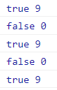 

	可以在每次循环匹配时手动重置`lastIndex`属性来避免

	```js
	for (const item of arr) {
	    reg.lastIndex = 0;
	    console.log(reg.test(item), reg.lastIndex); // true 9 打印5次
	}
	```

	> 在使用一个正则表达式对多个字符串使 `match` `exec` `test`方法匹配时避免使用`g`或者`y`修饰符, 或者手动更正一下`lastIndex`属性

### 和正则相关的字符串方法

`test()`

```
使用这个方法可以用来检查一个字符串是否符合正则表达式的规则, 返回布尔值
```

`split()`

```
可以将一个字符串拆分成一个数组
方法中可以传递一个正则表达式作为参数, 这样方法将会根据正则表达式去拆分字符串
split()方法即使不指定全局匹配, 也会将匹配到的内容全部拆分
```

`search()`

```
可以搜索字符串中是否含有指定内容
如果搜索到指定内容, 则会返回第一次出现的索引, 如果没有搜索到则返回-1
它可以接受一个正则表达式作为参数, 然后会根据正则表达式去检索字符串
serach()方法只会查找第一个, 即使设置了全局匹配也没用
```

`match()`

```
可以根据正则表达式, 从一个字符串中将符合条件的内容提取出来, 返回一个数组
```

```js
const str = '我的网站是: https://www.baidu.com';
const result = str.match(/(\w+)\:\/\/([\w\.\w]+)/);
console.log(result);
console.log(result[0]); // https://www.baidu.com
console.log(result[1]); // https
console.log(result[2]); // www.baidu.com 
```

全局匹配模式下, `match`方法会匹配到所有的内容封装到一个数组中返回, 即使只查询到一个结果

```js
str.match(/\d+/g); //  ['10', '15', '5', '20']
str.match(/\d+/g).join('---') // 10---15---5---20
```

分组情况下

```js
const str = '我的网站是: https://www.baidu.com';
const result = str.match(/(?<协议>\w+)\:\/\/(?<地址>[\w\.]+)/);
console.log(result.groups); // {协议: 'https', 地址: 'www.baidu.com'}
```

`replace()`

```
可以将字符串中指定的内容替换成新的内容
参数：
    1.被替换的内容, 可以接受一个正则表达式作为参数
    2.新的内容, 可以是一个空串这样就会删除匹配到的内容
    3.返回值是一个替换完毕的新字符串
默认只会替换第一个可以加上g修饰符替换全局
```

```js
const str = `@我叫张三@ @你好啊@`;
const newStr = str.replace(/\@/g, '#');
console.log(newStr); // #我叫张三# #你好啊#
```

`replace`方法还可以通过`$n`来引用分组表达式匹配的文本, 非常强大

```js
const str = '你好 这本书叫"三国演义"';
const newStr = str.replace(/"(.*?)"$/sg, '<<$1>>'); // 匹配以"结尾的两个""中间的任意内容
console.log(newStr); // 你好 这本书叫<<三国演义>>
```

引用分组名

```js
const str = '你好 这本书叫"三国演义"';
const newStr = str.replace(/"(?<书名分组>.*?)"$/sg, '<< $<书名分组> >>');
console.log(newStr); // 你好 这本书叫<< 三国演义 >>
```

指定函数处理

```js
const str = '10进制: 15 加上 5 等于 20';
str.replace(/\d+/g, (val, index, text) => {
    // val 匹配到的字符, index 索引位置, text 源文本
});

// 替换数字为十六进制
str.replace(/\d+/g, n => parseInt(n).toString(16)) // a进制: f 加上 5 等于 14
```

> 如果正则表达式里有分组则还会收到一个对象, 属性名是分组名, 属性值是匹配的文本

`exec()`

```
在一个指定字符串中执行一个搜索匹配。
返回一个数组, 其中存放匹配的结果。如果未找到匹配, 则返回值为 null
```

```js
// 准备一个字符串
let str = `<a href='http://www.baidu.com'>百度一下</a>`;
// 提取 url 与 标签文本
const reg = /<a href='(.*)'>(.*)<\/a>/;
// 执行
const result = reg.exec(str);

console.log(result); // 0: 整个字符串  1: "http://www.baidu.com"  2: "百度一下"
console.log(result[1]); // http://www.baidu.com
console.log(result[2]); // 百度一下
```

### 禁止贪婪

正则表达式在进行重复匹配时，默认是**贪婪匹配模式**，也就是说会尽量匹配更多内容，但是有的时候并不希望匹配更多内容，这时可以通过`?`进行修饰来禁止重复匹配

| 使用     | 说明                                |
| -------- | ----------------------------------- |
| `*?`     | 重复任意次, **但尽可能少重复**      |
| `+?`     | 重复1次或更多次, **但尽可能少重复** |
| `??`     | 重复0次或1次, **但尽可能少重复**    |
| `{n,m}?` | 重复n到m次, **但尽可能少重复**      |
| `{n,}?`  | 重复n次以上, **但尽可能少重复**     |

## DOM

**Document Object Model** 文档对象模型, 它把`HTML`文档当做一个对象, 这个对象就是`document`对象, 这个对象主要定义了处理网页内容的方法和接口

- 文档

  文档表示的就是整个的HTML网页文档

- 对象

  对象表示将网页中的每一个部分都转换为了一个对象

- 模型

  使用模型来表示对象之间的关系, 这样方便获取对象

### 节点

```
节点Node, 是构成网页的最基本的组成部分, 网页中的每一个部分都可以称为是一个节点, 是构成HTML文档最基本的单元
```

- 常用节点分为四类
  - 文档节点：整个HTML文档
  - 元素节点：HTML文档中的HTML标签
  - 属性节点：元素的属性
  - 文本节点：HTML标签中的文本内容

#### 文档节点（document）

- 文档节点document, 代表的是整个HTML文档, 网页中的所有节点都是它的子节点

- document对象作为window对象的属性存在的, 不用获取可以直接使用
- 通过该对象可以在整个文档访问内查找节点对象, 并可以通过该对象创建各种节点对象

#### 元素节点（Element）

- HTML中的各种标签都是元素节点, 这也是最常用
  的一个节点

- 浏览器会将页面中所有的标签都转换为一个元素节点, 
  可以通过document的方法来获取元素节点


#### 获取元素节点

```
通过document对象调用
```

`document.title`

```js
// 代表的是页面的标题
document.title = "hello";
```

`document.getElementById()`

```
通过id属性获取一个元素节点对象
```

`document.getElementsByTagName()`

```
通过标签名获取一组元素节点对象, 返回一个类数组对象
getElementsByTagName("*"), 可以获取页面的所有元素
```

`document.getElementsByName()`

```
通过name属性获取一组元素节点对象, 返回一个类数组对象
```

`document.getElementsByClassName()`

```
可以根据元素的class属性值查询到一组元素节点对象
```

`document.querySelector()`

```
需要一个选择器的字符串作为参数, 可以根据一个css选择器来查询一个元素节点对象
总会返回唯一的一个元素, 如果满足条件的元素有多个, 那么它只会返回第一个
```

`document.querySelectorAll()`

```
和querySelector()类似, 不同的是它会将符合条件的全部元素封装到一个数组中返回
```

`document.write()`

```
可以向body中输出一个内容
```

`document.all`

```
代表的是页面中所有的元素
```

`document.documentElement`

```
保存的是html的根标签
```

`document.body`

```
保存的是body的引用
```

`document.elementFromPoint(x,y)`

根据收到的x, y坐标返回一个DOM元素

```js
console.log(document.elementFromPoint(50,200));
```

利用这个方法, 可以实现高度当前鼠标下的元素的功能, 如下: 

```js
// 记录上一次的元素和背景颜色 
let preEl;
let preBackgroundColor;

const onmousemove = debounce((e) => {
  const { pageX, pageY } = e;
  // 根据坐标获取指定的元素
  const el = document.elementFromPoint(pageX, pageY);
  console.log(pageX, pageY, el);
  
  // 记录背景颜色
  if (preEl) {
    preEl.style.backgroundColor = preBackgroundColor;
  }

  if (el) {
    // 记录当前的值
    preBackgroundColor = el.style.backgroundColor;
    preEl = el;
    
    // 修改背景颜色
    el.style.backgroundColor = 'red';
  }
}, 100);

// 鼠标移动事件
document.onmousemove = onmousemove;

// 防抖
function debounce(fn, delay) {
  let timer;
  return (...args) => {
    timer && clearTimeout(timer);
    timer = setTimeout(() => {
      fn.apply(this, args);
    }, delay);
  };
};
```

`document.body.contentEditable`

```js
// 使网页可编辑
document.body.contentEditable = "true"
```

#### 获取元素节点的属性

```
需要读取元素节点的属性可以直接使用  元素.属性名
注意：读取class属性不能采用这种方式, 需要采用 元素.className 
```

`checked`

```
通过多选框的checked属性可以来获取或设置多选框的选中状态
true  选中
false 没选中
```

`nodeValue`

```
访问文本节点的文本内容
```

`setAttribute`

设置元素属性, 注意: 设置的值总是会被字符串化

```js
// 通过 setAttribute 函数设置到该元素上
box.setAttribute('data-test', 'test');

// 这样设置对应的元素还是被禁用, false 会被 字符串化变成 'false'
btn.setAttribute('disabled', false);

// 还直接设置到 DOM 对象上
box['data-test'] = 'test';
```

`getAttribute`

获取元素属性的值

```js
console.log(box.getAttribute('id'));
console.log(box.getAttribute('class'));
console.log(box.getAttribute('data-test'));
```

> `getAttribute`函数获取的值是初始值, 无法获取被动态改变的值(还是初始值), 例如: 文本框的`value`属性

`removeAttribute`

```
删除元素的属性值
```

`hasAttribute()`

```
判断元素是否有指定的属性值
```

`dataset.属性名`

DOM对象中有一个`dataset`属性([自定义数据集](https://developer.mozilla.org/zh-CN/docs/Learn/HTML/Howto/Use_data_attributes)), 该属性引用了HTML元素中的`data-xxx`对应的属性值,

可以通过 `dataset.属性名` 获取, 设置的话直接 `dataset.属性名 = xxx`

```js
box.dataset.time = Date.now();
```

#### 获取元素节点的子节点

```
通过具体的节点调用
```

`childNodes`

```
作为节点的属性使用, 会获取包括文本在内的所有节点
根据DOM标准, 标签间的空白也会当成文本节点
```

`children`

```
获取当前元素的所有子元素(子标签), 以数组的形式返回
```

`firstChild`

```
获取到当前元素的第一个子节点（包括空白文本节点）
```

`firstElementChild`

```
获取当前元素的第一个子元素
```

`lastChild`

```
获取到当前元素的第一个子节点（包括空白文本节点）
```

`lastElementChild`

```
获取当前元素的第一个子元素
```

`contains`

```
返回一个布尔值, 来表示传入的节点是否为该节点的后代节点
语法: node.contains( otherNode )
  - node 是否包含otherNode节点
  - otherNode 是否是node的后代节点
```

#### 获取父节点和兄弟节点

```
通过具体的节点调用
```

`div.parentNode`

```
获取当前节点的父节点
```

`div.previousSibling`

```
前一个兄弟节点(也会获取到空白的文本)
```

`div.previousElementSibling`

```
获取前一个兄弟元素
```

`div.nextSibling`

```
元素节点之后的兄弟节点（包括文本节点、注释节点）
```

`div.nextElementSibling `

```
返回指定元素之后的下一个兄弟元素（相同节点树层中的下一个元素节点）

只返回元素节点之后的兄弟元素节点（不包括文本节点、注释节点）
```

#### 其他属性或方法
```
通过具体的节点调用
```

`innerHTML `

通过这个属性可以获取到**元素内部**的html代码, 对于自结束标签没有意义

`outerHTML`

通过这个属性可以获取到包含**元素自身**的html代码, 对于自结束标签可以获取到自己

`innerText`

该属性可以获取到元素内部的文本内容, 它和**innerHTML**类似, 不同的是它会**自动将html的标签去除**

赋值带有html标签的字符串时, **不会转换**为html元素

**innerText** 可以用来将容器内的元素只包含文本(不会转义特殊字符)

只需要自己赋值给自己就行了

```js
// html
<div id="box1">
    hello div
    <ul>
        <li>-li1-</li>
        <li>-li2-</li>
        <li>-li3-</li>
    </ul>
</div>
    
// js
const box1 = document.getElementById('box1');
box1.innerText = box1.innerText; // 保留换行
                                            /*
                                                hello div
                                                -li1-
                                                -li2-
                                                -li3-
                                            */

// 赋值给 innerHTML 没有空格
box1.innerHTML = box1.innerText; // 没有换行 hello div -li1- -li2- -li3-
```

`tagName` 或 `nodeName`

```
该属性返回元素的标签名(始终是大写的)
```

`cloneNode()`

```
克隆一个节点
参数: true 深克隆, 克隆所有的子节点
	  false 浅克隆, 只克隆自己
	  
语法: box1.cloneNode(true)
```

> cloneNode 方法不会复制 js 相关的属性, 如: 事件处理程序

[`scrollIntoView()`](https://developer.mozilla.org/zh-CN/docs/Web/API/Element/scrollIntoView)

```
可以让指定元素滚动到页面的指定位置
语法: 
	div.scrollIntoView({behavior: 'smooth', block:'center', inline: "nearest"});
```

使用 scrollIntoView 可以实现简单的导航电梯

```js
// html
<ul class="nav">
    <li>1</li>
    <li>2</li>
    <li>3</li>
</ul>

<div class="div"></div>
<div class="div"></div>
<div class="div"></div>

// css
body{
    height: 400vh;
}
.nav{
    position: fixed;
    top: 0;
    right: 30px;
    cursor: pointer;
}
.div{
    width: 100px;
    height: 100px;
    background-color: red;
    margin-bottom: 100vh;
}

// js
const lis = document.querySelectorAll('.nav li');
const divS = document.querySelectorAll('div');
for (let i = 0; i < lis.length; i++) {
    lis[i].addEventListener('click', ()=>{
        divS[i].scrollIntoView({behavior: 'smooth', block:'start', inline: "nearest"});
    });
}
```

`contains()`

```
返回的是一个布尔值，来表示传入的节点是否为该节点的后代节点
语法: 
	node.contains(要判断的节点)
```

[`textContent()`](https://developer.mozilla.org/zh-CN/docs/Web/API/Node/textContent)

返回一个节点及其后代的文本内容(还可以设置文本节点的内容)

> **注意:** `textContent` 和 [`HTMLElement.innerText`](https://developer.mozilla.org/zh-CN/docs/Web/API/HTMLElement/innerText) 容易混淆，但这两个属性在[重要方面有不同之处](https://developer.mozilla.org/zh-CN/docs/Web/API/Node/textContent#%E4%B8%8E_innertext_%E7%9A%84%E5%8C%BA%E5%88%AB) 

[`nodeType`](https://developer.mozilla.org/zh-CN/docs/Web/API/Node/nodeType)

表示节点的类型

| 常量                               | 值   | 描述                                                                                                                                                                                                                          |
| :--------------------------------- | :--- | :---------------------------------------------------------------------------------------------------------------------------------------------------------------------------------------------------------------------------- |
| `Node.ELEMENT_NODE`                | `1`  | 一个 [`元素`](https://developer.mozilla.org/zh-CN/docs/Web/API/Element) 节点，例如 [``](https://developer.mozilla.org/zh-CN/docs/Web/HTML/Element/p) 和 [``](https://developer.mozilla.org/zh-CN/docs/Web/HTML/Element/div)。 |
| `Node.TEXT_NODE`                   | `3`  | [`Element`](https://developer.mozilla.org/zh-CN/docs/Web/API/Element) 或者 [`Attr`](https://developer.mozilla.org/zh-CN/docs/Web/API/Attr) 中实际的 [`文字`](https://developer.mozilla.org/zh-CN/docs/Web/API/Text)           |
| `Node.CDATA_SECTION_NODE`          | `4`  | 一个 [`CDATASection`](https://developer.mozilla.org/zh-CN/docs/Web/API/CDATASection)，例如 `<!CDATA[[ … ]]>`。                                                                                                                |
| `Node.PROCESSING_INSTRUCTION_NODE` | `7`  | 一个用于XML文档的 [`ProcessingInstruction` (en-US)](https://developer.mozilla.org/en-US/docs/Web/API/ProcessingInstruction) ，例如 `<?xml-stylesheet ... ?>` 声明。                                                           |
| `Node.COMMENT_NODE`                | `8`  | 一个 [`Comment`](https://developer.mozilla.org/zh-CN/docs/Web/API/Comment) 节点。                                                                                                                                             |
| `Node.DOCUMENT_NODE`               | `9`  | 一个 [`Document`](https://developer.mozilla.org/zh-CN/docs/Web/API/Document) 节点。                                                                                                                                           |
| `Node.DOCUMENT_TYPE_NODE`          | `10` | 描述文档类型的 [`DocumentType`](https://developer.mozilla.org/zh-CN/docs/Web/API/DocumentType) 节点。例如 `<!DOCTYPE html>` 就是用于 HTML5 的。                                                                               |
| `Node.DOCUMENT_FRAGMENT_NODE`      | `11` | 一个 [`DocumentFragment`](https://developer.mozilla.org/zh-CN/docs/Web/API/DocumentFragment) 节点                                                                                                                             |

`cloneNode()`

返回调用该方法的节点的一个副本(克隆)

接受一个参数, 表示是否采用**深度克隆**,如果为`true`,则该节点的所有后代节点也都会被克隆,如果为`false`,则只克隆该节点本身

```js
const box = document.getElementById("box");
const boxClone = box.cloneNode(true);
```


#### 文本节点  

- 文本节点表示的是HTML标签以外的文本内容, 任意非HTML的文本
  都是文本节点
- 它包括可以字面解释的纯文本内容
- 文本节点一般是作为元素节点的子节点存在的
- 获取文本节点时, 一般先要获取元素节点。在通过元素节点获取文本节点

### script标签中的文本

设置`script`标签的`type="text/x-custom-data"`将会使的这个标签不会解析js代码,

 但还是会被插入到DOM树中, 但是可以在其上面存储任意的文本数据

```js
<script id="scrText" data="我是script标签中保存的数据" type="text/x-custom-data">
    我是script标签内的数据
    可以存任意的文本数据
    console.log('不会打印, 会被当次纯文本');
</script>
<script>
    const scr = document.getElementById('scrText');
    console.log(scr.getAttribute('data')); // 标签属性
    // 以下结果都一样(保留换行格式的文本)
    console.log(scr.text);
    console.log(scr.innerText);
    console.log(scr.textContent);
</script>
```

### 属性节点（Attr）

- 属性节点表示的是标签中的一个一个的属性, 这里要注意的是属性节点并非是元素节点的子节点, 而是元素节点的一部分, 可以通过`attributes`属性获取
- 可以通过元素节点来获取指定的属性节点

### HTML Attributes 和 DOM Properties

**HTML Attributes** 是指定义在 HTML 标签上的属性, 例如: `id="my-input", type="text", value="foo"`, 当浏览器解析完成这些HTML代码时, 会创建一个与之相符的 DOM 元素对象, 然后开发者可以通过 JavaScript 代码来读取这该 DOM 对象

```js
<input id="my-input" type="text" value="foo"></input>

<script>
    const el = document.getElementById('my-input');
</script>
```

这个 DOM 会包含很多属性(properties) , 这些属性就是所谓的[**DOM Properties**](https://developer.mozilla.org/zh-CN/docs/Web/API/Element/attributes); 很多 HTML Attributes 在 DOM 对象上都有与之同名的属性, 例如上面例子: 

```js
const el = document.getElementById('my-input');
console.log(el.attributes); // 该 DOM 元素的属性集合
console.log(el.id); // my-input 对应 HTML Attributes 中的 id="my-input"
console.log(el.type); // text 对应 HTML Attributes 中的 type="text"
console.log(el.value); // foo 对应 HTML Attributes 中的 value="foo"
```

但是 **DOM Properties** 和 **HTML Attributes** 的属性名称不总是一模一样, 比如: **HTML Attributes** 中的`class`属性对应的 DOM 的属性叫: `className`

```js
<input id="my-input" type="text" value="foo" class="my-class-input"></input>

const el = document.getElementById('my-input');

console.log(el.class); // undefined

// 获取 DOM 元素上的 HTML Attributes class 值
console.log(el.className); // my-class-input

// 通过 getAttribute 函数读取 HTML Attributes class 属性的值
console.log(el.getAttribute('class')); // my-class-input
```

还有 **DOM Attributers** 中在 [`textContent`](https://developer.mozilla.org/zh-CN/docs/Web/API/Node/textContent) 可以设置元素的文本内容, 但是并没有与之对应的 **HTML Attributes**

> 一句话总结: **HTML Attributes**的作用是设置与之对应的 **DOM Attributers** 的初始值

### DOM增删改操作

`insertAdjacentHTML()`

```
可以直接把字符串格式元素添加到父元素中
支持追加字符串的子元素

语法:
    元素.insertAdjacentHTML('插入的位置','插入的字符串')

位置属性(要带字符串使用):
    beforebegin 插入到元素自身的前面
    afterbegin  插入到元素内部第一个子节点之前
    beforeend   插入到元素内部最后一个子节点之后
    afterend    插入到元素自身的后面
```

`insertAdjacentText()`

```
只能插入纯文本元素添加到父元素中
```

`document.createElement()`

```
可以用于创建一个元素节点对象, 它需要一个字符串标签名作为参数, 
	并将创建好的元素节点对象作为返回值返回
```

`document.createTextNode()`

```
可以创建一个文本对象节点, 需要一个文本内容作为参数,
	将会根据文本内容创建文本节点, 并将新的节点返回
```

`appendChild()`

```
向一个父节点中添加一个新的子节点
不支持追加字符串的子元素
语法：
    父节点.appendChild(子节点);
```

`append()`

在父节点的**最后一个子节点之后**插入一个或一组节点

> 和`appendChild`的区别就是可以插入多个节点, 接受字符串作为参数

`prepend()`

在父节点的**第一个子节点之前**插入节点, 可接受字符串

`insertBefore()`

```
可以在指定的子节点前插入一个新的子节点
注意: 如果节点在页面中存在则会移动该节点

语法：
    父节点.insertBefore(要插入的节点, 参照节点);
   	// 参照节点为 null 效果和 appendChild 一样 
```

`replaceChild()`

```
可以使用指定的子节点替换已有的子节点
语法：
    父节点.replaceChild(新节点, 旧节点);
```

```js
div.parentNode.replaceChild(div, newDiv);
```

`remove()`

```
删除指定的DOM元素
参数:需要删除的元素
```

`removeChild()`

```
可以删除一个子节点
语法：父节点.removeChild(子节点);
```

#### DOM操作css样式

修改css样式

```
通过js修改元素的样式
    语法：元素.style.样式名 = 样式值
如果css的样式名中含有-, 需要将这种样式名修改为驼峰命名法
通过style属性设置的样式都是内联样式
```

`cssText`

该属性用于设置或者返回元素声明的内联(`style`)样式(同时修改多个属性)

```css
div.style.cssText = "width:100px; height:100px; background-color:red;";
```

需要注意的是直接使用`div.style.cssText = ...`赋值会覆盖掉之前的内联(`style`)样式, 可以直接使用拼接的方式:

```js
// 注意: 别漏了前面的 ; 号
div.style.cssText +="; color:blue;";
```

`classList`

```
返回元素的类名, 作为 DOMTokenList 对象
该属性用于在元素中添加, 移除及切换 CSS 类
classList 属性是只读的, 但你可以使用 add() 和 remove() 方法修改它

    length 属性返回类列表中类的数量
    add(class1, class2, ...) 在元素中添加一个或多个类名, 如果指定的类名已存在, 则不会添加
    contains(class) 返回布尔值, 判断指定的类名是否存在
    item(index) 返回元素中索引值对应的类名
    remove(class1, class2, ...) 移除元素中一个或多个类名, 移除不存在的类名, 不会报错
    toggle(class, true|false) 在元素中切换类名
```

`getComputedStyle`

返回一个对象，该对象保存(**只读**)着计算好的元素的CSS属性和值, 有些属性还会返回`auto`

```js
window.getComputedStyle(box);
```

#### 其他的属性

`disabled`

**disabled** 属性可设置或返回元素是否禁用, 可用于页面主题切换

`clientWidth` 和 `clientHeight`

```
这两个属性可以获取元素的可见宽度和高度
这些属性都是不带px的,返回的一个数字,可以直接进行计算
会获取元素的高度,包括内容区和内边距,不包括边框
这些属性都是只读的,不能修改
```

`offsetWidth` 和 `offsetHeight`

```
获取元素的整个宽度和高度, 包括内容区 内边距和边框
```

`offsetParent`

```
可以获取当前元素的定位祖先元素
会获取离当前元素最近的开启了定位的祖先元素
    如果所有的祖先都没有开启定位, 则返回body
```

`offsetLeft` 和 `offsetTop`

```
当前元素相对于其定位祖先元素的水平偏移量和垂直偏移量
```

`scrollWidth` 和 `scrollHeight`

```
可以获取元素整个滚动区域的宽度和高度
```

`scrollLeft ` 和 `scrollTop`

```
获取水平和垂直滚动条滚动的距离

当满足 scrollHeight - scrollTop == clientHeight
说明垂直滚动条滚到底了

当满足 scrollWidth - scrollLeft == clientWidth
说明水平滚动条滚到底了
```

`requestFullscreen()`


用于发出异步请求使元素进入全屏模式
> 这个方法只能在用户交互或者设备方向改变的时候调用，否则将会失败

`getClientRects()`

```js
可以获取DOM在文档中的位置信息和本身的信息, 包括如下信息:
    x,y,width,height,top,bottom,left,right
语法: 
	element.getClientRects();
```

```js
const box1 = document.getElementById('box1');
console.log(box1.getClientRects()[0]);
```

`getBoundingClientRect()`

效果和 `getClientRects()[0]` 的结果是一样的

```js
const box1 = document.getElementById('box1');
box1.getBoundingClientRect();
```

`document.visibilityState`

可以判断当前页面是否被隐藏`hidden`, 会返回(`hidden`/`visible`)其中之一的字符串

## 事件

事件, 就是文档或浏览器窗口中发生的一些特定的交互瞬间
JavaScript 与 HTML 之间的交互是通过事件实现的

### 事件对象

当事件的响应函数被触发时, 浏览器每次都会将一个事件作为参数传递进响应函数,

在事件对象中封装了当前事件的一切信息, 可以传递一个形参接受这个对象

`target`属性

事件对象的**target**表示的是触发事件的对象, **事件源对象**


`currentTarget`属性

事件对象的**currentTarget**表示的是事件定义时所在的对象, **绑定事件的对象**


`type`属性

表示事件的类型


`timeStamp`属性

表示事件发生的时间戳, 可以用来计算两个事件的事件差


`isTrusted`属性

如果事件是浏览器自身触发时为`true`, **js** [派发事件](https://developer.mozilla.org/zh-CN/docs/Web/API/EventTarget/dispatchEvent)为`false` 


`event.preventDefault()`

取消默认行为


`event.stopPropagation()`

取消冒泡


`event.stopImmediatePropagation()`

取消同一事件的其他事件监听器被调用

### 事件句柄

原生写法需在事件句柄前加上`on`(**全部小写**)

```js
a.onclick = function(event){
    return false;
}
```

> 取消默认行为 `return false`

而使用 `addEventListener` 方法绑定的事件 **不加 on** 

```js
a.addEventListener('click', function(event){
    event.preventDefault(); // 取消默认行为
    event.stopPropagation(); // 取消冒泡
});
```

|       事件名称       | 描述                                                                                       | 常用的地方 |
| :------------------: | ------------------------------------------------------------------------------------------ | ---------- |
|      mousemove       | 鼠标在元素中移动时触发                                                                     |            |
|     contextmenu      | 鼠标右键点击的事件                                                                         |            |
|        click         | 鼠标左键点击                                                                               | *          |
|       dblclick       | 鼠标左键双击                                                                               |            |
|        abort         | 图像的加载被中断                                                                           |            |
|        change        | 内容被改变时                                                                               | 多选框     |
|        input         | 文本框内容发生变化之后                                                                     | 文本框     |
|       keypress       | 文本框内容发生变化之前, 调用 `e.preventDefault()`可以阻止输入                              | 文本框     |
|      textInput       | 可编辑表单的值**增加**时触发,                                                              |            |
|                      | **e.data** 表示增加的值,                                                                   |            |
|        click         | 当用户点击某个对象时触发                                                                   | *          |
|       dblclick       | 当用户双击某个对象时调用的事件句柄                                                         |            |
|        error         | 错误事件, 加载资源错误等                                                                   |            |
|        focus         | 元素获得焦点                                                                               | 文本框     |
|         blur         | 元素失去焦点                                                                               | 文本框     |
|                      | **document.hasFocus(DOM)**, 判断DOM对象是否获得焦点                                        |            |
|                      | **document.activeElement**, 实时获取获得焦点的DOM对象                                      |            |
|       keydown        | 某个键盘按键被按下                                                                         |            |
|       keypress       | 某个键盘按键被按下并松开                                                                   |            |
|        keyup         | 某个键盘按键被松开                                                                         |            |
|         load         | 文档或其他资源完成加载                                                                     | *          |
|        error         | 页面报错或图像加载失败时                                                                   |            |
|      mousedown       | 鼠标按钮被按下                                                                             |            |
|       mouseup        | 鼠标按键被松开                                                                             |            |
|      mousemove       | 鼠标被移动                                                                                 |            |
|       mouseout       | 鼠标从某元素移开                                                                           |            |
|      mouseover       | 鼠标移到某元素之上                                                                         |            |
|      mouseenter      | 鼠标指针穿过（进入）被选元素时                                                             |            |
|     onmouseleave     | 事件在鼠标移出元素时触发                                                                   |            |
|     onmouseenter     | 事件在鼠标指针移动到元素上时触发                                                           |            |
|        reset         | 重置按钮被点击                                                                             |            |
|        resize        | 窗口被重新调整大小                                                                         | *          |
|        select        | 文本被选中                                                                                 |            |
|        submit        | **type = "submit"** 的按钮被点击                                                           | 提交表单   |
|        unload        | 页面卸载(一般是一个页面切换到另一个页面触发)                                               |            |
|        scroll        | 页面滚动条滚动时触发                                                                       |            |
|        wheel         | 鼠标滚轮滚动时触发                                                                         |            |
|     contextmenu      | 事件在元素中用户右击鼠标时触发并打开上下文菜单                                             |            |
|                      | 配合 **e.preventDefault()** 可以自定义菜单项                                               |            |
| pointer-events: none | 指针事件不做出反应                                                                         |            |
|        online        | 浏览器能够访问网络, 并且`navigator.online`的值为`true` `online`事件会触发                  |            |
|       offline        | 浏览器失去网络连接时, 并且`navigator.onLine`的值为 `false` `offline`事件会触发             |            |
|      hashchange      | 监听地址栏的 hash                                                                          |            |
|       popstate       | 监听网页的改变, 如前进, 后退                                                               |            |
|     beforeunload     | 页面卸载之前                                                                               | *          |
|   visibilitychange   | 页面隐藏时触发(切换标签页)                                                                 |            |
|   DOMContentLoaded   | 当初始的 **HTML** 文档被完全加载和解析完成之后触发，无需等待样式表、图像和子框架的完全加载 |            |
|   readystatechange   | document.readyState的属性会变化, 有 loading, interactive, complete等, complete表示载入完成 |            |

> 更多事件句柄见[W3C](https://www.w3school.com.cn/jsref/dom_obj_event.asp)

```js
window.onbeforeunload = e => {
    e = window.event || e;
    e.returnValue = ("确定离开当前页面吗？");
} 
```


```js
在拖动目标上触发事件 (源元素要先设置dragstart = 'true'):
    drag     元素正在拖动时触发
    dragstart  用户开始拖动元素时触发
    dragend    用户完成元素拖动后触发
    dragover  元素拖动结束

释放目标时触发的事件:
    dragenter - 当被鼠标拖动的对象进入其容器范围内时触发此事件
    dragover - 当被拖动的对象在另一对象容器范围内拖动时触发此事件(需先取消默认行为e.preventDefault())
    dragleave - 当被鼠标拖动的对象离开其容器范围内时触发此事件
    drop - 在一个拖动过程中, 释放鼠标键时触发此事件(需先取消默认行为 e.preventDefault())
    
注意： 在拖动元素时, 每隔 350 毫秒会触发 drag 事件
        拖拽的默认行为 e.preventDefault();

拖拽的数据交换
    数据交换的对象就是事件对象的属性 event.dataTransfer 
    dataTransfer 的两个核心方法是 setData() 和 getData() 
    setData() 用于设置数据, getData() 用语接收数据
```

### 事件的冒泡

```js
所谓的冒泡指的就是事件的向上传导, 当后代元素上的事件被触发时, 其祖先元素相同的事件也会被触发
大部分情况冒泡都是有用的, 如果不需要发生事件的冒泡可以通过事件对象来取消冒泡, 如下: 

event.cancelBubble = true; // 将事件的冒泡设置为不冒泡
event.stopPropagation(); // 将事件的冒泡设置为不冒泡
```

### 事件的委派

```
指将事件统一绑定给元素共同的祖先元素, 这样后代元素上的事件触发时(包括后添加的), 会一直冒泡到祖先元素, 
	而通过祖先元素的响应函数来处理事件
事件委派是利用了冒泡, 通过冒泡可以减少事件绑定的次数, 提高程序的性能
```

### 事件的绑定

对象.事件 = 函数

```
使用 对象.事件 = 函数  的形式绑定响应函数
它只能同时为一个元素的一个事件绑定一个响应函数
```

[`addEventListener()`](https://developer.mozilla.org/zh-CN/docs/Web/API/EventTarget/addEventListener)

```
可以为元素绑定响应函数
 参数:
        1.事件的字符串名称
        2.回调函数, 当事件被触发时该函数会被调用
        3.是否在捕获阶段触发事件, 默认为false, 还可以为一个对象
```

```js
window.addEventListener('click', () => {
    console.log('widnow click event');
}, { once: true }); // 只执行一次
```

### 事件的解绑

用什么方式绑定事件,就应该用对应的方式解绑事件

通过`addEventListener()`添加的事件处理程序只能使用`removeEventListener()`来移除, 

移除时传入的参数与添加处理程序时使用的参数必须相同,

这也意味着通过`addEventListener()`添加的匿名函数无法移除

1. 解绑事件

   ```
   对象.on事件名字 = 事件处理函数  --->  绑定事件
   对象.on事件名字 = null;
   ```

2. 解绑事件

   ```
   对象.addEventListener("没有on的事件类型",命名函数,false);---绑定事件
   对象.removeEventListener("没有on的事件类型",函数名字,false);
   ```

### 事件的传播

事件传播分成三个阶段: 

1. 捕获阶段

    ```
    在捕获阶段时从最外层的祖先元素, 向目标元素进行事件的捕获, 但是默认此时不会触发事件
    ```

2. 目标阶段

    ```
    事件捕获到的目标元素, 捕获结束, 开始在目标元素上触发事件
    ```

3. 冒泡阶段

    ```
    事件从目标元素向它的祖先元素传递, 依次触发祖先元素上的事件
    ```

使用 **document.createEvent()** 可以模拟事件, 详细见 [MDN](https://developer.mozilla.org/zh-CN/docs/Web/API/Document/createEvent)

> 有一些特殊的事件, 如`Windows`的`load`, `Worker`对象的`message`等都是不需要传播的

### 派发事件

`windows`和`DOM`对象上都有`dispatchEvent`方法可以派发[自定义事](https://developer.mozilla.org/zh-CN/docs/Web/API/CustomEvent)件

```js
window.onclick = () => {
    console.log('我要派发事件了');
    // 派发事件
    window.dispatchEvent(new CustomEvent("test", { detail: '我是test事件派发的参数' }));
};

// 绑定是一个自定义事件
window.addEventListener('test', (e) => {
    console.log('我是自定义事件 test', e.detail);
});
```


### 文档的加载

```
浏览器在加载页面一个页面时, 是按照自上向下的顺序加载的, 读取到一行就运行一行, 
如果将script标签写到页面的上边, 在代码执行时, 页面没有加载DOM对象也没有加载, 
会导致无法获取到DOM对象
```

- 可以将js代码编写到页面的下部就可以在页面加载完毕以后再执行js代码

- **onload**事件会在整个页面加载完毕以后才触发

  为`window`绑定一个**onload**事件该事件对应的响应函数将会在页面加载完毕之后执行
  这样可以确保代码执行时所有的DOM对象已经加载完毕

#### 脚本运行时机: async 与 defer

浏览器再遇到**script**标签时会默认运行对应的脚本, 这有可能会严重拖慢(**文件很大或引入script标签)**网页解析和渲染过程, 

好在可以通过**script**标签的`defer`和`async`属性指定浏览器对脚本的不同执行方式, 

这两个属性是布尔值属性, 只对使用了`src`属性的**script**标签生效

```js
<script defer src="./defer.js"></script>
<script async src="./async.js"></script>
```

##### 执行顺序

`defer`属性会让浏览器把脚本推迟到文档完全加载和解析之后在执行,

`async`属性则会让浏览器**尽早**的运行脚本, 但在脚本运行下载解析过程**不会阻塞文档解析**

如果**script**同时存在这两个属性, 则`async`生效

推迟(`defer`)的脚本会按照它们在文档出现的顺序执行, 而异步(`async`)脚本会在它们加载完成后运行, 所以它们的顺序无法预测

带有`type="module"`属性的脚本默认会在脚本加载完成后执行, 相当于加上了`defer`属性, 可以使用`async`属性覆盖这个默认行为

> 使用了`defer`和`async`属性的脚本就尽量不要使用`document.write()`方法了

## BOM

**Browser Object Mode**l 浏览器对象模型, 它指的是把浏览器当做一个对象来对待, 这个对象主要定义了与浏览器交互的方法和接口, **BOM**的核心是`window`, 而`window`对象具有双重角色, 它即是通过JS访问浏览器窗口的一个接口, 有时一个 `Global`对象, 网页中定义的任何对象, 变量和函数, 都是作为`window`对象的一个属性或者方法存在

### BOM对象的分类

`Window`

```
代表整个浏览器的窗口,同时window也是网页中的全局对象
	在全局作用域里的变量会作为window的属性保存
	在全局作用域里的函数会作为window的方法保存
```

`Window.innerWidth` 和 `Window.innerHeight`

```js
表示浏览器窗体的像素宽度和高度
```

`window.getSelection().toString()`

获得用户选中的详细信息

`Navigator`

```
通过该对象可以获取当前浏览器的信息
```

`navigator.userAgent`

```js
该属性可以获取浏览器身份字符串(也可以被修改)
```

`Location`

```
代表浏览器的地址栏信息
```

- `hash`

    ```
    设置或返回锚点
    ```

- `href`

    ```
    将location.href属性修改为一个完整的路径, 或相对路径
        页面会自动跳转到该路径, 并且会生成相应历史记录
    ```

- `assign()`

    ```
    用来跳转到其他的页面,作用和直接修改location一样
    ```

- `reload()`

    ```
    用于重新加载当前页面,作用和刷新按钮一样
    如果在方法中传递一个true,作为参数,则会强制清空缓存刷新页面
     (火狐中的刷新不是清空缓存刷新可以指定清空缓存刷新)
    ```

- `replace()`

    ```
    可以使用一个新的页面替换当前页面, 调用完毕也会跳转页面
       不会生成历史记录, 不能使用回退按钮
    ```

`URLSearchParams` 对象

可以解析和检查URL查询字符串, 提供 **has**, **get**, **delete** 方法

```js
const str = new URLSearchParams('?a=100&b=true&c=[1,2,3]');

console.log(str.toString()); // ?a=100&b=false&c=[1,2,3]

console.log(str.has('a')); // true
console.log(str.get('a')); // 100
str.delete('a'); // 删除 a
console.log(str.has('a')); // false

console.log(str.get('c')); // [1,2,3] 字符串
const arr = eval(str.get('c')); // 通过 eval 可以转换为数组
console.log(arr); // (3) [1, 2, 3]

// 支持 forof 迭代
for (const val of str) {
    console.log(val);
    /* 
        (2) ['a', '100']
        (2) ['b', 'true']
        (2) ['c', '[1,2,3]']
    */
}
```

`History`

```
代表浏览器的历史记录,可以通过History来操作浏览器的历史记录
 由于隐私原因,该对象不能获取到具体的历史记录,只能操作浏览器向前或向后翻页
  而且该操作只在当次访问时有效
```

- `length`

  ```
  可以获取到当次访问的链接数量
  ```

- `bakc()`

  ```
  可以用来回退到上一个页面, 作用和浏览器的回退按钮一样
  ```

- `forward()`

  ```
  可以跳转到下一个页面, 作用和浏览器的前进按钮一样
  ```

- `go()`

  ```
  可以用来调整指定的页面
   它需要一个整数作为参数
   	正数表示向前跳转几个页面
   	负数表示向后跳转几个页面
  ```
  
- `pushState()`

  ```
  pushState(state, title[, url])
  向当前浏览器会话的历史堆栈中添加一个状态(历史记录)
  ```

- `replaceState()`

  ```
  replaceState(stateObj, title[, url])
  替换掉当前历史记录实体
  ```

- `Screen`

  ```
  代表用户屏幕的信息, 通过Screen可以获取到用户显示器的相关信息
  ```

  > 这些`BOM`对象在浏览器中都是作为`window`对象的属性保存的

#### 一些常用的方法

`console.log()`

```
向控制台输出指定内容
```

还可以输出的时候指定样式

```js
console.log("%chello%cworld", "color: red;", "color: green");
console.log("%chello%cworld", "background: red","font-size: 28px");
```

`console.dir()`

```
向控制台输出一个对象所有的属性和方法, 当在node环境下, 一个对象或数组中有太多数据就会被默认隐藏掉一些, 可以指定第二个参数为: { depth: 10 } 输出10层的信息
```

`console.error()`

```
向控制台输出一个红色的错误字符串
```

`console.warn()`

```
向控制台输出一个警告标识的字符串
```

`console.clear()`

```
清空控制台
```

`console.trace(msg: string)`

```
打印调用栈信息, 这个堆栈跟踪会显示从当前执行函数开始，一直到全局作用域的函数调用序列，包括文件名、行号和列号等详细信息，有助于开发者理解函数被调用的上下文和流程
```

`console.count(xxx)`

`console.countReset(xxx)`

```
接受字符串统计输出次数
```

```js
console.count(123); // 123: 1
console.count(123); // 123: 2
console.count(123); // 123: 3
console.countReset(123);
console.count(123); // 123: 1
```

`console.group(xxx)`

`console.groupCollapsed(xxx)`

`console.groupEnd()`

```
控制台输出分组, 参数就是分组名
```

```js
console.group('分组1');
console.log(1);
console.log(1);
console.groupEnd();
console.group('分组2');
console.log(2);
console.log(2);
console.groupEnd();

console.groupCollapsed("默认折叠分组1");
console.log(1);
console.log(1);
console.groupEnd();
```

`console.time()`

`console.timeEnd()`

```
统计代码执行时间
```

```js
console.time('time');
for (let i = 0; i < 50000; i++) { };
console.timeEnd('time'); // time: 1.621826171875 ms
```

`alert()`

```
控制浏览器弹出一个警告框
```

`confirm()`

```
用于弹出一个带有确认和取消按钮的提示框
需要一个字符串作为参数, 该字符串将会作为提示文字显示出来
如果点击确认则会返回true, 如果点击取消则返回false
```

`prompt()`

```
弹出一个提示框, 该提示框中会有一个文本框, 用户可以在文本框中输入一段内容, 
用户输入的内容将会作为函数的返回值返回
```

`setInterval()`

```
定时调用(异步宏任务)
可以将一个函数, 每隔一段时间执行一次

- 参数:
    1.回调函数,该函数会在每隔一段时间被调用一次
    2.每次调用的间隔时间,单位是毫秒

返回一个Number类型的数据, 这个数字用来表示该定时器的唯一标识
```

```js
let i = 1;
setInterval(() => {
    console.log(i++); // 一秒一次递增输出i
}, 1000);

// 定时器第三个以后的参数会作为第一个参数函数调用的参数
setInterval(console.log, 1000, 1, 'hello', {}, []); // 一秒输出一次 1 'hello' {} []

// 这样使用需要注意传递的参数是不变的所以下面只会输出1, 无法递增
let n = 1;
setInterval(console.log, 1000, n++); // 每次给的参数都是n++, 也就是1
```

`clearInterval()`

```
可以用来关闭一个定时器
方法中需要一个定时器的标识作为参数, 这样将关闭标识对应的定时器
如果参数不是一个有效的标识, 则什么也不做
```

`setTimeout()`

```
延时调用(异步宏任务)
可以将一个函数, 一段时间以后再执行, 而且只会执行一次

参数:
    1.回调函数,该函数只会执行一次
    2.调用的时间,单位是毫秒

返回一个Number类型的数据, 这个数字用来表示该定时器的唯一标识

延时调用和定时调用的区别,定时调用会执行多次,而延时调用只会执行一次
clearTimeout()来停止延时调用和clearInterval()类似用法
```

```js
// 一秒后alert hello
setTimeout(() => {
    console.log('hello');
}, 1000);

// 同样可以直接给第一个函数传参
setTimeout(console.log, 1000, 1, 'hello', {}, []);
```

`window.devicePixelRatio`

```js
获取设备的像素比
```


## JSON

```
全称 JavaScript Object Notation JS对象表示法

JS中的对象只有JS自己认识, 其他的语言都不认识
JSON就是一个特殊格式的字符串, 这个字符串可以被任意的语言识别
    并且可以转换为任意语言中的对象, JSON在开发中主要用来数据的交互

JSON和JS对象的格式一样,只不过JSON字符串中的属性名必须加双引号, 和JS的语法一致
 
JSON分类:
    1.对象{}
    2.数组[]
```

- JSON中允许的值:
  - 字符串
  - 数值
  - 布尔值
  - null
  - 对象(普通对象, 不包括函数)
  - 数组

  > `undefined `数据类型会自动被  JSON 忽略
  

[`JSON.parse()`](https://developer.mozilla.org/zh-CN/docs/Web/JavaScript/Reference/Global_Objects/JSON/parse)

可以将JSON字符串转换为JS对象
它需要一个JSON字符串作为参数, 会将该字符串转换为JS对象并返回

第二个参数可以是一个函数(会收到`key`和`value`可以对指定属性进行操作)

```js
const obj = {
    name: '张三',
    date: new Date(2021, 12, 12)
};
const j = JSON.stringify(obj); // {"name":"张三","date":"2022-01-11T16:00:00.000Z"}

// 时间对象转换为时间戳格式
const newJ = JSON.parse(j, (k, v) => k === 'date' ? new Date(v).getTime() : v);
// ==> {name: '张三', date: 1641916800000}
```

[`JSON.stringify()`](https://developer.mozilla.org/zh-CN/docs/Web/JavaScript/Reference/Global_Objects/JSON/stringify)

可以将一个JS对选哪个转换(序列化)为JSON字符串
需要一个JS对象作为参数, 会返回一个JSON字符串

第二个参数可以是数组 函数 `null` , 表示过滤器

第三个参数是插入的换行符

```js
const obj = {
    name: '张三',
    age: 18,
    gender: '男',
    test: 'test'
};

JSON.stringify(obj,['age','name','gender'],'---'); // 长度限制最多10个字符串来作为换行符
/*
    {
    ---"age": 18,
    ---"name": "张三",
    ---"gender": "男"
    }
*/

// 可以指定需要转换的字段
JSON.stringify(obj,['age','name','gender'],4);
/*
{
    "age": 18,
    "name": "张三",
    "gender": "男"
}
*/

// 如果第二个参数为 null 或者未提供，则对象所有的属性都会被序列化
JSON.stringify(obj, '*', 4);
JSON.stringify(obj, null, 4);
JSON.stringify(obj, undefined, 4);
/*
{
    "name": "张三",
    "age": 18,
    "gender": "男",
    "test": "test"
}
*/
```

> 如果被序列化的对象存在`toJSON`方法, 则会覆盖该对象的默认序列化行为, 不是该对象被序列化，而是调用 `toJSON` 方法后的返回值会被序列化

## 本地存储

```
数据存储在用户浏览器中, 设置 读取 设置页面刷新都不丢失数据
容量较大, 能够存储约5M
只能存储字符串, 可以将对象JSON.stringify()编码后存储
```

### window.sessionStorage

```
1. 生命周期为关闭浏览器窗口
2. 在同一个窗口(页面)下数据可以共享
3. 以键值对的形式存储使用的
```

存储数据:

```
sessionStorage.setltem('key', value)
参数: 'key' 表示名字(随便起字符串形式) value 表示要存储的数据
在 F12 -> Application -> Session Storage 里面可以查看数据的存储
```

获取数据:

```js
sessionStorage.getltem('key');
```

删除数据:

```js
sessionStorage.removeItem('key');
```

删除`sessionStorage`的所有数据:

```js
sessionStorage.clear();
```

### window.localStorage

    1. 生命周期永久生效, 除非手动删除否则关闭页面数据也不会丢失
    2. 可以多窗口(页面)共享数据(同一浏览器)
    3. 也是以键值对的形式存储使用

存储数据:

```
localStorage.setItem('key', value)
参数: 'key' 表示名字(随便起字符串形式) value 表示要存储的数据
在 F12 -> Application -> Local Storage 里面可以查看数据的存储
```

获取数据:

```
localStorage.getItem('key')
```

删除数据:

```
localStorage.removeItem('key')
```

删除`localStorage`的所有数据:

```
localStorage.clear();
```

> `sessionStorage`和`localStorage`虽然是对象但是它们**只能存储字符串**, 如果需要存储对象, 需要自行转换为JSON来存储

### storage 事件

`sessionStorage`和`localStorage`存储的数据变动时触发

触发`storage`事件的条件

- 同一浏览器打开了**两个**同源页面
- 其中一个页面修改了 `sessionStorage` 或 `localStorage`
- 另一个网页注册了这个事件

```js
window.addEventListener('storage', e => {
    console.log(e.key + ' 键已经从 ' + e.oldValue + ' 改变为 ' + e.newValue);
})
```

### document.cookie

[`document.cookie`](https://developer.mozilla.org/zh-CN/docs/Web/API/Document/cookie)获取或设置当前网站的 `cookie`, 设置新的`cookie`格式是一个键值对形式的字符串

需要注意的是，用这个方法一次只能对一个`cookie`进行设置或更新, 请求头里的`cookie`的格式如下: 

```sh
# 请求头字段名为 set-cookie 值以 key=value; 注意每一个键值对后面都有一个;
set-cookie: name=value; Path=/; Expires=UTC Date; Domain=.domain.com
```

`cookie`生命周期只在会话期间存在(可以手动指定过期时间), 会随着客户端的网络请求自动发送给服务器端,

一个`cookie`的大小大约是 **4kb** 只能用来存储少量的数据

```js
// 30天后的过期时间
const date = new Date(Date.now() + 30 * 24 * 60 * 60 * 1000).toUTCString();
// expires 设置有效期, 值是一个日期对象字符串
document.cookie = `我是key=我是value;Expires=${date}`;
```

以下可选的cookie属性值可以跟在键值对后，用来具体化对cookie的设定/更新，使用分号以作分隔：

- `Path`: 表示这个`cookie`影响到的路径, 匹配这个路径或是其子路径下会自动携带`cookie`, 如果没有定义，默认为当前文档位置的路径(`/`)
- `Domain`: 如果没有定义，默认为当前文档位置的路径的域名部分。与早期规范相反的是，在域名前面加 . 符将会被忽视，因为浏览器也许会拒绝设置这样的cookie。如果指定了一个域，那么子域也包含在内。
- `Expires`: 指定`cookie`的过期时间,  如果没有定义，`cookie`会在对话结束时过期, 这个值的格式为[Date.toUTCString()](https://developer.mozilla.org/zh-CN/docs/Web/JavaScript/Reference/Global_Objects/Date/toUTCString) 
- `Max-Age`: 指定`cookie`的经过多久时间过期
- `Secure`: 设置为`true`时, `cookie`只通过`https`协议传输
- `HttpOnly`: 设置`cookie`是否可以通过`document.cookie`去修改(请求过程依旧可以携带)

`cookie`的值字符串可以用[encodeURIComponent()](https://developer.mozilla.org/zh-CN/docs/Web/JavaScript/Reference/Global_Objects/encodeURIComponent)方法来保证它不包含任何逗号、分号、中文或空格(cookie值中禁止使用这些值)

### IndexedDB

[**IndexedDB**](https://developer.mozilla.org/zh-CN/docs/Web/API/IndexedDB_API)是一个对象数据库, 不是关系型数据库, 与`localStoreage`类似, **IndexedDB**的作用域限定为包括文档的来源, 同源的网页

可以互相访问对方的数据库, 但不同源的网页无法相互访问

## with语句

[`with语句`](https://developer.mozilla.org/zh-CN/docs/Web/JavaScript/Reference/Statements/with)可以扩展一个代码块的作用域链

```js
const obj = {
    name: '张三',
    age: 18
};

// 将obj对象添加到下面的代码块的作用域中,当访问属性会首先去obj对象上查找属性
with(obj){
    console.log(name); // 等价于 obj.name
    console.log(age); // 等价于 obj.age
}
```

> 不建议使用`with语句`, 在严格模式中使用会报错, 推荐的替代方案是声明临时变量来保存需要的属性

## eval函数

`eval()` 函数会将传入的字符串当做 JavaScript 代码进行执行

```js
eval(`alert('hello eval')`); // alert 一个 hello eval
```

作用域是在当前`eval`函数执行的地方, 在`eval`函数内可以修改当前作用域的变量

```js
// 不同的作用域
const x = 1, y = 2;
eval('alert(x+y)'); // => 3

(()=>{
    const x = 11, y = 22;
    eval('alert(x+y)'); // => 33
})();


// 会修改当前作用域的变量
(()=>{
    let x = 11;
    eval('x = 999'); 
    console.log(x); // => 999
})();
```

> `eval()`函数的功能很强大也很危险, 因为可以直接执行js代码, 性能比其他替代方法更慢, 因为它必须调用 JS 解释器, 最好不要使用这个函数, 

## Worker对象

众所周知js是单线程的, 但是在浏览器端可以通过[`Worker`](https://developer.mozilla.org/zh-CN/docs/Web/API/Worker)类来创建一个与主线程和事件循环同时运行的工作线程, 

工作线程(`Worker`)运行于独立的运行环境, 有着完全独立的全局对象, **不能访问**`window`或`document`对象, 

`Worker`只能通过异步消息机制通信, 这意味着不能**并发的修改DOM**, 写长时间运行的代码而**不会阻塞主线程, 卡死浏览器**

工作线程(`Worker`)适合一些计算密集型任务, 比如图像处理, 为了执行简单的操作而创建工作线程是完全没必要的

`Worker`API分为两个部分, 一部分是`Worker`, 另一部分是[`WorkerGlobalScope`](https://developer.mozilla.org/zh-CN/docs/Web/API/WorkerGlobalScope), 前者是线程的外在部分, 后者是内在部分

```js
// 主线程
// 创建一个工作者线程
const worker = new Worker('./count.js',{
    name: '我是工作者线程', // 名字
    type: 'module' // 会当成es6模块, 工作者线程就不能使用 this 了
});
// 向工作者线程发送数据
worker.postMessage({ text: '我是主线程发送到工作者线程的数据' });

// 监听工作者线程 message 事件(数据通信)
worker.onmessage = e => {
    // 这里收到工作者线程的数据
    console.log(e.data);
}
// 监听工作者线程 error 事件(捕获错误)
worker.onerror = e =>{
    e.preventDefault(); // 阻止默认行为(不会控制台打印错误)
    console.log(e.message);
}


// 工作者线程
// 执行大量计算任务代码 ...
self.onmessage = function (e) {
    console.log(e.data); // 这里收到主线程发送的数据
    
    //  这里发送数据给主线程
    self.postMessage({ text: '我是工作者线程返回给主线程的数据' });
}
```

在 Worker 线程中，`self` 和 `this` 都代表子线程的全局对象。对于监听 `message` 事件，以下的四种写法是等同的

```js
// 写法 1
self.addEventListener('message', function (e) {
    // ...
})

// 写法 2
this.addEventListener('message', function (e) {
    // ...
})

// 写法 3
addEventListener('message', function (e) {
    // ...
})

// 写法 4
onmessage = function (e) {
    // ...
}
```

**停止线程**

```js
// 主线程
worker.terminate();

// Dedicated Worker 线程中(工作者线程)
self.close();

// Shared Worker 线程中(共享者线程)
self.port.close();
```

> 更多有关 Worker 见[掘金文章](https://juejin.cn/post/6844903736238669837#comment)

## 跨上下文信息

可以在不同执行上下文件传递信息, 包括和 [`iframe`](https://developer.mozilla.org/zh-CN/docs/Web/HTML/Element/iframe)通信, 主要使用: [`window.postMessage()`](https://developer.mozilla.org/zh-CN/docs/Web/API/Window/postMessage) 和 `message` 事件

## URL

[URL](https://developer.mozilla.org/zh-CN/docs/Web/API/URL)是一个构造函数, 可以实例化url类来处理url相关操作

```js
const url = new URL('http://127.0.0.1:5000/');
// 可以指定 params 参数
url.searchParams.set('name', '张三');
url.searchParams.set('age', 18);
console.log(url.searchParams.get('name')); // 张三
// 还可以直接用于 fetch
fetch(url);
```

### URL转解码函数

`encodeURIComponent`和`decodeURIComponent`

用于转义**url**中的特殊字符

```js
const url = './你好啊/哈哈哈.html';
const str = encodeURIComponent(url);
console.log(str); // .%2F%E4%BD%A0%E5%A5%BD%E5%95%8A%2F%E5%93%88%E5%93%88%E5%93%88.html
console.log(decodeURIComponent(str)); // ./你好啊/哈哈哈.html
```

> `encodeURI`和`decodeURI`函数也可以实现互相转义

### createObjectURL

[URL.createObjectURL](https://developer.mozilla.org/zh-CN/docs/Web/API/URL/createObjectURL)可以将一个File或Blob对象转换为一个url, 可以直接给img表示直接使用来访问这个图片

```rust
const blob = new Blob([/*...*/]);

const url = URL.createObjectURL(blob);
console.log("url: ", url);

// 释放相关的内存
URL.revokeObjectURL(url);
```

## Clipboard API

剪贴板 [**Clipboard** **API**](https://developer.mozilla.org/zh-CN/docs/Web/API/Clipboard) 提供了响应剪贴板命令（剪切、复制和粘贴）与基于`Promise`的读写系统剪贴板的能力

从权限 [Permissions API](https://developer.mozilla.org/zh-CN/docs/Web/API/Permissions_API) 获取权限后, 才能访问剪贴板内容, 如果用户没有授予权限, 则不允许使用 **Clipboard API**

> [阮一峰文章](https://www.ruanyifeng.com/blog/2021/01/clipboard-api.html)

```js
// 复制函数
copyText(text) { 
  if (!navigator.clipboard) {
    console.warn("只有在 https 或在 localhost 中才可以使用复制API");
    return;
  }
  navigator.clipboard.writeText(text)
    .then(() => {
      // "复制成功"
    }).catch(() => {
      // "复制失败"
    });
}

// 粘贴函数
pasteText() {
  if (!navigator.clipboard) {
    console.warn("只有在 https 或在 localhost 中才可以使用粘贴API");
    return;
  }
navigator.clipboard.readText()
  .then(clipText => {
    console.log("剪切板文本数据:", clipText);
  }).catch(() => {
      // "粘贴失败"
  });
}
```

> **Chrome** 浏览器规定: 在**https**或者**localhost**的环境下才能使用这个 **Clipboard API**

## document.execCommand

可以用来操作[可编辑内容区域](https://developer.mozilla.org/zh-CN/docs/Web/HTML/Global_attributes/contenteditable)的文本

可以复制鼠标选中的文本: 

```js
window.addEventListener('mouseup', () => {
    // 这个是鼠标选中的文本
    // const value = window.getSelection().toString().trim();

    if (document.execCommand) {
        // 复制鼠标选中的文本
        document.execCommand("Copy");
    }
});
```

## URLSearchParams

提取请求参数, 参考[MDN](https://developer.mozilla.org/zh-CN/docs/Web/API/URLSearchParams)

## 打印

`window.open()`新建一个窗口, 然后往窗口中写入HTML字符串即可(`newWindow.document.write()`), 如下: 

```ts
const el = document.querySelect(".print");
const newWindow = window.open("打印标题", "about:blank");

if (newWindow) {
  newWindow.document.write(el.outerHTML);
  newWindow.window.print();
  newWindow.window.close();
} else {
  console.warn("打印失败");
}
```

原生js打印会丢失样式, 解决的办法是使用**内联样式**或者是把样式写到打印元素的下面, 如下: 

```html
<div class="print">
  <style>
    .box {
      width: 100px;
      height: 100px;
      border: 1px solid #000;
    }
  </style>
  <div>需要被打印的区域</div>
  <div class="box">box</div>
</div>
```

## File

在web中使用文件可以参考[MDN](https://developer.mozilla.org/zh-CN/docs/Web/API/File_API/Using_files_from_web_applications#example.3a_using_object_urls_to_display_images)

### 生成文件并下载

```ts
/** 生成文件并下载 */
const genFileDownload = (fileContent: string, fileName: string) => {
	// 转换为Blob对象
	const blob = new Blob([fileContent], { type: "text/plain;charset=utf-8" });
	const link = document.createElement("a");
	const url = URL.createObjectURL(blob);
	link.href = url;
	link.download = fileName;
	link.style.display = "none";

	document.body.appendChild(link);

	link.click();
	link.addEventListener("click", () => {
		link.remove();
	});
  
  // 释放资源
  // URL.revokeObjectURL(url);
};

genFileDownload("hello world", "test.txt");
```

## FileReader

HTML5定义了**FileReader**作为文件API的重要成员用于读取文件，根据W3C的定义，FileReader接口提供了读取文件的方法和包含读取结果的事件模型

**检测浏览器对FileReader的支持**

```js
if(window.FileReader) {
    const fr = new FileReader();
    // add your code here
}else {
    alert("不支持FileReader");
}

```

**FileReader对象的方法**

FileReader 的实例拥有 4 个方法，其中 3 个用以读取文件，另一个用来中断读取

| 方法名             | 参数             | 描述                                                          |
| :----------------- | :--------------- | :------------------------------------------------------------ |
| abort              |                  | 无需参数, 用于中段读取                                        |
| readAsBinaryString | file             | 参数为要读取的文件，用于将文件读取为二进制码                  |
| readAsDataURL      | file             | 参数为要读取的文件, 用于将文件读取为URL格式的**Base64**字符串 |
| readAsText         | file, [encoding] | 参数为要读取的文件，用于将文件读取为文本                      |
| readAsArrayBuffer  | file             | 参数为要读取的文件, 用于将文件读取为**ArrayBuffer**的数据对象 |

> 注意: 无论读取成功或失败，方法并不会返回读取结果，而是将这一结果存储在 **result** 属性中

- **readAsText**：该方法有两个参数，其中第二个参数是文本的编码方式，默认值为 UTF-8。这个方法非常容易理解，将文件以文本方式读取，读取的结果即是这个文本文件中的内容

- **readAsBinaryString**：该方法将文件读取为二进制字符串，通常可以将它传送到后端，后端可以通过这段字符串存储文件

- **readAsDataURL**：该方法将文件读取为一段以 **data:** 开头的字符串，这段字符串的实质就是 Data URL，Data URL是一种将小文件直接嵌入文档的方案

  > Data URL: 就是利用base64编码把图片数据翻译成标准ASCII字符

**处理事件**

FileReader 包含了一套完整的事件模型，用于捕获读取文件时的状态, 如下: 

| 事件        | 描述                         |
| :---------- | :--------------------------- |
| onabort     | 中断时触发                   |
| onerror     | 出错时触发                   |
| onload      | 文件读取成功完成时触发       |
| onloadend   | 读取完成触发，无论成功或失败 |
| onloadstart | 读取开始时触发               |
| onprogress  | 读取中                       |

文件一旦开始读取，无论成功或失败，实例的 `.result` 属性都会被填充。如果读取失败，则 `.result` 的值为 null ，否则即是读取的结果，绝大多数的程序都会在成功读取文件的时候，抓取这个值

```js
fr.onload = function() {
    this.result;
};
```

> 读取失败则会填充到`.error`属性为错误对象

**上传图片预览代码**

```js
<script type="text/javascript">
    function showPreview(source) {
        // 获取文件路径
        const file = source.files[0];
        // 判断支不支持 FileReader API
        if(window.FileReader) {
            // 实例化 FileReader
            const fr = new FileReader();
            // 文件读取成功完成
            fr.onloadend = function(e) {
                // 将读取成功的文件路径赋值给 img 标签
                document.getElementById("portrait").src = e.target.result;
            };
            // 读取文件
            fr.readAsDataURL(file);
        }
    }
</script>
 
<input type="file" name="file" οnchange="showPreview(this)" />

```

限定上传文件的类型，可以通过文件选择器获取文件对象并通过`.type`属性来检查文件类型

```js
if(!/image\/\w+/.test(file.type)){
    alert("请确保文件为图像类型");
    return false;
}
```

文件的字节大小存储在`size`属性中

> 如果需要增加一个进度条，可以使用 HTML5 的**[progress](https://developer.mozilla.org/zh-CN/docs/Web/HTML/Element/progress)**标签

### 封装FileReader

`FileReader`可以使用`Promise`的封装一下, 可以读取多种类型的数据, 如下: 

```ts
// fileReader 读取 Blob, 支持类型: ArrayBuffer | Binary | Base64 | Text
const fileReaderFile = (
  file: Blob,
  type: "ArrayBuffer" | "Binary" | "Base64" | "Text" = "Base64"
): Promise<string | ArrayBuffer | void> => {
  return new Promise((resolve, reject) => {
    const fileReader = new FileReader();
    switch (type) {
      case "ArrayBuffer":
        fileReader.readAsArrayBuffer(file);
        break;
      case "Binary":
        fileReader.readAsBinaryString(file);
        break;
      case "Base64":
        fileReader.readAsDataURL(file);
        break;
      case "Text":
        fileReader.readAsText(file);
        break;
      default:
        console.error("未知的读取类型: ", type);
        break;
    }

    fileReader.onload = () => {
      if (fileReader.readyState === FileReader.DONE && fileReader.result) {
        resolve(fileReader.result);
      }
    };
    fileReader.onerror = () => {
      reject(fileReader.error);
    };
  });
};
```

## FormData

[`FormData`](https://developer.mozilla.org/zh-CN/docs/Web/API/FormData)是一种表示表单数据的键值对 `key/value` 的数据, 常用于表单或者文件上传, 可以通过`new FormData()`来获取实例, 基本的方法如下: 

- `append()`
向 FormData 中添加新的属性值, FormData 对应的属性值存在也不会覆盖原值, 而是新增一个值, 如果属性不存在则新增一项属性值
- `delete()`
从 FormData 对象里面删除一个键值对
- `entries()`
返回一个包含所有键值对的`iterator`对象
- `get()`
返回在 FormData 对象中与给定键关联的第一个值
- `getAll()`
返回一个包含 FormData 对象中与给定键关联的所有值的数组
- `has()`
返回一个布尔值表明 FormData 对象是否包含某些键
- `keys()`
返回一个包含所有键的`iterator`对象
- `set()`
给 FormData 设置属性值, 如果FormData 对应的属性值存在则覆盖原值, 否则新增一项属性值
- `values()`
返回一个包含所有值的`iterator`对象

基本使用如下: 

```ts
// 从 form 标签中解析 formData
// const formEl = document.getElementById('form');
// const formData = new FormData(formEl);

const formData = new FormData();
formData.append("name", "张三");
formData.append("age", 18);
formData.append("file", new File(['hello'], "test.txt"));

for (const [k, v] of formData.entries()) {
  console.log(k, v);
}

const objData = Object.fromEntries(formData);
console.log("objData: ", objData); // {name: '张三', age: '18', file: File}

console.log("sex key: ", formData.has("sex")); // false
console.log("name: ", formData.get("name")); // 张三

// 可以添加重复的键值
formData.append("name", "李四");
console.log("name all: ", formData.getAll("name")); // ["张三", "李四"]
```

也可以通过[`form`](https://developer.mozilla.org/zh-CN/docs/Web/HTML/Element/form)标签来自动解析生成

```html
<form action="http://localhost:8900/test" method="get" id="form">
  <div>
    <label for="name">名称: </label>
    <input type="text" name="name" required value="hello" />
  </div>
  <div>
    <label for="email">邮箱: </label>
    <input type="email" name="email" required value="123456@qq.com" />
  </div>
  <div>
    <!-- http://localhost:8900/test?name=hello&email=123456%40qq.com -->
    <input type="submit" value="确定" />
  </div>
</form>


<script type="module">
  const formEl = document.getElementById('form');
  const formdata = new FormData(formEl);
  const objData = Object.fromEntries(formdata);
  console.log("objData: ", objData); // {name: 'hello', email: '123456@qq.com'}
</script>
```

## MutationObserver

[`MutationObserver`](https://developer.mozilla.org/zh-CN/docs/Web/API/MutationObserver)接口提供了监视对DOM树所做更改的能力, 接受一个 callback 参数，用来处理节点变化的回调函数，该回调调用会收到两个参数：

- [mutations](https://developer.mozilla.org/zh-CN/docs/Web/API/MutationRecord)：节点变化记录列表
- `observer`：构造 MutationObserver 对象

MutationObserver 对象有三个方法, 分别如下：

- [observe](https://developer.mozilla.org/zh-CN/docs/Web/API/MutationObserver/observe)：设置观察目标, 接受两个参数, target: 观察目标(DOM元素), [options](https://developer.mozilla.org/zh-CN/docs/conflicting/Web/API/MutationObserver/observe_2f2addbfa1019c23a6255648d6526387): 通过对象成员来设置观察选项
- [disconnect](https://developer.mozilla.org/zh-CN/docs/Web/API/MutationObserver/disconnect)：告诉观察者停止观察变动, 可以通过调用其 observe 方法来重用观察者
- [takeRecords](https://developer.mozilla.org/zh-CN/docs/Web/API/MutationObserver/takeRecords)：清空记录队列并返回里面的内容

MutationObserver 有以下特点：

- 它等待所有脚本任务完成后才会运行，即采用异步方式
- 它把 DOM 变动记录封装成一个数组进行处理，而不是一条条地个别处理 DOM 变动
- 它即可以观察发生在 DOM 节点的所有变动，也可以观察某一类变动

当 DOM 发生变动会触发 MutationObserver 事件; 但是，它与事件有一个本质不同：事件是同步触发，就是说 DOM 发生变动立刻会触发相应的事件；MutationObserver 则是**异步触发**，DOM 发生变动以后，并不会马上触发，而是要等到当前所有 DOM 操作都结束后才触发(提升性能)

```js
// 选择需要观察变动的节点
const targetNode = document.getElementById('some-id');

// 观察器的配置（需要观察什么变动）
const config = { attributes: true, childList: true, subtree: true };

// 当观察到变动时执行的回调函数
const callback = function (mutationsList, observer) {
    for (let mutation of mutationsList) {
        // 添加或删除了子节点
        if (mutation.type === 'childList') {
            console.log('添加或删除了子节点', mutation);
        } else if (mutation.type === 'attributes') {
            console.log(mutation.attributeName + '这个属性改变了', mutation);
        }
    }
};

// 创建一个观察器实例并传入回调函数
const observer = new MutationObserver(callback);

// 以上述配置开始观察目标节点
observer.observe(targetNode, config);

// 之后，可停止观察
// observer.disconnect();
```

## IntersectionObserver

 [IntersectionObserver](https://developer.mozilla.org/zh-CN/docs/Web/API/IntersectionObserver/IntersectionObserver) API可以监听某个元素是否进入了"视口"(viewport), 即用户能不能看到它

目标元素的可见性变化时, 就会调用观察器的回调函数 callback, 

callback 一般会触发两次, 一次是目标元素刚刚进入视口(开始可见)，另一次是完全离开视口(开始不可见)

callback 函数的参数(entries)是一个数组，每个成员都是一个 [IntersectionObserverEntry](https://developer.mozilla.org/zh-CN/docs/Web/API/IntersectionObserverEntry) 对象

```js
// 监听到出现视口后的回调
const callback = function (entries) {
    // entries 是一个数组, 每个成员都是一个 IntersectionObserverEntry 对象
    // 这个对象里面保存有一些信息
    for (const item of entries) {
        console.log(item);
        console.log('DOM元素', item.target);
        console.log(item.isIntersecting ? '可见' : '不可见');
    }
}
// 监听配置
const option = {};

const io = new IntersectionObserver(callback, option)
const el = document.getElementById('some-id');

// 开始观察
io.observe(el);
// 观察多个节点
// io.observe(el2);


setTimeout(() => {
    // 停止观察
    // io.unobserve(el);

    // 可以继续观察
    // io.observe(el);
}, 2000);

// 关闭观察器, 以后就无法继续观察了
// io.disconnect();
```

实现图片的懒加载(到可视区域再加载)

```js
// 属性选择器获取指定属性名的 img 标签
// img标签要有 data-src="图片URL" 属性
const imgs = document.querySelectorAll('img[data-src]');

const config = {
    rootMargin: '0px', 
    threshold: 0 
}
const observer = new IntersectionObserver((entries, self) => {
    for (const entry of entries) {
        // 可见
        if (entry.isIntersecting) {
            // 获取元素
            const img = entry.target;
            // 获取src
            const src = img.dataset.src;
            if (src) {
                // 设置src
                img.src = src;
                // 删除属性 data-src
                img.removeAttribute('data-src');
            }
            // 解除观察
            self.unobserve(entry.target);
        }
    }
}, config);

// 循环观察
for (const image of imgs) {
    observer.observe(image);
}
```

## requestAnimationFrame

[`window.requestAnimationFrame()`](https://developer.mozilla.org/zh-CN/docs/Web/API/Window/requestAnimationFrame) 用来代替定时器执行动画, 浏览器会在下次重绘之前调用指定的回调函数更新动画(类似于定时器)

该方法需要传入一个回调函数作为参数, 该回调函数会在浏览器下一次重绘之前执行, 

```js
window.requestAnimationFrame(callback);
```

兼容性处理

```js
const _requestAnimationFrame = (() => {
    return (
        window.requestAnimationFrame ||
        window.webkitRequestAnimationFrame ||
        window.mozRequestAnimationFrame ||
        function (callback) { window.setTimeout(callback, 1000 / 60) }
    )
})();
```

基本使用

```js
// 保存唯一标识
let timer;
// 动画函数
function animate(time) {
    console.log(time/1000); // 两个离散时间点之间的时间差, 单位为毫秒 
    // 这可以执行一些动画
    timer = requestAnimationFrame(animate); // 执行会返回一个唯一标识用于结束动画
}
// 执行会返回一个唯一标识用于结束动画(第一帧渲染)
timer = requestAnimationFrame(animate);
// cancelAnimationFrame 函数可以根据标识结束动画
cancelAnimationFrame(timer);
```

与 `setTimeout` 相比，`requestAnimationFrame` 最大的优势是由系统来决定回调函数的执行时机, 如果屏幕刷新率是 60Hz, 那么回调函数就每 16.7ms 被执行一次，如果刷新率是 75Hz，那么这个时间间隔就变成了 1000/75=13.3ms, 也就是说，`requestAnimationFrame` 的步伐跟着系统的刷新步伐走, 它能保证回调函数在屏幕每一次的刷新间隔中只被执行一次，这样就不会引起掉帧现象，也不会导致动画出现卡顿的问题

## Blob

Blob 对象表示一个不可变、原始数据的类文件对象; 它的数据可以按文本或二进制的格式进行读取, 也可以转换成 ReadableStream 来用于数据操作;

Blob 表示的不一定是 JavaScript 原生格式的数据; File 接口基于Blob, 继承了 blob 的功能并将其扩展使其支持用户系统上的文件;

要从其他非 blob 对象和数据构造一个 Blob, 请使用 Blob() 构造函数; 要创建一个 blob 数据的子集 blob, 请使用 slice() 方法;

要获取用户文件系统上的文件对应的 Blob 对象, 请参阅 File 文档; 接受 Blob 对象的 API 也被列在 File 文档中, 基本使用如下: 

```js
const str = "hello Blob";
// 使用 Blob 构造函数构造二进制对象
const blob = new Blob(str.split());
console.log("blob: ", blob);

// 获取该流操作对象
const blobStream = blob.stream();
console.log("blobStream: ", blobStream);

// 获取该二进制对象的所有的二进制数组数据
blob.arrayBuffer().then(res => {
  console.log("blob.arrayBuffer(): ", res);
});

// 获取该二进制对象的文本(UTF-8编码)
blob.text().then(res => console.log("blob.txt(): ", res));

console.log("-".repeat(40));

// 或者使用 FileReader 对象去读取
const fileReader = new FileReader();
// 读取二进制对象的文本
fileReader.readAsText(blob, "UTF-8");
// 读取二进制对象的二进制数组数据
setTimeout(() => {
  fileReader.readAsArrayBuffer(blob);
}, 1000);

fileReader.onload = () => {
  console.log("fileReader.result: ", fileReader.result);
}
```

使用`split()`方法可以随意切片二进制对象的信息, 使用同数组的`split()`方法

```js
const str = "hello Blob";
const blob = new Blob(str.split());

// 截取指定的长度的数据并返回新的二进制对象
const newBlob = blob.slice(0, 5);

console.log("blob: ", blob);
console.log("newBlob: ", newBlob);

console.log(blob === newBlob); // false

blob.text().then(res => console.log("blob.text(): ", res)); // hello Blob
newBlob.text().then(res => console.log("newBlob.text(): ", res)); // hello
```

## crypto

[`Crypto`](https://developer.mozilla.org/zh-CN/docs/Web/API/Crypto)提供了当前上下文中可用的基本的加密功能。它允许访问一个密码学安全的随机数生成器和加密原语, `Crypto`可以直接代替`uuid`或者`nanoid`之类的库:

```js
console.log(crypto.randomUUID());
// '79bff95e-2abd-410b-a578-9f5f79b06158'
```

## TextEncoder 和 TextDecoder

`TextDecoder`可以对`UintArray`, `IntArray`等字节数组转换为字符串

```js
const utf8decoder = new TextDecoder(); // 默认编码为 "utf-8" 或 "utf8"

const u8arr = new Uint8Array([240, 160, 174, 183]);
const i8arr = new Int8Array([-16, -96, -82, -73]);
const u16arr = new Uint16Array([41200, 47022]);
const i16arr = new Int16Array([-24336, -18514]);
const i32arr = new Int32Array([-1213292304]);

console.log(utf8decoder.decode(u8arr)); // 𠮷
console.log(utf8decoder.decode(i8arr)); // 𠮷
console.log(utf8decoder.decode(u16arr)); // 𠮷
console.log(utf8decoder.decode(i16arr)); // 𠮷
console.log(utf8decoder.decode(i32arr)); // 𠮷
```

`TextEncoder`可以对字符串转换为`Uint8Array`(二级制数组)

```js
const encoder = new TextEncoder()
const view = encoder.encode("!@#")
console.log(view); // Uint8Array(3) [33, 64, 35]
```

## Uint8Array

[`Uint8Array`](https://developer.mozilla.org/zh-CN/docs/Web/JavaScript/Reference/Global_Objects/Uint8Array), `Int8Array`, `Uint16Array`, `Int16Array`, [`ArrayBuffer`](https://developer.mozilla.org/zh-CN/docs/Web/JavaScript/Reference/Global_Objects/ArrayBuffer)等这些都是用来存储二进制数据的

## ES6 简介

> [阮一峰 ES6 入门教程](https://es6.ruanyifeng.com/)

```
ES 的全称是 ECMAScript , 它是由 ECMA 国际标准化组织, 制定的一项脚本语言的标准化规范

    年份	     版本
    2015年6月	 ES2015
    2016年6月	 ES2016
    2017年6月	 ES2017
    2018年6月	 ES2018

ES6 实际上是一个泛指, 泛指  ES2015 及后续的版本
```

## ES6 的新增语法

### let 和 const

```
let      ES6中新增的用于声明变量的关键字
const    声明常量, 常量就是值（内存地址）不能变化的量
```

- `let` 和 `const` 声明的变量只在所处于的块级有效 (不会污染全局变量 也不影响作用域链)
- `let` 和 `const `不存在变量提升, 必须先声明再使用
- 使用 `const` 关键字声明常量时必须赋值

- 暂时性死区 (不能重复声明)

  ```
  ES6明确规定, 如果区块中存在let或const命令, 这个区块对这些命令声明的变量, 从一开始就形成了封闭作用域.
  凡是在声明之前就使用这些变量, 就会报错, 在代码块内, 使用let命令声明变量之前, 该变量都是不可用的.
  这在语法上, 称为 "暂时性死区"（temporal dead zone, 简称 TDZ）
  ```

> 注意：`const`如果定义了一个复杂数据类型里面的值是可以更改, 但是不能重新赋值, 也就是说内存地址不可更改

### var、let、const 的区别

1. 使用 `var` 声明的变量, 其作用域为该语句所在的函数内, 且存在变量提升现象
2. 使用 `let `声明的变量, 其作用域为该语句所在的代码块内, 不存在变量提升
3. 使用 `const `声明的是常量, 在后面出现的代码中不能再修改该常量的值

```
var	          let	          const
函数级作用域	  块级作用域	      块级作用域
变量提升	      不存在变量提升	  不存在变量提升
值可更改	      值可更改	      值不可更改
```

## 严格模式

```
JavaScript 除了提供正常模式外, 还提供了严格模式(strict mode), 即在严格的条件下运行 JS 代码
对应代码块里加上 "use strict" 开启严格模式
```

### 严格模式中的变化:

1. 变量规定

   - 在正常模式中, 如果一个变量没有声明就赋值, 默认是全局变量. 严格模式`禁止`这种用法, 变量都必须先声明, 然后再使用

   - 禁止`删除已经声明变量`, 例如, delete x;   语法是错误的

2. 严格模式下 `this` 指向问题

   - 严格模式下全局作用域中函数中的 `this` 是 `undefined`
   - 严格模式下,如果 构造函数不加`new`调用, `this` 指向的是`undefined` 如果给他赋值则 会报错
   - 定时器 `this` 还是指向 `window`
   - 事件、对象的`this` 还是指向调用者

3. 函数变化

   - 函数不能有`重名`的参数
   - 函数必须声明在`顶层`, 新版本的 JavaScript 会引入 "块级作用域" ( ES6 中已引入 )为了与新版本接轨, 不允许在非函数的代码块内声明函数

## 箭头函数
```
ES6中新增的定义函数的方式 () => {}
箭头函数是用来简化函数定义语法的
注意: 箭头函数中无法使用arguments(可以使用剩余参数)
	 不能作为构造函数实例化对象
```

箭头函数的特点:

- 箭头函数中 如果函数体中只有`一句代码` 并且代码的执行结果就是函数的`返回值`函数体大括号可以省略(`箭头函数会默认return`) 

```js
const sum = (n1, n2) => n1 + n2;
console.log( sum(10, 20) ); //30
```

- 在箭头函数中 如果`形参只有一个` 形参外侧的小括号也是可以省略的 (没有形参时小括号不能省略)

```js
const fn = h => {
    alert(h);
}

fn('你好');
```

- 箭头函数`不绑定this` 箭头函数没有自己的 this关键字 如果在箭头函数中使用this, this关键字将指向箭头函数`上一层作用域`中的 this

```js
var n = 1;
const obj = {
    n: 2,
    fn: ()=>{
        console.log(this.n); // 1
        console.log(this);   // Window  
    }
}

obj.fn();
```

- 总结:  
  - 箭头函数适合与 `this `无关的回调, 定时器, 数组的方法等
  - 箭头函数不适合与 `this `有关的回调, 事件回调, 对象的方法等

## 高阶函数 和 函数柯里化

### 高阶函数

```
高阶函数是对其他函数进行操作的函数, 它接收函数作为参数或将函数作为返回值输出
最典型的就是回调函数, 常见的 Promise setTimeout arr.map()等等
```

### 函数的柯里化

```
通过函数调用继续返回函数的方式, 实现多次接受参数最后统一处理的函数编码形式
```

```js
function sum(a){
    return (b)=>{
        return (c)=>{
            return a+b+c
        }
    }
}
console.log(sum(1)(2)(3)); // 6
```

### 函数组合

利用[`纯函数`](https://llh911001.gitbooks.io/mostly-adequate-guide-chinese/content/ch3.html#%E8%BF%BD%E6%B1%82%E2%80%9C%E7%BA%AF%E2%80%9D%E7%9A%84%E7%90%86%E7%94%B1)的特新让两个函数组合之后返回了一个新函数就像把两个乐高积木组合起来一样

```js
// 组合函数
const compose = function (f, g) {
    return function (x) {
        return f(g(x));
    };
};
// 获取数组中的第一项
const getHead = function (param) {
    return param[0];
};
// 数组颠倒
const reverse = function (param) {
    return param.reduce((pre, cur) => {
        return [cur].concat(pre);
    }, []);
};
// 转换为大写
const toUpperCase = function (param) {
    return param.toUpperCase();
};

// 数据
const arr = ['red', 'blue', 'write'];

// 自右向左将函数组合成一个新的函数
// 先颠倒数组, 再获取第一项
let newFunc = compose(getHead, reverse);
newFunc(arr) // write

// 先颠倒数组, 再获取第一项, 再转换为大写
newFunc = compose(toUpperCase, compose(getHead, reverse));
newFunc(arr) // WRITE
```

更多关于函数式编程相关可见:

- [函数式编程指南](https://llh911001.gitbooks.io/mostly-adequate-guide-chinese/content/ch1.html )

- [阮一峰教程](https://www.ruanyifeng.com/blog/2017/02/fp-tutorial.html )

## 闭包

```
变量根据作用域的不同分为两种: 全局变量和局部变量
1. 函数内部可以使用全局变量
2. 函数外部不可以使用局部变量
3. 当函数执行完毕, 函数(已经执行完毕的函数)作用域内的局部变量会销毁
```

- 一个作用域可以访问另外一个`函数内部的局部变量`, 访问这个局部变量的函数, 被称为闭包函数
- 闭包的主要作用就是:  保存, 保护变量和延伸变量的作用范围

```js
// 常见的闭包形式如下:
// 1.立即执行函数
(function(args){
	...
}(args)
    
    
// 2.函数里返回函数
const result = (function fn(){ // result 实际是调用 fn返回的那个函数
    let n = 1; // n是fn的局部变量
    return function(){
        // 返回的函数里引用了 fn函数的局部变量n, 形成了闭包, 所以 n 这个变量不会被销毁
        console.log(++n);
    }
})() 
result(); // 2 
result(); // 3
result(); // 4 
```

## 递归

递归函数, 函数内部自己调用自己, 这个函数就是递归函数

递归里面**必须加退出条件**, 不然就会造成 `堆栈溢出`

```js
function fn(n) {
    if (n === 1) {
        return n
    } else {
        return n + fn(n - 1);
    }
}
// 递归 1 ~ 100 的和
console.log( fn(100) ); // 5050 
```

## 拷贝

拷贝分两种: 浅拷贝和深拷贝

- 浅拷贝只是拷贝一层, 更深层次引用对象级别的属性只拷贝引用
- 深拷贝拷贝多层, 每一级别的数据都会拷贝

### 浅拷贝 

`Object.assgin()`

```
将所有可枚举属性的值从一个或多个源对象分配到目标对象, 返回目标对象对象
target 目标对象
sources 源对象

Object.assign(target [,sources ...])
```

```js
const obj = {
    a: 1,
    b: 2
}

//es6解构赋值浅拷贝
let {...result} = obj;

//es6语法糖浅拷贝
result = Object.assign(obj);


//for...in 实现浅拷贝
for(var k in obj){
    // k 是属性名   obj[k]是属性值
    result[k] = obj[k];
}

{...result} = obj; 
```


### 深拷贝

```
利用JSON转换实现深拷贝
```

```js
// 一般情况下使用JSON来实现深克隆是最常用的
const result = JSON.parse(JSON.stringify(obj));
```

JSON 转换的一些问题:

```js
const data = {};
const obj = {
    a: { date: new Date(), time: Date.now() },
    b: /\s/ig,
    c: { num: 1 },
    d: [1, 2, 3],
    e: Symbol(),
    f: function () { console.log('obj.f') },
    g: { set: new Set([1, 2, 3]), weakset: new WeakSet([{}, {}, {}]) },
    i: { map: new Map([[{}, 1]]), weakmap: new WeakMap([[{}, 1]]) },
    // j: { quote: data } // 循环引用
};
data.a = obj;

console.log(obj);
// 函数 和 Symbol 无法拷贝(没了)
// 日期对象会被转换为 字符串
// 正则对象, Set(WeakSet), Map(WeakMap) 会被拷贝为空对象
// 遇到循环引用会报错
const copyObj = JSON.parse(JSON.stringify(obj));
console.log(copyObj); 
```

函数递归实现深克隆

```js
const data = {};
const obj = {
    a: { date: new Date(), time: Date.now() },
    b: /\s/ig,
    c: { foo: { bar: 1 } },
    d: [1, 2, 3],
    e: Symbol(),
    // f: function (a, b, c) { console.log(a, b, c) },
    g: { set: new Set([1, 2, 3]), weakset: new WeakSet([{}, {}, {}]) },
    i: { map: new Map([[{}, 1]]), weakmap: new WeakMap([[{}, 1]]) },
    j: { num: 1, str: 'hello', bool: true },
    k: { quote: data }, // 循环引用
};
data.a = obj;


// 返回克隆的数组, 对象, 时间对象, 正则对象, Set Map
function deepCopy(obj, map = new WeakMap()) {
    for (const constructor of [Date, RegExp, Set, Map]) {
        if(obj instanceof constructor){
            return new constructor(obj);
        }
    }
    
    // 获取目标构造函数
	const targetConstructor = obj.constructor;
    
    // 防止循环引用
    if (map.get(obj)) {
        return map.get(obj);
    }
    map.set(obj, targetConstructor);
    
    // 构造一个对应的数据类型
    const result = new targetConstructor();
    for (let keys in obj) {
        if (obj.hasOwnProperty(keys)) {
            if (obj[keys] instanceof Object) {
                // 引用数据类型递归
                result[keys] = deepCopy(obj[keys], map);
            } else {
                // 基本数据类型直接赋值
                result[keys] = obj[keys];
            }
        }
    }
    // 返回克隆的结果
    return result;嗲
}
```

## 捕获错误

### throw 语句

```
throw语句用来抛出一个用户自定义的异常, 当前函数的执行将被停止 (throw之后的语句将不会执行)
```

```js
// 抛出一个值为字符串的异常
throw "Error";              //控制台报错: Uncaught Error

// 抛出一个值为整数100的异常
throw 100;                    //控制台报错: Uncaught 100

// 抛出一个值为true的异常
throw true;                 //控制台报错: Uncaught true

// 抛出一个错误对象
throw Error('abc');         //控制台报错: Uncaught Error: abc 
throw new Error('abc');     //控制台报错: Uncaught Error: abc
```

### try/catch/finally 语句

```
用于处理代码中可能出现的错误信息

当错误发生时, JavaScript 会停止执行, 并生成一个错误信息. 
使用 throw 语句 来创建自定义消息(抛出异常). 
如果你将 throw 和 try  catch一起使用, 就可以控制程序输出的错误信息
```

- `try`语句 允许定义在执行时进行错误测试的代码块
- `catch`语句 允许定义当 `try `代码块发生错误时, 所执行的代码块
- `finally`语句 在 `try `和 `catch `之后无论有无异常都会执行

> 注意: `catch` 和 `finally` 语句都是可选的, 但你在使用 `try `语句时必须至少使用一个

> 再使用了`finally`以后 `try`块和`catch`块里的`return`语句会被自动忽略

```js
try {
    // 这里写会出现错误的代码
    const a = 1;
    a = 2; // 修改常量
} catch (error) {
    // catch 里会捕获到 try 里的错误
    console.error(error); // TypeError: Assignment to constant variable
} finally { // 这里不能加括号
    console.log('报不报错我都要执行'); // 报不报错我都要执行
}
```

#### try/catch/finally 语句的返回值

```js
const fn = () => {
    try {
        // 这个返回值无效
        return 'try'; 
        const a = 1;
        a = 2;
    } catch (error) {
        // 捕获错误, finally里没有返回值, 则返回这个
        return 'catch';
    } finally {
        // 这个返回值优先级最高
        return 'finally'; 
    }
}
console.log(fn());
```

## 解构赋值

```
ES6中允许从数组中提取值, 按照对应位置, 对变量赋值, 对象也可以实现解构
```

### 数组解构

```
数组解构, 是根据数组索引进行解构赋值的
```

```js
// 如果解构不成功, 变量的值为 undefined
const [a, b, c, d] = [1, 2, 3];
console.log(a) // 1
console.log(b) // 2
console.log(c) // 3
console.log(d) // undefined
```

### 对象解构

```
对象解构, 匹配变量名进行解构赋值
```

```js
const person = {
    name: '张三',
    age: 18,
    sex: '男'
};
const {name, age, gender} = person;
console.log(name); // 张三
console.log(age); // 18
console.log(gender); // undefined

const {...all} = person; 
console.log(all); // {name:'张三', age:18, sex:'男'}

// -------------------------------------------------------

// 对象还可以解构以后再解构
const obj = {
    a:{b:9999}
};

const {a:{b}} = obj;
console.log(b); // 9999
console.log(a); // a is not defined
```

### 解构赋值交换变量

```js
let a = 1,
    b = 2;
[a, b] = [b, a];
console.log(a); // 2
console.log(b); // 1

// 数组也可以
const a = [1,2,3];
[a[0], a[2]] = [a[2], a[0]];
console.log(a); // [3, 2, 1]
```

### 函数形参初始值和解构赋值

1. 形参初始值, 具有默认值的参数(也可以是一个函数), 位置一般都是靠后的

   ```js
   function sum(a, b, c=3){
       console.log(a + b + c); // 6
   }
   
   sum(1,2)
   ```

2. 与解构赋值结合

   ```js
   function fn({name,age,sex}) {
       console.log(name); // 张三
       console.log(age); // 18
       console.log(sex); // 男
   }
   fn({name:'张三', age:18, sex:'男'});
   ```

## 剩余参数

```
剩余参数语法(...)可以把多个独立的参数合并到一个数组中, 如果有多个参数 则剩余参数必须放到最后
一般使用在函数的形参上(代替arguments属性)
```

```js
const sum = (...args) => {
   return args.reduce((pre, cur) => pre + cur, 0);
};

console.log(sum(10, 20, 30)); // 60


// function fn(a, ...args, b){ 错误示范 最后一个参数永远都是undefined
function fn(a, b, ...args){
    console.log(a); // 1
    console.log(b); // 2
    console.log(args); // [4,5,6]
}

fn(1,2,3,4,5,6);
```

### 剩余参数和解构配合使用

```js
const arr = ['张三', '李四', '王五'];
const [s1, ...s2] = arr;
console.log(s1); // 张三
console.log(s2); // 李四, 王五
```

## Symbol 数据类型

[`Symbol`](https://developer.mozilla.org/zh-CN/docs/Web/JavaScript/Reference/Global_Objects/Symbol)是ES6新增的原始数据类型, 它表示的是独一无二的值

一般用来定义对象的私有变量, 无法通过 `for...in` 或 `Object.keys` 打印出来

可以通过 `Object.getOwnPropertySymbols()` 获取到由Symbol数据类型组成的一个数组

也可以通过 `Reflect.ownKeys()` 返回一个由目标对象自身的属性键组成的数组

Symbol数据类型不能与其他的数据进行 **运算, 对比, 比较**

```js
// Symbol 括号里的字符串是这个变量的描述, 输出控制台可以看到
const s1 = Symbol('name');
const s2 = Symbol('name');
console.log(s1 === s2); // false

// 通过symbol.for()创建的symbol数据类型可以通过创建的变量得到这个数据
const s3 = Symbol.for('name');
const s4 = Symbol.for('name');
console.log(s3 === s4); // true

const obj = {
    [s1]: '张三' // 此处一定要用[变量名] 不然就是一个普通字符串了
};
// 如果用 Symbol 定义的对象中的变量, 取值时一定要用[变量名]
console.log(obj.s1); // undefined
console.log(obj[s1]); // 张三
```

`Symbol.prototype.description`

获取 **Symbol** 数据类型的字符串描述

```js
// 创建 Symbol
const s = Symbol('张三');
// description 获取 Symbol数据类型的字符串描述
console.log(s.description); // 张三
```

### 公认符号

在 JavaScript 中有一些特殊的符号属性, 可以**控制 JavaScript 对象和类的某些底层行为**, 这些符号都是以 **Symbol** 的属性存在

#### **Symbol.iterator** 和 **Symnol.asyncIteraror**

这两个符号可以把对象或类变成可迭代对象(异步可迭代对象),  详细见[生成器](#迭代器 (Iterator))

#### **Symbol.hasInstalce**

用于判断某对象是否为某构造器的实例, 可以用它来自定义 [`instanceof`](https://developer.mozilla.org/zh-CN/docs/Web/JavaScript/Reference/Operators/instanceof) 操作符在某个类上的行为

```js
const Array1 = {
    // 定义 一个Symbol.hasInstance键的方法来自定义 instanceof 操作符的行为
    [Symbol.hasInstance](instance) {
        return Array.isArray(instance);
    }
}

// or

class Array2 {
    static [Symbol.hasInstance](instance) {
        return Array.isArray(instance);
    }
}

const arr = [];
console.log(arr instanceof Array1); // true
console.log(arr instanceof Array2); // true
```

#### **Symbol.toStringTag**

一个内置 symbol，它通常作为对象的属性键使用，对应的属性值应该为字符串类型，这个字符串用来表示该对象的自定义类型标签，通常只有内置的 [`Object.prototype.toString()`](https://developer.mozilla.org/zh-CN/docs/Web/JavaScript/Reference/Global_Objects/Object/toString) 方法会去读取这个标签并把它包含在自己的返回值里

```JS
console.log({}.toString()); // [object Object]
console.log([].toString()); // 为空

function  fn(params) {return 123};
console.log(fn.toString()); // function  fn(params) {return 123}

console.log((()=>123).toString()); // ()=>123

console.log([1, 2, 3].toString()); // 1,2,3
console.log('hello'.toString()); // hello
```

使用`Object.prototype.toString()`会得到一些有趣的结果

```JS
Object.prototype.toString.call(1); // [object Number]
Object.prototype.toString.call(true); // [object Boolean]
Object.prototype.toString.call("hello"); // [object String]
Object.prototype.toString.call({}); // [object Object]
Object.prototype.toString.call(() => { }); // [object Function]
Object.prototype.toString.call([]); // [object Array]
Object.prototype.toString.call(null); // [object Null]
Object.prototype.toString.call(undefined); // [object Undefined]
Object.prototype.toString.call(/\d/); // [object RegExp]
Object.prototype.toString.call(new Date()); // [object Date]
Object.prototype.toString.call(new Promise((resolve)=>{}))// [object Promise]
Object.prototype.toString.call(new Set()) // [object Set]
Object.prototype.toString.call(new Map()) // [object Map]
        
// NaN 是个例外会返回 [object Number]
Object.prototype.toString.call(NaN); // [object Number]
```

使用`Object.prototype.toString.call()`几乎可以判断任何**内置数据类型**, 除了`NaN`

可以利用这个特性封装一个类型判断函数

```js
function classOf(obj) {
    // 判断 NaN
    if (Object.is(obj, NaN)) return 'nan';
	
    const typeStr = Object.prototype.toString.call(obj);
    // 截取需要的部分, 并转换成小写
    return typeStr.slice(8, -1).toLocaleLowerCase();
}
console.log(classOf(1)); // number 
console.log(classOf()); // undefined
console.log(classOf({})); // object
console.log(classOf(new Date())); // date
```

在ES6之前`Object.prototype.toString`只对内置数据类型有效

例如: 自定义的类只会返回`Object`

```js
class MyClass { }
console.log(classOf(new MyClass)); // object
```

而在ES6中`Object.prototype.toString`会在自己的参数及原型中寻找`Symbol.toStringTag`的键的属性,

如果有这个属性, 则使用这个属性的返回值作为输出, 故可以手动添加一个`Symbol.toStringTag`属性来自定义`Object.prototype.toString`的行为

```js
class MyClass { 
    // 
    get [Symbol.toStringTag](){
        return 'MyClass';
    }
}
Object.prototype.toString.call(new MyClass()); // [object MyClass]

console.log(classOf(new MyClass)); // myclass
```

#### **Symbol.species**

在ES6之前, JavaScript 没有提供创建内置数据类型的子类相关API, 直到ES6后, 

可以使用`class`和`extends`关键字就可以很方便的扩展任何类型的子类

```js
// 定义一个继承数组的 MyArray类
class MyArray extends Array {
    get first() {
        return this[0];
    }
    get last() {
        return this[this.length - 1];
    }
}

const arr = new MyArray(1, 2, 3);
console.log(arr); // MyArray(3) [1, 2, 3]
arr.first; // 1
arr.last; // 3
```

**MyArray**类会继承**Array**类的一些方法, `map, slice, filter, connect`等, 这些方法都会返回数组, 

但是返回的数组是谁的实例呢? 这个就是`Symbol.species` 这个属性决定的(**这个符号是构造函数的属性**)

在使用`extends`关键字创建子类时, 子类构造函数也会继承这个符号属性, `Symbol.species`的定义如下:

```js
Array[Symbol.species] = Array;
```

在ES6及之后的版本中, `map`和`slice`方法等创建并返回的新数组都会经过一些修改, 它们不仅会创建`Array`,

实际上还会调用`new this.constructor[Symbol.species]()`创建新数组 

```js
const mapArr = arr.map(item=>item*10);
// 应该返回的是 Array 的实例才对
console.log(mapArr); // MyArray(3) [10, 20, 30]
console.log(mapArr.__proto__ === MyArray.prototype); // true
console.log(mapArr.__proto__ === Array.prototype); // false
```

但是在ES6中结果却不是如此, 这是因为`Array`的`Symbol.species`属性是只读的访问器, 其获取函数只是简单的返回`this`

如果想要修改这个默认行为, 不能直接直接通过赋值语句来设置这个符号属性, 只能通过`Object.defineProperty`方法设置

```js
Object.defineProperty(MyArray, Symbol.species, { value: Array });
const mapArr = arr.map(item => item * 10);
console.log(mapArr); // [10, 20, 30]
console.log(mapArr.__proto__ === MyArray.prototype); // false
console.log(mapArr.__proto__ === Array.prototype); // true
```

最简单的还是在一开始创建子类时就指定`Symbol.species`属性

```js
// 定义一个继承数组的 MyArray类
class MyArray extends Array {
    static get [Symbol.species](){
        return Array;
    }
    // ...
}
```

#### Symbol.isConcatSpreadable

Array的`concat`方法返回的数组也是受`Symbol.species`属性影响来决定返回的是那个构造函数的实例, 但是`concat`方法也是使用了`Symbol.isConcatSpreadable`符号属性, 


在ES6之前, 使用`concat`方法前需要使用判断`Array.isArray`方法判断是否是数组属性

在ES6中进行了一些调整, 如果`concat`方法的参数(或**this**值)是对象且有`Symbol.isConcatSpreadable`符号属性, 就会根据这个符号属性的布尔值来决定是否应该打平数组, 如果没有这个属性则按之前的规则来

```js
const obj = {
    length: 1,
    0: "张三",
    [Symbol.isConcatSpreadable]: true
}
// 修改 Symbol.isConcatSpreadable 属性影响 concat 方法的特性非数组参数被展开了
console.log([1].concat(obj)); // [1, '张三']
// 正常情况只是简单的追加
console.log([1].concat({ 0: "张三" })); // [1, {…}]
```

**Array**的子类`concat`方法默认是可展开的, 可以手动的修改

```js
class MyArray extends Array {
    get [Symbol.isConcatSpreadable]() {
        return false
    }
}
const arr = new MyArray(2, 3);
// 修改 Symbol.isConcatSpreadable 属性影响 concat 方法的特性数组参数不会自动展开
console.log([1].concat(arr)); // [1, MyArray(2)]
// 正常情况会展开
console.log([1].concat([2, 3])); // [1, 2, 3]
```

#### 模式匹配符号

**RegExp**参数可以执行诸如: `match, matchAll, seaarch, replace splice`这些匹配模式操作方法

在ES6及之后的版本中都统一泛化为既能够使用**RegExp**对象, 也能通过任何具有符号名称属性定义了模式匹配的对象,

这些模式匹配方法都有一个与之对应的符号属性, `Symbol.match` `Symbol.seaarch` `Symbol.replace `等

#### Symbol.toPrimitive

`Symbol.toPrimitive`符号属性允许我们控制js对象转换为原始值的转换行为, 

需要定义一个名字为这个符号属性的方法, 它的返回值必须能够表示对象的原始值, 

这个方法在被调用时会收到一个字符串参数

- 参数如果是`string`则表示js把对象作为字符串插入到一个模板字面量中(预期为字符串)
- 参数如果是`number`则表示js在通过`<`或`>`来比较对象, 或者使用`-`或`*`来计算对象(预期为数值)
- 参数如果是`default`则表示js在通过`+` `==` `!=`比较对象((预期为字符串或者数值)

```js
class MyObject extends Object {
    // 自定义对象转换为对象时的行为
    [Symbol.toPrimitive](flag) {
        console.log(flag);
        return 999;
    }
}
const obj = new MyObject();

console.log(`${obj}123`); // string  999123(999拼接123)
console.log(obj - '1'); // number  998 (999减去1)
console.log(obj != '1'); // default  true (999不等于1)
```

#### Symbol.unscopables

它是ES6之后针对`with`语句而引入的一个兼容性变通方案, 可以将某个属性从`with`语句的作用域中排除

```js
const obj = {
    name: "张三",
    age: 18
};

// 定义 Symbol.unscopables 符号属性
obj[Symbol.unscopables] = {
    // 排除 age 变量
    age: true
};

with (obj) {
    console.log(name); // 张三
    console.log(age); // age is not defined
}
```

`Array.prototype[Symbol.unscopables]`会返回**Array**的`Symbol.unscopables`对象配置, 默认已经被排除了一些方法在`with`语句的作用域

```js
const keys = Object.keys(Array.prototype[Symbol.unscopables]);
console.log(keys); 
//=> ['copyWithin','entries','fill','find','findIndex','flat','flatMap','includes','keys','values','at']
```

## Set 数据结构

ES6 提供了新的数据结构[**Set**](https://developer.mozilla.org/zh-CN/docs/Web/JavaScript/Reference/Global_Objects/Set), 它类似于数组, 但与数组不同的是, [集合](https://developer.mozilla.org/zh-CN/docs/Web/JavaScript/Guide/Keyed_collections#%E9%9B%86%E5%90%88)没有索引或顺序, 所有成员的值都是唯一的, 没有**重复的值**, 可以在初始化时通过参数传值,也可以新建一个空的集合后通过`add`方法添加属性, 集合的速度是很快的比数组要快很多

```js
const s1 = new Set(); // => Set(0) {size: 0} 空集合
const s2 = new Set(['a', 1]); // => Set(2) {'a', 1} 有两个成员的集合

// 集合的值不一定是数组但是必须是一个可迭代对象
const s3 = new Set('123'); // => Set(3) {'1', '2', '3'}
```

- `size` 返回 Set 对象中的值的个数
- `add(value)`：添加某个值, 返回 Set 结构本身故可以链式调用
- `delete(value)`：删除某个值, 返回一个布尔值, 表示是否删除成功
- `has(value)`：返回一个布尔值, 表示该值是否为 `Set` 的成员
- `clear()`：清除所有成员, 没有返回值
- `forEach()`: 数组 forEach 的一模一样(不会传递索引参数, 第一, 二个参数都是值本身)
- `keys()` `values()` `entries()`: Set 对象也拥有`Object`身上的这些API

`set`类型可迭代的

```js
const mySet = new Set([999, "some text"]);
mySet.add({ "a": 1, "b": 2 });

// 按顺序迭代, set没有索引 key 和 value 都是同一个值
for (const [key, value] of mySet.entries()) {
    console.log(key); // => 1, "some text", {"a": 1, "b": 2}
    console.log(key === value); // => true 
}

// 用 forEach 迭代
mySet.forEach(function (value) {
    console.log(value);
});
```

用`set`数据结构实现数组去重的方法

```js
const arr = [1,1,2,3,4,4,3,5];
const result = [...new Set(arr)]; // 使用 Array.from 也是转换 Set 为 Array 的
console.log(result); // [1, 2, 3, 4, 5]
```

### WeakSet

[`WeakSet`](https://developer.mozilla.org/zh-CN/docs/Web/JavaScript/Reference/Global_Objects/WeakSet)对象是一组对象的集合, `WeakSet`中的对象不重复且不可枚举

与`Set`对象的主要区别有：

- `WeakSets`中的**值必须是对象类型**, 不可以是别的类型
- `WeakSet`的“*weak*”指的是, 对集合中的对象, **如果不存在其他引用, 那么该对象将可被垃圾回收**, 于是不存在一个当前可用对象组成的列表, 所以`WeakSets`**不可枚举**

```js
const set = new Set();
const weakset = new WeakSet();

(() => {
    // 闭包环境
    const foo = { foo: 1 };
    const bar = { bar: 2 };

    // 都设置一个值
    set.add(foo);
    weakset.add(bar);
})();
// 强引用
console.log(set.size); // => 1
// 弱引用, 已经被垃圾回收了
console.log(weakset); // => 获取不到 weakmap 里的值了
```

`WeakSet`的用例很有限，比如使用DOM元素作为键来追踪它们而不必担心内存泄漏

## Map

[**Map**](https://developer.mozilla.org/zh-CN/docs/Web/JavaScript/Reference/Global_Objects/Map)数据结构是键值对的**有序列表**, 其中每个键都[映射](https://developer.mozilla.org/zh-CN/docs/Web/JavaScript/Guide/Keyed_collections#%E6%98%A0%E5%B0%84)着一个值, 也是类似于数组, 只不过`map`可以运行任何值作为键或值, 初始化`Map`也是需要一个可迭代对象, 一般都是二维数组**数组的索引0作为 key, 索引1作为 value多余的值会被忽略**, 或者直接初始化一个空 `Map`, 通过`set`方法添加数据, 映射的速度同样是很快

```js
const arr = [
    [ {name:'张三'}, 123 ],
    [ [1, 2, 3], 'hello' ],
    [ new Set(), () => {} ],
    [ () => {}, new Map() ]
]
console.log(new Map(arr)); // Map(4) { {…} => 123, Array(3) => 'hello', Set(0) => ƒ, ƒ => Map(0) }
```

- `set(key, value)`:设置一个值, 返回 Map 结构本身故可以链式调用
- `get(key)`: 获取指定的值(通过键名)
- `delete(value)`：删除某个值, 返回一个布尔值, 表示是否删除成功
- `has(value)`：返回一个布尔值, 表示该值是否为 `Map` 的成员
- `clear()`：清除所有成员, 没有返回值
- 支持`for...of`和`Array.from(myMap)`同时有`keys()` `values()` `entries()` 

### WeakMap

[`WeakMap`](https://developer.mozilla.org/zh-CN/docs/Web/JavaScript/Reference/Global_Objects/WeakMap)对象也是键值对的集合。它的**键必须是对象类型**，值可以是任意类型。它的键被弱保持，也就是说，当其键所指对象没有其他地方引用的时候，它会被GC回收掉。`WeakMap`提供的接口与`Map`相同。

与`Map`对象不同的是, `WeakMap`的键是**不可枚举的**, **不提供列出其键的方法**, 列表是否存在取决于垃圾回收器的状态, 是不可预知的。

```js
const map = new Map();
const weakmap = new WeakMap();

(() => {
    // 闭包环境
    const foo = { foo: 1 };
    const bar = { bar: 2 };

    // 都设置一个值
    map.set(foo, "foo");
    weakmap.set(bar, "bar");
})();
// 强引用
console.log(map.size); // => 1
// 弱引用, 已经被垃圾回收了
console.log(weakmap); // => 获取不到 weakmap 里的值了
```

## Object扩展的功能和方法

### 简写对象的属性和方法

```
当对象的属性名和属性值一样时就可以使用简写的方式
```

```js
function fn(name,age){
    const obj = {
        name, // 等价于name: name
        age   // 等价于age: age
    }
    console.log(obj); // {name: '张三', age: 18}
}
fn('张三',18);
```

### 属性名关联外界变量

```js
const name = 'a';
const obj = {
    [name + 'bc']: 123, // 等价于 abc: 123
    ['f' + name](){   // 等价于 fa: ƒ
        console.log(this);
    }
};
console.log(obj); // {abc: 123, fa: ƒ}
```

### 对象常用方法(包括ES5和ES6)

- `Object.keys() `

  ```
  用于获取对象自身所有的 key 属性, 效果类似 for…in, 返回一个由 key 属性名组成的数组
  不能获取不可枚举属性
  语法: Object.keys(obj)
  ```

- `Object.values() `

  ```
  用于获取对象自身所有的 value 属性, 效果类似 for…in, 返回一个由 value 属性名组成的数组
  语法: Object.values(obj)
  ```

- `Object.assign()`

  ```
  用于将所有可枚举属性的值从一个或多个源对象分配到目标对象, 它将返回目标对象
  
  target 目标对象
  sources 源对象
  语法: Object.assign(target, ...sources)
  ```
  
- `Object.defineProperty()`

  ```
  语法: Object.defineProperty(obj, prop, descriptor)
      obj: 某个对象
      prop: 这个对象的 value
      descriptor:描述符(descriptor)说明： 以对象形式 { } 书写如下是配置项:
        - value: 设置属性的值  默认为 undefined
        - writable: 值是否可以重写。true | false  默认为false
        - enumerable: 目标属性是否可以被枚举。true | false 默认为 false
        - configurable: 目标属性是否可以被删除或是否可以再次修改特性 true | false  默认为false
        - 高级设置
          - get函数和set函数, 类似现用现取的意思, 可以实现对对象 属性读取 和 属性设置 的劫持
  ```

  - 利用 `Object.defineProperty()`可以实现对对象`属性读取`和`属性设置`的劫持

    ```js
    const obj = { name: '张三', sex: '男', _age: 18 };
    // 设置 obj 对象的 age 值
    Object.defineProperty(obj, 'age', {
        // 当有人读取 obj 的 age 属性时, get函数(getter)就会被调用, 并且返回值就是 age 的值
        get() {
            console.log('有人读取age属性了');
            // 返回 number 就是 obj.age 的值
            return obj._age;
        },
        // 当有人修改 obj 的 age 属性时, set函数(setter)就会被调用, 并且会收到修改的具体值
        set(newVal) {
            console.log('有人修改了age属性了, 值是' + newVal);
            // 修改age的_age为传进来的值
            obj._age = newVal;
        }
    });
    
    console.log(obj.age); // 有人读取age属性了     18
    console.log(obj.age = 20); // 有人修改了age属性了, 值是20    20
    ```

    > 注意:  `Object.defineProperty()`里的 `get` 函数里不能再次获取当前的值不然就会死循环

- `Object.definePropertys()`

	`Object.definePropertys()`(多一个**s**)方法和`Object.defineProperty()`类似, 只不过可以一次设置多个属性的特征对象

- `Object.is()`

  ```
  比较两个值是否严格相等 (NaN也可以比较)
  语法: Object.is(value1, value2)
  ```

- `Object.create()`

  ```
  创建一个指定原型对象的新对象
  proto 新创建对象的原型对象(可以为null)
  propertiesObject 可选: 一个描述对象, 该对象的属性参照Object.defineProperties()的第二个参数
  
  语法: Object.create(proto, [propertiesObject])
  ```
  
- `instanceof `

  ```
  instanceof 运算符用于检测构造函数的 prototype 属性是否出现在某个实例对象的原型链上, 返回布尔值
  通俗点说就是 判断是否是某个对象的实例
  
  object    某个实例对象
  constructor   某个构造函数
  语法: object instanceof constructor
  ```

  > 使用 **typeof** 检测基本数据类型, 使用 **instanceof** 检测引用数据类型

- `Object.getOwnPropertyDescriptor`

  返回指定对象上一个自有属性对应的属性描述符对象(自有属性指的是该对象自身的属性, 不包括原型链上的属性)
  描述符对象就是 `Object.defineProperty` 里第**三个参数指定的特性**
  语法: `Object.getOwnPropertyDescriptor(obj, prop)`

  ```js
  const obj = {
      name: "张三"
  };
  const random = {
      get num(){
          return 100;
      }
  }
  const objDescriptor = Object.getOwnPropertyDescriptor(obj, 'name');
  const randomDescriptor = Object.getOwnPropertyDescriptor(random, 'num');
  console.log(objDescriptor); // {value: '张三', writable: true, enumerable: true, configurable: true}
  console.log(randomDescriptor); // {set: undefined, enumerable: true, configurable: true, get: ƒ}
  ```

  > 对继承的属性或不存在的属性使用`Object.getOwnPropertyDescriptor`返回`undefined`

- `Object.getOwnPropertyDescriptors`

	和`Object.getOwnPropertyDescriptor`(少一个**s**)效果一样, 只不过是返回指定对象所有自身属性的描述符对象, 如果没有任何自身属性, 则返回空对象

- `Object.hasOwnProperty` 

  返回一个布尔值, 判断对象自身属性中是否具有指定的属性(也就是, 是否有指定的 key, 不包括继承和原型链上的)

  ```js
  const obj = {
      name: "张三"
  };
  obj.hasOwnProperty('name'); // true
  ```

- `Object.getOwnPropertyNames()`

  ```
  返回一个指定对象的所有自身属性的属性名(包括不可枚举属性但不包括Symbol值作为名称的属性)组成的数组
  类似 Object.keys() 不过可以获取不可枚举属性
  ```

- `Object.entries() `

  ```
  用于将对象转换为多维数组形式(每一个成员是一个数组, 下标0为key,下标1为value)
  方便用于创建 Map 对象的
  语法: Object.entries(obj)
  ```

- `Object.fromEntries() `

  ```
  将二维数组转换为对象
  Object.fromEntries(arr)
  Object.fromEntries 和 Object.entries 是互为逆运算的
  ```

- `Object.freeze()`

  ```
  可以冻结一个对象, 一个被冻结的对象再也不能对这个对象进行操作(添加属性, 删除属性, 修改属性), 
  冻结一个对象后该对象的原型也不能被修改, 返回值和传入的参数相同的对象
  语法: Object.freeze(obj)
  ```

- `Object.preventExtensions()`

	```
	让一个对象变的不可扩展，也就是永远不能再添加新的属性, 返回这个对象
	语法: Object.preventExtensions(obj)
	```

- `?.` `?.[name]`

  可选链操作符

  ```js
  // 不使用可选链操作符
  let a, b;
  
  // 有当 a 存在的时候,才去访问 a 的 name 属性
  if(!!a){
  	b = a.name;
  }else{
  	b = undefined;
  }
  
  
  // 使用可选链操作符
  const date = undefined; // 模拟数据未定义(null也可以)
  // const a = date.a; // Error
  const a = date?.x; // 不报错
  const b = date?.[x]; // 使用变量的形式
  const c = date?.x?.y?.z; // 链式调用
  const d = date?.x?.y?.z('还是不报错');
  ```

  可选链操作符是用来代替`.`操作符, 和逻辑运算符一样也是有短路效应的, 即`obj`变量和`obj.x`属性存在才读取值, 不存在则返回`undefined`且右边的操作都不看(短路)

- `??`

  空值合并运算符

  ```js
  // 不使用空值合并运算符
  let b,
      a = 0,
      c = '张三';
  
  // a 除了 undefined 或者 null 之外的任何值(包括0)都可以
  if (!!a || a === 0) {
      b = a; // b = 0
  } else {
      b = c;
  }
  
  // 使用空值合并运算符
  let b,
      a = 0,
      c = '张三';
  
  b = a ?? c; // b = 0
  ```

  当`a`除了`undefined`或者`null`之外的任何值(**包括0**), **b都会等于a**,**否则就等于c**

  ```js
  // 相反同理
  b = c ?? a; // b = '张三'
  ```

- `??=`

  空值赋值运算符

  ```js
  let a = 0,
      b = "你好",
      c = null,
      d = undefined;
  a ??= 'hello';  // a = 0 (0不属于 null undefined) 
  b ??= a;  // b = "你好"
  c ??= "张三";  // c = "张三"
  d ??= 999; // d = 999
  ```

  当`??=`**左侧**的值为`null`或者`undefined`的时候(**不包括0**),才会将**右侧**的值赋值给左侧变量.其他所有值都不会进行赋值

## String的扩展功能和方法

### 模板字符串

```
用来代替字符串('' "")模板字符(``)串中支持换行, 可以解析变量不需要拼串, 可以调用函数
```

```js
const result = {
    name:'张三',
    age:20,
    fn : () => {
    	return '我是fn函数';
	}
};

// 换行
const html = `
       <div>
           <span>${result.name}</span>	
           <span>${result.age}</span>	
       </div>`;

// 解析换行
console.log(html); // 对应上面的结构
// 解析变量
console.log(`Hello, 我的名字叫${result.name}`);  // Hello, 我的名字叫张三
// 调用函数
console.log(`我是模板字符串, ${result.fn()}`);    // 我是模板字符串, 我是fn函数
```

### String.raw()

**[String.raw()](https://developer.mozilla.org/zh-CN/docs/Web/JavaScript/Reference/Global_Objects/String/raw)** 是一个[模板字符串](https://developer.mozilla.org/zh-CN/docs/Web/JavaScript/Reference/Template_literals)的标签函数是用来获取一个模板字符串的原始字符串的，比如说，占位符（例如 `${foo}`）会被处理为它所代表的其他字符串，而转义字符（例如 `\n`）不会

```js
String.raw`Hi${2+3}!\n` // => Hi5!\n

String.raw`\t\n\u1234` // => \t\n\u1234

const name = '张三';
String.raw`我的名字叫${name}` // => 我的名字叫张三

// 函数形式调用
String.raw({ raw: '我的名字叫张三' }, 0, 1, 2, 3, 4, 5) // 我0的1名2字3叫4张5三
```


### 字符串方法(包括ES5和ES6)

- `startsWith()` 和 `endsWith()`

  ```
  startsWith(): 表示参数字符串是否在原字符串的头部, 返回布尔值
  endsWith(): 表示参数字符串是否在原字符串的尾部, 返回布尔值
  ```

  ```js
  let str = 'Hello ECMAScript 2015';
  console.log(str.startsWith('Hello')); // true
  console.log(str.endsWith('2016')); // false
  console.log(str.endsWith('2015')); // true
  ```

- `repeat()`

  ```
  repeat方法表示将原字符串重复n次, 返回一个新字符串
  ```

  ```js
  console.log('y'.repeat(5)); // yyyyy
  ```

- `trimStart()` 和 `trimEnd()`

  ```
  trimStart(): 清除字符串头部的空白
  trimEnd(): 清除字符串尾部的空白
  ```

  ```js
  let  str = '   Hello word    ';
  console.log(str.trim());       // Hello word  没有空白
  console.log(str.trimStart());  // Hello word    后面有空白
  console.log(str.trimEnd());    //    Hello word   前面有空白
  ```
  
  [`matchAll`](https://developer.mozilla.org/zh-CN/docs/Web/JavaScript/Reference/Global_Objects/String/matchAll)方法
  
  返回一个包含所有匹配正则表达式的结果及分组捕获组的迭代器
  
  可以配合`for of`来快速迭代, 并且不会修改正则表达式的`lastIndex`属性
  
  ```js
  for (const item of text.matchAll(reg)) {
      console.log(item);
  }
  ```
  

## 正则表达式的扩展功能和方法

### 命名捕获分组

```js
(?<分组名>xxx), 例如: (?<text>.*?), 将 .* 匹配到的文本存储到 正则对象.groups.text 变量中
```

```js
// 准备一个字符串
let str = `<a href='http://www.baidu.com'>百度一下</a>`;
// 提取 url 与 标签文本
const reg = /<a href='(?<url>.*?)'>(?<text>.*?)<\/a>/;
// 执行
const result = reg.exec(str);

console.log(result.groups.url); // http://www.baidu.com
console.log(result.groups.text); // 百度一下 
```

### 正向断言

```js
/yyy(?=xxx)/ 表示 ?= 后面的是 xxx 并且满足 yyy 才算匹配条件
```

```js
// 声明字符串
let str = 'YANG12345哈哈哈你好啊555555啦啦啦';
// /\d+(?=啦)/     ?= 后面的是 啦 并且满足 \d+ 才算匹配条件
const reg = /\d+(?=啦)/;
const result = reg.exec(str); 
console.log(result[0]); // 555555 
```

#### 否定正向断言

`/yyy(?!xxx)/`与正向断言相反即, `?!` 后面的**不是** xxx 并且满足 yyy 才算匹配条件

### 反向断言

```js
/(?<=xxx)yyy/ 表示 ?<= 前面的是 xxx 并且满足 yyy 才算匹配条件
```

```js
let str = 'YANG12345哈哈哈你好啊555555啦啦啦';
// /(?<=啊)\d+/     ?<= 前面的是 啊 并且满足 \d+ 才算匹配条件
const reg = /(?<=啊)\d+/;
const result = reg.exec(str);
console.log(result[0]); // 555555
```

#### 否定反向断言

`/(?<!xxx)yyy/`与反向断言相反即, `?<!` 前面的**不是** xxx 并且满足 yyy 才算匹配条件

### dotAll模式

元字符`.` 默认可以匹配除换行符以外的任意单个字符, 但加上`s`修饰符元字符后`.`将可以匹配任意字符包括换行

```js
const str = `<ul>
              <li>
                  <a>亮剑</a>
                  <p>上映时间: 2000-10-1</p>
              </li>
              <li>
                  <a>手撕鬼子</a>
                  <p>上映时间: 2000-9-1</p>
              </li>
          </ul>`;

// 加上 s修饰符 .* 匹配多个空格和换行 其他正常写
const reg = /<li>.*?<a>(.*?)<\/a>.*?<p>(.*?)<\/p>/sg

// 默认匹配一个结果
// const result = reg.exec(str);

let result;
let data = [];
// while循环 多个匹配 不加g修饰符会死循环
while(result = reg.exec(str)){ 
  console.log(reg.lastIndex); // 92 201
  // 保存数据
  data.push({title: result[1],time:result[2]});
}


console.log(data); // 结果如下
// [
//     {title: '亮剑', time: '上映时间: 2000-10-1'},
//     {title: '手撕鬼子', time: '上映时间: 2000-9-1'}
// ]
```

#### u修饰符

其实正则不加`u`修饰符也可以匹配 `unicode`码

```js
const reg = /^[\u4e00-\u9fa5]{2,3}$/u; // 2到3位汉字
console.log(reg.test('张三')); // true
console.log(reg.test('李狗蛋')); // true
console.log(reg.test('张三hello')); // false 
```

#### y修饰符

```js
const re = /\d/y; // 使用 y 模式第一次匹配的字符必须在开始位置
let result;
while (result = re.exec("123 456")) {
    console.log(result); // 3条件匹配结果数组
    console.log("正则下一次匹配的索引是: ", re.lastIndex); // 索引分别是: 1 2 3
}
```

## Array的扩展功能和方法

### 展开运算符

```
一般使用与数组上, 展开运算符不能应用在对象上, 如果要复制一个对象请这样 {...obj}
```

- 可以将数组拆分成以逗号分隔的参数序列: 

  ```js
  const arr = ['a', 'b', 'c'];
  console.log(...arr); // a b c
  ```

- 展开运算符应用于数组合并

  ```js
  // 方法一
  const arr1 = [1, 2, 3];
  const arr2 = [4, 5, 6];
  const arr3 = [...arr1, ...arr2]; 
  console.log(arr3);  // [1, 2, 3, 4, 5, 6]
  
  // 方法二
  arr1.push(...arr2);
  console.log(arr1);  // [1, 2, 3, 4, 5, 6]
  ```

- 使用展开运算符将类数组或可遍历对象转换为真正的数组

  ```js
  const divS = document.getElementsByTagName('div');
  const arr = [...divS];
  
  arr.push('123');	// 可以调用数组的方法
  console.log(arr);
  ```

- 展开运算符还可以应用在函数传参上

  ```js
  function sum(...numbers) {
      return numbers.reduce((pre, cur) => pre + cur)
  }
  console.log(sum(1, 2, 3, 4)); // 10
  ```

### 数组常用方法(包括ES5和ES6)

- `includes()`

  ```
  表示某个数组是否包含给定的值, 返回布尔值
  用于替代 indexOf来判断数组中是否有指定的值的不足
  ```

  ```js
  const arr = ['a', 'b', 'c', 'd', NaN];
  
  arr.includes('a'); // true
  
  arr.includes('e'); // false
  
  // includes方法可以识别出 NaN
  arr.includes(NaN); // true
  arr.indexOf(NaN);  // -1
  ```

- `Array.from() `

   ```
   将类数组或可遍历对象转换为真正的数组(可以使用[...xxx]代替)
   ```

   ```js
   const arr = [1,2,2,3,4,5,3];
   const result = Array.from(new Set(arr)); // 效果等价于 [...arr]
   console.log(result); // (5) [1, 2, 3, 4, 5]
   ```

   `Array.from()`方法还可以接受第二个参数, 
   作用类似于数组的`map`方法, 用来对每个元素进行处理, 将处理后的值放入返回的数组, 利用这个特点可轻松实现数组的快速初始化: 

   ```js
   const DATA = Array.from({ length: 10 }, (_, i) => {
     return {
       name: `名称${i + 1}`,
       age: `${i + 10}`,
     }
   });
   
   console.log(DATA);
   // 0: {name: '名称1', age: '10'}
   // 1: {name: '名称2', age: '11'}
   // 2: {name: '名称3', age: '12'}
   // 3: {name: '名称4', age: '13'}
   // 4: {name: '名称5', age: '14'}
   // 5: {name: '名称6', age: '15'}
   // 6: {name: '名称7', age: '16'}
   // 7: {name: '名称8', age: '17'}
   // 8: {name: '名称9', age: '18'}
   // 9: {name: '名称10', age: '19'}
   ```

   二维数组的初始化: 

   ```js
   const WIDTH = 10;
   const HEIGHT = 10;
   
   const grid = Array.from({ length: WIDTH }, (_, x) => {
     return Array.from({ length: HEIGHT }, (_, y) => x * 10 + y)
   });
   
   console.log(grid);
   // 0: [0, 1, 2, 3, 4, 5, 6, 7, 8, 9]
   // 1: [10, 11, 12, 13, 14, 15, 16, 17, 18, 19]
   // 2: [20, 21, 22, 23, 24, 25, 26, 27, 28, 29]
   // 3: [30, 31, 32, 33, 34, 35, 36, 37, 38, 39]
   // 4: [40, 41, 42, 43, 44, 45, 46, 47, 48, 49]
   // 5: [50, 51, 52, 53, 54, 55, 56, 57, 58, 59]
   // 6: [60, 61, 62, 63, 64, 65, 66, 67, 68, 69]
   // 7: [70, 71, 72, 73, 74, 75, 76, 77, 78, 79]
   // 8: [80, 81, 82, 83, 84, 85, 86, 87, 88, 89]
   // 9: [90, 91, 92, 93, 94, 95, 96, 97, 98, 99]
   ```

- `Array.of()`

  ```
  和 new Array 效果类似, 只不过可以只创建一个元素的数组
  而 new Array 只传一个元素则会创建指定长度的数组
  ```

  ```js
  const result1 = Array.of(10);
  const result2 = new Array(10);
  console.log(result1); // [10] 一个元素的数组
  console.log(result2); // [empty × 10] 长度为9的空数组 
  ```

- `flat()` 与 `flatMap()`

  ```
  flat 将多维数组转换为低维数组, 参数是一个数字(表示展平多少维的数组)
  flatMap 相当于是 map 加 flat 的结合, 处理数组中的每一项 如果返回的是数组就展平
  ```

  ```js
  // flat 将多维数组转换为低维数组
  const arr = [1,2,[3,4,[5,[6,7,[8]]]]];
  console.log(arr.flat(Infinity));
  
  // 使用 while 也可以展平多维数组
  let result = arr;
  while (result.some(item => Array.isArray(item))) {
    result = [].concat([], ...result);
  }
  console.log(result);
  
  // 使用 toString()方法也可以只不过会把每个元素都转成字符串
  arr.toString().split(',');
  // ['1', '2', '3', '4', '5', '6', '7', '8']
  
  // flatMap 相当于是 map 加 flat 的结合
  const arr2 = [1,2,3,4,5];
  
  // 使用 map 返回数组结果全部变成一维数组
  // const result = arr2.map(item=>[item*10]); 
  
  // flatMap 处理数组中的每一项 如果返回的是数组就展平
  const result = arr2.flatMap(item=>[item*10]);
  console.log(result); // [10, 20, 30, 40, 50]
  ```
  
- `findIndex()`

  ```
  用于找出第一个符合条件的数组成员的位置, 如果没有找到返回-1
  ```

  ```js
  const arr = [10,20,30,40,50]
  const index =  arr.findIndex(item => item > 20);
  console.log(index); // 2
  ```

- `fill`

  ```js
  用于填充数组,会修改数组并返回修改后的数组
  ```

  ```js
  const arr = new Array(5); // 创建长度为5的数组
  arr.fill(0); // 全部填充0 [0,0,0,0,0]
  arr.fill(5,1); // 索引为1开始填充5 [0,5,5,5,5]
  arr.fill(8,2,-1); // 索引2开始到-1索引填充8 [0,8,8,8,5]
  ```

- `for...of `

  ```
  会按照可迭代对象(迭代器)的 next方法产生值的顺序迭代元素
      用法类似 for...in, 可以直接使用也可以搭配
  
    数组的 entries() keys() values()返回一个遍历器  再使用for...of循环遍历需要的值
  
  keys()是对键名(数组索引)的遍历
  values()是对键值的遍历
  entries()是对键值对的遍历
  ```

  > 可迭代对象: 实现了 **symbol[iterator]** 接口的对象, 如: 字符串, 数组, arguments, map, set 

  ```js
  const arr = ['a', 'b'];
  for(let key of arr.keys()){
     console.log(key); // 0 
       				 // 1
  }
  
  for(let val of arr.values()){
      console.log(val); // a 
      			      // b
  }
  
  for(let item of arr.entries()){
  console.log(item);  // [0, 'a']
                      // [1, 'b']
  }
  ```

  > `for...of`循环同样支持`continue` `break` 

- `for...of` 和 `for...in` 的区别

  ```js
  const xiyou = ['唐僧', '孙悟空', '猪八戒', '沙僧'];
  
  // for of循环
  for (let k of xiyou) {
      console.log(k); // 唐僧 孙悟空 猪八戒 沙僧 
  }
  // 或者配合 Object.entries
  const arr = ['a','b','c','d'];
  for (const [key, value] of Object.entries(xiyou)) {
      console.log(key); // 0 1 2 3
      console.log(value); // 唐僧 孙悟空 猪八戒 沙僧 
  }
  
  // for in循环
  for (let k in xiyou) {
      console.log(k); // 0 1 2 3 (键名[索引])
      console.log(xiyou[k]); // 唐僧 孙悟空 猪八戒 沙僧 (键值)
  }
  ```

## 迭代器 (Iterator)

 ES6 引入的一种新的迭代机制,(迭代器), 它可以被`for...of`消化, 可以使用`...`操作符, 作用是迭代各种数据结构可被便捷的访问, js中 `String` `Array` `arguments` `Set` `map` 都是已经实现了迭代器

可迭代对象就是实现了**迭代器协议**的对象, 要获得迭代器就必须定义一个键为 [`symbol[iterator]`](https://developer.mozilla.org/zh-CN/docs/Web/JavaScript/Reference/Global_Objects/Symbol/iterator) 的方法, 它的返回值对象就是迭代器, 这个对象有`next`(**可迭代协议**)和`return`方法

```js
const arr = ['one', 'two', 'three'];
// 调用 [Symbol.iterator] 方法获取迭代器
const iter = arr[Symbol.iterator]();
console.log(iter.next()); // {value: "one", done: false}
console.log(iter.next()); // {value: "two", done: false}
console.log(iter.next()); // {value: "three", done: false}
console.log(iter.next()); // {value: undefined, done: true}
for (const v of arr) {
    console.log(v); // one,two,three 
}
console.log([...arr, 'four']); // ['one', 'two', 'three', 'four']
```

**迭代器 next 方法**

迭代器的`next` 方法可以多次调用, 每次调用获取一个迭代之后的结果对象, 格式是`{ value: xxx, done: false }`, `value`代表是当次迭代的值, `done`表示是否迭代完成

**迭代器 return 方法**

如果迭代器没有迭代到`next`方法返回`{ value: undefined, done: true }`被中止了(`break, return`), 则会去调用迭代器的`return`方法, `return`方法必须返回一个对象, 返回非对象属性会报错

```js
// 自定义封装迭代器, 使用for...of每一次返回stus这个数组里的成员
const banji = {
    name: '三年级',
    stus: [
        '小明',
        '小红',
        '小张',
        '小李',
    ],
    // 迭代器[Symbol.iterator]方法, 要加[]
    [Symbol.iterator]() {
        // 闭包保存索引变量
        let index = 0;
        // 返回迭代器对象
        return {
            // next方法 使用箭头函数里面要用到外面的 this
            next: () => {
                if (index < this.stus.length) {
                    // 构建指定类型的数据
                    const result = { value: this.stus[index], dome: false };
                    // 索引自增
                    index++;
                    // 返回结果
                    return result;
                } else {
                    // 迭代完成
                    return { value: undefined, done: true };
                }
            },
            // return 方法迭代器被中止时触发, return break
            return: () => {
                console.log('迭代器被中止了....');
                return {};
            }

        }
    }
};
for (const item of banji) {
    console.log(item);
    if (item === '小李') break;
}
```

数组的`values`方法就是返回自身的迭代器对象

**迭代使用`...`语法可以再转换为数组**

```js
const arr = [1, 2, 3, 4, 5];
// 拿到迭代器
const iter = arr[Symbol.iterator]();
const head = iter.next().value; // head => 1
const rest = [...iter]; // 转换为 数组
console.log(rest); // rest => [2, 3, 4, 5]
```

> 需要注意的是每个迭代器只能使用一次, 调用一次`next`方法就会迭代一次, 迭代数据就会少一个, 当迭代完成以后再使用同一个迭代器里面就没有数据了

### 迭代器协议和可迭代协议

**可迭代协议**: 是一个对象实现了 `Symbol[iterator]` 方法

**迭代器协议**: 是一个对象实现了 `next` 方法

但是一个对象是可以**同时**实现 **可迭代协议** 和 **迭代器协议**, 例如: 

```js
// obj 就是一个可迭代对象
const obj = {
    // 迭代器协议
    next(){
        // ...
        return {
            // value: xxx,
            // done: xxx
        }
    },
    // 可迭代协议
    [Symbol.iterator](){
        return this;
    }
}
```

## 生成器 (Generator)

生成器是使用ES6语法定义的迭代器, 特别适合迭代一些不是数据结构的值, 而是计算结构的场景

生成器看上去像一个函数, 区别就是**function**关键字后面, 函数名前面多了一个星号`*`, 调用生成器函数并不会执行函数体, 而是返回一个生成器对象, 

这个生成器对象也是一个迭代器, 调用它的`next`方法会将导致生成器函数**从头(或从当前位置)**开始执行, 直至遇见`yield`关键字, `yield`是ES6的新特性, 类似于`return`语句来返回(**回送**)值, `yield`语句的值就是调用`next`方法返回的值

### 基本使用

```js
// 声明一个生成器
function* generator() {
    console.log('生成器函数被调用了');
    yield 1;
    console.log('调用第一次 next 方法');
    yield 2;
    console.log('调用第二次 next 方法');
    return '生成器函数已经调用完了'; // 这里就直接返回对应值, 会自动添加到 next 方法返回值对象的value属性上

}
// 返回一个遍历器对象 和迭代器一样 可以使用next()方法
let gen = generator();

// 打印 生成器函数被调用了
console.log(gen.next()); // {value: 1, done: false}
// 打印 调用第一次 next 方法
console.log(gen.next()); // {value: 2, done: false}
// 打印 调用第二次 next 方法
console.log(gen.next()); // {value: '生成器函数已经调用完了', done: true}
console.log(gen.next()); // {value: undefined, done: true}

for (const item of generator()) {
    console.log(item);
}
console.log([...generator(), 3, 4, 5]); // [1, 2, 3, 4, 5]
```

**生成器函数简写**

在ES6的语法下定义方法时可以简写

```js
const obj = {
    arr: [1, 2, 3],
    // geo: function* () {
    *geo() {
        for (const item of this.arr) {
            yield item
        }
    }
}
console.log([...obj.geo(), 4, 5]); // [1, 2, 3, 4, 5]
```

> 注意: 箭头函数不可以定义生成器函数

### 生成器交替迭代

生成器可以实现交替迭代给定元素的每个值

```js
// 利用 ... 语法把参数汇总成数组
function* alternate(...params) {
    // 获取的迭代器组成的数组
    const iterables = params.map(item => item[Symbol.iterator]());
    // 索引
    let index = 0;
    // 迭代器数组有值就循环
    while (iterables.length > 0) {
        // 索引超出数组长度归零(根据索引来拿迭代器))
        if (index === iterables.length) {
            index = 0;
        };

        // 调用迭代器 next 获取数据
        const item = iterables[index].next();

        // 是否迭代完成
        if (item.done) {
            // 迭代完成删除对应的迭代器
            iterables.splice(index, 1);
        } else {
            // yield 对应的值
            yield item.value;
            // 索引自增
            index++;
        }
    }
}

const str = 'hello';
const arr = [1, 2, 3, 4, 5];
console.log([...alternate(str, arr)]); // ['h', 1, 'e', 2, 'l', 3, 'l', 4, 'o', 5]
```

### **yield***与递归生成器

生成器函数还可以按顺序迭代指定元素

```js
function* sequence(...iterables) {
    for (const iter of iterables) {
        for (const item of iter) {
            yield item;
        }
    }
}
const str = 'hi';
const arr = [1, 2, 3];
console.log([...sequence(str, arr)]); // ['h', 'i', 1, 2, 3]
```

像这种在生成器函数里回送其他可迭代对象的的操作还是很常见的, 所以在ES6中为这种行为定义了特殊的语法就是使用关键字`yield*`(注意后面带有`*`号), 它不只是回送一个值, 而是回送迭代可迭代对象的每一个回送值, 使用`yield*`可以将上面的**sequence**函数简写成如下:

```js
function* sequence(...iterables) {
    for (const iter of iterables) {
        // 使用 yield* 来自动回送迭代器
        yield* iter;
    }
}
const str = 'HTML';
const arr = [1, 2, 3];
console.log([...sequence(str, arr)]); // ['H', 'T', 'M', 'L', 1, 2, 3]
```

使用数组的`forEach`方法来消化迭代器是不行的

```js
function* sequence(...iterables) {
    iterables.forEach(function* (iter) {
        console.log(iter); // 什么也不会打印
        yield* iter;
    });
}
```

`yield`和`yield*`只能在生成器函数中使用

`yield*`可以回送任何可迭代对象, 包括通过生成器实现的, 这意味着`yield*`可以定义递归生成器, 

利用这个特性可以简单的通过非递归迭代遍历, 通过递归递归定义的树结构数据

### 生成器函数的返回值

生成器函数行为类似于迭代器对象, 内部可以使用`yield`关键字来将函数的执行挂起, 后面继续调用`next`方法时会从上一次挂起的位置继续执行, 直至迭代完成, 迭代完成以后可以**回送**一个值, 这个值将会被赋值给`next`方法迭代完成后返回的第一个`deon`属性等于`true`的对象`value`属性上, 如果使用`for...of`和`...`操作符是拿不到最后那个`return`返回的值, 手动调用`next`方法可以拿的到

一句话总结: 就是生成器通过`yield`向调用者返回值, 而调用者可以通过`next`方法向生成器传递值, 生成器和调用者是两个**独立**的执行流, 它们互相交替着传递值(和控制权), 如下: 

```js
function* add(n) {
    console.log('生成器被调用了收到第一个参数是', n);
    const a = yield '第一个 yield'; // 第二次next()传进来的参数会覆盖掉这个yield的返回值对象
    console.log('第一次调用 next 方法收到的参数是', a);
    const b = yield '第二个 yield'; // 第三次next()传进来的参数会覆盖掉这个yield的返回值对象
    console.log('第二次调用 next 方法收到的参数是', b);
    return a + b; 
}

const fn = add(1); // 获取迭代器, 传递第一个参数

// 生成器被调用了收到第一个参数是 1
console.log(fn.next('这个参数谁也拿不到')); // {value: 第一个 yield, done: false}

// 第一次调用 next 方法收到的参数是 2
console.log(fn.next(2)); // {value: 第二个 yield, done: false}

// 第二次调用 next 方法收到的参数是 3
console.log(fn.next(3)); // {value: 5, done: true} 这个是最后 return 的值
```

> 生成器的第一次`next`方法传递的参数生成器函数是获取不到的,  要想传递第一个参数只能在调用生成器函数时传递才可以被生成器函数的形参获取到, 第二次`next`方法传递的参数会覆盖掉生成器函数第一个`yield`语句的返回值, 第三次参数覆盖第二个`yield`关键字的返回值, 依次类推

### 生成器的 return 和 throw 方法

生成器和迭代一样也是有`return`方法, 生成器比迭代器多一个`throw`方法, 效果就想`throw`关键字一样

生成器的功能非常强大, 可以使函数挂起, 然后可以在特定的时候再恢复执行, 不过滥用生成器的话代码会非常难以理解, 不过还好ES6已结推出了更加好用且友好的`Promise`对象和`async`函数

## Promise

`Promise` 也称**期约**, 是异步编程的一种解决方案, 比传统的解决方案**回调函数和事件**更合理且更强大
它最早由社区提出并实现, ES6将其写进了语言标准, 统一了用法, 并让原生js也提供了`Promise`对象

### Promise的特点

Promise对象有一个状态, 这个状态不受外界影响, 状态一共分为3种:

- **Pending状态 （进行中 \ 待定）**初始状态
- **Fulfilled状态 （已成功 \ 兑现）**
- **Rejected状态（已失败 \ 拒绝）**

一旦Promise对象的状态改变就不会再变, 是**单向**的, 不可逆转的 （两种状态改变: 成功或失败）
**Pending -> Fulfilled**
**Pending -> Rejected**

### 创建Promise实例

```
Promise构造函数接受一个函数作为参数, 该函数会收到两个参数, 这两个参数分别是 resolve 和 reject, 
	它们是两个函数, 由JavaScript引擎提供, 不用自己部署

resolve 和 reject 这两个参数(函数)可以在 Promise 构造函数接受的函数里面调用(可以传参), 
	这样将会改变 Promise 对象的状态

resolve()  ---> 将 Promise对象的状态修改为成功 (Fulfilled), 并返回括号里的实参
reject()   ---> 将 Promise对象的状态修改为失败 (Rejected), 并返回括号里的实参
```

> 注意: `Promise`对象在新建(`new`)后会被立即同步执行

`then()`

```
then方法是Promise实例的方法, Promise实例的状态不论成功或失败都会调用其then方法
该方法接受两个回调函数作为参数, 分别指定 Primise实例里面状态改变时调用的回调函数, 
接受到的参数就是 Promise 里面修改状态时传递的实参
```

```js
// 创建一个Promise对象
const pro = new Promise((resolve, reject) => {
    // 模拟ajax获取数据
    setTimeout(() => {
        // resolve('用户数据');
        reject('失败了!!!');
    }, 1000);
});

//  then方法里面根据 pro对象里的状态, 来决定那个回调函数
pro.then(res=>{
    console.log(res); // 用户数据
},err=>{
    console.log(err); // 失败了!!!
})
```

`then()`的返回值

`then`方法如果是返回一个新的`Promise`对象, 就可以继续使用`then`方法这种调用方式被称为**链式调用**

```js
// 创建一个Promise对象
const pro = new Promise((resolve, reject) => {
    // 模拟ajax获取数据
    setTimeout(() => {
        resolve('用户数据1');
    }, 1000);
});

pro.then(res=>{
    return new Promise((resolve,reject)=>{
        // 模拟ajax获取数据
        setTimeout(() => {
            resolve(res + '用户数据2');
        }, 1000);
    });
}).then(data=>{
    console.log(data); // 用户数据1用户数据2
})
```

- 如果`then()`成功回调函数中返回的结果 `非Promise `类型的属性, 那返回的`Promise`对象的状态为`成功`, 返回值为对象的成功值

- 如果`then()`成功回调函数中返回的结果 `是Promise` 对象, 那这个对象内部的`Promise`对象的状态决定了`then()`返回的`Promise的状态`

- 如果`then()`成功回调函数中返回的结果是抛出错误(`thorw语句`), 那返回的`Promise`对象的状态为`失败`, 返回值就是抛出错误的值

	> 如果返回**错误对象**那返回的`Promise`对象的状态为**成功**, 值是错误对象

- 根据`then()`的特点在上一个`then()`里面, `return` 想要的数据, 这样就可以被下一个`then()`拿到这个数据了, 依次类推

`catch()`

可以捕获在这一条 `Promise` 链式调用上的异常

在使用 `then` 捕获失败回调, 一般不会指定第二个参数, 而是使用 `catch`方法

`catch`方法可以比作是`then`方法的第二个期约拒绝时的函数参数的简写

```js
const pro = new Promise((resolve, reject) => {
    resolve('用户数据1');
});

pro.then(res=>{
    return res + `用户数据2`;
}).then(data=>{
    throw '出错了!!!'
}).catch(err=>{ // 最后的catch()方法可以捕获在这一条 Promise 链式调用上的异常
    console.log(err); // 出错了!!!
});
```

`finally()`

同`try/catch`异常捕获中的`finally`子句效果一样, 但是使用时有一点区别

```js
let p = Promise.resolve('resolve');
// p = Promise.reject('reject');
p.then((res) => {
    console.log(res);
}, (err) => {
    console.log(err);
}).finally(() => { // 这里是要使用括号的, 接受一个函数作为参数
    console.log('finally'); // 无论成功还是失败都会执行这里
})
```

### Promise请求失败重试效果

```js
// 记录重试的次数
let retries = 0;

// 请求函数
function request(onError) {
  return new Promise((resolve, reject) => {
    // 失败5次后成功回调
    setTimeout(() => {
      if (retries <= 5) {
        reject("error");
      } else {
        resolve('resolve');
      }
    }, 500);
  })
}

// load 函数接受一个 onError 回调函数
function load(onError) {
  if (typeof onError !== "function") {
    throw "onError 参数必须是一个函数";
  }
  // 调用 request 函数
  const p = request();
  // 捕获错误并返回
  return p.catch(err => {
    // 错误发生时, 返回一个 promise 对象
    return new Promise((resolve, reject) => {
      // retry 函数用于重试, 调用时会重新调用 request 函数
      const retry = () => {
        // 重新调用 load 函数
        resolve(load(onError));
        // 重试次数++
        retries++;
      };
      // fail 函数用于中断重试
      const fail = () => reject(err);
      // 这里一定要调用 onError回调并传递 retry 和 fail 函数
      onError(retry, fail, retries);
    })
  });
}

// 测试
load(
  (retry, fail, retries) => {
    console.log(`正在重试${retries}次`);
    // 失败后一直重试
    retry();
    // 失败后不重试
    fail();
  }
).then(res => {
  console.log("成功", res);
}).catch(err => {
  console.log("失败", err);
});
```

### Promise的优缺点

**优点:** 

- 解决回调地狱的问题
- 可以链式调用
- 减少代码嵌套

**缺点:**

- 无法取消`Promise`, 一旦新建它就会立即执行, 无法中途取消
- 如果不设置回调函数, `Promise`内部抛出的错误, 不会反映到外部
- 当处于`pending`状态时, 无法得知目前在哪一个阶段, 是刚刚开始还是即将完成

### Promise的方法

`Promise.resolve()`

立即返回一个状态是**成功(Fulfilled)**的 `Promise` 对象, 可以传参, 参数就会被 `then` 成功回调(**异步微任务**)接受到

```js
const p = Promise.resolve('123');
p.then(res => console.log(res));
```

利用`Promise.resolve()`方法可以创建一个微任务

```js
setTimeout(console.log, 0, '-宏任务-');
// => setTimeout(() => console.log('-宏任务-'), 0);

const p = Promise.resolve('-resolve微任务-');
p.then(console.log);
// => p.then(res => console.log(res));

console.log('-同步任务-');
// 先输出 -同步任务- -resolve微任务- 最后输出 -宏任务-
```

`Promise.reject()`

和 `Promise.resolve()` 一样不过返回的状态是**失败(Rejected)**的 `Promise` 对象(同样是**微任务**)

```js
setTimeout(console.log, 0, '-宏任务-');

const p = Promise.reject('-reject微任务-');
p.then().catch(console.log);
// => p.then(_ => { }, console.log);

console.log('-同步任务-');
// 先输出 -同步任务- -reject微任务- 最后输出 -宏任务-
```

`Promise.all()`

接收一个参数, 是数组但里面存储的是`Promise` 对象

`Promise.all` 会等待所有的 `Promise` 对象都**完成(或第一个失败)**, 返回一个 `Promise` 对象

它最终只有两种状态: 成功或者失败, 它的状态受参数内各个值的状态影响, 

即里面状态全部为**成功(fulfilled)时, 它才会变成成功, 否则变成失败(rejected)**

```js
const p1 = Promise.resolve('a');
const p2 = 'b'
const p3 = Promise.resolve('c');
// const p3 = Promise.reject('c');

const res = Promise.all([p1, p2, p3]); // 三个异步任务
res.then(arr => {
    // 三个Promise 对象都成功时(Fulfilled) 才算成功
    console.log(arr); // ['a', 'b', 'c']
}).catch(err => {
    // 任何一个失败都会失败
    console.log(err); // c
});
```
> 使用 `Promise.all(req1,req2, req3)` 可以并行请求数据, 减少请求时间

`Promise.allSettled()`

`Promise.allSettled()`和`Promise.all()`类似只不过是接受的期约对象无论是成功还是失败都会触发`then`回调每个期约返回一个对象`status`属性表示状态, **fulfilled**表示兑现  `value` 就是兑现的值,**rejected**  表示拒绝  `reason` 就是拒绝的值

```js
const p1 = Promise.resolve('a');
const p2 = 'b'
const p3 = Promise.reject('c');

const res = Promise.allSettled([p1, p2, p3]); // 三个异步任务
res.then(arr => {
    // 无论三个 Promise 对象是兑现还是拒绝都会触发
    console.log(arr[0].status, arr[0].value);  // fulfilled a
    console.log(arr[2].status, arr[2].reason); // rejected c
});
```

`Promise.race()`

`Promise.race()`和`Promise.all()`类似, 都接收一个可以迭代的参数, 但是不同之处是

`Promise.race()`的状态变化不是全部受参数内的状态影响, 一旦参数内有一个值的状态发生了改变, 

那么返回的`Promise`对象的状态就是最先改变的那个参数的值

## async函数

顾名思义, 异步, **async** 是一种函数是对 `Generator` 函数的改进, 只需在**function**前面加上 `async` 关键字, 即可创建一个 `async 函数`

**特点:**

- `async函数`总是返回一个`Promise对象`, 如果代码中有`return 非Promise对象`, 同 `then()`的返回值一样处理
- `async函数`内部抛出错误, 会导致返回的 `Promise` 对象变为失败`rejected`状态, 抛出的错误对象也会被`catch()`捕获

**优点:**

-  内置执行器
- 更好的语义
- 更广的适用性
- 返回值是 `Promise`

**`await`表达式**

- `await` 必须写在 `async 函数` 里

- `await` 会等待右侧的表达式, 一般为 `Promise` 对象, 如不是则会转换

- `await` 返回的是 `Promise` 成功的值

- `await` 等待的 `Promise` 失败了, 就会抛出异常, 需要通过 `try...catch` 捕获处理

- `await`都是配合`async函数`使用可以让异步带代码跟同步代码一样

   ```js
   // 创建一个async 函数
   async function fn() {
       const promise = new Promise((resolve, reject) => {
           setTimeout(() => resolve('async + await'), 1000);
       })
       const result = await promise // 等待直到promise执行完才往下执行
       alert(result) // 一秒后执行弹窗 'async + await'
   }
   fn(); // 调用
   ```

### async 捕获错误

```c
function fn() {
    return new Promise((resolve, reject) => {
        setTimeout(() => {
            reject('Error');
        }, 1000);
    });
}
```

使用**try/catch**

```js
getData();
async function getData() {
    try {
        const res = await fn();
        // ...
    } catch (err) {
        console.log(err);
    }
}
```

**async** 也是可以使用 **.catch** 

```c
getData();    
async function getData() {
    const res = await fn()
        .catch(err => console.log(err));
    if (!res) return;
    // ...
}
```

### async 实现非阻塞的暂停

```js
function sleep(delay) {
    return new Promise(resolve => setTimeout(resolve, delay));
}

async function foo() {
    console.log(1);
    await sleep(1000); // 1000 毫秒后向下执行
    console.log(2);
    await sleep(2000); // 2000 毫秒后向下执行
    console.log(3);
    await sleep(1000); // 1000 毫秒后向下执行
    console.log(4);
}
foo();
console.log('hello async await');
```

### for/await循环(异步迭代器)

`for/await`与常规的`await`表达式类似也是只能在`async`函数内使用, `for/await`相当于是基于期约的, 可以执行异步的`for/of`循环

示例使用`for/await`循环请求接口数据: 

```js
// node 路由
const app = require('express')();

// 跨域
app.all('*', (req, res, next) => {
    res.header('Access-Control-Allow-Origin', '*');
    next();
})

app.get('/', (req, res) => {
    res.json('index');
})

app.get('/hello', (req, res) => {
    res.json("hello");
})

app.get('/world', (req, res) => {
    res.json("world");
})

app.listen(3000, () => {
    console.log('服务启动成功, 3000端口');
})

//-------------------------------------------------------

// 需要循环遍历的 url 地址
const urlList = [
    "http://localhost:3000/",
    "http://localhost:3000/hello",
    "http://localhost:3000/world"
];
// 使用 map + fetch 构建期约数组
// const urlMap = urlList.map(url => fetch(url));
const urlMap = urlList.map(url => fetch(url).then(res => res.json()));

// 调用请求处理函数
request(urlMap);

// 请求处理函数
async function request(urlMap) {
    // 使用 for/await...of
    for await (const item of urlMap) {
        // 这里面就可以不用 await item 这样写了
        // 直接可以获取到返回的期约结果
        console.log(item); 	// index
        				   					// hello 
        				   					// world
    }
}
```

### async 控制并发数

有时在开发中会碰到发送多个异步任务的情况, 可以使用`Promise`下面的`all`, `allSettled`, `race`等方法, 但是这些方法并没有提供控制并发数量的方式, 我们可以使用`Promise`+`栈`的方式实现, 如下: 

```ts
/** 数据类型, 必须指定 task */
type SyncTaskType<T = any> = {
  /** 异步任务 */
  task: () => Promise<T>;
    
  /** 其它参数 */
  [k: string]: any;
};

/** 执行并发操作 */
const syncTask = <T = any>(opt: {
  /** 异步任务队列 */
  taskList: SyncTaskType<T>[];
  /** 并发数 */
  limit: number;
  /** 任务执行成功回调 */
  onSuccess?: (res: T, item: SyncTaskType<T>) => void;
  /** 任务执行失败回调 */
  onError?: (error: unknown, item: SyncTaskType<T>) => void;
  /** 任务执行完成回调 */
  onFinally?: (item: SyncTaskType<T>) => void;
}): Promise<{
  /** 成功的返回值 */
  successList: T[];
  /** 失败的返回值 */
  errorList: unknown[];
}> => {
  return new Promise(resolve => {
    // 正在运行的任务
    const runningPool: SyncTaskType[] = [];
    // 等待运行的任务
    const waitinggPool: SyncTaskType[] = [];
    // 成功运行返回值
    const successList: T[] = [];
    // 失败运行返回值
    const errorList: T[] = [];

    // 运行任务
    const walker = (item: SyncTaskType) => {
      item
        .task()
        .then(res => {
          opt.onSuccess && opt.onSuccess(res, item);
          successList.push(res);
        })
        .catch(err => {
          opt.onError && opt.onError(err, item);
          errorList.push(err);
        })
        .finally(() => {
          opt.onFinally && opt.onFinally(item);

          // 任务出栈
          runningPool.shift();

          if (waitinggPool.length) {
            // 拿出下一个任务
            const next = waitinggPool.shift();
            if (next) {
              // 继续入栈任务
              runningPool.push(next);
              // 继续运行
              walker(next);
            }
          } else {
            // 当前没有正在运行的任务
            if (runningPool.length === 0) {
              resolve({
                successList,
                errorList
              });
            }
          }
        });
    };

    // 开始执行
    opt.taskList.forEach(item => {
      // 当前正在执行的任务小于给定的并发数
      if (runningPool.length < opt.limit) {
        // 入栈任务
        runningPool.push(item);
        // 开始执行
        walker(item);
      } else {
        // 超过最大并发, 保存到等待运行任务中
        waitinggPool.push(item);
      }
    });
  });
};

// 异步休眠函数
const sleep = (timeout: number) => new Promise(resolve => setTimeout(resolve, timeout));


// 测试代码
(async () => {
  try {
    const res = await syncTask({
      taskList: [
        { task: () => new Promise(resolve => resolve(1)), a: 1 },
        { task: () => sleep(500), b: true },
        { task: () => new Promise(resolve => resolve(2)), data: 2 },
        { task: () => new Promise((_, reject) => reject(3)), age: 18 }
      ],
      limit: 3,
			onSuccess(res, item) {
				console.log("onSuccess: ", res, item);
			},
			onError(error, item) {
				console.log("onError: ", error, item);
			},
			onFinally(item) {
				console.log("onFinally: ", item);
			},
    });
		
    /**
     * onSuccess:  1 { task: [Function: task], a: 1 }
     * onSuccess:  2 { task: [Function: task], data: 2 }
     * onFinally:  { task: [Function: task], a: 1 }
     * onFinally:  { task: [Function: task], data: 2 }
     * onError:  3 { task: [Function: task], age: 18 }
     * onFinally:  { task: [Function: task], age: 18 }
     * onSuccess:  undefined { task: [Function: task], b: true }
     * onFinally:  { task: [Function: task], b: true }
     * res:  { successList: [ 1, 2, undefined ], errorList: [ 3 ] }
     */
    console.log("res: ", res);
  } catch (err) {
    console.log("err: ", err);
  }
})();
```

### 转移Promise执行函数

在`new Promise(resolve, reject => { // ...  })`时可以得到两个修改并触发`Promise`状态的方法, 这个两个方法可以临时保存起来, 然后在需要触发的时候调用即可触发, 这样的场景在使用第三方批量打印标签并且需要在打印完成后读取标签数据时会用到, 具体业务就是**使用`websocket`批量发送打印标签数据, 标签是逐个打印的, 打印完成后返回标签的数据,需要对返回的数据进行处理**, 这个场景第一时间肯定会想到使用栈的方式去执行, 打印前入栈, 打印完成后出栈, 然后继续入栈, 出栈这里不多说, 直接看如何使用`Promise`的方式去处理, 如下:

这里定义一个全局变量和一个获取`Promise`的`resolve`函数的方法:

```ts
/** 全局 Promise resolve */
let _gloablePromiseResolve: (p: any) => void = () => {
  console.error('没有重新赋值为Promise resolve函数, 请检查代码');
};

/** 全局 Promise reject */
let _gloablePromiseReject: (p: any) => void = () => {
  console.error('没有重新赋值为Promise reject函数, 请检查代码');
};

/** 打印超时时间定时器 */
let timeoutTimer: NodeJS.Timeout | null = null;

type AnyParamsFn = (p: any) => void;

/** 立即获取一个 Promise 的 resolve 和 reject 函数 */
const getCallbackAsync = <T = any>(getResolve: (resolveFn: AnyParamsFn, rejectFn: AnyParamsFn) => void) => {
  return new Promise<T>((resolve, reject) => {
    getResolve(resolve, reject);
  });
};
```

具体的业务: 

```ts
/** 定义打印SDK的类型 */
interface Window {
	PRINT_JSSDK: {
		print(printData: string): void;
	};
}

// 打印超时 30s
const PRINT_TIMOUT = 30 * 1000;

export const handlePrint = async (opt: PrintOption) => {
	try {
		// websocket 连接
		const connectRes = await connect({
			wsIp: config.wsIp,
			port: config.wsPort
		});

		if (connectRes.ws) {
			// websocket 监听事件
			connectRes.ws.onmessage = handleOnMessage;

			// 加载打印的SDK
			if (!window.PRINT_JSSDK) {
				// @ts-ignore
				await import("../PRINT_JSSDK.min.js");
			}

			if (!window.PRINT_JSSDK) {
				alert("PRINT_JSSDK加载失败, 无法打印");
				return;
			}

			for (let i = 0; i < opt.printList.length; i++) {
				const item = opt.printList[i];

				// 开始打印, 这里的打印成功或者失败是不知道的, 需要通过 websocket 返回通知才能确定
				window.PRINT_JSSDK.print(item);
        
				// 重点: 这里异步阻塞, 一直等到有打印结果就继续往下执行
				const printRes = await getCallbackAsync<{
					isSuccess: boolean;
					printData: any;
					remarks: string;
				}>((resolveFn, rejectFn) => {
          
          // 赋值 _gloablePromiseResolve 函数
          _gloablePromiseResolve = (par: any) => {
            // 这里触发打印完成时, 关闭超时打印定时器
            timeoutTimer && clearTimeout(timeoutTimer);
            // 触发 Promise 的 resolve 函数
            resolveFn(par);
          };
          
          // 赋值 _gloablePromiseReject 函数
          _gloablePromiseReject = rejectFn;
          
          // 这里开启超时打印定时器, 避免前端发送了打印数据, 但是打印机不返回数据, 就会一直卡着
          timeoutTimer && clearTimeout(timeoutTimer);
          timeoutTimer = setTimeout(() => {
            // 这里可以执行 resolve
            _gloablePromiseResolve({
              isSuccess: false,
              printData: null,
              remarks: "打印超时"
            });
            
            // 也可以执行 reject 
            // _gloablePromiseReject(new Error(`打印超时, 超时的打印数据如下: ${JSON.stringify(item, null, 2)}`));
          }, PRINT_TIMOUT);
        };

        // 这里就可以对打印结果进行处理了
				if (printRes.isSuccess) {
					console.log("打印成功: ", printRes, item);
				} else {
					console.log("打印失败: ", printRes, item);
				}
			}

			// 打印完成
		} else {
			alert("websocket connect fail");
		}
	} catch (err) {
		console.log("err: ", err);
    alert(err instanceof Error ? err.message : String(err));
	}
};

/** 处理 websocket onMessage 事件 */
const handleOnMessage = (e: MessageEvent<any>) => {
	const triggerPrintError = (remarks: string) => {
    // 这里把保存的 Promise 的 resolve 执行, 并返回结果, 就会解除上面打印的阻塞
		_gloablePromiseResolve({
			isSuccess: false,
			printData: null,
			remarks
		});
	};

	try {
    // 处理打印响应
		const printData = JSON.parse(e.data);
    
		if (printData) {
      // 这里把保存的 Promise 的 resolve 执行, 并返回结果, 就会解除上面打印的阻塞
			_gloablePromiseResolve({
				isSuccess: true,
				printData: printData,
				remarks: "success"
			});
		} else {
			triggerPrintError(`打印失败: ` + e.data);
		}
	} catch (err) {
		triggerPrintError(`JSON反序列化失败: ` + err);
	}
};
```

## 代理和反射

ES6新增的代理和反射提供了拦截基本操作可以嵌入额外的能力, 只需要给目标对象定义一个代理对象, 通过代理对象来访问这个目标对象

**[Proxy](https://developer.mozilla.org/zh-CN/docs/Web/JavaScript/Reference/Global_Objects/Proxy)** 对象用于创建一个**对象的代理**，从而实现基本操作的拦截和自定义（如属性查找、赋值、枚举、函数调用等)

**[Reflect](https://developer.mozilla.org/zh-CN/docs/Web/JavaScript/Reference/Global_Objects/Reflect)** 是一个内置的对象, 它提供对一个对象的默认行为(读取, 设置, 调用或一些特定API), 这些默认行为的API **在 Proxy 的捕获器中都能找到一样的方法**,`Reflect`不是一个函数对象，因此它是不可构造的

简单例子, 代理获取, 设置, 删除属性:

```js
const obj = {
    a: 1
};

const proxy = new Proxy(obj, {
    get(target, key, receiver) {
        console.log('get()'); // 获取属性额外行为
        return Reflect.get(target, key, receiver); // API名和参数都一样
    },
    set() {
        console.log('set()'); // 设置属性额外行为
        return Reflect.set(...arguments); // 参数一样可以直接使用 arguments + 展开运算符
    },
    deleteProperty(){
        console.log('del()'); // 删除属性额外行为
        return Reflect.deleteProperty(...arguments); // 参数一样可以直接使用 arguments + 展开运算符
    }
});
proxy.a // get()
proxy.a = 123; // set()
delete proxy.a; // del()
```

> `Proxy`对象的[`get`](https://developer.mozilla.org/zh-CN/docs/Web/JavaScript/Reference/Global_Objects/Reflect/get)和[`set`](https://developer.mozilla.org/zh-CN/docs/Web/JavaScript/Reference/Global_Objects/Reflect/set)方法可以收到第三个或第四个参数表示获取或设置值的`this`指向(**是谁在读取或设置值**)

> `Reflect`对象的[`get`](https://developer.mozilla.org/zh-CN/docs/Web/JavaScript/Reference/Global_Objects/Reflect/get)和[`set`](https://developer.mozilla.org/zh-CN/docs/Web/JavaScript/Reference/Global_Objects/Reflect/set)方法可以指定第三个或第四个参数表示获取或设置值的`this`指向(**要读取或设置谁的值**)

```js
const obj = {
    bar: 1,
    get foo() {
        return this.bar
    }
}
console.log(Reflect.get(obj, 'foo', { bar: 999 })) // => 是 999 而不是 1
```

**可撤销代理**

`Proxy.revocable`是一个工厂函数, 返回一个对象包括`proxy`和`revoke `函数, 调用`revoke `函数代理立即失效

```js
function getData() {
    return '我是数据';
}

const { proxy, revoke } = Proxy.revocable(getData, {});
console.log(proxy()); // 我是数据
revoke(); // 撤销代理
console.log(proxy()); // Error
```

**利用代理包装一个目标对象的只读包装器**

```js
function readOnlyProxy(o) {
    function readonly() { throw '代理对象为只读, 不可修改'; }
    return new Proxy(o, {
        // 属性设置操作的捕捉器
        set: readonly,
        // Object.defineProperty 方法的捕捉器
        defineProperty: readonly,
        // Object.setPrototypeOf 方法的捕捉器
        setPrototypeOf: readonly,
        // delete 操作符的捕捉器
        deleteProperty: readonly,
        // Object.isExtensible 方法的捕捉器(查看是否可扩展)
        isExtensible: () => false,
        // Object.getOwnPropertyDescriptor 方法的捕捉器(返回属性描述符对象)
        getOwnPropertyDescriptor: readonly,
    });
}

const obj = { name: '张三', age: 18 };
const proxy = readOnlyProxy(obj);
console.log(proxy.name); // 张三
console.log(proxy.age); // 18
proxy.name = '李四'; // TypeError 不可以修改属性
proxy.__proto__ = []; // TypeError 不可以修改原型
delete proxy.age; // TypeError 不可以删除属性
Object.getOwnPropertyDescriptor(proxy); // TypeError 不可以获取描述符对象
Object.defineProperty(proxy, 'name', {value: '李四'}); // TypeError 不可以修改属性
Object.isExtensible(proxy); // TypeError 
```

**代理对象隐藏目标对象的特定属性**

```js
const obj = {
    name: '小红',
    age: 18,
    weight: '50kg',
    height: 160,
    gender: '女'
};

// 隐私属性
const arr = ['age', 'weight', 'height'];

const proxy = new Proxy(obj, {
    get(target, property, receiver) {
        if (arr.includes(property)) {
            throw '个人隐私无可奉告';
        } else {
            return Reflect.get(...arguments);
        }
    }
});

console.log(proxy.name);
console.log(proxy.gender);
proxy.age; // Uncaught 个人隐私无可奉告
proxy.weight; // Uncaught 个人隐私无可奉告
proxy.height; // Uncaught 个人隐私无可奉告
```

**利用代理对象来检验构造函数参数是否符合要求**

```js
const fn = function(){};

const proxy = new Proxy(fn, {
    construct(target, argumentsList, newTarget){
        console.log(target === fn); // true
        console.log(argumentsList); // [1, true, {…}]
        console.log(newTarget === proxy); // true

        if(argumentsList[0] === 1){
            return Reflect.construct(...arguments);
        } else {
            throw `第一个参数必须为数值1`
        }
    }
});

new proxy(1, true, {}); // ok
new proxy('2', true, {}); // Uncaught 第一个参数必须为数值
```

**代理不变式**

代理的对象和目标对象的状态不一致时, 代理就会抛出 **TypeError** 错误

例如: 为不可扩展对象, 创建代理, 而他的`isExtensible()`处理器却返回`true`(可以扩展), 代理就会抛出错误

```js
const target = Object.preventExtensions({});
const proxy = new Proxy(target, {
    isExtensible() { return true }
});
Reflect.isExtensible(proxy); // TypeError
```

同样一个对象的某个值不可修改, 不可配置, 如果他的代理的`get()`返回了跟这个属性不一致的值, 也会报错

```js
const target = Object.freeze({ x: 999 });
const proxy = new Proxy(target, {
    get() {
        return 100;
    }
});
proxy.x; // TypeError
```

> **Proxy** 的捕获器方法和 **Reflect** 的API都是一 一对应的(参数也是一样的), 几乎可以拦截代理对象的一切常规操作

## class

在 ES6 中的class关键字用于声明类(类声明), 没有声明提升, ES6 的class可以看作是一个语法糖, 而类本身可以看作一个构造函数
既然是构造函数, 就能够`new`实例 

- 在`class`中声明的函数实际上是绑定在原型上的
- 在`class`上的函数不需要写`fucntion`
- 多个方法之间**不需要**添加逗号分隔
- 在`class`的方法中默认开启了局部严格模式
- `class`是不允许不使用`new`关键字直接调用的

### constructor(构造器)

- `constructor`方法写在 class 里用于传递参数, 返回实例对象, 通过 `new` 生成实例时会自动调用
- `constructor`方法里的 `this` 就是通过 new class 创建的实例对象

```js
class Person {
    constructor(name, age) {
        this.name = name;
        this.age = age;
    }
    a = 1 // 所有的 Person 实例都会在自身赋值 a = 1

	// 写在 constructor方法 以外的方法都会被声明到 这个class的原型对象上 
    sayName() {
        console.log(this.name);
    }
    sayAge() {
        console.log(this.age);
    }
}
```

### 私有属性

在 class 里面使用`#变量名`定义的就是私有属性, 只能在类的内部访问, 外部访问会报错

```js
class Person {
    // 共有属性(写不写都行)
    name;
    // 私有属性(必须需提前声明才可以使用赋值给 this)
    #weight;
    #age = 18;
    // 构造方法
    constructor(name, weight) {
        this.name = name;
        this.#weight = weight;
    }
    // 在 calss 里读取
    infro() {
        console.log(p1.name);
        console.log(p1.#weight);
    }
    // 还可以使用 get 来获取
    get age(){
        return this.#age;
    }
}
// 实例化
const p1 = new Person('小红', '50kg');
console.log(p1);
// console.log(p1.name); // 小红
// console.log(p1.#weight); // 类外部不能访问报错
console.log(p1.age); // 利用get获取不会报错
p1.infro(); // 小红 50
```

### 类里面也可以使用迭代器

```c
class MyClass {
  constructor() {
    this.value = ['张三', '李四', '王五', '赵六'];
  }
  // 自定义生成器
  // *[Symbol.iterator]() {
  //     yield* Object.entries(this.value); // 这里加*号可以展开所有的数据
  // }

  // 直接返回迭代器实例
  [Symbol.iterator]() {
    return this.value.entries();
  }
}
const cls = new MyClass();
for (const [key, value] of cls) {
  console.log(key);
  console.log(value);
}
```

### class 的 getter和setter

可以和class的方法进行一个绑定

- 设置了`get`关键字的方法被获取时, 会自动执行get对应的函数, 函数里的返回值就是这个属性的值
- 设置了`set`关键字的方法被修改时, 会自动执行set对应的函数(set必须要有一个参数), 且这个函数会收到要修改的值

```js
class Person {
  get value() { // 当被读取时触发这个方法
    console.log("getter value");
    return "张三"; // 返回的值就是调用这个属性的值
  }
  set value(newVal) { // 当被修改时触发, 且最少要设置一个形参
    console.log("setter " + newVal);
  }
}

// 实例化对象
let s = new Person();
console.log(s.value); // "getter value"
//  张三
s.value = "李四"; // setter 李四
```

**ES6的类其实可以当做是ES5构造函数的语法糖**

```js
class Person{};
const per = new Person();
Person.prototype.sayHi = function() {
    console.log('hello world');
}
per.sayHi(); // hello world
```

### class 的一些关键字

`static`

```
将类的属性或方法设置为静态属性或方法, 只能通过class自身调用(定义在类身上), 实例无法访问
```

```js
class Person {
  static name = "Person";
  static sayHi() {
    console.log("你好 我是一个人");
  }
}
console.log(Person.name);
Person.sayHi();
```

`extends`

`extends`关键字要和`super`关键字相互使用, 完成继承指定 calss 里的属性和方法

`super`

用于访问和调用父类的构造函数

`exteds`和`super` 的基本使用(ES6继承)

```js
// 动物类
class Animal {
    constructor(kind, name, age) {
        this.kind = kind;
        this.name = name;
        this.age = age;
    }
    sayHello() {
        const { kind, name, age } = this;
        console.log(`你好啊! 我属于${kind}类动物, 叫${name}, ${age}岁了!`);
    }
}

// 定义 狗类 继承自 动物类
class Deg extends Animal {
    // 不指定 constructor 会把子类收到的参数统统都传递给父类
    
    test() {
        console.log('Deg test');
    }
}

// 定义 猫类 继承自 动物类
class Cat extends Animal {
    constructor(kind, name, age, color) {
        super(kind, name, age) // 相当于 Animal.constructor(kind, name, age)
        // 子类继承父类的话 this必须写在 super关键字后面
        this.color = color;
    }
}
const d1 = new Deg('狗', '旺财', 2);
const c1 = new Cat('猫', '小喵', 1, 'red');

d1.sayHello(); // 你好啊! 我属于狗类动物, 叫旺财, 2岁了!
c1.sayHello(); // 你好啊! 我属于猫类动物, 叫小喵, 1岁了!
```


- 继承的几个注意点:


  - 子类在构造函数中使用`super` , 那么子类的 `this` 必须放到 `super` 后面

  - `super`方法只能在**子类构造函数**和**子类静态方法**中使用

  - 调用`super`方法会调用父类的构造函数, 并将返回的实例赋值给 `this`

  - 不能单独引用 `super` 要么调用它, 要么利用在子类静态方法里面调用父类静态方法

    `super` 的详细使用注意点如下: 

    ```c
    class Parent {
        constructor() {
            console.log('Parent constructor');
        }
        static parentStaticFn(){
            console.log('Parent parentStaticFn');
        }
    }
    
    class child extends Parent{
        constructor(){
            // console.log(this); // Error super 之前不能访问 this
            
            super() // ok 在子类的构造函数里是可以调用 super 的
                
            // console.log(super); // Error 不能访问 super
                
            // this.init(); 
            child.childStaticFn();
        }
        static childStaticFn(){
            // console.log(super); // Error 不能访问 super
            
            // super() // Error 不能访问 super
            
            super.parentStaticFn(); // ok 在子类的静态方法里是可以访问 super 的
        }
        init(){
            // super(); // Error 不能访问 super
            
            // console.log(super); // Error 不能访问 super
        }
    }
    
    new child(); 
    ```

  - 子类在继承父类时不写构造函数默认会自动传递所有的参数给父类

    ```js
    class Parent {
      constructor(a, b) {
        this.a = a;
        this.b = b;
      }
    }
    class Chlid extends Parent { } // 子类不定义构造函数会自动将参数传递给父类
    
    console.log(new Chlid(110, 'hello')); // Chlid {a: 110, b: 'hello'}
    ```

    > 子类里写了构造函数则必须要调用 `super`方法 或者 返回一个对象

    ```c
    class Parent {
      constructor() {
        this.a = 999
      }
    }
    class Chlid extends Parent {
      constructor() {
        // super();
        // console.log(this); // Chlid {a: 999}
    
        return { str: 'hello' }; // 返回的对象就是 this
      }
    }
    console.log(new Chlid()); // {str: 'hello'}
    ```

  - 子类可以重写在父类继承的同名方法

### ES5继承和ES6继承的区别

   -  ES5的继承时通过`prototype`或构造函数机制来实现. **ES5的继承实质上是先创建子类的实例对象, 然后再将父类的方法添加到this上**   

   -  ES6的继承机制完全不同, **实质上是先创建父类的实例对象this（所以必须先调用父类的super方法）, 然后再用子类的构造函数修改this**
      -  具体的：
         -  ES6通过`class`关键字定义类, 里面有构造方法, 类之间通过`extends`关键字实现继承
         -  子类必须在`constructor`方法中调用`super`方法, 否则新建实例报错. 因为子类没有自己的`this`对象, 而是继承了父类的`this`对象, 然后对其进行加工
         -  如果不调用`super`方法, 子类得不到`this`对象, 这就是子类必须要在`super`后才能使用 `this` 的原因

## 模块化

```
模块化是指将一个大的程序文件, 拆分成许多小的文件, 然后将小文件组合起来
模块可以是一个属性, 一个变量, 一个函数, 一个对象
```

### ES6 module

```
ES6 module 功能主要由两个命令构成: export 和 import
```

#### `export`

```js
export 命令用于暴露模块

语法: 
	分别暴露
        export 变量
        export 函数或者对象
              
    统一暴露 (利用解构, 可以使用as重命名 外围的{}不会被解析成对象 )
        export {变量1, 函数或者对象, 变量2 as default}
        
    默认暴露 (模块指定默认输出, 一个文件只能指定一个)
        export default 变量, 函数或者对象

	结构并分别暴露 
        export const { 变量1, 变量2 } = 对象
```

#### `import`

```js
import 命令用于引入其他模块,可以使用 as来重命名

语法:
    通用导入 * 表示全部
        import * as 重命名模块名称  from "需要导入模块的路径"

    解构赋值形式导入(名字需要对应 export 暴露的名字)
        import { 变量名, 函数名 } from "需要导入模块的路径"

    可以在加载时重命名模块名称
        import { 模块名称 as 重命名模块名称 } from "需要导入模块的路径"

    默认导入  只针对默认暴露
        import 模块名 from "需要导入模块的路径"
```

#### 可以通过一个总的文件来统一暴露所有的模块

**util1.js** 文件

```js
const a = 123;
function add(a, b) {
    return a + b;
}

export { a , add };
```

**util2.js** 文件

```js
const b = 456;
function hi() {
    console.log('hello esmodule');
}

export { b, hi };
```

**utilExp.js** 文件

统一暴露所有的模块, 只针对**分别暴露**, 默认暴露是**不行**的, 有重名的模块会被**直接忽略**

```js
export * from './util1.js'; // 注意这里是 export * (不是 import *)
export * from './util2.js';
```

还可以在导出时重命名, 这样就会形成模块命名空间, 会把对应暴露的所有模块都放到对应的模块空间中

```js
export * as util1 from './util1.js';
export * as util2 from './util2.js';
```

导出时重命名, 可以应用于都是默认导出的模块重命名后导出

```js
export { default } from "./src/index.vue";
export { default as formValue } from "./src/formValue.js";
export { default as initValue } from "./src/initValue.js";
export { default as event } from "./src/event.js";
```

**index.js** 文件

```js
// 未使用模块命名空间的
import * as util from './utilExp.js';
console.log(util); // 所有的分别暴露模块都在这里了
Object.keys(util) // ['a', 'add', 'b', 'hi']

// 使用了模块命名空间的
console.log(util); // { util1: Module, util2: Module }
Object.keys(util) // ['util1', 'util2']
Object.keys(util.util1) // ['a', 'add', 'default']
Object.keys(util.util2) // ['b', 'hi']
```

注意点:

- 使用了模块化的js文件一定要在`script`标签上指定 `type="module"`
- `export`分别暴露的模块再使用`import`导入模块时名称需要和分别暴露的名称相同(可以使用`as重命名`)
- `export default`默认暴露的模块, 一个js文件只能有一个默认暴露, 所以 `import` 引入时不需要加大括号, 名字也可以随便起, 不过一般不会随便起

##### 结构并分别暴露

还可以从一个对象中解构出指定的值并暴露: 

```js
const config = {
  port: "8100",
  version: "0.0.1",
};

// 解构并分别暴露
export const { port, version } = config;
```

#### `import()`

跟`import`语法类似, 接受一个字符串文件路径, 可以动态按需加载指定的文件, 返回一个`Promise`对象

```js
import('./util.js').then(util=>{ // 等价于 import * as util form './util.js'
    
   console.log(util);
});
```

### commonjs module

```
在服务器端: 模块的加载是运行时同步加载的
在浏览器端: 模块需要提前编译打包处理
```

#### module 对象

`module.exports`属性

`module`表示模块本身, `module.exports`属性表示当前模块对外输出的接口,

其他文件加载该模块, 实际上就是读取`module.exports`变量

```js
module.exports = {
	a:1,
	b:()=>{...},
}
```

`exports`变量

node 为每一个模块提供了一个**exports**变量(可以说是一个对象), 指向 **module.exports**

这就相当于为每个模块中都有一句这样的命令 `var exports = module.exports;`

```js
console.log(exports === module.exports); // true
```

在对外输出时, 可以在`exports`这个变量上添加方法, 例如:

```js
// 不能把exports直接指向一个值, 这样就相当于切断了 exports 和 module.exports 的关系
exports.test = r => console.log(r);
```

错误示例如下: 

```js
exports = r => console.log(r);
```

> 注意: `module.exports` 可以对外输出一个变量, 一个函数或一个对象的值, 而`export`不可以

`require`关键字

```
require 命令用于加载模块文件(类似ES6的 import ), 
返回该模块的exports对象, 没有发现指定模块, 则会报错
```

```
const 模块名称 = require('模块路径');
```

> 在 `node` 环境下, 第一次加载对应模块, `node`会缓存该模块. 再次加载时会直接从缓存中取出该模块的 `module.exports` 属性

`commonsJS`的模块加载机制

```
输入的是被输出值的拷贝, 也就是说, 一旦输出一个值, 模块内部的变化就影响不到这个已经输出的值了
```

### AMD module

```
它采用异步方式加载模块, 模块的加载不影响它后面语句的运行
所有依赖这个模块的语句, 都定义在一个回调函数中, 等到加载完成之后, 这个回调函数才会运行

```

AMD也采用`require()`语句加载模块, 但是不同于CommonJS, 它要求两个参数
语法: `require(modules, callback);`

- **module**:  一个数组

- **callback**: 模块加载成功之后的回调函数

```js
require(['模块名称'],function('模块路径'){
	....
})
```

### import.meta

返回当前模块的元信息

> `import.meta`只能在模块内部使用，如果在模块外部使用会报错

## 时间复杂度和空间复杂度

### 复杂度的表示方式

```js
T(n) = O(f(n)) 
S(n) = O(f(n)) 
```

上面的叫: **大O表示法**，其中: 

- **T**代表的是算法需要执行的**总时间**

- **S**表示的算法需要的**总空间** 

- **f(n)**表示的是代码执行的**总次数**

举个例子:

```js
function go(n) { 
  var item = 0; 
  for (let i = 0; i < n; i++) {   //这里执行了n次
    for (let j = 0; j < n; j++) {     //这里执行了n*n次
      item = item + i + j;
    }
  }
  return item;
}
```

上边这段代码复杂度是: `1 + n*n`

也就是说 `T(n) = O(f(n*n))`

时间复杂度看的是一个代码执行的时间的趋势,  所以说在于`n`(常见的于循环)，也就是规模比较大的时候，那些常量是起不到决定性的作用的，所以忽略这些常量，这里只看最大量级的循环就可以了, 所以最后的这个代码的时间复杂度是`T(n) = O(n²)`

### 时间复杂度

算法的时间复杂度就是说一个算法的执行时间根据数据规模增长的一个趋势，

并不是说代码执行的具体时间

- 最简单的`O(n)`

  ```js
  for (let i = 0; i < n; i++) {   
    console.log(i);  
  } 
  ```

上面这段代码的执行时间完全由`n`来控制，所以说`T(n) = O(n)`

- 当然还有个更简单的`O(1)`

  ```js
  function sayHi() { 
    console.log("hello wolrd");
  } 
  ```

这段函数不受任何参数影响，代码走一遍就完事，这种的代码用`T(n) = O(1)` 表示

- 时间复杂度多块代码的情况`T(n) = O(n²)`

```js
function go(i) {
  let sum = 0;
  for (let j = 0; j < i; j++) { 
    sum += i;
  }
  return sum;
}

function main(n) {
  let res = 0;
  for (let i = 0; i < n; i++) { // 这里执行 n 次
    res = res + go(i); // 那么 go 函数也会执行 n 次
  }
}
```

在上边的代码种第二段代码里边调用了第一段代码，所以说在这个代码里边是

`go: (1+n)`

一个函数在另一个函数里边被调用，这种情况是被把**两个函数**的时间复杂度**相乘**

在main函数里边的时候是`O(n*n)`

所以最后的时间复杂度是`T(n) = O(n²)`

- 多块代码的时间复杂度

在一个函数里边有多块代码，但是并没有被相互调用，那么这种情况的时候，我们只需要取**复杂度最大**的代码块就可以了

```js
function go(n) { 
  for (let i = 0; i < n; i++) {
    for (let j = 0; j < n; j++) {
      console.log(1)
    }
  }

  for (let i = 0; i < n; i++) {
   console.log(2)
  }
}
```

上边这块代码中，第一块代码有两层循环，通过上边的例子我们已经得知复杂度是**n²**

下边这块代码，是**n**, 那么在这种情况的时候，当**n**接近无限大的时候**n**是对**n²**起不到决定性作用

的，所以上边这块代码的时间复杂度就是取最大值的**n²**

- 对数阶和相加情况

```js
let i = 1;
while (i <= n) {
    i = i * 10;
}
```

**while**里边，作为判断条件的**i**被每次**10**，那么最后循环的次数并不是**n**次，而是说**十分之一n次**，

所以说这个时候的时间复杂度是**10i=n**（**i=logn**）

所以得出结论就是时间复杂度是`T(n) = O(logn)`

- 改变的变量去增加循环次数

同理是增加了时间复杂度, 还有一些其他的情况比如时间复杂度相加

```js
function go(m,n) {
  for (let i = 0; i < n; i++) {
    console.log(1)
  }

  for (let i = 0; i < m; i++) {
    console.log(2)
  }
}
```

这段代码里边一个函数里边有两个循环，但是形参有两个，我们现在无法得知**n**和**m**到底谁大谁

小，所以说这个时候代码的时间复杂度是`O(m+n)`

### 空间复杂度

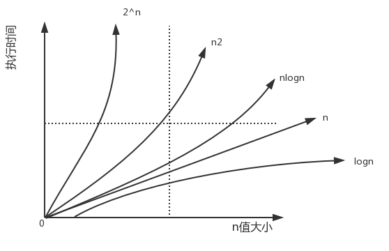 

#### 空间复杂度的定义

时间复杂度看的是代码的执行时间的趋势, 那么同理的, **空间复杂度就是指的占用内存的趋势**

空间复杂度没有时间复杂度那么复杂，常见的就那么几种:

- `O(1)`

  ```js
  const a = 1;
  const b = 1;
  const c = 1;
  const d = 1;
  ```

- `O(n)`

  ```js
  const arr = new Array(n);
  ```

  上面代码中创建了一个**n**长度的数组, 很明显数组的长度根据**n**来决定, 所以是`O(n)`

- `O(n²)`

  ```js
  const arr = []
  for (let i = 0; i < n; i++) {
      arr[i] = i
      for (let j = 0; j < n; j++) {
          arr[i][j] = j
      }
  }
  ```

  只要不是在循环里边不停的**声明变量**，只改变值的话是不会层加空间复杂度的

### 复杂度的优化


举个比较简单的优化的例子

```js
console.time('a')
function go1(n) {
    let item = 0;
    for (let i = 1; i <= n; i++) {
        item += i;
    }
    return item;
}
console.timeEnd('a');


console.time('b')
function go2(n) {
    const item = n * (n + 1) / 2;
    return item;
}
console.timeEnd('b');

go1(1000);  // a: 0.002197265625 ms
go2(1000); // b: 0.0009765625 ms
```

## 运行时和编译时

### 编译时

编译时就是编译器帮你把源代码翻译成机器能识别的代码 (一般意义上可以这么说, 实际上可能只是翻译成某个中间状态的语言, 比如: 把一个C语言代码或其他可编译语言的代码编译成二进制代码) ,**编译时就是简单的作一些翻译工作** ,比如: 检查代码有没有写错啊, 语法对不对呀, 对应词法分析, 语法分析之类的过程, 如果发现了错误编译器就会报一些 warning 或者 error , 这时的错误就叫编译时错误, 这个过程中做的类型检查也就叫**编译时类型检查**或**静态类型检查**(如: typescript或其他静态语言)

### 运行时

所谓运行时就是代码跑起来了, 代码被加载到内存中了, 而运行时类型检查就与前面讲的编译时类型检查(或者静态类型检查)不一样, 不是简单的扫描代码, 而是在内存中做一些操作, 运行代码, 有问题代码就跑不起来了

## Chrome高级调试技巧

### 一键重新发起请求

1. 控制台面板选中`Network`
2. 点击`Fetch/XHR`
3. 选择要重新发送的请求
4. 右键选择`Replay XHR`

### 快速发起请求

1. 控制台面板选中`Network`
2. 点击`Fetch/XHR`
3. 右键选择`Copy --> Copy as fetch`
4. 控制台粘贴代码
5. 修改参数，回车搞定

### 复制JavaScript变量

在控制台可以使用`copy`函数将需要的复制的对象通过参数的形式传递即可复制该对象对应的`json`

效果和`JSON.stringify(object, null, 2)`是一样的

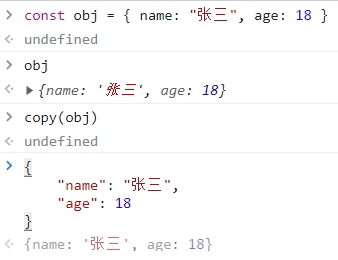 

### 复制打印对象

右键点击打印的对象`Copy object`即可快速复制

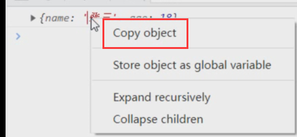 

也可以将打印的对象存储到控制台的临时变量中, 如下:

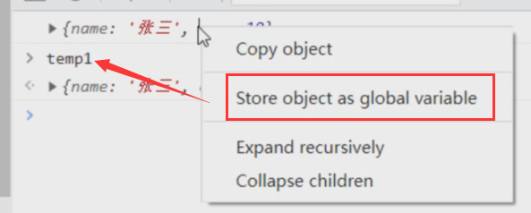 

### 快速复制属性路径

鼠标放到对象属性上会悬浮提示属性路径, 右键`Copy property path`即可

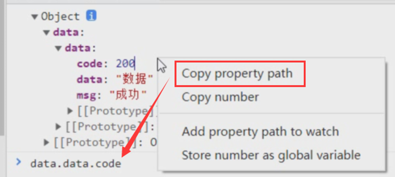 

### 复制请求响应

鼠标放到对应请求记录上, 右键`Copy -> Copy response`即可

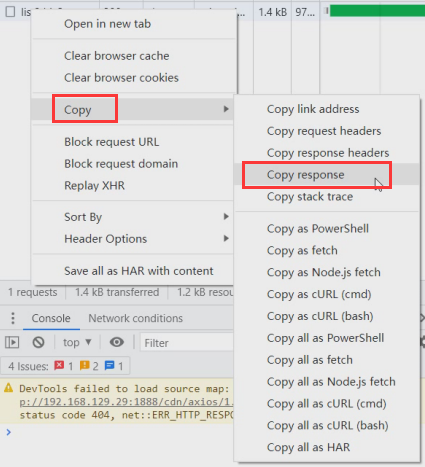 

### 获取Elements面板选中的元素

1. 控制台面板通过`Elements`面板选中需要要调试的元素
2. 控制台直接用`$0`即可访问选中的元素

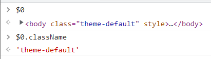 

> \$0, \$1, \$2, \$3, \$4, 五个指令相当于在`Elements`面板最近选择过的五个引用

### 复制DOM元素的信息

可以复制对应的`DOM selec`选择器路径, 复制`DOM`元素标签等等

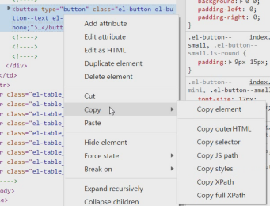 

### 截取一张全屏的网页

1. 在控制台面板中<kbd>ctrl </kbd>+<kbd>chift</kbd>+<kbd>p </kbd> 执行`Command`命令
2. 输入`Capture full size screenshot` 按下回车

如果要截取部分元素, `Elements`面板选中该元素第二步执行`Capture node screenshot`命名即可

### 一键展开所有DOM元素

按住<kbd>ctrl </kbd>点击对应的元素前面的(**展开三角形**)即可展开其所有的后代元素

### 控制台引用上一次执行的结果

使用`$_`引用上一次操作的结果

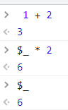 

### 快速切换主题

1. 在控制台面板中<kbd>ctrl </kbd>+<kbd>chift</kbd>+<kbd>p </kbd> 执行`Command`命令
2. 输入`Switch to dark theme`或者`Switch to light theme`进行主题切换

### \$ 和 \$\$ 选择器

在控制台使用`document.querySelector`和`document.querySelectorAll`选择当前页面的元素是最常见的需求, 不过方法太长了, 可以使用`$`和`$$`替代

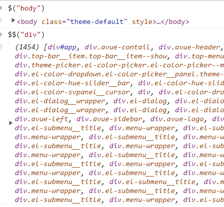 

###  \$i直接在控制台安装npm包

有时候想使用比如`dayjs`或者`lodash`的某个`API`, 但是又不想去官网查, 如果可以在控制台直接试出来就好了

Console Importer 就是这么一个插件, 用来在控制台直接安装`npm`包

1. 安装`Console Importer`插件
2. `$i("name")`安装npm包

### 添加条件断点

假设有下面这段代码, 我们**希望item是3时才触发断点**, 可以怎么弄？

如果没有条件断点那就要点`n`次`debugger`

```js
created() {
  for (const item of [1, 2, 3]) {
    console.log(item);
  }
}
```

在控制台`Source`中找到需要打断点的地方`右键 -> Add conditional breakpoint`输入条件添加即可

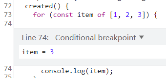 

这在大量数据下, 只想对符合条件时打断点条件将会非常方便

> DOM元素也是可以添加断点的`右键 -> Break On -> xxx`

### 文件跳转和源代码行数跳转

控制台支持<kbd>ctrl</kbd>+<kbd>p</kbd>进行查找

- 查找文件名: 输入对应文件即可
- 跳转行数: `:行数:字符数`

### 本地浏览去除跨域

```sh
"C:\Program Files\Google\Chrome\Application\chrome.exe" --disable-web-security --user-data-dir="D:\ChromeDevUserData"

### 

"C:\Program Files\Google\Chrome\Application\chrome.exe" --disable-site-isolation-trials --disable-web-security --disable-features=SameSiteByDefaultCookies,CookiesWithoutSameSiteMustBeSecure --user-data-dir="D:\ChromeDevUserData"
```

