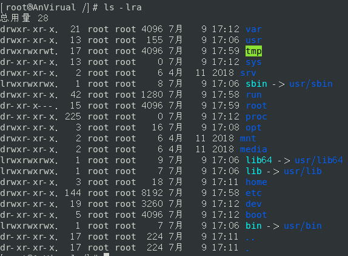
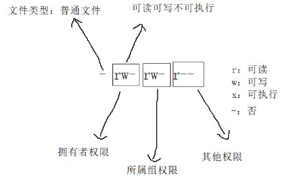

# Linux

[官方网站](https://linuxcommand.org/)

[中英文教程](http://billie66.github.io/TLCL/book/index.html)

[菜鸟教程](https://www.runoob.com/Linux/Linux-tutorial.html)

[Linux命令大全](https://www.runoob.com/linux/linux-command-manual.html)

[命令搜索](http://www.atoolbox.net/Tool.php?Id=826)

[[toc]]

## 系统命令

| 命令         | 说明                                                         |
| ------------ | ------------------------------------------------------------ |
| **cls** | 清屏                                                         |
| **history**| 显示历史命令记录                                             |
| **data**| 查看并修改系统时间, 修改的格式: `yyyy/mm/dd`, (查看也可以执行格式), 例子: `date +%s`|
| **cal**| 查看日历, `-3`显示前一个月, 当前月, 下一个月, `-y`显示指定年份的日历 |
| **hostname**| 获取主机名                                                   |
| **whoami**| 显示当前的用户                                               |
| **uname**| 获取电脑和操作系统的相关信息, `-a`输出详细信息, `-r`输出内核版本号 |
| **chap** | `windows`下显示或设置活动代码页编码, `chcp 65001`对应UTF-8 |

**data指令的输出格式如下: **

- %H: 小 **(00..23)**
- %M: 分 **(00..59)**
- %S: **(00..61)**
- +%s: 时间戳(秒)
- %X: 相当于 **%H:%M:%S**
- %d: 日 **(01..31)**
- %m: 月份 **(01..12)**
- %Y: 完整年份 **(0000..9999)**
- %F: 相当于 **%Y-%m-%d**

```sh
now=$(date "+%Y-%m-%d %H:%M:%S")
echo $now # 2022-07-28 22:13:53
```

## 键盘热键

Bash使用了一个名为 Readline 的库 (一系列功能的集合, 可以被不同的程序使用) , 来实现命令行编辑, 下面是一些键盘热键

### 移动热键

| 热键                              | 说明                                 |
| --------------------------------- | ------------------------------------ |
| <kbd>←</kbd>或者<kbd>→</kbd>      | 光标移动                             |
| <kbd>ctrl</kbd>+<kbd>a</kbd>      | 光标移动到行首                       |
| <kbd>ctrl</kbd>+<kbd>e</kbd>      | 光标移动到行尾                       |
| <kbd>ctrl</kbd>+<kbd>方向键</kbd> | 单词间跳转                           |
| <kbd>ctrl</kbd>+<kbd>b</kbd>      | 光标前移一个字符, 等价于<kbd>←</kbd> |
| <kbd>ctrl</kbd>+<kbd>f</kbd>      | 光标后移一个字符, 等价于<kbd>→</kbd> |
| <kbd>ctrl</kbd>+<kbd>t</kbd>      | 交换光标位置前的两个字符             |

### 删除热键

| 热键                         | 说明                                           |
| ---------------------------- | ---------------------------------------------- |
| <kbd>ctrl</kbd>+<kbd>h</kbd> | 向前删除一个字符, 等价于<kbd>backspace</kbd>键 |
| <kbd>ctrl</kbd>+<kbd>d</kbd> | 删除当前光标的字符, 等价于<kbd>delete</kbd>键  |

### 剪切和粘贴热键

| 热键                                | 说明                   |
| ----------------------------------- | ---------------------- |
| <kbd>ctrl</kbd>+<kbd>u</kbd>        | 剪切光标前至行首的内容 |
| <kbd>ctrl</kbd>+<kbd>k</kbd>        | 剪切光标后至行尾的内容 |
| <kbd>ctrl</kbd>+<kbd>w</kbd>        | 剪切光标之前的一个单词 |
| <kbd>alt</kbd>+<kbd>backspace</kbd> | 剪切光标之前的一个单词 |
| <kbd>alt</kbd>+<kbd>d</kbd>         | 剪切光标之后的一个单词 |
| <kbd>ctrl</kbd>+<kbd>k</kbd>        | 粘贴文本               |

### 文本大小写切换热键

| 热键                        | 说明                         |
| --------------------------- | ---------------------------- |
| <kbd>alt</kbd>+<kbd>l</kbd> | 光标后至行尾的字符转换成小写 |
| <kbd>alt</kbd>+<kbd>u</kbd> | 光标后至行尾的字符转换成大写 |

### 自动补全热键

| 热键                        | 说明                                                         |
| --------------------------- | ------------------------------------------------------------ |
| <kbd>tab</kbd>              | 命令补全提示                                                 |
| <kbd>alt</kbd>+<kbd>?</kbd> | 命令补全提示, 同<kbd>tab</kbd>键                             |
| <kbd>alt</kbd>+<kbd>*</kbd> | 插入任何可能的自动补全, 当想要使用多个可能的匹配项时, 这个很有帮助 |

> 可编程自动补全可以通过`set | less`查看

### 查找历史记录热键

| 热键                         | 说明                                                         |
| ---------------------------- | ------------------------------------------------------------ |
| <kbd>↑</kbd>或者<kbd>↓</kbd> | 翻看历史命令                                                 |
| <kbd>ctrl</kbd>+<kbd>p</kbd> | 上一条历史命令                                               |
| <kbd>ctrl</kbd>+<kbd>n</kbd> | 下一条历史命令                                               |
| <kbd>ctrl</kbd>+<kbd>r</kbd> | 反向增量搜索, 从当前命令行开始, 向上增量搜索, <kbd>ctrl</kbd>+<kbd>j</kbd>可以将搜索到的命令复制到命令行中, 方便进一步编辑, <kbd>ctrl</kbd>+<kbd>c</kbd>则退出搜索 |
| <kbd>alt</kbd>+<kbd>p</kbd>  | 反向搜索m 非增量搜索 (输入要查找的字符串, 按下<kbd>Enter</kbd>来执行搜索) |

#### 使用命令查看历史记录命令

bash 维护着一个已经执行过的命令的历史列表, 这个命令列表被保存在家目录下, 一个叫做**.bash_history**的文件里, 可以使用历史命令展开的方式来对应行号的历史记录命令, 使用`!n`base就会把历史列表中第n行的内容展开

```sh
cd ~ 

ls -a

less -N .base_history # 查看历史记录命令列表

!1 # 引用命令的历史记录列表中的第一行的命令
```

#### 历史记录展开

shell还为历史列表中的命令提供了一个特殊的展开特性

| 命令     | 说明                                                         |
| -------- | ------------------------------------------------------------ |
| !!       | 重复最后一次执行的命令, 可能按<kbd>↑</kbd>/<kbd>↓</kbd>按键和<kbd>enter</kbd>键更容易些 |
| !number  | 重复历史列表中**第number行**的命令                           |
| !string  | 重复最近历史列表中, 以这个字符串**开头**的命令               |
| !?string | 重复最近历史列表中, **包含**这个字符串的命令                 |

### 其他热键

| 热键                         | 说明           |
| ---------------------------- | -------------- |
| <kbd>ctrl</kbd>+<kbd>l</kbd> | 清空屏幕       |
| <kbd>ctrl</kbd>+<kbd>c</kbd> | 杀死当前进程   |
| <kbd>ctrl</kbd>+<kbd>d</kbd> | 退出当前 Shell |

## 文件系统

Linux一切皆文件, 只有一个顶级(`/`)目录, 整个系统就是一颗树, 没有windows系统的盘符概念, 具体文件目录含义如下(**centos8**): 

| 目录       | 含义                                                         | windows                                          |
| ---------- | ------------------------------------------------------------ | ------------------------------------------------ |
| **/bin**| 是**/usr/bin**的链接, 所有用户可用的基本命令存放的位   置    | windows没有固定的命令存放目录                    |
| **/boot**| Linux系统启动的引导分区                                      |                                                  |
| **/dev**| 设备外设连接Linux后, 对应的文件存放的位置                    | 类似Windows中的U盘, 光盘的符号文件               |
| **/etc**| 存放系统或者安装的程序的配置文件, 注册服务等<br /> **/etc/crontab**: 定义自动运行的任务<br /> **/etc/fstab**: 包含存储设备的列表, 以及与其相关的挂载点<br />**/etc/passwd**: 包含用户帐号列表 | 类似windows中的**注册表**,                       |
| **/home**| 家目录, Linux中每新建一个用户, 会自动在home中为该用户分配一个文件夹 | 类似windows中的"我的文档", 每个用户有自己的目录  |
| **/lib**| 是**/usr/lib**的链接, Linux系统需要使用一些公共的依赖        | 类似windows中的C盘下的**System32**下的动态链接库 |
| **/lib64**| 是**/usr/lib4**的链接, 对应Linux的64位的**/lib**|                                                  |
| **/media**| 用于外部存储, 如u盘                                          |                                                  |
| **/mnt**| 类似于**/media**, 也是用于外部存储的                         |                                                  |
| **/opt**| 用户的第三方软件安装的目录                                   |                                                  |
| **/proc**| 进程目录                                                     |                                                  |
| **/root**| root账户的家目录, 仅供root账户使用                           | 类似windows中的Administrator账户的**我的文档**|
| **/run**| 运行目录                                                     |                                                  |
| **/sbin**| 是**/usr/slib**的链接, 需要管理员权限才能使用的命令          |                                                  |
| **/srv**| 存放系统服务相关的东西                                       |                                                  |
| **/sys**| 系统硬件信息的目录                                           |                                                  |
| **/tmp**| 临时目录, 系统每次启动时都会清空该目录                       |                                                  |
| **/usr**| 存放用户和系统软件的应用程序                                 | 类似windows中的C盘下的**Program Files**目录      |
| **/var**| 可变目录, 系统和程序运行产生的日志文件和缓存文件<br />其中最重要的一个文件是**/var/log/messages**|                                                  |

> 其中的**/opt**, **/tmp**, **/usr**(对应用户的目录), **/var**目录是可以修改的其他的最好不要动

在Linux系统中, 不以文件后缀区分文件类型, 而是以`ls -l`命令输出的第一个字符标识文件类型

- **d**: 目录文件, 简单来说就是文件夹, 我们可以在该目录文件下新建文件
- **-**: 普通文件, 分为文本文件, 动静态库, 可执行程序等
- **l**: 软链接 (类似Windows的快捷方式) 
- **b**: 块设备文件 (例如硬盘, 光驱等) 
- **p**: 管道文件
- **c**: 字符设备文件 (例如屏幕等串口设备) 
- **s**: 套接口文件

### 特殊符号

特殊的符合可以被一些命令使用, 如`cd`, `ls`等

- `~`: 当前用户的**home**目录
- `-`: 最近的一次访问的目录
- `.`: 当前目录, 很多接受文件名作为参数的命令直接给命令则会默认解析为当前目录下`./`
- `..`: 上一级目录

### 文件路径命令

| 命令         | 说明                                                         |
| ------------ | ------------------------------------------------------------ |
| **ls **| 查看文件列表, `ls xxx`查看指定目录, `-l`查看详细信息(包含权限, 大小, 日期等), <br />`-a`查看隐藏文件, `-r`降序排列, `-S`以文件大小排序, `-t`以文件修改时间排序, 可以同时使用多个参数, 如: `ls -lr` |
| **cd**| 切换目录, 可以切换到相对目录, 也可以切换到决定目录, 如: `cd ..`, `cd C:\Users`|
| **pwd**| 显示当前的路径                                               |
| **find**| 文件查找, 语法: `find [搜索路径] [-name ]"文件名关键词"`按照文件名进行搜索 |
| **tree**| 以树形打印目录结构, 需要[安装](#安装一个软件包)`tree xxx`, `-a`显示所有文件和目录, `-d`显示目录<br />`-t`用文件和目录的更改时间排序, `-p`列出权限, `-u`列出所有者, `-C`添加颜色<br />windows下的`tree`比较垃圾，只有两个参数，`/F` 递归显示每个文件夹的名称, <br />`/A` 使用ASCII字符而不是扩展字符 |
| **basename**| 清除一个路径名的开头部分, 只留下一个文件的基本名称           |

```sh
ls -lra ./src # 以详细信息并升序的查看src目录文件列表(包括隐藏文件)
ls -ls *.ts # 查看当前目录下所有的 .ts 文件
ls -d .*--color=auto # 查看当前目录下所有的以 .开头的文件

cd ~ # 进入用户的家目录
cd .. # 返回上一级目录
cd - # 进入最近一次的目录
cd /usr/bin # 进入指定的目录

pwd # 查看当前的目录

find . -name "*.sh" # 在当前目录下查找 .sh 结尾的文件

tree ./src # 查看 src 的树形目录结构

basename /hello/world/abc.sh # abc.sh
```

**ls 输出是文件格式**

 

- **drwxr-wr-x**: 对于文件的访问权限, 
	- 第一个字符(**d**)指明`文件类型`
	- 其后三个字符(**rwx**)是`文件所有者`的访问权限
	- 再其后的三个字符(**r-x**)是`文件所属组`中成员的访问权限
	- 最后三个字符(**r-x**)是`其他所有人`的访问权限

- **21**: 文件的硬链接数目
- **root**: 文件所有者的用户名
- **root**: 文件所属用户组的名字
- **4096**: 以字节数表示的文件大小
- **7月 9 17:12**: 上次修改文件的时间和日期
- **var**: 文件名

### 文件查看命令

| 命令     | 说明                                                         |
| -------- | ------------------------------------------------------------ |
| **file**| 查看文件的类型, 会输出一段简短的文本以描述这个文件           |
| **stat**| 显示文件或文件系统状态                                       |
| **cat**| 会将文件的全部内容输出到标准输出流(控制台), 适合查看小文档或者配合管道操作使用, 可以读取多个文件会把它们都连接起来, `-A`显示非打印字符, 如tab(`^I`表示)或回车(`$`表示), `-n`给文本行添加行号, `-s`不输出多个空白行<br />不带参数则会读取键盘输入并输出到控制台, 可以指定配合`>`或者`>>`指定一个文件这样可以持续读取键盘输入并将内容重定向到文件中, <kbd>ctrl</kbd>+<kbd>d</kbd>则退出 |
| **less**| 以分页的方式浏览文件内容(适合大文档), `-i`忽略大小写, `-N`显示行号浏览模式快捷键: `h`可以查看帮助,`↑/j`上一行, `↓/k`下一行, `G`第一页, `g`最后一页, `w`上一页, `空格/b/f`下一页, `/关键字`向上搜索关键字, `?关键字`向下搜索关键字, `q`退出 |
| **head**| 查看文件开头的内容(默认10行)                                 |
| **tail**| 查看文件最后的内容(默认10行), `-f`持续读取最底部适合实时的查看日志内容, 例如: `tail -f /var/log/messages`可以实时的查看系统日志, 使用<kbd>ctrl</kbd>+<kbd>d</kbd>退出<br />`tail -n 20 xxx`查看最后的20行, `tail -n +20 xxx`查看文件从20行到末尾 |
| **wc**| 统计文件中的换行符, 字和字节个数, `-c`显示Bytes数, `-l`显示行数, `-w`显示字数 |
| **grep**| 文件行内容匹配, 语法: `grep [选项] 要查找的目录范围`, `-n`显示查找结果所在行号,`-r`递归查找目录下的所有文件, 如: `grep -nr shell .`, `-i`忽略大小写, `-v`反向选择, 还支持正则表达式, 如: `cat test.txt | grep "^java" `|
| **tee**| 三通管件, 程序从标准输入读入数据, 并且同时复制数据到标准输出 (允许数据继续随着管道线流动) 和一个或多个文件 |

```sh
file ./src # 查看对应文件的类型和介绍

stat README.MD  # 查看对应文件的详细信息

cat README.MD # 将 README.MD 文件的全部内容输出到控制台
cat a.txt b.txt c.txt > abc.txt # 将三个文件的内容都连接起来并重定向到 abc.txt 文件中
cat > README.MD # 读取键盘输入并覆盖到 README.MD 文件中
cat >> README.MD # 读取键盘输入并追加到 README.MD 文件中

less README.MD # 查看 README.MD 文件

head -n 20 README.MD # 查看开始的20行
head -n 100 README.MD | tail -n 20 # 读取 README.md 的100行到120行的内容

tail -f /var/log/messages # 实时的查看系统日志

wc README.MD # 查看 README.MD 文件的统计信息
find ~ | wc -l # 查看当前用户下有多少个文件
```

### 文件操作命令

| 命令      | 说明                                                         |
| --------- | ------------------------------------------------------------ |
| **touch**| 创建文件, 支持同时创建多个文件, 也可以修改文件的属性, 文件的时间等 |
| **mkdir**| 创建目录, `-p`可以创建不存在的父级目录, 可以接受多个参数会同时创建多个文件夹 |
| **cp**| 复制文件, 语法:`cp [选项] 源文件 目标文件 [指定目录]`, `-u`仅复制目标目录中不存在的文件<br />`-r`递归处理子目录也复制, `-f`强行复制无论子目录是否已经存在, <br />`-v`显示操作信息, `-i`显示覆盖提示, |
| **mv**| 移动文件, 语法: `mv [文件或文件夹] [新路径]`, 移动并修改文件名`mv 文件 改名文件`<br />`-f`强制复制目标文件存在不询问直接覆盖, `-i`显示覆盖提示, `-v`显示操作信息 |
| **rm**| 删除文件, `-r`删除目录及目录下的所有文件(递归), `-f`强制删除,`-i`删除提示, <br />`-v`显示操作信息, 这个命令慎用`rm -rf /`, 还有一个`rmdir`命令专门用来删除空目录 |
| **ln**| 设置链接(默认为硬链接), 语法: `ln [选项] 目标文件或目录 链接名`, `-s`表示软链接(快捷方式), <br />**软链接可以随意创建,**无论目标文件是否存在, **目录不能创建硬链接**|

#### 通配符

接受文件名作为参数的任何命令, 都可以使用通配符

| 通配符        | 意义                                         |
| :------------ | :------------------------------------------- |
| *| 匹配任意多个字符 (包括零个或一个) |
| ?             | 匹配任意一个字符 (不包括零个) |
| [characters]  | 匹配任意一个属于字符集 (characters) 中的字符 |
| [!characters] | 匹配任意一个不是字符集中的字符               |
| [:alnum:]     | 匹配任意一个字母或数字                       |
| [:alpha:]     | 匹配任意一个字母                             |
| [:digit:]     | 匹配任意一个数字                             |
| [:lower:]     | 匹配任意一个小写字母                         |
| [:upper:]     | 匹配任意一个大写字母                         |

常见的通配符示例

| 模式                   | 匹配对象                                                  |
| :--------------------- | :-------------------------------------------------------- |
| *| 所有文件                                                  |
| g*| 文件名以" g "开头的文件                                     |
| b*.txt                 | 以"b"开头, 中间有零个或任意多个字符, 并以".txt"结尾的文件 |
| Data???                | 以" Data "开头, 其后紧接着3个字符的文件                     |
| [abc]*| 文件名以"a","b",或"c"开头的文件                           |
| BACKUP.[0-9][0-9][0-9] | 以"BACKUP."开头, 并紧接着3个数字的文件                    |
| [[:upper:]]*| 以大写字母开头的文件                                      |
| [![:digit:]]*| 不以数字开头的文件                                        |
| *[[:lower:]123]        | 文件名以小写字母结尾, 或以" 1 "," 2 ", 或" 3 "结尾的文件    |

```sh
touch index.js # 在当前目录创建一个 idnex.js 文件

mkdir -p myProject/src/assets # 创建 myProject/src/asset 目录(父目录不存在则创建)
mkdir file1 file2 file3 # 在当前目录创建三个目录

cp -u *.html /opt/abc # 复制当前目录下所有的 .html 文件到 /opt/abc 

mv index.js index.ts # 将当前目录下的 index.js 改名为 index.ts
mv index.js .. # 将当前目录下的 index.js 移动到上级目录

rm -iv index.js # 删除当前目录下的 index.js 文件, 显示操作记录, 并询问是否删除
rm -rv src # 删除当前目录下的 src 目录, 显示操作记录
rm -v *.ts # 删除当前目录下的所有 .ts 文件, 显示操作记录
```

> - 小心`rm`命令
>
> 在使用通配符配合`rm`命令时要小心操作, 可以先用`ls`命令来测试通配符看看会删除那些文件, 符合要求在使用`rm`命令

## 命令

### 命令的分类

命令可以是下面四种形式之一: 

1. 一个**可执行程序**; 就像我们所看到的位于目录**/usr/bin**中的文件一样,  这一类程序可以是用诸如 C 和 C++ 语言写成的程序然后编译得到的二进制文件, 也可以是由诸如 shell, perl, python, ruby 等等脚本语言写成的程序
2. 一个内建于**shell 自身的命令**; bash 支持若干命令, 内部叫做 shell 内部命令 (builtins); 例如, cd 命令, 就是一个 shell 内部命令; 
3. 一个 **shell 函数**; 这些是小规模的 shell 脚本, 它们混合到环境变量中;  在后续的章节里, 我们将讨论配置环境变量以及书写 shell 函数; 但是现在,  仅仅意识到它们的存在就可以了; 
4. 一个**命令别名**; 我们可以定义自己的命令, 建立在其它命令之上

### 命令查看

Linux提供了一些查找方法来查看对应命令的类型, 位置, 手册, 帮助, 描述等信息

| 命令                  | 说明                                                         |
| --------------------- | ------------------------------------------------------------ |
| **commad --help**| 显示对应命令的用法信息                                       |
| **type**| 说明一个命令名是如何被解释的                                 |
| **which**| 显示会执行哪个可执行程序                                     |
| **man**| 以**less**命令显示命令手册, 可以跟一个手册页, 如: `man 5 passwd`|
| **whatis**| 显示一个命令的简洁描述                                       |
| **alias**/**unalias**| 设置别名和删除别名, 如`alias myls=ls -l`设置一个别名`myls`对应名`ls -l`, `unalias myls`删除`myls`别名,`unalias -a`删除当前shell环境中的所有别名 |

```sh
ls --help # 查看 ls 命令的用法信息

type ls
# ls 是 `ls --color=auto' 的别名
type cd 
# cd 是 shell 内嵌
type rm
# rm 是 `rm -i' 的别名
type cat
# cat 已被哈希 (/usr/bin/cat)
type passwd
# passwd 是 /usr/bin/passwd

which ls
# alias ls='ls --color=auto'
#	  /usr/bin/ls

man ls
man 5 passwd # 查看 passwd 的文本格式

whatis ls
# ls (1)               - 列目录内容
# ls (1p)              - list directory contents


alias # 查看所有的别名
alias myls="ls -lra" # 添加一个别名 myls 对应命令 ls -lra
unalias myls # 删除 myls 别名
```

**man**命令的手册页如下: 

| 章节 | 内容                               |
| :--- | :--------------------------------- |
| 1    | 用户命令                           |
| 2    | 程序接口内核系统调用               |
| 3    | C 库函数程序接口                   |
| 4    | 特殊文件, 比如说设备结点和驱动程序 |
| 5    | 文件格式                           |
| 6    | 游戏娱乐, 如屏幕保护程序           |
| 7    | 其他方面                           |
| 8    | 系统管理员命令                     |

## 重定向

### stdout, stdin和stderr

- **stdout**: 标准输出, 连接到屏幕控制台
- **stdin**: 标准输入, 连接到键盘
- **stderr**: 标准错误, 连接到屏幕控制台

I/O 重定向允许我们更改输出地点和输入来源, 一般来说, 输入来自键盘, 输出送到屏幕,  但是通过 I/O 重定向, 我们可以做出改变

`/dev`文件中的对应如下: 

| 设备 | 设备名        | 文件描述符 | 类型         |
| ---- | ------------- | ---------- | ------------ |
| 键盘 | `/dev/stdin`| 0          | 标准输入     |
| 屏幕 | `/dev/stdout`| 1          | 标准输出     |
| 屏幕 | `/dev/stderr`| 2          | 标准错误输出 |

### 标准输出重定向

Linux的命令默认都是输出到标准输出(屏幕), 我们可以修改它的输出到一个文件中, 常用的命令格式如下: 

- `>`表示将左边的输出重定向到右边的文件, 以**覆盖**的方式
- `>>`表示将左边的输出重定向到右边的文件, 以**追加**的的方式

- `&`表示全部文件, 不管是否对错

- `1`表示**标准输出文件**

- `2`表示**标准错误输出**

| 类型                       | 命令语法                  | 作用                                                       |
| -------------------------- | ------------------------- | ---------------------------------------------------------- |
| 标住输出重定向             | `命令 > 文件`| 以覆盖方式, 把命令的正确输出内容输出到指定的文件或设备当中 |
| 标住输出重定向             | `命令 >> 文件`| 以追加方式, 把命令的正确输出内容输出到指定的文件或设备当中 |
| 标准错误输出重定向         | `错误命令 2> 文件`| 以覆盖方式, 把命令的错误输出输出到指定的文件或设备当中     |
| 标准错误输出重定向         | `错误命令 2>> 文件`| 以追加方式, 把命令的错误输出输出到指定的文件或设备当中     |
| 正确输出和错误输出同时保存 | `命令 > 文件 2>&1`| 以覆盖的方式, 把正确输出和错误输出都保存到同一个文件当中   |
| 正确输出和错误输出同时保存 | `命令 >> 文件 2>&1`| 以追加的方式, 把正确输出和错误输出都保存到同一个文件当中   |
| 正确输出和错误输出同时保存 | `命令 &> 文件`| 以覆盖的方式, 把正确输出和错误输出都保存到同一个文件当中   |
| 正确输出和错误输出同时保存 | `命令 &>> 文件`| 以追加的方式, 把正确输出和错误输出都保存到同一个文件当中   |
| 正确输出和错误输出同时保存 | `命令 >> 文件a 2>> 文件b`| 把正确的输出追加到文件a中, 把错误的输出追加到文件b中       |

```sh
echo > foo.txt # 通过重定向一个空可以清空指定的文件
cat *.txt > allLog.txt # 将当前目录下的 .txt 文件都输出到 allLog.txt 中
ls .... 2> lsErr.txt # 将 ls .... 命令的错误输出输出到 lsErr.txt 中
ls /hello &> hello.txt # 将 ls /hello 命令的输出结果(无论对错)都输出到 hello.txt 中
```

##### /dev/null

如果希望执行某个命令, 但又不希望在屏幕上显示输出结果, 那么可以将输出重定向到**/dev/null**中

```sh
命令 > /dev/null
```

### 标准输入重定向

- `<`表示将左边命令的输入改成右边的文件, 以**覆盖**的方式
- `<<`表示将左边命令的输入改成右边的文件, 以**追加**的的方式

| 类型                       | 符号 (语法) | 功能                                                 |
| -------------------------- | --------------------- | ---------------------------------------------------- |
| 标准输入                   | 命令 < 文件a          | 命令把文件a的内容作为标准输入设备                    |
| 标识符限定输入             | 命令 << 标识符        | 命令把标准输入中读入内容, 直到遇到" 标识符 "分解符为止 |
| 输入输出重定向 (同时使用) | 命令 <  文件a > 文件b | 命令把文件a的内容作为标准输入, 把文件b作为标准输出   |

### 管道操作

`|`被称为管道符, 可以将一个命令的标准输出通过管道送至另一个命令的标准输入, 语法: `命令1 | 命令2`, 如下: 

```sh
cat test.md | grep -n "shell" # 将 cat test.md 命令的输出作为 grep -n "shell" 命令的输入
```

#### 过滤器

管道线经常用来对数据完成复杂的操作, 有可能会把几个命令放在一起组成一个管道线; 通常, 以这种方式使用的命令被称为**过滤器**; 过滤器接受输入, 以某种方式改变它, 然后输出它, 如下的例子: 

```sh
# 创建三个文件
echo aaaa > a.txt
echo bbbb > b.txt
echo cccc > c.txt

ls
# a.txt  b.txt  c.txt

# 将三个文件的内容连接到一起, 去重, 降序排列, 最后通过 less 命令查看
cat a.txt b.txt c.txt | uniq | sort -r | less
```

## 字符展开

当输入一个命令并按下 enter 键, bash 会在执行你的命令之前对输入的字符完成特殊的处理

### 路径名展开

通配符所依赖的工作机制叫做路径名展开

```sh
echo *# 输出当前目录下的所有文件, 同 ls *
echo *.txt # 效果同 ls *.txt
```

### 波浪线展开

波浪线字符`~`有特殊的含义, 当它用在 一个单词的开头时, 它会展开成指定用户的家目录名, 如果没有指定用户名, 则展开成当前用户的家目录:

```sh
echo ~ # 这里不同于 ls ~
# /root

ls ~ # 查看用户的家目录内容

echo ~/foo
# /root/foo

ls ~/foo # 查看 /root/foo 目录下的内容
```

### 算术表达式展开

shell 在展开中执行算数表达式, 这允许我们把 shell 当作计算器来使用:

```sh
echo $((2 + 2)) # 格式为: $((算术表达式))
# 4
```

算术表达式支持的操作符`+`, `-`, `*`, `/`, `%`, `**`(取幂), 不支持有小数, 可以支持嵌套:

```sh
echo $(($(( 2 + 2 )) *100))
# 400
```

### 花括号展开

可能最奇怪的展开是花括号展开, 通过它, 你可以从一个包含花括号的模式中创建多个文本字符串: 

```sh
echo {a,b,c}.txt # 会把 {a,b,c}.txt 都展开成对应 .txt 
# a.txt b.txt c.txt
```

花括号展开模式可能包含一个开头部分叫做前言, 一个结尾部分叫做附言; 花括号表达式本身可能包含一个由逗号分开的字符串列表, 或者一个**整数区间**, 或者单个的字符的区间, 这种模式不能嵌入空白字符, 如下: 

#### 整数区间

```sh
touch test{1..5}.txt # 创建 test1.txt ~ test5.txt 文件

echo test{1..5}.txt # 输出 test1.txt ~ test5.txt 文本
# test1.txt test2.txt test3.txt test4.txt test5.txt

rm -f test{1..5}.txt # 删除 test1.txt ~ test5.txt 文件
```

#### 字符区间

```sh
echo {a..z} # 正序输出 a ~ z
# a b c d e f g h i j k l m n o p q r s t u v w x y z

echo {Z..A} # 倒序输出 Z ~ A
# Z Y X W V U T S R Q P O N M L K J I H G F E D C B A
```

#### 花括号嵌套

```sh
echo a{A{1,2},B{3,4}}b
# aA1b aA2b aB3b aB4b
```

花括号常见的应用是, 创建一系列的文件或目录列表, 效率极高

```sh
mkdir DateMkdir 

cd DateMkdir

mkdir {2021..2022}-0{1..9} {2021..2022}-{10..12} # 创建2021年到2022年所有的月份文件夹

ls
# 2021-01  2021-04  2021-07  2021-10  2022-01  2022-04  2022-07  2022-10
# 2021-02  2021-05  2021-08  2021-11  2022-02  2022-05  2022-08  2022-11
# 2021-03  2021-06  2021-09  2021-12  2022-03  2022-06  2022-09  2022-12
```

### 参数展开

这个特性在 shell 脚本中比直接在命令行中更有用, 它的许多功能和系统存储小块数据, 并给每块数据命名的能力有关系, 

许多像这样的小块数据, 更恰当的称呼应该是**变量**, 如果使用错误的变量展开时, 仍然会进行, 只是展开的结果是一个空字符串

```sh
printenv | less # 查看所有的变量列表

echo $USER # 输出你的用户名
# root

echo $hello # 错误的变量什么都没有
```

### 命令替换

命令替换允许我们把一个命令的输出作为另一个命令的一部分来使用, 有两种语法: 

```sh
$(command) # 可以在命令行中直接使用

`command`# 可以在 shell 脚本中使用
```

```sh
echo $(ls | grep .txt&) # echo 命令的输出是 ls | grep .txt& 命令的结果
# a.txt b.txt c.txt
```

### 引用

shell 提供了一种叫做引用的机制, 来有选择地禁止不需要的展开

```sh
echo this is a test txt 
# this is a test txt

echo this is a $1000.00  # $1是特殊的引用, 没有值所以是空字符串
# this is a 000.00
```

#### 双引号

引用的第一种类型是双引号, 如果你把文本放在双引号中, shell 使用的特殊字符, 都失去它们的特殊含义, 被当作普通字符来看待

有几个例外: **$**(变量引用), **\\**(转义字符)和**\`**(反引号), 这意味着**单词分割, 路径名展开, 波浪线展开和花括号展开都将失效**, 然而**参数展开, 算术展开和命令替换仍然有效**, 在默认情况下, 单词分割机制会在单词中寻找空格, 制表符, 和换行符, 并把它们看作单词之间的界定符, 使用双引号就可以避免引号内的空格被单词分割机制识别, 使用双引号, 我们可以处理包含空格的文件名

```sh
touch my file.txt # 我们想创建 my file.txt 文件

ls # 但是结果并不对, touch 把单词分割成两个文件了
# file.txt  my

rm -fv my file.txt


touch "my file.txt" # 使用双引号就可以正确的识别出单空格的文件名了

ls
# my file.txt

file "my file.txt"
# my file.txt: empty

rm -fv "my file.txt"
```

> 对应识别正确的文件名使用单引号也是可以的

在双引号中, 参数展开, 算术表达式展开和命令替换仍然有效

```sh
echo "$USER $((2 + 2)) $(cal)"

# root 4       七月 2022
# 日 一 二 三 四 五 六
#                 1  2
#  3  4  5  6  7  8  9
# 10 11 12 13 14 15 16
# 17 18 19 20 21 22 23
# 24 25 26 27 28 29 30
# 31
```

#### 单引号

如果需要禁止所有的展开, 就使用单引号, 如果把上面双引号的例子换成单引号, 则会原样的输出:

```sh
echo '$USER $((2 + 2)) $(cal)'
# $USER $((2 + 2)) $(cal)
```

#### 转义字符

有时候我们只想引用单个字符, 就可以在字符之前加上一个反斜杠(`/`), 在这里叫做转义字符, 经常在双引号中使用转义字符, 来有选择地阻止展开

```sh
echo this is a \$1000.00
# this is a $1000.00
```

反斜杠除了作为转义字符外, 也可以构成一种表示法, 来代表某种 特殊字符, 这些特殊字符叫做控制码; ASCII 编码表中前32个字符被用来把命令转输到电报机 之类的设备; 一些编码是众所周知的 (制表符, 退格符, 换行符, 和回车符) 

| 转义序列 | 含义                                  |
| -------- | ------------------------------------- |
| \\\\     | 反斜杠                                |
| \a       | 响铃 ("警告 "－导致计算机嘟嘟响) |
| \b       | 退格符 (删除键) |
| \f       | 换页(FF), 将当前位置移到下页开头      |
| \n       | 新的一行; 在类 Unix 系统中, 产生换行; |
| \r       | 回车符                                |
| \t       | 制表符 (tab键) |
| \v       | 垂直制表符                            |

>  `echo`命令带上`-e`选项就可以解析转义字符了

## 权限

| 命令          | 说明                                                         |
| ------------- | ------------------------------------------------------------ |
| **id**| 显示用户的身份证号                                           |
| **chmod**| 更改文件的模式, `chmod u+s a.txt`, `chmod g+s dir`, `chmod u+x test.sh`|
| **umask**| 设置默认的文件权限, 文件创建时会应用该命令指定的默认掩码, 常见的掩码(八进制): 0002, 0022 |
| **su**| 以另一个用户的身份来运行 shell, 或者切换指定的用户, `-l或-`参数会为指定用户启动一个需要登录的 shell, `su -c '命令'`可以在另一个shell执行单个命令而不打开一个新的shell<br />`su 用户名`则可以切换指定的用户 |
| **sudo**| 以另一个用户的身份来执行命令, `sudo`不会重新启动一个 shell, 也不会加载另一个 用户的 shell 运行环境, `-l`选项列出所有的权限 |
| **chown**| 更改文件所有者, 语法: `chown [-R] user名:group名 文件名`-R参数改变目录及其所有子目录的文件的权限, 可以将文件夹及其内部所有文件的所有者和组全部修改, <br />`chown 用户名 文件名`修改文件所有者, `chown :组名 文件名`修改文件所属组, <br />`chown [-R] 用户名:组名 文件名`修改文件或文件夹所有者和所属组 |
| **chgrp**| 更改文件组所有权, 使用同`chown`|
| **passwd**| 更改用户密码, 不指定参数就是修改当前用户的密码, 超级管理员可以指定一个用户名来修改这个用户的密码, `-k`密码永不过期, `-l`锁定指名帐户的密码, `-u`解锁指名账户的密码, <br />`-e`终止指名帐户的密码, `-x`密码的最长有效时限 |
| **groupadd **| `groupadd 组名`创建组, `groupdel 组名`删除组, `cat /etc/group | grep -n "组名"`查找系统中的组(系统每个组信息都会被存放在**/etc/group**的文件中) |
| **useradd**| `useradd -g 组名 用户名`创建用户, `passwd 用户名`设置密码, `cat /etc/passwd | grep -n 用户名`查找系统用户(系统每个用户信息保存在**/etc/passwd**文件中), `su 用户名`切换用户, `userdel -r 用户名`删除用户 |

> 通过命令前的符号可以判断当前的用户是否是超级用户, `$`表示普通用户, `#`表示超级用户

### uid和gid

当用户创建帐户之后, 系统会给用户分配一个号码, 叫做用户 ID 或者 uid, 然后, 为了符合人类的习惯, 这个 ID 映射到一个用户名;

系统又会给这个用户分配一个原始的组 ID(即 gid), 一个用户可以属于多个组

```sh
id
# uid=0(root) gid=0(root) 组=0(root) 环境=unconfined_u:unconfined_r:unconfined_t:s0-s0:c0.c1023


su yang # 切换 yang 用户

id
# uid=1000(yang) gid=1000(yang) 组=1000(yang) 环境=unconfined_u:unconfined_r:unconfined_t:s0-s0:c0.c1023
```

用户帐户定义在**/etc/passwd**文件里面, 用户组定义在**/etc/group**文件里面; 当用户帐户和用户组创建以后, 这些文件随着文件 **/etc/shadow**的变动而修改

文件**/etc/shadow**包含了关于用户密码的信息, 对于每个用户帐号, 文件**/etc/passwd**定义了用户 (登录) 名, uid, gid, 帐号的真实姓名, 家目录和登录 shell

### 读取, 写入和执行

对于文件和目录的访问权力是根据**读权限**, **写权限**和**执行权限**来定义的, 下面是`ls`命令的输出结果的详细说明: 

```sh
ls -l
# -rw-r--r--. 1 root root 0 7月  10 22:16 hello.txt 

# 具体意思是: 
# 一个文件, 文件所有者可以读写, 文件组所有者和其它人可以读, 一个硬链接数, 文件的所有者是 root,
# 文件所属组是 root, 文件大小 0字节, 最近一次修改文件时间是 7月10号 22:16, 文件名 hello.txt
```

列表的前十个字符是文件的属性, 这十个字符的第一个字符表明文件类型

| 属性  | 文件类型                                                     |
| :---- | :----------------------------------------------------------- |
| **-**| 一个普通文件                                                 |
| **d**| 一个目录                                                     |
| **l**| 一个符号链接; 注意对于符号链接文件, 剩余的文件属性总是"rwxrwxrwx", 而且都是 虚拟值; 真正的文件属性是指符号链接所指向的文件的属性; |
| **c**| 一个字符设备文件; 这种文件类型是指按照字节流来处理数据的设备;  比如说终端机或者调制解调器 |
| **b**| 一个块设备文件; 这种文件类型是指按照数据块来处理数据的设备, 例如一个硬盘或者 CD-ROM 盘; |
| **p**| 一个命名管道文件                                             |

剩下的九个字符叫做文件模式, 代表着**文件所有者**, **文件组所有者**和**其他人**的读 ,写和执行权限, 如下: 

| 属性  | 含义 | 对文件                                                       | 对文件夹                                                     |
| ----- | ---- | ------------------------------------------------------------ | ------------------------------------------------------------ |
| **R**| 读取 | 允许打开并读取文件内容, 影响命令:<br />`more`, `cat`, `less`, `cp`, `head`, `tail`| 允许列出目录中的内容, 前提是目录必须设置了可执行属性(x), 影响命令: `ls`|
| **W**| 写入 | 允许写入文件内容或截断文件; 但是不允许对文件进行重命名或删除, 重命名或删除是由目录的属性决定的, 影响命令: `vi`| 允许在目录下新建, 删除或重命名文件, 前提是目录必须设置了可执行属性(x), 影响命令: `rm `,`touch`|
| **X**| 执行 | 允许将文件作为程序来执行, 使用脚本语言编写的程序必须设置为可读才能被执行(执行必须具备**R**权限) | 允许进入目录, 影响命令: `cd`|

如下是全部字符位对应权限的解释: 

 

常见的权限示例: 

| 文件属性       | 含义                                                         |
| :------------- | :----------------------------------------------------------- |
| **-rwx------**| 一个普通文件, 对文件所有者来说可读, 可写, 可执行, 其他人无法访问 |
| **-rw-------**| 一个普通文件, 对文件所有者来说可读可写, 其他人无法访问       |
| **-rw-r--r--**| 一个普通文件, 对文件所有者来说可读可写, 文件所有者的组成员可以读该文件, 其他所有人都可以读该文件 |
| **-rwxr-xr-x**| 一个普通文件, 对文件所有者来说可读, 可写, 可执行, 也可以被其他的所有人读取和执行 |
| **-rw-rw----**| 一个普通文件, 对文件所有者以及文件所有者的组成员来说可读可写 |
| **lrwxrwxrwx**| 一个符号链接, 符号链接的权限都是虚拟的, 真实的权限应该以符号链接指向的文件为准 |
| **drwxrwx---**| 一个目录, 文件所有者以及文件所有者的组成员可以访问该目录, 并且可以在该目录下新建, 重命名, 删除文件 |
| **drwxr-x---**| 一个目录, 文件所有者可以访问该目录, 并且可以在该目录下新建, 重命名, 删除文件, 文件所有者的组成员可以访问该目录, 但是不能新建, 重命名, 删除文件 |

### 更改文件模式

更改文件或目录的模式 (权限) , 可以利用`chmod`命令, 注意只有**文件的所有者**或者**超级用户**才能更改文件或目录的模式, `chmod`命令支持两种不同的方法来改变文件模式: **八进制数字表示法**或**符号表示法**

#### 八进制数字表示法

通过八进制表示法, 我们使用八进制数字来设置所期望的权限模式. 因为每个八进制数字代表了 3个二进制数字, 这种对应关系, 正好映射到用来存储文件模式所使用的方案上:

| 八进制 | 二进制  | 文件模式 |
| ------ | ------- | -------- |
| **0**| **000**| **---**|
| 1      | 001     | --x      |
| 2      | 010     | -w-      |
| 3      | 011     | -wx      |
| **4**| **100**| **r--**|
| **5**| **101**| **r-x**|
| **6**| **110**| **rw-**|
| **7**| **111**| **rwx**|

通过使用3个八进制数字, 就能够设置文件所有者, 用户组和其他人的权限

```sh
ls -l hello.txt
# -rw-r--r--. 1 root root 0 7月  10 22:16 hello.txt

chmod 600 hello.txt # 设置文件所有者的权限为读写权限, 删除用户组和其他人的所有权限

ls -l hello.txt
# -rw-------. 1 root root 0 7月  10 22:16 hello.txt
```

#### 符号表示法

`chmod`命令还支持一种符号表示法, 来指定文件模式, 符号表示法分为三部分: 更改会影响谁, 要执行哪个操作, 要设置哪种权限, 如下: 

| 符号 | 说明                                           |
| ---- | ---------------------------------------------- |
| `u`| **user**的简写, 意思是文件或目录的所有者       |
| `g`| 用户组                                         |
| `o`| **others**的简写, 意思是其他所有的人           |
| `a`| **all**的简写, 是**u**, **g**和**o**三者的联合 |

如果没有指定字符, 则假定使用**all**, 执行的操作可以是一个**＋**表示加上一个权限, 一个**－**表示删掉一个权限, 或者是一个**＝**表示只有指定的权限可用, 其它所有的权限被删除

权限由**r**, **w**和 **x**来指定, 这里是一些符号表示法的实例:

| 符号权限  | 说明                                                         |
| --------- | ------------------------------------------------------------ |
| u+x       | 为文件所有者添加可执行权限                                   |
| u-x       | 删除文件所有者的可执行权限                                   |
| +x        | 为文件所有者, 用户组, 和其他所有人添加可执行权限. 等价于 a+x |
| o-rw      | 除了文件所有者和用户组, 删除其他人的读权限和写权限           |
| go=rw     | 给文件所属的组和文件所属者/组以外的人读写权限. 如果文件所属组或其他人已经拥有执行的权限, 执行权限将被移除 |
| u+x,go=rw | 给文件拥有者执行权限并给组和其他人读和执行的权限, 多种设定可以用逗号分开 |

### 添加信任关系

有的时候一些命令执行报错时没有填写信任关系

```sh
# 其中xxx代表用户名
echo 'xxx ALL=(ALL) ALL' >> /etc/sudoers
```

## 进程

### 常用的命令

| 命令         | 说明                                                         |
| ------------ | ------------------------------------------------------------ |
| **ps**| 查看系统进程, `-f`显示详细信息, `x`显示所有的进程`aux`查显示所有包含其他使用者的进程 |
| **top**| 实时查看系统进程, 快捷键: `↑`上翻, `↓`下翻, `q`退出          |
| **jobs **| 列出从终端中启动了的任务的信息, 有进程编号, 进程启动命令390- |
| **bg**| 把一个任务放到后台执行, 语法: `程序 &`或者`bg %进程编号`|
| **fg**| 把一个任务放到前台执行. 语法: `fg %进程编号`|
| **kill**| 给进程发送一个信号, 语法: `kill 进程PID`或`kill %进程编号`|
| **killall**| 给多个进程发送信号, 语法: `killall 程序名`|
| **logout**| 注销                                                         |
| **shutdown**| 关机指令, `now`立刻关机, `-h`将服务停止后关机, `-r`将服务停止后重新启动, `-t [秒数]`过几秒后关机 |
| **reboot**| 重启                                                         |

### 进程的工作

当系统启动的时候, 内核先把一些它自己的活动初始化为进程, 然后运行一个叫做**init**的程序, **init**依次地, 再运行一系列的称为**init**脚本的**shell**脚本(位于**/etc)**, 它们可以启动所有的系统服务; 

其中许多系统服务以守护进程(daemon) 的形式实现, 守护进程仅在后台运行, 没有任何用户接口, 即使我们没有登录系统, 系统也在执行一些例行事务

从进程的角度而言, 一个程序启动另一个程序可以被表述为一个父进程可以产生一个子进程

内核维护每个进程的信息, 以此来保持事情有序. 例如, 系统分配给每个进程一个数字, 这个数字叫做进程(**process**) ID 或 PID. PID 号按升序分配, init 进程的 PID 总是1. 内核也对分配给每个进程的内存和就绪状态进行跟踪以便继续执行这个进程. 像文件一样, 进程也有所有者和用户 ID, 有效用户 ID, 等等

### 查看进程

```sh
ps aux | less # 查看进程的信息
```

输出结果中有一栏题为 STAT , STAT 是" state "的简写, 它揭示了进程当前状态:

| 字母 | 说明                                                         |
| ---- | ------------------------------------------------------------ |
| R    | 运行中. 这意味着, 进程正在运行或准备运行. |
| S    | 正在睡眠. 进程没有运行, 而是, 正在等待一个事件, 比如说, 一个按键或者网络分组. |
| D    | 不可中断睡眠. 进程正在等待 I/O, 比方说, 一个磁盘驱动器的 I/O. |
| T    | 已停止. 已经指示进程停止运行. 稍后介绍更多. |
| Z    | 一个死进程或" 僵尸 "进程. 这是一个已经终止的子进程, 但是它的父进程还没有清空它. (父进程没有把子进程从进程表中删除) |
| <    | 一个高优先级进程. 这可能会授予一个进程更多重要的资源, 给它更多的 CPU 时间. 进程的这种属性叫做 niceness. 具有高优先级的进程据说是不好的 (less nice) , 因为它占用了比较多的 CPU 时间, 这样就给其它进程留下很少时间. |
| N    | 低优先级进程. 一个低优先级进程, 只有当其它高优先级进程被服务了之后, 才会得到处理器时间. |

其他常见列的说明: 

| 标题  | 含义                                             |
| :---- | :----------------------------------------------- |
| USER  | 用户 ID. 进程的所有者. |
| %CPU  | 以百分比表示的 CPU 使用率                        |
| %MEM  | 以百分比表示的内存使用率                         |
| VSZ   | 虚拟内存大小                                     |
| RSS   | 进程占用的物理内存的大小, 以千字节为单位. |
| START | 进程启动的时间. 若它的值超过24小时, 则用天表示. |

### 将进程放到后台执行

进程执行默认是在前台执行的并且会霸占shell, 可以在指定程序后面加上`&`即可将指定程序放到后台执行

```sh
# 将 gedit(无标题文档) 程序放到后台
gedit & 
# [1] 20355 
# 返回的信息表示任务号码 1, PID为20355

ps # 通过ps查看进程可以看到刚刚添加的后台任务
#   PID TTY          TIME CMD
# 20289 pts/0    00:00:00 bash
# 20355 pts/0    00:00:00 gedit
# 20511 pts/0    00:00:00 ps

jobs # 通过jobs命令可以看到, 活跃任务的编号, 任务的执行命令
# [1]+  运行中               gedit &
```

### 将进程放到前台执行

一个在后台运行的进程对一切来自键盘的输入都免疫, 也不能用<kbd>ctrl</kbd>+<kbd>c</kbd>来中断它, 可以使用`fg`命令让其返回前台运行

```sh
jobs
# [1]+  运行中               gedit 

fg %1 # 将进程编号为1的后台进程放到前台
gedit
```

> 通过<kbd>ctrl</kbd>+<kbd>z</kbd>可以终止一个进程, 终止的进程就会变成一个僵尸进程

### 杀死进程

```sh
gedit &
# [1] 21653
jobs
# [1]+  运行中               gedit &
kill 21653 # 杀死PID为21653的进程
# kill %1

# [1]+  已终止               gedit
```

虽然`kill`命令看上去很直白, 但是它的含义不止于此, `kill`命令不是真的**杀死**程序, 

而是给程序发送信号, 信号是操作系统与程序之间进行通信时所采用的几种方式中的一种, 

例如: <kbd>ctrl</kbd>+<kbd>c</kbd>会给在前端运行的程序发送一个叫做INT(中断)的信号, 

<kbd>ctrl</kbd>+<kbd>c</kbd>发送一个叫做TSTP(终端停止)的信号, 程序相应地监听信号的到来, 当程序接到信号之后则做出响应

`kill`命令发送信号的语法是: `kill [-编号或名字] PID...`, 常用的信号如下: 

| 编号 | 名字  | 含义                                                         |
| :--- | :---- | :----------------------------------------------------------- |
| 1    | HUP   | 挂起 (Hangup) . 名字来源于很久以前, 那时候终端机通过电话线和调制解调器连接到 远端的计算机. 这个信号被用来告诉程序, 控制的终端机已经" 挂断 ". 通过关闭一个终端会话, 可以展示这个信号的作用. 在当前终端运行的前台程序将会收到这个信号并终止. 许多守护进程也使用这个信号, 来重新初始化. 这意味着, 当一个守护进程收到这个信号后, 这个进程会重新启动, 并且重新读取它的配置文件. Apache 网络服务器守护进程就是一个例子. |
| 2    | INT   | 中断. 实现和 Ctrl-c 一样的功能, 由终端发送. 通常, 它会终止一个程序. |
| 3    | QUIT  | 退出                                                         |
| 9    | KILL  | 杀死. 这个信号很特别. 尽管程序可能会选择不同的方式来处理发送给它的 信号, 其中也包含忽略信号, 但是 KILL 信号从不被发送到目标程序. 而是内核立即终止 这个进程. 当一个进程以这种方式终止的时候, 它没有机会去做些" 清理 "工作, 或者是保存工作. 因为这个原因, 把 KILL 信号看作最后一招, 当其它终止信号失败后, 再使用它. |
| 11   | SEGV  | 段错误(Segmentation Violation). 如果一个程序非法使用内存, 就会发送这个信号. 也就是说, 程序试图写入内存, 而这个内存空间是不允许此程序写入的. |
| 15   | TERM  | 终止. 这是 kill 命令发送的默认信号. 如果程序仍然" 活着 ", 可以接受信号, 那么 这个它会终止. |
| 18   | CONT  | 继续. 在一个停止信号后, 这个信号会恢复进程的运行. |
| 19   | STOP  | 停止. 这个信号导致进程停止运行, 而不是终止. 像 KILL 信号, 它不被 发送到目标进程, 因此它不能被忽略. |
| 20   | TSTP  | 终端停止(Terminal Stop). 当按下 Ctrl-z 组合键后, 终端发送这个信号. 不像 STOP 信号, TSTP 信号由目标进程接收, 且可能被忽略. |
| 28   | WINCH | 改变窗口大小(Window Change). 当改变窗口大小时, 系统会发送这个信号. 一些程序, 像 top 和 less 程序会响应这个信号, 按照新窗口的尺寸, 刷新显示的内容. |

```sh
kill -l # 查看所有可以使用的进程信号

kill -1 13546 # 向进程pid为13546的进程发送 挂起信号
kill -INT 13546 # 使用名称, 效果同上
kill -INT %1 # 使用进程编号, 效果同上
```

### 其他进程命令

| 命令名 | 命令描述                                                     |
| :----- | :----------------------------------------------------------- |
| pstree | 输出一个树型结构的进程列表(processtree), 这个列表展示了进程间父/子关系. |
| vmstat | 输出一个系统资源使用快照, 包括内存, 交换分区和磁盘 I/O. 为了看到连续的显示结果, 则在命令名后加上更新操作延时的时间 (以秒为单位) . 例如," vmstat 5 ". , 按下 Ctrl-c 组合键, 终止输出. |
| xload  | 一个图形界面程序, 可以画出系统负载随时间变化的图形. |
| tload  | terminal load 与 xload 程序相似, 但是在终端中画出图形. 使用 Ctrl-c, 来终止输出. |

## shell环境

| 命令         | 说明                                                |
| ------------ | --------------------------------------------------- |
| **printenv**| 打印部分或所有的环境变量                            |
| **set**| 输出所有的shell 变量, 环境变量, 和定义的 shell 函数 |
| **export**| 导出环境变量, 让随后执行的程序知道                  |

```sh
printenv | less # 查看所有的环境变量
printenv USER # 输出 $USER 这个环境变量的值

set | less # 输出所有的shell选项
echo $HOME # 输出 $HOME 这个环境变量的值
```

常用的环境变量: 

| 变量    | 内容                                                         |
| :------ | :----------------------------------------------------------- |
| DISPLAY | 如果你正在运行图形界面环境, 那么这个变量就是你显示器的名字. 通常, 它是 ":0", 意思是由 X 产生的第一个显示器. |
| EDITOR  | 文本编辑器的名字. |
| SHELL   | shell 程序的名字. |
| HOME    | 用户家目录. |
| LANG    | 定义了字符集以及语言编码方式. |
| OLD_PWD | 先前的工作目录. |
| PAGER   | 页输出程序的名字. 这经常设置为/usr/bin/less. |
| PATH    | 由冒号分开的目录列表, 当你输入可执行程序名后, 会搜索这个目录列表. |
| PS1     | Prompt String 1. 这个定义了你的 shell 提示符的内容. 随后我们可以看到, 这个变量 内容可以全面地定制. |
| PWD     | 当前工作目录. |
| TERM    | 终端类型名. 类 Unix 的系统支持许多终端协议; 这个变量设置你的终端仿真器所用的协议. |
| TZ      | 指定你所在的时区. 大多数类 Unix 的系统按照协调时间时 (UTC) 来维护计算机内部的时钟, 然后应用一个由这个变量指定的偏差来显示本地时间. |
| USER    | 你的用户名                                                   |

### 建立shell环境

登录 shell 会话的启动文件

| 文件            | 内容                                                         |
| :-------------- | :----------------------------------------------------------- |
| /etc/profile    | 应用于所有用户的全局配置脚本. |
| ~/.bash_profile | 用户个人的启动文件. 可以用来扩展或重写全局配置脚本中的设置. |
| ~/.bash_login   | 如果文件 ~/.bash_profile 没有找到, bash 会尝试读取这个脚本. |
| ~/.profile      | 如果文件 ~/.bash_profile 或文件 ~/.bash_login 都没有找到, bash 会试图读取这个文件. 这是基于 Debian 发行版的默认设置, 比方说 Ubuntu. |

非登录 shell 会话的启动文件

| 文件             | 内容                                                         |
| :--------------- | :----------------------------------------------------------- |
| /etc/bash.bashrc | 应用于所有用户的全局配置文件. |
| ~/.bashrc        | 用户个人的启动文件. 可以用来扩展或重写全局配置脚本中的设置. |

```sh
# 查看全局配置脚本
cat /etc/profile | less 

# 手动添加一个foo变量
foo="This is some"
echo $foo
# This is some
```

很多发行版默认地提供了这个 PATH 设置. 一些基于 Debian 的发行版, 例如 Ubuntu, 在登录 的时候, 会检测目录 ~/bin 是否存在, 若找到目录则把它动态地加到 PATH 变量中, 可以在**/etc/profile**文件中看到下面这句代码: 

```sh
# 告诉 shell 让这个shell的子进程可以使用这些变量的内容
export PATH USER LOGNAME MAIL HOSTNAME HISTSIZE HISTCONTROL
```

### 修改 shell 环境

可以进入对应的配置文件中进行修改里面的内容, 如下

```sh
# 进入用户家目录
cd ~

# 备份 bashrc, 扩展名".bak", ".sav", ".old"和".orig", 都是用来指示备份文件的流行方法
cp .bashrc .bashrc.bak

vi .bashrc
```

输入如下的几行文本: 

| 文本行                             | 含义                                                         |
| :--------------------------------- | :----------------------------------------------------------- |
| umask 0002                         | 设置掩码来解决共享目录的问题. |
| export HISTCONTROL=ignoredups      | 使得 shell 的历史记录功能忽略一个命令, 如果相同的命令已被记录. |
| export HISTSIZE=1000               | 增加命令历史的大小, 从默认的 500 行扩大到 1000 行. |
| alias myl.='ls -d .*--color=auto' | 创建一个新命令, 叫做`myl.`, 这个命令会显示所有以点开头的目录项. |
| alias myls='ls -l --color=auto'    | 创建一个叫做`myls`的命令, 这个命令会显示长格式目录列表. |

### 激活修改

对于文件`.bashrc`的修改不会立即生效, 直到关闭终端会话, 再重新启动一个新的会话, 因为`.bashrc`文件只是在刚开始启动终端会话时读取. 然而, 我们可以强迫 bash 重新读取修改过的 .bashrc 文件, 使用下面的命令: 

```sh
# 重新读取 .bashrc 文件
source .bashrc

# 可以试试新添加的命令
myl.
myls
```

## vi和vim

> [菜鸟教程](https://www.runoob.com/linux/linux-vim.html)

```sh
vi 文件
# of
vim 文件
```

> 使用`vi`或者`vim`打开不存在的文件编辑器会自动创建这个文件

### 常用的ex命令

| 命令  | 说明                                                         |
| ----- | ------------------------------------------------------------ |
| `:q`| 退出vi编辑器                                                 |
| `:q!`| 强制退出vi编辑器                                             |
| `:w`| 保存当前文件的修改, `:w foo.txt`以一个新名字保存当前文件的修改(相当于是另存为文件) |
| `:wq`| 保存当前文件并退出                                           |
| `ZZ`| 保存并退出当前文件                                           |

> 如果在 vi 中" 迷失 "了, 试着按下 Esc 键两次来回到普通模式

### 模式

#### 编辑模式

进入vi编辑器以后, 每行开头的波浪号(**~**)表示那一行没有文本, vi启动后会直接进入**命令模式**, 这种模式下, 几乎每个按键都是一个命令, 这时是不可以输入任何文本的

#### 插入模式

在vi的命令模式下按<kbd>i</kbd>键会进入**插入模式**,  这时就可以随意输入任意的文本了, 按<kbd>esc</kbd>按键会退出插入模式返回命令模式

#### 命令模式

vi在命令模式下支持使用`ex`命令, `ex`命令通常是`:`符号开头的命令

### vi的基本操作

#### 移动光标

当在 vi 命令模式下时, vi 提供了大量的移动命令, 其中一些与 less 阅读器的相同

| 热键                                               | 说明                                                         |
| -------------------------------------------------- | ------------------------------------------------------------ |
| <kbd>k</kbd>或者<kbd>↑</kbd>                       | 向上移动一个字符, 支持`number`<kbd>k</kbd>用法, 表示上移`number`行 |
| <kbd>j</kbd>或者<kbd>↓</kbd>                       | 向下移动一个字符, 支持`number`<kbd>j</kbd>用法               |
| <kbd>h</kbd>或者<kbd>←</kbd>                       | 向左移动一个字符, 支持`number`<kbd>h</kbd>用法               |
| <kbd>l</kbd>或者<kbd>→</kbd>                       | 向右移动一个字符, 支持`number`<kbd>i</kbd>用法               |
| <kbd>0</kbd>(数字0键)                              | 移动到行首                                                   |
| <kbd>^</kbd>                                       | 移动到当前行的第一个非空字符                                 |
| <kbd>$</kbd>                                       | 移动到行尾                                                   |
| <kbd>A</kbd>                                       | 移动到行尾并进入插入模式                                     |
| <kbd>w</kbd>或<kbd>e</kbd>                         | 移动到下一个单词或标点符号的开头                             |
| <kbd>W</kbd>                                       | 移动到下一个单词的开头, 忽略标点符号                         |
| <kbd>b</kbd>                                       | 移动到上一个单词或标点符号的开头                             |
| <kbd>B</kbd>                                       | 移动到上一个单词的开头, 忽略标点符号                         |
| <kbd>ctrl</kbd>+<kbd>f</kbd>或<kbd>Page Down</kbd> | 向上翻一页                                                   |
| <kbd>ctrl</kbd>+<kbd>b</kbd>或<kbd>Page Up</kbd>   | 向下翻一页                                                   |
| <kbd>g</kbd>(双击)                                 | 移动到文件开头                                               |
| <kbd>G</kbd>                                       | 移动到文件末尾                                               |
| `number`<kbd>G</kbd>                               | 移动到第 number 行, 例如, 1G 移动到文件的第一行              |

### 追加文本

vi 有几种不同进入插入模式的方法, 可以使用了<kbd>i</kbd>命令来插入文本也可以使用<kbd>A</kbd>命令(大写)来将光标移动行尾并且进入插入模式

### 打开一行

| 键                 | 说明                                   |
| ------------------ | -------------------------------------- |
| <kbd>o</kbd>       | 当前行的**下方**另起一行并进入插入模式 |
| <kbd>O</kbd>(大写) | 当前行的**上方**另起一行并进入插入模式 |

### 删除文本


| 按键         | 说明                                                         |
| ------------ | ------------------------------------------------------------ |
| <kbd>x</kbd> | 删除光标位置的一个字符, 可以在`x`命令之前带上一个数字, 来指明要删除的字符个数 |
| <kbd>d</kbd> | 跟`x`命令一样, `d`命令之前可以带上一个数字, 来指定要执行的删除次数 ,另外, `d`命令之后总是带上一个移动命令, 用来控制删除的范围 |

`d`命令不仅删除文本, 它还" 剪切 "文本, 每次使用`d`命令, 删除的部分被复制到一个 粘贴缓冲区中 (看作剪切板) , 过后可以执行小`p`命令把剪切板中的文本粘贴到光标位置之后, 或者是大`P`命令把文本粘贴到光标之前

命令示例:

| 命令           | 删除(剪切)的文本                                             |
| -------------- | ------------------------------------------------------------ |
| **x**| 当前字符                                                     |
| **3x**| 当前字符及其后的两个字符                                     |
| **dd**| 当前行                                                       |
| **5dd**| 当前行及随后的四行文本                                       |
| **dW**| 从光标位置开始到下一个单词的开头                             |
| **d$**| 从光标位置开始到当前行的行尾                                 |
| **d0**或**de**| 从光标位置开始到当前行的行首                                 |
| **d^**| 从光标位置开始到文本行的第一个非空字符                       |
| **dG**| 从当前行到文件的末尾                                         |
| **d20G**| 从当前行到文件的第20行                                       |
| **p**| 把剪切板中的文本粘贴到光标位置之后                           |
| **P**(大写)    | 把文本粘贴到光标之前                                         |
| **u**| 恢复上一次删除的文本, 对应常见编辑器的<kbd>ctrl</kbd>+<kbd>z</kbd> |

### 剪切, 复制和粘贴文本

`y`命令用来" 拉 " (复制) 文本, 和`d`命令剪切文本的方式差不多, 如下是一些示例: 

| 命令     | 复制的内容                             |
| -------- | -------------------------------------- |
| **yy**| 当前行                                 |
| **5yy**| 当前行及随后的四行文本                 |
| **yW**| 从当前光标位置到下一个单词的开头       |
| **y$**| 从当前光标位置到当前行的末尾           |
| **y0**| 从当前光标位置到行首                   |
| **y^**| 从当前光标位置到文本行的第一个非空字符 |
| **yG**| 从当前行到文件末尾                     |
| **y20G**| 从当前行到文件的第20行                 |

### 连接行

vi 对于行的概念相当严格, 通常, 用户不可能通过删除" 行尾结束符 " (end-of-line character) 来连接 前行和它下面的一行, 由于这个原因, vi 提供了一个特定的命令, **大写的**`J`命令用于链接行与行

### 查找和替换

在vi编辑器中查找到的字符会高亮显示, 如若不是, 试试这个命令来激活搜索高亮功能: 

```sh
:hlsearch
```

#### 查找一行

`f`命令能搜索一特定行, 并将光标移动到下一个匹配的字符上. 例如, 命令`fa`会把光标定位到同一行中下一个出现的 "a "字符上. 在进行了一次行内搜索后, 输入分号(`;`)能重复这次搜索

#### 查找整个文件

移动光标到下一个出现的单词或短语上, 使用`/`命令, 这个命令和`less`程序中是一样, 通过`n`命令来重复先前的查找

#### 全局查找和替代

vi 使用ex命令来执行查找和替代操作, 例如如下的命令:

```sh
# 将整个文件中的单词" linux "更改为" Linux "

:%s/linux/Linux/g
```

这个命令分解为几个单独的部分, 看一下每部分的含义: 

| 条目         | 含义                                                         |
| :----------- | :----------------------------------------------------------- |
| :            | 冒号字符运行一个 ex 命令                                     |
| %            | 指定要操作的行数, `%`是一个快捷方式, 表示从第一行到最后一行, 另外, 操作范围也 可以用 **1,5**来代替 (表示1到5行) , 或者用**1,$**来代替, 表示从第一行到文件的最后一行 如果省略了文本行的范围, 那么操作只对当前行生效. |
| s            | 指定操作, 在这种情况下是, 替换 (查找与替代) |
| /linux/Linux | 查找类型与替代文本                                           |
| g            | 这是**全局**的意思, 意味着对文本行中所有匹配的字符串执行查找和替换操作, 如果省略`g`则 只替换每个文本行中第一个匹配的字符串 |

#### 替换确认

上面的例子中按下`u`恢复之前的更改, 可以在命令的最后添加一个`c`命令表示每次的替换都需要用户确认, 如下: 

```sh
# 结尾多了一个c
:%s/linux/Linux/gc
```

替换确认键如下: 

| 按键                         | 行为                                       |
| :--------------------------- | :----------------------------------------- |
| <kbd>y</kbd>                 | 执行替换操作                               |
| <kbd>n</kbd>                 | 跳过这个匹配的实例                         |
| <kbd>a</kbd>                 | 对这个及随后所有匹配的字符串执行替换操作. |
| <kbd>q</kbd>或<kbd>esc</kbd> | 退出替换操作. |
| <kbd>\|</kbd>                | 执行这次替换并退出. l 是" last "的简写     |
| <kbd>ctrl</kbd>+<kbd>e</kbd> | 向下滚动, 用于查看建议替换的上下文         |
| <kbd>ctrl</kbd>+<kbd>y</kbd> | 向上滚动, 用于查看建议替换的上下文         |

### 编辑多个文件

编辑多个文件命令如下: 

```sh
# vi 启动, 会看到第一个文件显示出来
vi file1 file2 file3...

# 从这个文件切换下一个文件
:n 

# 回到先前的文件
:N

# 放弃当前文件的修改切换到先前的文件
:N!
```

> 当从一个文件移到另一个文件时, 如果当前文件没有保存修改, vi 会阻止我们切换文件, 这是 vi 强制执行的政策, 在命令之后添加感叹号(`!`), 可以强迫 vi 放弃修改而转换文件

使用`:buffers`命令

屏幕顶部就会显示出一个文件列表如下: 

```
:buffers
 1 # "foo.txt" line 1
 2 %a "bar.txt" line 0
Press ENTER or type command to continue 
```

要切换到另一个缓冲区 (文件) , 输入`:buffer 要切换的缓冲区文件的编号`:

```sh
# 显示第二个文件
:buffer 2
```

#### 打开另一个文件并编辑

`:e`可以在当前vi编辑器中再重新打开一个文件

> 当文件由`:e`命令加载, 将无法用`:n`或`:N`命令来切换文件, 这时要使用`:buffer`命令加缓冲区号码, 来切换文件

#### 跨文件复制黏贴

只需要复制对应的文本到指定的文件粘贴即可

#### 插入整个文件到另一个文件

使用`:r`命令, 这个`:r`命令 (是 "read "的简称) 把指定的文件插入到光标位置之前

```sh
# 把 foo.txt 的文本内容插入到当前的光标位置之前
:r foo.txt
```

## shell提示符

默认的linux提示符格式为

```sh
# 表示 root用户, 主机名是 AnVirual, 位于家目录
[root@AnVirual ~]# 
```

它包含我们的用户名, 主机名和当前工作目录, 这个提示符是由一个环境变量定义的, 叫做`PS1`(是" prompt string one "的简写) , 可以通过`echo`命令来查看 PS1的内容

```sh
[root@AnVirual ~]# echo $PS1
# [\u@\h \W]\$
```

> 每个 Linux 发行版定义的提示符稍微有点不同

这是`\x`的是字符列表, 类似于转义字符, 常见的字符列表如下: 

| 序列 | 显示值                                                       |
| :--- | :----------------------------------------------------------- |
| \a   | 以 ASCII 格式编码的铃声 . 当遇到这个转义序列时, 计算机会发出嗡嗡的响声. |
| \d   | 以日, 月, 天格式来表示当前日期. 例如," Mon May 26. "|
| \h   | 本地机的主机名, 但不带末尾的域名. |
| \H   | 完整的主机名. |
| \j   | 运行在当前 shell 会话中的工作数. |
| \l   | 当前终端设备名. |
| \n   | 一个换行符. |
| \r   | 一个回车符. |
| \s   | shell 程序名. |
| \t   | 以24小时制, **hh:mm:ss**的格式表示当前时间.                  |
| \T   | 以12小时制表示当前时间. |
| \@   | 以12小时制, AM/PM 格式来表示当前时间. |
| \A   | 以24小时制, **hh:mm**格式表示当前时间. |
| \u   | 当前用户名. |
| \v   | shell 程序的版本号. |
| \V   | shell 的版本号                                               |
| \w   | 当前工作目录名. |
| \W   | 当前工作目录名的最后部分. |
| \\!  | 当前命令的历史号. |
| \\#  | 当前 shell 会话中的命令数. |
| \\$  | 这会显示一个"$"字符, 除非你拥有超级用户权限. 在那种情况下, 它会显示一个"#"字符. |
| \\[  | 标志着一系列一个或多个非打印字符的开始. 这被用来嵌入非打印 的控制字符, 这些字符以某种方式来操作终端仿真器, 比方说移动光标或者是更改文本颜色. |
| \\]  | 标志着非打印字符序列结束. |

### 自定义shell提示符

参照这些字符列表, 可以自定义自己的shell提示符, 只需要修改`PS1`的值即可

```sh
# 备份原来的 PS1
ps1_old=$PS1
echo $ps1_old
# [\u@\h \W]\$

# 包含主机名和当天时间的shell提示符信息, 例如: 10:57:23 AnVirual $ 
PS1="\t \h \$ "

# 恢复原来的 PS1
PS1=$ps1_old

# 删除 ps1_old
unset ps1_old
echo $ps1_old
```

### 添加颜色

#### 字符颜色

字符颜色是由发送到终端仿真器的一个嵌入到了要显示的字符流中的 ANSI 转义编码来控制的

这个控制编码不会" 打印 "到屏幕上, 而是被终端解释为一个指令, 正如上表看到的字符序列的这个`\[`和`\] `序列被用来封装这些非打印字符

一个 ANSI 转义编码以一个八进制033 (这个编码是由退出按键产生的) 开头, 其后跟着一个可选的字符属性, 在之后是一个指令, 例如, 把文本颜色设为正常 (attribute = 0) , 黑色文本的编码如下:

```sh
\033[0;30m
```

这里是一个可用的文本颜色列表, 这些颜色被分为**两组**, 由应用程序粗体字符属性(1, 就是`[x`中的`x`)分化开来, 该属性可以描绘出" 浅 "色文本, 常见的字符序列颜色如下: 

| 序列       | 文本颜色         | 序列       | 文本颜色 |
| :--------- | :--------------- | :--------- | :------- |
| \033[0;30m | 黑色             | \033[1;30m | 深灰色   |
| \033[0;31m | 红色             | \033[1;31m | 浅红色   |
| \033[0;32m | 绿色             | \033[1;32m | 浅绿色   |
| \033[0;33m | 棕色             | \033[1;33m | 黄色     |
| \033[0;34m | 蓝色             | \033[1;34m | 浅蓝色   |
| \033[0;35m | 粉红             | \033[1;35m | 浅粉色   |
| \033[0;36m | 青色             | \033[1;36m | 浅青色   |
| \033[0;37m | 浅灰色           | \033[1;37m | 白色     |
| \033[0m    | 恢复到原来的颜色 |            |          |

在搭配`echo`命令使用时需要加上`-e`选项如下: 

```sh
echo -e "\033[32m 绿色字 \033[0m"
echo -e "\033[36m 天蓝字 \033[0m"
```

字符序列可以用于shell提示符中, 例如: 

```sh
# 红色的sehll提示符(自己输入的字符和控制台输出也是红色的)
PS1='\[\033[0;31m\]<\u@\h \W>\$'
```

上面的字符序列没有结束序列会导致用户输入的字符和标准输出的字符颜色也是红色的, 需要使用结束序列来告诉告诉终端仿真器恢复到原来的颜色

```sh
# 红色的shell提示符
PS1='\[\033[0;31m\]<\u@\h \W>\$\[\033[0m\]'
```

> 使用这些字符序列一定要使用`\[`和`\] `序列来进行包裹, 然后使用`\033[0m`来恢复到原来的颜色

#### 背景颜色

设置文本的背景颜色, 可以下面列出的转义编码, 这个背景颜色不支持黑体属性

| 序列       | 文本颜色 | 序列       | 文本颜色 |
| ---------- | -------- | ---------- | -------- |
| \033[0;40m | 蓝色     | \033[1;44m | 黑色     |
| \033[0;41m | 红色     | \033[1;45m | 紫色     |
| \033[0;42m | 绿色     | \033[1;46m | 青色     |
| \033[0;43m | 棕色     | \033[1;47m | 浅灰色   |

```sh
echo -e "\033[41;30m 红底黑字 \033[0m"
echo -e "\033[47;34m 白底蓝字 \033[0m"
```

应用于shell提示符中, 例如: 

```sh
# 红色背景的shell提示符
PS1='\[\033[0;41m\]<\u@\h \W>\$\[\033[0m\] '
```

>  除了正常的 (0) 和黑体 (1) 字符属性之外, 文本也可以具有下划线 (4), 闪烁 (5), 和反向 (7) 属性, 许多终端仿真器拒绝使用这个闪烁 (5)属性

#### 移动光标

转义编码也可以用来定位光标. 这些编码被普遍地用来, 每次当提示符出现的时候, 会在屏幕的不同位置 比如说上面一个角落, 显示一个时钟或者其它一些信息. 下面是一系列用来定位光标的转义编码:

| 转义编码  | 行动                                           |
| :-------- | :--------------------------------------------- |
| \033[l;cH | 把光标移到第 l 行, 第 c 列. |
| \033[nA   | 把光标向上移动 n 行. |
| \033[nB   | 把光标向下移动 n 行. |
| \033[nC   | 把光标向前移动 n 个字符. |
| \033[nD   | 把光标向后移动 n 个字符. |
| \033[2J   | 清空屏幕, 把光标移到左上角 (第零行, 第零列) . |
| \033[K    | 清空从光标位置到当前行末的内容. |
| \033[s    | 存储当前光标位置. |
| \033[u    | 唤醒之前存储的光标位置. |

使用上面的编码, 可以构建一个提示符, 每次当这个提示符出现的时候, 会在屏幕的上方画出一个 包含时钟 (由黄色文本渲染) 的红色长条. 构建好的提示符的编码是一个完全没有可读性的字符串如下: 

```sh
PS1='\[\033[s\033[0;0H\033[0;41m\033[K\033[1;33m\t\033[0m\033[u\]<\u@\h \W>\$ '
```

上面这串序列的意思如下: 

| 序列            | 行动                                                         |
| :-------------- | :----------------------------------------------------------- |
| \\[             | 开始一个非打印字符序列. 其真正的目的是为了让 bash 能够正确地计算提示符的大小. 如果没有这个转义字符的话, 命令行编辑 功能会弄错光标的位置. |
| \033[s          | 存储光标位置. 这个用来使光标能回到原来提示符的位置, 当长条和时钟显示到屏幕上方之后. 当心一些 终端仿真器不推崇这个编码. |
| \033[0;0H       | 把光标移到屏幕左上角, 也就是第零行, 第零列的位置. |
| \033[0;41m      | 把背景设置为红色. |
| \033[K          | 清空从当前光标位置到行末的内容. 因为现在 背景颜色是红色, 则被清空行背景成为红色, 以此来创建长条. 注意虽然一直清空到行末, 但是不改变光标位置, 它仍然在屏幕左上角. |
| \033[1;33m      | 把文本颜色设为黄色. |
| \t              | 显示当前时间. 虽然这是一个可" 打印 "的元素, 但我们仍把它包含在提示符的非打印部分, 因为我们不想 bash 在计算可见提示符的真正大小时包括这个时钟在内. |
| \033[0m         | 关闭颜色设置. 这对文本和背景都起作用. |
| \033[u          | 恢复到之前保存过的光标位置处. |
| \\]             | 结束非打印字符序列. |
| \<\u@\h \W\>\\$ | 提示符字符串                                                 |

### 保存提示符

很显然地不可能每次都, 敲入这个很长难以阅读的字符串, 所以要把这个提示符存储在某个地方. 通过把它添加到`.bashrc`文件, 可以使这个提示符永久存在. 为了达到目的, 把下面这两行添加到`.bashrc`文件中:

```sh
PS1='\[\033[s\033[0;0H\033[0;41m\033[K\033[1;33m\t\033[0m\033[u\]<\u@\h \W>\$ '
export PS1
```

## 软件包管理

Linux 发行版本质量最重要的决定因素是软件包管理系统和其支持社区的持久性

Linux 的变化是非常快的, 大多数一线 Linux 发行版每隔六个月发布一个新版本, 并且许多独立的程序每天都会更新

为了能和这些如暴风雪一般多的软件保持联系, 就需要一些好工具来进行软件包管理

如今, 通过 Linux 发行版中安装的软件包, 可以满足许多人的需求, 但是早期的 Linux是需要下载和编译源码来安装软件

### 包管理系统

不同的 Linux 发行版使用不同的包管理系统, 一般而言, 大多数发行版分别属于两大包管理技术阵营: **Debian 的**`.deb`和**红帽的**`.rpm`, 也有一些重要的例外, 比方说 Gentoo, Slackware, 和 Foresight, 但大多数会使用这两个基本系统中的一个, 主要的包管理系统家族如下: 

| 包管理系统               | 发行版 (部分列表)                                            |
| :----------------------- | :----------------------------------------------------------- |
| Debian Style (**.deb**)  | Debian, Ubuntu, Xandros, Linspire                            |
| Red Hat Style (**.rpm**) | Fedora, CentOS, Red Hat Enterprise Linux, OpenSUSE, Mandriva, PCLinuxOS |

### 上层和底层软件包工具

| 发行版                                   | 底层工具 | 上层工具          |
| :--------------------------------------- | :------- | :---------------- |
| Debian-Style                             | dpkg     | apt-get, aptitude |
| Fedora, Red Hat Enterprise Linux, CentOS | rpm      | yum               |

### 上层工具的常用命令

#### 查找包仓库中的软件包

| 风格    | 命令                                  |
| :------ | :------------------------------------ |
| Debian  | apt-get update; apt-cache search 包名 |
| Red Hat | yum search 包名                       |

```sh
# 搜索一个 yum 包仓库来查找 emacs 文本编辑器
yum search emacs
```

#### 安装一个软件包

上层工具允许从一个包仓库中下载一个软件包, 并经过完全依赖解析来安装它

| 风格    | 命令                                                         |
| :------ | :----------------------------------------------------------- |
| Debian  | apt-get update; apt-get install 包名                         |
| Red Hat | yum install 包名, `-h`帮助, `-y`当安装过程提示选择全部为 "yes", `-q`不显示安装的过程 |

```sh
# 从一个 apt 包仓库来安装 emacs 文本编辑器
apt-get update; apt-get install emacs
```

#### 通过软件包文件来安装软件

如果从某处而不是从包仓库中下载了一个软件包文件, 可以使用底层工具来直接 (不经过依赖解析) 安装它

| 风格    | 命令                |
| :------ | :------------------ |
| Debian  | dpkg --install 包名 |
| Red Hat | rpm -i 包名         |

```sh
# 如果已经从一个并非包仓库的网站下载了软件包文件 emacs-22.1-7.fc7-i386.rpm, 则可以通过这种方法来安装它
rpm -i emacs-22.1-7.fc7-i386.rpm
```

> 因为这项技术使用底层的`rpm`程序来执行安装任务, 所以没有运行依赖解析, 如果 rpm 程序发现缺少了一个依赖, 则会报错并退出

#### 卸载软件

可以使用上层或者底层工具来卸载软件

| 风格    | 命令                |
| :------ | :------------------ |
| Debian  | apt-get remove 包名 |
| Red Hat | yum erase 包名      |

```sh
# 从 Debian 风格的系统中卸载 emacs 软件包
apt-get remove emacs
```

#### 经过包仓库来更新软件包

最常见的软件包管理任务是保持系统中的软件包都是最新的, 上层工具仅需一步就能完成这个任务

| 风格    | 命令                            |
| :------ | :------------------------------ |
| Debian  | apt-get update; apt-get upgrade |
| Red Hat | yum update                      |

```sh
# 更新安装在 Debian 风格系统中的软件包
apt-get update; apt-get upgrade
```


#### 经过软件包文件来升级软件

如果已经从一个非包仓库网站下载了一个软件包的最新版本, 可以安装这个版本, 用它来替代先前的版本:

| 风格    | 命令                |
| :------ | :------------------ |
| Debian  | dpkg --install 包名 |
| Red Hat | rpm -U 包名         |

```sh
# 把 Red Hat 系统中所安装的 emacs 的版本更新到软件包文件 emacs-22.1-7.fc7-i386.rpmz 所包含的 emacs 版本
rpm -U emacs-22.1-7.fc7-i386.rpm
```

#### 列出所安装的软件包

| 风格    | 命令        |
| :------ | :---------- |
| Debian  | dpkg --list |
| Red Hat | rpm -qa     |

#### 确定是否安装了一个软件包

| 风格    | 命令               |
| :------ | :----------------- |
| Debian  | dpkg --status 包名 |
| Red Hat | rpm -q 包名        |

```sh
# 在 Debian 风格的系统中确定是否安装了这个 emacs 软件包
dpkg --status emacs
```

#### 显示所安装软件包的信息

如果知道了所安装软件包的名字, 使用以下命令可以显示这个软件包的说明信息: 

| 风格    | 命令                |
| :------ | :------------------ |
| Debian  | apt-cache show 包名 |
| Red Hat | yum info 包名       |

```sh
# 查看 Debian 风格的系统中 emacs 软件包的说明信息
apt-cache show emacs
```

#### 查找安装了某个文件的软件包

确定哪个软件包对所安装的某个特殊文件负责, 使用下表中的命令:

| 风格    | 命令                 |
| :------ | :------------------- |
| Debian  | dpkg --search 文件名 |
| Red Hat | rpm -qf 文件名       |

```sh
# 在 Red Hat 系统中, 查看哪个软件包安装了/usr/bin/vim 这个文件
rpm -qf /usr/bin/vim
```

## 存储媒介

Linux 有着令人惊奇的能力来处理存储设备, 不管是物理设备, 比如说硬盘, 还是网络设备, 或者是 虚拟存储设备, 像 RAID (独立磁盘冗余阵列)和 LVM (逻辑卷管理器) 常用命令如下: 

| 命令       | 说明                                                         |
| ---------- | ------------------------------------------------------------ |
| `df`| 用于显示目前在 Linux 系统上的文件系统磁盘使用情况统计, `-h`以1024为单位统计大小<br />`-H`以人类友好可读的方式统计大小, `-a`显示所有的文件系统包括大小为0Blocks 的 |
| `mount`| 挂载一个文件系统(挂载点), 不带参数则是查看挂载的文件列表, `-t`指定文件系统类型 |
| `umount`| 卸载一个文件系统, 卸载挂载点的时候, 当前目录不能是在该挂载点下 |
| `fsck`| 检查和修复一个文件系统                                       |
| `fdisk`| 分区表控制器                                                 |
| `mkfs`| 创建文件系统, `-t`指定文件系统类型                           |
| `fdformat`| 格式化一张软盘                                               |
| `dd`| 把块数据直接写入设备, 例如: `dd if=/dev/sdb of=/dev/sdc`把**/dev/sdb**中的数据都复制到**/dev/sdc**中, `dd`命令还可以将数据都复制到普通文件中, 如: `dd if=/dev/cdrom of=ubuntu.iso`|
| `md5sum`| 计算文件的MD5检验码, 语法: `md5sum 文件名`|

> 存储媒介的一些命令可能需要使用`sudo`命令来运行, 更详细的可以见[存储媒介](http://billie66.github.io/TLCL/book/chap16.html)

## 网络系统

几乎任何东西都能由 Linux 来实现, Linux 被用来创建各式各样的网络系统和装置, 包括防火墙, 路由器, 名称服务器, 网络连接式存储设备等等

| 命令         | 说明                                                         |
| ------------ | ------------------------------------------------------------ |
| `ping`| 发送 ICMP ECHO_REQUEST 数据包到网络主机                      |
| `traceroute`| 打印到一台网络主机的路由数据包                               |
| `netstat`| 打印网络连接, 路由表, 接口统计数据, 伪装连接, 和多路广播成员, 被用来检查各种各样的网络设置和统计数据, 不带参数`-ie`选项能够查看系统中的网络接口, `-r`选项显示内核的路由表 |
| `ftp`| 因特网文件传输程序, 明文传输不安全                           |
| `wget`| 非交互式网络下载器                                           |
| `ssh`| OpenSSH SSH 客户端 (远程登录程序) |

> 更详细的可以见[网络系统](http://billie66.github.io/TLCL/book/chap17.html)

### SSH

#### 远程登录

```sh
# 远程登录别名为 remote-sys 的 Linux 下的 foo 用户
ssh foo@remote-sys
```

> **~/.ssh/known_hosts**文件下存储这ssh相关的身份验证依据, 如果删除这个文件中的某个依据, 则 ssh 程序就能够从远端系统接受新的身份验证凭据

#### SSH免密登录

```sh
# 生成公钥和私钥
ssh-keygen

# 会生成如下目录
.ssh
  ├── id_rsa # 私钥
  ├── id_rsa.pub # 公钥
  └── known_hosts

# 保存公钥的文件为 /root/.ssh/authorized_keys
cat id_rsa.pub > authorized_keys

# 发送公钥
ssh-copy-id 目标主机的ip
```


#### 执行远程命令

ssh 程序允许在远端系统中执行单个命令, 如下: 

```sh
# 在名为 remote-sys 的远端主机上, 执行 free 命令, 并把输出结果显示到本地系统 shell 会话中
ssh remote-sys free

# 在名为 remote-sys 的远端主机上, 执行 ls \*命令, 并把命令输出重定向到本地系统中的一个文件里面, 注意要加引号, 避免在当前 shell 中展开
ssh remote-sys 'ls *> dirlist.txt'
```

#### 启动远程程序

假设当前系统中运行着`X`服务端, 现在我们想要在名为`remote-sys`的远端系统中 运行`xload`程序, 但是要在我们的本地系统中看到这个程序的图形化输出, 如下: 

```sh
# 指定 -X 选项
ssh -X remote-sys

# 输入密码: 

# 在远程启动 xload
xload
```

> 在某些系统中, 可能需要使用`-Y`选项, 而不是`-X`选项来完成这个操作

#### 远程复制和传输文件

OpenSSH 软件包也包含两个程序, 它们可以利用 SSH 加密通道在网络间复制文件. 第一个, `scp`(安全复制) 被用来复制文件, 与`cp`命令非常相似. 最显著的区别就是源或者目标路径名要以远端主机的名字, 后跟一个冒号字符开头, 如下: 

```sh
# scp 本地的文件 用户名@远程LinuxIP:/远程Linux的文件路径
# scp -r 本地的目录 用吗名@远程LinuxIP:/远程Linux的文件路径


# 从 remote-sys 远端系统的家目录下复制文档 document.txt, 到本地系统的当前工作目录下
scp remote-sys:document.txt .

# 和 ssh 命令一样, 如果所需的远端主机帐户名与本地系统中的不一致, 那么可以把用户名添加到远端主机名的开头
scp foo@remote-sys:document.txt .
```

第二个 SSH 文件复制程序是`sftp`, 顾名思义, 它是`ftp`程序的安全替代品

```sh
# 唤醒 sftp 程序, 让它连接到 FTP 服务器, remote-sys
sftp remote-sys

# 输入密码: 

ls
# document.txt

# 跳转到本地系统中的 ~/Desktop 目录下, sftp 程序在工作目录 ~ 下被唤醒, 这个命令把工作目录改为 ~/Desktop
lcd Desktop

# 告诉远端系统传送文件到本地, 因为本地系统的工作目录已经更改到了 ~/Desktop, 所以文件会被下载到此目录
get document.txt

# 退出远端服务器, 结束 sftp 程序会话, 也可以使用命令 quit 和 exit
bye
```

> Windows中的SSH客户端, 有名的就是[PuTTY](https://www.chiark.greenend.org.uk/~sgtatham/putty/)

## 文件查找

### locate

通过名字来查找文件, `locate`命令会执行一次快速的路径名数据库搜索, 该数据库由另一个叫做`updatedb`的程序创建并定时更新, 所以无法查找最新的文件, 但是可以通过root用户执行`updatedb`命令来手动更新数据库

```sh
# 创建一个文件
touch testFoo.txt

ls 
# testFoo.txt

# 查找刚刚创建的这个文件, 是查不到的
locate testFoo

# 更新一下数据库
updatedb

# 可以查询到刚刚创建的这个文件
locate testFoo
# testFoo.txt
```

### find

`find`命令是很强大的, 能基于各种各样的属性搜索一个给定目录 (以及它的子目录) , 来查找文件

#### 测试条件

`find`命令可以指定一个测试条件, 通过`-type`选项指定, 那么就会查找满足该测试条件的文件, 如下

```sh
# 在当前用户的家目录下只搜索目录, 并统计数量得
find ~ -type d | wc -l
```

`find`命令支持的常见文件类型测试条件:

| 文件类型 | 描述             |
| :------- | :--------------- |
| b        | 块特殊设备文件   |
| c        | 字符特殊设备文件 |
| d        | 目录             |
| f        | 普通文件         |
| l        | 符号链接         |

也可以通过加入一些额外的测试条件, 根据文件大小和文件名来搜索, 让我们查找所有文件名匹配通配符模式`*.JPG`和文件大小**大于**`1M`的普通文件:

```sh
# -name 表示匹配文件名
# -size 表示文件的大小, +1M表示大于1M, -1M表示小于1M, 没有符号表示精确匹配这个数
find ~ -type f -name "*.JPG" -size +1M | wc -l
```

 `find`的大小单位

| 字符 | 单位                                           |
| :--- | :--------------------------------------------- |
| b    | 512 个字节块. 如果没有指定单位, 则这是默认值. |
| c    | 字节                                           |
| w    | 两个字节的字                                   |
| k    | 千字节(1024个字节单位)                         |
| M    | 兆字节(1048576个字节单位)                      |
| G    | 千兆字节(1073741824个字节单位)                 |

`find`命令支持大量不同的测试条件, 下表是列出了一些常见的测试条件, 请注意, 在需要数值参数的情况下, 可以应用`+`和`-`符号表示法: 

| 测试条件 | 描述                                                         |
| :------------- | :----------------------------------------------------------- |
| `-cmin n`| 匹配内容或属性最后修改时间正好在 n 分钟之前的文件或目录. 指定少于 n 分钟之前, 使用 -n, 指定多于 n 分钟之前, 使用 +n. |
| `-cnewer file`| 匹配内容或属性最后修改时间晚于 file 的文件或目录. |
| `-ctime n`| 匹配内容和属性最后修改时间在 n*24小时之前的文件和目录. |
| `-empty`| 匹配空文件和目录. |
| `-group name`| 匹配属于一个组的文件或目录. 组可以用组名或组 ID 来表示. |
| `-iname pattern`| 就像-name 测试条件, 但是不区分大小写. |
| `-inum n`| 匹配 inode 号是 n的文件. 这对于找到某个特殊 inode 的所有硬链接很有帮助. |
| `-mmin n`| 匹配内容被修改于 n 分钟之前的文件或目录. |
| `-mtime n`| 匹配的文件或目录的内容被修改于 n*24小时之前. |
| `-name pattern`| 用指定的通配符模式匹配的文件和目录. |
| `-newer file`| 匹配内容晚于指定的文件的文件和目录. 这在编写执行备份的 shell 脚本的时候很有帮. 每次你制作一个备份, 更新文件 (比如说日志) , 然后使用 find 命令来判断哪些文件自从上一次更新之后被更改了. |
| `-nouser`| 匹配不属于一个有效用户的文件和目录. 这可以用来查找 属于被删除的帐户的文件或监测攻击行为. |
| `-nogroup`| 匹配不属于一个有效的组的文件和目录. |
| `-perm mode`| 匹配权限已经设置为指定的 mode的文件或目录. mode 可以用 八进制或符号表示法. |
| `-samefile name`| 类似于-inum 测试条件. 匹配和文件 name 享有同样 inode 号的文件. |
| `-size n`| 匹配大小为 n 的文件                                          |
| `-type c`| 匹配文件类型是 c 的文件. |
| `-user name`| 匹配属于某个用户的文件或目录. 这个用户可以通过用户名或用户 ID 来表示. |
| `-regex regex`| 使用regex这个正则去查找 |

#### 操作符

`find`命令提供的很多的测试条件, 还提供了一个来描述测试条件之间的逻辑关系, 如下: 

```sh
# 查找权限 不是0600的文件 和 权限不是0700的目录
find ~ \( -type f -not -perm 0600 \) -or \( -type d -not -perm 0700 \)
```

操作符列表: 

| 操作符 | 描述                                                         |
| :----- | :----------------------------------------------------------- |
| `-and`| 如果操作符两边的测试条件都是真, 则匹配, 同(`&&`), 可以简写为`-a`,  若没有使用操作符, 则默认使用操作符 |
| `-or`| 若操作符两边的任一个测试条件为真, 则匹配, 同(`||`), 可以简写为`-o`|
| `-not`| 若操作符后面的测试条件是假, 则匹配, 可以简写为`!`|
| `()`| `find`命令默认按照**从左到右**的顺序计算, 可以改变执行的优先级 |

> 操作符具有短路特性

#### 预定义的操作

`find`命令允许基于搜索结果来执行一些操作, 几个预定义的`find`命令操作如下: 

| 操作      | 描述                                                         |
| :-------- | :----------------------------------------------------------- |
| `-delete`| 删除当前匹配的文件, 注意: 当使用`-delete`操作时, 应该格外小心, 每次都应该首先用`-print`操作代替`-delete`测试一下命令, 来确认搜索结果 |
| `-ls`| 对匹配的文件执行等同的`ls -dils`命令, 并将结果发送到标准输出. |
| `-print`| 把匹配文件的全路径名输送到标准输出, 如果没有指定其它操作, 这是**默认操作**|
| `-quit`| 一旦找到一个匹配, 退出                                       |

```sh
# 删除当前用户家目录下扩展名为 ".BAK" 的文件
find ~ -type f -name '*.BAK' -delete
```

#### 自定义的行为

除了预定义的行为之外, 我们也可以调用任意的命令, 传统方式是通过`-exec`行为, 它的定义格式如下: 

```sh
-exec command {} ;
```

这里的`command`就是指一个命令的名字, `{}`是当前路径名的符号表示, 分号是必要的分隔符表明命令的结束, 这里是一个使用`-exec`行为的例子, `-delete`行为的定义大概如下: 

```sh
# 因为花括号和分号对于 shell 有特殊含义, 所以它们必须被引起来或被转义
-exec rm '{}' ';'
```

也可以交互式地执行一个用户定义的行为, 通过使用`-ok`行为来代替`-exec`, 在执行每个指定的命令之前, 会提示用户: 

```sh
# 搜索以字符串 "foo" 开头的文件名, 并且对每个匹配的文件执行 ls -l 命令, 使用 -ok 行为, 会在 ls 命令执行之前提示用户
find ~ -type f -name 'foo*' -ok ls -l '{}' ';'

# 查找 /var/log 目录中更改时间在 7 日以前的普通文件, 并在删除之前询问它们
find /var/log -type f -mtime +7 -ok rm {} \;
```

#### 提高效率

当`-exec`行为被使用的时候, 若每次找到一个匹配的文件, 它会启动一个新的指定命令的实例, 如下: 

```sh
ls -l file1
ls -l file2
```

其实没必要每次都执行, 更好的方式是只执行一次就好了, 如下: 

```sh
ls -l file1 file2
```

这样就导致命令只被执行一次而不是多次, 有两种方法可以这样做, 一种方法是使用`find`命令自己的一个新功能, 一种是使用外部命令`xargs`

通过把末尾的分号改为加号, 就激活了`find`命令的一个功能, 把搜索结果结合为一个参数列表, 然后用于所期望的命令的一次执行

```sh
# 原来的命令
find ~ -type f -name 'foo*' -exec ls -l '{}' ';'

# 修改后的命令, 结尾的分号换成加号
find ~ -type f -name 'foo*' -exec ls -l '{}' +
```

> 该特性不是用于`-ok`交互操作行为

#### xargs

 `xargs`命令会执行一个有趣的函数, 它从标准输入接受输入, 并把输入转换为一个特定命令的参数列表, 如下: 

```sh
# find 命令的输出被管道到 xargs 命令, 之后, xargs 会为 ls 命令构建参数列表, 然后执行 ls 命令
find ~ -type f -name 'foo*' -print | xargs ls -l
```

当被放置到命令行中的参数个数相当大时, 参数个数是有限制的

有可能创建的命令太长以至于 shell 不能接受, 当命令行超过系统支持的最大长度时

`xargs`会执行带有最大参数个数的指定命令, 然后重复这个过程直到耗尽标准输入

执行带有`xargs --show-limits`命令, 来查看命令行的最大值

#### 处理古怪的文件名

类 Unix 的系统允许在文件名中嵌入空格 (甚至换行符) 

这就给一些程序, 如为其它程序构建参数列表的xargs程序, 造成了问题

一个嵌入的空格会被看作是一个分隔符, 生成的 命令会把每个空格分离的单词解释为单独的参数

为了解决这个问题, `find`命令和`xarg`程序允许使用一个可选的`null`字符作为参数分隔符

一个 null 字符被定义在 ASCII 码中, 由数字零来表示 (相反的, 例如, 空格字符在 ASCII 码中由数字32表示) 

`find`命令提供的`-print0`行为, 则会产生由`null`字符分离的输出, 

并且`xargs`命令有一个`–null`选项, 这个选项会接受由`null`字符分离的输入, 如下: 

```sh
# 可以保证所有文件, 甚至那些文件名中包含空格的文件, 都能被正确地处理
find ~ -iname 'foo*' -print0 | xargs --null ls -l
```

#### find选项参数

| 选项               | 描述                                                         |
| :----------------- | :----------------------------------------------------------- |
| `-depth`| 指示`find`程序先处理目录中的文件, 再处理目录自身, 当指定`-delete`行为时, 会自动应用这个选项. |
| `-maxdepth levels`| 当执行测试条件和行为的时候, 设置`find`程序陷入目录树的最大级别数 |
| `-mindepth levels`| 在应用测试条件和行为之前, 设置`find`程序陷入目录数的最小级别数. |
| `-mount`| 指示`find`程序不要搜索挂载到其它文件系统上的目录. |
| `-noleaf`| 指示`find`程序不要基于自己在搜索 Unix 的文件系统的假设, 来优化它的搜索. 在搜索DOS/Windows 文件系统和CD/ROMS的时候就需要这个选项 |
| `-amin n`| 在过去 n 分钟内被读取过                                      |
| `-atime n`| 在过去 n 天内被读取过的文件                                  |
| `-cmin n`| 在过去 n 分钟内被修改过                                      |
| `-ctime n`| 在过去 n 天内创建的文件                                      |
| `-mtime n`| 在过去 n 天内修改过的文件                                    |

## 归档和备份

### 压缩命令

| 命令              | 说明                                                         |
| ----------------- | ------------------------------------------------------------ |
| `gzip`/`gunzip`| 压缩或者展开文件, 压缩后文件后缀名为`.gz`|
| `bzip2`/`bunzip2`| 与`gzip`命令相似, 但是使用了不同的压缩算法, 压缩后文件后缀名为`.bz2`|

`gzip`命令选项

| 选项    | 说明                                                         |
| :------ | :----------------------------------------------------------- |
| -c      | 把输出写入到标准输出, 并且保留原始文件. 也有可能用--stdout 和--to-stdout 选项来指定. |
| -d      | 解压缩. 正如 gunzip 命令一样. 也可以用--decompress 或者--uncompress 选项来指定. |
| -f      | 强制压缩, 即使原始文件的压缩文件已经存在了, 也要执行. 也可以用--force 选项来指定. |
| -h      | 显示用法信息. 也可用--help 选项来指定. |
| -l      | 列出每个被压缩文件的压缩数据. 也可用--list 选项. |
| -r      | 若命令的一个或多个参数是目录, 则递归地压缩目录中的文件. 也可用--recursive 选项来指定. |
| -t      | 测试压缩文件的完整性. 也可用--test 选项来指定. |
| -v      | 显示压缩过程中的信息. 也可用--verbose 选项来指定. |
| -number | 设置压缩指数. number 是一个在1 (最快, 最小压缩) 到9 (最慢, 最大压缩) 之间的整数. 数值1和9也可以各自用--fast 和--best 选项来表示. 默认值是整数6. |

```sh
ls
# foo.txt

# 压缩 foo.txt 文件
gzip -v foo.txt
# foo.txt:	-40.0% -- replaced with foo.txt.gz

ls
# foo.txt.gz

# 解压 
gzip -d foo.txt.gz
# or
gunzip foo.txt.gz

ls
# foo.txt
```

### 归档文件

与文件压缩结合一块使用的文件管理任务是归档

归档就是收集许多文件, 并把它们捆绑成一个大文件的过程, 归档经常作为系统备份的一部分来使用

当把旧数据从一个系统移到某种类型的长期存储设备中时, 也会用到归档程序

### tar

扩展名为`.tar`或者 `.tgz`的文件, 它们各自表示" 普通 "的 `tar`包和被 `gzip`程序压缩过的 tar 包. 一个 tar 包可以由一组独立的文件, 一个或者多个目录, 或者 两者混合体组成. 命令语法如下: 

```sh
tar mode[options] pathname...
```

`mode`是指以下操作模式(常用部分):

| 模式 | 说明                               |
| :--- | :--------------------------------- |
| c    | 为文件和／或目录列表创建归档文件. |
| x    | 抽取归档文件. |
| r    | 追加具体的路径到归档文件的末尾. |
| t    | 列出归档文件的内容. |

选项参数: 

| 选项 | 说明                         |
| ---- | ---------------------------- |
| `-v`| 显示压缩, 解压缩或归档的信息 |
| `-C`| 指定解压后的文件存放位置     |
| `-f`| 要处理的文件, 必须放到最后   |

```sh
# 创建100个目录
mkdir -p playground/dir-{00{1..9},0{10..99},100}
# 每个目录下创建26个文件
touch playground/dir-{00{1..9},0{10..99},100}/file-{A..Z}

# 创建了一个名为 playground.tar 的 tar 包, 其包含整个 playground 目录层次结果
tar cf playground.tar playground

ls
# playground  playground.tar
```

可以看到模式`c`和选项`f`, 其被用来指定这个 tar 包的名字, 模式和选项可以写在一起, 而且不需要开头的短横线, 需要注意的是必须首先指定模式, 然后才是其它的选项

```sh
# 列出归档文件列表
tar tf playground.tar

# 更详细的归档文件列表
tar tvf playground.tar
```

```sh
mkdir foo
cd foo

ls

# 将指定的文件归档到当前目录下
tar xf ../playground.tar

ls
# playground
```

### zip和unzip

解压缩`.zip`格式的文件, 选项`-r`递归的压缩包括子目录, `-d`解压缩到指定路径下:

```sh
# 制作一个 playground 的 zip 版本的文件包
zip -r playground.zip playground

# 解压 zip 文件
unzip playground.zip
```

### 同步文件和目录

通过使用 `rsync`远端更新协议, 此协议 允许 `rsync`快速地检测两个目录的差异, 执行最小量的复制来达到目录间的同步. 比起其它种类的复制程序, 这就使 `rsync`命令非常快速和高效, 语法如下: 

```sh
rsync options source destination
```

**options**: `-a`递归和保护文件属性, `-v`输出详细信息

**source**和 **destination**是下列选项之一: 

- 一个本地文件或目录
- 一个远端文件或目录, 以`[user@]host:path`的形式存在
- 一个远端 **rsync**服务器, 由 `rsync://[user@]host[:port]/path`指定

> 注意 **source**和 **destination**两者之一必须是本地文件, `rsync`不支持远端到远端的复制

```sh
# 清空 foo 下的文件
rm -rf foo/*

# 同步 playground 目录下的内容到 foo 下(复制副本)
rsync -av playground foo 
```

#### 备份系统文件

```sh
sudo rsync -av --delete /etc /home /usr/local /media/BigDisk/backup
```

把`/etc`, `/home`, 和`/usr/local`目录从系统中复制到假想的存储设备`/media/BigDisk/backup`中, `–delete`这个选项来删除可能在备份设备中已经存在但却不再存在于源设备中的文件, (与第一次创建备份无关, 但是会在随后的复制操作中有用途) , 可以把这个命令创建一个别名并添加到`.bashr`文件中:

```sh
alias backup='sudo rsync -av --delete /etc /home /usr/local /media/BigDisk/backup'
```

#### 网络间使用 rsync 命令

`rsync`程序的真正好处之一, 是它可以被用来在网络间复制文件. 毕竟, `rsync`中的" r "象征着" remote ". 

远程复制可以通过两种方法完成. 第一个方法要求另一个系统已经安装了 rsync 程序, 还安装了 远程 shell 程序, 比如 ssh. 比方说我们本地网络中的一个系统有大量可用的硬盘空间, 我们想要用远程系统来代替一个外部驱动器, 来执行文件备份操作. 假定远程系统中有一个名为`/backup`的目录, 其用来存放我们传送的文件: 

```sh
# --rsh=ssh 选项指示 rsync 使用 ssh 程序作为它的远程 shell
# 标路径名前加上远端主机的名字 (下面的例子远端主机名为 remote-sys) , 来指定远端主机
sudo rsync -av --delete --rsh=ssh /etc /home /usr/local remote-sys:/backup
```

`rsync`可以被用来在网络间同步文件的第二种方式是通过使用 **rsync**服务器(其由协议(**rsync://**), 远端主机名, 和软件仓库的路径名组成)

```sh
# 同步 rsync.gtlib.gatech.edu 这个远程 rsync 服务器的内容到本地的 fedora-devel 目录下
rsync -av -delete rsync://rsync.gtlib.gatech.edu/fedora-linux-core/development/i386/os fedora-devel
```

## 正则表达式

### grep

`grep`会在文本文件中查找一个指定的正则表达式, 并把匹配行输出到标准输出, 语法如下: 

```sh
# regex 是指一个正则表达式
grep [options] regex [file...]
```

常用的`grep`选项列表: 

| 选项 | 描述                                                         |
| :--- | :----------------------------------------------------------- |
| -i   | 忽略大小写. 不会区分大小写字符. 也可用--ignore-case 来指定. |
| -v   | 不匹配. 通常, grep 程序会打印包含匹配项的文本行. 这个选项导致 grep 程序只会打印不包含匹配项的文本行. 也可用--invert-match 来指定. |
| -c   | 打印匹配的数量 (或者是不匹配的数目, 若指定了-v 选项) , 而不是文本行本身. 也可用--count 选项来指定. |
| -l   | 打印包含匹配项的文件名, 而不是文本行本身, 也可用--files-with-matches 选项来指定. |
| -L   | 相似于-l 选项, 但是只是打印不包含匹配项的文件名. 也可用--files-without-match 来指定. |
| -n   | 在每个匹配行之前打印出其位于文件中的相应行号. 也可用--line-number 选项来指定. |
| -h   | 应用于多文件搜索, 不输出文件名. 也可用--no-filename 选项来指定. |

创建一些文本文件来使用`grep`命令搜寻

```sh
ls /bin > dirlist-bin.txt
ls /usr/bin > dirlist-usr-bin.txt
ls /sbin > dirlist-sbin.txt
ls /usr/sbin > dirlist-usr-sbin.txt

ls dirlist*.txt
# dirlist-bin.txt  dirlist-sbin.txt  dirlist-usr-bin.txt  dirlist-usr-sbin.txt
```

可以对文件列表执行简单的搜索

```sh
# 在 dirlist*.txt 展开的文件列表中搜索字符串为 bzip 的文本行
grep bzip dirlist*.txt
# dirlist-bin.txt:bzip2  ---> 这个表示是在 dirlist-bin.txt 文件中找到了匹配的文本行 bzip2, 以下的结果同理
# dirlist-bin.txt:bzip2recover
# dirlist-usr-bin.txt:bzip2
# dirlist-usr-bin.txt:bzip2recover


# 只包含匹配项的文件列表
grep -l bzip dirlist*.txt
# dirlist-bin.txt
# dirlist-usr-bin.txt


# 不包含匹配项的文件列表
grep -L bzip dirlist*.txt
# dirlist-sbin.txt
# dirlist-usr-sbin.txt
```

### 元字符和原义字符

正则表达式元字符由以下字符组成:

```sh
. ^ $ [ ] { } - ? *+ ( ) | \
```

其它所有字符都被认为是原义字符, 原义字符它们只会匹配本身(字符串), 在个别情况下, 

反斜杠可以用来创建元字符, 元字符也可以被转义为原义字符, 而不是被解释为元字符

> 当 shell 执行展开的时候, 许多正则表达式元字符, 也是对 shell 有特殊含义的字符. 当在命令行中传递包含元字符的正则表达式的时候, **把元字符用引号引起来至关重要, 这样可以阻止 shell 试图展开它们**

#### 任意字符和锚点

`.`可以匹配任意的字符, 插入符号和美元符号被看作是锚点, 这意味着正则表达式只有在文本行的开头或末尾被找到时, 才算发生一次匹配

| 元字符 | 说明           |
| ------ | -------------- |
| `.`| 匹配任意的字符 |
| `^`| 匹配行首       |
| `$`| 匹配行尾       |

```sh
# 在文件列表中查找包含正则表达式" .zip "的文本行, 这里的 . 可以匹配任意的字符
grep -h '.zip' dirlist*.txt

# 查找以 zip 开头的文本行
grep -h '^zip' dirlist*.txt

# 查找以 zip 结尾的文本行
grep -h 'zip$' dirlist*.txt

# 查找完全匹配 zip (zip 独占一行)的文本行
grep -h '^zip$' dirlist*.txt
```

利用`.`的特性可以实现匹配特定单词的作用, 例如, Linux系统中的`/usr/share/dict`目录下会有英文字典: 

```sh
# 查找所有以 h开头, 中间三个字母任意, o结尾的单词(忽略大小写)
grep -i '^h...o$' /usr/share/dict/words
```

### 中括号表达式和字符类

通过使用中括号表达式, 也能够从一个指定的字符集合中匹配单个字符. 通过中括号表达式, 能够指定一个待匹配字符集合 (包含在不加中括号的情况下会被解释为元字符的字符) 

```sh
# 匹配 bzip 或者 gzip 的文本行
grep -h '[bg]zip' dirlist*.txt
```

元字符被放置到中括号里面后会失去了它们的特殊含义, 然而, 在两种情况下, 会在中括号表达式中使用元字符, 并且有着不同的含义. 第一个元字符是插入字符(`^`)其被用来表示否定; 第二个是连字符字符 (`-`) , 其被用来表示一个字符范围

#### 否定

```sh
# 匹配不是 bzip 或者 gzip 的文本行
grep -h '[^bg]zip' dirlist*.txt
```

> 插入字符(`^`)只有在中括号表达式中的第一个字符的时候, 才会唤醒否定功能; 否则, 它就只是字符集中的一个普通字符

#### 字符区域

可以在中括号中使用连接符`-`来扩展一个字符区域: 

```sh
# 匹配A到Z的26个字母文本行
grep -h '[A-Z]' dirlist*.txt
# a导致z, A到Z, 0到9 的文本行
grep -h '[a-zA-Z0-9]' dirlist*.txt
```

### POSIX 字符集

传统的字符区域是一个易于理解和有效的方法, 用来处理快速指定字符集合的问题, 但是这个字符区域在linux系统还是有一点点问题的: 

```sh
# 列出以大写字母命名的文件
ls /usr/sbin/[A-Z]*
```

这个命令会得到完全不同的结果, 原因是Unix使用ASCII的系统的排序规则是像下面这样

```sh
ABCDEFGHIJKLMNOPQRSTUVWXYZabcdefghijklmnopqrstuvwxyz
```

这个不同于正常的字典顺序, 其像这样

```sh
aAbBcCdDeEfFgGhHiIjJkKlLmMnNoOpPqQrRsStTuUvVwWxXyYzZ
```

随着 Unix 系统的知名度在美国之外的国家传播开来, 就需要支持不在 U.S.英语范围内的字符, 于是posix标准引入了 "locale "概念, 它能针对不同地区选择合适的字符集

```sh
echo $LANG
# zh_CN.UTF-8
```

为了部分地解决这个问题, POSIX 标准包含了大量的字符集, 其提供了有用的字符区域: 

| 字符集     | 说明                                                         |
| :--------- | :----------------------------------------------------------- |
| [:alnum:]  | 字母数字字符. 在 ASCII 中, 等价于: [A-Za-z0-9]               |
| [:word:]   | 与[:alnum:]相同, 但增加了下划线字符. |
| [:alpha:]  | 字母字符. 在 ASCII 中, 等价于: [A-Za-z]                      |
| [:blank:]  | 包含空格和 tab 字符. |
| [:cntrl:]  | ASCII 的控制码. 包含了0到31, 和127的 ASCII 字符. |
| [:digit:]  | 数字0到9                                                     |
| [:graph:]  | 可视字符. 在 ASCII 中, 它包含33到126的字符. |
| [:lower:]  | 小写字母. |
| [:punct:]  | 标点符号字符. 在 ASCII 中, 等价于: [-!"#$%&'()*+,./:;<=>?@[\\\]_`{\|}~] |
| [:print:]  | 可打印的字符. 在[:graph:]中的所有字符, 再加上空格字符. |
| [:space:]  | 空白字符, 包括空格, tab, 回车, 换行, vertical tab 和 form feed.在 ASCII 中, 等价于: [ \t\r\n\v\f] |
| [:upper:]  | 大写字母. |
| [:xdigit:] | 用来表示十六进制数字的字符. 在 ASCII 中, 等价于: [0-9A-Fa-f] |

甚至通过字符集, 仍然没有便捷的方法来表达部分区域, 比如[A-M], 通过使用字符集, 修改之前的例子: 

```sh
# 这才是正确的命令
ls /usr/sbin/[[:upper:]]*
```

#### 恢复到传统的排列顺序

通过改变环境变量`LANG`的值, 可以选择让你的系统使用传统的 (ASCII) 排列规则. 如上所示, 这个 `LANG`变量包含了语种和字符集. 这个值最初由你安装 Linux 系统时所选择的安装语言决定. 

使用 `locale`命令, 来查看 `locale`的设置:

```sh
locale
# LANG=zh_CN.UTF-8
# LC_CTYPE="zh_CN.UTF-8"
# LC_NUMERIC="zh_CN.UTF-8"
# LC_TIME="zh_CN.UTF-8"
# LC_COLLATE="zh_CN.UTF-8"
# LC_MONETARY="zh_CN.UTF-8"
# LC_MESSAGES="zh_CN.UTF-8"
# LC_PAPER="zh_CN.UTF-8"
# LC_NAME="zh_CN.UTF-8"
# LC_ADDRESS="zh_CN.UTF-8"
# LC_TELEPHONE="zh_CN.UTF-8"
# LC_MEASUREMENT="zh_CN.UTF-8"
# LC_IDENTIFICATION="zh_CN.UTF-8"
# LC_ALL=
```

可以把这个 `LANG`变量设置为 `POSIX`, 来更改 `locale`, 使其使用传统的 Unix 行为

`export LANG=POSIX`改动使系统为它的字符集使用 U.S.英语 (更准确地说, ASCII) , 如果将其添加到`.bashrc`文件中, 将永久更改

### 交替和限定符

| 符号    | 说明                                                   |
| ------- | ------------------------------------------------------ |
| `|`| 交替                                                   |
| `?`| 匹配零个或一个元素                                     |
| `*`| 匹配零个或多个元素                                     |
| `+`| 匹配一个或多个元素                                     |
| `{n}`| 匹配前面的元素, 如果它确切地出现了 n 次                |
| `{n,m}`| 匹配前面的元素, 如果它至少出现了 n 次, 但是不多于 m 次 |
| `{n,}`| 匹配前面的元素, 如果它出现了 n 次或多于 n 次           |
| `{,m}`| 匹配前面的元素, 如果它出现的次数不多于 m 次. |

## 文本处理

| 命令    | 说明                                     |
| ------- | ---------------------------------------- |
| `sort`| 排序文本行                               |
| `uniq`| 去除重复的行数据, (只会删除相邻的重复行) |
| `cut`| 从每行文本行中抽取文本                   |
| `paste`| 合并文件文本行, 以列的方式合并           |
| `join`| 基于某个共享字段来联合两个文件的文本行   |
| `comm`| 逐行比较两个有序的文件                   |
| `diff`| 逐行比较文件                             |
| `patch`| 给原始文件打补丁                         |
| `tr`| 替换或删除字符                           |
| `sed`| 用于筛选和转换文本的流编辑器             |

### sort

`sort`命令对标准输入的内容, 或命令行中指定的一个或多个文件进行排序, 然后把排序结果发送到标准输出, 使用与 cat 命令相同的技巧

```sh
# 倒序重定向文本到文件中
[root@AnVirual test]# sort > foo 
c
b
a

# 文件中的文本会被正确的排序
[root@AnVirual test]# cat foo
a
b
c
```

 `sort`命令能接受命令行中的多个文件作为参数, 所以有可能把多个文件合并成一个有序的文件. 例如有三个文本文件, 想要把它们合并为一个有序的文件:

```sh
sort file1 file2 file3 > final_sorted_list.txt
```

`sort`命令常用选项: 

| 选项 | 长选项                  | 描述                                                         |
| :--- | :---------------------- | :----------------------------------------------------------- |
| -b   | --ignore-leading-blanks | 默认情况下, 对整行进行排序, 从每行的第一个字符开始. 这个选项导致 sort 程序忽略 每行开头的空格, 从第一个非空白字符开始排序. |
| -d   |                         | 处理英文字母, 数字及空格字符外, 忽略其他的字符               |
| -f   | --ignore-case           | 让排序不区分大小写. |
| -n   | --numeric-sort          | 基于字符串的数值来排序. 使用此选项允许根据数字值执行排序, 而不是字母值. |
| -r   | --reverse               | 按相反顺序排序. 结果按照降序排列, 而不是升序. |
| -k   | --key=field1[,field2]   | 对从 field1到 field2之间的字符排序, 而不是整个文本行         |
| -m   | --merge                 | 把每个参数看作是一个预先排好序的文件. 把多个文件合并成一个排好序的文件, 而没有执行额外的排序. |
| -o   | --output=file           | 把排好序的输出结果发送到文件, 而不是标准输出. |
| -t   | --field-separator=char  | 定义域分隔字符. 默认情况下, 域由空格或制表符分隔. |

```sh
# du 命令列出最大的磁盘空间用户(前十条)
[root@AnVirual test]# du -s /usr/share/*| head
136	/usr/share/abrt
28	/usr/share/aclocal
84	/usr/share/adium
18712	/usr/share/adobe
1308	/usr/share/alsa
1856	/usr/share/anaconda
460	/usr/share/appdata
9804	/usr/share/app-info
1488	/usr/share/applications
1144	/usr/share/augeas

# 前十条最大的磁盘空间用户并排序
[root@AnVirual test]# du -s /usr/share/*| sort -nr | head
446356	/usr/share/locale
213252	/usr/share/help
122840	/usr/share/fonts
95068	/usr/share/doc
83932	/usr/share/icons
62736	/usr/share/man
36768	/usr/share/ibus
25204	/usr/share/vim
24448	/usr/share/skk
19816	/usr/share/perl5
```

#### 指定排序的关键值

sort 命令是按照空白字符 (空格和制表符) 被当作是字段间的界定符来定义`-k`选项的字段, 有如下的文件::  

```sh
[root@AnVirual test]# cat foo
Field1  Field2  Field3
USE     10.2    12/07/2006
Fedora  10      11/25/2008
SUSE    11.04   06/19/2008
Ubuntu  8.04    04/24/2008
Fedora  8       11/08/2007
SUSE    10.3    10/04/2007
```

使用`-k`或`--key`指定多个排序的关键值, 如下: 

```sh
# 第一个字段按照字母排序, 第二个字段排序的是
[root@AnVirual test]# sort --key=1,1 --key=2n foo
Fedora  8       11/08/2007
Fedora  10      11/25/2008
Field1  Field2  Field3
SUSE    10.3    10/04/2007
SUSE    11.04   06/19/2008
Ubuntu  8.04    04/24/2008
USE     10.2    12/07/2006
```

`1,1`表示始于并且结束于第一个字段, `2n`表示第二个字段是排序的键值, 并且按照数值排序, 一个选项字母可能被包含在一个键值说明符的末尾, 其用来指定排序的种类. 这些 选项字母和 sort 程序的全局选项一样: b (忽略开头的空格) , n (数值排序) , r (逆向排序) 等等

#### 偏移量

列表中第三个字段包含的日期格式不利于排序, 在计算机中, 日期通常设置为`YYYY-MM-DD`格式, 这样使按时间顺序排序变得容易, 但是上面的日期为美国格式`MM/DD/YYYY`那么可以使用`-k`选项的偏移量, 如下: 

```sh
[root@AnVirual test]# sort -k 3.7nbr -k 3.1nbr -k 3.4nbr foo
Fedora  10      11/25/2008
SUSE    11.04   06/19/2008
Ubuntu  8.04    04/24/2008
Fedora  8       11/08/2007
SUSE    10.3    10/04/2007
USE     10.2    12/07/2006
Field1  Field2  Field3
```

通过指定`-k 3.7`, 指示`sort`命令使用一个排序键值, 其始于第三个字段中的第七个字符, 对应于**年的开头**. 同样指定`-k 3.1`和`-k 3.4`来分离**日期中的月和日**; 然后是每个`-k`选项都添加了`n`和`r`选项来实现一个逆向的数值排序, 这个`b`选项用来删除日期字段中开头的空格(行与行之间的空格数迥异, 因此会影响`sort`的输出结果)

#### 自定义分割符

有一些文件不会使用`tabs`和空格做为字段界定符; 例如, **/etc/passwd**文件是通过冒号(**:**)分隔开: 

```sh
[root@AnVirual test]# head /etc/passwd
root:x:0:0:root:/root:/bin/bash
bin:x:1:1:bin:/bin:/sbin/nologin
daemon:x:2:2:daemon:/sbin:/sbin/nologin
adm:x:3:4:adm:/var/adm:/sbin/nologin
lp:x:4:7:lp:/var/spool/lpd:/sbin/nologin
sync:x:5:0:sync:/sbin:/bin/sync
shutdown:x:6:0:shutdown:/sbin:/sbin/shutdown
halt:x:7:0:halt:/sbin:/sbin/halt
mail:x:8:12:mail:/var/spool/mail:/sbin/nologin
operator:x:11:0:operator:/root:/sbin/nologin
```

通过指定冒号(`-t ':'`)字符做为字段分隔符, 可以指定按照指定的字段来排序

```sh
# 按照第七个 : 作为分割进行排序
[root@AnVirual test]# sort -t ':' -k 7 /etc/passwd | head
root:x:0:0:root:/root:/bin/bash
yang:x:1000:1000:yang:/home/yang:/bin/bash
sync:x:5:0:sync:/sbin:/bin/sync
halt:x:7:0:halt:/sbin:/sbin/halt
abrt:x:173:173::/etc/abrt:/sbin/nologin
adm:x:3:4:adm:/var/adm:/sbin/nologin
avahi:x:70:70:Avahi mDNS/DNS-SD Stack:/var/run/avahi-daemon:/sbin/nologin
bin:x:1:1:bin:/bin:/sbin/nologin
chrony:x:992:987::/var/lib/chrony:/sbin/nologin
colord:x:997:994:User for colord:/var/lib/colord:/sbin/nologin
```

### uniq

`uniq`执行一个看似琐碎的行为, 当给定一个排好序的文件 (包括标准输出) , `uniq`会删除任意重复行, 并且把结果发送到标准输出. 它常常和 `sort`命令一块使用, 来清理重复的输出

注意: `uniq`命令只支持删除相邻的重复行

```sh
# 生成数据
[root@AnVirual test]# cat > foo
a
b
c
a
b
c

# 不相邻的重复行, 原样输出
[root@AnVirual test]# uniq foo
a
b
c
a
b
c

# 先排好序就可以将重复行去除
[root@AnVirual test]# sort foo | uniq
a
b
c
```

常用选项:

| 选项 | 说明                                                         |
| :--- | :----------------------------------------------------------- |
| -c   | 输出所有的重复行, 并且每行开头显示重复的次数. |
| -d   | 只输出重复行, 而不是特有的文本行. |
| -f n | 忽略每行开头的 n 个字段, 字段之间由空格分隔, 正如 sort 程序中的空格分隔符; 然而, 不同于 sort 程序, uniq 没有选项来设置备用的字段分隔符. |
| -i   | 在比较文本行的时候忽略大小写. |
| -s n | 跳过 (忽略) 每行开头的 n 个字符. |
| -u   | 只输出独有的文本行. 这是默认的. |

### 文本切片和切块

#### cut

`cut`程序被用来从文本行中抽取文本并把其输出到标准输出. 它能够接受多个文件参数或者标准输入. 

| 选项          | 说明                                                         |
| :------------ | :----------------------------------------------------------- |
| -c char_list  | 从文本行中抽取由 char_list 定义的文本. 这个列表可能由一个或多个逗号 分隔开的数值区间组成. |
| -f field_list | 从文本行中抽取一个或多个由 field_list 定义的字段. 这个列表可能 包括一个或多个字段, 或由逗号分隔开的字段区间. |
| -d delim_char | 当指定`-f`选项之后, 使用 delim_char 做为字段分隔符. 默认情况下, 字段之间必须由单个 **tab**字符分隔开(可以先使用`cat -A 进行查看是否是以单个 tab 字符进行分割的`) |
| --complement  | 抽取整个文本行, 除了那些指定了`-c`或`-f`选项的文本           |

```sh
# 获取测试数据(都是以:分割的文本)
[root@AnVirual test]# head /etc/passwd > foo

# 指定冒号做为字段分隔符获取第1个字段的数据
[root@AnVirual test]# cut -d ":" -f 1 foo 
root
bin
daemon
adm
lp
sync
shutdown
halt
mail
operator
```

#### paste

`paste`命令的功能正好与 `cut`相反. 会把每个文件以列对列的方式, 如下: 

```sh
# 文件1
[root@AnVirual test]# cat file1
xiaoming	18
xiaohong	20

# 文件2
[root@AnVirual test]# cat file2
zhangsan	25
wangwu		11

# cat是以行合并的方式连接多个文件的数据
[root@AnVirual test]# cat file1 file2 
xiaoming	18
xiaohong	20
zhangsan	25
wangwu		11

# paste则是以列的方式连接多个文件的数据
[root@AnVirual test]# paste file1 file2 
xiaoming	18	zhangsan	25
xiaohong	20	wangwu		11
```

#### join

在某些方面, join 命令类似于 paste, 它会往文件中添加列, 但是它使用了独特的方法来完成. 一个 join 操作通常与关系型数据库有关联, 在关系型数据库中来自多个享有共同关键域的表格的数据结合起来, 得到一个期望的结果. 这个 join 程序执行相同的操作. 它把来自于多个基于共享 关键域的文件的数据结合起来. 如下: 

```sh
[root@AnVirual test]# cat file1
xiaoming	18 # 假设为姓名和年龄
xiaohong	20

[root@AnVirual test]# cat file2
xioaming	180 # 假设为姓名和身高
xiaohong	165

# 按照年龄连接两个文件的内容
[root@AnVirual test]# join file1 file2
xiaoming 18 180
xiaohong 20 165
```

默认情况下, `join`命令使用空白字符做为输入字段的界定符, 一个空格作为输出字段 的界定符, 可以通过`-t`选项来修改

### 比较文本

#### comm

comm 命令产生了三列输出. 第一列包含第一个文件独有的文本行; 第二列, 文本行是第二个文件独有的; 第三列包含两个文件共有的文本行

```sh
[root@AnVirual test]# cat file1
a
ba
c
d

[root@AnVirual test]# cat file2
bb
c
d
e

# 比较两个文件的内容
[root@AnVirual test]# comm file1 file2
a
ba
	bb
		c
		d
	e

	
# 隐藏第一和第二列的内容(只显示共有内容)
[root@AnVirual test]# comm -12 file1 file2
c
d
```

#### diff

类似于 comm 程序, diff 程序被用来监测文件之间的差异. 然而, diff 是一款更加复杂的工具, 它支持 许多输出格式, 并且一次能处理许多文本文件. 软件开发员经常使用 diff 程序来检查不同程序源码 版本之间的更改, diff 能够递归地检查源码目录, 经常称之为源码树. diff 程序的一个常见用例是 创建 diff 文件或者补丁, 它会被其它程序使用, 例如 patch 命令来把文件从一个版本转换为另一个版本

```sh
[root@AnVirual test]# diff file1 file2
1,2c1
< a
< ba
---
> bb
4a4
> e
```

上面的这种格式是默认情况 (主要是为了服从 POSIX 标准且向后与传统的 Unix diff 命令兼容) , 但是它并不像其它可选格式一样被广泛地使用. 最流行的两种格式是上下文模式和统一模式

选项

| 选项 | 说明                                                         |
| ---- | ------------------------------------------------------------ |
| -a   | diff预设只会逐行比较文本文件                                 |
| -c   | 上下文模式, 显示全部内文, 并标出不同之处                     |
| -u   | 统一模式, 以合并的方式来显示文件内容的不同                   |
| -N   | 在比较目录时, 若文件A仅出现在某个目录中, 预设会显示其与一个空白的文件比较 |
| -r   | 比较子目录中的文件                                           |
| -x   | 不比较选项中所指定的文件或目录                               |

##### 上下文模式

当使用上下文模式(使用`-c`选项), 如下: 

```sh
[root@AnVirual test]# diff -c file1 file2
***file1	2022-07-19 21:35:58.505874269 +0800
--- file2	2022-07-19 21:36:08.814873846 +0800
***************
***1,4 ****
! a
! ba
  c
  d
--- 1,4 ----
! bb
  c
  d
+ e
```

在文本行的最开头表示更改指示符, diff上下文模式中的更改提示符如下: 

| 指示符 | 意思                                                         |
| :----- | :----------------------------------------------------------- |
| 空格   | 上下文显示行. 它并不表示两个文件之间的差异. |
| `-`| 删除行. 这一行将会出现在第一个文件中, 而不是第二个文件内. |
| `+`| 添加行. 这一行将会出现在第二个文件内, 而不是第一个文件中. |
| `!`| 更改行. 将会显示某个文本行的两个版本, 每个版本会出现在更改组的各自部分. |

##### 统一模式

统一模式相似于上下文模式, 但是更加简洁. 使用`-u`选项来指定它: 

```sh
[root@AnVirual test]# diff -u file1 file2
--- file1	2022-07-19 21:35:58.505874269 +0800
+++ file2	2022-07-19 21:36:08.814873846 +0800
@@ -1,4 +1,4 @@
-a
-ba
+bb
 c
 d
+e
```

> 在统一模式中没有`!`提示符

### patch

`patch`命令被用来把更改应用到文本文件中. 它接受从`diff`命令的输出, 并且通常被用来把较老的文件版本转变为较新的文件版本,

Linux 内核的维护就是使用了`diff`/`patch`来维护贡献者代码的, 语法如下: 

```sh
# old_file 和 new_file 部分不是单个文件就是包含文件的目录
diff -Naur old_file new_file > diff_file
```

> 这个命令可能需要安装一个`yum -y install patch`

```sh
# 生成 file2 的 diff文件
[root@AnVirual test]# diff -Naur file1 file2 > diff_file

[root@AnVirual test]# cat diff_file
--- file1	2022-07-19 21:35:58.505874269 +0800
+++ file2	2022-07-19 21:36:08.814873846 +0800
@@ -1,4 +1,4 @@
-a
-ba
+bb
 c
 d
+e

# 将 diff_file 更新到 file1 和 file2 中
[root@AnVirual test]# patch < diff_file
patching file file1

# 已经更新成一样的了
[root@AnVirual test]# diff -c file1 file2
```

### 运行时编辑

#### tr

tr 命令用于转换或删除文件中的字符, 例如, 把小写字母转换成大写字母

```sh
[root@AnVirual test]# echo "hello world" | tr a-z A-Z
HELLO WORLD
```

tr 命令接受两个参数: 要被转换的字符集以及 相对应的转换后的字符集. 字符集可以用三种方式来表示: 

1. 一个枚举列表. 例如: ABCDEFGHIJKLMNOPQRSTUVWXYZ
2. 一个字符域. 例如, A-Z. 注意这种方法有时候面临与其它命令相同的问题, 归因于语系的排序规则, 因此应该谨慎使用
3. POSIX 字符类. 例如, [:upper:]

还可以把多个字符转换为单个字符: 

```sh
[root@AnVirual test]# echo "hello world" | tr [:lower:] c
ccccc ccccc
```

`tr`命令还能允许字符从输入流中简单地被删除, `-d`选项就是设置需要删除的指令字符:

```sh
[root@AnVirual test]# cat file
a	b	c	d
e	f	g	h

[root@AnVirual test]# cat -A file
a^Ib^Ic^Id$
e^If^Ig^Ih$

# 获取 file 文件内容并删除其中的 \t(tab)字符 后输出到 unix_file 文件
[root@AnVirual test]# tr -d '\t' < file > unix_file

# 可以看到tab已经被删除了
[root@AnVirual test]# cat unix_file
abcd
efgh
```

使用`tr --help`命令就可以查看所有`tr`命令支持的所有转义序列和字符类别列表

##### ROT13

tr 命令的一个有趣的用法是执行 ROT13文本编码. ROT13是一款微不足道的基于一种简易的替换暗码的加密类型. 

把 ROT13称为" 加密 "是过誉了; 称其为" 文本模糊处理 "则更准确些. 有时候它被用来隐藏文本中潜在的攻击内容. 

这个方法就是简单地把每个字符在字母表中向前移动13位. 因为移动的位数是可能的26个字符的一半, 

所以对文本再次执行这个算法, 就恢复到了它最初的形式. 通过`tr`命令来执行这种编码, 如下: 

```sh
# 将 hello linux tr 在字母表中向前移动13位得到 uryyb yvahk ge
[root@AnVirual test]# echo "hello linux tr" | tr a-zA-Z n-za-mN-ZA-M
uryyb yvahk ge

# 再将 uryyb yvahk ge 向前移动13位得到原来的结果
[root@AnVirual test]# echo "uryyb yvahk ge" | tr a-zA-Z n-za-mN-ZA-M
hello linux tr
```

##### 删除重复的字符

`tr`命令使用`-s`选项, 能删除重复的字符: 

```sh
# 删除和a或c重复的字符
[root@AnVirual test]# echo "aaabbbccc" | tr -s ac
abbbc
```

注意重复的字符必须是相邻的, 如果它们不相邻, 则没有任何效果:

```sh
root@AnVirual test]# echo "abcabcabc" | tr -s ac
abcabcabc
```

### sed

sed 是 stream editor (流编辑器) 的简称. 它对文本流, 即一系列指定的文件或标准输入进行编辑. sed 是一款强大的, 并且有些复杂的程序, `sed`命令的工作方式是要不给出单个编辑命令 (在命令行中) 要不就是包含多个命令的脚本文件名,  然后它就按行来执行这些命令, 如下: 

```sh
# 替换掉 hello world 中的 world 为 linux
[root@AnVirual test]# echo 'hello world' | sed 's/world/linux/'
hello linux
```

sed 中的命令开始于单个字符. 在上面的例子中, 这个替换命令由字母`s`来代表, 其后跟着查找和替代字符串, 斜杠字符做为分隔符. 分隔符的选择是随意的. 按照惯例, 经常使用斜杠字符, 但是 sed 将会接受紧随命令之后的任意字符做为分隔符. 我们可以按照这种方式来执行相同的命令:

```sh
# 通过紧跟命令之后使用下划线字符, 则让它变成界定符
[root@AnVirual test]# echo 'hello world' | sed 's_world_linux_'
hello linux
```

sed 中的大多数命令之前都会带有一个地址, 其指定了输入流中要被编辑的文本行. 如果省略了地址, 然后会对输入流的每一行执行编辑命令. 最简单的地址形式是一个行号:

```sh
# 指定为只替换第一行输入流的内容
[root@AnVirual test]# echo 'hello world' | sed '1s/world/linux/'
hello linux

# 因为没有第二行输入流所以原样输出
[root@AnVirual test]# echo 'hello world' | sed '2s/world/linux/'
hello world
```

地址可以用许多方式来表达, 下面是最常用sed地址表示法: 

| 地址        | 说明                                                         |
| :---------- | :----------------------------------------------------------- |
| n           | 行号, n 是一个正整数. |
| $           | 最后一行. |
| /regexp/    | 所有匹配一个 POSIX 基本正则表达式的文本行. 注意正则表达式通过 斜杠字符界定. 选择性地, 这个正则表达式可能由一个备用字符界定, 通过\cregexpc 来 指定表达式, 这里 c 就是一个备用的字符. |
| addr1,addr2 | 从 addr1 到 addr2 范围内的文本行, 包含地址 addr2 在内. 地址可能是上述任意 单独的地址形式. |
| first~step  | 匹配由数字 first 代表的文本行, 然后随后的每个在 step 间隔处的文本行. 例如 1~2 是指每个位于奇数行号的文本行, 5~5 则指第五行和之后每五行位置的文本行. |
| addr1,+n    | 匹配地址 addr1 和随后的 n 个文本行. |
| addr!       | 匹配所有的文本行, 除了 addr 之外, addr 可能是上述任意的地址形式. |

一系列行号表示法: 

```sh
[root@AnVirual test]# cat file
SUSE           10.2     12/07/2006
Fedora         10       11/25/2008
SUSE           11.0     06/19/2008
Ubuntu         8.04     04/24/2008
Fedora         8        11/08/2007


# 打印出一系列的文本行, 开始于第一行, 直到第五行, p 命令简单地把匹配的文本行打印出来, -n 不自动打印
[root@AnVirual test]# sed -n '1,3p' file
SUSE           10.2     12/07/2006
Fedora         10       11/25/2008
SUSE           11.0     06/19/2008

# 打印出匹配 SUSE 的行
[root@AnVirual test]# sed -n '/SUSE/p' file
SUSE           10.2     12/07/2006
SUSE           11.0     06/19/2008

# 否定操作, 打印出不是匹配 SUSE 的行
[root@AnVirual test]# sed -n '/SUSE/!p' file
Fedora         10       11/25/2008
Ubuntu         8.04     04/24/2008
Fedora         8        11/08/2007
```

除了`s`和`p`编辑命令以外`sed`常用的编辑(动作)命令列表如下: 

| 命令                  | 说明                                                         |
| :-------------------- | :----------------------------------------------------------- |
| =                     | 输出当前的行号. |
| a                     | 在当前行之后追加文本. |
| d                     | 删除当前行. |
| i                     | 在当前行之前插入文本. |
| p                     | 打印当前行. 默认情况下, sed 程序打印每一行, 并且只是编辑文件中匹配 指定地址的文本行. 通过指定-n 选项, 这个默认的行为能够被忽略. |
| q                     | 退出 sed, 不再处理更多的文本行. 如果不指定-n 选项, 输出当前行. |
| Q                     | 退出 sed, 不再处理更多的文本行. |
| s/regexp/replacement/ | 只要找到一个 regexp 匹配项, 就替换为 replacement 的内容. replacement 可能包括特殊字符 &, 其等价于由 regexp 匹配的文本. 另外, replacement 可能包含序列 \1到 \9, 其是 regexp 中相对应的子表达式的内容. 更多信息, 查看 下面 back references 部分的讨论. 在 replacement 末尾的斜杠之后, 可以指定一个 可选的标志, 来修改 s 命令的行为. |
| y/set1/set2           | 执行字符转写操作, 通过把 set1 中的字符转变为相对应的 set2 中的字符. 注意不同于 tr 程序, sed 要求两个字符集合具有相同的长度. |

`sed`选项:

| 选项 | 说明                                             |
| ---- | ------------------------------------------------ |
| -e   | 以选项中指定的**script**来处理输入的文本文件     |
| -f   | 以选项中指定的**script文件**来处理输入的文本文件 |

#### 正则替换和引用

上面例子中的file文件的日期格式是`MM/DD/YYYY`, 但如果格式是`YYYY-MM-DD`会更好一些 (利于排序) , 手动修改日期格式不仅浪费时间而且易出错, 但是有了`sed`, 只需一步就能完成修改: 

```sh
[root@AnVirual test]# cat file
SUSE           10.2     12/07/2006
Fedora         10       11/25/2008
SUSE           11.0     06/19/2008
Ubuntu         8.04     04/24/2008
Fedora         8        11/08/2007

[root@AnVirual test]# sed 's/\([0-9]\{2\}\)\/\([0-9]\{2\}\)\/\([0-9]\{4\}\)$/\3-\1-\2/' file
SUSE           10.2     2006-12-07
Fedora         10       2008-11-25
SUSE           11.0     2008-06-19
Ubuntu         8.04     2008-04-24
Fedora         8        2007-11-08
```

上面的正则基本结构如下: 

```sh
sed 's/regexp/replacement/' file
```

`regexp`对应是日期的正则表达式, 如下:

```sh
[0-9]{2}/[0-9]{2}/[0-9]{4}$
```

`replacement`中使用了**逆参照**(`\n`), 这里 n 是指从 1 到 9 的数字, 则这个序列指的是在前面正则表达式中相对应的子表达式, 为了创建这个子表达式, 我们需要把它们用圆括号括起来:

```sh
([0-9]{2})/([0-9]{2})/([0-9]{4})$
```

现在已经有了三个子表达式. 第一个表达式包含月份, 第二个包含某月中的某天, 以及第三个包含年份. 现在就可以构建 **replacement**, 如下所示:

```sh
# 格式为: 年份-月份-天数
\3-\1-\2
```

现在的命令是下面这样子的: 

```sh
sed 's/([0-9]{2})/([0-9]{2})/([0-9]{4})$/\3-\1-\2/' file
```

然后还有两个问题. 第一个是当 sed 试图解释这个`s`命令的时候在我们表达式中额外的斜杠将会使 sed 迷惑

第二个是由于`sed`默认情况下只接受基本的正则表达式, 在表达式中的几个字符会被当作文字字面值, 而不是元字符

我们能够通过反斜杠的自由应用来转义令人不快的字符解决这两个问题, 这时这个命令就变成下面这样子了:

```sh
sed 's/\([0-9]\{2\}\)\/\([0-9]\{2\}\)\/\([0-9]\{4\}\)$/\3-\1-\2/' file
```

#### 全局替换

`s`命令的另一个功能是使用可选标志, 其跟随替代字符串. 一个最重要的可选标志是`g`标志, 其指示 sed 对某个文本行全范围地执行查找和替代操作, 不仅仅是对第一个实例, 这是默认行为: 

```sh
# 只针对第一个字母 "b" 实例, 然而剩余的实例没有更改
[root@AnVirual test]# echo "aaabbbccc" | sed 's/b/B/'
aaaBbbccc

# 添加 g 标志后就能够更改所有的实例
[root@AnVirual test]# echo "aaabbbccc" | sed 's/b/B/g'
aaaBBBccc
```

### awk

非常强大文本分析命令, 语法如下: 

```sh
awk "条件1{动作1} 条件2{动作2}..." 文件名

条件 (Pattern) :
	一般使用关系表达式作为条件. 这些关系表达式非常多, 例如:
	x > 10  判断变量x是否大于10
	x == y  判断变量x是否等于变量y
	A ~ B   判断字符串A中是否包含能匹配B表达式的子字符串
	A !~ B  判断字符串A中是否不包含能匹配B表达式的子字符串
	
动作 (Action) :
	格式化输出
	流程控制语句

常用参数: 

   -F	指定输入时用到的字段分隔符
   -v	自定义变量
   -f	从脚本中读取awk命令
   -m	对val值设置内在限制
```

使用示例: 

```sh
# 只输出第二列和第六列
awk '{printf $2 "\t" $6 "\n"}' file

# 截取df命令的第一列和第三列
df -h | awk '{print $1 "\t" $3}'
```

#### awk 的条件

| 条件的类型                                                                               | 条件   | 说明                                                                             |
| ---------------------------------------------------------------------------------------- | ------ | -------------------------------------------------------------------------------- |
| awk保留字                                                                                | BEGIN  | 在awk程序一开始时, 尚未读取任何数据之前执行. BEGIN后的动作只在程序开始时执行一次 |
| awk保留字 |END|在awk程序处理完所有数据, 即将结束时执行. END后的动作只在程序结束时执行一次|
| 关系运算符                                                                               | >      | 大于                                                                             |
| 关系运算符                                                                               | <      | 小于                                                                             |
| 关系运算符                                                                               | >=     | 大于等于                                                                         |
| 关系运算符                                                                               | <=     | 小于等于                                                                         |
| 关系运算符                                                                               | ==     | 等于. 用于判断两个值是否相等, 如果是给变量赋值, 请使用" "号                       |
| 关系运算符                                                                               | !=     | 不等于                                                                           |
| 关系运算符                                                                               | A~B    | 判断字符串A中是否包含能匹配B表达式的子字符串                                     |
| 关系运算符                                                                               | A!~B   | 判断字符串A中是否不包含能匹配B表达式的子字符串                                   |
| 正则表达式                                                                               | /正则/ | 如果在"//"中可以写入字符, 也可以支持正则表达式                                   |

```sh
# BEGIN 之后的动作只会在一开始执行, 然后打印文件的第二字段和第六字段
awk 'BEGIN{printf "This is a test text \n" } {printf $1 "\t" $3 "\n"}' file

# END 之后的动作只会在读取完 file 文件后执行
awk 'END{printf "The End \n"} {printf $2 "\t" $6 "\n"}' file
```

#### awk 内置变量

| awk内置变量 | 作用                                                                                          |
| ----------- | --------------------------------------------------------------------------------------------- |
| $0          | 代表目前awk所读入的整行数据. 我们已知awk是一行一行读入数据的, $0就代表当前读入行的整行数据.   |
| $n          | 代表目前读入行的第n个字段. 比如, $1表示第1个字段(列), $2表示第2个字段(列), 如此类推           |
| NF          | 当前行拥有的字段 (列) 总数.                                                                   |
| NR          | 当前awk所处理的行, 是总数据的第几行.                                                          |
| FS          | 用户定义分隔符. awk的默认分隔符是任何空格, 如果想要使用其他分隔符 (如" : ") , 就需要FS变量定义. |
| ARGC        | 命令行参数个数.                                                                               |
| ARGV        | 命令行参数数组.                                                                               |
| FNR         | 当前文件中的当前记录数 (对输入文件起始为1) .                                                  |
| OFMT        | 数值的输出格式 (默认为%. 6g) .                                                                |
| OFS         | 输出字段的分隔符 (默认为空格) .                                                               |
| ORS         | 输出记录分隔符 (默认为换行符) .                                                               |
| RS          | 输入记录分隔符 (默认为换行符) .                                                               |

#### awk命令的执行顺序

awk命令的执行过程如下: 

1. 如果有`BEGIN`条件, 则先执行`BEGIN`定义的动作
2. 如果没有BEGIN条件, 则读入第一行, 把第一行的数据依次赋予`$0`, `$1`, `$2`等变量. 其中`$0`代表此行的整体数据, `$1`代表第一字段, `$2`代表第二字段. 
3. 依据条件类型判断动作是否执行. 如果条件符合, 则执行动作, 否则读入下一行数据. 如果没有条件, 则每行都执行动作. 
4. 读入下一行数据, 重复执行以上步骤
5. 读取完数据后如果有`END`条件, 则执行`END`定义的动作

#### awk常用统计示例

```sh
# 打印文件的第一列(域)
awk '{print $1}' filename

# 打印文件的前两列(域)
awk '{print $1,$2}' filename

# 打印完第一列, 然后打印第二列 
awk '{print $1 $2}' filename

# 打印文本文件的总行数 
awk 'END{print NR}' filename

# 打印文本第一行
awk 'NR==1{print}' filename

# 打印文本第二行第一列
sed -n "2, 1p" filename | awk 'print $1'

# 获取第一列
ps -aux | grep watchdog | awk '{print $1}'

# 获取第一列, 第二列, 第三列
ps -aux | grep watchdog | awk '{print $1, $2, $3}'

# 获取第一行的第一列, 第二列, 第三列
ps -aux | grep watchdog | awk 'NR==1{print $1, $2, $3}'

# 获取总行数
df -h | awk 'END{print NR}'

# 获取列数NF (这里是获取最后一行的列数, 注意每行的列数可能是不同的) 
ps -aux | grep watchdog | awk 'END{print NF}'

# 获取最后一列
ps -aux | grep watchdog | awk '{print $NF}'

# 对文件进行操作
awk '{print $1}' fileName

# 指定分隔符 (这里以:分割) 
ps -aux | grep watchdog |awk  -F':' '{print $1}'

# 超出范围不报错
ps -aux | grep watchdog | awk '{print $100}'
```

在awk编程中, 因为命令语句非常长, 在输入格式时需要注意以下内容:

- 多个条件`{动作}`可以用空格分割, 也可以用回车分割

- 在一个动作中, 如果需要执行多个命令, 需要用`;`分割, 或用回车分割

- 在awk中, 变量的赋值与调用都不需要加入`$`符

- 条件中判断两个值是否相同, 使用`==`, 以便和变量赋值进行区分

```sh
# 程序中有两个if判断, 第一个判断行号大于2, 第二个判断第4个字段的变量大于90则输出指定的文本
awk '{if (NR>=2) {if ($4>90) printf $2 "is a fierce! \n"}}' fileName
```

在 awk中 if判断语句, 完全可以直接利用awk自带的条件来取代, 上面的脚本可以改写成这样:

```sh
awk 'NR>=2 {test=$4} test>90 {printf $2 "is a fierce! \n"}' fileName
```

#### awk 函数

基本使用如下: 

```sh
# 文件内容
cat file
zhangsan 18 180

# 定义函数test, 包含两个参数, 函数体的内容是输出这两个参数的值 
cat file | awk 'function test(a,b) { printf a "\t" b "\n"} { test($1,$3) }'
zhangsan	180
```


#### awk 中调用脚本

```sh
[root@AnVirual test]# cat pass.awk
BEGIN {FS=":"}
{ print $1 "\t"  $3}

[root@AnVirual test]# awk -f pass.awk /etc/passwd | tail
ntp	38
gdm	42
rpcuser	29
nfsnobody	65534
gnome-initial-setup	988
sshd	74
avahi	70
postfix	89
tcpdump	72
yang	1000
```


## 格式化输出

### nl

用于添加文件的行数, 等价于`cat -n`, 不过`nl`命令可以指定行数的一些自定义设置

选项

| 选项      | 含义                                                         |
| :-------- | :----------------------------------------------------------- |
| -b style  | 把 body 按被要求方式数行, 可以是以下方式: a = 数所有行t = 数非空行. 这是默认设置. n = 无pregexp = 只数那些匹配了正则表达式的行 |
| -f style  | 将 footer 按被要求设置数. 默认是无                           |
| -h style  | 将 header 按被要求设置数. 默认是无                           |
| -i number | 将页面增加量设置为数字. 默认是一. |
| -n format | 设置数数的格式, 格式可以是: ln = 左偏, 没有前导零. rn = 右偏, 没有前导零. rz = 右偏, 有前导零. |
| -p        | 不要在没一个逻辑页面的开始重设页面数. |
| -s string | 在没一个行的末尾加字符作分割符号. 默认是单个的 tab. |
| -v number | 将每一个逻辑页面的第一行设置成数字. 默认是一. |
| -w width  | 设置行数的宽度(开头的空格), 默认是六. |

```sh
[root@AnVirual test]# cat file
hi
hello
abc
edf
linux

# 右偏有前导零
[root@AnVirual test]# nl -n rz file
000001	hi
000002	hello
000003	abc
000004	edf
000005	linux

# 开头3个空格, 行号后面添加 > 
[root@AnVirual test]# nl -w 3 -s '>' file
  1>hi
  2>hello
  3>abc
  4>edf
  5>linux
```

### fold

fold 接受一个或多个文件及标准输入并将文本的行限制到特定的宽, `-w`指定一行的字符数(会破坏单词边界)默认是80, 添加`-s`选项则会考虑单词边界

```sh
[root@AnVirual test]# cat file
the a is test file content hi hello world linux

# 可以看到单词边界被破坏了
[root@AnVirual test]# cat file | fold -w 12
the a is tes
t file conte
nt hi hello 
world linux


[root@AnVirual test]# cat file | fold -w 12 -s
the a is 
test file 
content hi 
hello world 
linux
```

### fmt

简单的文本格式器, 它主要是填充和连接文本行, 同时保留空白符和缩进, `-w`指定一行的宽为多少字符, `-p`指定一个符号表示只处理这个符号开头的行(可以指定一些编程语言中的注释, 来保证注释不会被格式化)

```sh
[root@AnVirual test]# cat file
the a is test file content hi hello world linux

# 格式这个文件一行宽为 12 个字符
[root@AnVirual test]# fmt -w 12 file
the a is
test file
content
hi hello
world linux

# 只处理 t 开头的文本行
[root@AnVirual test]# fmt -w 12 -p 't' file
the a is
ttest file
tcontent
thi hello
tworld
tlinux
[root@

# 不会处理 # 开头的文本行(避免破坏注释格式)
[root@AnVirual test]# fmt -w 12 -p '#' code.sh
```

### printf

printf (来自短语" 格式化打印 "" print formatted ") 最初为 C 语言设计, 后来在包括 shell 的多种语言中运用. 在 bash 中, printf 是内置的格式为:

```sh
printf" format "arguments
```

基本使用如下: 

```sh
[root@AnVirual test]# printf "name:%s\tage:%d\n" zhangsan 18
name:zhangsan	age:18
```

格式字符串可能包含文字文本(上面的**"name:%s\tage:%d\n"**), 转义序列 (例如**\t, \n**) 和以**％**字符开头的序列, 这被称为转换规范

支持转换字符如下: 

| 组件 | 描述                                        |
| :--- | :------------------------------------------ |
| d    | 将数字格式化为带符号的十进制整数            |
| f    | 格式化并输出浮点数                          |
| o    | 将整数格式化为八进制数                      |
| s    | 将字符串格式化                              |
| x    | 将整数格式化为十六进制数, 必要时使用小写a-f |
| X    | 与 x 相同, 但变为大写                       |
| %%   | 打印 % 符号                                 |

以数字380为例如下: 

```sh
[root@AnVirual test]# printf "%d, %f, %o, %s, %x, %X\n" 380 380 380 380 380 380
380, 380.000000, 574, 380, 17c, 17C
```

还支持可选的转换符以调整输出,格式如下: 

```sh
%[flags][width][.precision]conversion_specification
```

转换符列表如下:

| 组件       | 描述                                                         |
| :--------- | :----------------------------------------------------------- |
| flags      | 有5种不同的标志:# – 使用" 备用格式 "输出. 这取决于数据类型. 对于o (八进制数) 转换, 输出以0为前缀.对于x和X (十六进制数) 转换, 输出分别以0x或0X为前缀. 0–(零) 用零填充输出. 这意味着该字段将填充前导零, 比如" 000380 ". - – (破折号) 左对齐输出. 默认情况下, printf右对齐输出." "– (空格) 在正数前空一格. + – (加号) 在正数前添加加号. 默认情况下, printf 只在负数前添加符号. |
| width      | 指定最小字段宽度的数. |
| .precision | 对于浮点数, 指定小数点后的精度位数. 对于字符串转换, 指定要输出的字符数. |

print 转换数字380规范示例如下: 

| 自变量      | 格式      | 结果        | 备注                                                         |
| :---------- | :-------- | :---------- | :----------------------------------------------------------- |
| 380         | "%d"      | 380         | 简单格式化整数. |
| 380         | "%#x"     | 0x17c       | 使用" 替代格式 "标志将整数格式化为十六进制数. |
| 380         | "%05d"    | 00380       | 用前导零 (padding) 格式化整数, 且最小字段宽度为五个字符. |
| 380         | "%05.5f"  | 380.00000   | 使用前导零和五位小数位精度格式化数字为浮点数. 由于指定的最小字段宽度 (5) 小于格式化后数字的实际宽度, 因此前导零这一命令实际上没有起到作用. |
| 380         | "%010.5f" | 0380.00000  | 将最小字段宽度增加到10, 前导零现在变得可见. |
| 380         | "%+d"     | +380        | 使用+标志标记正数. |
| 380         | "%-d"     | 380         | 使用-标志左对齐                                              |
| abcdefghijk | "%5s"     | abcedfghijk | 用最小字段宽度格式化字符串. |
| abcdefghijk | "%d"      | abcde       | 对字符串应用精度, 它被从中截断. |
