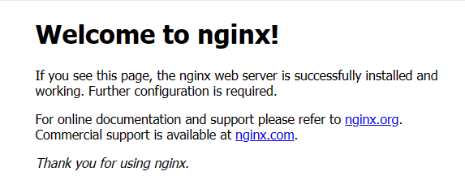

[[toc]]

# Nginx

[官网](https://nginx.org/en/index.html)

`nginx`是一款轻量级的Web服务器/反向代理服务器, 其特点是占有内存少，并发能力强

## 安装

以`Windows`为例从官网上下载[windows压缩包](https://nginx.org/download/nginx-1.24.0.zip), 解压缩, 然后双击运行`nginx.exe`或者使用`start nginx`命令启动

>   将`nginx`的安装目录设置到环境变量中则可以在任何地方启动

 

然后打开浏览器访问`localhost:80`会看到默认的`nginx`欢迎页面, 如下则表示`nginx`已经安装成功了

 

## 常用命令

```sh
nginx -h # 显示帮助
nginx -v # 显示版本
nginx -V # 显示更多的信息
start nginx # 启动 nginx
nginx -t # 测试配置
nginx -T # 测试配置并将验证后的配置打印到屏幕上


nginx -s [信号]
# -s 标记向 nginx master 进程发送信号, 可以发送 stop, quit, reload 和 reopen 等信号
# stop 信号可立即停止 nginx 进程
# quit 信号会在完成当前正在处理的请求后停止 nginx 进程
# reload 信号可重新加载配置
# reopen 信号指示 nginx 重新打开日志文件
```

## 文件目录

以`window`为例

```sh
├─conf # 所有配置文件的目录
├─contrib
├─docs # 文档
├─html # 默认欢迎页面
├─logs # nginx 每次的访问这里会保存相关的日志
└─temp # 临时文件
```

## 默认配置

`nginx`的默认配置在`conf/nginx.conf`下面, 具体功能如下: 

```nginx
worker_processes  1;  # 定义工作进程数量为1, 即单进程模式
  
events {  # 定义事件循环的配置
    worker_connections  1024;  # 每个工作进程允许的最大连接数为1024
}  
  
http {  # 开始定义HTTP服务器的配置
    include       mime.types;  # 引入mime.types文件, 该配置就是用于定义文件类型和相应的MIME类型
    default_type  application/octet-stream;  # 默认的MIME类型, 如果未定义则为"application/octet-stream"
    sendfile        on;  # 开启sendfile功能, 用于快速传输文件
    keepalive_timeout  65;  # 保持连接的超时时间为65秒
  
    server {  # 开始定义一个服务器块
        listen       8080;  # 服务器监听的端口号为8080
        server_name  localhost;  # 服务器的名字或域名, 此处为localhost
  
        location / {  # 定义一个位置块, 匹配根路径"/"
            root   html;  # 设置根目录为"html"
            index  index.html index.htm;  # 设置默认的索引文件为"index.html"和"index.htm"
        }  
  
        error_page   500 502 503 504  /50x.html;  # 定义错误页面, 当出现500、502、503、504错误时, 返回"/50x.html"页面
        location = /50x.html {  # 定义一个位置块, 匹配路径"/50x.html"
            root   html;  # 设置该位置的根目录为"html"
        }  
    }  
}
```

## location

###  root 与 alias

`root`和`alias`在替换url时是有点不同的, 当`location`命中后

-   如果是`root`, 会把请求`url`的 `[IP|域名]+端口`替换为`root`指定的目录, 然后拼接`index`访问资源

-   如果是`alias`, 会把请求`url`的`[IP|域名]+端口+匹配到的路径`替换为`alias`指定的目录, 然后拼接`index`访问资源

```nginx
worker_processes  1;
  
events {
    worker_connections  1024;
}  
  
http {
    include       mime.types;
    default_type  application/octet-stream;
    sendfile        on;
    keepalive_timeout  65;
  
    server {  # 开始定义一个服务器块
        listen       8080;  # 服务器监听的端口号为8080
        server_name  localhost;  # 服务器的名字或域名, 此处为localhost
  
    		# 访问 localhost:8080/ 就等于访问 ./html/index.html
        location / {
            root   html; # 表示当前的 html 目录
            index  index.html index.htm;
        }  
  
        # 访问 localhost:8080/test 就等于访问 C:/Users/33153/Desktop/test-html/index.html
        location /test {
            alias   C:/Users/33153/Desktop/test-html; # 注意: 这里用的是 alias
            index  index.html;
        }
  
        error_page   500 502 503 504  /50x.html;
        location = /50x.html {
            root   html;
        }  
    }  
}
```

#### root

以请求`http://localhost:8080/test-html`为例, `location`配置如下:

```nginx
location /test-html {
    root   C:/Users/33153/Desktop;
    index  index.html;
}  
```

匹配到`/test-html`, `[IP|域名]+端口`替换为`root`指定的目录, 即`url`中的`http://localhost:8080`被替换为了`C:/Users/33153/Desktop`, 然后拼接上`index`指定的文件地址, 所以实际访问的路径为`C:/Users/33153/Desktop/test-html/index.html`

如果是以下的配置

```nginx
location /test-html/foo {
    root   C:/Users/33153/Desktop;
    index  index.html;
}
```

访问`http://localhost:8080/test-html`则相当于访问`C:/Users/33153/Desktop/test-html/foo/index.html`

#### alias

以请求`http://localhost:8080/test-html`为例, `location`配置如下:

```nginx
location /test-html {
    alias   C:/Users/33153/Desktop/test-html/nginx-test;
    index  index.html;
}
```

匹配到`/test-html`, `[IP|域名]+端口+匹配到的路径`替换为`alias`指定的目录, 即`url`中的`http://localhost:8080/test-html`被替换为了`C:/Users/33153/Desktop/test-html/nginx-test`, 然后拼接上`index`指定的文件地址, 所以实际访问的路径为`C:/Users/33153/Desktop/test-html/nginx-test/index.html`

##### alias指定文件

如下配置

```nginx
location /test-html/index.html {
    alias   C:/Users/33153/Desktop/test-html/nginx-test/index.html;
}
```

访问`http://localhost:8080/test-html/index.html`则相当于访问`C:/Users/33153/Desktop/test-html/nginx-test/index.html`

### location的最左匹配原则

`location`会从`url`最左边的路径匹配，如果一致则命中该`location`, 只有**中间匹配到不会命中**

```nginx
location /foo/bar {
    root   html;
    index  index.html;
}
```

上面的规则只会匹配 `/foo` 或者 `/foo/bar`, 如果输入`/bar`也不算匹配

### 末尾/用法

#### location url 末尾/

`localhost/foo/bar` 表示把`bar`当成一个**文件**,想要访问`bar`文件

`localhost/foo/bar`表示把`bar`当成一个**目录**, 想要访问`bar`目录下`index`指定的文件

```nginx
# 能 /foo 也能匹配 /foo/
location /foo {
    root html;
    index index.html;
}

# 只能匹配 /foo/
location /foo/ {
    root html;
    index index.html;
}
```

#### root 指定目录末尾/

```nginx
location /foo {
    root /home/bar; # 表示把 bar 当成目录或者文件
    index index.html;
}

location /foo {
    root /home/bar/; # 表示只把 bar 当成目录
    index index.html;
}
```

>   `root`后面指定的都应该是目录 (`alias`有种特殊情况除外)

#### 总结

-   `url`末尾不加`/`, 如果需要带`/`时依靠`nginx`自动重定向加`/`

-   `location` 路径不加`/`, 这样末尾有无`/`的`url`都能匹配到

-   `root`或者`alias`指定的目录后面加`/`, 明确表示`root`指定的是目录, 增强配置的可读性

## nginx变量

`nginx`中的变量大全如下: 

```nginx
$args                    # 请求中的参数值
$query_string            # 同 $args
$arg_NAME                # GET请求中NAME的值
$is_args                 # 如果请求中有参数, 值为"?", 否则为空字符串
$uri                     # 请求中的当前URI(不带请求参数, 参数位于$args), 可以不同于浏览器传递的$request_uri的值, 它可以通过内部重定向, 或者使用index指令进行修改, $uri不包含主机名, 如"/foo/bar.html"。
$document_uri            # 同 $uri
$document_root           # 当前请求的文档根目录或别名
$host                    # 优先级：HTTP请求行的主机名>"HOST"请求头字段>符合请求的服务器名.请求中的主机头字段, 如果请求中的主机头不可用, 则为服务器处理请求的服务器名称
$hostname                # 主机名
$https                   # 如果开启了SSL安全模式, 值为"on", 否则为空字符串。
$binary_remote_addr      # 客户端地址的二进制形式, 固定长度为4个字节
$body_bytes_sent         # 传输给客户端的字节数, 响应头不计算在内；这个变量和Apache的mod_log_config模块中的"%B"参数保持兼容
$bytes_sent              # 传输给客户端的字节数
$connection              # TCP连接的序列号
$connection_requests     # TCP连接当前的请求数量
$content_length          # "Content-Length" 请求头字段
$content_type            # "Content-Type" 请求头字段
$cookie_name             # cookie名称
$limit_rate              # 用于设置响应的速度限制
$msec                    # 当前的Unix时间戳
$nginx_version           # nginx版本
$pid                     # 工作进程的PID
$pipe                    # 如果请求来自管道通信, 值为"p", 否则为"."
$proxy_protocol_addr     # 获取代理访问服务器的客户端地址, 如果是直接访问, 该值为空字符串
$realpath_root           # 当前请求的文档根目录或别名的真实路径, 会将所有符号连接转换为真实路径
$remote_addr             # 客户端地址
$remote_port             # 客户端端口
$remote_user             # 用于HTTP基础认证服务的用户名
$request                 # 代表客户端的请求地址
$request_body            # 客户端的请求主体：此变量可在location中使用, 将请求主体通过proxy_pass, fastcgi_pass, uwsgi_pass和scgi_pass传递给下一级的代理服务器
$request_body_file       # 将客户端请求主体保存在临时文件中。文件处理结束后, 此文件需删除。如果需要之一开启此功能, 需要设置client_body_in_file_only。如果将次文件传 递给后端的代理服务器, 需要禁用request body, 即设置proxy_pass_request_body off, fastcgi_pass_request_body off, uwsgi_pass_request_body off, or scgi_pass_request_body off
$request_completion      # 如果请求成功, 值为"OK", 如果请求未完成或者请求不是一个范围请求的最后一部分, 则为空
$request_filename        # 当前连接请求的文件路径, 由root或alias指令与URI请求生成
$request_length          # 请求的长度 (包括请求的地址, http请求头和请求主体)
$request_method          # HTTP请求方法, 通常为"GET"或"POST"
$request_time            # 处理客户端请求使用的时间,单位为秒, 精度毫秒； 从读入客户端的第一个字节开始, 直到把最后一个字符发送给客户端后进行日志写入为止。
$request_uri             # 这个变量等于包含一些客户端请求参数的原始URI, 它无法修改, 请查看$uri更改或重写URI, 不包含主机名, 例如："/cnphp/test.php?arg=freemouse"
$scheme                  # 请求使用的Web协议, "http" 或 "https"
$server_addr             # 服务器端地址, 需要注意的是：为了避免访问linux系统内核, 应将ip地址提前设置在配置文件中
$server_name             # 服务器名
$server_port             # 服务器端口
$server_protocol         # 服务器的HTTP版本, 通常为 "HTTP/1.0" 或 "HTTP/1.1"
$status                  # HTTP响应代码
$time_iso8601            # 服务器时间的ISO 8610格式
$time_local              # 服务器时间（LOG Format 格式）
$cookie_NAME             # 客户端请求Header头中的cookie变量, 前缀"$cookie_"加上cookie名称的变量, 该变量的值即为cookie名称的值
$http_NAME               # 匹配任意请求头字段；变量名中的后半部分NAME可以替换成任意请求头字段, 如在配置文件中需要获取http请求头："Accept-Language", $http_accept_language即可
$http_cookie
$http_host               # 请求地址, 即浏览器中你输入的地址（IP或域名）
$http_referer            # url跳转来源,用来记录从那个页面链接访问过来的
$http_user_agent         # 用户终端浏览器等信息
$http_x_forwarded_for
$sent_http_NAME          # 可以设置任意http响应头字段；变量名中的后半部分NAME可以替换成任意响应头字段, 如需要设置响应头Content-length, $sent_http_content_length即可
# $sent_http_cache_control
# $sent_http_connection
# $sent_http_content_type
# $sent_http_keep_alive
# $sent_http_last_modified
# $sent_http_location
# $sent_http_transfer_encoding
```

## nginx案例

### 文件服务器

在浏览器实现查看图片或者下载文件的功能

```nginx
server {  
    # 使用SSL加密进行通信  
    # listen 8888 ssl;
    listen 8888;
  
    server_name localhost;  
  
    # 指定SSL证书的路径, 用于SSL/TLS加密通信  
    # ssl_certificate "/ssl/test.pem";  
      
    # 指定SSL证书的私钥的路径, 用于解密SSL/TLS通信  
    # ssl_certificate_key "/ssl/test.pem.key";  
  
    location /images {  
        root C:/Users/33153/Desktop; 
    }  
  
  	location /images-alias {
        alias C:/Users/33153/Desktop/images;
    }
}
```

### 通过参数是否下载文件

```nginx
location ~* \.(png|jpg|jpeg|gif)$ {
    add_header Access-Control-Allow-Origin "*"; # 解决跨域调用问题
    if ($args = "down") { # nginx的if语句
        add_header Access-Control-Allow-Origin "*"; # 不加这一行前面的 add_header 莫名奇妙会消失
        add_header content-disposition "attachment";
    }
}
```

正常访问图片会正常显示, 当加上`?down`会弹出下载框
