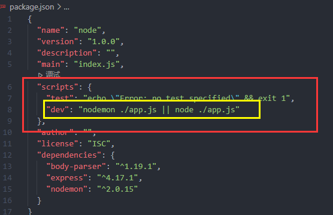
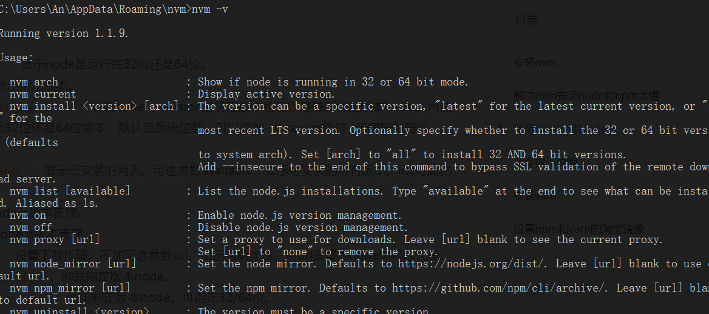
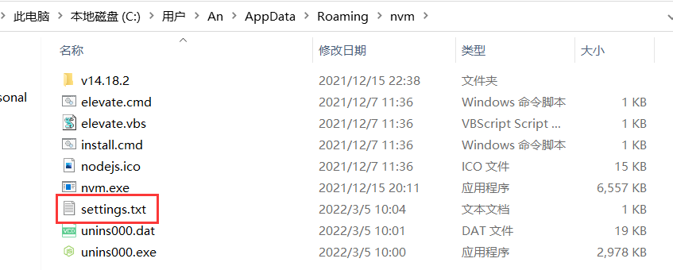
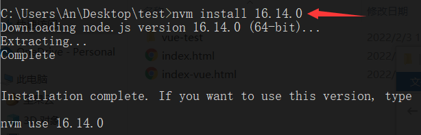
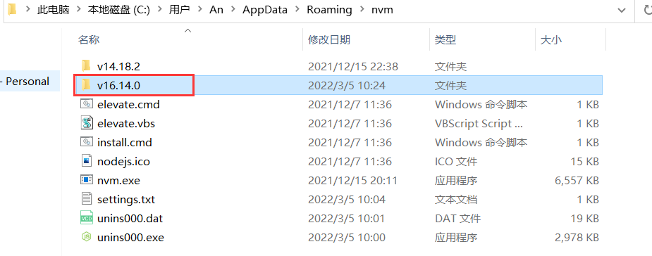
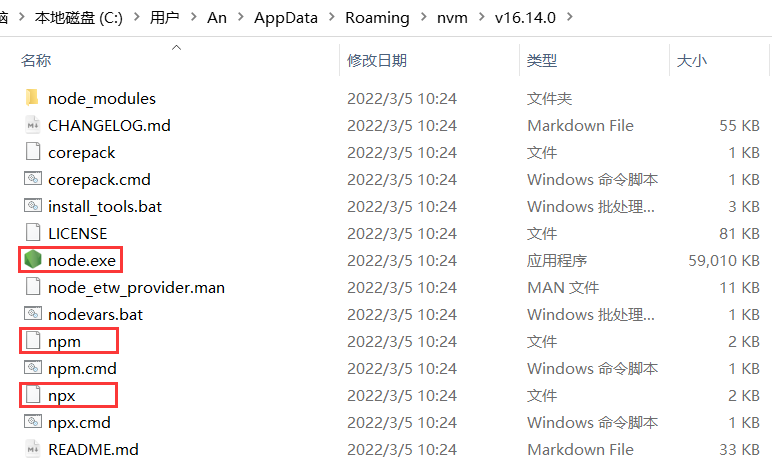
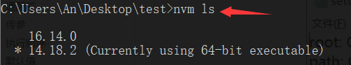
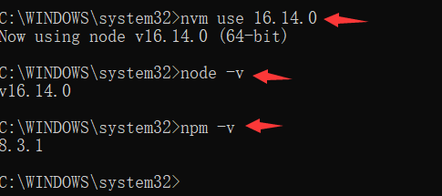

# npm

[[toc]]

## npm的介绍

[npm](https://www.npmjs.com ) 是 Node.js 的包管理工具, 用来安装各种 Node.js 的第三方库

[官方教程](https://docs.npmjs.com/getting-started/)

[npm cli](https://docs.npmjs.com/cli/v9/commands/)

[阮一峰教程](http://www.ruanyifeng.com/blog/2016/10/npm_scripts.html )

## 创建包管理文件

相关属性详解见: [pageage.json](https://docs.npmjs.com/cli/v9/configuring-npm/package-json)

`npm init` 命令 初始化一个包管理文件

`npm init -y`命令 初始化全是默认值的包(括号里的就是默认值)

```sh
# code xxx 使用VS Code打开指定的目录需要将VS Code 安装目录添加到系统变量 path 中
mkdir myproject && cd myproject && npm init -y && touch index.ts && code .
```

```shell
package name: (testnpm) 包名字
version: (1.0.0) 版本号
description: 描述
entry point: (index.js) 入口js文件
test command: 测试命令
git repository: 代码需要git仓库管理的话加上该仓库地址
keywords: 关键字
author: 开发者
license: (ISC) 授权协议
Is this OK? (yes) 再次确认  yes 
```

得到 `package.json` 文件, 大致内容如下: 

```json
{
  "name": "yang",
  "version": "1.0.0",
  "description": "我的第一个NPM项目",
  "main": "index.js",
  "scripts": { // 运行脚本
      "test": "echo \"Error: no test specified\" && exit 1",
      "yjb": "index.js"
  },
  "author": "yjb",
  "license": "ISC",
  "dependencies": { // 运行依赖, 依赖的项该是正常运行该包时所需要的依赖项
      "excel": "^1.0.1"
  },
  "devDependencies":{ // 开发依赖, 开发的时候需要的依赖项

  }
}
```

## npm常用命令

命令行输入`npm help npm `可以npm本地文档, 使用`npm help xxx`则是打开对应命令的文档

### 常用命令

```shell
npm install # 安装项目的所有依赖， install 简写 i
npm install 包名 --global # 全局安装, --global 简写 -g
npm install 包名 --save # 安装依赖到 dependencies, --save 简写 -S
npm install 包名 --save-dev # 安装依赖到 devDependencies, --save-dev 简写 -D
npm install 包名@版本号 # 安装指定版本号的包
npm install 包名1 包名2 包名3 # 一次性安装多个包

npm uninstall 包名 # 卸载当前项目的包
npm uninstall 包名 -g # 卸载全局安装的包

npm update 包名名 # 更新当前项目包
npm update 包名名 -g # 更新全局包

npm list # 查看当前项目安装的包
npm list -g # 查看全局安装的包

npm prune # 清除没有使用到的包
```

### 查看命令

```shell
npm root # 查看项目中包名所在的目录
npm root -g # 查看全局安装的包名所在目录

npm -v # 查看npm版本
npm version # 查看更详细的版本信息

npm view 包名 version # 查看包的最新版本
npm view 包名 versions # 查看包的历史版本

npm info 包名 # 查看包的更多信息

npm config list # 查看npm配置
npm config edit # 编辑npm配置
npm config ls -l # 查看所有的npm默认配置
```

### 基础配置

npm的基础常用配置如下: 

```json
{
  "name": "@anlib/sqlite-orm", // 项目名称
  "private": true, // 是否是私有包, 一般用于 monorepo 项目
  "version": "0.0.5", // 版本
  "type": "module", // module | commonjs
  "types": "lib/src/index.d.ts", // 类型文件
  "description": "一个简单的 sqlite orm", // 项目描述
  "main": "lib/bundle.esm.js", // Commonjs 模块入口(require 引入)
  "module": "lib/bundle.esm.js", // ECMA Script 模块入口(import 引入)
  "unpkg": "lib/bundle.browser.js", // 直接 script 标签的 src 引入
  "homepage": "https://github.com/yang-Ann/sqlite-orm", // 主页地址
  "bugs": { // issues 地址
    "url": "https://github.com/yang-Ann/sqlite-orm/issues"
  },
  "keywords": [ // 发布到 npm 之后可以搜索的关键字
    "sqlite",
    "orm"
  ],
  "author": "An <331536495@qq.com> (https://ann-yang.gitee.io/note-sites/)", // 作者信息
  "repository": { // 源代码仓库
    "type": "git",
    "url": "https://github.com/sqlite-orm"
  },
  "files": [ // 这里声明的文件会被上传到 npm 
    "lib"
  ],
  "license": "MIT", // 开源协议
  "scripts": { // 命令
    "build": "rollup -c ./rollup.config.ts",
    "dev": "node --loader ts-node/esm ./src/index.ts",
    "dev:nodemon": "nodemon --watch ./dist ./dist/index.js",
    "lint": "eslint src --ext .ts",
    "prettier": "prettier --write src",
    "release": "bumpp -r",
    "test": "vitest ./src/test/index.test.ts"
  },
  "dependencies": {}, // 开发依赖
  "devDependencies": {} // 生产依赖
}
```

### 配置淘宝镜像

使用 npm 安装第三方库需要访问国外的网络, 默认为`https://registry.npmjs.org/`会比较慢, 可以配置[淘宝镜像](https://npmmirror.com/)

```shell
# 查看源(默认为 https://registry.npmjs.org/)
npm get registry

# 切换源(推荐)
npm config set https://registry.npmmirror.com
```

也可以通过`C:/Users/用户名/.npmrc`文件添加镜像源, 如下:

```sh
registry=https://registry.npmmirror.com # npm 淘宝源
disturl=https://registry.npmmirror.com/node
electron_mirror=https://registry.npmmirror.com/electron/
```

> `cnpm`**不生成 lock 文件, 也不会识别项目中的lock文件**，如果是多人开发，建议使用`npm`或者其他包管理工具安装插件

>   也可以使用[`nrm`](https://www.npmjs.com/package/nrm)来管理npm镜像配置

### 其他资源镜像

配置到`.npmrc`中

```sh
# https://github.com/cnpm/binary-mirror-config/blob/master/package.json#L53
NODEJS_ORG_MIRROR="https://cdn.npmmirror.com/binaries/node"
NVM_NODEJS_ORG_MIRROR="https://cdn.npmmirror.com/binaries/node"
PHANTOMJS_CDNURL="https://cdn.npmmirror.com/binaries/phantomjs"
CHROMEDRIVER_CDNURL="https://cdn.npmmirror.com/binaries/chromedriver"
OPERADRIVER_CDNURL="https://cdn.npmmirror.com/binaries/operadriver"
ELECTRON_MIRROR="https://cdn.npmmirror.com/binaries/electron/"
ELECTRON_BUILDER_BINARIES_MIRROR="https://cdn.npmmirror.com/binaries/electron-builder-binaries/"
SASS_BINARY_SITE="https://cdn.npmmirror.com/binaries/node-sass"
SWC_BINARY_SITE="https://cdn.npmmirror.com/binaries/node-swc"
NWJS_URLBASE="https://cdn.npmmirror.com/binaries/nwjs/v"
PUPPETEER_DOWNLOAD_HOST="https://cdn.npmmirror.com/binaries"
SENTRYCLI_CDNURL="https://cdn.npmmirror.com/binaries/sentry-cli"
SAUCECTL_INSTALL_BINARY_MIRROR="https://cdn.npmmirror.com/binaries/saucectl"
npm_config_sharp_binary_host="https://cdn.npmmirror.com/binaries/sharp"
npm_config_sharp_libvips_binary_host="https://cdn.npmmirror.com/binaries/sharp-libvips"
npm_config_robotjs_binary_host="https://cdn.npmmirror.com/binaries/robotj"

# For Cypress >=10.6.0, https://docs.cypress.io/guides/references/changelog#10-6-0
CYPRESS_DOWNLOAD_PATH_TEMPLATE='https://cdn.npmmirror.com/binaries/cypress/${version}/${platform}-${arch}/cypress.zip'
```

## CMD窗口

### 常用的命令

```shell
dir: 列出当前目录下的所有文件
md 目录名: 创建一个文件夹
rd 目录名: 删除一个文件夹

盘符: : 进入指定的盘

cd . : 进入当前目录
cd .. : 返回上一级目录
cd \ : 进入当前的根目录下
cd /d D:/xxx/xxx 进去这个指定的目录

cls: 请空屏幕的命令
直接在某个文件夹地址栏输入 cmd 直接打开当前目录下的 cmd 窗口

cmd /? : 查看cmd命令的参数
命令 /? : 对应的命令帮助
ipconfig : 查看自己的ip信息
ping ip地址: 检查本机到指定ip地址的连通性(加上 -t 就会一直 ping)
netstat -ano : 查看网络连接、状态以及对应的进程id
tracert : 也被称为Windows路由跟踪实用程序, 在命令提示符（cmd）中使用tracert命令可以用于确定IP数据包访问目标时所选择的路径
    例如: tracert www.baidu.com
```

### 环境变量(window系统变量)

- path (路径变量)

  ```
  我们在命令行窗口打开一个文件, 或是调用一个程序时, 
  系统会首先在当前目录下寻找文件程序, 如果找到则直接打开,
  如果没有找到则会依次到环境变量 path 的路径中寻找, 直到找到为之
  如果没有找到则报错, 可以将一些经常需要访问的程序和文件的路径添加到 path 中,
  这样我们就可以在任意位置来访问这些文件和程序了
  ```

## npm script

### 使用**npm script**

npm 允许在`package.json`文件里面，使用`scripts`字段定义脚本命令

 

`scripts`字段是一个对象, 它的每一个属性，对应一段脚本

比如，`dev`命令对应的脚本就是`nodemon ./app.js || node ./app.js`

```sh
$ npm run dev
// 等同于执行
$ nodemon ./app.js || node ./app.js
```

> script 里还可以使用`&&`具体效果和js中的逻辑运算符一样

这些定义在`package.json`里面的脚本，就称为 npm 脚本它的优点很多:

- 项目的相关脚本，可以集中在一个地方
- 不同项目的脚本命令，只要功能相同，就可以有同样的对外接口用户不需要知道怎么测试你的项目，只要运行`npm run xxx`即可
- 可以利用 npm 提供的很多辅助功能

查看当前项目的所有 npm 脚本命令，可以使用不带任何参数的`npm run`命令

```sh
$ npm run 
```

### 原理

npm 脚本的原理非常简单, 每当执行`npm run`，就会自动新建一个 [Shell](https://zhuanlan.zhihu.com/p/56532223)，在这个 Shell 里面执行指定的脚本命

令因此，只要是 Shell（一般是 [Bash](https://baike.baidu.com/item/Bash)）可以运行的命令，就可以写在 npm 脚本里面

比较特别的是，`npm run`新建的这个 Shell，会将当前目录的`node_modules/.bin`子目录加入`PATH`变量，

执行结束后，再将`PATH`变量恢复原样

这意味着，当前目录的`node_modules/.bin`子目录里面的所有脚本，都可以直接用脚本名调用，而不必加上路

径比如，当前项目的依赖里面有**nodemon**，只要直接写`nodemon xxx`就可以了

```json
"dev": "nodemon ./app.js"
```

而不用写成下面这样

```json
"dev": "./node_modules/.bin/nodemon ./app.js"
```

由于 npm 脚本的唯一要求就是可以在 Shell 执行, 因此它不一定是 Node 脚本, 任何可执行文件都可以写在里面

npm 脚本的退出码, 也遵守 [Shell 脚本规则](https://blog.csdn.net/qq_41891805/article/details/104490404)如果退出码不是`0`，npm 就认为这个脚本执行失败

### 通配符

由于 npm 脚本就是 Shell 脚本，因为可以使用 Shell 通配符

```json
"lint": "jshint *.js"
"lint": "jshint **/*.js"
```

上面代码中，`*`表示任意文件名，`**`表示任意一层子目录

如果要将通配符传入原始命令, 防止被 Shell 转义, 要将星号转义

```json
"test": "tap test/\*.js"
```

### 传参

向 npm 脚本传入参数，要使用`--`标明

```sh
$ npm run lint --  --reporter checkstyle > checkstyle.xml
```

也可以在`package.json`里面再封装一个命令

```json
"lint": "jshint **.js",
"lint:checkstyle": "npm run lint -- --reporter checkstyle > checkstyle.xml"
```

### 执行顺序

如果 npm 脚本里面需要执行多个任务，那么需要明确它们的执行顺序

如果是并行执行（即同时的平行执行），可以使用`|`符号

```sh
$ npm run xxx | npm run xxx
```

### 默认值

一般来说 npm 脚本由用户提供, 但是 npm 对两个脚本提供了默认值, 也就是说这两个脚本命令不用定义，就可以直接使用

```json
"start": "node server.js"，
"install": "node-gyp rebuild"
```

上面代码中, `npm run start`的默认值是`node server.js`, 前提是项目根目录下有`server.js`这个脚

本, `npm run install`的默认值是`node-gyp rebuild`, 前提是项目根目录下有`binding.gyp`文件

### 钩子

npm 脚本有`pre`和`post`两个钩子, 举例来说，`build`脚本命令的钩子就是`prebuild`和`postbuild`

```json
"prebuild": "echo build命令之前构子",
"build": "node -v",
"postbuild": "echo build命令之后构子"
```

用户执行`npm run build`的时候，会自动按照下面的顺序执行

```sh
npm run prebuild && npm run build && npm run postbuild
```

> 因此，可以在这两个钩子里面，完成一些准备工作和清理工作

npm 默认提供下面这些钩子:

- prepublish，postpublish
- preinstall，postinstall
- preuninstall，postuninstall
- preversion，postversion
- pretest，posttest
- prestop，poststop
- prestart，poststart
- prerestart，postrestart

自定义的脚本命令也可以加上`pre`和`post`钩子比如，`myscript`这个脚本命令，也有`premyscript`和

`postmyscript`钩子不过，双重的`pre`和`post`无效，比如`prepretest`和`postposttest`是无效的

npm 提供一个`npm_lifecycle_event`变量，返回当前正在运行的脚本名称, 可以利用这个变量，在同一个脚本

文件里面，为不同的`npm scripts`命令编写代码:

```js
const TARGET = process.env.npm_lifecycle_event;
console.log(`执行的命令是: npm run ${TARGET}`,);
```

> 一定要使用`npm run xxx`的形式才有`process.env.npm_lifecycle_event`变量的值

### 变量

npm 脚本有一个非常强大的功能，就是可以使用 npm 的内部变量

通过`npm_package_xxx`, npm 脚本可以拿到`package.json`里面的字段, 例如: 下面是一个`package.json`

```json
{
  "name": "foo",
  "version": "1.0.0",
  "description": "",
  "main": "index.js",
  "scripts": {
    "view": "node ./view.js",
  },
}
```

那么，变量`npm_package_name`返回`node`，变量`npm_package_main`返回`index.js`

```js
console.log(process.env.npm_package_name); // foo
console.log(process.env.npm_package_main); // index.js
```

上面代码中通过环境变量`process.env`对象，拿到`package.json`的字段值

> 如果是 Bash 脚本，可以用`$npm_package_name`和`$npm_package_version`取到这两个值

`npm_package_`前缀也支持嵌套的`package.json`字段

```json
...
"myObj": {
    "myName": "zhangsan"
}
...
```

上面的package.json文件中, `myObj`字段的`myName`属性，可以通过`npm_package_myObj_myName`取到

`env`命令可以列出所有环境变量

```sh
npm run env
```

## npx

`npx`是 `npm5.2.0`版本新增的一个工具包，定义为`npm`包的执行者，相比`npm`，`npx` **会自动安装依赖包并执行某个命令, 用完以后就会删除**

### npx查找原理

`npx` 会在当前目录下的`./node_modules/.bin`里去查找是否有可执行的命令，没有找到的话再从全局里查找是否有安装对应的模块，全局也没有的话就会自动下载对应的模块, `npx`经常用在一些`cli`, `校验工具`等, 一般只会执行一次的地方, 如: `npx create-react-app xxx`, `npx vue create xxx`,`npx eslint`

## .npmrc

[npmrc](https://docs.npmjs.com/cli/v9/using-npm/config#npmrc-files)

`.npmrc`文件可以修改`npm`项目级别的配置, 例如, 下面是一个典型的`pnpm monorepo`项目:

```sh
# 镜像修改
registry=https://registry.npmjs.org/
# 发布包是不检查 git 是否提交
git-checks=false
# 指定包为公开的包, 常用于作用域包, 如: @vue/router, @react/router等
access=public
# 支持配置某些包的镜像
chromedriver_cdnurl="https://npmmirror.com/mirrors/chromedriver"
electron_mirror="https://npm.taobao.org/mirrors/electron/"

##### 以下是 pnpm 支持的配置
# 禁用严格依赖
strict-peer-dependencies=false
# pnpm i 不安装工作区下的所有包的依赖
recursive-install=false
# pnpm i 不自动依赖 workspace 里的包, 仍然可以使用 workspace: 依赖
link-workspace-packages=false
```

### 优先级

`.npmrc`的配置存在优先级，当我们在多个配置文件中定义相同的键时，`npm`将按照以下顺序查找和应用配置：

1.  项目根目录下的`.npmrc`文件
2.  用户主目录下的`.npmrc`文件
3.  `npm`内置的默认配置

可以通过`npm config list`来查看

## npm 开发工具包

[官方教程](https://docs.npmjs.com/packages-and-modules/contributing-packages-to-the-registry)

### npm 本地开发

初始化`package.json`

```sh
npm init # 正常初始化

# 创建带命名空间的包, 例如: @vue/cli
mkdir project
cd project
npm init --scoped=@myName # 对应的包名则叫 @myName/project, 会自动拼接
```

添加`package.json`中`bin`字段可以添加可执行文件安装到路径中, `key`表示命令, `value`命令执行的文件, 例如:

```json
// package.json

"bin": {
    // 对应 npm create 命令, 执行的文件是 ./dist/bin/index.js
    "create": "./dist/bin/index.js"
},
```

需要注意的是被执行的文件头部必须添加特殊说明使用node解释器去执行:

```js
// 必须添加如下的
#! /usr/bin/env node

// ...
```

```sh
npm link # 将本地包链接到全局(调试全局命令的包)
npm unlink xxx # 取消链接
```

通过`npm ls -g`可以查看本地链接的包, 如下: 

```sh
$ npm ls -g
C:\Program Files\nodejs -> .\
├── @anlib/cli@0.0.1 -> .\D:\project\cli
├── corepack@0.12.1
├── front-frame-cli@0.1.2 -> .\D:\project\front-frame-cli
├── npm@8.15.0
├── pnpm@7.25.1
├── typescript@4.9.4
└── yarn@1.22.19
```

### npm发布

```sh
npm pack # 本地模拟打包发布的产物
npm adduser # 添加用户帐户
npm login # 登录
npm logout # 登出
npm whoami # 查看当前登录用户
npm version patch # 自动修改版本并 commit(支持很多的参数可见 npm version -h)
npm publish # 发布
npm unpublish 包名 -f # 删除一个包
npm unpublish 包名@0.0.1 -f # 删除指定版本的包
```

如果配置了淘宝源则需要修改为官方源`npm config set registry https://registry.npmjs.org`, 然后重新安装依赖再发布

>   如果报`TLS 1.2`错误需要将`.npmrc`的`registry`从`http`修改为`https`

#### 发布命名空间的包

>   使用命名空间的包发布的话还需要在npm上新建一个对应命名空间的[组织](https://www.npmjs.com/org/create)

```sh
npm publish --access public # 发布私有包
npm access ls-packages # 查看当前用户的组织
```

可以配置`npm`

```sh
npm config set access public
```

或者在`package.json`添加如下的配置:

```json
"publishConfig": {
  "access": "public",
  "registry": "https://registry.npmjs.org/"
}
```

## npm create 

`npm create xxx`是很常见的一个命令, 常常被用于创建各种脚手架, 以`npm create vite`为例, 具体的执行流程如下: 

-   命令行执行`npm create vite`会先去找`create-vite`这个包
-   执行`npm exec create-vite `命令
-   执行`create-vite`包里的`create-vite `命令(由`package.json`里的`bin`字段定义)

## npm init

[`init`](https://docs.npmjs.com/cli/v6/commands/npm-init#examples)命令如果后面添加了参数的话, 将转换为相应的`npx`操作, 如下所示

-   `npm init foo` -> `npx create-foo`
-   `npm init @usr/foo` -> `npx @usr/create-foo`
-   `npm init @usr` -> `npx @usr/create`

## npm 第三方库

[awesome-nodejs](https://github.com/sindresorhus/awesome-nodejs)

**前端工具包**

|         包名          |                             描述                             |
| :-------------------: | :----------------------------------------------------------: |
|         serve         |          快速的为一个文件夹生成一个静态的 http 服务          |
|         axios         |                          网络请求库                          |
|        ESLint         |                         代码检查工具                         |
|       prettier        |                       代码风格修正工具                       |
|        nanoid         |                    可以快速生成唯一的 id                     |
|        lodash         |                    JavaScript 实用函数库                     |
|         ramda         |                    JavaScript 实用函数库                     |
|         dayjs         |                          日期处理库                          |
|        mathjs         |                            数学库                            |
|     jsonwebtoken      |                   根据给定的数据生成 token                   |
|        cheerio        |        基于JQuery的node模块, 可用于web爬取, 解析html         |
|         jsdom         |         文档对象模型模拟器(一般都是配合cheerio使用)          |
|       puppeteer       | 生成页面 PDF, 抓取 SPA, 自动提交表单, 进行 UI 测试, 键盘输入等, 功能很强大<br />可以配合 Headless Recorder 插件进行录制操作 |
|        fabric         |                           canvas库                           |
|         xlsx          |                       读取和写入excel                        |
| javascript-obfuscator |                          js代码混淆                          |
|      markdown-it      |                         markdown解析                         |
|     monaco-editor     |                      vscode web版编辑器                      |
|        qrcode         |                          生成二维码                          |
|    relationship.js    |                         亲戚关系计算                         |
|       js-base64       |                         base64编解码                         |
|       jsencrypt       |                          rsa加解密                           |
|       nprogress       |                        页面顶部进度条                        |
|       validator       |                          字符串校验                          |
|         mitt          |                     最小的事件发射器实现                     |
|        croner         |                 无任何依赖的`cron`表达式实现                 |
|        url解析        |                          url-parse                           |

**服务端工具包**

|                  包名                  |                             作用                             |
| :------------------------------------: | :----------------------------------------------------------: |
|                  xlsx                  |                       读取和写入excel                        |
|                fs-extra                |                           封装了fs                           |
|              body-parser               |               解析 post 请求体数据到 req.body                |
|                 bcrypt                 |                           密码加密                           |
|              compression               | 可以通过压缩大大减小响应体的大小，从而提高 Web 应用程序的速度 |
|      connect-history-api-fallback      |                   express中适配history路由                   |
|                 axios                  |                    网络请求库(前后端同构)                    |
|                request                 |                        node网络请求库                        |
|                  pkg                   |                将 node 文件打包成 二进制文件                 |
|                forever                 |                      后台持续运行 node                       |
|                  pm2                   |              后台持续运行 node, 比 forever 强大              |
| winston<br />winston-daily-rotate-file |                日志库<br />根据日期分割文件名                |
|                 log4js                 |                            日志库                            |
|                textract                |             可以读取 DOCX, PDF, HTML, PPTX等数据             |
|                pdf2json                |                        读取 PDF 数据                         |
|                 mysql                  |                           mysql包                            |
|                mongobd                 |                          mangodb包                           |
|                  knex                  |                      sql语句查询构建器                       |
|                exceljs                 |         node操作excel工具库, 支持excel的几乎全部操作         |
|               node-xlsx                |                     node读取和写入excel                      |
|                   ws                   |                        用于WebSocket                         |
|               cross-env                |              使脚本能够跨平台设置和使用环境变量              |
|                  glob                  |                  使用 shell 的模式匹配文件                   |
|               fast-glob                |                     根据 global 遍历文件                     |
|                walkdir                 |                          遍历目录树                          |
|                piscina                 |                          多线程实现                          |
|               node-fetch               |                      node中的fetch实现                       |
|                  tsx                   |                       直接运行 ts文件                        |
|                  open                  |                可以编程的打开图片, 网站, 应用                |
|                js-yaml                 |                      js实现解析yaml文件                      |
|                 dotenv                 |        解析`.env`文件内容到环境变量(`process.env`)中         |
|              tesseract.js              | 包装[tesseract](https://github.com/tesseract-ocr/tesseract)的js库 |
|                 alasql                 |                        内存sql数据库                         |
|                 sql.js                 |                         sqlite操作库                         |
|             better-sqlite3             |                         sqlite操作库                         |
|              drizzle-orm               |                           sql rom                            |
|               mime-types               |                        解析MIME type                         |

**终端工具**

| 包名            | 作用                                               |
| --------------- | -------------------------------------------------- |
| nodemon         | 可以监视 node 文件的变化自动更新                   |
| rimraf          | 跨平台使用 UNIX 命令 `rm -rf` , 需以管理员身份安装 |
| shelljs         | 执行 shell 命令                                    |
| zx              | 更方便的编写shell命令(兼容性不是很好)              |
| commander       | 命令行界面库                                       |
| minimist        | 解析命令行参数                                     |
| chalk           | 终端字符串美化库                                   |
| picocolors      | 也是终端字符串美化库, 但是比 chalk 要小            |
| log-symbols     | 终端图标库                                         |
| ora             | 终端加载动画                                       |
| ink             | 命令行反应库(使用类似于React的语法编写命令行程序)  |
| prompts         | 命令行询问选择                                     |
| inquirer        | 命令行交互                                         |
| figlet          | 生成基于 ASCII 的艺术字                            |
| progress        | 进度条                                             |
| update-notifier | 应用更新通知                                       |
| which-pm-runs   | 检查当前使用的包管理器                             |
| bumpp           | 交互式更新package版本                              |

## nvm

[nvm](https://github.com/coreybutler/nvm-windows/releases)是node版本管理器，用于管理多个活动Node.js版本的简单bash脚本，让我们可以设置默认node版本，并在不同开发环境中切换不同版本

在安装nvm时如果本地已经安装有node了会提示是否把本地的node纳入版本管理

`nvm v` 查看版本测试是否安装成功

 

### 设置镜像源

nvm默认node镜像源是`https://nodejs.org/dist`，从默认的镜像缘源下载会很慢，所以可以通过更换镜像源加快下载

1. 找到安装nvm的文件夹目录，打开`settings.txt`文件

 

2. 新增两行配置，更换`node`和`npm`的下载源为淘宝镜像源

```sh
node_mirror: https://npm.taobao.org/mirrors/node/ # 添加 node 镜像
npm_mirror: https://npm.taobao.org/mirrors/npm/ # 添加 npm 镜像
```

### 安装指定版本号的node

```shell
nvm install <version> # 安装指定版本的node
```

 

会在nvm存储文件夹下多一个对应版本号的文件

 

`node` `npm` 和 `npx` 都会被安装(**npm 和 npx 会安装对应node版本的**)

 

### 查看所有的node版本

```sh
nvm ls available
```

### 列出本地的node版本目录

```shell
nvm ls # 列出node版本目录(`*`号表示当前正在使用的node版本)
```

 

### 使用指定版本node

使用指定版本node(需要有管理员权限), npm也会同时被切换

```shell
nvm use <version> 
```

 

### 卸载指定版本node

```shell
nvm uninstall <version> # 卸载指定版本node
```

### 其他命令

`nvm arch [32|64]`: 显示node是运行在32位还是64位

`nvm current`: 显示活动版本

`nvm install <version> [arch]`: 安装node， version是特定版本也可以是最新稳定版本latest可选参数arch指定安装32位还是64位版本，默认是系统位数可以添加`--insecure`绕过- 远程服务器的SSL

`nvm list [available]`: 显示已安装的列表可选参数available，显示可安装的所有版本`list`可简化为`ls`

`nvm on`: **开启**node版本管理

`nvm off`: **关闭**node版本管理

`nvm proxy [url]`: 设置下载代理不加可选参数url，显示当前代理将url设置为none则移除代理

`nvm use [version] [arch]`: 使用制定版本node可指定32/64位

`nvm root [path]`: 设置存储不同版本node的目录如果未设置，默认使用当前目录

`nvm version`: 显示nvm版本version可简化为v

`nvm node_mirror [node_mirror_url]`: 设置node镜像默认是`https://nodejs.org/dist/`如果不写url，则使用默认url设置后可至安装目录`settings.txt`文件查看，也可直接在该文件操作

`nvm npm_mirror [npm_mirror_url]`: 设置npm镜像默认是`https://github.com/npm/cli/archive/`如果不写url，则使用默认url设置后可至安装目录settings.txt文件查看，也可直接在该文件操作

## multirepo

在传统项目开发模式中每个项目都对应单独的一个代码仓库, 这种模式称之为方式`MultiRepo`

将公共的逻辑代码抽取出来, 然后发布到`npm`, 这样其他的项目都可以通过安装依赖包进行复用

### MultiRepo缺点

如果依赖包里面某个功能出错了或者是需要更新, 则需要做一下几个步骤：

1.  去修改源代码
2.  重新发布新包
3.  通知所有项目安装新版本依赖包

只是修改或者更新依赖包，就需要这么复杂的步骤，在开发过程中，修改代码和bug是不可避免的, 这样就增加了很多的开发工作, 当然也有好处那就是一个项目只负责一个部分的功能好维护

## monorepo

`monorepo`就是把多个工程放到一个`git`仓库中进行管理，因此它们可以共享同一套构建流程、代码规范也可以做到统一，特别是如果存在模块间的相互引用的情况，查看代码、修改bug、调试等会更加方便

>   包管理器`yarn`和`pnpm`都支持`monorepo`, 获取社区第三方库[`lerna`](https://github.com/lerna/lerna)也可以做`monorepo`

## yarn

[`yarn`](https://yarnpkg.com/getting-started/migration/)执行任何`npm script`都可以直接运行, 如: `yarn dev`

```shell
npm install yarn -g # 使用`npm`安装

yarn -v # 查看版本

yarn init # 初始化 package.json

yarn install # 安装依赖(可以省略install)

yarn add --save xxx # 安装依赖到 dependencies, --save 简写 -S

yarn add --dev xxx # 安装依赖到 devDependencies, --dev 简写 -D

yarn global add xxx # 全局安装依赖

yarn remove xxx # 移除依赖

yarn global remove xxx # 移除全局依赖

yarn upgrade xxx # 升级依赖

yarn upgrade xxx global # 升级全局依赖

yarn info xxx # 查看依赖信息

yarn config get registry # 查看源

yarn config set registry http://registry.npm.taobao.org/ # 切换源

yarn list # 查看依赖

yarn global list --depth=0 # 查看全局依赖
```

> 如果是使用`nvm`进行node的版本管理后, 需要在每个`node版本文件`下都需要安装`yarn`，安装后指定版本时文件夹会新增`yarn`文件

## pnpm

[`pnpm`](https://www.pnpm.cn/)以本地缓存+软链接的方式安装`node_modules `里面的依赖, 可以大大**节约磁盘空间并提升安装速度**而且还可以创建**扁平化**的依赖结构, 避免了`npm`"幽灵依赖"的问题

同样的执行任何`npm script`使用`pnpm`都可以直接运行, 如: `pnpm dev`

同样执行任何`npm script`都可以直接运行, 如: `pnpm dev`

```sh
npm install pnpm -g # 使用`npm`安装

pnpm -v # 查看版本

pnpm init # 生成 package.json

pnpm install xxx # 安装依赖

pnpm run xxx # 运行 script 命令

pnpm dlx create-react-app xxx # 效果类型与 npx

pnpm config list # 查看配置

pnpm config get registry # 查看源

pnpm config set registry http://registry.npm.taobao.org/ # 切换源

pnpm add xxx # 安装依赖包到 dependencies 

pnpm add -D xxx # 安装依赖包到devDependencies

pnpm add -O xxx # 安装依赖包到optionalDependencies

pnpm add -g xxx # 全局安装依赖包

pnpm add foo --workspace # 安装foo依赖包, 从工作区中查找

pnpm add ./package.tar.gz # 从指定目录中安装

pnpm add ./some-directory # 从指定目录中安装

pnpm install # 安装项目全部依赖, install 简写 i

pnpm update # 更新依赖包, update 简写 up

pnpm remove xxx # 删除依赖包, remove 简写 rm

pnpm list # 查看本地安装的依赖, list 简写 ls

pnpm list --global # 查看全局安装的依赖, --global 简写 --g

pnpm outdated # 检查过期的依赖

pnpm publish # 发布依赖包

pnpm env use <node版本号> # 管理node版本, 本地安装并使用

pnpm env use --global <node版本号> # 管理node版本, 全局安装并使用
```

> 如果是使用`nvm`进行node的版本管理后, 需要在每个`node版本文件`下都需要安装`pnpm`，安装后指定版本时文件夹会新增`pnpm`文件

### npm或yarn 转 pnpm

使用`pnpm import`命令可以从`npm`或`yarn`的锁文件生成`pnpm`的锁文件

```sh
# 删除使用 npm 或 yarn 生成的安装的node_modules
rm -rf node_modules

# 生成 pnpm-lock.yaml(可以根据 package-lock.json 或 yarn-lock 生成)
pnpm import

# 重新安装依赖
pnpm install

# 删除 package-lock.json 或 yarn.lock
rm -rf package-lock.json # rm -rf yarn.lock
```

>   `yarn`也有`import`命令

### monorepo

`pnpm`内置支持`monorepo`, 通过一个叫[`workspace`](https://www.pnpm.cn/workspaces)的概念来实现的, 基本使用:

1.   创建一个工程项目, 初始化`package.json`后设置`"private": "true"`(防止根目录被发布出去)

2.   工程目录创建`packages`目录, 这个目录里面的就是各个模块

3.   工程目录新建`pnpm-workspace.yaml`文件, 该文件是配置`pnpm`的工作空间, 如下:

     ```yaml
     # pnpm-workspace.yaml
     packages:
       - "packages/*"
     ```

4.   最后的项目结构如下:

     ```sh
     .
     ├── package.json
     ├── packages
     │   ├── pkg1
     │   │   ├── package.json
     │   │   ├── src
     │   │   │   └── index.ts
     │   │   └── tsconfig.json
     │   └── pkg2
     │       ├── package.json
     │       ├── src
     │       │   └── index.ts
     │       └── tsconfig.json
     ├── pnpm-workspace.yaml
     └── tsconfig.json
     ```

#### 安装依赖

在`workspace`中`pnpm`安装依赖如下:

>  在 [workspace](https://pnpm.io/zh/workspaces)内, `pnpm install` 会下载项目所有依赖, 如果想禁用这个行为, `.npmrc`配置 [`recursive-install=false`](https://pnpm.io/zh/npmrc#recursive-install)
>
>  是否严格的依赖模式可以配置[`recursive-install=false`](https://www.pnpm.cn/npmrc#shamefully-hoist)

##### 全局的公共依赖包

全局的公共依赖包, 是安装到根目录中的, 如: `rollup`, `typescript`, `vue`等

`pnpm`中提供了[`-w`(`--workspace-root`)](https://pnpm.io/zh/pnpm-cli#-w---workspace-root)参数, 可以将依赖安装到工程的根目录下, 作为**所有** 模块的公共依赖, 如:

```sh
# 安装依赖到根目录的开发依赖中(默认安装到生产依赖)
pnpm add typescript -w 

# 安装依赖到根目录的开发依赖
pnpm add rollup -wD
```

##### 安装到某个模块中

`pnpm`中提供了[`--filter`](https://www.pnpm.cn/filtering)参数, 可以用来对特定的package进行某些操作, 如安装依赖, 执行命令等, 下面是安装命令的基本使用: 

```sh
# 安装依赖到 pkg1 的开发依赖中
pnpm add rollup -D --filter pkg1

# 安装依赖到 pkg1 的生产依赖中
pnpm add chalk -S --filter pkg1

# 删除 pkg1 的依赖
pnpm remove chalk --filter pkg1 
```

>   注意`--filter` 参数跟着的是模块的 `package.json` 里的 `name` 字段, **而不是**模块目录名

###### filter的其他操作

`--filter`除了安装依赖, 可以执行特定模块的命令, 如下:

```sh
# 执行 pkg1 里面的 test 命令, 等价于 cd packages/pkg1 && npm run test
pnpm --filter pkg1 test # 或 pnpm test --filter pkg1

# 执行 packages 目录下所有包的 test 命令
pnpm --filter './packages/**' test
```

更多操作可见官方文档[filtering](https://www.pnpm.cn/filtering)

##### 模块之间的相互依赖

一个模块依赖另外的一个或多个模块在`monorepo`中是很常见, 比如 `pkg1` 中将 `pkg2` 作为依赖进行安装, `pnpm`提供了基于[`workspace:协议`](https://www.pnpm.cn/workspaces#workspace-protocol-workspace), 可以很方便的在模块内部进行相互引用, 比如 `pkg1` 引用 `pkg2` 作为依赖, 命令如下:

```sh
# 安装 pkg2 到 pkg1 里(默认安装到生产依赖)
pnpm add pkg2 -r --filter pkg1

# 安装 pkg2 到 pkg1 里的开发依赖
pnpm add pkg2 -rD --filter pkg1
```

此时可以看到`pkg1`里的`package.json`里出现了`pkg2`的依赖项以`workspace:`开头, 后面跟着具体的版本号, 如下: 

```json
...
"dependencies": {
    "pkg2": "workspace:^1.0.0"
}
```

查看`pkg2`的`node_modules`里面出现了`pkg1`其实这个就是指向`packages/pkg1`的软链接,

在设置依赖版本的时候推荐用`workspace:*`, 这样就可以保持依赖的版本是工作空间里最新版本，不需要每次手动更新依赖版本,

当 `pnpm publish` 的时候, 会自动将 `package.json` 中的 `workspace` 修正为对应的版本号

#### 只允许pnpm

当在项目中使用 `pnpm` 时, 如果不希望用户使用 `yarn` 或者 `npm` 安装依赖, 可以在工程根目录下的 `package.json`里添加一个`preinstall`命令, 如下:

```json
{
  "scripts": {
    "preinstall": "npx only-allow pnpm"
  }
}
```

[preinstall](https://docs.npmjs.com/cli/v9/using-npm/scripts/) 脚本会在 `install` 之前执行, 只要有人运行 `npm install` 或 `yarn install`，就会调用 [only-allow](https://github.com/pnpm/only-allow) 去限制只允许使用 `pnpm` 安装依赖

### release工作流

[软件开发版本](https://blog.csdn.net/waynelu92/article/details/73604172)

可以使用[`bumpp`](https://github.com/antfu/bumpp)包来快速管理版本, 发布依赖包使用`pnpm publish`或者`pnpm -r publish`(发布所有的)命令即可