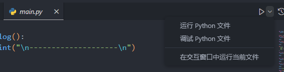
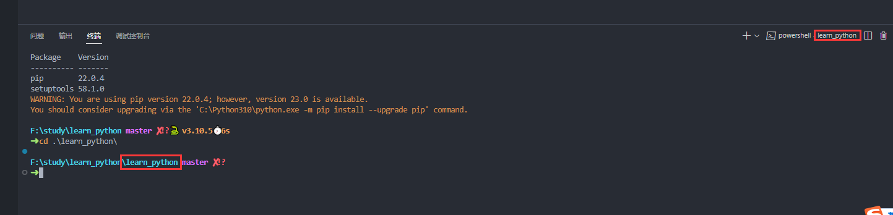

# Python

`Python`是动态类型的, 面向对象的解释型程序设计语言

- [英文官网](https://devguide.python.org/)
- [官网教程](https://docs.python.org/zh-cn/dev/tutorial/index.html)
- [参考手册](https://docs.python.org/zh-tw/3/reference/index.html)
- [标准库文档](http://study.yali.edu.cn/pythonhelp/library/index.html)
- [pip仓库](https://pypi.org/)
- [pip文档](https://pip.pypa.io/en/stable/getting-started/)

[[toc]]

安装完环境以后就可以使用`python`来进入`python`环境或者运行`.py`文件了

```sh
# 直接进入 python 环境
$ python
Python 3.10.5 (tags/v3.10.5:f377153, Jun  6 2022, 16:14:13) [MSC v.1929 64 bit (AMD64)] on win32
Type "help", "copyright", "credits" or "license" for more information.
>>> print("hello world") # 标准输出 "hello wrold"
hello world
>>> exit() # 退出

# 运行当前目录下的 main.py 文件
python main.py
```

还可以通过`-m`参数可以指定运行某个 `python` 模块，比如内置的 `pip` 模块下载包, 或者`venv` 模块创建虚拟环境等:

```sh
# 通过 pip 模块安装第三方包
python -m pip instal packageNane

# 通过 venv 模块创建虚拟环境
python -m venv yourEnvName
```

>   `python -m xxx`有点类似前端的`npx xxx`运行一些模块

## IDE

VS Code中可以使用`Pylance`, `Python`插件, 直接运行或者调试代码

 

## 包管理器

[pip仓库](https://pypi.org/)内置的包管理工具, 类比于前端的 `npm`, 可以在这里搜索第三方包

>   如果发现没有安装`pip`可以执行`python -m ensurepip`来安装`pip`

```sh
# 查看 python 的安装目录
where python

# 安装指定包
python -m pip install packgeName

# 指定的镜像安装指定包
pip install packgeName -i https://pypi.tuna.tsinghua.edu.cn/simple/

# 安装指定的具体版本
python -m pip install packgeName==1.0.4

# 安装不低于某个版本的包
python -m pip install "packgeName>=1.0.4"

# 通过venv创建虚拟环境(类似于 node_modles)
python -m venv your-env-name

# 查看pip的安装列表
python -m pip list
```

### pip配置

[`pip`](https://docs.python.org/zh-cn/dev/tutorial/venv.html#managing-packages-with-pip)[配置文件](https://pip.pypa.io/en/stable/topics/configuration/#configuration)的具体目录: 

|            | Linux                         | Windows                      |
| ---------- | ----------------------------- | ---------------------------- |
| 系统级     | `/etc/pip.conf`               | `C:\ProgramData\pip\pip.ini` |
| 用户级     | `$HOME/.config/pip/pip.conf ` | `%APPDATA%\pip\pip.ini`      |
| 虚拟环境级 | `$VIRTUAL_ENV/pip.conf`       | `%VIRTUAL_ENV%\pip.ini`      |

```ini
[global] # 镜像
index-url = https://pypi.tuna.tsinghua.edu.cn/simple
[install]
trusted-host = pypi.tuna.tsinghua.edu.cn
```

常见的镜像: 

-   阿里云: https://mirrors.aliyun.com/pypi/simple/
-   豆瓣: https://pypi.douban.com/simple/
-   清华大学(推荐): https://pypi.tuna.tsinghua.edu.cn/simple/
-   中国科学技术大学: http://pypi.mirrors.ustc.edu.cn/simple/
-   华中理工大学: http://pypi.hustunique.com/
-   山东理工大学: http://pypi.sdutlinux.org/

命令行配置`--global`, `--user`, `--site`三个参数来分别对于三个层级的配置, 如: 

```sh
# 检查当前配置
pip3 config --global list

# 配置镜像
pip3 config --global set global.index-url https://mirrors.aliyun.com/pypi/simple/
pip3 config --global set install.trusted-host mirrors.aliyun.com
```

### 虚拟环境

`Python`的虚拟环境就好像是前端的`node_modles`主要作用是隔离每个项目的依赖, 不过`Python`中的虚拟环境需要手动的创建

[`venv`](https://docs.python.org/zh-cn/dev/tutorial/venv.html)是创建虚拟环境的标准工具，从 `Python 3.3` 版本开始默认内置，而从 `Python 3.4` 开始 `venv` 会默认安装 `pip` 到所创建的虚拟环境。使用 `venv` 创建虚拟环境的命令如下:

```sh
# -m venv 是使用 venv 模块创建虚拟环境
# visualenvName 表示虚拟模板的名称
python -m venv visualenvName
```

虚拟环境创建完成后，可以看到生成了对应文件夹目录, 想要将**第三方包安装到到虚拟环境**中，而不是全局环境中，则**需要使用虚拟环境中的 `python.exe` 运行 `pip` 模块安装第三方包**，如下所示: 

```sh
# 进入到虚拟环境 Scripts 目录
cd ./visualenvName/Scripts

# 使用当前目录的 python.exe 安装对应的包
python.exe -m pip install packageName
```

更快捷的做法是激活虚拟环境, 从而简化操作命令, 如下所示: 

```sh
# 进入到虚拟环境 Scripts 目录
cd ./visualenv/Scripts
# 运行对应操作系统的激活脚本, 以 windows 的 bat为例
activate.bat
```

激活成功后终端会进入如下图所示的状态:

 

才虚拟环境下可以直接运行 `pip` 命令将依赖包安装到虚拟环境了: 

```sh
# 虚拟环境下可以直接安装第三方包
pip install ProjectName
```

>   安装的第三方包会在对应虚拟环境下的`/visualenvName/Lib/site-packages`目录下

## 基本概念

-   没有行尾结束符号

-   单行注释使用`#`, 多行注释使用`'''`

    ```py
    # 单行注释
    
    '''
    多行注释
    '''
    ```

-   定义变量不需要关键字, 类似于`Go`的短声明语法

    ```py
    a = 1
    b = 3.14
    
    # 同时声明多个变量
    c, d = True, "hello"
    
    print("a:", a) # a: 1
    print("b:", b) # b: 3.14
    print("c:", c) # c: True
    print("d:", d) # d: hello
    ```

-   `Python`是根据换行缩进进行代码块和作用域的区分的

-   `Python`中会使用`:`来表示结束, 比如: `if`, `for`, `函数定义`

## 基本数据类型

```py
a = 1
b = 3.14
print(a, b) # 1 3.14

# 注意布尔值使用 True 和 False
flog = True
print(flog) # True

# 字符串单双引号都可以
msg1 = "hello"
msg2 = 'world'
print(msg1, msg2) # hello world

# None 表示空
none = None
print(none) # None
```

### 字符串常用方法

字符串常用方法基本都不会改变变量原来的值而是返回一个新的值, 更多的字符串方法见[标准库文档](http://study.yali.edu.cn/pythonhelp/library/text.html)

-   `format()`: 格式化字符串

```py
# 根据位置填充参数
print("你好, {} 欢迎来到 \"{}\"".format("小明", "广东")) # 你好, 小明 欢迎来到 "广东"

# 根据名称填充参数
print("你好, {name} 欢迎来到 \"{city}\"".format(city="广东", name="小明")) # 你好, 小明 欢迎来到 "广东"
```

-   `title()`: 以首字母大写的方式显示每个单词

```py
msg = "hello world"
print(msg.title()) # Hello World

print(("hi").title()) # Hi
```

-   `upper()`, `lower()`: 将字符串转换为大写或小写

```py
msg = "heLLo World"

print(msg.lower()) # hello world
print(msg.upper()) # HELLO WORLD
```

-   `lstrip()`: 删除左侧空白

-   `rstrip()`:删除右侧空白
-   `strip()`: 删除两端空白

```py
print(("  hello").lstrip()) # hello
print(("hello  ").rstrip()) # hello
print(("  hello ").strip()) # hello
```

-   `split(T)`: 将字符串根据指定的字符分割成数组

```py
print(("hello world").split(" ")) # ['hello', 'world']
```

-   `replace(old, new)`: 替换字符串

```py
s = "hello world"
print(s.replace("world", "世界"))  # hello 世界

# 可以链式调用
print(
    s.replace("hello", "你好")
    .replace("world", "世界")
)  # 你好 世界
```

-   `find(T)`: 查找字符串, 有则返回第一个找到的索引, 没有则返回`-1`

```py
s = "hello world"
msg = "hello world"
idx = msg.find("l")
print(idx) # 2

# 字符串支持按照索引进行访问
print(msg[idx]) # l

idx = msg.find("a")
print(idx) # -1

# -1 表示没有找到, 直接使用索引访问会有风险, 因为负数也可以访问
print(msg[idx]) # -1
```

## 列表

列表就是数组

```py
# 列表(数组)
list = [1, 2.0, "hello", True, [1, 2, 3]]
print("list: ", list) # list:  [1, 2.0, 'hello', True, [1, 2, 3]]

# 获取列表的长度
print(len(list)) # 5

# 根据索引访问
print(list[0]) # 1

# 可以是负数
print(list[-1]) # [1, 2, 3]
```

### 循环列表

使用`for...in`

```py
list = [1, 2.0, "hello", True, [1, 2, 3]]

for item in list:
    print(item)
```

### 添加元素

-   `append(T)`: 往最后添加一个元素
-   `insert(SupportsIndex, T)`: 指定索引位置添加

```py
list = [1, 2.0, "hello", True, [1, 2, 3]]

# 往最后添加一个元素
list.append("world")
print(list) # [1, 2.0, 'hello', True, [1, 2, 3], 'world']

# 指定索引插入
list.insert(0, 99999)
print(list) # [99999, 1, 2.0, 'hello', True, [1, 2, 3], 'world']
```

### 删除元素

-   `del T`: 按索引删除
-   `pop()`: 删除列表最后一个元素并返回其值, 也可以传索引删除任意位置的值
-   `remove(T)`: 按值删除
-   `clear()`: 清空列表

```py
list = [1, 2.0, "hello", True, [1, 2, 3]]

### del
del list[0]
print(list) # [2.0, 'hello', True, [1, 2, 3]]

### pop 默认删除最后一个
pop = list.pop()
print("pop: ", pop) # pop:  [1, 2, 3]
print("list: ", list) # list:  [2.0, 'hello', True]

### 删除指定索引
pop = list.pop(1)
print("pop: ", pop) # pop:  hello
print("list: ", list) # list:  [2.0, True]

### remove
list.remove(2.0)
print(list) # [2.0, True]


### 重复的值 remove 只会删除第一个匹配的值
list.append(True)
list.append(1)
list.append(True)
print(list) # [True, True, 1, True]

list.remove(True)
print(list) # [True, 1, True]


### clear
list.clear();
print(list) # []
```

### 排序

-   `sort()`**方法**对列表进行永久性排序

```py
arr = ["b", "a", "c", "d"]

# 默认升序排序
arr.sort();
print(arr); # ['a', 'b', 'c', 'd']

# 倒序排序
arr.sort(reverse=True);
print(arr); # ['d', 'c', 'b', 'a']
```

-   `sorted()`**函数**对列表进行排序并返回一个新的列表

```py
arr = ["b", "a", "c", "d"]

# 默认升序排序(不会影响原先的变量)
new_arr = sorted(arr)
print(arr); # ['b', 'a', 'c', 'd']
print(new_arr); # ['a', 'b', 'c', 'd']

# 倒序排序
new_arr = sorted(arr, reverse=True)
print(new_arr); # ['d', 'c', 'b', 'a']
```

-   `reverse()`: 反转列表

```py
arr = ["b", "a", "c", "d"]
arr.reverse()
print(arr); # ['d', 'c', 'a', 'b']
```

### range

`Python`中的`range()`函数可以快速的生成一系列的数字, 函数`range()`包括开始索引**不包括结束索引**

```py
# range(1, 5) 生成 1 ~ 4 的数字
for item in range(1, 5):
  print(item)
```

`range()`函数也可以快捷的生成数组

```py
list = list(range(1, 5))
print(list) # [1, 2, 3, 4]
```

`range()`函数也可以指定步长

```py
list = list(range(1, 10, 3))
print(list) # [1, 4, 7]
```

### 列表计算

可以使用`max()`, `max()`, `sum()`函数

```py
list = [1, 2, 3]

print(max(list))# 3
print(min(list))# 1
print(sum(list))# 6
```

### 列表解析

列表解析将`for循环`和`创建新元素`的代码合并成一行, 并自动附加新元素, 有点像其他语言中的`map`操作一样

```py
# range(1, 11) 生成 1 ~ 10 的数字, 然后 for 循环每个值 * 100
list = [item * 10 for item in range(1, 11)]
print(list) # [10, 20, 30, 40, 50, 60, 70, 80, 90, 100]
```

## 切片

创建切片, 可指定要使用的第一个元素和最后一个元素的索引。与函数`range()`一样包括开始索引不包括结束索引

```py
list = [1, 2, 3, 4, 5]
print(list[1:3]) # [2, 3]
```

切片简写, 可以省略开始或者结束索引

```py
list = [1, 2, 3, 4, 5]

# 索引2到结束索引
print(list[2:]) # [3, 4, 5]

# 开始索引到索引3
print(list[:3]) # [1, 2, 3]

# 支持负数
print(list[:-1]) # [1, 2, 3, 4]

# 完全复制, 等价于[0:]
print(list[:]) # [1, 2, 3, 4, 5]
```

用切片复制出来的新列表, 跟原来的列表是完全不同的列表, 对它的改变不会影响另一个列表

```py
list = [1, 2, 3, 4, 5]

new_list = list[:3];
new_list.clear(); # 清空复制出来的列表

print(list) # [1, 2, 3, 4, 5]
print(new_list) # []
```

遍历切片也使用`for`循环

```py
list = [1, 2, 3, 4, 5]

for item in list[:3]:
    print(item)
```

## 元组

元组跟列表很像, 只不过是不可变的, 也就是说**不可变的列表被称为元组**

元组使用**圆括号**或者**使用逗号分隔值**来定义, 可以使用索引来访问其元素

```py
tup1 = 1, 2, 3
tup2 = (4, 5, 6)

print("tup1: ", tup1) # tup1:  (1, 2, 3)
print("tup2: ", tup2) # tup2:  (4, 5, 6)
```

元组不可变

```py
tup = 1, 2, 3

print(tup[0]) # 1

# Error 不可以修改
tup[0] = "hello"
```

元组的遍历同列表

```py
tup = 1, 2, 3

for item in tup:
    print(item)
    
    
########### 也可以使用快捷写法

for item in 1, 2, 3:
    print(item)

for item in (1, 2, 3):
    print(item)
```

## 条件判断

`Python`中有`==`,`!=`,`>`,`<`, `=>`,`<=`, 但是没有`&&`和`||`, 取而代之的是`and`和`or`

```py
a = 1
b = 5

# and 等价于 &&
if a == 1 and b > 2:
    print("满足")

# or 等价于 ||
if a == 999 or b > 2:
    print("满足")
```

列表判断使用`in`和`not in`

```py
list = [1, 2, 3]

if 1 in list:
    print("list 中存在 1")

if 999 not in list:
    print("list 中不存在 999")
```

### if语句

```py
a = 10

if a == 1:
    print("a == 1")
elif a == 2:
    print("a == 2")
else:
    print("other")
```

### Mtach

`Python`没有`switch case`语法, 但是有类型的`Mtach`

```py
def http_error(status):
    msg = ""
    match status:
        case 400:
            msg = "Bad request"
        case 401 | 403 | 404: # 匹配多个
            msg = "Not allowed"
        case 404:
            msg = "Not found"
        case 418:
            msg = "I'm a teapot"
        case _:  # 通配符
            msg = "Something's wrong with the internet"
    return msg


print(http_error(400)) # Bad request
print(http_error(200)) # Something's wrong with the internet
print(http_error(401)) # Not allowed
```

## 字典

字典是键值对格式的数据, 在一些编程语言中叫对象

```py
obj = {
    "name": "张三",
    "age": 18,
    "sex": "男"
}

print(obj) # {'name': '张三', 'age': 18, 'sex': '男'}
print(obj["name"]) # 张三
```

字典可以随时更改, 新增和删除

```py
obj = {
    "name": "张三",
    "age": 18,
    "sex": "男"
}

# 单独访问
print(obj["name"]) # 张三

# 修改或新增字典中的值
obj["name"] = "李四"
obj["height"] = 180
print(obj) # {'name': '李四', 'age': 18, 'sex': '男', 'height': 180}


# 删除字典中的值
del obj["age"]
del obj["height"]
print(obj) # {'name': '李四', 'sex': '男'}
```

### 遍历字典

-   `items()`: 可以遍历所有的`key`,`value`

-   `key()`: 可以遍历所有的`key`
-   `values()`: 可以遍历所有的`value`

```py
obj = {
    "name": "张三",
    "age": 18,
    "sex": "男"
}

# 遍历 key
for k in obj.keys(): # 等价写法 for (k, _) in obj.items():
    print(k)

# 遍历 value
for v in obj.values(): # 等价写法 for (_, v) in obj.items():
    print(v)

# 遍历 key, value
for k, v in obj.items(): # 等价写法 for (k, v) in obj.items(): 
    print(k, v)
```

## 其他循环

### while 循环

`while`循环和其它语言都大同小于

```py
n = 10

while n >= 0:
    print(n)
    n -= 1
```

### break

`break`同其它语言一样, 退出循环

```py
for item in range(1, 11):
    if item == 5:
        break
    print(item)
```

#### continue

`continue`同其它语言一样, 跳过当次循环

```py
for item in range(1, 11):
    if item % 2 == 0:
        continue
    print(item)
```

## 函数

`Python`函数使用`def`关键字定义函数, 函数名以冒号`:`结尾

```py
def say_hi():
    print("hello")

say_hi() # hello
```

### 函数参数

```py
def say_hi(msg):
    print(msg)

say_hi("hello") # hello
```

#### 参数默认值

```py
def say_hi(msg = "hello"):
    print(msg)

say_hi() # hello
say_hi("你好") # 你好
```

### 返回值

函数中使用`return T`来返回值, 函数默认返回`None`

```py
def test_fn(n):
    return n * 10

print(test_fn(1)) # 10
print(test_fn(2)) # 20

# 默认返回 None
def none_fn():
    pass

print(none_fn()) # None
```

### 返回值类型

函数可以定义返回值类型,, 语法格式是`-> T`

```py
def getName() -> str:
  return "张三"

print(getName()) # 张三
```

### 关键字实参

参数的传递可以根据参数名指定, 这样就可以不按照函数参数定义的位置来传递

```py
def show_info(name, age, sex):
    print("我的名字叫: {}, 年龄是: {}, 性别是: {}".format(name, age, sex))

# 参数的传递可以根据参数名指定
show_info(sex="女", name="小红", age=18) # 我的名字叫: 小红, 年龄是: 18, 性别是: 女
```

### 可变参数

可变参数会把所有的参数都收集到元组中, 使用`*`来表示可变参数

```py
def show_info(*args):
    print(args)

show_info("小红", 18, "女") # ('小红', 18, '女')
show_info("hello") # ('hello')
```

### 可变参数为字典

可变参数也可以收集成一个字典, 使用`**`定义即可

```py
def build_user_info(name, **args):
    print("name: ", name)
    print("args: ", args) # args:  {'city': '广东', 'sex': '男'}


build_user_info("张三", city="广东", sex="男")
```

## lambda

[`lambda`](https://docs.python.org/zh-cn/dev/reference/expressions.html#lambda)就是一个匿名函数, 可以赋值给一个变量, 很方便, 不过在`lambda`里不能写`return`

```py
add = lambda a, b: a + b
multiply = lambda a, b: a * b

print(add(1, 2)) # 3
print(multiply(2, 10)) # 20
```

## pass语句

`pass`语句表示不执行任何的操作

```py
def none_fn():
  pass

class MyClass:
  pass
```

## 内置函数

`Python`中有很多的内置函数, 在任何地方都可以使用, 具体的见[内置函数](https://docs.python.org/zh-cn/dev/library/functions.html), [内置函数(国内)](http://study.yali.edu.cn/pythonhelp/library/functions.html)

下面的是常用内置函数: 

-   `print()`可以在控制台输出内容
-   `assert`内置断言

```py
a = 1

assert a == 2, "a 的变量不正确" # AssertionError: a 的变量不正确
```

-   `locals()`返回一个字典, 包含当前作用域下的**局部变量**

```py

if True:
  a = 1
  localsObj = locals()
  print(localsObj) # {'__name__': '__main__', '__doc__': None, '__package__': None, '__loader__': <_frozen_importlib_external.SourceFileLoader object at 0x0000028C2D314AF0>, '__spec__': None, '__annotations__': {}, '__builtins__': <module 'builtins' (built-in)>, '__file__': 'f:\\study\\learn_python\\main.py', '__cached__': None, 'a': 1, 'localsObj': {...}}
  print(localsObj["a"]) # 1
```

-   `globals()`返回一个字典, 包含当前作用域下的**全局变量**

-   `str(T)`, `int(T)`,`bool(T)`,`chr(T)`,`float(T)`转换类型

-   `exit()`退出程序, 可以指定一个退出码, 如: `exit(1)`

-   `max()`,`min()`,`sum()`最大值, 最小值和求和
-   `getattr(obj, key)`获取对象的值
-   `setattr(obj, key, valu)`给对象赋值
-   `sorted(iterator)`排序
-   `range()`快速生成数字
-   `list(iterator)`转换为列表
-   `open()`打开文件

-   `eval()`函数可以执行执行字符串代码

```py
print(eval("1 + 1")) # 2
```

-   `dir()`: 用于查找模块定义的名称。返回结果是经过排序的字符串列表

```py
import json

print(dir(json))
# ['JSONDecodeError', 'JSONDecoder', 'JSONEncoder', '__all__', '__author__', '__builtins__', '__cached__', '__doc__', '__file__', '__loader__', '__name__', '__package__', '__path__', '__spec__', '__version__', '_default_decoder', '_default_encoder', 'codecs', 'decoder', 'detect_encoding', 'dump', 'dumps', 'encoder', 'load', 'loads', 'scanner']
```

-   `all(iterable)`: 如果 *iterable* 的所有元素均为真值则返回 `True` ,  如果可迭代对象为空, 返回 `False`

```py
print(all([1, True, "hello"])) # True
print(all([1, True, "hello", {}])) # False
print(all([1, True, "hello", []])) # False
print(all([False, True])) # False
```

-   `any(iterable)`: 如果 *iterable* 的任一元素为真值则返回 `True`, 如果可迭代对象为空, 返回 `False`

```py
print(any([1, True, "hello"])) # True
print(any([1, True, "hello", {}])) # True
print(any([1, True, "hello", []])) # True
print(any([False, [], {}])) # False
```

-   `filter(fn, iterable)`: 过滤*iterable*, 返回值是`Filter`类型需要调用`list()`函数转换为列表

```py
array = [1, False, [], "hello", True, {}]

new_list = filter(lambda n: bool(n), array)

print(list(new_list)) # [1, 'hello', True]
```

## 导入导出

独立文件可以被当成是一个模块, `import`语句允许在当前运行的程序文件中使用模块中的代码(函数, 类)

### 导入整个模块

语法:

```py
# 导入 模块1 到当前程序中, 名为 模块1
import module_name

# 导入 模块1 到当前程序中, 重命名为 我的模块1
import module_name as new_module_name
```

基本使用:

```py
# my_math.py

def add(a, b):
    return a + b

def multiply(a, b):
    return a * b
```

```py
# 导入整个模块
import my_math

print(my_math.add(1, 2)) # 3
print(my_math.multiply(10, 2)) # 20

###############

# 导入整个模块并重命名
import my_math as hello

print(hello.add(1, 2)) # 3
print(hello.multiply(10, 2)) # 20
```

### 导入特定的函数

语法: 

```py
# 从模块中导入指定的函数
from module_name import fn_name 

# 从模块中导入指定的函数并重命名
from module_name import fn_name as new_fn_name

# 从模块中导入任意数量的函数(同样支持函数重命名)
from module_name import fn_name1, fn_name2, fn_name2
```

基本使用:

```py
# 从 my_math.py 中导入 add 和 multiply 函数
from my_math import add, multiply

print(add(1, 2)) # 3
print(multiply(10, 2)) # 20

################

# 从 my_math.py 中导入 add 和 multiply 函数 并重命名
from my_math import add as my_add, multiply as my_multiply

print(my_add(1, 2)) # 3
print(my_multiply(10, 2)) # 20
```

### 导入模块中的所有函数

使用`*`运算符可让`Python`导入模块中的所有函数

语法:

```py
from module_name import *
```

基本使用:

```py
# 从 my_math.py 中导入所有的函数
from my_math import *

print(add(1, 2)) # 3
print(multiply(10, 2)) # 20
```

## 类

定义类使用[`class`](https://docs.python.org/zh-cn/dev/tutorial/classes.html#class-objects)关键字(可以加括号), 有一个`__init__`方法, 该函数第一个参数是`self`类比于`this`, 有点像类似于`Java`或`JS`中的构造函数

```py
class Person:
    # 默认接收 self 实例的引用
    def __init__(self, name, age):
        self.name = name
        self.age = age

		# 定义实例的方法
    def show(self):
        print("我的名字叫: {}, 年龄是: {}".format(self.name, self.age))

    # 定义参数
    def say_hi(self, msg):
        print(msg)

# 实例化类实例
p = Person("张三", 18)
print(p.name) # 张三

p.show() # 我的名字叫: 张三 , 年龄是: 18

p.say_hi("hello") # hello
```

### 类的特殊方法

`Python`类中, 凡是以双下划线`__`开头和结尾命名的成员, 都是类的[特殊成员](https://docs.python.org/zh-cn/dev/reference/datamodel.html#special-method-lookup)）, 例如: `__init__`则对应构造函数, `__getitem__`对应访问值, `__setitem__`对应设置值, 利用这些特殊成员, 我们可以做一个拦截操作, 比如判断一个值是否非法等, 如下: 

```py
class Person:
    # 构造函数
    def __init__(self, name, age):
        self.name = name
        self.age = age

    # getter, obj[T] 时触发
    def __getitem__(self, item):
      print("__getitem__", item)
      return getattr(self, item)

    # setter, obj[T] = val 触发
    def __setitem__(self, key, value):
        print("__setitem__", key, value)

        # 年龄值建议
        if key == "age":
            if value < 0 or value > 130:
                print("age 字段非法 -> ", value)
                return

        setattr(self, key, value)


# 会触发 __init__
p = Person("张三", 18)

# 会触发 __setitem__
p["name"] = "李四"
p["age"] = 28
p["age"] = 999

# 会触发 __getitem__
print(p["name"])
print(p["age"])
```

输出如下:

```py
__setitem__ name 李四
__setitem__ age 28
__setitem__ age 999
age 字段非法 ->  999
__getitem__ name
李四
__getitem__ age
28
```

### 修改实例的属性

实例的属性可以直接进行修改

```py
class Person():
    def __init__(self, name, age):
        self.name = name
        self.age = age

    def show(self):
        print("我的名字叫: {}, 年龄是: {}".format(self.name, self.age))

p = Person("张三", 18)
p.show() # 我的名字叫: 张三 年龄是: 18

p.name = "李四"
p.age = 28
p.show() # 我的名字叫: 张三 年龄是: 18
```

>   方法是不可以直接修改的

也可以写一个方法来批量修改属性

```py
class Person():
    def __init__(self, name, age):
        self.name = name
        self.age = age

    # update_property 函数需要
    def __setitem__(self, key, value):
        setattr(self,key,value)

    def show(self):
        print("我的名字叫: {}, 年龄是: {}".format(self.name, self.age))

    def update_property(self, **args):
      for (k, v) in args.items():
          self[k] = v

p = Person("张三", 18)
p.show() # 我的名字叫: 张三 年龄是: 18

p.update_property(name="小红", age=16)
p.show() # 我的名字叫: 小红 , 年龄是:  16
```

### 继承

继承的`class`写法就要添加括号的写法

```py
class Person:
    def __init__(self, name, age):
        self.name = name
        self.age = age

    def show(self):
        print("Person show")

# Student 继承自 Person  
class Student(Person):
    def __init__(self, name, age):
        # super 表示父类, 调用其 __init__ 函数实例化
        super().__init__(name, age)

xm = Student("小明", 12)
xm.show() # Person show
```

### 重写

子类跟父类同名方法即可实现重写

```py
class Person:
    def __init__(self, name, age):
        self.name = name
        self.age = age

    def show(self):
        print("Person show")

# Student 继承自 Person  
class Student(Person):
    def __init__(self, name, age):
        # super 表示父类, 调用其 __init__ 函数实例化
        super().__init__(name, age)

    def show(self):
      print("Student 重写的 show 方法")

xm = Student("小明", 12)
xm.show() # Student 重写的 show 方法
```

### 类的单元测试

[unittest](http://study.yali.edu.cn/pythonhelp/library/unittest.html)是`Python`内置的单元测试, 测试类要继承 `unittest.TestCase`, 通过 `self.assertxxx`断言方法进行断言

```py
import unittest


class Person:
    def __init__(self, name):
        self.name = name

    def get_name(self):
        return self.name


p = Person("张三")


# 测试类

class TestPerson(unittest.TestCase):
    def __init__(self, methodName: str = "runTest"):
        super().__init__(methodName)

    # setUp 函数是可选的, 会最先执行, 一般是做一些初始化的操作
    def setUp(self):
        print("setUp run")
        return super().setUp()

    # 测试方法
    def test_get_name(self):
        name = p.get_name()
        self.assertEqual(name, "张三")


unittest.main()
```

#### 常见的断言方法

| 方法                      | 用途                   |
| ------------------------- | ---------------------- |
| `assertEqual(a, b)`       | 断言`a == b`           |
| `assertNotEqual(a, b)`    | `断言a != b`           |
| `assertTrue(x)`           | 断言`x`为`True`        |
| `assertFalse(x)`          | 断言`x`为`False`       |
| `assertIn(item, list)`    | 断言`item`在`list`中   |
| `assertNotIn(item, list)` | 断言`item`不在`list`中 |

## IO

[读写文件](https://docs.python.org/zh-cn/dev/tutorial/inputoutput.html#reading-and-writing-files)

### 用户输入

`input()`函数可以让程序暂停运行, 等待用户输入一些文本, 获取用户输入后返回

```py
name = input("请输入你的姓名: ")
print("你的名字是: ", name)

age = input("请输入你的年龄: ")
print("你的年龄是: ", int(age))
```

### 读取整个文件

`open()` 用于打开一个文件, 参数1为文件的路径, 参数2是可选模式, 可选模式如下:

-   `r`:  只读(默认)
-   `w` :  只写, 如果文件不存在则创建, 如果文件存在则先清空，再写入
-   `a`:  附加模式, 写入的内容追加到原始文件后面, 如果文件不存在则创建
-   `r+`:  可读可写

```py
# 打开
file_obj = open("./README.md")

# 读取内容
content = file_obj.read()
print("文件内容: ", content.strip())

# 关闭文件
file_obj.close();
```

文件资源使用完以后使要及时释放的不然会照成内存泄露, 可以使用`with`关键字来自动释放

```py
with open("./LICENSE") as file_obj:
    contents = file_obj.read()
    print("文件内容为: ", line.strip())
```

>   关键字`with` 在不再需要访问文件后将其关闭, 有了`with`只管打开文件, 并在需要时使用它, `Python`自会 在合适的时候自动将其关闭

### 逐行读取

```py
with open("./LICENSE") as file_obj:
    for line in file_obj:
        print(line.strip())
```

### 写入文件

`write()`方法会清空之前的数据

```py
with open("./README.md", "w", encoding="utf8") as file_obj:
    file_obj.write("hello")
```

### 逐行写入

```py
with open("./README.md", "w", encoding="utf8") as file_obj:
    for line in range(1, 11):
      file_obj.writelines("第" + str(line) + "行\n")
```

## 异常

### 触发异常

使用`raise`可以[抛出异常](https://docs.python.org/zh-cn/dev/tutorial/errors.html#raising-exceptions)

```py
raise NameError("这是异常信息") # 会显示指定的异常信息
```

### 捕获异常

捕获异常使用`try/except/finally`代码块处理的

```py
try:
    n = 5 / 0
except ZeroDivisionError:
    print("任何数都不可以除以0")
finally:
    print("finally run")
```

>   注意, `except 错误类型：`的语法类似于 `js` 的 `catch` 概念，但是 `except` 必须要匹配指定类型的错误才会进入该分支, 而 `js` 的 `catch` 是只要错误产生就会进入分支：

#### else 代码块

如果`try/except/finally`中的`try`代码运行成功，没有出现异常，则执行 `else` 代码块中的代码

```py
try:
    n = 1
except ZeroDivisionError:
    print("任何数都不可以除以0")
else:
    print("没有异常")
finally:
    print("finally run")
```

## pyi文件

`.pyi`文件类似于`TS`中的`.d.ts`类型声明文件

## 常用标准库

### json

-   `json.dump(jsonData, file_obj)`: 将`jsonData`数据写入到`file_obj`文件中

-   `json.load(file_obj)`: 从`file_obj`文件中读取json数据

```py
import json

userInfo = {
    "username": "张三", 
    "age": 18, 
    "list": [1, 2, 3],
    "flog": True
}

with open("test.json", "w") as file_obj:
    # 写入到指定的文件中
    json.dump(userInfo, file_obj)


with open("test.json") as file_obj:
    # 从文件中读取 json数据
    content = json.load(file_obj)
    print(content)
```

### glob

[glob](https://docs.python.org/zh-cn/dev/library/glob.html#module-glob)模块用于根据指定的规则查找路径地址

```py
import glob
fs = glob.glob("*.py")
print(fs) # ['main.py', 'my_math.py']
```

