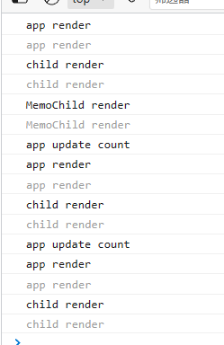

[[toc]]

# React-18

[React官网](https://react.dev/)

[React官网(中)](https://react.docschina.org/)

## 命令式编写

`react`和`react-dom`提供了一些API, 可以命令式的创建元素, 开发中一般不会这样写, 如下: 

```html
<!-- 依赖 -->
  <script src="https://unpkg.com/react@18/umd/react.development.js" crossorigin></script>
  <script src="https://unpkg.com/react-dom@18/umd/react-dom.development.js" crossorigin></script>


<!-- 容器 -->
<div id="root"></div>
```

`react`和`react-dom`的使用思想和`Vue`中的`h`函数是差不多的, 都是创建虚拟DOM: 

```javascript
// `react`和`react-dom` 暴露的对应API
console.log("React: ", React);
console.log("ReactDOM: ", ReactDOM);

// 创建元素
const btn = React.createElement("button", {
  id: "btn",
  className: "btn", // 类名用 className 
  onClick: () => alert("hi") // 事件
}, "按钮");

// 创建嵌套的元素
const div = React.createElement("div", {}, "我是div", btn);

// 根元素
const root = ReactDOM.createRoot(document.getElementById("root"));

// 渲染元素
root.render(div);
```

直接创建**类式组件**或者**函数式组件**是一样的用法:

```javascript
// 类式组件
class MyButton extends React.Component {
  constructor(props) {
    super(props);
    this.state = { count: 1 };
  }

  render() {
    return React.createElement("button",
      {
        onClick: () => this.setState({ count: this.state.count + 1 })
      },
      this.props.text + this.state.count
    );
  }
}

// 根元素
const root = ReactDOM.createRoot(document.getElementById("root"));

// 创建组件, 给定 props
const comp = React.createElement(MyButton, { text: "click me" });

// 渲染
root.render(comp);
```

函数式组件同理:

```javascript
// 函数式组件
const MyButton = (props) => {
  // 使用 hook
  const [count, setCount] = React.useState(1);

  return React.createElement("button",
    {
      onClick: () => setCount(count + 1)
    },
    props.text + count
  );
}

// 根元素
const root = ReactDOM.createRoot(document.getElementById("root"));

// 创建组件, 给定 props
const comp = React.createElement(MyButton, { text: "click me" });

// 渲染
root.render(comp);
```

## JSX命令式编写

使用`react` 和 `react-dom`直接编写[`JSX`](https://react.docschina.org/docs/introducing-jsx.html)浏览器是不支持, 需要额外的引入`babel`来解析:

```html
<script src="https://unpkg.com/babel-standalone@6/babel.min.js"></script>
```

然后在`script`标签中添加`type = text/babel`即可在这个`script`标签中编写`JSX`语法了, 如下:

```javascript
<script type="text/babel">

  console.log("React: ", React);
  console.log("ReactDOM: ", ReactDOM);

  // 直接编写JSX
  const name = "我是div";
  const el = () => (
    <div
      className="my-div" // class 使用 className 代替
      style={{ backgroundColor: "red" }} // style 使用 {{...}} 设置
    >
      {name}
      <button onClick={e => console.log(e)}>我是button</button>
    </div>
  );

  // 根元素
  const root = ReactDOM.createRoot(document.getElementById("root"));

  // 创建组件, 给定 props
  const comp = React.createElement(el, { text: "click me" });

  // 渲染
  root.render(comp);
</script>
```

编写组件

```javascript
<script type="text/babel">
  // 函数式组件
  const MyButton = (props) => {
    // 使用 hook
    const [count, setCount] = React.useState(1);

    return (
      <button onClick={() => setCount(count + 1)}>{props.text}{count}</button>
    );
  }

  // 根元素
  const root = ReactDOM.createRoot(document.getElementById("root"));

  // 创建组件, 给定 props
  const comp = React.createElement(MyButton, { text: "click me" });

  // 渲染
  root.render(comp);
</script>
```

## 列表渲染

列表渲染最简单的是使用`map`方法, 跟注意点就是需要绑定一个唯一的`key`, 作用是虚拟DOM**Diff**比较:

```javascript
<script type="text/babel">
  // 函数式组件
  const MyList = () => {
    const list = ["red", "blue", "yellow"];

    return (
      <ul>
        {list.map((item, i) => <li key={i}>{item}</li>)}
      </ul>
    );
  }

  // 根元素
  const root = ReactDOM.createRoot(document.getElementById("root"));

  const comp = React.createElement(MyList);

  // 渲染
  root.render(comp);
</script>
```

## 脚手架

脚手架可以使用官方的`create-react-app`或者`vite`来创建项目:

```sh
# create-react-app
create-react-app projectName 

# vite
pnpm create vite projectName
```

## 严格模式

`StrictMode`是`react`提供的一个标签可以将被包裹的标签以[严格模式](https://zh-hans.reactjs.org/docs/strict-mode.html#gatsby-focus-wrapper)渲染(不影响生产), `React`会检查语法, 副作用, 是否使用过时的API等操作: 

```typescript
import React from "react";
import ReactDOM from "react-dom/client";
import App from "./App";
import "./index.css";

ReactDOM.createRoot(document.getElementById("root") as HTMLElement).render(
	<React.StrictMode>
		<App />
	</React.StrictMode>
);
```

## 条件渲染

```typescript
import { useState } from "react";

function App() {
	const [visible, setVisible] = useState(true);

	return (
		<>
		
			{/* v-if */}
      {visible ? <h1>title</h1> : ""}

      {/* v-show */}
      <h1 style={{ display: visible ? "block" : "none" }}>title</h1>
			
      <button onClick={() => setVisible(!visible)}>toggle</button>
		</>
	);
}

export default App;
```

## 双向绑定

根据`change` 事件收集值即可: 

```typescript
import { useState } from "react";

function App() {
	const [text, setText] = useState("hello");

	return (
		<>
			<p>{text}</p>
			<input
				type="text"
				value={text}
				// 使用 change 事件收集值
				onChange={(e) => setText(e.target.value)}
			/>
		</>
	);
}

export default App;
```

## Props

在组件标签传递对应的属性即可, 可以传递传递单个的值(包括传递函数), 也可以使用**解构语法**来批量的传递, 

需要注意的是**`props`是只读的修改会报错**

父组件:

```typescript
import "./App.css";
import { useState } from "react";

import Child from "@/components/Child";

function App() {

	const [count, setCount] = useState(0);
	const other = {
		a: 1,
		b: [1, 2, 3]
	};

	return (
		<>
			<Child 

				// 逐个传递 props
				title="child title" 
				count={count} 
				upCount={setCount} 

				// 可以使用解构语法来批量传递对象的所有属性
				{...other}
			/>
		</>
	);
}

export default App;
```

子组件:

```typescript
type Props = {
	title: string;
	count: number;
	upCount: (val: number) => void;

	a: number;
	b: number[];
};

// props 作为函数参数被接收
const Child = (props: Props) => {

	console.log("Child Props: ", props);
	const { title, count, upCount } = props;

	return (
		<>
			<h3>{title}</h3>
			<button onClick={() => upCount(count + 1)}>click me{count}</button>
		</>
	);
};

export default Child;
```

## CSSModule

`React`中没有`Vue`中的样式作用域的概念, 如果项目很大直接通过`import`引入的样式是会有**类名重复导致样式覆盖的问题**, 为了解决这个问题`React`默认支持`CSSModule`

-   `CSSModule`的文件为`xxx.module.css`

-   然后可以直接使用`import`引入对应的模块

```typescript
// import classes from "./App.module.css";

// 支持 scss 配置对应的插件即可
import classes from "./App.module.scss";

// 类名和id都会作为 key
console.log("classes: ", classes);

function App() {

	return (
		<>
		  {/* 然后就可以直接使用对应类名或者id名 */}
			<p className={classes.title}>title</p>
		</>
	);
}

export default App;
```

>   `CSSModule`是可以使用`less`或者是`sass`的

## Fragments

`Fragments`有点类似于: `Vue`中的`template`或者微信小程序的`block`, 实际不会渲染, 都是为了避免多层嵌套, 如下:

```typescript
import { Fragment } from "react";

function App() {

	return (
		<Fragment>
			<p>title</p>
			<button>button</button>
		</Fragment>
	);
}

export default App;
```

>   `Fragments`还可以添加一个`key`作用同列表循环是一样的

`Fragments`的原理很简单就是返回自己内部的`children`(插槽):

```typescript
// 定义
const MyFragments = (props: any) => {
  console.log("props: ", props);
  return props.children;
};

function App() {

	return (
		<MyFragments>
			<p>title</p>
			<button>button</button>
		</MyFragments>
	);
}

export default App;
```

`Fragments`可以简写为空标签`<>`(无法设置`key`):

```typescript
function App() {

	return (
		<>
			<p>title</p>
			<button>button</button>
		</>
	);
}

export default App;
```

## 插槽

对应组件内部传递的内容会被作为`props`传递给子组件的`children`

### 默认插槽

父组件:

```typescript
import Child from "@/components/Child";

function App() {
	return (
		<>
			<Child>
				<div>我是父组件传递的slot</div>
			</Child>
		</>
	);
}

export default App;
```

子组件:

```typescript
import { ReactNode } from "react";

type Props = {
	children?: JSX.Element | ReactNode;
};

const Child = (props: Props) => {

	console.log("Child Props: ", props);

  const defaultSlot = <div>default slot</div>;

	return (
		<>
			<div>child</div>
      {/* 有则渲染, 没有则使用默认插槽 */}
      {props.children ? props.children : defaultSlot}
		</>
	);
};

export default Child;
```

### 具名插槽

将要添加的插槽数据保存到一个对象中传递即可, 需要注意的是插槽必须是要使用**函数**

父组件:

```typescript
import Child from "@/components/Child";

function App() {

	// 插槽数据
	const slots = {
		header: () => <div>header</div>,
		content: () => <div>content</div>,
		footer: () => <div>footer</div>,
	}

	return (
		<>
			<Child>
				{slots}
			</Child>
		</>
	);
}

export default App;
```

子组件:

```typescript
import { ReactNode } from "react";

type Props = {
  // 将插槽内容定义为指定插槽名称对应的类型
	children: {
    header: () => JSX.Element | ReactNode,
    content: () => JSX.Element | ReactNode,
    footer: () => JSX.Element | ReactNode,
  };
};

const Child = (props: Props) => {

	console.log("Child Props: ", props);
  // 从 children 获取对应的插槽, 在对应的地方使用即可
  const { footer, header, content } = props.children;

	return (
		<>
			<h2>Child</h2>
      <div>
        <h3>header slot</h3>
        {header()}
      </div>

      <div>
        <h3>content slot</h3>
        {content()}
      </div>

      <div>
        <h3>footer slot</h3>
        {footer()}
      </div>
		</>
	);
};

export default Child;
```

### 作用域插槽

作用域插槽很简单, 只需要在具名的插槽的基础上添加对应插槽函数的参数即可,  这个**函数接受到的数据就是作用域插槽的数据**:

父组件:

```typescript
import Child from "@/components/Child";

type SlotScopeDataType = {
	title: string;
	content: string;
};

function App() {

	const slots = {
    // 函数参数就是作用插槽的数据
		header: (title: string) => <div>header {title}</div>,
		content: (scope: SlotScopeDataType) => <div>{scope.title} {scope.content}</div>
	};

	return (
		<>
			<Child>{slots}</Child>
		</>
	);
}

export default App;
```

子组件: 

```typescript
import { ReactNode } from "react";

type SlotScopeDataType = {
	title: string;
	content: string;
};

type Props = {
	// 内容定义具体的类型
	children: {
		header: (title: string) => JSX.Element | ReactNode;
		content: (scope: SlotScopeDataType) => JSX.Element | ReactNode;
	};
};

const Child = (props: Props) => {

	console.log("Child Props: ", props);
	const { header, content } = props.children;

	return (
		<>
			<h2>Child</h2>
			<div>
				<h3>header slot</h3>

        {/* 传递作用域数据 */}
				{header("abcd")}
			</div>

			<div>
				<h3>content slot</h3>
        {/* 传递作用域数据 */}
				{content({
					title: "hello",
					content: "world"
				})}
			</div>
		</>
	);
};

export default Child;
```

### 插槽+prop

如果想使用子组件和Prop的话可以使用`PropsWithChildren`工具泛型, 来定义`Prop`的类型

```tsx
import type { PropsWithChildren } from "react";

const Stack = (prop: PropType) => {

  return (
    <>
      <div>{prop.title}</div>
      {prop.children}
    </>
  );
};

// 会自动添加 children?: ReactNode | undefined; 类型
type PropType = PropsWithChildren<{
  title: string;
}>;

export default Stack;
```


## Context

`Props`可以父子组件进行通信, 但是如果是多层子组件的话, `Props`就不是很方便了, 这时可以使用`Context`, `Context`可以让数据从父组件中注入到所有的子组件内, 类似于`Vue`的`provide/inject`

创建`Context`

```typescript
import { createContext } from "react";

// 这里一般不指定具体数据的值, 而是初始化值
const ctx = createContext({
  name: "",
  age: 0
});

export default ctx;
```

父组件通过对应的`Context`的`Provider`标签来包裹需要注入数据的子组件

```typescript
import { useState } from "react";
import userContext from "@/store/userContext";

import Child from "@/components/Child";

function App() {
	const [state, setState] = useState({
		name: "张三",
		age: 18
	});

	return (
		// 只有被 userContext.Provider 包裹的组件才会被注入 Context
		// 通过 value 来指定具体的值
		<userContext.Provider value={state}>
			<h2>App</h2>
			{/* 父组件更新 Context 子组件也会同步更新 */}
			<button onClick={() => setState({ ...state, age: state.age + 1 })}>
				click me
			</button>

			<Child />
		</userContext.Provider>
	);
}

export default App;
```

子组件通过使用`useContext`导入对应的`Context`使用

```typescript
import { useContext } from "react";
import userContext from "@/store/userContext";

const Child = () => {
	// 使用 useContext 获取 对应的 Context
	const ctx = useContext(userContext);

	return (
		<>
			<h3>Child</h3>
			<p>{ctx.name}</p>
			<p>{ctx.age}</p>
		</>
	);
};

export default Child;
```

## React.memo

当组件`props`和`state`发生改变时, **当前组件以及其子孙组件会重新渲染**, 但是有一些组件（纯文本组件）是不需要重新渲染的，这种不需要的组件被重新渲染会影响整体的渲染性能, 在函数式组件中使用`React.memo`, 而在类式组件中使用`PureComponent`, 如下:

```tsx
import React, { StrictMode, useState } from "react";

// 子组件
function Child() {
  console.log("child render");
  return <div>Child</div>;
}

// 使用 React.memo 之后的 子组件
// eslint-disable-next-line react/display-name
const MemoChild = React.memo(() => {
  console.log("MemoChild render");
  return <div>MemoChild</div>;
});

function App() {
  const [count, setCount] = useState(0);
  console.log("app render");

  return (
    <StrictMode>
      {/* 更新父组件的状态 */}
      <button onClick={() => {
        console.log("app update count");
        setCount(count + 1);
      }}>count {count}</button>
      
      <Child/>
      <MemoChild />
    </StrictMode>
  );
}

export default App;
```

观察控制台, 首次`MemoChild`会渲染, 后续的`App`组件的state更新都不会更新, 如下: 

 

## Hook

[React Hook掘金教程](https://juejin.cn/post/6844903985338400782)

[React Hooks 使用大全](https://juejin.cn/post/7118937685653192735)

React 一直都提倡使用**函数组件**, 但是有时候需要使用 `state` 或者其他一些功能时，只能使用**类组件**，因为函数组件没有实例，没有生命周期函数，只有`class` 组件才有

Hooks 是 React 16.8 新增的特性，它可以让你在编写函数组件中下使用 `state` 以及其他的 React 特性

凡是 `use` 开头的 React API  都是 Hooks

使用Hook的注意事项:

-   只能在**函数内部的最外层**调用 `Hook`, 不要在循环, 条件判断或者子函数中调用
-   只能在 React 的**函数组件**或**自定义Hook**中调用 `Hook`, 不要在其他 JavaScript 函数中调用
-   其它注意事项见[Invalid Hook Call Warning](https://reactjs.org/warnings/invalid-hook-call-warning.html)

>   可以使用官方的[Eslint](https://react.docschina.org/docs/hooks-rules.html#eslint-plugin)插件`eslint-plugin-react-hooks`来约束Hooks使用规则

### useState

`useState`接收一个默认的`state`返回一个数组: 

-   一个`state`, 默认的值和给`useState`的第一个值相同
-   一个更新`state`的函数, 类似 `class` 组件的 `this.setState`，但是**它不会把新的 state 和旧的 state 进行合并, 而是直接替换**
-   重复渲染重复的`state`时, 函数组件的函数会调用, 但是不会渲染其`DOM`和其子组件

基本语法:

```typescript
import { useState } from "react";
const [state, setState] = useState(initialState);
```

基本使用:

```typescript
import { useState } from "react";

function App() {
	const [count, setCount] = useState(0);

	return (
		<>
      <button onClick={() => setCount(count + 1)}>click me {count}</button>
		</>
	);
}

export default App;
```

#### 函数式更新

`setState`的更新是异步的, 如果一段时间内触发多次更新只有最后一次更新有效(类似防抖), 

如果新的 `state` 需要通过使用先前的 `state` 计算得出, 那么可以将回调函数当做参数传递给 `setState`,

该回调函数将接收先前的 `state`，并返回一个更新后的值, 如下:

```typescript
import { useState } from "react";

function App() {
	const [count, setCount] = useState(0);

	const lazySetCount = () => {
		setTimeout(() => {
			setCount(count + 1);
		}, 500);
	};

	const lazyFuncSetCount = () => {
		setTimeout(() => {
			setCount(newState => newState + 1);
		}, 500);
	};

	return (
		<>
			<p>{count}</p>
    
			{/* 多次点击只会更新最后一次(类似防抖效果) */}
			<button onClick={lazySetCount}>普通更新</button>

			<br />
        
			{/* 点击多少次更新多少次 */}
			<button onClick={lazyFuncSetCount}>函数式更新</button>
		</>
	);
}

export default App;
```

#### 不能直接在函数组件的顶层调用setState

直接在函数的顶层调用`setState`会直接报错, 因为组件还处于**渲染阶段**(没执行完), 则不会检查`state`的值是否相同, 所以会进入死循环

```typescript
import { useState } from "react";

function App() {
	console.log("App render");

	const [count, setCount] = useState(0);

  // Error 这里调用了 setCount 会进入死循环渲染
	setCount(0);

	return (
		<>
			<p>{count}</p>
		</>
	);
}

export default App;
```

>   如果想在函数组件的顶层直接调用`setState`请使用`useEffect`

### useRef

`class`组件, `React` 元素用 `React.createRef`获取元素或者组件引用, 函数组件则使用 `useRef`

`useRef` 返回一个可变的 `ref` 对象, 其 `current` 属性会在**元素或组件挂载完成时**填充`ref`标记的DOM或者组件

```typescript
import { useRef } from "react";
const ref = useRef(initialValue);
```

基本使用: 

```typescript
import { useRef } from "react";

function App() {
	const inputRef = useRef();

	// current 需要在元素挂载完成都会有值 
	console.log("inputRef: ", inputRef);

	const getFocus = () => {
		if (inputRef.current) {
			(inputRef.current as HTMLInputElement).focus();
		}
	}

	return (
		<>
			{/* 添加 ref 标记 */}
			<input type="text" ref={inputRef}/>
			<button onClick={() => getFocus()}>focus</button>
		</>
	);
}

export default App;
```

>   `useRef` 返回的 `ref` 对象在组件的整个生命周期内**保持不变**，也就是说每次重新渲染函数组件时，返回的`ref` 对象都是同一个（使用 `React.createRef` ，每次重新渲染组件都会重新创建 `ref`）

#### 函数式组件使用ref

因为函数组件没有实例, 所以一般情况下**函数组件无法像类组件一样可以接收 `ref` 属性**, 如果想要函数组件可以使用`ref`需要使用`forwardRef`来定义函数式组件:

父组件正常指定`ref`即可:

```typescript
import { useRef } from "react";

import Child from "./components/Child";

function App() {
	// 定义 ref
	const childRef = useRef();

	const setText = () => {

		console.log("childRef: ", childRef);

		if (childRef.current) {
			(childRef.current as HTMLElement).innerText = "hello world";
		}
	}

	return (
		<>
			{/* 指定 ref 属性 */}
			<Child ref={childRef}/>
			<button onClick={() => setText()}>setText</button>
		</>
	);
}

export default App;
```

子组件需要使用`forwardRef`来定义组件: 

```typescript
import { forwardRef } from "react";

// 子组件必须使用 forwardRef 来定义组件, 第二个参数就是 ref
const Child = forwardRef((props: any, ref: any) => {
  console.log("子组件接受到的ref: ", ref);

  const hello = () => console.log("child hello");

  return (
    <>
      {/* 将接受到的 ref 绑定到指定的元素或组件即可 */}
      <div id="child" ref={ref}>我是子组件的div</div>
    </>
  );
});

export default Child;
```

#### 函数式组件利用ref暴露指定方法

函数式组件利用`ref`暴露指定方法需要使用`forwardRef`+`useImperativeHandle`一起使用,

父组件:

```typescript
import { useRef } from "react";

import Child from "./components/Child";

// 定义子组件保留的数据类型
type ChildRef = {
	text: string,
	hello: () => string;
	divRef: HTMLDivElement;
}


function App() {
	// 定义 ref, 指定类型
	const childRef = useRef<ChildRef>();

	const callChildRef = () => {
		
		console.log("childRef: ", childRef);

		if (childRef.current) {
			console.log(childRef.current.text);
			childRef.current.hello();
			childRef.current.divRef.innerText = "hello world";
		}
	}

	return (
		<>
			{/* 指定 ref 属性 */}
			<Child ref={childRef}/>
			<button onClick={() => callChildRef()}>callChildRef</button>
		</>
	);
}

export default App;
```

子组件:

```typescript
import { forwardRef, useImperativeHandle, useRef } from "react";

// 子组件使用 forwardRef 定义组件
const Child = forwardRef((props: any, ref: any) => {
  console.log("子组件接受到的ref: ", ref);

  const divRef = useRef();

  // 暴露指定的数据给外部使用
  useImperativeHandle(ref, () => {
    return {
      text: "child",
      hello: () => console.log("child hello"),

      // 还可以添加其他的 ref
      divRef: divRef.current,
    }
  });

  return (
    <>
      <div ref={divRef}>child</div>
    </>
  );
});

export default Child;
```

### useEffect

`useEffect`钩子专门来处理函数组件的副作用的, 还可以模拟`Class`组件中的生命周期钩子

React中的副作用操作:

-   `AJAX`请求
-   设置订阅 / 启动定时器
-   手动更改`DOM`

语法:

```typescript
import { useEffect } from "react";

useEffect(() => {
	// 在此可以执行任何带副作用操作, 相当于 componentDidMount(组件挂载完成)
  console.log("组件挂载完成");

	return () => {
		// 在组件卸载前执行, 相当于 componentWillUnmount(组件卸载时), 在此做一些收尾工作
		console.log("组件卸载之前");
    
	};
}, []); // 可选的数组, 如果指定的是[], 回调函数只会在第一次 render 完成后执行, 相当于 componentDidMount(组件挂载完成)
        // 如果有指定依赖项数组则会在对应值发生改变时调用(常用于 props), 相当于 componentDidUpdate(组件更新值时) 有点像 Vue 的 watch

```

基本使用: 

```typescript
import { useState, useEffect } from "react";

function App() {

	const getTime = () => new Date().toLocaleString();

	const [date, setDate] = useState(getTime());
	let timer: NodeJS.Timeout | null = null;

	useEffect(() => {
		console.log("副作用执行");

		timer = setTimeout(() => {
			setDate(getTime());
		}, 1000);

		return () => {
			console.log("清除副作用");
			if (timer) clearTimeout(timer);
		}
	}, [timer, setDate, getTime]); // 指定内部使用的依赖项(如果指定了空数组则只会执行一次)

	return (
		<>
			<span>当前时间: {date}</span>
		</>
	);
}

export default App;
```

### useReducer

`useReducer`和`redux`中`reducer` 很像, `useReducer`的类型如下:

```typescript
// 参数列表
const [state, dispatch] = useReducer(reducer, initialState, init);

// useReducer 简单化的TS类型声明如下:
type stateType = { ... };
type activeType = { ... };
type initArgType = { ... };

function useReducer(
	reducer: (prevState: stateType, active: activeType) => stateType,
	initializerArg: initArgType,
	initializer: (arg: initArgType) => stateType
): [stateType, (value: activeType) => void];
```

**`useReducer`的返回值也是一个数组:, 如下:**  

-   `state`: 表示数据的默认值

-   `state`: 表示数据的默认值
-   `dispatch`: 一个派发函数, 用于派发操作给`reducer`(参数也会一起传递)

**`useReducer`的参数有三个, 如下:** 

-   `reducer`: 一个函数, 用于操作`state`, 第一个参数为最新的`state`, 第二个参数一般叫`active`是一个对象, 这个对象会定义一个`type`去判断执行的操作, 返回一个新的`state`
-   `initialState`: `state`的初始值
-   `init`:一个可选的函数, 接收`initialState`作为参数, 可以用来初始化比较复杂的`initialState`值, 返回一个新的`initialState`代替默认值

简单使用:

```typescript
import { useReducer } from "react";

type stateType = { count: number; title: string };
type activeType = { type: string; data: any };

const reducerHandle = (preState: stateType, active: activeType): stateType => {
	// 当前的状态
	console.log("preState: ", preState);

	// 派发接收到的参数
	console.log("active: ", active);

	const { type, data } = active;
  
  // 和 setState 一样不能返回原先的 state, 重新解构赋值
	const newState = { ...preState };
	newState.count += data;

	// 根据操作类型执行不同的操作
	switch (type) {
		case "ADD":
			newState.title = "ADD";
			break;
		case "SUB":
			newState.title = "SUB";
			break;
		default:
			console.warn("未知的操作类型: ", type);
			break;
	}

	// 返回最新的 state
	return newState;
};

const App = () => {
	const [countState, countDispatch] = useReducer(
		reducerHandle, // reducer 操作函数
		{}, // 初始值
		(initialState) => { // 初始值格式化函数
			console.log("init initialState: ", initialState);

			// 返回的值将会代替默认值
			return {
				count: 10,
				title: "default title"
			};
		}
	);

	console.log("countState: ", countState);

	const dispatchHanlde = (flag: "ADD" | "SUB") => {
		// 派发操作
		countDispatch({
			type: flag,
			data: flag === "ADD" ? 1 : -1
		});
	};

	return (
		<>
			<p>{countState.title}</p>
			<p>{countState.count}</p>
			<button onClick={() => dispatchHanlde("ADD")}>add</button>
			<button onClick={() => dispatchHanlde("SUB")}>sub</button>
		</>
	);
};

export default App;
```

>   需要注意的是在**开启了严格模式**, 即使用了`React.StrictMode`标签包裹了根标签(`App`)时, 会使`dispatch`函数调用**两次**

### useContext

[useContext](https://react.dev/reference/react/useContext)

### useMemo

`useMemo`可以在函数组件 `render` 上下文中同步执行一个函数逻辑, 这个函数的返回值可以作为一个新的状态缓存起来, 常用于缓存需要进行大量复杂计算的值, 语法如下:

```tsx
// create 为一个函数, 函数的返回值作为缓存值
// deps 为一个数组, 存放当前 useMemo 的依赖项, 当依赖项改变时会得到新的缓存值
// cacheSomething 返回值就是缓存的值
const cacheSomething = useMemo(create, deps)
```

基本使用

```tsx
import { useState, useMemo } from "react";


function App() {
  const [count, setCount] = useState(0);

  const memoCount = useMemo(() => {
    // 经过大量计算
    return count * 100;
  }, [count]);

  return (
    <>
      <p>count {count}</p>
      <p>memoCount {memoCount}</p>
      <button onClick={() => setCount(count + 1)}>
        click me
      </button>
    </>
  );
}
```

让子组件减少`render`, 作用类似于`React.Memo`

```tsx
import { useState, useMemo } from "react";

function App() {
  const [count, setCount] = useState(0);

  const memoChild = useMemo(() => Child(), []);

  return (
    <>
      {/* <Child /> */}
      {memoChild}
      <p>count {count}</p>
      <button onClick={() => setCount(count + 1)}>click me</button>
    </>
  );
}

// 子组件
function Child() {
  console.log("Child render")
  return <div>Child</div>;
}

export default App;
```

缓存工具类的实例

```tsx
import { useMemo, useEffect } from "react";
import Logger from "./index";

const log = useMemo(() => new Logger("mlkj-wddmt"), []);

useEffect(() => {
  log.init().then(() => {
    console.log("初始化成功");
  }).catch(err => {
    console.log("初始化失败了: ", err);
  });
}, [log]);
```

### useCallback

`useCallback`和`useMemo`接受到的参数是一样的, 都是在依赖项变量之后才执行函数, 返回缓存的值, 区别在于`useMemo`返回的是**函数运行的结果**，`useCallback`返回的是**函数本身**, `useCallback`经常被滥用, 其正确的应用场景是**在往子组件传入了一个函数并且子组件被`React.momo`缓存了的时候使用, 如果是普通的函数即使是被`React.momo`缓存了的子组件也会更新**: 

```tsx
import React, { StrictMode, useCallback, useState } from "react";

type ChildProp = { func: (msg: string) => void };
// 使用 React.memo 缓存的子组件
// eslint-disable-next-line react/display-name
const MemoChild = React.memo((prop: ChildProp) => {
  prop.func("MemoChild render");
  return <div>MemoChild</div>;
});

function App() {
  const [count, setCount] = useState(0);
  console.log("app render");

  const myLog = (msg: string) => console.log(msg);
  const ucb = useCallback(myLog, []);

  return (
    <StrictMode>
      {/* 更新父组件的状态 */}
      <button onClick={() => {
        console.log("app update count");
        setCount(count + 1);
      }}>count {count}</button>
      
      <MemoChild func={ucb}/>

      {/* 使用普通的函数, 也会重新渲染 */}
      {/* <MemoChild func={myLog}/> */}
    </StrictMode>
  );
}

export default App;
```

## react-redux

[React-Reduc](https://redux.js.org/introduction/getting-started)状态管理, 安装依赖

```sh
yarn add @reduxjs/toolkit redux
```

定义状态`src/store/slices/counterRedux.ts`:

```tsx
import { createSlice } from "@reduxjs/toolkit";
import type { PayloadAction } from "@reduxjs/toolkit";

type CountStoreType = {
    msg: string;
}

const counterSlice = createSlice({
  name: "count", // 名称
  initialState: (): CountStoreType => { // 初始化状态(也可以是一个对象)
    msg: "hello redux"
  },
  reducers: { // 修改状态的方法, PayloadAction<T>, T 的类型就是 action.payload 的类型
    setMsg: (state, action: PayloadAction<string>) => {
      console.log("action: ", action);
      state.msg = action.payload;
    },
  }
});

const { setMsg } = counterSlice.actions;

// 暴露相关的状态和方法
export {
  counterSlice,
  setMsg
}
```

管理状态`src/store/index.ts`: 

```tsx
import { configureStore } from "@reduxjs/toolkit";
import { counterSlice } from "@/store/slices/counterRedux";

const store = configureStore({
  reducer: { // 注册
    counter: counterSlice.reducer
  },
  devTools: true
});

// 这里获取state的类型并暴露
export type RootState = ReturnType<typeof store.getState>;

export default store;
```

`App.tsx`使用

```tsx
import { StrictMode } from "react";
import Count from "@/components/Count";

import { Provider } from "react-redux";
import store from "@/store/index";
import TestRedux from "@/components/TestRedux";

function App() {
	
	return (
		<StrictMode>
			{/* 使用 Provider 标签包裹所有的组件(子组件都可以使用 reduce) store 就是指定状态 */}
			<Provider store={store}> 
				<div style={{display: "flex"}}>
					<Count/>
					<TestRedux/>
				</div>
			</Provider>
		</StrictMode>
	);
}

export default App;
```

组件中使用:

```tsx
import { useSelector, useDispatch } from "react-redux";
import { setMsg } from "@/store/slices/counterRedux";
import type { RootState } from "@/store";

const TestRedux = () => {
  // 获取到全局状态(useSelector的参数函数返回什么就可以拿到什么)
  const counter = useSelector((state: RootState) => state.counter);
  // 派发操作
  const dispath = useDispatch();
  
  return (
    <div className="wrap">
      {/* 可以直接获取全局状态 */}
      <p>{counter.msg}</p>
      <input 
        type="text" 
        value={counter.msg} 
        // 派发操作, 例子: dispath(setMsg("要修改的值"))
        onInput={(e) => dispath(setMsg((e.target as HTMLInputElement).value))}
      />
    </div>
  )
};

export default TestRedux;
```

## react-router

[react-router](https://reactrouter.com/en/main)是路由操作库, 安装依赖

```sh
yarn add react-router-dom
```

声明对应的路由`src/router/index.tsx`:

```tsx
import type { RouteObject } from "react-router-dom";
import Count from "@/components/Count";
import TestRedux from "@/components/TestRedux";
import NotFound from "@/components/NotFound";

const routes: RouteObject[] = [
  {
    path: "/",
    element: <Count />
  },
  {
    path: "/count",
    element: <Count />
  },
  {
    path: "/testRedux",
    element: <TestRedux />
  },
  {
    path: "*",
    element: <NotFound />
  }
];

export default routes;
```

组件内使用路由:

```tsx
import routes from "@/router/index";
import { useRoutes, useParams, useResolvedPath, Link } from "react-router-dom";

const Router = () => {
  const element = useRoutes(routes);
  console.log("当前路由组件", element);

  const params = useParams();
  console.log("当前路由的参数: ", params);

  const path = useResolvedPath(params);
  console.log("当前路由的路径: ", path);
  
  return (
    <div>{element}</div>
    <div>
      {/* 等价于 vue 的 router-link */}
      <Link to="/testRedux">TestRedux</Link>
      &nbsp;
      <Link to="/count">Count</Link>
    </div>
  );
};
export default Router;
```

`App.tsx`定义路由:

```tsx
import { StrictMode } from "react";
import { BrowserRouter } from "react-router-dom";
import Router from "@/components/Router";

function App() {
  return (
    <StrictMode>
      {/* BrowserRouter 组件, 内部可以定义路由 */}
      <BrowserRouter>
        <Router />
      </BrowserRouter>
    </StrictMode>
  );
}

export default App;
```

### 在非组件的环境下使用路由

`Hook`是不能在非组件的环境下使用的, 比如: `axios`的拦截器中, 这时候可以自己封装一个`history`, 如下:

```ts
// src/hook/useHistory.ts

import { createBrowserHistory } from "history";
 
export default () => {
  return createBrowserHistory();
}
```

创建`customRouter`用来代替`Router`, 如下: 

```tsx
const CustomRouter = ({ history, ...props }) => {
	const [state, setState] = useState({
		action: history.action,
		location: history.location
	});

	useLayoutEffect(() => history.listen(setState), [history]);

	return (
		<Router
			{...props}
			location={state.location}
			navigationType={state.action}
			navigator={history}
		/>
	);
};
```

使用路由: 

```tsx
// <Router history={history}>
<CustomRouter history={history}> 
  {/* 路由组件... */}
</CustomRouter>;
{/* </Router> */}
```

非组件页面使用

```ts
import useHistory from  "@/hook/useHistory.ts";
const history = useHistory();

//token过期
if (code === 401) {
  // 删除 token

  // 跳转到登陆页面
  // window.location.href = "/login";
  history.push('/')
}
```
