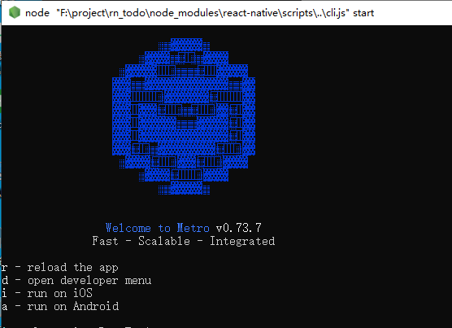

[[toc]]

# React-Native

[React Native](https://reactnative.dev/)

[React-Native(中)](https://reactnative.dev/)

[各种学习资料](https://github.com/reactnativecn/react-native-guide)

```sh
# 初始化项目
npx react-native init projectName

# ts 模板
npx react-native init projectName --template react-native-template-typescript
```

注意点: 

-   npm报错问题: 

    ```sh
    # 设置淘宝镜像
    npm config set registry https://registry.npm.taobao.org
    npm config set disturl https://npm.taobao.org/dist
    
    npm config edit # 打开配置文件
    # 注意, 需要把配置中的 npmjs 相关配置的都注释掉, 比如:
    # registryhttps://registry.npm.org=true
    # //registry.npmjs.org/:_authToken=xxx
    ```

-   Android Studio 模拟器的API版本需要和`react-native`保持一致

-   android 配置文件: `/android/build.gradle`

## 核心组件和API

[核心组件和API](https://reactnative.dev/docs/next/components-and-apis)

-   文本必须放到[`Text`](https://reactnative.dev/docs/next/text)组件中, 相当于是WEB里的`span`

    -   省略文本

        ```tsx
        <Text
          numberOfLines={1}
          ellipsizeMode="tail"
          style={{width: 20}}
        >
          单行省略单行省略单行省略单行省略
        </Text>
        ```

-   文本输入使用[`TextInput`](https://reactnative.dev/docs/next/textinput)([`secureTextEntry`](https://reactnative.dev/docs/next/textinput#securetextentry)属性设置是否隐藏输入内容)

-   布局使用[`View`](https://reactnative.dev/docs/next/view)组件, 相当于是WEB里的`div`

-   图片使用[`Image`](https://reactnative.dev/docs/next/image)组件, 背景图片则使用[`ImageBackground`](https://reactnative.dev/docs/next/imagebackground)(支持内部嵌套)

    -   `resizeMode`属性设置填充模式

    -   引用前端目录的必须使用`require()`

        ```tsx
        <Image source={require("../public/images/logo.png")} /> // 可以指定宽高, 会自动解析
        
        // 支持使用路径别名
        <Image source={require("@/public/images/logo.png")} />
        ```

        >   注意: 地址不能使用变量

    -   网络地址或是本地则使用一个对象的`uri`属性(可以使用动态变量)表示

        ```tsx
        // 网络地址
        <Image
          source={{ uri: "https://img.bizhizu.com/2015/1231/20151231030245752.jpg" }}
          style={{ width: 40, height: 40 }} // 必须要指定宽高
        />
        
        // 也可以直接使用 Android 的 drawable 目录里文件(省略后缀名), ios 同理
        <Image
          source={{ uri: "app_icon" }}
          style={{ width: 40, height: 40 }} // 必须要指定宽高
        />
        
        // 也可以直接使用本机存储图片
        <Image
          source={{ uri: "file:///data/0/xxx" }} // Android
          // source={{ uri: "content:///data/0/xxx" }} // IOS
          // source={{ uri: "data:imgage/png;base64,xxx" }} // 也支持base64
          style={{ width: 40, height: 40 }} // 必须要指定宽高
        />
        ```

-   [`ScrollView`](https://reactnative.dev/docs/next/using-a-scrollview)元素用于滚动视图

    -   横向滚动

        ```tsx
        <ScrollView horizontal>
          <!-- 内部如果需要滚动请使用 Pressable 或者 Touchablexxx 组件 -->
          <View>
            <Text>...</Text>
          </View>
        </ScrollView>
        ```

    -   `ScrollView`内部无法滚动问题, 内部组件不要使用`View`而是使用`Pressable` 或者 `Touchablexxx` 组件

-   [长列表](https://reactnative.dev/docs/next/using-a-listview)使用[`FlatList`](https://reactnative.dev/docs/next/flatlist)和[`SectionList`](https://reactnative.dev/docs/next/sectionlist)

    -   `renderItem`每次渲染都会调用
    -   `ListEmptyComponent`, `ListFooterComponent`, `ListHeaderComponent`提供空列表, 表尾, 表头插槽
    -   `initialNumToRender`指定首次加载的数量
    -   `refreshControl`配合`RefreshControl`组件(`onRefresh`事件)完成下拉加载功能
    -   `horizontal`横向模式
    -   `getItemLayout`手动指定内容尺寸帮助性能优化
    -   `extraData`外部数据依赖
    -   `ListFooterComponent`配合`onEndReached`实现上拉加载更多

-   `loading`使用[`ActivityIndicator`](https://reactnative.dev/docs/next/activityindicator)组件

    ```tsx
    <ActivityIndicator size={50} color="#FFF" />
    ```
    
-   组件的点击事件不能只能绑定给`View`组件, 要使任何元素触发触摸/单击事件, 必须使用[`TouchableOpacity`](https://reactnative.dev/docs/next/touchableopacity), [`TouchableHighlight`](https://reactnative.dev/docs/next/touchablehighlight)或者[`Pressable`](https://reactnative.dev/docs/next/pressable)组件进行包裹, 然后绑定`onPress`事件即可, 不同的组件会有不同的触摸反馈:

    ```tsx
    import { View, Text, TouchableOpacity } from "react-native";
    <TouchableOpacity onPress={() => console.log("onPress")}>
      <View>View</View>
      <Text>Text</Text>
    </TouchableOpacity>
    ```

-   `Modal`提供全部遮罩, `onRequestClose`事件则控制返回按钮操作

-   `StatusBar`状态栏操作

-   `KeyboardAvoidingView`控制键盘

-   `DrawerLayoutAndroid`原生抽屉页面

-   [`AppState`](https://reactnative.dev/docs/appstate)可以知道应用当前是在前台还是在后台，并且能在状态变化的时候进行通知

-   [`Linking`](https://reactnative.dev/docs/linking.html)可以打开`Uri`, 发送意图

-   [`Vibration`](https://reactnative.dev/docs/next/vibration)使用震动

-   [`Keyboard`](https://reactnative.dev/docs/keyboard)控制软键盘

-   [`Dimensions`](https://reactnative.dev/docs/dimensions)获取窗口尺寸(对应的`Hooks`为`useWindowDimensions`)

-   [`Pixelratio`](https://reactnative.dev/docs/pixelratio)像素比

## 样式

定义样式只能使用内联样式`style`, 可以直接写到内联或者使用`StyleSheet.create()`去创建

```tsx
import { useState } from "react";
import { ScrollView, Text, View, StyleSheet, Button } from "react-native";
import type { StyleProp, ViewStyle, TextStyle } from "react-native";

const CompNamp = () => {

  const [count, setCount] = useState(0);

  return (
    <ScrollView>
      <View>
        <Text style={styles.highlight}>count: {count}</Text>
        <Button title="加1" onPress={() => setCount(count + 1)}></Button>
        <Button title="减1" onPress={() => setCount(count - 1)}></Button>
      </View>
    </ScrollView>
  );
};

// 声明样式
const styles = StyleSheet.create({
  highlight: {
    fontWeight: "700",
    color: "red",
    backgroundColor: "blue",
    textAlign: "center",
  }
});

export default CompNamp;
```

### 不支持简写

React Native中是只行实现了一个比较小的CSS的, 里面不支持WEB里面属性简写的用法, 除了`flex: 1`是支持的, 其他比如: `padding: 10`, `margin: 10`都是不支持的

### 样式类型

当封装一个组件时, 元素的样式需要外部传递进来时, 就需要定义对应的样式类型, 如下: 

-   `Text`的样式类型是`TextStyle`

-   `View`的样式类型是`ViewStyle`

如果要实现数组样式的元素类型可以使用`StyleProp`泛型包裹, 比如: `StyleProp<ViewStyle>`, `StyleProp<TextStyle>`, 具体的使用如[指定多个样式](# 指定多个样式)

### 指定多个样式

样式可以写成一个数组, 越往后的优先级越高, 下面是一个简单的`Btn`组件: 

```tsx
import { Text, TouchableOpacity, StyleSheet } from "react-native";
import type { ViewStyle, TextStyle, ImageStyle, GestureResponderEvent, StyleProp } from "react-native";
import theme from "@/styles/theme";

type StyleType = ViewStyle | TextStyle | ImageStyle;
type Pros = {
  text: string;
  type?: "primary" | "success" | "info" | "warning" | "danger"; // 按钮类型
  containerStyle?: StyleProp<StyleType>;
  disabled?: boolean;
  btnTextStyle?: StyleProp<StyleType>;
  onClick?: (event: GestureResponderEvent) => void;
};

const Btn = (prop: Pros) => {
  // 按钮样式
  const getBtnStyle = () => {
    let ret: ViewStyle;
    switch (prop.type) {
      case "primary":
        ret = { backgroundColor: theme.primary };
        break;
      case "info":
        ret = {
          backgroundColor: "#fff",
          borderColor: "#ccc",
          borderWidth: 1,
          borderStyle: "solid"
        };
        break;
      case "danger":
        ret = { backgroundColor: theme.danger };
        break;
      case "warning":
        ret = { backgroundColor: theme.warn };
        break;
      case "success":
        ret = { backgroundColor: theme.success };
        break;
      default:
        ret = { backgroundColor: "#ccc" };
        break;
    }

    return ret;
  };

  return (
    <TouchableOpacity
      // 越往后的样式生效优先级越高
      style={[styles.rowBtn, getBtnStyle(), prop.containerStyle || {}, prop.disabled && { opacity: 0.7 }]}
      onPress={prop.onClick}
      disabled={prop.disabled}
    >
      <Text
        numberOfLines={1}
        ellipsizeMode="tail"
        // 越往后的样式生效优先级越高
        style={[
          styles.rowBtnText,
          {
            color: prop.type === "info" ? "#000" : "#fff"
          },
          prop.btnTextStyle || {}
        ]}
      >
        {prop.text}
      </Text>
    </TouchableOpacity>
  );
};

const styles = StyleSheet.create({
  rowBtn: {
    height: 36,
    width: 170,
    borderRadius: 6,
    justifyContent: "center",
    alignItems: "center"
  },
  rowBtnText: {
    fontSize: 12,
    letterSpacing: 1
  }
});

export default Btn;
```

### 阴影

[阴影](https://reactnative.dev/docs/next/shadow-props)

### 动画

大部分动画都可以使用`useNativeDriver: true`来设置使用原生端来计算动画(默认是JS端计算动画的)

[动画](https://reactnative.dev/docs/next/animations)

```tsx
/** 动画实例 */
let aca: Animated.CompositeAnimation | null = null;

useEffect(() => {
    aca = Animated.loop(
      // 循环动画
      Animated.sequence([
        Animated.timing(scaleAnim, {
          toValue: 1.1, // 最终的值
          duration: 1500, // 过渡时间
          useNativeDriver: true // 使用原生动画(不会阻塞主线程)
        }),
        Animated.timing(scaleAnim, {
          toValue: 1,
          duration: 1500,
          useNativeDriver: true
        })
      ])
    );
    
    // 执行动画
    aca.start();
    
    return () => {
      if (aca) {
        aca.stop();
        aca = null;
      }
    }
}, [scaleAnim]);


/* 扫描线 */
<Animated.View style={{ transform: [{ scale: scaleAnim }]}}>
    <Animated.View style={[styles.border, { transform: [{ translateY: moveAnim }] }]} />
</Animated.View>
```

-   变换

    ```tsx
    
    const styles = StyleSheet.create({
      rotate: {
        transform: [
          { rotate: "90deg" }, // 一行只能写一个
          { translateX: 100 },
          { rotateZ: "10deg" }
        ]
      },
    });
    ```

## 高度和宽度

React Native中的尺寸都是无单位的, 表示的是与设备像素密度无关的逻辑像素点, 如果是需要百分比可以使用字符串, 比如`"100%"`

```tsx
const styles = StyleSheet.create({
  box: {
    width: 20, // 这个 20 的大小, 是会根据设备的逻辑像素点
    height: "50%" // 这个表示高度占父容器的 50%
  }
});
```

### 弹性(Flex)宽高

在React Native中可以使用`flex`布局来让**子组件**动态地扩张或收缩, 一般而言我们会使用`flex: 1`来指定某个组件扩张以撑满所有剩余的空间, 子组件也可以指定`flex: n`来根据比例的平分**父容器**的大小

## 布局

React Native 只提供了[FlexBox布局](https://reactnative.dev/docs/next/flexbox)和**绝对布局**, **不支持浮动和网格布局**

-   React Native 中的 Flexbox 的工作原理和 WEB上的 CSS 基本一致，当然也存在少许差异。首先是默认值不同：`flexDirection`的默认值为`column`(而不是`row`)，`alignContent`默认值为 `flex-start`(而不是 `stretch`), `flexShrink` 默认值为`0` (而不是`1`), 而`flex`只能指定一个数字值

-   React Native中的元素`posttion`的默认值都为`relative`, 所以元素的设置了`posttion: absolute`都是相对于父元素进行定位的

## 调试

启动项目后会出现一个cmd窗口, 如下: 

 

-   输入`r`重新加载app
-   输入`d`会在手机或者模拟器上面打开开发菜单, 选择`Debugging`则可以打开一个chrome浏览器, 使用这个浏览器的控制台可以进行查看和调试的log, 但是不能查看网络请求
-   输入`i`运行到IOS
-   输入`a`运行到Android

>   使用 Chrome 调试目前无法观测到 React Native 中的网络请求, 推荐使用[flipper](https://fbflipper.com/)或者使用第三方的[react-native-debugger](https://github.com/jhen0409/react-native-debugger)

## flipper

[flipper](https://fbflipper.com/)是官方的移动端调试工具, 可以查看网络请求, reducx, sqlint数据库, Shared Preferences很强大

## 网络请求

[网络请求](https://reactnative.dev/docs/next/network)

React Native内置提供了和WEB一模一样的[Fetch API](https://developer.mozilla.org/zh-CN/docs/Web/API/Fetch_API)标准, React Native同样也内置支持[AJAX](https://developer.mozilla.org/zh-CN/docs/Web/API/XMLHttpRequest)(XMLHttpRequest)所以可以直接使用如[`axios`](https://axios-http.com/zh/docs/intro)等一些第三方封装AJAX的库

## 权限操作

[PermissionsAndroid](https://reactnative.dev/docs/permissionsandroid)

```ts
import { PermissionsAndroid, Linking, ToastAndroid } from "react-native";
import type { Permission } from "react-native";

// 获取权限封装
const getPermissions = async (per: Permission, msg = "请设置权限") => {
  // 判断是否有权限
  const isFlog = await PermissionsAndroid.check(per);
  if (!isFlog) {
    const res = await PermissionsAndroid.request(per);
    // 没有权限直接跳转到应用设置界面
    if ([PermissionsAndroid.RESULTS.DENIED, PermissionsAndroid.RESULTS.NEVER_ASK_AGAIN].includes(res)) {
      ToastAndroid.show(msg, ToastAndroid.LONG);
      await Linking.openSettings();
    }
  }
};


// 获取权限
  getPermissions("android.permission.READ_EXTERNAL_STORAGE", "文件读取权限");
  getPermissions("android.permission.WRITE_EXTERNAL_STORAGE", "文件写入权限");
```

## 常用API

[所有的API](https://reactnative.dev/docs/accessibilityinfo)

-   获取设备屏幕的尺寸

    ```ts
    import { Dimensions } from 'react-native';
    
    const dimensions = Dimensions.get('window');
    const window = Dimensions.get("window");
    console.log("window: ", window);
    /* 结果类似
    {
      "width": 411.42857142857144,
      "height": 683.4285714285714,
      "scale": 3.5,
      "fontScale": 1
    }
    */
    ```

-   原生toast: 使用`ToastAndroid`模块即可

-   动画: 使用`Animated`即可

-   自定义后退逻辑使用`BackHandler`模块:

    ```ts
    import { BackHandler, ToastAndroid } from "react-native";
    
    let clickExitDelay = Date.now();
    BackHandler.addEventListener("hardwareBackPress", () => {
      if (Date.now() - clickExitDelay < 2000) {
        // 退出
        return false;
      } else {
        clickExitDelay = Date.now();
        // TODO Toast 无法隐藏, 会导致应用已经退出了, Toast 还存在一段时间
        ToastAndroid.show("再按一次退出", ToastAndroid.SHORT);
        return true;
      }
    });
    ```

-   打开一个抽屉页面使用`DrawerLayoutAndroid`组件

-   状态栏操作使用`StatusBar`组件

-   安全区域使用`SafeAreaView`组件

## 路径别名配置

[路径别名配置](https://reactnative.dev/docs/typescript#%E5%9C%A8-typescript-%E4%B8%AD%E4%BD%BF%E7%94%A8%E8%87%AA%E5%AE%9A%E4%B9%89%E8%B7%AF%E5%BE%84%E5%88%AB%E5%90%8D)使用`babel-plugin-module-resolver`

```sh
yarn add babel-plugin-module-resolve
```

`babel.config.js`

```js
module.exports = {
  presets: ["module:metro-react-native-babel-preset"],
  plugins: [
    [
      "module-resolver",
      {
        root: ["./src"],
        extensions: [".ios.js", ".android.js", ".js", ".ts", ".tsx", ".json"],
        alias: {
          tests: ["./tests/"],
          "@": ["./src"],
        }
      }
    ]
  ]
};
```

`tsconfig.json`

```tsx
{
  "extends": "@tsconfig/react-native/tsconfig.json",
  "compilerOptions": {
    "importsNotUsedAsValues": "error",
    "baseUrl": ".",
    "paths": {
      "@/*": ["src/*"],
      "tests": ["tests/*"],
    },
  },
}
```


## 第三方库

汇总的第三方库可以从[awesome-react-native](https://www.awesome-react-native.com/)这个仓库获取, 下面是一些常用的库: 

| 名称                      | 说明                                                         |
| ------------------------- | ------------------------------------------------------------ |
| 组件库                    | `react-native-paper`,`tamagui`, `native-base`, `react-native-elements`, `react-native-ui-lib`, `rn.mobile.ant.design`, `teaset`, `react-native-ui-kitten` |
| 图标库                    | react-native-vector-icons                                    |
| 动画库                    | react-native-reanimated                                      |
| 手势导航                  | react-native-gesture-handler                                 |
| 安全区域库                | react-native-safe-area-context                               |
| 导航                      | React-Navigation                                             |
| SQLine                    | react-native-sqlite-storage                                  |
| 文件操作                  | react-native-fs                                              |
| 文件上传下载(操作)        | `rn-fetch-blob`, `react-native-blob-util`(推荐)              |
| 滑块                      | @react-native-community/slider                               |
| 权限请求                  | react-native-permissions                                     |
| 设备信息                  | react-native-device-info                                     |
| 本地存储                  | @react-native-async-storage/async-storage                    |
| 截图操作                  | react-native-view-shot                                       |
| 高性能图片组件            | react-native-fast-image                                      |
| 视频播放                  | react-native-video                                           |
| 音频操作                  | react-native-audio-toolkit                                   |
| 爱心飘起特效              | react-native-floating-hearts                                 |
| 烟花落下特效              | react-native-confetti-cannon                                 |
| 相机控制                  | react-native-vision-camera                                   |
| 解析二维码                | vision-camera-code-scanner(作用于`react-native-vision-camera`) |
| 高性能flatlist            | @shopify/flash-list                                          |
| 图库控制                  | react-native-cameraroll                                      |
| 原生dialog                | react-native-dialogs, @react-native-picker/picker            |
| 网格布局                  | react-native-super-grid                                      |
| PDF预览                   | react-native-pdf                                             |
| popup弹出菜单             | react-native-popup-menu                                      |
| 长按弹出菜单              | react-native-hold-menu                                       |
| 文档选择                  | react-native-document-picker                                 |
| 侧滑按钮list              | react-native-swipe-list-view                                 |
| tab可滚动                 | `react-native-scrollable-tab-view`, `react-native-tab-view`  |
| 样式增强                  | react-native-extended-stylesheet                             |
| 下拉选择库                | `siemiatj/react-native-modal-dropdown`, `react-native-select-dropdown`, `react-native-input-select`, `react-native-modal-dropdown` |
| 渐变                      | react-native-linear-gradient                                 |
| 地图                      | react-native-maps                                            |
| 表单                      | tcomb-form-native                                            |
| 自定义toast               | react-native-toast-message                                   |
| modal组件的增强           | react-native-modal                                           |
| 颜色选择器                | react-native-color-picker-ios                                |
| 拟态框                    | react-native-modalfy                                         |
| 底部弹出菜单              | react-native-actions-sheet                                   |
| 交互式底板                | `react-native-bottom-sheet`, `react-native-reanimated-bottom-sheet`, `react-native-raw-bottom-sheet` |
| 执行shell命令             | `react-native-android-shell`, `react-native-command-executer` |
| 按钮弹出更多              | react-native-action-button                                   |
| 日期选择                  | react-native-modal-datetime-picker                           |
| 传统蓝牙                  | react-native-bluetooth-classic                               |
| webview                   | react-native-webview                                         |
| 渲染html为原生组件        | react-native-render-html                                     |
| 将html作为组件            | react-native-htmlview                                        |
| 图片选择                  | react-native-image-picker                                    |
| 图片预览                  | react-native-image-zoom-viewer                               |
| 图片操作(裁剪)            | react-native-image-crop-picker                               |
| 轮播                      | `react-native-swiper`, `react-native-reanimated-carousel`    |
| 抽屉组件                  | react-native-drawer                                          |
| 对话界面                  | react-native-gifted-chat                                     |
| 启动屏                    | react-native-splash-screen                                   |
| 日历选择                  | `react-native-calendars`, `react-native-datepicker`, `react-day-picker` |
| svg                       | react-native-svg                                             |
| 动画库                    | react-native-animatable                                      |
| 聊天界面库                | react-native-gifted-chat                                     |
| 自定义通知                | react-native-push-notification, notifee                      |
| 图表库                    | `react-native-chart-kit`,`react-native-charts-wrapper`,`react-native-echarts` |
| WebGL 着色器              | gl-react-native                                              |
| 进度条                    | react-native-progress                                        |
| 热更新                    | CodePush                                                     |
| 热更新                    | react-native-pushy                                           |
| react-native 开发 windows | react-native-windows                                         |
| 项目配置文件读取          | react-native-config                                          |

>   更多第三方库可以在`GitHub`使用条件搜索`react native stars:>9999`进行搜索

## 原生相关

[原生模块](https://reactnative.dev/docs/next/native-modules-android)

### 上下文获取

Android中的上下文可以直接通过`this`或者是`类名.this`而在React Native中是通过`getReactApplicationContext().getBaseContext()`获取的, 比如: 启动一个toast

```java
ReactApplicationContext context = getReactApplicationContext();
Context context = context.getBaseContext();
Toast.makeText(context, "hello world", Toast.LENGTH_SHORT).show();
```

如果是在一个`ReactContextBaseJavaModule`里面可以直接如下获取： 

```java
Context context = getCurrentActivity().getApplication().getApplicationContext();
```

获取当前的`Activity`使用`getCurrentActivity()`

如果是获取`ReactApplicationContext`则可以在`ReactContextBaseJavaModule`里的构造函数中获取： 

```java
public class Module extends ReactContextBaseJavaModule {
  
  	public static ReactApplicationContext ctx;

    public Module(@Nonnull ReactApplicationContext reactContext) {
        super(reactContext);
      
        // 保存上下文的引用
        ctx = getReactApplicationContext();
    }
}
```

### 与原生端通信

#### 通过原生 Module 进行交互

分如下三步:

1.   原生端定义一个 Module 类实现`ReactContextBaseJavaModule`类, 如下: 

```java
// android/app/src/main/java/com/[项目名]/modules/Module.java

package com.rn_todo.modules; // 对应项目的包名

import android.content.Context;
import android.widget.Toast;

import androidx.annotation.NonNull;
import androidx.annotation.Nullable;

import com.facebook.react.bridge.ReactApplicationContext;
import com.facebook.react.bridge.ReactContextBaseJavaModule;
import com.facebook.react.bridge.ReactMethod;

import java.util.HashMap;
import java.util.Map;

import javax.annotation.Nonnull;

// 这个类必须实现 ReactContextBaseJavaModule
public class Module extends ReactContextBaseJavaModule {
// implements ActivityEventListener 实现这个接口就可以重写 onActivityResult 和 onNewIntent 方法

    public Module(@Nonnull ReactApplicationContext reactContext) {
        super(reactContext);
    }

    @NonNull
    @Override
    public String getName() {
        // 暴露给RN的模块名, 在JS端通过 NativeModules.Module 即可访问到本模块
        return "Module";
    }

    //////////////////// 上面是固定写法
    private Toast mToast;

    @Nullable
    @Override
    // 当前模块还可以预定义一些常量值(可以给到JS端使用)
    public Map<String, Object> getConstants() {
        final Map<String, Object> constants = new HashMap<>();
        constants.put("KEY", "Module 模块常量");
        return constants;
    }

    // Toast 封装
    // 添加 @ReactMethod 注解, 然后方法的返回值必须是 void 才可以给到 JS端 使用(静态方法也可以)
    @ReactMethod
    public void showToast(String msg) {
        if (mToast == null) {
            // 注意这里的上下文的获取和原生Android是不一样的
            Context context = getReactApplicationContext().getBaseContext();
            mToast = Toast.makeText(context, msg, Toast.LENGTH_SHORT);
        } else {
            mToast.setText(msg);
        }
        mToast.show();
    }
}
```

2.   创建自定义 Package 类(实现`ReactPackage`接口)注册上面定义的 Module类, 如下:

```java
// android/app/src/main/java/com/[项目名]/modules/Module.java

package com.rn_todo.reactPackages;

import androidx.annotation.NonNull;

import com.facebook.react.ReactPackage;
import com.facebook.react.bridge.NativeModule;
import com.facebook.react.bridge.ReactApplicationContext;
import com.facebook.react.uimanager.ViewManager;
import com.rn_todo.modules.Module;

import java.util.ArrayList;
import java.util.Collections;
import java.util.List;

// 实现 ReactPackage 接口
public class MyReactPackage implements ReactPackage {
    @NonNull
    @Override
    public List<NativeModule> createNativeModules(@NonNull ReactApplicationContext reactApplicationContext) {
        List<NativeModule> modules = new ArrayList<>();
        // 将新建的 module 实例加入到 List 中完成注册
        modules.add(new Module(reactApplicationContext));
        return modules;
    }

    @NonNull
    @Override
    public List<ViewManager> createViewManagers(@NonNull ReactApplicationContext reactApplicationContext) {
        return Collections.emptyList();
    }
}
```

3.   将自定义的 Package 注册到`MainApplication.java`, 如下:

```java
package com.rn_todo; // 包名需要改
import com.rn_todo.reactPackages.MyReactPackage; // 对应的 Package 类

// ...

public class MainApplication extends Application implements ReactApplication {

  private final ReactNativeHost mReactNativeHost =
      new DefaultReactNativeHost(this) {
        @Override
        public boolean getUseDeveloperSupport() {
          return BuildConfig.DEBUG;
        }

        @Override
        protected List<ReactPackage> getPackages() {
          @SuppressWarnings("UnnecessaryLocalVariable")
          List<ReactPackage> packages = new PackageList(this).getPackages();
          // 将自定义的 Package 类进行注册
          packages.add(new MyReactPackage());
          return packages;
        }

        // ...
      };

  // ...
}
```

4.   React Native端使用`NativeModules`模块即可获取到原生端的模块, 如下: 

```tsx
import { useEffect } from "react";
import { SafeAreaView, ScrollView, StatusBar, Text, useColorScheme, View, NativeModules } from "react-native";
import { Colors } from "react-native/Libraries/NewAppScreen";
import { Button } from "@rneui/base";

import Test from "./test";

// 此处引用的自定义 Module 名必须与自定义 Module 中 getName() 方法返回的字符串一致
const Module = NativeModules.Module;

function App(): JSX.Element {
  const isDarkMode = useColorScheme() === "dark";

  const backgroundStyle = {
    backgroundColor: isDarkMode ? Colors.darker : Colors.lighter
  };

  useEffect(() => {
    // 查看 Module 里面的值
    console.log("Module: ", Module);
  });

  return (
    <SafeAreaView style={backgroundStyle}>
      <StatusBar
        barStyle={isDarkMode ? "light-content" : "dark-content"}
        backgroundColor={backgroundStyle.backgroundColor}
      />
      <ScrollView contentInsetAdjustmentBehavior="automatic" style={backgroundStyle}>
        <View style={backgroundStyle}>
          <Text>App</Text>
          <Button title="调用原生端方法" onPress={() => {
            // 可以直接调用原生端的方法
            Module.showToast("React 前端触发的 Toast");
          }}/>
        </View>
      </ScrollView>
    </SafeAreaView>
  );
}

export default App;
```

参数类型对应如下: 

| JavaScript | Java                                                         |
| ---------- | ------------------------------------------------------------ |
| Bool       | Boolean                                                      |
| Number     | Integer, Double, Float                                       |
| String     | String                                                       |
| Function   | Callback                                                     |
| Object     | `ReadableMap`(原生端接收JS端), 可以通过`Arguments.toHashMap()`创建<br />`WritableMap`(原生端传递JS端), 可以通过`Arguments.createMap()`创建 |
| Array      | `ReadableArray`(原生端接收JS端), 可以通过`Arguments.toArrayList()`创建<br />`WritableArray`(原生端传递JS端), 可以通过`Arguments.createArray()`创建 |

##### 原生端通过 Callback 回调函数返回数据给 JS 端

因为`@ReactMethod`注解的要求必须是`public void`的所以是不能有返回值, 如果需要原生端处理结果后返回对应的值给JS端则需要传递回调函数作为参数给到原生端, 如下:

```java
// 导入对应的类
import com.facebook.react.bridge.Callback;
import com.facebook.react.bridge.Arguments;

// ...

@ReactMethod
public void AndroidCallbackFunc(String str, Callback success, Callback error) {
    Toast.makeText(getReactApplicationContext().getBaseContext(),
            "AndroidCallbackFunc 的参数是: " + str,Toast.LENGTH_SHORT).show();

    if (str.equals("")) {
        // 回调失败, 返回错误信息
        error.invoke("不能传递空字符串哦");
    } else {
        // 回调成功, 返回结果信息
        success.invoke(str.length(), "这是从原生返回数据");
      
      	// 可以回调对象
      	WritableMap map = Arguments.createMap();
        map.putInt("age", 18);
        map.putString("name", "张三");
        success.invoke(map);

      	// 也可以回调数组
        WritableArray array = Arguments.createArray();
        array.pushInt(18);
        array.pushString("hello");
      	success.invoke(array);
    }
}
```

JS端在调用方法时, 传递对应的回调函数即可如下:

```tsx
// 参数必须要和原生端一一对应
Module.AndroidCallbackFunc(
  "hello world", 
  (len: number, str: string) => {
    console.log("JS端回调成功: ", len, str);
  },
  (msg: string) => {
    console.log("JS端回调失败: ", msg);
  }
);
```

##### 原生端通过 Promise 函数返回数据给 JS 端

原生端除了可以使用回调函数的形式返回数据, 也可以使用Promise函数进行回调如下: 

```java
// 导入对应的类
import com.facebook.react.bridge.Promise;
import com.facebook.react.bridge.Arguments;

// ...

@ReactMethod
public void AndroidPromiseFunc(String str, Promise promise) {
    Toast.makeText(getReactApplicationContext().getBaseContext(),
            "AndroidPromiseFunc 的参数是: " + str,Toast.LENGTH_SHORT).show();

    if (str.equals("")) {
        // 失败回调
        promise.reject("不能传递空字符串哦");
    } else {
        // 成功回调
        promise.resolve("这是从原生返回数据");
      
      	// 可以回调对象
      	WritableMap map = Arguments.createMap();
        map.putInt("age", 18);
        map.putString("name", "张三");
        promise.resolve(map);

      	// 也可以回调数组
        WritableArray array = Arguments.createArray();
        array.pushInt(18);
        array.pushString("hello");
      	promise.resolve(array);
    }
}
```

JS端在调用方法时可以直接使用`then/catch`或者`async`+`await`, 如下: 

```tsx
Module.AndroidPromiseFunc("hello world")
  .then((res: string) => {
    console.log("JS端Promise成功: ", res);
  }).catch((err: string) => {
    console.log("JS端Promise失败: ", err);
  }).finally(() => {
    console.log("finally");
  });
```

#### 通过自定义事件进行交互

在原生端通过 `RCTDeviceEventEmitter` 即可发送事件, 如下是一个简单的封装: 

```java
package com.rn_pda.utils;

import com.facebook.react.bridge.Arguments;
import com.facebook.react.bridge.ReactContext;
import com.facebook.react.bridge.WritableMap;
import com.facebook.react.modules.core.DeviceEventManagerModule;

import javax.annotation.Nullable;


// 原生端 和 RN 之间的事件通信
public class Event {
    //定义向 RN 发送事件的函数
    public static void sendEvent(ReactContext reactContext, String eventName, @Nullable WritableMap params) {
        reactContext
                .getJSModule(DeviceEventManagerModule.RCTDeviceEventEmitter.class)
                .emit(eventName, params);
    }

    // 发送消息
    // eventName 事件名
    // event 事件对象, 使用Arguments.createMap() 创建, 使用putxxx 添加对应的数据
     public static void emit(ReactContext reactContext, String eventName, WritableMap event) {
         sendEvent(reactContext, eventName, event);
     }
}
```

原生端发送消息操作如下: 

```java
import com.facebook.react.bridge.WritableMap;
import com.rn_pda.utils.Event; // 这里导入封装的类

// 新增事件对象
WritableMap event = Arguments.createMap();
event.putString("数据", msg);
// 发送给事件JS端
Event.emit(getReactApplicationContext(), "事件名称", event);
```

>   原生端可以在任何时候发送事件, 只要能获取到 `ReactContext` 上下文对象(`getReactApplicationContext()`)

在JS端注册监听器, 并在合适的时机移除监听器如下: 

```TSX
import { useEffect } from "react";
import { DeviceEventEmitter, EmitterSubscription } from "react-native";

// JAVA端事件监听实例
let scanLinstener: EmitterSubscription;

useEffect(() => {
  // 监听事件, 事件名必须对应 JAVA端的事件名
  scanLinstener = DeviceEventEmitter.addListener("事件名", (msg: any) => {
    console.log("事件名 data: ", msg);
  });

  () => {
    // 停止监听
    if (scanLinstener) scanLinstener.remove();
  };
}, []);
```

>   注意: `RCTDeviceEventEmitter`这种方式通信在IOS端是不行的, 还需要添加一个自定义的 Module, 见[这里](https://juejin.cn/post/6844903866341801998#heading-20)

### 与原生UI交互

通过自定义 `Module` 进行交互可以解决大部分开发需求, 有的时候，基于性能和开发工作量的角度考虑，我们可以将原生的组件或布局封装好，并为这个原生 `View` 建立一个继承自 `SimpleViewManager` 或 `ViewGroupManager` 的 `ViewManager` 类。通过这个 `ViewManager` 可以注册一系列原生端和 JS 端的参数及事件映射，达到交互的目的

#### 创建原生View

以封装一个简单的`Button`为例, 如下: 

```java
package com.szzc_pda.ui.NaiveButton;

import android.content.Context;

// 封装原生按钮供JS端使用
public class NaiveButton extends androidx.appcompat.widget.AppCompatButton {
    public NaiveButton(Context context) {
        super(context);
    }
}
```

#### 创建对应的ViewManager类

简单的 `View` 可以创建 `ViewManager` 类继承 `SimpleViewManager` , 如果要在这个原生UI下嵌套子UI组件时则需要使用  `ViewGroupManager` :

```java
// ... 省略导入

// 创建对应的 SimpleViewManager 子类
public class NativeButtonSimpleViewManager extends SimpleViewManager<NaiveButton> {
    static NaiveButton mBtn;

    @NonNull
    @Override
    public String getName() {
        return "NativeButton"; // 此处的名称对应 JS 的引用, 通过 requireNativeComponent("xxx"); 获取对应的组件
    }

    // 创建 view 实例
    @NonNull
    @Override
    protected NaiveButton createViewInstance(@NonNull ThemedReactContext themedReactContext) {
        mBtn = new NaiveButton(themedReactContext);
        return mBtn;
    }
}
```

#### 注册ViewManager类

在上面的[与原生端通信](# 与原生端通信)中, 在`reactPackages`类中使用了`createNativeModules()`方法里注册 `Module` 的, 注册原生端则需要在`createViewManagers()`方法中注册刚刚创建的`NaiveButton`实例：

```java
package com.szzc_pda.reactPackages;

import com.facebook.react.ReactPackage;
import com.facebook.react.bridge.NativeModule;
import com.facebook.react.bridge.ReactApplicationContext;
import com.facebook.react.uimanager.ViewManager;

import com.szzc_pda.modules.Module;
import com.szzc_pda.ui.NaiveButton.NativeButtonSimpleViewManager;

import java.util.ArrayList;
import java.util.Collections;
import java.util.List;

import javax.annotation.Nonnull;

public class MyReactPackage implements ReactPackage {
    @Nonnull
    @Override
    public List<NativeModule> createNativeModules(@Nonnull ReactApplicationContext reactContext) {
        List<NativeModule> modules = new ArrayList<>();

        // 将新建的 module 实例加入到 List 中完成注册
        modules.add(new Module(reactContext));
        return modules;
    }

    @Nonnull
    @Override
    public List<ViewManager> createViewManagers(@Nonnull ReactApplicationContext reactContext) {
        List<ViewManager> views = new ArrayList<>();
        // 创建 NativeButtonSimpleViewManager 实例并注册到 ViewManager List 中
        views.add(new NativeButtonSimpleViewManager());
        return views;
    }
}
```

#### 在JS端使用组件

通过`requireNativeComponent<T>("组件名称")`即可解析出原生端注册的组件(注意名称一定要对应元素端`getName()`返回的名称): 

```tsx
import { requireNativeComponent } from "react-native";

// 解析组件
const NativeButton = requireNativeComponent<{}>("NativeButton");
```

#### 原生端通过@ReactProps接收JS端传递的组件值

原生端通过`@ReactProps`注解即可接收JS端传递的组件值

```java
public class MyReactPackage implements ReactPackage {
    @Nonnull
    @Override
    public List<NativeModule> createNativeModules(@Nonnull ReactApplicationContext reactContext) {
        List<NativeModule> modules = new ArrayList<>();

        // 将新建的 module 实例加入到 List 中完成注册
        modules.add(new Module(reactContext));
        return modules;
    }

    @Nonnull
    @Override
    public List<ViewManager> createViewManagers(@Nonnull ReactApplicationContext reactContext) {
        List<ViewManager> views = new ArrayList<>();
        // 创建 NativeButtonSimpleViewManager 实例并注册到 ViewManager List 中
        views.add(new NativeButtonSimpleViewManager());
        return views;
    }

    // 暴露给 JS 的参数(text="xxx"), 给定值以后触发这个方法就可以设置按钮的文本了
    // 默认值为 hello
    @ReactProp(name = "text", defaultString = "hello")
    public void setText(NaiveButton view, String text) {
        view.setText(text);
    }
}
```

JS端可以正常的传递值

```jsx
import { requireNativeComponent } from "react-native";

// 原生UI控件接收值类型
export type NativeButtonProps = {
  text: string; // 按钮文本
};

// 解析组件
const NativeButton = requireNativeComponent<NativeButtonProps>("NativeButton");

// 页面使用
<NativeButton text="按钮文本" />
```

除了`name`，`@ReactProp`注解还接受这些可选的参数：`defaultBoolean`, `defaultInt`, `defaultFloat`。这些参数必须是对应的基础类型的值（也就是`boolean`, `int`, `float`），这些值会被传递给 setter 方法，以免 JavaScript 端某些情况下在组件中移除了对应的属性。注意这个"默认"值只对基本类型生效，对于其他的类型而言，当对应的属性删除时，`null`会作为默认值提供给方法

>   JS端传递给原生端的数据, 如上面的`text`如果在运行时改变了, 原生端同样会触发**更新**

#### 原生端通过注册事件与 JS 端的映射与 JS 端使用

```java
public class NativeButtonSimpleViewManager extends SimpleViewManager<NaiveButton> {
    static NaiveButton mBtn;
    private String btnText;

    @NonNull
    @Override
    public String getName() {
        return "NativeButton";
    }

    // 创建 view 实例
    @SuppressLint("ClickableViewAccessibility") // 触摸和监听同时监听
    @NonNull
    @Override
    protected NaiveButton createViewInstance(@NonNull ThemedReactContext themedReactContext) {
        mBtn = new NaiveButton(themedReactContext);
        // 需要设置一个id, 用于原生 view 向 react native 发送事件
      	mBtn.setId(R.id.Mbtn);

        // 触摸事件
        mBtn.setOnTouchListener((view, event) -> {
            int iAction = event.getAction();
            // 事件对象(可以传递数据)
            WritableMap map = Arguments.createMap();
            if (iAction == MotionEvent.ACTION_DOWN) { // 按下
                map.putString("msg", "原生按下事件");
                // 与下面注册的要发送的事件名称必须相同
                themedReactContext.getJSModule(RCTEventEmitter.class).receiveEvent(mBtn.getId(), "onNativeMousedown", map);
                mBtn.setText("按下了");
            } else if (iAction == MotionEvent.ACTION_UP) { // 弹起
                map.putString("msg", "原生弹起事件");
                // 与下面注册的要发送的事件名称必须相同
                themedReactContext.getJSModule(RCTEventEmitter.class).receiveEvent(mBtn.getId(), "onNativeMouseup", map);
                mBtn.setText("弹起了");
            }
            return false; // false 表示系统会继续处理, true 取消冒泡
        });

        // 绑定点击事件
        mBtn.setOnClickListener(view -> {
            WritableMap map = Arguments.createMap();
            map.putString("msg", "原生click事件");
            // 与下面注册的要发送的事件名称必须相同
            themedReactContext.getJSModule(RCTEventEmitter.class).receiveEvent(mBtn.getId(),"onNativeClick", map);
        });
        return mBtn;
    }

    public Map getExportedCustomDirectEventTypeConstants() {
        // onNativeClick 是原生要发送的 event 名称, onReactClick 是 JS 端组件中注册的属性方法名称, 中间的 registrationName 不可更改
        Map<String, Map<String, String>> map = MapBuilder.of();
        map.put("onNativeClick", MapBuilder.of("registrationName", "onReactClick"));
        map.put("onNativeMousedown", MapBuilder.of("registrationName", "onNativeMousedown"));
        map.put("onNativeMouseup", MapBuilder.of("registrationName", "onNativeMouseup"));
        return map;
    }
}
```

##### JS端就可以直接监听对应的事件

```tsx
import { requireNativeComponent } from "react-native";

// 原生UI控件接收值类型
export type NativeButtonProps = {
  text: string; // 按钮文本
  onReactClick?: (event: any) => void; // 原生点击事件
  onNativeMousedown?: (event: any) => void; // 原生按下事件
  onNativeMouseup?: (event: any) => void; // 原生弹起事件
};

// 解析组件
const NativeButton = requireNativeComponent<NativeButtonProps>("NativeButton");

// 页面使用
<NativeButton
  text="按钮文本"
  onReactClick={data => {
    console.log("点击事件: ", data, data.nativeEvent);
  }}
  onNativeMousedown={data => {
    console.log("按下事件: ", data, data.nativeEvent);
  }}
  onNativeMouseup={data => {
    console.log("弹起事件: ", data, data.nativeEvent);
  }}
/>
```

### OnActivityResult

原生开发中, 可以使用`startActivityForResult(intent, requestCode)`配合`onActivityResult(int requestCode, int resultCode, Intent data)`获取从另一个`activity`返回的数据

在`React-Native`中, 在`Android`原生模块中像往常一样重写了`onActivityResult`, 根本不会调用

正确的方式有如下的两种:

1.   在原生模块创建一个内部类实例, 该实例继承`BaseActivityEventListener`, 具体类型是`ActivityEventListener`, 该类型需要实现`onActivityResult()`方法
2.   在原生模块构造函数中对上下文使用`addActivityEventListener`添加监听, 监听对象就是第一步创建的`ActivityEventListener`实例

```java
package com.wddmt.modules;

import static android.app.Activity.RESULT_OK;

import android.app.Activity;
import android.content.Intent;

import com.facebook.react.bridge.ActivityEventListener;
import com.facebook.react.bridge.BaseActivityEventListener;
import com.facebook.react.bridge.Promise;
import com.facebook.react.bridge.ReactApplicationContext;
import com.facebook.react.bridge.ReactContextBaseJavaModule;
import com.facebook.react.bridge.ReactMethod;

/**
 * 扫码模块
 */
public class ScannerModule extends ReactContextBaseJavaModule {
    /**
     * 给扫码页面的请求码
     */
    private final int REQUEST_ECODE_SCAN = 1;

    /**
     * 扫码响应 Promise 实例
     */
    private Promise mPromise;

    /**
     * 上下文
     */
    private ReactApplicationContext mContext;

    public ScannerModule(ReactApplicationContext reactContext) {
        super(reactContext);

        // 保存上下文
        mContext = reactContext;
      
        // 添加监听 ActivityEventListener
        mContext.addActivityEventListener(mActivityEventListener);
    }

    @Override
    public String getName() {
        return "ScannerModule";
    }

    /**
     * 这里创建一个 BaseActivityEventListener 实例
     */
    private final ActivityEventListener mActivityEventListener = new BaseActivityEventListener() {

        /**
         * 重写 onActivityResult
         * 这个回调的效果同 Android 原生 Activity 里面的 onActivityResult 回调是一样的
         */
        @Override
        public void onActivityResult(Activity activity, int requestCode, int resultCode, Intent data) {

            // 判断是否是我们的 requestEcoderScan 里面指定的请求码
            if (mPromise != null && requestCode == REQUEST_ECODE_SCAN) {

                // 是失败的
                if (resultCode == Activity.RESULT_CANCELED) {
                    mPromise.reject("SCAN_CODE_ERROR", "操作被取消了");

                    // 是成功的
                } else if (resultCode == RESULT_OK && data.getData() != null) {

                    // 获取返回的数据
                    String result = data.getStringExtra("data");

                    // 返回给JS端
                    mPromise.resolve(result);
                } else {
                    mPromise.reject("SCAN_CODE_ERROR", "二维码识别失败，请稍候再试");
                }

                // 重置保存的 Promise 实例
                mPromise = null;
            }
        }
    };

    /**
     * 这个方法是跳转到一个扫码界面的方法
     */
    @ReactMethod
    public void requestEcoderScan(final Promise promise) {

        // 保存 Promise 实例
        this.mPromise = promise;

        // 获取当前 Activity
        Activity activity = getCurrentActivity();

        if (activity == null) {
            mPromise.reject("E_ACTIVITY_DOES_NOT_EXIST", "没有获取到 Activity");
            return;
        }

        try {
            Intent intent = new Intent(activity, ScanActivity.class);
            // 启动扫码页面, 这里是使用 startActivityForResult 可以让该页面回调返回值
            activity.startActivityForResult(intent, REQUEST_ECODE_SCAN);
        } catch (Exception e) {
            mPromise.reject("START_ACTIVITY_ERROR", "跳转扫码页面失败");
            mPromise = null;
        }
    }
}

```

## 环境或构建问题

[maven](https://mvnrepository.com/)仓库很慢, 可以使用[阿里云镜像](https://developer.aliyun.com/mvn/guide)

### gradle下载很慢

gradle下载依赖很慢, 可以配置国内镜像, 

#### 全局配置

新建`[user]/.gradle/init.gradle`文件, 如下:

```groovy
allprojects{
    repositories {
        def ALIYUN_REPOSITORY_URL = 'https://maven.aliyun.com/repository/public'
        def ALIYUN_JCENTER_URL = 'https://maven.aliyun.com/repository/public'
        def ALIYUN_GOOGLE_URL = 'https://maven.aliyun.com/repository/google'
        def ALIYUN_GRADLE_PLUGIN_URL = 'https://maven.aliyun.com/repository/gradle-plugin'
        all { ArtifactRepository repo ->
            if(repo instanceof MavenArtifactRepository){
                def url = repo.url.toString()
                if (url.startsWith('https://repo1.maven.org/maven2/')) {
                    project.logger.lifecycle "Repository ${repo.url} replaced by $ALIYUN_REPOSITORY_URL."
                    remove repo
                }
                if (url.startsWith('https://jcenter.bintray.com/')) {
                    project.logger.lifecycle "Repository ${repo.url} replaced by $ALIYUN_JCENTER_URL."
                    remove repo
                }
                if (url.startsWith('https://dl.google.com/dl/android/maven2/')) {
                    project.logger.lifecycle "Repository ${repo.url} replaced by $ALIYUN_GOOGLE_URL."
                    remove repo
                }
                if (url.startsWith('https://plugins.gradle.org/m2/')) {
                    project.logger.lifecycle "Repository ${repo.url} replaced by $ALIYUN_GRADLE_PLUGIN_URL."
                    remove repo
                }
            }
        }
        maven { url ALIYUN_REPOSITORY_URL }
        maven { url ALIYUN_JCENTER_URL }
        maven { url ALIYUN_GOOGLE_URL }
        maven { url ALIYUN_GRADLE_PLUGIN_URL }
    }
}
```

#### 项目内配置

修改项目中的`build.gradle`文件

```groovy
buildscript {
    repositories {
        maven{ url 'https://maven.aliyun.com/repository/public'}
        maven{ url 'https://maven.aliyun.com/repository/google'}
    }
}

allprojects {
    repositories {
        maven{ url 'https://maven.aliyun.com/repository/public'}
        maven{ url 'https://maven.aliyun.com/repository/google'}
    }
}
```

### kotlin-compiler-embeddable 下载很慢

自己手动下载[kotlin-compiler-embeddable](https://repo1.maven.org/maven2/org/jetbrains/kotlin/kotlin-compiler-embeddable)然后放到`[user]/.gradle/caches/modules-2/files-2.1/org.jetbrains.kotlin/kotlin-compiler-embeddable/[版本号]/[pom.sha1文件内容]`下面

## adb

adb的全称为Android Debug Bridge，就是起到调试桥的作用, 通过adb我们直接通过命令行来调试Android程序

### 无线连接

### 无线调试

电脑和手机连接同一个局域网, 然后手机开启无线调试后, 就可以看到IP地址和端口了, 电脑使用`abd`可以直接连接: 

```sh
# 连接指定IP地址的设备
adb connect 192.168.1.102:44625

# 查看到已授权的手机设备
adb devices

# 断开连接
adb disconnect 192.168.1.102:44625
```

### 其他命令

```sh
# 获取 adb 的 错误日志输出到指定文件中
adb logcat -v time *:E > run.log
```

## 打包

[打包](https://reactnative.dev/docs/next/signed-apk-android)

需要使用`keytool`命令生成一个私有密钥, 命令如下:

```sh
# 生成的文件: myAlias.keystore
# 别名: myAlias
# 过期时间: 36500天(十年)
keytool -genkeypair -v -storetype PKCS12 -keystore myAlias.keystore -alias myAlias -keyalg RSA -keysize 2048 -validity 36500
```

然后就需要输入密钥库(keystore)和对应密钥的密码, 然后输入一些发行信息(国家, 地区, 组织)等然后将会生成一个证书

将生成的证书放到`android/app`中, 在`android/gradle.properties`中添加证书相关的 gradle 变量, 如下:

```properties
# ...

# 证书文件名
MYAPP_RELEASE_STORE_FILE=myAlias.keystore
# 证书别名
MYAPP_RELEASE_KEY_ALIAS=myAlias
# 证书密钥(写生成证书时的密钥)
MYAPP_RELEASE_STORE_PASSWORD=***
MYAPP_RELEASE_KEY_PASSWORD=***
```

修改`android/app/build.gradle`文件, 加入签名配置, 如下: 

```groovy
// ...
android {
    // ...
    defaultConfig { 
    	// ...
      
      // 打包如果报 Execution failed for task ':app:mergeReleaseResources'. 则添加下面这两行
      aaptOptions.cruncherEnabled = false
      aaptOptions.useNewCruncher = false
    }
    signingConfigs {
        release {
            if (project.hasProperty('MYAPP_RELEASE_STORE_FILE')) {
                storeFile file(MYAPP_RELEASE_STORE_FILE)
                storePassword MYAPP_RELEASE_STORE_PASSWORD
                keyAlias MYAPP_RELEASE_KEY_ALIAS
                keyPassword MYAPP_RELEASE_KEY_PASSWORD
            }
        }
    }
    buildTypes {
        release {
            // ...
            signingConfig signingConfigs.release
        }
    }
}
// ...
```

执行打包命令如下: 

```sh
cd android

# PowerShell 环境下需要加 ./
./gradlew assembleRelease

# cmd, base shell, 则不需要
gradlew assembleRelease
```

打包生成的`APK`文件会在`android/app/build/outputs/apk/release`目录下, 叫`app-release.apk`

>   注意：请确保`android/gradle.properties` 中`没有`包含`_org.gradle.configureondemand=true_`，否则会跳过 js 打包的步骤，导致最终生成的是一个无法运行的空壳

### 测试应用的发行版本

可以执行以下的命令把发行(`release`)版本的应用直接安装到`模拟机`或`use连接的真机`上

```sh
npx react-native run-android --variant=release
```

`--variant=release`参数只能在完成了上面的签名配置之后才可以使用

>   注意: 在`debug`和 `release`版本间来回切换安装时可能会报错签名不匹配, 此时需要先卸载前一个版本再重新安装
