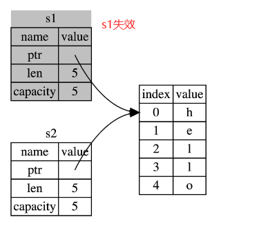
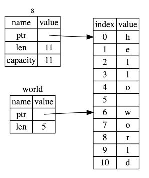
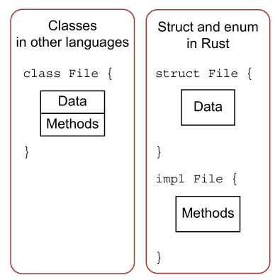
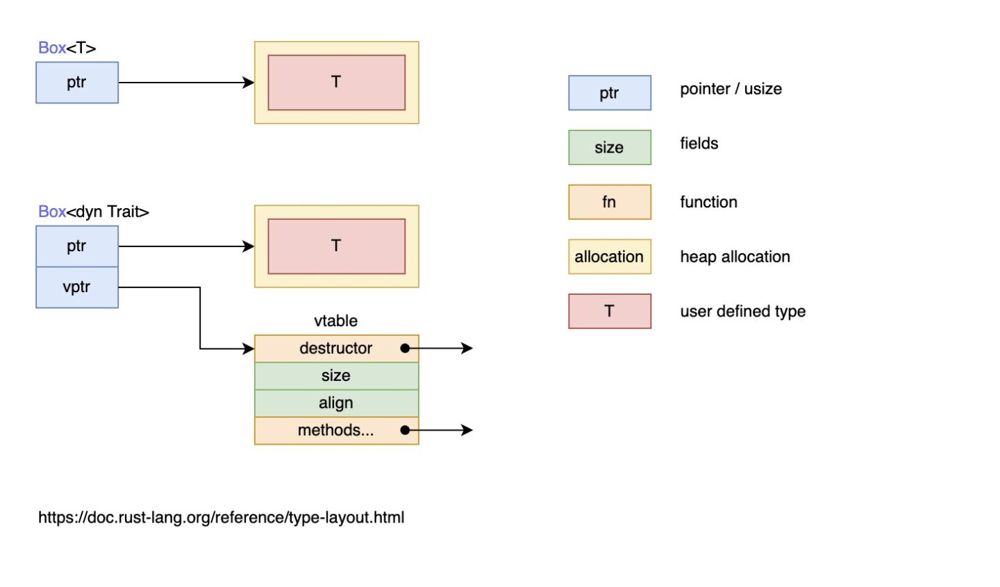
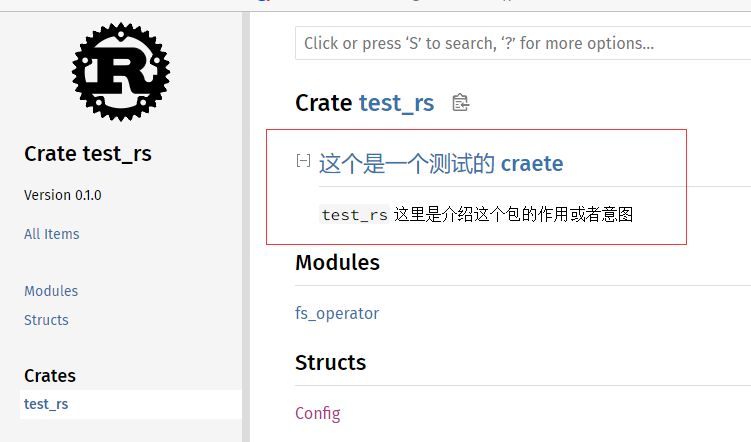

[[toc]]

## Rust

[Rust圣经](https://doc.rust-lang.org/book/)

[Rust圣经(中)](https://course.rs/about-book.html)

[官网](https://www.rust-lang.org/zh-CN/learn)

[官方参考书](https://doc.rust-lang.org/reference/introduction.html)

[Rust使用指南](https://rusty.rs/about.html)

[rust资源集合](https://github.com/rust-unofficial/awesome-rust)

Rust是一门无 GC 且无需手动内存管理, 性能高, 工程性强, 语言级安全性高的一门语言, 连续 6 年获得最受欢迎的编程语言

## 环境搭建

`rustup`是 Rust 的安装程序, 也是它的版本管理程序

Windows 上安装 Rust 需要有`C++`环境, 先安装[Microsoft C++ Build Tools](https://visualstudio.microsoft.com/zh-hans/visual-cpp-build-tools/), 还需要下载C++环境, 安装路径也可以改一下, 毕竟占用空间还是挺大的

 

最后下载[RUST-INIT](https://www.rust-lang.org/zh-CN/learn/get-started)安装即可, 测试命令如下: 

```sh
rustc -V
# rustc 1.62.1 (e092d0b6b 2022-07-16)

cargo -V
# cargo 1.62.1 (a748cf5a3 2022-06-08)
```

如果安装成功后看不到输出对应的版本号, 可以检查一下环境变量path中是否有`~\.cargo\bin`路径

> 安装完`rustc`后可以使用`rustup doc`来查看官方的[api](https://doc.rust-lang.org/std/index.html)文档

### 卸载

要卸载它`Rust`和`rustup`, 使用如下命令

```sh
rustup self uninstall
```

### vs code环境配置

插件推荐使用`rust-analyzer`, 其他插件推荐如下: 

1.   `Even Better TOML`: 支持 `.toml` 文件完整特性
2.   `Error Lens`: 更好的获得错误展示
3.   `CodeLLDB`: Debugger 程序

## cargo

`cargo`有点像node的npm差不多, 只不过`cargo`更加的强大, 它提供了一系列的工具, 从项目的建立, 构建到测试, 运行直至部署, 为 Rust 项目的管理提供尽可能完整的手段. 同时, 与 Rust 语言及其编译器`rustc`紧密结合(默认安装)

>   [cargo中文使用指南](https://course.rs/cargo/intro.html)

### 创建项目

```sh
# 在当前目录下创建一个项目叫 learn_rust
$ cargo new learn_rust

$ cd learn_rust
$ code .
```

### 默认的目录结构

```sh
$ tree
.
├── .git
├── .gitignore
├── Cargo.toml
└── src
    └── main.rs
```

### 运行项目

#### cargo run

`cargo run`命令自动编译运行

```sh
$ cargo run
   Compiling learn_rust v0.1.0 (F:\study\learn_rust)
    Finished dev [unoptimized + debuginfo] target(s) in 0.79s
     Running`target\debug\learn_rust.exe`
Hello, world!
```

#### 手动编译和运行项目

`cargo build`命令会将文件编译到`./target/debug`目录下手动运行即可

```sh
$ cargo build
    Finished dev [unoptimized + debuginfo] target(s) in 0.01s

$ cd ./target/debug

$ learn_rust
Hello, world!
```

上面的命令运行的是`debug`模式, 在这种模式下,**代码的编译速度会非常快**, 但是**运行速度就慢了**, 通过添加添加`--release`命令可以开启高性能模式, 如下: 

- `cargo run --release`
- `cargo build --release`

### cargo check

当项目大了之后,`cargo run`和`cargo build`不可避免的会变慢, 可以使用`cargo check`命令, 它的作用是快速的检查一下代码能否编译通过. 因此该命令速度会非常快, 能节省大量的编译时间

### Cargo.toml 和 Cargo.lock

`Cargo.toml`和`Cargo.lock`是`cargo`的核心文件, 类似node的包管理工具的`package.json`和对应包管理工具的`lock`文件: 

- `Cargo.toml`是`cargo`特有的**项目数据描述文件**. 它存储了项目的所有元配置信息, 如果 Rust 开发者希望 Rust 项目能够按照期望的方式进行构建, 测试和运行, 那么, 必须按照合理的方式构建`Cargo.toml`. 
- `Cargo.lock`文件是`cargo`工具根据同一项目的`toml`文件生成的**项目依赖详细清单**

>   使用`cargo --help`可以查看所有的命令

#### Cargo.toml配置详解

完整配置见[官方文档](https://doc.rust-lang.org/cargo/reference/manifest.html)

##### package配置段落

```toml
[package]
name = "learn_rust" # 项目名称
version = "0.1.0" # 当前版本
edition = "2021" # 使用的 Rust 的大版本
```

##### 定义项目依赖

在`Cargo.toml`中, 在`[dependencies]`段落中通过各种依赖段落来描述该项目的各种依赖项: 

- 基于 Rust 官方仓库`crates.io`, 通过版本说明来描述
- 基于项目源代码的 git 仓库地址, 通过 URL 来描述
- 基于本地项目的绝对路径或者相对路径, 通过类 Unix 模式的路径来描述

三种形式具体写法如下: 

```toml
[dependencies]
rand = "0.3"
hammer = { version = "0.5.0"}
color = { git = "https://github.com/bjz/color-rs" }
geometry = { path = "crates/geometry" }
```

> 指定依赖见[这里](https://course.rs/cargo/reference/specify-deps.html)

### 增加新的镜像地址

在`~.cargo/config.toml`文件中写入如下的配置, 将默认的`crates.io`镜像配置成[科大镜像](https://mirrors.ustc.edu.cn/help/crates.io-index.html): 

```toml
# 将默认的 crates-io 替换成新的镜像源 ustc
[source.crates-io]
replace-with = 'ustc'


# 创建一个新的镜像源 ustc
[source.ustc]
registry = "git://mirrors.ustc.edu.cn/crates.io-index"
```

>  当碰到构建时卡住可以尝试删除`~.cargo/.package_cache`里的包缓存文件重新构建

### cargo配置

cargo默认存在两种配置(*profile*):

-   `dev profile`对应的命令为`cargo build`
-   `release profile`对应的命令为`cargo build --release`

#### 自定义profile

不配置则使用默认的`profile`, 可以在`cargo.toml`里使用`[profile.xxx]`块来修改对应的配置: 

```toml
[profile.dev] # 修改 dev profile 对应的配置
opt-level = 0 # 代码优化程度 0 ~ 3 会增加编译时间


[profile.release] # 修改 release profile 对应的配置
opt-level = 3
```

更多配置参考可以见[cargo config](https://doc.rust-lang.org/cargo/reference/config.html)

### 发布包到crates.io

-   登录[crates.io](https://crates.io/)注册账号, 生成API Token

-   根据生成的token运行`cargo login 生成的token`, **cargo**会把这个token保存到`~/.cargo/credentials`

-   配置**create**的元数据`cargo.toml`

    -   `crate`: 唯一的名称

    -   `description`:描述

    -   `license`: 许可证信息, 例如:MIT, 可指定多个使用`OR`

    -   `version`: 版本

    -   `author`: 作者信息

    >   参数格式或者描述见[manifest](https://doc.rust-lang.org/cargo/reference/manifest.html)

-   发布命令: `cargo publish`

>   **crate** 一旦发布就是永久的, 该版本无法覆盖, 代码无法删除, 目的是依赖于该版本的项目可以正常工作

#### 更新版本

只需要修改已经发布的包的`cargo.toml`里的`version`然后重新发布即可(版本号使用的是[semver](https://semver.org/)语义化版本)

#### 撤销版本

使用`cargo yank --vers 版本号`, 即可撤回版本(不会删除任何代码), 不可以撤回 crate 之前的版本

- 可以防止其它项目把它作为新的依赖

- 已经存在项目可继续将其作为依赖（并可下载)
  

`yank`意味着

- 所有已经产生`Cargo.lock`的项目都不会中断
- 任何将来生成的`Cargo.lock`文件都不会使用被`yank`的版本

#### 取消撤回

使用`cargo yank --vers 版本号 --undo`

### 从crates.io里按照二进制包

使用`cargo install 包名`即可下载, crates.io 上面的`binary`(二进制包), 默认下载存放的目录是`~/.cargo/bin`可以把该目录放到`Path`环境变量中, 这样下载的二进制包就可以直接运行

## hello world

下面的是官方的hello world示例,`fn`定义一个函数, 和大多数的其他类型差不多的是`main`函数是一个项目的入口函数

`println!`等价于c语言的`println`, 但是多了一个`!`,  在 Rust 中, 这是`宏`操作符, 可以简单的认为宏是一种特殊类型函数

```rust
fn main() {
    println!("Hello, world!");
}
```

`println!()`支持使用`{}`占位符, Rust 会自动识别输出数据的类型, 如下: 

```rust
let str1 = "Hello, world!";
println!("{}", &str1);
```

>   更多占位符见[`std::fmt`](https://doc.rust-lang.org/std/fmt/index.html)

## 变量

在Rust中支持声明可变变量和不可变变量

### 变量命名

Rust的变量的命名遵循[Rust命名规范](https://course.rs/practice/naming.html), 大部分情况下是使用的蛇形命令,`xxx_yyy_zzz`(全小写)

### 变量的绑定

使用`let`关键字, 类型可以省略Rust会自动推断出相应的类型

```rust
let a = "hello world";

// 常量必须定义类型
const STR: &str = "hello world";
```

> 为什么叫**变量绑定**而不是**变量赋值**, 这里设计到Rust的核心原则--**所有权**(任何内存对象都是有主人的, 一般情况下完全属于它的主人, 绑定就是把这个对象绑定给一个变量, 让这个变量成为它的主人)

### 可变变量

Rust 的变量在默认情况下是**不可变的**, 但是可以通过`mut`关键字让变量变为**可变的**, 如下:

```rust
fn main() {
    let mut x = 1;
    println!("{}", x);
    x = 2;
    println!("{}", x);
}
```

>`mut`关键字只是表示该变量的值是可以改变的, 但是不能改变它的类型

### 使用下划线忽略未使用的变量

Rust对已定义但是未使用的变量是会有警告的, 如果不想要这个警告可以使用下划线来对这个未使用的变量进行命名, 如下:

```rust
fn main() {
    let _x = 5;
    let y = 10; // 这里会报一个警告
}
```

### 变量解构

变量解构默认不可变, 如需要可变, 需要加`mut`关键字, 如下: 

```rust
fn main() {
    let (a, mut b) = (1, 2);
    // a = 1(不可变), b = 2(可变)
    println!("a = {}, b = {}", a, b);
}
```

### 常量

常量不允许使用`mut`,**常量不仅仅默认不可变, 而且自始至终不可变**, 因为常量在编译完成后, 已经确定它的值, 常量使用`const`关键字声明, 并且值的类型也**必须一起声明**, 如下: 

```rust
fn main() {
    const NUM_MAX: i32 = 100;
    println!("{}", NUM_MAX);
}
```

### 变量遮蔽

Rust 允许声明相同的变量名, 在后面声明的变量会遮蔽掉前面声明的

```rust
fn main() {
    let x = 1;
    let x = 1 + 1; // 重复声明会覆盖掉之前变量的值

    println!("花括号外的x: {}", x); // 花括号外的x: 2
    
    {
        let x = 20;
        println!("花括号里的x: {}", x); // 花括号里的x: 20
    }
    
    println!("花括号外的x: {}", x); // 花括号外的x: 2
}
```

这和`mut`变量的使用是不同的, 第二个`let`生成了完全不同的新变量, 两个变量只是恰好拥有同样的名称, 涉及一次内存对象的再分配, 而`mut`声明的变量, 可以修改同一个内存地址上的值, 并不会发生内存对象的再分配, 性能要更好

变量遮蔽的类型可以是不同的, 如下: 

```rust
fn main() {
    // 字符串类型
    let str = "hello";
    println!("str为: {}", str); // str为: hello

    // usize数值类型
    let str = str.len();
    println!("str的长度为: {}", str); // str的长度为: 5
}
```

## 基础类型

Rust 每个值都有其确切的[数据类型](https://doc.rust-lang.org/std/index.html#primitives), 总的可以分为两类: 基本类型和复合类型

基本类型意味着它们往往是一个最小化原子类型, 无法解构为其它类型(一般意义上来说), 由以下组成: 

- 数值类型
  - 有符号整数 (`i8, i16, i32, i64, isize`)
  - 无符号整数 (`u8, u16, u32, u64, usize`)
  - 浮点数 (`f32, f64`)
  - 以及有理数, 复数
- 字符串: 字符串字面量和字符串切片`&str`
- 布尔类型: `true`, `false`
- 字符类型: 表示单个 Unicode 字符, 存储为 4 个字节(使用单引号)
- 单元类型: 即 `()` , 其唯一的值也是 `()`

### 类型推导与标注

与 Python, JavaScript 等动态语言不同, Rust 是一门静态类型语言, 编译器必须在编译期知道我们所有变量的类型, 但这不意味着需要为每个变量指定类型, 因为 Rust 编译器很聪明, 它可以根据变量的值和上下文中的使用方式来自动推导出变量的类型, 同时编译器也不够聪明, 在某些情况下, 它无法推导出变量类型, 需要手动去给予一个类型标注, 如下:

```rust
fn main() {
    // 将字符串转换为无符号整数, 必须要手动指定类型
    let guess: u32 = "100".parse().expect("不是一个数字");
    println!("guess: {}", guess);
}
```

### 数值类型

**整数**是没有小数部分的数字. 之前使用过的`i32`类型, 表示有符号的 32 位整数 (`i`(*integer*)代表有符号整数, 与之相反的是`u`(*unsigned*)代表无符号整数) , 下表显示了 Rust 中的内置的整数类型: 

| 长度       | 有符号类型                                                   | 无符号类型                                                   |
| ---------- | ------------------------------------------------------------ | ------------------------------------------------------------ |
| 8 位       | [`i8`](https://doc.rust-lang.org/std/primitive.i8.html)      | [`u8`](https://doc.rust-lang.org/std/primitive.u8.html)                                                         |
| 16 位      | [`i16`](https://doc.rust-lang.org/std/primitive.i16.html)    | [`u16`](https://doc.rust-lang.org/std/primitive.u16.html)                                                        |
| 32 位      | [`i32`](https://doc.rust-lang.org/std/primitive.i32.html)    | [`u32`](https://doc.rust-lang.org/std/primitive.u32.html)                                                        |
| 64 位      | [`i64`](https://doc.rust-lang.org/std/primitive.i64.html)    | [`u64`](https://doc.rust-lang.org/std/primitive.u64.html)                                                        |
| 128 位     | [`i128`](https://doc.rust-lang.org/std/primitive.i128.html)  | [`u128`](https://doc.rust-lang.org/std/primitive.u128.html)                                                       |
| 视架构而定 | [`isize`](https://doc.rust-lang.org/std/primitive.isize.html) | [`usize`](https://doc.rust-lang.org/std/primitive.unit.html) |


- 类型定义的形式统一为:`有无符号 + 类型大小(位数)`

    -   **无符号数**表示数字只能取正数

    -   **有符号**则表示数字既可以取正数又可以取负数

    >   就像在纸上写数字一样: 当要强调符号时, 数字前面可以带上正号或负号; 当很明显确定数字为正数时, 可以不需要加上正号, 有符号数字以[补码](https://en.wikipedia.org/wiki/Two's_complement)形式存储

- 数值大小范围
    - 有符号类型规定的数字范围是**-2<sup>n</sup> ~ 2<sup>n</sup>-1**, 其中`n`是该定义形式的位长度, 例如:`i8`可存储数字范围是**-2<sup>7</sup> ~ 2<sup>7</sup>-1**, 即**-128 ~ 127**
    - 无符号类型可以存储的数字范围是**0 ~ 2<sup>n</sup>-1**, 所以`u8`能够存储的数字为**0 ~ 255**

- `isize`和`usize`取决于程序运行的计算机 CPU 类型: 
    - 若 CPU 是**32**位的, 则这两个类型是**32**位的
    - 若 CPU 是**64**位的, 则这两个类型是**64**位的
    
    >`usize`一般用于表示: 集合的索引操作, 数组的长度, 内存的大小

如下的代码例子可以查看, 各个数值类型的最大值和最小值: 

```rust
fn main() {
    println!("\n有符号类型");
    println!("i8 max: {} -------- i8 min: {}", i8::MAX, i8::MIN);
    println!("i16 max: {} -------- i16 min: {}", i16::MAX, i16::MIN);
    println!("i32 max: {} -------- i32 min: {}", i32::MAX, i32::MIN);
    println!("i64 max: {} -------- i64 min: {}", i64::MAX, i64::MIN);
    println!("i128 max: {} -------- i128 min: {}", i128::MAX, i128::MIN);
    println!("isize max: {} -------- isize min: {}", isize::MAX, isize::MIN);

    println!("\n无符号类型");
    println!("u8 max: {} -------- u8 min: {}", u8::MAX, u8::MIN);
    println!("u16 max: {} -------- u16 min: {}", u16::MAX, u16::MIN);
    println!("u32 max: {} -------- u32 min: {}", u32::MAX, u32::MIN);
    println!("u64 max: {} -------- u64 min: {}", u64::MAX, u64::MIN);
    println!("u128 max: {} -------- u128 min: {}", u128::MAX, u128::MIN);
    println!("usize max: {} -------- usize min: {}", usize::MAX, usize::MIN);
}
```

结果如下:

```rust
有符号类型
i8 max: 127 -------- i8 min: -128
i16 max: 32767 -------- i16 min: -32768
i32 max: 2147483647 -------- i32 min: -2147483648
i64 max: 9223372036854775807 -------- i64 min: -9223372036854775808
i128 max: 170141183460469231731687303715884105727 -------- i128 min: -170141183460469231731687303715884105728
isize max: 9223372036854775807 -------- isize min: -9223372036854775808

无符号类型
u8 max: 255 -------- u8 min: 0
u16 max: 65535 -------- u16 min: 0
u32 max: 4294967295 -------- u32 min: 0
u64 max: 18446744073709551615 -------- u64 min: 0
u128 max: 340282366920938463463374607431768211455 -------- u128 min: 0
usize max: 18446744073709551615 -------- usize min: 0
```

整形字面量还可以用其他的形式书写, 如下表所示: 

| 数字字面量         | 示例                                       |
| ------------------ | ------------------------------------------ |
| 数字+类型          |`-128i8`,`100_i32`(可以使用`_`来分割类型) |
| 十进制             |`10000`,`10_000`(可以使用`_`来分割位数)   |
| 十六进制           |`0xff`|
| 八进制             |`0o77`|
| 二进制             |`0b1111_0000`(也可以使用`_`来分割位数)     |
| 字节 (仅限于`u8`) |`b'A'`|

Rust 整型的类型默认使用`i32`, 因此可以首选使用它, 同时该类型也往往是性能最好的

>   除了`byte`类型以外, 所有的数值字面值都允许使用类型后缀, 如: `1_i32`, `2_u8`, `3f64`

#### 整型溢出

假设有一个`u8`, 它可以存放从 0 到 255 的值, 那么当将其修改为范围之外的值, 比如 256, 则会发生**整型溢出**

关于这一行为 Rust 有一些有趣的规则: 当在**debug**模式编译时, Rust 会检查整型溢出, 若存在这些问题, 则使程序在编译时*panic*(崩溃,Rust 使用这个术语来表明程序因错误而退出)

在当使用`--release`参数进行**release**模式构建时, Rust**不会检查**整形溢出. 相反, 当检测到整型溢出时, Rust 会按照补码循环溢出的规则处理, 简单的举个例子, 比如在`u8`的情况下,**256 变成 0**,**257 变成 1**, 依此类推. 程序不会*panic*, 但是该变量的值可能不是期望的值, 依赖这种默认行为的代码都应该被认为是错误的代码

要显式处理可能的溢出, 可以使用标准库针对原始数字类型提供的这些方法: 

-   使用`wrapping_*`方法在所有模式下都按照补码循环溢出规则处理, 例如`wrapping_add`
-   如果使用`checked_*`方法时发生溢出, 则返回`None`值
-   使用`overflowing_*`方法返回(元组)有该值和一个表示是否存在溢出的布尔值
-   使用`saturating_*`方法使值达到最小值或最大值

基本使用: 

```rust
fn main() {
    let x: i8 = 100;

    // 超过128的话会将超过的部分倒过来计数
    let num1 = x.wrapping_add(100);
    println!("wrapping_add: {}", num1); // -56

    // 返回多一个布尔值
    let (num2, flog) = x.overflowing_add(100);
    println!("overflowing_add: {}, {}", num2, flog); // -56, true


    // 到达最小或最大值时不会再越界
    let num3 = x.saturating_add(100);
    println!("saturating_add: {}", num3); // 127
    
    let num4: i8 = -100;
    println!("saturating_sub: {}", num4.saturating_sub(100)); // -128
}
```

### 浮点类型

**浮点类型数字**是带有小数点的数字, 在 Rust 中浮点类型数字也有两种基本类型: [`f32`](https://doc.rust-lang.org/std/primitive.f32.html) 和 [`f64`](https://doc.rust-lang.org/std/primitive.f64.html), 分别为 32 位和 64 位大小. 默认浮点类型是`f64`, 在现代的 CPU 中它的速度与`f32`几乎相同, 但精度更高

```rust
fn main() {
    let x = 2.0; // f64

    let y: f32 = 3.0; // f32
}
```

>   浮点数根据 [IEEE-754](https://baike.baidu.com/item/IEEE%20754/3869922?fr=aladdin) 标准实现.`f32`为单精度浮点型,`f64`为双精度

#### 浮点数陷阱

1. 浮动数无法完全精准的表达一个数, 它只能近视表达, 应该避免使用它来测试相等性
2. 某些特征上反直觉, 浮动数确实可以使用`>`,`>=`等进行比较, 但是在某些场景下, 比较特性会出现隐藏问题, 因为`f32`,`f64`上的比较运算实现的是`std::cmp::PartialEq`特征(类似其他语言的接口), 但是并没有实现`std::cmp::Eq`特征, 这就会导致浮动数无法定义为Rust中`HashMap`数据类型的`Key`类型, 因为`HashMap`要求能用作`Key`的类型必须实现了`std::cmp::Eq`特征, 但是 Rust 的整数类型, 字符串类型, 布尔类型都实现了该特征, 因此可以作为`HashMap`的`Key`(见[哈希函数](#哈希函数))

下面是常见的错误, 例子

```rust
fn main() {
  // 断言 0.1 + 0.2 与 0.3 相等
  assert!(0.1 + 0.2 == 0.3);
}
```

上面的代码会导致程序崩溃, 因为 0.1 + 0.2 并不严格等于 0.3, 它们可能在小数点 N 位后存在误差, 如果真的要进行比较可以使用如下的代码: 

```rust
fn main() {
	// 根据需求修改精度
	println!("{}", (0.1_f64 + 0.2_f64 - 0.3_f64).abs() < 0.000000001);
}
```

精度丢失的例子: 

```rust
fn main() {
    let abc: (f32, f32, f32) = (0.1, 0.2, 0.3);
    let xyz: (f64, f64, f64) = (0.1, 0.2, 0.3);

    println!("abc (f32)");
    println!("   0.1 + 0.2: {}", (abc.0 + abc.1).to_bits()); // 将相加的结果转换为 u32
    println!("         0.3: {}", (abc.2).to_bits()); // 转换为 u32
    println!(); // 打印空行

    println!("xyz (f64)");
    println!("   0.1 + 0.2: {}", (xyz.0 + xyz.1).to_bits()); // 转换为 u64
    println!("         0.3: {}", (xyz.2).to_bits());
    println!();

    assert!(abc.0 + abc.1 == abc.2);
    assert!(xyz.0 + xyz.1 == xyz.2); // 这里会崩溃
}
```

输出如下: 

```rust
abc (f32)
   0.1 + 0.2: 1050253722
         0.3: 1050253722

xyz (f64)
   0.1 + 0.2: 4599075939470750516 // 这里的相加精度出现了问题
         0.3: 4599075939470750515

thread 'main' panicked at 'assertion failed: xyz.0 + xyz.1 == xyz.2', src\main.rs:16:5
```

对`f32`类型做加法没问题, 但是对`f64`类型做加法就出现了结果不对了, 因为`f64`的精度比较高

#### NaN

对于数学上未定义的结果, 例如对负数取平方根`-1.sqrt()`, 会产生一个特殊的结果: Rust 的浮点数类型使用`NaN`(not a number)来处理这些情况

所有跟`NaN`交互的操作, 都会返回一个`NaN`, 而且`NaN`不能用来比较, 下面的代码会崩溃: 

```rust
fn main() {
    let x = (-1_f32).sqrt();
    // 判断是否相等
    assert_eq!(x, x);
}
```

出于防御性编程的考虑, 可以使用`is_nan()`等方法, 可以用来判断一个数值是否是`NaN`

```rust
fn main() {
    let x = (-1_f32).sqrt();
		
  	// 先判断是否是 NaN
    if x.is_nan() {
        println!("非法的的数字类型");
    }
}
```

#### 数学运算

Rust支持所有数字类型的基本数学运算: 加法, 减法, 乘法, 除法和取模运算

```rust
fn main() {
    // 加法
    let sum = 5 + 10;
    println!("sum = {}", sum);
  
    // 减法
    let difference = 95.5 - 4.3;
    println!("difference = {}", difference);
  
    // 乘法
    let product = 4*30;
    println!("product = {}", product);

    // 除法
    let quotient = 56.7 / 32.2;
    println!("quotient = {}", quotient);

    // 求余
    let remainder = 43 % 5;
    println!("remainder = {}", remainder);
}
```

#### 位运算

Rust的运算基本上和其他语言一样

| 运算符  | 说明                                   |
| ------- | -------------------------------------- |
| & 位与  | 相同位置均为1时则为1, 否则为0          |
| \| 位或 | 相同位置只要有1时则为1, 否则为0        |
| ^ 异或  | 相同位置不相同则为1, 相同则为0         |
| ! 位非  | 把位中的0和1相互取反, 即0置为1, 1置为0 |
| << 左移 | 所有位向左移动指定位数, 右位补零       |
| >> 右移 | 所有位向右移动指定位数, 左位补零       |

```rust
fn main() {
    // 二进制为 00000010
    let a:i32 = 2;
    // 二进制为 00000011
    let b:i32 = 3;

    println!("a & b = {}", a & b); // a & b =  2

    println!("a | b = {}", a | b); // a | b =  3

    println!("a ^ b = {}", a ^ b); // a ^ b =  1

    println!("!b = {} ", !b); // !b =  -4 

    println!("a << b = {}", a << b); // a << b =  16

    println!("a >> b = {}", a >> b); // a >> b =  0

    let mut a = a;
    // 注意这些计算符除了!之外都可以加上 = 进行赋值 (因为 != 要用来判断不等于)
    a <<= b;
    println!("a << b = {}", a); // a << b =  16
}
```

#### 序列

Rust 提供了一个非常简洁的方式, 序列(Range)用来生成连续的数值或字符, 例如:

-   `1..5`, 生成从 1 到 4 的连续数字, 不包含 5 
-   `1..=5`, 生成从 1 到 5 的连续数字, 包含 5

它的用途很简单, 常常用于循环中: 

```rust
fn main() {
    for i in 1..=5 { // 循环1到5的值
        println!("i = {}", i);
    }
}
```

序列只允许用于数字或字符类型, 原因是: 它们可以连续, 同时编译器在编译期检查该序列是否为空; 字符和数字值是 Rust 中仅有的可以用于判断是否为空的类型

```rust
fn main() {
    for i in 'a'..='z' { // 注意: 这里必须使用单引号, 表示是字符, 生成 a ~ z 之间的序列
        println!("i = {}", i);
    }
}
```

序列也是可以调用方法的, 如`rev`方法可以将值倒过来, 如下:

```rust
fn main() {
    for i in (1..=3).rev() { // 序列一定要使用 () 包起来
        println!("{i}");
    }
    println!("发射");
}
```

>   在有一些情况下使用序列, 如模式匹配中, 是只能使用`..=`形式的具体可见[issues](https://github.com/rust-lang/rust/issues/37854)

#### 有理数和复数

Rust 的标准库相比其它语言, 准入门槛较高, 因此有理数和复数并未包含在标准库中: 

-   有理数和复数
-   任意大小的整数和任意精度的浮点数
-   固定精度的十进制小数, 常用于货币相关的场景

好在社区已经开发出高质量的 Rust 数值库: [num](https://crates.io/crates/num)

引入num库

-   在`Cargo.toml`中的`[dependencies]`下添加一行`num = "0.4.0"`
-   在`main.rs`中引入使用`use num::complex::Complex;`

如下: 

```rust
// 引入 Complex
use num::complex::Complex;

fn main() {
    // 两种方式都可以创建
    let a = Complex { re: 2.1, im: -1.2 };
    let b = Complex::new(11.1, 22.2);
  
  	// 直接相加
    let result = a + b;
 
  	// result.re = 13.2, result.im = 21
    println!("result.re = {}, result.im = {}", result.re, result.im);
}
```

### 直接在字面量上使用API

Rust提供了一般常用的数学操作API, 配合`字面量_类型`可以直接使用对应数值类型的API, 还有使用`b'字面量'`则是将字符转换为`u8`, 如下: 

```rust
fn main() { 
  println!("{}", 10.eq(&20)); // 测试相等: false

  println!("四舍五入为: {}", 13.54_f64.round()); // 四舍五入为: 14
  println!("绝对值: {}", -13.14_f64.abs()); // 绝对值: -13.14
  println!("开方: {}", 4_f64.sqrt()); // 开方: 2
  println!("大于或等于10.1: {}", 10.1_f64.ge(&10.1)); // 大于或等于10.1: true

  println!("使用字母量将 abc 转换为u8 {}, {}, {}", b'a', b'b', b'c'); // 使用字母量将 abc 转换为u8 97, 98, 99
  println!("使用字符串切片将 abc 转换为u8数组 {:?}", "abc".as_bytes()); // 使用字符串切片将 abc 转换为u8数组 [97, 98, 99]
}
```

### 字符类型(char)

[字符](https://doc.rust-lang.org/std/primitive.char.html)使用单引号定义, Rust 的字符不仅仅是`ASCII`, 所有的`Unicode`值都可以作为 Rust 字符, 包括**单个的中文**, **日文**, **韩文,** **emoji 表情符号**等等, 在Rust中都是合法的字符类型

由于`Unicode`都是 4 个字节编码, 因此字符类型也是占用 4 个字节

它的最大值为: 

-    `U+0000 ~ U+D7FF` 
-    `U+E000 ~ U+10FFFF` 

```rust
fn main() { 
    let a = 'a';
    let b = '我'; // 依然合法
    let c = '😂'; // 合法
    println!("{a}, {b}, {c}"); // a, 我, 😂
  
    println!("字符 '我' 的内存大小为: {}", std::mem::size_of_val(&a));
}
```

### 布尔类型(bool)

[布尔类型](https://doc.rust-lang.org/std/primitive.bool.html)的值为:`true`和`false`, 布尔值占用内存的大小为`1`个字节, 布尔值一般用于流程控制, 如下: 

```rust
fn main() {
    let flog1 = true; // 类型自动推导
    let flog2: bool = false; // 显式定义

    if flog1 {
        // 布尔值的内存大小为: 1
        println!("布尔值的内存大小为: {}", std::mem::size_of_val(&flog2));
    }
}
```

### 单元类型()

[单元类型](https://doc.rust-lang.org/std/primitive.unit.html)就是`()`, 唯一的值也是`()`, 是一个零长度的元祖, 单元类型也是有用途的, 例如:`fn main()`函数的返回值就是单元类型`()`,`println!()`的返回值也是单元类型`()`, 再比如可以用`()`作为`map`的值, 表示不关注具体的值, 只关注`key`. 可以作为一个值用来占位, 但是完全**不占用**任何内存

>   Rust 中是有单独定义没有返回值的函数叫: 发散函数(*diverge function*)

## 语句和表达式

Rust 的函数体是由一系列语句组成, 最后由一个表达式来返回值, 例如: 

```rust
fn main() {

    println!("{}", add_zome_ten(1, 2)); // 30
    
    // 两数相加并放大10倍
    fn add_zome_ten(x: i32, y: i32) -> i32 {
        let x = x*10; // 语句
        let y = y*10; // 语句
        x + y // 表达式(注意: 这里不要加分号;)
    }
}
```

语句会执行一些操作但是不会返回一个值, 而表达式会在求值后返回一个值, 因此在上述**add_zome_ten**函数体的三行代码中, 前两行是语句, 最后一行是表达式

对于 Rust 语言而言,**这种基于语句和表达式的方式是非常重要的, 你需要能明确的区分这两个概念**, 但是对于很多其它语言而言, 这两个往往无需区分. 基于表达式是函数式语言的重要特征,`表达式总要返回值`

### 语句

下面的都是语句, 它们完成了一个具体的操作, 但是并没有返回值, 因此是语句

```rust
fn main() {
    let a = 1;
    let b: Vec<i32> = Vec::new(); // 创建一个数组
    let (c, d) = ("hello", false);
}
```

由于`let`是语句, 因此不能将`let`语句赋值给其它值, 如下形式是错误的:

```rust
let b = (let a = 1);
```

>   其实只要是以`;`结尾的都会默认返回[单元结构体](#单元结构体)`()`

### 表达式

表达式会进行求值, 然后返回一个值. 例如`1 + 2`, 在求值后, 返回值`3`, 因此它就是一条表达式

表达式可以成为语句的一部分, 例如`let y = 1`中,`1`就是一个表达式, 它在求值后返回一个值`1`(有些反直觉, 但是确实是表达式) 

调用一个函数是表达式, 因为会返回一个值, 调用宏也是表达式, 用花括号包裹最终返回一个值的语句块也是表达式, 总之**能返回值它就是表达式**:

```rust
fn main() {
    let x = 1;
    
    let y = {
        let a = 2;
        a + x + 3 // 这里没有分号(;), 表示是表达式有返回值
    };

    println!("y = {}", y); // y = 6
}
```

上面的`y`变量的赋值是一个语句块的返回值如下: 

```rust
{
    let a = 2;
    a + x + 3 // 注意这里不能加分号(;), 表达式会把这个三个的值相加后返回
};
```

该语句块是表达式的原因是: 它的最后一行是表达式, 返回了`a + x + 3`的值, 注意`a + x + 3`不能以分号结尾, 否则就会从表达式变成语句, 则默认返回单元结构体, 

这种在最后一行不加`;`则返回其表达式的值叫做隐式返回, 也可以使用`return`来显式的返回一个值

如果表达式如果不返回任何值, 会隐式地返回一个单元类型`()`, 如下: 

```rust
fn main() {
    assert_eq!(test(), ()); // 断言 test 函数的返回值是一个单元类型

    // 没有任何操作的函数
    fn test() {}
}
```

## 函数

Rust的函数跟其他的语言的函数几乎没有区别, 尤其是和TypeScript几乎一模一样:

```rust
fn add(x: i32, y: i32) -> i32 {
  x + y // 这里千万不要加分号(;), 不然会报错
}
```

### 函数的要点

Rust中对函数有几个要求: 

-   函数名遵循[蛇形命名法(snake case)](https://course.rs/practice/naming.html)(非强制), 如:`fn add_one_two() {}`
-   函数定义的位置是随意的(可以定义带`main`函数的外面), 只要有定义即可
-   函数的参数必须要标注类型

### 函数的返回

在 Rust 中函数就是表达式, 因此可以直接把函数的返回值直接赋给调用者

函数的返回值就是函数体最后一条表达式的返回值, 当然也可以使用`return`来提前返回

```rust
fn main() {
    let res = mul_five(3);
    println!("{}", res); // 15

    println!("{}", mul_five(10)); // 1
}

fn mul_five(x: i32) -> i32 {

    // 当参数大于5时返回指定的值 1
    if x > 5 {
        return 1;
    }

    x*5
}
```

### 特殊返回类型

#### 无返回值 ()

单元类型 (), 是一个零长度的元组. 它没啥作用, 但是可以用来表达一个函数没有返回值: 

-   函数没有返回值, 那么返回一个 ()
-   通过`;`结尾的**表达式**返回一个 ()

```rust
fn main() {
    say_hi1("hello");
    say_hi2("world");
}

fn say_hi1(msg: &str) { // 会隐式的返回 ()
    println!("{}", msg);
}

fn say_hi2(msg: &str) -> () { // 显式的返回 ()
    println!("{}", msg);
}
```

最需要注意的一点是函数体内的最后一行表达式是要返回的值是一定不要加`;`号结尾, 如下是一个错误的例子: 

```rust
fn add(x: i32, y: i32) -> i32 {
  x + y; // 这里将不会返回该表达式的值, 则会默认返回单元类型 ()
}
```

报错提示

```rust
  |
4 | fn add(x: i32, y: i32) -> i32 {
  |    ---                    ^^^ expected`i32`, found`()`
  |    |
  |    implicitly returns`()`as its body has no tail or`return`expression
5 |     x + y;
  |          - help: remove this semicolon
```

如果一定加分号(`;`)结尾的话, 可以使用`return`关键字, 如下: 

```rust
fn add(x: i32, y: i32) -> i32 {
    return x + y;
}
```

#### 永不返回的发散函数 !

当用`! `作函数返回类型的时候, 表示该函数永不返回(*diverge function*), 这种语法往往用做会导致程序崩溃或是一个无效循环的函数, 如下: 

```rust
// 会导致当前的线程崩溃的函数
fn my_panic() -> !{
   panic!("程序崩溃吧"); // 使当前线程崩溃
}

// 永远没有返回的函数
fn my_loop() -> ! {
    loop {
        // ...
    };
}
```

>   `panic!`方法的返回值就是`!`

## 所有权和借用

Rust 之所以能成为万众瞩目的语言, 就是因为其内存安全性. 在以往, 内存安全几乎都是通过 GC 的方式实现, 但是 GC 会引来性能, 内存占用以及 Stop the world 等问题, 在高性能场景和系统编程上是不可接受的, 因此 Rust 采用了与众不同的方式:**所有权系统**, 理解**所有权**和**借用**, 对于 Rust 学习是至关重要的

### 所有权前置知识

所有的程序都必须和计算机内存打交道, 如何从内存中申请空间来存放程序的运行内容, 如何在不需要的时候释放这些空间, 成了重中之重, 也是所有编程语言设计的难点之一. 在计算机语言不断演变过程中, 出现了三种流派: 

-   **垃圾回收机制(GC)**, 在程序运行时不断寻找不再使用的内存, 典型代表: Java, Go, Python, JavaScript
-   **手动管理内存的分配和释放**, 在程序中, 通过函数调用的方式来申请和释放内存, 典型代表: C, C++
-   **通过所有权来管理内存**, 编译器在编译时会根据一系列规则进行检查

其中 Rust 选择了第三种, 最妙的是, 这种检查只发生在编译期, 因此对于程序运行期, 不会有任何性能上的损失

#### 栈(Stack)与堆(Heap)

栈和堆是编程语言最核心的数据结构, 但是在很多语言中, 并不是很需要深入了解栈与堆. 但对于 Rust 这样的系统编程语言, 值是位于栈上还是堆上非常重要, 因为这会影响程序的行为和性能. 

栈和堆的核心目标就是为程序在运行时提供可供使用的内存空间. 

##### 栈

栈又叫堆栈, 栈按照顺序存储值并以相反顺序取出值, 这也被称作**先进后出**或**后进先出**, 生活中常见的栈有, 叠放盘子, 羽毛球桶, 薯片桶等

-   增加数据叫做**进栈**,**压栈**,**入栈**, 移出数据则叫做**出栈**,**弹栈**,**出栈**

-   因为上述的实现方式, 栈中的所有数据都必须占用已知且固定大小的内存空间, 假设数据大小是未知的, 那么在取出数据时, 将无法取到你想要的数据

##### 堆

与栈不同, 对于大小未知或者可能变化的数据, 我们需要将它存储在堆上

-   当向堆上放入数据时, 需要请求一定大小的内存空间. 操作系统在堆的某处找到一块足够大的空位, 把它标记为已使用, 并返回一个表示该位置地址的**指针**, 该过程被称为**在堆上分配内存**, 有时简称为" 分配 "(*allocating*)

-   接着, 该指针会被推入**栈**中, 因为指针的大小是已知且固定的, 在后续使用过程中, 你将通过栈中的**指针**, 来获取数据在堆上的实际内存位置, 进而访问该数据. 

##### 性能区别

-   写入方面: 
    -   入栈比在堆上分配内存要快, 因为入栈时操作系统无需分配新的空间, 只需要将新数据放入栈顶即可
    -   在堆上分配内存则需要更多的工作, 这是因为操作系统必须首先找到一块足够存放数据的内存空间, 接着做一些记录为下一次分配做准备. 

-   读取方面: 

    得益于 CPU 高速缓存, 使得处理器可以减少对内存的访问, 高速缓存和内存的访问速度差异在 10 倍以上

    -   栈数据往往可以直接存储在 CPU 高速缓存中
    -   而堆数据只能存储在内存中. 访问堆上的数据比访问栈上的数据慢, 因为必须先访问栈再通过栈上的指针来访问堆中的数据

因此, 处理器处理和分配在栈上数据会比在堆上的数据更加高效

##### 所有权与堆栈

当在代码调用一个函数时, 传递给函数的参数 (包括可能指向堆上数据的指针和函数的局部变量) 依次被压入栈中, 当函数调用结束时, 这些值将被从栈中按照相反的顺序依次移除

因为堆上的数据缺乏组织, 因此跟踪这些数据何时分配和释放是非常重要的, 否则堆上的数据将产生内存泄漏----这些数据将永远无法被回收. 这就是Rust 所有权系统提供的强大保障

对于其他GC编程语言, 确实无需理解堆栈的原理, 但是在 Rust 中, 明白堆栈的原理, 对于理解所有权的工作原理会有很大的帮助

### 所有权

理解了堆栈, 接下来看一下**关于所有权的规则**, 首先请谨记以下规则

>   1.   Rust 中每一个值都被一个变量所拥有, 该变量被称为**值的所有者**
>   2.   一个值同时只能被一个变量所拥有, 或者说一个值只能拥有**一个所有者**
>   3.   当所有者(变量)**离开作用域范围**时, 这个值将被丢弃(*drop*)

#### 变量作用域

Rust的作用域和其他语言的没有什么区别

```rust
fn main() {
    { // s 在这里无效, 它尚未声明

        let s = "hello"; // 从这里起s, 开始生效
        println!("{}", s);
        
    } // 到这里 s 失效

    // println!("{}", s); // 这里会报错
}
```

#### 所有权和函数

将值传递给函数和把值赋给变量是类似的:

-   将值传递给函数将发生**移动(转移所有权)**或**复制**
-   函数在返回值的过程中也会发生**所有权的转移**

#### 变量绑定背后的秘密

先看结论: 一个变量的所有权总是遵循同样的模式

-   一个值赋给其它变量时就会发生移动
-   当一个包含栈(`heap`)数据的变量离开作用域时, 它的值就会被`drop`掉, 除非数据的所有权移动到另一个变量上了

##### 转移所有权

先看一段代码, 如下: 

```rust
fn main() {
    let x = 1;
    let y = x;
  
    println!("{}", x); // 1
    println!("{}", y) // 1
}
```

上面代码背后的逻辑很简单: 

-   将`1`绑定到变量`x`; 
-   接着拷贝`x`的值赋给`y`;
-   最终`x`和`y`都等于`1`.

因为整数是 Rust**基本数据类型**, 是固定大小的简单值, 因此这两个值都是通过自动拷贝(`i32`, 4个字节)的方式来赋值的,**都被存在栈中, 无需在堆上分配内存**, 这种拷贝的速度比在堆中创建一个内存空间快很多, 因为数据量很小

再看一个字符串的例子, 如下: 

```rust
fn main() {
    let s1 = String::from("hello");
    let s2 = s1;
    // println!("{}", s1);
    // println!("{}", s2);
}
```

 因为动态字符串`String`类型是一个复杂类型, 是存放在**堆**中的, 存储在栈中的是**堆指针**,**字符串长度**,**字符串容量**其中堆指针是最重要的, 它指向了**真实存储字符串内容的堆的内存地址**, 至于长度和容量, 容量是堆内存分配空间的大小, 长度是目前已经使用的大小

总之`String`类型指向了一个堆上的空间, 这里存储着它的真实数据, 上面代码中的`let s2 = s1`分成如下的两种情况: 

1.   拷贝`String`和存储在堆上的字节数组, 如果该语句是拷贝所有数据(深拷贝), 那么无论是`String`本身还是底层的堆上数据, 都会被全部拷贝, 这对性能会造成非常大的影响
2.   只拷贝`String`本身这样的拷贝非常快, 因为在 64 位机器上就拷贝了**8字节的指针**,**8字节的长度**,**8字节的容量**, 总计`24`字节的数据, 但是带来了新的问题, 就是所有权问题, 其中有一条就是:**一个值只允许有一个所有者**, 而现在这个值(堆上的真实字符串数据)有了两个所有者:`s1`和`s2`, 这是有问题的

如上先假定如果一个值可以拥有两个所有者, 会发生什么呢?

-   当变量离开作用域后, Rust 会自动调用`drop`函数并清理变量的堆内存
-   不过由于两个`String`变量指向了同一位置
-   这就有了一个问题: 当 s1 和 s2 离开作用域, 它们都会尝试释放相同的内存. 这是一个叫做**二次释放**(*double free*)的错误, 两次释放(相同)内存会导致内存污染, 它可能会导致潜在的安全漏洞

因此, Rust 是这样解决问题: 

-   当`s1`赋予`s2`后, Rust 认为`s1`**不再有效**, 因此也无需在`s1`离开作用域后`drop`任何东西, 就会把所有权从`s1`转移给了`s2`,`s1`在被赋予`s2`后,`s1`将会马上失效, 如果再使用旧的所有者那边程序会崩溃, 如下:

```rust
fn main() {
    let s1 = String::from("hello");
    let s2 = s1;

    println!("{}", s1);
}
```

报错信息如下: 

```rust
error[E0382]: borrow of moved value:`s1`
 --> src\main.rs:5:20
  |
2 |     let s1 = String::from("hello");
  |         -- move occurs because`s1`has type`String`, which does not implement the`Copy`trait
3 |     let s2 = s1;
  |              -- value moved here
4 | 
5 |     println!("{}", s1);
  |                    ^^ value borrowed here after move
  |
  = note: this error originates in the macro`$crate::format_args_nl`(in Nightly builds, run with -Z macro-backtrace for more info)
```

在回头看一下所有权的规则就一目了然了

>   1.   Rust 中每一个值都被一个变量所拥有, 该变量被称为值的所有者
>   2.   一个值同时只能被一个变量所拥有, 或者说一个值只能拥有一个所有者
>   3.   当所有者(变量)离开作用域范围时, 这个值将被丢弃(*drop*)

在其他语言中也会听到一些相关的术语:**浅拷贝**(*shallow copy*) 和**深拷贝**(*deep copy*), 那么拷贝指针, 长度和容量而不拷贝数据听起来就像**浅拷贝**, 但是又因为 Rust 同时使第一个变量`s1`无效了, 因此这个操作被称为**移动**(*move*), 而不是浅拷贝. 上面的例子可以解读为`s1`被移动到了`s2`中, 具体可以用一张图简单说明: 

 

这样就解决了上面的问题,`s1`不再指向任何数据, 只有`s2`是有效的, 当`s2`离开作用域, 它就会释放内存, 这就是为什么 Rust 称呼`let a = b`为变量绑定了

##### &str 不会触发所有权的转移

`&str`是属于硬编码的它的值是放在栈中的二进制数据, 不设计所有权, 先看一段代码:

```rust
fn main() {
    let x: &str = "hello";
    let y = x;

    println!("{}", x); // hello
    println!("{}", y); // hello
}
```

上面的这段代码是不会报错的, 因为`&str`和`String`有本质的区别,`&str`的数据存放在栈中是硬编码的二进制数据, 而如果使用`String::from()`创建的值(属于堆数据)直接进行赋值的话则不同, 那么就会涉及到所有权的转移, 可以参考**借用和引用**

##### 克隆(深拷贝)

Rust 永远也不会自动创建数据的**深拷贝**, 任何自动的复制都不是深拷贝, 可以被认为对运行时性能影响较小

如果我们**确实**需要深度复制`String`中堆上的数据, 而不仅仅是栈上的数据, 而不破坏所有权, 可以使用一个叫做`clone`的方法, 如下:

```rust
fn main() {
    let s1: String = String::from("hello");
    let s2: String = s1.clone();

    println!("s1 = {}, s2 = {}", s1, s2); // s1 = hello, s2 = hello
}
```

>   如果代码性能无关紧要, 例如, 初始化程序时, 或者在某段时间只会执行一次时, 可以使用`clone`来简化编程. 但是对于执行较为频繁的代码(热点路径), 使用`clone`会极大的降低程序性能, 需要注意一下

##### 拷贝(浅拷贝)

浅拷贝只发生在栈上, 因此性能很高, 在日常编程中, 浅拷贝无处不在:

```rust
fn main() {
    let x = 1;
    let y = x;

    println!("x = {}, y = {}", x, y); // x = 1, y = 1
}
```

在上面的代码中没有调用`clone`, 不过依然实现了类似深拷贝的效果(没有报错), 原因是: 

-   像整型这样的基本类型在编译时是已知大小的, 会被存储在栈上, 所以拷贝其实际的值是很快的. 这意味着没有理由在创建变量`y`后使`x`无效(`x`和`y`都仍然有效)

换句话说, 这里没有深浅拷贝的区别, 因此这里调用`clone`并不会与通常的浅拷贝有什么不同, 可以不用管它(可以理解成在栈上做了深拷贝)

Rust 有一个叫做`Copy`的特征(类似于其他语言的接口), 可以用在类似整型这样在栈中存储的类型. 如果一个类型拥有`Copy`特征, 一个旧的变量在被赋值给其他变量后仍然可用

可以通过官方文档来查看某个类型是否存在`Copy`特征, 如: [`i8`](https://doc.rust-lang.org/std/primitive.i8.html#impl-Copy), 有一个通用的规则就是:**任何基本类型的组合可以`Copy`, 不需要分配内存或某种形式资源的类型都是可以`Copy`的**, 下面是一些常见的可以`Copy`的类型: 

-   所有整数类型
-   布尔类型`bool`它的值只有`true`和`false`

-   所有浮点数类型

-   字符类型`char`

-   元组, 仅当其包含的类型也都是具有`Copy`特征的时候, 比如,`(i32, i32)`是`Copy`的, 但`(i32, String)`就不是

-   不可变借用`&T`, 例如:`let x = &str`

    >    注意: 可变借用`&mut T`是不可以`Copy`的

##### 函数传值与返回

将值传递给函数, 一样会发生**移动**或者**复制**, 就跟 let 语句一样, 下面的代码展示了所有权, 作用域的规则: 

```rust
fn main() {
    let s: String = String::from("hello"); // s 进入作用域

    takes_ownership(s); // s 的值移动到 takes_ownership 函数里
                        // s 所以到这里将不再有效

    // println!("{}", s); // s 已经被释放了, 会报错

    let x: i32 = 5; // x 进入作用域

    makes_copy(x); // x 移动 makes_copy 函数里
                   // 因为 i32 具有 Copy 特征, 所以在后续中可以继续使用 x
  
    println!("可以继续使用x: {}", x);

} // 到这里 x 先移出了作用域, 然后是 s, 但因为 s 的值已被移走所以不会有特殊操作


fn takes_ownership(some_string: String) { // some_string 进入作用域
    println!("{}", some_string);
} // 这里, some_string 移出作用域并调用`drop`方法, 占用的内存会被释放

fn makes_copy(some_integer: i32) { // some_integer 进入作用域
    println!("{}", some_integer);
} // 这里, some_integer 移出作用域, 不会有特殊操作
```

同样的, 函数返回值也有所有权, 例如:

```rust
fn main() {
    let s1: String = gives_ownership(); // gives_ownership 将返回值移动给 s1

    let s2: String = String::from("hello"); // s2 进入作用域
    let s3: String = takes_and_gives_back(s2); // s2 被移动到 takes_and_gives_back
                            //  takes_and_gives_back 函数中, 它也将通过返回值移动给 s3

} // 这里 s1 和 s3 移出作用域并被丢弃, s2 也移出作用域, 但已被移动走


fn gives_ownership() -> String { // gives_ownership 将返回值移动给调用它的函数
    let some_string: String = String::from("hello"); // some_string 进入作用域
    some_string // 返回 some_string 并移出给调用的函数
}


fn takes_and_gives_back(a_string: String) -> String { // a_string 进入作用域
    a_string // // 返回 a_string 并移出给调用的函数
}
```

所有权很强大, 避免了内存的不安全性, 但是也带来了一个新麻烦: 总是把一个值传来传去来使用它. 传入一个函数, 很可能还要从该函数传出去, 结果就是语言表达变得非常啰嗦, 幸运的是, Rust 提供了新功能解决这个问题, 那就是**引用和借用**

### 引用和借用

如果仅仅支持通过转移所有权的方式获取一个值, 那会让程序变很复杂, Rust 还提供了一种类似于其他语言使用某个变量的指针或者引用, 那就是**借用**(*Borrowing*) ,**获取变量的引用, 并将其作为参数传递的行为就叫借用(borrowing)**

#### 引用与解引用

常规引用是一个指针类型, 指向了对象存储的内存地址, 可以使用`*`+地址, 解引用获取指向的值, 如下: 

```rust
fn main() {
    let x: i32 = 1;
    let y: &i32 = &x;

    assert_eq!(x, 1); // 断言 x 等于 1
    assert_eq!(*y, 1); // 解引用
    // assert_eq!(y, 1); // 这里会报错
}
```

变量`x`存放了一个`i32`值`1`.`y`是`x`的一个引用. 可以断言`x`等于`1`. 然而, 如果希望对`y`的值做出断言, 必须使用`*y`来解出引用所指向的值(也就是**解引用**). 一旦解引用了`y`, 就可以访问`y`所指向的整型值并可以与`1`做比较

#### 不可变引用

引用可以传递给函数, 在函数里就可以通过引用访问对应内存的值, 如下: 

```rust
fn main() {
    let s1: String = String::from("hello");

    let len: usize = calculate_length(&s1);

    println!("{} 长度为 {}", s1, len); // hello 长度为 5
}

// 注意: 这里函数参数 s 的类型是 &String, 表示是对 String 类型的引用
fn calculate_length(s: &String) -> usize {
    s.len()
} // 因为 s 只是一个引用, 所以到这里什么都不会发生
```

上面代码中的`&`符号即是引用, 它们允许你**使用值**, 但是不获取所有权

正如变量默认不可变一样, 引用默认也是不可修改的, 如果尝试修改程序会报错, 如下:

```rust
fn main() {
    let s: String = String::from("hello");

    change(&s);
}

fn change(some_string: &String) {
    some_string.push_str(" world"); // 报错
}
```

 报错信息如下: 

```rust
 --> src\main.rs:8:5
  |
7 | fn change(some_string: &String) {
  |                        ------- help: consider changing this to be a mutable reference:`&mut String`
8 |     some_string.push_str(" world");
  |     ^^^^^^^^^^^^^^^^^^^^^^^^^^^^^^`some_string`is a`&`reference, so the data it refers to cannot be borrowed as mutable

For more information about this error, try`rustc --explain E0596`.
```

#### 可变引用

使用`&mut T`即可创建一个可变的引用, 修改上面的例子如下: 

```rust
fn main() {
    // 声明 s 为一个可变变量
    let mut s: String = String::from("hello");

    // 这里的传递的是 &mut s
    change(&mut s);
}

// 这里的函数参数 some_str 类型是 &mut String
fn change(some_str: &mut String) {
    some_str.push_str(" world");
  	println!("{}", some_str); // hello world
}
```

##### 可变引用同时只能存在一个

可变引用并不是随心所欲, 想用就用的, 它有一个很大的限制:**同一作用域, 某一个数据只能有一个可变引用**:

```rust
fn main() {
    let mut s: String = String::from("hello");

    let r1: &mut String = &mut s;
    let r2: &mut String = &mut s; // 这里会报错
    
    println!("{}, {}", r1, r2);
}
```

上面这段代码的第一个可变借用`r1`必须要持续到最后一次使用的位置 , 即`println!`之后才可以创建第二个可变借用`r2`, 这就是Rust的*borrow checker*特性之一, 这种限制的好处是避免数据竞态的出现, 数据竞态一般有如下的行为产生: 

-   两个或更多的指针同时访问同一数据
-   至少有一个指针被用来写入数据
-   没有同步数据访问的机制

可以通过手动跳转作用域来避免数据竞态的出现: 

```rust
fn main() {
    let mut s: String = String::from("hello");

    {
        let r1: &mut String = &mut s;
        println!("r1 = {}", r1); // r1 = hello
    } // r1 在这里离开了作用域

    let r2: &mut String = &mut s;
    println!("r2 = {}", r2); // r1 = hello
}
```

最少使用一次可变借用后在创建一个新的可变借用: 

```rust
fn main() {
    let mut s: String = String::from("hello");

    let r1: &mut String = &mut s;
    println!("r1 = {}", r1); // r1 = hello
    // r1 到这里就已经结束了, 如果后续再使用 r1, 那么下面的第二个可变借用 r2 这行代码会报错

    let r2: &mut String = &mut s; 
    println!("r2 = {}", r2); // r2 = hello
}
```

可以通过创建新的作用域, 来允许非同时的创建多个可变引用:

```rust
fn main() {
    let mut s = String::from("hello");

    {
        let s1 = &mut s;
        println!("{}", *s1); // hello
    }

    let s2 = &mut s;
    println!("{}", *s2); // hello
}
```

##### 可变引用与不可变引用不能同时存在

因为可变借用会去修改数据, 会导致数据改变, 这时不可变引用就被"污染"了, 所以是不被允许的, 下面的代码会报错: 

```rust
fn main() {
    let mut s = String::from("hello");

    // 不可变借用可以由多个
    let r1 :&String = &s;
    let r2 :&String = &s;

    let r3: &mut String = &mut s; // 这里会报错
}
```

多个不可变借用被允许是因为没有人会去试图修改数据, 每个人都只读这一份数据而不做修改, 因此不用担心数据被污染

>   引用的作用域`s`从创建开始, 一直持续到它最后一次使用的地方, 这个跟变量的作用域有所不同, 变量的作用域从创建持续到某一个花括号`}`

#### 悬垂引用(Dangling References)

悬垂引用也叫做悬垂指针, 意思是**指针指向内存地址的某个地址, 而这块内存空间可能已经被释放掉了, 而指针仍然存在, 其指向的内存可能不存在任何值或已被其它变量重新使用**

在 Rust 中编译器可以确保引用永远也不会变成悬垂状态: 当你拥有一些数据的引用, 编译器可以确保数据不会在其引用之前被释放, 要想释放数据, 必须先停止其引用的使用

下面的代码会生成悬垂引用, 但是Rust编译器会报错: 

```rust
fn main() {
    // 这里拿到的 p 就是一个悬垂引用
    let p: &String = get_string();
    // println!("{}",*p);
}

fn get_string() -> &String {
    let s: String = String::from("hello"); // 创建一个新的字符串 s
    &s // 返回一个字符串 s 的引用
} // 注意: 到这里 s 这个变量的空间已经被释放了
```

编辑器会报错并提示使用[生命周期](#生命周期):

```rust
 --> src\main.rs:6:20
  |
6 | fn get_string() -> &String {
  |                    ^ expected named lifetime parameter
  |
  = help: this function's return type contains a borrowed value, but there is no value for it to be borrowed from
help: consider using the`'static`lifetime
  |
6 | fn get_string() -> &'static String {
  |     
```

一个很好的解决方案就是将所有权对象返回:

```rust
fn main() {
    let p: String = get_string();
    println!("{}", p); // hello
}

fn get_string() -> String {
    let s: String = String::from("hello");
    s // 将所有权对象移动给调用者
}
```

#### 借用规则

总的来说, 借用规则如下: 

-   同一时刻, 你只能拥有要么**一个可变引用**, 要么任意**多个不可变引用**
-   引用必须总是有效的

>   可以使用[`std::mem::drop(T)`](https://doc.rust-lang.org/std/mem/fn.drop.html)来手动的释放指定的值

## 字符串类型

在其他语言中, 字符串往往是送分题, 因为实在是太简单了, 但是在Rust中[字符串](https://doc.rust-lang.org/std/string/struct.String.html)可不简单, 先看一段例子: 

```rust
fn main() {
    let my_name = "张三";
    say_msg(my_name);
}

fn say_msg(name: String) {
    println!("Hello, {}", name);
}
```

上面这段代码是无法通过编译的, 会说`say_msg`需要`String`类型的参数, 但是却收到了`&str`类型, 如下: 

```rust
error[E0308]: mismatched types
 --> src\main.rs:3:13
  |
3 |     say_msg(my_name);
  |             ^^^^^^^- help: try using a conversion method:`.to_string()`
  |             |
  |             expected struct`String`, found`&str`

For more information about this error, try`rustc --explain E0308`.
```

### 字符串介绍

字符串是由字符组成的连续集合,**Rust 中的字符是 Unicode 类型, 每个字符占据 4 个字节内存空间, 但是在字符串中不一样, 字符串是 UTF-8 编码, 也就是字符串中的字符所占的字节数是变化的(1 ~ 4)**, 这样可以大幅降低字符串所占用的内存空间

Rust 在语言级别, 只有一种字符串类型: [`str`](https://doc.rust-lang.org/std/primitive.str.html), 它通常是以引用类型出现`&str`, 也就是上文提到的字符串切片. 虽然语言级别只有上述的`str`类型, 但是在标准库里, 还有多种不同用途的字符串类型, 其中使用最广的即是 [`String`](https://doc.rust-lang.org/std/string/struct.String.html) 类型

>   除了`String`类型的字符串, Rust 的标准库还提供了其他类型的字符串, 例如`OsString`,`OsStr`,`CsString`和`CsStr`等, 注意到这些名字都以`String`或者`Str`结尾了吗？它们分别对应的是具有所有权和被借用的变量

### 切片(slice)

切片在其他语言中也是存在的, 它允许你**引用集合中部分连续的元素序列**, 而不是引用整个集合, 对于字符串而言, 切片就是对`String`类型中某一部分的引用, 需要注意的是**切片是不持有所有权的**, 如下: 

```rust
fn main() {
    let s = String::from("hello world");

    let hello = &s[0..5];
    let world = &s[6..11];
    println!("{}---{}", hello, world); // hello---world

    // 切片不会转移所有权
    println!("{}", s); // hello world
}
```

使用方括号包括的一个序列`[开始索引..终止索引]`(包括结束索引)来创建一个字符串切片

对于`let world = &s[6..11];`来说,`world`是一个切片, 该切片的指针指向`s`的第 7 个字节(索引从 0 开始)到第 11 个字节, 该切片的长度为 5 个字节, 如下: 

 

可以省略第一个索引表示从0开始

```rust
fn main() {
    let s = String::from("hello world");
    let hello1 = &s[0..5];
    let hello2 = &s[..5];
    println!("{}", hello1); // hello
    println!("{}", hello2); // hello
}
```

截取到最后一个字节

```rust
fn main() {
    let s = String::from("hello world");

    let len = s.len();
    let new_s1 = &s[..len]; // 省略开始则默认为0, 等价于 [0..len]
    let new_s2 = &s[0..]; // 省略结束则默认为0, 等价于 [0..len]
    let new_s3 = &s[..]; // 可以同时省略, 效果同上面都是一样的

    println!("{}", new_s1); // hello world
    println!("{}", new_s2); // hello world
  	println!("{}", new_s3); // hello world
}
```

字符串的切片区块是可以省略开始和结束索引的, 如下:

```rust
fn main() {
    let s = String::from("hello world");

    // 省略切片的开始和结束位置
    let s2 = &s[..];

    println!("s = {s}"); // s = hello world
    println!("s2 = {s2}"); // s2 = hello world
}
```

需要注意的是切片属于不可变引用, 会和可变变量冲突, 如下:

```rust
fn main() {
    let mut s = String::from("hello world");
  
    let s2 = &s[..];

    s.push_str("abcd"); // error 这里将会报错

    println!("s = {s}");
    println!("s2 = {s2}");
}
```

在对字符串使用切片语法时需要格外小心, 切片的索引必须落在字符之间的**边界位置**, 也就是 UTF-8 字符的边界, 例如: 中文在 UTF-8 中占用三个字节,下面的代码就会崩溃:

```rust
fn main() {
    let s = String::from("你好啊");
    let a = &s[..2]; // 切片的结束索引, 没有落在字符串的边界位置, 程序崩溃
    println!("{}", a);
}
```

#### 字符串字面量本身是切片

切片的语法糖`$T[..]`效果是等价于`T.as_str()`的, 所以字符串字母量就是字符串切片

之前直接使用`=`号进行变量绑定的字符串都是切片类型, 实际上的类型是`&str`

```rust
fn main() {
  let s: &str = "hello world";
}
```

字符串字面值(`&str`)是很方便的, 但是它并不适用于所有场景, 原因如下: 

- 字符串字面值是不可变的, 因为被硬编码到程序代码中, 是一个不可变引用
- 并非所有字符串的值都能在编写代码时得知

#### 操作字符串切片

字符串切片的操作和动态字符串的操作基本都差不多, 具体可见[`str`](https://doc.rust-lang.org/std/primitive.str.html#)

##### 分割

```rust
fn main() {
  let s = "hello,world";

  // 返回的是一个 Split<&str> 类型支持迭代器 
  let mut split = s.split(",");

  // 也可以单独使用 next()
  println!("{:?}", split.next().unwrap()); // "hello"
  println!("{:?}", split.next().unwrap()); // "world"
  println!("{:?}", split.next()); // None

  // 可以循环
  for str in split.into_iter() {
      println!("{:?}", str);
  }
}

```

### 动态字符串类型 String

如果字符串需要在程序运行过程中动态的创建, 这时候字符串字面量就不能使用了, Rust提供动态字符串类型`String`, 该类型被分配到堆上, 因此可以**动态伸缩**, 也就能存储在编译时**大小未知**的文本, 如下: 

```rust
fn main() {
    let s: String = String::from("hello world");
    println!("{}", s); // hello world
}
```

`::`是一种调用操作符, 上面的例子表示调用`String`中的`from`方法, 因为`String`存储在堆上是动态的, 所以可以`mut`关键字声明为可变变量后, 通过[`String`](https://doc.rust-lang.org/std/string/struct.String.html#)的一些方法去修改它: 

```rust
fn main() {
    // 声明为可变的
    let mut s: String = String::from("hello ");
  
    s.push('w'); // 向变量 s 追加一个字符
    s.push_str("orld"); // 向变量 s 追加一个字符串字面量
  
    println!("{}", s); // hello world
}
```

使用`String::new()`也可以创建动态字符串, 不过一开始创建的是一个空的字符串: 

```rust
fn main() {
    let mut s: String = String::new(); 
    s.push_str("hello world");
    println!("{}", s); // hello world
}
```


### String 与 &str 的互相转换

#### &str 转换为 String

从`&str`类型转换为`String`类型可以通过如下的四种方式实现: 

-   `String::from(&str)`
-   `&str.to_string()`
-   `&str.into()`
-   `&str.to_owned()`

以下代码都会输出**hello**: 

```rust
fn main() {
    // 字符串字面量
    let h: &str = "hello";

    let s1: String = String::from(h);
    println!("{}", s1); // hello
    
    let s2: String = h.to_string();
    println!("{}", s2); // hello

    // 一定要显式的声明类型
    let s3: String = h.into();
    println!("{}", s3); // hello

    let s4: String = h.to_owned();
    println!("{}", s4); // hello
}
```

#### String 转换为 &str 

`String`转换为`&str`, 如下三种方法: 

-   取引用`&String`
-   `String.as_str()`
-   `String.as_str()`

以下代码都会输出**hello**: 

```rust
fn main() {
    let s = String::from("hello");
    
    say_hello(&s); // 取引用
    say_hello(&s[..]); // 切片同理
    say_hello(s.as_str()); // as_str() 也是取引用的一个方法
}

fn say_hello(s: &str) {
    println!("{}", s);
}
```

### 动态字符串索引

在其它语言中, 使用索引的方式访问字符串的某个字符或者子串是很正常的行为, 但是 Rust**不支持**这种行为:

```rust
fn main() {
    let s: String = String::from("hello world");
    println!("{}", s[0]); // 这里会报错
}
```

#### 动态字符串内部存储

动态字符串的底层的数据存储格式实际上是`Vec<u8>`, 英文和汉字的字符串内存是不一样的, 一个英文在**UTF-8**编码中是占**1**个字节的, 而一个汉字是占**3**个字节, 其他的一些语言占用的字节大小也是不固定的,所以无法通过索引去访问到一个正常的值

### 操作动态字符串

操作动态字符串可见[`String`](https://doc.rust-lang.org/std/string/struct.String.html)

#### 追加(Push)

字符串的追加方法如下: 

-   `push()`: 在字符串尾部追加字符`char`
-   `push_str()`: 在字符串尾部追加字符串字面量`&str`

这两个方法都是在**原有的字符串上追加**, 并不会返回新的字符串. 由于字符串追加操作要修改原来的字符串, 则该字符串必须是**可变**的(被`mut`关键字修饰)

```rust
fn main() {
    let mut s: String = String::from("hello ");
    s.push('w');
    println!("push() -> {}", s); // push() -> hello w

    s.push_str("orld");
    println!("push_str() -> {}", s); // push_str() -> hello world
}
```

#### 插入 (Insert)

字符串的插入方法如下: 

-   `insert()`: 插入单个字符`char`
-   `insert_str()`: 插入单个字符串字母量`&str`

第一个参数是字符(串)插入位置的索引, 第二个参数是要插入的字符(串), 索引从 0 开始计数, 如果越界则会发生错误, 插入操作也需要字符串是可变的(被`mut`关键字修饰)

```rust
fn main() {
    let mut s: String = String::from("hello");
    s.insert(0, 'A');
    println!("insert() -> {}", s); // insert() -> Ahello

    s.insert_str(s.len(), " BCD");
    println!("insert_str() -> {}", s); // insert_str() -> Ahello BCD
}
```

#### 替换 (Replace)

与替换有关的方法有三个:

1.`replace()`

`replace()`方法可适用于`String`和`&str`类型. 接收两个参数, 第一个参数是要被替换的字符串, 第二个参数是新的字符串. 该方法会替换**所有匹配到的字符串**并返回一个**新的字符串**, 而不是操作原来的字符串:

```rust
fn main() {
    let s: String = String::from("Rust Rust");
  
    let new_s: String = s.replace("R", "r");

    // 原来的字符串还可以使用
    println!("s = {}", s); // s = Rust Rust

    println!("new_s = {}", new_s); // new_s = rust rust
}
```

2.`replacen()`

`replacen()`方法同样适用于`String`和`&str`类型, 接受三个参数, 前两个参数和`replace()`方法一样, 最后一个参数是要替换的个数, 该方法同样是返回一个**新**的字符串:

```rust
fn main() {
    let s: String = String::from("Rust Rust");

    // 只替换一个匹配项
    let new_s:String = s.replacen("R", "r", 1);
    // 替换所有的匹配项
    // let new_s:String = s.replacen("R", "r", usize::MAX);

    // 原来的字符串还可以使用
    println!("s = {}", s); // s = Rust Rust

    println!("new_s = {}", new_s); // new_s = rust Rust
}
```

3.`replace_range()`

`replace_range()`方法只适用于`String`类型, 接收两个参数, 第一个参数是要替换字符串的范围(Range), 第二个参数是新的字符串, 该方法是**操作原来的字符串**, 所以必须是可变的字符串才能使用(被`mut`关键字修饰):

```rust
fn main() {
    let mut s: String = String::from("Rust Rust");

    s.replace_range(5..6, "r");
    println!("s = {}", s); // s = Rust rust

  	// 空字符串就相当于是截取了
    s.replace_range(4..s.len(), "");
    println!("s = {}", s); // s = Rust
}
```

#### 删除 (Delete)

与字符串删除相关的方法有4个, 他们分别是`pop()`,`remove()`,`truncate()`,`clear()`, 这四个方法仅适用于`String`类型

1.`pop()`: 删除并返回字符串的最后一个字符

`pop()`方法是**直接操作原来的字符串**. 但是存在返回值, 其返回值是一个`Option`类型, 如果字符串为空, 则返回`None`, 示例代码如下

```rust
fn main() {
    let mut s: String = String::from("Rust");
    let p1 = s.pop();
    let p2 = s.pop();

    println!("p1 = {:?}", p1); // p1 = Some('t')
    println!("p2 = {:?}", p2); // p2 = Some('s')
    println!("s = {}", s); // s = Ru

    // 清空字符串
    let p3 = s.replace_range(.., "");
    println!("p3 = {:?}", p3); // p3 = ()
    println!("s = {}", s); // s = 
}
```

2.`remove`: 删除字符串中指定位置的字符并返回

`remote()`方法是**直接操作原来的字符串**, 存在返回值, 其返回值是删除位置的字符串, 只接收一个参数, 表示该字符起始索引位置,`remove()`方法是按照**字节**来处理字符串的, 如果参数所给的位置不是**合法的字符边界**, 则会发生错误:

```rust
fn main() {
    let mut s: String = String::from("你好呀 Rust");
    // 删除第一个汉字(你)
    let p1 = s.remove(0);

    // s.remove(1); // 非法的字符边界, 报错
    // s.remove(2); // 非法的字符边界, 报错

    // 删除第二个汉字(呀, 因为 '你' 已经被删了)
    let p2 = s.remove(3);

    println!("p1 = {}", p1); // p1 = 你
    println!("p2 = {}", p2); // p2 = 呀
    println!("s = {}", s); // s = 好 Rust
}
```

3.`truncate()`: 删除字符串中从指定位置开始到结尾的全部字符

**直接操作原来的字符串**, 无返回值,`truncate()`方法也是按照**字节**来处理字符串的, 如果参数所给的位置不是**合法的字符边界**, 则会发生错误:

```rust
fn main() {
    let mut s: String = String::from("你好呀 Rust");
    // s.remove(1); // 非法的字符边界, 报错
    // s.remove(2); // 非法的字符边界, 报错
    // s.remove(4); // 非法的字符边界, 报错
    // s.remove(5); // 非法的字符边界, 报错

    // 删除第三个汉字及其之后的所有字符
    s.truncate(6);
    println!("s = {}", s); // s = 你好
}
```

4.`clear()`: 清空字符串

**直接操作原来的字符串**, 调用后会删除字符串中的所有字符, 相当于是调用了`truncate(0)`:

```rust
fn main() {
    let mut s1: String = String::from("hello");
    s1.clear(); // 等价于 s1.truncate(0);
    println!("s1 = {}", s1); // s1 =
}
```

#### 连接 (Catenate)

连接字符串有两种方式:

1.   使用`+`或者`+=`连接字符串

使用`+`或者`+=`连接字符串, 要求**右边的参数必须为字符串的切片引用类型(`&str`)**, 其实当调用`+`的操作符时, 相当于调用了`std::string`标准库中的 [add()](https://doc.rust-lang.org/std/string/struct.String.html#method.add) 方法,`+`和`+=`都是返回一个新的字符串. 所以可以不用声明可变变量

```rust
fn main() {
    let s1: String = String::from("hello");
    let s2: String = String::from(" world");

    // 需要注意的是 加号前面的是 String 后面的是 &String(会自动转换为 &str)
    let s3: String = s1 + &s2;

    println!("{}", s3); // hello world
  
  	// 直接凭借字符串字面量
    println!("{}", s3 + " Rust"); // hello world Rust
}
```

使用`+`连接字符串的时候会去调用类似于`add`的方法, 如下是定义: 

```rust
fn add(self, other: &str) -> String
```

`self`表示上面例子`String`类型的`s1`, 该函数表示将`&str`类型的字符串切片`other`添加到`String`类型的`s1`上, 然后返回一个新的`String`类型, 从方法的签名可以看出这里会有所有权的转移: 

```rust
fn main() {
    let s1: String = String::from("hello");
    let s2: String = String::from(" world");

    // s1 所有权转移到 s3 中
    let s3: String = s1 + &s2;

    // 所以, s1 就不能再使用了
    // println!("{}", s1);

    // s2 可以正常使用
    println!("{}", s2); //  world
    println!("{}", s3); // hello world
}
```

为了避免上面的情况可以将字符串声明为可变之后使用`+=`来连接字符串:

```rust
fn main() {
  	// 注意: 这里要声明为可变的
    let mut s1: String = String::from("hello");
    let s2: String = String::from(" world");

    // 连接 s2 后再赋值给 s1
    s1 += &s2;

    println!("{}", s1); // hello world
}
```

2.   使用`format!()`宏来连接字符串

`format!`这种方式适用于`String`和`&str`, `format!`的用法与`print!`的用法类似,, 详见[格式化输出](https://course.rs/basic/formatted-output.html#printprintlnformat), 该方法会返回一个**新的字符串**, 最重要的是它**不会转移所有权**: 

```rust
fn main() {
    let s1: &str = "hello";
    let s2: String = String::from("world");

    let new_s: String = format!("{} {}", s1, s2);
    println!("{}", new_s); // hello world

    // s1 和 s2 依然可以继续使用
    println!("{}", s1); // hello
    println!("{}", s2); // world
}
```

#### 重复 (repeat)

使用`repeat`方法可以重复输出字符串(**不会转移所有权**):

```rust
fn main() {
    let s = String::from("#");
    println!("{}", s.repeat(20));
  
    // 字符串切片也可以使用
    println!("{}", "*".repeat(20));
}
```

#### 分割 (split)

使用`split`开头的api则可以将字符串分割成动态数组, 例如, [`split_whitespace`](https://doc.rust-lang.org/std/string/struct.String.html#method.split_whitespace)或[`split`](https://doc.rust-lang.org/std/string/struct.String.html#method.split)可以分割字符串, 下面的例子是将`&str`中的单词分割到动态数组中

```rust
fn main() {
    let s = String::from("Hello Wrold Rust Wrold Rust");
		// 根据单词进行分割(默认空格)
    let word_s: Vec<_> = s.split_whitespace().collect();
    // 根据给定的字符串进行分割
    // let word_s: Vec<_> = s.split(" ").collect();
    println!("{:?}", word_s); // ["Hello", "Wrold", "Rust", "Wrold", "Rust"]
}
```

#### 字符串转义

可以通过转义(`\`)字符输出 ASCII 和 Unicode 字符

```rust
fn main() {
    // 通过 \ + 字符的十六进制表示, 转义输出一个字符
    println!("{}", "\\x3F = \x3F"); // \x3F = ?
    println!("{}", "\x52\x75\x73\x74"); // Rust

    // \u 可以输出一个 unicode 字符
    let unicode_str: &str = "\u{211D}";
    println!("{}", unicode_str);

    // 转义双引号
    let character_str: &str = "子曰: \"学而不思则罔, 思而不学则殆\"";
    println!("{}", character_str); // 子曰: "学而不思则罔, 思而不学则殆"

    // 双引号默认是支持换行的
    let long_str: &str = "
                        1.xxxx
                        2.xxxx
                        3.xxxx";                        
    println!("{}", long_str);
                        // 1.xxxx
                        // 2.xxxx
                        // 3.xxxx
}
```

不转义特殊字符串

```rust
fn main() {
    // 使用 {{ 表示输出 { , 使用 }} 表示输出 }
    println!("{{ x: {} }}", 1); // { x: 1 }
  
    // 同其他语言一样, \\ 转义为 \ 
    println!("{}", "hello \\x52\\x75\\x73\\x74"); // hello \x52\x75\x73\x74

    // 使用 r"字符串内容" 可以不转义字符串的内容
    println!("{}", r"\u{211D}"); // \u{211D}

    // 如果字符串的内容包含双引号, 可以在开头和结尾加 #
    let quotes = r#"子曰: "学而不思则罔, 思而不学则殆""#;
    println!("{}", quotes); // 子曰: "学而不思则罔, 思而不学则殆"

    // 如果还是有歧义, 可以继续增加, 没有限制
    let longer_delimiter = r###"子曰: "学而不思则罔, 思而不学则殆""###;
    println!("{}", longer_delimiter); // 子曰: "学而不思则罔, 思而不学则殆"
}
```

### 操作字符串

下面的操作`$str`和`String`都支持

#### 字符

如果想遍历Unicode字符, 可以使用`charts()`方法, 会返回迭代器: 

```rust
fn main() {
    for c in "你好啊".chars() {
        println!("{}", c);
      				      		// 你
      				      		// 好
      				      		// 啊
    }

    // 或者收集到 Vec 中
    let v: Vec<_> = "hello".chars().collect();
    println!("{:?}", v); // ['h', 'e', 'l', 'l', 'o']
}
```

#### 字节

使用`bytes()`方法返回字节数据迭代器:

```rust
fn main() {
    for b in "你好啊".bytes() {
        println!("{}", b);
                       // 228
                       // 189
                       // 160
                       // 229
                       // 165
                       // 189
                       // 229
                       // 149
                       // 138
    }
}
```

#### 获取子串

想要准确的从 UTF-8 字符串中获取子串是较为复杂的事情, 如果索引正好落地合法区间(字符边界)是没问题的: 

```rust
fn main() {
    let s = "hello world".to_string();
    let h = &s[..5];
    let w = &s[6..];

    println!("{}", s); // hello world

    println!("{}", h); // hello
    println!("{}", w); // world
}
```

对英文字母来说上面的写法没什么问题(一个字母占**1**个字节), 但是对其他的语言来说就不行了:

```rust
fn main() {
    let s = "你好 世界".to_string();
    // 中文一个占3个字节 0 ~ 6 则对应 你好
    let h = &s[..6]; 
    let w = &s[7..];

    println!("{}", h); // 你好
    println!("{}", w); // 世界

    &s[..2]; // 这里会报错
}
```

如果想从`hollo你好啊नमस्ते`这种变长的字符串中取出某一个子串, 使用标准库是做不到的, 需要在`crates.io`上搜索`utf8`来寻找想要的功能, 例如: [utf8_slice](https://crates.io/crates/utf8_slice)

#### 转换大小写

使用`to_lowercase()`或者`to_uppercase()`来转换大小写: 

```rust
fn main() {
    let s = "hello world";

    // 返回一个新的 String
    let ls: String = s.to_lowercase();
    let us: String = s.to_uppercase();

    println!("小写: {ls}"); // 小写: hello world
    println!("大写: {us}"); // 大写: HELLO WORLD
}
```

#### 行切割

使用`lines()`可以按行切割字符串

```rust
fn main() {
    let s = "\
hello
world
rust";

    // 收集到 Vec 中
    let lines: Vec<_> = s.lines().collect();
    println!("{:?}", lines); // ["hello", "world", "rust"]

    for (i, line) in s.lines().enumerate() {
        println!("第{}行, 内容为: {}", i + 1, line);
    }
}
```

#### 判断是否存在特定的字符串

```rust
fn main() {
  let s = "hello world";

  println!("{}", s.contains("llo")); // true
  println!("{}", s.to_string().contains("rust")); // false
}
```

#### 去除前后空格

```rust
fn main() {
  let s = "   hello world  ";

  // 去除两边的空格
  println!("{}", s.trim());
  // 去除后面的空格
  println!("{}", s.trim_end());
  // 去除前面的空格
  println!("{}", s.trim_start());
}
```

#### 匹配开始和结束字符

```rust
fn main() {
  let s = "hello world rust";

  println!("{}", s.starts_with("hello")); // true
  println!("{}", s.ends_with("rust")); // true
}
```

#### 分割

`split`开头的API都是用于分割的

```rust
fn main() {
  let s = "hello world rust";

  // 根据指定的字符分割
  let words: Vec<_> = s.split(" ").collect();
  println!("{:?}", words); // ["hello", "world", "rust"]

  // 指定索引位置分割
  let (firsh, last) = s.split_at(2); // he, llo world rust
  println!("{firsh}, {last}");
}
```

#### 转义字符

```rust
fn main() {
  let s = "hello world";

  let escode = s.escape_unicode();
  println!("{}", escode); // \u{68}\u{65}\u{6c}\u{6c}\u{6f}\u{20}\u{77}\u{6f}\u{72}\u{6c}\u{64}
}
```

## 元组

元组(*tuple*)是由多种类型组合到一起形成的, 它是复合类型, 元组的长度是固定的, 元组中元素的顺序也是固定的, 通过`()`即可创建元组: 

```rust
fn main() {
    let tup: (i32, f64, bool) = (1, 3.14, true);
    println!("{:?}", tup); // (1, 3.14, true)
}
```

### 用 . + 索引来访问元组单个的值

```rust
fn main() {
    let tup: (i32, f64, bool) = (1, 3.14, true);
    println!("{}", tup.0); // 1
    println!("{}", tup.1); // 3.14
    println!("{}", tup.2); // true
}
```

### 使用模式匹配来获取元组单个的值

模式匹配是将元组的值根据顺序将其赋值给对应的值, 就像js的数组解构

```rust
fn main() {
    let tup: (i32, f64, bool) = (1, 3.14, true);

    let (a, b, c) = tup;
    println!("{}", a); // 1
    println!("{}", b); // 3.14
    println!("{}", c); // true
}
```

### 元组也可以作为函数的参数返回

```rust
fn main() {
    let s = String::from("hello");
    let (len, size) = get_str_info(&s);
    println!("字符串 {} 的长度为 {}, 内存大小为 {}", s, len, size);
}

fn get_str_info(str: &str) -> (usize, usize) {
    let size = std::mem::size_of_val(&str);
    let len = str.len();
    (len, size) // 返回元组
}
```

## 结构体

结构体是自定义的数据类型, 类比其他语言的**Object**

### 结构体的基本使用

**定义结构体**

结构体通过`struct`关键字定义, 如下: 

```rust
struct User {
    user_name: String,
    email: String,
    active: bool,
    accout: i32,
}
```

**创建结构体实例**

创建结构体实例的必须要为每一个字段赋值, 顺序随便, 如下: 

```rust
fn main() {
    // 创建一个 User 结构体实例
    let u1 = User {
        user_name: String::from("张三"),
        email: String::new(),
        active: true,
        accout: 12345,
    };
}

struct User {
    userName: String,
    email: String,
    active: bool,
    accout: i32,
}
```

**使用`.`操作符就可以访问对应字段的属性**

可以访问也可以修改结构体的字段, 修改的前提是需要把结构体声明为可变的

当结构体声明为**可变**的以后, 则里面的**所有字段都是可变的**, Rust 不支持将某个结构体某个字段标记为可变

```rust
fn main() {
    // 声明结构体为可变的
    let mut u1 = User {
        user_name: String::from("张三"),
        email: String::new(),
        active: true,
        accout: 12345,
    };

    u1.email = String::from("123@qq.com");

    println!("{}", u1.user_name); // 张三
    println!("{}", u1.email); // 123@qq.com
}
```

### 结构体的简写

当结构体的字符和要获取的值同名时可以简写, 同js的对象简写

```rust
fn main() {
    let u1 = create_user(String::from("张三"), String::from("123@qq.com"));
    let u2 = create_user(String::from("李四"), String::from("456@qq.com"));

    println!("{:?}", u1); // 依赖于指定的特征
  		// User { user_name: "张三", email: "123@qq.com", active: true, accout: 12345 }
  
    dbg!(u2);
      // [src\main.rs:6] u2 = User {
      //   user_name: "李四",
      //   email: "456@qq.com",
      //   active: true,
      //   accout: 12345,
      // }	
}

#[derive(Debug)] // 自动实现打印结构体的特征
struct User {
    user_name: String,
    email: String,
    active: bool,
    accout: i32,
}

// 一个创建结构体的方法
fn create_user(user_name: String, email: String) -> User {
    User {
        user_name, // 结构体和字段同名可以简写
        email, // 结构体和字段同名可以简写
        active: true,
        accout: 12345,
    }
}
```

### 结构体更新语法

使用`..结构体实例`可以把这个结构体的所有字段都拿出来, 同js的`...`语法, 注意: 如果存在引用类型更新的话还会涉及到所有权的转移, 如下: 

```rust
fn main() {
    let u1 = User {
        user_name: String::from("张三"),
        email: String::from("123@qq.com"),
        active: true,
        accout: 12345,
    };

    let u2 = User {
        email: String::from("456@qq.com"),
        ..u1 // 将 u1 的字段都拿出来, 必须放到最后使用
    };

    // println!("{}", u1.user_name); // error 注意: 这个字符串的所有权将会转移 u2 中

    // 这个字符串没有被转移, 因为它没有被使用到
    println!("{}", u1.email); // 123@qq.com
    // 其它的基本类型会被 Copy
    println!("{}", u1.accout); // 12345
  	println!("{}", u1.active); // true

    println!("{}", u2.user_name); // 张三
    println!("{}", u2.email); // 456@qq.com
}


struct User {
    user_name: String,
    email: String,
    active: bool,
    accout: i32,
}
```

上面代码例子的两个注意点: 

-   `..`语法表明凡是没有显式声明的字段, 全部从`u1`中自动获取. 需要注意的是`..u1`必须在结构体的尾部使用

-   结构体更新语法跟赋值语句`=`非常相像, 因此在上面代码中,`u1`的部分字段所有权被转移到`u2`中`user_name`字段发生了所有权转移, 作为结果,`u1`结构体的`user_name`字段将无法被使用

### 解构结构体

在 Rust 中结构体也是可以使用类似js中解构操作的, 如下: 

```rust
struct Point {
    x: i32,
    y: i32,
}

fn main() {
    let p = Point { x: 1, y: 2 };
		
    // 解构出 x, y(重命名为 my_y)
    let Point { x, y: my_y } = p;
    println!("x: {}, y: {}", x, my_y); // x: 1, y: 2
}
```

需要注意的是这种解构会拿走所有权, 对于实现了`Copy`特征的是就是复制, 如下: 

```rust
struct Point {
    x: i32,
    y: String,
}

fn main() {
    let p = Point {
        x: 1,
        y: "hello".to_string(),
    };

    // 所有权从 p.y 转移到 my_y
    let Point { x, y: mut my_y } = p;

    my_y = "world".to_string();

    println!("y: {}", my_y); // y: world

    // 报错, p.y 的所有权已被转移
    // println!("{}", p.y;);
}
```

还有一个问题就是这种解构必须解构全部的属性, 如果需要解构某个属性, 则需要使用省略语法`..`省略剩下的:

```rust
struct Point {
    x: i32,
    y: i32,
    z: i32,
}

fn main() {
    let p = Point { x: 1, y: 2, z: 3 };

    // 报错
    // let Point { x } = p;

    // 只要 x, 其他的省略
    let Point { x, .. } = p;
    println!("x: {}", x);
}
```

### 元组结构体

结构体必须要有名称, 但是结构体的字段可以没有名称, 这种结构体长得很像元组, 因此被称为元组结构体,

元组结构体适合用在给这个类型起名, 但是又不想给里面的字段起名 

元组结构体支持`.`+**索引访问单个的值**, 但是不支持模式匹配, 如下: 

```rust
struct Point (i32, i32, i32);
struct Color (i32, i32, i32);

fn main() {
    // 注意这里是使用 ()
    let p = Point (0, 0, 0);
    let c = Color (255, 0, 0);

    // 元组结构体不支持模式匹配
    // let (x, y, z) = p;

    println!("{}", p.0); // 0
    println!("{}", c.0); // 255
}
```

### 单元结构体

单元结构体就跟单元类型`()`很像, 没有任何字段和属性, 具体的作用是定义一个类型, 但是不关心该类型的内容, 只关心它的行为时, 就可以使用`单元结构体`: 

```rust
fn main() {
    let unitStruct = UnitStruct;
}

struct UnitStruct;
```

### 结构体数据的所有权

在之前的`User`结构体的定义中, 使用了自身拥有所有权的`String`类型而不是基于引用的`&str`字符串切片类型, 那么这个结构体拥有它所有数据的所有权, 那么只要这个数据是有效的, 那么里面的字段也就是有效的, 但是如果让`User`结构体从其它地方借用数据, 就需要引入[生命周期(lifetime)](# 生命周期)不然就会报错:

```rust
fn main() {
    let u = User {
        user_name: "张三"
    };
    println!("{}", u.user_name);
}

struct User {
    user_name: &str // 这里会报错
};
```

### 打印输出结构体的内容

结构体的数据是不能直接打印的, 如果直接打印, 会提示需要实现使用`{:?}`或`{:#?}`格式输出并且需要实现

[`std::fmt::Display`](https://doc.rust-lang.org/std/fmt/trait.Display.html)特性, 如下:

```rust
fn main() {
    let u = User {
        user_name: String::from("张三"),
        email: String::from("123@qq.com"),
    };
    println!("{}", u);
}

struct User {
    user_name: String,
    email: String
}
```

```rust
= help: the trait`std::fmt::Display`is not implemented for`User`
= note: in format strings you may be able to use`{:?}`(or {:#?} for pretty-print) instead
```

如果使用了`{:?}`或`{:#?}`格式输出还会提示需要实现[`std::Debug`](https://doc.rust-lang.org/std/fmt/trait.Debug.html)特征:

```rust
fn main() {
    let u = User {
        user_name: String::from("张三"),
        email: String::from("123@qq.com"),
    };
    println!("{:#?}", u);
    println!("{:?}", u);
}

struct User {
    user_name: String,
    email: String
}
```

```rust
note: add`#[derive(Debug)]`to`User`or manually`impl Debug for User`
help: consider annotating`User`with`#[derive(Debug)]`
```

一些基本的数据类型是默认实现该特征的, 所以可以直接打印输出, 因为结构体相对比较复杂, 输出的格式也各不相同, 所以Rust没有默认实现, 有两种方式可以实现:

1.   手动实现
2.   使用Rust提供的派生类`derive`实现

一般会选择第二种方式比较简单, 如下: 

```rust
fn main() {
    let u = User {
        user_name: String::from("张三"),
        email: String::from("123@qq.com"),
    };
    println!("{:#?}", u);
    println!("{:?}", u);
}

#[derive(Debug)] // 添加派生类实现 Debug 特征
struct User {
    user_name: String,
    email: String
}
```

输出如下: 

```rust
User {
    user_name: "张三",
    email: "123@qq.com",
}

User { user_name: "张三", email: "123@qq.com" }
```

### \#[allow(dead_code)]

上面的例子中会出现很多, 代码未使用的警告可以使用`allow`派生类的`dead_code`特性来允许未使用的代码而不报警告: 

```rust
#[derive(Debug)]
#[allow(dead_code)]
struct User {
    user_name: String,
    email: String
}
```

### \#![allow(unused)]

把`#![allow(unused)]`放到文件的开头可以过滤掉该文件的所有提示

### dbg!

还有一种简单的输出就是使用[`dbg!`](https://doc.rust-lang.org/std/macro.dbg.html)宏, 它会拿走**表达式的所有权**, 然后打印出相应的文件名, 行号等 debug 信息, 当然还有这个表达式的求值结果. 除此之外, 它最终还会把**表达式值的所有权返回**

```rust
fn main() {
    let u = User {
        user_name: String::from("张三"),
        email: String::from("123@qq.com"),
    };
    let new_u = dbg!(u);

    // 后面就不可以继续使用 u 的引用类型了(所有权转移)
    // println!("{}", u.user_name);
    // println!("{}", u.email);

    println!("{}", new_u.user_name);
    println!("{}", new_u.email);
}

#[derive(Debug)] // 添加派生类实现 Debug 特征
struct User {
    user_name: String,
    email: String
}
```

输出如下:

```rust
[src\main.rs:6] u = User {
    user_name: "张三",
    email: "123@qq.com",
}
张三
123@qq.com
```

## 枚举

Rust的枚举(enum)和其他语言的枚举基本都差不多, 如下: 

```rust
enum Position {
    Top,
    Bottom,
    Left,
    Right,
}
```

### 枚举值

创建枚举值的成员(变体)可以通过`::`操作符来访问枚举类型下的具体成员, 如下: 

```rust
fn main() {
    let t = Position::Top;
    let b = Position::Bottom;

    println!("{:?}", t); // Top
    println!("{:?}", b); // Bottom
}

#[derive(Debug)]
enum Position {
    Top,
    Bottom,
    Left,
    Right,
}
```

### 枚举作为结构体的类型

枚举也可以作为结构体的某个字段的类型使用, 表示该字段的值只能是指定的枚举类型之一: 

```rust
fn main() {
    let o = Obj {
        value: 10,
        posttion: Position::Top,
    };

    println!("{:?}", o); // Obj { value: 10, posttion: Top }
}

#[derive(Debug)]
enum Position {
    Top,
    Bottom,
    Left,
    Right,
}

#[derive(Debug)]
struct Obj {
    value: i8,
    posttion: Position // 将枚举作为字段的类型
}
```

### 枚举指定数据类型

其实枚举还可以指定数据类型, 例子如下: 

```rust
fn main() {
    let t = Position::Top(10);
    let b = Position::Bottom(true);

    println!("{:?}", t); // Top(10)
    println!("{:?}", b); // Bottom(true)
}

#[derive(Debug)]
enum Position {
    Top(i8),
    Bottom(bool),
    Left(char),
    Right(String),
}
```

### 枚举成员可以是任何类型

任何类型的数据都可以放入枚举成员中, 甚至包括结构体:

```rust
fn main() {
    let m1 = Message::Quit;
    let m2 = Message::Move { x: 10, y: 33 };
    let m3 = Message::Write(String::from("hello"));
    let m4 = Message::ChageColor(0, 0, 0);

    println!("{:?}", m1); // Quit
    println!("{:?}", m2); // Move { x: 10, y: 33 }
    println!("{:?}", m3); // Write("hello")
    println!("{:?}", m4); // ChageColor(0, 0, 0)
}


#[derive(Debug)]
enum Message {
    Quit,
    Move {x: i32, y: i32},
    Write(String),
    ChageColor(i32, i32, i32)
}
```

当然也可以使用元组结构体

```rust
fn main() {
    let m1 = QuitMessage;
    let m2 = MoveMessage { x: 10, y: 33 };
    let m3 = WriteMessage(String::from("hello"));
    let m4 = ChageColorMessage(0, 0, 0);

    println!("{:?}", m1); // QuitMessage
    println!("{:?}", m2); // MoveMessage { x: 10, y: 33 }
    println!("{:?}", m3); // WriteMessage("hello")
    println!("{:?}", m4); // ChageColorMessage(0, 0, 0)
}
#[derive(Debug)]
struct QuitMessage; // 单元结构体

#[derive(Debug)]
struct MoveMessage { // 结构体
    x: i32,
    y: i32,
}

#[derive(Debug)]
struct WriteMessage(String); // 元组结构体

#[derive(Debug)]
struct ChageColorMessage(i32, i32, i32); // 元组结构体
```

元组结构体的话就是分散的, 使用枚举的话代码内聚性比较强

### 枚举也可以是可以定义方法的

枚举定义方法和机构体是一样的使用`impl`关键字: 

```rust
fn main() {
    let m1 = Message::Quit;
    let m2 = Message::Move { x: 10, y: 33 };
    let m3 = Message::Write(String::from("hello"));
    let m4 = Message::ChageColor(0, 0, 0);

    m1.call(); // Quit
    m2.call(); // Move { x: 10, y: 33 }
    m3.call(); // Write("hello")
    m4.call(); // ChageColor(0, 0, 0)
}


#[derive(Debug)]
enum Message {
    Quit,
    Move {x: i32, y: i32},
    Write(String),
    ChageColor(i32, i32, i32)
}

impl Message {
    fn call(&self) {
        println!("{:?}", *self);
    }
}
```

### Option 枚举

`Option`枚举用于处理空值, 在其它编程语言中, 往往都有一个`null`关键字, 该关键字用于表明一个变量当前的值为空(不存在值). 当对这些`null`进行操作时, 例如调用一个方法, 就会直接抛出**null 异常**, 导致程序的崩溃, 因此我们在编程时需要格外的小心去处理这些`null`空值

Rust 中抛弃了`null`改为使用`Option`枚举变量来表述这种结果, 

表示某个值可能是存在(某个类型), 也可能不存在情况, 如下: 

`Option`枚举包含两个成员, 

-   `Some(T)`: 表示含有值
-   `None`: 表示没有值

```rust
enum Option<T> {
    Some(T),
    None,
}
```

其中`T`是泛型参数,`Some(T)`表示该枚举成员的数据类型是`T`,`Some`可以包含任何类型的数据

>`Option<T>`枚举被包含在了 [`std::prelude`](https://doc.rust-lang.org/std/prelude/index.html)(prelude 属于 Rust 标准库, Rust 会将最常用的类型, 函数等提前引入其中, 省得我们再手动引入)之中, 你不需要将其显式引入作用域, 另外, 它的成员`Some`和`None`也是如此, 无需使用`Option::`前缀就可直接使用`Some`和`None`. 总之, 不能因为`Some(T)`和`None`中没有`Option::`的身影, 就忘记它们是`Option`下的类型

#### 为什么选择使用枚举来表示空值

`Option<T>`为什么就比空值要好, 可以见下面的代码: 

```rust
fn main() {
    let some_number = Some(1);
    let some_string = Some("hello");

    // 这里会报错, 因为 Rust 不知道存储的值的具体类型
    // let some_none = None;

    // 显式的声明空值的类型, 不会报错
    let mut some_none: Option<bool> = None;

    println!("{:?}", some_number); // Some(1)
    println!("{:?}", some_string); // Some("hello")
    println!("{:?}", some_none); // None

    some_none = Some(true);
    println!("{:?}", some_none); // Some(true)
}
```

上面的代码中为`some_none`变量赋值空值`None`时, 必须要为其声明需要存储的类型, 因为编译器只通过`None`值无法推断出`Some`成员需要保存的值的类型, 再看下面这段代码:

```rust
fn main() {
    let x: i8 = 1;
    let y: Option<i8> = 2;

    // 没有处理 Option<T>, 这里会报错
    let sum = x + y;
}
```

编辑器报错信息如下: 

```rust
error[E0277]: cannot add`Option<i8>`to`i8`
 --> src\main.rs:6:17
  |
6 |     let sum = x + y;
  |                 ^ no implementation for`i8 + Option<i8>`
```

报错原因大致是 Rust 不知道该如何将`Option<i8>`与`i8`相加, 因为它们的类型不同. 当在 Rust 中拥有一个像`i8`这样类型的值时, 编译器确保它总是有一个有效的值, 我们可以放心使用而无需做空值检查. 只有当使用`Option<T>`的时候才需要担心可能没有值, 而编译器会确保我们在使用值之前处理了为空的情况, 也就是说

**在对`Option<T>`进行`T`的运算之前必须将其转换为`T`**, 这通常能帮助我们捕获到空值最常见的问题之一:**期望某值不为空但实际上为空的情况**

为了拥有一个可能为空的值, 你必须要**显式**的将其放入对应类型的`Option<T>`中, 之后在使用这个值时, 必须明确的处理值为空的情况. 只要一个值不是`Option<T>`类型, 你就**可以**安全的认定它的值不为空. 这是 Rust 的一个经过深思熟虑的设计决策, 来限制空值的泛滥以增加 Rust 代码的安全性

### 取出Option的值

上面说了 Rust 为了限制空值的泛滥, 而使用`Option<T>`来显式的标注该值可能为空, 那么要如何取出`Option<T>`中的`T`呢?, 可以使用 Rust 的模式匹配(很像`switch`语句)来匹配`Option<T>`中的值

为了使用`Option<T>`值, 你需要编写处理每个成员的代码, 可以让代码匹配`Some(T)`的值时运行, 并允许这些代码使用其中的`T`, 也可以在值为`None`时运行, 这些代码并没有可用的`T`值, [`match`](https://doc.rust-lang.org/std/keyword.match.html) 表达式就是这么一个处理枚举的控制流结构:**它会根据枚举的成员运行不同的代码, 这些代码可以使用匹配到的值中的数据**

大概可以看一下`match`的使用流程, 具体的请见[模式匹配](#模式匹配)

```rust
fn main() {
    let one = Some(1);
    let two = plus_one(one);
    let none = plus_one(None);
    
    println!("{:?}", two); // Some(2)
    println!("{:?}", none); // None
}

fn plus_one(opt: Option<i8>) -> Option<i8> {
    match opt {
        None => None, // 一行代码可以省略大括号, 直接返回
        Some(val) => {
            // 这里可以执行任意的代码, val 就是想要的值
            // println!("Option<T> 的 T 为{}", val);

            // 返回
            Some(val + 1)
        }
    }
}
```

## 数组

最常用的数组有两种, 

-   [`array`](https://doc.rust-lang.org/std/primitive.array.html)(数组): 速度很快但是长度固定的
-   [`Vector`](https://doc.rust-lang.org/std/vec/struct.Vec.html)(动态数组): 可动态增长的但是有性能损耗的

>   这两个数组的关系跟`&str`与`String`的关系很像, 前者是长度固定的字符串切片, 后者是可动态增长的字符串

### array

`array`数组的三要素: 

-   长度固定
-   元素必须有相同的类型
-   依次线性排列

#### 创建数组

创建数组的语法如下: 

```rust
fn main() {
    let arr = [1, 2, 3, 4, 5];
    println!("{:?}", arr); // [1, 2, 3, 4, 5]
}
```

可以看到语法和js的数组很像, 由于它的元素类型大小固定, 且长度也是固定, 因此**数组`array`是存储在栈上**, 性能也会非常优秀. 与此对应,**动态数组`Vector`是存储在堆上**, 因此长度可以动态改变, 当你不确定是使用数组还是动态数组时, 那就应该使用后者

##### 声明数组的类型

在一些时候, 需要为数组添加类型声明, 类型如下: 

```rust
let arr: [i32; 5] = [1, 2, 3, 4, 5];
```

数组类型是通过**方括号**语法声明,`i32`是数组元素的类型, 分号后面的数字表示数组的长度, 从数组类型也侧面说明了**数组的元素类型要统一, 长度要固定**

还可以下面的语法来初始化一个固定长度的**某个值重复出现 N 次的数组**: 

```rust
fn main() {
    let arr = [255; 5];
    println!("{:?}", arr); // [255, 255, 255, 255, 255]
}
```

`arr`数组包括`5`个元素的数组, 里面的初始值为`255`, 这种语法声明的数组会和类型语法保持一致

`[255; 5]`和`[类型; 长度]`, 在元素重复的场景很好用

#### 访问数组的元素

和大部分语言一样可以使用索引来访问数组的元素:

```rust
fn main() {
    let arr:[i32; 5] = [1, 2, 3, 4, 5];

    let first = arr[0];
    let last = arr[arr.len() - 1];

    println!("{:?}", first); // 1
    println!("{:?}", last); // 5
}
```

##### 越界访问

越界访问会导致程序崩溃, 见下面的例子: 

```rust
use std::io; // 引入 io 标准库

fn main() {
    let arr:[i32; 5] = [1, 2, 3, 4, 5];
    println!("请输入一个数字");

    let mut line = String::new();

    io::stdin() // 获取标准输入
        .read_line(&mut line) // 行读取
        .expect("读取行文本失败");

    let num: usize = line
        .trim() // 去除前后空格
        .parse() // 转换为数字
        .expect("不是一个数字");
  
    if num >= arr.len() {
      // panic!("程序崩溃, 输入的数字大于数组的最大长度 --> {}", arr.len());
      // 这里可以做一些善后工作
    }

    let element = arr[num];

    println!("获取到的数字是{}, 在数组中对应的值是{:?}", line.trim(), element);
}
```

当你尝试使用索引访问元素时, Rust 将检查你指定的索引是否小于数组长度. 如果索引大于或等于数组长度 Rust 则会出现*panic*. 这种检查只能在运行时进行, 比如在上面的例子中的这种情况下, 编译器无法在编译期知道用户运行代码时将输入什么值, 所以时刻需要检查代码中的越界访问

### 数组切片

数组切片的语法和字符串切片差不多, 都是使用序列, 类型是`$[T]`, 如下: 

```rust
fn main() {
    let arr: [i32; 5] = [1, 2, 3, 4, 5];
    
    let s1: &[i32] = &arr[1..=3];
    let new_arr: &[i32] = &arr[..];

    println!("{:?}", s1); // [2, 3, 4]
    println!("{:?}", new_arr); // [2, 3, 4]
}
```

>   数组的切片, 如果发生越界了程序也会崩溃

关于使用切片数组在循环时的小注意点, 如下: 

```rust
fn main() {
    let arr = [1, 2, 3, 4, 5];

    test_for(&arr);
}

fn test_for(list: &[i32]) {
    for item in list { // 这样写 item 的类型就是 &i32
        println!("{}", *item);
    }

    println!("===================");

    for &item in list { // 这样写 item 的类型就是 i32
        println!("{}", item);
    }
}
```

#### 数组切片按照索引并非字节

数组的切片是按照索引进行的, 即使数组存储的是UTF-8字符串, 如下: 

```rust
fn main() {
    let arr: [String; 3] = [
        String::from("你"),
        String::from("好"),
        String::from("啊"),
    ];

    // 根据索引切片, 而不是字节
    let s1 = &arr[..1];
    let s2 = &arr[..2];

    println!("{:?}", s1); // ["你"]
    println!("{:?}", s2); // ["你", "好"]

    // 不会转移所有权
    println!("{:?}", arr); // ["你", "好", "啊"]
}
```

### 数组的引用和解引用

数组的引用和解引用同字符串一样, 通过`&`取引用, 使用`*`解引用

```rust
fn main() {
    let one: [i8; 3] = [1, 2, 3];
    // 取引用   
    let x = &one;
    // 解引用
    println!("{:?}",*x);
}
```

### 数组的循环

数组的循环有三种方式: 

1.   使用`&array`

```rust
fn main() {
    let one: [i8; 3] = [1, 2, 3];
    
    for item in &one {
        println!("item = {}", item);
    }
}
```

2.   使用`iter()`方法(将数组转换为迭代器)

```rust
fn main() {
    let one: [i8; 3] = [1, 2, 3];

    for item in one.iter() {
        println!("item = {}", item);
    }
}
```

3.   使用索引访问(`序列`+`len()`)

```rust
fn main() {
    let one: [i8; 3] = [1, 2, 3];
    
    // 序列不能使用省略语法
    for index in 0..one.len() {
        let item = one[index];
        println!("item = {}", item);
    }
}
```

### 多维数组

因为数组的类型要统一, 类型也要统一, 所以多维数组的每一维度的数组, 只能存固定的类型和长度, 如下: 

```rust
fn main() {
    let one: [i8; 3] = [1, 2, 3];
    let two: [i8; 3] = [4, 5, 6];
    let three: [i8; 3] = [7, 8, 9];
    let four: [i8; 3] = [10, 11, 12];

    let arrays: [[i8; 3]; 4] = [one, two, three, four];
  
    println!("arrays = {:?}", arrays); 
  
  	// 循环输出多维数组
  	for arr in arrays.iter() {
        println!();
        for item in arr.iter() {
            print!("{}\t", item);
        }
    }
    println!();
}
```

结果如下:

```rust
arrays = [[1, 2, 3], [4, 5, 6], [7, 8, 9], [10, 11, 12]]     

1       2       3
4       5       6
7       8       9
10      11      12
```

### 其他操作

数组的其他操作跟[动态数组](#动态数组)差不太多

## 流程控制

### if分支控制

Rust的`if`语句的表达式是不带括号的如下: 

```rust
fn main() {
    let x = 10;

    if x > 10 {
        println!("x 大于 10");
    } else if x == 10 {
        println!("x 等于 10");
    } else {
        println!("x 小于 10");
    }
}
```

#### if语句是表达式

`if`在Rust中是表达式, 也就意味着可以返回一个值, 如下: 

```rust
fn main() {
    let flog = true;

    let x = if flog {
        1
    } else {
        2
    };

    println!("x = {}", x); // x = 1
}
```

需要注意的是, 使用`if`来返回一个值的时候, 返回的值必须是同样的类型, 如下代码会报错:

```rust
let flog = true;

let x = if flog {
    1
} else {
    true // 类型不一致
};
```

报错信息如下: 

```rust
 --> src\main.rs:7:9
  |
4 |       let x = if flog {
  |  _____________-
5 | |         1
  | |         - expected because of this
6 | |     } else {
7 | |         true
  | |         ^^^^ expected integer, found`bool`
8 | |     };
  | |_____-`if`and`else`have incompatible types
```

>   当代码中存在多个`else if`时, 就可以使用[模式匹配](# 模式匹配)重构

### 循环控制

在 Rust 语言中有三种循环方式:`for`,`while`和`loop`, 其中`for`循环是最常用的

#### for循环

语法如下: 

```rust
fn main() {
    for 元素 in 集合 {
        // ...
    }
}
```

搭配序列语法, 可以指定循环n次, 如下是一个循环 1 ~ 5 的循环

```rust
fn main() {
    for i in 1..5 {
        println!("i = {}", i);
    }
}
```

##### 循环的所有权问题

使用`for`时往往使用集合的引用形式, 除非你不想在后面的代码中继续使用该集合, 如果不使用引用的话,**所有权会被转移**到`for`语句块中, 后面就无法再使用这个集合了, 如下: 

```rust
fn main() {
    let arr: [String; 3] = [
        String::from("你"),
        String::from("好"),
        String::from("啊"),
    ];

    // 使用引用的方式循环
    for s in &arr {
        println!("{}", s);
    }

    // 后续还可以继续使用 arr
    println!("{:?}", arr);


    // 直接使用对应的值, 会导致 arr 的所有权转移到循环体内
    for s in arr {
        println!("{}", s);
    }

    // 这里会报错, 因为 arr 的所有权已经被转移了
    // println!("{:?}", arr);
}
```

>   上述的特性对应实现了`Copy`特性的基本数据类型是不受影响的, 因为会自动复制

##### 循环中修改元素

如果想在循环中修改元素, 需要使用`mut`关键字, 如下: 

```rust
fn main() {
    // 数组也要被声明为可变的
    let mut arr: [String; 3] = [
        String::from("你"),
        String::from("好"),
        String::from("啊"),
    ];

    // 声明为可变的循环
    for s in &mut arr {
        s.push_str("-hello");

        println!("{}", s);
    }

    println!("{:?}", arr); // ["你-hello", "好-hello", "啊-hello"]
}
```

##### for循环的三种使用方式总结

`for`循环三种不同的使用方法总结: 

| 使用方法                      | 等价使用方式                                      | 所有权     |
| ----------------------------- | ------------------------------------------------- | ---------- |
|`for item in collection`|`for item in IntoIterator::into_iter(collection)`| 转移所有权 |
|`for item in &collection`|`for item in collection.iter()`| 不可变借用 |
|`for item in &mut collection`|`for item in collection.iter_mut()`| 可变借用   |

##### 获取循环元素的索引

如果要在循环中获取元素的索引需要使用`iter()`方法和`enumerate()`方法, 前者是获取集合的迭代器, 后者是获取迭代器中的键值对元组, 类似js的`Object.entries()`, 需要注意的是索引为`usize`, 值则是一个**引用**

```rust
fn main() {
    let arr: [String; 3] = [
        String::from("你"),
        String::from("好"),
        String::from("啊"),
    ];

    // 解构出元组对应的值
    for (index, value) in arr.iter().enumerate() {
        println!("当前索引是: {}, 元素是: {}", index, *value);
    }
}
```

##### 忽略循环中的变量

如果在循环中没有使用`for`声明的变量, 那么Rust会输出一个**变量未使用**的警告, 如果不想使用循环项变量, 可以使用`_`来声明, 如下: 

```rust
fn main() {
    for _ in 1..=5 {
        println!("hello");
    }
}
```

>   Rust中`_`的含义是忽略该值或类型的意思

##### 避免使用索引循环

在Rust中应该避免使用`0..arr.len()`的方式去循环数组, 尽量使用`&arr`,`arr.iter()`的方式去循环, 性能最优, 如下: 

```rust
fn main() {
    let arr = [1, 2, 3];

    // 使用索引访问元素, 不推荐
    for i in 0..arr.len() {
        println!("item = {}", arr[i]);
    }

    println!("--------");

    // 推荐
    for item in arr.iter() {
        println!("item = {}", item);
    }
}
```

上面的两种循环都可以实现相同的效果, 第一种是循环索引, 然后通过索引下标去访问集合, 第二种方式是直接循环集合中的元素, 优劣对比如下: 

-**性能**: 一种使用方式中`arr[i]`的索引访问, 会因为边界检查(*Bounds Checking*)导致运行时的性能损耗, 因为Rust 会检查并确认`index`是否落在集合内, 但是第二种直接迭代的方式就不会触发这种检查, 因为编译器会在编译时就完成分析并证明这种访问是合法的
-**安全**: 第一种方式里对`arr`的索引访问是非连续的, 存在一定可能性在两次访问之间,`arr`发生了变化, 导致脏数据产生. 而第二种直接迭代的方式是连续访问, 因此不存在这种风险

#### continue

同其他语言一样,`continue`关键字可以跳过某次的循环, 如下: 

```rust
fn main() {
    for i in 1..=5  {
        // 跳过偶数
        if i % 2 == 0 {
            continue;
        }
        println!("{}", i);
    }
}
```

结果: 

```rust
1
3
5
```

#### break

同其他语言一样,`break`可以结束循环, 如下: 

```rust
fn main() {
    for i in 1..=5  {
        // 当 i 等于 3 退出循环
        if i == 3 {
            break;
        }
        println!("{}", i);
    }
}
```

结果如下: 

```rust
1
2
```

#### while循环

同其他语言一样, 当表达式为`true`时就会执行循环体, 为`false`则跳出循环, 如下一个循环5次`while`循环: 

```rust
fn main() {
    let mut i = 1;

    while i <= 5 { // 表达式同样不需要括号
        println!("{}", i);
        i += 1; // 这里不能使用 i++
    }
}
```

#### loop 循环

`loop`循环就是一个无条件的无限循环, 在其内部需要使用`break`关键字来退出循环, 下面是一个循环五次的`loop`循环

```rust
fn main() {
    let mut i = 1;

    loop {
        if i > 5 {
            break;
        }
        println!("{}", i);
        i += 1;
    }
}
```

##### loop循环的返回值

Rust 的`loop`循环是一个表达式, 在`loop`循环里使用`break`关键字是可以返回一个变量的, 作用类型与函数中的`return`一样, 如下: 

```rust
fn main() {
    let mut i = 1;

    let msg = loop {
        if i > 5 {
            // 退出循环并把对应的值返回
            break "loop循环的返回值";
        }
        println!("{}", i);
        i += 1;
    };

    println!("{}", msg); // loop循环的返回值
}
```

## 模式匹配

模式匹配, 这个词, 对于非函数语言编程来说, 很少听到, 因为它经常出现在函数式编程里, 用于为复杂的类型系统提供一个轻松的解构能力

### `match`匹配

`match`的语法如下:

```rust
match target {
    模式1 => 表达式1,
    模式2 | 模式3 => 表达式2,
    模式4 => {
        语句1;
        语句2;
        表达式3
    },
    _ => 表达式4
}
```

>   模式匹配的模式可以是字面值, 变量名, 枚举, 通配符等等

先看一个简单的例子: 

```rust
fn main() {
    let target = Posttion::Bottom;
    // let target = Posttion::Left;

    match target {
        Posttion::Top | Posttion::Bottom => { // 会匹配这个模式
            println!("上 或者 下");
        },
        Posttion::Left => println!("左"),
        _ => println!("其他"),
    }

}

enum Posttion {
    Top,
    Bottom,
    Left,
    Right,
}
```

上面的例子表示匹配`b`对应的枚举类型, 因此在`match`中用三个匹配分支来完全覆盖枚举变量`Posttion`的所有成员类型, 有以下几点值得注意: 

-   `match`的每一个分支都必须是一个表达式, 且所有分支的表达式最终返回值的类型必须相同
-   **X | Y**, 类似逻辑运算符`或`, 代表该分支可以匹配`X`也可以匹配`Y`, 只要满足一个即可
-   `match`的匹配必须要穷举出所有可能, 因此这里用`_`来代表未列出的所有可能性

>`match`跟其他语言中的`switch`非常像,`_`类似于`switch`中的`default`

#### 通过序列`..=`匹配值的范围

`match`支持通过序列来匹配, 如下: 

```rust
fn main() {
    let x = 1;
    match x {
        1..=5 => println!("1 ~ 5"),
        _ => println!("其他"),
    }
}
```

#### 使用`match`表达式赋值

`match`本身也是一个表达式, 因此可以用它来赋值, 如下: 

```rust
fn main() {
    let ip = IpAddr::Ipv6;

    let ip_str = match ip {
        IpAddr::Ipv4 => "127.0.0.1",
        IpAddr::Ipv6 => "::1", // 匹配这个模式, 返回 "::1"
    };

    println!("ip地址是{}", ip_str); // ip地址是::1
}

enum IpAddr {
    Ipv4,
    Ipv6   
}
```

#### 模式绑定

模式匹配的另外一个重要功能是从模式中取出绑定的值, 例如: 

```rust
fn main() {
    let ip = IpAddr::Ipv6("::1".to_string());

    let ip_str = match ip {
        IpAddr::Ipv4(s) => { // 匹配这个模式
            println!("匹配绑定的值是{}", s);
            s // 所有权返回
        },
        IpAddr::Ipv6(s) => {
            println!("匹配绑定的值是{}", s);
            s
        },
    };

    println!("{}", ip_str); // ::1
}

enum IpAddr {
    Ipv4(String),
    Ipv6(String)
}
```

上面的例子从`ip`这个类型中匹配`IpAddr`这个类型, 这样就可以在指定匹配的模式下拿到对应的值`s`, 也可以将内部的这个值返回给调用者(会涉及到所有权的转移)

再来一个复杂一点的例子: 

```rust
fn main() {
    let target: [Message; 3] = [
        Message::Quit,
        Message::Move { x: 20, y: 50 },
        Message::ChangeColorRGB(255, 0, 0),
    ];

    for item in target.iter() {
        match item {
            Message::Quit => println!("Quit"),
            Message::Move { x, y: my_y } => {
                println!("Move {}, {}", x, my_y);
            },
            Message::ChangeColorRGB(r, g, _) => {
                println!("ChangeColorRGB, {}, {}", r, g);
            }
        }
    }
}

enum Message {
    Quit,
    Move { x: i32, y: i32 },
    ChangeColorRGB(u8, u8, u8),
}
```

在上面的例子中, 模式匹配到了就可以通过模式绑定, 去从对应的模式中将值取出来, 需要注意有两点:

-   `Message::Move { x, y: my_y }`的意思是将这个类型的值取出来,`x`同名可以简写, 将`y`的中重命名为`my_y`, 和js中的解构是一个道理

-   在模式匹配绑定的变量中同样支持使用`_`来忽略变量

结果如下: 

```rust
Quit
Move 20, 50
ChangeColorRGB, 255, 0
```

#### 穷尽匹配

使用`match`去匹配必须要穷尽所有的情况, 如下面的例子则会报错: 

```rust
fn main() {
    let target = Posttion::Bottom;

    match target {
        Posttion::Top => {
            println!("上");
        },
        Posttion::Bottom => println!("下"),
    }

}

enum Posttion {
    Top,
    Bottom,
    Left,
    Right,
}
```

报错信息如下: 

```rust
error[E0004]: non-exhaustive patterns:`Right`not covered
  --> src\main.rs:4:11
   |
4  |     match target {
   |           ^^^^^^ pattern`Right`not covered
   |
note:`Posttion`defined here
  --> src\main.rs:16:5
   |
12 | enum Posttion {
   |      --------
...
16 |     Right,
   |     ^^^^^ not covered
   = note: the matched value is of type`Posttion`
help: ensure that all possible cases are being handled by adding a match arm with a wildcard pattern or an explicit pattern as shown
   |
7  ~         Posttion::Left => println!("左")
8  ~         Right => todo!(),
   |
```

大概的意思是说模式匹配没有完全全覆盖, 编辑器还给出了是哪一个类型没有被匹配, 很强大

### 利用元组一次匹配多个模式

在`match`中可以使用元组, 来一次匹配多个模式, 如下: 

```rust
fn main() {
    let some_one = Some(1);
    let some_two = Some(2);

    match (some_one, some_two) {
        (Some(one), Some(two)) => {
            println!("one: {}, two: {}", one, two); // one: 1, two: 2
        },
        _ => (),
    }
}
```

上面的例子表示, 匹配`(some_one, some_two)`对应的模式就是`(Some(one), Some(two))`, 值也会绑定到对应的变量中

### `_`通配符

当我们不想在匹配时列出所有值时, 可以使用 Rust 提供的一个特殊**模式**, 就是使用`_`去通配, 类似于其他语言的`switch`语句: 

```rust
fn main() { 
    let i = 3;
    match i {
        1 => println!("i 等于 1"),
        3 => println!("i 等于 3"),
        5 => println!("i 等于 5"),
        _ => (), // 匹配除上面的其他结果
    }
}
```

#### `_`忽略指定的值

`_`可以应用于模式绑定, 表示忽略该值, 如下: 

```rust
fn main() {
    let some_one = Some(1);
    let some_two = Some(2);

    match (some_one, some_two) {
        (Some(_), Some(_)) => {
            println!("匹配 one 和 two"); // 匹配 one 和 two
        },
        _ => (),
    }
}
```

还可以在一个模式中的多处使用下划线来忽略特定值, 如下所示, 这里忽略了一个元组中的第二和第四个值: 

```rust
fn main() {
    let tup = (2, 4, 6, 8, 10);

    match tup {
        (two, _, six, _, ten) => {
            println!("{}, {}, {}", two, six, ten); // 2, 6, 10
        }
    }
}
```

#### 模式绑定中使用`_`开头的变量

在模式绑定中使用`_`开头的变量, 会**绑定这个值**, 但是不会报警告该值未使用, 同赋值`_`开头的变量作用一样:

```rust
fn main() {
    let some_one = Some(1);

    match some_one {
        Some(_one) => {

            // 用不用都可以
            // println!("{}", _one);
            println!("one");
        }
        _ => (),
    }
}
```

上面的例子中, 需要注意的是,`some_one`匹配的值**依然会绑定**到`_one`中, 但是不使用该值不会报警告, 如果是单纯使用`_`则**完全不会绑定值**

### 使用`..`忽略剩余值

对于有多个部分的值, 可以使用`..`语法来只使用部分值而忽略其它值, 如下: 

```rust
fn main() {
    let p = Point { x: 1, y: 2, z: 3 };

    match p {
        Point { x, .. } => {
            println!("{}", x); // 1
        }
    }
}

struct Point {
    x: i32,
    y: i32,
    z: i32,
}
```

上面的例子表示, 只获取`p`中`x`的值, 其他的值忽略, 这种写法比使用`_`简洁

#### 使用`..`忽略区间的值

使用`..`可以忽略一个区间的值, 比如, 开头部分, 中间部分或结尾部分, 如下是例子: 

```rust
fn main() {
    let tup = (1, 2, 3, 4, 5);
    match tup {
        (first, .., last) => { // 匹配开头和结尾, 中间省略
            println!("{}, {}", first, last); // 1, 5
        },
        (first, ..) => { // 匹配开头, 省略后面的
            println!("{}", first)
        },
        (.., last) => { // 匹配结尾, 省略前面的
            println!("{}", last)
        },
    }
}
```

使用`..`忽略区间的方式必须是没有歧义的, 如果期望匹配和忽略的值是不明确的, Rust 会报错, 下面代码展示了一个带有歧义的`..`例子, 因此不能编译:

```rust
fn main() {
    let tup = (1, 2, 3, 4, 5);
    match tup {
        (.., middle, ..) => { // 这里会报错, Rust 无法判断 middle 是第几个元素
            // ...
        },
    }
}
```

### 匹配结构体

基本语法如下: 

```rust
fn main() {
    let arr: [Point; 3] = [
        Point { x: 0, y: 2 },
        Point { x: 3, y: 0 },
        Point { x: 5, y: 7 },
    ];

    for item in arr.iter() {
        match item {
            Point { x: 0, y } => { // 表示匹配的 x 值为 0 的情况

                // 注意: 这里使用 x 会报错, 条件表达式里的 { x: 0, y } 不算
                // println!("{}", x);

                println!("{}", y);
            }, 
            Point { x, y: 0 } => { // 表示匹配的 y 值为 0 的情况
                println!("{}", x);
            },
            Point { x: my_x, y: my_y } => { // 匹配后重命名变量名, 同js的对象解构
                println!("{}, {}", my_x, my_y);
            }
        };
    }
}

struct Point {
    x: i32,
    y: i32,
}
```

结果如下: 

```rust
2
3
5, 7
```

### 解构嵌套的结构体和枚举

`match`也可以匹配嵌套的结构体或枚举, 如下: 

```rust
fn main() {
    let arr: [Message; 2] = [
        Message::ChangeColor(Color::Rgb(0, 255, 255)),
        Message::ChangeColor(Color::Hsv(0, 160, 255)),
    ];

    for msg in arr.iter() {
        match msg {
            Message::ChangeColor(Color::Rgb(r, g, b)) => {
                println!("rgb: {}, {}, {}", r, g, b);
            }
            Message::ChangeColor(Color::Hsv(h, s, v)) => {
                println!("hsv: {}, {}, {}", h, s, v);
            }
        }
    }
}

enum Color {
    Rgb(i32, i32, i32),
    Hsv(i32, i32, i32),
}

enum Message {
    ChangeColor(Color),
}
```

结果如下: 

```rust
rgb: 0, 255, 255
hsv: 0, 160, 255
```

### 解构复杂的结构体和元组

可以用复杂的方式来混合, 匹配和嵌套解构模式. 如下是一个复杂结构体的例子, 其中结构体和元组嵌套在元组中, 并将所有的原始类型解构出来:

```rust
fn main() {
    let ((one, two), Point { x, y }) = ((1, 2), Point { x: 10, y: 20 });
  
    println!("one: {}, two: {}", one, two);
    println!("x: {}, y: {}", x, y);
}

struct Point {
    x: i32,
    y: i32,
}
```

结果如下: 

```rust
one: 1, two: 2
x: 10, y: 20
```

### 匹配守卫

**匹配守卫**(*match guard*)是一个位于`match`分支模式之后的额外`if`条件, 它能为分支模式提供更进一步的匹配条件, 下面是一个匹配绑定的值是否大于5的例子:

```rust
fn main() {
    let some_ten = Some(10);

    match some_ten {
        Some(x) if x < 5 => {
          println!("{} 小于 5", x);
        },
        Some(x) if x > 5 => {
            println!("{} 大于 5", x); // 10 大于 5
        },
        _ => ()
    }
}
```

上面的模式中加了`if`语句的就表示匹配到指定的模式后在判断`if`是否成立, 成立才算匹配

匹配守卫中还可以使用`|`(或)来指定多个模式,**同时匹配守卫的条件适用于所有的模式**, 

下面这个例子中看起来好像`if y`只作用于`3`, 但实际上匹配守卫`if y`作用于`1`,`2`和`3`, 在满足`x`属于`1 | 2 | 3`后才会判断`y`是否为`true`

```rust
fn main() {
    let x = 2;
    let y = false;

    match x {
        1 | 2 | 3 if y => {
            println!("yes");
        }
        _ => println!("no") // no
    }
}
```

这个匹配条件表明此分支只匹配`x`值为`1`,`2`或`3`**同时**`y`为`true`的情况

上面的条件等价于下面的: 

```rust
(1 | 2 | 3) if y => ...
```

错误的表示是: 

```rust
1 | 2 | (3 if y) => ...
```

### if let 匹配

在某些场景下, 我们其实只关心**某一个值是否存在**, 此时使用`match`就显得过于啰嗦,`if let`匹配就是专门用来单独匹配某个值的, 如下是两种用法的比较:

```rust
fn main() { 
    let some_num: Option<i32> = Some(1);

  	// 使用 match, 必须穷尽匹配
    match some_num {
        Some(1) => println!("match one"),
        _ => (),
    }

  	// 使用 if let, 可以只匹配任意一个条件(注意: 是一个`=`号)
    if let Some(1) = some_num {
        println!("if let one");
    }
}
```

上面的例子中有一个注意点就是`if let`的比较的顺序不能**写反**, 如果写成`if let some_num = Some(1) {}`则会出现比较异常的问题

#### if let 也是可以匹配多个的

`if let`也是可以匹配多个的, 但是一般不会这么使用, 了解即可: 

```rust
fn main() { 
    let some_num: Option<i32> = Some(1);

    if let Some(2) = some_num {
        println!("if let two");
    } else if let Some(3) = some_num {
        println!("if let three");
    } else {
        println!("other"); // other
    }
}
```

#### if let 使用模式绑定

`if let`匹配也是可以使用模式绑定的, 如下: 

```rust
fn main() { 
    let some_num: Option<i32> = Some(1);

    if let Some(x) = some_num {
        println!("{}", x); // 1
    }
}
```

### match 和 if let 的使用原则

`match`和`if let`的使用原则是:**匹配多个条件时使用`match`, 匹配某一个条件时使用`if let`**

### while let

`while let`就是可以在`while`循环中使用模式匹配来匹配`Option`和`Result`中的值, 如下:

```rust
fn main() {
  let mut v = vec![1, 2, 3];

  while let Some(x) = v.pop() {
    println!("{}", x);
  }
}
```

### matches!宏

Rust 标准库中提供了一个非常实用的宏: [`matches!`](https://doc.rust-lang.org/std/macro.matches.html), 它可以将一个表达式跟模式进行匹配, 然后返回匹配的结果`true`或者`false`

假设有一个数组里面存着的是枚举类型: 

```rust
fn main() {
    let arr :[MyEnum; 3] = [
        MyEnum::Foo, 
        MyEnum::Bar, 
        MyEnum::Foo
    ];
}

enum MyEnum {
    Foo,
    Bar,
}
```

现在想对`arr`进行过滤, 只保留类型是`MyEnum::Foo`的元素, 你可能想这么写:

```rust
arr.iter().filter(|x| x == MyEnum::Foo);
```

实际上这行代码会报错, 因为你无法将`x`直接跟一个枚举成员进行比较, 好在, 你可以使用`match`来完成, 但是会导致代码更为啰嗦, 有一种有更简洁的方式是使用`matches!`宏, 如下:

```rust
let iter = arr.iter().filter(|x| matches!(x, MyEnum::Foo));

for i in iter {
    println!("{:?} ", i);
}
```

`matches!`宏还可以使用`|`和模式匹配语法进行匹配, 如下: 

```rust
fn main() {
    let foo = 'F';
    // 匹配 foo 是否是 'a' ~ 'z' 或 'A' ~ 'Z' 其中的字符
    let is_letter = matches!(foo, 'a'..='z' | 'A'..='Z');
    println!("{}", is_letter); // true

    let bar = Some(10);
    // 匹配 bar 的值是否大于 20 
    let is_ge_twenty = matches!(bar, Some(x) if x > 20);
    println!("{}", is_ge_twenty); // false
}
```

### 变量覆盖

无论是`match`还是`if let`, 它们都可以在模式匹配时覆盖掉老的值(**前提是新的值和旧的值同名**), 绑定新的值, 直到离开作用域为止, 以下是`match`的变量覆盖例子(`if let`同理):

```rust
fn main() {
    let age = Some(18);
    println!("模式匹配前的 age = {:?}", age);
    println!("--------");
    match age {
        Some(age) => { // 这个 age 变量会覆盖掉之前的 age 变量的值
            println!("模式匹配内的 age = {}", age);
        },
        _ => ()
    }
    println!("--------");
    println!("模式匹配后的 age = {:?}", age);
}
```

结果如下:

```rust
模式匹配前的 age = Some(18)
--------
模式匹配内的 age = 18
--------
模式匹配后的 age = Some(18)
```

如果是不同的变量名则不受影响: 

```rust
fn main() {
    let age = Some(18);
  
    println!("模式匹配前的 age = {:?}", age);
    println!("--------");
    match age {
        Some(num) => { // 不同名, 不会影响外面的 age 变量
            println!("模式匹配内的 num = {}", num);
            println!("模式匹配内的 age = {:?}", age);
        },
        _ => ()
    }
    println!("--------");
    println!("模式匹配后的 age = {:?}", age);
}
```

结果如下: 

```rust
模式匹配前的 age = Some(18)
--------
模式匹配内的 num = 18
模式匹配内的 age = Some(18)
--------
模式匹配后的 age = Some(18)
```

### 解构 Option

`Option`枚举就是:**一个变量要么有值:`Some(T)`, 要么为空:`None`**, 其定义如下: 

```rust
enum Option<T> {
    Some(T),
    None,
}
```

使用`Option<T>`, 是为了从`Some`中取出其内部的`T`值以及处理没有值的情况, 可以使用模式匹配的方式来获取这个`T`值, 如下: 

```rust
fn main() {
    let some_one = Some(1);
    let some_two = plus_one(some_one);
    let some_none = plus_one(None);

    println!("{:?}", some_one); // Some(1)
    println!("{:?}", some_two); // Some(2)
    println!("{:?}", some_none); // None
}

// 匹配 Option<i32> 有值则 +1, 没有则返回 None
fn plus_one(x: Option<i32>) -> Option<i32> {
    match x {
        None => None,
        Some(i) => Some(i + 1),
    }
}
```

### @绑定

`@`运算符允许为一个字段绑定另外一个变量. 下面例子中, 我们希望测试`Message::Hello`的`id`字段是否位于`3..=7`范围内, 同时也希望能将其值绑定到`my_id`变量中以便此分支中相关的代码可以使用它. 我们可以将`my_id`命名为`id`, 与字段同名, 可以简写: 

```rust
fn main() {
    let msg = Message::Hello { id: 5 };

    match msg {
        Message::Hello { id: my_id @ 3..=7 } => {
            println!("匹配 id 范围 3 ~ 7, 可以使用 id 值为: {}", my_id);
        }
        Message::Hello { id: 10..=12 } => {
            println!("匹配 id 范围 10 ~ 12, 无法使用id");
        }
        Message::Hello { id } => {
            println!("id = {}", id);
        }
    }
}

enum Message {
    Hello { id: i32 }
}
```

结果如下: 

```rust
匹配 id 范围 3 ~ 7, 可以使用 id 值为: 5
```

需要注意的是第二个分支只指定了范围, 并没有绑定值, 所有无法使用`id`, 第三个分支就是普通的模式绑定

当你既想要**限定分支值的范围, 又想要使用分支的变量时, 就可以用`@`来绑定到一个新的变量上**

#### @前绑定后解构

使用`@`还可以在绑定新变量的同时, 对目标进行解构:

```rust
fn main() {
    // 绑定新变量`p`, 同时对`Point`进行解构
    let p @ Point { x: my_x, y: my_y } = Point { x: 10, y: 23 };
    println!("x: {}, y: {}", my_x, my_y);
    println!("{:?}", p);


    let point = Point { x: 10, y: 5 };
    // 在模式匹配中
    if let p @ Point { x: 10, y } = point {
        println!("匹配 x = 10, y = {} 的结构体 {:?}", y, p);
    } else {
        println!("other");
    }
}

#[derive(Debug)]
struct Point {
    x: i32,
    y: i32,
}
```

结果如下:

```rust
x: 10, y: 23
Point { x: 10, y: 23 }
匹配 x = 10, y = 5 的结构体 Point { x: 10, y: 5 }
```

#### `|`语法

除了使用序列来绑定指定范围的值, 还可以使用`|`来指定多个值, 如下:

```rust
fn main() {
    let num = 1;
    match num {
        x @ (1 | 2) => { // 这里必须加 () 包裹
            println!("{}", x); // 1
        }
        _ => {}
    }
}
```

上面的例子中绑定语法必须加`()`包裹不然编译器就会报错, 因为`x`没有绑定到所有的模式上

### 模式适用场景

模式是 Rust 中的特殊语法, 它用来匹配类型中的结构和数据, 它往往和`match`或`if let`表达式联用, 以实现强大的模式匹配能力. 模式一般由以下内容组合而成: 

-   字面值
-   解构的数组, 枚举, 结构体或者元组
-   变量
-   通配符
-   占位符

#### match 分支

`match`用于匹配多个模式, 语法如下: 

```rust
match target {
    模式1 => 表达式1,
    模式2 | 模式3 => 表达式2,
    模式4 => {
        语句1;
        语句2;
        表达式3
    },
    _ => 表达式4
}
```

#### if let 分支

`if let`往往用于匹配一个模式, 而忽略剩下的所有模式的场景, 语法如下: 

```rust
if let 模式 = target {
	语句;
}
```

#### while let 条件循环

一个与`if let`类似的结构是`while let`条件循环, 它允许只要模式匹配就一直进行`while`循环, 下面是一个倒序弹出数组的`while let`例子:

```rust
fn main() {
    // 创建动态数组
    let mut stack: Vec<i32> = Vec::new();

    // 添加元素
    stack.push(1);
    stack.push(2);
    stack.push(3);

    // pop() 从数组尾部弹出元素
    while let Some(top) = stack.pop() {
        // top 就是每次匹配的值
        println!("{}", top);
    }
}
```

结果如下: 

```rust
3
2
1
```

#### for 循环

集合可以通过使用`iter()`+`enumerate()`方法产生一个迭代器, 该迭代器每次迭代会返回一个`(索引, 值)`形式的元组, 然后用`(index, value)`来匹配, 如下: 

```rust
fn main() {
    let arr: [char; 3] = ['a', 'b', 'c'];
		
    // 使用模式匹配元组
    for (index, value) in arr.iter().enumerate() {
        println!("索引: {}, 值: {}", index, value);
    }
}
```

结果如下: 

```rust
索引: 0, 值: a
索引: 1, 值: b
索引: 2, 值: c
```

#### let 语句

`let`语句, 它也是一种模式匹配, 

```rust
let x = 1;
```

上面的例子中`x`也是一种模式绑定, 代表将**匹配的值绑定到变量 x 上**, 因此, 在 Rust 中,**变量名也是一种模式**, 只不过它比较朴素很不起眼罢了

#### 元组模式匹配

模式匹配可以应用到元组中, 从元组中解构出对应的值, 就想js的数组解构

```rust
fn main() {
    let tuple = (1, 3.14, true, "hello");
    let (a, b, c, d) = tuple;
    println!("a = {}, b = {}, c = {}, d = {}", a, b, c, d);
  	// a = 1, b = 3.14, c = true, d = hello
}
```

使用模式匹配要求两边的类型必须相同, 包括元组的个数也是类型的一部分, 下面的代码无法编译通过: 

```rust
let (a, b) = (1, 2, 3);
```

#### 函数参数

函数参数也是一种模式

```rust
fn foo(x: i32) {
  // ...
}
```

其中`x`就是一个模式, 你还可以在参数中匹配元组: 

```rust
fn main() {
    let tup = (1, 2);
    // 这里传递的是引用
    foo1(&tup);

    let s1 = String::from("hello");
    let s2 = String::from("world");
    foo2((s1, s2));

    // 报错, 所有权已经被转移了
    // println!("{}, {}", s1, s2);
}


fn foo1(&(x, y): &(i32, i32)) { // 取引用
    println!("foo1: x = {}, y = {}", x, y);
}

fn foo2((x, y): (String, String)) { // 取值, 所有权会转移
    println!("foo2: x = {}, y = {}", x, y);
}
```

以`foo1`函数为例,`&tup`会匹配模式`&(x, y)`, 因此`x`得到了`1`,`y`得到了`2`,`foo2`同理, 只不过是直接获取值, 那么就会涉及**所有权**的问题, 运行结果如下: 

```rust
foo1: x = 1, y = 2
foo2: x = hello, y = world
```

#### if 和 if let

对于以下代码, 编译器会报错:

```rust
fn main() {
    let some_one = Some(1);
  
    let Some(x) = some_one; // 这里会报错
}
```

因为右边的值可能不为`Some`, 而是`None`, 这种时候就不能进行匹配, 也就是上面的代码遗漏了`None`的匹配, 类似`let`和`for`,`match`都必须要求完全覆盖匹配, 才能通过编译(不可驳模式匹配)

但是对于`if let`, 就可以这样使用:

```rust
fn main() {
    let some_one = Some(1);
  
    if let Some(x) = some_one {
      println!("{}", x); // 1
  }
}
```

因为`if let`允许匹配一种模式, 而忽略其余的模式(可驳模式匹配)

## 方法

Rust 的方法和函数是使用同样的格式定义的, 但是方法是在结构体(*struct*), 枚举(*enum*), 特征(*Trait*)的上下文定义的

### 定义方法

Rust 使用`impl`(*implementation*)来定义方法, 如下是一个Rust方法定义的语法: 

```rust
struct Circle {
    x: f64,
    y: f64,
    radius: f64,
}

impl Circle {
    // 这里定义方法
}
```

下面的图片将 Rust 方法定义与其它语言的方法定义做了对比: 

 

其它语言中所有定义都在`class`中, 但是 Rust 的对象定义和方法定义是分离的, 这种数据和使用分离的方式, 会给予使用者极高的灵活度, 再看一个例子, 如下:

```rust
fn main() {
    let r = Rectangle { width: 20, height: 50 };
		// 实例就可以调用实现了的方法
    let num = r.area();
    println!("面积是: {}", num); // 面积是: 1000
}

struct Rectangle {
    width: i32,
    height: i32,
}

// Rectangle 定义的方法
impl Rectangle {
  
    // 定义一个 area 方法, &self 表示借用当前的 Rectangle 结构体
    fn area(&self) -> i32 {
        self.width*self.height
    }
}
```

上面的例子中给`Rectangle`结构体定义了一个方法,`area`方法用于计算宽高

`impl Rectangle {}`表示为`Rectangle`结构体实现方法, 这样的写法表明`impl`语句块中的一切都是跟`Rectangle`相关联的

### Self, &self 和 &mut self

在上面例子`area()`方法的签名中, 使用了`&self`它的意思等价于`rectangle: &Rectangle`表示当前的结构体本身的引用,`&self`其实是简写写法, 完整的写法是`self: &Self`(注意大小写)

在一个`impl`块内,`Self`指代被实现方法的**结构体类型**,`self`指代此类型的**实例**,`&self`则是被指代为此类型的实例的借用

需要注意的是,`self`严格遵守 Rust 的所有权规则: 

-   `self`表示结构体实例的所有权转移到该方法中(用的较少)
-   `&self`表示该方法对结构体实例的不可变借用(最常用)
-   `&mut self`表示可变借用(最常用)

**方法的第一个参数使用原则**

我们一般使用方法都是会选择使用`&self`作为**第一个**参数, 理由跟在函数中使用**借用**是相同的, 我们并不想获取所有权, 也无需去改变它, 只是希望能够读取结构体中的数据, 如果想要在方法中去改变当前的结构体, 需要将第一个参数改为`&mut self`

仅仅通过使用`self`作为第一个参数来使方法获取实例的所有权是很少见的, 这种使用方式往往用于把当前的对象转成另外一个对象时使用, 转换完后, 就不再关注之前的对象, 且可以防止对之前对象的误调用

>   一个结构体的方法往往会使用`Self`,`&self`和`&mut self`其中之一来作为第一个参数, 除了[关联函数](# 关联函数)

### 方法名跟结构体字段名相同

 在 Rust 中, 允许方法名跟结构体的字段名相同: 

```rust
fn main() {
    let r = Rectangle { width: 20, height: 50 };
    println!("r.width = {}", r.width); // r.width = 20
    println!("r.width() = {}", r.width()); // r.width() = 200
}

struct Rectangle {
    width: i32,
    height: i32,
}

impl Rectangle {
    fn width(&self) -> i32 {
        self.width*10
    }
}
```

当使用`r.width`Rust就会去获取`width`字段的数据, 当使用`r.width()`Rust就会去调用`width()`方法

一般来说Rust中的惯例就是方法跟字段同名, 往往适用于实现`getter`访问器, 例如:

```rust
fn main() {
    let r = Rectangle::new(20, 50);
    println!("{}", r.width()); // 20
}

pub struct Rectangle {
    width: u32,
    height: u32,
}

impl Rectangle {
    pub fn new(width: u32, height: u32) -> Self {
        Rectangle { width, height }
    }
    pub fn width(&self) -> u32 {
        self.width
    }
}
```

用这种方式, 我们可以把结构体的字段设置为私有属性(**默认是私有的, 对当前文件是公开**), 只需把它的`new`和`width`方法设置为公开可见(`pub`关键字), 那么用户就可以对应实例, 同时通过访问器`width()`方法来获取宽度, 因为`width`字段是私有的, 当用户访问`width`字段时, 就会报错. 注意在此例中,`Self`指代的就是被实现方法的结构体`Rectangle`

### 自动引用和解引用

在 C/C++ 语言中, 有两个不同的运算符来调用方法:`.`直接在对象上调用方法, 而`->`在一个对象的指针上调用方法, 这时需要先解引用指针. 换句话说, 如果`object`是一个指针, 那么`object->something()`和`(*object).something()`是一样的

Rust 并没有一个与`->`等效的运算符; 相反, Rust 有一个叫**自动引用和解引用**的功能. 方法调用是 Rust 中少数几个拥有这种行为的地方

当使用`object.something()`调用方法时, Rust 会自动为`object`添加`&`,`&mut`或`*`以便使`object`与方法签名匹配. 也就是说, 下面这些代码是等价的: 

```rust
// 调用 p 上面的 something 方法
p.something();
p.msg = "hello";

// 自动解引用为如下的代码
(&p).something();
(&mut p).msg = "hello";
```

这种自动引用的行为之所以有效, 是因为方法有一个明确的接收者(`self`). 在给出接收者和方法名的前提下, Rust 可以明确地计算出方法是仅仅读取(`&self`), 做出修改(`&mut self`)或者是获取所有权(`self`)

### 带多个参数的方法

方法和函数一样, 可以使用多个参数, 第一个参数可以是`self` `&self`或`&mut self`, 后续参数用逗号分隔: 

```rust
fn main() {
    let r = Rectangle::new(20, 50);
    r.test(1, 2); // one: 1, two: 2
}

struct Rectangle {
    width: u32,
    height: u32,
}

impl Rectangle {
    fn new(width: u32, height:u32) -> Self {
        Self { width, height }
        // Rectangle { width, height }
    }

    fn test(&self, one: i32, two: i32) -> () {
        println!("one: {}, two: {}", one, two);
    }
}
```

### 关联函数

如何为一个结构体定义一个构造器方法？也就是接受几个参数, 然后构造并返回该结构体的实例. 其实很简单, 就是不使用`self`即可

这种定义在`impl`中且没有`self`的函数被称之为**关联函数**, 因为它没有`self`, 不能用`.`操作符的形式调用, 因此它是一个**函数而不是方法**, 它又在`impl`中, 与结构体紧密关联, 因此称为**关联函数**

关联函数跟一些面向对象语言中的类静态方法差不多

在之前的代码中, 就已经多次使用过关联函数, 例如`String::from()`,`String::new()`, 如下: 

```rust
fn main() {
    let r = Rectangle::new(20, 50); 
    println!("{:?}", r); // Rectangle { width: 20, height: 50 }

    Rectangle::log("hello"); // hello
}

#[derive(Debug)]
struct Rectangle {
    width: u32,
    height: u32,
}

impl Rectangle {
    // 注意: 这里的第一个参数不能是 self 相关的
    fn new(width: u32, height:u32) -> Self {
        Self { width, height }
    }

    fn log(s: &str) {
        println!("{}", s);
    }
}
```

因为是关联函数是一个函数, 所以不能用`.`操作符的方式来调用, 我们需要用`::`来调用, 这个方法位于结构体的命名空间中,`::`语法用于关联函数和模块创建的命名空间

>   Rust 中有一个约定俗成的规则, 使用`new`来作为构造器的名称, 出于设计上的考虑, Rust 特地没有用`new`作为关键字

### 多个 impl 定义

Rust 允许我们为一个结构体定义多个`impl`块, 目的是提供更多的灵活性和代码组织性, 例如当方法多了后, 可以把相关的方法组织在同一个`impl`块中, 那么就可以形成多个`impl`块:

```rust
fn main() {
    let r = Rectangle { width: 20, height: 50 };
    r.foo1(); // foo1
    r.foo2(); // foo2
}

struct Rectangle {
    width: u32,
    height: u32,
}

impl Rectangle {
    fn foo1(&self) { // 注意: 即使不使用 &self 也要声明
        println!("foo1");
    }   
}

impl Rectangle {
    fn foo2(&self) {
        println!("foo2");
    }   
}
```

### 为枚举实现方法

枚举类型之所以强大, 不仅仅在于它好用, 可以同一化类型, 还在于, 我们可以像结构体一样, 为枚举实现方法: 

```rust
fn main() {
    let m = Messge::Write("hello".to_string());
    m.call();
}

enum Messge {
    Quit,
    Write(String)
}


impl Messge {
    fn call(&self) {
      
        match self {
            Self::Write(msg) => println!("match {}", msg),
            _ => ()
        }

        if let Self::Write(msg) = self {
            println!("if let {}", msg);
        }
    }
}
```

上面的例子中有两个注意点: 

-   可以对`self`进行模式匹配
-`Self`(大写)指代当前的结构体, 即`Messge`

结果如下: 

```rust
match hello
if let hello
```

除了结构体和枚举, 我们还能为[特征]()(*trait*)实现方法

## 泛型和特征

泛型和特征是 Rust 中最重要的抽象类型

### 泛型 Generics

一般的静态语言都支持泛型, Rust也不例外, 先看一个例子: 

```rust
fn main() {
    println!("add i8: {}", add_i8(2i8, 3i8));
    println!("add i32: {}", add_i32(20, 30));
    println!("add f64: {}", add_f64(1.23, 1.23));
}

fn add_i8(a:i8, b:i8) -> i8 {
    a + b
}
fn add_i32(a:i32, b:i32) -> i32 {
    a + b
}
fn add_f64(a:f64, b:f64) -> f64 {
    a + b
}
```

上面几个加操作的方法很啰嗦, 只不过是参数类型不一样都是执行的加操作, 这时就可以使用泛型了, 如下: 

```rust
fn main() {
    println!("add i8: {}", add(2i8, 3i8));
    println!("add i32: {}", add(20, 30));
    println!("add f64: {}", add(1.23, 1.23));
}

fn add<T>(a: T, b:T) -> T {
    a + b
}
```

上面的例子就是泛型的用法, 但是是无法编译通过的, 因为不是所有的操作都支持相加操作的, 这里还需要添加[std::ops::Add](https://doc.rust-lang.org/std/ops/trait.Add.html)特征才行, 正确定义如下: 

```rust
fn add<T: std::ops::Add<Output = T>>(a: T, b:T) -> T {
    a + b
}
```

#### 泛型详解

Rust 中使用泛型参数, 有一个先决条件, 必需在**使用前对其进行声明**, 如下: 

```rust
fn largest<T>(list: &[T]) -> T {
    // ...
}
```

上面的例子是一个从列表中找出最大值函数, 其中列表中的元素类型为`T`, 首先`largest<T>`对泛型参数`T`进行了声明, 然后才在函数参数中进行使用该泛型参数`list: &[T]`(`&[T]`是数组切片), 返回值类型也是这个泛型类型`T`

具体的函数实现如下: 

```rust
fn main() {
    println!("{}", largest(&[1, 2, 3]));
    println!("{}", largest(&[1.1, 2.2, 3.3]));
}

fn largest<T>(list: &[T]) -> &T {
    let mut max = &list[0];
    for item in list {
        // 获取其中的最大值
        if item > max {
            max = item;
        }
    }
    max
}
```

运行编译器报错: 

```rust
error[E0369]: binary operation`>`cannot be applied to type`&T`
  --> src\main.rs:10:17
   |
10 |         if item > max {
   |            ---- ^ --- &T
   |            |
   |            &T
   |
help: consider restricting type parameter`T`
   |
6  | fn largest<T: std::cmp::PartialOrd>(list: &[T]) -> &T {
   |             ++++++++++++++++++++++
```

因为`T`可以是任何类型, 但不是所有的类型都能进行比较, 因此上面的错误中, 编译器建议我们给`T`添加一个类型限制: 使用`std::cmp::PartialOrd`特征(*Trait*)对`T`进行限制, 该特征的目的就是让**类型实现可比较的功能**, 如下是正确定义:

```rust
fn largest<T: std::cmp::PartialOrd>(list: &[T]) -> &T {
    let mut max = &list[0];
    for item in list {
        // 获取其中的最大值
        if item > max {
            max = item;
        }
    }
    max
}
```

#### 结构体中使用泛型

结构体中的字段类型也可以用泛型来定义: 

```rust
fn main() {
    let p1 = Point {x: 1 , y: 2};
    let p2 = Point {x: 1.0 , y: 2.0};
}

struct Point<T> {
    x: T,
    y: T
}
```

上面的例子表示`Point`这个类型的`x`和`y`字段可以是任何的类型, 但是有两点需要注意:

-   **提前声明**, 跟泛型函数定义类似, 们在使用泛型参数之前必需要进行声明`Point<T>`, 接着就可以在结构体的字段类型中使用`T`来替代具体的类型

-   `x`和`y`字段存的值必须是**相同的类型**, 因为它们共用一个泛型`T`

为了避免限制可以可以声明多个泛型: 

```rust
fn main() {
    let p1 = Point {x: 1 , y: 2.0};
    let p2 = Point {x: true , y: ()};
}

struct Point<T, U> {
    x: T,
    y: U
}
```

#### 枚举中使用泛型

说到枚举中使用泛型, 那么最先想到的就是`Option<T>`了, 它的定义如下:

```rust
enum Option<T> {
  Some(T),
  None,
}
```

`Option<T>`是一个拥有泛型`T`的枚举类型, 它第一个成员是`Some(T)`, 存放了一个类型为`T`的值. 得益于泛型, 我们可以在任何一个需要返回值的函数中, 去使用`Option<T>`枚举类型来做为返回值, 用于返回一个任意类型的值`Some(T)`, 或者没有值`None`

##### Result

对于枚举而言, 除了`Option<T>`很重要, 还有一个也很重要的枚举就是`Result<T>`, 它的定义如下: 

```rust
enum Result<T, E> {
  Ok(T),
  Err(E),
}
```

`Result<T, E>`枚举和`Option<T>`一样, 主要用于函数返回值, 与`Option<T>`用于值的存在与否不同,`Result<T, E>`关注的主要是值的正确性

如果函数正常运行, 则最后返回一个`Ok(T)`,`T`是函数具体的返回值类型, 如果函数异常运行, 则返回一个`Err(E)`,`E`是错误类型. 例如: 打开一个文件: 如果成功打开文件, 则返回`Ok(std::fs::File)`, 因此`T`对应的是 [`std::fs::File`](https://doc.rust-lang.org/std/fs/struct.File.html) 类型; 而当打开文件时出现问题时, 返回`Err(std::io::Error)`,`E`对应的就是 [`std::io::Error`](https://doc.rust-lang.org/std/io/struct.Error.html) 类型

#### 方法中使用枚举

方法上也可以使用泛型, 只不过是

```rust
fn main() {
    let p = Point::new(1, 2);
    println!("{}", p.get_x()); // 1
}

struct Point<T> {
    x: T,
    y: T,
}
// impl<T> 表示提前声明泛型 T, Point<T> 表示是结构体的类型
impl<T> Point<T> {
    fn new(x: T, y: T) -> Self {
        Self { x, y }
    }
    fn get_x(&self) -> &T {
        &self.x
    }
}
```

使用泛型参数前, 依然需要**提前声明**:`impl<T>`, 只有提前声明了, 我们才能在`Point<T>`中使用它, 这样 Rust 就知道`Point`的尖括号中的类型是泛型而不是具体类型. 需要注意的是, 这里的`Point<T>`不再是泛型声明, 而是一个**完整的结构体类型**, 因为我们定义的结构体就是`Point<T>`而不再是`Point`

除了结构体中的泛型参数, 我们还能在该结构体的方法中定义**额外的泛型参数**, 就跟泛型函数一样: 

```rust
fn main() {
    let p1 = Point {x: 1, y: 2};
    let p2 = Point {x: "hello", y: "rust"};

    let mixi_p = p1.mixup(p2);

    // p1 和 p2 的所有权都被转换了
    // println!("{:?}", p1);
    // println!("{:?}", p2);

    println!("{:?}", mixi_p); // Point { x: 1, y: "rust" }
}

#[derive(Debug)]
struct Point<T, U> {
    x: T,
    y: U,
}

impl<T, U> Point<T, U> {
    // 将两个 Point 的属性混合到一个中
    fn mixup<V, W>(self, other: Point<V, W>) -> Point<T, W> {
        Point {
            x: self.x,
            y: other.y,
        }
    }
}
```

这个例子中,`T,U`是定义在结构体`Point`上的泛型参数,`V,W`是单独定义在方法`mixup`上的泛型参数, 它们并不冲突, 可以理解为, 一个是结构体泛型, 一个是函数泛型

#### 为具体的泛型类型实现方法

对于`Point<T>`类型, 你不仅能定义基于`T`的方法, 还能针对特定的具体类型, 进行方法定义: 

```rust
fn main() {
    let p1 = Point { x: 1, y: 2 };
    // i32 类型的没有 distance_from_origin 方法
    // println!("{}", p1.distance_from_origin());

    let p2 = Point { x: 1.0_f32, y: 2.0_f32 };
    println!("{}", p2.distance_from_origin()); // 2.236068
}

struct Point<T> {
    x: T,
    y: T,
}

// 这个实现里的方法只有 f32 类型的才有(注意 impl 不用带泛型)
impl Point<f32> {
    fn distance_from_origin(&self) -> f32 {
        // powi() 整数幂
        // sqrt() 平方根
        (self.x.powi(2) + self.y.powi(2)).sqrt()
    }
}
```

上面代码意味着`Point<f32>`类型会有一个`distance_from_origin`方法, 而其他`T`不是`f32`类型的`Point<T>`实例则没有定义此方法, 这样我们就能针对特定的泛型类型实现某个特定的方法

#### const 泛型

之前的泛型可以抽象为一句话: 针对类型实现的泛型, 所有的泛型都是为了抽象不同的类型, 那有没**有针对值的泛型**呢？其实是有的那就是`const 泛型`

以数组的类型为例,`[i32; 3]`和`[i32; 2]`是不同的类型如下:

```rust
fn main() {
    let arr1: [i32; 3] = [1, 2, 3];
    display_array(arr1);

    let arr2: [i32; 2] = [1, 2];
    display_array(arr2); // 这里会报错
}

fn display_array(arr: [i32; 3]) {
    println!("{:?}", arr);
}
```

报错信息

```rust
error[E0308]: mismatched types
 --> src\main.rs:6:19
  |
6 |     display_array(arr2); // 这里会报错
  |                   ^^^^ expected an array with a fixed size of 3 elements, found one with 2 elements
```

报错信息很明显提示不匹配的类型(*mismatched types*), 因此无法用同一个函数调用

首先, 让我们修改代码, 让`display_array`能打印任意长度的`i32`数组: 

```rust
fn display_array<T: std::fmt::Debug>(arr: &[T]) {
    println!("{:?}", arr);
}
```

这里的泛型`T`需要添加实现`std::fmt::Debug`特性, 因为需要使用它的格式化输出, 然后, 函数的调用传入数组切片即不可变借用`&arr`:

```rust
fn main() {
    let arr1: [i32; 3] = [1, 2, 3];
    display_array(&arr1);

    let arr2: [i32; 2] = [1, 2];
    display_array(&arr2);
}

fn display_array<T: std::fmt::Debug>(arr: &[T]) {
    println!("{:?}", arr);
}
```

这样就可以输出不同类型的数组内容了: 

```rust
[1, 2, 3]
[1, 2]
```

以前 Rust 的一些数组库, 在使用的时候都限定长度不超过 32 ？因为它们会为每个长度都单独实现一个函数

现在我们可以使用`const 泛型`, 也就是针对值的泛型, 可以用于处理数组长度的问题:

```rust
fn main() {
    let arr1: [i32; 3] = [1, 2, 3];
    display_array(arr1);

    let arr2: [i32; 2] = [1, 2];
    display_array(arr2);
}

fn display_array<T: std::fmt::Debug, const N: usize>(arr: [T; N]) {
    println!("{:?}", arr);
}
```

如上所示, 我们修改了`display_array`方法的参数为`[T; N]`的数组, 其中`T`是一个基于类型的泛型参数, 和之前泛型没有区别, 而重点在于`N`这个泛型参数, 它是一个**基于值的泛型参数**, 因为它用来替代的是数组的长度

`N`就是 const 泛型, 定义的语法是`const N: usize`, 表示 const 泛型`N`, 它基于的值类型是`usize`

在泛型参数之前, Rust 完全不适合复杂矩阵的运算, 自从有了 const 泛型, 一切都迎刃而解

#### 泛型的性能

在 Rust 中泛型是零成本的抽象, 意味着你在使用泛型时, 完全不用担心性能上的问题

但是 Rust 通过在编译时进行泛型代码的**单态化**(*monomorphization*)来保证效率, 单态化是一个通过填充编译时使用的具体类型, 将通用代码转换为特定代码的过程

编译器所做的工作正好与我们创建泛型函数的步骤相反, 编译器寻找所有泛型代码被调用的位置并针对具体类型生成代码, 可以看一下使用标准库中`Option`枚举的例子:

```rust
let one_i32 = Some(1);
let one_f64 = Some(1.0);
```

当 Rust 编译这些代码的时候, 它会进行单态化. 编译器会读取传递给`Option<T>`的值并发现有两种`Option<T>`: 一种对应`i32`另一种对应`f64`. 为此, 它会将泛型定义`Option<T>`展开为`Option_i32`和`Option_f64`, 接着将泛型定义替换为这两个具体的定义, 类似于如下的代码: 

```rust
fn main() {
    let one_i32 = Option_i32::Some(1);
    let one_f64 = Option_f64::Some(1.0);
}

enum Option_i32 {
    Some(i32),
    None,
}

enum Option_f64 {
    Some(f64),
    None,
}
```

我们可以使用泛型来编写不重复的代码, 而 Rust 将会为每一个实例编译其特定类型的代码. 这意味着在使用泛型时没有运行时开销; 当代码运行, 它的执行效率就跟好像手写每个具体定义的重复代码一样. 这个单态化过程正是 Rust 泛型在运行时极其高效的原因

### 特征 Trait

Rust 中的特征(*trait*)概念, 很类似其他语言的接口(*interface*)概念, 都是定义具体的行为

在之前的代码中, 我们也多次见过特征的使用, 例如`#[derive(Debug)]`, 它在我们定义的类型上自动派生`Debug`特征, 接着可以使用`println!("{:?}", x)`打印这个类型, 还有下面这个代码: 

```rust
fn add<T: std::ops::Add<Output = T>>(a:T, b:T) -> T {
    a + b
}
```

通过`std::ops::Add`特征来限制`T`, 只有`T`实现了`std::ops::Add`才能进行合法的加法操作, 毕竟不是所有的类型都能进行相加. 

这些例子都说明一个道理, 特征定义了**一个可以被共享的行为, 只要实现了特征, 你就能使用该行为**, 很像接口

#### 定义特征

**定义特征**是把一些方法组合在一起, 目的是定义一个实现某些目标所必需的行为的集合, 语法如下: 

```rust
pub trait MyTrait {
    fn summarize(&self) -> String;
}
```

`pub`关键字不是必须的, 但是定义特征一般都会加上有点像其他语言的`public`, 使用`trait`关键字来声明一个特征,`MyTrait`是特征名. 在大括号中定义了该特征的所有方法, 在上面的例子中是:`fn summarize(&self) -> String`

特征只定义行为不定义具体的实现, 由每一个实现这个特征的类型实现该特征的相应方法, 编译器也会确保任何实现`MyTrait`特征的类型都拥有与这个签名的定义完全一致的`summarize`方法

#### 为类型实现特征

为类型实现特征的语法如下: 

```rust
impl MyTrait for Point {
    // ...
}
```

实现特征的语法与为结构体, 枚举实现方法很像:`impl MyTrait for Point`, 读作 "为`Point`类型实现`MyTrait`特征", 然后在`impl`的花括号中实现该特征的具体方法, 如下:

```rust
// 特征
pub trait MyTrait {
    fn summarize(&self) -> String;
}

// 文章
#[allow(dead_code)]
struct Post {
    title: String,
    author: String,
    content: String
}

// 为 Post 类型实现 MyTrait
impl MyTrait for Post {
    fn summarize(&self) -> String { // 实现的签名必须和特征定义的一致(不能省略不写)
        format!("文章的标题是: {}, 作者是: {}, 内容是: {}", 
                self.title, self.author, self.content)
    }
}

// 微博
struct Weibo {
    title: String,
    content: String
}

impl MyTrait for Weibo {
    fn summarize(&self) -> String {
        format!("微博的标题是: {}, 内容是: {}", 
                self.title, self.content)
    }
}
```

然后就可以在对应的类型上调用方法了:

```rust
fn main() {
    let p = Post {
        title: "learn trait".to_string(),
        author: "An".to_string(),
        content: "hello".to_string()
    };
    println!("{}", p.summarize());

    let w = Weibo { 
        title: "学习特征".to_string(),
        content: "hello".to_string()
    };
    println!("{}", w.summarize());
}
```

结果如下:

```rust
文章的标题是: learn trait, 作者是: An, 内容是: hello
微博的标题是: 学习特征, 内容是: hello
```

Rust的特征(*trait*)很像其他语言的接口(*interface*), 但是Rust的特征更加的强大

>   如果某个`trait`使用了模块化的话, 当调用了实现了这个`trait`的方法时, 该`trait`必须要被引入到当前作用域

#### 特征定义与实现的位置

上面例子中我们将`MyTrait`定义成了`pub`公开的. 这样, 如果他人想要使用我们的`MyTrait`特征, 则可以引入到他们的包中, 然后再进行实现,

关于特征实现与定义的位置, 有一条非常重要的原则:**如果你想要为类型`A`实现特征`T`, 那么`A`或者`T`至少有一个是在当前作用域中定义的!**, 例如: 我们可以为上面的`Post`类型实现标准库中的`Display`特征, 这是因为`Post`类型定义在当前的作用域中. 同时, 我们也可以在当前包中为`String`类型实现`Summary`特征, 因为`Summary`定义在当前作用域中

但是你无法在当前作用域中, 为`String`类型实现`Display`特征, 因为它们俩都定义在标准库中, 其定义所在的位置都**不在当前作用域**, 该规则被称为**孤儿规则**, 可以确保其它人编写的代码不会破坏你的代码

#### 默认实现

可以在特征中定义具有**默认实现**的方法, 这样其它类型无需再实现该方法, 或者也可以选择重载该方法, 有点像一些面向对象语言里的继承: 

```rust
pub trait MyTrait {
    fn summarize(&self) -> String {
        String::from("summarize 方法默认的实现")
    }
}
```

类型可以选择不实现特征指定的方法: 

```rust
// Post 类型的实现会重载默认实现
impl MyTrait for Post {
    fn summarize(&self) -> String {
        format!(
            "文章的标题是: {}, 作者是: {}, 内容是: {}",
            self.title, self.author, self.content
        )
    }
}

// Weibo 类型不实现任何的方法, 则会使用默认实现
impl MyTrait for Weibo {}
```

结果如下: 

```rust
文章的标题是: learn trait, 作者是: An, 内容是: hello
summarize 方法默认的实现
```

默认实现允许调用**相同特征**中的其他方法, 哪怕这些方法没有默认实现, 例如:

```rust
pub trait MyTrait {
    // 新增加一个特征方法
    fn summarize_author(&self) -> &String;
    // 在特征方法的默认实现里调用其他的方法(相同特征)
    fn summarize(&self) -> String {
        format!("summarize 方法默认的实现, 作者是: {}", self.summarize_author())
    }
}
```

实现`summarize_author`方法

```rust
impl MyTrait for Post {
    fn summarize_author(&self) -> &String {
        &self.author
    }
}
```

调用默认实现

```rust
fn main() {
    let p = Post {
        title: "learn trait".to_string(),
        author: "An".to_string(),
        content: "hello".to_string(),
    };
    // 会先调用默认实现, 然后默认实现再调用
    println!("{}", p.summarize());
}
```

上面的例子`p.summarize`会先调用默认实现, 然后默认实现在默认实现里再调用`Post`类型上面的`summarize_author`方法, 最终输出结果如下: 

```rust
summarize 方法默认的实现, 作者是: An
```

>   无法在`trait`重载方法中调用默认实现

#### 使用特征作为函数参数

真正可以让特征大放光彩的地方就是作为函数参数, 编写一个使用特征作为函数参数的例子:

```rust
fn notify(item: &impl MyTrait) {
    println!("{}", item.summarize());
}
```

`notify`函数的意思是实现了`Summary`特征的`item`参数, 使用`&impl MyTrait`作为类型表示是接受实现了这个特征`MyTrait`的引用, 如果是使用`impl MyTrait`则表示获取**其所有权**(会发生**所有权的转移**)

在这个函数内, 你可以随意的调用该特征定义的所有方法

#### 特征约束

虽然`impl Trait`或`&impl Trait`的语法很简洁, 但是实际上它是一个语法糖, 完整的写法如下: 

```rust
fn notify<T: MyTrait>(item: &T) {
    println!("{}", item.summarize());
}
```

上面的写法`T: Summary`被称为**特征约束**(*trait bound*)

一般情况下使用`impl Trait`语法糖即可, 但是特征约束可以拥有更大的灵活性和代码表达能力, 例如一个接受两个实现了`MyTrait`特征的参数的函数:

```rust
fn notify(item1: &impl MyTrait, item2: &impl MyTrait) {}
```

上面的例子可以接受的两个参数都是实现了`MyTrait`特征的类型, 但是如果需要保证这个两个参数是**相同类型**的话就无法做到了, 但是使用特征约束可以轻松实现,  如下: 

```rust
fn nofity<T: MyTrait>(item1: &T, item2: &T) {}
```

泛型参数`T`说明了`item1`和`item2`必须是相同的类型, 同时`T: MyTrait`说明`T`必须实现`MyTrait`特征

##### 多重约束

泛型约束除了单个约束条件, 还可以指定多个约束条件(使用`+`), 例如除了让参数实现`MyTrait`特征外, 还可以让参数实现`Debug`特征以控制它的格式化输出:

```rust
use std::fmt::Debug;

fn notify(item: &(impl MyTrait + Debug)) {
    println!("{:?}", item);
}
```

>   带`&`表示引用, 不带`&`表示获取其所有权

除了上述的语法糖以外, 对应的特征约束完整语法如下: 

```rust
use std::fmt::Debug;

fn notify<T: MyTrait + Debug>(item: &T) {
    println!("{:?}", item);
}
```

##### where 子句约束

当特征约束变得很多时, 函数的签名将变得很复杂, 可读性不好, 如下的例子:

```rust
use std::fmt::{Debug, Display};

fn notify<T: MyTrait + Debug, U: Clone + Display>(item1: &T, item2: &U) -> () {
    println!("{:?}", item1);
    println!("{}", item2.clone());
}
```

上面的例子如果需要很多的特征约束的话会更加的复杂, 可以通过`where`子句约束可以改进上面的例子, 如下:

```rust
use std::fmt::{Debug, Display};

fn notify<T, U>(item1: &T, item2: &U) -> () 
where T: MyTrait + Debug, 
      U: Clone + Display,
{
    println!("{:?}", item1);
    println!("{}", item2.clone());
}
```

使用`where`后就可以在泛型参数声明时不声明约束, 使用`where`关键字在函数签名的后面(函数返回值之后, `{`之前), 来声明对应泛型参数的特征约束, 语法同特征约束的一样, 使用`+`号添加多个特征约束, 使用逗号`,`分割多个泛型参数的特征约束

##### 根据泛型约束定义方法

```rust
use std::fmt::Display;

// 结构体
struct Point<T> {
    x: T,
    y: T,
}

// 定义方法
impl<T> Point<T> {
    fn new(x: T, y: T) -> Self {
        Self { x, y }
    }
}

// 根据泛型约束来定义方法
impl<T: Display + Clone> Point<T> {
    fn clone_prinln(&self) {
        println!("x = {}, y = {}", self.x.clone(), self.y.clone());
    }
}

fn main() {
    let p1: Point<i32> = Point::new(1, 2);
    // i32 满足 Display + Clone 特征约束
    p1.clone_prinln(); // x = 1, y = 2

    let p2: Point<[i32; 3]> = Point::new([1, 2, 3], [5, 6, 7]);

    // 这里会报错, 因为 [i32; 3] 类型不符合 Display + Clone 的特征约束
    // p2.clone_prinln();
}
```

上面例子中的`clone_prinln`方法不是所有的`Point<T>`类型都可以使用, 只有`T`满足`Display + Clone`的特征约束时的`Point<T>`才可以使用, 故`p2`的调用出错了

**也可以有条件地实现特征**, 例如, 标准库为任何实现了`Display`特征的类型实现了`ToString`特征: 

```rust
use std::fmt::Display;

impl<T: Display> ToString for T {
    // ...
}
```

这样我们就可以在任何实现了`Display`特征的类型上调用由`ToString`定义的`to_string`方法, 如下:

```rust
fn main() {
    1.to_string();
    'a'.to_string();
    "hello".to_string();
    3.14.to_string();
    true.to_string();
}
```

#### Trait 作为函数的返回类型

可以通过`impl Trait`来说明一个函数返回了一个类型, 该类型实现了某个特征:

```rust
// 定义的特征
trait MyTrait {
    fn summarize(&self) -> String;
}

#[allow(dead_code)]
struct Post {
  	author: String,
    title: String,
    content: String,
}

// 使用默认实现
impl MyTrait for Post {
  fn summarize(&self) -> String {
    format!("{}, {}, {}", self.author ,self.title, self.content)
  }
}


fn main() {
    let p = get_trait();
    // 可以使用该特征定义的方法
    println!("{}", p.summarize()); // an, 文章标题, 博客内容
}

// 函数返回特征类型
fn get_trait() -> impl MyTrait {
    Post {
        title: "文章标题".to_string(),
        content: "博客内容".to_string(),
        author: "an".to_string(),
    }
}
```

上面的例子中`Post`实现了`MyTrait`特征, 所以可以作为`get_trait`函数的返回值, 但是对于调用者来说他只知道返回的数据是实现了`MyTrait`特征的类型, 并不知道具体的类型, 所以不能使用该类型上的字段, 只能使用`MyTrait`特征定义的方法

这种`impl Trait`形式的返回值在返回的真实类型非常复杂的情况下很有用(因为 Rust 要求必须标出所有的类型), 使用`impl Trait`可以简单的返回, 比如: 闭包和迭代器的类型就很复杂, 只有编译器才知道具体的类型, 这时就可以使用`impl Iterator`表示返回的是迭代器(所有迭代器都会实现`Iterator`特征)

这种使用`impl Trait`形式的返回值, 有一个很大的限制就是, 只能有一个具体的类型, 下面的例子就无法编译通过, 因为返回了两个具体的类型:

```rust
fn get_trait(flog: bool) -> impl MyTrait {
    if flog {
        Post {
            title: "文章标题".to_string(),
            content: "文章内容".to_string(),
            author: "an".to_string(),
        }
    } else {
        Weibo {
            title: "博客标题".to_string(),
            content: "博客内容".to_string(),
        }
    }
}
```

报错信息如下:

```rust
`if`and`else`have incompatible types // 'if' 和 'else' 具有不兼容的类型
```

如果想要实现返回不同的类型, 需要使用[特征对象](#特征对象)

#### 为指定特征实现方法

我们可以为指定的泛型类型实现指定的方法, 而特征也是支持的:

```rust
use std::fmt::Display;

struct Point<T> {
    x: T,
    y: T,
}

// 所有的 Point<T> 都有一个默认实现的 new 关联函数
impl<T> Point<T> {
  fn new(x: T, y: T) -> Self {
    Self { x, y }
  }
}

// 只有在 T 实现了 Display + PartialOrd 的特征时, 才会有 cmp_display 默认实现函数
impl<T: Display + PartialOrd> Point<T> {
  fn cmp_display(&self) {
    if self.x > self.y {
      println!("x 比较大 {}", self.x);
    } else {
      println!("y 比较大 {}", self.y);
    }
  }
}
```

#### 通过 derive 派生特征

在结构体或枚举前加上`#[derive(Debug)]`的代码已经出现了很多次, 这种是一种特征派生语法, 被[`derive`](https://doc.rust-lang.org/reference/attributes/derive.html)标记的对象会**自动实现对应的默认特征代码, 继承相应的功能**

例如: 可以让一个结构体格式化输出, 或者是具备Copy或Clone功能

总之, [`derive`](https://doc.rust-lang.org/reference/attributes/derive.html) 派生出来的是 Rust 默认给我们提供的特征, 在开发过程中极大的简化了自己手动实现相应特征的需求, 当然, 如果你有特殊的需求, 还可以自己手动重载该实现

下面列出一部分常用的特性, 除此之外, 标准库中定义的其它特征不能通过`derive`在类型上实现. 这些特征不存在有意义的默认行为, 所以需要有开发者负责以合理的方式实现它们, 例如:`Display`

基于`derive`派生默认特征的基本语法如下:

```rust
// 派生 Debug Clone 和 Copy 特性
#[derive(Debug, Clone, Copy)]
struct Point<T> {
    x: T,
    y: T,
}
```

##### 用于自定义输出的 Display

[`Display`](https://doc.rust-lang.org/std/fmt/trait.Display.html)特征是**一个无法被派生的特征例子是为终端用户处理格式化的**`Display`, 终端用户应该看到类型的什么部分? Rust 编译器没有这样的洞察力, 因此无法为你提供合适的默认行为,`Display`特征的基本实现如下: 

```rust
// 导入标准库的一些类型和特征
use std::fmt::{Display, Formatter, Result};

struct Point {
    x: i32,
    y: i32,
}

// 为 Point 类型实现 Display 特征
impl Display for Point {
    fn fmt(&self, f: &mut Formatter) -> Result {
        // 这里写入的内容即是输出的内容
        write!(f, "Point 类型的自定义输出内容为: {{ x: {}, y: {} }}", self.x, self.y)
    }
}

fn main() {
    let p = Point {x: 1, y: 2};
    println!("{}", p); // Point 类型的自定义输出内容为: { x: 1, y: 2 }
}
```

>`to_string`方法会为实现了`Display`特征的类型自动实现

##### 用于开发者输出的 Debug

[`std::fmt::Debug`](https://doc.rust-lang.org/std/fmt/trait.Debug.html)特征可以让指定对象输出调试格式的字符串, 通过在`{}`占位符中增加`:?`表明, 例如`println!("对象的结构为: {:?}", object);`

`Debug`特征允许以调试为目的来打印一个类型的实例, 所以程序员可以在执行过程中看到该实例的具体信息, 大部分的类型都实现了这个特征, 例如, 在使用`assert_eq!`宏时,`Debug`特征是必须的. 如果断言失败, 这个宏就把给定实例的值打印出来, 这样开发者就能看到两个实例为什么不相等,`Debug`特征和`Display`特征的实现很像, 就是特征名不一样

##### 等值比较的 PartialEq 和 Eq

###### PartialEq

[`std::cmp::PartialEq`](https://doc.rust-lang.org/std/cmp/trait.PartialEq.html)特征可以比较一个类型的实例以检查是否相等, 并开启`==`和`!=`运算符的功能

派生的`PartialEq`实现了`eq`方法. 当`PartialEq`在结构体上派生时, 只有*所有*的字段都相等时两个实例才相等, 同时只要有任何字段不相等则两个实例就不相等. 当在枚举上派生时, 每一个成员都和其自身相等, 且和其他成员都不相等

例如, 当使用`assert_eq!`宏时, 需要比较一个类型的两个实例是否相等, 则`PartialEq`特征是必须的

###### Eq

[`std::cmp::Eq`](https://doc.rust-lang.org/std/cmp/trait.Eq.html)特征没有方法, 其作用是表明每一个被标记类型的值都等于其自身.`Eq`特征只能应用于那些实现了`PartialEq`的类型, 但并非所有实现了`PartialEq`的类型都可以实现`Eq`. 浮点类型就是一个例子: 浮点数的实现表明两个非数字(`NaN`,*not-a-number*) 值是互不相等的)

例如, 对于一个`HashMap<K, V>`中的`key`来说,`Eq`是必须的, 这样`HashMap<K, V>`就可以知道两个`key`是否一样

##### 次序比较的 PartialOrd 和 Ord

###### PartialOrd

[`std::cmp::PartialOrd`](https://doc.rust-lang.org/std/cmp/trait.PartialOrd.html) 特征可以让一个类型的多个实例实现排序功能. 实现了`PartialOrd`的类型可以使用`<`,`>`,`<=`和`>=`操作符. 一个类型想要实现`PartialOrd`的前提是该类型已经实现了`PartialEq`

派生`PartialOrd`实现了`partial_cmp`方法, 一般情况下其返回一个`Option<Ordering>`, 但是当给定的值无法进行排序时将返回`None`. 尽管大多数类型的值都可以比较, 但一个无法产生顺序的例子是: 浮点类型的非数字值. 当在浮点数上调用`partial_cmp`时,`NaN`的浮点数将返回`None`. 

当在结构体上派生时,`PartialOrd`以在结构体定义中字段出现的顺序比较每个字段的值来比较两个实例. 当在枚举上派生时, 认为在枚举定义中声明较早的枚举项小于其后的枚举项. 

例如, 对于来自于`rand`包的`gen_range`方法来说, 当在一个大值和小值指定的范围内生成一个随机值时,`PartialOrd`特性是必须的

###### Ord

对于派生了 [`std::cmp::Ord`](https://doc.rust-lang.org/std/cmp/trait.Ord.html) 特征的类型, 任何两个该类型的值都能进行排序.`Ord`特征实现了`cmp`方法, 它返回一个`Ordering`而不是`Option<Ordering>`, 因为总存在一个合法的顺序. 一个类型要想使用`Ord`特征, 它必须要先实现`PartialOrd`和`Eq`. 当在结构体或枚举上派生时,`cmp`方法 和`PartialOrd`的`partial_cmp`方法表现是一致的

例如, 当在`BTreeSet<T>`(一种基于有序值存储数据的数据结构) 上存值时,`Ord`是必须的. 

##### 复制值的 Copy 和 Clone

`Copy`和`Clone`从字面意思上好像差不多, 但是在Rust中区别很大, 主要区别在于把一个值直接赋值给另外一个值时是直接**拷贝栈上的值(Copy)**, 还是**转移所有权(Move)**(堆上的值)

###### Copy

[`core::marker::Copy`](https://doc.rust-lang.org/core/marker/trait.Copy.html) 特征允许你通过只拷贝存储在栈上的数据来复制值([浅拷贝](#拷贝(浅拷贝))), 而无需复制存储在堆上的底层数据

实际上`Copy`特征并不阻止你在实现时使用了深拷贝, 只是, 我们不应该这么做, 毕竟遵循一个语言的惯例是很重要的. 当用户看到`Copy`时, 潜意识就应该知道这是浅拷贝, 复制一个值会非常快. 

当一个类型的内部字段全部实现了`Copy`时, 你就可以在该类型上派生`Copy`特征. 一个类型如果要实现`Copy`它必须先实现`Clone`, 因为一个类型实现`Clone`后, 就等于顺便实现了`Copy`

-   任何简单标量的类型都是可以 `Copy` 的
-   任何需要分配内存或某种资源的都不是 `Copy` 的

###### Clone

[`core::clone::Clone`](https://doc.rust-lang.org/core/clone/trait.Clone.html) 特征用于创建一个值的[深拷贝](#克隆(深拷贝)) (*deep copy*) , 复制过程可能包含代码的执行以及堆上数据的复制

派生`Clone`实现了`clone`方法, 当为整个的类型实现`Clone`时, 在该类型的每一部分上都会调用`clone`方法. 这意味着类型中所有字段或值也必须实现了`Clone`, 这样才能够派生`Clone`

例如, 当在一个切片上调用`to_vec`方法时,`Clone`是必须的. 切片只是一个引用, 并不拥有其所包含的实例数据, 但是从`to_vec`中返回的`Vector`需要拥有实例数据, 因此,`to_vec`需要在每个元素上调用`clone`来逐个复制. 因此, 存储在切片中的类型必须实现`Clone`

>   对于[性能优化](https://nnethercote.github.io/perf-book/profiling.html)来说,`Copy`拥有更好的性能, 当浅拷贝足够的时候, 就不要使用`Clone`, 不然会导致代码运行更慢

##### 固定大小的值映射的 Hash

[`core::hash::Hash`](https://doc.rust-lang.org/core/hash/trait.Hash.html) 特征允许你使用`hash`函数把一个任意大小的实例映射到一个固定大小的值上. 派生`Hash`实现了`hash`方法, 对某个类型进行`hash`调用, 其实就是对该类型下每个字段单独进行`hash`调用, 然后把结果进行汇总, 这意味着该类型下的所有的字段也必须实现了`Hash`, 这样才能够派生`Hash`

例如, 在`HashMap<K, V>`上存储数据, 存放`key`的时候,`Hash`是必须的

##### 默认值的 Default

[`core::default::Default`](https://doc.rust-lang.org/core/default/trait.Default.html) 特征会帮你创建一个类型的默认值. 派生`Default`意味着自动实现了`default`函数.`default`函数的派生实现调用了类型每部分的`default`函数, 这意味着类型中所有的字段也必须实现了`Default`, 这样才能够派生`Default`

`Default::default`函数通常结合[结构体更新](#结构体更新语法)语法一起使用, 可以自定义一个结构体的一小部分字段而剩余字段则使用`..Default::default()`设置为默认值. 

例如,, 当你在`Option<T>`实例上使用`unwrap_or_default`方法时,`Default`特征是必须的. 如果`Option<T>`是`None`的话,`unwrap_or_default`方法将返回`T`类型的`Default::default`的结果

#### 调用方法引入特征

在一些场景中, 使用`as`关键字做类型转换会有比较大的限制, 如果你想要在类型转换上拥有完全的控制, 例如处理转换错误, 那么需要引入[`TryInto`](https://doc.rust-lang.org/std/convert/trait.TryInto.html)特征

```rust
use std::convert::TryInto;

fn main() {
  let a: i32 = 1;
  let b: u16 = 30;

  // try_into方法可以将类型从小范围数类型转换大的数类型
  let b_i32 = b.try_into()
                    .unwrap();

  if a < b_i32 {
    println!("1 比 30 小");
  }
}
```

上面代码中引入了`std::convert::TryInto`特征, 但是却没有使用它, 主要原因在于**如果你要使用一个特征的方法, 那么你需要引入该特征到当前的作用域中**, 我们在上面用到了`try_into`方法, 因此需要引入对应的特征

其实该特性已经被包含在[`std::prelude`](https://doc.rust-lang.org/std/prelude/index.html)中提前引入了, 所以可以不用引入

### 特征对象

在上面的通过函数返回`impl Trait`的例子中的代码无法编译, 如下: 

```rust
fn get_trait(flog: bool) -> impl MyTrait {
    if flog {
        Post {
            title: "文章标题".to_string(),
            content: "文章内容".to_string(),
            author: "an".to_string(),
        }
    } else {
        Weibo {
            title: "博客标题".to_string(),
            content: "博客内容".to_string(),
        }
    }
}
```

上面的例子中的`Post`和`Weibo`虽然都实现了`MyTrait`特征, 但`impl Trait`的返回值类型并不支持多种不同的类型返回

先来思考一个问题: 如果现在需要使用 Rust 做一个界面, 需要将多个UI对象渲染在屏幕上, 这些对象属于不同的类型, 存储在列表中, 渲染的时候, 需要循环该列表并顺序渲染每个对象, 在 Rust 中该怎么实现？

可能会想到使用枚举, 如下:

```rust
// UI的枚举
#[derive(Debug)]
enum UiObject {
    Buttom,
    SelectBox,
}

// 渲染方法
fn draw(obj: &UiObject) {
    println!("渲染这个UI: {:?}", obj);
}

fn main() {
    // 构建一个UI集合
    let Ui_list = [
        UiObject::Buttom,
        UiObject::SelectBox
    ];

    // 循环渲染
    for item in Ui_list.iter() {
        draw(item);
    }
}
```

使用枚举可以实现, 但是实际中我们不可能事先就知道要渲染哪一些对象, 并且不可能要别人来实现一个UI对象, 

并且这个枚举是写死的, 每次需要新增一个新的UI对象就要修改一次代码

在拥有继承的语言中可以先定义一个`component`的类, 这个类有一个`draw`方法, 让这些UI对象去继承这个类, 并实现其对应的`draw`方法, 然后可以统一的把它们当做`component`类型进行处理, 但是 Rust 中没有继承, 这就要使用 Rust 引入的一个新概念**特征对象**

#### 特征对象定义

先来为之前的 UI 组件定义一个`Draw`特征:

```rust
pub trait Draw {
	fn draw(&self);
}
```

只要实现了`Draw`特征的组件, 就可以调用`draw`方法来进行渲染. 假设有一个`Button`和`SelectBox`组件实现了`Draw`特征: 

```rust
// Button 组件
pub struct Button {
    width: u32,
    height: u32,
    label: String,
}
// 实现 Draw 特征
impl Draw for Button {
    fn draw(&self) {
        println!("绘制 {} Button", self.label);
    }
}


// SelectBox 组件
pub struct SelectBox {
    width: u32,
    height: u32,
    option: Vec<String>,
}
// 实现 Draw 特征
impl Draw for SelectBox {
    fn draw(&self) {
        println!("绘制 SelectBox");
    }
}
```

还需要一个动态数组来存储这些组件, 如下:

```rust
pub struct Screen {
    pub components: Vec<???>
}
```

但是问题来了, 上面的`Vec<???>`中的`???`应该要填什么类型, 因为因为`Button`和`SelectBox`都实现了`Draw`特征, 所以这里填入`Draw`特征对象来作为类型

**特征对象**指向实现了`Draw`特征的类型的实例, 也就是指向了`Button`或者`SelectBox`的实例, 这种映射关系是存储在一张表中, 可以在运行时通过特征对象找到具体调用的类型方法

可以通过`& 特征`的方式引用或者`Box<dyn 特征>`智能指针的方式来创建特征对象, 基本使用如下: 

>`Box<T>`可以见的[`Box<T>`堆对象分配](https://course.rs/advance/smart-pointer/box.html#boxt-堆对象分配), 现在把它当成一个引用即可, 只不过它包裹的值会被强制分配在堆上

```rust
// Draw 特征
pub trait Draw {
    fn draw(&self);
}

// 为 i32 类型实现 Draw 特征
impl Draw for i32 {
    fn draw(&self) {
        println!("i32 {}", self);
    }
}

// 为 f64 类型实现 Draw 特征
impl Draw for f64 {
    fn draw(&self) {
        println!("f64 {}", self);
    }
}

// 使用 Box::new(T) 的方式声明特征对象类型(所有权转移)
fn test_draw1(x: Box<dyn Draw>) {
    x.draw();
}

// 使用 &dyn Draw 的方式声明特征对象类型
fn test_draw2(x: &dyn Draw) {
    x.draw();
}

fn main() {
    let n_i32 = 1_i32;
    let n_f64 = 3.14_f64;

    // 使用 Box::new(T) 的方式创建特征对象(所有权转移)
    test_draw1(Box::new(n_i32));
    test_draw1(Box::new(n_f64));

    println!("--------");

    // 使用 & 引用特征的方式创建特征对象
    test_draw2(&n_i32);
    test_draw2(&n_f64);
}
```

上面的例子中的几个注意点:

-   通过`Box::new(T)`创建的特征对象, 对应的类型为`Box<dyn 特征>`
-   通过`&T`创建的特征对象, 对应的类型为`&dyn 特征`
-`dyn`关键字只用在**特征对象的类型声明**上, 在创建时无需使用`dyn`
-   通过`Box::new(T)`创建的特征对象会发生**所有权的转移**, 而通过`&T`创建的特征对象则是引用

因此, 可以使用特征对象来代表泛型或具体的类型, 运行结果如下: 

```rust
i32 1
f64 3.14
--------
i32 1
f64 3.14
```

利用特征对象来完善之前的UI组件例子中的`Screen`的`components`字段的类型, 如下:

```rust
pub struct Screen {
    pub components: Vec<Box<dyn Draw>>
}
```

再来为`Screen`实现`run`方法如下: 

```rust
impl Screen {
    fn run(&self) {
        // 循环 components 属性
        for component in self.components.iter() {
            // 调用渲染方法
            component.draw();
        }
    }
}
```

这样就完成了在列表中存储多种不同类型的实例, 然后将它们使用同一个方法逐一渲染在屏幕上

再来看看, 如果通过泛型实现是怎么样的, 如下: 

```rust
pub struct Screen<T> {
    pub components: Vec<T>,
}

impl<T> Screen<T>
    where T: Draw {
        pub fn run(&self) {
            for component in self.components.iter() {
                component.draw();
            }
        }
    }
```

上面的`Screen`的`components`字段存储了类型为`T`的元素, 然后在`Screen`中使用特征约束让`T`实现了`Draw`特征, 进而可以调用`draw`方法,

但是这种写法限制了`Screen`实例的`Vec<T>`中的每个元素必须是`Button`类型或者全是`SelectBox`类型. 如果只需要同质 (相同类型) 集合, 更倾向于这种写法: 使用泛型和特征约束实现更清晰, 且性能更好(特征对象, 需要在运行时从`vtable`动态查找需要调用的方法)

现在就可以来运行渲染我们的 UI 组件列表, 如下: 

```rust
fn main() {
    let btn1 = Button {
        width: 100,
        height: 100,
        label: "确定".to_string(),
    };

    let btn2 = Button {
        width: 200,
        height: 200,
        label: "取消".to_string(),
    };

    let select_box = SelectBox {
        width: 500,
        height: 500,
        option: vec!["男".to_string(), "女".to_string()],
    };

    let screen = Screen {
        components: vec![Box::new(btn1), Box::new(btn2), Box::new(select_box)],
    };
    
    // 运行渲染
    screen.run();
}
```

上面使用`Box::new(T)`的方式来创建对应的特征对象, 如果以后还需要增加UI对象的话, 只需要让其实现`Draw`特征即可, 运行结果如下:

```rust
绘制 确定 Button
绘制 取消 Button
绘制 SelectBox
```

特征对象很像动态类型语言中的**鸭子类型**(*duck typing*), 而且使用特征对象是不会损失性能的, 因为Rust无需在运行时检查一个值是否实现了特定方法或者担心在调用时因为值没有实现方法而产生错误. 如果值没有实现特征对象所需的特征, 那么 Rust 根本就不会编译这些代码, 如下所示: 

```rust
fn main() {
    let screen = Screen {
        components: vec![
            // 无法编译通过
            Box::new(String::from("hello"))
        ],
    };

    screen.run();
}
```

上例因为`String`类型没有实现`Draw`特征, 编译器直接就会报错

还有需要注意的是`dyn`不能单独作为特征对象的定义, 例如下面的代码编译器会报错, 原因是特征对象可以是任意实现了某个特征的类型, 编译器在编译期不知道该类型的大小, 不同的类型大小是不同的. 

而`&dyn`和`Box<dyn>`在编译期都是已知大小, 所以可以用作特征对象的定义. 

```rust
fn test_draw1(x: dyn Draw) {
    x.draw();
}
```

```rust
  --> src\main.rs:44:9
   |
44 | fn draw(x: dyn Draw) {
   |         ^ doesn't have a size known at compile-time
   |
   = help: the trait`Sized`is not implemented for`(dyn Draw + 'static)`
help: function arguments must have a statically known size, borrowed types always 
```

#### 特征对象的动态分发

泛型是在编译期完成处理的: 编译器会为每一个泛型参数对应的具体类型生成一份代码, 这种方式是**静态分发(static dispatch)**, 因为是在编译期完成的, 对于运行期性能完全没有任何影响

当使用特征对象时, Rust 必须使用动态分发. 编译器无法知晓所有可能用于特征对象代码的类型, 所以它也不知道应该调用哪个类型的哪个方法实现. 为此, Rust 在运行时使用特征对象中的指针来知晓需要调用哪个方法. 动态分发也阻止编译器有选择的内联方法代码, 这会相应的禁用一些优化

下面这张图很好的解释了静态分发`Box<T>`和动态分发`Box<dyn Trait>`的区别: 

 

结合上文内容和这张图可以了解: 

- **特征对象大小不固定**: 这是因为, 对于特征`Draw`而言, 类型`Button`可以实现特征`Draw`, 类型`SelectBox`也可以实现特征`Draw`, 其他的一些类型同样可以实现`Draw`特征, 所以特征没有固定大小
- **几乎总是使用特征对象的引用方式**, 如`&dyn 特征`,`Box<dyn 特征>`
    - 虽然特征对象没有固定大小, 但它的引用类型的大小是固定的, 它由两个指针组成 (`ptr`和`vptr`) , 因此占用两个指针大小
    - 一个指针`ptr`指向实现了特征`Draw`的**具体类型的实例**, 比如类型`Button`的实例, 类型`SelectBox`的实例
    - 另一个指针`vptr`指向一个虚表`vtable`, 该表中保存了类型`Button`或类型`SelectBox`的实例对于可以调用的实现于特征`Draw`的方法. 当调用方法时, 直接从`vtable`中找到方法并调用. 之所以要使用一个`vtable`来保存各实例的方法, 是因为实现了特征`Draw`的类型有多种, 这些类型拥有的方法**各不相同**, 当将这些类型的实例都当作特征`Draw`来使用时(此时, 它们全都看作是特征`Draw`类型的实例), 就有必要区分这些实例各自有哪些方法可调用

简而言之就是特征对象中有两个指针, 一个是数据指针 (`ptr`其指向具体类型的实例数据) 和另外一个则是行为指针 (`vptr`指向`vtable`以表示有那些可以调用的方法) , 还有就是特征对象在使用时是以特征对象的实例来使用的, 这就表示这个特征对象具体类型的一些方法和字段是无法识别的, 也就是只能使用`vtable`里的方法

#### self 与 Self

在 Rust 中, 有两个`self`, 一个指代当前的实例对象(`self`), 一个指代特征或者方法类型的别名(`Self`, 注意大写): 

```rust
use std::clone;

pub trait Draw {
    fn draw(&self) -> Self;
}

#[derive(Clone)]
struct Button;


impl Draw for Button {
    fn draw(&self) -> Self { // 这里的 Self 表示 Button
        // 调用 clone() 克隆一个 Button 并返回
        self.clone()
    }
}


fn main() {
    let btn: Button = Button;
    let new_btn: Button = btn.draw();
}
```

#### 对象安全

不是所有特征都能拥有特征对象, 只有对象安全的特征才行. 当一个特征的所有方法都有如下属性时, 它的对象才是安全的: 

-   方法的返回类型**不能**是`Self`
-   方法**没有**任何泛型参数

对象安全对于特征对象是必须的, 因为一旦有了特征对象, 就不再需要知道实现该特征的具体类型是什么了. 如果特征方法返回了具体的`Self`类型, 但是特征对象忘记了其真正的类型, 那这个`Self`就非常尴尬, 因为没人知道它是谁了. 但是对于泛型类型参数来说, 当使用特征时其会放入具体的类型参数: 此具体类型变成了实现该特征的类型的一部分. 而当使用特征对象时这个具体类型就被抹去了, 所以无从得知放入泛型参数类型到底是什么

标准库中的`Clone`特征是不符合对象安全的要求的: 

```rust
pub trait Clone {
    // 返回了 Self 类型, 它的对象是不安全的
    fn clone(&self) -> Self;
}
```

如果违反了对象安全的规则, 编译器会提示你. 例如, 如果尝试使用之前的`Screen`结构体来存放实现了`Clone`特征的类型: 

```rust
pub struct Screen {
    pub components: Vec<Box<dyn Clone>>
}
```

```
error[E0038]: the trait`Clone`cannot be made into an object                                                                                                                                                              
 --> src\main.rs:2:29
  |
2 |     pub components: Vec<Box<dyn Clone>>
  |                             ^^^^^^^^^`Clone`cannot be made into an object
  |
  = note: the trait cannot be made into an object because it requires`Self: Sized`
```

>   更多可以参考 [Object Safety](https://doc.rust-lang.org/reference/items/traits.html#object-safety)

#### 关联类型

关联类型和关联函数名字差不多, 但是它们并没有关系, [关联函数](#关联函数)是在方法(`impl`)语句块中定义的, 而关联类型则是在特征定义的语句块中定义的, 通过申明一个自定义类型, 这样就可以在特征的方法签名中使用该类型, 下面是标准库中的迭代器特征`Iterator`, 它有一个`Item`关联类型, 用于替代遍历的值的类型:

```rust
pub trait Iterator {
    // 声明一个 Item 关联类型
    type Item;
    fn next(&mut self) -> Option<Self::Item>; // 通过 Self::xxx 的方式使用该特征中定义的关联类型
}
```

`Iterator`特征中的`next`方法返回了一个`Item`类型, 不过使用 了`Option`枚举进行了包裹, 假如迭代器中的值是`i32`类型, 那么调用`next`方法就将获取一个`Option<i32>`的值, 

```rust
struct Counter;

impl Iterator for Counter {
    type Item = f64;
    fn next(&mut self) -> Option<Self::Item> {
        Some(3.14)
    }
}

fn main() {
    let mut c = Counter;
    if let Some(x) = c.next() {
        println!("{}", x); // 3.14
    }
}
```

在上述代码中, 我们为`Counter`类型实现了`Iterator`特征, 变量`c`是特征`Iterator`的实例, 也是`next`方法的调用者(`&mut self`), 结合之前的说明可以得出, 对于`next`方法而言,`Self`是调用者`c`的具体类型(`Counter`), 而`Self::Item`是`Counter`中定义的`Item`类型(`f64`)

那为什么不使用泛型来代替关联类型呢?, 如下所示: 

```rust
pub trait Iterator<Item> {
    fn next(&mut self) -> Option<Item>;
}
```

因为使用关联类型代码可读性较好, 如果是使用泛型的话, 那些就需要在其他的地方也要加上泛型`Iterator<Item>`(泛型成了类型的一部分), 而使用泛型的话只需要写`Self::Item`或``&Self::Item``即可, 如下区别所示: 

```rust
// 泛型写法
pub trait Container<A, B> {
    fn contains(&self, a: A, b: B) -> bool;
}

fn test<A, B, C>(container: &C) -> i32
where
    C: Container<A, B> {/*...*/}
```

```rust
// 别名写法
pub trait Container {
    type A;
    type B;
    fn contains(&self, a: &Self::A, b: &Self::B) -> bool;
}

fn test<C: Container>(container: &C) {/*...*/}
```

#### 默认泛型类型参数

当使用泛型类型参数时, 可以为其指定一个默认的具体类型, 例如标准库中的`std::ops::Add`特征: 

```rust
// 给泛型参数 RHS 指定一个默认值类型为 Self
trait Add<RHS = Self> {
    type Output;
    fn add(&self, rhs: RHS) -> Self::Output;
}
```

我们可以为自己定义的类型实现`std::ops::Add`特征来获得`+`运算符的能力, 如下: 

```rust
use std::ops::Add;

#[derive(Debug)]
struct Point {
    x: i32,
    y: i32,
}

// 定义一个 new 关联函数
impl Point {
    fn new(x: i32, y: i32) -> Self {
        Point {x, y}
    }
}

// 实现 std::ops::Add 特征
impl Add for Point {
    type Output = Self;
    fn add(self, rhs: Self) -> Self::Output {
        // 这里做什么操作随意, 只需要满足 Self::Output 的返回值即可
        // Point::new(self.x*rhs.x, self.y*rhs.y)
        Point {
            x: self.x + rhs.x,
            y: self.y + rhs.y
        }
    }
}

fn main() {
    let p1 = Point::new(1, 2);
    let p2 = Point::new(20, 10);

    let new_p = p1 + p2;
    println!("{:?}", new_p); // Point { x: 21, y: 12 }

    // 报错, 所有权已被转移
    // println!("{:?}, {:?}", p1, p2);
}
```

在上面的例子就是**运算符重载**(Rust 不支持创建自定义运算符), 只有定义在`std::ops`中的运算符才能进行重载

可以看到我们在实现`std::ops::Add`特征中没有指定`RHS`泛型参数的类型, 根据`Add`的特征的定义则会使用默认的泛型类型参数`Self`, 所以在内部定义的`add`方法中`rhs`参数的类型就是`Self`

再来看一个不同类型的实现相加的例子: 

```rust
use std::ops::Add;

#[derive(Debug)]
struct Point {
    x: i32,
    y: i32,
}

struct Multiple(i32);

impl Point {
    fn new(x: i32, y: i32) -> Self {
        Self { x, y }
    }
}

// 指定 RHS 泛型参数的类型为 Multiple
impl Add<Multiple> for Point {
    type Output = Self;
    fn add(self, rhs: Multiple) -> Self::Output {
        // Point::new(self.x*rhs.0, self.y*rhs.0)
        Point {
            x: self.x*rhs.0,
            y: self.y*rhs.0
        }
    }
}

fn main() {
    let p = Point::new(1, 2);
    let x = Multiple(10);

    let new_p = p + x;
    println!("{:?}", new_p); // Point { x: 10, y: 20 }

    // 报错, 所有权已被转移
    // println!("{:?}, {:?}", p, x);
}
```

上面的例子指定`RHS`的泛型参数类型为`Multiple`, 那么`add`方法的`rhs`参数的类型就是`Multiple`

#### 调用同名方法

不同特征拥有同名的方法是很正常的事情, 甚至除了特征上的同名方法外, 在类型上也有同名方法: 

```rust
struct Person;

// 类型上的 say_hi 方法
impl Person {
    fn say_hi(&self) {
        println!("Person 实现的 say_hi 方法");
    }
}

// 两个特征都有 say_hi 方法
trait Hi1 {
    fn say_hi(&self);
}
trait Hi2 {
    fn say_hi(&self);
}

// 实现两个特征的 say_hi 方法 
impl Hi1 for Person {
    fn say_hi(&self) {
        println!("Hi1 特征的 say_hi 方法, 111");
    }
}
impl Hi2 for Person {
    fn say_hi(&self) {
        println!("Hi2 特征的 say_hi 方法, 222");
    }
}
```

如上面的例子所示,`Person`类型上有`say_hi`方法, 它又实现了`Hi1`和`Hi2`这两个特征中的`say_hi`方法

##### 优先调用类型上的方法

编译器会默认优先调用类型上定义的方法, 如下: 

```rust
fn main() {
    let p = Person;
    // 会优先调用类型上定义的 say_hi 方法 
    p.say_hi(); // Person 实现的 say_hi 方法
}
```

##### 调用特征上定义的方法

如果需要明确的调用某个特征上的方法, 需要通过显式的调用, 如下:

```rust
fn main() {
    let p = Person;
    Hi1::say_hi(&p); // Hi1 特征的 say_hi 方法, 111
    Hi2::say_hi(&p); // Hi2 特征的 say_hi 方法, 222
}
```

因为`say_hi`方法需要`&self`参数, 当显示的调用时, 编译器会根据传递的具体类型来调用对应的方法

那么如果是没有`&self`参数的[关联函数](#关联函数)应该怎么调用呢, 如下:

```rust
// 特征
trait Person {
    fn new_name() -> String;
}

// 类型
struct Student;

// 类型本身的关联函数
impl Student {
    fn new_name() -> String {
        String::from("老师好")
    }
}

// 实现特征定义的关联函数
impl Person for Student {
    fn new_name() -> String {
        String::from("你好")
    }
}
```

上面的代码中`Student`类型本身已经实现了`say_hi`关联函数, 然后又通过`Person`特征又实现了一个`say_hi`关联函数, 调用类型本身的关联函数一点问题都没有, 如下: 

```rust
fn main() {
    println!("{}", Student::say_hi()); // 老师好
}
```

但是怎么调用特征的关联函数呢, 你可以会这样`Person::say_hi()`, 然后编译器无情报错

```rust
  --> src\main.rs:27:20
   |
27 |     println!("{}", Person::say_hi());
   |                    ^^^^^^^^^^^^^^ cannot infer type // 不能推断的类型
   |
   = note: cannot satisfy`_: Person`
```

当遇到关联函数同名时就需要[完全限定语法](#完全限定语法)

##### 完全限定语法

完全限定语法是调用函数最为明确的方式, 如下:

```rust
fn main() {
    println!("{}", <Student as Person>::say_hi()); // 你好
}
```

在尖括号中, 可以通过`as`关键字来向 Rust 编译器提供了类型注解, 来表示`Person`这个特征的类型就是`Student`, 那么编译器就会去调用`impl Person for Student`里面的关联函数, 完全限定的语法定义为: 

```rust
<Type as Trait>::function(receiver, arg1, args2, ...);
```

第一个参数是方法接收器`receiver`(三种`self`) , 只有方法才有, 关联函数就没有, 后续的参数照旧

**完全限定语法适用于任何函数或方法调用**, 一般很少用到这个语法, 因为 Rust 编译器能根据上下文自动推导出调用的路径

#### 特征定义中的特征约束

我们在定义特征的时候, 也是可以和泛型一样给定特征约束的, 如下:

```rust
use std::fmt::{Display, Formatter, Result};

struct Point {
    x: i32,
    y: i32,
}

// StarPrint 的特征添加 Display 特征约束
trait StarPrint: Display {
    // 默认的 print 实现
    fn print(&self) {
        let output = self.to_string();
        let len = output.len();
        println!("长度为: {}", len);
        println!("长度转换为*: {}", "*".repeat(len));
        println!("内容为: {}", output);
    }
}

// 实现 Display 特征
impl Display for Point {
    fn fmt(&self, f: &mut Formatter) -> Result {
        write!(f, "Point: {{ x: {}, y: {} }}", self.x, self.y)
    }
}

// 实现 StarPrint 特征(使用默认实现)
impl StarPrint for Point {}

fn main() {
    let p = Point {x: 1, y: 2};
    p.print();
}
```

上面的例子中,`trait StarPrint: Display {}`表示要想实现`StarPrint`特征, 必须先实现`Display`特征才可以, 因为在`StarPrint`特征的默认`print`函数实现中需要使用`Display`特征(`to_string`和`println!`), 结果输出如下: 

```rust
长度为: 21
长度转换为*:*********************
内容为: Point: { x: 1, y: 2 }
```

#### 在外部类型上实现外部特征(newtype)

在特征中, 有提到[孤儿规则](#特征定义与实现的位置), 简单说, 就是特征或者类型必需至少有一个是本地的, 才能在此类型上定义特征

但是有一个办法可以绕过孤儿规则, 那就是使用**newtype 模式**, 简而言之: 就是为一个[元组结构体](#元组结构体)创建新类型. 该元组结构体封装有一个字段, 这个字段就是希望实现特征的具体类型, 因为该类型是在本地定义的所以可以为这个类型实现外部的特征

举个例子: 动态数据`Vec<T>`它定义在标准库中, 还有`Display`特征也定义在标准库中, 按照孤儿规则我们无法为`Vec<T>`实现`Display`特征, 但是使用**newtype**则可以实现, 如下: 

```rust
use std::fmt::{Display, Formatter, Result};

// 定义一个元组结构体(本地定义), 内部有一个 Vec<String> 类型
struct Wrapper(Vec<String>);

// 为这个元组结构体实现 Display
impl Display for Wrapper {
    fn fmt(&self, f: &mut Formatter) -> Result {
        // 通过 self.0 就可以访问内部的 Vec<String> 类型了
        write!(f, "Vec<String>: [{}]", self.0.join(", "))
    }
}

fn main() {
    let v = Wrapper(
        vec![
            String::from("hello"), 
            String::from("world"),
            String::from("newType"),
        ]
    );

    println!("{}", v); // Vec<String>: [hello, world, newType]
}
```

上面的例子在本地定义了一个元组结构体`Wrapper(Vec<String>)`, 内部包含一个`Vec<String>`类型, 因为这个`Wrapper`是在本地定义的, 满足特征定义的[规则](#特征定义与实现的位置), 那就可以给他实现`Display`特征, 然后再特征内部实现中就可以通过`self.0`来访问这个`Vec<String>`类型, 从而达到跳过孤儿规则的作用

**newType**的使用很奇妙, 但是唯一有一点不好的就是需要通过`self.0`来访问, 略显啰嗦, 好在这个问题可以通过[`deref`](#deref 解引用)特征解决

## 集合类型

### 动态数组

动态数组类型用 [`Vec<T>`](https://doc.rust-lang.org/std/vec/struct.Vec.html) 表示, 动态数组允许你存储多个值, 这些值在内存中一个紧挨着另一个排列, 因此访问其中某个元素的成本非常低. 动态数组只能存储相同类型的元素, 如果你想存储不同类型的元素, 可以使用之前讲过的[枚举类型](#枚举)或者[特征对象](#特征对象)

#### 创建动态数组

##### Vec::new

使用`Vec::new`关联函数, 来创建动态数组: 

```rust
fn main() {
  let arr: Vec<i32> = Vec::new();
}
```

上面的例子需要注意的是, 当没有给动态数组添加元素时, 必须要显式的声明类型, 不然 Rust 无法推断具体的类型, 如果有给动态数组添加元素的话, 则可以省略类型声明(Rust自动推导), 如下: 

```rust
fn main() {
    let mut arr = Vec::new();
    arr.push(1);
    println!("{:?}", arr); // [1]
}
```

因为我们向`arr`中添加了一个元素, Rust 就可以自动推导出`arr`的类型为`Vec<i32>`, 故可以省略类型声明

##### Vec::with_capacity

`Vec::with_capacity`关联函数可以创建指定大小的动态数组, 使用它可以避免因为插入大量新数据导致频繁的内存分配和拷贝, 提升性能(同样需要注意在为空的情况下需要显示的声明类型):

```rust
fn main() {
    let mut arr = Vec::with_capacity(3);

    println!("当前长度: {}", arr.len()); // 当前长度: 0
    println!("可容纳元素数量: {}", arr.capacity()); // 可容纳元素数量: 3
    arr.push(1);
    arr.push(2);
    arr.push(3);
    println!("{:?}", arr); // [1, 2, 3]
    
    // 超过最大长度不会报错, 会自动翻倍增长
    arr.push(4);
    println!("当前长度: {}", arr.len()); // 当前长度: 4
    println!("可容纳元素数量: {}", arr.capacity()); // 可容纳元素数量: 6
    println!("{:?}", arr); // [1, 2, 3, 4]
}
```

>   当使用`Vec::with_capacity`关联函数创建的动态数组超过了其指定的最大长度时,**不会报错, 会自动增长**, 但是官方建议使用`Vec::with_capacity`创建的动态数组尽量不要超过最大长度, 不然就没有意义

##### vec![]

使用`vec![]`宏可以在创建动态数组的时候指定初始值:

```rust
fn main() {
    let arr = vec![1, 2, 3];
    println!("{:?}", arr); // [1, 2, 3]
}
```

因为默认指定了初始值所以可以省略类型声明, 如果没有指定初始值则还是需要显式的声明类型

#### 添加元素

动态数组添加元素需要声明为可变(`mut`)的, 具体可以使用如下的几个方法: 

-   `push`: 向尾部追加单个元素

-   [`append(&mut v)`](https://doc.rust-lang.org/std/vec/struct.Vec.html#method.append): 将另外一个动态数组的所有元素**转移**到尾部

```rust
fn main() {
    let mut arr1 = vec![1, 2];
    let mut arr2 = vec![3, 4];
    arr2.push(5);

    // 将 arr2 的元素转移到 arr1 中
    arr1.append(&mut arr2);

    // 元素都被转移了到 arr1 了
    println!("{:?}", arr2); // []
    println!("{:?}", arr1); // [1, 2, 3, 4, 5]
}
```

-   `insert(1, v)`: 将元素插入到指定的索引处

```rust
fn main() {
    let mut arr = vec![1, 2, 3];
    // 将 4 插入到索引为 1 的位置上
    arr.insert(1, 4);
    println!("{:?}", arr); // [1, 4, 2, 3]
}
```

##### 动态数组的元素和跟动态数组"共存亡"

```rust
fn main() {
    let arr = vec![1, 2, 3];
} // arr 到这里就会被释放, 内部的元素也会被释放
```

动态数组被释放时, 其内部的元素也会被释放, 注意: 如果内部元素是引用类型, 则没那么简单 TODO

#### 读取元素

动态数据有两种方式读取数组中的元素:

-   通过索引
-   通过[`get`](https://doc.rust-lang.org/std/vec/struct.Vec.html#method.get)方法, 其返回`Option<&T>`(注意带引用)

```rust
fn main() {
    let arr = vec![1, 2, 3];

    println!("索引访问: {}", &arr[0]); // 索引访问: 1

    match arr.get(0) {
        Some(x) => {
            println!("get访问: {}", x); // get访问: 1
        },
        None => println!("读取失败")
    }
}
```

从上面的代码中可以看到结果都一样, 使用`get`的代码量还多一些, 因为如果使用索引访问如果发生数组越界程序会崩溃, 但是如果使用`get`访问, 因为`get`的返回值是`Option<&T>`所以程序不会崩溃, 在一些需要动态读取数组的情况下, 使用`get`访问数组的元素会更安全:

```rust
fn main() {
    let arr = vec![1, 2, 3];

    // println!("索引访问: {}", &arr[999]); // 数组越界, 程序崩溃

    match arr.get(999) {
        Some(x) => {
            println!("get访问: {}", x);
        },
        None => println!("读取失败") // 读取失败
    }
}
```

>`get`默认不可变, 对应的还有[`get_mut`](https://doc.rust-lang.org/std/vec/struct.Vec.html#method.get_mut)

##### 同时借用多个数组元素

根据[所有权的规则](#借用规则), 不可变借用不能和可变借用共存, 看下面的代码:

```rust
fn main() {
    let mut arr = vec![1, 2, 3];

    // 这里发生不可变借用
    let first = &arr[0];
    println!("{}", first); // 1

    // 这里发生可变借用, 因为 push 的第一个参数是 &mut self 
    // 所以在这之后不能再使用 first 否则会报错
    arr.push(4);

    println!("{:?}", arr); // [1, 2, 3, 4]
    // println!("{}", first); // 报错, 不可变借用和可变借用共存
}
```

上面的注释按理来说, 这两个引用不应该互相影响的: 一个是查询元素, 一个是在数组尾部插入元素, 完全不相干的操作, 为何编译器要这么严格呢？

原因在于: 数组的大小是可变的, 当旧数组的大小不够用时, Rust 会重新分配一块更大的内存空间, 然后把**旧数组拷贝过来, 那么之前的引用就会指向一块无效的内存**

##### first 和 last

-   `first`: 读取第一个元素, 返回`Option<&T>`
-   `last`: 读取最后一个元素, 返回`Option<&T>`

```rust
fn main() {
    let mut arr = vec![1, 2, 3];

    let first = arr.first();
    let last = arr.last();

    println!("{:?}", arr); // [1, 2, 3]
    println!("first: {:?}, last: {:?}", first, last); // first: Some(1), last: Some(3)
}
```

>`first`和`last`默认为不可变, 对应还有[`first_mut`](https://doc.rust-lang.org/std/vec/struct.Vec.html#method.first_mut)和[`last_mut`](https://doc.rust-lang.org/std/vec/struct.Vec.html#method.last_mut)

#### 遍历数组

和数组差不多, 可以使用`&vec`,`&mut vec`,`iter`等这样方法遍历, 如下: 

```rust
fn main() {
    let mut arr = vec![1, 2, 3];

    // 使用引用
    for item in &arr {
        println!("item: {}", item);
    }
    println!();


    // 使用可变引用
    for item in &mut arr {
*item*= 100;
    }
    println!("全部值放大100: {:?}\n", arr);


    // 使用键值对
    for (k, v) in arr.iter().enumerate() {
        println!("当前索引: {}, 值: {}", k, v);
    }
}
```

#### 删除数组的元素

删除数组的同样需要声明为可变的(`mut`)

-   [`remove`](https://doc.rust-lang.org/std/vec/struct.Vec.html#method.remove): 可以删除指定的索引的元素并返回

```rust
fn main() {
    let mut arr = vec![1, 2, 3];

    // 删除索引为 1 的元素
    let ri = arr.remove(1);
    println!("{}", ri); // 2

    println!("{:?}", arr); // [1, 3]
}
```

-   [`pop`](https://doc.rust-lang.org/std/vec/struct.Vec.html#method.pop): 删除最后一个元素并返回, 注意返回值的格式是`Option<T>`, 如果删除失败则返回`None`

```rust
fn main() {
    let mut arr = vec![1, 2, 3, 4, 5];

    // 删除最后一个元素并返回
    let some_five = arr.pop();
    println!("{:?}", some_five); // Some(5)
    println!("{:?}", arr); // [1, 2, 3, 4]

    // 清空所有的元素
    arr.clear();

    // 删除失败, 则返回 None
    let some_none = arr.pop();
    println!("{:?}", some_none); // None
    println!("{:?}", arr); // []
}
```

-   [`drain`](https://doc.rust-lang.org/std/vec/struct.Vec.html#method.drain): 删除指定区间的值并返回`Drain<T>`类型的值, 可以配合[`collect`](https://doc.rust-lang.org/std/iter/trait.Iterator.html#method.collect)再收集成动态数组: 

```rust
fn main() {
    let mut arr = vec![1, 2, 3, 4, 5];
		
  	// 类型一定要指定成 Vec<_> 让编译器自动推断
    let drain_arr: Vec<_> = arr.drain(1..=3).collect();

    println!("{:?}", arr); // [1, 5]
    println!("{:?}", drain_arr); // [2, 3, 4]
}
```

#### 清空数组的元素

使用[`clear`](https://doc.rust-lang.org/std/vec/struct.Vec.html#method.clear)可以清空一个动态数组的长度

```rust
fn main() {
    let mut arr = vec![1, 2, 3];
    arr.clear();

    println!("{:?}", arr); // []
    println!("长度为: {}, 是否为空: {}", arr.len(), arr.is_empty()); // 长度为: 0, 是否为空: true
}
```

#### 存储不同的数据类型

`Vec`默认只能存单个的类型, 要想存储不同的数据类型, 可以使用枚举或者特征对象实现, 如下: 

-   **使用枚举**

```rust
enum IpAddress<'a> {
    IpV4(&'a str), // 这个类型是 &str
    IpV6(String), // 这个类型是 String
}

fn main() {
    let ip_ads: Vec<IpAddress> = vec![
        IpAddress::IpV4("127.0.0.1"),
        IpAddress::IpV6("::1".to_string()),
    ];


    for ip in ip_ads.iter() {
        show_ads(&ip);
    };
}


fn show_ads(ipd: &IpAddress) {
    match ipd {
        IpAddress::IpV4(ads) => println!("Ipv4: {}", ads),
        IpAddress::IpV6(ads) => println!("Ipv6: {}", ads),
    };
}
```

结果如下:

```rust
Ipv4: 127.0.0.1
Ipv6: ::1
```

-   **使用特征对象**

```rust
trait MyTrait {
    fn show_ads(&self);
}


struct Ipv4<'a>(&'a str); // 这个类型是 &str
impl <'a>MyTrait for Ipv4<'a> {
    fn show_ads(&self) {
        println!("Ipv4: {:?}", self.0);
    }
}

struct Ipv6(String); // 这个类型是 String
impl MyTrait for Ipv6 {
    fn show_ads(&self) {
        println!("Ipv6: {:?}", self.0);
    }
}

fn main() {
    // 这里要显式声明类型为 Vec<Box<dyn MyTrait>>
    let ip_ads: Vec<Box<dyn MyTrait>> = vec![
        // 每一项都使用 Box::new(T) 包裹
        Box::new(Ipv4("127.0.0.1")),
        Box::new(Ipv6("::1".to_string())),
    ];

    for ip in ip_ads.iter() {
        ip.show_ads();
    };
}
```

结果如下:

```rust
Ipv4: "127.0.0.1"
Ipv6: "::1"
```

#### 筛选数组中的元素

可以使用[`retain`](https://doc.rust-lang.org/std/vec/struct.Vec.html#method.retain)来过滤数组中的值(同样需要声明为可变的)

```rust
fn main() {
    let mut arr = vec![1, 2, 3, 4, 5];

    // 过滤奇数, 保留偶数
    arr.retain(|&item| item % 2 == 0);

    println!("{:?}", arr); // [2, 4]
}
```

#### 交换数组元素的位置

使用[`swap`](https://doc.rust-lang.org/std/vec/struct.Vec.html#method.swap)可以交换两个数组的位置: 

```rust
fn main() {
    let mut arr = vec![1, 2, 3, 4, 5];
    let len = arr.len() - 1;
  
    // 把一个和最后一个位置互换
    arr.swap(0, len);
    println!("{:?}", arr); // [5, 2, 3, 4, 1]
}
```

>   注意不能这样写`arr.swap(0, arr.len() - 1)`

#### 数组排序

-   [`sort`](https://doc.rust-lang.org/std/vec/struct.Vec.html#method.sort): 升序排序数组元素:

```rust
fn main() {
    let mut arr = vec![5, -1, 3, -2];
    arr.sort();
    println!("{:?}", arr); // [-2, -1, 3, 5]
}
```

-   [`reverse`](https://doc.rust-lang.org/std/vec/struct.Vec.html#method.reverse)颠倒元素的排序:

```rust
fn main() {
    let mut arr = vec![1, 2, 3];
    arr.reverse();
    println!("{:?}", arr); // [3, 2, 1]
}
```

#### 搜索元素

使用[`contains`](https://doc.rust-lang.org/std/vec/struct.Vec.html#method.contains)搜索元素是否存在

```rust
fn main() {
    let mut arr = vec![1, 2, 3, 4, 5];
    let is_three = arr.contains(&3);
    println!("是否存在3: {}", is_three);
}
```

#### 替换指定区间的元素

使用[`splice`](https://doc.rust-lang.org/std/vec/struct.Vec.html#method.splice)可以替换指定区间的元素

```rust
fn main() {
    let mut arr = vec![1, 2, 3, 4, 5];
    let with_arr = [6, 7, 8, 9];

    // 将 1 ~ 3 的元素替换为 with_arr 的元素
    arr.splice(1..=3, with_arr);
    println!("{:?}", arr); // [1, 6, 7, 8, 9, 5]

    // 不涉及所有权依然可以继续使用 with_arr
    println!("{:?}", with_arr);
}
```

#### 分割数组

使用[`split`](https://doc.rust-lang.org/std/vec/struct.Vec.html#method.split)来分割数组, 它会返回一个迭代器配合[`collect`](https://doc.rust-lang.org/std/iter/trait.Iterator.html#method.collect)即可

```rust
fn main() {
    let arr = vec![1, 2, 3, 4, 5];
    let split_arr: Vec<_> = arr
        .split(|&item| item == 3)
        .collect();
        
    println!("{:?}", split_arr); // [[1, 2], [4, 5]]
}
```

#### 填充元素

-   [`fill`](https://doc.rust-lang.org/std/vec/struct.Vec.html#method.fill): 通过克隆将指定的元素填充到所有的元素上

```rust
fn main() {
    let mut arr = vec![1, 2, 3];

    // 填充 999 到所有的元素
    arr.fill(999);

    println!("{:?}", arr); // [999, 999, 999]
}
```

#### 调整数组的长度大小

[`resize`](https://doc.rust-lang.org/std/vec/struct.Vec.html#method.resize): 扩充数组的长度, 如果是增加长度则可以填充默认值, 如下: 

```rust
fn main() {
    let mut arr = vec![1];

    // 修改数组的长度到 5, 空的位置填充 999
    arr.resize(5, 999);

    println!("{}", arr.len()); // 5
    println!("{:?}", arr); // [1, 999, 999, 999, 999]
}
```

如果是给定的参数小于数组的长度则会截取元素(不会填充默认值), 如下: 

```rust
fn main() {
    let mut arr = vec![1, 2, 3, 4, 5];

    // 将数组的长度设置为 2 (不会填充默认值)
    arr.resize(2, 0);
    println!("{:?}", arr); // [1, 2]
}
```

#### 截取数组的元素

-   [`clone_from_slice`](https://doc.rust-lang.org/std/vec/struct.Vec.html#method.clone_from_slice)和[`copy_from_slice`](https://doc.rust-lang.org/std/vec/struct.Vec.html#method.copy_from_slice)根据给定的区间复制或克隆新的数组

TODO

-   [`truncate`](https://doc.rust-lang.org/std/vec/struct.Vec.html#method.truncate)可以截取数组长度

```rust
fn main() {
    let mut arr = vec![1, 2, 3, 4, 5];

    // 将 arr 截取到长度为 3
    arr.truncate(3);
    println!("{:?}", arr); // [1, 2, 3]

    // 将 arr 截取到长度为 0, 等价于 arr.clear() 
    arr.truncate(0);
    println!("{}, {}, {:?}", arr.len(), arr.is_empty(), arr); // 0, true, []
}
```

#### 重复数组

使用[`repeat`](https://doc.rust-lang.org/std/vec/struct.Vec.html#method.repeat)可以让数组重复并返回(`Copy`)新的数组:

```rust
fn main() {
    let arr = vec![1, 2, 3];
    let repeat_arr = arr.repeat(3);

    println!("{:?}", repeat_arr); // [1, 2, 3, 1, 2, 3, 1, 2, 3]
}
```

#### 删除重复的元素

-   [`dedup`](https://doc.rust-lang.org/std/vec/struct.Vec.html#method.dedup): 删除元素中**连续重复**的元素(需要实现[`PartialEq`](https://doc.rust-lang.org/std/cmp/trait.PartialEq.html) )

```rust
fn main() {
    let mut arr = vec![1, 2, 2, 3, 3, 2];
    arr.dedup();
  	
  	// 最后的 2, 虽然重复但是不是连续的
    println!("{:?}", arr); // [1, 2, 3, 2]
}
```

#### 连接两个数组

-   [`concat`](https://doc.rust-lang.org/std/vec/struct.Vec.html#method.concat): 可以连接两个数组:

```rust
assert_eq!(["hello", "world"].concat(), "helloworld");
assert_eq!([[1, 2], [3, 4]].concat(), [1, 2, 3, 4]);
```

### HashMap

[`HashMap`](https://doc.rust-lang.org/std/collections/struct.HashMap.html) 也是 Rust 标准库中提供的集合类型, 但是又与动态数组不同,`HashMap`中存储的是--映射的键值对, 并提供了平均复杂度为`O(1)`的查询方法, 类别其他语言的对象

>   HashMap很多的操作方法和动态数组很像

#### 创建 HashMap

跟创建动态数组`Vec`的方法类似, 可以使用`HashMap::new`关联函数来创建, 然后通过`insert`方法插入键值对

##### HashMap::new

跟创建`Vec`同样的问题, 就是当使用`HashMap::new`创建的对象为空时, 需要显式的指定类型

```rust
// 引入 HashMap
use std::collections::HashMap;

fn main() {
    let obj: HashMap<&str, i32> = HashMap::new();
}
```

同样是当有元素时则不需要显示的指定类型, Rust 编译器自动推断

```rust
use std::collections::HashMap;

fn main() {
    let mut obj = HashMap::new();
    obj.insert("广东", 1);
    obj.insert("北京", 2);
}
```

>   需要注意的是`HashMap`并没有包含在[`std::prelude`](https://doc.rust-lang.org/std/prelude/index.html)中, 那么就需要显式的引入

所有的集合类型都是动态的, 意味着它们没有固定的内存大小, 因此它们底层的数据都存储在内存堆上, 然后通过一个存储在栈中的引用类型来访问. 同时, 跟其它集合类型一致,`HashMap`也是内聚性的, 即所有的`K`必须拥有同样的类型,`V`也是如此

##### HashMap::with_capacity

跟`Vec`一样, 如果预先知道要存储的`KV`对个数, 可以使用`HashMap::with_capacity(capacity)`创建指定大小的`HashMap`, 避免频繁的内存分配和拷贝, 提升性能

```rust
use std::collections::HashMap;

fn main() {
    let mut map = HashMap::with_capacity(3);
    println!("当前可以存储的元素为: {}", map.capacity()); // 当前可以存储的元素为: 3
    
    map.insert("广东", 1);
    map.insert("北京", 2);
    map.insert("上海", 3);
    map.insert("福建", 4);

    println!("当前可以存储的元素为: {}", map.capacity()); // 当前可以存储的元素为: 7
}
```

##### HashMap::from

跟`String::from`一样`HashMap`也可以通过`HashMap::from`关联函数来创建带有初始值的`HashMap`:

```rust
use std::collections::HashMap;

fn main() {
    let map = HashMap::from([
        ("小明", 80),
        ("小红", 95),
        ("小王", 90),
    ]);

    println!("{:?}", map); // {"小红": 95, "小明": 80, "小王": 90}
}
```

##### 使用迭代器和 collect 方法创建(Vec => HashMap)

在实际使用中, 不是所有的场景都能`new`一个`HashMap`后, 然后悠哉悠哉的依次插入对应的键值对, 而是可能会从另外一个数据结构中, 获取到对应的数据, 最终生成`HashMap`

例如考虑一个场景, 有一张表格中记录了学生姓名和考试成绩的信息, 这张表如果被导入到 Rust 项目中, 一个合理的数据结构是`Vec<(String, u32)>`类型, 该数组中的元素是一个个元组, 该数据结构跟表格数据非常契合: 表格中的数据都是逐行存储, 每一个行都存有一个`(学生姓名, 考试成绩)`的信息

但是在很多时候, 又需要通过学生姓名来查询对应的考试成绩, 此时动态数组就不适用了, 因此可以用`HashMap`来保存相关的**学生姓名 -> 考试成绩**映射关系. 那就需要将`Vec<(String, u32)>`中的数据快速写入到`HashMap<String, u32>`中, 一般情况下会这样写:

```rust
use std::collections::HashMap;

fn main() {
    let student_vec = vec![
        ("小明", 80),
        ("小红", 95),
        ("小王", 90),
    ];
 
    let mut studen_map: HashMap<&str, i32> = HashMap::new();

    for (name, grade) in student_vec.iter() {
        studen_map.insert(name,*grade);
    }

    println!("{:?}", studen_map); // {"小明": 80, "小王": 90, "小红": 95}
}
```

很简单, 就遍历列表, 将每一个元组作为一对`KV`插入到`HashMap`中, 但是这样在 Rust 中不够优雅

Rust 为我们提供了一个非常精妙的解决办法: 先将`Vec`转为迭代器, 接着通过`collect`方法, 将迭代器中的元素收集后, 转成`HashMap`: 

```rust
use std::collections::HashMap;

fn main() {
    let student_vec = vec![
        ("小明", 80),
        ("小红", 95),
        ("小王", 90),
    ];

    // 显式的声明类型为 HashMap<_, _>
    let studen_map: HashMap<_, _> = student_vec.into_iter().collect();

    println!("{:?}", studen_map); // {"小明": 80, "小王": 90, "小红": 95}
}
```

上面的代码中[`into_iter`](https://doc.rust-lang.org/std/collections/struct.HashMap.html#method.into_iter)方法是将列表转为迭代器, 然后使用[`collect`](https://doc.rust-lang.org/std/iter/trait.Iterator.html#method.collect)方法消费迭代器转换为`HashMap`

>`collect`方法在内部实际上支持生成多种类型的目标集合, 所以需要显式的指定的类型

跟`Vec`转换一样, 需要将这个类型显式的声明为`HashMap<_, _>`, 让编译器自动推断, 不然会出现无法识别类型的错误

#### 所有权转移

`HashMap`的所有权规则与其它 Rust 类型没有区别: 

-   若类型实现`Copy`特征, 该类型会被复制进`HashMap`
-   若没实现`Copy`特征, 所有权将被**转移**给`HashMap`

```rust
use std::collections::HashMap;

fn main() {
    let mut map: HashMap<&str, String> = HashMap::new();

    let name = "小明";
    let hobby = String::from("我喜欢跑步");

    // hobby 的所有权被转移到 map 中
    map.insert(name, hobby); 
    println!("{:?}", map); // {"小明": "我喜欢跑步"}

    // 报错, 所有权已被转移
    // println!("{}", hobby);
}
```

我们可以暂时使用引用的方式来存储, 就不会发生所有权的问题, 如下: 

```rust
use std::collections::HashMap;

fn main() {
    // 将 String 修改为 &String
    let mut map: HashMap<&str, &String> = HashMap::new();

    let name = "小明";
    let hobby = String::from("我喜欢跑步");

    // 这里都是引用
    map.insert(name, &hobby);
    println!("{:?}", map); // {"小明": "我喜欢跑步"}

    // 可以继续使用
    println!("{}", hobby);
}
```

上面的代码虽然不会报错, 暂时没有问题, 但是这里涉及到[生命周期](#生命周期)的问题, 记作一个原则就是如果需要使用**引用类型放入 HashMap 中**, 请确保该引用的[生命周期](#生命周期)至少跟`HashMap`活得一样久

#### 查询 HashMap

通过 [`get`](https://doc.rust-lang.org/std/collections/struct.HashMap.html#method.get) 方法可以获取元素, 返回的是一个`Option<&T>`类型(注意带引用):

```rust
use std::collections::HashMap;

fn main() {
    let mut map = HashMap::new();
    let name = String::from("小明");

    // 这里把 name 的所有权转移进 map 中
    map.insert(name, 90);
  
    // 报错
  	// map.get(&name);
    
    let xm = map.get(&String::from("小明"));
    println!("{:?}", xm); // Some(90)

    let none = map.get(&String::from("hello"));
    println!("{:?}", none); // None
}
```

上面的例子有一点需要注意的是, 通过`get`来获取是使用借用的方式, 不然会涉及所有权是转移

#### 遍历 HashMap

遍历`HashMap`和数组差不多可以使用引用,`iter`

```rust
use std::collections::HashMap;

fn main() {
    let map = HashMap::from([
        ("小明", 80),
        ("小红", 95),
        ("小王", 90),
    ]);
    
    // 遍历 key 和 value
    for (k, v) in map.iter() {
        println!("k: {}, v: {}",*k,*v);
    }

    println!();

    // 获取 key 或者 value 组成的数组
    println!("keys: {:?}", map.keys());
    println!("values: {:?}", map.values());
}
```

结果如下: 

```rust
k: 小王, v: 90
k: 小明, v: 80
k: 小红, v: 95

keys: ["小王", "小明", "小红"]
values: [90, 80, 95]
```

#### 插入或更新 HashMap 中的值

-   使用`insert`插入不同的`k`, 则会添加, 插入相同的`k`则会更新

```rust
use std::collections::HashMap;

fn main() {
    let mut map = HashMap::from([
        ("小明", 80),
        ("小王", 90),
    ]);
    map.insert(&"小明", 999);
    println!("{:?}", map.get(&"小明")); // Some(999)

    map.insert(&"小王", 0);
    println!("{:?}", map.get(&"小王")); // Some(0) 
}
```

-   使用[`entry`](https://doc.rust-lang.org/std/collections/struct.HashMap.html#method.entry)和[`or_insert`](https://doc.rust-lang.org/std/collections/hash_map/enum.Entry.html#method.or_insert)来获取值, 如果不存在则插入值

```rust
use std::collections::HashMap;

fn main() {
    let mut map = HashMap::from([
        ("小明", 80),
        ("小王", 90),
    ]);

    // 获取 k 为 "小红" 的数据, 没有则插入 "小红": 100, 已存在则不会做插入操作
    let xh = map.entry(&"小红").or_insert(100);
    println!("{}",*xh); // 100

    // 已存在不会做插入操作, 直接返回
    let xm = map.entry(&"小明").or_insert(999);
    println!("{}",*xm); // 80
}
```

>   也可以使用[`contains_key`](https://doc.rust-lang.org/std/collections/struct.HashMap.html#method.contains_key)可以单独判断某个key是否存在

-   在已有值的基础上更新

`or_insert`返回的是一个可变引用, 可以应用在一个常用场景, 如下: 

查询某个`key`对应的值, 若不存在则插入新值, 若存在则对已有的值进行更新, 例如, 统计文本中词语出现的次数

```rust
use std::collections::HashMap;

fn main() {
    let text = "Hello Wrold learn   Rust Wrold    Rust";

    let mut map: HashMap<&str, i32> = HashMap::new();

    // 按任意数量空格分割
    for word in text.split_whitespace() {
        // 查询每个单词是否存在, 不存在则插入 0
        let count = map.entry(&word).or_insert(0);
      
        // 单词出现次数 +1
        *count += 1;
    }
    
    println!("{:?}", map); // {"learn": 1, "Rust": 2, "Wrold": 2, "Hello": 1}
}
```

有两点值得注意: 

-   `or_insert`返回了`&mut v`引用, 因此可以通过该可变引用直接修改`map`中对应的值

-   使用`count`引用时, 需要先进行解引用`*count`, 否则会出现类型不匹配

#### 哈希函数

##### 哈希函数的key需要实现Eq特征

要实现`Key`与`Value`的一一对应, 意味着要能比较两个`Key`的相等性, 例如"a":1, "b":2, 当这些类型做`Key`且能比较时, 可以很容易知道`a`对应的值不会错误的映射到`b`上, 因为`a`不等于`b`. 因此, 一个类型能否作为`Key`的关键就是是否能进行相等比较, 或者说该类型是否实现了 [`std::cmp::Eq`](https://doc.rust-lang.org/std/cmp/trait.Eq.html) 特征

>`f32`和`f64`浮点数, 没有实现`std::cmp::Eq`特征, 因此不可以用作`HashMap`的`Key`

再来设想一点, 若一个复杂点的类型作为`Key`, 那怎么在底层对它进行存储, 怎么使用它进行查询和比较？ 是不是很棘手？好在我们有哈希函数: 通过它把`Key`计算后映射为哈希值, 然后使用该哈希值来进行存储, 查询, 比较等操作. 

但是问题又来了, 如何保证不同`Key`通过哈希后的两个值不会相同？如果相同, 那意味着我们使用不同的`Key`, 却查到了同一个结果, 这种明显是错误的行为. 此时, 就涉及到安全性跟性能的取舍了. 

若要追求安全, 尽可能减少冲突, 同时防止拒绝服务 (*Denial of Service, DoS*) 攻击, 就要使用密码学安全的哈希函数,`HashMap`就是使用了这样的哈希函数. 反之若要追求性能, 就需要使用没有那么安全的算法. 

##### 使用高性能的第三方哈希函数库

因此若性能测试显示当前标准库默认的哈希函数不能满足你的性能需求, 就需要去 [`crates.io`](https://crates.io/) 上寻找其它的哈希函数实现, 比如: [ahash](https://crates.io/crates/ahash), [twox-hash](https://crates.io/crates/twox-hash), 以 ahash 为例, 使用方法很简单: 

```rust
// 引入第三方的哈希函数
use ahash::AHashMap;

let mut map: AHashMap<i32, i32> = AHashMap::new();
map.insert(12, 34);
map.insert(56, 78);
```

#### 删除值

-   [`remote`](https://doc.rust-lang.org/std/collections/struct.HashMap.html#method.remove)删除key对应的值并把删除的值通过`Option<&T>`格式返回

```rust
use std::collections::HashMap;


fn main() {
    let mut map = HashMap::new();
    map.insert("小明", 80);
    map.insert("小红", 90);

    let xm = map.remove(&"小明");
    println!("{:?}", xm); // Some(80)

    println!("{:?}", map); // {"小红": 90}
}
```

-   [`clear`](https://doc.rust-lang.org/std/collections/struct.HashMap.html#method.clear)清空所有的值

```rust
use std::collections::HashMap;

fn main() {
    let mut map = HashMap::new();
    map.insert("小明", 80);
    map.insert("小红", 90);

    map.clear();

    println!("是否为空: {}, map: {:?}", map.is_empty(), map); // 是否为空: true, map: {}
}
```

#### 过滤值

使用[`retain`](https://doc.rust-lang.org/std/collections/struct.HashMap.html#method.retain)来过滤

```rust
use std::collections::HashMap;


fn main() {
    let mut map = HashMap::new();
    map.insert("小明", 80);
    map.insert("小红", 90);
    map.insert("小王", 85);

    println!("{:?}", map); // {"小明": 80, "小红": 90, "小王": 85}

    // 筛选 value 大于 80 的值
    map.retain(|_, &mut v| v > 80);

    println!("{:?}", map); // {"小红": 90, "小王": 85}
}
```

## 类型转换

### as 转换

先来看一段错误代码:

```rust
fn main() {
    let a: i32 = 1;
    let b: f64 = 3.14;

    if a < b {
        println!("a 小于 b");
    }
}
```

上面这段代码一看就会报错,`a`和`b`是两个不同的类型, 是不允许进行比较的, 解决的办法很简单, 使用`as`操作符把`b`转换成`i32`类型即可, 如下:

```rust
fn main() {
    let a: i32 = 1;
    let b: f64 = 3.14;
		
    // 将 b 的类型转换为 i32
    if a < (b as i32) { 
        println!("a 小于 b");
    }
}
```

上面的代码把`a`转换为`f64`也没有问题, 但是类型转换有一个点需要注意: 

-   因为每个类型能表达的数据范围不同, 如果把范围较大的类型转换成较小的类型, 会造成错误, 因此我们需要把**范围较小的类型转换成较大的类型**, 来避免这些问题的发生

如果执行`300_i32 as i8`将会得到`44`, 而不是`300`, 因为`i8`能表达的的最大值为`2^7 - 1`:

```rust
fn main() {
    println!("300 转换为 i8 为: {}", 300_i32 as i8);
    println!("i8 的最大值为: {}", i8::MAX);
}
```

结果如下:

```rust
300 转换为 i8 为: 44
i8 的最大值为: 127
```

常见的类型转换:

```rust
fn main() {
    let a = 3.14_f64 as i8;
    let b = 100_i8 as i32;
    let c = 'a' as u8; // 将字符 'a' 转换为整数, 97

    println!("{}, {}, {}", a, b, c); // 3, 100, 97
}
```

>   强制类型转换不具有传递性, 就算`a as A1 as A2`是合法的, 也不能说明`A as A2`是合法的 (`a`不能直接转换成`A2`) 

#### 内存地址转换为整数

```rust
fn main() {
    let mut arr: [i32; 2] = [1, 2];
    // 将原始指针转换为切片的缓冲区
    let p1: *mut i32 = arr.as_mut_ptr();

    // 裸指针是不安全的操作需要使用 unsafe 
    unsafe {
        // 这个 p1 对应 arr[0] 的值
        println!("{}",*p1); // 1
    }

    // 将 p1 内存地址转换为一个整数
    let fitst_address = p1 as usize;

    // 指向下一个整数的地址, 就变成 arr[1]
    // 因为 i32 类型占用 4个字节, std::mem::size_of::<i32>() == 4
    let next_address = fitst_address + 4;

    // 转换为可变 i32 指针类型
    let p2 = next_address as *mut i32;

    unsafe {
        // 这里就变成修改 arr[1] 的内容
        *p2*= 100;
    }

    println!("{:?}", arr); // [1, 200]   
}
```

>   `as_ptr()`方法也可以转换为指针类型的值

### TryInfo

虽然`as`可以进行类型转换, 但是会有比较大的限制, 例如无法处理转换错误, 无法完全的控制, 这时就可以使用基于[`std::convert::TryInto`](https://doc.rust-lang.org/std/convert/trait.TryInto.html)特征的[`try_into`](https://doc.rust-lang.org/std/convert/trait.TryInto.html#tymethod.try_into)方法来进行转换,`TryInto`默认已经被包含在[std::prelude](https://doc.rust-lang.org/std/prelude/index.html), 基本如下:

```rust
fn main() {
    let a: u8 = 1;
    let b: u16 = 255; // b 不能大于 u8::MAX(255)

    let b_u8: u8 = b.try_into().expect("b 转 u8 失败");

    if a < b_u8 {
        println!("a 小于 b");
    }   
}
```

`try_into`会尝试进行一次转换, 并返回一个`Result`, 此时就可以对其进行相应的错误处理. 为了快速测试, 使用了`expect`方法, 该方法在发现错误时, 会直接调用`panic`导致程序的崩溃退出, 并输出对应的错误信息, 也可以使用正常的模式匹配, 如下: 

```rust
fn main() {
    let a: u8 = 1;
    let b: u16 = 255;

    // 显示的声明类型 Result<u8, _>
    let r_u8: Result<u8, _> = b.try_into();

    // 模式匹配
    let b_u8 = match r_u8 {
        Ok(x) => x,
        Err(_err) => panic!("b 转 u8 失败")
    };

    if a < b_u8 {
        println!("a 小于 b");
    }
}
```

>   也可以实现`Form<T>`特征后使用`into()`方法进行类型转换

#### 溢出错误

使用`try_into`进行转换时会捕获大类型向小类型转换时导致的溢出错误: 

```rust
fn main() {
    let a: u8 = 1;
    let b: u16 = 300;

    println!("u8 最大值: {}", u8::MAX);

    println!("as 转换溢出, 不报错: {}", b as u8); // 44

    // 这里会崩溃, 因为 u8 最大值只有 255, 而 b 是 200, 发生溢出了
    let b_u8: u8 = b.try_into().expect("b 转 u8 溢出了");
}
```

结果如下:

```rust
u8 最大值: 255
as 转换溢出, 不报错: 44
thread 'main' panicked at 'b 转 u8 溢出了: TryFromIntError(())', src\main.rs:11:33
```

### From 和 Into

基础类型可以通过`as`关键字进行转换，如果是自定义类型，则通过 [`std::convert::From`](https://doc.rust-lang.org/std/convert/trait.From.html) 和 [`std::convert::Into`](https://doc.rust-lang.org/std/convert/trait.Into.html) 进行转换

#### From

```rust
use std::convert::From;

#[derive(Debug)]
struct MyNumber {
    value: i32
}

impl From<i32> for MyNumber {
    fn from(item: i32) -> Self {
        Self { value: item }
    }
}

fn main() {
    let num = MyNumber::from(20);
    println!("{:?}", num); // MyNumber { value: 20 }
}
```

#### Into

如果实现了 `From`, 则自动获得了 `Into`, 可以直接调用`into()`方法进行转换, 不过需要显式的指明类型

```rust
use std::convert::From;

#[derive(Debug)]
struct MyNumber {
    value: i32,
}

// 对应 i32 的 into()
impl From<i32> for MyNumber {
    // from方法会在 into方法被调用时触发
    fn from(item: i32) -> Self {
        Self { value: item }
    }
}

// 对应 &str 的 into()
impl From<&str> for MyNumber {
    fn from(item: &str) -> Self {
        Self { value: item.parse::<i32>().unwrap() }
    }
}

fn main() {
    // 这里对应 From<i32> 的类型
    let n: i32 = 1;
    // 一定要显式标准类型
    let n: MyNumber = n.into();
    println!("{:?}", n); // MyNumber { value: 1 }


    let n: &str = "2";
    let n: MyNumber = n.into();
    println!("{:?}", n); // MyNumber { value: 2 }
}
```

因为`&str`实现了`From`所以可以很轻松的使用转换为`String`

```rust
fn main() {
    let s1: String = "hello".into();
    println!("{}", s1); // hello
}
```

### 通用类型转换

虽然`as`和`TryInto`很强大, 但是只能应用在数值类型, 好在Rust提供了一些更通用的方式来完成转换

#### 强制类型转换

在某些情况下, 类型是可以进行隐式强制转换的, 它们的存在是为了让 Rust 在大多数场景可以工作(帮助用户省事), 而不是报各种类型上的编译错误, 

在匹配特征时, 不会做任何强制转换(除了方法). 一个类型`T`可以强制转换为`U`, 不代表`impl T`可以强制转换为`impl U`, 例如下面的代码就无法通过编译检查: 

```rust
trait MyTrait {}

// 为 &i32 实现 MyTrait 特征
impl MyTrait for &i32 {}

// 参数进行 MyTrait 特征约束
fn test<T: MyTrait> (val: T) {}

fn main() {
    let x: &i32 =  &1;
    // 没问题
    test(x);

    let y: &mut &i32 =  &mut &1;
    // y类型不匹配报错
    test(y);
}
```

上面例子中`&i32`实现了特征`MyTrait`,`&mut i32`可以转换为`&i32`, 但是`&mut i32`依然无法作为`MyTrait`来使用

#### 点操作符

方法调用的点操作符看起来简单, 实际上它在调用时, 会发生很多魔法般的类型转换, 例如: 自动引用, 自动解引用, 强制类型转换直到类型能匹配等

假设有一个方法`foo`, 它有一个接收器(接收器就是`self`,`&self`,`&mut self`参数). 如果调用`value.foo()`, 编译器在调用`foo`之前, 需要决定到底使用哪个`Self`类型来调用. 现在假设`value`拥有类型`T`

1.  首先, 编译器检查它是否可以直接调用`T::foo(value)`, 称之为**值方法调用**
2.  如果上一步调用无法完成(例如方法类型错误或者特征没有针对`Self`进行实现, 上文提到的特征不能进行强制转换), 那么编译器会尝试增加自动引用, 例如会尝试以下调用:`<&T>::foo(value)`和`<&mut T>::foo(value)`, 称之为**引用方法调用**
3.  若上面两个方法依然不工作, 编译器会试着解引用`T`, 然后再进行尝试. 这里使用了 [`std::ops::Deref`](https://doc.rust-lang.org/std/ops/trait.Deref.html) 特征 —— 若`T: Deref<Target = U>`(`T`可以被解引用为`U`, 例如:`Vec<Box<[i32; 2]>>`就会被解引用为`Box<[i32, 2]>`), 那么编译器会使用`U`类型进行尝试, 称之为**解引用方法调用**
4.  若`T`不能被解引用, 且`T`是一个定长类型(在编译器类型长度是已知的), 那么编译器也会尝试将`T`从定长类型转为不定长类型, 例如将`[i32; 2]`转为`[i32]`
5.  若还是不行, 最后编译器就会报错

#### 变形记(Transmutes)

Rust提供了一些方法来让用户自己转换类型, 使用这些方法会使所有的保护机制都形同虚设

##### transmute

使用[`mem::transmute<T, U>`](https://doc.rust-lang.org/std/mem/fn.transmute.html)来将`T`类型转换为`U`类型, 前提是这两个类型占用同样大小的字节数, 这种转换时很危险的, 一般不推荐使用, 了解即可:

##### transmute_copy

使用[`mem::transmute_copy<T, U>`](https://doc.rust-lang.org/std/mem/fn.transmute_copy.html)可以直接将从`T`类型中拷贝出`U`类型所需的字节数, 然后转换成`U`(非常非常的危险)

>   基本使用可以参考[Rust圣经 变形记](https://course.rs/basic/converse.html#%E5%8F%98%E5%BD%A2%E8%AE%B0transmutes)

### 常用的类型转换

#### &str的常用转换

| 转换                  | 方法                                               |
| --------------------- | -------------------------------------------------- |
| `&str`转换为`String`  | `String::from(s)`,`s.to_string()`或`s.to_owned()`  |
| `&str`转换为`&[u8]`   | `s.as_bytes()`                                     |
| `&str`转换为`Vec<u8>` | `s.as_bytes().to_vec()`或`s.as_bytes().to_owned()` |

#### String的常用转换

| 转换                    | 方法                                    |
| ----------------------- | --------------------------------------- |
| `String`转换为`&str`    | `s.as_str()`                            |
| `String`转换为`&[u8]`   | `s.as_bytes()`                          |
| `String`转换为`Vec<u8>` | `s.into_bytes()`或`s.to_vec().unwrap()` |

#### &[u8]的常用转换

| 转换                   | 方法                                              |
| ---------------------- | ------------------------------------------------- |
| `&[u8]`转换为`&str`    | `String::from_utf8(s.to_vec()).unwrap().as_str()` |
| `&[u8]`转换为`String`  | `String::from_utf8(s.to_vec()).unwrap()`          |
| `&[u8]`转换为`Vec<u8>` | `s.to_vec()`或`s.to_owned()`                      |

#### Vec的常用转换

| 转换                    | 方法                                                        |
| ----------------------- | ----------------------------------------------------------- |
| `Vec<u8>`转换为`&str`   | `std::str::from_utf8(&v).unwrap()`                          |
| `Vec<u8>`转换为`String` | `std::str::from_utf8(&v).unwrap().to_string()`              |
| `Vec<u8>`转换为`&[u8]`  | `v.as_slice()`                                              |
| `Vec<u8>`转换为`Vec<T>` | `let v: Vec<T> = v.into_iter().map(|x|x.into()).collect();` |

#### 数值转换为字符串

数值转换为字符串使用`to_string()`方法即可:

```rust
fn main() {
    let x = 1;
    let y: String = x.to_string();
    println!("x = {x}"); // x = 1 
    println!("y = {y}"); // z = 1 

    // 这里必须要转换临时变量, 不然会报错
    let binding = x.to_string();
    let z = binding.as_str();

    println!("z = {z}"); // z = 1
}
```

#### 字符串转换为数值

字符串转换为数值使用[`parse()`](https://doc.rust-lang.org/std/primitive.str.html#method.parse)方法即可

```rust
fn main() {
    let s1 = "4";
    let s2 = "4".to_string();

    // 通过泛型参数指定类型
    let four1 = s1.parse::<u32>().unwrap();
  
    // 显式的声明类型
    let four2: u32 = s2.parse().unwrap();
    println!("four1 = {four1}, four2 = {four2}"); // four1 = 4, four2 = 4
}
```

#### 转换为裸指针

大多数的类型都可以使用`as_ptr()`或者`as_mut_ptr()`来将其转换为裸指针, 如下:

```rust
fn main() {
  
  let v = vec![1, 5, 7];

  unsafe { 
    // 默认指向的是第一个开始位置的内存地址
    let address = v.as_ptr() as usize;
    println!("{}", *(address as *const i32)); // 1

    // 下一个内存地址的值(i32 占 4个字节)
    let next_address = (address + 4) as *const i32 ;
    println!("{}", *(next_address as *const i32)); // 5

    // 下下一个内存地址的值
    let next_address = (address + 8) as *const i32 ;
    println!("{}", *(next_address as *const i32)); // 7
  };
}
```

## 返回值和错误处理

Rust 中的错误主要分为两类: 

-   **可恢复错误**, 通常用于从系统全局角度来看可以接受的错误, 例如处理用户的访问, 操作等错误, 这些错误只会影响某个用户自身的操作进程, 而不会对系统的全局稳定性产生影响
-   **不可恢复错误**, 刚好相反, 该错误通常是全局性或者系统性的错误, 例如数组越界访问, 系统启动时发生了影响启动流程的错误等等, 这些错误的影响往往对于系统来说是致命的

很多编程语言, 并不会区分这些错误, 而是直接采用异常的方式去处理, Rust 没有异常, 但是 Rust 有自己的"法宝": 

-   `panic!`用于不可恢复错误

-   `Option<T>`和`Result<T, E>`用于可恢复错误

### panic! 与不可恢复错误

不可恢复错误在实际开发中会经常遇到, 以文件读取为例, 文件读取发生在操作系统启动阶段, 一旦文件读取失败, 那么系统的启动也会失败, 无论是文件不存在, 或文件本身问题, 还是硬盘问题这都可以归类于不可恢复错误, 既然是不可恢复的那么就直接让程序崩溃就行了, 对此 Rust 提供了一个`panic!`宏, 该宏的使用方式同`prinln!`宏,**程序会打印一个错误信息, 展开报错点往前的函数调用堆栈, 最后退出程序**:

```rust
fn main() {
    panic!("程序崩溃了");
    // or
  	panic!("程序{}了", "崩溃");
}
```

`cargo run`运行效果如下:

```rust
thread 'main' panicked at '程序崩溃了', src\main.rs:2:5
note: run with`RUST_BACKTRACE=1`environment variable to display a backtrace
error: process didn't exit successfully:`F:\study\learn_rust\target\debug\learn_rust.exe`(exit code: 101)
```

可以看到详细的报错信息是:`main`函数所在的线程崩溃了, 发生的代码位置是`src/main.rs`中的第 2 行第 5 个字符 (去除该行前面的空字符) 

如果要获得详细的栈展开可以添加一个环境变量运行

-   Linux/macOS 等 UNIX 系统:`RUST_BACKTRACE=1 cargo run`
-   Windows 系统 (PowerShell) :`$env:RUST_BACKTRACE=1; cargo run`

#### backtrace 栈展开

在真实开发中, 错误往往涉及到很长的调用链甚至会深入第三方库, 如果没有栈展开技术, 错误将难以跟踪处理, 来看一个模拟函数多级调用崩溃例子: 

```rust
fn main() {
    test1();
}

fn test1() {
    test2();
}
fn test2() {
    test3();
}
fn test3() {
    panic!("error");
}
```

```rust
thread 'main' panicked at 'error', src\main.rs:12:5
stack backtrace:
   0: std::panicking::begin_panic_handler
             at /rustc/e092d0b6b43f2de967af0887873151bb1c0b18d3/library\std\src\panicking.rs:584    
   1: core::panicking::panic_fmt
             at /rustc/e092d0b6b43f2de967af0887873151bb1c0b18d3/library\core\src\panicking.rs:142   
   2: learn_rust::test3
             at .\src\main.rs:12
   3: learn_rust::test2
             at .\src\main.rs:9
   4: learn_rust::test1
             at .\src\main.rs:6
   5: learn_rust::main
             at .\src\main.rs:2
   6: core::ops::function::FnOnce::call_once<void (*)(),tuple$<> >
             at /rustc/e092d0b6b43f2de967af0887873151bb1c0b18d3\library\core\src\ops\function.rs:248
note: Some details are omitted, run with`RUST_BACKTRACE=full`for a verbose backtrace.
error: process didn't exit successfully:`target\debug\learn_rust.exe`(exit code: 101)
```

就是一次栈展开(也称栈回溯), 它包含了函数调用的顺序, 当然按照逆序排列: 最近调用的函数排在列表的最上方. 可以看到`main`函数基本是最先调用的函数了, 所以排在了倒数第二位

>   使用`vscdoe`的`rust-analyzer`扩展运行的话默认就是以栈展开运行方式运行的

#### panic 时的两种终止方式

当出现`panic!`时, 程序提供了两种方式来处理终止流程:**栈展开**和**直接终止**

其中, 默认的方式就是`栈展开`上面介绍了, 而`直接终止`顾名思义, 就是不清理数据就直接退出程序, 善后工作交与操作系统来负责, 大多数情况的话使用默认选择就行了

当你关心最终编译出的二进制可执行文件大小时, 那么可以尝试去使用直接终止的方式, 例如修改`Cargo.toml`文件, 实现在 [`release`](https://course.rs/first-try/cargo.html#手动编译和运行项目) 模式(生产)下遇到`panic`直接终止: 

```toml
[profile.release]
panic = "abort"
```

#### 线程`panic`

线程`panic`后, 如果是`main`线程, 则程序会终止, 如果是其它子线程, 该线程会终止, 但是不会影响`main`线程. 因此, 尽量不要在`main`线程中做太多任务, 将这些任务交由子线程去做, 就算子线程`panic`了也不会导致整个程序的结束

#### `unwrap`和`expect`

`unwrap`和`expect`会将`Option<T>`和`Result<T, E>`值中的`T`直接通过模式匹配拿出来, 如果是碰到`None`或`E`,`unwrap`则直接崩溃,`expect`则可以接受一个`&str`, 在崩溃时打印这个`&str`

`unwrap`和`expect`常用于示例, 原型, 测试代码中, 因为很方便, 如果是使用模式匹配的话, 必须要进行错误处理, 示例如下:

```rust
use std::net::IpAddr;

fn main() {
    let home_ip: IpAddr = "127.0.0.1".parse().expect("地址转换失败了");
}
```

上面的例子将`"127.0.0.1"`通过`parse`方法转换为ip地址, 我们知道一定不会报错, 那么就可以直接用`unwrap`或`expect`方法进行处理, 对比使用模式匹配, 如下:

```rust
use std::net::{IpAddr, AddrParseError};

fn main() {
    let ip_res: Result<IpAddr, AddrParseError> = "127.0.0.1".parse();
    let home_ip: IpAddr = match ip_res {
        Ok(ip) => ip,
        Err(err) => panic!("地址转换失败了")
    };
}
```

### 返回值

#### Result 可恢复的错误 

`Result`是使用最多的返回值类型, 它也是被默认导入的, 具体的类型定义如下:

```rust
enum Result<T, E> {
    Ok(T),
    Err(E),
}
```

`Result`有点类似于`Option`, 具体的泛型参数对应如下: 

-   泛型参数`T`表示成功时存入的正确值的类型, 存放方式是`Ok(T)`

-   泛型参数`E`表示失败时存入的错误值的类型, 存放方式是`Err(E)`

以文件打开为例:

```rust
use std::fs::File;
use std::io::Error;

fn main() {
    let f: Result<File, Error> = File::open("./hello.txt");
}
```

上面的`File::open`的返回值就是一个`Result`类型, 这个返回值类型说明`File::open`调用如果成功则返回一个可以进行读写的文件句柄, 如果失败, 则返回一个 IO 错误, 总之`File::open`需要一个方式告知调用者是成功还是失败, 并同时返回具体的文件句柄(成功)或错误信息(失败), 这些信息可以通过`Result`枚举类型提供, 我只需要对它进行模式匹配就可以使用:

```rust
use std::fs::File;
use std::io::Error;

fn main() {
    let f: Result<File, Error> = File::open("./hello.txt");

    // 通过模式匹配打开文件的返回值
    let file_handle = match f {
        Ok(file_handle) => file_handle,
        Err(error) => panic!("文件打开失败: {:?}", error)
    };
}
```

 看齐起来很合理 :) , 打开文件后的`Result<T, E>`类型进行匹配取值, 如果是成功, 则将`Ok(file)`中存放的的文件句柄`file_handle`赋值给`file_handle`, 如果失败, 则将`Err(error)`中存放的错误信息`error`使用`panic`抛出来结束程序

#### 对返回的错误进行处理

我们可以使用模式匹配来对返回的错误进行处理, 可以一直的嵌套处理下去, 如下:

```rust
use std::fs::File;
use std::io::{Error, ErrorKind};

fn main() {   
    let file = match File::open("./hello.txt") { // 通过模式匹配打开文件的返回值
        // 返回句柄
        Ok(file_handle) => file_handle,
        // 对打开文件的错误进行模式匹配, error.kind() 返回错误的种类
        Err(error) => match error.kind() {
            // 文件没找到错误, 则新建一个 ./hello.txt 文件, 再匹配
            ErrorKind::NotFound => match File::create("./hello.txt") {
                // 返回这个新建的文件
                Ok(fc) => fc,
                // 
                Err(e) => panic!("新建文件错误: {:?}", e)
            },
            // 其他的错误
            other_error => panic!("除文件无法找到的其他错误: {:?}", other_error)
        }
    };
}
```

上面的代码虽然很清晰, 但是有些啰嗦, 一般不会这样写后面有更优雅的错误处理方案[`? 传播`](#? 传播)

也可以使用`unwrap`和`expect`来处理如下:

```rust
fn main() {   
    let f1 = File::open("./hello.txt").unwrap();
    let f2 = File::open("./hello.txt").expect("文件打开失败");
}
```

#### 传播错误

在正常开发中一个函数设计很多层函数的调用, 当出现错误时, 往往不是就地处理, 常见的操作是将错误层层向上传播, 交由调用者来进行处理, 想要向上一级传播错误使用`return`关键字:

```rust
use std::fs::File;
use std::io::{Error, Read};

fn main() {
    // 这里报不报错取决于有没有 ./hello.txt 文件
    let s = read_file_string().unwrap();
    println!("{}", s);
}

// 读取指定文件的内容
fn read_file_string() -> Result<String, Error> {
  
    // 打开文件
    let f = File::open("./hello.txt");
    let mut file_handle = match f {
        // 打开文件成功, 返回句柄
        Ok(file) => file,
        // 打开文件失败, 使用 return 才能将错误返回(向上传播)
        Err(err) => return Err(err),
    };

    // 声明一个可变的动态字符串
    let mut s = String::new();
    // 从文件句柄读取 string 数据并写入到 s 中
    match file_handle.read_to_string(&mut s) {
        // 读取成功, 使用 OK 封装的 s 返回
        Ok(_) => Ok(s),
        // 使用 Err 封装的 err (错误向上传播, 这里可以不加 return)
        Err(err) => Err(err),
    } // 这里是表达式不能加;号, 加了就是语句了没有返回值
}
```

由此可见,`read_file_string`函数将`io::Error`的错误往上进行传播, 该函数的调用者最终会对`Result<String, io::Error>`进行再处理, 至于怎么处理就是调用者的事, 如果是错误, 它可以选择继续向上传播错误, 也可以直接`panic`

上面进行传播的代码也很清晰, 就是有点太长了, 不实用一般也不会这样用, 好在 Rust 提供了[`? 传播`](#? 传播)

#### `?`传播

`?`传播就是一种`match`的语法糖, 可以在**返回`Result<T, E>`类型的方法或函数**后面使用`?`来将正确的值取出来, 如果是发生了错误就将该错误向上传播, 基本使用:

```rust
use std::fs::File;
use std::io::{Error, Read};

fn read_file_string() -> Result<String, Error> {

    // 打开文件, 成功则返回文件句柄, 失败则向上传播错误(注意这里要声明`可变`的)
    let mut file_handle: File = File::open("./hello.txt")?;

    let mut s = String::new();

    // 读取文件失败也会向上传播错误
    file_handle.read_to_string(&mut s)?;

    // 读取文件成功后 s 有值了, 使用 Ok 包裹返回
    Ok(s)
}
```

其实`?`就是一个宏, 它的作用跟使用`match`几乎一模一样, 如下所示: 

```rust

fn open_file() -> Result<File, Error> { 
    // 使用`?`
    let mut file_handle: File = File::open("./hello.txt")?;


    // 使用`match`
    let file_handle: File = match File::open("./hello.txt") {
        Ok(file_handle) => file_handle, // 打开文件成功, 返回正确的值
        Err(err) => return Err(err) // 打开文件失败, 将错误返回(向上传播)
    }; 

    Ok(file_handle)
}
```

虽然`?`和`match`功能一致, 但是事实上`?`会更胜一筹

因为`?`可以**自动进行类型提升(转换)**, 因为错误的有很多种(特征), 也有自定义的错误(特征), 错误之间很可能会存在上下级关系, 例如: 标准库中的`std::io::Error`和`std::error::Error`, 前者是 IO 相关的错误结构体, 后者是一个最通用的标准错误特征, 同时**前者实现了后者**, 因此`std::io::Error`可以转换为`std:error::Error`

根本原因是在于标准库中定义的 [`std::convert::From`](https://doc.rust-lang.org/std/convert/trait.From.html) 特征, 该特征有一个方法`from`, 用于把一个类型转成另外一个类型,`?`可以自动调用该方法, 然后进行隐式类型转换. 因此只要函数返回的错误`ReturnError`实现了`From<OtherError>`特征, 那么`?`就会自动把`OtherError`转换为`ReturnError`

这种转换非常好用, 意味着我们可以用一个大而全的`ReturnError`来覆盖所有错误类型, 只需要为各种子错误类型实现这种转换即可, 如下: 

```rust
use std::fs::File;

fn main() { 
    let file_hdnle = open_file().unwrap();
}

// 注意这里的错误类型是 std::error::Error 不是 std::io::Error
fn open_file() -> Result<File, Box<dyn std::error::Error>> { 
    let file_handle = File::open("./hello.txt")?;
    Ok(file_handle)
}
```

上面使用了`Box<dyn std::error::Error>`特征对象, 因为 [`std::error:Error`](https://doc.rust-lang.org/std/error/trait.Error.html) 是 Rust 中抽象层次最高的错误, 其它标准库中的错误都实现了该特征, 因此可以用该特征对象代表一切错误

##### `?`链式调用

`?`还可以支持链式调用, 如下:

```rust
use std::fs::File;
use std::io::Read;

fn main() { 
    let s = open_file().unwrap();
    println!("{}", s);
}

fn open_file() -> Result<String, Box<dyn std::error::Error>> { 
    let mut s = String::new();
    // 链式调用打开文件和读取文件字符串内容
    File::open("./hello.txt")?.read_to_string(&mut s);
    Ok(s)
}
```

上面的例子就是`?`链式调用先打开文件成功后再读取文件的字符串内容最后返回文件的内容, 如果中途出现了错误则直接返回错误(向上传播)

关于文件的读取是很常见的操作, 标准库提供了[`std::fs::read_to_string`](https://doc.rust-lang.org/std/fs/fn.read_to_string.html)方法内部会打开一个文件, 创建`String`, 读取文件内容最后写入字符串并返回

```rust
use std::io::Error;

fn main() { 
    let result_text: Result<String, Error> = std::fs::read_to_string("./hello.txt");
    match result_text {
        Ok(text) => println!("文件内容: {}", text),
        Err(err) => panic!("{:?}", err)
    }
}
```

##### `?`可以用于的返回

`?`不仅可以用于`Result<T, E>`还可以用于`Option<T>`, 先看`Option<T>`的定义: 

```rust
pub enum Option<T> {
    Some(T),
    None
}
```

将`?`应用于`Option<T>`后具体的返回如下

-   当成功时则返回`Some(T)`中的`T`
-   当错误时则返回`None`

```rust
fn get_array_first(arr: &[i32]) -> Option<&i32> {
    // 注意这里的类型是 &i32, 不是 Option<&i32>
    let first: &i32 = arr.get(0)?;
    // 这里使用 Some 包裹后返回
    Some(first)
}
```

上面的例子有点多此一举了, 因为数组的`get`方法本来就是返回`Option<T>`类型的, 这不是重点, 重点是`?`的返回值是`Option<T>`中的具体类型`T`, 如下的写法就是错误的示例:

```rust
fn get_array_first(arr: &[i32]) -> Option<&i32> {
    arr.get(0)?;
}
```

当`arr`数组中没有索引为0的元素时, 可以正确的返回`None`但是如果有值的话返回值就是具体的类型`&i32`, 所以编译无法通过, 可以看到`?`操作符的使用需要一个变量来承载正确的值, 因此`?`只能用于以下形式:

```rust
// 这里的 value 是具体的值不能直接用于 Result<T, E> 和 Option<T> 类型的返回值
let value = xxx()?;

// 对应 Result<T, E> 类型的返回值
Ok(value)

// 对应 Option<T> 类型的返回值
Some(value)


// 链式调用
let value = xxx()?.yyy()?.zzz()?;
```

#### 带返回值的 main 函数

默认情况下`?`传播错误是不能在`main`函数下直接使用的, 因为`main`默认情况的返回值类型是单元结构体`()`, 如下:

```rust
fn main() -> () { // 完整写法, 可省略 
    
}
```

实际上`main`函数, 还支持`Result<T, E>`的返回值类型:

```rust
use std::fs::File;

fn main() -> Result<(), Box<dyn std::error::Error>> { 
    let file_handle = File::open("./hello.txt")?;
  
    Ok(()) // 这个 单元结构体 一定不能漏了
}
```

这样就能使用`?`提前返回错误了, 同时使用`Box<dyn std::error::Error>`特征对象代表一切错误, 就算`main`函数中调用任何标准库函数发生错误, 都可以通过`Box<dyn std::error::Error>`这个特征对象进行返回

#### try!

在`?`出世之前( Rust 1.13 ), Rust 开发者是使用[`try!`](https://doc.rust-lang.org/std/macro.try.html)宏来处理错误, 大致看一下和`?`的使用对比:

```rust
// ?
File::open("./hello.txt")?;

// try!
r#try!(File::open("./hello.txt"));
```

而且`try!`还不支持链式调用, 该宏已经被官方弃用了, 应该避免使用

## 环境, IO, 和路径操作

### 环境模块

[`std::env`](https://doc.rust-lang.org/std/env/index.html)中提供改了很多环境相关的操作, 包括命令行参数, 当前运行目录, 当前运行的二进制文件路径, 临时目录, 环境变量等:

```rust
use std::env;

fn main() {
    // 获取命令行参数
    let argument: Vec<String> = env::args().collect();
    // 遍历命令行参数, (第一个参数默认为当前程序运行的文件路径)
    for (index, value) in argument.into_iter().enumerate() {
        println!("命令行参数 {}: {}", index, value);
    }

    let cur_dir = env::current_dir().unwrap();
    println!("当前目录: {:?}", cur_dir);

    let cur_exe = env::current_exe().unwrap();
    println!("当前运行的可执行文件位置: {:?}", cur_exe);

    let home_path = env::home_dir().unwrap();
    println!("用户的家目录: {:?}", home_path);

    println!("当前用户的临时目录: {:?}", env::temp_dir());

  	// 设置当前运行的环境变量(当前运行有效)
    env::set_var("TEST", "测试的环境变量值");
    println!("Path 环境变量的值为: {:?}", env::var("Path").unwrap());

    for (k, v) in env::vars() {
        println!("环境变量 {}: {}", k, v);
    }
}
```

结果如下: 

```rust
命令行参数 0: target\debug\learn_rust.exe
当前目录: "F:\\study\\learn_rust"
当前运行的可执行文件位置: "\\\\?\\F:\\study\\learn_rust\\target\\debug\\learn_rust.exe"
用户的家目录: "C:\\Users\\33153"
当前用户的临时目录: "C:\\Users\\33153\\AppData\\Local\\Temp\\"
Path 环境变量的值为: "F:\\study\\learn_rust\\target\\debug\\deps;F:\\study\\learn_rust\\target\\debug;..."
环境变量 ALLUSERSPROFILE: C:\ProgramData
环境变量 APPDATA: C:\Users\33153\AppData\Roaming
环境变量 APPLICATION_INSIGHTS_NO_DIAGNOSTIC_CHANNEL: 1
环境变量 CARGO: \\?\C:\Users\33153\.rustup\toolchains\stable-x86_64-pc-windows-msvc\bin\cargo.exe
环境变量 CARGO_HOME: C:\Users\33153\.cargo
// ...
```

### 命令行输入

Rust的[`std::io`](https://doc.rust-lang.org/std/io/index.html)模块提供了io相关的操作, [`std::io::stdin`](https://doc.rust-lang.org/std/io/fn.stdin.html)对应标准输入, [`std::io::stderr`](https://doc.rust-lang.org/std/io/fn.stderr.html)对应标准错误, 下面是一个读取命令输入的例子:

```rust
fn main() {
    let mut line = String::new();
  
    println!("请输入文本");

    std::io::stdin()
        .read_line(&mut line) // 行读取
        .expect("命令行行读取失败");

    println!("你输入的文本是: {}", line);
}
```

### 文件操作

[std::fs::File](https://doc.rust-lang.org/std/fs/struct.File.html)模块下定义了文件的相关方法和类型

#### 常规文件操作

```rust
use std::fs::{self, File};
use std::thread;
use std::time::Duration;

fn main() {
    const PATH: &str = "./hello.txt";

    // 文件创建时, 如果这个已存在则会清空原本所有的内容
    let f = File::create(PATH).unwrap();
    println!("文件创建成功: {:?}", f);
    
    let f = File::open(PATH).unwrap();
    println!("文件打开成功: {:?}", f);

    println!("程序休眠 3s");
    // 程序休眠 3s
    thread::sleep(Duration::from_millis(3000));
    
    // 重命名文件
  	fs::rename(PATH, "./hello-new.txt").unwrap();

    fs::remove_file("./hello-new.txt").unwrap();
    println!("文件删除成功: {:?}", "./hello-new.txt");
  
  	// 只能删除空的目录
    // fs::remove_dir(PATH).unwrap();
    // 删除目录(目录下的所有文件也会删除)
    // fs::remove_dir_all(PATH).unwrap();
  
    // 遍历读取目录
    let dir = fs::read_dir("target").unwrap();
    for d in dir {
        let dirEntry = d.unwrap();
        println!(
            "文件名: {:?}, 文件是否是: {:?}, 文件路径: {:?}",
            dirEntry.file_name(),
            dirEntry.file_type().unwrap().is_dir(),
            dirEntry.path()
        );
    }
}
```

#### 文件读取

文件读取可以使用如下的四种常用方式:

-   [`std::fs::read_to_string`](https://doc.rust-lang.org/std/fs/fn.read_to_string.html): 将文件读取为字符串, 返回值是`Result<String, std::ip::Error>`

```rust
fn main() {
    let s: String = std::fs::read_to_string("./hello.txt").unwrap();
    println!("{:?}", s);
}
```

>   需要注意的是如果`read_to_string`读取的是一个文件夹则会返回没有权限错误

-   [`std::fs::read`](https://doc.rust-lang.org/std/fs/fn.read.html): 将文件读取为二进制数据`U8`, 返回值是`Result<Vec<u8>, std::ip::Error>`

```rust
fn main() {
    let v: Vec<u8> = std::fs::read("./hello.txt").unwrap();

    println!("二进制数据: {:?}", v);
    println!("转换为字符串: {:?}", String::from_utf8_lossy(&v));
}
```

-   [`std::io::BufReader`](https://doc.rust-lang.org/std/io/trait.BufRead.html)类型+[`std::io::BufReader`](https://doc.rust-lang.org/std/io/struct.BufReader.html)特征实现文件内容的逐行读取

```rust
use std::fs::File;
use std::io::{BufReader, BufRead};

fn main() {
    let file = File::open("./hello.txt").unwrap();
    // 将文件转换为缓冲区
    let reader = BufReader::new(file);
 		
    // lines() 返回一个行迭代器
    for (index, line) in reader.lines().enumerate() {
        println!("第{}行, 内容是: {}", index + 1, line.unwrap());
    }
}
```

-   [`std::fs::File`](https://doc.rust-lang.org/std/fs/struct.File.html)类型的[`read`](https://doc.rust-lang.org/std/fs/fn.read.html)方法实现文件的流式读取

```rust
use std::fs::File;
use std::io::Read;


fn main() {
    // 初始化一个长度为 8192 的空 u8 类型的数组
    let mut buffer = [0_u8; 8192];

    // 获取文件句柄
    let mut file = File::open("./hello.txt").unwrap();

    // 读取二进制数据到 buffer 中, 该数组多长那么一次读取的数据就有多长
    // 	返回值就是当次读取的长度, 为 0 则表示读取完了
    let len = file.read(&mut buffer).unwrap();
  
    // 可以多次的读取
    // println!("第一次读取二进制数据: {:?}, 这次读取的长度为: {}", buffer, len);
    // println!("第二次读取二进制数据: {:?}, 这次读取的长度为: {}", buffer, len);
  
    // 循环读取
    let mut n = 1;
    
    loop {
        // 读取完了
        if file.read(&mut buffer).unwrap() == 0 {
            println!("读取文件完成, 一共读取了 {} 次", n);
            break;
        } else {
            println!("第 {} 次读取:{:?}", n, buffer);
            n += 1;
        }
    }
}
```

>   文件的流式读取需要配合文件流式写入才有用处

#### 文件写入

文件写入可以使用如下的四种常用方式:

-   [`std::fs::write`](https://doc.rust-lang.org/std/fs/fn.write.html): 一次性写入文件内容, 如果文件不存在则会新建, 注意: 如果文件存在则会清空该文件

```rust
fn main() {
    const PATH: &str = "./hello.txt";
    std::fs::write(PATH, "hello world").unwrap();
    println!("文件写入成功");
}
```

-   [`std::fs::OpenOptions`](https://doc.rust-lang.org/std/fs/struct.OpenOptions.html): 模块提供了设置文件配置的类型可以将文件的写入设置为追加 

```rust
use std::io::Write;
use std::fs::OpenOptions;

fn main() {
    const PATH: &str = "./hello.txt";

    let mut file = OpenOptions::new()  // 创建空白的文件配置
                              .append(true) // 修改文件的打开模式为 追加
                              .read(true) // 修改文件为可读
                              .write(true) // 修改文件为可写
                              .open(PATH) // 打开文件
                              .unwrap();

    file.write("追加的数据1 \n".as_bytes()).unwrap();
    file.write("追加的数据2 \n".as_bytes()).unwrap();
    file.write("追加的数据3 \n".as_bytes()).unwrap();

    println!("文件追加成功");
}
```

-   `std::fs::File`类型的[`write_all`](https://doc.rust-lang.org/std/io/trait.Write.html#method.write_all)方法可以实现流写入操作将二进制数据`vec[u8]`持续写入: 

>   流式写入文件不存在对应的文件会创建文件, 但是写入的数据属于追加数据, 并不会影响原有的数据

```rust
use std::fs::File;
use std::io::Write;

fn main() {
    const PATH: &str = "./hello.txt";
    let mut file = File::create(PATH).unwrap();

    let v:[u8; 3] = [97, 98, 99];

    println!("{:?}", String::from_utf8_lossy(&v)); // 对应 utf-8 中的 "abc"

    // write_all 将整个缓冲区写入, 会不断调用 write(不会返回任何东西)
    file.write_all(&v).unwrap();
    file.write_all("hello".as_bytes()).unwrap();
    
    println!("流式写入成功");
}
```

#### 流式读取和写入复制文件

因为Rust标准库没有提供复制文件的命令, 我们可以使用流式读取加流式写入的方式来快速的复制文件或是追加文件数据:

```rust
use std::fs::{File, OpenOptions};
use std::io::{Read, Write};

fn main() {
    // 源文件路径
    const SOURCE: &str = "./target.txt";
    // 目标文件路径
    const PATH: &str = "./hello.txt";

    // 创建一个新的目标文件
    let mut file = File::create(PATH).unwrap();

    // 追加源文件数据到目标文件中
    // let mut file = OpenOptions::new().append(true).open(PATH).unwrap();

    // 一次读取 8192 个字节的数据
    let mut buffer = [0_u8; 8192];
    // 打开源文件
    let mut source_file = File::open(SOURCE).unwrap();

    loop {
        // 循环读取数据到 buffer 中
        if source_file.read(&mut buffer).unwrap() == 0 {
            break;
        } else {
            // 写入到目录路径
            file.write_all(&buffer);
        }
    }
    
    println!("文件从 {} 拷贝到 {} 成功", SOURCE, PATH);
}
```

#### 文件操作函数

在[`std::fs`](https://doc.rust-lang.org/std/fs/index.html#functions)模块下面提供了很多直接使用的函数

`std::fs::read_dir()`读取当前目录下面的所有目录:

```rust
use std::env;
use std::fs::read_dir;

fn main() {
    // 当前目录
    let cud = env::current_dir().unwrap();
    // 读取指定目录下的所有文件
    for path in read_dir(cud).unwrap() {
        println!("{:?}", path.unwrap().path());
    }
}
```

`std::fs::metadata()`获取文件的元数据

```rust
use std::env;
use std::fs::metadata;

fn main() {
    // 当前目录
    let cud = env::current_dir().unwrap();
    let mtd = metadata(cud).unwrap();
    println!("{:#?}", mtd.is_dir()); // 是否是目录
}
```

### 路径操作

[`std::path::Path`](https://doc.rust-lang.org/std/path/struct.Path.html)模块提供了路径相关的操作, 该类型是路径的切片(类似于`str`), 这是一种无大小的类型(**不可变**), 这意味着它必须始终在指针后面使用, 如:`&`或`Box`

#### 新建路径切片

通过`Path::new`可以新建一个路径切片

```rust
use std::path::Path;

fn main() {
    // 路径分割符可以使用 / 也可以使用 \\
    let path: &Path = Path::new("./hello\\world\\path.txt");
    
    println!("文件路径: {:?}", path);
  
    println!("是否是文件: {:?}", path.is_file());
    println!("是否是目录: {:?}", path.is_dir());
    println!("是否是绝对路径: {:?}", path.is_absolute());
    println!("是否是相对路径: {:?}", path.is_relative());
    println!("是否是符号链接: {:?}", path.is_symlink()); // 符号链接断开也会返回 false
  
    println!("文件名: {:?}", path.file_name().unwrap());
  	println!("判断开头: {:?}", path.starts_with("./hello"));
    println!("判断结尾: {:?}", path.ends_with("path.txt"));
}
```

结果:

```rust
文件路径: "./hello/world/path.txt"
是否是文件: false
是否是目录: false
是否是绝对路径: false
是否是相对路径: true
是否是符号链接: false
文件名: "path.txt"
判断开头: true
判断结尾: true
```

#### PathBuf

[`std::path::PathBuf`](https://doc.rust-lang.org/std/path/struct.PathBuf.html#)是一种可变的路径就类似于(`String`), 它可以随意的更改路径, 它实现了路径的Deref, 这意味着**路径切片上的所有方法也可以在`PathBuf`上使用**

##### 新建 PathBuf

可以使用`PathBuf::new`,`PathBuf::from`或者路径切片的`to_path_buf`方法三种方式创建, 如下:

```rust
use std::path::{Path, PathBuf};

fn main() {
    // PathBuf::new
    let mut buf_path1 = PathBuf::new();
    buf_path1.push("./path.txt");
    println!("{:?}", buf_path1); // "./path.txt"

    // PathBuf::from
    let buf_path2 = PathBuf::from("./path.txt");
    println!("{:?}", buf_path2); // "./path.txt"

    // to_path_buf
    let path: &Path = Path::new("./path.txt");
    let buf_path3 = path.to_path_buf();
    println!("{:?}", buf_path3); // "./path.txt"
}
```

##### 路径操作

`PathBuf`的路径操作方法有点像数组: 

```rust
use std::path::PathBuf;

fn main() {
    let mut buf_path = PathBuf::from("/etc/opt/hello");

    // push 向后添加路径, 还有 join 一样的效果不过是返回新的 PathBuf
    buf_path.push("path.txt");
    println!("{:?}", buf_path); // "/etc/opt/hello\\path.txt"

    // set_extension 添加扩展名(有扩展名则修改)
    buf_path.set_extension("rs"); 
    println!("{:?}", buf_path); // "/etc/opt/hello\\path.rs"

    // pop 弹出一个路径, 相当于一次 ../
    buf_path.pop();
    buf_path.pop();
    println!("{:?}", buf_path); // "/etc/opt"

    // 可以去除开头的指定路径, 不会改变原先的
    let base = buf_path.strip_prefix("/etc").unwrap();
    println!("{:?}", base); // "opt"

    // clear 清空路径
    buf_path.clear();
    println!("{:?}", buf_path); // ""
}
```

##### 获取信息

```rust
// 文件名
println!("{:?}", PathBuf::from("foo.gz").file_stem().unwrap()); // foo
println!("{:?}", PathBuf::from("foo.tar.gz").file_stem().unwrap()); // foo.tar

// 扩展名
println!("{:?}", PathBuf::from("foo.tar.gz").extension().unwrap()); // gz
println!("{:?}", PathBuf::from("index.ts").extension().unwrap()); // ts

// 是否是目录
println!("{:?}", PathBuf::from("src").is_dir()); // true
```

##### 解析路径为绝对路径

使用`push`添加的路径Rust是不会进行规范化校验的的, 好在Rust中提供了[`canonicalize`](https://doc.rust-lang.org/std/fs/fn.canonicalize.html)方法可以解析并规范化路径如下: 

```rust
use std::{path::PathBuf, fs::File};

fn main() {
    let mut buf_path = PathBuf::from("./hello");

    // 不保证合法性
    buf_path.push("../src/main.rs");
    println!("解析前路径: {:?}", buf_path);

    // 虽然路径没有规范化但是也是可以用于文件操作的
    let file = File::open(buf_path.as_path()).unwrap();
    println!("{:?}", file);
    
    
    let nora_buf = buf_path.canonicalize().unwrap();
    println!("解析后路径: {:?}", nora_buf);
}
```

结果如下:

```rust
解析前路径: "./hello\\../src/main.rs"
File { handle: 0x88, path: "\\\\?\\F:\\study\\learn_rust\\src\\main.rs" }
解析后路径: "\\\\?\\F:\\study\\learn_rust\\src\\main.rs"
```

##### 遍历路径

```rust
use std::path::PathBuf;

fn main() {
    let buf_path = PathBuf::from("../test/etc/opt/hello");

    for path in &buf_path {
        println!("{:?}", path);
    }

    for path in buf_path.iter() {
        println!("{:?}", path);
    }
}
```

结果都是:

```rust
".."
"test"
"etc"
"opt"
"hello"
```

##### 向前减去一级

因为`PathBuf`没有提供`shift`操作, 但是可以使用`strip_prefix`来跳过前缀

```rust
use std::path::PathBuf;

fn main() {
    let mut buf_path = PathBuf::from("./test/etc/opt/hello");

    let new_buf_path = buf_path.strip_prefix("./test/etc").unwrap();
    println!("{:?}", new_buf_path); // "opt/hello"
}
```

上面的例子中有个缺点就是不匹配开头的路径时则报错, 我们可以自定义一个方法, 来自由的向上多少级: 

```rust
use std::path::PathBuf;

fn main() {
    let buf_path = PathBuf::from("./test/etc/opt/hello");

    println!("参照地址: {:?}", buf_path);
    println!("向上一级: {:?}", path_shift(&buf_path, 1).unwrap());
    println!("向上三级: {:?}", path_shift(&buf_path, 3).unwrap());
    println!("向上一百级: {:?}", path_shift(&buf_path, 100).unwrap());
}

fn path_shift(path: &PathBuf, hierarchy: u8) -> Result<PathBuf, Box<dyn std::error::Error>> {
    let mut result = PathBuf::new();

    for (idx, p) in path.iter().enumerate() {
        if idx >= hierarchy.into() {
            result.push(p);
        };
    }

    // if result.as_os_str().eq("") {
    //     Err("超过最大层级")?
    // }

    Ok(result)
}
```

结果如下:

```rust
参照地址: "./test/etc/opt/hello"
向上一级: "test\\etc\\opt\\hello"
向上三级: "opt\\hello"
向上一百级: ""
```

## 包和模块

跟其它语言一样, Rust 也提供了包和模块的概念用于代码的组织管理: 

-   项目(*Packages*): 一个`Cargo`提供的功能, 可以用来构建, 测试和分享包
-   包(*Crate*): 一个由多个模块组成的树形结构, 可以作为三方库进行分发, 也可以生成可执行文件进行运行
-   模块(*Module*): 可以一个文件多个模块, 也可以一个文件一个模块, 模块可以被认为是真实项目中的代码组织的基本单元

### 包 crate

对于 Rust 而言, 包是一个独立的可编译单元, 它**编译后会生成一个可执行文件或者一个库**

一个包会将相关联的功能打包在一起, 使得该功能可以很方便的在多个项目中分享. 例如标准库中没有提供但是在三方库中提供的`rand`包, 它提供了随机数生成的功能, 我们只需要将该包通过`use rand;`引入到当前项目的作用域中, 就可以在项目中使用`rand`的功能:`rand::xxx`

同一个包中不能有同名的类型, 但是在不同包中可以有, 各种通过对应的包名去访问

### 项目 Package

因为包的名称被`crate`占用, 库的名称被`library`占用, 最后Rust将`Package`翻译成项目, 你也可以理解为工程, 软件包

由于`Package`就是一个项目, 因此它包含有独立的`Cargo.toml`文件, 以及因为功能性被组织在一起的一个或多个包. 一个`Package`只能包含**一个库(*library*)类型的包**, 但是可以包含**多个二进制可执行类型的包**

>   其实**项目**(`Package`)和**包**(`Crate`)很容易被搞混, 甚至在很多教程中, 这两者都是不分的, 但是官方对此做了明确的区分

#### 二进制 Package

先来创建一个二进制的`Package`

```sh
$ cargo new my-project
      Created binary (application)`my-project`package

$ tree /f
.
└─my-project
    │  .gitignore
    │  Cargo.toml
    └─src
        main.rs

$ cat Cargo.toml
[package]
name = "my-project"
version = "0.1.0"
edition = "2021"

# See more keys and their definitions at https://doc.rust-lang.org/cargo/reference/manifest.html

[dependencies]
```

上面 Cargo 为我们创建了一个名称是`my-project`的`Package`, 同时在其中创建了`Cargo.toml`文件, 可以看一下该文件, 里面并没有提到`src/main.rs`作为程序的入口, 原因是 Cargo 有一个惯例:**`src/main.rs`是二进制包的根文件, 该二进制包的包名跟所属`Package`相同(打包后同名), 在这里都是`my-project`**, 所有的代码执行都从该文件中的`fn main()`函数开始

使用`cargo run`可以运行项目, 会输出:`Hello, world!`

#### 库 Package

```sh
$ cargo new my-lib --lib
     Created library`my-lib`package


$ tree /F
.
└─my-lib
    │  .gitignore
    │  Cargo.toml
    │
    └─src
        lib.rs
```

只需要添加`--lib`参数就可以创建一个库, 结构如上, 可以发现没有`main.rs`文件, 如果你尝试去运行会报错

```sh
$ cargo run
error: a bin target must be available for`cargo run`
```

原因是库类型的`Package`只能作为**三方库被其它项目引用**, 而不能独立运行, 只有之前的二进制`Package`才可以独立运行

与二进制包的`src/main.rs`一样, Cargo 知道, 如果一个`Package`包含有`src/lib.rs`, 意味它包含有一个库类型的同名包`my-lib`, 该库的根文件是`src/lib.rs`

#### 易混淆的 Package 和包

看完的对比, 就会发现`Package`和包的确很容易被混淆, 因为你用`cargo new`创建的`Package`和它其中包含的包是同名的, 

不过, 需要注意的是`Package`是一个项目工程, 而包只是一个编译单元, 基本上也就不会混淆两个概念了:

`src/main.rs`对应二进制(`Package`), 而`src/lib.ts`对应包, 这两个文件都是编译单元, 它们也可以算作包

#### 典型的`Package`结构

上面创建的`Package`中仅包含`src/main.rs`文件, 意味着它仅包含一个二进制同名包`my-project`

如果一个`Package`同时拥有`src/main.rs`和`src/lib.rs`, 那就意味着它包含两个包:**库包**和**二进制包**, 这两个包名也都叫`my-project`(都与`Package`同名)

一个真实项目中典型的`Package`, 会包含多个二进制包, 这些包文件被放在`src/bin`目录下, 每一个文件都是独立的二进制包, 同时也会包含一个库包, 该包只能存在一个`src/lib.rs`:

```sh
.
├── Cargo.toml
├── Cargo.lock
├── src
│   ├── main.rs
│   ├── lib.rs
│   └── bin
│       └── main1.rs
│       └── main2.rs
├── tests
│   └── xxx.rs
├── benches
│   └── xxx.rs
└── examples
    └── xxx.rs
```

-   唯一库包:`src/lib.rs`
-   默认二进制包:`src/main.rs`, 编译后生成的可执行文件与`Package`同名
-   其余二进制包:`src/bin/main1.rs`和`src/bin/main2.rs`, 它们会分别生成一个文件同名的二进制可执行文件
-   集成测试文件:`tests`目录下
-   基准性能测试:`benches`目录下
-   项目示例:`examples`目录下

这种目录结构基本上是 Rust 的标准目录结构

### 模块 Module

模块是 Rust 代码的基本构成单元, 模块可以按照代码的功能进行分组, 还可以控制代码的可见性

#### 创建模块

使用`mod`关键字就可以创建一个模块, 后面跟着的是模块名称, 在 Rsut 中可以将函数, 结构体, 枚举, 特征等设置为模块, 下面的`my_math`就是模块:

```rust
// 一个模块
mod my_math {
    fn add() {}
    fn minus() {}
    fn multiply() {}
    fn divide() {}
}
```

#### 嵌套模块

模块是可以嵌套定义的如下:

```rust
mod my_module {
    // 一个数学计算模块
    mod my_math {
        fn add() {}
        fn minus() {}
        fn multiply() {}
        fn divide() {}
    }

    // 一个工具方法模块
    mod my_util {
        fn logger() {}
        fn request() {}
    }
}
```

#### 模块树

在项目中的`src/main.rs`和`src/lib.rs`文件被称为这个包的根(*crate root*), 由于这两个文件的内容形成了一个模块`crate`, 该模块位于包的树形结构(由模块组成的树形结构)的根部, 如下: 

```rust
crate
 └── my_module
     ├── my_math
     │   ├── add
     │   ├── minus
     │   ├── multiply
     │   └── divide
     └── my_util
         ├── logger
         └── request
```

上面这颗树展示了模块之间**嵌套关系**, 因此被称为**模块树**, 其中`crate`包根是`src/lib.rs`文件

##### 父子模块

如果模块`A`包含模块`B`, 那么`A`模块就是`B`模块的父模块,`B`模块就是`A`模块的子模块

模块树跟计算机文件系统目录树很相似, 不仅仅是组织结构上的相似, 就连使用方式都很相似: 每个文件都有自己的路径, 用户可以通过这些路径使用它们, 在 Rust 中, 我们也通过路径的方式来引用模块

#### 使用路径引用模块

想要调用一个函数, 就需要知道它的路径, 在 Rust 中, 这种路径有两种形式:

-   **绝对路径**: 从包根开始, 路径名以包名或者`crate`作为开头, 每一级使用`::`分割
-   **相对路径**: 从当前模块开始, 以`self`,`super`或当前模块的标识符作为开头

新建一个`src/lib.rs`文件, 如下:

```rust
mod my_module {
  mod my_math {
      fn add() {}
  }
}

fn trigger_mod_fn() {
  // 绝对路径(create 表示包根即 src/lib.rs)
  crate::my_module::my_math::add();

  // 相对路径
  my_module::my_math::add();
}
```

#### 代码可见

试着运行上面的代码试试, 报错了

```rust
error[E0603]: module`my_math`is private
  --> src\lib.rs:10:21
   |
10 |   crate::my_module::my_math::add();
   |                     ^^^^^^^ private module
   |
note: the module`my_math`is defined here
```

报错原因是说`my_math`模块是私有的, 无法访问, 那为什么`my_module`模块就不是私有的, 

因为它和`trigger_mod_fn`函数同属于一个包根作用域内, 同一个**模块内的根级**的代码自然不存在私有化问题

模块不仅仅对于组织代码很有用, 它还能定义代码的私有化边界: 在这个边界内, 什么内容能让外界看到, 什么内容不能, 都有很明确的定义. 因此, 如果希望让函数或者结构体等类型变成私有化的, 可以使用模块

Rust 出于安全的考虑, 默认情况下,**所有的类型都是私有化的**, 包括函数, 方法, 结构体, 枚举, 常量, 是的, 就连**模块本身也是私有化的**, 这就意味着**父模块完全无法访问子模块中的私有项**, 但是**子模块却可以访问父模块或父模块的父模块等等的私有项**

#### `pub`关键字

在 Rust 中`pub`关键字的作用类似于java或ts中的`public`关键字, 通过它可以控制模块和模块中指定项的可见性

上面使用[路径引用模块](#使用路径引用模块)报错的例子只需要添加`pub`关键字即可, 如下:

```rust
pub mod my_module {
  // 一个数学计算模块
  pub mod my_math {
      pub fn add() {
        println!("add runing ...");
    }
  }
}

fn trigger_mod_fn() {
  // 绝对路径
  crate::my_module::my_math::add();

  // 相对路径
  my_module::my_math::add();
}
```

需要注意的是模块标注为可见并不代表, 这个模块内部的都是可见, 还需要把对应的项也标注为可见的, 因为在实际项目中, 一个模块需要对外暴露的数据和 API 往往就寥寥数个

#### 使用`super`引用模块

`super`代表的是父模块为开始的引用方式, 类似于文件系统中的`..`语法

```rust
mod my_math {
    fn trigger_mod_fn() {
        // 调用同级的 add 函数, 类比文件系统的 add 当前路径下
        add();        

        // 使用 super 调用 test 方法, 类比文件系统的 ../test 返回上一级
        super::test();

        // 包根下的 test 类比文件系统的 /test
        crate::test();
    }
    fn add() {
        println!("add runing ...");
    }
}

fn test() {
    println!("test runing ...");
}
```

#### 使用`self`引用模块

`self`其实就是引用自身模块中的项, 类比与文件系统中的`./`其实完全可以不用加:

```rust
mod my_math {
  fn trigger_mod_fn() {
      // 类比文件系统的 add
      add();

      // 类比文件系统的 ./add
      self::add();
  }
  fn add() {
      println!("add runing ...");
  }
}
```

但是`self`是有另外用处的

#### 结构体和枚举的可见性

结构体和枚举的可见性比较特殊, 因为这两个类型的成员字段拥有完全不同的可见性: 

-   将结构体设置为`pub`, 但它的**所有字段依然是`私有的`**
-   将枚举设置为`pub`, 它的**所有字段也将`对外可见`**

原因在于, 枚举和结构体的使用方式不一样. 如果枚举的成员对外不可见, 那该枚举将没有作用, 因此枚举成员的可见性自动跟枚举可见性保持一致, 这样可以简化用户的使用

而结构体的应用场景比较复杂, 其中的字段也往往部分在 A 处被使用, 部分在 B 处被使用, 因此无法确定成员的可见性, 所以默认为全部不可见

#### 模块与文件分离

模块的定义一般都不是放到同一个文件下的, 一般都是某个功能为一个单独的文件来作为模块, 这样代码更好维护, 新建一个`src/my_math.rs`文件内容如下:

```rust
pub mod base_calc {
  pub fn add() {
    println!("my_math.rs base_calc::add runing ...");
  }
}
```

然后在`src/lib.rs`中使用`src/my_math.rs`中的模块:

```rust
// 使用 mod 引入 my_match 模块(不能使用绝对路径且必须在最上一级作用域)
mod my_math;

// 用 use 引入绝对路径下的内容(前提是要把这个模块导入)
use my_math::base_calc::add;

fn trigger_mod_fn() {
  // 使用 my_math 模块内容下的 add 函数
  my_math::base_calc::add();   

  // 这个是 use 引入的 add 函数
  add();
}
```

上面的代码中有两个注意点:

-   `mod my_math`表示要从和模块同名(`my_math.rs`)的文件中加载, 这个模块的内容, 注意: 使用`mod`只能将该模块下的内容引入, 并不能像`use`一样可以使用绝对路径精确引入某个内容
-   `use my_math::base_calc::add;`表示使用绝对路径的方式来引入`add`函数

现在模块的声明和实现是分离的, 实现是在单独的`src/my_math.rs`文件中, 然后通过`mod my_math;`这条声明语句从该文件中把模块内容加载进来

因此可以认为, 模块`my_math`的定义还是在`src/lib.rs`中, 只不过模块的具体内容被移动到了`src/my_math.rs`文件中

在这里出现了一个新的关键字`use`, 该关键字用来将外部模块中的项(`my_math::base_calc::add`)引入到当前作用域中来, 这样使用`add();`就等价于是`my_math::base_calc::add();`, 省去了冗长的父模块前缀

>   引入模块(`mod`)还是引入单独项(`use`)按实际情况来, 即可

#### `main.rs`中引入`lib.rs`中的模块

如果在`src/main.rs`中引入`src/lib.rs`中的模块, 则需要注意包根(`crate`)与`Package`同名, 如下: 

`src/lib.rs`中定义的模块:

```rust
pub mod my_module {
  pub mod my_math {
      pub fn add() {
        println!("lib.rs: add runing ...");
    }
  }
}
```

在`src/main.rs`中使用`add`函数

需要注意的是, 在`src/lib.rs`中可以使用`create::xxx`来表示包根, 但是在`src/main.rs`中不能使用`create`来表示包根, 要使用`package`名, 即项目名来表示

```rust
// 使用 use 引入 lib.rs 中的 add 函数(可以看到路径中的 crate 被替换成项目名了)
use learn_rust::my_module::my_math::add;

fn main() {
  add();

  // 或者直接写全路径
  learn_rust::my_module::my_math::add();
}
```

>   包根(项目名)可以从`Cargo.toml`中的`package.name`中获取

#### 模块和文件同名

Rust默认会将和`src/main.rs`是同级的文件自动解析成一个模块, 如下:

`src/test_module.rs`中定义

```rust
pub mod test1 {
  pub fn add() {
    println!("test_module::test1:add runing ...");
  }
}


pub fn hello() {
  println!("test_module::hello runing ...");
}
```

`src/main.rs`中使用

```rust
// 使用 mod
mod test_module;

// 也可以使用 use(前提是要把这个模块导入) 精确引入
use test_module::test1::add;

fn main() {
    test_module::test1::add();
		
  	add();
  
    test_module::hello();
}
```

#### 统一文件暴露模块

统一引入其他的模块然后再导出, 如下:

```rust
// 引入模板
mod test_module;
// use 引入后在暴露
pub use test_module::test1::add;
pub use test_module::hello;
```

`src/main.rs`中使用:

```rust
use learn_rust::{add, hello};

fn main() {
    add();
    hello();
}
```

#### 模块分离并嵌套模块

`src/test_module.rs`

```rust
// 还引入了别的模块
pub mod hello;

pub fn a() {
  println!("test_module::a runing...");
}
```

`src/test_module/hello.rs`注意文件的嵌套路径和模块是一样的

```rust
pub fn add() {
  println!("hello::add runing...");
}
```

`src/main.rs`使用

```rust
mod test_module;

fn main() {
    test_module::hello::add();
    test_module::a();
}
```

### use引入模块和受限可见

在 Rust 中, 可以使用`use`关键字把指定路径提前引入到当前作用域中, 随后的调用就可以省略该路径, 极大地简化了代码,`use`关键字也可用于引入第三方库

#### 基本引入方式

在 Rust 中, 引入模块中的项有两种方式: 绝对路径和相对路径, 同样使用与`use`关键字

```rust
pub mod my_module {
  pub mod my_math {
      pub fn add() {
        println!("lib.rs: add runing ...");
    }
  }
}

fn test() {
  // 决定路径用法
  my_module::my_math::add();
  my_module::my_math::add();
  my_module::my_math::add();

  // 将 add 函数引入到当前作用域(前提是要把这个模块导入)
  use my_module::my_math::add;
  // 直接使用, 相当于相对路径
  add();
  add();
  add();
}
```

>   使用`use`不同于`mod`只能在顶级作用域引入,`use`可以在任意作用域引入使用, 而且`use`是最常用的引入方式, 需要注意的是`use`引入的模块默认是私有的

#### 避免同名引用

在同一个模块中一般都不会存在同名项, 话虽如此, 如果遇到同名的情况该如何处理

##### 模块::函数

不同的模块下的项同名的话, 可以通过`模块::函数`的方式引用对应的项, 如下: 

```rust
use std::fmt;
use std::io;

// test1 函数的返回值是 fmt 模块下的 Result
fn test1() -> fmt::Result {/**/ Ok(())}

// test2 函数的返回值是 io 模块下的 Result
fn test2() -> io::Result<()> {/**/ Ok(())}
```

可以看出, 避免同名冲突的关键, 就是使用**父模块的方式来调用**

##### `as`别名引用

对应同名的冲突问题, 还可以使用`as`关键字解决,`as`可以赋予引入项一个全新的名称:

```rust
use std::fmt::Result;
// 引入的 std::io::Result 重命名为 IoResult
use std::io::Result as IoResult;


fn test1() -> Result {/**/ Ok(())}

// test2 函数的返回值 IoResult 对应 std::io::Result
fn test2() -> IoResult<()> {/**/ Ok(())}
```

#### 引入项再导出

和一些有模块化的语言类型, 如: js的`export * from "xxx";`类似的引入项再导入, Rust也支持, 对应的语法是`pub use xxx`如下:

`src/lib.rs`

```rust
pub mod my_module {
  pub mod my_math {
      pub fn add() {
        println!("lib.rs: add runing ...");
    }
  }
}

// 将 add 引入再导出
pub use my_module::my_math::add;
// 引入其他模块中的项也是可以的
pub use std::fs::File;
```

`src/main.rs`

```rust
mod lib;

fn main() {
  // 完整调用
  lib::my_module::my_math::add();

  // 使用引入再导出的项
  lib::add();
  lib::File::create("./hello.txt").unwrap();
}
```

>   也可以用一个`mod.rs`文件来统一导出模块内容

#### 使用{}简化引入方式

下面是使用一行一行的引入方式, 如下:

```rust
use std::collections::HashMap;
use std::collections::HashSet;

use std::io::Read;
use std::io::Write;
use std::io::Result;
use std::io::Error;
use std::io::ErrorKind;
```

使用`{}`简化引入的方式, 如下:

```rust
use std::collections::{HashMap, HashSet};
use std::io::{Error, ErrorKind, Read, Result, Write};
```

还有一种情况就是, 还需要引入模块本身的情况, 如下:

```rust
use std::io;
use std::io::Result;
```

如果需要引入模块本身, 可以在`{}`简化导入中使用`self`来指代模块本身:

```rust
use std::io::{self, Result};
```

##### self

`self`关键字, 在引入模块时的作用就是用来替代模块自身, 具体的作用如下: 

-   `use self::xxx`: 表示加载当前模块中的`xxx`, 此时`self`可以省略
-   `use xxx::{self, yyy}`: 表示, 加载当前路径下模块`xxx`本身, 以及模块`xxx`下的`yyy`

#### 使用`*`来引入模块下的所有项

其实Rust中可以使用`*`来替代, 指定模块下的所有项, 下面是引入`std::collections`模块下的所有公共项的例子: 

```rust
use std::collections::*;
```

当使用`*`来引入一个模块下的所有项时, 需要注意的是你无法指定, 引入了哪一个项, 如果你本地有一个和同名的则本地的优先级更高, 然后就会导致出现意料之外的问题, 如下: 

```rust
use std::collections::*;

// 这一个本地 HashMap 覆盖了 std::collections::HashMap 
struct HashMap;
fn main() {

  // 这里使用的是本地的 HashMap, 本地没有实现对应的方法就会报错
  let mut m = HashMap::new();
  m.insert("name", "张三");
}
```

一般情况下在快速的写测试代码时, 就比较适合使用`*`来一次性的引入所有的项

### 受限的可见性

根据模块可见性的规则, 子可以看到任何祖先模块的项, 而外部如果要使用某个模块内的项, 就要使用`pub`, 下面是两种方式的基本使用:

```rust
struct X;

mod my_module {
    pub mod a {
        pub fn b() {
            // 子项可以看到祖先模块的任何项
            let x = crate::X;
        }
        pub struct Y;
    }
}


// 通过完整路径引入 my_module 下的项
use my_module::a::Y;
fn test() {
    let y = Y;
}
```

上面的例子是简单的控制可见性,  但在实际使用时, 光被外面看到还不行, 我们还想控制那些人能看, 那些人不能看, 就想下面那样: 

```rust
pub mod my_module {
  // my_module 模块内的私有配置, 不对外可见, 但是希望在 my_module 内可见
  mod config {
    mod a {
      const NUM: i32 = 1;
    }
  }  
  
  // 这里无法引入 config 模块下的任何项
  use config::a::NUM;

  // 对外提供的方法
  pub fn add(x: i32) -> i32 { x + NUM }
  pub fn minus(x: i32) -> i32 { x - NUM }
}

use my_module::add;
use my_module::minus;
```

如果在上面的`my_module`模块下的`config`模块都添加`pub`是可以实现的, 但是这样的话,`my_module`模块内的私有配置`config`模块, 也可以被其他的任何人引入使用, 这时可以使用 Rust 提供的受限可见性, 如下:

```rust
pub mod my_module {
  use config::a::NUM;
  pub fn add(x: i32) -> i32 { x + NUM }
  pub fn minus(x: i32) -> i32 { x - NUM }


  mod config {
    // 指定 config::a 在 crate::my_module 范围内可见
    pub (in crate::my_module) mod a {
      // 同上
      pub (in crate::my_module) const NUM: i32 = 1;
    }
  }  
}

use my_module::add;
use my_module::minus;

// 外界无法访问到
use my_module::comfig::a::add;
```

上面的例子中, 通过`pub(in crate::my_module)`的方式, 我们指定了模块`a`和常量`NUM`的可见范围都只是`crate::my_module`模块中,`crate::my_module`之外的模块是完全访问不到它们的

##### 限制可见性语法

限制可见性语法分两种使用方式: 

- `pub(crate)`: 限制在**整个包内可见**

- `pub(in crate::xxx)`: 通过绝对路径, 限制在包内的**某个模块内可见**

### 可见性语法总结

- `pub`: 意味着可见性无任何限制
- `pub(crate)`: 表示在当前包可见
- `pub(self)`: 在当前模块可见(*默认*)
- `pub(super)`: 在父模块可见
- `pub(in <path>)`: 表示在某个路径代表的模块中可见, 其中`path`必须是**父模块或者祖先模块**

## 注释和文档

`///`表示文档注释, 里面可以写`Markdown`语法, 使用`cargo doc`可以将这些注释生成为HTML文件并保存到`target/doc/项目名`目录下, 也可以直接使用`cargo doc --open`生成文档并直接打开

生成的文档会自动搜索项目中除`src/main.rs`所有的结构体, 函数, 模块等, 并自动生成对应的文档

### 常用的章节

章节就是`markdown`的一级标题

```rust
# Examples: 代码示例
# Panics: 函数可能发生 panic 的场景
# Errors: 如果函数返回Result，描述可能的错误种类，以及可导致错误的条件
# Safety: 如果函数处于unsafe调用，就应该解释函数unsafe 的原因，以及调用者确保的使用前提。
```

文档示例中的代码会被`cargo tets`命令被测试

### 文档顶部注释

文档顶部注释一般放到`src/lib.rs`上面用于描述整个crate的意图, 注释语法为`//!`, 如下:

```rust
// src/lib.rs

//! # 这个是一个测试的 craete 
//! `test_rs` 这里是介绍这个包的作用或者意图

// ...
```

生成的文档如下:



[注释和文档](https://course.rs/basic/comment.html)

## 格式化输出

[格式化输出](https://course.rs/basic/formatted-output.html)

[`println!`](https://doc.rust-lang.org/std/macro.println.html)格式化输出，意味着对输出格式会有更多的要求，例如只输出浮点数的小数点后两位：

```rust
fn main() {
    let v = 3.1415926;
    // Display => 3.14
    println!("{:.2}", v);
    // Debug => 3.14
    println!("{:.2?}", v);
}
```

上面代码只输出小数点后两位。同时还展示了 `{}` 和 `{:?}` 的用法，后面如无特殊区别，就只针对 `{}` 提供格式化参数说明。

>   所有的格式化输出见这里[`std::fmt`](https://doc.rust-lang.org/std/fmt/index.html)

#### 宽度

宽度用来指示输出目标的长度，如果长度不够，则进行填充和对齐：

##### 字符串填充

字符串格式化默认使用空格进行填充，并且进行左对齐。

```rust
fn main() {
    //-----------------------------------
    // 以下全部输出 "Hello x    !"
    // 为"x"后面填充空格，补齐宽度5
    println!("Hello {:5}!", "x");
    // 使用参数5来指定宽度
    println!("Hello {:1$}!", "x", 5);
    // 使用x作为占位符输出内容，同时使用5作为宽度
    println!("Hello {1:0$}!", 5, "x");
    // 使用有名称的参数作为宽度
    println!("Hello {:width$}!", "x", width = 5);
    //-----------------------------------

    // 使用参数5为参数x指定宽度，同时在结尾输出参数5 => Hello x    !5
    println!("Hello {:1$}!{}", "x", 5);
}
```

##### 数字填充:符号和 0

数字格式化默认也是使用空格进行填充，但与字符串左对齐不同的是，数字是右对齐。

```rust
fn main() {
    // 宽度是5 => Hello     5!
    println!("Hello {:5}!", 5);
    // 显式的输出正号 => Hello +5!
    println!("Hello {:+}!", 5);
    // 宽度5，使用0进行填充 => Hello 00005!
    println!("Hello {:05}!", 5);
    // 负号也要占用一位宽度 => Hello -0005!
    println!("Hello {:05}!", -5);
}
```

##### 对齐

```rust
fn main() {
    // 以下全部都会补齐5个字符的长度
    // 左对齐 => Hello x    !
    println!("Hello {:<5}!", "x");
    // 右对齐 => Hello     x!
    println!("Hello {:>5}!", "x");
    // 居中对齐 => Hello   x  !
    println!("Hello {:^5}!", "x");

    // 对齐并使用指定符号填充 => Hello x&&&&!
    // 指定符号填充的前提条件是必须有对齐字符
    println!("Hello {:&<5}!", "x");
}
```

#### 精度

精度可以用于控制浮点数的精度或者字符串的长度

```rust
fn main() {
    let v = 3.1415926;
    // 保留小数点后两位 => 3.14
    println!("{:.2}", v);
    // 带符号保留小数点后两位 => +3.14
    println!("{:+.2}", v);
    // 不带小数 => 3
    println!("{:.0}", v);
    // 通过参数来设定精度 => 3.1416，相当于{:.4}
    println!("{:.1$}", v, 4);

    let s = "hi我是Sunface孙飞";
    // 保留字符串前三个字符 => hi我
    println!("{:.3}", s);
    // {:.*}接收两个参数，第一个是精度，第二个是被格式化的值 => Hello abc!
    println!("Hello {:.*}!", 3, "abcdefg");
}
```

#### 进制

可以使用 `#` 号来控制数字的进制输出：

-   `#b`, 二进制
-   `#o`, 八进制
-   `#x`, 小写十六进制
-   `#X`, 大写十六进制
-   `x`, 不带前缀的小写十六进制

```rust
fn main() {
    // 二进制 => 0b11011!
    println!("{:#b}!", 27);
    // 八进制 => 0o33!
    println!("{:#o}!", 27);
    // 十进制 => 27!
    println!("{}!", 27);
    // 小写十六进制 => 0x1b!
    println!("{:#x}!", 27);
    // 大写十六进制 => 0x1B!
    println!("{:#X}!", 27);

    // 不带前缀的十六进制 => 1b!
    println!("{:x}!", 27);

    // 使用0填充二进制，宽度为10 => 0b00011011!
    println!("{:#010b}!", 27);
}
```

#### 指数

```rust
fn main() {
    println!("{:2e}", 1000000000); // => 1e9
    println!("{:2E}", 1000000000); // => 1E9
}
```

#### 指针地址

```rust
let v= vec![1, 2, 3];
println!("{:p}", v.as_ptr()) // => 0x600002324050
```

#### 转义

有时需要输出 `{`和`}`，但这两个字符是特殊字符，需要进行转义：

```rust
fn main() {
    // {使用{转义，}使用} => Hello {}
    println!("Hello {{}}");

    // 下面代码会报错，因为占位符{}只有一个右括号}，左括号被转义成字符串的内容
    // println!("{{ Hello }");
}
```

#### 标准错误输出

`println!`宏是输出到标准输出的, 使用shell的重定向`>`或`>>`时会把`println!`宏的标准输出重定向到文件中(一般不输出错误信息), 错误信息则输出到标准错误, 使用`eprintln!`宏或`eprint!`宏

```rust
fn main() {
    println!("hello");

    eprintln!("hello");
    eprint!("hello");
}
```

```sh
$ cargo run > out.txt

$ cat out.txt
```

## 生命周期

生命周期(*lifetime*), 简单说就是引用的有效作用域, 在大多数时候, 我们无需手动的声明生命周期, 因为编译器可以自动进行推导, 用类型来类比下: 

-   就像编译器大部分时候可以自动推导类型`<_>`一样, 编译器大多数时候也可以自动推导生命周期
-   在**多种类型存在时**, 编译器往往要求我们手动标明类型`<_>`, 同样的当多个生命周期存在, 且编译器无法推导出某个引用的生命周期时, 就需要我们手动标明生命周期

Rust 生命周期这个概念是全新的, 没有其它编程语言的经验可以借鉴. 所以比较难理解

### 悬垂指针和生命周期

**生命周期的主要作用就是避免悬垂指针引用**, 它会导致程序引用了本不该引用的数据, 如下: 

```rust
fn main() {
  let x;
  
  {

    let y = 1;
    x = &y; // x 引用了 y

  } // y 的生命周期到这里结束了, x 就会变成悬垂引用

  println!("{}", x); // 报错, 因为悬垂引用的问题
} // x 的生命周期到这里结束
```

上面的代码, 因为`x`引用了`y`的值, 但是`y`的值被提前释放了, 这时`x`的指向就有问题了, 所以编译器会报错:

```rust
error[E0597]:`y`does not live long enough
  --> src\main.rs:7:9
   |
7  |     x = &y;
   |         ^^ borrowed value does not live long enough // 被借用的 y 活得不够久
8  | 
9  |   }
   |   -`y`dropped here while still borrowed // y 在这里被丢弃, 但是它依然还在被借用
10 | 
11 |   println!("{}", x);
   |                  - borrow later used here // 对 y 的借用在此处被使用
```

简单的说就是`x`拥有更大(更久)的作用域(生命周期), 而`x`引用了`y`的值, 但是`y`却比`x`活的更短, 导致`y`被释放后, 继续使用`x`就会导致`x`指向的值(`y`已经被释放了)不再是合法的, 这就是*悬垂引用*

### 借用检查

为了保证 Rust 的所有权和借用的正确性, Rust 使用了一个借用检查器(*Borrow checker*), 来检查我们程序的借用正确性, 以上面的代码为例, 对应的借用检查类似如下:

```rust
{
    let x;                // ---------+-- 'a
                          //          |
    {                     //          |
        let y = 1;        // -+-- 'b  |
        x = &y;           //  |       |
    }                     // -+       |
                          //          |
    println!("{}", x);    //          |
}                         // ---------+
```

借用检查有点像变量的作用域, 可以看到`x`变量的对应的生命周期为`'a`, 而`y`变量对应的生命周期为`'b`

在编译期, Rust 会比较两个变量的生命周期, 结果发现`x`明明拥有生命周期`'a`, 但是却引用了一个小得多的生命周期`'b`, 这时编译器就会无情报错

解决方法也很简单只要让被引用的值活更久就可以了, 如下:

```rust
{
  let x = 1;            // ----------+-- 'b
                        //           |
  let y = &x;           // --+-- 'a  |
                        //   |       |
  println!("{}", y);    //   |       |
                        // --+       |
}                       // ----------+
```

### 函数中的生命周期

先看一个例子, 返回两个字符串切片中较长的那个, 该函数的参数是两个字符串切片, 返回值也是字符串切片: 

```rust
fn main() {
  let s1 = String::from("abc");
  let s2 = String::from("a");

  let result = longest(s1.as_str(), s2.as_str());
  println!("比较长的字符串切片为: {}", result);
}

fn longest(s1: &str, s2: &str) -> &str {
  if s1.len() > s2.len() {
    s1
  } else {
    s2
  }
}
```

`longest`函数会比较字符串切片的长度, 返回比较长的那个字符串切片, 但是无法编译通过: 

```rust
error[E0106]: missing lifetime specifier // 缺失生命周期
 --> src\main.rs:9:35
  |
9 | fn longest(s1: &str, s2: &str) -> &str {
  |                ----      ----     ^ expected named lifetime parameter // 参数需要一个生命周期
  |
  = help: this function's return type contains a borrowed value, but the signature does not say whether it is borrowed from`s1`or`s2`// 函数的返回类型包含一个借来的值, 但函数签名没有说明它是从 s1 还是 s2 借来的 
  
help: consider introducing a named lifetime parameter // 考虑引入一个命名的生命周期参数
  |
9 | fn longest<'a>(s1: &'a str, s2: &'a str) -> &'a str {
  |           ++++      ++           ++          ++
```

这个报错提示很复杂, 但是也很清晰, 其实主要是编译器无法知道`longest`函数的返回值到底引用`s1`还是`s2`, 因为编译器需要知道这些, 来确保**函数调用后的引用生命周期分析**

不过说来也很尴尬, 就这个函数而言, 我们也不知道返回值到底引用哪个, 因为一个分支返回`s1`, 另一个分支返回`s2`

我们在定义该函数时, 首先无法知道传递给函数的具体值, 因此到底是`if`还是`else`被执行, 无从得知, 其次, 传入引用的具体生命周期也无法知道, 因此也不能像之前的例子那样通过分析生命周期来确定引用是否有效

同时, 编译器的借用检查也无法推导出返回值的生命周期, 因为它不知道`s1`和`s2`的生命周期跟返回值的生命周期之间的关系是怎样的

因此, 这时就回到了开头说的内容:**在存在多个引用时, 编译器有时会无法自动推导生命周期, 此时就需要我们手动去标注, 通过为参数标注合适的生命周期来帮助编译器进行借用检查的分析**

### 生命周期标注语法

**`生命周期的标注的并不会改变任何引用的实际作用域`**, 标注的生命周期只是为了让编译器顺利通过, 但是如果你的代码逻辑有问题, 那还是会报错, 这跟生命周期是否标注没有关系

例如: 一个变量, 只能活一个花括号, 那么就算你给它标注一个活全局的生命周期, 它还是会在前面的这个花括号结束处被释放掉, 并不会真的全局存活

生命周期的语法以`'`开头, 名称往往是一个单独的小写字母, 大多数人都用`'a`来作为生命周期的名称

如果是引用类型的参数, 那么生命周期会位于引用符号`&`之后, 并用一个空格来将生命周期和引用参数(类型)分隔开, 下面是一些示例: 

```rust
&i32 // 一个引用
&'a i32 // 一个引用, 生命周期为: 'a
&'a mut i32 // 一个可变引用, 生命周期为: 'a
```

生命周期可以应用在函数, 结构体, 特征中, 和泛型一样, 使用生命周期参数, 需要先声明`<'x>`如下:

```rust
// 函数中返回引用, 也必须标注生命周期(下面函数的生命周期是可以省略的, 编译器可以自动推导出来)
fn test<'a>(x: &'a str) -> &'a str {
  x
}

struct Point<'a> { // 结构体中使用引用, 就必须要标注生命周期
  x: &'a str
}
```

一个生命周期标注, 它自身并不具有什么意义, 因为生命周期的作用就是告诉编译器多个引用之间的关系, 为上面的返回长度比较长的字符串切片例子添加生命周期使其可以编译通过, 如下: 

```rust
fn main() {
    let s1 = String::from("abc");
    let s2 = String::from("a");

    let result = longest(s1.as_str(), s2.as_str());
    println!("比较长的字符串切片为: {}", result);
}

fn longest<'a>(s1: &'a str, s2: &'a str) -> &'a str {
    if s1.len() > s2.len() {
        s1
    } else {
        s2
    }
}
```

上面的代码中为`longest`函数引入了一个生命周期`'a`并把它标注到接受的字符串切片参数`s1`,`s2`和返回值的字符串切片上, 这个生命周期的意思是,**`s1`和`s2`的生命周期至少活得和`'a`一样久, 至于到底活多久或者那个活得更久, 我们也不知道, 但是返回值一定是它们两个中的其中一个, 那么返回值类型的生命周期也至少是`'a`(绝对不会活的比它短, 一定是等于或大于的)**, 因此`longest`函数并不知道`s1`和`s2`具体会活多久, 只要知道它们的作用域至少能持续`'a`这么长就行了

#### 生命周期的对齐

我们修改一下上面字符串切片的例子中的代码, 如下:

```rust
fn main() {
  let s1 = String::from("abc");
  let result;

  {
    let s2 = String::from("a");
    result = longest(s1.as_str(), s2.as_str());

    println!("result: {}", result); // 没问题
  }
  
  println!("result: {}", result); // 这里就有问题了, 超出了 'a 的生命周期
}
```

当把具体的引用传给`longest`时, 那生命周期`'a`的大小就是`s1`和`s2`的作用域的重合部分, 换句话说,`'a`的大小将等于`s1`和`s2`中**较小的那个**. 由于返回值的生命周期也被标记为`'a`, 因此返回值的生命周期也是`s1`和`s2`中**作用域较小的那个**, 所以上面的代码会报错:

```rust
error[E0597]:`s2`does not live long enough // s2 活的不够长
  --> src\main.rs:7:35
   |
7  |     result = longest(s1.as_str(), s2.as_str());
   |                                   ^^^^^^^^^^^ borrowed value does not live long enough
...
10 |   }
   |   -`s2`dropped here while still borrowed // s2 到这里被丢弃
11 |   
12 |   println!("result: {}", result);
   |                          ------ borrow later used here // 借用发生在这里
```

**这就是生命周期的对齐, 当把两个引用的生命周期标注为一样时, 那么这个生命周期一定是等于这两个引用中生命周期较小的那一个**

虽然从人类的视角可以看到`s1`是比较长的字符串, 它生命周期是在`main`结束的花括号之前的, 这样使用是没有问题的, 因为在`longest`函数中将`s1`,`s2`和返回值的生命周期都标注为`'a`, 所以这个生命周期就变成较小的哪一个, 在面对这种问题的时候,  Rust 编译器会选择保守的做法, 那就是编译错误

#### 函数和生命周期

使用生命周期的方式往往取决于函数的功能, 例如之前的`longest`函数, 如果它永远只返回第一个参数`s1`的话可以像如下这样写:

```rust
fn longest<'a>(s1: &'a str, s2: &str) -> &'a str {
  s1
}
```

因为`s2`参数没有被使用到, 所以可以不标注生命周期, 返回值是`s1`, 所以返回值类型的生命周期也是`'a`

##### 函数的返回值的生命周期

函数的返回值如果是一个**引用类型**, 那么它的生命周期只会来源于: 

1.   函数参数的生命周期

2.   函数体中某个新建引用的生命周期(*悬垂引用*)

如果是第二种情况, 就会出现典型的悬垂引用:

```rust
fn main() {
  let result = test();
  println!("{}", result); // 这里的 result 就是一个悬垂引用
}

fn test<'a>() -> &'a str {
  let result = String::from("hello");
  result.as_str()
} // result 到这里会被释放 
```

运行报错:

```rust
error[E0515]: cannot return reference to local variable`result`// 不能返回对局部变量" result "的引用 
 --> src\main.rs:8:3
  |
8 |   result.as_str()
  |   ^^^^^^^^^^^^^^^ returns a reference to data owned by the current function // 返回对当前函数拥有的数据的引用 
```

因为`result`会在`test`函数执行完之后就被释放, 那么返回出去的这个引用就是一个悬垂引用, 编译器会直接报错, 为了避免悬垂引用的问题, 最好的方案就是在函数中返回数据的所有权给调用者, 如下:

```rust
fn longest() -> String { // String 类型不用标注生命周期, 因为它本身的生命周期是 'static (全局)
  let result = String::from("hello");
  result
}
```

### 结构体中的生命周期

不仅仅函数具有生命周期, 结构体其实也有这个概念, 之前的在使用解构体都是使用所有权的方式, 即`String`, 没有使用字符串切片`&str`, 原因很简单, 前者可以通过转移所有权的方式进行移动, 但是后者的引用就比较复杂了, 会涉及到生命周期, 其实给每一个引用标注生命周期即可, 生命周期只要保证`struct`是有效的那么里面字段引用就是有效的, 如下:

```rust
#[derive(Debug)]
struct Message<'a> {
    msg: &'a str,
}

fn main() {
    let hi = String::from("hello world");
    let p = Message { msg: hi.as_str() };
    println!("{:?}", p); // Message { msg: "hello world" }
}
```

可以看到`Message`结构体中有一个字段`msg`它的类型是引用类型`&str`, 因此需要给他标注生命周期,`'a`生命周期的标注说明,**结构体`Message`所引用的字符串`str`活的至少和结构体一样久或更久**, 根据代码可以可看到`hi`和结构体实例`p`的生命周期都在`main`函数的开始到结尾, 生命周期一样久, 可以编译通过, 与之相反的下面的代码则无法通过编译:

```rust
#[derive(Debug)]
struct Message<'a> {
    msg: &'a str,
}

fn main() {
    let p;
    {
        let hi = String::from("hello world");
        p = Message { msg: hi.as_str() };
    } // hi 的生命周期到这里被释放

    // 报错, 到这里就无法访问 p.msg 
    println!("{:?}", p);
}
```

上面的例子中机构体`p`活的比`hi`久, 导致`hi`被回收变成无效引用, 所以编译报错

### 生命周期消除

实际上, 对于编译器来说, 每一个引用类型都有一个生命周期, 那么为什么我们在使用过程中, 很多时候无需标注生命周期？例如: 

```rust
fn main() {
  let s = "hello world";
  println!("{}", first_word(s)); // hello
}


fn first_word(s: &str) -> &str {
  let bytes: &[u8] = s.as_bytes();
  for (i, &item) in bytes.iter().enumerate() {
    if item == b' ' {
      // 如果是空格则返回空格之前的字符串切片(就是第一个空格分割的单词)
      return &s[0..i]
    }
  }

  // 没有空格返回本身
  s
}
```

`first_word`函数的参数和返回值都是引用类型, 尽管我们没有显式的为其标注生命周期, 编译依然可以通过. 其实原因不复杂,**编译器为了简化用户的使用, 使用了生命周期消除**

对于`first_word`函数而言, 它的返回值是一个引用类型, 那么该引用只有两种情况: 

-   从参数中获取
-   从函数体内部新创建的变量获取(*悬垂引用*)

如果是后者, 就会出现悬垂引用, 最终被编译器拒绝, 因此只剩一种情况:**返回值的引用是获取自参数, 这就意味着参数和返回值的生命周期是一样的**, 编译器能自动推理出来, 如下:

```rust
fn first_word<'a>(s: &'a str) -> &'a str {
  // ..
}
```

 因此, 就算不标注生命周期, 也不会产生歧义

#### 三条消除规则

在函数或者方法中, 参数的生命周期被称为`输入生命周期`, 返回值的生命周期被称为`输出生命周期`

编译器使用三条消除规则来确定哪些场景不需要显式地去标注生命周期. 其中第一条规则应用在输入生命周期上, 第二, 三条应用在输出生命周期上. 若编译器发现三条规则都不适用时, 就会报错, 提示你需要手动标注生命周期:

1.  在函数或方法中每一个**引用参数都会获得独自的生命周期**, 如下: 

```rust
    // 一个引用参数就会自动获得一个独立的生命周期
    fn foo<'a>(x: &'a i32)
    
    // 两个引用参数就会自动获得两个独立的生命周期
    fn foo<'a, 'b>(x: &'a i32, y: &'b i32)
    
    // 以此类推 ...
```

2.  若只有一个输入生命周期(**函数参数中只有一个引用类型**), 那么该生命周期会被赋给所有的输出生命周期, 也就是**所有返回值的生命周期都等于该输入生命周期**, 如下

```rust
    // 一个输入生命周期(一个引用参数)
    fn foo(x: &i32) -> &i32
    
    // 自动添加输出生命周期为输入的生命周期
    fn foo<'a>(x: &'a i32) -> &'a i32
```

3.  若存在**多个输入生命周期**, 且其中一个是`&self`或`&mut self`, 则`&self`的生命周期被赋给所有的输出生命周期, 拥有`&self`形式的参数, 说明该函数是一个`方法`, 该规则可以让方法的使用便利度大幅提升, 如下: 

```rust
    struct Message {
      msg: String
    }
    
    impl Message {
      // 相当于自动添加生命周期 -> fn say_hi<'a>(&'a self) -> &'a str
      fn say_hi(&self) -> &str {
        &self.msg.as_str()
      }
    }
    
    fn main() {
      let m = Message { msg: "hello".to_string() };
      println!("{}", m.say_hi());
      println!("{}", m.msg);
    }
```

### 在方法或特征中使用生命周期

在方法中使用生命周期类似于泛型, 如果是在方法中使用了泛型, 那么泛型会成为类型的一部分, 如下:

```rust
struct Point<T, U> {
  x: T,
  y: U
}

// impl<T, U> 表示提前声明泛型 T, Point<T, U> 表示是结构体的类型
impl<T, U> Point<T, U> {
  fn get_x(&self) -> &T { &self.x }
  fn get_y(&self) -> &U { &self.y }
}
```

其实生命周期也是一样的用法:

```rust
use std::fmt::Display;

struct Message<'a> {
  msg: &'a str
}

// impl<'a> 表示提前声明生命周期 'a, Message<'a> 表示是结构体的类型
impl<'a> Message<'a> {
  fn get_msg(&'a self) -> &'a str {
    self.msg
  }
}

// 同上
impl<'a> Display for Message<'a> {
  fn fmt(&self, f: &mut std::fmt::Formatter<'_>) -> std::fmt::Result {
    write!(f, "{}", "携带生命周期实现 Display 特性")
  }
}

fn main() {
  let m = Message { msg: "hello" };

  println!("{}", m.get_msg()); // hello
  println!("{}", m); // 携带生命周期实现 Display 特性
}
```

其中有几点需要注意的: 

-   `impl`中必须使用结构体的完整名称, 包括`<'a>`, 因为*生命周期标注也是结构体类型的一部分*

-   方法签名中, 往往不需要标注生命周期, 得益于生命周期消除的第一和第三规则

#### 生命周期约束

先看一段代码:

```rust
struct Message<'a> {
  msg: &'a str
}

impl<'a> Message<'a> {
  fn test(&self, s: &str) -> &str {
    println!("s: {}", s);
    self.msg
  }
}
```

根据生命周期的消除规则一, 会给函数或方法的引用参数都添加一个独立的生命周期, 如下:

```rust
impl<'a> Message<'a> {
  fn test<'b>(&'a self, s: &'b str) -> &str {
    println!("s: {}", s);
    self.msg
  }
}
```

可以看到编译器给`test`函数引入了一个全新的生命周期`'b`添加给`s`, 因为编译器不知道`s`到达可以活多久, 就只能引入一个全新的生命周期

接着, 编译器应用生命周期消除的第三规则, 将`&self`的生命周期赋给返回值`&str`:

```rust
impl<'a> Message<'a> {
  fn test<'b>(&'a self, s: &'b str) -> &'a str {
    println!("s: {}", s);
    self.msg
  }
}
```

就这样, Rust 的编译通过生命周期消除规则, 自动推导出来的对应引用的生命周期, 但是如果我们调皮手动打乱编辑去推导出来的生命周期会怎么样: 

```rust
impl<'a> Message<'a> {
  fn test<'b>(&'a self, s: &'b str) -> &'b str { // 将返回类型的生命周期修改为 'b
    println!("s: {}", s);
    self.msg
  }
}
```

此时, 编译器会报错, 因为编译器无法知道`'a`和`'b`的关系.`&self`生命周期是`'a`, 那么`self.part`的生命周期也是`'a`, 但是好巧不巧的是, 我们手动为返回值`self.msg`标注了生命周期`'b`, 因此编译器需要知道`'a`和`'b`的关系

有一点可以推理出来: 由于`&'a self`是被引用的一方, 因此`'a`的生命周期必须要比`'b`的长, 只要满足了这一点, 编译器就不会再报错: 

```rust
impl<'a: 'b, 'b> Message<'a> {
  fn test(&'a self, s: &'b str) -> &'b str {
    println!("s: {}", s);
    self.msg
  }
}
```

在上面的代码中我们修改了`impl<'a>`为`impl<'a: 'b, 'b>`, 将`test<'b>`修改为`test`, 这个就是生命周期约束, 具体的如下:

-   `impl<'a: 'b, 'b>`表示`'a`的生命周期大于`'b`(*注意要声明到一起*)

-   生命周期约束类似于泛型约束, 生命周期约束也可以使用`where`关键字, 使用`where`则没有声明位置的要求, 如下:

```rust
    // 声明到 impl
    impl<'a, 'b> Message<'a> {
      fn test(&'a self, s: &'b str) -> &'b str 
      where 'a: 'b // 这里写约束条件
      {
        println!("s: {}", s);
        self.msg
      }
    }
    
    impl<'a> Message<'a> {
      // 分开声明
      fn test<'b>(&'a self, s: &'b str) -> &'b str 
      where 'a: 'b // 这里写约束条件
      {
        println!("s: {}", s);
        self.msg
      }
    }
```

>   生命周期约束可以和泛型约束一起应用在函数的参数中, 如: `fn foo(s: impl Display + 'a)`

使用生命周期约束, 就可以告诉编译器, 尽管引用吧, 反正我想引用的内容比我活得久, 我怎么都不会引用到无效的内容

### 静态生命周期

在 Rust 中有一个非常特殊的生命周期, 那就是`'static`, 拥有该生命周期的引用可以和整个程序活得一样久

字符串字面量(`&str`)就是被硬编码进 Rust 的二进制文件中, 因此这些字符串变量全部具有`'static`生命周期:

```rust
let s: &'static str = "hello";
```

#### 使用`T:'static`解决生命周期问题

当生命周期不知道怎么标时, 对类型施加一个静态生命周期的约束`T: 'static`可以解决很多生命周期编译不通过的问题, 但是一般不建议上来就直接使用`T: 'static`

遇到因为生命周期导致的编译不通过问题, 首先想的应该是: 是否是我们试图创建一个悬垂引用, 或者是试图匹配不一致的生命周期, 而不是简单粗暴的用`'static`来解决问题

但是, 有些时候,`'static`确实可以帮助我们解决非常复杂的生命周期问题甚至是无法被手动解决的生命周期问题, 那么此时就应该放心大胆的用, 只要你确定:**你的所有引用的生命周期都是正确的, 只是编译器太笨不懂罢了**

>   生命周期的高级特性, 见[这里](https://course.rs/advance/lifetime/advance.html)

### `&'static`和`T:'static`

Rust 中有不少容易混淆的概念，例如 `&str` ,`str` 与 `String`， 再比如标题的`&'static` 和 `T: 'static`

`'static`在 Rust 中是相当常见的, 例如: 字符串字面值就具有 `'static` 生命周期

```rust
fn main() {
  let s: &str = "hello";
  my_println(s);
}

fn my_println(s: &'static str) {
  println!("{}", s);
}
```

还有特征对象的生命周期也是 `'static`

除了 `&'static` 的用法外，在另外一种场景中也可以见到 `'static` 的使用:

```rust
use std::fmt::Display;

fn main() {
  let s: &str = "hello";
  my_println(&s); // 注意这里传入的引用
}

fn my_println<T: Display + 'static>(s: &T) {
  println!("{}", s);
}
```

上面的代码中将 `'static` 是作为生命周期约束来使用了, 两种`'static`具体的用法的区别下面介绍

#### &'static

`&'static` 对于生命周期有着非常强的要求：一个引用必须要活得跟剩下的程序一样久，才能被标注为 `&'static`

对于字符串字面量来说，它直接被打包到二进制文件中，永远不会被 `drop`，因此它能跟程序活得一样久，自然它的生命周期是 `'static`

但是，`&'static`生命周期针对的仅仅是**引用**，而不是**持有该引用的变量**，对于变量来说，还是要遵循相应的作用域规则 :

```rust
use std::{slice::from_raw_parts, str::from_utf8_unchecked};

fn main() {
  let pointer;
  let length;

  {
    let s = "hello";
    length = s.len();
    // 将 s 转换为原始指针后在转换为内存地址
    pointer = s.as_ptr() as usize;
  } // s 到这里已经被释放了

  // println!("{}", s); // 报错, s 这个变量已经被释放了, 但是数据 "hello" 依然继续存活

  // 裸指针操作必须使用 unsafe {} 块
  unsafe { 
    let s_val = from_utf8_unchecked( // 将字节转换为字符串切片(不检查字符串是否包含有效的 UTF-8)
      // 从指针和长度中形成切片
      from_raw_parts(pointer as *const u8, length)
    );

    println!(
      "s 变量的地址为: 0x{:X}, 值长度为 {}, 对应的值为: {}",
      length, pointer, s_val
    );
  }
}
```

上面代码有两点值得注意：

-   `&'static` 的引用确实可以和程序活得一样久，因为我们通过裸指针操作内存的方式直接取到了对应的字符串
-   持有 `&'static` 引用的变量，它的生命周期受到作用域的限制, 在第14行的花括号就被释放了, 所以`&'static`生命周期针对的仅仅是**引用**，而不是**持有该引用的变量**

#### T: 'static

`T: 'static`这种形式的约束比较复杂, 下面的两种情况, `T: 'static`和`&'strict`有着相同的约束: `T`必须活的和程序一样久:

```rust
use std::fmt::Debug;

fn println1<T: Debug + 'static>(s: T) {
  println!("{:?}", s);
} // s 到这里被释放了

fn println2(s: impl Debug + 'static) {
  println!("{:?}", s);
}

fn main() {
  let s = String::from("hello");
  println1(s); // s 会转移所有权到这个函数中
  println2(s); // 报错, 这里的 s 已经被释放了
}
```

上面的例子会报错, 因为`s`会被转移到`println1`函数中, 使用完就被释放了, 到`println2`就会报错, 对于这种情况我们只需要使用其的引用即可:

```rust
use std::fmt::Debug;

fn println1<T: Debug + 'static>(s: &T) { // 修改为引用
  println!("{:?}", s);
}

fn println2(s: &(impl Debug + 'static)) { // 修改为引用
  println!("{:?}", s);
}

fn main() {
  let s = String::from("hello");
  // 使用引用, 不想转移所有权
  println1(&s);
  println2(&s);
}
```

原因在于我们约束的是 `T`, 它的所有权被转移后释放了, 因此修改为`&T`即可, 因为上面代码中 `&T` 的生命周期是符合的规则的

## 函数式编程

函数式语言中有很多的优秀特性如: *科里化*, *闭包*, *组合*, 通俗点说就是具备如下的特性:

-   使用函数作为参数进行传递
-   使用函数作为函数返回值
-   将函数赋值给变量

在 Rust 中也提供函数编程, Rust中提供了一些常用的函数时编程有:

-   模式匹配
-   枚举

-   闭包 Closure
-   迭代器 Iterator

其中的模式匹配和枚举已经学习过了, **闭包**和**迭代器**可以让代码的可读性和易写性大幅提升

### 闭包 Closure

在Rust中闭包是一种**匿名函数, 它可以赋值给变量也可以作为参数传递给其它函数, 不同于函数的是, 它可以捕获调用者作用域中的值**, 例如:

```rust
fn main() {
  let n = 1;
  let sum = |x, y| x + y + n ;
  println!("1 + 2 + 1 = {}", sum(1, 2)); // 1 + 2 + 1 = 4
}
```

上面的`sum`就是一个闭包, 它接受两个参数`x`和`y`, 它在内部可以捕获外界的变量`n`, 返回三个数相加后的值

### 闭包的完整写法

上面例子中使用的闭包属于简写, 完整的闭包写法如下:

```rust
fn main() {
  let n = 1;

  let sum = |x: i32, y: i32| -> i32 {
    x + y + n

    // 也可以显式的返回
    // return x + y + n;
  };

  println!("1 + 2 + 1 = {}", sum(1, 2)); // 1 + 2 + 1 = 4
}
```

可以看到 Rust 中的闭包有点类似ts中的箭头函数, 就连简写的形式都类似

### 闭包的类型推导

Rust 是静态语言，因此所有的变量都具有类型，但是得益于编译器的强大类型推导能力，在很多时候我们并不需要显式地去声明类型，但是显然函数并不在此列，必须手动为函数的所有参数和返回值指定类型，原因在于函数往往会作为 API 提供给你的用户，因此你的用户必须在使用时知道传入参数的类型和返回值类型

与之相反的, 闭包并不会作为 API 对外提供, 因此它可以享受编译器的类型推导能力，无需标注参数和返回值的类型, 如果是下面的情况就必须要标注类型:

```rust
fn main() {
  // 报错, 编译器无法推导出 x 和 y 的类型
  let sum = |x, y| x + y;
}
```

但是如果`sum`一旦使用, 那么编译器就可以推导出具体的类型:

```rust
fn main() {
  let sum = |x, y| x + y;

  // 推导出 sum 闭包的类型为 |i32, i32| -> {unknown}
  sum(1, 2);

  // 这里会报错, 参数类型不兼容
  // sum(1.0, 2.0);
}
```

虽然类型推导很好用，但是它不是泛型, **当编译器推导出一种类型后，它就会一直使用该类型**

### 结构体中的闭包

假设现在要实现一个简易缓存，功能是获取一个值，然后将其缓存起来，那么可以这样设计：

-   一个闭包用于获取值
-   一个变量，用于存储该值

可以使用结构体来代表缓存对象，最终设计如下:

```rust
use std::fmt::Display;

struct Cacher<T, V>
  where
      T: Fn(V) -> V,
      V: Copy + Display
  {
      query: T,
      value: Option<V>,
  }
```

这个结构体有一个泛型约束`T: Fn(i32) -> i32`, 意思是`T` 这个泛型约束为一个`Fn`闭包特征, 具体的类型为: 

`|i32| -> i32`, 即接受一个`i32`参数并返回一个`i32`的参数, 然后`query: T`的意思是`query` 就对应这这个闭包的类型

>   [`Fn`](https://doc.rust-lang.org/std/ops/trait.Fn.html)特征是标准库提供的三种`Fn`系列特征(闭包类型特征)中的一种

这时可能会想, 那为什么不直接使用`Fn`来直接作为字段的类型, 还要引入泛型约束呢, 如下:

```rust
struct Catch<V: Copy + Display> {
  query: Fn(V) -> V, // 特征无法直接应用于字段中
  value: Option<V>,
}
```

上面这样写编译器会报错, 会提示你需要引入泛型加`Box`, 其实只需要使用标准库提供的 `Fn` 系列特征+泛型约束, 就可以很好的解决问题

>   其实`Fn`特征不仅仅适用于闭包，还适用于**函数**，因此上面的 `query` 字段除了使用闭包作为值外，还能使用一个具名的函数来作为它的值

具体实现如下:

```rust
use std::fmt::Display;

// 结构体定义
struct Cacher<T, V>
  where
      T: Fn(V) -> V,
      V: Copy + Display
  {
      query: T,
      value: Option<V>,
  }

// 方法定义
impl <T, V> Cacher<T, V>
  where
      T: Fn(V) -> V,
      V: Copy + Display
  {
      fn new (query: T) -> Self {
          Self {
              query,
              value: None
          }
      }

      fn value(&mut self, arg: V) -> V {
        
          // 先查看是否存在值
          match self.value {
              Some(x) => { // 存在则直接返回
                  println!("缓存中的数据: {}", x);
                  x
              },
              None => { // 不存在则调用闭包后将值保存起来后在返回
                  let x = (self.query)(arg);
                  self.value = Some(x);
                  println!("调用闭包函数去获取的值{}", x);
                  x
              }
          }
      }
  }

fn main() {
    let mut a = Cacher::new(|x: i32| x + 1);
    println!("{:?}", a.value(1)); // 2
    println!("{:?}", a.value(9999)); // 2
}
```

### 闭包捕获作用域中的值

闭包除了可以作为匿名函数赋值给一个变量, 还有一个特性是函数不具备的就是可以捕获作用域中的值, 如下:

```rust
fn main() {
    let a = 1;
    let equalt_a = |x :i32| x == a;
    println!("{}", equalt_a(1)); // true
    println!("{}", equalt_a(2)); // false
}
```

上面的代码中`a`并不是`equalt_a`闭包中的参数, 但是`equalt_a`闭包依然可以去使用它, 但是函数并不能这样使用会报错如下: 

```rust
fn main() {
    let a = 1;
    fn equalt_a(x: i32) -> bool {
        x == a
    }
    println!("{}", equalt_a(1));
    println!("{}", equalt_a(2));
}
```

```rust
error[E0434]: can't capture dynamic environment in a fn item // 不能在函数中捕获动态环境
 --> src\main.rs:5:14
  |
5 |         x == a
  |              ^
  |
  = help: use the `|| { ... }` closure form instead // 使用闭包
```

当闭包捕获了作用域中的可变变量时, 闭包也需要被定义为可变的, 如下: 

```rust
fn main() {
    let mut v = vec![1, 2, 3];

    let mut handle = || { // 注意闭包是定义为可变的
        v.push(v.len() + 1);
    };

    handle();
    handle();
    println!("{:?}", v);
}
```

### 三种Fn特征

闭包捕获变量有三种途径，恰好对应函数参数的三种传入方式：`不可变借用`、`可变借用`、`转移所有权`，因此相应的 `Fn` 特征也有三种：

#### Fn

[`Fn`](https://doc.rust-lang.org/std/ops/trait.Fn.html)特征, 它以不可变借用的方式捕获环境中的值

#### FnMut

[`FnMut`](https://doc.rust-lang.org/std/ops/trait.FnMut.html)类型以可变借用的方式捕获了环境中的值，因此可以修改该值:

```rust
fn main() {
    let mut s = String::new();
    let push_hello = |str| s.push_str(str);
    push_hello("hello");

    println!("{}", s);
}
```

想要在闭包内部捕获可变借用，需要把该闭包声明为可变类型，也就是 `push_hello` 要修改为 `mut push_hello`

```rust
fn main() {
    let mut s = String::new();
    let mut push_hello = |str| s.push_str(str); // 修改为 mut
    push_hello("hello");

    println!("{}", s);
}
```

上面的是将闭包`FnMut`赋值给单独的变量, 不是很明显, 如果是将闭包`FnMut`作为函数的参数传递会比较明显, 如下: 

```rust
fn main() {
    let mut s = String::new();
    
    let push_hello = |str| s.push_str(str);
    exec(push_hello);

    println!("{}", s); // hello
}

// 因为是参数是引用所以引入了生命周期 'a
fn exec<'a, T: FnMut(&'a str)>(mut func: T) { // 这里的 func 必须是可变的不然会报错
    func("hello");
}
```

如果将上面泛型`T`的类型从`T: Fn(&'a str)`修改为`T: FnMut(&'a str)`则会报错

#### FnOnce

[`FnOnce`](https://doc.rust-lang.org/std/ops/trait.FnOnce.html)该类型的闭包会拿走被捕获变量的所有权, 而且该闭包只能运行一次, 需要注意的是如果**仅实现了`FnOnce`特征的类型默认会转移所有权**, 所以不能对已失去所有权的闭包变量进行二次调用, 下面的函数定义会报错: 

```rust
fn test_fn_once<T>(func: T)
where
    T: FnOnce(i32) -> (),
{
    func(1); // 这里会转移所有权
    func(2); // 这里就报错了
}
```

我们可以通过添加`Copy`特征约束来解决这个问题:

```rust
fn test_fn_once<T>(func: T)
where
    T: FnOnce(i32) -> () + Copy, // 添加 Copy 特征约束
{
    func(1);
    func(2);
}

fn main() {
    test_fn_once(|x: i32| println!("{}", x * 10));
}
```

如果你想强制闭包取得捕获变量的所有权，可以在参数列表前添加 `move` 关键字，

```rust
fn main() {
    let v = vec![1, 2, 3];

    let print_v = move|| { // 这里有 move 关键字
        println!("{:?}", v);
    };
    
    println!("{:?}", v); // 这里会报错, 所有权已经被转移走了
}
```

这种用法通常用于闭包的生命周期大于捕获变量的生命周期时, 例如: 将闭包返回或移入其他线程

```rust
fn main() {
    let v = vec![1, 2, 3];
  	let handle = std::thread::spawn(move || { // 这里有 move 关键字
        println!("{:?}", v);
    });
    handle.join().unwrap(); // [1, 2, 3]
    println!("{:?}", v); // 这里会报错, 所有权已经被转移走了
}
```

#### 三种 Fn 的关系

闭包默认会自动实现某一种且不止一种`Fn` 特征，规则如下：

-   所有的闭包都自动实现了 `FnOnce` 特征，因此任何一个闭包都至少可以被调用一次
-   没有转移所捕获变量的所有权的闭包自动实现了 `FnMut` 特征
-   不需要对捕获变量进行改变的闭包自动实现了 `Fn` 特征

>   在实际项目中, **建议先使用 `Fn` 特征**, 报错后编译器会告诉你正误以及该如何选择

### 闭包作为函数的参数

闭包作为函数的参数需要使用泛型和特性约束来实现如下: 

```rust
// 不可变的闭包
fn test_func1<T>(func: T) -> ()
where
    T: Fn(&String) -> usize, // 定义闭包的类型
{
    let v = vec!["hi".to_string(), "rust".to_string()];

    for item in v.iter() {
        println!("{}", func(item));
    }

    println!("v 没有变: {:?}", v);
}

// 可变的闭包
fn test_func2<T>(mut func: T) -> ()
where
    T: FnMut(&mut String) -> &String, // 定义闭包的类型
{
    let mut v = vec!["hi".to_string(), "rust".to_string()];

    for item in v.iter_mut() {
        println!("{}", func(item));
    }
    println!("改变后的 v: {:?}", v);
}


fn main() {
    test_func1(|s| s.len());

    test_func2(|s| {
        s.push_str("bar");
        s
    });
}
```

### 闭包作为函数的返回值

闭包不仅可以作为函数的参数, 还可以作为函数的返回值:

```rust
fn main() {
    let f = factory();
    println!("{}", f(1));
}

fn factory() -> Fn(i32) -> i32 {
    |x| x * 10
}
```

上面的代码很简单,  `factory`函数定义的返回值类型是`Fn(i32) -> i32`一眼看过去很正常, 但是如果进行编译会报错, 提示需要添加`dyn`关键字, 但是添加以后还是会报错, 

那是因为 Rust 要求函数的参数和返回类型，必须有固定的内存大小，例如 `i32` 就是 4 个字节，引用类型是 8 个字节，总之，绝大部分类型都有固定的大小，但是不包括特征，因为特征类似接口，对于编译器来说，无法知道它后面藏的真实类型是什么，因为也无法得知具体的大小

正确的用法是添加`impl`关键字, 如下:

```rust
fn main() {
    let f = factory();
    println!("{}", f(1)); // 10
}

fn factory() -> impl Fn(i32) -> i32 {
    |x| x * 10
}
```

上面代码中的 `impl Fn(i32) -> i32` 的返回值形式，说明我们要返回一个闭包类型，它实现了 `Fn(i32) -> i32` 特征

#### 返回不同类型的闭包

`impl Trait` 的返回方式有一个非常大的局限，那就是只能返回相同的类型，例如:

```rust
fn factory(flog: bool) -> impl Fn(i32) -> i32 {
    let num = 1;
    
    if flog {
        move |x| num + 100
    } else {
        move |x| num - 100
    }
}
```

上面的代码会报错:

```rust
error[E0308]: `if` and `else` have incompatible types
  --> src\main.rs:12:9
   |
9  | /     if flog {
10 | |         move |x| num + 100
   | |         ------------------
   | |         |
   | |         the expected closure
   | |         expected because of this
11 | |     } else {
12 | |         move |x| num - 100
   | |         ^^^^^^^^^^^^^^^^^^ expected closure, found a different closure
13 | |     }
   | |_____- `if` and `else` have incompatible types
   |
   = note: expected closure `[closure@src\main.rs:10:9: 10:27]`
              found closure `[closure@src\main.rs:12:9: 12:27]`
   = note: no two closures, even if identical, have the same type
   = help: consider boxing your closure and/or using it as a trait object
```

报错说`if`和`else`分支中返回了不同的闭包类型, 因为闭包**就算签名一样的闭包，类型也是不同的**

此在这种情况下，就无法再使用 `impl Trait` 的方式去返回闭包, 但是报错提示说可以使用特征对象(`Box`方式), 就可以解决这个问题, 如下:

```rust
fn factory(flog: bool) -> Box<dyn Fn(i32) -> i32> {
    let num = 1;

    if flog {
        Box::new(move |x| num + 100)
    } else {
        Box::new(move |x| num - 100)
    }
}
```

### 函数指针

TODO

## 迭代器

实现了迭代器的都可以直接使用`for...in`语法直接进行迭代, 需要注意的是数组并没有实现迭代器, 但是数组也可以直接使用`for...in`进行迭代那是因为数组实现了 [`IntoIterator`](https://doc.rust-lang.org/std/iter/trait.IntoIterator.html) 特征, Rust 会自动把实现了该特征的数组类型转换为迭代器:

```rust
fn main() {
    let v = [1, 2, 3];
    
    for item in &v {
        println!("{}", item);
    }
}
```

还有直接对数值序列进行迭代，也是很常见的使用方式:

```rust
for n in 1..=10 {
    println!("{n}");
}
```

`IntoIterator` 特征拥有一个 [`into_iter`](https://doc.rust-lang.org/std/iter/trait.IntoIterator.html#tymethod.into_iter) 方法，因此我们还可以显式的把数组转换成迭代器：

```rust
fn main() {
    let v = [1, 2, 3];
    
    for item in v.into_iter() {
        println!("{item}");
    }
}
```

### 惰性初始化

在 Rust 中，迭代器是惰性的，如果你不使用它，那么它将不会发生任何事:

```rust
fn main() {
    let v = [1, 2, 3];

    let iter1 = v.into_iter(); // 这里只是创建了一个迭代器
    
    for item in iter1 {
        println!("{item}");
    }
}
```

### next方法

Rust中的迭代器和js中的迭代器很像都是通过不停的调用`next`方法来实现迭代元素的, 在Rust中就是对应的[`Iteraror`](https://doc.rust-lang.org/std/iter/trait.Iterator.html)特征如下:

```rust
pub trait Iterator {
    type Item;

    fn next(&mut self) -> Option<Self::Item>;

    // 省略其他...
}
```

在Rust中我们也可以手动的去调用`next`方法, 如下:

```rust
fn main() {
    let v = [1, 2, 3];

    let mut iter1 = IntoIterator::into_iter(v);
    
    println!("{:?}", iter1.next()); // Some(1)
    println!("{:?}", iter1.next()); // Some(2)
    println!("{:?}", iter1.next()); // Some(3)
    println!("{:?}", iter1.next()); // None
  	println!("{:?}", iter1.next()); // None
}
```

上面的代码有三个注意点:

-   `IntoIterator::into_iter(v)`为完全限定语法, 效果同`v.into_iter()`

-   调用`next`方法需要是**可变的**(因为每次调用都会"消费"一个元素, 直到消费完了就返回`None`)
-   `next`方法的返回值类型是`Option<T>`

### IntoIterator 特征

实现了[`IntoIterator`](https://doc.rust-lang.org/std/iter/trait.IntoIterator.html)特征的类型都是可以通过 `into_iter` 方法将其转换为迭代器，那如果本身就是一个迭代器, 那就会自动实现了 `IntoIterator`特征

#### into_iter, iter和iter_mut

 除了使用`into_iter`方法将类型转化为迭代器, 除此之外, 还有`iter`方法和`iter_mut`方法, 这三者的区别：

-   `into_iter`: 会拿走所有权
-   `iter`: 是借用, 手动调用`next`方法, 返回的类型是 `Some(&T)`
-   `iter_mut`: 是可变借用, 手动调用`next`方法, 返回的类型是 `Some(&mut T)`

>   在Rust中的API命名规则大概是: `into_xxx` 之类的，都是拿走所有权, `xxx_mut` 之类的都是可变借用, `xxx`就是不可变借用, `try_xxx`之类的则是非阻塞或者可以自定义处理错误的

### Iterator 和 IntoIterator

这两个其实很容易搞混的

-   `Iterator` 就是迭代器特征, 只有实现了它才能称为迭代器, 才能调用 `next`方法
-   `IntoIterator` 强调的是某一个类型如果实现了该特征, 它就可以通过 `into_iter`, `iter`, `iter_mut`方法变成一个迭代器

### 消费者与适配器

消费者是迭代器上的方法，它会消费掉迭代器中的元素，然后返回其类型的值，这些消费者都有一个共同的特点：在它们的定义中，都依赖 `next` 方法来消费元素，这就是为什么迭代器要实现 `Iterator` 特征(该特征实现了 `next` 方法)

#### 消费者适配器

只要迭代器上的某个方法`A`在其内部调用了 `next` 方法，那么 `A` 就被称为**消费性适配器**, 最典型的例子就是`sum`方法, 它会拿走迭代器的所有权，然后通过不断调用 `next` 方法对里面的元素进行求和:

```rust
fn main() {
    let v = [1, 2, 3, 4];

    let v_iter = v.iter();
    let count: i32 = v_iter.sum(); // 10
    println!("{count}");
  
    // print!("{:?}", v_iter); // error 所有权已经被转移了
}
```

#### 迭代器适配器

迭代器适配器, 顾名思义，会返回一个新的迭代器，这是实现链式方法调用的关键: `v.iter().map().filter()...`

```rust
fn main() {
    let v = vec![1, 2, 3];
    let new_v: Vec<_> = v.iter().map(|x| x * 10).collect();
    println!("{:?}", new_v); // [10, 20, 30]
}
```

上面的代码有一个注意点就是一定要使用消费者适配器进行收尾(`collect`)因为, 迭代器适配器(`map`)都是返回一个新的迭代器, 它是惰性的, 不产生任何行为, 而`collect`方法则可以消费一个迭代器

#### collect

[`collect`](https://doc.rust-lang.org/std/iter/trait.Iterator.html#method.collect)方法就是一个消费者适配器, 它**可以将一个迭代器中的元素收集到指定类型**中, 需要注意的是使用`collect`方法一定要声明收集的类型, 当不知道具体的类型时可以使用`_`, 编译器会帮自动推导

`collect`方法除了可以收集`Vec`以外可以收集 `HashMap` 集合:

```rust
use std::collections::HashMap;

fn main() {
    let names = ["张三", "李四"];
    let ages = [18, 20];

    // 显示的声明类型
    let user1: HashMap<_, _> = names.into_iter().zip(ages.into_iter()).collect();
    
    // 在 collect 方法的调用中指定类型
    let user2 = names.into_iter().zip(ages.into_iter()).collect::<HashMap<_, _>>();

    println!("{:?}", user1); // {"张三": 18, "李四": 20}
    println!("{:?}", user2); // {"张三": 18, "李四": 20}
}
```

[`zip`](https://doc.rust-lang.org/std/iter/struct.Zip.html) 是一个迭代器适配器，它的作用就是将两个迭代器的内容压缩到一起，形成 `Iterator<Item=(ValueA, ValueB)>` 这样的新的迭代器，在上面就是类似 `[(name1, age1), (name2, age2)]` 的迭代器, 然后再通过 `collect` 将新迭代器中`(K, V)` 形式的值收集成 `HashMap<K, V>`(注意必须显式的声明类型)

#### 闭包作为适配器参数

闭包作为适配器参数, 它最大的好处不仅在于可以就地实现迭代器中元素的处理，还在于可以捕获环境值：

```rust
fn main() {
    let v = vec![1, 2, 3, 4];
    let zero = 0;
  
    // 过滤出偶数
    let o: Vec<_> = v.into_iter()
                    .filter(|x| x % 2 == zero) // 这里捕获了外部的值
                    .collect();
  
    println!("{:?}", o); // [2, 4]
}
```

### 自定义迭代器

实现自定义迭代器必须要实现[`Iterator`](https://doc.rust-lang.org/std/iter/trait.Iterator.html)特征的`next`方法, 当返回`Some(T)`时就是迭代器的值, 当返回`None`表示迭代器结束:

```rust
struct Counter {
    count: u32
}

impl Counter {
    fn new() -> Self {
        Counter { count: 0 }
    }
}

impl Iterator for Counter {
    type Item = u32;

    fn next(&mut self) -> Option<Self::Item> {
        if self.count < 5 {
            self.count += 1;
            Some(self.count)
        } else {
            None
        }
    }
}

fn main() {
    let c = Counter::new();
    for item in c.into_iter() {
        println!("{}", item);
    }
}
```

### 常用的迭代器方法

迭代器可以使用一些函数式编程常有的[方法](https://doc.rust-lang.org/std/iter/trait.Iterator.html#provided-methods), 比如: `for_each`,`map`,`filter`,`filter_map`,`find`,`find`,`collect`,`sum`等

`skip()`跳过指定的个数的迭代器

```rust
fn main() {
    let v = vec![1, 2, 3];
    for item in v.iter().skip(1) {
        println!("{}", item); // 1 \ 2
    }    
}
```

## 深入类型

### 类型别名

除了使用 [`newtype`](#在外部类型上实现外部特征(newtype))，我们还可以使用一个更传统的方式来创建新类型: 类型别名

```rust
fn main() {
    type my_i32 = i32;
    let x: my_i32 = 1;
}
```

需要注意的是: **类型别名并不是一个独立的全新的类型，而是某一个类型的别名**, 因此编译器依然会把 `my_i32` 当 `i32` 来使用

```rust
fn main() {
    type my_i32 = i32;
    let x: my_i32 = 1;
    let y: i32 = 2;
    if x < y {
        println!("x 小于 y");
    }
}
```

类型别名与 [`newtype`](#在外部类型上实现外部特征(newtype))的区别是:

-   类型别名仅仅是别名，只是为了让可读性更好，并不是全新的类型，`newtype` 才是
-   类型别名无法实现**为外部类型实现外部特征**等功能，而 `newtype` 可以

类型别名除了让类型可读性更好，还能**减少模版代码的使用**:

```rust
// 使用前
fn test1(args: Box<dyn Display + Send + 'static>) { }
fn test2(args: Box<dyn Display + Send + 'static>) { }


// 使用别名
type MyType = Box<dyn Display + Send + 'static>;

fn test1(args: MyType) { }
fn test2(args: MyType) { }
```

标准库中很多的类型都实现其自己的`Error`类型, 例如: [`std::io::Error`](https://doc.rust-lang.org/std/io/struct.Error.html), 这样可以很方便的使用各个标准库中各自的错误类型, 虽然它只是类型的别名, 但是我们依然可以用它来调用**真实类型的所有方法**(包括 `?` 符号)

#### 类型别名配合泛型

类型别名还可以配合泛型一起用, 如下:

```rust
// 使用前
fn test1() -> Result<i32, Box<dyn std::error::Error>> {
    Ok(1)
}

fn test2() -> Result<String, Box<dyn std::error::Error>> {
    Ok("hello".to_string())
}


// 使用别名
type MyResult<T> = Result<T, Box<dyn std::error::Error>>;

// 还可以指定默认类型
// type MyResult<T = i32> = Result<T, Box<dyn std::error::Error>>;

fn test1() -> MyResult<i32> {
    Ok(1)
}

fn test2() -> MyResult<String> {
    Ok("hello".to_string())
}
```

### Sizd 和不定长类型 DST

在 Rust 中类型有多种抽象的分类方式，例如: 基本类型、集合类型、复合类型等, 如果从编译器何时能获知类型大小的角度出发，可以分成两类:

-   **定长类型**(*sized*): 固定大小的类型, 这些类型的大小在编译时是已知的, 包括集合 `Vec`, `String` 和 `HashMap` 等
-   **不定长类型**(*unsized*): 与定长类型相反，它的大小只有到了**程序运行时才能动态获知**，这种类型又被称之为 `DST`(*dynamically sized types*)

#### 动态大小类型 DST

正因为编译器无法在编译期获知类型大小, 若你试图在代码中直接使用 DST 类型，将无法通过编译, 下面是几个例子: 

**创建动态大小的数组**

```rust
fn create_array(n: usize) {
  let arr = [0; n]; // error
}
```

**str**

[`str`](https://doc.rust-lang.org/std/primitive.str.html)它既不是 `String` 动态字符串，也不是 `&str` 字符串切片，而是一个 `str`。它是一个动态类型，同时还是 `String` 和 `&str` 的底层数据类型。 由于 `str` 是动态类型，因此它的大小直到运行期才知道，下面的代码会因此报错：

```rust
fn main() {
  let s1: &str = "hello"; // ok
  
  let s2: str = "hello"; // error 
}
```

`str`无法通过`Box`的方式去使用, 但是可以间接的去使用:

```rust
let s1: Box<str> = Box::new("hello" as str); // error
  
let s2: Box<str> = "hello".into(); // ok
```

**特征对象**

```rust
fn test1(args: Box::<dyn Display>) {} // ok
fn test2(args: &dyn Display) {} // ok

fn test3(args: Display) {} // error
```

Rust 中常见的 `DST` 类型有: `str`,`[T]`,`dyn Trait`，**它们都无法单独被使用, 必须要通过引用或者 `Box` 来间接使用** 

### Sized 特征

动态类型的问题很多, 那么在使用泛型时，Rust 是如何保证我们的泛型参数是固定大小的类型呢？例如以下泛型函数：

```rust
fn generic<T>(t: T) {
    // ...
}
```

没有做过任何事情去做相关的限制，那 `T` 怎么就成了固定大小的类型了？奥秘在于编译器自动帮我们加上了 [`Sized`](https://doc.rust-lang.org/std/marker/trait.Sized.html) 特征约束:

```rust
fn generic<T: Sized>(t: T) {
    // ...
}
```

上面的代码中Rust 自动添加的特征约束 `T: Sized`，表示泛型函数只能用于一切实现了 `Sized` 特征的类型上，而**所有在编译时就能知道其大小的类型, 都会自动实现 `Sized` 特征**, 几乎所有类型都实现了 `Sized` 特征，除了`str`还有特征

**每一个特征都是一个可以通过名称来引用的动态大小类型**, 因此如果想把特征作为具体的类型来传递给函数，你必须将其转换成一个特征对象：例如:  `&dyn Trait`, `Box<dyn Trait>`或者`Rc<dyn Trait>`等这些引用类型

现在还有一个问题：假如想在泛型函数中使用动态数据类型怎么办呢, 可以使用 `?Sized` 特征

```rust
fn generic<T: ?Sized>(t: &T) { // 注意: 这里一定要使用引用
  // ...
}
```

`?Sized` 特征用于表明类型 `T` 既有可能是固定大小的类型，也可能是动态大小的类型。还有一点要注意的是，函数参数类型从 `T` 变成了 `&T`，因为 `T` 可能是动态大小的，因此需要用一个固定大小的指针(引用)来包裹它

### 整数转换为枚举

在 Rust 中，从枚举到整数的转换很容易，但是反过来，就没那么容易

```rust
fn main() {
  let x = MyEnum::A as i32; // 没问题

  match x { // 报错
    MyEnum::A => println!("A"),
    _ => println!("其他")
  }
}

enum MyEnum {
  A,
  B,
  C,
}
```

可以考虑使用第三方库`num-traits`和`num-derive`也可以使用[`tryFrom`](https://doc.rust-lang.org/std/convert/trait.TryFrom.html)特征来实现

## 智能指针

### Rust 中的堆栈

相比其它语言，Rust 堆上对象还有一个特殊之处，它们都拥有一个所有者，因此受所有权规则的限制：当赋值时，发生的是所有权的转移（只需浅拷贝栈上的引用或智能指针即可）:

```rust
fn main() {
    let b = foo("world");
    println!("{}", b); // Hello, world
}

fn foo(x: &str) -> String {
    let a = "Hello, ".to_string() + x;
    a
}
```

在 `foo` 函数中，`a` 是 `String` 类型，它其实是一个智能指针结构体，该智能指针存储在函数栈中，指向堆上的字符串数据。当被从 `foo` 函数转移给 `main` 中的 `b` 变量时，栈上的智能指针被复制一份赋予给 `b`，而底层数据无需发生改变，这样就完成了所有权从 `foo` 函数内部到 `b` 的转移

#### 堆栈的性能

栈的性能未必肯定比堆高, 大概的结论是：

-   小型数据，在栈上的分配性能和读取性能都要比堆上高
-   中型数据，栈上分配性能高，但是读取性能和堆上并无区别，因为无法利用寄存器或 CPU 高速缓存，最终还是要经过一次内存寻址
-   大型数据，只建议在堆上分配和使用

>   不要仅仅因为堆上性能不如栈这个印象，就总是优先选择栈，导致代码更复杂的实现

### Box 堆对象分配

`Box<T>` 是不是 Rust 中最常见的智能指针,  `Box<T>`可以将一个值分配到堆上，然后在栈上保留一个智能指针(引用类型`&`)指向堆上的数据, `Box<T>`使用场景:

-   特意的将数据分配在堆上
-   数据较大时，又不想在转移所有权时进行数据拷贝
-   类型的大小在编译期无法确定，但是我们又需要固定大小的类型时
-   特征对象，用于说明对象实现了一个特征，而不是某个特定的类型

#### 使用 Box 将数据存储在堆上

使用`Box::new(T)`即可将一个类型存储到堆上, 对应的类型就为`Box<T>`, 如下: 

```rust
fn main() {
  let y: Box<i32> = Box::new(1);
  
  // println!("{}", y + 1); // error i32 无法与引用进行计算
  
  println!("{}", *y + 1); // 2 需要先解引用 Box 包裹的数据才可以进行操作
  println!("{}, {}", y, *y); // 1, 1 会自动解引用
}
```

上面的代码创建一个智能指针`y`指向了存储在堆上的 `3`，并且`a`持有了该指针, 智能指针往往都实现 `Deref`和`Drop`特征, 因此：

-   `println!` 可以正常打印出 `a` 的值，是因为它隐式地调用了 `Deref` 对智能指针 `a` 进行了自动解引用
-   直接使用 `y + 1` 会报错，是因为在表达式中，我们无法自动隐式地执行 `Deref` 解引用操作，你需要使用 `*` 操作符 `*y + 1`，来显式的进行解引用
-   `a` 持有的智能指针将在作用域结束（`main` 函数结束）时, 被释放掉, 这是因为 `Box<T>` 实现了 `Drop` 特征

#### 避免栈上数据的拷贝

当栈上数据转移所有权时，实际上是把数据拷贝了一份，最终新旧变量各自拥有不同的数据，因此所有权并未转移。

而堆上则不然，底层数据并不会被拷贝，转移所有权仅仅是复制一份栈中的指针，再将新的指针赋予新的变量，然后让拥有旧指针的变量失效，最终完成了所有权的转移：

```rust
fn main() {
  let arr1 = [0; 1000]; // 数据存放在栈上
  let arr2 = arr1; // 这里是完全拷贝栈上的数据
  println!("{}", arr1.len());
  println!("{}", arr2.len());

  let arr3 = Box::new([0; 1000]); // 数据存放在堆上
  let arr4 = arr3; // 这里会发生所有权的转移
  // println!("{}", arr3.len()); // error 所有权已经被转移了
  println!("{}", arr4.len());
}
```

>   大块的数据使用`Box` 可以很轻松的放入堆中

#### 将动态大小类型变为固定大小类型

Rust 需要在编译时知道类型占用多少空间，如果一种类型在编译时无法知道具体的大小，那么被称为动态大小类型 DST, 例如: 递归类型, 如下的类型就无法编译通过:

```rust
struct List {
  name: String,
  children: List,
}
```

上面的代码因为Rust 不知道递归类型需要多少空间所以无法编译通过, 但是可以使用`Box<T>`来解决, 如下:

```rust
struct List {
  name: String,
  children: Box<List>,
}
```

只需要将 `List` 存储到堆上, 然后使用一个智能指针指向它, 即可完成从 **DST** 到 **Sized** 类型(固定大小类型)的转变

#### 特征对象

在 Rust 中，想实现不同类型组成的数组只有两个办法：枚举和[特征对象](#特征对象)，前者限制较多, 因此后者往往是最常用的解决办法, 如下

```rust
fn test1(args: Box::<dyn Display>) {
  // ...
}
fn test2(args: &dyn Display) {
  // ...
}
```

#### 在堆存储类型中使用Box

先看例子:

```rust
fn main() {
  let arr: Vec<Box<i32>> = vec![Box::new(1), Box::new(2), Box::new(3)];
  // 这里一定要使用引用
  let (one, two) = (&arr[0], &arr[1]);
  let three: &Box<i32> = &arr[2];
  
  // 这里必须解两次引用才可以获取到值
  let four: i32 = **one + **two + **three;
  println!("{four}"); // 6
}
```

以上代码有几个值得注意的点：

-   使用`&`借用数组中的元素，否则会报所有权错误
-   表达式不能隐式的解引用，因此必须使用 `**` 做两次解引用，第一次将 `&Box<i32>` 类型转成 `Box<i32>`，第二次将 `Box<i32>` 转成 `i32`

#### Box::leak

`Box` 中还提供了一个非常有用的关联函数: `Box::leak`，它可以消费掉 `Box` 并且强制目标值从内存中泄漏

`Box::leak`可以把一个 `String` 类型，变成一个 `'static` 生命周期的 `&str` 类型：

```rust
fn main() {
  let s = gen_static_str();
  println!("{s}"); // hello, world
}

fn gen_static_str() -> &'static str {
  let mut s = String::new();
  s.push_str("hello, world");

  // 这里把 s 泄露了并返回
  Box::leak(Box::new(s))
  // Box::leak(s.into_boxed_str()) // 效果同上
}
```

要知道真正具有 `'static` 生命周期的往往都是编译期就创建的值，例如 `let v = "hello, world"`，这里 `v` 是直接打包到二进制可执行文件中的，因此该字符切片具有 `'static` 生命周期，再比如 `const` 常量

 `Box::leak`的使用场景在**在一个需要运行期初始化的值，但是可以全局有效的值**很有用, 例如有一个存储配置的结构体实例，它是在运行期动态的修改内容的，那么就可以将其转为全局有效，虽然 `Rc/Arc` 也可以实现此功能，但是 `Box::leak` 是性能最高的

### Deref 解引用

智能指针的来源, 主要就在于它实现了[`std::ops::Deref`](https://doc.rust-lang.org/std/ops/trait.Deref.html)和[`std::ops::Drop`](https://doc.rust-lang.org/std/ops/trait.Drop.html)特征，这两个特征可以智能地帮助我们节省使用上的负担

-   `Deref`可以让智能指针像引用那样工作，这样你就可以写出同时支持智能指针和引用的代码, 例如 `*T`
-   `Drop`允许你指定智能指针超出作用域后自动执行的代码，例如做一些数据清除等收尾工作(默认导入)

如下：

```rust
fn main() {
  let x = 1;
  let y = &x;

  println!("{}", y); // 1 自动解引用
  println!("{}", *y); // 1 手动解引用

  assert_eq!(1, y); // 这里会报错, 因为 i32 无法跟引用进行比较
  assert_eq!(1, *y); // 没问题, y 手动解引用后拿到地址对应的值 1

} // 到这里就会自动释放(Drop) x 和 y 
```

使用`Box<T>`创建的类型也是可以使用`&`来取引用, 使用`*`来解引用的

```rust
fn main() {
  let x = Box::new(1);
  let two = *x + 1;
  println!("{two}"); // 2
}
```

#### 为自定义类型实现解引用功能

`Box<T>`实际上是一个元组结构体, 会自动取对应值的引用

```rust
use std::ops::Deref; // 需要引入

struct MyBox<T>(T);

impl<T> MyBox<T> {
  fn new(t: T) -> Self {
    MyBox(t)
  }
} 

// 实现 Deref 特征
impl<T> Deref for MyBox<T> {
  type Target = T;
  
  // 实现 deref 方法, 参数为不可变引用
  fn deref(&self) -> &Self::Target { 
    &self.0
  }
}


fn main() {
  let x = MyBox::new(1);
  println!("{}", *x); // 1
}
```

#### `*` 背后的原理

当我们对智能指针 `Box` 进行解引用时，实际上 Rust 为我们调用了以下方法:

```rust
*(T.deref());
```

首先调用 `deref` 方法获取到常规引用，然后通过 `*` 对常规引用进行解引用，最终获取到目标值

这个方式有点啰嗦实现, 是因为Rust所有权系统的原因。如果 `deref` 方法直接返回一个值，而不是引用，那么该值的所有权将被转移给调用者，使用者肯定不希望仅仅只是 `*T` 一下，就拿走了智能指针中 所有权

需要注意的是, `*` 不会无限递归替换，从 `*y` 到 `*(y.deref())` 只会发生一次，而不会继续进行替换然后产生形如 `*((y.deref()).deref())` 套娃

#### 函数和方法中的隐式 Deref 转换

对于函数和方法的传参，Rust 提供了一个极其有用的隐式转换：`Deref `转换。若一个类型实现了 `Deref` 特征，那它的引用在传给函数或方法时, 如果类型不匹配, 那么会根据参数签名来决定是否进行隐式的 `Deref` 转换，例如：

```rust
fn main() {
  let s = String::from("hello");
  say_hi(&s); // hello
}

fn say_hi(s: &str) { // 自动将 String 转换为 &str
  println!("{s}");
}
```

以上代码有几点值得注意：

-   `String` 实现了`Deref`特征，可以在需要时自动被转换为`&str`类型
-   `&s`是一个 `&String` 类型，当它被传给`say_hi` 函数时，自动通过`Deref`转换成了`&str`
-   必须使用`&s`的方式来触发`Deref`(仅引用类型的实参才会触发自动解引用)

#### 连续的隐式 Deref 转换

`Deref`还支持连续的隐式转换，直到找到适合的形式为止：

```rust
fn main() {
  let s = Box::new(String::from("hello, wrold"));
  say_hi(&s); // hello, wrold

  // 套多层都可以
  say_hi(&Box::new(Box::new(s))); // hello, wrold
}

fn say_hi(s: &str) { // 自动将 String 转换为 &str
  println!("{s}");
}
```

#### 赋值中自动应用 Deref 转换

`Deref `还可以发生在赋值中, 不过需要显示的声明类型, 如下:

```rust
fn main() {
  let s = Box::new(String::from("hello, wrold"));
  let str1: &str = &s; // 这里自动 Deref
  println!("{}", str1); // hello, wrold

  let str2: &Box<String> = &s;
  // 自动 Deref
  println!("{}", str2); // hello, wrold
}
```

 `Deref` 很强大, 但 `Deref` 并不是没有缺点，缺点就是：如果你不知道某个类型是否实现了 `Deref` 特征，那么在看到某段代码时，并不能在第一时间反应过来该代码发生了隐式的 `Deref` 转换。事实上，不仅仅是 `Deref`，在 Rust 中还有各种 `From/Into` 等等会给阅读代码带来一定负担的特征

#### 三种 Deref 转换

实际上 Rust 还支持三种 Deref 转换, 规则如下：

-   当 `T: Deref<Target=U>`, 可以将 `&T` 转换成 `&U`
-   当 `T: DerefMut<Target=U>`, 可以将 `&mut T` 转换成 `&mut U`
-   当 `T: Deref<Target=U>`, 可以将 `&mut T` 转换成 `&U`(可变引用可以转换为不可变引用, 反之不行)

>   `Self::Target`是什么类型, 那么`T`就可以转换为什么类型的引用

### Drop 释放资源

Rust 之所以可以不使用 GC 也不需要手动资源回收，主要就归功于 [`Drop`](https://doc.rust-lang.org/std/mem/fn.drop.html) 特征(默认导入), 同时它也是智能指针的必备特征之一

#### Rust 中的资源回收

在一些无 GC 语言中，程序员在一个变量无需再被使用时，需要手动释放它占用的内存资源，如果忘记了，那么就会发生内存泄漏

而在 Rust 中，你可以指定在一个变量超出作用域时，执行一段特定的代码，最终编译器将帮你自动插入这段收尾代码, 例如: 释放文件, 网络资源, 指定这样一段收尾工作靠的就是[`Drop`](https://doc.rust-lang.org/std/mem/fn.drop.html)特征

```rust
struct MyDrap1;
impl Drop for MyDrap1 { // 实现 Drop 特征
  
  // 实现 drop 方法, 参数为可变引用
  fn drop(&mut self) {
    println!("MyDrap1 droped");
  }
}

struct MyDrap2;
impl Drop for MyDrap2 {
  fn drop(&mut self) {
    println!("MyDrap2 droped");
  }
}

struct MyHashDrop {
  one: MyDrap1,
  two: MyDrap2
}
impl Drop for MyHashDrop {
  fn drop(&mut self) {
    println!("MyHashDrop droped");
  }
}

struct MyDrap3;
impl Drop for MyDrap3 {
  fn drop(&mut self) {
    println!("MyDrap3 droped");
  }
}

fn main() {
  let hs = MyHashDrop {
    one: MyDrap1,
    two: MyDrap2,
  };
  let m = MyDrap3;
  println!("runtime");
}
```

上面代码虽然长，但是目的很单纯，就是为了观察不同情况下变量级别的、结构体内部字段的`Drop`特征，有两点值得注意：

-   `Drop` 特征中的 `drop` 方法借用了目标的**可变引用**, 而不是拿走了所有权
-   结构体中每个字段都有自己的 `Drop`

运行结果:

```rust
runtime
MyDrap3 droped
MyHashDrop droped
MyDrap1 droped
MyDrap2 droped
```

观察上面的输出，可以得出以下关于 `Drop` 顺序的结论

-   **变量级别, 按照逆序的方式**, `hs` 在 `m` 之前创建，因此 `hs` 在 `m` 之后被 `drop`
-   **结构体内部,  按照顺序的方式**，结构体 `hs` 中的字段按照定义中的顺序依次 `drop`

#### 没有实现 Drop 的结构体

实际上，就算不为`MyHashDrop`结构体实现 `Drop` 特征，它内部的两个字段依然会自动调用 `drop`

```rust
struct MyDrap1;
struct MyDrap2;

impl Drop for MyDrap1 {
  fn drop(&mut self) {
    println!("MyDrap1 droped");
  }
}
impl Drop for MyDrap2 {
  fn drop(&mut self) {
    println!("MyDrap2 droped");
  }
}

struct MyHashDrop { // MyHashDrop 特征不实现 Drop 特征
  one: MyDrap1,
  two: MyDrap2
}


fn main() {
  let hs = MyHashDrop {
    one: MyDrap1,
    two: MyDrap2,
  };
  println!("runtime");
}
```

原因是Rust 自动为几乎所有类型都实现了 `Drop` 特征，因此就算你不手动为结构体实现 `Drop`，它依然会调用默认实现的 `drop` 函数，同时再调用每个字段的 `drop` 方法, 运行结果:

```rust
runtime
MyDrap1 droped
MyDrap2 droped
```

#### 手动调用 drop

`drop`方法一般都是编辑器自动调用的, 如果开发者手动调用了`Drop` 特征的 `drop`方法，后面的代码依然可以使用目标值，但是这就会访问一个并不存在的值，非常不安全，好在 Rust 会阻止你:

```rust
#[derive(Debug)]
struct MyDrap1;
impl Drop for MyDrap1 {
  fn drop(&mut self) {
    println!("MyDrap1 droped");
  }
}

fn main() {
  let m = MyDrap1;
  m.drop(); // 这里会报错
  println!("{:?}", m);
}
```

正确的使用姿势是调用[`std::mem::drop`](https://doc.rust-lang.org/std/mem/fn.drop.html)方法来手动`drop`, 它能够拿走目标值的所有权, 该方法被默认包含在[`std::prelude`](https://doc.rust-lang.org/std/prelude/index.html)中

```rust
fn main() {
  let m = MyDrap1;
  drop(m);
  println!("{:?}", m); // 这里会报错, 因为 m 已经被 drop 了
}
```

>   在绝大多数情况下，开发者都无需手动去 `drop` 以回收内存资源, 但是**文件描述符**, **网络 socket** 等特殊的资源需要使用者自己来手动 `Drop` 回收资源

#### 互斥的 Copy 和 Drop

在Rust中无法为一个类型同时实现 `Copy` 和 `Drop` 特征。因为实现了 `Copy` 的特征会被编译器隐式的复制，因此非常难以预测析构(`drop`)函数执行的时间和频率。因此这些实现了 `Copy` 的类型无法拥有析构函数

```rust
#[derive(Clone, Copy)]
struct MyDrap1;

impl Drop for MyDrap1 {
  fn drop(&mut self) {
    println!("MyDrap1 droped");
  }
}
```

```rust
error[E0184]: the trait `Copy` may not be implemented for this type; the type has a destructor
 --> src\main.rs:1:10 // 'Copy' 可能不会被实现; 类型有一个析构函数  
  |
1 | #[derive(Copy)]
  |          ^^^^ `Copy` not allowed on types with destructors // 不允许在带有析构函数的类型上复制 
  |
  = note: this error originates in the derive macro `Copy` (in Nightly builds, run with -Z macro-backtrace for more info)

For more information about this error, try `rustc --explain E0184`.
error: could not compile `learn_rust` due to previous error
```

### Rc 与 Arc

Rust 所有权机制要求一个值只能有一个所有者，在大多数情况下，都没有问题，但是在某些情况下会非常的棘手, 例如: 在多线程中，多个线程可能会持有同一个数据，但是受限于 Rust 的安全机制，无法**同时**获取该数据的**可变引用**

为了解决此类问题，Rust 在所有权机制之外又引入了额外的措施来简化相应的实现：**通过引用计数的方式，允许一个数据资源在同一时刻拥有多个所有者**, 这种实现机制就是 [`std::rc::Rc`](https://doc.rust-lang.org/std/rc/struct.Rc.html)(适用于单线程)和 [`std::sync::Arc`](https://doc.rust-lang.org/std/sync/struct.Arc.html)(适用于多线程)

#### Rc

引用计数(*reference counting*)，顾名思义，通过记录一个数据被引用的次数来确定该数据是否正在被使用。当引用次数归零时，就代表该数据不再被使用，因此可以被清理释放

而 `Rc` 正是引用计数的英文缩写。当我们希望**在堆上分配一个对象供程序的多个部分使用且无法确定哪个部分最后一个结束时，就可以使用 `Rc` 成为数据值的所有者**，例如: 上面提到的多线程场景就非常适合

下面是经典的所有权被转移导致报错的例子：

```rust
fn main() {
  let s = String::from("hello, world");
  let x = Box::new(s); // s 在这里转移给了 x
  let y = Box::new(s); // 这里会报错
}
```

使用`Rc<T>`可以解决这个问题, 如下:

```rust
use std::rc::Rc; // 导入

fn main() {
  // 创建 Rc
  let s: Rc<String> = Rc::new(String::from("hello, world"));
  println!("s 的引用计数为: {}", Rc::strong_count(&s)); // s 的引用计数为: 1

  // Rc::clone 会克隆了一份智能指针 Rc<String>, 并将该智能指针的引用计数增加1
  let x: Rc<String> = Rc::clone(&s);
  let y: Rc<String> = Rc::clone(&s);

  println!("{}", *x); // hello, world
  println!("{}", y); // 自动解引用 hello, world 

  println!("s 的引用计数为: {}", Rc::strong_count(&s)); // s 的引用计数为: 3
  drop(x); // 手动释放一个 Rc 
  println!("s 的引用计数为: {}", Rc::strong_count(&s)); // s 的引用计数为: 2
}
```

以上代码有几个注意点: 

-   使用`Rc::new()`创建了一个`Rc<String>`智能指针并赋给变量`s`, 该指针指向底层的字符串数据`"hello, world"`
-   智能指针`Rc<T>`在创建时, 会将引用计数加`1`，使用`Rc::strong_count()`函数可以查询一个`Rc`的引用计数
-   `Rc::clone()`并不是深拷贝, 这里的`clone`仅仅复制了智能指针并增加了引用计数，并没有克隆底层数据，因此多个`Rc`(上面的`x`和`y`)都是共享底层的数据的, 这种复制效率是非常高的

-   手动`drop`和自动`drop`都会使`Rc`的引用计数减`1`

#### 不可变引用

`Rc<T>`和`Arc<T>`都是指向底层数据的不可变的引用，因此你无法通过它来修改数据，这也符合 Rust 的借用规则：要么存在**多个不可变借用**，要么只能存在**一个可变借用**

但是实际开发中往往需要对数据进行修改，这时单独使用`Rc<T>`是无法满足需求，需要配合其它数据类型来一起使用，例如: 内部可变性的`RefCell<T>`以及互斥锁`Mutex<T>`, 事实上，在多线程编程中，`Arc` 跟 `Mutex` 锁的组合使用非常常见

#### 多线程无力的`Rc`

```rust
use std::rc::Rc;
use std::thread;

fn main() {
  let s = Rc::new(String::from("多线程漫游"));
  for _ in 1..=10 {
    // 克隆一个 Rc 指南指针
    let sc = Rc::clone(&s);
    // 创建一个线程
    let handle = thread::spawn(move || { // move 关键字捕获所有权
      println!("{}", *sc);
    });
  }
}
```

上面的代码通过[`std::thread::spawn`](https://doc.rust-lang.org/std/thread/fn.spawn.html)创建一个线程，然后使用 `move` 关键字把克隆出的`s`的所有权转移到线程中, 能够实现这一点，完全得益于`Rc`带来的多所有权机制，但是以上代码会报错：

```rust
// 无法在线程之间安全地发送 "Rc<String>"
error[E0277]: `Rc<String>` cannot be sent between threads safely
```

`Rc<String>` 不能在线程间安全的传递，实际上是因为它没有实现[`Send`](https://doc.rust-lang.org/std/marker/trait.Send.html)特征，该特征是多线程间传递数据的关键, 如果需要的话在多线程中使用多所有权机制的话, 请使用[`std::sync::Arc`](https://doc.rust-lang.org/std/sync/struct.Arc.html)

#### Rc总结

-   `Rc<T>`和`Arc<T>`都是指向底层数据的不可变的引用，因此你无法通过它来修改数据
-   `Rc<T>`和`Arc<T>`一旦最后一个拥有者消失，则资源会自动被回收
-   `Rc<T>`只能用于同一线程内部，想要用于线程之间的对象共享，需要使用`Arc<T>`
-   `Rc<T>`和`Arc<T>`都是一个智能指针, 实现了 `Deref`和`Drop` 特征, 可以自动解引用和自动`drop`

>   `Rc<T>`对应的是强引用, 当使用`Rc<T>`**创建循环引用**时会导致堆栈溢出, 这时可以考虑使用[`Weak<T>`](https://doc.rust-lang.org/std/rc/struct.Weak.html#)(弱引用)

#### Arc

[`Arc`](https://doc.rust-lang.org/std/sync/struct.Arc.html)是 *Atomic Rc* 的缩写, 顾名思义: **原子化**的`Rc<T>`智能指针, 原子化是一种并发原语, 它能保证数据能够安全的在多个线程间共享

Rust为何不直接使用`Arc`，还要画蛇添足弄一个 `Rc`，还有 Rust 的基本数据类型、标准库数据类型为什么不自动实现原子化操作？这样就不存在线程不安全的问题了

原因在于原子化或者其它锁虽然可以带来的线程安全, 但是都会伴随着性能损耗, 而且这种性能损耗还不小。因此 Rust 把这种选择权交给开发者, 毕竟需要线程安全的代码其实占比并不高, 大部分时候开发的程序都在一个线程内

`Arc`和`Rc`拥有完全一样的 API, 修改起来很简单：

```rust
use std::sync::Arc;
use std::thread;

fn main() {
  let s = Arc::new(String::from("多线程漫游"));
  for _ in 1..=10 {
    let sc = Arc::clone(&s);
    let handle = thread::spawn(move || {
      println!("{}", *sc);
    });
  }
}
```

>   需要注意的是`Rc`和`Arc`并没有定义在同一个模块下,`Rc`在`std::rc::Rc`下而 `Arc`则在`std::sync::Arc`下

### Cell 和 RefCell

Rust的所有权很严格, 但是严格是一把双刃剑, 带来安全提升的同时, 损失了灵活性, 有时甚至会让开发者痛苦不堪, 

因此 Rust 提供了[`std::cell::Cell`](https://doc.rust-lang.org/std/cell/struct.Cell.html)和 [`std::cell::RefCell`](https://doc.rust-lang.org/std/cell/struct.RefCell.html) 用于内部可变性，简单说就是可以在**拥有不可变引用的同时修改目标数据**, 对于正常的代码来说, 这个是不可能做到的（**要么一个可变借用，要么多个不可变借用**）

>   内部可变性的实现是因为 Rust 使用了 [`unsafe`](https://doc.rust-lang.org/std/keyword.unsafe.html#the-different-meanings-of-unsafe) 来做到这一点，但是对于使用者来说，这些都是透明的，因为这些不安全代码都被封装到了安全的 API 中

#### Cell

[`Cell`](https://doc.rust-lang.org/std/cell/struct.Cell.html)和[`RefCell`](https://doc.rust-lang.org/std/cell/struct.RefCell.html)在功能上没有区别，区别在于 `Cell<T>` 适用于`T`实现 `Copy` 的情况, 因为内部使用了复制数据实现的, 如下:

```rust
use std::cell::Cell;

fn main() {
  let s = Cell::new("one");
  let one = s.get();

  s.set("two");
  let two = s.get();
  
  s.set("three");
  let three = s.get();

  // println!("{}", *s); // 错误 cell<T> 不能被解引用
  
  println!("{}, {}, {}", one, two, three);
}
```

上面代码展示了`Cell`的基本用法，有几点值得注意：

-   `"one"`是 `&str` 类型，它实现了 `Copy` 特征
-   `s.get()` 用来取值, `s.set(value)` 用来设置新值
-   `Cell<T>`无法使用解引用

`Cell`取到值保存在 `one` 变量后，还能同时进行修改，这个违背了 Rust 的借用规则，但是由于 `Cell` 的在，我们可以做到了这一点，其实在 `Cell` 中是可以通过[`get_mut`](https://doc.rust-lang.org/std/cell/struct.Cell.html#method.get_mut)来取到没有实现`Copy`特征的数据, 但是官方不推荐这么使用, 请使用[`RefCell`](https://doc.rust-lang.org/std/cell/struct.RefCell.html)

#### RefCell

由于 `Cell<T>` 类型针对的是实现了 `Copy` 特征的值类型，因此在实际开发中，`Cell<T>` 使用的并不多，因为我们要解决的往往是可变、不可变引用共存导致的问题，此时就需要借助于 [`RefCell<T>`](https://doc.rust-lang.org/std/cell/struct.RefCell.html) 来达成目的

可以将所有权, 借用规则与这些智能指针做一个对比：

| Rust 规则                            | 智能指针带来的额外规则                  |
| ------------------------------------ | --------------------------------------- |
| 一个数据只有一个所有者               | `Rc/Arc`让一个数据可以拥有多个所有者    |
| 要么多个不可变借用，要么一个可变借用 | `RefCell`实现编译期可变、不可变引用共存 |
| 违背规则导致**编译错误**             | 违背规则导致**运行时`panic`**           |

可以看出，`Rc/Arc` 和 `RefCell` 一起使用，可以解决 Rust 中严苛的所有权和借用规则带来的某些场景下难使用的问题。但是它们并不是万能的，例如 `RefCell` 实际上并没有解决可变引用和引用可以共存的问题，只是将报错从编译期推迟到运行时，从编译器错误变成了 `panic` 异常:

```rust
use std::cell::{Ref, RefCell, RefMut};

fn main() {
    let s: RefCell<String> = RefCell::new(String::from("hello"));
  
    let rs: Ref<String> = s.borrow(); // 获取不可变借用
    let rs_mut: RefMut<String> = s.borrow_mut(); // 获取可变借用
}
```

上面的代码编译期不会报错, 但是在运行期会`panic`

>    `RefCell<T>` 同样不可以进行解引用操作 

##### RefCell 为何存在

继续[`RefCell`](https://doc.rust-lang.org/std/cell/struct.RefCell.html)编译期不会报错, 但是运行时依然会`panic`那有什么意义呢? 

究其根因，在于 Rust 编译期的宁可错杀, 绝不放过的原则, 当**编译器不能确定你的代码是否正确时，就统统会判定为错误**, 因此难免会导致一些误报, 而 `RefCell` 正是用于你确信代码是正确的, 而编译器却发生了误判时使用

对于大型的复杂程序，也可以选择使用 `RefCell` 来让事情简化, 例如: 你有一个引用类型，需要被四处使用和修改然后导致借用关系难以管理时，都可以优先考虑使用 `RefCell`

##### RefCell 简单总结

-   与 `Cell` 用于可 `Copy` 的值不同，`RefCell` 用于引用
-   `RefCell` 只是将借用规则从**编译期推迟到程序运行期, 并不能绕过这个规则**
-   `RefCell` 适用于编译期误报或者一个引用被在多处代码使用、修改以至于难于管理借用关系时
-   使用 `RefCell` 时，违背借用规则会导致运行期的 `panic`

##### `RefCell`的内部可变性

`RefCell<T>`具有内部可变性, 内部可变性简单来说就是**对一个不可变的值进行可变借用**，但这个并不符合 Rust 的基本借用规则:

```rust
fn main() {
  let x = 1;
  let y = &mut x; // error
}
```

上面的代码会报错, 因为我们不能对一个**不可变的值进行可变借用**，这会破坏 Rust 的安全性保证, 相反, 你可以对一个**可变值进行不可变借用**

然而在某些场景中, **一个值可以在其方法内部被修改，同时对于其它代码不可变**, 是很有用的: 

```rust
// 定义在外部库中的消息发送特性
pub trait Messenger {
  fn send(&self, msg: String); // 注意这里的 &self 是 不可变引用
}


// 项目中的结构体类型和特征实现
struct MsgQueue {
  msg_cache: Vec<String>, // 存储缓存的消息
}

impl Messenger for MsgQueue  {
  fn send(&self, msg: String) {
    self.msg_cache.push(msg); // error, 这里需要可变借用
  }
}
```

如上所示，外部库中定义了一个消息发送器特征 `Messenger`，它只有一个发送消息的功能：`fn send(&self, msg: String)`，因为发送消息不需要修改自身，因此原作者在定义时，使用了 `&self` 的不可变借用，这个无可厚非

但是我们在项目中出于性能考虑, 要使用该特征实现一个异步消息队列, 消息先写到本地缓存(内存)中，然后批量发送出去，因此在 `send` 方法中，需要将消息先行插入到本地缓存 `msg_cache` 中。但是问题来了，该 `send` 方法的签名是 `&self`，因此上述代码会报错:

```rust
error[E0596]: cannot borrow `self.msg_cache` as mutable, as it is behind a `&` reference
  --> src\main.rs:15:5
   |
3  |   fn send(&self, msg: String);
   |           ----- help: consider changing that to be a mutable reference: `&mut self` // 考虑使用 `&mut self`
```

编译器还友好的提示使用可变借用, 将 `&self` 修改为 `&mut self`, 但是, 我们实现的特征是定义在外部库中，因此该签名根本不能修改, 这个时候就可以使用`RefCell`来实现:

```rust
// 定义在外部库中的消息发送特性
pub trait Messenger {
  fn send(&self, msg: String); 
}


use std::cell::RefCell; // 引入

// 项目中的结构体类型
struct MsgQueue {
  msg_cache: RefCell<Vec<String>>, // 修改缓存的类型
}

impl Messenger for MsgQueue  {
  fn send(&self, msg: String) {
    // 使用 borrow_mut 获取可变借用
    self.msg_cache.borrow_mut().push(msg);
  }
}
```

可以看到通过包裹一层 `RefCell<T>`然后通过[`borrow_mut`](https://doc.rust-lang.org/std/cell/struct.RefCell.html#method.borrow_mut)获取可变借用，成功的让 `&self` 中的 `msg_cache` 成为一个可变值，然后实现对其的修改

`RefCell<T>`提供了两个方法来获取其内部引用:

-   `borrow()`: 返回智能指针`Ref<T>`(不可变引用), 它实现里`Deref`
-   `borrow_mut()`: 返回智能指针`RefMut<T>`(可变引用), 它实现里`Deref`

##### RefCell在运行时记录借用信息

`RefCell<T>`会记录当前存在多少个活跃的`Ref<T>`和`RefMut<T>`智能指针
- 每次调用`borrow()`不可变借用计数加1
- 任何一个`Ref<T>`的值离开作用域被释放时, 不可变借用计数减1
- 每次调用`borrow_mut()`可变借用计数加1

-   任何一个`RefMut<T>`的值离开作用域被释放时, 可变借用计数减1

Rust 以此技术来维护借用检查规则:

- 任何一个给定时间里, 只允许拥有多个不可变借用或一个可变借用
- 当我们违背了这个实现, 那么`RefCell<T>`的实现就会在**运行时panic**

### 常用指南指针总结

一般常用指南指针是这三个: `Box<T>`, `Rc<T>`和`RefCell<T>`

|                  | `Box<T>`                       | `Rc<T>`                  | `RefCell<T>`                   |
| ---------------- | :----------------------------- | ------------------------ | ------------------------------ |
| 同一数据的所有者 | 一个                           | 多个                     | 一个                           |
| 可变性, 借用检查 | 可变, 不可变借用(`编译时`检查) | 不可变借用(`编译时`检查) | 可变, 不可变借用(`运行时`检查) |

### Rc + RefCell 组合使用

在 Rust 中，一个常见的组合就是 `Rc<T>`+`RefCell<T>` 一起使用，前者可以实现一个数据拥有多个所有者，后者可以实现数据的可变性, 如下: 

```rust
use std::rc::Rc;
use std::cell::RefCell;

fn main() {
  let s: Rc<RefCell<String>> = Rc::new(RefCell::new(String::from("我很善变, 还拥有多个主人")));
  // 克隆出一个所有者
  let sc1: Rc<RefCell<String>> = s.clone();
  // 在克隆出一个所有者
  let sc2: Rc<RefCell<String>> = s.clone();

  // 这些所有者都是指向同一个数据的
  println!("s == sc1: {}", s == sc1); // true
  println!("sc1 == sc2: {}", sc1 == sc2); // true

  s.borrow_mut().push_str(", s 改变的");
  println!("s: {:?}", s);
  println!("sc1: {:?}", sc1);
  println!("sc2: {:?}", sc2);
  println!("{}", "-".repeat(80));

  sc1.borrow_mut().push_str(", sc1 改变的");
  println!("s: {:?}", s);
  println!("sc1: {:?}", sc1);
  println!("sc2: {:?}", sc2);
  println!("{}", "-".repeat(80));

  // 可以直接通过可变引用, 解引用获取到值后手动修改
  *sc2.borrow_mut() = String::from("sc2 重新赋值了");
  println!("s: {:?}", s);
  println!("sc1: {:?}", sc1);
  println!("sc2: {:?}", sc2);
  println!("{}", "-".repeat(80));


  println!("获取里面的值");
  println!("s: {:?}", *s.borrow()); // 手动解引用
  println!("sc1: {:?}", sc1.borrow()); // 自动解引用
  println!("sc2: {:?}", sc2.borrow()); // 自动解引用
}
```

结果如下:

```rust
s == sc1: true
sc1 == sc2: true
s: RefCell { value: "我很善变, 还拥有多个主人, s 改变的" }
sc1: RefCell { value: "我很善变, 还拥有多个主人, s 改变的" }
sc2: RefCell { value: "我很善变, 还拥有多个主人, s 改变的" }
--------------------------------------------------------------------------------
s: RefCell { value: "我很善变, 还拥有多个主人, s 改变的, sc1 改变的" }
sc1: RefCell { value: "我很善变, 还拥有多个主人, s 改变的, sc1 改变的" }        
sc2: RefCell { value: "我很善变, 还拥有多个主人, s 改变的, sc1 改变的" }        
--------------------------------------------------------------------------------
s: RefCell { value: "sc2 重新赋值了" }
sc1: RefCell { value: "sc2 重新赋值了" }
sc2: RefCell { value: "sc2 重新赋值了" }
--------------------------------------------------------------------------------
获取里面的值
s: "sc2 重新赋值了"
sc1: "sc2 重新赋值了"
sc2: "sc2 重新赋值了"
```

上面的代码有两个需要注意的地方:

-   通过`Rc`类型的`clone()`可以创建所有者, 创建出来的三个所有者：`s`、`sc1`和`sc2`, 都是互相共享同一个底层数据的, 因此当一个所有者修改了数据时，会导致全部所有者持有的数据都发生了变化
-   通过`borrow()`方法获取不可变借用, 通过`borrow_mut()`获取可变借用
-   获取`Rc`里面的值使用`borrow()`或者`borrow_mut()`都一样

### 通过`Cell::from_mut`解决借用冲突

在 Rust 1.37 版本中新增了两个非常实用的方法：

-   [`std::cell::Cell::from_mut`](https://doc.rust-lang.org/std/cell/struct.Cell.html#method.from_mut)，该方法将 `&mut T` 转为 `&Cell<T>`
-   [`std::cell::Cell::as_slice_of_cells`](https://doc.rust-lang.org/std/cell/struct.Cell.html#method.as_slice_of_cells)，该方法将 `&Cell<[T]>` 转为 `&[Cell<T>]`

```rust
use std::cell::Cell;

fn main() {
  let slice: &mut [i32] = &mut [1, 2, 3];
  println!("{:?}", slice); // [1, 2, 3]

  let cell_slice: &Cell<[i32]> = Cell::from_mut(slice);
  let slice_cell: &[Cell<i32>] = cell_slice.as_slice_of_cells();

  println!("{:?}", slice_cell); // [Cell { value: 1 }, Cell { value: 2 }, Cell { value: 3 }]

  // 获取里面的值
  for cell in slice_cell {
    println!("{}", cell.get()); // 1, 2, 3
  }
}
```

## 全局变量

在一些场景，我们可能需要全局变量来简化状态共享的代码，包括全局 ID，全局数据存储等等, 全局变量的生命周期是`'static`

### 静态常量

全局常量可以在程序任何一部分使用，当然，如果它是**定义在某个模块中则需要引入对应的模块才能使用**, 常量使用`const`关键字声明, 它是不可变的，很适合用作静态配置(官方推荐大写):

```rust
const USER_MAX_ID: usize = usize::MAX;

fn main() {
  println!("用户的最大ID为: {}", USER_MAX_ID);
}
```

常量与普通变量的区别有一下的几个区别: 

-   定义常量的关键字是`const`而不是`let`
-   定义常量必须**指定类型**不能省略
-   定义常量时变量的命名规则一般是**全部大写**
-   常量可以在任意作用域进行定义，其生命周期贯穿整个程序的生命周期。编译时编译器会尽可能将其内联到代码中，所以在不同地方对同一常量的引用并不能保证引用到相同的内存地址
-   常量的赋值只能是**常量表达式/数学表达式**, 必须是在编译期就能计算出的值，如果需要在运行时才能得出结果的值比如函数, 则不能赋值给常量表达式
-   对于变量出现重复的定义(绑定)会发生变量遮盖，后面定义的变量会遮住前面定义的变量, **常量则不允许出现重复的定义**

### 静态变量

静态变量允许声明一个全局的变量, 常用于全局数据统计, 静态变量使用`static`关键字定义, 静态变量也分可变和而不可变, 默认不可变, 添加`mut`则声明为可变, 访问和修改静态变量必须使用`unsafe`关键字进行包裹, 如下: 

```rust
static mut REQUERY_COUNT: usize = 0;

fn main() {
  unsafe {
    REQUERY_COUNT += 1;
    println!("当前程序的总请求数: {}", REQUERY_COUNT);
  }
}
```

静态变量的注意点:

-   因为静态变量可能会当在多线程中同时去修改时, 会不可避免的遇到脏数据, 所以需要使用`unsafe`包裹

-   和常量一样, 定义静态变量的时候必须赋值为在**编译期就可以计算出的值**, 不能是运行时才能计算出的值

### 原子类型

想要全局计数器、状态控制等功能，又想要线程安全的实现，原子类型是非常好的办法:

```rust
use std::sync::atomic::{AtomicUsize, Ordering};
static REQUERY_COUNT: AtomicUsize = AtomicUsize::new(0);

fn main() {
  for _ in 1..=100 {
    REQUERY_COUNT.fetch_add(1, Ordering::Relaxed);
  }

  println!("当前的请求数: {:?}", REQUERY_COUNT);
}
```

### 运行期初始化

静态初始化有一个致命的问题就是无法用**函数进行静态初始化**, 例如你如果想声明一个全局的`Mutex`锁:

```rust
use std::sync::Mutex;

static MUTEX: Mutex<String> = Mutex::new(String::from("全局静态互斥锁")); // 这里会报错

fn main() {
  // 获取锁
  let m = MUTEX.lock().unwrap();
  println!("{}", m);
}
```

编译器要求必须在声明时就对`MUTEX`进行初始化，此时就陷入了两难的境地。好在天无绝人之路，可以使用[`lazy_static`](https://crates.io/crates/lazy_static)包来解决这个问题

#### lazy_static

```rust
use std::sync::Mutex;
use lazy_static::lazy_static; // 引入 lazy_static

lazy_static! {
  static ref MUTEX: Mutex<String> = Mutex::new(String::from("全局静态互斥锁"));
}

fn main() {
  // 获取锁
  let mut m = MUTEX.lock().unwrap();
  m.push_str(", 修改数据"); // 全局静态互斥锁, 修改数据
  println!("{}", m);
}
```

需要注意的是`lazy_static!`宏的几个注意点: 

-   `static ref`, 里面**定义的静态变量都是不可变引用**
-   静态变量只会被初始化一次
-   静态变量中的任何类型都需要满足该`Sync`特征
-   如果该类型具有析构函数, **在进程退出时它不会运行**

为何需要在运行期初始化一个静态变量，除了上面的全局锁，最常见的场景就是：一**个全局的动态配置，它在程序开始后，才加载数据进行初始化，最终可以让各个线程直接访问使用**, 如下:

```rust
use std::collections::HashMap;

use lazy_static::lazy_static;

lazy_static! {
  static ref CONFIG: HashMap<&'static str, &'static str> = {
    println!("lazy_static 初始化静态变量");

    let mut c = HashMap::new();
    c.insert("项目名称", "test lazy_static");
    c.insert("配置文件地址", "C:\\Users\\.config");

    // 这里必须要返回静态变量
    c
  };
  static ref TEST: String = String::from("test");
}

fn main() {
  // 这里会初始化 CONFIG 变量
  println!("{:?}", CONFIG.get(&"项目名称").unwrap());

  // 这里之后就不会再初始化了
  println!("{:?}", CONFIG.get(&"配置文件地址").unwrap());

  // 手动解引用
  println!("{:?}", *TEST);
}
```

运行结果如下:

```rust
lazy_static 初始化静态变量
"test lazy_static"        
"C:\\Users\\.config"      
"test"
```

#### Box::leak

使用[`Box::leak`](#Box::leak)关联函数也可以实现全局变量的**运行期初始化的全局动态配置**, 先看不使用`Box::leak`的实现, 如下: 

```rust
struct Config {
  name: String,
  version: String,
}

// 初始为 None
static mut CONFIG: Option<&mut Config> = None;

fn main() {
  // 赋值
  CONFIG = Some(&mut Config {
      name: "静态初始化静态变量".to_string(),
      version: "0.0.1".to_string(),
  });
}
```

Rust会报错:

```rust
use of mutable static is unsafe and requires unsafe function or block // 可变静态的使用是不安全的，需要不安全的函数或块 
```

因为 Rust 的借用和生命周期规则限制了我们做到这一点，因为试图将一个**局部生命周期的变量赋值给全局生命周期的`CONFIG`，这明显是不安全的**

好在Rust提供了`Box::leak`方法，它可以将一个变量从内存中泄漏(主动内存泄漏), 然后将其变为`'static`生命周期，最终该变量将和程序活得一样久，因此就可以赋值给全局静态变量`CONFIG`:

```rust
#[derive(Debug)]
struct Config {
  name: &'static str,
  version: &'static str,
}

// 初始为 None
static mut CONFIG: Option<&mut Config> = None;

fn main() {
  let c: Box<Config> = Box::new(Config {
    name: "静态初始化静态变量",
    version: "0.0.1",
  });

  unsafe { // 只能包在 unsafe 中进行赋值
    CONFIG = Some(Box::leak(c));
    
    // error 转移所有权
    // println!("{:?}", CONFIG.unwrap().name);
    // println!("{:?}", CONFIG.unwrap().version);

    let c = match &CONFIG {
      Some(c) => c,
      None => panic!("ERROR: 没有初始化 CONFIG")
    };

    println!("{:?}", c.name); // "静态初始化静态变量"
    println!("{:?}", c.version); // "0.0.1"
  };
}
```

### 全局变量总结

简单来说，全局变量可以分为两种：

-   编译期初始化的全局变量: 
    -   `const`创建常量
    -   `static`创建静态变量
    -   `Atomic`创建原子类型
-   运行期初始化的全局变量: 
    -   `lazy_static`用于懒初始化
    -   `Box::leak`利用内存泄漏将一个变量的生命周期变为`'static`

##  Option 和 Result 组合器

在一些其他语言中会有组合器模式的API, 在 Rust 中，组合器更多的是用于对返回结果的类型进行变换：例如使用 `ok_or` 将一个 [`Option<T>`](https://doc.rust-lang.org/std/option/enum.Option.html#) 类型转换成 [`Result<T, E>`](https://doc.rust-lang.org/std/result/enum.Result.html) 类型

### is_some() 和 is_none()

判断`Option<T>`是否是`Some`或者`None`

```rust
fn main() {
  let n: Option<i32> = None;
  println!("{}", n.is_none()); // true
  println!("{}", n.is_some()); // false
}
```

### isok() 和 iserr()

判断`Result<T, E>`是否是`Ok`或者`Err`

```rust
fn main() {
  let o: Result<i32, &str> = Ok(1);
  println!("{}", o.is_ok()); // true
  println!("{}", o.is_err()); // false
}
```

### unwrap_err() 和 unwrap_or_else()

`unwrap_err()`取出`Err(E)`里的值

`unwrap_or_else()`也是类似, 只不过参数是闭包, 如下:

```rust
fn main() {
    let e: Result<i32, &str> = Err("error message");

    let s = e.unwrap_err();
    println!("{}", s); // error message

    let n = e.unwrap_or_else(|err| {
        println!("{}", err); // error message
        std::process::exit(1); // 退出程序
    });
    println!("取到的值为: {}", n); 
}
```

>   注意: `unwrap_err()`遇到`Ok`则会*panic*, `unwrap_or_else()`则不会

### unwrap_or()

`unwrap_or()`和`unwrap()`类似只不过可以给定一个默认值, 程序不会*panic*:

```rust
fn main() {
    let e: Result<i32, &str> = Err("error message");
    println!("{}", e.unwrap_or(999)); // 999

    let n: Option<&str> = None;
    println!("{}", n.unwrap_or("hello")); // hello
}
```

### or() 和 and()

-   `or()`: 相当于是布尔关系中的`||`
-   `and()`: 相当于是布尔关系中的`&&`

这两个方法会对两个表达式做逻辑组合，最终返回 `Option`或`Result`, 跟`if`判断逻辑一样, 如下:

```rust
fn main() {
  //// Option
  let s1: Option<i32> = Some(1);
  let s2: Option<i32> = None;

  println!("{:?}", s1.or(s2)); // Some(1)
  println!("{:?}", s2.or(None)); // None

  println!("{:?}", s1.and(s2)); // None
  // 因为是两个 None 进行比较所以需要指定 Option<T> 中的 T 的类型, 不然会报错
  println!("{:?}", s2.and::<i32>(None)); // None
  
  //// Result
  let o1: Result<i32, &str> = Ok(1);
  let o2: Result<i32, &str> = Err("error message");

  println!("{:?}", o1.or(o2)); // Ok(1)
  println!("{:?}", o2.or(Err("test"))); // Err("test")

  // 同理需要指定类型
  println!("{:?}", o1.and(o2)); // Err("error message")
  println!("{:?}", o2.and::<&str>(Err("test"))); // Err("error message")
}
```

上面的代码只需要将布尔表达式的`true`替换成 `Some(T)`和`Ok(T)`, `false`替换成`None`和` Err(T)` , `or()`就等价于`||`, `and()`等价于`&&`, 就很好理解了

### or_else() 和 and_then()

它们跟 `or()` 和 `and()` 类似，唯一的区别在于, 它们的参数使用的是一个闭包:

```rust
fn main() {
  //// Option
  let s1: Option<i32> = Some(1);
  let s2: Option<i32> = None;
  let s3: Option<i32> = None;

  println!("{:?}", s1.or_else(|| s2));
  println!("{:?}", s2.or_else(|| None));

  println!("{:?}", s1.and_then(|x: i32| { // 闭包内部可以拿到 Somt(T) 中的 T
    println!("{}", x); // 1
    Some(x)
  }));
  println!("{:?}", s2.and_then(|_| s3)); // None

  println!( // 类型无法推断就必须使用`特征对象`显式的标注 T类型 和 闭包类型(不推荐这样使用)
    "{:?}", 
    s2.and_then::<i32, Box<dyn Fn(i32) -> Option<i32>>>(
      Box::new(|_| None)
    )
  );

	//// Result

  let o1: Result<i32, &str> = Ok(1);
  let o2: Result<i32, &str> = Err("error message");
  let o3: Result<i32, &str> = Err("test");

  println!("{:?}", o1.or_else(|_| o2)); // Ok(1)
  println!("{:?}", o2.or_else(|_| Err("test"))); // Err("test")

  println!("{:?}", o1.and_then(|_| o2)); // Err("error message")
  println!("{:?}", o2.and_then(|_| o3)); // Err("error message")
}
```

### filter

`filter` 用于对 `Option<T>` 进行过滤:

```rust
fn main() {
  let s1: Option<i32> = Some(1);
  let s2: Option<i32> = Some(2);
  let s3: Option<i32> = None;
  println!("{:?}", s1.filter(|x: &i32| x % 2 == 0)); // None
  println!("{:?}", s2.filter(|x: &i32| x % 2 == 0)); // Some(2)
  println!("{:?}", s3.filter(|x: &i32| x % 2 == 0)); // None
}
```

### map() 和 map_err()

`map()`可以将 `Some(T)` 或 `Ok(T)` 中的`T`值映射为另一个: 

```rust
fn main() {
  //// Option
  let s1: Option<i32> = Some(1);
  let s2: Option<String> = Some("".to_string());
  let s3: Option<&str> = None;
  
  println!("{:?}", s1.map(|x: i32| x * 100)); // Some(100)
  println!(
      "{:?}",
      s2.map(|mut x: String| {
          x.push_str("hahaha"); // 可以修改里面的值
          x
      })
  ); // Some("hahaha")

  // 值本身为 None 则无法修改
  println!("{:?}", s3.map(|x: &str| x.len())); // None


  //// Result
  let o1: Result<i32, &str> = Ok(1);
  let o2: Result<i32, &str> = Err("error message");
  
  println!("{:?}", o1.map(|_| 999)); // Ok(999)
  // 值本身为 Err 也无法修改
  println!("{:?}", o2.map(|_| 999)); // Err("error message")
}
```

可以看到使用`map()`无法修改`Err(T)`的值, 如果需要修改`Err(T)`的值, 使用`map_err()`:

```rust
fn main() {
  let o1: Result<i32, &str> = Ok(1);
  let o2: Result<i32, &str> = Err("error message");

  println!("{:?}", o1.map_err(|_| "修改 Err")); // Ok(1)
  println!("{:?}", o2.map_err(|_| "修改 Err")); // Err("修改 Err")
}
```

可以看到与`map()`无法修改`Err(T)`的值一样, `map_err()`对`OK(T)`也是无法修改的

### map_or() 和 map_or_else()

`map_or()` 在 `map()` 的基础上提供了一个默认值:

```rust
fn main() {
  //// Option
  let s1: Option<i32> = Some(1);
  let s2: Option<&str> = None;

  println!("{:?}", s1.map_or(2, |x: i32| x * 10)); // 10

  // 默认值和闭包返回值类型保持一致 
  println!("{:?}", s2.map_or(123, |s: &str| s.len())); // 123
  println!("{:?}", s2.map_or("s2 默认值", |_| "abc")); // "s2 默认值"

  //// Result
  let o1: Result<i32, &str> = Ok(1);
  let o2: Result<&str, &str> = Err("error message");

  println!("{:?}", o1.map_or(456, |x: i32| x * 10)); // 456
  println!("{:?}", o2.map_or("o2 默认值", |s| s)); // "o2 默认值"
}
```

`map_or`需要注意以下的几点

-   `map_or`中第一个参数为**默认值**
-   `map_or`中类型**默认值的类型必须和闭包中返回的是一致的**

-   `map_or`返回的是`Some(T)`或`Ok(T)`中的`T`, 如果碰到`None`或者`Err(T)`返回默认值

`map_or_else()` 与 `map_or()` 类似，但是它是通过一个闭包来提供默认值:

```rust
fn main() {
    //// Option
    let s1: Option<i32> = Some(1);
    let s2: Option<&str> = None;

    println!("{:?}", s1.map_or_else(|| 2, |x: i32| x * 10)); // 10
    println!("{:?}", s2.map_or_else(|| 123, |s: &str| s.len())); // 123
    println!("{:?}", s2.map_or_else(|| "s2 默认值", |_| "abc")); // "s2 默认值"

    //// Result
    let o1: Result<i32, &str> = Ok(1);
    let o2: Result<&str, &str> = Err("error message");

    println!("{:?}", o1.map_or_else(|_| 456, |x: i32| x * 10)); // 10
    println!(
        "{:?}",
        o2.map_or_else(
            |s: &str| { // 这里可以拿到 Err(T) 中的 T
                println!("{:?}", s); // "error message"
                let r = s.to_string() + &String::from(" o2 默认值");
                // r.as_str() // error 悬垂引用
                r
            },
            |s: &str| s.to_string()
        )
    ); // "error message o2 默认值"
}
```

使用`map_or_else`也是必须默认值闭包返回值类型和给定的闭包返回值保持一致, 还要注意**悬垂引用**的问题

### ok() 和 err()

注意是小写

`ok()`可以将`Result<T, E>` 转换为`Option<T>`:

```rust
fn main() {
  let o1: Result<i32, &str> = Ok(1);
  let o2: Result<&str, &str> = Err("error message");
  println!("{:?}", o1.ok()); // Some(1)
  // ok() 无法转换 None
  println!("{:?}", o2.ok()); // None
}
```

`err()`则可以将`Result<T, E>` 转换为`Option<E>`:

```rust
fn main() {
  let o1: Result<i32, &str> = Ok(1);
  let o2: Result<&str, &str> = Err("error message");
  // err() 无法转换 Ok(T)
  println!("{:?}", o1.err()); // None
  println!("{:?}", o2.err()); // Some("error message")
}
```

### ok_or() 和 ok_or_else()

`ok_or()`可以将 `Option` 类型转换为 `Result` 类型, `ok_or()`需要指定一个默认的`Err`参数:

```rust
fn main() {
  let s1: Option<i32> = Some(1);
  let s2: Option<&str> = None;

  println!("{:?}", s1.ok_or("转换错误")); // Ok(1)
  println!("{:?}", s2.ok_or("转换错误")); // Err("转换错误")
}
```

`ok_or_else()`则是使用一个闭包指定默认的`Err`参数:

```rust
fn main() {
  //// Option
  let s1: Option<i32> = Some(1);
  let s2: Option<&str> = None;

  println!("{:?}", s1.ok_or_else(||"转换错误")); // Ok(1)
  println!("{:?}", s2.ok_or_else(|| "转换错误")); // Err("转换错误")
}
```

### as_ref 和 as_mut

-   [`as_ref()`](https://doc.rust-lang.org/core/result/enum.Result.html#method.as_ref)将`&Result<T, E>` 转换为`Result<&T, &E>`
-   [`as_mut()`](https://doc.rust-lang.org/core/result/enum.Result.html#method.as_mut)将 `&mut Result<T, E>` 转换为 `Result<&mut T, &mut E>`

#### take

将`Option<T>`中的`T`移动到返回的`Option<T>`中并留下`None`:

```rust
fn main() {
  let mut s = Some(String::from("hello"));
  println!("{:?}", s); // Some("hello")
  let b = s.take();

  println!("{:?}", s); // None
  println!("{:?}", b); // Some("hello")
}
```

## unsafe

在 Rust中的代码在编译器就已经得到了安全的保障, 但是在深处也隐藏了一些阴暗面, 在这些阴暗面里，内存安全就存在一些变数了: 当不娴熟的开发者接触到这些阴暗面，就可能写出不安全的代码，因此我们称这种代码为 `unsafe` 代码块

### 为何会有 unsafe

很多语言都有 `unsafe` 关键字，但 Rust 语言使用 `unsafe` 的原因可能与其它编程语言还有所不同

**过强的编译器**

Rust中`unsafe` 的存在主要是因为 Rust 的静态检查太强了, 它还很保守，这就会导致当编译器在分析代码时，一些正确代码会因为编译器无法分析出它的所有正确性，结果将这段代码拒绝，导致编译错误

尤其是遇到所有权系统时, 如: 自引用问题很棘手, 好在，当遇到这些情况时，我们可以使用 `unsafe` 来解决。此时，你需要替代编译器的部分职责对 `unsafe` 代码的正确性负责，例如在正常代码中不可能遇到的空指针解引用问题在 `unsafe` 中就可能会遇到, 这时需要开发者来处理好这些类似的问题

**特定任务的需要**

至于 `unsafe` 存在的另一个原因就是：它必须要存在。原因是计算机底层的一些硬件就是不安全的，如果 Rust 只允许你做安全的操作，那一些任务就无法完成

因为 Rust 的一个主要定位就是系统编程, 系统编程就是底层编程，往往需要直接跟操作系统打交道，甚至于去实现一个操作系统。而为了实现底层系统编程, `unsafe` 就是必不可少的, 它能带来很多的超能力

### unsafe 的超能力

使用 `unsafe` 非常简单，只需要将对应的代码块标记一下即可:

```rust
fn main() {
  let s = "hello".to_string();
  
  // 转换为 裸指针
  let r = &s as *const String;

  // 不涉及所有权, 依然可以使用
  println!("{}", s); // hello

  unsafe {
    println!("r 的内存地址是: {:?}", r); // r 的内存地址是: 0x30684ff838
    println!("裸指针访问 r 内存对应的值: {}", *r); // 裸指针访问 r 内存对应的值: hello
  }
}
```

上面代码中, `r` 是一个裸指针(*raw pointer*)，由于它具有破坏 Rust 内存安全的潜力，因此只能在 `unsafe` 代码块中使用，如果你去掉 `unsafe {}`，编译器会立刻报错

言归正传， `unsafe` 能赋予我们的 5 种超能力，这些能力在安全的 Rust 代码中是无法获取的：

-   解引用裸指针, 如上面的代码所示
-   调用一个 `unsafe` 或外部的函数
-   访问或修改一个可变的[静态变量](#静态变量)
-   实现一个 `unsafe` 特征
-   访问 `union` 中的字段

### unsafe 真的不安全?

`unsafe` 并不能绕过 Rust 的借用检查，也不能关闭任何 Rust 的安全检查规则，例如: 在 `unsafe` 中使用**引用**时, 该有的检查一样都不会少

```rust
fn main() {
  let mut s = "hello".to_string();

  unsafe {
    let r1 = &mut s;
    let r2 = &mut s; // error 同时存在两个可变借用

    println!("{}", r1);
  }
}
```

`unsafe`只有在使用上面这5种能力时，编译器才不会进行内存安全方面的检查，最典型的就是使用**裸指针**(引用和裸指针有很大的区别), 所以不用避讳使用`unsafe`尽量控制好代码的最小范围就可以

### 裸指针引用

裸指针(*raw pointer*)又称原生指针, 在功能上跟引用类似，同时它也需要显式地注明可变性, 但是又和引用定义时有点不同, 裸指针长这样: 

-   `*const T`: 表示**不可变**的裸指针
-    `*mut T`: 表示**可变**的裸指针

>   需要注意的是: `*` 操作符可以用于解引用，但是在裸指针 `*const T` 中, 这里的 `*` 只是类型名称的一部分，并没有解引用的含义

Rust中有三种类似指针的概念: `引用`, `智能指针`和`裸指针`, 与前两者不同, 裸指针有如下的特性：

-   可以绕过 Rust 的借用规则, 可以**同时拥有一个数据的可变, 不可变指针**, 甚至还能拥有多个可变的指针
-   并**不能**保证指向合法的内存
-   可以是`null`
-   没有实现任何自动的回收 (`drop`), 需要开发者自己手动回收

裸指针跟 C 语言的指针是非常像的，使用它需要以牺牲安全性为前提，但可以获得了更好的性能，也可以跟其它语言或硬件打交道

#### 基于引用创建裸指针

下面的代码**基于值的引用**同时创建了可变和不可变的裸指针:

```rust
fn main() {
  let mut s = "hello".to_string();

  // 不可变裸指针
  let r1 = &s as *const String;
  // 可变裸指针
  let r2 = &mut s as *mut String;
}
```

`as` 可以用于强制类型转换, 上面的代码将 `&s`和`&mut s` 强转为相应的裸指针 `*const String`和` *mut String`, **创建裸指针是属于安全的代码, 解引用(访问和修改)才需要使用`unsafe`块**

需要注意的是同一个引用的裸指针(**可变或不可变**)都是指向底层相同的数据, 其中一个修改了值, 会影响到其他的裸指针, 甚至包括原来的值, 如下:

```rust
fn main() {
  let mut s = "hello".to_string();
  
  let r1 = &s as *const String;
  let r2 = &mut s as *mut String;

  unsafe {
    println!("{}", *r1); // hello
    println!("{}", *r2); // hello
    println!("{}", s); // hello

    // 通过解引用修改值
    *r2 = "word".to_string();

    println!("{}", *r1); // word
    println!("{}", *r2); // word
  }
  // s 变量也被 "连累" 了
  println!("{}", s); // word
}
```

#### 基于内存地址创建裸指针

在上面例子中，我们基于现有的引用来创建裸指针，这种行为是很安全的。但是接下来的方式就不安全了:

```rust
fn main() {
  let address: usize = 0x123456;
  let r = address as *const u8;

  unsafe {
    println!("{}", *r); // 这个可能没有, 也可能有
  }
}
```

这里基于一个内存地址来创建裸指针, 这种行为是相当危险的。试图使用任意的内存地址往往是一种未定义的行为, 因为该内存地址有可能存在值, 也有可能没有, 就算有值, 也大概率不是你需要的值

如果真的要使用内存地址, 也是类似下面的用法. 先取地址, 再使用, 而不是凭空捏造一个地址:

```rust
use std::{str::from_utf8_unchecked, slice::from_raw_parts};

fn get_memory_location(s: &str) -> (usize, usize) {
  // 内存地址
  let pointer = s.as_ptr() as usize;
  // 字符串长度
  let len = s.len();
  (pointer, len)
}


fn get_str_at_location(pointer: usize, length: usize) -> &'static str {
  unsafe {
    // 将字节片转换为字符串片(不检查字符串是否包含有效的 UTF-8)
    from_utf8_unchecked(
      // 从数据地址和数据长度形成原始指针
      from_raw_parts(pointer as *const u8, length)
    )
  }
}

fn main() {
  let (pointer, length) = get_memory_location("hello, world");
  let msg = get_str_at_location(pointer, length);
  println!(
    "地址: 0x{:x}, 字符长度: {}, 数据: {}", 
    pointer, length, msg
  ); // 地址: 0x7ff63191e468, 字符长度: 12, 数据: hello, world 
}
```

#### 显示的定义裸指针

除了使用 `as` 来显式的转换, 还使用了隐式的转换方式, 如下:

```rust
fn main() {
  let r1: *const i32 = &1;
  let r2: *const &str = &"hello";

  let mut s = "world".to_string();
  let r3: *mut String = &mut s;

  unsafe {
    println!("{}", *r1); // 1
    println!("{}", *r2); // hello
    println!("{}", *r3); // world
    println!("{}", s); // world
    
    // 通过裸指针修改值
    *r3 = "我修改了".to_string();

    println!("{}", *r3); // world
    println!("{}", s); // world
  }
}
```

>   在实际使用中, 建议使用 `as` 来转换，因为这种显式的方式更有助于提醒用户:  使用的指针是裸指针, 需要小心使用

#### 基于智能指针创建裸指针

基于智能指针来创建裸指针需要先把里面的值解引用出来, 才可以创建裸指针, 如下:

```rust
fn main() {
  let mut x = Box::new("hello");
  println!("{}", *x); // hello

  // 需要先解引用出来再创建裸指针
  let r1 = &*x as *const &str;
  let r2: *const &str = &*x;
  let r3: *mut &str = &mut *x;

  unsafe {
    println!("{}", *r1); // hello
    println!("{}", *r2); // hello
    println!("{}", *r3); // hello

    *r3 = "我修改了";
    println!("{}", *r1); // 我修改了
    println!("{}", *r2); // 我修改了
    println!("{}", *r3); // 我修改了
  };
  println!("{}", *x); // 我修改了
}
```

### unsafe 函数或方法

`unsafe` 函数从外表上来看跟普通函数并无区别，唯一的区别就是它需要使用 `unsafe fn` 来进行定义。这种定义方式是为了告诉调用者：当调用此函数时，你需要注意它的相关需求，因为 Rust 无法担保调用者在使用该函数时能满足它所需的一切需求

**强制调用者加上 `unsafe` 语句块，就可以让他清晰的认识到，正在调用一个不安全的函数，需要小心看看文档，看看函数有哪些特别的要求需要被满足**

```rust
unsafe fn unsafe_fn() {
  let r = &1 as *const i32;
  // 在 unsafe 函数中访问执行 unsafe 代码时不需要使用 unsafe代码块包裹
  println!("{}", *r);
}

fn main() {
  // 但是在调用 unsafe 函数时必须使用 unsafe 代码块包裹
  unsafe {
    unsafe_fn();
  }
}
```

### FFI

`FFI`（*Foreign Function Interface*）可以用来与其它语言进行交互，但是并不是所有语言都这么称呼，例如 Java 称之为 `JNI（Java Native Interface）`

`FFI` 之所以存在是由于现实中很多代码库都是由不同语言编写的，如果我们需要使用某个库，但是它是由其它语言编写的，那么往往只有两个选择：

-   对该库进行重写或者移植
-   使用 `FFI`

前者相当不错，但是在很多时候，并没有那么多时间去重写，因此 `FFI` 就成了最佳选择。回到 Rust 语言上，由于这门语言依然很年轻，一些生态是缺失的，我们在写一些不是那么大众的项目时，可能会同时遇到没有相应的 Rust 库可用的尴尬境况，此时通过 `FFI` 去调用 C 语言的库就成了非常好的选择

`unsafe` 的另一个重要目的就是对 `FFI` 提供支持, 下面的例子是调用 C 标准库中的 `abs` 函数:

```rust
extern "C" {
  fn abs(input: i32) -> i32;
}

fn main() {
  unsafe {
    println!("调用 C语言 的 abs函数{}: ", abs(-1));
  }
}
```

C 语言的代码定义在了 [`extern`](https://doc.rust-lang.org/std/keyword.extern.html) 代码块中， 而 `extern` 必须使用 `unsafe` 才能进行进行调用，原因在于其它语言的代码并不会强制执行 Rust 的规则，因此 Rust 无法对这些代码进行检查，最终还是要靠开发者自己来保证代码的正确性和程序的安全性

#### ABI

在 `exetrn "C"` 代码块中，我们列出了想要调用的外部函数的签名。其中 `"C"` 定义了外部函数所使用的**应用二进制接口**`ABI` (*Application Binary Interface*), `ABI` 定义了如何在汇编层面来调用该函数。在所有 `ABI` 中，C 语言的是最常见的

#### 在其它语言中调用 Rust 函数

可以使用 `extern` 来创建一个接口，其它语言可以通过该接口来调用相关的 Rust 函数。但是此处的语法与之前有所不同，之前用的是语句块，而这里是在函数定义时加上 `extern` 关键字，当然，别忘了指定相应的 `ABI`:

```rust
#[no_mangle] // 这个注解表示这个函数的名称编译时不要修改
pub extern "C" fn rust_fn_to_c() {
  print!("rust fn");
}

fn main() {
  // 内部也是可以调用写给外部的 rust函数
  rust_fn_to_c(); // rust fn
}
```

上面的代码可以让 `rust_fn_to_c` 函数被 `C` 语言的代码调用，当然，前提是将其**编译成一个共享库，然后链接到`C`语言中**

这里还有一个比较奇怪的注解 `#[no_mangle]`，它用于告诉 Rust 编译器：不要乱改函数的名称

`Mangling` 的定义是：当 Rust 因为编译需要去修改函数的名称，例如为了让名称包含更多的信息，这样其它的编译部分就能从该名称获取相应的信息，这种修改会导致函数名变得相当不可读

因此, 为了让 Rust 函数能顺利被其它语言调用, 就必须要禁止掉该功能

#### 访问或修改一个可变的静态变量

这个可以见[静态变量](#静态变量)

### 实现 unsafe 特征

`unsafe` 的特征确实不多见, 之所以会有 `unsafe` 的特征，是因为该特征至少有一个方法包含有编译器无法验证的内容。`unsafe` 特征的声明很简单:

```rust
unsafe trait UnsateTrait {
  // 方法列表
  unsafe fn unsate_trait_fn(x: &i32);
}

unsafe impl UnsateTrait for i32 {
  // 方法实现
  unsafe fn unsate_trait_fn(x: &i32) {
    let r = x as *const i32;
    println!("unsate trait {}", *r);
  }
}

fn main() {
  unsafe {
    // 使用完全限定语法调用
    i32::unsate_trait_fn(&1);
  }
}
```

通过 `unsafe impl` 告诉编译器：相应的正确性由我们自己来保证, 调用时使用完全限定语法进行调用

### 访问 union 中的字段

`union` 类型它主要用于跟 `C` 代码进行交互, 访问 `union` 的字段是不安全的，因为 Rust 无法保证当前存储在 `union` 实例中的数据类型, 如下:

```rust
#[repr(C)]
union MyUnion {
    f1: u32,
    f2: f32,
}
```

可以看出，`union` 的使用方式跟结构体确实很相似，但是前者的所有字段都共享同一个存储空间，意味着往 `union` 的某个字段写入值，会导致其它字段的值会被覆盖。

>   关于 `union` 的更多信息，可以在[这里查看](https://doc.rust-lang.org/reference/items/unions.html)

## 多线程

多线程一般会涉及如下两个概念

-   `Concurrent`(并发): 程序的不同部分之间独立的执行, 并不影响最终的结果

-   `Parallel`(并行): 程序的不同部分同时运行

在Rust中并不细分这两个概念

#### 软件程序处理任务的两种类型

**CPU密集型: 占用CPU资源的任务**

-   文件压缩, 视频编码, 图形处理和计算加密证明

**IO密集型: 占用IO资源的任务**

-   从文件系统或数据库访问数据，以及处理网络TCP/HTTP请求

### 进程和线程

在大部分OS里, 代码运行在进程(*process*)中, OS同时管理多个进程, `main`函数就是程序的主进程

在你的程序里, 各独立部分可以同时运行, 运行这些独立部分的就是线程(thread)

Rust中的进程操作由[`std::process`](https://doc.rust-lang.org/std/process/index.html)模块提供, 线程操作由[`std::thread`](https://doc.rust-lang.org/std/thread/index.html)模块提供

多选线程运行的问题:

-   优点: 可以提升性能表现
-   缺点: 增加复杂度, 无法保障各个线程的执行顺序

多选线程运行的常见问题

-   `竞争状态`: 线程以不一致的顺序访问数据或资源

-   `死锁`: 两个线程彼此等待对方使用完所持有的资源, 线程无法继续

### 创建线程

使用[`std::thread::spawn()`](https://doc.rust-lang.org/std/thread/fn.spawn.html)来创建线程, 接受一个闭包作为参数, 这个闭包中的代码就是运行到线程中的:

```rust
fn main() {
  std::thread::spawn(|| {
    println!("我是运行在子线程的代码");
  });

  println!("main主线程代码");
}
```

结果如下:

```rust
main主线程代码        
我是运行在子线程的代码
```

### 子线程的生命周期

子线程的生命周期会在**主线程执行完成后被销毁**, 如下:

```rust
use std::thread;
use std::time::Duration;

fn main() {
  thread::spawn(|| {
    for i in 1..=10 { // 注意这里循环10次
      thread::sleep(Duration::from_millis(50)); // 休眠 50ms
      println!("我是运行在子线程的代码{i}");
    }
  });


  for i in 1..=5 {
    thread::sleep(Duration::from_millis(50));
    println!("main主线程代码{i}");
  }
} // 主线程到这里就结束了
```

上面的例子中主线程一定结束的比子线程要早, 这样子线程就会提前被销毁, 结果如下:

```rust
main主线程代码1
我是运行在子线程的代码1
我是运行在子线程的代码2
main主线程代码2
main主线程代码3
我是运行在子线程的代码3
main主线程代码4
我是运行在子线程的代码4
main主线程代码5
我是运行在子线程的代码5
```

### 等待线程的完成

为了避免主线程的结束而导致子线程还有未执行的代码被销毁了, [`std::thread::spawn()`](https://doc.rust-lang.org/std/thread/fn.spawn.html)方法创建的线程返回一个[`JoinHandle`](https://doc.rust-lang.org/std/thread/struct.JoinHandle.html)它对应的就是这个线程, 我们可以调用它的[`join()`](https://doc.rust-lang.org/std/thread/struct.JoinHandle.html#method.join)方法, 来等待其对应线程的结束

需要注意的是`join`方法会阻塞当前运行线程的执行, 直到`JoinHandle`所表示的这些线程结束, 改进一下上面的例子: 

```rust
use std::thread;
use std::time::Duration;

fn main() {
  let handle = thread::spawn(|| {
    for i in 1..=10 {
      thread::sleep(Duration::from_millis(50)); // 休眠 50ms
      println!("我是运行在子线程的代码{i}");
    }
  });


  for i in 1..=5 {
    thread::sleep(Duration::from_millis(50));
    println!("main主线程代码{i}");
  }

  // 这里调用了子线程的 join方法, 那么主线程会一直阻塞到子线程都执行完了才被销毁
  handle.join().unwrap();
}
```

结果如下:

```rust
main主线程代码1
我是运行在子线程的代码1
我是运行在子线程的代码2
main主线程代码2
我是运行在子线程的代码3
main主线程代码3
我是运行在子线程的代码4
main主线程代码4
我是运行在子线程的代码5
main主线程代码5
我是运行在子线程的代码6
我是运行在子线程的代码7
我是运行在子线程的代码8
我是运行在子线程的代码9
我是运行在子线程的代码10
```

如果我们把`join`方法的调用放到, 主线程的其他代码之前, 则会先执行子线程的代码, 如下:

```rust
use std::thread;
use std::time::Duration;

fn main() {
  let handle = thread::spawn(|| {
    for i in 1..=10 {
      thread::sleep(Duration::from_millis(50)); // 休眠 50ms
      println!("我是运行在子线程的代码{i}");
    }
  });

  // 放到主线程其他代码的前面
  handle.join().unwrap();


  for i in 1..=5 {
    thread::sleep(Duration::from_millis(50));
    println!("main主线程代码{i}");
  }
}
```

结果:

```rust
use std::thread;
use std::time::Duration;

fn main() {
  let handle = thread::spawn(|| {
    for i in 1..=10 {
      thread::sleep(Duration::from_millis(50)); // 休眠 50ms
      println!("我是运行在子线程的代码{i}");
    }
  });

  // 放到主线程其他代码的前面
  handle.join().unwrap();


  for i in 1..=5 {
    thread::sleep(Duration::from_millis(50));
    println!("main主线程代码{i}");
  }
}
```

### 线程中使用 move 闭包

闭包是可以捕获外界的变量的但是, 线程中的闭包如果要捕获其他线程的变量, 就必须要使用`move`关键字, 如下的代码会报错:

```rust
use std::thread;

fn main() {
  // v 是定义在主线程的
  let v = vec![1, 2, 3];

  thread::spawn(|| {
    println!("{:?}", v); // 子线程里面捕获了其他线程的变量
  });
}
```

因为子线程无法知道从其他线程的捕获变量是否还在存活(可能在子线程执行之前变量就被`Drop`), 所以会报错: 

```rust
error[E0373]: closure may outlive the current function, but it borrows `v`, which is owned by the current function
 --> src\main.rs:6:17
  |
6 |   thread::spawn(|| {
  |                 ^^ may outlive borrowed value `v`
7 |     println!("{:?}", v);
  |                      - `v` is borrowed here
  |
note: function requires argument type to outlive `'static`
 --> src\main.rs:6:3
  |
6 | /   thread::spawn(|| {
7 | |     println!("{:?}", v);
8 | |   });
  | |____^
help: to force the closure to take ownership of `v` (and any other referenced variables), use the `move` keyword  
  |
6 |   thread::spawn(move || {
  |                 ++++
```

根据提示, 添加`move`关键字即可:

```rust
use std::thread;

fn main() {
  let v = vec![1, 2, 3];

  thread::spawn(move || { // 这里添加了 move 关键字
    println!("{:?}", v);
  });
}
```

需要注意的是闭包使用`move`关键字会直接**转移捕获变量的所有权**, 下面的是一个错误例子:

```rust
use std::thread;

fn main() {
  let v = vec![1, 2, 3];

  thread::spawn(move || { // v 的所有权被转移到这里闭包里了
    println!("{:?}", v); 
  });

  // 后续再使用 v 则会报错
  println!("{:?}", v);
}
```

### 消息传递

Rust线程之间的通信可以使用消息传递来完成, 消息传递由Rust标准库提供, 具体的实现就是`Channel`

`Channel`包含: 发送端, 接收端

-   调用发送端的方法, 会发送数据到接收端

-   接收端可以调用方法去检查和接收到达的数据

>   如果发送端, 接收端中任意一端被丢弃了, 那么这个`Channel`就"**关闭**"了

#### 创建 Channel

可以使用[`std::sync::mpsc::channel`](https://doc.rust-lang.org/std/sync/mpsc/fn.channel.html)函数来创建`Channel`, 返回一个元组包含(**发送端**和**接收端**)

这里`mpsc`表示**multiple producer, single consumer** (多个生产者, 一个消费者), 如下:

```rust
use std::thread;
use std::time::Duration;
use std::sync::mpsc;

fn main() {
  println!("main线程开始");
  
  let (tx, rx) = mpsc::channel();

  thread::spawn(move || { // 这里必须要加 move 关键字
    let s = String::from("hello");
    println!("子线程开始");
    thread::sleep(Duration::from_millis(1000));

    match tx.send(s) {
      Ok(()) => println!("子线程数据发送成功"),
      Err(err) => println!("子线程数据发送失败: {}", err),
    }

    // 这里会报错, 因为所有权已经被转移了
    // println!("{}", s);
  });

  println!("main线程被阻塞了");
	// 接收端 recv 方法会阻塞主线程直到接受收消息为止
  match rx.recv() {
    Ok(s) => println!("主线程接受到数据: {}", s),
    Err(err) => println!("{}", err)
  }

  println!("main线程结束");
}
```

结果如下:

```rust
main线程开始
main线程被阻塞了
子线程开始
子线程数据发送成功
主线程接受到数据: hello
main线程结束
```

上面的例子中有一下几点需要注意:

-   在线程中使用`channel`的发送端发送([`send()`](https://doc.rust-lang.org/std/sync/mpsc/struct.Sender.html#method.send))数据时, 必须要**持有发送端的所有权**
-   已经被发送端发送了的数据**所有权会被转移**
-   接收端的[`recv()`](https://doc.rust-lang.org/std/sync/mpsc/struct.Receiver.html#method.recv)方法会阻塞当前线程的执行

#### 不阻塞接收消息

上面的例子中接收端的`recv()`方法会阻塞当前线程的执行, 不是很好, 为此, Rust还提供了[`try_recv()`](https://doc.rust-lang.org/std/sync/mpsc/struct.Receiver.html#method.try_recv)方法, 它不会阻塞当前线程的执行, 通常的做法是用一个`loop`循环来检查是否有接收到数据或者接收端可以当成迭代器来使用, 如下:

```rust
use std::thread;
use std::time::Duration;
use std::sync::mpsc;

fn main() {
  println!("main线程开始");
  
  let (tx, rx) = mpsc::channel();

  thread::spawn(move || { // 这里必须要加 move 关键字
    println!("子线程开始");
    for i in 1..=5 {
      thread::sleep(Duration::from_millis(1000));
      match tx.send(i) {
        Ok(()) => println!("子线程数据: {}, 发送成功", i),
        Err(err) => println!("子线程数据发送失败: {}", err),
      }
    }

    // 退出程序
    thread::sleep(Duration::from_millis(100));
    std::process::exit(0);
  });

	// 接收端持续判断是否接受到消息(还是会阻塞线程)
  loop {
    if let Ok(s) = rx.try_recv() {
      println!("主线程接受到数据: {}", s);
    }
  };
  
  // 或者直接把接收端当成迭代器使用(还是会阻塞线程)
  // for s in rx {
  //   println!("主线程接受到数据: {}", s);
  // }
}
```

#### 通过克隆实现多个发送端发送数据

因为每个线程必须持有发送端的所有权, 所以一个发送端只能对应一个线程, 无法实现多个线程发送数据, 这时可以使用[`std::sync::mpsc::Sender::clone()`](https://doc.rust-lang.org/std/sync/mpsc/struct.Sender.html#method.clone)方法来克隆新的发送者, 如下:

```rust
use std::thread;
use std::time::Duration;
use std::sync::mpsc;

fn main() {
  println!("main线程开始");
  
  let (tx, rx) = mpsc::channel();
  // 这里克隆了一个新的发送端
  let tx1 = mpsc::Sender::clone(&tx);

  thread::spawn(move || {
    thread::sleep(Duration::from_millis(1000));
    tx.send(1).unwrap();
  });

  thread::spawn(move || {
    thread::sleep(Duration::from_millis(1500));
    // 这里使用克隆的发送端发送数据
    tx1.send(2).unwrap();
  });

  for s in rx {
    println!("主线程接受到数据: {}", s);
  }
}
```

### 多线程间共享状态

`Channel`是类似于单所有权, 一旦将值转移至`Channel`中, 就无法在使用它了

共享内存并发类似于多所有权, 可以让多个线程同时访问同一块内存

#### 互斥锁 Mutex

[`std::sync::Mutex<T>`](https://doc.rust-lang.org/std/sync/struct.Mutex.html)也是一种指南指针, 它的作用是在同一时刻, 只允许一个线程访问某些数据,

而想要访问数据, 线程必须要先获取互斥锁([`lock()`](https://doc.rust-lang.org/std/sync/struct.Mutex.html#method.lock)), 这个锁它能跟踪谁对数据独占访问权, 

使用完以后必须要释放锁(超过作用域会自动释放), 以便其他线程能够使用

#### Mutex 的基本使用

-   `Mutex::new()`: 创建一个互斥锁
-   `lock()`或者`try_lock()`获取一个锁, 返回一个[`MutexGuard`](https://doc.rust-lang.org/std/sync/struct.MutexGuard.html)是个智能指针(实现了`Deref`和`Drop`)

```rust
use std::sync::Mutex;

fn main() {
  let m = Mutex::new(1);

  {
    // 获取一个锁
    let mut lock = m.lock().unwrap();
    // 解引用, 修改这个锁指向的数据
    *lock = 2;

  } // 到这里会自动释放锁

  // 这里不能进行解引用
  println!("m = {:?}", m); // m = Mutex { data: 2, poisoned: false, .. }

  // 获取里面的值
  println!("m = {:?}", *m.lock().unwrap()); // m = 2
}
```

#### 多线程共享所有权

如果想在多个线程中使用`Mutex<T>`我们可能会写出下面的代码:

```rust
use std::sync::Mutex;
use std::thread;

fn main() {
    let counts = Mutex::new(0);
    // 保存线程
    let mut handles = Vec::new();

    // 创建 10 个线程, 分别对 counts + 1 操作
    for _ in 0..10 {
      let handle = thread::spawn(move || {
          let mut lock = counts.lock().unwrap();
          *lock += 1;
      });

      handles.push(handle);
    }

    // 等待所有的线程
    for handle in handles {
      handle.join().unwrap();
    }
  
    println!("counts = {}", counts.lock().unwrap());
}
```

上面的代码会报错, 因为`counts`的所有权第一次循环就会被转移, 后续线程中的闭包是无法获取`counts`的所有权的, 这时可以配合使用[`Arc<T>`](# Arc)来解决这个问题

##### Mutex + Arc 多线程多重所有权

多线程多重所有权就是利用了`Mutex`+`Arc`来实现的, 如下:

```rust
use std::sync::{Mutex, Arc};
use std::thread;

fn main() {
    // 外面包一层 Arc
    let counts = Arc::new(Mutex::new(0));
    let mut handles = Vec::new();

    for _ in 0..10 {
      // 克隆一个所有者
      let tc = Arc::clone(&counts);

      let handle = thread::spawn(move || {
        let mut lock = tc.lock().unwrap();
        *lock += 1;
      });

      handles.push(handle);
    }

    for handle in handles {
      handle.join().unwrap();
    }

    println!("counts = {}", counts.lock().unwrap()); // counts = 10
}

```

### Send 和 Sync

Rust语言中并发的特征比较少, 下面两个并发的主要特征: 

-   [`std::marker::Send`](https://doc.rust-lang.org/std/marker/trait.Send.html)特征用于在线程之间安全的传递数据所有权
-   [`std::marker::Sync`](https://doc.rust-lang.org/std/marker/trait.Send.html)特征可用于在线程之间共享引用(访问)

>   `Send`和`Sync`属于标签特征, 它们没有定义任何的方法

#### Send

实现`Sync`的类型可以在线程之间安全的传递数据所有权, Rust中几乎所有的类型都实现了`Send`, 除了`Rc<T>`

基础类型都实现了`Sync`, 除了原始指针

#### Sync

实现`Sync`的类型可以安全的被多个线程引用, 也就是说: 如果`T`实现`Sync`, 那么`&T`就是`Send`引用(可以被安全的送往另一个线程), 基础类型都实现了`Sync`

但是`Rc<T>`, `RefCell<T>`和`Cell<T>`都没有实现`Sync`, 所以它们需要配合`Mutex<T>`一起使用

## 异步编程

异步编程就是当CPU**等待外部事件或动作时**, 异步运行时会安排其他可继续执行的任务在CPU上执行

而当从磁盘或I/O子系统的系统中断到达的时候, 异步运行时就会安排原来**暂停的任务继续执行**

一般来说, IO受限（I/O Bound )的程序（程序执行的速度依赖于IO子系统的速度）比起CPU受限(CPU Bound )的任务（程序执行的速度依赖于CPU的速度）更适合于异步任务的执行

`async`, `.await`关键字是Rust标准库里用于异步编程的内置核心原语集的代表(语法糖)

### tokio

```rust
use std::{thread, time::Duration};

// 添加 tokio::main 注解
#[tokio::main]
async fn main() {
  println!("start");
  let h1 = tokio::spawn(async { // 注意这里是使用 async 块
    let s = read_file1().await; // 这里需要使用 .await
    println!("{}", s);
  });

  let h2 = tokio::spawn(async {
    let s = read_file2().await;
    println!("{}", s);
  });

  // 同时等待多个任务的完成
  let _ = tokio::join!(h1, h2);

  println!("end");
}

async fn read_file1() -> String {
  thread::sleep(Duration::from_secs(4));
  String::from("读取文件1完成")
}

async fn read_file2() -> String {
  thread::sleep(Duration::from_secs(2));
  String::from("读取文件2完成")
}
```

结果如下:

```rust
start
读取文件2完成
读取文件1完成
end
```

### Future

Rust异步的核心其实是`Future`

`Future`是由异步计算或函数产生的单一最终值, Rust的异步函数都会返回`Future`, 

`Future`就是代表着延迟的计算, 单从效果来说有点像JS中`Promise`

`Future`的`poll`方法会返回如下的两个枚举值: 

```rust
Poll::Reading // 表示任务还没有完成
Poll::Ready(T) // 表示任务已经完成了 T 就是返回的值, 对应 Future 特征的 Output 类型
```

上面例子中的`async`+`.await`就是简便的语法糖, 完整写法如下: 

```rust
// async fn read_file1() -> String {
//   thread::sleep(Duration::from_secs(4));
//   String::from("读取文件1完成")
// }

use std::future::Future;

fn read_file1() -> impl Future<Output = String> {
  async {
    thread::sleep(Duration::from_secs(4));
    String::from("读取文件1完成")
  }
}
```

