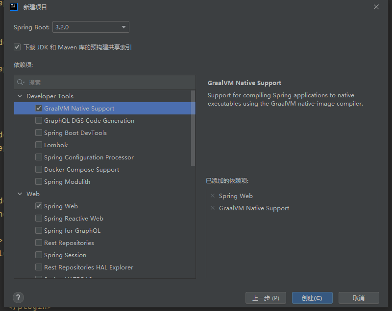
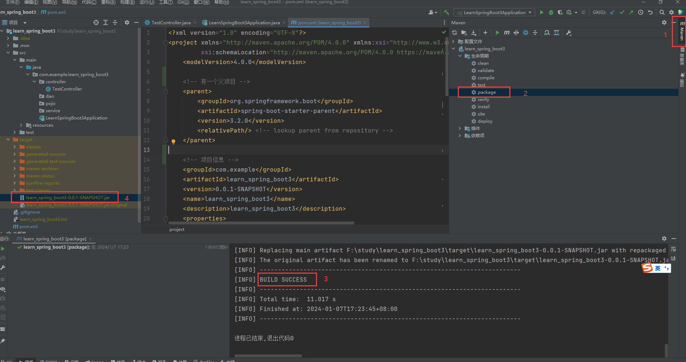

[[toc]]

# SpringBoot

[spring官网](https://spring.io/)

[springboot最新版本](https://spring.io/projects/spring-boot/#learn)

[springboot文档](https://docs.spring.io/spring-boot/docs/current/reference/html/)

[maven 官方仓库](https://mvnrepository.com/)

[maven搜索](https://central.sonatype.com/)

## 创建项目

**IDEA**新建项目选择[`Spring Initializr`](https://start.spring.io/), 如下: 

 

选择需要的依赖项, 如下: 

 

>   在这里选择的依赖, 会被自动写入到`pom.xml`文件

生成的项目结构如下: 

 

-   `xxxApplication.java`是启动类, 项目启动会运行该类的`main`方法

    ```java
    package com.example.learn_spring_boot3;
    
    import org.springframework.boot.SpringApplication;
    import org.springframework.boot.autoconfigure.SpringBootApplication;
    
    // @SpringBootApplication: 表示该类是一个 springboot 应用
    @SpringBootApplication
    public class LearnSpringBoot3Application {
    
        public static void main(String[] args) {
            //  将 springboot 应用启动
            SpringApplication.run(LearnSpringBoot3Application.class, args);
        }
    
    }
    ```

-   `resources`是资源目录

    -   `resources/application.properies`是`SpringBoot`的配置文件

-   `test`是测试代码目录

-   `pom.xml`是声明项目依赖的文件, 默认的依赖如下:

    ```xml
    <?xml version="1.0" encoding="UTF-8"?>
    <project xmlns="http://maven.apache.org/POM/4.0.0" xmlns:xsi="http://www.w3.org/2001/XMLSchema-instance"
             xsi:schemaLocation="http://maven.apache.org/POM/4.0.0 https://maven.apache.org/xsd/maven-4.0.0.xsd">
        <modelVersion>4.0.0</modelVersion>
    
        <!-- 有一个父项目 -->
        <parent>
            <groupId>org.springframework.boot</groupId>
            <artifactId>spring-boot-starter-parent</artifactId>
            <version>3.2.0</version>
            <relativePath/> <!-- lookup parent from repository -->
        </parent>
    
        <!-- 项目信息 -->
        <groupId>com.example</groupId>
        <artifactId>learn_spring_boot3</artifactId>
        <version>0.0.1-SNAPSHOT</version>
        <name>learn_spring_boot3</name>
        <description>learn_spring_boot3</description>
        <properties>
            <java.version>17</java.version>
        </properties>
    
      	<!-- 以下是 SpringBoot 的依赖都是以 spring-boot-starter- 开头, 可以不写版本号, 会自动继承父的版本, 具体的版本信息在 org.springframework.boot -> spring-boot-dependencies 里面 -->
      
        <dependencies>
          	<!-- web启动 包括 tomcat, dispatcherServlet, xml ... -->
            <dependency>
                <groupId>org.springframework.boot</groupId>
                <artifactId>spring-boot-starter-web</artifactId>
            </dependency>
    
            <dependency>
                <groupId>org.springframework.boot</groupId>
                <artifactId>spring-boot-devtools</artifactId>
                <scope>runtime</scope>
                <optional>true</optional>
            </dependency>
    
            <!-- 单元测试 -->
            <dependency>
                <groupId>org.springframework.boot</groupId>
                <artifactId>spring-boot-starter-test</artifactId>
                <scope>test</scope>
            </dependency>
        </dependencies>
    
        <build>
            <!-- 打 jar 包插件 -->
            <plugins>
                <plugin>
                    <groupId>org.springframework.boot</groupId>
                    <artifactId>spring-boot-maven-plugin</artifactId>
                </plugin>
            </plugins>
        </build>
    
    </project>
    ```

    `springboot`提供了很多的[启动器](https://docs.spring.io/spring-boot/docs/current/reference/html/)当需要什么功能时, 添加一个启动器就可以直接使用, 比如: `spring-boot-starter-web`

## Hello Word

在根目录下新建一个软件包叫`controller`, 新建一个类叫`TestController`, 内容如下: 

```java
package com.example.learn_spring_boot3.controller;

import org.springframework.http.ResponseEntity;
import org.springframework.stereotype.Controller;
import org.springframework.web.bind.annotation.GetMapping;
import org.springframework.web.bind.annotation.RequestMapping;
import org.springframework.web.bind.annotation.ResponseBody;

@Controller // 表示该类是一个控控制器
@RequestMapping("/test") // 将 /test 的 url 映射到该类
public class TestController {
    @GetMapping("/hello") // 将 /test/hello get 请求的 url 映射到该方法
  	@ResponseBody // 表示该方法的返回结果直接写入 HTTP response body 中
    public ResponseEntity<String> test() {
        String msg = "hello world";
        System.out.println(msg);
      
      	// 返回响应值
        return ResponseEntity.ok(msg);
    }
}
```

找到启动类型`xxxApplication.java`运行项目, 或者命令行运行如下命令(需要下载`maven`): 

```sh
mvn compile  # 编译源码
mvn spring-boot:run # 启动项目
```

浏览器访问`localhost:8080/test/hello`, 即可看到`hello world`

## 打包

运行`maven`的`package`命令或者终端运行`mvn package`(需要下载`maven`)即可

 

通过`java -jar xxx.jar`即可运行, 注意使用java版本需要跟运行时的一样

## 项目结构

- 根目录: `src/main/java/com.xxx.xxx`
    入口启动类及程序的开发目录, 在这个目录下进行业务开发, 具体如下:

    - 启动类`xxxApplication.java`在`src/main/java/com.xxx`下

    - 数据库实体层`pojo`

        pojo(Plain Old Java Object)从字面上翻译为“纯洁老式的java对象”，但大家都使用“简单java对象”来称呼它, 就是一个JavaBean，即有无参构造函数，每个字段都有`getter`和`setter`的`java`类

    - 数据持久层`dao`
        dao(Data Access Object)层即数据持久层，也被称为mapper层。
        dao层的作用为访问数据库，向数据库发送sql语句，完成数据的增删改查任务。
        一般是在DAO层里面写接口，里面有与数据打交道的方法。SQL语句通常写在mapper文件里面的。
        Dao层的数据源配置以及相关的数据库连接参数都在Spring配置文件中进行配置。

    - 数据服务接口层`service`
        service层即业务逻辑层，主要负责业务逻辑应用设计。
        首先也要设计接口，然后再设计其实现该接口的类(serviceImpl)。这样就可以在应用中调用service接口进行业务处理。
        service层调用dao层接口，接收dao层返回的数据，完成项目的基本功能设计。

    - 控制器层`controller`
        controller层即控制层主要负责具体业务模块流程的控制, 具体功能为请求和响应控制
        controller层负责前后端交互，接受前端请求，调用service层，接收service层返回的数据，最后返回具体的页面和数据到客户端。

    - 工具类库`utils`

    - 配置类`config`

    - 数据传输对象`dto`

    - 数据传输对象`Data Transfer Object`用于封装多个实体类domain之间的关系，不破坏原有的实体类结构

    - 视图包装对象`vo`
        视图包装对象View Object用于封装客户端请求的数据，防止部分数据泄露如: 管理员ID，保证数据安全，不破坏 原有的实体类结构

- 资源目录结构
    资源文件根目录: `src/main/resources`
    主要用来存放静态文件和配置文件

    - 项目配置文件: `resources/application.yml`
        用于配置项目运行所需的配置数据，也可以是`resources/application.properties`

    - 静态资源目录: `resources/static/`
        用于存放静态资源，如css、js、图片、音频等资源

    > 注意: static目录下的静态资源可以直接访问。

    - 视图模板目录: `resources/templates/`
        用于存放html、jsp、thymeleaf等模板文件

        > 注意: templates目录里存放的html页面，不能通过url直接访问（被websecurity权限控制），需跳转后台（通过Controller，即走控制器–服务–视图解析器这个流程）才能访问，同时还要引入thymeleaf模板引擎 ； 或者配置静态资源路径\ 。
        >
        > html静态页面放置在templates目录原因: 
        >
        > templates目录下的html页面不能直接访问，需要通过服务器内部进行访问，可以避免无权限的用户访问到隐私页面，造成信息泄露。

    - `mybatis`映射文件: `resources/mappers/`

    - `mybatis`配置文件: `resources/spring-mybatis.xml`

- 测试文件根目录: `src/test/java`

## 配置文件

`SpringBoot`的配置文件在`src/main/resources`目录下面的`application.properties`(官方推荐的使用的配置文件格式是`.yaml`和`.yml`):

`properties`的只能为`key=value`: 

```properties
server.port=8081 # 更改项目的默认端口号
spring.banner.location=banner.text # 指定项目启动时打印的 banner
# spring.main.banner-mode=off #关闭 banner 打印
```

`yaml`是利用缩进分级, 下面的配置等同于上面的`properties`配置: 

```yaml
server:
  port: 8081 # 更改项目的默认端口号

spring:
  banner:
    location: banner.text # 指定项目启动时打印的 banner
  main:
    banner-mode: off #关闭 banner 打印
```

### `yaml`的基本语法

```yaml
# 简单的键值对
name: zhangsan

# 缩进对象(不支持使用 tab)
persion
  name: zhangsan
  age: 18

# 大括号对象
persion: { 
  name: zhangsan, 
  age: 18 
}

# 缩进数组
list:
	- a
	- b
	- c
	
# 方括号数组
list: [a, b, c]
```

>   `springboot`的配置项太多了, 可以参考[应用程序属性](https://docs.spring.io/spring-boot/docs/current/reference/html/application-properties.html#appendix.application-properties.core)

### SPEL表达式

`springboot`的`yaml`配置文件里面可以写[`SPEL`](https://docs.spring.io/spring-framework/docs/3.2.x/spring-framework-reference/html/expressions.html)表达式

```yaml
person:
  name: zhangsan${random.uuid}
  age: ${random.int}
```

### 配置文件给实体类赋值

`spring`支持通过注解的方式来给一个实体类进行自动装配, 并且赋值, 常用于配置类中

#### 使用`@Value`注解

新建一个实体类`pojo/Person.java`

```java
package com.example.learn_spring_boot3.pojo;

import org.springframework.beans.factory.annotation.Value;
import org.springframework.stereotype.Component;

// @Component: 表示该类是 springboot 的一个组件, springboot 会自动扫描该类
@Component
public class Person {

    // 指定默认值为 zhangsan
    @Value("zhangsan")
    private String name;

    // 指定默认值为 18
    @Value("18")
    private Integer age;

    public Person() {
    }

    public Person(String name, Integer age) {
        this.name = name;
        this.age = age;
    }

    public String getName() {
        return name;
    }

    public void setName(String name) {
        this.name = name;
    }

    public Integer getAge() {
        return age;
    }

    public void setAge(Integer age) {
        this.age = age;
    }

    @Override
    public String toString() {
        return "Person{" +
                "name='" + name + '\'' +
                ", age=" + age +
                '}';
    }
}
```

在测试类里测试效果: 

```java
package com.example.learn_spring_boot3;

import com.example.learn_spring_boot3.pojo.Person;
import org.junit.jupiter.api.Test;
import org.springframework.beans.factory.annotation.Autowired;
import org.springframework.boot.test.context.SpringBootTest;

@SpringBootTest
class LearnSpringBoot3ApplicationTests {

    // @Autowired: 会自动装配 Person
    @Autowired
    private Person person;

    @Test
    void contextLoads() {
        System.out.println(person);
      	// Person{name='zhangsan', age=18}
      	System.out.println("主人的名字: " + person.getName());
    }

}
```

#### `yaml`配置文件+`@ConfigurationProperties`注解

`application.yaml`配置如下: 

```yaml
person:
  name: zhangsan
  age: 18
  flag: true
  date: 2024/01/07 12:30:11 # 注意: 这里不支持使用 - 分割年月日
  map: { k1: v1, k2: v2 }
  list: [ a, b, c ]
  dog: { name: wangcai, age: 3 }
```

`Dog.java`

```java
package com.example.learn_spring_boot3.pojo;

public class Dog {
    private String name;
    private Integer age;

    // 省略构造函数, getter, setter, toString ...
}

```

`Person.java`

```java
package com.example.learn_spring_boot3.pojo;

import org.springframework.boot.context.properties.ConfigurationProperties;
import org.springframework.stereotype.Component;

import java.util.Date;
import java.util.List;
import java.util.Map;

@Component
@ConfigurationProperties(prefix = "person") // 这个注释就可以把配置文件中 person 的值一一对应的赋值给这个实体类的字段上
// @ConfigurationProperties(prefix = "hello.person") // 也可以指定一个对象的值
public class Person {
    private String name;
    private Integer age;
    private Boolean flag;
    private Date date;
    private Map<String, Object> map;
    private List<Object> list;
    private Dog dog;

    public Person() {
    }

    public Person(String name, Integer age, Boolean flag, Date date, Map<String, Object> map, List<Object> list, Dog dog) {
        this.name = name;
        this.age = age;
        this.flag = flag;
        this.date = date;
        this.map = map;
        this.list = list;
        this.dog = dog;
    }

    public String getName() {
        return name;
    }

    public void setName(String name) {
        this.name = name;
    }

    public Integer getAge() {
        return age;
    }

    public void setAge(Integer age) {
        this.age = age;
    }

    public Boolean getFlag() {
        return flag;
    }

    public void setFlag(Boolean flag) {
        this.flag = flag;
    }

    public Date getDate() {
        return date;
    }

    public void setDate(Date date) {
        this.date = date;
    }

    public Map<String, Object> getMap() {
        return map;
    }

    public void setMap(Map<String, Object> map) {
        this.map = map;
    }

    public List<Object> getList() {
        return list;
    }

    public void setList(List<Object> list) {
        this.list = list;
    }

    public Dog getDog() {
        return dog;
    }

    public void setDog(Dog dog) {
        this.dog = dog;
    }

    @Override
    public String toString() {
        return "Person{" +
                "name='" + name + '\'' +
                ", age=" + age +
                ", flag=" + flag +
                ", date=" + date +
                ", map=" + map +
                ", list=" + list +
                ", dog=" + dog +
                '}';
    }
}

```

`pom.xml`添加`@ConfigurationProperties`注解需要的依赖

```xml
<dependency>
    <groupId>org.springframework.boot</groupId>
    <artifactId>spring-boot-configuration-processor</artifactId>
    <optional>true</optional>
</dependency>
```

测试类测试

```java
package com.example.learn_spring_boot3;

import com.example.learn_spring_boot3.pojo.Person;
import org.junit.jupiter.api.Test;
import org.springframework.beans.factory.annotation.Autowired;
import org.springframework.boot.test.context.SpringBootTest;

@SpringBootTest
class LearnSpringBoot3ApplicationTests {

    // @Autowired: 会自动装配 Person
    @Autowired
    private Person person;

    @Test
    void contextLoads() {
        System.out.println(person);
        System.out.println("主人的名字: " + person.getName());
        System.out.println("宠物的名字: " + person.getDog().getName());
    }
}
```

#### 指定配置文件

新建一个配置文件`myConfig.yaml`

```yaml
name: hello
age: 9999
```

```java
package com.example.learn_spring_boot3.pojo;

import org.springframework.beans.factory.annotation.Value;
import org.springframework.context.annotation.PropertySource;
import org.springframework.stereotype.Component;

import java.util.Date;
import java.util.List;
import java.util.Map;

@Component
@PropertySource(value = "classpath:myConfig.yaml") // 指定配置文件为: myConfig.yaml
public class Person {
		@Value("name")
    private String name;
  
    // SPEL 表达式 
    @Value("${age}")
		private Integer age;
    private Boolean flag;
    private Date date;
    private Map<String, Object> map;
    private List<Object> list;
    private Dog dog;
    // 省略其它 ... 
}
```

运行效果是一样的

### 多配置文件

配置文件在多种情况下都是不一样的, 比如测试环境, 开发环境和生产环境都是连接不同的数据库的, `springboot`支持动态加载不同的配置文件, `application-xxx.yaml`中将`xxx`替换为模式名就行, 

分别新建`application-dev.yaml`, `application-pord.yaml`和`application-test.yaml`每个配置文件各种指定不同的`server.port`然后在`application.yaml`默认配置文件中加载对应的配置文件即可, 如下: 

```yaml
spring:
  profiles:
    active: dev
```

#### 单文件书写多个配置

`yaml`中支持在单个文件中书写多个模式的配置文件只需要使用`---`分割, 然后指定加载的模式即可: 

```yaml
spring:
  profiles:
    active: test # 加载 test 模式

---
server:
  port: 8081
spring:
  config:
    activate:
      on-profile: dev # 指定为 dev 模式

---
server:
  port: 8082
spring:
  config:
    activate:
      on-profile: test # 指定为 test 模式
```

## 接口传参

```java
package com.example.learn_spring_boot3.controller;

import com.example.learn_spring_boot3.pojo.User;
import org.springframework.http.ResponseEntity;
import org.springframework.stereotype.Controller;
import org.springframework.web.bind.annotation.*;

import java.util.HashMap;

@Controller
@RequestMapping("/test")
public class TestController {
    @GetMapping("/hello")
    @ResponseBody
    public ResponseEntity<HashMap<String, String>> test() {
        String msg = "/test/hello";
        System.out.println(msg);

        HashMap<String, String> map = new HashMap<>();
        map.put("name", "张三");
        map.put("age", "18");
        return ResponseEntity.ok(map);
    }

    // 1. 使用@RequestParam获取请求参数 -> 对应前端 axios 的 params
    @GetMapping("/getUserWithRequestParam")
    @ResponseBody
    public ResponseEntity<HashMap<String, Object>> getUserWithRequestParam(@RequestParam String name, @RequestParam int age) {
        HashMap<String, Object> map = new HashMap<>();
        map.put("name", name);
        map.put("age", age);
        return ResponseEntity.ok(map);
    }

    // 2. 使用@PathVariable获取路径中的参数 -> xxx/132 -> 123
    @GetMapping("/getUserWithPathVariable/{id}")
    @ResponseBody
    public ResponseEntity<HashMap<String, Object>> getUserWithPathVariable(@PathVariable String id) {
        HashMap<String, Object> map = new HashMap<>();
        map.put("id", id);
        return ResponseEntity.ok(map);
    }

    // 3. 使用@RequestBody获取请求体中的数据 -> 对应前端 axios 的 data
    @PostMapping("/createUserWithRequestBody")
    @ResponseBody
    public ResponseEntity<User> createUserWithRequestBody(@RequestBody User user) {
        return ResponseEntity.ok(user);
    }


    // 4. 使用@ModelAttribute获取表单提交的数据 -> 对应前端 axios 的 data(FormData格式)
    @PostMapping("/createUserWithModelAttribute")
    @ResponseBody
    public ResponseEntity<User> createUserWithModelAttribute(@ModelAttribute User user) {
        return ResponseEntity.ok(user);
    }

    // 5. 使用@RequestHeader获取请求头数据 -> 对应前端 axios 的 headers
    @PostMapping("/getUserWithRequestHeader")
    @ResponseBody
    public ResponseEntity<String> getUserWithRequestHeader(@RequestHeader("Content-Type") String contentType) {
        return ResponseEntity.ok(contentType);
    }

    // 6. 使用POJO类对象传参 -> 对应前端 axios 的 data(请求同)
    @PostMapping("/createUser")
    @ResponseBody
    public ResponseEntity<User> createUser(User user) {
        return ResponseEntity.ok(user);
    }
}

```

## 数据库操作

创建项目时除了选择, `Spring Web`还需要选上`JDBC API`和`MySQL Driver`(对应使用的数据库驱动)

修改配置文件, 添加数据库连接信息:

```yaml
#配置连接数据库使用的数据源
spring:
  datasource:
    # 使用的驱动类名
    # com.mysql.jdbc.Driver 对的是 mysql5.x 版本
    # com.mysql.cj.jdbc.Driver 对的是 mysql8.x 版本
    driver-class-name: com.mysql.jdbc.Driver
    
    # 数据库的连接地址
    url: jdbc:mysql://localhost:3306/learn_spring_boot3?characterEncoding=utf-8&serverTimezone=UTC&useUnicode=true&autoReconnect=true&useSSL=false
    
    # 数据库的账号
    username: root
    
    # 数据库的密码
    password: 123456
```

定义用户类

```java
package com.example.learn_spring_boot3.dao;

import lombok.AllArgsConstructor;
import lombok.Data;
import lombok.NoArgsConstructor;

@Data
@NoArgsConstructor
@AllArgsConstructor
public class User {
    /**
     * 用户名
     */
    public String name;

    /**
     * 年龄
     */
    public int age;

    /**
     * 性别
     * - 1: 男
     * - 2: 女
     */
    public int sex;
}
```

### 通用请求响应类

定义请求响应类

```java
package com.example.learn_spring_boot3.pojo;

import lombok.AllArgsConstructor;
import lombok.Data;
import lombok.NoArgsConstructor;

@Data
@NoArgsConstructor
@AllArgsConstructor
public class ResponseData <T extends Object>{
    /**
     * 响应状态吗
     */
    public int code;

    /**
     * 响应提示语
     */
    public String msg;

    /**
     * 响应数据
     */
    public T data;

    /**
     * 成功响应数据
     */
    public static final ResponseData<Object> success(Object d) {
        return new ResponseData(200, "操作成功", d);
    }

    /**
     * 失败响应数据
     */
    public static final ResponseData<Object> error(int c, String m, Object d) {
        return new ResponseData(c, m, d);
    }
}

```

### JDBC

定义对应的接口

```java
package com.example.learn_spring_boot3.controller;

import com.example.learn_spring_boot3.pojo.ResponseData;
import jakarta.annotation.Resource;
import org.springframework.http.ResponseEntity;
import org.springframework.jdbc.core.JdbcTemplate;
import org.springframework.stereotype.Controller;
import org.springframework.web.bind.annotation.*;

import javax.sql.DataSource;
import java.util.List;
import java.util.Map;

@Controller
@RequestMapping("/testMysql")
public class TestMysqlController {

    // DataSource(即数据库、数据源)
    @Resource
    DataSource dataSource;

    // JdbcTemplate 里面封装了一些对数据库操作的方法
    @Resource
    JdbcTemplate jdbcTemplate;

    @GetMapping("/queryUserList")
    @ResponseBody
    public ResponseEntity<ResponseData> queryUserList() {
        Class<? extends DataSource> aClass = dataSource.getClass();
        System.out.println("使用的数据源: " + aClass);

        String sql = "SELECT * FROM user";
        List<Map<String, Object>> dataList = jdbcTemplate.queryForList(sql);
        ResponseData<Object> success = ResponseData.success(dataList);
        return ResponseEntity.ok(success);
    }

    @PostMapping("/addUser")
    @ResponseBody
    public ResponseEntity<ResponseData> addUser() {
        String sql = "INSERT INTO learn_spring_boot3.user(name, age, sex) VALUES ('王五', 18, 1)";
        jdbcTemplate.update(sql);
        ResponseData<Object> success = ResponseData.success(null);
        return ResponseEntity.ok(success);
    }

    @PostMapping("/deleteUser/{id}")
    @ResponseBody
    public ResponseEntity<ResponseData> deleteUser(@PathVariable("id") int id) {
        // TODO 参数校验...
        ResponseData<Object> success = ResponseData.success(null);

        Object[] objects = new Object[1];
        objects[0] = id;

        // Object[] objects = new Object[]{id};

        String sql = "DELETE FROM learn_spring_boot3.user WHERE id=?";
        jdbcTemplate.update(sql, objects);
        return ResponseEntity.ok(success);
    }
}
```

启动项目浏览器访问`http://localhost:8080/testMysql/queryUserList`就可以看到响应的数据了

但是也有一种弊端就是需要自己写SQL语句, 不是很方便, 而且SQL语句和业务逻辑之间耦合了

### mybatis

[mybatis](https://central.sonatype.com/artifact/org.mybatis/mybatis)

#### 添加依赖

```xml
<!-- https://mvnrepository.com/artifact/mysql/mysql-connector-java -->
<dependency>
    <groupId>mysql</groupId>
    <artifactId>mysql-connector-java</artifactId>
    <version>5.1.38</version>
</dependency>
```

#### 新建对应的`mapper`接口

```java
package com.example.learn_spring_boot3.mapper;

import com.example.learn_spring_boot3.pojo.User;
import org.apache.ibatis.annotations.Mapper;
import org.springframework.stereotype.Repository;

import java.util.ArrayList;
import java.util.List;

// 这个注解表示这是一个 mybatis 的 mapper 类(Dao)
@Mapper
@Repository
public interface UserMapper {
    /**
     * 查询所有的用户
     */
    List<User> queryUserList();

    /**
     * 查询指定id的用户
     */
    User queryUserById(Integer id);

    /**
     * 新增用户
     */
    Integer addUser(User user);

    /**
     * 批量新增用户
     */
    void addBatchUser(ArrayList<User> users);

    /**
     * 更新用户
     */
    Integer updateUser(User user);

    /**
     * 根据id删除用户
     */
    Integer deleteUser(Integer id);
}
```

可以在单个接口类上面添加`@Mapper`注解, 或者在启动类里面使用`@MapperScan`注解, 如下: 

```java
package com.example.learn_spring_boot3;

import org.mybatis.spring.annotation.MapperScan;
import org.springframework.boot.SpringApplication;
import org.springframework.boot.autoconfigure.SpringBootApplication;

@SpringBootApplication
@MapperScan("com.example.learn_spring_boot3.mapper") // 指定 mybatis 扫描对应目录下面的所有接口
public class LearnSpringBoot3Application {

    public static void main(String[] args) {
        SpringApplication.run(LearnSpringBoot3Application.class, args);
    }

}
```

#### 创建`Mapper`文件

新建对应的`xxxMapper.xml`文件:

```xml
<?xml version="1.0" encoding="UTF-8" ?>
<!DOCTYPE mapper
        PUBLIC "-//mybatis.org//DTD Mapper 3.0//EN"
        "http://mybatis.org/dtd/mybatis-3-mapper.dtd">

<mapper namespace="com.example.learn_spring_boot3.mapper.UserMapper">
    <select id="queryUserList" resultType="User">
        SELECT *
        FROM learn_spring_boot3.user
    </select>

    <select id="queryUserById" resultType="User">
        SELECT *
        FROM learn_spring_boot3.user
        WHERE id = #{id}
    </select>

    <insert id="addUser" parameterType="User" useGeneratedKeys="true" keyProperty="id">
        INSERT INTO learn_spring_boot3.user (id, name, age, sex)
        values (#{id}, #{name}, #{age}, #{sex})
    </insert>

    <insert id="addBatchUser" parameterType="java.util.List" useGeneratedKeys="true" keyProperty="id">
        INSERT INTO learn_spring_boot3.user (id, name, age, sex)
        VALUES
        <foreach collection="list" item="item" index="index" separator=",">
            (#{item.id}, #{item.name}, #{item.age}, #{item.sex})
        </foreach>
    </insert>

    <insert id="updateUser" parameterType="User">
        UPDATE learn_spring_boot3.user
        SET name=#{name},
            age=#{age},
            sex=#{sex}
        WHERE id = #{id}
    </insert>

    <delete id="deleteUser" parameterType="Integer">
        DELETE
        FROM learn_spring_boot3.user
        WHERE id = #{id}

    </delete>

</mapper>
```

#### 添加mybatis配置

`application.yaml`添加`mybatis`配置

```yml
# 配置连接数据库使用的数据源
spring:
  datasource:
    driver-class-name: com.mysql.jdbc.Driver
    url: jdbc:mysql://localhost:3306/learn_spring_boot3?characterEncoding=utf-8&serverTimezone=UTC&useUnicode=true&autoReconnect=true&useSSL=false
    username: root
    password: 123456


# mybatis 配置
mybatis:
  # 指定MyBatis的类型别名包，即包含实体类的包路径，方便在xml配置文件中使用实体类时不用写包名
  type-aliases-package: com.example.learn_spring_boot3.pojo
  # 指定MyBatis的 Mapper XML文件的位置
  mapper-locations: classpath:mybatis/**/*Mapper.xml
  configuration:
    # 控制台输出
    log-impl: org.apache.ibatis.logging.stdout.StdOutImpl
    # 参数转换为驼峰命名法
    map-underscore-to-camel-case: true
    
    
# server:
#  servlet:
#    context-path: /api # 添加接口前缀
```

#### 创建对应的`controller`

新建`contronller/UserController`

```java
package com.example.learn_spring_boot3.controller;

import com.example.learn_spring_boot3.pojo.ResponseData;
import com.example.learn_spring_boot3.pojo.User;
import com.example.learn_spring_boot3.service.UserServeice;
import jakarta.annotation.Resource;
import org.springframework.beans.factory.annotation.Autowired;
import org.springframework.http.ResponseEntity;
import org.springframework.stereotype.Controller;
import org.springframework.web.bind.annotation.*;

import java.util.ArrayList;
import java.util.List;

@Controller
@RequestMapping("/user")
public class UserController {

    // 获取到对应的 serveice
    @Autowired
    UserServeice userServeice;

    @GetMapping("/queryUserList")
    @ResponseBody
    public ResponseEntity<ResponseData> getAllUser() {
        return userServeice.getAllUser();
    }

    @GetMapping("/queryUserById/{id}")
    @ResponseBody
    public ResponseEntity<ResponseData> queryUserById(@PathVariable int id) {
        return userServeice.queryUserById(id);
    }


    @PostMapping("/addUser")
    @ResponseBody
    public ResponseEntity<ResponseData> addUser(@RequestBody User user) {
        return userServeice.addUser(user);
    }

    @PostMapping("/addBatchUser")
    @ResponseBody
    public ResponseEntity<ResponseData> addBatchUser(@RequestBody ArrayList<User> userList) {
        return userServeice.addBatchUser(userList);
    }

    @PostMapping("/updateUser")
    @ResponseBody
    public ResponseEntity<ResponseData> updateUser(@RequestBody User user) {
        return userServeice.updateUser(user);
    }

    @PostMapping("/deleteUser")
    @ResponseBody
    public ResponseEntity<ResponseData> deleteUser(@RequestParam int id) {
        return userServeice.deleteUser(id);
    }
}
```

#### 创建对应的`serveice`

新建对应的`service/UserServeice`

```java
package com.example.learn_spring_boot3.service;

import com.example.learn_spring_boot3.mapper.UserMapper;
import com.example.learn_spring_boot3.pojo.ResponseData;
import com.example.learn_spring_boot3.pojo.User;
import org.springframework.beans.factory.annotation.Autowired;
import org.springframework.http.ResponseEntity;
import org.springframework.stereotype.Service;

import java.util.ArrayList;
import java.util.List;

@Service
public class UserServeice {

    // 获取到对应的 mapper
    @Autowired
    UserMapper userMapper;

    /**
     * 查询所有的用户
     * @return
     */
    public ResponseEntity<ResponseData> getAllUser() {
        List<User> users = userMapper.queryUserList();
        ResponseData<Object> success = ResponseData.success(users);
        return ResponseEntity.ok(success);
    }

    /**
     * 根据id查询对应的用户
     * @param id
     * @return
     */
    public ResponseEntity<ResponseData> queryUserById(int id) {
        User user = userMapper.queryUserById(id);
        ResponseData<Object> success = ResponseData.success(user);
        return ResponseEntity.ok(success);
    }

    /**
     * 新增用户
     * @param user
     * @return
     */
    public ResponseEntity<ResponseData> addUser(User user) {
        userMapper.addUser(user);
        // 重新查询插入的用户数据
        User insertUser = userMapper.queryUserById(user.getId());
        ResponseData<Object> success = ResponseData.success(insertUser);
        return ResponseEntity.ok(success);
    }

    /**
     * 批量新增用户
     * @param userList
     * @return
     */
    public ResponseEntity<ResponseData> addBatchUser(ArrayList<User> userList) {
        userMapper.addBatchUser(userList);

        // 返回的数据
        ArrayList resultList = new ArrayList<User>();
        for (Object item : userList) {
            Integer inserId = ((User) item).getId();
            if (inserId != null) {
                User insertUser = userMapper.queryUserById(inserId);
                resultList.add(insertUser);
            }
        }
        ResponseData<Object> success = ResponseData.success(resultList);
        return ResponseEntity.ok(success);
    }

    /**
     * 更新用户
     * @param user
     * @return
     */
    public ResponseEntity<ResponseData> updateUser(User user) {
        if (user.getId() != null) {
            // 更新操作
            userMapper.updateUser(user);
            ResponseData<Object> success = ResponseData.success(user);
            return ResponseEntity.ok(success);
        } else {
            // 新增操作
            return this.addUser(user);
        }

    }

    /**
     * 删除用户
     * @param id
     * @return
     */
    public ResponseEntity<ResponseData> deleteUser(int id) {
        userMapper.deleteUser(id);
        ResponseData<Object> success = ResponseData.success(null);
        return ResponseEntity.ok(success);
    }

}

```

## 第三方库

| 库名                                                         | 描述                                                         |
| ------------------------------------------------------------ | ------------------------------------------------------------ |
| [lombok](https://central.sonatype.com/artifact/org.projectlombok/lombok) | 快速生成`getter`,`setter`,`构造函数`, `equals`,`hashCode`和`toString`等 |
| [mybatis](https://central.sonatype.com/artifact/org.mybatis/mybatis) | 是一个基于Java的[持久层](https://baike.baidu.com/item/持久层/3584971?fromModule=lemma_inlink)框架 |

### lombok

[lombok](https://central.sonatype.com/artifact/org.projectlombok/lombok)是一个可以通过简单的注解来帮助我们生成实体类中一样很臃肿的Java代码, 比如: `getter`,`setter`,`构造函数`, `equals`,`hashCode`和`toString`等

`pom.xml`添加依赖

```xml
<dependencies>
<!-- ... -->
   
	<dependency>
      <groupId>org.projectlombok</groupId>
      <artifactId>lombok</artifactId>
      <version>1.18.30</version>
  </dependency>

</dependencies>
```

基本使用: 

```java
package com.example.learn_spring_boot3.pojo;

import lombok.AllArgsConstructor;
import lombok.Data;
import lombok.NoArgsConstructor;

@Data // 生成 getter, setter 和 toString 等一些方法
@NoArgsConstructor // 生成无参构造方法
@AllArgsConstructor // 生成带参构造方法
public class LombokTest {
    private String name;
    private Integer age;
}
```
