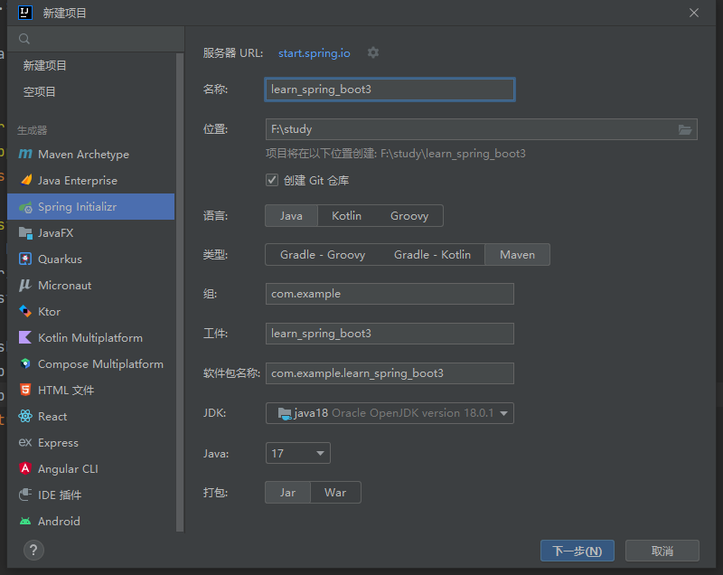
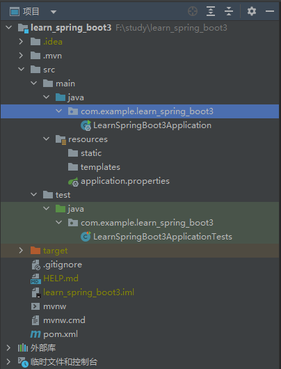

[[toc]]

# SpringBoot

[spring官网](https://spring.io/)

[springboot最新版本](https://spring.io/projects/spring-boot/#learn)

[springboot文档](https://docs.spring.io/spring-boot/docs/current/reference/html/)

[maven 官方仓库](https://mvnrepository.com/)

[maven搜索](https://central.sonatype.com/)

## 创建项目

**IDEA**新建项目选择[`Spring Initializr`](https://start.spring.io/), 如下: 

 

选择需要的依赖项, 如下: 

 

>   在这里选择的依赖, 会被自动写入到`pom.xml`文件

生成的项目结构如下: 

 

-   `xxxApplication.java`是启动类, 项目启动会运行该类的`main`方法

    ```java
    package com.example.learn_spring_boot3;
    
    import org.springframework.boot.SpringApplication;
    import org.springframework.boot.autoconfigure.SpringBootApplication;
    
    // @SpringBootApplication: 表示该类是一个 springboot 应用
    @SpringBootApplication
    public class LearnSpringBoot3Application {
    
        public static void main(String[] args) {
            //  将 springboot 应用启动
            SpringApplication.run(LearnSpringBoot3Application.class, args);
        }
    
    }
    ```

-   `resources`是资源目录

    -   `resources/application.properies`是`SpringBoot`的配置文件

-   `test`是测试代码目录

-   `pom.xml`是声明项目依赖的文件, 默认的依赖如下:

    ```xml
    <?xml version="1.0" encoding="UTF-8"?>
    <project xmlns="http://maven.apache.org/POM/4.0.0" xmlns:xsi="http://www.w3.org/2001/XMLSchema-instance"
             xsi:schemaLocation="http://maven.apache.org/POM/4.0.0 https://maven.apache.org/xsd/maven-4.0.0.xsd">
        <modelVersion>4.0.0</modelVersion>
    
        <!-- 有一个父项目 -->
        <parent>
            <groupId>org.springframework.boot</groupId>
            <artifactId>spring-boot-starter-parent</artifactId>
            <version>2.7.8</version>
            <relativePath/> <!-- lookup parent from repository -->
        </parent>
    
        <!-- 项目信息 -->
        <groupId>com.example</groupId>
        <artifactId>learn_spring_boot3</artifactId>
        <version>0.0.1-SNAPSHOT</version>
        <name>learn_spring_boot3</name>
        <description>learn_spring_boot3</description>
        <properties>
            <java.version>17</java.version>
        </properties>
    
      	<!-- 以下是 SpringBoot 的依赖都是以 spring-boot-starter- 开头, 可以不写版本号, 会自动继承父的版本, 具体的版本信息在 org.springframework.boot -> spring-boot-dependencies 里面 -->
      
        <dependencies>
          	<!-- web启动 包括 tomcat, dispatcherServlet, xml ... -->
            <dependency>
                <groupId>org.springframework.boot</groupId>
                <artifactId>spring-boot-starter-web</artifactId>
            </dependency>
    
            <dependency>
                <groupId>org.springframework.boot</groupId>
                <artifactId>spring-boot-devtools</artifactId>
                <scope>runtime</scope>
                <optional>true</optional>
            </dependency>
    
            <!-- 单元测试 -->
            <dependency>
                <groupId>org.springframework.boot</groupId>
                <artifactId>spring-boot-starter-test</artifactId>
                <scope>test</scope>
            </dependency>
        </dependencies>
    
        <build>
            <!-- 打 jar 包插件 -->
            <plugins>
                <plugin>
                    <groupId>org.springframework.boot</groupId>
                    <artifactId>spring-boot-maven-plugin</artifactId>
                </plugin>
            </plugins>
        </build>
    
    </project>
    ```

    `springboot`提供了很多的[启动器](https://docs.spring.io/spring-boot/docs/current/reference/html/)当需要什么功能时, 添加一个启动器就可以直接使用, 比如: `spring-boot-starter-web`

## Hello Word

在根目录下新建一个软件包叫`controller`, 新建一个类叫`TestController`, 内容如下: 

```java
package com.example.learn_spring_boot3.controller;

import org.springframework.http.ResponseEntity;
import org.springframework.stereotype.Controller;
import org.springframework.web.bind.annotation.GetMapping;
import org.springframework.web.bind.annotation.RequestMapping;
import org.springframework.web.bind.annotation.ResponseBody;

@Controller // 表示该类是一个控控制器
@RequestMapping("/test") // 将 /test 的 url 映射到该类
public class TestController {
    @GetMapping("/hello") // 将 /test/hello get 请求的 url 映射到该方法
  	@ResponseBody // 表示该方法的返回结果直接写入 HTTP response body 中
    public ResponseEntity<String> test() {
        String msg = "hello world";
        System.out.println(msg);
      
      	// 返回响应值
        return ResponseEntity.ok(msg);
    }
}
```

找到启动类型`xxxApplication.java`运行项目, 或者命令行运行如下命令(需要下载`maven`): 

```sh
mvn compile  # 编译源码
mvn spring-boot:run # 启动项目
```

浏览器访问`localhost:8080/test/hello`, 即可看到`hello world`

## 打包

运行`maven`的`package`命令或者终端运行`mvn package`(需要下载`maven`)即可

 

通过`java -jar xxx.jar`即可运行, 注意使用java版本需要跟运行时的一样

## 项目结构

- 根目录: `src/main/java/com.xxx.xxx`
    入口启动类及程序的开发目录, 在这个目录下进行业务开发, 具体如下:

    - 启动类`xxxApplication.java`在`src/main/java/com.xxx`下

    - 数据库实体层`pojo`

        pojo(Plain Old Java Object)从字面上翻译为“纯洁老式的java对象”，但大家都使用“简单java对象”来称呼它, 就是一个JavaBean，即有无参构造函数，每个字段都有`getter`和`setter`的`java`类

    - 数据持久层`dao`
        dao(Data Access Object)层即数据持久层，也被称为mapper层
        dao层的作用为访问数据库，向数据库发送sql语句，完成数据的增删改查任务
        一般是在DAO层里面写接口，里面有与数据打交道的方法SQL语句通常写在mapper文件里面的
        Dao层的数据源配置以及相关的数据库连接参数都在Spring配置文件中进行配置

    - 数据服务接口层`service`
        service层即业务逻辑层，主要负责业务逻辑应用设计
        首先也要设计接口，然后再设计其实现该接口的类(serviceImpl)这样就可以在应用中调用service接口进行业务处理
        service层调用dao层接口，接收dao层返回的数据，完成项目的基本功能设计

    - 控制器层`controller`
        controller层即控制层主要负责具体业务模块流程的控制, 具体功能为请求和响应控制
        controller层负责前后端交互，接受前端请求，调用service层，接收service层返回的数据，最后返回具体的页面和数据到客户端

    - 工具类库`utils`

    - 配置类`config`

    - 数据传输对象`dto`

    - 数据传输对象`Data Transfer Object`用于封装多个实体类domain之间的关系，不破坏原有的实体类结构

    - 视图包装对象`vo`
        视图包装对象View Object用于封装客户端请求的数据，防止部分数据泄露如: 管理员ID，保证数据安全，不破坏 原有的实体类结构

- 资源目录结构
    资源文件根目录: `src/main/resources`
    主要用来存放静态文件和配置文件

    - 项目配置文件: `resources/application.yml`
        用于配置项目运行所需的配置数据，也可以是`resources/application.properties`

    - 静态资源目录: `resources/static/`
        用于存放静态资源，如css、js、图片、音频等资源

    > 注意: static目录下的静态资源可以直接访问

    - 视图模板目录: `resources/templates/`
        用于存放html、jsp、thymeleaf等模板文件

        > 注意: templates目录里存放的html页面，不能通过url直接访问（被websecurity权限控制），需跳转后台（通过Controller，即走控制器–服务–视图解析器这个流程）才能访问，同时还要引入thymeleaf模板引擎 ； 或者配置静态资源路径\ 
        >
        > html静态页面放置在templates目录原因: 
        >
        > templates目录下的html页面不能直接访问，需要通过服务器内部进行访问，可以避免无权限的用户访问到隐私页面，造成信息泄露

    - `mybatis`映射文件: `resources/mappers/`

    - `mybatis`配置文件: `resources/spring-mybatis.xml`

- 测试文件根目录: `src/test/java`

## 配置文件

`SpringBoot`的配置文件在`src/main/resources`目录下面的`application.properties`(官方推荐的使用的配置文件格式是`.yaml`和`.yml`):

`properties`的只能为`key=value`: 

```properties
server.port=8081 # 更改项目的默认端口号
spring.banner.location=banner.text # 指定项目启动时打印的 banner
# spring.main.banner-mode=off #关闭 banner 打印
```

`yaml`是利用缩进分级, 下面的配置等同于上面的`properties`配置: 

```yaml
server:
  port: 8081 # 更改项目的默认端口号

spring:
  banner:
    location: banner.text # 指定项目启动时打印的 banner
  main:
    banner-mode: off #关闭 banner 打印
```

### `yaml`的基本语法

```yaml
# 简单的键值对
name: zhangsan

# 缩进对象(不支持使用 tab)
persion
  name: zhangsan
  age: 18

# 大括号对象
persion: { 
  name: zhangsan, 
  age: 18 
}

# 缩进数组
list:
	- a
	- b
	- c
	
# 方括号数组
list: [a, b, c]
```

>   `springboot`的配置项太多了, 可以参考[应用程序属性](https://docs.spring.io/spring-boot/docs/current/reference/html/application-properties.html#appendix.application-properties.core)

### SPEL表达式

`springboot`的`yaml`配置文件里面可以写[`SPEL`](https://docs.spring.io/spring-framework/docs/3.2.x/spring-framework-reference/html/expressions.html)表达式

```yaml
person:
  name: zhangsan${random.uuid}
  age: ${random.int}
  

# 定义一个变量表示服务的地址, 然后可以在其它的配置中引用这个变量的值, 到时候生产和开发切换这个地址就可以了
serverUrl: 127.0.0.1

# 文件上传地址
fileDownloadUrl: ${serverUrl}:9100

spring:
  datasource:
    driver-class-name: com.mysql.jdbc.Driver
    # 数据库连接地址
    url: jdbc:mysql://${serverUrl}:3306/learn_spring_boot3?characterEncoding=utf-8&serverTimezone=UTC&useUnicode=true&autoReconnect=true&useSSL=false
    username: root
    password: 123456
```

### 配置文件给实体类赋值

`spring`支持通过注解的方式来给一个实体类进行自动装配, 并且赋值, 常用于配置类中

#### 使用`@Value`注解

新建一个实体类`pojo/Person.java`

```java
package com.example.learn_spring_boot3.pojo;

import org.springframework.beans.factory.annotation.Value;
import org.springframework.stereotype.Component;

// @Component: 表示该类是 springboot 的一个组件, springboot 会自动扫描该类
@Component
public class Person {

    // 指定默认值为 zhangsan
    @Value("zhangsan")
    // 取配置文件的 zhangsan
    // @Value("${zhangsan}")
    private String name;

    // 指定默认值为 18
    @Value("18")
    
    // 取配置文件的 userInfo.age
    // @Value("${userInfo.age}")
    private Integer age;

    public Person() {
    }

    public Person(String name, Integer age) {
        this.name = name;
        this.age = age;
    }

    public String getName() {
        return name;
    }

    public void setName(String name) {
        this.name = name;
    }

    public Integer getAge() {
        return age;
    }

    public void setAge(Integer age) {
        this.age = age;
    }

    @Override
    public String toString() {
        return "Person{" +
                "name='" + name + '\'' +
                ", age=" + age +
                '}';
    }
}
```

在测试类里测试效果: 

```java
package com.example.learn_spring_boot3;

import com.example.learn_spring_boot3.pojo.Person;
import org.junit.jupiter.api.Test;
import org.springframework.beans.factory.annotation.Autowired;
import org.springframework.boot.test.context.SpringBootTest;

@SpringBootTest
class LearnSpringBoot3ApplicationTests {

    // @Autowired: 会自动装配 Person
    @Autowired
    private Person person;

    @Test
    void contextLoads() {
        System.out.println(person);
      	// Person{name='zhangsan', age=18}
      	System.out.println("主人的名字: " + person.getName());
    }

}
```

#### `yaml`配置文件+`@ConfigurationProperties`注解

`application.yaml`配置如下: 

```yaml
person:
  name: zhangsan
  age: 18
  flag: true
  date: 2024/01/07 12:30:11 # 注意: 这里不支持使用 - 分割年月日
  map: { k1: v1, k2: v2 }
  list: [ a, b, c ]
  dog: { name: wangcai, age: 3 }
```

`Dog.java`

```java
package com.example.learn_spring_boot3.pojo;

public class Dog {
    private String name;
    private Integer age;

    // 省略构造函数, getter, setter, toString ...
}

```

`Person.java`

```java
package com.example.learn_spring_boot3.pojo;

import org.springframework.boot.context.properties.ConfigurationProperties;
import org.springframework.stereotype.Component;

import java.util.Date;
import java.util.List;
import java.util.Map;

@Component
@ConfigurationProperties(prefix = "person") // 这个注释就可以把配置文件中 person 的值一一对应的赋值给这个实体类的字段上
// @ConfigurationProperties(prefix = "hello.person") // 也可以指定一个对象的值
public class Person {
    private String name;
    private Integer age;
    private Boolean flag;
    private Date date;
    private Map<String, Object> map;
    private List<Object> list;
    private Dog dog;

    public Person() {
    }

    public Person(String name, Integer age, Boolean flag, Date date, Map<String, Object> map, List<Object> list, Dog dog) {
        this.name = name;
        this.age = age;
        this.flag = flag;
        this.date = date;
        this.map = map;
        this.list = list;
        this.dog = dog;
    }

    public String getName() {
        return name;
    }

    public void setName(String name) {
        this.name = name;
    }

    public Integer getAge() {
        return age;
    }

    public void setAge(Integer age) {
        this.age = age;
    }

    public Boolean getFlag() {
        return flag;
    }

    public void setFlag(Boolean flag) {
        this.flag = flag;
    }

    public Date getDate() {
        return date;
    }

    public void setDate(Date date) {
        this.date = date;
    }

    public Map<String, Object> getMap() {
        return map;
    }

    public void setMap(Map<String, Object> map) {
        this.map = map;
    }

    public List<Object> getList() {
        return list;
    }

    public void setList(List<Object> list) {
        this.list = list;
    }

    public Dog getDog() {
        return dog;
    }

    public void setDog(Dog dog) {
        this.dog = dog;
    }

    @Override
    public String toString() {
        return "Person{" +
                "name='" + name + '\'' +
                ", age=" + age +
                ", flag=" + flag +
                ", date=" + date +
                ", map=" + map +
                ", list=" + list +
                ", dog=" + dog +
                '}';
    }
}

```

`pom.xml`添加`@ConfigurationProperties`注解需要的依赖

```xml
<dependency>
    <groupId>org.springframework.boot</groupId>
    <artifactId>spring-boot-configuration-processor</artifactId>
    <optional>true</optional>
</dependency>
```

测试类测试

```java
package com.example.learn_spring_boot3;

import com.example.learn_spring_boot3.pojo.Person;
import org.junit.jupiter.api.Test;
import org.springframework.beans.factory.annotation.Autowired;
import org.springframework.boot.test.context.SpringBootTest;

@SpringBootTest
class LearnSpringBoot3ApplicationTests {

    // @Autowired: 会自动装配 Person
    @Autowired
    private Person person;

    @Test
    void contextLoads() {
        System.out.println(person);
        System.out.println("主人的名字: " + person.getName());
        System.out.println("宠物的名字: " + person.getDog().getName());
    }
}
```

#### 指定配置文件

新建一个配置文件`myConfig.yaml`

```yaml
name: hello
age: 9999
```

```java
package com.example.learn_spring_boot3.pojo;

import org.springframework.beans.factory.annotation.Value;
import org.springframework.context.annotation.PropertySource;
import org.springframework.stereotype.Component;

import java.util.Date;
import java.util.List;
import java.util.Map;

@Component
@PropertySource(value = "classpath:myConfig.yaml") // 指定配置文件为: myConfig.yaml
public class Person {
	@Value("name")
    private String name;
  
    // SPEL 表达式 
    @Value("${age}")
	private Integer age;
    private Boolean flag;
    private Date date;
    private Map<String, Object> map;
    private List<Object> list;
    private Dog dog;
    // 省略其它 ... 
}
```

运行效果是一样的

### 多配置文件

配置文件在多种情况下都是不一样的, 比如测试环境, 开发环境和生产环境都是连接不同的数据库的, `springboot`支持动态加载不同的配置文件, `application-xxx.yaml`中将`xxx`替换为模式名就行, 

分别新建`application-dev.yaml`, `application-pord.yaml`和`application-test.yaml`每个配置文件各种指定不同的`server.port`然后在`application.yaml`默认配置文件中加载对应的配置文件即可, 如下: 

```yaml
spring:
  profiles:
    active: dev
```

#### 单文件书写多个配置

`yaml`中支持在单个文件中书写多个模式的配置文件只需要使用`---`分割, 然后指定加载的模式即可: 

```yaml
spring:
  profiles:
    active: test # 加载 test 模式

---
server:
  port: 8081
spring:
  config:
    activate:
      on-profile: dev # 指定为 dev 模式

---
server:
  port: 8082
spring:
  config:
    activate:
      on-profile: test # 指定为 test 模式
```

## 接口传参

```java
package com.example.learn_spring_boot3.controller;

import com.example.learn_spring_boot3.pojo.User;
import org.springframework.http.ResponseEntity;
import org.springframework.stereotype.Controller;
import org.springframework.web.bind.annotation.*;

import java.util.HashMap;

@RestController
@RequestMapping("/test")
public class TestController {
    @GetMapping("/hello")
    @ResponseBody
    public ResponseEntity<HashMap<String, String>> test() {
        String msg = "/test/hello";
        System.out.println(msg);

        HashMap<String, String> map = new HashMap<>();
        map.put("name", "张三");
        map.put("age", "18");
        return ResponseEntity.ok(map);
    }

    // 1. 使用@RequestParam获取请求参数 -> 对应前端 axios 的 params
    @GetMapping("/getUserWithRequestParam")
    public ResponseEntity<HashMap<String, Object>> getUserWithRequestParam(@RequestParam String name, @RequestParam int age) {
        HashMap<String, Object> map = new HashMap<>();
        map.put("name", name);
        map.put("age", age);
        return ResponseEntity.ok(map);
    }

    // 2. 使用@PathVariable获取路径中的参数 -> xxx/132 -> 123
    @GetMapping("/getUserWithPathVariable/{id}")
    public ResponseEntity<HashMap<String, Object>> getUserWithPathVariable(@PathVariable String id) {
        HashMap<String, Object> map = new HashMap<>();
        map.put("id", id);
        return ResponseEntity.ok(map);
    }

    // 3. 使用@RequestBody获取请求体中的数据 -> 对应前端 axios 的 data
    @PostMapping("/createUserWithRequestBody")
    public ResponseEntity<User> createUserWithRequestBody(@RequestBody User user) {
        return ResponseEntity.ok(user);
    }


    // 4. 使用@ModelAttribute获取表单提交的数据 -> 对应前端 axios 的 data(FormData格式)
    @PostMapping("/createUserWithModelAttribute")
    public ResponseEntity<User> createUserWithModelAttribute(@ModelAttribute User user) {
        return ResponseEntity.ok(user);
    }
    
    // 5. 使用@ModelAttribute获取表单上传的文件数据 -> 对应前端 axios 的 data(FormData格式)
    @PostMapping("/upload1")
    public ResponseEntity<String> fileUpload(@ModelAttribute MultipartFile file) {
        System.out.println("上传的文件名: " + file.getOriginalFilename());
        System.out.println("上传的文件大小: " + file.getSize());
        return ResponseEntity.ok("文件上传成功");
    }
  
  	// 6. 使用@ModelAttribute获取表单里对应的键
    @PostMapping("/upload2")
    public ResponseEntity<String> fileUpload(@ModelAttribute("file") MultipartFile file, @ModelAttribute("dir") String dir) {
       	System.out.println("上传的文件名: " + file.getOriginalFilename());
        System.out.println("上传的文件大小: " + file.getSize());
        return ResponseEntity.ok("文件上传成功");
    }

    // 7. 使用@RequestHeader获取请求头数据 -> 对应前端 axios 的 headers
    @PostMapping("/getUserWithRequestHeader")
    public ResponseEntity<String> getUserWithRequestHeader(@RequestHeader("Content-Type") String contentType) {
        return ResponseEntity.ok(contentType);
    }

    // 8. 使用POJO类对象传参 -> 对应前端 axios 的 data(请求同)
    @PostMapping("/createUser")
    public ResponseEntity<User> createUser(User user) {
        return ResponseEntity.ok(user);
    }
}
```

### Controller 和 RestController

`@Controller`和`@RestController` 这两个注解是 Spring MVC 框架中用于处理 HTTP 请求的组件，但它们之间有所不同

- `@Controller` 是 Spring MVC 框架中最基本的处理器组件，用于处理传统的 HTML 表单提交和页面跳转等请求`@Controller`接收请求后，会根据请求参数和业务逻辑进行处理，常用于使用模板引擎（如 JSP、Thymeleaf 等）来渲染视图，如果需要返回JSON数据则还需要添加`@ResponseBody`注解才行

- `@RestController` 它主要用于处理 RESTful 风格的请求, 他就相当于是`@Controller` +`@ResponseBody`的结合体

### 更多用法

参数注解一般都是可以默认指定三个值的

-   `required`: 参数是否必填, 默认为`true`
-   `defaultValue`: 指定参数的默认值, 有传使用传递的, 没有则使用默认值
-   `name`: 指定接受的参数名称

```java
// 参数是否必传(默认是true)
public ResponseEntity<String> test(@RequestParam(required = false) String name) {
    System.out.println("name: " + name);
    return ResponseEntity.ok("ok");
}

// 参数可以指定默认值, 可传可不传
public ResponseEntity<String> test(@RequestParam(defaultValue = "默认名称") String name) {
    System.out.println("name: " + name);
    return ResponseEntity.ok("ok");
}

// 传递的参数名叫: myName, 接受的参数名为: name 可以简写为 @RequestParam("myName")
public ResponseEntity<String> test(@RequestParam(name = "myName") String name) {
    System.out.println("name: " + name);
    return ResponseEntity.ok("ok");
}

// 可以同时使用多个参数
public ResponseEntity<String> test(name = "myName", defaultValue = "默认名称") String name) {
    System.out.println("name: " + name);
    return ResponseEntity.ok("ok");
}
```

### Controller 和 Service规范写法

-   `Controller `应该只提供请求和响应控制`controller`层负责前后端交互，接受前端请求，调用`Service`层，接收`Service`层返回的数据，最后返回具体的页面和数据到客户端
-   `Service`一般定义为一个接口, 有具体的`ServiceImpl`实现

下面是一个标准的写法

`service/FileService.java`接口

```java
package com.example.learn_spring_boot3.service;

import com.example.learn_spring_boot3.utils.ResponseData;
import org.springframework.http.ResponseEntity;
import org.springframework.web.multipart.MultipartFile;

import javax.servlet.http.HttpServletResponse;
import java.io.IOException;

/**
 * 文件上传下载业务接口
 */
public interface FileService {
    /**
     * 文件上传
     * @param file 文件数据
     * @param dir 目录名称
     * @return
     * @throws IOException
     */
    ResponseEntity<ResponseData<Object>> upload(MultipartFile file,  String dir) throws IOException;

    /**
     * 文件下载
     * @param dir 目录
     * @param fileName 文件名
     * @param response 请求响应
     */
    void download(String dir, String fileName, HttpServletResponse response);
}
```

`service/impl/FileServiceImpl.java`实现`FileService`接口, 编写具体的业务逻辑

```java
package com.example.learn_spring_boot3.service.impl;

import com.example.learn_spring_boot3.service.FileService;
import com.example.learn_spring_boot3.utils.ResponseData;
import org.springframework.http.ResponseEntity;
import org.springframework.stereotype.Service;
import org.springframework.web.multipart.MultipartFile;

import javax.servlet.http.HttpServletResponse;
import java.io.IOException;

@Service
public class FileServiceImpl implements FileService {
    @Override
    public ResponseEntity<ResponseData<Object>> upload(MultipartFile file, String dir) throws IOException {
        // TODO 具体的业务逻辑
    }

    @Override
    public void download(String dir, String fileName, HttpServletResponse response) {
        // TODO 具体的业务逻辑
    }
}

```

`controller/FileController.java`控制层, 负责接收前端请求, 调用`FileServiceImpl`的处理方法并返回数据即可

```java
package com.example.learn_spring_boot3.controller;

import com.example.learn_spring_boot3.service.FileService;
import com.example.learn_spring_boot3.utils.ResponseData;
import javax.servlet.http.HttpServletResponse;

import org.springframework.beans.factory.annotation.Autowired;
import org.springframework.http.ResponseEntity;
import org.springframework.web.bind.annotation.*;
import org.springframework.web.multipart.MultipartFile;

import java.io.*;

@RestController
@RequestMapping("/file")
public class FileController {
    @Autowired
    private FileService fileService;

    @PostMapping("/upload")
    public ResponseEntity<ResponseData<Object>> upload(@ModelAttribute("file") MultipartFile file, @ModelAttribute("dir") String dir) throws IOException {
        return fileService.upload(file, dir);
    }

    @GetMapping("/download/{dir}/{fileName}")
    public void download(@PathVariable String dir, @PathVariable String fileName, HttpServletResponse response) {
        fileService.download(dir, fileName, response);
    }
}
```

## HTTP错误码大全

HTTP协议错误码分为多个类别，每个类别代表了请求处理的不同阶段和性质以下是HTTP状态码的一个详尽列表，按类别划分，包括常见的错误码及其含义：

### 1xx Informational（信息性状态码）

`- ``1**00` **Continue****: 请求者应当继续其请求
`- ``1**01` **Switching Protocols****: 服务器根据请求切换协议

### 2xx Success（成功状态码）

- `200**` **OK**: 请求已成功处理
- `201**` **Created**: 请求成功并且服务器创建了新的资源
- `202**` **Accepted**: 请求已被接受处理，但处理尚未完成
- `203**` **Non-Authoritative Information**: 信息性响应，但不是原始服务器提供的
- `204**` **No Content**: 请求成功，无内容返回
- `205**` **Reset Content**: 重置内容，请求者应重置文档视图
- `206**` **Partial Content**: 部分内容，服务器返回了范围请求的一部分

### 3xx Redirection（重定向状态码）

- `300` **Multiple Choices**: 多个选择，请求的资源可经由多个位置之一来回应
- `301` **Moved Permanently**: 永久移动，请求的资源已永久移动到新位置
- `302` **Found**: 临时移动，请求的资源临时位于另一URI
- `303` **See Other**: 查看其他位置，应使用GET定向获取请求的响应
- `304` **Not Modified**: 未修改，资源未改变，可以直接使用缓存
- `307` **Temporary Redirect**: 临时重定向，请求的资源临时指向另一个URI
- `308` **Permanent Redirect**: 永久重定向，与301类似，但明确要求保持方法和实体主体

### 4xx Client Errors（客户端错误状态码）

- `400` **Bad Request**: 服务器无法理解请求
- `401` **Unauthorized**: 请求要求用户的身份认证
- `402` **Payment Required**: 保留，将来使用
- `403` **Forbidden**: 服务器理解请求客户端的请求，但是拒绝执行此请求
- `404` **Not Found**: 请求的资源未找到
- `405` **Method Not Allowed**: 请求行中指定的请求方法不被允许
- `406` **Not Acceptable**: 无法满足请求的Accept头信息
- `407` **Proxy Authentication Required**: 要求代理身份认证
- `408` **Request Timeout**: 服务器等待请求时间过长
- `409` **Conflict**: 请求的资源与服务器上的资源冲突
- `410` **Gone**: 请求的资源已不再可用
- `411` **Length Required**: 请求未包含Content-Length头
- `412` **Precondition Failed**: 服务器未满足请求的先决条件
- `400` **Payload Too Large**: 请求实体过大
- `414` **URI Too Long**: 请求的URI过长
- `415` **Unsupported Media Type**: 不支持的媒体类型
- `416` **Range Not Satisfiable**: 请求范围无法满足
- `417` **Expectation Failed**: 期待的请求头字段未满足
- `421` **Misdirected Request**: 请求被导向错误的服务器
- `422` **Unprocessable Entity**: 请求格式正确但请求无法被处理
- `423` **Locked**: 资源被锁定
- `424` **Failed Dependency**: 请求失败，因为它依赖于另一个失败的请求
- `425` **Too Early**: 请求提前（用于HTTP/2）
- `426` **Upgrade Required**: 客户端需要升级协议才能完成请求
- `428` **Precondition Required**: 必须在请求中设置先决条件
- `429` **Too Many Requests**: 用户发送了太多请求
- `431` **Request Header Fields Too Large**: 请求头字段太大
- `451` **Unavailable For Legal Reasons**: 因法律原因不可用

### 5xx Server Errors（服务器错误状态码）

- `500` **Internal Server Error**: 服务器遇到了不知道如何处理的情况
- `501` **Not Implemented**: 服务器不支持请求的功能
- `502` **Bad Gateway**: 作为网关或代理工作的服务器从上游服务器收到了无效响应
- `503` **Service Unavailable**: 服务器目前无法使用（由于超载或停机维护）
- `504` **Gateway Timeout**: 作为网关或代理工作的服务器未能及时从上游服务器收到请求
- `505` **HTTP Version Not Supported**: 服务器不支持请求的HTTP版本
- `506` **Variant Also Negotiates**: 服务器内部配置错误
- `507` **Insufficient Storage**: 服务器无法存储完成请求所需的内容
- `508` **Loop Detected**: 服务器检测到请求循环
- `510` **Not Extended**: 请求需要进一步扩展
- `511` **Network Authentication Required**: 客户端需要进行网络身份验证

## 热更新

添加启动器

```xml
<dependency>
    <groupId>org.springframework.boot</groupId>
    <artifactId>spring-boot-devtools</artifactId>
    <scope>runtime</scope>
    <optional>true</optional>
</dependency>
```

添加配置

```yml
spring:
  devtools:
    restart:
      # 开启热更新
      enabled: true
      # 指定的目录
      additional-paths: src/main/java
      # 排除的目录
      additional-exclude: static/**
```

如果是使用IDEA则还需要设置项目自动编译, 设置如下: 

 

 

## 静态资源

`springBoot`项目的`src/resources/static`目录, 默认做了映射可以直接访问, 例如`src/resources/static/test.png`则直接访问`http://localhost:8300/test.png`即可访问

如果不想直接就是根路径访问可以修改一下虚拟的前缀

```yml
spring:
  mvc:
    # 默认值
    # static-path-pattern: /**
    
    # 添加 /images 前缀, 则是 http://localhost:8300/images/test.png
		static-path-pattern: /images/**
```

如果不想使用`static`目录, 也是可以自定义目录的, 修改配置

```yml
spring:
  web:
    resources:
      # 默认值
      # static-locations: classpath:/static
      static-locations: classpath:/myStatic
```

>   `classpath`是一个固定的路径, 就是`target/classes`这个目录, 因为`Java`会把所有的类都编译到这个目录, 

## 数据库操作

创建项目时除了选择, `Spring Web`还需要选上`JDBC API`和`MySQL Driver`(对应使用的数据库驱动)

修改配置文件, 添加数据库连接信息:

```yaml
#配置连接数据库使用的数据源
spring:
  datasource:
    # 使用的驱动类名
    # com.mysql.jdbc.Driver 对的是 mysql5.x 版本
    # com.mysql.cj.jdbc.Driver 对的是 mysql8.x 版本
    driver-class-name: com.mysql.jdbc.Driver
    
    # 数据库的连接地址
    url: jdbc:mysql://localhost:3306/learn_spring_boot3?characterEncoding=utf-8&serverTimezone=UTC&useUnicode=true&autoReconnect=true&useSSL=false
    
    # 数据库的账号
    username: root
    
    # 数据库的密码
    password: 123456
    
    # 数据库连接池使用 druid
    type: com.alibaba.druid.pool.DruidDataSource
```

添加`druid`数据库连接池的依赖

```xml
<!-- 数据库连接池 -->
<dependency>
    <groupId>com.alibaba</groupId>
    <artifactId>druid-spring-boot-starter</artifactId>
    <version>1.2.20</version>
</dependency>
```

定义用户类

```java
package com.example.learn_spring_boot3.entity;

import lombok.AllArgsConstructor;
import lombok.Data;
import lombok.NoArgsConstructor;

@Data
@NoArgsConstructor
@AllArgsConstructor
public class User {
    /**
     * 用户名
     */
    public String name;

    /**
     * 年龄
     */
    public int age;

    /**
     * 性别
     * - 1: 男
     * - 2: 女
     */
    public int sex;
}
```

### 通用请求响应类

定义请求响应类

```java
package com.example.learn_spring_boot3.pojo;

import lombok.AllArgsConstructor;
import lombok.Data;
import lombok.NoArgsConstructor;

@Data
@NoArgsConstructor
@AllArgsConstructor
public class ResponseData <T extends Object>{
    /**
     * 响应状态吗
     */
    public int code;

    /**
     * 响应提示语
     */
    public String msg;

    /**
     * 响应数据
     */
    public T data;

    /**
     * 成功响应数据
     */
    public static final ResponseData<Object> success(Object d) {
        return new ResponseData(200, "操作成功", d);
    }

    /**
     * 失败响应数据
     */
    public static final ResponseData<Object> error(int c, String m, Object d) {
        return new ResponseData(c, m, d);
    }
}

```

### JDBC

定义对应的接口

```java
package com.example.learn_spring_boot3.controller;

import com.example.learn_spring_boot3.pojo.ResponseData;
import jakarta.annotation.Resource;
import org.springframework.http.ResponseEntity;
import org.springframework.jdbc.core.JdbcTemplate;
import org.springframework.web.bind.annotation.*;

import javax.sql.DataSource;
import java.util.List;
import java.util.Map;

@RestController
@RequestMapping("/testMysql")
public class TestMysqlController {

    // DataSource(即数据库、数据源)
    @Resource
    DataSource dataSource;

    // JdbcTemplate 里面封装了一些对数据库操作的方法
    @Resource
    JdbcTemplate jdbcTemplate;

    @GetMapping("/queryUserList")
    public ResponseEntity<ResponseData> queryUserList() {
        Class<? extends DataSource> aClass = dataSource.getClass();
        System.out.println("使用的数据源: " + aClass);

        String sql = "SELECT * FROM user";
        List<Map<String, Object>> dataList = jdbcTemplate.queryForList(sql);
        ResponseData<Object> success = ResponseData.success(dataList);
        return ResponseEntity.ok(success);
    }

    @PostMapping("/addUser")
    public ResponseEntity<ResponseData> addUser() {
        String sql = "INSERT INTO learn_spring_boot3.user(name, age, sex) VALUES ('王五', 18, 1)";
        jdbcTemplate.update(sql);
        ResponseData<Object> success = ResponseData.success(null);
        return ResponseEntity.ok(success);
    }

    @PostMapping("/deleteUser/{id}")
    public ResponseEntity<ResponseData> deleteUser(@PathVariable("id") int id) {
        // TODO 参数校验...
        ResponseData<Object> success = ResponseData.success(null);

        Object[] objects = new Object[1];
        objects[0] = id;

        // Object[] objects = new Object[]{id};

        String sql = "DELETE FROM learn_spring_boot3.user WHERE id=?";
        jdbcTemplate.update(sql, objects);
        return ResponseEntity.ok(success);
    }
}
```

启动项目浏览器访问`http://localhost:8080/testMysql/queryUserList`就可以看到响应的数据了

但是也有一种弊端就是需要自己写SQL语句, 不是很方便, 而且SQL语句和业务逻辑之间耦合了

### mybatis

[mybatis](https://mybatis.org/mybatis-3/zh_CN/index.html)

#### 添加依赖

```xml
<!-- mysql连接驱动 -->
<dependency>
    <groupId>mysql</groupId>
    <artifactId>mysql-connector-java</artifactId>
    <version>5.1.38</version>
</dependency>

<!-- 数据库连接池 -->
<dependency>
    <groupId>com.alibaba</groupId>
    <artifactId>druid-spring-boot-starter</artifactId>
    <version>1.2.20</version>
</dependency>


<!-- mybatis -->
<dependency>
    <groupId>org.mybatis.spring.boot</groupId>
    <artifactId>mybatis-spring-boot-starter</artifactId>
    <version>2.3.2</version>
</dependency>
```

>   引入 `MyBatis-Plus` 之后请不要再次引入 `MyBatis` 以及 `mybatis-spring-boot-starter`和`MyBatis-Spring`，以避免因版本差异导致的问题。
>
>   `MyBatis-Plus` 里面是包含了 `MyBatis`, 也就是说你引入了`MyBatis-Plus`后即可以使用`MyBatis-Plus`也可以使用`MyBatis`

##### 添加`mybatis`配置

`application.yaml`添加`mybatis`配置

```yml
# 配置连接数据库使用的数据源
spring:
  datasource:
    driver-class-name: com.mysql.jdbc.Driver
    url: jdbc:mysql://localhost:3306/learn_spring_boot3?characterEncoding=utf-8&serverTimezone=UTC&useUnicode=true&autoReconnect=true&useSSL=false
    username: root
    password: 123456
    type: com.alibaba.druid.pool.DruidDataSource

# mybatis 配置
mybatis:
  configuration:
    # 控制台输出sql执行日志
    log-impl: org.apache.ibatis.logging.stdout.StdOutImpl
    # 参数转换为驼峰命名法
    map-underscore-to-camel-case: true
```

#### 注解的用法

`mybatis`提供了一些注解来完成基础的增删改查, 如下; 

| 注解名    | 功能     |
| --------- | -------- |
| `@Insert` | 实现插入 |
| `@Update` | 实现更新 |
| `@Delete` | 实现删除 |
| `@Select` | 实现查询 |

>   更多注解可见

##### 具体使用如下, 新建对应的`controller`的接口

```java
package com.example.learn_spring_boot3.mapper;

import com.example.learn_spring_boot3.entity.User;
import org.apache.ibatis.annotations.*;

import java.util.List;

@Mapper // 指定为 mybatis 的 mapper
public interface User2Mapper {
    @Insert("INSERT INTO learn_spring_boot3.user (id, name, age, sex) values (#{id}, #{name}, #{age}, #{sex})")
    int add(User user);

    @Update("UPDATE learn_spring_boot3.user SET name=#{name},age=#{age},sex=#{sex} WHERE id=#{id}")
    int updata(User user);

    @Delete("DELETE FROM learn_spring_boot3.user WHERE id=#{id}")
    int delete(int id);

    @Select("SELECT * FROM learn_spring_boot3.user WHERE id=#{id}")
    User findByid(int id);

    @Select("SELECT * FROM learn_spring_boot3.user")
    List<User> getList();
}
```

可以在单个接口类上面添加`@Mapper`注解, 或者在启动类里面使用`@MapperScan`注解, 如下: 

```java
package com.example.learn_spring_boot3;

import org.mybatis.spring.annotation.MapperScan;
import org.springframework.boot.SpringApplication;
import org.springframework.boot.autoconfigure.SpringBootApplication;

@SpringBootApplication
@MapperScan("com.example.learn_spring_boot3.mapper") // 指定 mybatis 扫描对应目录下面的所有接口
public class LearnSpringBoot3Application {

    public static void main(String[] args) {
        SpringApplication.run(LearnSpringBoot3Application.class, args);
    }

}
```

##### 新建对应的`controller`

```java
package com.example.learn_spring_boot3.controller;

import com.example.learn_spring_boot3.entity.User;
import com.example.learn_spring_boot3.mapper.User2Mapper;
import com.example.learn_spring_boot3.pojo.ResponseData;
import org.springframework.beans.factory.annotation.Autowired;
import org.springframework.http.ResponseEntity;
import org.springframework.web.bind.annotation.*;

import java.util.List;

@RestController
@RequestMapping("/user2")
public class User2Controller {

    // 获取到对应的 Mapper
    @Autowired
    private User2Mapper user2Mapper;

    @GetMapping("/getList")
    public ResponseEntity<ResponseData> getAllUser() {
        List<User> list = user2Mapper.getList();
        return ResponseEntity.ok(ResponseData.success(list));
    }

    @GetMapping("/user/{id}")
    public ResponseEntity<ResponseData> queryUserById(@PathVariable int id) {
        User user = user2Mapper.findByid(id);
        return ResponseEntity.ok(ResponseData.success(user));
    }


    @PostMapping("/add")
    public ResponseEntity<ResponseData> addUser(@RequestBody User user) {
        int add = user2Mapper.add(user);
        if (add == 1) {
            return ResponseEntity.ok(ResponseData.success("添加用户信息成功"));
        } else {
            return ResponseEntity.ok(ResponseData.error(402, "添加用户信息失败", null));
        }
    }
    
    @PostMapping("/update")
    public ResponseEntity<ResponseData> updateUser(@RequestBody User user) {
        int updata = user2Mapper.updata(user);
        if (updata == 1) {
            return ResponseEntity.ok(ResponseData.success("更新用户信息成功"));
        } else {
            return ResponseEntity.ok(ResponseData.error(402, "更新用户信息失败", null));
        }
    }

    @PostMapping("/delete")
    public ResponseEntity<ResponseData> deleteUser(@RequestParam int id) {
        int delete = user2Mapper.delete(id);
        if (delete == 1) {
            return ResponseEntity.ok(ResponseData.success("删除用户信息成功"));
        } else {
            return ResponseEntity.ok(ResponseData.error(402, "删除用户信息失败", null));
        }
    }
}
```

#### XML文件的用法

`XML`文件的方式使用起来比较麻烦, 功能的话比使用注解要多一些, 了解即可

##### 添加`mybatis`配置

```yml
# 配置连接数据库使用的数据源
spring:
  datasource:
    driver-class-name: com.mysql.jdbc.Driver
    url: jdbc:mysql://localhost:3306/learn_spring_boot3?characterEncoding=utf-8&serverTimezone=UTC&useUnicode=true&autoReconnect=true&useSSL=false
    username: root
    password: 123456
    type: com.alibaba.druid.pool.DruidDataSource

# mybatis 配置
mybatis:
  # 指定MyBatis的类型别名包，即包含实体类的包路径，方便在xml配置文件中使用实体类时不用写包名
  type-aliases-package: com.example.learn_spring_boot3.entity
  # 指定MyBatis的 Mapper XML文件的位置
  mapper-locations: classpath:mybatis/**/*Mapper.xml
  configuration:
    # 控制台输出
    log-impl: org.apache.ibatis.logging.stdout.StdOutImpl
    # 参数转换为驼峰命名法
    map-underscore-to-camel-case: true
    
    
# server:
#  servlet:
#    context-path: /api # 添加接口前缀
```

##### 新建对应的`mapper`接口

```java
package com.example.learn_spring_boot3.mapper;

import com.example.learn_spring_boot3.pojo.User;
import org.apache.ibatis.annotations.Mapper;
import org.springframework.stereotype.Repository;

import java.util.ArrayList;
import java.util.List;

// 这个注解表示这是一个 mybatis 的 mapper 类(Dao)
@Mapper
@Repository
public interface UserMapper {
    /**
     * 查询所有的用户
     */
    List<User> queryUserList();

    /**
     * 查询指定id的用户
     */
    User queryUserById(Integer id);

    /**
     * 新增用户
     */
    Integer addUser(User user);

    /**
     * 批量新增用户
     */
    void addBatchUser(ArrayList<User> users);

    /**
     * 更新用户
     */
    Integer updateUser(User user);

    /**
     * 根据id删除用户
     */
    Integer deleteUser(Integer id);
}
```

##### 创建`Mapper`文件

新建对应的`xxxMapper.xml`文件(需要在`mybatis.mapper-locations`配置对应的目录下面):

```xml
<?xml version="1.0" encoding="UTF-8" ?>
<!DOCTYPE mapper
        PUBLIC "-//mybatis.org//DTD Mapper 3.0//EN"
        "http://mybatis.org/dtd/mybatis-3-mapper.dtd">

<mapper namespace="com.example.learn_spring_boot3.mapper.UserMapper">
    <select id="queryUserList" resultType="User">
        SELECT *
        FROM learn_spring_boot3.user
    </select>

    <select id="queryUserById" resultType="User">
        SELECT *
        FROM learn_spring_boot3.user
        WHERE id = #{id}
    </select>

    <insert id="addUser" parameterType="User" useGeneratedKeys="true" keyProperty="id">
        INSERT INTO learn_spring_boot3.user (id, name, age, sex)
        values (#{id}, #{name}, #{age}, #{sex})
    </insert>

    <insert id="addBatchUser" parameterType="java.util.List" useGeneratedKeys="true" keyProperty="id">
        INSERT INTO learn_spring_boot3.user (id, name, age, sex)
        VALUES
        <foreach collection="list" item="item" index="index" separator=",">
            (#{item.id}, #{item.name}, #{item.age}, #{item.sex})
        </foreach>
    </insert>

    <insert id="updateUser" parameterType="User">
        UPDATE learn_spring_boot3.user
        SET name=#{name},
            age=#{age},
            sex=#{sex}
        WHERE id = #{id}
    </insert>

    <delete id="deleteUser" parameterType="Integer">
        DELETE
        FROM learn_spring_boot3.user
        WHERE id = #{id}

    </delete>

</mapper>
```

##### 创建对应的`controller`

新建`contronller/UserController`

```java
package com.example.learn_spring_boot3.controller;

import com.example.learn_spring_boot3.pojo.ResponseData;
import com.example.learn_spring_boot3.pojo.User;
import com.example.learn_spring_boot3.service.UserServeice;
import org.springframework.beans.factory.annotation.Autowired;
import org.springframework.http.ResponseEntity;
import org.springframework.web.bind.annotation.*;

import java.util.ArrayList;

@RestController
@RequestMapping("/user")
public class UserController {

    // 获取到对应的 serveice
    @Autowired
    private UserServeice userServeice;

    @GetMapping("/queryUserList")
    public ResponseEntity<ResponseData> getAllUser() {
        return userServeice.getAllUser();
    }

    @GetMapping("/queryUserById/{id}")
    public ResponseEntity<ResponseData> queryUserById(@PathVariable int id) {
        return userServeice.queryUserById(id);
    }


    @PostMapping("/addUser")
    public ResponseEntity<ResponseData> addUser(@RequestBody User user) {
        return userServeice.addUser(user);
    }

    @PostMapping("/addBatchUser")
    public ResponseEntity<ResponseData> addBatchUser(@RequestBody ArrayList<User> userList) {
        return userServeice.addBatchUser(userList);
    }

    @PostMapping("/updateUser")
    public ResponseEntity<ResponseData> updateUser(@RequestBody User user) {
        return userServeice.updateUser(user);
    }

    @PostMapping("/deleteUser")
    public ResponseEntity<ResponseData> deleteUser(@RequestParam int id) {
        return userServeice.deleteUser(id);
    }
}
```

##### 创建对应的`serveice`

新建对应的`service/UserServeice`

```java
package com.example.learn_spring_boot3.service;

import com.example.learn_spring_boot3.mapper.UserMapper;
import com.example.learn_spring_boot3.pojo.ResponseData;
import com.example.learn_spring_boot3.pojo.User;
import org.springframework.beans.factory.annotation.Autowired;
import org.springframework.http.ResponseEntity;
import org.springframework.stereotype.Service;

import java.util.ArrayList;
import java.util.List;

@Service
public class UserServeice {

    // 获取到对应的 mapper
    @Autowired
    private UserMapper userMapper;

    /**
     * 查询所有的用户
     * @return
     */
    public ResponseEntity<ResponseData> getAllUser() {
        List<User> users = userMapper.queryUserList();
        ResponseData<Object> success = ResponseData.success(users);
        return ResponseEntity.ok(success);
    }

    /**
     * 根据id查询对应的用户
     * @param id
     * @return
     */
    public ResponseEntity<ResponseData> queryUserById(int id) {
        User user = userMapper.queryUserById(id);
        ResponseData<Object> success = ResponseData.success(user);
        return ResponseEntity.ok(success);
    }

    /**
     * 新增用户
     * @param user
     * @return
     */
    public ResponseEntity<ResponseData> addUser(User user) {
        int i = userMapper.insert(user);
        if (i > 0) {
            // 重新查询插入的用户数据
            User insertUser = userMapper.selectById(user.getId());
            ResponseData<Object> success = ResponseData.success(insertUser);
            return ResponseEntity.ok(success);
        } else {
            return ResponseEntity.ok(ResponseData.error(400, "插入失败", null));
        }
    }

    /**
     * 批量新增用户
     * @param userList
     * @return
     */
    public ResponseEntity<ResponseData> addBatchUser(ArrayList<User> userList) {
        userMapper.addBatchUser(userList);

        // 返回的数据
        ArrayList resultList = new ArrayList<User>();
        for (Object item : userList) {
            Integer inserId = ((User) item).getId();
            if (inserId != null) {
                User insertUser = userMapper.queryUserById(inserId);
                resultList.add(insertUser);
            }
        }
        ResponseData<Object> success = ResponseData.success(resultList);
        return ResponseEntity.ok(success);
    }

    /**
     * 更新用户
     * @param user
     * @return
     */
    public ResponseEntity<ResponseData> updateUser(User user) {
        if (user.getId() != null) {
            // 更新操作
            int i = userMapper.updateUser(user);
            if (i > 0) {
                ResponseData<Object> success = ResponseData.success(user);
                return ResponseEntity.ok(success);
            } else {
                return ResponseEntity.ok(ResponseData.error(400, "更新失败, id不存在", null));
            }
        } else {
            // 新增操作
            return this.addUser(user);
        }

    }

    /**
     * 删除用户
     * @param id
     * @return
     */
    public ResponseEntity<ResponseData> deleteUser(int id) {
        int i = userMapper.deleteById(id);
        if (i > 0) {
            ResponseData<Object> success = ResponseData.success(null);
            return ResponseEntity.ok(success);
        } else {
            return ResponseEntity.ok(ResponseData.error(400, "删除失败, id不存在", null));
        }
    }
}

```

### mybatis plus

[官网](https://baomidou.com/)

[注解](https://baomidou.com/reference/annotation/)

 在`mybatis`的基础上增强了功能, 添加依赖

```xml
<!-- https://mvnrepository.com/artifact/mysql/mysql-connector-java -->
<dependency>
    <groupId>mysql</groupId>
    <artifactId>mysql-connector-java</artifactId>
    <version>5.1.38</version>
</dependency>

<!-- 数据库连接池 -->
<dependency>
    <groupId>com.alibaba</groupId>
    <artifactId>druid-spring-boot-starter</artifactId>
    <version>1.2.20</version>
</dependency>


<!-- mybatis-plus -->
<dependency>
    <groupId>com.baomidou</groupId>
    <artifactId>mybatis-plus-boot-starter</artifactId>
    <version>3.4.2</version>
</dependency>
```

#### 添加配置

```yml
spring:
  # 数据库连接配置
  datasource:
    driver-class-name: com.mysql.jdbc.Driver
    url: jdbc:mysql://${serverUrl}:3306/learn_spring_boot3?characterEncoding=utf-8&serverTimezone=UTC&useUnicode=true&autoReconnect=true&useSSL=false
    username: root
    password: 123456
    type: com.alibaba.druid.pool.DruidDataSource
    
mybatis-plus:
  configuration:
		# 控制台输出sql执行日志
    log-impl: org.apache.ibatis.logging.stdout.StdOutImpl
    # 参数转换为驼峰命名法
    map-underscore-to-camel-case: true
```

#### 简单使用

`mybatis plus`提供了一个接口叫`BaseMapper<T>`他里面默认实现基础的增删改查功能, 如下:

```java
package com.example.learn_spring_boot3.mapper;

import com.baomidou.mybatisplus.core.mapper.BaseMapper;
import com.example.learn_spring_boot3.entity.User;
import org.apache.ibatis.annotations.*;

import java.util.List;

@Mapper
@TableName("user") // 指定数据库对应的表名
public interface UserMapper extends BaseMapper<User> { // 传入的 User 就是表示要操作的数据
}
```

实体类:

```java
package com.example.learn_spring_boot3.entity;

import com.baomidou.mybatisplus.annotation.IdType;
import com.baomidou.mybatisplus.annotation.TableId;
import com.baomidou.mybatisplus.annotation.TableName;
import lombok.AllArgsConstructor;
import lombok.Data;
import lombok.NoArgsConstructor;

@TableName("user") // 指定数据库对应的表名称
@Data
@NoArgsConstructor
@AllArgsConstructor
public class User {

    @TableId(type = IdType.AUTO) // 数据主键, 类型为自增, 如果不设置则默认为雪花算法
    public Integer id;

    public String name;
    public int age;
    public int sex;
}
```

基本使用: 

```java
package com.example.learn_spring_boot3.service;

import com.example.learn_spring_boot3.mapper.UserMapper;
import com.example.learn_spring_boot3.entity.User;
import org.springframework.beans.factory.annotation.Autowired;
import org.springframework.stereotype.Service;

@Service
public class UserServeice {

    // 获取到对应的 mapper
    @Autowired
    static UserMapper userMapper;

    public static void main(String[] args) {
        User user = new User();
        // 查询所有的数据
        userMapper.selectList(null);
        // 根据id查询数据
        userMapper.selectById(1);
        // 插入数据
        userMapper.insert(user);
        // 根据id删除数据
        userMapper.deleteById(1);
        // 根据id更新数据
        userMapper.updateById(user);
    }
}
```

实体类对应的注解用法

```java
package com.example.learn_spring_boot3.entity;

import com.baomidou.mybatisplus.annotation.IdType;
import com.baomidou.mybatisplus.annotation.TableField;
import com.baomidou.mybatisplus.annotation.TableId;
import com.baomidou.mybatisplus.annotation.TableName;
import lombok.AllArgsConstructor;
import lombok.Data;
import lombok.NoArgsConstructor;

import java.util.List;

@TableName("user") // 指定数据库对应的表名称
@Data
@NoArgsConstructor
@AllArgsConstructor
public class User {
    @TableId(type = IdType.AUTO) // 数据库主键, 为自增
    public Integer id;
  
    @TableField("t_name") // 映射到数据库字段为 "t_name"
    public String name;
  
   	@OrderBy(asc = false, sort = 10) // 指定默认排序为倒序，优先级为10
    public int age;
  
    public int sex;
  
    @TableField(exist = false) // 这个字段在数据库中不存在, 一般用于查询关联数据时使用
    public List<Object> orders;
}
```

>   更多用法可见: [注解配置)](https://baomidou.com/reference/annotation/)

#### 基本增删改查

##### `UserController`

```java
package com.example.learn_spring_boot3.controller;

import com.example.learn_spring_boot3.utils.ResponseData;
import com.example.learn_spring_boot3.entity.User;
import com.example.learn_spring_boot3.service.impl.UserServeiceImpl;
import org.springframework.beans.factory.annotation.Autowired;
import org.springframework.http.ResponseEntity;
import org.springframework.web.bind.annotation.*;

import java.util.ArrayList;

@RestController
@RequestMapping("/user")
public class UserController {

    // 获取到对应的 serveice
    @Autowired
    private UserServeiceImpl userServeice;

    @GetMapping("/getList")
    public ResponseEntity<ResponseData> getList() {
        return userServeice.getList();
    }

    @GetMapping("/getListByPage")
    public ResponseEntity<ResponseData> getListByPage(@RequestParam Integer current, @RequestParam Integer size) {
        return userServeice.getListByPage(current, size);
    }

    @GetMapping("/getListByQuery")
    public ResponseEntity<ResponseData> getListByQuery(@RequestParam Integer sex, @RequestParam Integer age) {
        return userServeice.getListByQuery(sex, age);
    }

    @GetMapping("/getListAndOrders")
    public ResponseEntity<ResponseData> getListAndOrders() {
        return userServeice.getListAndOrders();
    }

    @GetMapping("/get/{id}")
    public ResponseEntity<ResponseData> getUserById(@PathVariable int id) {
        return userServeice.getUserById(id);
    }


    @PostMapping("/add")
    public ResponseEntity<ResponseData> add(@RequestBody User user) {
        return userServeice.add(user);
    }

    @PostMapping("/addBatch")
    public ResponseEntity<ResponseData> addBatch(@RequestBody ArrayList<User> userList) {
        return userServeice.addBatch(userList);
    }

    @PostMapping("/update")
    public ResponseEntity<ResponseData> update(@RequestBody User user) {
        return userServeice.update(user);
    }

    @PostMapping("/delete")
    public ResponseEntity<ResponseData> delete(@RequestParam int id) {
        return userServeice.delete(id);
    }
}
```

##### `userMapper`

只需要继承`BaseMapper<T>`皆可, 直接拥有单表增删改查的方法, 如下: 

```java
package com.example.learn_spring_boot3.mapper;

import com.baomidou.mybatisplus.core.mapper.BaseMapper;
import com.example.learn_spring_boot3.entity.User;
import org.apache.ibatis.annotations.*;

import java.util.List;

@Mapper
public interface UserMapper extends BaseMapper<User> {}

```

##### `userService`

下面是一个标准写法, 先定义一个接口`userService`, 然后在实现这个接口`UserServeiceImpl`, 可以直接写`userService`都可以

```java
package com.example.learn_spring_boot3.service;

import com.example.learn_spring_boot3.entity.User;
import com.example.learn_spring_boot3.utils.ResponseData;
import org.springframework.http.ResponseEntity;

import java.util.ArrayList;


/**
 * 用户业务类接口
 */
public interface UserServeice {

    /**
     * 查询所有的用户
     */
    ResponseEntity<ResponseData> getList();

    /**
     * 根据id查询对应的用户
     */
    ResponseEntity<ResponseData> getUserById(int id);

    /**
     * 新增用户
     */
    ResponseEntity<ResponseData> add(User user);

    /**
     * 批量新增用户
     */
    ResponseEntity<ResponseData> addBatch(ArrayList<User> userList);

    /**
     * 更新用户
     */
    ResponseEntity<ResponseData> update(User user);

    /**
     * 删除用户
     */
    ResponseEntity<ResponseData> delete(int id);
}

```

`UserServeiceImpl`实现对应的业务逻辑

```java
package com.example.learn_spring_boot3.service.impl;

import com.example.learn_spring_boot3.mapper.UserMapper;
import com.example.learn_spring_boot3.service.UserServeice;
import com.example.learn_spring_boot3.utils.ResponseData;
import com.example.learn_spring_boot3.entity.User;
import org.springframework.http.ResponseEntity;
import org.springframework.stereotype.Service;

import javax.annotation.Resource;
import java.util.ArrayList;
import java.util.List;
import java.util.stream.Collectors;

@Service
public class UserServeiceImpl implements UserServeice {
    @Resource
    private UserMapper userMapper;

    @Override
    public ResponseEntity<ResponseData> getList() {
        List<User> users = userMapper.selectList(null);
        ResponseData<Object> success = ResponseData.success(users);
        return ResponseEntity.ok(success);
    }

    @Override
    public ResponseEntity<ResponseData> getUserById(int id) {
        User user = userMapper.selectById(id);
        ResponseData<Object> success = ResponseData.success(user);
        return ResponseEntity.ok(success);
    }

    @Override
    public ResponseEntity<ResponseData> add(User user) {
        int i = userMapper.insert(user);
        if (i > 0) {
            // 重新查询插入的用户数据
            User insertUser = userMapper.selectById(user.getId());
            ResponseData<Object> success = ResponseData.success(insertUser);
            return ResponseEntity.ok(success);
        } else {
            return ResponseEntity.ok(ResponseData.error(400, "插入失败", null));
        }
    }

    @Override
    public ResponseEntity<ResponseData> addBatch(ArrayList<User> userList) {
        int i = userMapper.addBatch(userList);
        System.out.println("批量插入数据条数: " + i);

        // 获取需要返回的数据
        List<User> resultList = userList.stream()
                .map(User::getId)
                .map(userMapper::selectById)
                .collect(Collectors.toList());

        ResponseData<Object> success = ResponseData.success(resultList);
        return ResponseEntity.ok(success);
    }


    @Override
    public ResponseEntity<ResponseData> update(User user) {
        if (user.getId() != null) {
            // 更新操作
            int i = userMapper.updateById(user);
            if (i > 0) {
                ResponseData<Object> success = ResponseData.success(user);
                return ResponseEntity.ok(success);
            } else {
                return ResponseEntity.ok(ResponseData.error(400, "更新失败, id不存在", null));
            }
        } else {
            // 新增操作
            return this.add(user);
        }

    }

    @Override
    public ResponseEntity<ResponseData> delete(int id) {
        int i = userMapper.deleteById(id);
        if (i > 0) {
            ResponseData<Object> success = ResponseData.success(null);
            return ResponseEntity.ok(success);
        } else {
            return ResponseEntity.ok(ResponseData.error(400, "删除失败, id不存在", null));
        }
    }
}
```

#### 批量插入

`UserController`

```java
@PostMapping("/addBatch")
public ResponseEntity<ResponseData> addBatch(@RequestBody ArrayList<User> userList) {
    return userServeice.addBatch(userList);
}
```

`UserMapper`

需要注意的是批量插入方法`addBatch`使用到了自定义sql, 如下: 

```java
package com.example.learn_spring_boot3.mapper;

import com.baomidou.mybatisplus.core.mapper.BaseMapper;
import com.example.learn_spring_boot3.entity.User;
import org.apache.ibatis.annotations.*;

import java.util.List;

@Mapper
public interface UserMapper extends BaseMapper<User> {

    // 指定为自动生成id, 实体类的字段为id, 数据库字段对应为id
    @Options(useGeneratedKeys = true, keyProperty = "id", keyColumn = "id")
    // 编写批量插入sql
    @Insert({
            "<script>",
            "INSERT INTO learn_spring_boot3.user (id, name, age, sex) VALUES ",
            "<foreach collection='list' item='item' index='index' separator=','>",
            "(#{item.id}, #{item.name}, #{item.age}, #{item.sex})",
            "</foreach>",
            "</script>"
    })
    int addBatch(@Param("list") List<User> list);
}

```

`UserServeice`

```java
/**
 * 批量新增用户
 */
public ResponseEntity<ResponseData> addBatch(ArrayList<User> userList) {
    int i = userMapper.addBatch(userList);
    System.out.println("批量插入数据条数: " + i);

    // 获取需要返回的数据
    List<User> resultList = userList.stream()
            .map(User::getId)
            .map(userMapper::selectById)
            .collect(Collectors.toList());

    ResponseData<Object> success = ResponseData.success(resultList);
    return ResponseEntity.ok(success);
}
```

#### 批量更新

TODO

#### 多表查询

`mybatis plus`没有提供多表查询的注解, 而是使用`mybatis `的注解来完成, 如下; 

| 注解名     | 功能                                                         |
| ---------- | ------------------------------------------------------------ |
| `@Result`  | 代替`<id>`标签和`<Result>`标签, `@Result`注解可以使用如下属性:<br />- `column`: 数据表的字段名称<br />- `property`: 类中对应的属性名<br />- `one`: 与`@One`注解配合, 进行**一对一**的映射<br />- `many`: 与`@Many`注解配合, 进行**一对多**的映射<br /> |
| `@Results` | 代替`<resultMap>`标签, 该注解中可以加入单个或者多个`@Result`注解 |
| `@One`     | 代替`<assocation>`标签, 用于指定查询中返回的单一对象<br />通过`select`属性指定用于多表查询的方法<br />使用格式: `@Result(column="x", proerty="x", one=@One(select="com.xxxMapper.xxx"))` |
| `@Many`    | 代替`<collection>`标签, 用于指定查询中返回的集合对象<br />使用格式: `@Result(column="x", proerty="x", one=@Many(select="com.xxxMapper.xxx"))` |

##### 一对多查询

`User`实体类, 如下: 

```java
package com.example.learn_spring_boot3.entity;

import com.baomidou.mybatisplus.annotation.IdType;
import com.baomidou.mybatisplus.annotation.TableField;
import com.baomidou.mybatisplus.annotation.TableId;
import com.baomidou.mybatisplus.annotation.TableName;
import lombok.AllArgsConstructor;
import lombok.Data;
import lombok.NoArgsConstructor;

import java.util.List;

@TableName("user")
@Data
@NoArgsConstructor
@AllArgsConstructor
public class User {
    @TableId(type = IdType.AUTO)
    public Integer id;
    public String name;
    public int age;
    public int sex;

    // 关联的订单
    @TableField(exist = false)
    public List<UserOrder> orders;
}
```

`UserOrder`实体表, 如下: 

```java
package com.example.learn_spring_boot3.entity;

import com.baomidou.mybatisplus.annotation.IdType;
import com.baomidou.mybatisplus.annotation.TableId;
import com.baomidou.mybatisplus.annotation.TableName;
import lombok.AllArgsConstructor;
import lombok.Data;
import lombok.NoArgsConstructor;

@TableName("user_order")
@Data
@NoArgsConstructor
@AllArgsConstructor
public class UserOrder {
    @TableId(type = IdType.AUTO)
    public Integer id;
    public Integer userId; // 这里 mybatis-plus 会自动驼峰命名转换, 对应的数据库字段为 user_id
    public String name;
}
```

`UserMapper`定义查询语句和结果集映射, 如下: 

```java
package com.example.learn_spring_boot3.mapper;

import com.baomidou.mybatisplus.core.mapper.BaseMapper;
import com.example.learn_spring_boot3.entity.User;
import org.apache.ibatis.annotations.*;

import java.util.List;

@Mapper
public interface UserMapper extends BaseMapper<User> {

    // 查询所有的用户
    @Select("SELECT * FROM learn_spring_boot3.user")

    // 这里定义结果集映射
    @Results({
            // 字段一一对应
            @Result(column = "id", property = "id"),
            @Result(column = "name", property = "name"),
            @Result(column = "age", property = "age"),
            @Result(column = "sex", property = "sex"),

            @Result(
                    // 使用id去查询, 对应实体类的orders字段, 返回值类型为 List
                    column = "id", property = "orders", javaType = List.class,
                    // 一对多查询, select表示引用指定mapper的方法, 会把 id 的值传给他
                    many = @Many(select = "com.example.learn_spring_boot3.mapper.UserOrderMapper.selectByUid")
            ),
    })
    List<User> selectAllUserAndOrders();
}
```

`UserOrderMapper`在定义一个根据用户id查询订单的接口`selectByUid`如下: 

```java
package com.example.learn_spring_boot3.mapper;

import com.baomidou.mybatisplus.core.mapper.BaseMapper;
import com.example.learn_spring_boot3.entity.UserOrder;
import org.apache.ibatis.annotations.Mapper;
import org.apache.ibatis.annotations.Select;

import java.util.List;

@Mapper
public interface UserOrderMapper extends BaseMapper<UserOrder> {

    @Select("SELECT * FROM learn_spring_boot3.user_order WHERE user_id=#{uid}")
    List<UserOrder> selectByUid(int uid);
}
```

##### 一对一查询

`User`实体类, 如下: 

```java
package com.example.learn_spring_boot3.entity;

import com.baomidou.mybatisplus.annotation.IdType;
import com.baomidou.mybatisplus.annotation.TableField;
import com.baomidou.mybatisplus.annotation.TableId;
import com.baomidou.mybatisplus.annotation.TableName;
import lombok.AllArgsConstructor;
import lombok.Data;
import lombok.NoArgsConstructor;

import java.util.List;

@TableName("user")
@Data
@NoArgsConstructor
@AllArgsConstructor
public class User {
    @TableId(type = IdType.AUTO)
    public Integer id;
    public String name;
    public int age;
    public int sex;
}
```

`UserOrder`实体表, 如下: 

```java
package com.example.learn_spring_boot3.entity;

import com.baomidou.mybatisplus.annotation.IdType;
import com.baomidou.mybatisplus.annotation.TableField;
import com.baomidou.mybatisplus.annotation.TableId;
import com.baomidou.mybatisplus.annotation.TableName;
import lombok.AllArgsConstructor;
import lombok.Data;
import lombok.NoArgsConstructor;

@TableName("user_order")
@Data
@NoArgsConstructor
@AllArgsConstructor
public class UserOrder {
    @TableId(type = IdType.AUTO)
    public Integer id;
    public Integer userId; // 这里 mybatis-plus 会自动驼峰命名转换, 对应的数据库字段为 user_id
    public String name;

    // 关联的用户
    @TableField(exist = false)
    public User user;
}
```

`UserOrderMapper`定义查询语句和结果集映射, 如下: 

```java
package com.example.learn_spring_boot3.mapper;

import com.baomidou.mybatisplus.core.mapper.BaseMapper;
import com.example.learn_spring_boot3.entity.User;
import com.example.learn_spring_boot3.entity.UserOrder;
import org.apache.ibatis.annotations.*;

import java.util.List;

@Mapper
public interface UserOrderMapper extends BaseMapper<UserOrder> {
    @Select("SELECT * FROM learn_spring_boot3.user_order")
    // 这里定义结果集映射
    @Results({
            // 字段一一对应
            @Result(column = "id", property = "id"),
            @Result(column = "user_id", property = "userId"),
            @Result(column = "name", property = "name"),

            @Result(
                    // 使用user_id去查询, 对应实体类的user字段, 返回值类型为 User
                    column = "user_id", property = "user", javaType = User.class,
                    // 一对一查询, select表示引用其它mapper的方法, 会把 user_id 的值传给他, 这里可以直接使用 BaseMap 提供的方法, 也可以使用自定义的方法
                    // one = @One(select = "com.example.learn_spring_boot3.mapper.UserMapper.selectById")
                    one = @One(select = "com.example.learn_spring_boot3.mapper.UserMapper.mySelectById")
            ),
    })
    List<UserOrder> selectAllOrdersAndUser();
}
```

`UserMapper`在定义一个根据用户id查询用户的接口`mySelectById`如下: 

```java
package com.example.learn_spring_boot3.mapper;

import com.baomidou.mybatisplus.core.mapper.BaseMapper;
import com.example.learn_spring_boot3.entity.User;
import org.apache.ibatis.annotations.*;

@Mapper
public interface UserMapper extends BaseMapper<User> {
    @Select("SELECT * FROM learn_spring_boot3.user WHERE id=#{id}")
    User mySelectById(int id);
}
```

#### 条件构造器

[wrapper](https://baomidou.com/guides/wrapper/)

-   查询使用`QueryWrapper`条件构造器
-   更新使用`UpdateWrapper`条件构造器

```java
public void getListByQuery1() {
    QueryWrapper<User> userQueryWrapper = new QueryWrapper<>();
    // sex=1 并且 age > 18
    userQueryWrapper.eq("sex", 1).gt("age", 18);
    // 传递给 BaseMap 的方法即可, 如果传递 null 则表示查询全部
    List<User> users = userMapper.selectList(userQueryWrapper);
    System.out.println("users = " + users);
}

/**
 * 查询所有的用户带性别和年龄条件
 *
 * @return
 */
public void getListByQuery2(Integer sex, Integer age) {
    QueryWrapper<User> userQueryWrapper = new QueryWrapper<>();
    // SELECT id,name,age,sex FROM user WHERE ((sex = ? AND age = ?))
    // userQueryWrapper.and(i -> i.eq("sex", sex).eq("age", age))

    // SELECT id,name,age,sex FROM user WHERE ((sex = ?) OR (age = ?))
    userQueryWrapper.or(i -> i.eq("sex", sex))
            .or(i -> i.eq("age", age));
    List<User> users = userMapper.selectList(userQueryWrapper);
    System.out.println("users = " + users);
}
```

#### 分页查询

`mybatis plus`自带分页的插件只需要添加配置开启即可

添加一个`MybatisPlusConfig`

```java
package com.example.learn_spring_boot3.config;

import com.baomidou.mybatisplus.annotation.DbType;
import com.baomidou.mybatisplus.extension.plugins.MybatisPlusInterceptor;
import com.baomidou.mybatisplus.extension.plugins.inner.PaginationInnerInterceptor;
import org.springframework.context.annotation.Bean;
import org.springframework.context.annotation.Configuration;

@Configuration
public class MybatisPlusConfig {
    @Bean
    MybatisPlusInterceptor paginationInterceptor() {
        MybatisPlusInterceptor interceptor = new MybatisPlusInterceptor();
        // 这里根据使用的数据库, 指定不同的数据库 DbType.xxx
        PaginationInnerInterceptor paginationInnerInterceptor = new PaginationInnerInterceptor(DbType.MYSQL);
        interceptor.addInnerInterceptor(paginationInnerInterceptor);
        return interceptor;
    }
}
```

`UserController`

```java
@GetMapping("/getListByPage")
public ResponseEntity<ResponseData> getListByPage(@RequestParam Integer current, @RequestParam Integer size) {
    return userServeice.getListByPage(current, size);
}
```

`UserServeice`

```java
/**
 * 查询所有的用户带分页
 */
public ResponseEntity<ResponseData> getListByPage(Integer current, Integer size) {
    // 构造分页参数
    Page<User> page = new Page<>(current, size);
    // 使用分页查询方法
    Page<User> userPage = userMapper.selectPage(page, null);
    ResponseData<Object> success = ResponseData.success(userPage);
    return ResponseEntity.ok(success);
}
```

## 文件上传

添加[hutool](https://hutool.cn/docs)作为依赖, 然后添加配置

```yml
# 服务器地址
serverUrl: 127.0.0.1 

# 配置连接数据库使用的数据源
spring:
  servlet:
    multipart:
    	# 单次文件上传的大小, 默认: 1MB
      max-file-size: 20MB 
      # 所有请求的数据大小, 默认: 10MB
      max-request-size: 20MB 

# 文件下载地址
fileDownloadUrl: ${serverUrl}/file/download 
```

`Controller`接口如下: 

```java
package com.example.learn_spring_boot3.controller;

import cn.hutool.core.io.FileUtil;
import cn.hutool.core.util.IdUtil;
import com.example.learn_spring_boot3.pojo.ResponseData;
import jakarta.servlet.ServletOutputStream;
import jakarta.servlet.http.HttpServletResponse;
import org.springframework.beans.factory.annotation.Value;
import org.springframework.http.ResponseEntity;
import org.springframework.web.bind.annotation.*;
import org.springframework.web.multipart.MultipartFile;

import java.io.*;
import java.net.URLEncoder;
import java.nio.charset.StandardCharsets;

@RestController
@RequestMapping("/file")
public class FileController {
    // 文件保存到那个目录
    static final String FILE_SAVE_DIR_NAME = "files";

    // 项目目录
    static final String USER_DIR = System.getProperty("user.dir");

    @Value("${serverUrl}")
    private String serverUrl;

    @Value("${server.port}")
    private String port;

    @PostMapping("/upload")
    public ResponseEntity<ResponseData<Object>> upload(@ModelAttribute("file") MultipartFile file, @ModelAttribute("dir") String dir) throws IOException {
        if (dir == null || dir.isEmpty()) {
            return ResponseEntity.ok(ResponseData.error(500, "dir 参数不能为空", null));
        } else {
            // TODO 校验只能上传指定目录的文件

            // 原始文件名称
            String originalFilename = file.getOriginalFilename();
            // 文件名称(不带后缀名)
            String fileName = FileUtil.mainName(originalFilename);
            // 文件后缀名
            String extName = FileUtil.extName(originalFilename);
            // 文件上传的目录
            String fileDir = FileController.USER_DIR + File.separator + FileController.FILE_SAVE_DIR_NAME + File.separator + dir;
            // 创建目录
            File fileDirObj = new File(fileDir);
            if (!fileDirObj.exists()) {
                boolean mkdirs = fileDirObj.mkdirs();
                if (!mkdirs) throw new Error("目录创建失败");
            }

            // 新的文件名
            String uuid = IdUtil.simpleUUID();
            String saveFileName = fileName + "_" + uuid + "." + extName;
            File saveFile = new File(fileDir + File.separator + saveFileName);

            if (saveFile.exists()) {
                System.out.println("TODO 文件已经存在, 重新生成新的文件名");
            }

            System.out.println("saveFile: " + saveFile.getPath());
            // 将文件保存到指定的位置
            file.transferTo(saveFile);

            String fileDownloadUrl = "http://" +
                    this.serverUrl + ":" +
                    this.port + "/file/download/" +
                    dir + "/" + saveFileName;

            return ResponseEntity.ok(ResponseData.success(fileDownloadUrl));
        }
    }

    @GetMapping("/download/{dir}/{fileName}")
    public void download(@PathVariable String dir, @PathVariable String fileName, HttpServletResponse response) {
        String filePath = FileController.USER_DIR + File.separator + FileController.FILE_SAVE_DIR_NAME + File.separator + dir + File.separator + fileName;
        System.out.println("filePath = " + filePath);
        File file = new File(filePath);

        try {
            if (file.exists()) {
                byte[] bytes = FileUtil.readBytes(filePath);

                // 设置响应的内容类型为二进制流, 下载时指定
                // response.setContentType("application/octet-stream");
                // 设置文件大小, 会显示下载进度
                response.setContentLength(bytes.length);
                // 设置只能下载
                // response.addHeader("Content-Disposition", "attachment;filename=" + URLEncoder.encode(file.getName(), StandardCharsets.UTF_8));

                // 如果浏览器支持则可以直接预览, 如: 图片, pdf等, 不支持则会下载
                response.addHeader("Content-Disposition", "inline;filename=" + URLEncoder.encode(file.getName(), StandardCharsets.UTF_8));

                // 创建输出流
                ServletOutputStream outputStream = response.getOutputStream();
                outputStream.write(bytes);
                outputStream.flush();
                outputStream.close();
            } else {
                response.sendError(403, "没有找到对应的资源");
            }
        } catch (Exception e) {
            e.printStackTrace();
        }
    }
}
```

## 拦截器

`Spring Boot`定义了`HandlerInterceptor`接口来实现自定义拦截器的功能

`HandlerInterceptor`接口定义了三个方法

-   `preHandle`: 请求前触发, 返回`true`继续处理, 返回`false`则中止请求, 使用最多, 可以做鉴权等操作
-   `postHandle`: 请求后触发
-   `afterCompletion`: 请求处理完成触发

新建一个`LoginInterecepror`用于登录拦截, 如下: 

```java
package com.example.learn_spring_boot3.interecepror;

import jakarta.servlet.http.HttpServletRequest;
import jakarta.servlet.http.HttpServletResponse;
import org.springframework.web.servlet.HandlerInterceptor;
import org.springframework.web.servlet.ModelAndView;

public class TestInterecepror implements HandlerInterceptor {
  
    // 请求执行前触发
    @Override
    public boolean preHandle(HttpServletRequest request, HttpServletResponse response, Object handler) throws Exception {
        System.out.println("TestInterecepror preHandle start");
        System.out.println("请求url: " + request.getRequestURI());
        System.out.println("请求方法: " + request.getMethod());
        // System.out.println("请求参数url: " + request.getQueryString());
        // System.out.println("服务端口: " + request.getServerPort());
        // System.out.println("协议: " + request.getProtocol());
        // System.out.println("服务名称: " + request.getServerName());
        // System.out.println("Content-Type: " + request.getHeader("Content-Type"));
        // System.out.println("User-Agent: " + request.getHeader("User-Agent"));
        // System.out.println("name: " + request.getParameter("name"));
        // System.out.println("所有的params参数: " + request.getParameterMap());
        System.out.println("TestInterecepror preHandle end");

        // 返回 true 继续往下执行
        // 返回 false 不继续执行
        return true;
    }

    // 请求执行后触发
    @Override
    public void postHandle(HttpServletRequest request, HttpServletResponse response, Object handler, ModelAndView modelAndView) throws Exception {
        System.out.println("postHandle");
    }

    // 请求执行完成触发
    @Override
    public void afterCompletion(HttpServletRequest request, HttpServletResponse response, Object handler, Exception ex) throws Exception {
        System.out.println("afterCompletion");
    }
}
```

### 拦截器注册

拦截器注册需要我们定义一个配置类, 这个类需要实现`WebMvcConfigurer`接口, 如下: 

```java
package com.example.learn_spring_boot3.config;

import com.example.learn_spring_boot3.interecepror.TestInterecepror;
import org.springframework.context.annotation.Configuration;
import org.springframework.web.servlet.config.annotation.InterceptorRegistry;
import org.springframework.web.servlet.config.annotation.WebMvcConfigurer;

@Configuration
public class WebConfig implements WebMvcConfigurer {
    @Override
    public void addInterceptors(InterceptorRegistry registry) {
        // 添加 LoginInterecepror 拦截器, 只针对所有 user 接口生效
        // addPathPatterns: 表示拦截指定的请求, 不加则表示拦截全部接口
        registry.addInterceptor(new TestInterecepror()).addPathPatterns("/user/**");

        // excludePathPatterns: 表示排期指定的请求
        // registry.addInterceptor(new TestInterecepror()).excludePathPatterns("/login/**")
    }
}
```

### 计算接口执行时间

```java
package com.example.learn_spring_boot3.interecepror;

import org.springframework.web.servlet.HandlerInterceptor;
import javax.servlet.http.HttpServletRequest;
import javax.servlet.http.HttpServletResponse;

public class PerformanceInterceptor implements HandlerInterceptor {

    private static final ThreadLocal<Long> startTimeThreadLocal = new ThreadLocal<>();

    @Override
    public boolean preHandle(HttpServletRequest request, HttpServletResponse response, Object handler) {
        // 记录请求开始时间
        startTimeThreadLocal.set(System.currentTimeMillis());
        return true;
    }

    @Override
    public void afterCompletion(HttpServletRequest request, HttpServletResponse response, Object handler, Exception ex) {
        // 计算接口执行时间
        long endTime = System.currentTimeMillis();
        long startTime = startTimeThreadLocal.get();
        long duration = endTime - startTime;
        System.out.println(request.getRequestURI() + " 执行时间: " + duration + "ms");
        // 清理ThreadLocal，防止内存泄漏
        startTimeThreadLocal.remove();
    }
}
```

## 接口文档

添加依赖

```xml
<!-- swagger依赖 -->
<dependency>
    <groupId>io.springfox</groupId>
    <artifactId>springfox-boot-starter</artifactId>
    <version>3.0.0</version>
</dependency>
```

新建一个`SwaggerConfig`配置类:

```java
package com.example.learn_spring_boot3.config;

import org.springframework.context.annotation.Bean;
import org.springframework.context.annotation.Configuration;
import springfox.documentation.builders.ApiInfoBuilder;
import springfox.documentation.builders.PathSelectors;
import springfox.documentation.builders.RequestHandlerSelectors;
import springfox.documentation.service.ApiInfo;
import springfox.documentation.spi.DocumentationType;
import springfox.documentation.spring.web.plugins.Docket;
import springfox.documentation.swagger2.annotations.EnableSwagger2;

@Configuration
@EnableSwagger2 // 启用 Swagger2 的功能
public class SwaggerConfig {


    /**
     * Swagger2 的相关 bean
     * @return
     */
    @Bean
    public Docket CreateResuApi() {
        return new Docket(DocumentationType.SWAGGER_2)
                .apiInfo(apiInfo())
                .select()
                .apis(RequestHandlerSelectors.basePackage("com")) // com 包下面的 api 都交个 Swagger2 管理
                .paths(PathSelectors.any()).build();
    }

    /**
     * API页面文档信息
     * @return
     */
    private ApiInfo apiInfo() {
        return new ApiInfoBuilder()
                .title("演示的项目API") // 标题
                .description("这个是描述") // 描述
                .version("1.0") // 版本
                .build();
    }
}
```

`Controller`里面标注一下接口文档的信息:

```java
package com.example.learn_spring_boot3.controller;

import com.example.learn_spring_boot3.entity.User;
import io.swagger.annotations.Api;
import io.swagger.annotations.ApiOperation;
import io.swagger.annotations.ApiResponse;
import io.swagger.annotations.ApiResponses;
import org.springframework.http.ResponseEntity;
import org.springframework.stereotype.Controller;
import org.springframework.web.bind.annotation.*;

import java.util.HashMap;

@Api(tags = "测试接口", description = "测试使用的接口")
@Controller
@RequestMapping("/test")
public class TestController {
    @ApiOperation(value = "测试接口", notes = "测试接口信息")
    @ApiResponses({
            @ApiResponse(code = 200, message = "请求成功"),
            @ApiResponse(code = 400, message = "请求参数没填好"),
            @ApiResponse(code = 404, message = "请求路径没有或页面跳转路径不对")
    })
    @GetMapping("/hello")
    @ResponseBody
    public ResponseEntity<HashMap<String, String>> test() {
        System.out.println("/test/hello 接口执行了");

        HashMap<String, String> map = new HashMap<>();
        map.put("name", "张三");
        map.put("age", "18");
        map.put("sex", "1");
        return ResponseEntity.ok(map);
    }
}

```

>   更多的api注解可以见[Swagger使用和注释](https://juejin.cn/post/6844903901724950535#heading-5)

访问`xxx/swagger-ui/index.html`即可看到自动生成的接口文档

## 全局异常处理

如果我们在代码中出现逻辑出错获取代码报错, `Spring Boot`默认会把报错信息, 调用堆栈都返回到前端, 这样会导致泄露不必要的信息, 导致安全隐患, 这时可以通过`@RestControllerAdvice`注解创建全局的异常处理类, 如下: 

```java
package com.example.learn_spring_boot3.exception;

import com.example.learn_spring_boot3.utils.ResponseData;
import org.springframework.core.annotation.Order;
import org.springframework.http.ResponseEntity;
import org.springframework.web.bind.annotation.ExceptionHandler;
import org.springframework.web.bind.annotation.ResponseBody;
import org.springframework.web.bind.annotation.RestControllerAdvice;

// 全局异常处理类
@RestControllerAdvice
@Order(99) // 控制多个注解的执行顺序，越小越先执行
public class GlobalExceptionHandler {
  
    // 全局捕获 Exception 异常
    @ExceptionHandler(Exception.class)
    @ResponseBody
    public ResponseEntity<ResponseData<Object>> exception(Exception e) {
        // 这里要把报错信息到打印出来, 不然是不会有提示的
        e.printStackTrace();

        // 这里返回自定义异常, 避免暴露内部信息
        return ResponseEntity.ok(ResponseData.error(500, "系统异常", null));
    }
}
```

## 自定义异常

除了捕获全局的运行时异常, 我们还需要业务异常, 比如在: 接口鉴权, 参数校验, 等场合需要使用到自定义异常, 如下: 

`ServiceException`

```java
package com.example.learn_spring_boot3.exception;

import lombok.Getter;

/**
 * 自定义业务异常
 */
@Getter
public class ServiceException extends RuntimeException {
    private int code;

    public ServiceException(int code, String message) {
        super(message);
        this.code = code;
    }
}
```

`GlobalServiceExceptionHandler`

```java
package com.example.learn_spring_boot3.exception;

import com.example.learn_spring_boot3.utils.ResponseData;
import org.springframework.core.annotation.Order;
import org.springframework.http.ResponseEntity;
import org.springframework.web.bind.annotation.ExceptionHandler;
import org.springframework.web.bind.annotation.ResponseBody;
import org.springframework.web.bind.annotation.RestControllerAdvice;

// 全局业务异常处理类
@RestControllerAdvice
@Order(1) // 这里把优先级弄高, 超过默认的全局异常, 则会优先触发这个
public class GlobalServiceExceptionHandler {
    // 捕获业务异常
    @ExceptionHandler(ServiceException.class)
    @ResponseBody
    public ResponseEntity<ResponseData<Object>> exception(ServiceException e) {
        e.printStackTrace();

        // 获取到 code 和 message
        return ResponseEntity.ok(ResponseData.error(e.getCode(), e.getMessage(), null));
    }
}
```

业务中使用

```java
@GetMapping("/hello")
@ResponseBody
public ResponseEntity<String> test(@RequestParam(required = false) String name) {
    System.out.println("name: " + name);
    if (name == "admin") {
        // 这里使用自定义业务类抛出异常后就会被 GlobalServiceExceptionHandler 捕获
        throw new ServiceException(403, "业务发生了异常");
    } else {
         return ResponseEntity.ok("ok");
    }
}
```

## jwt

添加依赖

```xml
<!-- jwt -->
<dependency>
    <groupId>io.jsonwebtoken</groupId>
    <artifactId>jjwt</artifactId>
    <version>0.9.1</version>
</dependency>
```

`JWTUtils`工具类

```java
package com.example.learn_spring_boot3.utils;

import io.jsonwebtoken.Claims;
import io.jsonwebtoken.Jwts;
import io.jsonwebtoken.SignatureAlgorithm;

import java.util.Date;
import java.util.HashMap;
import java.util.Map;

public class JWTUtils {
    // 7天过期时间
    private static long expire = 1000 * 60 * 60 * 24 * 7;
		// 32位秘钥
    private static String secret = "abcdefghiabcdefghiabcdefghiabcde";

    // 生成token
    public static String generateToken(Map<String, Object> additionalClaims) {
        // 签发时间
        Date now = new Date();
        // 到期时间
        Date expiration = new Date(now.getTime() + expire);

        // 设置载荷
        HashMap<String, Object> claims = new HashMap<>();
        claims.putAll(additionalClaims);

        return Jwts.builder()
                .setHeaderParam("Type", "JWT") // 设置头(固定的)
                // .setSubject(username) // 设置载荷(只能设置单个值)
                .setClaims(claims) // 设置载荷(可以设置多个)
                .setIssuedAt(now) // 设置签发时间
                .setExpiration(expiration) // 设置过期时间
                .signWith(SignatureAlgorithm.HS512, secret) // 设置加密
                .compact(); // 合成
    }

    // 解析token
    public static Claims getClaimsFromToken(String token) {
        return Jwts.parser()
                .setSigningKey(secret)
                .parseClaimsJws(token)
                .getBody();
    }
}
```

`UserController`基本使用: 

```java
@RestController
@RequestMapping("/user")
public class UserController {

    @Autowired
    private UserServiceImpl userServeice;

    @PostMapping("/register")
    public ResponseEntity<ResponseData> register(@RequestBody User user) {
        return userServeice.register(user);
    }

    @PostMapping("/login")
    public ResponseEntity<ResponseData> login(@RequestBody User user) {
        return userServeice.login(user.getName(), user.getPassword());
    }

    @GetMapping("/info")
    public ResponseEntity<ResponseData> info(@RequestHeader("Authorization") String token) {
        return userServeice.info(token);
    }
}
```

`UserService`

```java
package com.example.learn_spring_boot3.service;

import com.example.learn_spring_boot3.entity.User;
import com.example.learn_spring_boot3.utils.ResponseData;
import org.springframework.http.ResponseEntity;
import org.springframework.web.bind.annotation.RequestHeader;

import java.util.ArrayList;


/**
 * 用户业务类接口
 */
public interface UserService {

    /**
     * 注册用户
     */
    ResponseEntity<ResponseData> register(User user);

    /**
     * 用户登录
     */
    ResponseEntity<ResponseData> login(String name, String password);

    /**
     * 获取用户信息
     */
    ResponseEntity<ResponseData> info(String token);
}
```

`UserServiceImpl`

```java
@Service
public class UserServiceImpl implements UserService {
    @Resource
    private UserMapper userMapper;

    @Override
    public ResponseEntity<ResponseData> register(User user) {
        // 以用户名作为唯一标识
        if (user.getName() == null) {
            throw new ServiceException(403, "用户名不能为空");
        }

        QueryWrapper<User> userQueryWrapper = new QueryWrapper<>();
        userQueryWrapper.eq("name", user.getName());

        User selectOne = userMapper.selectOne(userQueryWrapper);

        if (selectOne == null) {
            // TODO 其它参数校验
            // 默认密码六个0
            user.setPassword("000000");
            int insert = userMapper.insert(user);
            if (insert > 0) {
                return ResponseEntity.ok(ResponseData.success(user));
            } else {
                throw new ServiceException(403, "用户注册失败");
            }
        } else {
            throw new ServiceException(403, "已存在相同的用户");
        }
    }
  
  	@Override
    public ResponseEntity<ResponseData> login(String name, String password) {

        if (name == null || password == null) {
            throw new ServiceException(403, "用户名或密码不能为空");
        }

        QueryWrapper<User> userQueryWrapper = new QueryWrapper<>();
        userQueryWrapper.eq("name", name).eq("password", password);

        User user = userMapper.selectOne(userQueryWrapper);
        if (user == null) {
            throw new ServiceException(403, "用户名或密码错误");
        } else {
            // token 保存的参数
            HashMap<String, Object> map = new HashMap<>();
            map.put("userId", user.getId());
            map.put("timestamp", new Date().getTime());
            // 生成token
            String token = JWTUtils.generateToken(map);

            return ResponseEntity.ok(ResponseData.success(token));
        }
    }

    @Override
    public ResponseEntity<ResponseData> info(String token) {
        if (token == null) {
            throw new ServiceException(401, "权限不足");
        }

        try {
            Claims claims = JWTUtils.getClaimsFromToken(token);
            System.out.println("claims = " + claims);

          	// 获取单个载荷, 对应 setSubject(xxx) 设置的
        		// String userName = claims.getSubject();

        		// 获取多个载荷, 对应 setClaims(xxx) 设置的
            Integer userId = claims.get("userId", Integer.class);
            // 去数据库中查询是否有该用户的信息
            User user = userMapper.selectById(userId);

            if (user == null) {
                throw new ServiceException(401, "用户不存在, 请重新登录");
            } else{
                return ResponseEntity.ok(ResponseData.success(user));
            }
        } catch (Exception err) {
            err.printStackTrace();
            throw new ServiceException(401, "权限不足");
        }
    }
}
```

### 添加拦截器

可以通过拦截器去拦截每个接口是否有携带`token`, 如果没有则提示权限不足

`JWTInterceptor`

```java
package com.example.learn_spring_boot3.interecepror;

import com.example.learn_spring_boot3.annotation.PassToken;
import com.example.learn_spring_boot3.entity.User;
import com.example.learn_spring_boot3.exception.ServiceException;
import com.example.learn_spring_boot3.mapper.UserMapper;
import com.example.learn_spring_boot3.utils.JWTUtils;
import io.jsonwebtoken.Claims;
import io.jsonwebtoken.ExpiredJwtException;
import org.springframework.beans.factory.annotation.Autowired;
import org.springframework.web.servlet.HandlerInterceptor;

import javax.servlet.http.HttpServletRequest;
import javax.servlet.http.HttpServletResponse;

import org.springframework.web.method.HandlerMethod;

import java.lang.reflect.Method;

// 这里可以不用加 @Component 注解
// @Component
public class JWTInterceptor implements HandlerInterceptor {

    @Autowired
    private UserMapper userMapper;

    @Override
    public boolean preHandle(HttpServletRequest request, HttpServletResponse response, Object handler) throws Exception {

        String requestURI = request.getRequestURI();
        // 直接放行特殊的接口
        if (requestURI.contains("/favicon.ico") || requestURI.contains("/error")) {
            return true;
        }

        // 从 http 请求头中取出 token
        String authorization = request.getHeader("Authorization");

        // 如果不是映射到方法直接通过
        if (!(handler instanceof HandlerMethod)) {
            return true;
        }

        // 获取请求方法
        HandlerMethod handlerMethod = (HandlerMethod) handler;
        Method method = handlerMethod.getMethod();

        // 检查是否有 PassToken注解, 有则跳过认证
        if (method.isAnnotationPresent(PassToken.class)) {
            PassToken passToken = method.getAnnotation(PassToken.class);
            if (passToken.required()) {
                return true;
            }
        }

        if (authorization == null) {
            throw new ServiceException(401, "无token，请重新登录");
        }

        try {
            Claims claims = JWTUtils.getClaimsFromToken(authorization);
            // System.out.println("claims = " + claims);

            Integer userId = claims.get("userId", Integer.class);
            // 去数据库中查询是否有该用户的信息
            User user = userMapper.selectById(userId);

            if (user == null) {
                throw new ServiceException(401, "用户不存在, 请重新登录");
            }
        } catch (ExpiredJwtException err) {
            err.printStackTrace();
            throw new ServiceException(401, "权限不足");
        }

        return true;
    }
}
```

跳过`token`验证注解

```java
package com.example.learn_spring_boot3.annotation;

import java.lang.annotation.ElementType;
import java.lang.annotation.Retention;
import java.lang.annotation.RetentionPolicy;
import java.lang.annotation.Target;

// 跳过验证 token
@Target({ElementType.METHOD, ElementType.TYPE})
@Retention(RetentionPolicy.RUNTIME)
public @interface PassToken {

    // 默认值为 true
    boolean required() default true;
}
```

注册拦截器,

```java
package com.example.learn_spring_boot3.config;

import com.example.learn_spring_boot3.interecepror.JWTInterceptor;
import com.example.learn_spring_boot3.interecepror.TestInterecepror;
import org.springframework.context.annotation.Bean;
import org.springframework.context.annotation.Configuration;
import org.springframework.web.servlet.config.annotation.InterceptorRegistry;
import org.springframework.web.servlet.config.annotation.WebMvcConfigurer;

@Configuration
public class WebConfig implements WebMvcConfigurer {

    @Bean
    public JWTInterceptor jwtInterceptor() {
        return new JWTInterceptor();
    }

    @Override
    public void addInterceptors(InterceptorRegistry registry) {
        // 注意这样使用在 JWTInterceptor 无法通过 @Component + @Autowired 实现自动注入的
        // registry.addInterceptor(new JWTInterceptor());

        // 采用 @Bean 的方式将该 java bean 被 SpringBoot 托管就可以自动注入
        registry.addInterceptor(jwtInterceptor())
                .addPathPatterns("/**") // 默认拦截全部的请求
                .excludePathPatterns( // 指定的接口不需要拦截
                        "/user/register",
                        "/user/login",
                        "/user/logout",
                        "**/export",
                        "**/import",
          							"/file/download/**"
                );
    }
}
```

>   双星号`**`表示**任意层级**的子路径
>
>   单新号`*`表示任意**单层级**的子路径

除了在注册拦截器时使用`excludePathPatterns`放行指定的接口外, 还可以在不需要校验`token`的接口中添加注解

```java
@PassToken // 这个注解可以让这个方法跳过token验证
@RequestMapping("/myUser/login")
public ResponseData<Object> login() {

}
```

## 事务

`SpringBoot`可以通过`Transactional`注解来实现实物, 具体使用如下: 

```java
@Transactional(rollbackFor = Exception.class) // 任何类型的异常都将自动回滚事务
@Override
public ResponseEntity<ResponseData> testTran(int id) throws Exception {
    try {
        // 数据库操作
        this.delete(id);
        throw new Exception("测试事务的异常");
    } catch (Exception err) {
        System.out.println("出现了异常, 事务回滚: " +err.getMessage());
        // 如果异常被 try/catch 吞了是不会回滚的，所以这里手动抛出去
        throw err;
    }
}
```

>   注意: 默认情况下，`@Transactional`注解只有在遇到未检查异常（继承自`RuntimeException`的异常）或者`Error`时才会自动回滚事务。而对于那些受检查异常（即继承自`Exception`但不是`RuntimeException`的异常），`Spring`默认不自动回滚事务

## 发送网络请求

发送网络请求可以使用`hutool`的[`HttpUtil`](https://hutool.cn/docs/#/http/Http%E5%AE%A2%E6%88%B7%E7%AB%AF%E5%B7%A5%E5%85%B7%E7%B1%BB-HttpUtil)的工具类, 如下是基本使用: 

```java
package com.example.learn_spring_boot3.controller;

import cn.hutool.core.io.FileUtil;
import cn.hutool.http.HttpRequest;
import cn.hutool.http.HttpResponse;
import cn.hutool.http.HttpUtil;
import cn.hutool.json.JSON;
import cn.hutool.json.JSONObject;
import cn.hutool.json.JSONUtil;
import com.example.learn_spring_boot3.utils.ResponseData;
import org.springframework.http.ResponseEntity;
import org.springframework.web.bind.annotation.GetMapping;
import org.springframework.web.bind.annotation.PostMapping;
import org.springframework.web.bind.annotation.RequestMapping;
import org.springframework.web.bind.annotation.RestController;

import java.util.HashMap;

@RestController
@RequestMapping("http")
public class HttpController {
    /**
     * get 请求
     */
    @GetMapping("get")
    public ResponseEntity<ResponseData> get() {
        HashMap<String, Object> paramsMap = new HashMap<>();
        paramsMap.put("name", "test");
        paramsMap.put("age", 18);
        String s = HttpUtil.get("http://localhost:8100/test/1", paramsMap, 30 * 1000);
        JSON response = JSONUtil.parse(s);
        return ResponseEntity.ok(ResponseData.success(response));
    }


    /**
     * post 请求
     */
    @PostMapping("post")
    public ResponseEntity<ResponseData> post() {
        HashMap<String, Object> bodyMap = new HashMap<>();
        bodyMap.put("bodyName", "test1");
        bodyMap.put("age", 1);
        bodyMap.put("file", FileUtil.file("C:\\Users\\33153\\Desktop\\test.png")); // 上传成file

        String s = HttpUtil.post("http://localhost:8100", bodyMap, 30 * 1000);
        JSON response = JSONUtil.parse(s);
        return ResponseEntity.ok(ResponseData.success(response));
    }

    /**
     * 自定义构造请求
     */
    @PostMapping("custom")
    public ResponseEntity<ResponseData> custom() {
        HttpResponse execute = HttpUtil.createPost("http://localhost:8100") // 创建post请求
                .form("name", "test") // 如果post就是body的值, 如果是get则会拼接到地址栏 ? 后面
                .form("file", FileUtil.file("C:\\Users\\33153\\Desktop\\test.png")) // post时会上传成file, get则是普通参数
                .header("My-Header", "test") // 请求头
                .timeout(30 * 1000) // 超时时间, 毫秒
                .cookie("test cookie") // 设置 cookie
                .execute();

        // JSON反序列化响应体数据
        JSON bodyObj = JSONUtil.parse(execute.body());
        return ResponseEntity.ok(ResponseData.success(bodyObj));
    }
}

```

## JSON

可以使用`hutool`工具库

## 第三方库

| 库名                                                         | 描述                                                         |
| ------------------------------------------------------------ | ------------------------------------------------------------ |
| [hutool](https://hutool.cn/docs/#/)                          | java工具类, 类比前端的 Lodash                                |
| [lombok](https://central.sonatype.com/artifact/org.projectlombok/lombok) | 快速生成`getter`,`setter`,`构造函数`, `equals`,`hashCode`和`toString`等 |
| [mybatis](https://central.sonatype.com/artifact/org.mybatis/mybatis) | 是一个基于Java的[持久层](https://baike.baidu.com/item/持久层/3584971?fromModule=lemma_inlink)框架 |

### lombok

[lombok](https://central.sonatype.com/artifact/org.projectlombok/lombok)是一个可以通过简单的注解来帮助我们生成实体类中一样很臃肿的Java代码, 比如: `getter`,`setter`,`构造函数`, `equals`,`hashCode`和`toString`等

`pom.xml`添加依赖

```xml
<dependencies>
<!-- ... -->
   
	<dependency>
      <groupId>org.projectlombok</groupId>
      <artifactId>lombok</artifactId>
      <version>1.18.30</version>
  </dependency>

</dependencies>
```

基本使用: 

```java
package com.example.learn_spring_boot3.pojo;

import lombok.AllArgsConstructor;
import lombok.Data;
import lombok.NoArgsConstructor;

@Data // 生成 getter, setter 和 toString 等一些方法
@NoArgsConstructor // 生成无参构造方法
@AllArgsConstructor // 生成带参构造方法
public class LombokTest {
    private String name;
    private Integer age;
}
```
