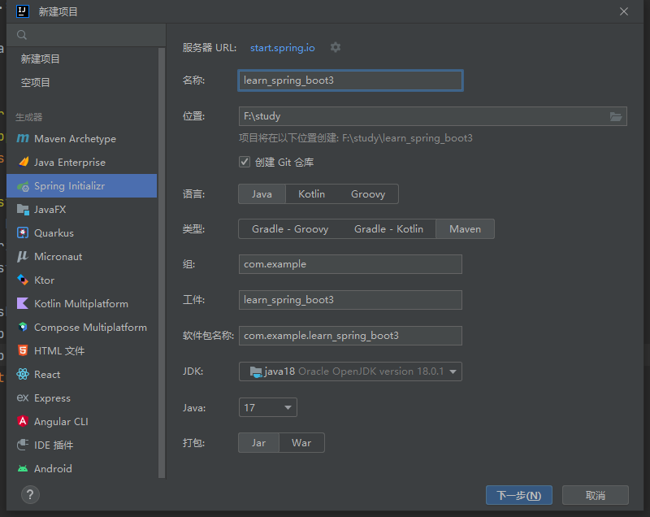
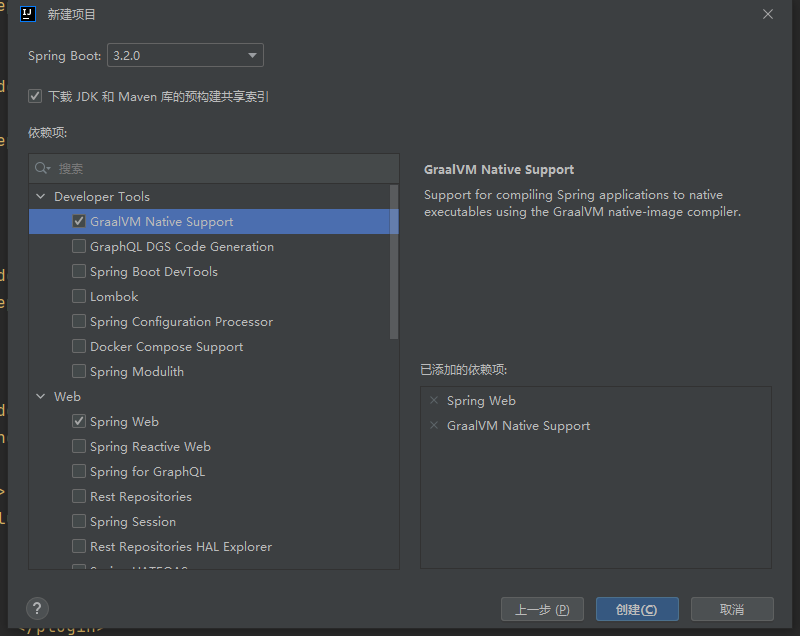
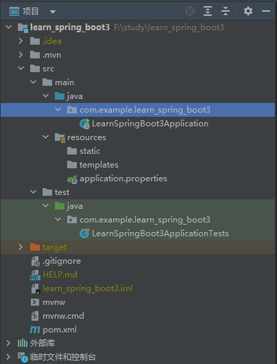

[[toc]]

# SpringBoot

[官网](https://spring.io/)

## 创建项目

**IDEA**新建项目选择`Spring Initializr`, 如下: 

 

选择需要的依赖项, 如下: 

 

>   在这里选择的依赖, 会被自动写入到`pom.xml`文件

生成的项目结构如下: 

 

-   `xxxApplication.java`是启动类, 项目启动会运行该类的`main`方法
-   `resources`是资源目录
    -   `resources/application.properies`是`SpringBoot`的配置文件
-   `test`是测试代码目录
-   `pom.xml`是声明项目依赖的文件

## Hello Word

在根目录下新建一个软件包叫`controller`, 新建一个类叫`TestController`, 内容如下: 

```java
package com.example.learn_spring_boot3.controller;

import org.springframework.http.ResponseEntity;
import org.springframework.stereotype.Controller;
import org.springframework.web.bind.annotation.RequestMapping;

@Controller // 表示该类是一个控控制器
@RequestMapping("/test") // 将 /test 的 url 映射到该类
public class TestController {
    @RequestMapping("/hello") // 将 /test/hello 的 url 映射到该方法
    public ResponseEntity<String> test() {
        String msg = "hello world";
        System.out.println(msg);
      
      	// 返回响应值
        return ResponseEntity.ok(msg);
    }
}
```

运行项目, 浏览器访问`localhost:8080/test/hello`, 即可看到`hello world`

## 项目结构

- 根目录: `src/main/java`
    入口启动类及程序的开发目录。在这个目录下进行业务开发、创建实体层、控制器层、数据连接层等。

    - 启动类`xxxApplication.java`在`src/main/java/com.xxx`下

    - 数据库实体层`pojo`
        model层即数据库实体层，也被称为entity层，pojo层。一般数据库一张表对应一个实体类，类属性同表字段一一对应.模型通常认为是视图的内核，何谓之视图？我们正在与之交互的网站的界面就是视图，而模型是指他的内核: 数据。

    - 数据持久层`dao`
        dao(Data Access Object)层即数据持久层，也被称为mapper层。
        dao层的作用为访问数据库，向数据库发送sql语句，完成数据的增删改查任务。
        通常我们在DAO层里面写接口，里面有与数据打交道的方法。SQL语句通常写在mapper文件里面的。
        结构清晰，Dao层的数据源配置以及相关的有关数据库连接的参数都在Spring配置文件中进行配置。

    - 数据服务接口层`service`
        service层即业务逻辑层，主要负责业务逻辑应用设计。
        首先也要设计接口，然后再设计其实现该接口的类(serviceImpl)。这样我们就可以在应用中调用service接口进行业务处理。
        service层调用dao层接口，接收dao层返回的数据，完成项目的基本功能设计。

    - 控制器层`controller`
        controller层即控制层.主要负责具体业务模块流程的控制，。
        controller层的功能为请求和响应控制。
        controller层负责前后端交互，接受前端请求，调用service层，接收service层返回的数据，最后返回具体的页面和数据到客户端。

    - 工具类库`utils`

    - 配置类`config`

    - 数据传输对象`dto`

    - 数据传输对象`Data Transfer Object`用于封装多个实体类domain之间的关系，不破坏原有的实体类结构

    - 视图包装对象`vo`
        视图包装对象View Object用于封装客户端请求的数据，防止部分数据泄露如: 管理员ID，保证数据安全，不破坏 原有的实体类结构

- 资源目录结构
    资源文件根目录: `src/main/resources`
    主要用来存放静态文件和配置文件

    - 项目配置文件: `resources/application.yml`
        用于配置项目运行所需的配置数据，也可以是`resources/application.properties`

    - 静态资源目录: `resources/static/`
        用于存放静态资源，如css、js、图片、音频等资源

    > 注意: static目录下的静态资源可以直接访问。

    - 视图模板目录: `resources/templates/`
        用于存放html、jsp、thymeleaf等模板文件

        > 注意: templates目录里存放的html页面，不能通过url直接访问（被websecurity权限控制），需跳转后台（通过Controller，即走控制器–服务–视图解析器这个流程）才能访问，同时还要引入thymeleaf模板引擎 ； 或者配置静态资源路径\ 。
        >
        > html静态页面放置在templates目录原因: 
        >
        > templates目录下的html页面不能直接访问，需要通过服务器内部进行访问，可以避免无权限的用户访问到隐私页面，造成信息泄露。

    - `mybatis`映射文件: `resources/mappers/`

    - `mybatis`配置文件: `resources/spring-mybatis.xml`

-   测试文件根目录: `src/test/java`
