:::v-pre


# Three

Three.js是使用面向对象的方式来构建程序,包含3个基本对象： `场景（scene）`, `相机`

`（camera）`, 以及一个`渲染器（renderer）` 

拿电影来类比的话,场景对应于整个布景空间,相机是拍摄镜头,渲染器用来把拍摄好的场景

转换成胶卷（对于网页来讲,是电脑屏幕）。 场景和相机代表了3D观察空间和数据模型,渲染

器则包含了WebGL绘图上下文和着色器

> [官网基础教程](https://threejs.org/manual/#zh/fundamentals), [郭隆邦教程](http://www.yanhuangxueyuan.com/Three.js/)


[[toc]]

## 程序结构

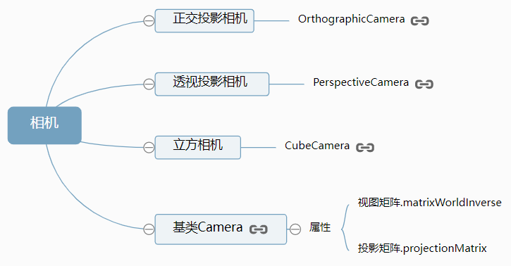 


## 前置工作

准备容器和初始化样式

```js
// css
body {
    margin: 0;
    overflow: hidden;
}
canvas {
    width: 100%;
    height: 100%
}

// html
<div id="container"></div>

// 引入 three
<script src="../../libs/three.js"></script>
```

## 场景（scene）

[`THREE.Scene()`](https://threejs.org/docs/index.html?q=scene#api/zh/scenes/Scene)

一个容器,容纳着除渲染器以外的三维世界里的一切。场景的元素采用**右手笛卡尔坐标系**,**x轴**

**正方向向右,y轴正方向向上,z轴由屏幕从里向外**

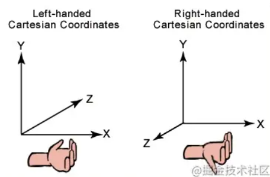 

场景能够让你在什么地方、摆放什么东西来交给 Threejs 来渲染,这是你放置物体、灯光和摄像机的地方

```js
// 创建场景
const scene = new THREE.Scene();
// 设置场景的背景颜色
scene.background = new THREE.Color('#ff0');
// 将指定物体添加到场景中
scene.add(xxx);
```

需要` Threejs `绘制的东西都需要加入到`scene`中

| 属性(方法)                           | 描述                                                         |
| ------------------------------------ | :----------------------------------------------------------- |
| **background**                       | 可以设置场景的背景颜色, 其实为**Color**实例                  |
| **add(object)**                      | 向场景中添加对象, 该方法还可以创建对象组                     |
| **children**                         | 用于返回一个场景中所有对象的列表, 包括摄像机和光源           |
| **getObjectByName(name, recursive)** | 在创建对象时可以指定唯一的标识 name, <br />使用该方法可以获取到指定名字的对象, <br />参数 recursive 为 false,只在调用者子对象上查找, <br />                    为true时在调用者所有后代对象上查找 |
| **remove(object)**                   | object 为对象的引用, 在场景中删除给定的对象                  |
| **traverse(callback)**               | 迭代方法, 可以遍历调用者和调用者的所有后代(**children**)     |
场景图在 3D 引擎是一个树形节点的层次结构,其中每个节点代表了一个局部空间（local space）

子节点的`position`或`rotation`设置的位置都是依据父节点的位置进行调整的

```js
// 父mesh
const parentMesh = new THREE.Mesh(geometry, material);
// 子mesh
const chilrenMesh = new THREE.Mesh(geometry, material);
// 将 chilrenMesh 添加到 parentMesh
parentMesh.add(chilrenMesh);
// 位置调整就是参考 parentMesh 的位置去调整的
chilrenMesh.position.set(10,5,8)
```

还可以通过`Object3D`或者`Group`对象来作为父对象

```js
const obj = new THREE.Object3D();
obj.add(parentMesh, chilrenMesh);
```

> 更详细介绍见官方, [场景图](https://threejs.org/manual/#zh/scenegraph)

## 相机（camera）

针对不同应用的三维场景需要使用不同的投影方式，比如机械、工业设计领域常常采用正投影(平行投影), 大型游戏场景往往采用透视投影(中心投影), three.js封装WebGL API和相关算法如下:

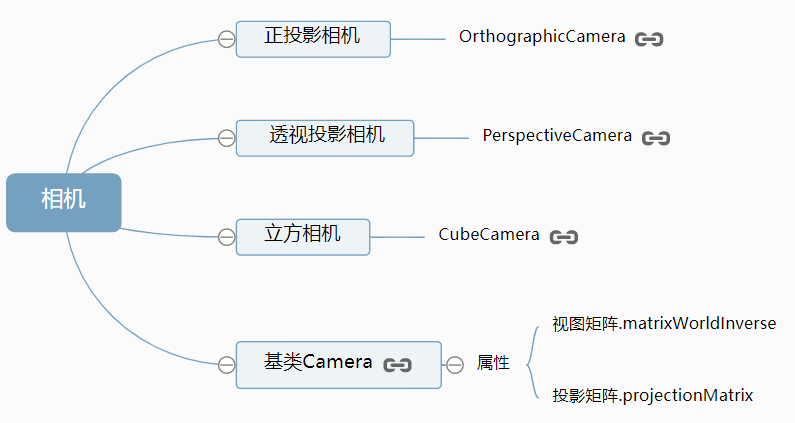  

符合物理世界近大远小真实情况的透视相机[`PerspectiveCamera`](https://threejs.org/docs/index.html#api/zh/cameras/PerspectiveCamera)

远近大小是一样的,就要用正交相机[`OrthographicCamera`](https://threejs.org/docs/index.html#api/zh/cameras/OrthographicCamera)

```js
// 创建透视相机
const camera = new THREE.PerspectiveCamera( 45, winW / winH, 1, 1000 );
// 添加到场景中
scene.add( camera );
```

### 透视相机

```js
THREE.PerspectiveCamera(fovy, aspect, near, far);
// 构造函数参数
// fovy：视场角
// aspect：视场宽高比（一般用 画布宽/画布高）
// near：能看多近
// far：能看多远
// 这几个参数决定了哪些scene里的三维顶点会被渲染/绘制出来
```

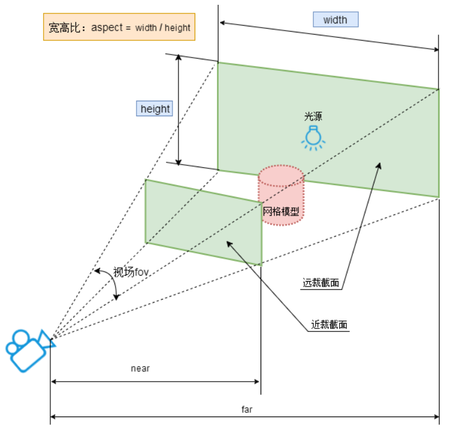 

```js
// 获取窗口的宽高
const winW = window.innerWidth;
const winH = window.innerHeight;
k = winW / winH;//窗口宽高比
const camera = new THREE.OrthographicCamera( winW / - k, winW / k, winH / k, 
                                            winH / - k, 1, 1000 ); 
scene.add( camera );
```

### 正交相机

```js
OrthographicCamera(left, right, top, bottom, near, far);

// 构造函数参数
// left — 摄像机视锥体左侧面
// right — 摄像机视锥体右侧面
// top — 摄像机视锥体上侧面
// bottom — 摄像机视锥体下侧面
// near — 摄像机视锥体近端面
// far — 摄像机视锥体远端面
```

> 每次变换方向位置之后, 需要调用 [`updateMatrix`](https://threejs.org/docs/index.html?q=camera#api/zh/core/Object3D.updateMatrix)方法来变换矩阵

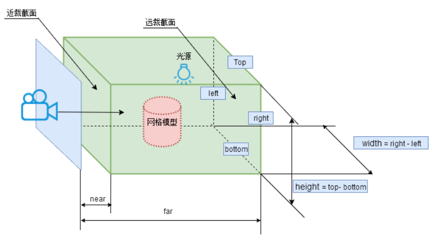 

 **常用属性(方法)**

| 属性(方法)               | 描述                                                         |
| ------------------------ | ------------------------------------------------------------ |
| aspect                   | 设置摄像机视锥体的长宽比,通常是使用画布的宽/画布的高。默认值是**1**（正方形画布） |
| zoom                     | 获取或者设置摄像机的缩放倍数,其默认值为**1**                 |
| position.set(x, y, z)    | 设置相机的xyz                                                |
| updateProjectionMatrix() | 更新摄像机投影矩阵, 在任何参数被改变以后必须被调用,不然相机不会更新 |

**lookAth函数**

`.lookAt()`方法用来指定相机拍摄对象的坐标位置，`.lookAt()`方法的参数是表示位置坐标的三维向量对象[Vector3](https://threejs.org/docs/index.html?q=vector#api/zh/math/Vector3)，所以`.lookAt()`方法的参数可以通过代码`new THREE.Vector3(x,y,z)`设置, 如果需要让相机对准某个对象，就返回那个对象的位置属性`.posiiotn`, 本质上就是计算出相机对象的视图矩阵`.matrixWorldInverse`


对于透视投影而言，相机位置与`lookAt`指向的观察目标位置间隔距离越小，场景中的三维模型放大倍数越大，准确地说是透视投影相机可以拍摄的范围更小，同时场景`Scene`中超出的相机参数约束范围的部分会被剪裁掉

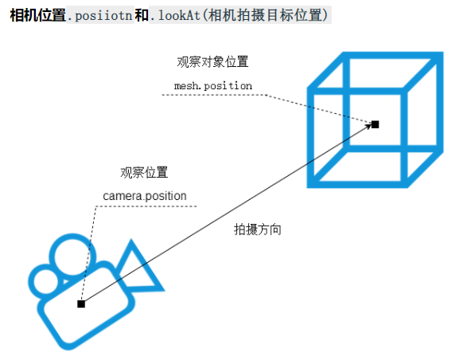  

```js
// 设置相机上方向位置
// camera.up属性默认值是 new THREE.Vector3(0,0,1),沿着z轴朝上
camera.up.set(0, 0, 1);

// 让相机"看向"指定的 0,0,0 位置
camera.lookAt(0, 0, 0);

// 看向指定位置
camera.lookAt(new THREE.Vector3(1, 3, 4));
```

`lookAt`函数可以实现摄像机跟随某个物体的效果

```js
function render(){
    //...
    // 摄像机跟随mesh对象移动
    camera.lookAt(mesh.position);
    //...
}
```

**相机位置放置**

如果是观察一个产品外观效果, 相机就位于几何体的外面, 如果是室内漫游预览, 就把相机放在房间三维模型的内部

> 如设置了`OrbitControls`则会失效, 需要的话可以设置`OrbitControls.target.set()`的属性

### 窗口变化自适应渲染

鼠标拖动使浏览器的窗口变大，Threejs渲染器的渲染尺寸范围没有跟着变化，出现局部空白区域。对于这种情况要做的就是重新获

取浏览器窗口新的宽高尺寸，然后通过新的宽高尺寸更新相机[Camera](https://threejs.org/docs/index.html?q=cam#api/zh/cameras/Camera)和渲染器[WebGLRenderer](https://threejs.org/docs/index.html?q=renderer#api/zh/renderers/WebGLRenderer)的参数即可

**视图矩阵`.matrixWorldInverse`和投影矩阵`.projectionMatrix`**

所谓相机对象[Camera](https://threejs.org/docs/index.html?q=camera#api/zh/cameras/Camera)本质上就是视图矩阵`.matrixWorldInverse`和投影矩阵`.projectionMatrix`，Threejs渲染场景的时候调用相机对象的视图矩阵和投影矩阵值对顶点进行矩阵变换, Threejs渲染的时候会通过设置的相机参数按照一定的算法计算出投影和视图矩阵值

**正交相机自适应渲染**

```js
// onresize 事件会在窗口被调整大小时发生
window.addEventListener('resize', handleResize);
function handleResize() {
    // 获取窗口的宽高
    const winW = window.innerWidth;
    const winH = window.innerHeight;
    // 重置渲染器输出画布canvas尺寸
    renderer.setSize(winW, winH);
    // 重置相机投影的相关参数
    k = winW / winH;//窗口宽高比
    camera.left = -1 * k;
    camera.right = 1 * k;
    camera.top = 1;
    camera.bottom = -1;
    // 渲染器执行render方法的时候会读取相机对象的投影矩阵属性projectionMatrix
    // 但是不会每渲染一帧，就通过相机的属性计算投影矩阵(节约计算资源)
    // 如果相机的一些属性发生了变化，需要执行updateProjectionMatrix()方法更新相机的投影矩阵
    camera.updateProjectionMatrix();
}
```

**透视投影相机自适应渲染**

```js
// onresize 事件会在窗口被调整大小时发生
window.addEventListener('resize', handleResize);
function handleResize() {
    // 获取窗口的宽高
    const winW = window.innerWidth;
    const winH = window.innerHeight;
	// 重置渲染器输出画布canvas尺寸
    renderer.setSize(winW, winH);
    // 全屏情况下：设置观察范围长宽比aspect为窗口宽高比
    camera.aspect = winW / winH;
    // 渲染器执行render方法的时候会读取相机对象的投影矩阵属性projectionMatrix
    // 但是不会每渲染一帧，就通过相机的属性计算投影矩阵(节约计算资源)
    // 如果相机的一些属性发生了变化，需要执行updateProjectionMatrix()方法更新相机的投影矩阵
    camera.updateProjectionMatrix();
    
}
```

> Threejs自适应渲染不一定就是窗口变化，本质上还是需要渲染的区域宽高尺寸变化了

## 渲染器（renderer）

[`THREE.WebGLRenderer()`](https://threejs.org/docs/index.html?q=renderer#api/zh/renderers/WebGLRenderer)

[**渲染器常量**](https://threejs.org/docs/#api/zh/constants/Renderer)

[**内置所有常量源码**](https://github.com/mrdoob/three.js/blob/master/src/constants.js)

将`camera`在`scene`里看到的内容渲染/绘制到画布上

```js
// 创建渲染器
const renderer = new THREE.WebGLRenderer({
    // 指定画布对象
    // canvas: document.getElementById('canvas'),
    // 开启抗锯齿
    animation: true,
    // 开启透明度
    alpha: true
});

// 设置渲染器的像素比 
renderer.setPixelRatio(Math.min(window.devicePixelRatio, 2));

// 设置输出canvas画面的大小
renderer.setSize(windW, windH);

// 设置画布背景颜色
renderer.setClearColor(new THREE.Color(0x00eeee));
// or
scene.background = new THREE.Color(0x00eeee); 

// 添加到DOM容器(构造时指定了canvas就不用)
document.getElementById('container').appendChild(renderer.domElement);

// 渲染场景和相机
renderer.render(scene, camera); // 顺序不能反

// 设置渲染物体阴影
renderer.shadowMapEnabled = true;
```

常用属性(方法):

| 属性(方法)                 | 描述                                                         |
| -------------------------- | ------------------------------------------------------------ |
| **domElement**             | 渲染器的构造函数会自动创建`renderer.domElement`<br />就是渲染器绘制输出的`canvas`对象 |
| **render(scene, camera)**  | 渲染场景和相机, 顺序不能反                                   |
| **setSize(width,height)**  | 将输出**canvas**的大小调整为(width, height)<br />将**updateStyle**设置为**false**可以阻止对**canvas**的样式做任何改变 |
| **shadowMapEnabled**       | 设置渲染物体的阴影                                           |
| **setClearColor()**        | 设置颜色及其透明度                                           |
| **setScissor(x,y)**        | 将剪裁区域设为(x, y)到(x + width, y + height)                |
| **setViewport(x,y)**       | 将视口大小设置为(x, y)到 (x + width, y + height)             |
| **logarithmicDepthBuffer** | 否使用对数深度缓存。<br />如果要在单个场景中处理巨大的比例差异,就有必要使用, 默认false |
| **alpha**                  | canvas是否包含alpha (透明度)。默认为 **false**               |
| **info**                   | 一个对象,包含有关图形在内存中和渲染过程的一系列统计信息      |

### Threejs全屏/局部渲染

通过Threejs发开Web3D应用的时候，渲染窗口可能是全屏效果占满web页面整个body区域，也可能是web页面上一个特定位置特定区域，比如渲染区域是一个特定位置、特定宽高的div元素所在区域

**全屏渲染** 

直接通过Threejs的WebGL渲染器[WebGLRenderer](https://threejs.org/docs/index.html?q=webglrenderer#api/zh/renderers/WebGLRenderer)的`.setSize()`方法设置渲染尺寸为浏览器body区域宽高度

```js
//设置渲染区域尺寸
renderer.setSize(width, height);
// body元素中插入Threejs渲染结果：canvas对象
document.body.appendChild(renderer.domElement);
```

**局部渲染** 

```js
// 设置渲染区域尺寸，本质就是设置输出canvas的尺寸
renderer.setSize(300, 300);
// 把渲染器的渲染结果canvas对象插入到'container'对应的div元素中
document.getElementById('container').appendChild(renderer.domElement);
```

可以通过渲染结果`.domElement`(Canvas元素)的父元素div来控制渲染区域在浏览器上的位置

```js
<!-- 控制div位置 绝对定位  距离上方100px  距离左侧30px -->
<div id="container" style="position: absolute;left: 30px;top: 100px;"></div>
```

### CSS2DRenderer

[CSS2DRenderer](https://threejs.org/docs/index.html?q=CSS2DRenderer#examples/zh/renderers/CSS2DRenderer)

需要将三维物体和基于HTML的标签相结合,这个号渲染器将十分有用

在这里,各个DOM元素也被包含到一个**CSS2DObject**实例中,并被添加到场景图中

```js
// 引入 CSS2DRenderer 和 CSS2DObject
import { CSS2DRenderer, CSS2DObject } from 'examples/jsm/renderers/CSS2DRenderer.js';\

// 标签渲染器
const labelRenderer = new CSS2DRenderer();
// 设置宽高
labelRenderer.setSize(window.innerWidth, window.innerHeight);
// 设置绝对定位不然会遮挡canvas里的内容
labelRenderer.domElement.style.position = 'absolute';
// 添加到容器中
document.getElementById('container').appendChild(labelRenderer.domElement);
// 创建DOM
const div = document.createElement('div');
div.innerText = 'hello world';
// CSS2DObject 加工DOM元素
const divLabel = new CSS2DObject(div);
// 可以设置这个 CSS2DObject 对象的位置
divLabel.position.set(0, 5, 0);
// 添加到需要结合的三维对象里
mesh.add(divLabel);
// 调用 CSS2DRenderer 的渲染渲染方法 
labelRenderer.render(scene, camera);
```

## 几何体（geometry）

3D世界里的所有物体都是`点组成面`,`面组成几何体`

`面`是由点构成的,`面`又可以组成各式各样的几何体

 Threejs 提供了很多的几何体, 如:

- [THREE.BoxGeometry](https://threejs.org/docs/index.html?q=geometry#api/zh/geometries/BoxGeometry): 立方体 
- [THREE.CircleGeometry](https://threejs.org/docs/index.html?q=geometry#api/zh/geometries/CircleGeometry): 圆形
- [THREE.ConeGeometry](https://threejs.org/docs/index.html?q=geometry#api/zh/geometries/ConeGeometry): 圆锥

- **THREE.xxxGeometry**: 指的是框架自带的几何体

```js
// 创建一个立方体
const geometry = new THREE.BoxGeometry(1, 1, 1);
// 开启阴影
geometry.castShadow = true;
// 接受阴影, 一般只有地板(PlaneGeometry)设置接受阴影
geometry.receiveShadow = true;
// 删除 geometry 对象
geometry.dispose();
```

几乎所有希望在`three`中显示的几何体都需要设置一些信息, 如: windth, height, radio等等

> 关于几何体的具体介绍见官方文档, [图元](https://threejs.org/manual/#zh/primitives)

### 圆弧线

[ArcCurve](https://threejs.org/docs/index.html?q=ArcCurve#api/zh/extras/curves/ArcCurve)

圆弧线[ArcCurve](https://threejs.org/docs/index.html?q=ArcCurve#api/zh/extras/curves/ArcCurve)的基类是椭圆弧线[EllipseCurve](https://threejs.org/docs/index.html?q=ArcCurve#api/zh/extras/curves/EllipseCurve), 关于圆弧线的使用方法可以查看文档中的椭圆弧线

曲线**Curd**的**getPoints**方法

**getPoints**方法是[Curve](https://threejs.org/docs/index.html?q=cur#api/zh/extras/core/Curve)方法, 圆弧线ArcCurve和椭圆弧线EllipseCurve都具有继承这个方法

通过方法`.getPoints()`可以从圆弧线按照一定的细分精度返回沿着圆弧线分布的顶点坐标

细分数越高返回的顶点数量越多,自然轮廓越接近于圆形, `.getPoints()`的返回值是一个由二维向量[Vector2](http://www.yanhuangxueyuan.com/threejs/docs/index.html#api/zh/math/Vector2)或

三维向量[Vector3](http://www.yanhuangxueyuan.com/threejs/docs/index.html#api/zh/math/Vector3)构成的数组,`Vector2`表示位于同一平面内的点,`Vector3`表示三维空间中一点

```js
const arc = new THREE.ArcCurve(0, 0, 100, 0, 2 * Math.PI);
//getPoints是基类Curve的方法,返回一个vector2对象作为元素组成的数组
const points = arc.getPoints(50);//分段数50,返回(50+1)个顶点
```

几何体方法**setFromPoints**

`.setFromPoints()`是几何体[BufferGeometry](https://threejs.org/docs/#api/zh/core/BufferGeometry)的方法,通过该方法可以把数组`points`中顶点数据提取出来赋值给几何体的顶点位置属性`geometry.vertices`,数组`points`的元素是二维向量[Vector2](https://threejs.org/docs/#api/zh/math/Vector2)或三维向量[Vector3](https://threejs.org/docs/#api/zh/math/Vector3)

```js
// setFromPoints方法从points中提取数据改变几何体的顶点属性vertices
geometry.setFromPoints(points);
console.log(geometry.vertices);
// 如果几何体是BufferGeometry改变的就是.attributes.position属性
// console.log(geometry.attributes.position);
```

### 样条曲线和贝塞尔曲线

规则的曲线比如圆、椭圆、抛物线都可以用一个函数去描述,对于不规则的曲线无法使用一个特定的函数去描述,

这也就是样条曲线和贝塞尔曲线出现的原因, three 提供了这两种曲线的API

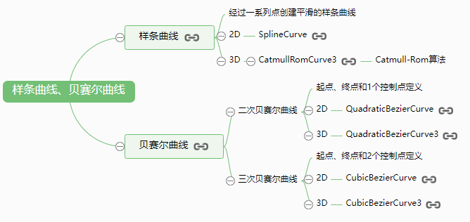 

**样条曲线**

在三维空间中设置5个顶点,输入三维样条曲线[CatmullRomCurve3](https://threejs.org/docs/?q=CatmullRomCurve3#api/zh/extras/curves/CatmullRomCurve3)作为参数,然后返回更多个顶点,

通过返回的顶点数据,构建一个几何体,通过`Line`可以绘制出来一条沿着5个顶点的光滑样条曲线

```js
// 声明一个几何体对象Geometry
const geometry = new THREE.Geometry(); 
// 三维样条曲线  Catmull-Rom算法
const curve = new THREE.CatmullRomCurve3([
  new THREE.Vector3(-50, 20, 90),
  new THREE.Vector3(-10, 40, 40),
  new THREE.Vector3(0, 0, 0),
  new THREE.Vector3(60, -60, 0),
  new THREE.Vector3(70, 0, 80)
]);
// getPoints是基类Curve的方法,返回一个vector3对象作为元素组成的数组
const points = curve.getPoints(100); //分段数100,返回101个顶点
// setFromPoints方法从points中提取数据改变几何体的顶点属性 vertices
geometry.setFromPoints(points);
// 材质对象
const material = new THREE.LineBasicMaterial({color: 0x000000});
// 线条模型对象
const line = new THREE.Line(geometry, material);
scene.add(line); //线条对象添加到场景中
```

> 通过调用three样条曲线或贝塞尔曲线的API, 可以输入有限个顶点返回更多顶点, 绘制出一条光滑的轮廓曲线

**贝塞尔曲线**

贝塞尔曲线和样条曲线不同,多了一个控制点概念

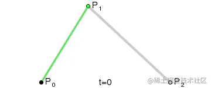 


三维二次贝赛尔曲线的参数p0、p2是起始点,p1是控制点,控制点不在贝塞尔曲线上

```js
const p1 = new THREE.Vector3(-80, 0, 0);
const p2 = new THREE.Vector3(20, 100, 0);
const p3 = new THREE.Vector3(80, 0, 0);
// 三维二次贝赛尔曲线
const curve = new THREE.QuadraticBezierCurve3(p1, p2, p3);
```

三维三次贝赛尔曲线的参数p1、p4是起始点,p2、p3是控制点,控制点不在贝塞尔曲线上

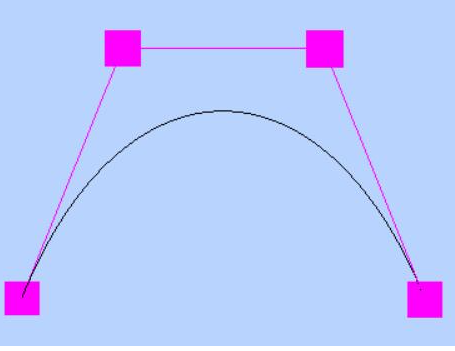 

```js
const p1 = new THREE.Vector3(-80, 0, 0);
const p2 = new THREE.Vector3(-40, 100, 0);
const p3 = new THREE.Vector3(40, 100, 0);
const p4 = new THREE.Vector3(80, 0, 0);
// 三维三次贝赛尔曲线
const curve = new THREE.CubicBezierCurve3(p1, p2, p3, p4);
```

## BufferGeometry

[`THREE.BufferGeometry`](http://www.yanhuangxueyuan.com/threejs/docs/index.html#api/zh/core/BufferGeometry)

可以通过自定义一些 向量来自定义面, 线, 法向量, 颜色值等等

[Float32Array](http://www.yanhuangxueyuan.com/Javascript/typeArray.html): 类型化数组

```js
const geometry = new THREE.BufferGeometry(); //创建一个Buffer类型几何体对象
//类型数组创建顶点数据
const vertices = new Float32Array([
  0, 0, 0, //顶点1坐标
  50, 0, 0, //顶点2坐标
  0, 100, 0, //顶点3坐标
  0, 0, 10, //顶点4坐标
  0, 0, 100, //顶点5坐标
  50, 0, 10, //顶点6坐标
]);
// 创建属性缓冲区对象
const attribue = new THREE.BufferAttribute(vertices, 3); //3个为一组,表示一个顶点的xyz坐标
// 设置几何体attributes属性的位置属性
geometry.attributes.position = attribue;
// 或者
geometry.addAttribute('position', attribue);
```

使用 BufferGeometry 设置顶点颜色数据

```js
// 类型数组创建顶点颜色color数据
const colors = new Float32Array([
  1, 0, 0, //顶点1颜色
  0, 1, 0, //顶点2颜色
  0, 0, 1, //顶点3颜色

  1, 1, 0, //顶点4颜色
  0, 1, 1, //顶点5颜色
  1, 0, 1, //顶点6颜色
]);
// 3个为一组,表示一个顶点的颜色数据RGB
geometry.attributes.color = new THREE.BufferAttribute(colors, 3);
// 材质对象
const material = new THREE.PointsMaterial({
  // 使用顶点颜色数据渲染模型,不需要再定义color属性
  // color: 0xff0000,
  vertexColors: THREE.VertexColors, //以顶点颜色为准
  size: 10.0 //点对象像素尺寸
});
// 点渲染模式  点模型对象Points
const points = new THREE.Points(geometry, material); // 点模型对象
scene.add(points); // 点对象添加到场景
```

还有法向量也是类似的

常用API总结: 

```js
// 访问几何体顶点位置数据
BufferGeometry.attributes.position;
// 访问几何体顶点颜色数据
BufferGeometry.attributes.color;
// 访问几何体顶点法向量数据
BufferGeometry.attributes.normal;

// 或者
BufferGeometry.addAttribute('xxx', data);
```

顶点索引复用顶点数据

```js
// Uint16Array类型数组创建顶点索引数据
const indexes = new Uint16Array([  
    // 0对应第1个顶点位置数据、第1个顶点法向量数据  
    // 1对应第2个顶点位置数据、第2个顶点法向量数据  
    // 索引值3个为一组,表示一个三角形的3个顶点  
    0, 1, 2, 
    0, 2, 3,
]);
// 索引数据赋值给几何体的index属性
geometry.index = new THREE.BufferAttribute(indexes, 1); //1个为一组
```

| 类型数组     | 位数 | 字节 | 类型描述           | C语言等价类型 |
| :----------- | :--- | :--- | :----------------- | :------------ |
| Int8Array    | 8    | 1    | 有符号8位整型      | int8_t        |
| Uint8Array   | 8    | 1    | 无符号8位整型      | uint8_t       |
| Int16Array   | 16   | 2    | 有符号16位整型     | int16_t       |
| Uint16Array  | 16   | 2    | 无符号16位整型     | int16_t       |
| Int32Array   | 32   | 4    | 有符号32位整型     | int32_t       |
| Uint32Array  | 32   | 4    | 无符号32位整型     | uint32_t      |
| Float32Array | 32   | 4    | 单精度(32位)浮点数 | float         |
| Float64Array | 64   | 8    | 双精度(64位)浮点数 | double        |

`BufferGeometry`总结

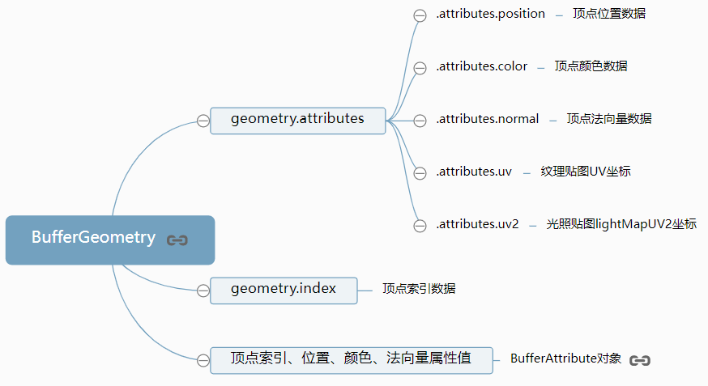

## 向量（Vector）

向量有[Vector2](http://www.yanhuangxueyuan.com/threejs/docs/index.html#api/zh/math/Vector2) [Vector3](http://www.yanhuangxueyuan.com/threejs/docs/index.html#api/zh/math/Vector3) [Vector4](http://www.yanhuangxueyuan.com/threejs/docs/index.html#api/zh/math/Vector4), 常用的就是三维向量, 

一个三维向量表示的是一个有顺序的、三个为一组的数字组合（标记为x、y和z）, 可被用来表示很多事物, 例如：

- 一个位于三维空间中的点
- 一个在三维空间中的方向与长度的定义
- 任意的、有顺序的、三个为一组的数字组合

几何体的顶点位置属性`.vertices`和缓冲类型几何体`BufferGeometry`顶点位置属性`BufferGeometry.attributes.position`是对应的

```js
const geometry = new THREE.Geometry(); //声明一个几何体对象Geometry
const p1 = new THREE.Vector3(50, 0, 0); //顶点1坐标
const p2 = new THREE.Vector3(0, 70, 0); //顶点2坐标
const p3 = new THREE.Vector3(80, 70, 0); //顶点3坐标

console.log(p1); // Vector3 {x: 50, y: 0, z: 0}

// 可以单独设置某个值
p1.x = 123;
p1.set(222,333,444); // 还可以一起设置
//顶点坐标添加到geometry对象
geometry.vertices.push(p1, p2, p3);
```

[Color](https://threejs.org/docs/index.html?q=color#api/zh/math/Color)定义顶点颜色数据

几何体的顶点颜色属性`.colors`对应`BufferGeometry.attributes.color`

```js
// Color对象表示顶点颜色数据
const color1 = new THREE.Color(0x00ff00); //顶点1颜色——绿色
const color2 = new THREE.Color(0xff0000); //顶点2颜色——红色
const color3 = new THREE.Color(0x0000ff); //顶点3颜色——蓝色
//顶点颜色数据添加到geometry对象
geometry.colors.push(color1, color2, color3);
```

> 注意设置几何体`Geometry`顶点颜色属性`geometry.colors`,对网格模型`Mesh`是无效的,对于点模型`Points`、线模型`Line`是有效果

材质属性`.vertexColors`

注意使用顶点颜色数据定义模型颜色的时候,要把材质的属性`vertexColors`设置为`THREE.VertexColors`,这

样顶点的颜色数据才能取代材质颜色属性`.color`起作用

```js
//材质对象
const material = new THREE.MeshLambertMaterial({
    // color: 0xffff00,
    vertexColors: THREE.VertexColors, //以顶点颜色为准
    side: THREE.DoubleSide, //两面可见
});
```

使用向量来对网格对象控制位置

```js
//向量Vector3对象表示方向
const axis = new THREE.Vector3(1, 1, 1);
axis.normalize(); //向量归一化
//沿着axis轴表示方向平移100
mesh.translateOnAxis(axis, 100);
```

```js
const axis = new THREE.Vector3(0,1,0);//向量axis
mesh.rotateOnAxis(axis,Math.PI/8);//绕axis轴旋转π/8
```

## 矩阵

在 Threejs 中矩阵分`3X3`和`4X4`矩阵分别对应[Matrix3](https://threejs.org/docs/index.html?q=matrix#api/zh/math/Matrix3), [Matrix4](https://threejs.org/docs/index.html?q=matrix#api/zh/math/Matrix4)

```js
const m4 = new THREE.Matrix4();
```

位置信息存储在 `.elements`属性中, 默认值如下

```js
[
    1, 0, 0, 0,
    0, 1, 0, 0,
    0, 0, 1, 0,
    0, 0, 0, 1,
]
```

**.elements** 属性排列顺序问题:

`.elements` 属性直接赋值数组属性正常按**行(索引)排列**

```js
m4.elements = [
    12, 0, 0, 12,
    0, 22, 0, 22,
    33, 0, 33, 0,
    0, 0, 44, 44,
];
// m4.elements => [12, 0, 0, 12,...]
```

使用 `set` 方法赋值是**按列排列**

```js
m4.set(
    12, 0, 0, 12,
    0, 22, 0, 22,
    33, 0, 33, 0,
    0, 0, 44, 44,
);
// m4.elements => [12, 0, 33, 0,...]
```

`transpose` 转置方法可以将排列方式相互转换

本身是**行排列**就转换为**列排列**, **列排列**就转换为**行排列**

```js
m4.elements = [
    12, 0, 0, 12,
    0, 22, 0, 22,
    33, 0, 33, 0,
    0, 0, 44, 44,
];
console.log(m4.elements); // [12, 0, 0, 12,...]

m4.transpose(); // 本身是 行排列 将转换为 列排列

console.log(m4.elements); // [12, 0, 33, 0,...]
```

`clone`方法同向量的一样

```js
const m4 = new THREE.Matrix4();
const m4c = m4.clone();
m4c.set(...);
```

`multiplyScalar`方法可以将将矩阵中的每个元素放大多少倍

```js
const m4 = new THREE.Matrix4();
m4.elements = [
    1, 2, 3, 4,
    1, 2, 3, 4,
    1, 2, 3, 4,
    1, 2, 3, 4,
]
// 将矩阵中的每个元素放大10倍
m4.multiplyScalar(10)
console.log(m4.elements); // [10,20,30,40,...]
```

**矩阵的乘法运算:**

`c.multiplyMatrices(a,b)`: 参数矩阵`a*b`结果保存到`c`中 

`a.multiply(b)`:  矩阵`a*b`结果保存到`a`中 

`a.premultiply(b)`: 矩阵`b*a`结果保存到`a`中 

```js
const a = new THREE.Matrix4();
a.elements = [
    1, 2, 3, 4,
    1, 2, 3, 4,
    1, 2, 3, 4,
    1, 2, 3, 4,
];
const b = new THREE.Matrix4();
b.elements = [
    1, 1, 0, 0, // 2 => 1*2, 2*2, 3*2, 4*2 => a[2,4,6,8]
    1, 1, 1, 1, // 4 => 1*4, 2*4, 3*4, 4*4 => a[4,8,12,16]
    1, 2, 1, 1, // 5
    1, 3, 1, 1, // 6
];
// multiplyMatrices 和 multiply 都是拿被乘数4位相加的和 乘于乘数的每一项
a.multiplyMatrices(a, b);
// a.multiply(b);
console.log(a.elements); // [2, 4, 6, 8,...]

a.premultiply(b);
console.log(a.elements); // [10, 21, 9, 9,...]
```

> `multiplyMatrices` 和 `multiply` 都是右乘, `premultiply` 不同是左乘

### 矩阵对象的平移, 缩放, 旋转

矩阵对象通过`.elements`属性和`set`方法来设置矩阵的一些变化时, 比较麻烦, Threejs 有已经封装好的API:

绕X轴旋转: `makeRotationX(theta)`

绕Y轴旋转: `makeRotationY(theta)`

绕Z轴旋转:`makeRotationZ(theta)`

当前矩阵为围绕轴 axis 旋转量为 theta弧度: `makeRotationAxis (axis, theta)`

缩放: `makeScale(x,y,z)`

平移: `maketranslation(x,y,z)`

剪切: `makeShear(x,y,z)`

模型对象的`rotateX/Y/Z` `translateX/Y/Z` `scale`等其实都是对矩阵进行的一定影响

```js
const mesh = new THREE.Mesh(1, 1, 1);

console.log(mesh.matrix.elements); // 查看矩阵对象

mesh.rotateX(Math.PI); // 修改网格对象的属性其实就是修改矩阵对象的属性
// mesh.position.set(2, 6, 8);

mesh.updateMatrix(); // 更新矩阵对象

console.log(mesh.matrix.elements); // 查看修改后的矩阵对象属性
```

#### 视图矩阵

## 三维对象（Object3D）

[`THREE.Object3D()`](https://threejs.org/docs/index.html?q=camera#api/zh/core/Object3D)

这是 Threejs 中大部分对象的`基类`, 提供了一系列的属性和方法来对三维空间中的物体进行操纵,

如果需要通过[`.add(object)`](https://threejs.org/docs/#api/zh/core/Object3D.add)方法来将对象进行组合, 推荐使用`Group`

### 对象克隆和复制

 Threejs 大多数对象都有克隆`.clone()`和复制`.copy()`两个方法,点模型`Points`、线模型`Line`、网格网格

模型`Mesh`一样具有这两个方法

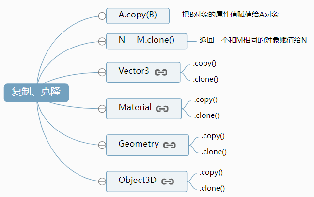 

复制方法 `copy`

```js
const p1 = new THREE.Vector3(1.2,2.6,3.2);
const p2 = new THREE.Vector3(0.0,0.0,0.0);
// 复制p1的值给p2
p2.copy(p1)
// p2向量的xyz变为p1的xyz值
console.log(p2);
```

克隆方法 `clone`

```js
const p1 = new THREE.Vector3(1.2,2.6,3.2);
// 克隆p1对象赋值给p2
const p2 = p1.clone();
// p1对象和p2对象xyz属性相同
console.log(p2);
```

向量相减方法 `sub`

```js
const v1 = new THREE.Vector3(10, 22, 55);
const v2 = new THREE.Vector3(20, 42, 85);
v2.sub(v1);
// sub 方法会影响调用者本身, 推荐克隆后再使用 v2.clone().sub(v1);
console.log(v2); // Vector3 {x: 10, y: 20, z: 30}
```

计算最长的直线长度 `length`

```js
const v1 = new THREE.Vector3(10, 22, 55);
const v2 = new THREE.Vector3(20, 42, 85);
// 克隆后再计算避免被修改属性
const len = v2.length();
console.log(len); // 96.89685237405806
```

网格模型**复制和克隆**

网格模型复制克隆和三维向量基本逻辑是相同,但是注意三维向量的属性值都是基本数据类型

网格模型对象的几何体属性`mesh.geometry`和材质属性`mesh.material`的属性值都是引用数据类型

```js
const box = new THREE.BoxGeometry(10,10,10);//创建一个立方体几何对象
const material = new THREE.MeshLambertMaterial({color:0x0000ff});//材质对象
const mesh = new THREE.Mesh(box, material);//网格模型对象
const mesh2 = mesh.clone();//克隆网格模型

mesh.translateX(20);//网格模型mesh平移
scene.add(mesh,mesh2);//网格模型添加到场景中

box.scale(1.5,1.5,1.5);//几何体缩放
```

> 两个正方体都放大了, 也就是说对网格模型来说`clone`克隆的只是浅拷贝

几何体**复制和克隆**

几何体克隆或复制和网格模型有些不同, 比如几何体的顶点属性`Geometry.vertices`属性是一个数组对象

但是复制或克隆的时候, 不是获得对象的索引值, 而是深拷贝属性的值

## 组（Group）

[`THREE.Group()`](https://threejs.org/docs/#api/zh/objects/Group)

和`	Object3D`类似, 可以通过`Group`的`add`方法把多个几何图形组成一个组, 

组的结构类似于`DOM`树, 修改父对象将会同时影响它下面的所有子对象

```js
const group = new THREE.Group();
// 添加子对象
group.add(mesh1, mesh2);
// 父对象旋转,子对象跟着旋转
group.rotateY(Math.PI / 6)
// 添加到场景中
scene.add(myGroup);
```

`.children`属性(数组)保存的就是自身所有的子对象

```js
console.log(group.children);
```

> 父对象执行`.add()`方法的本质就是把参数中的子对象添加到自身`.children`数组中

**remove**方法

`.remove()`方法是删除父对象中的一个子对象, 和`.add()`一样改变的都是父对象的`.children()`属性

```js
// 删除父对象myGroup的子对象网格模型mesh1
group.remove(mesh1);
// 一次删除场景中多个对象
scene.remove(light, group);
```

### 对象节点命名, 查找, 遍历

**模型命名**

在层级模型中可以给一些模型对象通过`.name`属性命名进行标记

```js
group.add(Mesh)
// 网格模型命名
Mesh.name = "眼睛"
// mesh父对象对象命名
group.name = "头"
```

**查找某个具体的模型**

为 Group 命名,可以通过`getObjectByName`方法来获取到对应**name**属性的对象：

```js
// 遍历查找对象的子对象,返回name对应的对象（name是可以重名的,返回第一个）
const nameNode = scene.getObjectByName('头');
nameNode.rotateY(Math.PI / 2);
```

可以通过`getObjectById`方法来获取到对应**ID**的对象:

```JS
// 遍历查找scene中复合条件的子对象,并返回id对应的对象
const idNode = scene.getObjectById (4);
console.log(idNode);
```

**traverse(callback)**

**traverse**方法可以遍历调用者和调用者的所有后代(**children**)

```js
group.traverse(item=>{
    if(item.isGroup){...} // 是否是Group实例
	if(item.isSprite){...} // 是否是Sprite实例
    if(item.isGeometry){...} // 是否是Geometry实例
    // 还有 isScene isMesh isAmbientLight 等等属性
    if(item.type === 'Group'){...} // 类型属性
    if(item.name === 'xxx'){...} // nang属性
});
```

### 本地坐标系和世界坐标系

访问模型的位置属性`.position`获得模型在本地坐标系或者说模型坐标系下的三维坐标,

通过模型的`.getWorldPosition()`方法获得该模型在世界坐标下的三维坐标

**getWorldPosition** 方法

```js
// 声明一个三维向量用来保存世界坐标
const worldPosition = new THREE.Vector3();
// 执行getWorldPosition方法把模型的世界坐标保存到参数worldPosition中
mesh.getWorldPosition(worldPosition);
```

**本地坐标系**: 

所谓本地坐标系(模型坐标系),就是模型对象**相对于模型的父对象**而言,

模型位置属性`.position`表示的坐标值就是以本地坐标系为参考

**世界坐标系**:

一个模型对象可能有多个父对象节点, 世界坐标系默认就是对整个场景建立的一个坐标系

一个模型的世界坐标系的值就是该模型对象**所有父对象以及模型本身**`.position`属性的**累加**

**本地矩阵**

本地矩阵`.materix`是以本地坐标系为参考的模型矩阵

 Threejs 模型的位置属性`.position` 缩放系数属性`.scale`和角度属性`.rotation`记录了模型的所有平移

缩放和旋转变换,本地矩阵`.materix`是以线性代数矩阵的形式表示`.position`、`.scale`和`.rotation`

**世界矩阵**

世界矩阵`.matrixWorld`自然就是以是世界坐标系为参照的模型矩阵

用矩阵的形式表示模型以及模型父对象的所有旋转缩放平移变换

> 更新本地矩阵属性使用`.updateMatrix()`方法, 更新世界矩阵属性使用`.updateMatrixWorld()`方法

> 更多内容可以参考文章[本地矩阵和世界矩阵](http://www.yanhuangxueyuan.com/doc/Three.js/matrixWorld.html)

## 材质（material）

使用白卡纸画画,还是用油纸画画,呈现出来的质感是不同的对不对,这就是`材质`！

下面五个球的颜色都是一样的,而材质从左至右分别是: 

- [THREE.MeshBasicMaterial](https://threejs.org/docs/index.html?q=MeshBasicMaterial#api/zh/materials/MeshBasicMaterial)（基础材质,不受光照影响）
- [THREE.MeshStandardMaterial](https://threejs.org/docs/index.html?q=MeshStandardMaterial#api/zh/materials/MeshStandardMaterial)（PBR标准材质）
- [THREE.MeshPhongMaterial](https://threejs.org/docs/index.html?q=MeshPhongMaterial#api/zh/materials/MeshPhongMaterial)（高光材质,适用于陶瓷,烤漆类质感）
- [THREE.MeshToonMaterial](https://threejs.org/docs/index.html?q=MeshToonMaterial#api/zh/materials/MeshToonMaterial)（卡通材质,俗称三渲二）
- [THREE.MeshStandardMaterial](https://threejs.org/docs/index.html?q=MeshStandardMaterial#api/zh/materials/MeshStandardMaterial)（PBR标准材质模拟金属反射）
- **THREE.xxxMaterial:** 指的是框架自带的材质

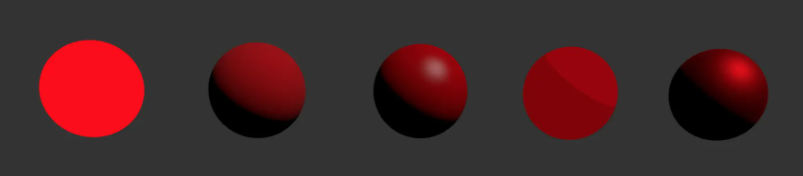 

```js
// 创建 MeshPhongMaterial 材质颜色为绿色
const material = new THREE.MeshPhongMaterial({ 
    // 颜色
    color: 0x00ff00,
    // 透明度
    opacity: 0.5,
    // 开启透明度效果
    transparent: true,
    // 将几何图形渲染为线框, 默认值为false
    wireframe: true,
    // 高光颜色
    specular: 0x4488ee,
    // 光照强度系数
    shininess: 12
    // 网格模型以线条的模式渲染
    wireframe: true,
});

// 或者实例后重新指定颜色
const material = new THREE.MeshPhongMaterial();
material.color.setHSL(0, 1, .5); // 红色
```

[`THREE.Color`](https://threejs.org/docs/#api/zh/math/Color) 类型的属性有多种设置方式

```js
material.color.set(0x00FFFF);    // 同 CSS的 #RRGGBB 风格
material.color.set(cssString);   // 任何 CSS 颜色字符串, 比如 'purple', '#F32',
                                 // 'rgb(255, 127, 64)',
                                 // 'hsl(180, 50%, 25%)'
material.color.set(someColor)    // 其他一些 THREE.Color
material.color.setHSL(h, s, l)   // 其中 h, s, 和 l 从 0 到 1
material.color.setRGB(r, g, b)   // 其中 r, g, 和 b 从 0 到 1
```

实例化时同样支持多种颜色设置方案

```js
const m1 = new THREE.MeshBasicMaterial({color: 0xFF0000});         // 红色
const m2 = new THREE.MeshBasicMaterial({color: 'red'});            // 红色
const m3 = new THREE.MeshBasicMaterial({color: '#F00'});           // 红色
const m4 = new THREE.MeshBasicMaterial({color: 'rgb(255,0,0)'});   // 红色
const m5 = new THREE.MeshBasicMaterial({color: 'hsl(0,100%,50%)'); // 红色
```

材质常用属性:

- [`flatShading`](https://threejs.org/docs/#api/zh/materials/Material#flatShading)：对象是否使用平面着色,默认为`false`

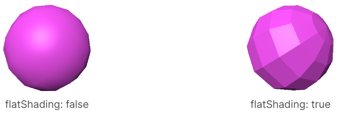 

- [`side`](https://threejs.org/docs/#api/zh/materials/Material#side)：要显示三角形的哪个面。默认值是 `THREE.FrontSide`（[材质常量](https://threejs.org/docs/#api/zh/constants/Materials)）
	- 其他选项有 `THREE.BackSide` 和 `THREE.DoubleSide`（正反两面）
	- 设置 `side` 的最常见的原因是用于绘制平面或其他非实体对象,在这些对象中通常会看到三角形的反面

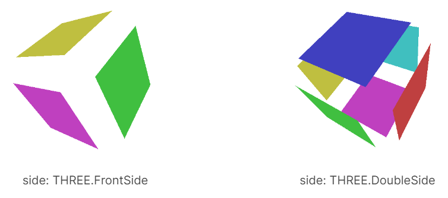 

- [`needsUpdate`](https://threejs.org/docs/?q=material#api/zh/materials/Material.needsUpdate): 指定需要重新编译材质
	- 需要改变材质或纹理时, 需要设置`material.needsUpdate = true`来告诉 three 应用你的材质变化
	- 常用的场景:
		- 切换`flatShading`
		- 添加或删除纹理
- [`fog`](https://threejs.org/docs/#api/zh/materials/Material#fog): 材质是否受雾的影响。默认为**true**
- [`dispose()`](https://threejs.org/docs/#api/zh/materials/Material.dispose): 删除材质, 释放相关资源

> 更多关于材质介绍, 见 [材质](https://threejs.org/manual/#zh/materials)

## 网格（Mesh）

[`THREE.Mesh()`](https://threejs.org/docs/index.html?q=mesh#api/zh/objects/Mesh)

网格对象包含一个**几何体**以及作用在此几何体上的**材质**,

可以直接将网格对象放入到我们的场景中,并让它在场景中自由移动

用法和常用属性如下:

```js
// 接受 几何体 和 材质
const mesh = new THREE.Mesh(geometry, material);

// 网格对象旋转
mesh.rotation.x = -0.5 * Math.PI;

// 使用 set 方法设置网格对象的 x y z 矩阵
mesh.position.set(1, 5, 0); 
// or
mesh.position.x = 1;
mesh.position.y = 5;
mesh.position.z = 0;

// 设置网格对象的缩放 x y z 矩阵
mesh.scale.set(x,y,z);

// 设置网格对象的旋转 x y z
mesh.rotation.set(x,y,z);

// 设置网格对象的旋转 x y z(在原先的基础上旋转)
mesh.rotateX();
mesh.rotateY();
mesh.rotateZ();

// x轴平移
mesh.translateX(distance);
// x轴平移
mesh.translateY(distance);
// z轴平移
mesh.translateZ(distance);

//显示网格对象
mesh.visible = true;
//隐藏网格对象
mesh.visible = false;

// 网格对象添加到场景中
scene.add( mesh );
```

默认情况下,调用**scene.add()**的时候,物体将会被添加到**(0,0,0)**坐标, 这将使得摄像机和立方体重叠在一起

为了防止这种情况的发生,只需要将摄像机稍微向外移动一些即可

```js
mesh.position.set(0, 0, 5);
// 或者
mesh.position.z = 5;
```

点线面模型总结: 

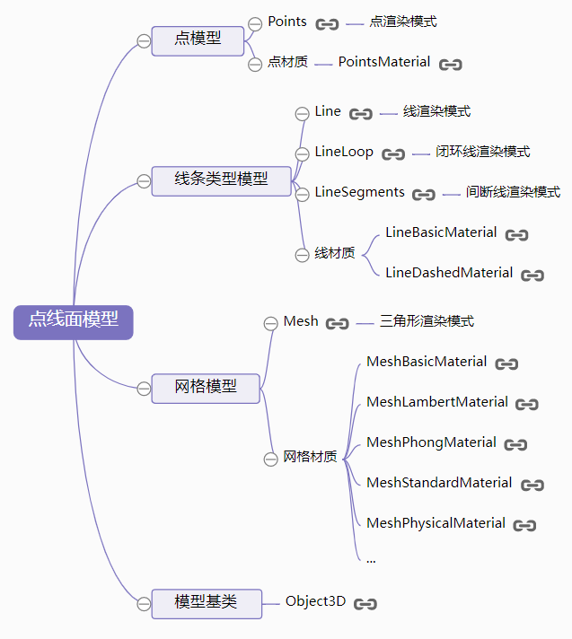 

## 渲染场景

前面的代码都是在设置样式, 参数, 页面是没有效果的, 因为还没有被真正渲染,

可以使用`requestAnimationFrame`来**循环渲染**,

> 不推荐使用`setInterval`来循环渲染

```js
// 渲染函数
const render = function () {
    // 改变网格角度
    mesh.rotation.x += 0.01;
    mesh.rotation.y += 0.01;
    // 重新渲染
    renderer.render(scene, camera);
    // 使用 requestAnimationFrame 重新调用渲染函数
    requestAnimationFrame(render);
};
// 调用渲染函数
render();
```

---

## 灯光（Light）

[`THREE.Light()`](https://threejs.org/docs/index.html#api/zh/lights/Light)

3d引擎在没有手动创建光的情况下会默认有个`环境光`,不然什么都看不到。

常见的灯光有以下几种类型: 

- [THREE.AmbientLight](https://threejs.org/docs/index.html?q=AmbientLight#api/zh/lights/AmbientLight)（环境光,充满所有的几何体表面,不会产生明暗）
- [THREE.DirectionalLight](https://threejs.org/docs/index.html?q=ligh#api/zh/lights/DirectionalLight)（平行光,参考日光来理解）

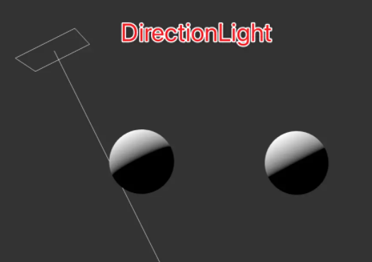 

方向光（[`DirectionalLight`](https://threejs.org/docs/#api/zh/lights/DirectionalLight)）常常用来表现太阳光照的效果

- [THREE.PointLight](https://threejs.org/docs/index.html?q=ligh#api/zh/lights/PointLight)（点光源,参考灯泡来理解）

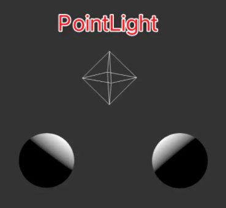 

点光源（[`PointLight`](https://threejs.org/docs/#api/zh/lights/PointLight)）有额外的一个范围（[`distance`](https://threejs.org/docs/#api/zh/lights/PointLight#distance)）属性。 如果 `distance` 设为 0,则光线可以照射到无限远处。

如果大于 0,则只可以照射到指定的范围,光照强度在这个过程中逐渐衰减,在光源位置时,`intensity` 是设定的大小,

在距离光源 `distance` 位置的时候,`intensity` 为 0

- [THREE.SpotLight](https://threejs.org/docs/index.html?q=SpotLight#api/zh/lights/SpotLight)（聚光灯,参考舞台聚光灯）

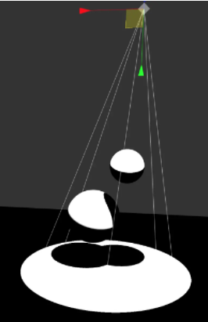 

聚光灯的圆锥顶部角度大小通过 [`angle`](https://threejs.org/docs/#api/zh/lights/SpotLight#angle) 属性设置,以弧度作单位。内圆锥是通过设置 [`penumbra`](https://threejs.org/docs/#api/zh/lights/SpotLight#penumbra) 属性来定义的,

属性值代表了内圆锥相对外圆锥大小变化的百分比, 当 `penumbra` 为 0 时,内圆锥大小与外圆锥大小一致；

当 `penumbra` 为 1 时,内圆锥大小为 0,光照强度从中轴线就开始往外递减；当 `penumbra` 为 0.5 时,

光照强度从外圆锥半径的中点处开始往外递减

- **THREE.xxxLight: **指的是框架自带的光源构造函数

```js
// 创建点光源
// 颜色为0xffffff, 光照强度为2
const light = new THREE.PointLight(0xffffff, 2);
// 设置光源的位置
light.position.set(2,5,0);
// 设置光源的照向位置(SpotLight独有属性)
light.target = plane;
// 添加到场景中
scene.add(light);
```

在设置光照时,基本思路是不要设置 `distance` 来表现光照的衰减,也不要设置 `intensity`

而是设置光照的 [`power`](https://threejs.org/docs/#api/zh/lights/PointLight#power) 属性,以流明为单位,three.js 会进行物理计算,从而表现出接近真实的光照效果

在这种情况下 three.js 参与计算的长度单位是米,一个 60瓦 的灯泡大概是 800 流明强度

并且光源有一个 [`decay`](https://threejs.org/docs/#api/zh/lights/PointLight#decay) 属性,为了模拟真实效果,应该被设置为 `2`

> 上面的只有平行光, 点光源, 聚光灯可以产生**阴影**而且有的材料是受光源影响, 没有光就是黑的; 而一些材料是不受光影响的

一个3D世界当然不止一种光构成,所以光是可以叠加的,叠加的结果作用与物体上,

而且物体的影子也不是白送的,需要某些支持影子的光加上开发者配置：

**Threejs 所默认使用*阴影图（阴影贴图）*,阴影贴图的工作方式就是具有投射阴影的光能对所有能被投射阴影的物体**

**从光源渲染阴影**

```js
// 渲染器渲染阴影
renderer.shadowMap.enabled = true;

// 光能投射阴影
light.castShadow = true;

// 网格被投射阴影(接受)
mesh.receiveShadow  = true;
// 网格能投射阴影
mesh.castShadow  = true;

// 球体和立方体需要同时设置两种
sphereMesh.receiveShadow = true;
sphereMesh.castShadow = true;
// 地面只设置 receiveShadow 即可
planeMesh.receiveShadow = true;
```

**镜头光晕**

镜头光晕使用[Lensflare](https://threejs.org/docs/index.html?q=lens#examples/zh/objects/Lensflare)类来实现

## 纹理（texture）

**纹理**又叫**贴图**

[`THREE.texture()`](https://threejs.org/docs/index.html?q=texture#api/zh/textures/Texture)

纹理一般是指我们常见的在一些第三方程序中创建的图像, 将其应用到几何表面,或者作为反射/折射贴图

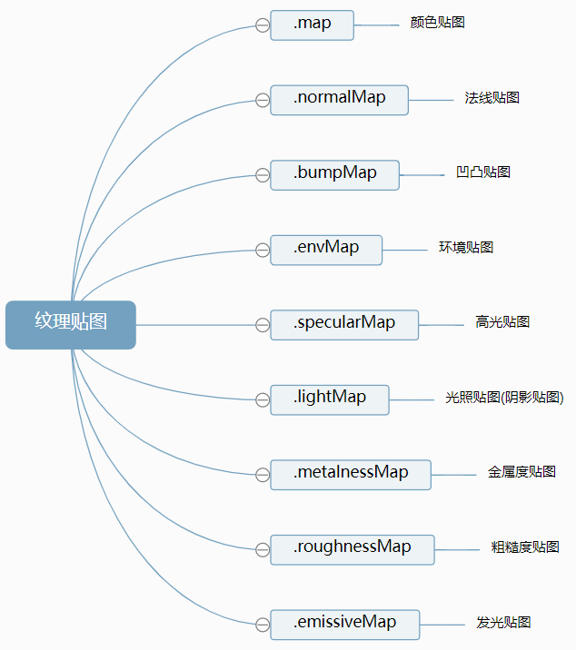 

```js
// 创建正方体
const geometry = new THREE.BoxGeometry(1, 1, 1);
// 需要 TextureLoader 类的 load方法 来加载纹理
const loader = new THREE.TextureLoader();
// 创建 MeshBasicMaterial 纹理
const material = new THREE.MeshBasicMaterial({
    // map 指定纹理
    map: loader.load('./wall.jpg'),
    // 高光亮度
    shininess: 5,
    // 如果不透明度低于此值, 则不会渲染材质
    alphaTest: 0.1,
    // 材质允许透明
    transparent: true,
    // 材质透明度
    opacity: 0.5,
    // 是否在渲染此材质时启用深度测试
    depthTest: true
});
const cube = new THREE.Mesh(geometry, material);
scene.add(cube);
```

> 材质的颜色贴图属性`.map`设置后,模型会从纹理贴图上采集像素值,这时候就不需要再设置材质颜
>
> 色`.color`, `.map`贴图之所以称之为颜色贴图就是因为网格模型会获得颜色贴图的颜色值RGB

如果更改了图像,画布,视频和数据纹理,则需要设置以下标志

```js
texture.needsUpdate = true;
```

删除材质

```js
Texture.dispose();
```

有一些类型的贴图会和光照发生反应

### 纹理对象 **Texture**

通过图片加载器 [ImageLoader](https://threejs.org/docs/index.html#api/zh/loaders/ImageLoader) 可以加载一张图片, 所谓纹理对象Texture简单地说就是,纹理对象Texture的`.image`属性值是一张图片

```js
// 正方形
const geometry = new THREE.BoxGeometry(1, 1, 1); //立方体
// 图片加载器
const ImageLoader = new THREE.ImageLoader();
// load方法回调函数,按照路径加载图片,返回一个html的元素img对象
ImageLoader.load('../day2/wall.jpg', (img) => {
    // image对象作为参数,创建一个纹理对象Texture
    const texture = new THREE.Texture(img);
    // 下次使用纹理时触发更新
    texture.needsUpdate = true;
    const material = new THREE.MeshLambertMaterial({
        map: texture, //设置纹理贴图
    });
    const mesh = new THREE.Mesh(geometry, material); //网格模型对象Mesh
    scene.add(mesh); //网格模型添加到场景中
});
```

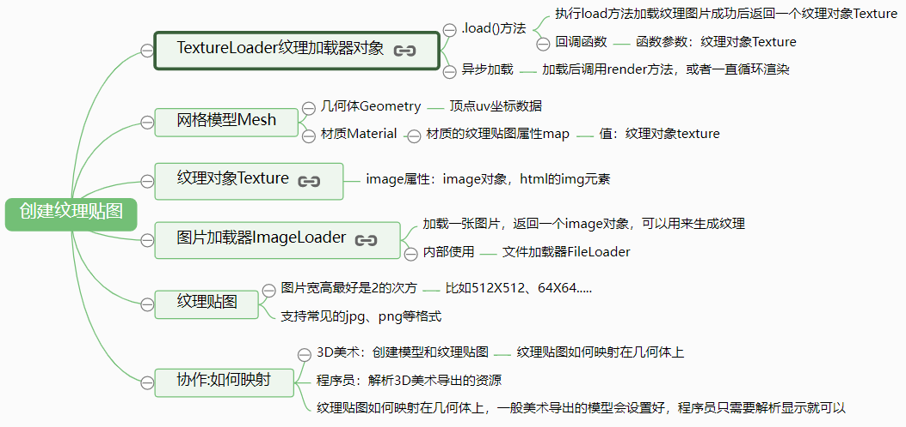 

> 详细介绍见, 官方[纹理](https://threejs.org/manual/#zh/textures),

### 数组材质、材质索引

**数组材质**

可以把数组材质作为几何体的纹理贴图,所谓数组材质就是多个材质对象构成一个数组作为模型对象的材质

以正方形为例

```js
// 设置材质数组
const materialArr = [material_2, material_1, material_2, material_1, material_2, material_1];

// 设置数组材质对象作为网格模型材质参数, 这样材质数组里的每一项对应正方体的一个面
const mesh = new THREE.Mesh(geometry, materialArr); 
```

**材质索引**

[uv映射](https://www.mrguo.link/article?id=41)

### 纹理对象**Texture**阵列、偏移、旋转

**阵列**

纹理贴图阵列映射

默认情况下, 纹理是不重复的, 要设置纹理是否重复, 有2个属性,[`wrapS`](https://threejs.org/docs/#api/zh/textures/Texture#wrapS) 用于水平包裹,[`wrapT`](https://threejs.org/docs/#api/zh/textures/Texture#wrapT) 用于垂直包裹

重复是用`repeat`重复属性设置的

```js
const texture = textureLoader.load('太阳能板.png');
// 设置阵列模式, 默认ClampToEdgeWrapping  
texture.wrapS = THREE.RepeatWrapping;
texture.wrapT = THREE.RepeatWrapping;
// uv两个方向纹理重复数量
texture.repeat.set(4, 2);
```

阵列模式:

- `THREE.ClampToEdgeWrapping`

	每条边上的最后一个像素无限重复。

- `THREE.RepeatWrapping`

	纹理重复

- `THREE.MirroredRepeatWrapping`

	在每次重复时将进行镜像

**偏移**

不设置阵列纹理贴图,只设置偏移

纹理的偏移是以单位为单位的, 0 = 没有偏移,1 = 偏移一个完整的纹理数量

```js
// 不设置重复  偏移范围 -1 ~ 1
texture.offset = new THREE.Vector2(0.3, 0.1)
```

**纹理旋转**

```js
// 设置纹理旋转角度texture.rotation = Math.PI/4;// 设置纹理的旋转中心,默认(0,0)texture.center.set(0.5,0.5);
```

**纹理动画**

纹理动画比较简单,在渲染函数中一直修改`texture.offset`属性动态改变纹理对象的偏移属性就可以

```js
// 渲染函数
function render() {
  renderer.render(scene, camera);
  requestAnimationFrame(render);
  // 使用加减法可以设置不同的运动方向
  // 设置纹理偏移
  texture.offset.x -= 0.06
}
requestAnimationFrame(render);
```

**总结:** 

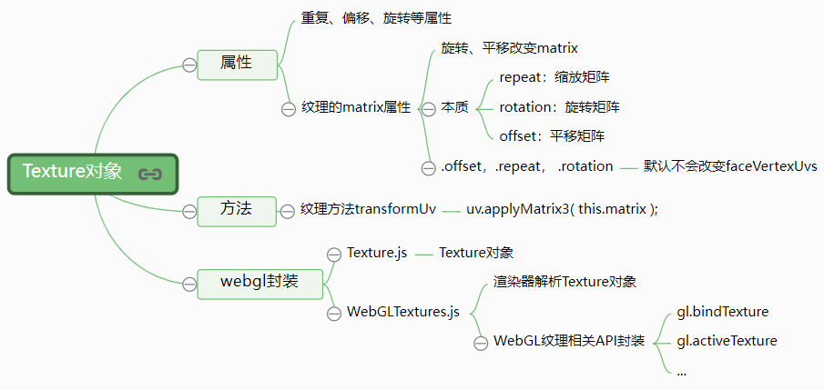 

### canvas画布、视频作为纹理贴图

通过[`CanvasTexture`](https://threejs.org/docs/?q=texture#api/zh/textures/CanvasTexture)和[`VideoTexture`](https://threejs.org/docs/?q=texture#api/zh/textures/VideoTexture)两个类可以分别实现把Canvas画布、视频作为纹理贴图使用

Canvas画布可以通过2D API绘制各种各样的几何形状, 通过Canvas绘制一个轮廓后然后作为网格模型、精灵模型

等模型对象的纹理贴图

**CanvasTexture基本使用** 

```js
// canvas绘制渐变
const canvas = document.createElement('canvas');
const winW = window.innerWidth;
const winH = window.innerHeight
// 画布宽高
canvas.width = winW;
canvas.height = winH;
// 上下文
const ctx = canvas.getContext('2d');
// 设置渐变相关属性
const gradient = ctx.createLinearGradient(0, 0, winW, 0);
gradient.addColorStop(0, '#4e22b7');
gradient.addColorStop(1, '#3292ff');
// 设置样式
ctx.fillStyle = gradient;
// 绘制矩形
ctx.fillRect(0, 0, winW, winH);

// canvas画布对象作为CanvasTexture的参数重建一个纹理对象, 可以理解为一张图片
const canvasTexture = new THREE.CanvasTexture(canvas);

// Canvas画布作为场景背景使用
scene.background = canvasTexture;

// Canvas画布作为矩形网格模型的纹理贴图使用
const geometry = new THREE.PlaneGeometry(30, 10);
const material = new THREE.MeshPhongMaterial({
  map: texture, // 设置纹理贴图
});
// 创建一个矩形平面网模型,Canvas画布作为矩形网格模型的纹理贴图
const mesh = new THREE.Mesh(geometry, material);
```

**Canvas画布加载图片**

```js
const canvas = document.createElement("canvas");
const ctx = canvas.getContext('2d');
const Image = new Image();
Image.src = "./贴图.jpg";
Image.onload = () => {
    const bg = ctx.createPattern(Image, "no-repeat");
    // 注意图片加载完成执行canvas相关方法后,必须要更新一下纹理  
    texture.needsUpdate = true;
}
```

**VideoTexture基本使用** 

视频本质上就是一帧帧图片流构成,把视频作为模型的纹理贴图使用,就是从视频中提取一帧一帧的图片作为模型

的纹理贴图,然后不停的更新的纹理贴图就可以产生视频播放的效果

```js
// 创建video对象
const video = document.createElement('video');
video.src = "xxx.mp4"; // 设置视频地址
video.autoplay = "autoplay"; // 自动播放
// video对象作为VideoTexture参数创建纹理对象
const texture = new THREE.VideoTexture(video)
// 矩形平面
const geometry = new THREE.PlaneGeometry(160, 40); 
// 材质对象Material
const material = new THREE.MeshPhongMaterial({
  map: texture, // 设置纹理贴图
}); 
// 网格模型对象Mesh
const mesh = new THREE.Mesh(geometry, material); 
scene.add(mesh); // 网格模型添加到场景中
```

**VideoTexture.js**封装了一个`update`函数,three每次执行渲染方法进行渲染场景中的时候,都会执行

**VideoTexture**封装的`update`函数,执行update函数中代码`this.needsUpdate = true;`读取视频流最

新一帧图片来更新Threejs模型纹理贴图

### 凹凸贴图和法线贴图

复杂的曲面模型顶点数量是非常多的,模型文件比较大,为了降低模型文件大小,法线贴图`.normalMap`算法就

产生了,复杂的三维模型3D美术可以通过减面操作把精模简化为简模,然后把精模表面的复杂几何信息映射到法

线贴图`.normalMap`上

**法线贴图** 

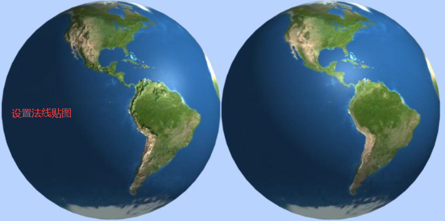

```js
// 纹理加载器
const textreLoader = new THREE.TextureLoader();
// 材质对象Material
const material = new THREE.MeshPhongMaterial({
    // 加载纹理贴图
    map: textreLoader.load('./assets/earth.jpg'),
    // 加载法线贴图
    normalMap: textreLoader.load('./assets/normal.png'), 
    // 设置深浅程度,默认值(1,1)。
    normalScale: new THREE.Vector2(2, 2),
});
// 网格模型对象Mesh
const mesh = new THREE.Mesh(geometry, material);

// 设置深浅程度
// mesh.material.normalScale.set(1.5, 1.5);
```

**凹凸贴图**

凹凸贴图和法线贴图功能相似,只是没有法线贴图丰富的表面信息, 凹凸贴图是用图片像素的灰度值

表示几何表面的高低深度,如果模型定义了法线贴图,就没有必要再使用凹凸贴图了

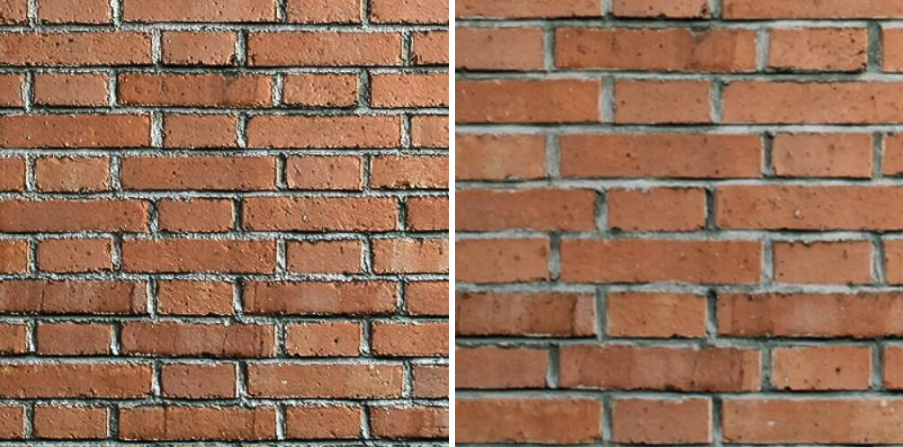

```js
const textureLoader = new THREE.TextureLoader();
// 加载颜色纹理贴图
const texture = textureLoader.load('./凹凸贴图/diffuse.jpg');
// 加载凹凸贴图
const textureBump = textureLoader.load('./凹凸贴图/bump.jpg');
const material = new THREE.MeshPhongMaterial({
  map: texture,// 普通纹理贴图
  bumpMap:textureBump,//凹凸贴图
  bumpScale:3,//设置凹凸高度,默认值1。
}); //材质对象Material
```

**总结**

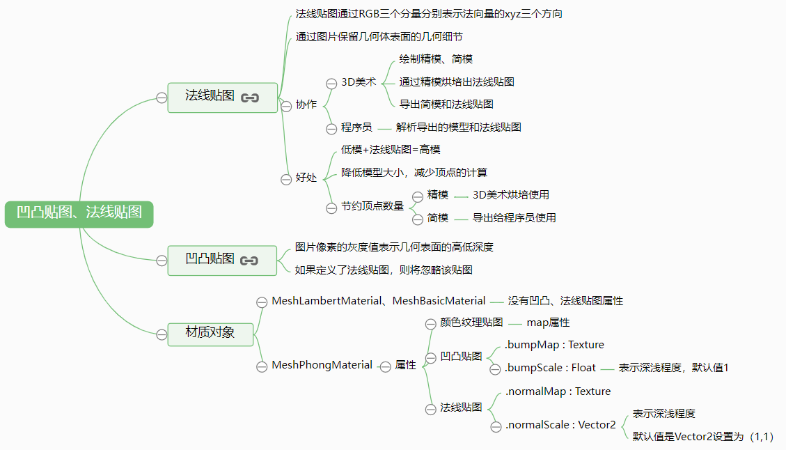

### 光照贴图添加阴影

在三维场景中有时候需要设置模型的阴影,也就是阴影贴图或者说光照贴图`·lightMap`,一般 Threejs 加载外部

模型的光照贴图`·lightMap`,三维模型加载器可以自动设置,不需要程序员通过代码去设置

```js
//创建一个平面几何体作为投影面
const planeGeometry = new THREE.PlaneGeometry(300, 200);
const textureLoader = new THREE.TextureLoader();
// 加载光照贴图
const textureLight = textureLoader.load('shadow.png');
const planeMaterial = new THREE.MeshLambertMaterial({
  color: 0x999999,
  lightMap:textureLight, // 设置光照贴图
  // lightMapIntensity:0.5, // 烘培光照的强度. 默认1
});
const planeMesh = new THREE.Mesh(planeGeometry, planeMaterial); //网格模型对象Mesh
```

可以通过设置模型, 光照的阴影设置实时计算阴影,而光照贴图`·lightMap`是3D美术渲染好提供给程序员

这两种方式相比较通过贴图的方式更为节约资源,提高渲染性功能

### 高光贴图

高光网格材质[MeshPhongMaterial](https://threejs.org/docs/index.html?q=MeshPhongMaterial#api/zh/materials/MeshPhongMaterial)具有高光属性`.specular`,如果一个网格模型`Mesh`都是相同的材质并且表面粗糙度相同,或者说网格

模型外表面所有不同区域的镜面反射能力相同,可以直接设置材质的高光属性`.specular`, 如果一个网格模型表示一个人, 人的不同部位高

光程度是不同的, 不可能直接通过`.specular`属性来描述, 在这种情况通过高光贴图`.specularMap`的RGB值来描述不同区域镜面反射

的能力,`.specularMap`和颜色贴图`.Map`一样和通过UV坐标映射到模型表面高光贴图`.specularMap`不同区域像素值不同,表示网格

模型不同区域的高光值不同

```js
// 加载纹理贴图
const texture = textureLoader.load('earth_diffuse.png');
// 加载高光贴图
const textureSpecular = textureLoader.load('earth_specular.png');
const material = new THREE.MeshPhongMaterial({
  // specular: 0xff0000, // 高光部分的颜色
  shininess: 30, // 高光部分的亮度,默认30
  map: texture, // 普通纹理贴图
  specularMap: textureSpecular, // 高光贴图
}); // 材质对象Material

const mesh = new THREE.Mesh(geometry, material);
// mesh.material.specular.set(0xffffff);// 高光反射颜色
```

> `.specularMap`和`.specular`是对应的, 只有高光网格材质对象`MeshPhongMaterial`才具备高光贴图属性

### 环境贴图

Threejs 环境贴图`.envMap`字面意思就是三维模型周边环境

创建一个立方体盒子作为天空盒使用，然后把一个环境中上下左右前后六张视图图片作为立方体盒子的纹理贴图使用

加载环境贴图的6张纹理贴图，可以通过[CubeTextureLoader](https://threejs.org/docs/index.html?q=CubeTextureLoader#api/zh/loaders/CubeTextureLoader)类去实现

```js
const geometry = new THREE.BoxGeometry(100, 100, 100); //立方体
const loader = new THREE.CubeTextureLoader();
// 所有贴图在同一目录下，可以使用该方法设置共用路径
loader.setPath('环境贴图/');
// 立方体纹理加载器返回立方体纹理对象CubeTexture
const CubeTexture = loader.load(['px.jpg', 'nx.jpg', 'py.jpg', 'ny.jpg', 'pz.jpg', 'nz.jpg']);
//材质对象Material
const material = new THREE.MeshPhongMaterial({
  //网格模型设置颜色，网格模型颜色和环境贴图会进行融合计算
  // color:0xff0000,
  envMap: CubeTexture, //设置环境贴图
  // 环境贴图反射率   控制环境贴图对被渲染三维模型影响程度
  // reflectivity: 0.1,
});
// console.log(CubeTexture.image);
const mesh = new THREE.Mesh(geometry, material); // 网格模型对象Mesh
scene.add(mesh); // 网格模型添加到场景中
```

高光网格材质[MeshPhongMaterial](https://threejs.org/docs/index.html?q=MeshPhongMaterial#api/zh/materials/MeshPhongMaterial)和物理PBR材质[MeshStandardMaterial](https://threejs.org/docs/index.html?q=MeshStandardMaterial#api/zh/materials/MeshStandardMaterial)通常会使用环境贴图`.envMap`来实现更好的渲染效果。一个

材质对应的是普通次时代模型，一个材质对应的是PBR模型

### 数据纹理对象

Threejs 数据纹理对象[DataTexture](https://threejs.org/docs/index.html?q=DataTexture#api/zh/textures/DataTexture)简单地说就是通过程序创建纹理贴图的每一个像素值

**生成一张图片的RGB值**

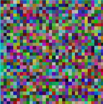 

```js
const geometry = new THREE.PlaneGeometry(128, 128); //矩形平面
/**
 * 创建纹理对象的像素数据
 */
const width = 32; //纹理宽度
const height = 32; //纹理高度
const size = width * height; //像素大小
const len = size * 3; // 乘3对应 RGB 三个值	
const data = new Uint8Array(len); // 像素在缓冲区占用空间
for (let i = 0; i < len; i += 3) { // 每次递增3, 对应 RGB 三个值
    // 随机设置RGB分量的值
    data[i] = 255 * Math.random(); // 对应 R
    data[i + 1] = 255 * Math.random(); // 对应 G
    data[i + 2] = 255 * Math.random(); // 对应 B
}
// 创建数据纹理对象
const texture = new THREE.DataTexture(data, width, height, THREE.RGBFormat);
texture.needsUpdate = true; //纹理更新
// 可以查看纹理对象的image属性
// console.log(texture.image);

const material = new THREE.MeshPhongMaterial({
    map: texture, // 设置纹理贴图
}); //材质对象Material
const mesh = new THREE.Mesh(geometry, material);
scene.add(mesh);
```

**带透明度的RGB图片**

```js
const geometry = new THREE.PlaneGeometry(128, 128); //矩形平面
/**
 * 创建纹理对象的像素数据
 */
const width = 32; //纹理宽度
const height = 32; //纹理高度
const size = width * height; //像素大小
const len = size * 4; // 乘4对应 RGBA 四个值	
const data = new Uint8Array(len); // 像素在缓冲区占用空间
for (let i = 0; i < len; i += 4) { // 递增4, 对应RGBA
    // 随机设置RGB分量的值
    data[i] = 255 * Math.random(); // 对应 R
    data[i + 1] = 255 * Math.random(); // 对应 G
    data[i + 2] = 255 * Math.random(); // 对应 B
    // 设置透明度分量A
    data[i + 3] = 255 * 0.5; // 对应 A
}
// 创建数据文理对象   RGBA格式：THREE.RGBAFormat
const texture = new THREE.DataTexture(data, width, height, THREE.RGBAFormat);
texture.needsUpdate = true; //纹理更新
//打印纹理对象的image属性
console.log(texture.image);

const material = new THREE.MeshPhongMaterial({
    map: texture, // 设置纹理贴图
    transparent: true,//允许透明设置
});
const mesh = new THREE.Mesh(geometry, material);
scene.add(mesh);
```

**图片格式**

像素值包含RGBA四个分量的图片格式有`.PNG`等格式，通过WebGL原生API加载解析这些类型格式的图片需要设置`gl.RGBA`，对于

Threejs而言对WebGL进行封装了，`gl.RGBA`对应的设置是[`THREE.RGBAFormat`](http://localhost:8888/three.js-dev/docs/index.html?q=Texture#api/zh/constants/Textures)

## 雾

在3D引擎里,雾通常是基于离摄像机的距离褪色至某种特定颜色的方式。在 Threejs 中添加雾是通过创建 [`Fog`](https://threejs.org/docs/#api/zh/scenes/Fog) 或者 [`FogExp2`](https://threejs.org/docs/#api/zh/scenes/FogExp2) 实例并设定scene的[`fog`](https://threejs.org/docs/#api/zh/scenes/Scene#fog) 属性

[`Fog`](https://threejs.org/docs/#api/zh/scenes/Fog) 让你设定 `near` 和 `far` 属性,代表距离摄像机的距离。任何物体比 `near` 近不会受到影响,任何物体比 `far` 远则完全是雾的

颜色。在 `near` 和 `far` 中间的物体,会从它们自身材料的颜色褪色到雾的颜色。

[`FogExp2`](https://threejs.org/docs/#api/zh/scenes/FogExp2) 会根据离摄像机的距离呈指数增长

```js
const scene = new THREE.Scene();

// Fog
{
  const color = 0xFFFFFF;  // white
  const near = 10;
  const far = 100;
  scene.fog = new THREE.Fog(color, near, far);
}

// FogExp2
{
  const color = 0xFFFFFF;
  const density = 0.1;
  scene.fog = new THREE.FogExp2(color, density);
}
```

> 注意: 一般**雾**和**场景的背景颜色**都为同一种颜色

## 加载器

 Threejs 里使用指定类型的[加载器类](https://threejs.org/docs/index.html?q=loader#examples/zh/loaders/GLTFLoader)来加载指定类型的模型文件, 最常见的模型文件格式有:`.obj` `.gltf` 等

以[`GLTFLoader`](https://threejs.org/docs/index.html?q=load#examples/zh/loaders/GLTFLoader.load)为例, 可以在其他网站上下载3D模型, 然后使用3D软件或[three编辑器](https://threejs.org/editor/)导出转换指定的格式

```js
// 引入加载器类
import { GLTFLoader } from '../libs/jsm/GLTFLoader.js';
// 加载类
const gltfLoader = new GLTFLoader();
// 加载单个模型(异步)
// .load (url,onLoad,onProgress,onError)
// onLoad事件, 模型加载完成
// onProgress事件, 模型加载中
// onError事件, 模型加载失败
gltfLoader.load('.url', (gltf) => {
    scene.add(gltf.scene); // 模型加载到场景中
    // traverse 会自动遍历 children 数组 => gltf.scene.children.forEach  
    gltf.scene.traverse(child => {
        // isMesh 属性表示是不是 mesh 对象
        if (child.isMesh) {
            // 点数据
            const { array } = child.geometry.attributes.position;
        }
    })
}, null, (err) => {
    console.log(err);
});
```

#### 加载管理器

[`LoadingManager`](https://threejs.org/docs/index.html?q=load#api/zh/loaders/managers/LoadingManager)

```js
// 实例化加载管理器类
const manager = new THREE.LoadingManager();
// 可以将加载器类传递给加载类
const gltfLoader = new GLTFLoader(manager);

// 可以直接给加载管理器添加对应的事件
// onLoad事件, 模型加载完成
manager.onLoad = () => {};
// onProgress事件, 模型加载中
manager.onProgress = (url, itemsLoaded, itemsTotal) => {};
// onError事件, 模型加载失败
manager.onError = (url) => {};
```

### FileLoader

使用XMLHttpRequest来加载资源的低级类，并由大多数加载器内部使用, [FileLoader](https://threejs.org/docs/index.html?q=loader#api/zh/loaders/FileLoader)也可以直接用于加载任何没有对应加载器的文件类型, 基类是[Loader](http://localhost:8888/three.js-dev/docs/index.html?q=FileLoader#api/zh/loaders/Loader), 同样具有`onLoad` `onProgress` `onError`事件回调

```js
// 文件加载对象
const loader = new THREE.FileLoader();
// 指定为JSON类型, 不指定类型的话three会自动根据文件类型来判断
loader.setResponseType('json');
```

*注意:* 必须启用缓存

```js
THREE.Cache.enabled = true;
```

这是一个全局属性，只需要设置一次，供内部使用FileLoader的所有加载器使用,  [Cache](http://localhost:8888/three.js-dev/docs/index.html?q=FileLoader#api/zh/loaders/Cache) 是一个缓存模块，用于保存通过此加载器发出的每个请求的响应，因此每个文件都会被请求一次

## 精灵模型和粒子系统

### 精灵模型**Sprite**

Threejs 的精灵模型对象[Sprite](https://threejs.org/docs/index.html?q=Sprite#api/zh/objects/Sprite)和Threejs的网格模型[Mesh](https://threejs.org/docs/index.html?q=mesh#api/zh/objects/Mesh)一样都是模型对象，基类都是[Object3D](https://threejs.org/docs/index.html?q=object3d#api/zh/core/Object3D),关于精灵模型对

象的方法和属性除了可以查看文档[Sprite](https://threejs.org/docs/index.html?q=sprite#api/zh/objects/Sprite)，也可以查看基类[Object3D](https://threejs.org/docs/index.html?q=object3d#api/zh/core/Object3D)

精灵不会投射任何阴影，即使设置了`castShadow `也不会有效果

创建精灵模型对象`Sprite`和创建网格模型对象一样需要创建一个材质对象，不同的地方在于创建精灵模型对象

不需要创建几何体对象`Geometry`，精灵模型对象本质上你可以理解为已经内部封装了一个平面矩形几何体

`PlaneGeometry`，矩形精灵模型与矩形网格模型的区别在于精灵模型的矩形平面会**始终平行于Canvas画布**

#### SpriteMaterial

通过`Sprite`创建精灵模型不需要几何体，只需要给构造函数`Sprite`参数设置为一个精灵材质[SpriteMaterial](https://threejs.org/docs/index.html?q=spritematerial#api/zh/materials/SpriteMaterial)即可.

精灵材质对象`SpriteMaterial`和普通的网格材质一样可以设置颜色`.color`、颜色贴图`.map`、开启透明`.transparent`、透明度`.opacity`等属性，精灵材质对象`SpriteMaterial`的基类是材质[Material](https://threejs.org/docs/index.html?q=material#api/zh/materials/Material)


精灵材质[SpriteMaterial](https://threejs.org/docs/index.html?q=material#api/zh/materials/SpriteMaterial)的属性除了和网格材质类似的属性和方法外，还有一些自己独特的方法和属性，比如`.rotation`旋转精灵模型

```js
const texture = new THREE.TextureLoader().load("sprite.png");
// 创建精灵材质对象SpriteMaterial
const spriteMaterial = new THREE.SpriteMaterial({
  color: 0xff00ff, // 设置精灵矩形区域颜色
  rotation: Math.PI/4, // 旋转精灵对象45度，弧度值
  map: texture, // 设置精灵纹理贴图
});
// 创建精灵模型对象，不需要几何体geometry参数
const sprite = new THREE.Sprite(spriteMaterial);
scene.add(sprite);
// 控制精灵大小，比如可视化中精灵大小表征数据大小
sprite.scale.set(10, 10, 1); // 只需要设置x、y两个分量就可以
```

**.scale**和**.position**

精灵模型对象和网格模型`Mesh`对一样基类都是`Object3D`，自然精灵模型也有缩放属性`.scale`和位置属性`.position`，一般设置精灵模型的大小是通过`.scale`属性实现，而精灵模型的位置通过属性`.position`实现，精灵模型和普通模型一样，可以改变它在三维场景中的位置，区别在于精灵模型的正面一直平行于canvas画布

在使用透视投影相机对象的时候，精灵模型对象显示的大小和网格模型一样受距离相机的距离影响，也就是距离越远，显示效果越小

#### **Sprite**用途

可以在三维场景中把精灵模型作为一个模型的标签，标签上可以显示一个关于模型的信息, 可以通过足够多的精灵模型对象，构建一个粒子系统，来模拟一个下雨、森林、或下雪的场景效果

**精灵模型创建树林效果**

```js
// 加载树的图片
const textureTree = new THREE.TextureLoader().load("./tree.png");
// 批量创建表示一个树的精灵模型
for (let i = 0; i < 100; i++) {
    const spriteMaterial = new THREE.SpriteMaterial({
        map: textureTree,//设置精灵纹理贴图
    });
    // 创建精灵模型对象
    const sprite = new THREE.Sprite(spriteMaterial);
    scene.add(sprite);
    // 控制精灵大小,
    sprite.scale.set(30, 30, 1); // 只需要设置x、y两个分量就可以
    const k1 = Math.random() - 0.5;
    const k2 = Math.random() - 0.5;
    // 设置精灵模型位置，在xyz平面上随机分布
    sprite.position.set(400 * k1, 16, 400 * k2);
}
```

效果如下:

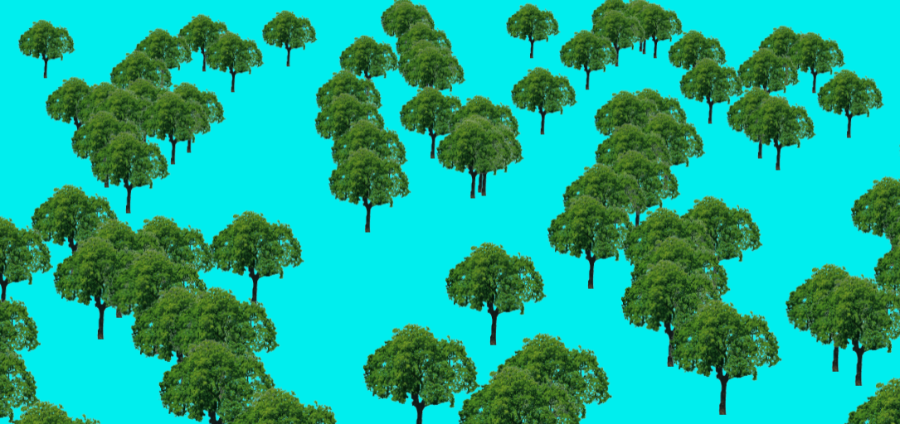 

## 帧动画模块

Threejs提供了一系列用户编辑和播放关键帧动画的API,例如关键帧[KeyframeTrack](https://threejs.org/docs/index.html?q=KeyframeTrack#api/zh/animation/KeyframeTrack)、剪辑[AnimationClip](https://threejs.org/docs/index.html?q=animation#api/zh/animation/AnimationClip)、操作[AnimationAction](http://localhost:8888/three.js-dev/docs/index.html?q=animation#api/zh/animation/AnimationAction)、混合器[AnimationMixer](http://localhost:8888/three.js-dev/docs/index.html?q=animation#api/zh/animation/AnimationMixer)

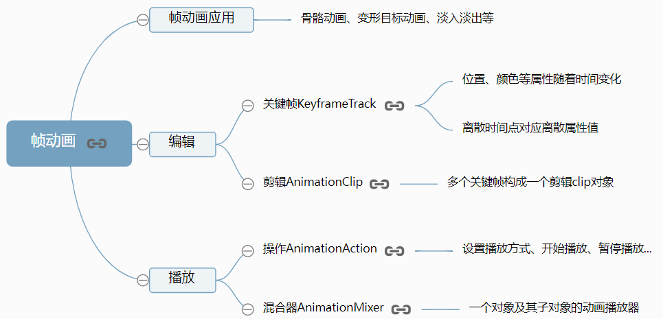 

实际开发中如果需要制作一个复杂三维模型的帧动画，比如一个人走路、跑步等动作，一般情况是美术通过3dmax、blender等软件编辑好，不需要程序员用代码实现

**播放关键帧**

混合器`THREE.AnimationMixer()`的参数是`Object3D`，可以是几何也可以是加载外部模型返回的模型对象

```js
/**
 * 播放编辑好的关键帧数据
 */
// group作为混合器的参数，可以播放group中所有子对象的帧动画
const mixer = new THREE.AnimationMixer(group);
// 剪辑clip作为参数，通过混合器clipAction方法返回一个操作对象AnimationAction
const AnimationAction = mixer.clipAction(clip);
//通过操作Action设置播放方式
AnimationAction.timeScale = 20;//默认1，可以调节播放速度
// AnimationAction.loop = THREE.LoopOnce; //不循环播放
AnimationAction.play();//开始播放
```

播放关键帧动画的时候，注意在渲染函数`render()`中执行`mixer.update(渲染间隔时间)`告诉帧动画系统

Threejs两次渲染的时间间隔，获得时间间隔可以通过Threejs提供的一个时钟类[Clock](https://threejs.org/docs/index.html?q=clock#api/zh/core/Clock)实现

```js
// 创建一个时钟对象Clock
const clock = new THREE.Clock();
// 渲染函数
function render() {
  ...

  //clock.getDelta()方法获得两帧的时间间隔
  // 更新混合器相关的时间
  mixer.update(clock.getDelta());
}
requestAnimationFrame(render);
```

### 解析外部模型的帧动画

关键帧**model.json**文件类似如下数据

```js
"object": {
  // 绑定动画的模型名称Box
  "name": "Box",
...
},
// 动画数据
"animations": [{
  "name": "default",
  "fps": 24,
  "tracks": [
    // 位置变化关键帧
    {
    "type": "vector3",
    "name": "Box.position",
    "keys": [{
      "value": [0, 0, 0],
      "time": 0
    }, {
      "value": [-100, 0, 0],
      "time": 50
    },...]
  },
  // 角度变化关键帧
  {
    "type": "quaternion",
    "name": "Box.quaternion",
    "keys": [{
      "value": [0, 0, 0, 0],
      "time": 0
    },...]
  },
  // 颜色变化关键帧
  {
    "type": "color",
    "name": "Box.material.color",
    "keys": [{
      "value": [1, 0, 0, 1],
      "time": 20
    }, ...]
  }]
}]
```

**播放模型帧动画**

```js
// 通过ObjectLoader加载模型文件model.json
const loader = new THREE.ObjectLoader();
let mixer = null; //声明一个混合器变量
// 加载文件返回一个对象obj
loader.load("./model.json", (obj)=> {
  obj.scale.set(15, 15, 15);//缩放加载的模型
  scene.add(obj);
  // obj作为混合器的参数，可以播放obj包含的帧动画数据
  mixer = new THREE.AnimationMixer(obj);
  // obj.animations[0]; 获得剪辑clip对象
  // 剪辑clip作为参数，通过混合器clipAction方法返回一个操作对象AnimationAction
  const AnimationAction = mixer.clipAction(obj.animations[0]);
  AnimationAction.play(); // 播放
});
```

```js
// 创建一个时钟对象Clock
const clock = new THREE.Clock();
// 渲染函数
function render() {
    ...

   //clock.getDelta()方法获得两帧的时间间隔
   // 更新混合器相关的时间
   mixer?.update(clock.getDelta());
}
requestAnimationFrame(render);
```

### 播放设置

可以通过操作[AnimationAction](https://threejs.org/docs/index.html?q=AnimationAction#api/zh/animation/AnimationAction)的相关属性设置播放效果

**取消循环播放**

```js
//不循环播放(默认是循环播放)
AnimationAction.loop = THREE.LoopOnce;
```

**暂停播放**

```js
// 暂停播放
AnimationAction.paused = false;

//暂停在最后一帧播放的状态
AnimationAction.clampWhenFinished = true;
```

**播放clip特定时间段**

```js
/**
 * 播放编辑好的关键帧数据
 */
const mixer = new THREE.AnimationMixer(mesh); //创建混合器
const AnimationAction = mixer.clipAction(clip); //返回动画操作对象
// AnimationAction.timeScale = 5; //默认1，可以调节播放速度
// 设置播放区间10~18   关键帧数据总时间是20
AnimationAction.time = 10; //操作对象设置开始播放时间
clip.duration = 18;//剪辑对象设置播放结束时间
AnimationAction.play(); //开始播放
```

**定位在某个时间点**

```js
// 开始结束时间设置为一样，相当于播放时间为0，直接跳转到时间点对应的状态
AnimationAction.time = 10; //操作对象设置开始播放时间
clip.duration = AnimationAction.time;//剪辑对象设置播放结束时间
```

## 骨骼动画和变形动画

### 骨骼动画

**解析查看骨骼动画数据**

```js
// 通过加载器ObjectLoader加载./marine_anims_core.json模型文件
const loader = new THREE.ObjectLoader();
loader.load("./marine_anims_core.json", (obj)=> {
    //添加到场景中
    scene.add(obj); 
    //从返回对象获得骨骼网格模型
    SkinnedMesh = obj.children[0];
    // 查看骨头关节Bone
    console.log(SkinnedMesh.skeleton.bones);
})
```

```js
// 骨骼辅助显示
const skeletonHelper = new THREE.SkeletonHelper(SkinnedMesh);
scene.add(skeletonHelper);
```

```js
// 遍历骨骼模型中的骨关节Bone，并获得世界坐标
SkinnedMesh.traverse(function(elem) {
  if (elem.type === 'Bone') {
    console.log(elem.getWorldPosition(new THREE.Vector3()));
  }
});
```

**解析渲染骨骼动画**

```js
const loader = new THREE.ObjectLoader(); //创建一个加载器
const mixer = null; //声明一个混合器变量
loader.load("./marine_anims_core.json", function(obj) {
  scene.add(obj); //添加到场景中
  //从返回对象获得骨骼网格模型
  const SkinnedMesh = obj.children[0];
  //骨骼网格模型作为参数创建一个混合器
  mixer = new THREE.AnimationMixer(SkinnedMesh);
  // 查看骨骼网格模型的帧动画数据
  // console.log(SkinnedMesh.geometry.animations)
  // 解析跑步状态对应剪辑对象clip中的关键帧数据
  const AnimationAction = mixer.clipAction(SkinnedMesh.geometry.animations[1]);
  // 解析步行状态对应剪辑对象clip中的关键帧数据
  // const AnimationAction = mixer.clipAction(SkinnedMesh.geometry.animations[3]);
  AnimationAction.play();
})
```

```js
// 创建一个时钟对象Clock
const clock = new THREE.Clock();
// 渲染函数
function render() {
	...

    //clock.getDelta()方法获得两帧的时间间隔
    // 更新混合器相关的时间
    mixer?.update(clock.getDelta());
}
requestAnimationFrame(render);
```

### 变形动画

关于变形动画, 可以理解为多组顶点数据，从一个状态变化到另一个状态，比如人的面部表情，哭的表情用一系列的顶点表示，笑的表情用一系列的顶点表示，从哭的表情过渡到笑的表情，就是表情对应的两组顶点之间的过渡，几何体的顶点的位置坐标发生变化，**从一个状态过渡到另一个状态自然就产生了变形动画**

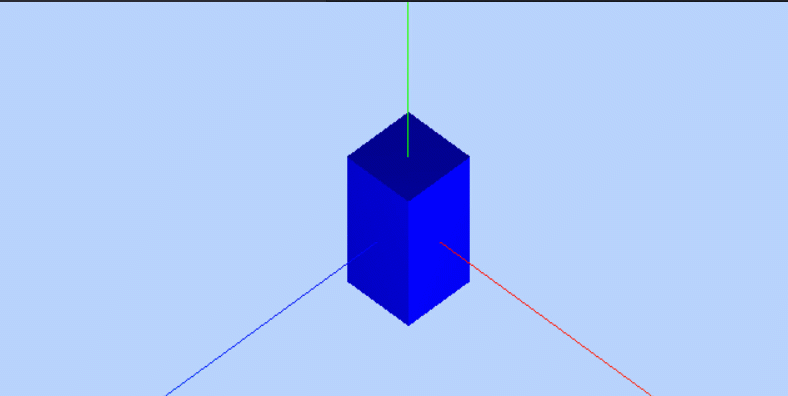 

**创建变形动画的顶点数据**

先获取两个变形目标`box1`和`box2`的顶点数据，然后通过几何体[BufferGeometry](https://threejs.org/docs/index.html?q=geometry#api/zh/core/BufferGeometry)的变形目标属性`.morphAttributes`设置好变形动画

```js
/**
 * 创建网格模型，并给模型的几何体设置多个变形目标
 */
// 创建一个几何体具有8个顶点
const geometry = new THREE.BoxGeometry(50, 50, 50); //立方体几何对象
console.log(geometry.vertices);
// 为geometry提供变形目标的数据
const box1 = new THREE.BoxGeometry(100, 5, 100); //为变形目标1提供数据
const box2 = new THREE.BoxGeometry(5, 200, 5); //为变形目标2提供数据
// 设置变形目标的数据
geometry.morphTargets[0] = {name: 'target1',vertices: box1.vertices};
geometry.morphTargets[1] = {name: 'target2',vertices: box2.vertices};
const material = new THREE.MeshLambertMaterial({
  morphAttributes: true, //允许变形
  color: 0x0000ff
}); //材质对象
const mesh = new THREE.Mesh(geometry, material); //网格模型对象
scene.add(mesh); //网格模型添加到场景中
```

**网格模型.morphTargetInfluences属性**

通过上面代码把变形动画顶点数据设置好以后，如果想生成变形动画，首先要设置网格模型[Mesh](https://threejs.org/docs/index.html?q=mesh#api/zh/objects/Mesh.morphTargetInfluences)的`.morphTargetInfluences`属性

如下代码可以改变网格模型的形状

```js
// 启用变形目标并设置变形目标影响权重，范围一般0~1
// 设置第一组顶点对几何体形状影响的变形系数
mesh.morphTargetInfluences[0] = 0.5;
```

```js
// 设置第二组顶点对几何体形状影响的变形系数
mesh.morphTargetInfluences[1] = 1;
```

**生成变形动画**

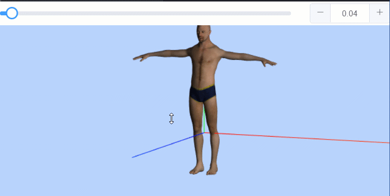 

```js
/**
 * 设置关键帧数据
 */
// 设置变形目标1对应权重随着时间的变化
const Track1 = new THREE.KeyframeTrack('.morphTargetInfluences[0]', [0,10,20], [0,1, 0]);
// 设置变形目标2对应权重随着时间的变化
const Track2 = new THREE.KeyframeTrack('.morphTargetInfluences[1]', [20,30, 40], [0, 1,0]);
// 创建一个剪辑clip对象，命名"default"，持续时间40
const clip = new THREE.AnimationClip("default", 40, [Track1,Track2]);
```

```js
/**
 * 播放编辑好的关键帧数据
 */
const mixer = new THREE.AnimationMixer(mesh); // 创建混合器
const AnimationAction = mixer.clipAction(clip); // 返回动画操作对象
AnimationAction.timeScale = 5; // 默认1，可以调节播放速度
// AnimationAction.loop = THREE.LoopOnce; // 不循环播放
// AnimationAction.clampWhenFinished=true;// 暂停在最后一帧播放的状态
AnimationAction.play(); // 开始播放
...
...
// 创建一个时钟对象Clock
const clock = new THREE.Clock();
// 渲染函数
function render() {
  ...
  // clock.getDelta()方法获得两帧的时间间隔
  // 更新混合器相关的时间
  mixer.update(clock.getDelta());
}
render();
```

**加载查看模型变形动画数据**

```js
// 通过加载器JSONLoader加载变形动画模型文件./人/umich_ucs.json
const loader = new THREE.JSONLoader();
loader.load("./人/umich_ucs.json", function(geometry, materials) {
  // 查看模型的变形数据 
  // console.log(geometry);
  // console.log(materials);
    
  // 通过平均面法线来计算顶点法线，效果更光滑
  geometry.computeVertexNormals();
  const mesh = new THREE.Mesh(geometry, materials[0]);
  // 材质对象开启渲染目标
  mesh.material.morphTargets = true
  mesh.rotateX(-Math.PI / 2);
  mesh.position.y = -50;
  scene.add(mesh); //插入到场景中
  // 查看变形目标数据
  console.log(geometry.morphTargets);
})
```

可以在代码中给网格模型的`.morphTargetInfluences`属性赋予不同的值, 使模型变化(胖瘦变化)

```js
// 变胖
mesh.morphTargetInfluences[0] = 1;
// 变瘦
mesh.morphTargetInfluences[4] = 1;
```

**鸟飞行变形动画**

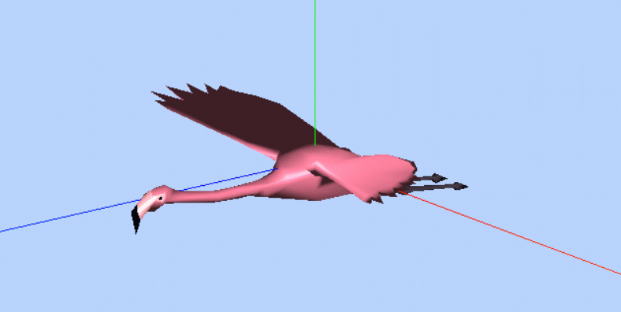 

通过混合器[AnimationMixer](https://threejs.org/docs/index.html?q=AnimationMixer#api/zh/animation/AnimationMixer)获取模型中的变形动画关键帧数据然后进行播放

```js
const loader = new THREE.JSONLoader(); //创建加载器
let mixer = null; //声明一个混合器变量
loader.load("./鸟/flamingo.json", function(geometry) {
  // console.log(geometry);
  const material = new THREE.MeshPhongMaterial({
    morphTargets: true,
    vertexColors: THREE.FaceColors,
  });
  // 通过平均面法线来计算顶点法线，效果更光滑
  geometry.computeVertexNormals();
  const mesh = new THREE.Mesh(geometry, material);
  scene.add(mesh); //插入到场景中

  // 创建一个混合器，播放网格模型模型的变形动画
  mixer = new THREE.AnimationMixer(mesh);
  // geometry.animations[0]：获得剪辑对象clip
  const AnimationAction=mixer.clipAction(geometry.animations[0]);
  // AnimationAction.timeScale = 0.5; //默认1，可以调节播放速度
  // AnimationAction.loop = THREE.LoopOnce; //不循环播放
  // AnimationAction.clampWhenFinished=true;//暂停在最后一帧播放的状态
  AnimationAction.play();//播放动画
})
```

在渲染函数中，通过时钟类[Clock](https://threejs.org/docs/index.html?q=Clock#api/zh/core/Clock)获得两次渲染的时间间隔，然后执行`mixer.update();`传递给混合器

```js
// 创建一个时钟对象Clock
const clock = new THREE.Clock();
// 渲染函数
function render() {
  ...

  //clock.getDelta()方法获得两帧的时间间隔
  // 更新混合器相关的时间
  mixer.update(clock.getDelta());
}
render();
```

## 语音模块

Threejs对原生[Web Audio API](https://developer.mozilla.org/zh-CN/docs/Web/API/Web_Audio_API)的封装提供了一些方便使用的语音模块, 比如一个声音和一个网格模型绑定，这样网格模型的位置就是音源位置

Threejs提供了一系列音频相关的API：音频[Audio](https://threejs.org/docs/index.html?q=audio#api/zh/audio/Audio)、位置音频[PositionalAudio](https://threejs.org/docs/index.html?q=audio#api/zh/audio/PositionalAudio)、监听者[AudioListener](https://threejs.org/docs/index.html?q=audio#api/zh/audio/AudioListener)、音频分析器[AudioAnalyser](https://threejs.org/docs/index.html?q=audio#api/zh/audio/AudioAnalyser)、音频加载器[AudioLoader](https://threejs.org/docs/index.html?q=audio#api/zh/loaders/AudioLoader)。

音频`Audio`、位置音频`PositionalAudio`等Threejs类本质上是对原生[Web Audio API](https://developer.mozilla.org/zh-CN/docs/Web/API/Web_Audio_API)的封装

### 非位置音频

通过非位置音频`THREE.Audio`加载一段音频进行进行播放，该音频播放效果不受具体位置影响，一般可以用于一个三维场景的背景音乐

```js
// 非位置音频可用于不考虑位置的背景音乐
// 创建一个监听者
const listener = new THREE.AudioListener();
// camera.add( listener );
// 创建一个非位置音频对象  用来控制播放
const audio = new THREE.Audio(listener);
// 创建一个音频加载器对象
const audioLoader = new THREE.AudioLoader();
// 加载音频文件，返回一个音频缓冲区对象作为回调函数参数
audioLoader.load('./好运来.mp3', function(AudioBuffer) {
  // console.log(AudioBuffer)
  // 音频缓冲区对象关联到音频对象audio
  audio.setBuffer(AudioBuffer);
  audio.setLoop(true); //是否循环
  audio.setVolume(0.5); //音量
  // 播放缓冲区中的音频数据
  audio.play(); //play播放、stop停止、pause暂停
});
```

### 位置音频

在实际生活中，听到声音的效果，受音源相对监听者的位置和角度影响。音频源位置发生变化，听到的声音有所变化，比如音量大小。Threejs提供了一个和非位置音频`THREE.Audio`不同的API位置音频`THREE.PositionalAudio`，通过位置音频创建的音频播放效果可以模仿自然界中，人听到不同位置音源的声音效果


可以将监听者`AudioListener`绑定到了相机对象`camera`上, 改变相机的位置或角度本质上就是改变监听者的位置或角度, 这样的话就相当于音源绑定的网格模型`audioMesh`相对监听者的位置或角度发生了变化, 声音也就一起发生变化了

```js
...
// 用来定位音源的网格模型
const audioMesh = new THREE.Mesh(geometry, material);
// 设置网格模型的位置，相当于设置音源的位置
audioMesh.position.set(0, 0, 300);
scene.add(audioMesh);
...

// 创建一个虚拟的监听者
const listener = new THREE.AudioListener();
// 监听者绑定到相机对象
camera.add(listener);
// 创建一个位置音频对象, 监听者作为参数,音频和监听者关联。
const PosAudio = new THREE.PositionalAudio(listener);
// 音源绑定到一个网格模型上
audioMesh.add(PosAudio);
// 创建一个音频加载器
const audioLoader = new THREE.AudioLoader();
// 加载音频文件，返回一个音频缓冲区对象作为回调函数参数
audioLoader.load('./好运来.mp3', function(AudioBuffer) {
  // console.log(buffer);
  // 音频缓冲区对象关联到音频对象audio
  PosAudio.setBuffer(AudioBuffer);
  PosAudio.setVolume(0.9); // 音量
  PosAudio.setRefDistance(200); //参数值越大, 声音越大
  PosAudio.play(); // 播放
});
```

### 音乐可视化

通过Threejs音频相关的APi可以获得音乐音频的频率数据然后可视化

 

**查看平均频率**

```js
let analyser = null; // 声明一个分析器变量
const listener = new THREE.AudioListener() // 监听者
const audio = new THREE.Audio(listener); // 非位置音频对象
const audioLoader = new THREE.AudioLoader(); // 音频加载器
// 加载音频文件
audioLoader.load('中国人.mp3', function(AudioBuffer) {
  audio.setBuffer(AudioBuffer); // 音频缓冲区对象关联到音频对象audio
  audio.setLoop(true); // 是否循环
  audio.setVolume(0.5); // 音量
  audio.play(); // 播放
  // 音频分析器和音频绑定，可以实时采集音频时域数据进行快速傅里叶变换
  analyser = new THREE.AudioAnalyser(audio);
});

// 渲染函数
function render() {
  ...
  if (analyser) {
    // getAverageFrequency()返回平均音频
    const frequency = analyser.getAverageFrequency();
    mesh.scale.y = 5 * frequency / 256;
    mesh.material.color.r = 3 * frequency / 256;
    // 返回所有的音频频率数据
    // console.log(analyser.getFrequencyData())
  }
}
render();
```

**频率数据可视化**

获取频率数据，然后通过频率数据控制网格模型的长度方向伸缩变化

```js
/**
 * 创建多个网格模型组成的组对象
 */
 const group = new THREE.Group();
 let N = 128; //控制音频分析器返回频率数据数量
 for (let i = 0; i < N / 2; i++) {
   const box = new THREE.BoxGeometry(10, 100, 10); //创建一个立方体几何对象
   const material = new THREE.MeshPhongMaterial({
     color: 0x0000ff
   }); //材质对象
   const mesh = new THREE.Mesh(box, material); //网格模型对象
   // 长方体间隔20，整体居中
   mesh.position.set(20 * i - N / 2 * 10, 0, 0)
   group.add(mesh)
 }
 scene.add(group)
```

```js
let analyser = null; // 声明一个分析器变量
// 渲染函数
function render() {
...
  if (analyser) {
    // 获得频率数据N个
    const arr = analyser.getFrequencyData();
    // console.log(arr);
    // 遍历组对象，每个网格子对象设置一个对应的频率数据
    group.children.forEach((elem, index) => {
      elem.scale.y = arr[index] / 80
      elem.material.color.r = arr[index] / 200;
    });
  }
}
render();

const listener = new THREE.AudioListener() // 监听者
const audio = new THREE.Audio(listener); // 非位置音频对象
const audioLoader = new THREE.AudioLoader(); // 音频加载器
// 加载音频文件
audioLoader.load('中国人.mp3', function(AudioBuffer) {
  audio.setBuffer(AudioBuffer); // 音频缓冲区对象关联到音频对象audio
  audio.setLoop(true); // 是否循环
  audio.setVolume(0.5); // 音量
  audio.play(); // 播放
  // 音频分析器和音频绑定，可以实时采集音频时域数据进行快速傅里叶变换
  analyser = new THREE.AudioAnalyser(audio,2*N);
});
```

## 加载外部模型文件

实际开发中，大多数项目，通常是3D美术设计师或建筑、机械等行业工程师提供的由3dmx、blender、substence、Solidworks等软件创建好的三维模型文件, 程序员使用代码导入渲染执, 行相关动画

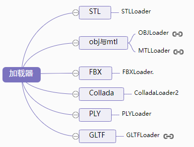 

### 数据结构、导入导出

**导出模型信息**

查看Threejs文档[BufferGeometry](https://threejs.org/docs/index.html?q=buffergeometry#api/zh/core/BufferGeometry)、[Material](https://threejs.org/docs/index.html?q=Material#api/zh/materials/Material)、[Light](https://threejs.org/docs/index.html?q=light#api/zh/lights/Light)、[Object3D](https://threejs.org/docs/index.html?q=object3d#api/zh/core/Object3D)等类，你可以发现这些类都提供了一个方法`.toJSON()`通过这个方法可以导出Threejs三维模型的各类数据，该方法的功能就是把Threejs的几何体、材质、光源等对象转化为JSON格式导出

**导出几何数据**

不只是几何, 场景, 材质, 相机, 网格等都是可以导出的

```js
const geometry = new THREE.BoxGeometry(100, 100, 100);
// 控制台查看立方体数据
console.log(geometry);
// 控制台查看geometry.toJSON()结果
console.log(geometry.toJSON());
// JSON对象转化为字符串
console.log(JSON.stringify(geometry.toJSON()));
// JSON.stringify()方法内部会自动调用参数的toJSON()方法
console.log(JSON.stringify(geometry));
```

**加载Threejs导出的模型数据**

加载几何体数据

```js
const loader = new THREE.BufferGeometryLoader();
loader.load('bufferGeometry.json',function (geometry) {
    // 控制台查看加载放回的threejs对象结构
    console.log(geometry);
    const material = new THREE.MeshLambertMaterial({
        color: 0x0000ff,
    }); //材质对象Material
    const mesh = new THREE.Mesh(geometry, material); //网格模型对象Mesh
    scene.add(mesh); //网格模型添加到场景中
})
```

网格模型Mesh加载，包含几何体Geometry和材质Material

```javascript
var loader = new THREE.ObjectLoader();
loader.load('model.json',function (obj) {
    console.log(obj);
    console.log(obj.type);
    obj.scale.set(100,100,100)
    scene.add(obj)
})
```

加载组Group对象，模型对象构成的树结构

```javascript
loader.load('group.json', function(obj) {
    console.log(obj);
    console.log(obj.type);
    scene.add(obj)
})
```

加载场景对象，场景对象不仅包含模型，还包括光源对象

```javascript
loader.load('scene.json',function (obj) {
    console.log(obj);
    console.log(obj.type);
    obj.scale.set(100,100,100)
    scene.add(obj)
})
```

### .stl格式模型加载

基本所有的三维软件都支持导出`.stl`格式的三维模型文件，`.stl`格式的三维模型不包含材质Material信息，只包含几何体顶点数据的信息，可以简单地把stl文件理解为几何体对象Geometry

**需要引入`STLLoader.js`文件来加载.stl文件**

加载器文件路径在`three.js-master/examples/js/loaders`

```js
// 引入STLLoader.js文件
<script src="./three.js-master/examples/js/loaders/STLLoader.js"></script>
```

```js
/**
 * stl数据加载
 */
const loader = new THREE.STLLoader();
// 立方体默认尺寸长宽高各200
loader.load('立方体.stl',function (geometry) {
  // 控制台查看加载放回的threejs对象结构
  console.log(geometry);
  // 查看顶点数，一个立方体6个矩形面，每个矩形面至少2个三角面，每个三角面3个顶点，
  // 如果没有索引index复用顶点，就是说一个立方体至少36个顶点
  console.log(geometry.attributes.position.count);
  // 缩放几何体
  // geometry.scale(0.5,0.5,0.5);
  // 几何体居中
  // geometry.center();
  // 平移立方体
  // geometry.translate(-50,-50,-50);
  const material = new THREE.MeshLambertMaterial({
    color: 0x0000ff,
  }); //材质对象Material
  const mesh = new THREE.Mesh(geometry, material); //网格模型对象Mesh
  scene.add(mesh); //网格模型添加到场景中
})
```

### 加载.obj模型文件

使用三维软件导出`.obj`模型文件的时候，会同时导出一个材质文件`.mtl`， `.obj`和`.stl`文件包含的信息一样都是几何体顶点相关数据，材质文件`.mtl`包含的是模型的材质信息，比如颜色、贴图路径等

加载`.obj`三维模型的时候，可以只加载`.obj`文件，然后借助threejs引擎自定义材质[Material](https://threejs.org/docs/index.html?q=Material#api/zh/materials/Material)，也可以同时加载`.obj`和`.mtl`文件

**只加载obj文件**

引入`OBJLoader.js`文件, 路径`three.js-master/examples/js/loaders/OBJLoader.js`

```js
<!-- 引入obj模型加载库OBJLoader.js -->
<script src="../three.js-master/examples/js/loaders/OBJLoader.js"></script>
```

**文件加载**

```javascript
/**
 * OBJ文件加载  只加载obj文件中的几何信息，不加载材质文件.mtl
 */
const loader = new THREE.OBJLoader();
// 没有材质文件，系统自动设置Phong网格材质
loader.load('./立方体/box.obj',function (obj) {
  // 控制台查看返回结构：包含一个网格模型Mesh的组Group
  console.log(obj);
  // 查看加载器生成的材质对象：MeshPhongMaterial
  console.log(obj.children[0].material);
  scene.add(obj);
})
```

加载文件返回的对象插入场景中后, 可以做一些自定的设置，比如缩放、居中等操作

```javascript
// 加载后的一些编辑操作
obj.children[0].scale.set(20,20,20);// 网格模型缩放
obj.children[0].geometry.center();// 网格模型的几何体居中
obj.children[0].material.color.set(0xff0000);// 设置材质颜色
```

**同时加载obj文件和mtl文件**

`.mtl`文件包含了模型的材质信息，比如模型颜色、透明度等信息，还有纹理贴图的路径，比如颜色贴图、法线贴图、高光贴图等等

```js
<!-- 引入obj模型加载库OBJLoader.js -->
<script src="./three.js-master/examples/js/loaders/OBJLoader.js"></script>
<!-- 引入obj模型材质加载库MTLLoader.js -->
<script src="./three.js-master/examples/js/loaders/MTLLoader.js"></script>
```

```js
/**
 * OBJ和材质文件mtl加载
 */
const OBJLoader = new THREE.OBJLoader();//obj加载器
const MTLLoader = new THREE.MTLLoader();//材质文件加载器
MTLLoader.load('./立方体/box.mtl', function(materials) {
  // 返回一个包含材质的对象MaterialCreator
  console.log(materials);
  //obj的模型会和MaterialCreator包含的材质对应起来
  OBJLoader.setMaterials(materials);
  OBJLoader.load('./立方体/box.obj', function(obj) {
    console.log(obj);
    obj.scale.set(10, 10, 10); //放大obj组对象
    scene.add(obj);//返回的组对象插入场景中
  })
})
```

**obj包含多个网格模型** 

`.obj`文件可以包含多个网格模型对象，不一定就是一个，这些网格模型对象全部是并列关系，无法通过父子关系构建一个树结构层级模型

```javascript
// 没有材质文件，系统自动设置Phong网格材质
OBJLoader.load('./多个模型/model.obj',function (obj) {
  // 控制台查看返回结构：包含一个网格模型Mesh的组Group
  console.log(obj);
  scene.add(obj);
  // 加载后的一些编辑操作
  obj.scale.set(20,20,20);//网格模型缩放
  // 设置其中一个网格模型的颜色
  obj.children[0].material.color.set(0xff0000);
})
```

**模型纹理贴图** 

`obj`模型的`.mtl`文件可能包含纹理贴图，也可能不包含，这主要看3D美术是否设置

一个包含纹理贴图路径的`.mtl`文件,如果路径有问题，可能会无法加载

```js
// 一个包含纹理贴图路径的.mtl文件
newmtl material_1
    Ns 32
    d 1
    Tr 0
    Tf 1 1 1
    illum 2
    Ka 0.5880 0.5880 0.5880
    Kd 0.9880 0.9880 0.9880
    Ks 0.1200 0.1200 0.1200
    map_Kd ./贴图/Earth.png
  map_ks ./贴图/EarthSpec.png
    norm ./贴图/EarthNormal.png
```

**mtl和threejs贴图对应关系**

| mtl贴图       | Threejs贴图 |
| :------------ | :---------- |
| map_kd        | map         |
| map_ks        | specularMap |
| map_bump/bump | bumpMap     |

```js
/**
 * OBJ和材质文件mtl加载
 */
const OBJLoader = new THREE.OBJLoader(); // obj加载器
const MTLLoader = new THREE.MTLLoader(); // 材质文件加载器
MTLLoader.load('./贴图/material.mtl', function(materials) {
  // 返回一个包含材质的对象MaterialCreator
  console.log(materials);
  // obj的模型会和MaterialCreator包含的材质对应起来
  OBJLoader.setMaterials(materials);
  OBJLoader.load('./贴图/model.obj', function(obj) {
      
    // 颜色贴图中已经包含了光照信息，所以直接使用不受光照影响的基础网格材质MeshBasicMaterial
    obj.children[0].material= new THREE.MeshBasicMaterial({
        map: new THREE.TextureLoader().load('texture1.png'),//设置颜色纹理贴图
    })
      
    // 加载后操作
    obj.children[0].scale.set(2, 2, 2); // 缩放球体网格模型
    // 通过调节参数, 地球表面的凹凸感更强
    obj.children[0].material.normalScale.set(3, 3);
    
    scene.add(obj); // 返回的组对象插入场景中
  })
})
```

**导出`.obj`和`.mtl`的名称、路径问题**

**3dmax**导出的obj和mtl模型文件有时候需要修改一下个别位置字符，比如`.obj`中`.mtl`文件的名称可能是乱码`mtllib �����.mtl`，`.mtl`文件中贴图的路径要设置正确，比如导出的是绝对路径还是相对路径，可以打开文件看下

**`.obj`文件里不包含的信息**

`.obj`文件不包含场景的相机Camera、光源Light等信息，不能导出骨骼动画、变形动画，如果希望导出光照信息、相机信息、骨骼动画信息、变形动画信息，可以选择`.fbx`、`.gltf`等格式

### 加载FBX并解析骨骼动画

**加载器**`FBXLoader.js`

```js
<!-- 引入fbx模型加载库FBXLoader -->
<script src="./three.js-master/examples/js/loaders/FBXLoader.js"></script>
<!-- 辅助文件 -->
<script src="./three.js-master/examples/js/libs/inflate.min.js"></script>
```

**加载fbx模型文件** 

加载模型文件，加载完成后，如果模型显示位置不符合要求，可以让3D美术修改，也可以通过Threejs程序进行平移、缩放等操作

```js
const loader = new THREE.FBXLoader();//创建一个FBX加载器
loader.load("SambaDancing.fbx", function(obj) {
  // console.log(obj);// 查看加载后返回的模型对象
  scene.add(obj)
  // 适当平移fbx模型位置
  obj.translateY(-80);
})
```

**查看FBX模型帧动画数据** 

`.stl` `.obj`文件都是静态模型, 不能包含动画, `.fbx`文件除了包含几何, 材质信息, 可以存储骨骼动画等数据

解析之前可以先在浏览器控制台查看动画相关的数据是如何存储的。你可以看到`obj.animations`属性的数组包含两个剪辑对象[AnimationClip](https://threejs.org/docs/index.html?q=AnimationClip#api/zh/animation/AnimationClip)，`obj.animations[0]`对应剪辑对象`AnimationClip`包含多组关键帧[KeyframeTrack](https://threejs.org/docs/index.html?q=KeyframeTrack#api/zh/animation/KeyframeTrack)数据，`obj.animations[1]`对应的剪辑对象`AnimationClip`没有关键帧数据，也就是说没有关键帧动画。具体的开发中，可能美术提供的模型有很多包含关键帧动画的剪辑对象`AnimationClip`，你可以根据自己的需要解析某个剪辑对象`AnimationClip`对应的动画

```js
const loader = new THREE.FBXLoader();//创建一个FBX加载器
loader.load("SambaDancing.fbx", function(obj) {
  ...
  // 可以在控制台打印obj对象，找到animations属性
  console.log(obj)
  // 查看动画数据
  console.log(obj.animations)

})
```

**解析fbx模型骨骼动画** 

```js
let mixer = null;// 声明一个混合器变量
const loader = new THREE.FBXLoader();// 创建一个FBX加载器
loader.load("SambaDancing.fbx", function(obj) {
  // console.log(obj)
  scene.add(obj)
  obj.translateY(-80);
  // obj作为参数创建一个混合器，解析播放obj及其子对象包含的动画数据
  mixer = new THREE.AnimationMixer(obj);
  // 查看动画数据
  console.log(obj.animations)
  // obj.animations[0]：获得剪辑对象clip
  const AnimationAction=mixer.clipAction(obj.animations[0]);
  // AnimationAction.timeScale = 1; // 默认1，可以调节播放速度
  // AnimationAction.loop = THREE.LoopOnce; // 不循环播放
  // AnimationAction.clampWhenFinished=true;// 暂停在最后一帧播放的状态
  AnimationAction.play();// 播放动画
})
```

```js
// 创建一个时钟对象Clock
const clock = new THREE.Clock();
// 渲染函数
function render() {
  ...

  if (mixer !== null) {
    //clock.getDelta()方法获得两帧的时间间隔
    // 更新混合器相关的时间
    mixer.update(clock.getDelta());
  }
}
render();
```


## 辅助对象

### 三维坐标系（AxesHelper）

[`THREE.AxesHelper(size)`](https://threejs.org/docs/index.html?q=AxesHelper#api/zh/helpers/AxesHelper)

**sise**: 表示轴的线段长度. 默认为 **1**

**红色代表 X 轴, 绿色代表 Y 轴, 蓝色代表 Z 轴**

```js
// 生成三维坐标系
const axes = new THREE.AxesHelper(20);
// 添加坐标系到场景中
scene.add(axes);
```

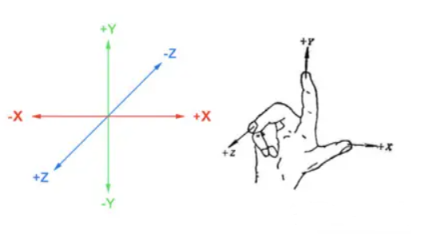 

### 光的辅助对象

| 辅助对象           | 构造函数名                                                   |
| :----------------- | :----------------------------------------------------------- |
| 聚光源辅助对象     | [SpotLightHelper](https://threejs.org/docs/index.html?q=SpotLightHelper#api/zh/helpers/SpotLightHelper) |
| 点光源辅助对象     | [PointLightHelper](https://threejs.org/docs/index.html?q=PointLightHelper#api/zh/helpers/PointLightHelper) |
| 平行光光源辅助对象 | [DirectionalLightHelper](https://threejs.org/docs/index.html?q=DirectionalLightHelper#api/zh/helpers/DirectionalLightHelper) |

```js
const helper = new THREE.DirectionalLightHelper(light);
scene.add(helper);
```

当辅助对象所表示的不可见对象有所改变的时候, 必须调用辅助对象的 `update` 方法来更新辅助对象本身的状态

常用到**光照位置**与**目标点位置**的控制

```js
function updateLight() {
    // 光的辅助对象更新状态
    light.target.updateMatrixWorld();
    // 光的更新状态
    helper.update();
    // 更新相机的状态
    camera.updateProjectionMatrix();
}
```

### 相机视锥（CameraHelper）

[`THREE.CameraHelper()`](https://threejs.org/docs/#api/zh/helpers/CameraHelper)

用于模拟相机视锥体的辅助对象.
它使用 [LineSegments](https://threejs.org/docs/#api/zh/objects/LineSegments) 来模拟相机视锥体.

```JS
...
const helper = new THREE.CameraHelper( camera );
scene.add( helper );
```

### 轨道控制器（OrbitControls）

轨道控制器需要[单独引入](https://threejs.org/docs/index.html#manual/zh/introduction/Installation), 加上此控制器,就可以通过鼠标拖拽、滚动对整个画面进行拖拽, 缩放, 平移

```js
// 引入 r136 版本的 OrbitControls
import { OrbitControls } 
	from 'https://cdn.skypack.dev/three@0.136.0/examples/jsm/controls/OrbitControls.js';

// 设置轨道控制器 
const controls = new OrbitControls(camera, renderer.domElement);
// 改变控制器的焦点
controls.target.set(0, 5, 0);
// 更新更新观察点位置(必须)
controls.update();
// 启用控制器的阻尼(惯性)
controls.enableDamping = true;
// 摄像机平移
controls.enablePan = false;
```

### 数学函数

[`MathUtils`](https://threejs.org/docs/index.html#api/zh/math/MathUtils)

### 用户界面工具（lil-gui）

[lil-gui](https://github.com/georgealways/lil-gui) 是一个轻量级的图形用户界面库（**GUI** 组件）,使用这个库可以很容易地创建出能够改变代码变量的界面组件

> 官方教程, [Examples](https://lil-gui.georgealways.com/#Examples)

```js
// 引入 lil-gui 库
import { GUI } from 'https://threejs.org/examples/jsm/libs/lil-gui.module.min.js';
// 实例化 lil-gui
const gui = new GUI();
```

**gui**的一些方法

| 方法      | 描述                                                         |
| --------- | ------------------------------------------------------------ |
| add       | 添加一个表单组件, 参数依次是(对象, 属性, 最小值, 最大值, 步进) |
| addColor  | 添加一个颜色选择面板, 参数依次为(对象,属性）                 |
| addFolder | 添加一个栏目,参数为栏目的名称,该函数返回一个对象,这个对象仍然可以使用**add()、addColor()、addFolder()**方法 |

**lil-gui** 会根据它的值自动选择一个合适的控制器类型

```js
// 属性对象
cosnt obj = {
	myBoolean: true,
	myString: 'lil-gui',
	myNumber: 1,
	myFunction: function() { alert( 'hi' ) }
}

// 根据 obj['myxxx'] 生成一个合适的控制器类型
gui.add( obj, 'myBoolean' ); 	// 生成复选框
gui.add( obj, 'myString' ); 	// 文本字段
gui.add( obj, 'myNumber' ); 	// 数字框
gui.add( obj, 'myFunction' ); 	// 按钮(点击触发 obj.myFunction)
```

具有最小值和最大值的**数字框控制器**自动转换为**滑块**

```js
const obj = { number1: 1, number2: 50 };

// 初始值为1, 最小滑动值0, 最大滑动值1
gui.add( obj, 'number1', 0, 1 ); 
// 初始值为50, 最小滑动值0, 最大滑动值100, 步进为10
gui.add( obj, 'number2', 0, 100, 10 ); 
```

可以通过**数组**为任何数据类型创建**下拉列表**, 如果传递的是一个对象, 它的**键将被用作选项的标签**

```js
const obj = { size: 'Large', speed: 0.1 };

// 文案为:size文案, 下拉项为:Small Medium Large(值也是), 默认值为:Large
gui.add( obj, 'size文案', [ 'Small', 'Medium', 'Large' ] );

// 文案为:speed文案, 下拉项为:Slow Normal Fast(值对应 0.1 1 5), 默认值为:Slow(0.1)
gui.add( obj, 'speed文案', { Slow: 0.1, Normal: 1, Fast: 5 } );
```

**lil-gui**可以识别多种格式的颜色: CSS字符串、RGB对象或十六进制整数值等等

```js
const obj = {
	color1: '#AA00FF',
	color2: '#a0f',
	color3: 'rgb(170, 0, 255)',
	color4: 0xaa00ff
}

// 都是颜色选择框
gui.addColor( obj, 'color1' );
gui.addColor( obj, 'color2' );
gui.addColor( obj, 'color3' );
gui.addColor( obj, 'color4' );
```

**控制器分组**

```js
// 顶级控制器
gui.add( obj, 'scale', 0, 1 );

// 嵌套的控制器, 嵌套的标题为: Position文案
const folder = gui.addFolder( 'Position文案' );
folder.add( obj, 'x' );
folder.add( obj, 'y' );
folder.add( obj, 'z' );
```

**事件相关**

```js
// 指定属性改变事件
gui.add( params, 'foo' ).onChange( value => {
	console.log( value );
} );

// 全局事件
// gui 的任何子对象发生更改后触发
gui.onChange( event => {
	event.object     // 被修改的对象
	event.property   // 字符串,属性名
	event.value      // 控制器新值
	event.controller // 被修改的控制器
} );
```

**指定标题文本**

```js
gui.add( position, 'x' ).name( '位置x' );
gui.add( rotation, 'x' ).name( '旋转x' );
```

指定 **GUI** 组件的位置

默认情况下, **GUI**被添加到文档窗口右上方的固定定位, 向构造函数传递容器参数, 可以将 **GUI** 添加到不同的元素

```js
// 设置指定容器DOM
const gui = new GUI( { container: $('#gui') } );
// 设置 GUI 宽度
const gui = new GUI( { width: 400 } );
// 打开 gui 控制器
gui.open( );
// 折叠 gui 控制器
gui.open( false );
// 切换 gui 控制器
gui.open( gui._closed );
```

:::