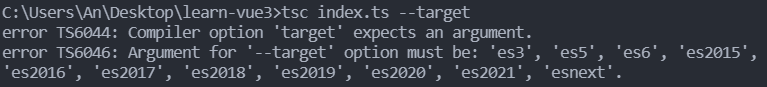

# Typescript

[TypeScript](https://typescript.bootcss.com/) 是 JavaScript 的超集, 扩展了 JavaScript 的语法, 因此现有的 JavaScript 代码可与 TypeScript 一起工作无需任何修改, TypeScript 通过类型注解提供编译时的静态类型检查

[官方文档](https://www.typescriptlang.org/docs/handbook/typescript-in-5-minutes.html)

[官方中文文档](https://www.tslang.cn/docs/handbook/basic-types.html)

[TypeScript入门教程](https://ts.xcatliu.com/introduction/index.html)

[学习TypeScript](https://learntypescript.dev/)

[[toc]]

## 基础

[基础数据类型](https://typescript.bootcss.com/basic-types.html)包括: 字符串, 数值, 布尔值,`null`,`undefined`以及 ES6 中的新类型 [`Symbol`](http://es6.ruanyifeng.com/#docs/symbol) 和 ES10 中的新类型 [`BigInt`](https://developer.mozilla.org/zh-CN/docs/Web/JavaScript/Reference/Global_Objects/BigInt), 还有 typescript 里新增的类型:`void`,`any`,`unknown`,`never`,`tuple`,`enum`

>   在TS中不使用JS中的大写构造函数, 使用的类型都是小写的包括`object`也是可以用小写的

### string

```ts
// 字符串
const name: string =`张三`;
const age: number = 18;

// 模板字符串
const sentence: string =`我的名字叫:${name}, 年龄: ${age}`;
```

### number

```ts
// 十进制数值
const age: number = 18;
// 十六机制表示法
const hexAge: number = 0xf00d;
// ES6 中的二进制表示法
const binaryAge: number = 0b1010;
// ES6 中的八进制表示法
const octalAge: number = 0o744;
```

### boolean

```ts
let flag1: boolean;
const flag2: boolean = false;
```

**常量声明是必须要赋值初始值**

```ts
const flag1: boolean = true; 
const flag2: boolean; // Error 常量必须有初始值

// 使用 let 定义的数据可以不必要初始值
let flag3: boolean;
flag3 = false;
```

### 自动类型推断

TS拥有自动的类型推断机制, 默认是`let`(宽泛推断), 还有`const`(精准推断)

当对变量的声明和赋值是同时进行的, ts编译器会自动推断变量的类型

```ts
let count1 = 0; // 自动类型推断为 number
const count2 = 0; // 自动类型推断为 0
```

>   同样的规则对数组和对象也是一样

### Null 和 Undefined

默认情况下`null`和`undefined`是所有类型的子类型, 就是说你可以把`null`和`undefined`赋值给其他类型的变量

```ts
const u: undefined = undefined;
const n: null = null;

// 赋值给 number 类型
let a: number = u;
a = n;

// 赋值给 string 类型
let b: string = u;
b = n
```

### void

**void** 用来表示空, 以函数为例, 就表示没有返回值的函数

```js
// 该函数没有返回值
function fn(): void {
    // return 123; // Error 不能将类型“number”分配给类型“void”

    // 就算设置了函数的返回值类型为 void 返回以下的值时也不会报错
    // return undefined;
    // return null;
    return;
}
```

### any

**any** 表示任意类型, 一个变量设置类型为 **any** 后相当于对该变量关闭了类型检测

```ts
let foo: any;

foo = 1; // ok
foo = 'hello'; // ok
foo = true; // ok

foo.bar; // ok
foo[0][1]; // ok
foo(); // ok
foo.toString(); // ok
new foo(); // ok
```

声明变量如果不指定类型, 则 ts 解析器会自动判断变量的类型为 **any (隐式的any)**

```js
let foo; // 不指定类型并且没有初始值的话类型就是 any, 可以是任何值 
foo = 1; // 修改为数值
foo = '你好'; // 修改为字符串
```

`any` 类型是会 "污染" 其他类型

```ts
let foo: any;
let count: number = 0;

count = foo;
```

当只知道一部分数据的类型时,`any`类型也是有用的;  比如, 有一个数组, 它包含了不同的类型的数据: 

```ts
const list: any[] = [1, true];

list[2] = 'hello';
console.log(list); // [ 1, true, 'hello' ]
```

在许多场景下, 这太宽松了使用 `any` 类型, 可以很容易地编写类型正确但在运行时有问题的代码, 如果我们使用 `any` 类型，就无法使用 TypeScript 提供的大量的保护机制, 为了解决 `any` 带来的问题, TypeScript 3.0 引入了 `unknown` 类型

### unknown

**unknown**类型表示未知类型的值和`any`类型一样可以赋值任何的类型

```ts
let foo: unknown;

foo = 1; // ok
foo = 'hello'; // ok
foo = true; // ok
```

**unknown**类型实际上是一个**类型安全的 any**

```ts
let foo: unknown = 'hello';

foo.toString(); // ok
foo.bar; // Error
foo(); // Error
new foo(); // Error
```

**unknown**类型**不能**直接赋值("污染")给除`any`和`unknown`类外的其他变量

```ts
let notSure: unknown;
let count: number = 0;

let anyValue: any;
let unkNownValue: unknown;
anyValue = notSure; // ok
unkNownValue = notSure; // ok

count = notSure; // Error 但是不能赋值给其他的变量
```

`unknown`可以通过类型收窄来使用, 如下: 

```ts
const foo: unknown = "hello";

// foo.toLocaleUpperCase(); // error 对象的类型为 "unknown"

if (typeof foo === "string") { // 类型收窄, 在花括号里 foo 的类型为 string, 
  foo.toLocaleUpperCase(); 
}

try {
  // ....
} catch (error: unknown) {
  if (error instanceof Error) {
    console.error(error.message);
  }
}
```

不确定参数时又不想使用`any`时可以使用`unknown`

```ts
const test = (msg: unknown): number | never => {
  if (typeof msg === "string") {
    return msg.length;
  } else {
    throw new Error("参数错误");
  }
}
```

### never

`never`类型表示的是那些永不存在的值的类型, 例如,

- 如果一个函数执行时抛出了异常, 那么这个函数永远不存在返回值, 因为抛出异常会直接中断程序运行
- 函数中执行无限循环的代码, 使得程序永远无法运行到函数返回值那一步

```js
// 返回 never 的函数必须存在无法达到的终点
function error(message: string): never {
    throw new Error(message);
}

// 推断的返回值类型为 never
function fail() {
    return error("我是一个错误信息");
}

// 返回never的函数必须存在无法达到的终点
function infiniteLoop(): never {
    // 死循环
    while (true) {

    }
}
```

`never`类型是任何类型的子类型，也可以赋值给任何类型,

没有类型是`never`的子类型，没有类型可以赋值给 `never` 类型（除了 `never` 本身之外）。 即使 `any`也不可以赋值给 `never` 

```ts
let test: never;

test = 'hello'; // Error 不能将类型“string”分配给类型“never”
```

```ts
let test1: never;
const test2: any = 123;

test1 = test2; // Error 不能将类型“any”分配给类型“never”
```

### 枚举 enum

`enum`类型是对JavaScript标准数据类型的一个补充, 使用枚举类型可以为一组数据赋予指定的名字

用于取值被限定在一定范围内的场景, 比如一周只能有七天, 颜色限定为红绿蓝等

```ts
enum Color { Red, Green, Blue }
const c: Color = Color.Red;
console.log(c); // 0
```

上面例子中的**Color**枚举类型经过 ts 编译后的代码如下: 

```ts
var Color;
(function (Color) {
    Color[Color["Red"] = 0] = "Red";
    Color[Color["Green"] = 1] = "Green";
    Color[Color["Blue"] = 2] = "Blue";
})(Color || (Color = {}));

console.log(Color);
// => { '0': 'Red', '1': 'Green', '2': 'Blue', Red: 0, Green: 1, Blue: 2 }
```

#### 手动指定元素编号

默认情况下, 从`0`开始为元素编号, 也可以手动的指定成员的数值; 例如, 将上面的例子改成从`1`开始编号:

```ts
enum Color { Red = 1, Green, Blue }

const r: Color = Color.Red;
const g: Color = Color.Green;
const b: Color = Color.Blue;

console.log(`r:${r}`,`g:${g}`,`b:${b}`); // r:1 g:2 b:3
```

或者, 可以使用**手动赋值**, 例如: 

```ts
enum Color { Red = 1, Green = 4, Blue }

const r: Color = Color.Red;
const g: Color = Color.Green;
const b: Color = Color.Blue;

console.log(`r:${r}`,`g:${g}`,`b:${b}`); // r:1 g:4 b:5
```

上面的例子中, 未手动赋值的枚举项会接着上一个枚举项递增

#### 元素编号的重复问题

如果未手动赋值的枚举项与手动赋值的**重复**了, TypeScript 是不会察觉到这一点的: 

```ts
enum Color { Red = 1, Green, Blue = 2 }

const r: Color = Color.Red;
const g: Color = Color.Green;
const b: Color = Color.Blue;

console.log(`r:${r}`, `g:${g}`, `b:${b}`); // r:1 g:2 b:2
console.log(g === b); // true
```

上面的例子中, **Color.Green**自动递增到`2`会与**Color.Blue**手动赋值的`2`重复了, ts 编译器并不会提示

手动赋值的枚举项可以不是数字, 此时需要使用**类型断言**来让 ts 无视类型检查 (编译出的 js 仍然是可用的): 

```ts
enum Color { Red, Green, Blue = ('b' as any)}
console.log(Color['b']); // => Blue
```

需要注意的就是枚举项里指定其他类型以后, 紧接在该类型后续的类型未手动赋值的项是**无法完成自动递增而报错**, 如下: 

```ts
enum Color { Red = ('r' as any), Green, Blue } // Error 枚举成员必须具有初始化表达式
```

自定义类型后续的枚举类型需手动指定元素编号: 

```ts
enum Color { Red = ('r' as any), Green = 1, Blue }
```

#### 元素编号可以是负数或小数

手动赋值的枚举项也可以为小数或负数, 此时后续未手动赋值的项的递增步长仍为 `1`: 

```ts
enum Color { Red = -1.5, Green, Blue = 2.4, Yellow }
console.log(Color.Green); // => -0.5
console.log(Color[3.4]); // => Yellow
```

#### 常数项和计算所得项

枚举项有两种类型: 常数项（constant member）和计算所得项（computed member）

前面通过自增的例子都是常数项, 还可以通过计算所得项获取元素编号如: 

```ts
enum Color { Red, Green = Math.pow(2, 3), Blue = 'Blue'.length };
console.log(Color[8]); // => Green
console.log(Color[4]); // => Blue
```

上面的例子中**Color.Green**和**Color.Blue**就是计算所得项

但是如果紧接在计算所得项后面的是未手动赋值的项, 那么它就会因为**无法完成自动递增而报错**: 

```ts
enum Color { Red = 'Red'.length, Green, Blue }; // Error 枚举成员必须具有初始化表达式
```

计算所得项后续的元素编号项必须指定初始值: 

```ts
enum Color { Red = 'Red'.length, Green = 1, Blue };
```

#### 常数枚举

常数枚举是使用 `const enum` 定义的枚举类型

```ts
const enum Directions {
    Up,
    Down,
    Left,
    Right
}

const directions = [
    Directions.Up,
    Directions.Down,
    Directions.Left,
    Directions.Right
];
```

常数枚举与普通枚举的区别是, 它会在**编译阶段被删除, 并且不能包含计算成员**, 上面例子的编译结果是: 

```ts
var directions = [
    0 /* Up */,
    1 /* Down */,
    2 /* Left */,
    3 /* Right */
];
```

假如包含了计算成员, 则会在编译阶段报错: 

```ts
const enum Directions {
    Up = 'up'.length, // Error 常量枚举成员初始值设定项只能包含文字值和其他计算的枚举值
    Down,
    Left,
    Right
}
```

#### 外部枚举

外部枚举（Ambient Enums）是使用 `declare enum` 定义的枚举类型

```ts
declare enum Directions {
    Up,
    Down,
    Left,
    Right
}

const directions = [
    Directions.Up,
    Directions.Down,
    Directions.Left,
    Directions.Right
];
```

`declare` 定义的类型只会用于编译时的检查, 编译结果中会被删除, 上面的例子编译结果是: 

```ts
var directions = [
    Directions.Up,
    Directions.Down,
    Directions.Left,
    Directions.Right
];
```

外部枚举与声明语句一样, 常出现在声明文件中

同时使用 `declare` 和 `const` 也是可以的:

```ts
declare const enum Directions {
    Up,
    Down,
    Left,
    Right
}

const directions = [
    Directions.Up,
    Directions.Down,
    Directions.Left,
    Directions.Right
];
```

编译结果跟常数枚举是一样的: 

```ts
var directions = [
    0 /* Up */,
    1 /* Down */,
    2 /* Left */,
    3 /* Right */
];
```


### 联合类型

联合类型表示取值可以为多种类型中的其中一种, 使用`|`分隔每个类型

```ts
// 允许 myDetail 的类型是 string 或者 number
let myDetail: string | number;
myDetail = '张三';
myDetail = 18;

myDetail = true; // Error 不能将类型“boolean”分配给类型“string | number”
```

**访问联合类型的属性或方法**

当 TypeScript 不确定一个联合类型的变量到底是哪个类型的时候, 我们**只能访问此联合类型的所有类型里共有的属性或方法**: 

```ts
function getLength(something: string | number): number {
  // return something.length;  Error 类型“number”上不存在属性“length”

  // 通过类型判断来使用
  let ret: number;
  if (typeof something === "string") {
    ret = something.length;
  } else {
    ret = something.toString().length;
  }
  return ret;
}

function getString(something: string | number): string {
    return something.toString(); // 使用共有方法 toString() 是可以的
}
```

联合类型的变量在被赋值的时候, 会根据类型推断的规则**自动推断出一个类型**:

```ts
let myDetail: string | number;
myDetail = '张三'; // 推断为字符串类型
myDetail.length; // ok

myDetail = 18; // 推断为数值类型
myDetail.length; // Error 类型“number”上不存在属性“length”
```

#### 类型收窄

联合类型也是具有类型收窄特性的

```ts
function getString(something: string | number): string {
    return something.toString(); // 使用共有方法 toString() 是可以的
} 
```


## 接口(对象的类型)

在面向对象语言中, 接口(**Interfaces**)是一个很重要的概念, 它是对行为的抽象, 而具体如何行动需要由类去实现, TypeScript 中的接口是一个非常灵活的概念, 除了可用于对类的[一部分行为进行抽象](https://ts.xcatliu.com/advanced/class-and-interfaces.html#%E7%B1%BB%E5%AE%9E%E7%8E%B0%E6%8E%A5%E5%8F%A3)以外, 也常用于对 对象的形状(Shape)进行描述

```ts
// 定义一个接口 Person
interface Person {
    name: string;
    sayHi(msg: string): void;
    sayNH?(msg: string): void; // 可选
}

// 定义了变量 tom, 它的类型是 Person
// 属性值和类型(形状)必须和 Person 接口定义的一致
const tom: Person = {
    name: '张三',
    sayHi(msg) { alert(msg) }
};

// 后续对 tom 的访问将会获得代码提示

const test1: Person = { // Error 缺少属性 "sayHi"
    name: '李四'
};

const test2: Person = { // Error “age”不在类型“Person”中
    name: '李四',
    age: 28
};
```

> `type`关键字作用和`interface`类似只不过语法是`type xxx = {}`
>
> 在使用接口约束时, **变量赋值的形状必须和接口的形状保持一致**

### 可选属性

接口也是可以使用`?`来定义可选的属性, 但是**仍然不允许添加未定义的属性**

```ts
interface Person {
    name: string;
    age?: number; // 可选属性
}

const tom1: Person = { // ok
    name: '张三'
};

const tom2: Person = { // ok
    name: '李四',
    age: 18
};

const tom3: Person = { // Error “gender”不在类型“Person”中
    name: '王五',
    age: 28,
    gender: '男'
};
```

### 任意属性

有时候我们希望一个接口允许有任意的属性, 可以使用`[propName: 类型1]: 类型2`: 

```ts
interface Person {
    name: string;
    age?: number;
    // [propName: string]: any 表示 key 取 string 类型, value 取 any 类型
    [propName: string]: any; 
}


const tom: Person = {
    name: '张三',
    age: 18,
    gender: '男'
};
```

需要注意的是, **一旦定义了任意属性, 那么确定属性和可选属性的类型都必须是它的类型的子集**: 

```ts
interface Person {
    name: string;
    age?: number;
    [propName: string]: string;
}

const tom: Person = {
    name: '张三',
    age: 18,
    gender: '男'
};
```

上面的例子中, 任意属性的值允许是`string`但是可选属性`age`的值却是`number`,`number`不是`string`的子属性

一个接口中只能定义一个任意属性, 如果接口中有多个类型的属性, 则可以在任意属性中使用联合类型: 

```ts
interface Person {
    name: string;
    age?: number;
    [propName: string]: string | number; // 使用联合类型
}

const tom: Person = {
    name: '张三',
    age: 18,
    gender: '男'
};
```

### 只读属性

通过`readonly`关键字指定只读属性

```ts
interface Person {
    readonly id: number;
    name: string;
    age?: number;
}

const tom: Person = {
    id: 1,
    name: '张三',
    age: 25,
};

tom.id = 2; // Error 无法分配到 "id" , 因为它是只读属性
```

### 获取成员类型

在一个类型中可以通过`["xxx"]`来获取对应的成员类型:

```typescript
interface Person {
  name: "张三" | "李四";
}

// 对应类型为: "张三" | "李四"
type UserName = Person["name"];


let n: UserName;
n = "张三";
n = "李四";

n = "hello"; // Error 类型不匹配
```


## 数组

在 ts 中, 数组类型有多种定义方式

### 「类型 + 方括号」表示法

最简单的方法是使用「类型 + 方括号」来表示数组: 

```ts
const list: number[] = [1, 2, 3];
const strList: string[] = ['1', '2', '3'];
```

使用「类型 + 方括号」来表示数组时该数组只能存储指定类型的数据, **不允许**出现其他的类型: 

```ts
const list: number[] = [1, 2, 3, 'hello']; // Error 不能将类型“string”分配给类型“number”
```

数组的一些方法的参数也会根据数组在定义时约定的类型进行限制: 

```ts
const list: number[] = [1, 2, 3]; 
list.push('hello'); // Error 类型“string”的参数不能赋给类型“number”的参数
```

### 数组泛型

也可以使用数组泛型（Array Generic）`Array<元素类型>`来表示数组: 

```ts
const list: Array<number> = [1, 2, 3];
const strList: Array<string> = ['1', '2', '3'];
```

关于泛型, 可以参考[泛型](https://ts.xcatliu.com/advanced/generics.html)一章

### 用接口表示数组

接口也可以用来描述数组: 

```ts
interface List {
    // 只要索引的类型是数字时, 那么值的类型必须是数字
    [index: number]: number
}

const list1: List = [1, 2, 3];
const list2: List = [1, 2, 3, 'hello']; // Error 不能将类型“string”分配给类型“number”
```

虽然接口也可以用来描述数组, 但是一般不会这么做, 因为这种方式比前两种方式复杂多了

不过有一种情况例外, 那就是它常用来表示类数组

### 类数组

类数组（Array-like Object）不是数组类型, 比如`arguments`, 一些选择器(`document.querySelectorAll`)获取到的元素数组也是类数组: 

```ts
function sum() {
    const args: number[] = arguments;
}

// Error Type 'IArguments' is missing the following properties from type 'number[]': pop, push, concat, join, and 23 more
```

上例中,`arguments`实际上是一个类数组, 不能用普通的数组的方式来描述, 而应该用接口: 

```ts
function sum() {
    const args: {
        [index: number]: number;
        length: number;
        callee: Function;
    } = arguments;
}
```

上面的例子中, 除了约束当索引的类型是数字时, 值的类型必须是数字之外, 也约束了它还有`length`和`callee`两个属性

事实上常用的类数组都有自己的接口定义, 如`IArguments`,`NodeList`,`HTMLCollection`等: 

```ts
function sum() {
    const args: IArguments = arguments;
}
```

其中`IArguments`是 TypeScript 中预先定义好了的类型, 它实际上就是:

```ts
interface IArguments {
    [index: number]: any;
    length: number;
    callee: Function;
}
```

关于内置对象, 可以参考[内置对象](https://ts.xcatliu.com/basics/built-in-objects.html)一章

### any 在数组中的应用

一个比较常见的做法是, 用`any`表示数组中允许出现任意类型:

```ts
const list: any[] = [
    1, 'hello', true,
    { name: '张三' },
    [() => { }]
];
```

## 元组 tuple

众所周知，数组一般由同种类型的值组成，但有时我们需要在单个变量中存储不同类型的值，这时候我们就可以使用元组, 在 JavaScript 中是没有元组的，元组是 TypeScript 中特有的类型，其工作方式类似于数组: 

```ts
// 可以在[]里指定对应索引元素的类型或是指定值
const arr: [number, 'tuple', boolean] = [1, 'tuple', true];
```

当访问一个已知索引的元素, 会得到正确的类型: 

```ts
arr[0].toFixed(2);
arr[1].slice(6);
arr[2].slice(6); // 类型“boolean”上不存在属性“slice”
```

元组的赋值数量可以少但是**不能多**

```ts
let arr: [number, string];
arr[0] = 1;
```

```ts
let arr: [number, string];

arr[0] = 1;
arr[1] = 'tuple';

// Error 不能将类型“"tuple"”分配给类型“undefined”, 长度为 "2" 的元组类型 "[number, string]" 在索引 "2" 处没有元素
arr[2] = 'tuple'; 
```

但是当直接对元组类型的变量进行初始化或者赋值的时候, 需要提供所有元组类型中指定的项

```ts
let arr: [string, number];

arr = ['hello', 1];
arr = ['hello']; // Error 能将类型“[string]”分配给类型“[string, number]”
```

当使用一些内置方法, 如`push`往元组里添加数据时只能添加指定类型或值的的元素

```ts
let arr: [string, number, false];

arr.push('word');
arr.push(2);
arr.push(false); // 可以添加指定值
arr.push(true); // Error 类型“true”的参数不能赋给类型“string | number | false”的参数
```


## 函数的类型

### 函数的定义

在 js 中, 有两种常见的定义函数的方式, **函数声明（Function Declaration）**和 **函数表达式（Function Expression）**

在函数定义时的参数后面可以定义参数的类型, 返回值也是定义类型的, 如下: 

```js
// 函数声明
// 参数x, y 的类型为 number, 返回值类型为 number
function add(x: number, y: number): number { 
    return x + y;
}

// 函数表达式
const myAdd = function (x: number, y: number): number {
    return x + y;
};

// ES6箭头函数类型声明
const arrowAdd = (x: number, y: number): number => {
    return x + y;
};
```

函数表达式的完整定义

```ts
const myAdd = function (x: number, y: number): number {
    return x + y;
}
```

上面的代码中, 只对等号右侧的匿名函数进行了类型定义, 而等号左边的`myAdd`, 是通过赋值操作进行类型推论而推断出来的; 如果完整的写法是需要手动给`myAdd`添加类型, 则应该是这样: 

```ts
const myAdd: (x: number, y: number) => number = function (x: number, y: number): number {
    return x + y;
};

// 或者分开写都是一样的
let myAdd: (x: number, y: number) => number;
myAdd = function (x: number, y: number): number {
    return x + y;
};
```

> 注意: 不要混淆了 ts 中的`=>`和 ES6 中的`=>`
>
> 在 ts 的类型定义中,`=>`用来表示函数的定义, 左边是输入类型, 需要用括号括起来, 右边是输出类型
>
> 在 ES6 中,`=>`用来定义箭头函数

调用函数传递的参数必须符合要求

```js
add(1, 2); // ok
add(1); // Error 应有 2 个参数, 但获得 1 个
add(1, 2, 3); // Error 应有 2 个参数, 但获得 3 个
```

### 使用interface和type定义函数的类型

使用接口和类型别名都可以定义一个函数需要符合的类型: 

```ts
interface SearchStrIdx1 {
  // 函数接受两个参数, 返回值为 number
  (source: string, subString: string): number;
}

// 类型别名的话, 返回值类型有点区别
type SearchStrIdx2 = (source: string, subString: string) => number;

let mySearch: SearchStrIdx1;
// 会对等号左侧进行类型限制
mySearch = function (source: string, subString: string) {
  return source.indexOf(subString);
}
```

### 可选参数

函数参数也是可以指定为可选的使用`?`

```ts
// 参数 msg 类型是字符串(可选参数), 没有返回值
function sayHi(msg?: string): void {
    console.log(msg || 'hello');
}

// ES6 箭头函数写法
const arrawSayHi = (msg?: string = "hello"): void => {
    console.log(msg);
};

sayHi(); // ok
arrawSayHi('你好'); // ok
```

需要注意的是, 可选参数必须接在必需参数后面, 换句话说, **可选参数后面不允许再出现必需参数了**: 

```ts
// Error 必选参数不能位于可选参数后
const add = (n1?: number, n2: number): number => {
    // return (n1 || 0) + n2; // n1 是永远不可能为空的
    return (n2 || 0) + n1;
}
```

### 参数默认值

在 ES6 中, 我们允许给函数的参数添加默认值, **TypeScript 会将添加了默认值的参数识别为可选参数**: 

```ts
// 第二个参数会变成可选的
const add = (n1: number, n2: number = 10): number => {
    return n1 + n2;
}

console.log(add(1, 6)); // 7
console.log(add(1)); // 11
```

使用参数默认值时, 就不受「可选参数必须接在必需参数后面」的限制了:

```ts
// 此时就不受「可选参数必须接在必需参数后面」的限制了
const add = (n1: number = 10, n2: number): number => {
    return n1 + n2;
}

console.log(add(1, 6)); // 7
console.log(add(undefined, 6)); // 16
console.log(add(1)); // Error 应有 2 个参数, 但获得 1 个
```

### 剩余参数

ES6 中, 可以使用`...rest`的方式获取函数中的剩余参数（rest 参数）:

```ts
const calcAdd = (...args: number[]): number => {
    return args.reduce((pre, cur) => pre + cur, 0);
}

console.log(calcAdd(1, 2, 3, 4)); // 10
```

> 剩余参数的语法也是要定义在函数参数的最后一个, 更多信息, 可以参考 [ES6 中的 rest 参数](http://es6.ruanyifeng.com/#docs/function#rest参数)

### 函数重载

重载允许一个函数接受不同数量或类型的参数时, 作出不同的处理

比如, 我们需要实现一个函数`reverse`, 输入数字`123`的时候, 输出反转的数字`321`, 输入字符串`'hello'`的时候, 输出反转的字符串`'olleh'`, 利用联合类型, 也是可以实现, 如下: 

```ts
function reverse(x: number | string): number | string | void {
    // 反转函数
    const flip = (str: string): string => str.split('').reverse().join('');
    // 数值参数标识
    let isNum: boolean = false;
    if (typeof x === 'number') {
        x = x.toString();
        isNum = true;
    }
    const ret = flip(x);
    // 返回
    return isNum ? Number(ret) : ret;
}


console.log(reverse(123)); // 321
console.log(reverse('hello')); // olleh
```

**然而这样写有一个缺点, 就是不能够精确的表达, 输入为数字的时候, 输出也应该为数字, 输入为字符串的时候, 输出也应该为字符串**

这时, 可以使用重载定义多个`reverse`的函数类型

```js
// 函数定义
function reverse(x: number): number; 
// 函数定义
function reverse(x: string): string;
// 函数实现
function reverse(x: number | string): number | string | void {
    // 反转函数
    const flip = (str: string): string => str.split('').reverse().join('');
    // 数值参数标识
    let isNum: boolean = false;
    if (typeof x === 'number') {
        x = x.toString();
        isNum = true;
    }
    const ret = flip(x);
    // 返回
    return isNum ? Number(ret) : ret;
}


console.log(reverse(123)); // 321
console.log(reverse('hello')); // olleh
```

上例中, 我们重复定义了多次函数`reverse`, 前几次都是函数定义, 最后一次是函数实现, **函数实现需要比较宽泛的类型(符合重载的类型要求)**; 在编辑器的代码提示中, 可以正确的看到前两个提示 

注意, TypeScript 会优先从最前面的函数定义开始匹配, 所以多个函数定义如果有包含关系, 需要优先把精确的定义写在前面

## 类型断言

有些情况下, 变量的类型对于开发者来说是很明确, 但是 ts编译器 却并不清楚, 此时, 可以通过类型断言来告诉编译器变量的类型

类型断言有两种语法:`值 as 类型`或者`<类型>值`

**在 tsx 语法(React 的 jsx 语法的 ts 版)中必须使用前者**, 即`值 as 类型`

形如`<Foo>`的语法在 tsx 中表示的是一个`ReactNode`, 在 ts 中除了表示类型断言之外, 也可能是表示一个[泛型](https://ts.xcatliu.com/advanced/generics.html)

> 为了方便区分在使用类型断言时, 可以统一使用`值 as 类型`这样的语法

### 类型断言的用途

#### 将任何一个类型断言为`any`

理想情况下, TypeScript 的类型系统运转良好, 每个值的类型都具体而精确

当引用一个在此类型上不存在的属性或方法时, 就会报错, 这种错误提示显然是非常有用的, 如下: 

```js
const foo: number = 1;
foo.length = 1; // Error 类型“number”上不存在属性“length”
```

但有的时候, 我们非常确定这段代码不会出错, 比如下面这个例子

```ts
window.foo = 1; // Error 类型“Window & typeof globalThis”上不存在属性“foo”
```

我们需要将 window 上添加一个属性 foo, 但 TypeScript 编译时会报错, 提示我们 window 上不存在 foo 属性

此时我们可以使用`as any`临时将`window`断言为`any`类型: 

```ts
(window as any).foo = 1;
// 或者
(<any>Window).foo = 1;
```

> 需要注意的是, 将一个变量断言为`any`可以说是解决 TypeScript 中类型问题的最后一个手段
>
> **它极有可能掩盖了真正的类型错误, 所以如果不是非常确定, 就不要使用`as any`, 更不要滥用`as any`**

#### 将`any`断言为一个具体的类型

在日常的开发中, 我们不可避免的需要处理`any`类型的变量, 它们可能是由于第三方库未能定义好自己的类型, 也有可能是历史遗留的或其他人编写的烂代码, 还可能是受到 TypeScript 类型系统的限制而无法精确定义类型的场景

遇到`any`类型的变量时, 可以选择无视它, 任由它滋生更多的`any`

也可以选择改进它, 通过类型断言及时的把`any`断言为精确的类型, 亡羊补牢

```ts
// window.cache属性 是缓存对象
(window as any).cache = {
    test: {
        id: 1,
        time: '2022-3-24',
        data: {},
    }
};

// 获取缓存对象中的指定数据
function getCacheData(key: string): any { // 这里的返回值类型定义为了 any 不安全
    return (window as any).cache[key];
}

// 定义一个缓存对象返回值的接口
interface CacheType {
    id: number;
    time: string;
    data: object;
}

// 将 getCacheData 获取到的数据断言为 CacheType
let obj1 = getCacheData('test') as CacheType;

// 对 obj1 的访问是有代码补全和类型提示, 提高了代码的可维护性
obj1.id

// 并且类型是安全的
obj1 = {}; // Error 类型“{}”缺少类型“CacheType”中的以下属性: id, time, data


let obj2 = getCacheData('test');

obj2.id; // 对 obj2 的访问是不会有代码补全和类型提示

// obj2 本身类型还是 any 会污染其他的变量
const count: number = 0;
obj2 = count;
```

#### 将一个联合类型断言为其中一个类型

在联合类型中当 TypeScript 不确定一个联合类型的变量到底是哪个类型的时候, 我们**只能访问此联合类型的所有类型中共有的属性或方法**

而有时候, 我们确实需要在还不确定类型的时候就访问其中一个类型特有的属性或方法, 比如: 

```ts
interface Cat { // 猫
    name: string;
    run(): void;
}

interface Fish { // 鱼
    name: string;
    swim(): void;
}

function isFish(animal: Cat | Fish) {
    if (typeof animal.swim === 'function') { // Error 类型“Cat | Fish”上不存在属性“swim”
        return true;
    }
    return false;
}
```

此时可以使用类型断言, 将`animal`断言成`Fish`: 

```ts
interface Cat { // 猫
    name: string;
    run(): void;
}

interface Fish { // 鱼
    name: string;
    swim(): void;
}

function isFish(animal: Cat | Fish) {
    // 将 animal 变量断言为 Fish 类型
    if (typeof (animal as Fish).swim  === 'function') { 
        return true;
    }
    return false;
}
```

需要注意的是, 类型断言只能够**欺骗** TypeScript 编译器, 但是无法避免运行时的错误, 滥用类型断言可能会导致运行时错误, 如下编译时没问题, 但是运行会出错: 

```ts
interface Cat { // 猫
    name: string;
    run(): void;
}

interface Fish { // 鱼
    name: string;
    swim(): void;
}

function run(animal: Cat | Fish) {
    // 这里的断言 "欺骗" 了 TypeScript 编译器
    (animal as Cat).run();
}

const fish: Fish = {
    name: '我是一条鱼',
    swim: () => console.log('hi 我是一只猫')
} 

run(fish); 

// TypeError: animal.run is not a function
```

#### 将一个父类断言为更加具体的子类

```ts
class ApiError extends Error {
    code: number = 0;
}
class HttpError extends Error {
    statusCode: number = 200;
}

function isApiError(error: Error) {
    if (typeof (error as ApiError).code === 'number') {
        return true;
    }
    return false;
}
```

上面的例子中, 声明了函数`isApiError`, 它用来判断传入的参数是不是`ApiError`类型, 为了实现这样一个函数, 它的参数的类型肯定得是比较抽象的父类`Error`, 这样的话这个函数就能接受`Error`或它的子类作为参数了

但是由于父类`Error`中没有`code`属性, 故直接获取`error.code`会报错, 需要使用类型断言获取`(error as ApiError).code`

上面的例子中, 如果使用`instanceof`去判断可能会更加合适, 但前提是`ApiError`是一个 JavaScript 的类, 但是有的情况下`ApiError`和`HttpError`不是一个真正的类, 而只是一个 TypeScript 的接口(`interface`) , 接口是一个类型, 不是一个真正的值, 它在编译结果中会被删除, 如下: 

```ts
interface ApiError extends Error {
    code: number;
}
interface HttpError extends Error {
    statusCode: number;
}

function isApiError(error: Error) {
    if (error instanceof ApiError) { // Error “ApiError”仅表示类型, 但在此处却作为值使用
        return true;
    }
    return false;
}
```

### 类型断言的限制

断言的用途如下: 

- 任何类型都可以被断言为`any`
-`any`可以被断言为任何类型
- 联合类型可以被断言为其中一个类型
- 父类可以被断言为子类

那断言有什么限制呢? 是不是任何一个类型都可以被断言为任何一个另外的类型呢? 

答案是否定的, 若`A`能够**兼容**`B`, 那么`A`就能够被断言为`B`,`B`同样能够被断言为`A`(注意: 这里可以会导致运行时错误, 因为`B`的结构不一定能兼容`A`)

兼容的意思是**数据的结构兼容**, 也就是两个的类或接口的属性都存在(即, 都存在公共的属性或方法), 如下:

```ts
// 动物接口
// 结构包括 name属性 值为 字符串
interface Animal { 
    name: string; 
}
// 猫接口
// 结构类型包括 name属性 值为字符串, run方法
interface Cat { 
    name: string;
    run(): void;
}

// 定义一个对象类型为 猫 这个接口的形状
const tom: Cat = {
    name: '小黄',
    run: () => { console.log('run') }
};

// 定义一个变量 animal 类型为 Animal 值为 tom
const animal: Animal = tom;
```

上面的例子中,`Cat`接口类型的数据(即, **tom**变量)是兼容`Animal`接口的数据(即, **animal**变量)所以是可以这样写的, 但是反过来就不行了

```ts
// 动物接口
interface Animal { 
    name: string; 
}
// 猫接口
interface Cat { 
    name: string;
    run(): void;
}

const animal: Animal = {
    name: '我是一个动物'
};

const tom: Cat = animal; // Error 类型 "Animal" 中缺少属性 "run", 但类型 "Cat" 中需要该属性
```

通过上面两个例子得知, TypeScript 是结构类型系统, 类型之间的对比只会比较它们最终的结构, 而会忽略它们定义时的关系, 上面`Cat`和`Animal`的关系表示成如下: 

```ts
interface Animal {
    name: string;
}
// 有点像 ES6 中的继承
interface Cat extends Animal {
    run(): void;
}
```

### 双重断言

既然: 

- 任何类型都可以被断言为`any`
-`any`可以被断言为任何类型

那么是不是可以使用双重断言`foo as any as Bar`来将任何一个类型断言为任何另一个类型呢？

```ts
interface Cat {
    run(): void;
}
interface Fish {
    swim(): void;
}

const cat: Cat = {
    run: () => console.log('run')
}

cat.swim(); // Error 类型“Cat”上不存在属性“swim”
(cat as Fish).swim(); // Error 类型 "Cat" 中缺少属性 "swim"

(cat as any as Fish).swim(); // ok 双重断言, 但是会导致运行时错误
```

上面的例子中使用了**双重断言**, 则可以打破「要使得`A`能够被断言为`B`, 只需要`A`兼容`B`, 或`B`兼容`A`即可」的限制, 将任何一个类型断言为任何另一个类型

若使用了这种双重断言, 那么十有八九是非常错误的, 它很可能会导致**运行时错误**, 除非迫不得已, 否则不要使用双重断言

### 类型断言 vs 类型转换

类型断言只会影响 TypeScript 编译时的类型, 类型断言语句在编译结果中会被删除, 例如: 

```ts
function toBoolean(something: any): boolean {
    return (something as boolean);
}

toBoolean(1); // => 1
```

将`something`断言为`boolean`虽然可以通过编译, 但是并没有什么用, 代码在编译后会变成: 

```ts
// 断言语句会被去除, 函数功能就变成输入什么就返回什么
function toBoolean(something) {
    return something;
}
toBoolean(1); // => 1
```

所以类型断言不是类型转换, 它不会真的影响到变量的类型

若要进行类型转换, 需要直接调用类型转换的方法:

```ts
function toBoolean(something: any): boolean {
    return Boolean(something);
}

toBoolean(1); // true
```

### 类型断言 vs 类型声明

我们使用`as Cat`将`any`类型断言为了`Cat`类型

```ts
function getCacheData(key: string): any {
    return (window as any).cache[key];
}

interface Cat {
    name: string;
    run(): void;
}

// 类型断言
const tom = getCacheData('tom') as Cat;
tom.run();
```

但实际上还有其他方式可以解决这个问题:

```ts
function getCacheData(key: string): any {
    return (window as any).cache[key];
}

interface Cat {
    name: string;
    run(): void;
}

// 类型声明
const tom: Cat = getCacheData('tom');
tom.run();
```

上面的例子中, 将`tom`声明为`Cat`类型, 然后再将`any`类型的`getCacheData('tom')`赋值给`Cat`类型的`tom`

上面的两个例子非常相似,而且产生的结果也几乎是一样的`tom`在接下来的代码中都变成了`Cat`类型

它们的区别, 可以通过以下这个例子来理解: 

```ts
interface Animal {
    name: string;
}
interface Cat {
    name: string;
    run(): void;
}

const animal: Animal = {
    name: 'tom'
};
// 断言为 Cat 类型
const tom = animal as Cat;
```

在上面的例子中, 由于`Animal`类型兼容`Cat`类型, 故可以将`animal`变量断言为`Cat`类型赋值给`tom`变量

但是若直接声明`tom`为`Cat`类型: 

```ts
interface Animal {
    name: string;
}
interface Cat {
    name: string;
    run(): void;
}

const animal: Animal = {
    name: 'tom'
};
const tom: Cat = animal; // Error 类型 "Animal" 中缺少属性 "run", 但类型 "Cat" 中需要该属性。
```

则会报错, 这很容易理解,`Animal`可以看作是`Cat`的父类, 当然不能将父类的实例赋值给**类型为子类**的变量

它们的核心区别就在于: 

-`animal`断言为`Cat`, 只需要满足`Animal`类型兼容`Cat`类型或`Cat`类型兼容`Animal`类型即可

-`animal`赋值给`tom`, 需要满足`Cat`类型兼容`Animal`类型才行

但是上面类型声明的例子中`Cat`类型(`tom`变量)并不兼容`Animal`类型(`animal`变量), 所以会报错

而在前一个例子中, 由于`getCacheData('tom')`的返回值是`any`类型,`any`兼容`Cat`类型,`Cat`类型也兼容`any`, 故: 

```ts
const tom = getCacheData('tom') as Cat;
```

等价于: 

```ts
const tom: Cat = getCacheData('tom');
```

知道了它们的核心区别, 就知道了**类型声明**是比**类型断言**更加**严格**的

所以为了增加代码的质量, 我们最好**优先使用类型声明**, 这也比使用**类型断言**更加优雅

### 类型断言 vs 泛型

还是上面的例子: 

```ts
function getCacheData(key: string): any {
    return (window as any).cache[key];
}

interface Cat {
    name: string;
    run(): void;
}

const tom = getCacheData('tom') as Cat;
tom.run();
```

还有第三种方式可以解决这个问题, 那就是**泛型**:

```ts
function getCacheData<T>(key: string): T {
    return (window as any).cache[key];
}

interface Cat {
    name: string;
    run(): void;
}

const tom = getCacheData<Cat>('tom');
tom.run();
```

通过给`getCacheData`函数添加了一个泛型`<T>`, 可以更加规范的实现对`getCacheData`返回值的约束, 这也同时去除掉了代码中的`any`, 是最优的一个解决方案

## 声明文件

当使用第三方库时, 我们需要引用它的声明文件, 才能获得对应的代码补全, 接口提示等功能, 例如node的类型声明库`@types/node`

### 什么是声明语句

假如我们想使用第三方库 jQuery, 一种常见的方式是在 html 中通过`<script>`标签引入 jQuery, 然后就可以使用全局变量`$`或`jQuery`了

```js
$('#foo');
// 或者
jQuery('#foo');
```

但是在 ts 中, 编译器并不知道`$`或`jQuery`是什么东西

```ts
$('#foo'); // Error 找不到名称 "$"。是否需要安装 jQuery 的类型定义?
// 或者
jQuery('#foo'); // Error 找不到名称“jQuery”
```

ts 编译器很"聪明"已经识别到可能是需要安装 JQuery 的类型定义文件了并给予了提示, 先暂时不使用**第三个的声明文件**, 我们可以使用`declare var`来定义它的类型

```ts
declare var JQuert: (selectr: string) => any

JQuert('#foo');
```

上例中,`declare var`并没有真的定义一个变量, 只是定义了全局变量`jQuery`的类型, 仅仅会用于编译时的检查, 在编译结果中会被删除, 它编译结果是:

```ts
jQuery('#foo');
```

> 除了`declare var`之外, 还有其他很多种声明语句

### 什么是声明文件

通常我们会把声明语句放到一个单独的文件(`*.d.ts`)中, 这就是声明文件, 声明文件必需以`.d.ts`为后缀

```ts
// jQuery.d.ts

declare var jQuery: (selector: string) => any;
```

```ts
// index.ts

jQuery('#foo'); // 会获得代码提示
```

>   TypeScript内置的声明文件在`node_modules/typescript/lib`下面

一般情况下, ts 会解析项目中所有的`*.ts`文件, 当然也包含以`.d.ts`结尾的文件, 所以当我们将`jQuery.d.ts`放到项目中时, 其他所有`*.ts`文件就都可以获得`jQuery`的类型定义了

>   假如定义了声明文件但无法解析的话, 那么可以检查下`tsconfig.json`中的`files`和`include`确保其包含了声明文件

上面的例子只是定义了全局变量这种模式的声明文件, 假如是通过模块导入的方式使用第三方库的话, 那么引入声明文件又是另一种方式了

### 第三方声明文件

有一些声明文件是不用自己写的, 社区([DefinitelyTyped](https://github.com/DefinitelyTyped/DefinitelyTyped))已经有人写好了, 比如: 上面[`JQuery`](https://github.com/DefinitelyTyped/DefinitelyTyped/blob/master/types/jquery/index.d.ts)例子中提示的一样, 可以使用 npm 下载第三方定义好的声明文件, 以`Jquery`为例:

```sh
npm install @types/jquery --save-dev
```

这样就可以使用`$`和`JQuery`变量了, 并且会获得对应的代码提示

```ts
jQuery('#foo');
$('#boo');
```

可以在[这个页面](https://microsoft.github.io/TypeSearch/)搜索你需要的声明文件

### 书写第三方声明文件


当一个第三方库没有声明文件时, 就需要自己书写声明文件了, 在不同的场景下, 声明文件的内容和使用方式会有所区别, 主要有以下几种: 

- **全局变量:** 通过`<script>`标签引入第三方库, 注入全局变量

- **npm 包:** 通过`import foo from 'foo'`导入, 符合 ES6 模块规范

- **UMD 库:** 既可以通过`<script>`标签引入, 又可以通过 import 导入

- **直接扩展全局变量:** 通过`<script>`标签引入后, 改变一个全局变量的结构

- **在 npm 包或 UMD 库中扩展全局变量:** 引用 npm 包或 UMD 库后, 改变一个全局变量的结构

- **模块插件:** 通过`<script>`或`import`导入后, 改变另一个模块的结构

#### 全局变量

上面通过`npm`安装的的`JQuery`声明文件就是全局变量定义的一种会自动注入全局变量`$`和`jQuery`

> 如果是将声明文件直接存放于当前项目中, 一般是和其他源码一起放到`src`目录下(或者对应的源码目录下)

全局变量的声明文件主要有以下几种语法: 

- `declare var`声明全局变量

- `declare function`声明全局方法

- `declare class`声明全局类

- `declare enum`声明全局枚举类型

- `declare namespace`声明（含有子属性的）全局对象

- `interface`和`type`声明全局类型

##### declare var

在所有的声明语句中,`declare var`是最简单的, 如之前例子所示, 它能够用来定义一个全局变量的类型。与其类似的, 还有`declare let`和`declare const`, 使用`let`与使用`var`没有什么区别: 

```ts
// jQuery.d.ts
declare let jQuery: (selector: string) => any;
```

```ts
// index.ts

jQuery('#foo');
// 使用 declare let 定义的全局变量, 是可以修改这个全局变量
jQuery = function (msg: string): void {
    console.log(msg);
}
jQuery('hello');
```

当使用`declare const`定义的声明语句表示该值是一个常量不允许修改

```ts
// jQuery.d.ts
declare const jQuery: (selector: string) => any;
```

```ts
// index.ts

jQuery('#foo');
jQuery = function (msg: string): void { // Error 无法分配到 "jQuery" , 因为它是常数
    console.log(msg);
}
```

一般来说, 全局变量都是禁止修改的常量, 所以大部分情况都应该使用`const`而不是`var`或`let`

需要注意的是, **声明语句中只能定义类型, 切勿在声明语句中定义具体的实现**: 

```ts
// jQuery.d.ts

// Error 环境上下文中的 "const" 初始化表达式必须为字符串、数字文本或文本枚举引用
declare const jQuery = function (selector: string): any {
    return document.querySelector(selector);
};
```

##### declare function

`declare function`用来定义全局函数的类型。jQuery 其实就是一个函数, 所以也可以用`function`来定义: 

```ts
// jQuery.d.ts

declare function JQuery(selector: string): any
```

```ts
// index.ts

jQuery('#foo');
```

在函数类型的声明语句中, 函数重载也是支持的: 

```ts
// jQuery.d.ts

declare function JQuery(selector: string): any
declare function JQuery(callback: (msg: string) => boolean): void
```

```ts
// index.ts

JQuery('#foo');
JQuery((str) => {
    alert(str.toLocaleUpperCase());
    return true;
})
```

##### declare class

当全局变量是一个类的时候, 我们用`declare class`来定义它的类型: 

```ts
// Aniaml.d.ts

declare class Aniaml {
    constructor(name: string, cry: Function);
    name: string;
    cry(): void;
}
```

```ts
// index.ts

const deg = new Aniaml('旺财', () => console.log('汪汪'));
```

同样的,`declare class`语句也只能用来定义类型, 不能用来定义具体的实现会报错, 比如: 

```ts
// Aniaml.d.ts

declare class Aniaml {
    constructor(name: string, cry: Function);
    name: string;
    cry(){ // 不能在环境上下文中声明实现
        console.log('啊啊啊');
    };
}
```

##### declare enum

使用`declare enum`定义的枚举类型也称作外部枚举（Ambient Enums）, 如下

```ts
// Color.d.ts

declare enum Color {
    red,
    yellow,
    green,
    blue
}
```

```ts
// index.ts

const red = Color.red;
const yellow = Color.yellow;
```

与其他全局变量的类型声明一致,`declare enum`仅用来定义类型, 而不是具体的值, 仅仅会用于编译时的检查, 声明文件里的内容在编译结果中会被删除。它编译后结果是: 

```ts
const red = Color.red;
const yellow = Color.yellow;
```

其中的`Color`变量的值由第三方库定义好的全局变量

##### declare namespace

**namespace** 是 ts 早期为了解决模块化而创建的关键字, 中文称: **命名空间**

由于历史遗留原因, 在早期还没有 ES6 的时候, ts 提供了一种模块化方案, 使用`module`关键字表示内部模块; 但由于后来 ES6 也使用了`module`关键字, ts 为了兼容 ES6, 使用`namespace`替代了自己的`module`, 更名为命名空间

随着 ES6 的广泛应用, 现在已经不建议再使用 ts 中的`namespace`, 而推荐使用 ES6 的模块化方案了, 故可以不再需要学习`namespace`的使用了, 了解即可

`namespace`被淘汰了, 但是在声明文件中,`declare namespace`还是比较常用的, 它用来表示全局变量是一个对象, 包含很多子属性

比如`jQuery`是一个全局变量, 它是一个对象, 提供了一个`jQuery.ajax`方法可以调用, 那么我们就应该使用`declare namespace jQuery`来声明这个拥有多个子属性的全局变量

```ts
// JQuery.d.ts

declare namespace JQuery {
    function ajax(url: string, settings?: any): void
}
```

```ts
// index.ts

JQuery.ajax('api/xxx');
```

注意, 在`declare namespace`内部, 是直接使用`function ajax`来声明函数, 而不是使用`declare function ajax`。类似的, 也可以使用`const`,`class`,`enum`等语句

```ts
// JQuery.d.ts

declare namespace JQuery {
    function ajax(url: string, settings?: any): void;
    const version: string;
    class Event {
        constructor(name: string);
        myClick(eventType: EventType): void;
    }
    enum EventType {
        myClick,
        myChange,
        myInput
    }
}
```

```ts
// index.ts

JQuery.ajax('api/xxx');
console.log(JQuery.version);
const e = new JQuery.Event('myEvent');
e.myClick(JQuery.EventType.myInput);
```

##### 嵌套的命名空间

如果对象拥有深层的层级, 则需要用嵌套的`namespace`来声明深层的属性

```ts
// JQuery.d.ts

declare namespace JQuery {
    function ajax(url: string, settings?: any): void;
    namespace foo {
        function fn(str: string): string;
        const name: string;
    }
}
```

```ts
// index.ts

JQuery.ajax('api/xxx');
JQuery.foo.fn('hello');
console.log(JQuery.foo.name);
```

假如`jQuery`下仅有`fn`这一个属性（没有其他属性或方法）, 则可以不需要嵌套`namespace`

```ts
// JQuery.d.ts

declare namespace JQuery.foo {
    function fn(str: string): string;
    const name: string;
}
```

```ts
// index.ts

JQuery.foo.fn('hello');
console.log(JQuery.foo.name);
```

使用`declare`关键字, 相当于告诉 TS 编译器，这个变量的类型已经在其他地方定义了, 你直接拿去用, 别报错

##### interface 和 type

除了全局变量之外, 可能有一些类型我们也希望能暴露出来, 在类型声明文件中, 可以直接使用`interface`或`type`来声明一个全局的接口或类型

```ts
// JQuery.d.ts

interface DataType {
    name: string;
    age?: number;
}

type AjaxSettings = {
    method: 'GET' | 'POST';
    data: DataType;
}

declare namespace JQuery {
    function ajax(url: string, settings?: AjaxSettings): any
}
```

在其他文件中也是可以使用这些接口和类型的: 

```ts
// index.ts

const options: AjaxSettings = {
    method: 'GET',
    data: {
        name: '张三'
    }
}
JQuery.ajax('api/xxx', options);
```

`type`和`interface`也是类似的用法, 只不过是`type`是需要加`=`号

```ts
// User.d.ts

type User = {
    name: string;
    age?: number;
    sayHi(msg: string): string;
}
```

```ts
// index.ts

const xm: User = {
    name: '小明',
    sayHi(whom) { return 'hello' + whom }
}

xm.sayHi('typescript');
```

##### 防止命名冲突

暴露在最外层的`interface`或`type`会作为全局类型作用于整个项目中, 应该尽可能的减少全局变量或全局类型的数量, 故最好将它们放到`namespace`下

```ts
// JQuery.d.ts

declare namespace JQuery {
    // 将 DataType 和 AjaxSettings 定义到 JQuery 里面
    interface DataType {
        name: string;
        age?: number;
    }
    interface AjaxSettings {
        method: 'GET' | 'POST';
        data: DataType;
    }
    function ajax(url: string, settings?: AjaxSettings): any
}
```

在使用这个`interface`的时候, 也应该加上`jQuery`前缀

```ts
// index.ts

const options: JQuery.AjaxSettings = {
    method: 'GET',
    data: {
        name: '张三'
    }
}
JQuery.ajax('api/xxx', options);
```

注意点 声明语句里面的每个语句不需要使用`,`隔开, 声明的`interface`和`type`里不能使用`namespace`

```ts
declare namespace JQuery {
    interface DataType {
        name: string;
        age?: number;
    }, // Error 这里不要加 , 号
    interface AjaxSettings {
        method: 'GET' | 'POST';
        data: DataType;
        namespace foo { // Error 里面不能加 namespace
            const test: string
        }
    }
    function ajax(url: string, settings?: AjaxSettings): any
}
```

##### 声明合并

假如 jQuery 既是一个函数, 可以直接被调用`jQuery('#foo')`, 又是一个对象, 拥有子属性`jQuery.ajax()`（事实确实如此）, 那么我们可以组合多个声明语句, 它们会不冲突的合并起来

```ts
// JQuery.d.ts

declare function JQuery(selector: string): any;
declare namespace JQuery {
    function ajax(url: string, settings?: any): void;
}
```

```ts
// index.ts

JQuery('#foo');
JQuery.ajax('api/xxx');
```

#### npm 包

一般通过`import foo from 'foo'`导入一个 npm 包, 这是符合 ES6 模块规范的

在我们尝试给一个 npm 包创建声明文件之前, 需要先看看它的声明文件是否已经存在; 一般来说, npm 包的声明文件可能存在于两个地方: 

1. 判断依据是`package.json`中有`types`字段, 或者有对应的`index.d.ts`声明文件(或其他`*.d.ts`文件), 这种模式不需要额外安装其他包, 是最为推荐的, 我们自己创建 npm 包的时候, 最好也将声明文件与 npm 包绑定在一起

2. 发布到`@types`里, 我们只需要尝试安装一下对应的`@types`包就知道是否存在该声明文件, 包名为`@types/xxx`; 这种模式一般是由于 npm 包的维护者没有提供声明文件, 所以只能由其他人将声明文件发布到`@types`里了

假如以上两种方式都没有找到对应的声明文件, 那么我们就需要自己为它写声明文件了, 由于是通过`import`语句导入的模块, 所以声明文件存放的位置也有所约束, 一般有两种方案: 

1. 创建一个`node_modules/@types/foo/index.d.ts`文件(目录结构无所谓, 一般一个包是一个单独的文件夹), 存放`foo`模块的声明文件。这种方式不需要额外的配置, 但是`node_modules`目录不稳定, 代码也没有被保存到仓库中, 无法回溯版本, 有被不小心被删除的风险, 所以不太建议用这种方案, 可以用于临时测试
2. 创建一个`types`目录, 专门用来管理自己写的声明文件, 将`foo`的声明文件放到项目的目录下, 例如`/types/foo/index.d.ts`, 这种方式需要配置下`tsconfig.json`中的`paths`和`baseUrl`字段

假如目录结构如下:

```
.
├── dist
├── src
|  └── index.ts
├── types
|  └── foo
|     └── index.d.ts
└── tsconfig.json
```

`/types/foo/index.d.ts`

```ts
export namespace foo { // 命令空间
    const name: string;
    namespace bar {
        function test(s: string): void;
    }
}
```

`/src/index.ts`

```ts
import { foo } from "foo";

foo.name;

foo.bar.test("hello");
```

`tsconfig.json`文件配置:

```json
{
  "compilerOptions": {
    "outDir": "./dist",
    "moduleResolution": "node",
    "module": "commonjs",
    "baseUrl": "./", // 这个表示基础路径是基于当前路径, 类似于脚手架的 baseUrl 配置
    
    "paths": { // 类似与别名配置, 会匹配这个别名去寻找对应路径下的 .d.ts 文件
      "foo": ["./src/types/foo/index.d.ts"], // 可以完全指定
      "*": [ "types/*" ], // 支持通配符
      "@/*": ["./src/*"], // 这个对应的别名指定(一般是是在脚手架中使用)
    }
  }
}
```

经过上面的配置, 通过`import`导入`foo`的时候, 也会去`types`目录下寻找对应的模块的声明文件了

注意`module`配置可以有很多种选项, 不同的选项会影响模块的导入导出模式; 这里使用了`commonjs`这个最常用的选项, 后续也都默认使用的这个选项

**npm 包声明文件的几种语法:**

- `export`: 导出变量
- `export namespace`: 导出（含有子属性的）对象
- `export default`: ES6 默认导出
- `export =`: commonjs 导出模块

> 注意:  在`*.d.ts`文件中的顶级声明必须以`declare`或`export`修饰符开头

##### export

npm 包的声明文件与全局变量的声明文件有很大区别, 在 npm 包的声明文件中, 使用`declare`不再会声明一个全局变量, 而只会在当前文件中声明一个局部变量; 只有在声明文件中使用`export`导出, 然后在使用方`import`导入后, 才会应用到这些类型声明

```ts
// types/foo/index.d.ts

export const name: string;
export class Animal {
    constructor(name: string);
    sayHi(): void;
}
export enum Color {
    red,
    yellow,
    green
}
export type Person = {
    name: string;
    age: number;
    gender?: string;
}
export function getName(person: Person): string;
```

导入和使用模块中的声明语句

```ts
// src/index.ts

import { name, Animal, Color, Person, getName } from 'foo';

console.log(name);
const deg = new Animal('旺财');
const colorList = [Color.red, Color.yellow, Color.green];
const xm: Person = {
    name: '小明',
    age: 18
}
getName(xm);
```

#####  declare 和 export 混用

将上面声明文件中的`export`定义声明语句替换为`declare`, 然后再使用`export`统一暴露, 声明文件模块的导入与使用跟上面的例子是一样的

```ts
// types/foo/index.d.ts

declare const name: string;
declare class Animal {
    constructor(name: string);
    sayHi(): void;
}
declare enum Color {
    red,
    yellow,
    green
}
declare interface Person { // interface 前可加 declare 也可不加 
    name: string;
    age: number;
    gender?: string;
}
declare function getName(person: Person): string;


export { name, Animal, Color, Person, getName }
```

##### export namespace

与`declare namespace`类似,`export namespace`用来导出一个拥有子属性的对象

```ts
// types/foo/index.d.ts

export namespace foo {
    const name: string;
    namespace bar {
        function run(arg: string): void;
    }
}

// 只有一个子属性可以使用的简写语法
export namespace baz.test {
    function fn(): void
}
```

```ts
// src/index.ts

import { foo, baz } from 'foo';

console.log(foo.name);
foo.bar.run('run');

baz.test.fn();
```

##### export default

在 ES6 模块系统, 使用`export default`可以导出一个默认值

```ts
// types/foo/index.d.ts

// 默认导出(名称随便定)
export default function hello() :void;
// 也可以写成箭头函数
// export default () => ({name: string, version: string});

export const bar: string;
declare const baz: number;
```

```ts
// src/index.ts

import hello, { bar, baz } from "foo";

hello();
bar.charAt(0);
baz.toFixed(2);
```

注意, 只有`function`、`class`和`interface`可以直接默认导出, **其他的变量需要先定义出来, 再默认导出**

```ts
// types/foo/index.d.ts


// export function hello(): void; // ok
// export default interface test { data: any } // ok
// export default class Person { } // ok


// export default declare const name: string; // Error
// export default declare enum Color { red, yellow, green } // Error


// declare const name: string; // ok
// export default name;

declare enum Color { red, yellow, green } // ok
export default Color;
```

```ts
// src/index.ts

import Color from 'foo';

console.log(Color.red);
```

>   默认导出的类型在导入的时候名称可以不用保持一致, 跟`ESModule`的模块化是一样的

##### export =

在**commonjs** 规范中, 可以用以下方式来导出一个模块:

```ts
// 整体导出(默认导出)
module.export = 'foo';

// 单个导出(分别导出)
exports.bar = 'bar';

console.log(exports === module.exports); // true
```

在 ts 中针对这种模块导出, 有三种方式导入: 

第一种: 使用`const ... = require('xxx');`: 

```ts
// 整体导入
const foo = require('foo');

// 单个导入
const { bar } = require('bar');
// 或者
const bar = require('bar').bar;
```

第二种: 使用`import ... from 'xxx';`

```ts
// 整体导入
import * as foo from 'foo';

// 分别导入
import { bar } from 'bar';
```

第三种: 使用`import ... = require(xxx)`, 这也是 ts 官方推荐的方式: 

```ts
// 整体导入
import foo = require('foo');
// 单个导入
import bar = foo.bar;
```

对于这种使用 commonjs 规范的库, 如果要为它写声明文件, 可以使用`export =`的语法

```ts
declare function foo(): string;
declare namespace foo {
    const bar: string;
}

export = foo;
// export default foo;
```

需要注意的是,  上面的例子中使用了`export =`之后, 就不能再单个导出`export { bar }`了。所以我们通过声明合并, 使用`declare namespace foo`来将`bar`合并到`foo`里

准确地讲,`export =`不仅可以用在声明文件中, 也可以用在普通的 ts 文件中。实际上,`import ... require(xxx)`和`export =`都是 ts 为了兼容 AMD 规范和 commonjs 规范而创立的新语法, 由于并不常用也不推荐使用, 了解更多可以见[官方文档](https://www.typescriptlang.org/docs/handbook/modules.html#export--and-import--require)

由于很多第三方库是 commonjs 规范的, 所以声明文件也就不得不用到`export =`这种语法了, 但是还是需要再强调下, 相比与`export =`, 还是更推荐使用 ES6 标准的`export default`和`export`

#### UMD 库

既可以通过`<script>`标签引入, 又可以通过`import`导入的库, 称为 **UMD 库**; 相比于 npm 包的类型声明文件, 需要额外声明一个全局变量, 为了实现这种方式, ts 提供了一个新语法`export as namespace`

##### export as namespace

一般在使用`export as namespace`时, 都是先有了 npm 包的声明文件, 再基于它添加一条`export as namespace`语句, 即可将声明好的一个变量声明为全局变量: 

```ts
// types/foo/index.d.ts

declare function foo(): void;
declare namespace foo {
    const bar: string;
}

export = foo;
// 也可以与 export default 一起使用
// export default foo

export as namespace foo;
```

导入`export as namespace`声明的模块时需要使用`import ... require`形式导入, 如果要使用`import...from`的形式导入, 则需要配置`tsconfig.json`里的`compilerOptions.esModuleInterop`属性为`true`

```ts
// src/index.ts

import foo = require('foo');

// compilerOptions.esModuleInterop: true
// import foo from 'foo';

foo();
foo.bar.toLocaleUpperCase();
```

#### 直接扩展全局变量

有的第三方库会扩展了一个全局变量, 可是此全局变量的类型却没有相应的更新过来, 就会导致 ts 编译错误, 此时就需要扩展全局变量的类型; 比如扩展`String`类型: 

```ts
// src/index.ts

interface String {
    // 扩展一个方法
    sayHi(meg: string): void;
}

const myName: string = '张三';
// 可以直接使用
myName.sayHi('hello');
```

通过声明合并, 使用`interface String`即可给`String`添加属性或方法

也可以使用`declare namespace`给已有的命名空间添加类型声明

```ts
// types/jquery-plugin/index.d.ts

declare namespace JQuery {
    // 添加一个接口类型
    interface CustomOptions {
        bar: string;
    }
}

interface JQueryStatic {
    foo(options: JQuery.CustomOptions): number;
}
```

可以直接使用对应的类型声明

```ts
// src/index.ts

const option: JQuery.CustomOptions = {
    bar: 'hello'
};

const static: JQueryStatic = {
    foo(bar) {
        return 123;
    }
}
```

#### 在 npm 包或 UMD 库中扩展全局变量

对于一个 npm 包或者 UMD 库的声明文件, 只有`export`导出的类型声明才能被导入。所以对于 npm 包或 UMD 库, 如果导入此库之后会扩展全局变量, 则需要使用另一种语法在声明文件中扩展全局变量的类型, 那就是`declare global`

使用`declare global`可以在 npm 包或者 UMD 库的声明文件中扩展全局变量的类型

```ts
// types/foo/index.d.ts

declare global {
    interface String {
        sayHi(): string;
    }
}

// 这里必须要导出模块, 即使是空对象
export {};
```

```ts
// src/index.ts

const bar: string = 'bar';
bar.sayHi();
```

> 注意: 即使此声明文件不需要导出任何东西, 仍然需要导出一个空对象, 用来告诉编译器这是一个模块的声明文件, 而不是一个全局变量的声明文件

#### 模块插件

有时通过`import`导入一个模块插件, 可以改变另一个原有模块的结构。此时如果原有模块已经有了类型声明文件, 而插件模块没有类型声明文件, 就会导致类型不完整, 缺少插件部分的类型。ts 提供了一个语法`declare module`, 它可以用来扩展原有模块的类型

如果是需要扩展原有模块的话, 需要在类型声明文件中先引用原有模块, 再使用`declare module`扩展原有模块

```ts
// types/moment-plugin/index.d.ts

// 引入原有模块 moment
import * as moment from 'moment';

declare module 'moment' {
    // 扩展一个方法
    export function foo(): moment.test;
}
```

```ts
// src/index.ts

import * as moment from 'moment';
// 引入扩展后的模块
import 'moment-plugin';

// 使用
moment.foo();
```

`declare module`也可用于在**一个文件**中一次性声明**多个模块**的类型

```ts
// types/foo-bar.d.ts

declare module 'foo' {
    export interface Foo {
        foo: string;
    }
}

declare module 'bar' {
    export function bar(): string;
}
```

```ts
// src/index.ts

import { Foo } from "foo";
import * as newBar from "bar";

const f: Foo = {
    foo: 'hello'
};

newBar.bar();
```

#### 声明文件中的依赖

一个声明文件有时会依赖另一个声明文件中的类型, 比如在前面的`declare module`的例子中, 就在声明文件中导入了`moment`, 并且使用了`moment.test`这个类型: 

```ts
// types/moment-plugin/index.d.ts

import * as moment from 'moment';

declare module 'moment' {
    export function foo(): moment.test;
}
```

除了可以在声明文件中通过`import`导入另一个声明文件中的类型之外, 还有一个语法也可以用来导入另一个声明文件, 那就是三斜线指令

##### 三斜线指令

与`namespace`类似, 三斜线指令也是 ts 在早期版本中为了描述模块之间的依赖关系而创造的语法。随着 ES6 的广泛应用, 现在已经不建议再使用 ts 中的三斜线指令来声明模块之间的依赖关系了

但是在声明文件中, 它还是有一定的用武之地

类似于声明文件中的`import`, 它可以用来导入另一个声明文件, 与`import`的区别是, 当且仅当在以下几个场景下, 我们才需要使用三斜线指令替代`import`

- 当我们在**书写**一个全局变量的声明文件时
- 当我们需要**依赖**一个全局变量的声明文件时

##### 书写一个全局变量的声明文件

这些场景听上去不好理解, 实际就是在全局变量的声明文件中, 是不允许出现`import`,`export`关键字的。一旦出现了, 那么他就会被视为一个 npm 包或 UMD 库, 就不再是全局变量的声明文件了。故当我们在书写一个全局变量的声明文件时, 如果需要引用另一个库的类型, 那么就必须用三斜线指令了

```ts
// types/jquery-plugin/index.d.ts

/// <reference types="jquery" />

declare function foo(options: JQuery.AjaxSettings): string;
```

三斜线指令的语法如上,`///`后面使用 xml 的格式添加了对`jquery`类型的依赖, 这样就可以在声明文件中使用`JQuery.AjaxSettings`类型了

> 注意, 三斜线指令必须放在文件的**最顶端**, 三斜线指令的前面只允许出现单行或多行注释

##### 依赖一个全局变量的声明文件

在另一个场景下, 当我们需要依赖一个全局变量的声明文件时, 由于全局变量不支持通过`import`导入, 当然也就必须使用三斜线指令来引入了

```ts
// types/node-plugin/index.d.ts

/// <reference types="node" />

export function foo(p: NodeJS.Process): string;
```

```ts
// src/index.ts

import { foo } from 'foo';

foo(globalThis.process);
console.log(global === globalThis); // true
```

在上面的例子中, 我们通过三斜线指引入了`node`的类型, 然后在声明文件中使用了`NodeJS.Process`这个类型。最后在使用到`foo`的时候, 传入了`node`中的全局变量`process`

由于引入的`node`中的类型都是全局变量的类型, 它们是没有办法通过`import`来导入的, 所以这种场景下也只能通过三斜线指令来引入了

以上两种使用场景下, 都是由于需要书写或需要依赖全局变量的声明文件, 所以必须使用三斜线指令。在其他的一些不是必要使用三斜线指令的情况下, 就都需要使用`import`来导入

##### 拆分声明文件

当我们的全局变量的声明文件太大时, 可以通过拆分为多个文件, 然后在一个入口文件中将它们一 一引入, 来提高代码的可维护性, 比如`jQuery`的声明文件就是这样的: 

```ts
// node_modules/@types/jquery/index.d.ts

/// <reference types="sizzle" />
/// <reference path="JQueryStatic.d.ts" />
/// <reference path="JQuery.d.ts" />
/// <reference path="misc.d.ts" />
/// <reference path="legacy.d.ts" />

export = jQuery;
```

其中用到了`types`和`path`两种不同的指令。它们的区别是: `types`用于声明对另一个**库的依赖**, 而`path`用于声明对另一个**文件的依赖**

上例中,`sizzle`是与`jquery`平行的另一个库, 所以需要使用`types="sizzle"`来声明对它的依赖。而其他的三斜线指令就是将`jquery`的声明拆分到不同的文件中了, 然后在这个入口文件中使用`path="xxx"`将它们一 一引入

#### 自动生成声明文件

如果库的源码本身就是由 ts 写的, 那么在使用`tsc`脚本将 ts 编译为 js 的时候, 添加`declaration`选项, 就可以同时也生成`.d.ts`声明文件了

可以在命令行中添加`--declaration`（简写`-d`）, 或者在`tsconfig.json`中添加`declaration`选项。这里以`tsconfig.json`为例: 

```json
{
    "compilerOptions": {
        "module": "commonjs",
        "declarationDir": "lib",
        "declaration": true,
    }
}
```

上例中我们添加了, 添加了`declaration`选项, 设置为`true`, 表示将会由 ts 文件自动生成`.d.ts`声明文件, 输出到`declarationDir`选项指定的`lib`目录下

```ts
// src/index1.ts

const str: string = 'hello';
interface Person {
    name: string;
    age: number;
    gender: '男' | '女';
}

const user: Person = {
    name: '张三',
    age: 18,
    gender: '女'
}

// src/index2.ts

function saiHi(meg: string): void {
    console.log(meg);
}
```

自动生成的声明文件如下: 

```ts
// lib/index1.d.ts

declare const str: string;
interface Person {
    name: string;
    age: number;
    gender: '男' | '女';
}
declare const user: Person;

// lib/index2.d.ts
declare function saiHi(meg: string): void;
```

使用`tsc`自动生成声明文件时, 每个 ts 文件都会对应一个`.d.ts`声明文件

### 发布声明文件

当我们为一个库写好了声明文件之后, 下一步就是将它发布出去了, 有两种方案: 

1. 将声明文件和源码放在一起
2. 将声明文件发布到`@types`下

可以优先选择第一种方案, 保持声明文件与源码在一起, 使用时就不需要额外增加单独的声明文件库的依赖了, 而且也能保证声明文件的版本与源码的版本保持一致

仅当我们在给别人的仓库添加类型声明文件, 但原作者不愿意合并 pull request 时, 才需要使用第二种方案, 将声明文件发布到`@types`下

#### 将声明文件和源码放在一起

如果声明文件是通过`tsc`自动生成的, 那么无需做任何其他配置, 只需要把编译好的文件也发布到 npm 上, 使用方就可以获取到类型提示了

如果是手动写的声明文件, 那么需要满足以下条件之一, 才能被正确的识别: 

- 给`package.json`中的`types`或`typings`字段指定一个类型声明文件地址
- 在项目根目录下, 编写一个`index.d.ts`文件
- 针对入口文件（`package.json`中的`main`字段指定的入口文件）, 编写一个后缀为`.d.ts`的文件

第一种方式是给`package.json`中的`types`或`typings`字段指定一个类型声明文件地址。比如: 

```json
{
    "name": "foo",
    "version": "1.0.0",
    "main": "lib/index.js",
    "types": "foo.d.ts",
}
```

指定了`types`为`foo.d.ts`之后, 导入此库的时候, 就会去找`foo.d.ts`作为此库的类型声明文件了

`typings`与`types`一样, 只是另一种写法

如果没有指定`types`或`typings`, 那么就会在根目录下寻找`index.d.ts`文件, 将它视为此库的类型声明文件

如果没有找到`index.d.ts`文件, 那么就会寻找入口文件（`package.json`中的`main`字段指定的入口文件）是否存在对应同名不同后缀的`.d.ts`文件

比如这样的`package.json`: 

```json
{
    "name": "foo",
    "version": "1.0.0",
    "main": "lib/index.js"
}
```

就会先识别`package.json`中是否存在`types`或`typings`字段; 发现不存在, 那么就会寻找是否存在`index.d.ts`文件; 如果还是不存在, 那么就会寻找是否存在`lib/index.d.ts`文件; 假如说连`lib/index.d.ts`都不存在的话, 就会被认为是一个没有提供类型声明文件的库了


有的库为了支持导入子模块, 比如 `import bar from 'foo/lib/bar'`, 就需要额外再编写一个类型声明文件 `lib/bar.d.ts` 或者 `lib/bar/index.d.ts`, 这与自动生成声明文件类似, 一个库中同时包含了多个类型声明文件

##### 将声明文件发布到 @types 下

如果我们是在给别人的仓库添加类型声明文件, 但原作者不愿意合并 pull request, 那么就需要将声明文件发布到 `@types` 下

与普通的 npm 模块不同, `@types` 是统一由 [DefinitelyTyped](https://github.com/DefinitelyTyped/DefinitelyTyped/) 管理的。要将声明文件发布到 `@types` 下, 就需要给 DefinitelyTyped 创建一个 pull-request, 其中包含了类型声明文件, 测试代码, 以及 `tsconfig.json` 等。

pull-request 需要符合它们的规范, 并且通过测试, 才能被合并, 稍后就会被自动发布到 `@types` 下。

在 DefinitelyTyped 中创建一个新的类型声明, 需要用到一些工具, DefinitelyTyped 的文档中已经有了[详细的介绍](https://github.com/DefinitelyTyped/DefinitelyTyped#create-a-new-package), 这里就不赘述了, 以官方文档为准

## 内置对象

JavaScript 中有很多[内置对象](https://developer.mozilla.org/zh-CN/docs/Web/JavaScript/Reference/Global_Objects), 它们可以直接在 TypeScript 中当做定义好了的类型

内置对象是指根据标准在全局作用域（Global）上存在的对象。这里的标准是指 ECMAScript 和其他环境（比如 DOM, BOM）的标准

### ECMAScript 的内置对象

ECMAScript 标准提供的内置对象有: `String`、`Number`、`Boolean`、`Error`、`Date`、`RegExp` 等

我们可以在 TypeScript 中将变量定义为这些类型: 

```ts
const s: String = new String('hello');
const e: Error = new Error('Error');
const d: Date = new Date();
const r: RegExp = /[1-9]/;
// ...
```

他们的定义文件, 则在 [TypeScript 核心库的定义文件](https://github.com/Microsoft/TypeScript/tree/master/src/lib)中

### DOM 和 BOM 的内置对象

DOM 和 BOM 提供的内置对象有: `Document`、`Element`、`HTMLElement`、`Event`、`NodeList` 等

TypeScript 会经常用到这些类型: 

```ts
const body: HTMLElement = document.body;
const root: Element = document.getElementById('app');
const divList: NodeList = document.querySelectorAll('div');
document.addEventListener('click', (e: Event) => {
    // ...
});
```

它们的定义文件同样在 [TypeScript 核心库的定义文件](https://github.com/Microsoft/TypeScript/tree/master/src/lib)中

### TypeScript 核心库的定义文件

[TypeScript 核心库的定义文件](https://github.com/Microsoft/TypeScript/tree/master/src/lib)中定义了所有浏览器环境需要用到的类型, 并且是预置在 TypeScript 中的

当你在使用一些常用的方法的时候, TypeScript 实际上已经帮你做了很多类型判断的工作了, 比如:

```ts
Math.pow(1, '2'); // Error 类型“string”的参数不能赋给类型“number”的参数
```

上面的例子中, `Math.pow` 必须接受两个 `number` 类型的参数。事实上 [`Math.pow`](https://github.com/microsoft/TypeScript/blob/main/src/lib/es5.d.ts) 的类型定义如下: 

```ts
interface Math {
    pow(x: number, y: number): number;
}
```

再举一个 DOM 中的例子: 

```ts
document.addEventListener('click', function(e) {
    console.log(e.targetCurrent); // Error 类型“MouseEvent”上不存在属性“targetCurrent”
});
```

上面的例子中, `addEventListener` 方法是在 TypeScript 核心库中定义的: 

```ts
interface Document extends Node, GlobalEventHandlers, NodeSelector, DocumentEvent {
    addEventListener(type: string, listener: (ev: MouseEvent) => any, useCapture?: boolean): void;
}
```

`e` 被推断成了 `MouseEvent`, 而 `MouseEvent` 是没有 `targetCurrent` 属性的, 所以报错了。

> **注意, TypeScript 核心库的定义中不包含 Node.js 部分**

### 用 TypeScript 写 Node.js

Node.js 不是内置对象的一部分, 如果想用 TypeScript 写 Node.js, 则需要引入第三方声明文件`@types/node`: 

```sh
npm install @types/node --save-dev
```

## 类型别名

类型别名就是使用`type`关键字来给一个类型起个新名字, `type`关键字和接口(`interface`)类似, 但是要比接口要强大, 基本使用如下: 

```ts
// 为 string 类型起一个别名为 MyString
type MyString = string; 

// 可以是工厂函数的形式
type MyStringResolver = () => string; 

// 联合类型中可以使用类型别名
type MyStringOrResolver = MyString | MyStringResolver; 

// 类型别名的基本使用
const myName: MyString = "张三";
const hi: MyStringOrResolver = () => "hello";

function getName(name: MyStringResolver): MyString {
  return typeof name === "string" ? name : name();
}


// 字面量
type color = "red" | "blue" | "green";

// 像接口一样使用
type Person = {
  name: string;
  age: number;
  sex: string;
};

// 获取联合类型 => "name" | "age" | "sex"
type PersonKeys = keyof Person;

// 类型接口的继承
type NewPerson = Person & { address: string };
```

## 字面量

使用`type`可以定义字面量来限制参数

```ts
type EventNames = 'click' | 'scroll' | 'mousemove';
function handleEvent(el: Element, event: EventNames): void {
    // ...
}

const root: Element = document.getElementById('app');

handleEvent(root, 'scroll');  // ok
handleEvent(root, 'dblclick'); // 类型“"dblclick"”的参数不能赋给类型“EventNames”的参数
```

不一定是要用同一种类型还可以使用多种不同的类型: 

```ts
type test = 1 | 'hello' | true;
function handleTest(a: test): void {
    // ...
}

handleTest(1);
handleTest('hello');
handleTest(false); // Error 类型“false”的参数不能赋给类型“test”的参数
```

注意, 使用`type`定义字面量来限制参数与**类型别名一样都是使用 `type` 进行定义**

还可以使用字面量去定义指定的值, 通过字面量可以确定变量的取值范围

```ts
// | 表示或
let color: 'red' | 'blue' | 'black';
color = 'red';

let flag: true | false;
flag = 1; // Error 不能将类型“number”分配给类型“boolean”

// & 表示与
let obj: { name: string } & { age: number };
obj = { name: '张三', age: 18 };
obj = { name: '李四'}; // Error 缺少 "age" 属性
```

> 注意: 上面的例子是使用 `let` 定义的

`type`不只是可以定义字面量, 基本完全可以代替`interface`

```ts
type user = {
  name: string,
  age: string,
  info: {
    appid: string,
    timestamp: number,
  }
}

type newUser = user | string;

// 等价于接口的基础表示同时满足
type newUser = user & { sex: string };

// 获取键的联合类型
type userKey = keyof user;
```

## 特殊的注释

ts中存在一些特殊的注释

-   `@ts-ignore`: 跳过类型检查

    ```ts
    // @ts-ignore 
    console.log("hello"); // 这行代码将跳过类型检查
    ```

-   `@ts-nocheck`: 跳过全文的类型检查

-   `@ts-check`: 给`js`添加类型检查, 需要配合`js doc`

-   `/** @deprecated */`: 表示"弃用"

    ```ts
    type BaseColumnType = {
      /** @deprecated */
    	label: string; // 该属性会被标记为"弃用"
    	prop: string;
    };
    ```

    

## 类

**类的基本概念**

- 类（Class）: 将一个事物根据其**特点抽象**出来, 包含它的属性和方法
- 对象（Object）: 类的实例, 通过 `new` 生成
- 面向对象（OOP）的三大特性: 封装、继承、多态
- 封装（Encapsulation）: 将对数据的**操作细节隐藏起来, 只暴露对外的接口;** 外界调用端不需要（也不可能）知道细节, 就能通过对外提供的接口来访问该对象, 同时也保证了外界无法任意更改对象内部的数据
- 继承（Inheritance）: 子类继承父类, 子类除了**拥有父类的所有特性外**, 还可以**增加自己的属性, 方法**亦或者**重写从父类继承的方法**
- 多态（Polymorphism）: 由继承而产生了相关的不同的类, **对同一个方法可以有不同的响应**; 比如 `Cat` 和 `Dog` 都继承自 `Animal`, 但是分别实现了自己的 `eat` 方法。此时针对某一个实例, 我们无需了解它是 `Cat` 还是 `Dog`, 就可以直接调用 `eat` 方法, 程序会自动判断出来应该如何执行 `eat`方法
- 存取器（getter & setter）: 用以改变属性的**读取和赋值行为**
- 修饰符（Modifiers）: 修饰符是一些关键字, 用于**限定成员或类型的性质**; 比如 `public` 表示公有属性或方法
- 抽象类（Abstract Class）: 抽象类是供其他类继承的基类, 抽象类**不允许被实例化**; 抽象类中的抽象方法必须在子类中被实现
- 接口（Interfaces）: 不同类之间**公有的属性或方法**, 可以抽象成一个接口; 接口可以被类实现（implements）; 一个类只能继承自另一个类, 但是**可以实现多个接口**

### 类接中定义受参数的类型

```ts
class Animal {
    // 定义参数的类型
    name: string;
    age: number;

    // 在构造函数中也需要定义参数类型
    constructor(name: string, age: number) {  
        this.name = name;
        this.age = age;
    }
}

const deg = new Animal('旺财', 3);

console.log(deg.name); // => 旺财
console.log(deg.age); // => 3
```

### 修饰符

TypeScript 可以使用三种访问修饰符（Access Modifiers），分别是 `public`、`private` 和 `protected`

#### public

`public` 修饰的属性或方法是公有的，可以在任何地方被访问到，默认所有的属性和方法都是 `public` 的

```ts
class Animal {
    public name: string;
    age: number; // 默认就是 public
    public constructor(name: string, age: number) {
        this.name = name;
        this.age = age;
    }
}

const deg = new Animal('旺财', 3);

console.log(deg.name); // => 旺财
console.log(deg.age); // => 3
```

上面的例子中, `name`被设置为了`public`, 但是`age`没有设置, 但是都允许直接访问实例的`name`和`age`属性

#### private

`private` 修饰的属性或方法是私有的, 不能在声明它的类的外部访问

```ts
class Animal {
    private name: string;
    public age: number;
    public constructor(name: string, age: number) {
        this.name = name;
        this.age = age;
    }
    sayInfo(): void {
        // 在 Animal 类中可以访问
        const { name, age } = this;
        console.log(`我的名字叫: ${name}, 年龄是: ${age}岁`);
    }
}

const deg = new Animal('旺财', 3);

deg.sayInfo() // 我的名字叫: 旺财, 年龄是: 3岁
console.log(deg.age); // => 3
console.log(deg.name); // Error 属性“name”为私有属性，只能在类“Animal”中访问
```

子类中也是不能访问`private` 修饰的属性或方法的: 

```ts
class Animal {
    private name: string;
    age: number;
    public constructor(name: string, age: number) {
        this.name = name;
        this.age = age;
    }
    private sayInfo(): void {
        // 在 Animal 类中访问
        const { name, age } = this;
        console.log(`我的名字叫: ${name}, 年龄是: ${age}岁`);
    }
}

// 不指定 constructor 会把子类收到的参数统统都传递给父类
class Deg extends Animal {
    test(): void {
        const { name, age } = this; // Error 属性“name”为私有属性，只能在类“Animal”中访问
        this.sayInfo(); // Error 属性“sayInfo”为私有属性，只能在类“Animal”中访问
    }
}
```

#### 添加修饰符后继承的注意点

**子类的参数类型定义必须和父类一致**

```ts
class Animal {
    private name: string;
    age: number;
    public constructor(name: string, age: number) {
        this.name = name;
        this.age = age;
    }
    sayInfo() {
        // 在 Animal 类中访问
        const { name, age } = this;
        console.log(`我的名字叫: ${name}, 年龄是: ${age}岁`);
    }
}

class Deg extends Animal {
                  // Error “Deg”错误扩展基类“Animal”。
    name: string; //     属性“name”在类型“Animal”中是私有属性，但在类型“Deg”中不是
    age: number;
    constructor(name, age){
        super(name, age);
    }
}
```

上面的例子中`Deg`类的`name`属性的类型与父类的`name`修饰符不一致导致错误

**如果构造函数 constructor 标记为 private 则该类不允许被继承或者实例化**

```ts
class Animal {
    name: string;
    age: number;
    // 将构造函数标记为 private
    private constructor(name: string, age: number) {
        this.name = name;
        this.age = age;
    }
}

// Error 类“Animal”的构造函数是私有的，仅可在类声明中访问
const cat = new Animal();

// Error 无法扩展类“Animal”。类构造函数标记为私有
class Deg extends Animal { }
```

#### protected

`protected` 修饰的属性或方法是受保护的，它和 `private` 类似，区别是它在子类中也是允许被访问的

```ts
class Animal {
    protected name: string;
    protected age: number;
    constructor(name: string, age: number) {
        this.name = name;
        this.age = age;
    }
}

class Deg extends Animal {
    test():void {
        // 在子类中访问
        console.log(this.name, this.age);
    }
}

new Deg('旺财', 3).test(); // => 旺财 3
```

将构造函数标记为`protected`则只允许被继承

```ts
class Animal {
    name: string;
    age: number;
    // 将构造函数标记为 protected
    protected constructor(name: string, age: number) {
        this.name = name;
        this.age = age;
    }
}

class Deg extends Animal { } // ok

new Deg('旺财', 3); // Error 类“Animal”的构造函数是受保护的，仅可在类声明中访问
```

### 参数属性

#### static 

```ts
class Animal 
    name: string;
    age: number;
    // 静态属性
    static staticName: string = "hello";

    constructor(name: string, age: number) {  
        this.name = name;
        this.age = age;
    }
}
```

#### readonly

只读属性关键字，只允许出现在属性声明或索引签名或构造函数中

```ts
class Animal {
    readonly name: string;
    public readonly age: number; // 有修饰符就加在修饰符后面
    constructor(name: string, age: number) {
    // constructor(public name: string, public age: number) {
        this.name = name;
        this.age = age;
    }
}


const deg = new Animal('旺财', 3);

console.log(deg.name);
console.log(deg.age);
deg.name = '小黄'; // Error 无法分配到 "name" ，因为它是只读属性
```

#### 参数简写

修饰符和`readonly`还可以使用在构造函数参数中，等同于类中定义该属性同时给该属性赋值，使代码更简洁

```ts
class Animal {
    // public name: string;
    // public readonly age: number;
    // constructor(name: string, age: number) {
    constructor(public name: string, public readonly age: number) {
        // this.name = name;
        // this.age = age;
    }
}

new Animal('小黄', 6).age = 10; // Error 无法分配到 "age" ，因为它是只读属性
```

### 访问器

在 TypeScript 中, 可以通过 `getter` 和 `setter` 方法来实现数据的封装和有效性校验, 防止出现异常数据

```ts
class Person {
  private _name: string;

  get name(): string {
    return this._name;
  }
  set name(newName: string) {
    this._name = newName;
  }
}

const foo = new Person();
foo.name = "张三";
console.log(foo.name);
console.log(foo._name); // Error 属性“_name”为私有属性，只能在类“Person”中访问
```

### 类方法的重载

函数可以重载, 对于类的方法来说，它也支持重载, 如下: 

```ts
class Person {
  double(a: number): number;
  double(a: string): number;
  double(a: number | string): number{
    let res: number | string = a;
    if (typeof a === 'number') {
      res = Number(res);
    }
    return <number>res * 2;
  }
}


const foo = new Person();
console.log(foo.double(2)); // => 4
console.log(foo.double('2')); // => 4
```

### abstract

`abstract`关键字用于定义抽象类和其中的抽象方法的

抽象类是**不允许被实例化**的: 

```ts
abstract class Animal {
    constructor(public name: string, public age: number) { }
}

// Error 无法创建抽象类的实例
const deg = new Animal('小黄', 6);
```

抽象类**只定义具体的抽象不能定义具体的实现**: 

```ts
abstract class Animal {
    constructor(public name: string, public age: number) { }

    // Error 方法“sayHi”不能具有实现，因为它标记为抽象
    public abstract sayHi(msg: string): void {
        console.log(msg);
    };
}
```

**抽象类中的抽象方法必须被子类实现**, 否则就会报错: 

```ts
abstract class Animal {
    constructor(public name: string, public age: number) { }

    // 定义一个抽象方法 sayHi
    public abstract sayHi(msg: string): void;
}

class Deg extends Animal { } // Error 非抽象类“Deg”不会实现继承自“Animal”类的抽象成员“sayHi”
```

上面的例子中, 子类`Deg`没有实现抽象类`Animal`定义的抽象方法`sayHi`所以报错了

子类应该正确的实现抽象类定义的方法, 如下

```ts
abstract class Animal {
    constructor(public name: string, public age: number) { }

    // 定义一个抽象方法 sayHi
    public abstract sayHi(msg: string): void;
}

class Deg extends Animal {
    // 实现抽象类的 sayHi 方法
    sayHi(msg: string): void {
        // ...
    }
}
```

## 类与接口

接口（Interfaces）可以用于对「对象的形状（Shape）」进行描述, 接口还有的另一个用途就是对类的一部分行为进行抽象

### 类实现接口

实现（implements）是面向对象中的一个重要概念; 一般来讲，一个类只能继承自另一个类，有时候不同类之间可以有一些共有的特性，这时候就可以使用 `implements` 关键字来把这些特性都提取成接口（interfaces）

举例来说，门是一个类，防盗门是门的子类; 如果防盗门有一个报警器的功能，我们可以简单的给防盗门添加一个报警方法; 这时候如果有另一个类, 车，它也有报警器的功能，就可以考虑把报警器提取出来，作为一个接口，防盗门和车都去实现它: 

```ts
// 报警方法特性的接口
interface Alarm {
    alert(): void;
}

// 门的基类
class Door { }

// 防盗门类(SecurityDoor)继承门类(Door)然后使用接口(Alarm)描述 alert 方法
class SecurityDoor extends Door implements Alarm {
    alert() {
        console.log('Door alert');
    }
}

// 车类(Car)使用接口(Alarm)描述 alert 方法
class Car implements Alarm {
    alert() {
        console.log('Car alert');
    }
}

new SecurityDoor().alert(); // => Door alert
new Car().alert(); // => Car alert
```

**一个类可以实现多个接口:** 

```ts
// 报警接口
interface Alarm {
    alert(): void;
}

// 汽车开关接口
interface Switch {
    switchOn(): void;
    switchOff(): void;
}

// 实现两个接口
class Car implements Alarm, Switch {
    alert() {
        console.log('Car alert');
    }
    switchOn() {
        console.log('Car switch on');
    }
    switchOff() {
        console.log('Car switch off');
    }
}

new Car().alert(); // => Car alert
new Car().switchOn(); // => Car switch on
new Car().switchOff(); // => Car switch off
```

上面的例子中，`Car` 实现了 `Alarm` 和 `Switch` 接口，既能报警，也能开关汽车

### 接口继承接口

接口与接口之间可以是继承关系

```ts
// 报警接口
interface Alarm {
    alert(): void;
}

// 开关接口继承报警接口
interface Switch extends Alarm {
    switchOn(): void;
    switchOff(): void;
}

class Car implements Switch { // ok
    alert() { }
    switchOn() { }
    switchOff() { }
}

// Error 类型“{}”缺少类型“Switch”中的以下属性: switchOn, switchOff, alert
const obj: Switch = {  }
```

### 接口继承类

常见的面向对象语言中，接口是不能继承类的，但是在 TypeScript 中却是可以的: 

```ts
class Point {
    constructor(public x: number, public y: number) { }
}

// 定义一个接口(Point3D)继承类(Point)
interface Point3D extends Point {
    z: number;
}

// 使用 Point3D 接口
const p: Point3D = {
    x: 1,
    y: 2,
    z: 3
}
```

为什么 TypeScript 会支持接口继承类呢？

实际上，当我们在声明 `class Point` 时，除了会创建一个名为 `Point` 的类之外，同时也创建了一个名为 `Point` 的类型（实例的类型）

所以我们既可以将 `Point` 当做一个类来用（使用 `new Point` 创建它的实例）：

```ts
class Point {
    constructor(public x: number, public y: number) { }
}

const p = new Point(1, 2);
```

也可以将 `Point` 当做一个类型来用（使用 `: Point` 表示参数的类型）: 

```ts
class Point {
    constructor(public x: number, public y: number) { }
}

// 当接口类型使用
const p: Point = {
    x: 1,
    y: 2
}

// 当参数类型使用
function printPoint(p: Point) {
    console.log(p.x, p.y);
}

printPoint(new Point(3, 4));
```

### interface 和 type

从用法上来说两者本质上没有区别, 从扩展的角度来说, `type` 比 `interface` 更方便拓展一些

- `type`: 可以使用`&`,`|`来扩展类型, 还可以保存`keyof`返回的联合键值
- `interface`: 只能使用`extends`来扩展(继承)类型

```ts
interface Person1 {
  name: string;
}

// 使用继承扩展 interface 
interface newPerson1 extends Person1 { age: number };

const obj1: newPerson1 = {
  name: "张三",
  age: 18,
}

// ------------------

type Person2 = {
  name: string;
}

// 合并
type newPerson2 = Person2 & { age: number };
const obj2: newPerson2 = {
  name: "李四",
  age: 20,
}

// 单选
type newPerson3 = Person2 | { age: number };
const obj3: newPerson3 = { age: 10 };

// 获取键集合
type Person1Key = keyof Person1; // keyof 是可以获取包括接口的键值联合类型的
type Person2Key = keyof Person2;
```


## 泛型

泛型（Generics）是指在普通类型, 函数, 接口或类的时候，不预先指定具体的类型，而在使用的时候再指定类型的一种特性

举个例子, 实现一个函数 `createArray`，它可以创建一个指定长度的数组，同时将每一项都填充一个默认值：

```ts
function createArray(length: number, value: any): Array<any> {
    const result = [];
    for (let i = 0; i < length; i++) {
        result[i] = value;
    }
    return result;
}

console.log(createArray(3, '#')); // => [ '#', '#', '#' ]
```

上面的例子中使用数组泛型来定义返回值虽然代码没有问题但是它没有明确的定义返回值的类型, `Array<any>` 允许数组的每一项都为任意类型; 但是我们预期的是，数组中每一项都应该是输入的 `value` 的类型

这时候，泛型就派上用场了: 

```ts
// ES6箭头函数形式
// const createArray = <T>(length: number, value: T): Array<T> => {

function createArray<T>(length: number, value: T): Array<T> {
    const result: T[] = [];
    for (let i = 0; i < length; i++) {
        result[i] = value;
    }
    return result;
}

console.log(createArray<string>(3, "#"));// => [ "#", "#", "#" ]
```

上面的例子里，在函数调用时添加了一个泛型`<string>`然后在函数的定义中声明了`<T>`，这个 `T` 用来指代任意输入的类型, 在本例子中这个`T`就被替换成`string`, `T`这个变量在该函数内可以当成一个类型直接使用(**不能当成值使用**), 比如:  `value: T` `Array<T>` 

另外一种比较常见的用法是输入的**简写泛型类型**, 例如上面的例子:

```ts
function createArray<T>(length: number, value: T): Array<T> {
    const result: T[] = [];
    for (let i = 0; i < length; i++) {
        result[i] = value;
    }
    return result;
}

// 简写 编译器自动推断
console.log(createArray(3, '#'));// => [ '#', '#', '#' ]
```

上面的代码, 编译器足够聪明，能够知道我们的参数类型，并将它们赋值给`T`, 而不需要开发人员显式指定

### 泛型名字的用意

`T`代表 **Type**，在定义泛型时通常用作第一个类型变量名称; 但实际上 `T` 可以用任何有效名称代替, 除了 `T` 之外，以下是常见泛型变量代表的意思：

- K（Key）：表示对象中的键类型
- V（Value）：表示对象中的值类型
- E（Element）：表示元素类型

### 多个类型参数

定义泛型的时候，其实并不是只能定义一个类型变量, 可以一次定义多个类型参数

```ts
function swapTuple<T, U>(tuple: [T, U]): [U, T] {
    return [tuple[1], tuple[0]];
}

// ES6箭头函数形式
const swapTuple = <T, U>(tuple: [T, U]): [U, T] => {
    return [tuple[1], tuple[0]];
}
console.log(swapTuple([1, 'one'])); // => [ 'one', 1 ]
```

上面的例子中, `swapTuple`函数可以交互数组中两个元素的位置

### 泛型约束

在函数内部使用泛型变量的时候，由于事先不知道它是哪种类型，所以不能随意的操作它的属性或方法: 

```ts
function logLen<T>(arg: T): void {
    console.log(arg.length); // Error 类型“T”上不存在属性“length”
}
```

上例中，泛型 `T` 不一定包含属性 `length`，所以编译的时候报错了

这时，我们可以对泛型进行约束，只允许这个函数传入那些包含 `length` 属性的变量, 这就是泛型约束：

```ts
type myObj = {
    length: number;
}

function logLen<T extends myObj>(arg: T): void {
    console.log(arg.length);
}

const obj: myObj = {
    length: 1
}

logLen([]) // => 0
logLen('hello'); // => 5
logLen(obj); // => 1
logLen({ length: 2 }); // => 2

logLen(1) // Error 类型“number”的参数不能赋给类型“myObj”的参数
logLen({}) // Error 类型 "{}" 中缺少属性 "length"，但类型 "myObj" 中需要该属性
```

上例中，我们使用了 `extends` 约束了泛型 `T` 必须符合接口 `myObj` 的形状，也就是必须包含 `length` 属性, 如果调用 `logLen` 的时候，传入的 `arg` 不包含 `length`，那么在编译阶段就会报错

### 多个类型参数之间也可以互相约束

```ts
function copyFields<T extends U, U>(target: T, source: U): T {
    for (const id in source) {
        target[id] = (<T>source)[id];
    }
    return target;
}

const x = { a: 1, b: 2, c: 3};

console.log(copyFields(x, { a: 111, c: 222 })); // => { a: 111, b: 2, c: 222 }
```

上例中，我们使用了两个类型参数，其中要求 `T` 继承(兼容) `U`，这样就保证了 `U` 上不会出现 `T` 中不存在的字段

### 泛型接口

可以使用接口的方式定义一个函数需要的形状

```ts
interface SearchFunc {
    // 接受两个参数返回布尔值
    (source: string, subString: string): boolean;
}

let mySearch: SearchFunc;
// 等价于 let mySearch: (source: string, subString: string) => boolean;

mySearch = function (source: string, subString: string) {
    return source.indexOf(subString) !== -1;
}
```

当然也可以使用含有泛型的接口来定义函数的形状：

```ts
interface CreateArrayFunc {
    <T>(length: number, value: T): Array<T>;
}

let createArray: CreateArrayFunc;
createArray = function<T>(length: number, value: T): Array<T> {
    let result: T[] = [];
    for (let i = 0; i < length; i++) {
        result[i] = value;
    }
    return result;
}

console.log(createArray(3, '#')); // [ '#', '#', '#' ]
```

进一步的可以把泛型参数提前到接口名上：

```ts
// 这里把泛型定义到接口名上
interface CreateArrayFunc<T> {
    (length: number, value: T): Array<T>;
}

// 这里使用的时候也要指定泛型类型
let createArray: CreateArrayFunc<any>;

createArray = function<T>(length: number, value: T): Array<T> {
    let result: T[] = [];
    for (let i = 0; i < length; i++) {
        result[i] = value;
    }
    return result;
}

console.log(createArray(3, '#')); // [ '#', '#', '#' ]
```

注意，此时在使用泛型接口的时候，**需要定义泛型的类型**

### 泛型类

与泛型接口类似，泛型也可以用于类的类型定义中：

```ts
class GenericNumber<T, U> {
    // 这里的 T 是 number, U 是 string, 可以直接当类型使用
    zeroValue: T;
    add: (x: T, y: T) => T;
    sayHi: (msg: U) => void;
}

const myGenericNumber = new GenericNumber<number, string>();

myGenericNumber.zeroValue = 1;

myGenericNumber.add = function (x: number, y: number): number {
    return x + y;
};

myGenericNumber.sayHi = (msg: string): void => console.log(msg);
```

上面例子中在泛型`T`和`U`会接受到`new GenericNumber<number, string>`传递的`number`和`string`类型, 可以直接在该类的属性或方法中使用

### 泛型参数的默认类型

可以为泛型中的类型参数指定默认类型; 当使用泛型时没有在代码中直接指定类型参数，从实际值参数中也无法推测出时，这个默认类型就会起作用

```ts
function createArray<T = string>(length: number, value: T): Array<T> {
    let result: T[] = [];
    for (let i = 0; i < length; i++) {
        result[i] = value;
    }
    return result;
}

createArray(3, '#') // => [ '#', '#', '#' ]
createArray<number>(3, '#')// Error 类型“string”的参数不能赋给类型“number”的参数
```

### 泛型条件

在泛型中可以使用三元表达式, 如下: 

```ts
// T 如果是 U 的子类型则返回 X类型, 否则就返回 Y类型
T extends U ? X: Y
```

### 泛型推断 infer

泛型推断一般是搭配上面的泛型条件语句使用的, 所谓推断，就是不用预先指定在泛型列表中，在运行时会自动判断，不过得先预定义好整体的结构, 如下: 

```ts
type Foo<T> = T extends {t: infer Test} ? Test : string
```

重点是`extends`后面的内容，`{t: infer Test}`可以看成是一个包含`t属性`的**类型定义**，这个`t属性`的 value 类型通过`infer`进行推断后会赋值给`Test`类型，如果泛型实际参数符合`{t: infer Test}`的定义那么返回的就是`Test`类型，否则默认给缺省的`string`类型, 使用例子: 

```ts
// 返回 string, 因为 number 不是一个包含 t 的对象类型
type One = Foo<number>

// 返回 boolean, 因为泛型参数匹配上了使用了 infer 对应的类型定义
type Two = Foo<{t: boolean}>

// 返回 () => void, 泛型定义是参数的子集, 同样适配
type Three = Foo<{a: number, t: () => void}>
```

> `infer`用来对满足的泛型类型进行子类型的抽取, 有很多高级的泛型工具也巧妙的使用了这个方法

### 泛型工具

泛型工具时typescript提供的内置的一些类型工具, 所有的泛型工具可以见[官方文档](https://www.typescriptlang.org/docs/handbook/utility-types.html)

常用的类型定义在`node_modules/typescript/lib/lib.es5.d.ts`

#### Partial

`Partial<T>`: 将泛型 `T` 中全部属性变为**可选**的, 它的类型定义如下: 

```ts
type Partial<T> = {
	[P in keyof T]?: T[P]
};
```

使用如下: 

```ts
type Person = {
  name: string;
  age: number;
}

// 将 Person 类型变成全部可选的并赋值给一个新的类型
type newPerson = Partial<Person>;
const obj1: newPerson = { age: 18 }

// 或者直接使用
const obj2: Partial<Person> = { name: "张三" }
```

#### Required

`Required<T>`: 将泛型 `T` 中全部属性变为**必选**的, 它的类型定义如下: 

```ts
type Required<T> = {
    [P in keyof T]-?: T[P];
};
```

> 语法`-?`, 可以简单理解为把`?`可选属性去掉的意思

基本使用:

```ts
type Person = {
  name?: string;
  age?: number;
}

const obj1: Person = {
  name: "张三"
}

// Person 类型都会变成必填项
const obj2: Required<Person> = {
  name: "李四",
  age: 18,
}
```

#### Readonly

`Readonly<T>`

将泛型 T 中全部属性变为**只读**的, 它的类型定义如下:

```ts
type Readonly<T> = {
    readonly [P in keyof T]: T[P];
};
```

#### Record

`Record<K, T>`: 将 `K` 中所有属性值转化为 `T` 类型, 类型的定义如下: 

```ts
type Record<K extends keyof any, T> = {
  [key in K]: T
};
```

> `Record<K, T>`等价于: `{ [key: K]: T}`

常用它来申明一个普通 object 对象

```ts
const obj1: Record<string, string> = {
  "name": "张三",
  "sex": "男",
  witticism: "好好学习, 天天向上", // 对象key其实可以省略引号
}

const obj2: Record<number, string> = {
  1: "张三",
  2: "男",
}

const obj3: Record<symbol, string> = {
  [Symbol.for("name")]: "张三",
  [Symbol.for("sex")]: "男",
}
```

> `keyof any`对应的类型为`number | string | symbol`，也就是可以做对象键(索引 index)的类型集合

#### Pick

`Pick<T, K>`: 将 `T` 类型中的 `K` 键列表提取出来, 生成新的子键值对类型, 它的类型定义如下: 

```ts
type Pick<T, K extends keyof T> = {
    [P in K]: T[P];
};
```

常用于在一个类型中挑选新的类型

```ts
type Person = {
  name: string;
  age: number;
  sex: string;
}

// 将 Person 类型的 name 挑选出来返回
const obj: Pick<Person, "name" | "sex"> = {
  name: "张三",
  sex: "男"
}
```

#### Omit

`Omit<T, K>`: 会去除类型 `T` 中包含 `K` 的键值对, 它的类型定义如下: 

```ts
type Omit<T, K extends keyof any> = Pick<T, Exclude<keyof T, K>>;
```

```ts
type Person = {
  name: string;
  age: number;
}


// 返回 { age: number }
const obj: Omit<Person, "name"> = { 
  age: 18,
}
```

> `Omit` 与 `Pick` 得到的结果完全相反，一个是取非结果，一个取交结果

#### Exclude

`Exclude<T, U>`: 在 T 类型和 U 类型中获取不重复的部分, 它的定义如下: 

```ts
type Exclude<T, U> = T extends U ? never : T;
```

基本使用: 

```ts
// 返回 "c"
type T1 = Exclude<"a" | "b" | "c", "a" | "b">;

// 返回 string | number
type T2 = Exclude<string | number | (() => void), Function>; 


const str1: T1 = "c";

let str2: T2 = "hello";
str2 = 123;
```

#### Extract

`Extract<T, U>` 在 T 类型中, 去除 T 类型和 U 类型的交集，返回剩余的部分, 它的定义如下: 

```ts
type Extract<T, U> = T extends U ? T : never;
```

基本使用:

```ts
// 返回 "a" | "b"
type T1 = Extract<"a" | "b" | "c", "a" | "b">;

// 返回 () => void
type T2 = Extract<string | number | (() => void), Function>; 
```

#### NonNullable

`NonNullable<T>`: 从`T`中剔除`null`和`undefined`, 它的类型定义如下: 

```typescript
type NonNullable<T> = T extends null | undefined ? never : T;
```

基本使用: 

```typescript
type Person = {
  name: string;
} | null | undefined;

const o1: Person = { name: "foo" };
const o2: Person = null;
const o3: Person = undefined;


type NewPerson = NonNullable<Person>;

const o4: NewPerson = { name: "foo" };

const o5: NewPerson = null; // Error
const o6: NewPerson = undefined; // Error
```

#### ReturnType

`ReturnType<T>`: 获取 T 类型(函数)对应的返回值类型, 它的类型定义如下: 

```ts
type ReturnType<T extends (...args: any) => any> = T extends (...args: any) => infer R ? R : any;
```

基本使用:

```ts
const myFn = () => {
  return [1, true, "hello"];
};

// 这里要使用 typeof 因为 myFn 不是一个类型
type MyFnResType = ReturnType<typeof myFn>;
// (string | number | boolean)[]

type FnType = () => [number, string];
type ResType = ReturnType<FnType>;
// [number, string]
```

#### InstanceType

`InstanceType<T>`: 获取构造函数类型的实例类型, 它的类型定义如下:

```typescript
type InstanceType<T extends abstract new (...args: any) => any> = T extends abstract new (...args: any) => infer R ? R : any;
```

基本使用: 

```typescript
class Person {
  name: string;
  age: number;

  constructor(name: string, age: number) {
    this.name = name;
    this.age = age;
  }
}


const p = new Person("foo", 18);

// 获取 Person 实例的类型
type PersonType = InstanceType<typeof Person>;

const s: PersonType = {
  name: "bar",
  age: 1
}
```

#### Parameters

`Parameters<T>`: 获取函数参数的类型, 返回`元组`

```typescript
type Parameters<T extends (...args: any) => any> = T extends (...args: infer P) => any ? P : never;
```

基本使用:

```typescript
type hello = (a: number, b: string) => void;

// [number, string]
type ParamsType = Parameters<hello>;

const params: ParamsType = [1, "2"];
```

#### ConstructorParameters

`ConstructorParameters<T>`: 获取构造函数参数的类型, 返回`元组`, 定义如下: 

```typescript
type ConstructorParameters<T extends abstract new (...args: any) => any> = T extends abstract new (...args: infer P) => any ? P : never;
```

基本使用:

```typescript
class Person {
  name: string;
  age: number;

  constructor(name: string, age: number) {
    this.name = name;
    this.age = age;
  }
}

// [string, number]
type PersonParamsType = ConstructorParameters<typeof Person>;
const p: PersonParamsType = ["hello", 1];
```

#### 其他泛型

-   `Uppercase`: 转换为大写
-   `Lowercase`: 转换为小写
-   `Capitalize`: 首字母大写
-   `Uncapitalize`: 首字母小写

## 声明的合并

如果定义了两个相同名字的函数、接口或类，那么它们会合并成一个类型：

### 函数的合并

函数的合并就是[函数重载](#函数重载):

```ts
function reverse(x: number): number; 
function reverse(x: string): string;
function reverse(x: number | string): number | string | void {
    // 反转函数
    const flip = (str: string): string => str.split('').reverse().join('');
    // 数值参数标识
    let isNum: boolean = false;
    if (typeof x === 'number') {
        x = x.toString();
        isNum = true;
    }
    const ret = flip(x);
    // 返回
    return isNum ? Number(ret) : ret;
}


console.log(reverse(123)); // 321
console.log(reverse('hello')); // olleh
```

### 接口的合并

接口中的属性在合并时会简单的合并到一个接口中:

```ts
interface Alarm {
    price: number;
}
interface Alarm {
    alert(): void;
}

// Error 类型“{}”缺少类型“Alarm”中的以下属性: price, alert
const deg: Alarm = {}
```

相当于: 

```ts
interface Alarm {
    price: number;
    alert(): void;
}
```

注意，**合并的属性的类型必须是唯一的**: 

```ts
interface Alarm {
    price: number;
}
interface Alarm {
    price: number;  // 虽然重复了，但是两个接口的类型都是 `number`, 所以不会报错
    alert(): void;
}
```

```ts
interface Alarm {
    price: number;
}
interface Alarm {
    price: string;  // Error 类型不一致会报错
    alert(): void;
}
```

接口中方法的合并, 与函数的合并一样: 

```ts
interface Alarm {
    price: number;
    alert(s: string): string;
}
interface Alarm {
    alert(s: string, n: number): string;
}

const test: Alarm = {
    price: 1,
    alert(msg: string) { return msg }
}
```

### 命名空间的合并

命名空间的合并和接口是一样的

```typescript
declare namespace Alarm {
  const price: number;
  function alert(): void;
};

declare namespace Alarm {
  const version: number; 
};


Alarm.alert();
Alarm.price;
Alarm.version;
```

### 类的合并

类的合并与接口的合并规则是一样的

## 编译文件

安装TypeScript编译器:`npm install -g typescript`

安装完以后会有一个全局命令`tsc`

**TypeScript**文件为`.ts`后缀, 在**React**项目中以`.tsx`为后缀

可以使用查看版本`tsc -v`来判断是否安装成功

### 命令行执行编译选项

`tsc`编译文件:

```sh
# 编译当前目录的 index.ts(默认编译到当前目录, 编译后的文件同源文件名不过后缀名为.js)
tsc index.ts
```

`--outDir`用来指定编译后的文件输出的目录, (默认当前目录)

```sh
# 将当前目录的 index.ts 编译到 ../dist 目录下
tsc index.ts --outDir ../dist
```

`--target`指定编译后的代码版本, 默认为`ES3`, 可以通过报错信息知道支持的版本, 如下:

 

```sh
# 将当前目录的 index.ts 编译到 ../dist 目录下, 代码版本为 ES6
tsc index.ts --outDir ../dist --target ES6
```

`--watch`监视文件的修改自动编译, 简写`-w`

```sh
# 监视文件当前目录下的 index.ts 的改变将当前目录的 index.ts 编译到 ../dist 目录下, 代码版本为 ES6
tsc index.ts --outDir ../dist --target ES6 --watch
```

### ts编译配置文件

可以使用`tsc -init`来自动生成一个默认的[`tsconfig.json`](https://www.typescriptlang.org/zh/tsconfig#skipLibCheck) 文件

如果一个目录下存在一个`tsconfig.json`文件, 那么它意味着这个目录是TypeScript项目的根目录,`tsconfig.json`文件中指定了用来编译这个项目的根文件和编译选项 一个项目可以通过以下方式之一来编译: 

- 不带任何输入文件的情况下调用`tsc`, 编译器会从当前目录开始去查找`tsconfig.json`文件, 逐级向上搜索父目录

- 不带任何输入文件的情况下调用`tsc`, 且使用命令行参数`--project`（或`-p`）指定一个包含`tsconfig.json`文件的目录, 如: 

	```sh
	# 指定使用 ./config/config.json 的配置文件
	tsc -p ./config/config.json
	
	# 若配置文件名依然为tsconfig.json, 文件名可以省略
	tsc -p ./config
	```

当命令行上指定了输入文件时,`tsconfig.json`文件会被忽略

### 配置选项

[`tsconfig.json`](https://www.typescriptlang.org/zh/tsconfig#skipLibCheck) 

#### include

指定一个文件glob匹配模式列表, 默认值: `["**/*"]`, 支持的glob通配符有: 

`*`匹配0或多个字符（就是任意文件, 但不包括目录分隔符）

`?`匹配一个任意字符（不包括目录分隔符）

`**/`递归匹配任意子目录

默认的文件扩展名`.ts`,`.tsx`和`.d.ts`, 如果`allowJs`设置为`true`还包含`.js`和`.jsx`

```json
{
  // 所有 src 目录和 dist 目录下的文件都会被编译
  "include": [
    "src/**/*.ts",
    "src/**/*.d.ts",
    "dist/**/*.ts",
    "dist/**/*.d.ts",
  ]
}
```

>   注意: 如果`include`里面指定了`**/*`的话, ts编译器会编译所有的文件, 包括已经编译成功的`js`文件, 这时会报`TS5055`错误, 只需要将编译输出目录(`outDir`)添加到排除(`exclude`)中即可

#### exclude

不需要被编译的文件目录, 也支持glob匹配模式列表默认值: `["node_modules", "bower_components", "jspm_packages"]`

```js
{
  // node_modules 目录下的文件都不会被编译
  "exclude": [
    "node_modules",
    "**/*.test.ts"
  ]
}
```

#### files

指定一个包含相对或绝对文件路径的列表

```json
"files": [
  "src/types/global.d.ts",
  "src/types/props.d.ts",
]
```

#### extends

`tsconfig.json`文件可以利用`extends`属性从另一个配置文件里继承配置

```json
{
    // 当前配置文件中会自动包含 configs 目录下 base.json 中的所有配置信息
    "extends": "./configs/base"
}
```

#### compilerOptions

编译选项是配置文件中非常重要也比较复杂的配置选项, 完整的配置可见官网[编译选项](https://www.typescriptlang.org/zh/tsconfig)

##### 项目选项

`outDir`: 同命令行`--outDir`用来指定编译后的文件输出的目录

`target`: 同命令行`--target`用来指定 ts 编译为那个 ES 版本的代码

`watch`: 同命令行`--watch`监视文件的修改自动编译

```json
{
    "compilerOptions": {
        "target": "ES6",
        "watch": true,
        "outDir": "./dist"
    }
}
```

`outFile`: 将所有的文件编译为一个js文件, 默认会将所有的编写在全局作用域中的代码合并为一个js文件

```json
"compilerOptions": {
    "outFile": "dist/app.js"
}
```

`module`: 指定编译后使用的模块化规范, 可选值: "None", "CommonJS", "AMD", "System", "UMD", "ES6"或"ES2015"

- 只有"**AMD**"和"**System**"能和`--outFile`一起使用

- "ES6"和"ES2015"可使用在目标输出为"ES5"或更低的情况

```json
"compilerOptions": {
    "module": "CommonJS"
}
```

`moduleResolution`: ts 编译器如何处理模块, 默认: **Classic**可选`Node`

`baseUrl`: 解析非相对模块名的基准目录

`paths`: 设置路径别名, 基于`baseUrl`的路径映射的列表

`lib`: 指定代码运行时所包含的库(宿主环境), 可选值: ES5、ES6/ES2015、ES7/ES2016、ES2017、ES2018、ES2019、ES2020、ESNext、DOM、WebWorker、ScriptHost ...

```json
"compilerOptions": {
    "target": "ES6",
    "lib": ["ES6", "DOM"],
    "outDir": "dist",
    "outFile": "dist/app.js"
}
```

`allowJs`: 是否允许编译 javascript 文件, 默认 **false**

`checkJs`: 在.js文件中报告错误, 默认是 **false**, 需要与`--allowJs`配合使用

```json
"compilerOptions": {
    "allowJs": true,
    "checkJs": true
}
```

`skipLibCheck`: 跳过对`.d.ts`文件的类型检查(提高编译速度)

```json
"compilerOptions": {
    "skipLibCheck": true,
}
```

`removeComments`: 删除所有注释, 除了以`/!*`开头的版权信息, 默认 **false**

`noEmit`: 不生成输出文件, 默认 **false**

`rootDir`: 指定代码的根目录, 默认情况下编译后文件的目录结构会以最长的公共目录为根目录, 通过**rootDir**可以手动指定根目录

```json
"compilerOptions": {
	"rootDir": "./src"
}
```

`sourceMap`: 是否生成相应的`.map`文件

`charset`: 输入文件的字符集, 默认 **"utf8"**

`jsx`: 在`.tsx`文件里支持JSX, 可选的值是`"React"`或`"Preserve"`, 默认 **Preserve**

##### 严格检查

以下配置基本都是 **boolean**

`strict`: 启用所有严格类型检查选项, 相当于启用 **noImplicitAny**, **noImplicitThis**, **alwaysStrict**, **strictNullChecks** 和 **strictFunctionTyp**

`alwaysStrict`: 以严格模式解析并为每个源文件生成`"use strict"`语句

`noImplicitAny`: 在表达式和声明上有隐含的`any`类型时报错

`noImplicitThis`: 当`this`表达式的值为`any`类型的时候, 生成一个错误

`strictBindCallApply`: 会严格检查**bind**、**call** 和 **apply** 的参数列表

`strictFunctionTypes`: 严格检查函数的类型

`strictNullChecks`: 严格的空值检查,`null`和`undefined`值不包含在任何类型里, 只允许用它们自己和`any`来赋值（有个例外,`undefined`可以赋值到`void`）

`strictPropertyInitialization`: 严格检查属性是否初始化

`skipLibCheck`: 忽略所有的声明文件(`*.d.ts`)的类型检查, 默认 **false**

##### 额外检查

以下配置基本都是 **boolean**

`noFallthroughCasesInSwitch`: 检查**switch**语句包含正确的**break**(不允许**switch**的**case**语句贯穿)

`noImplicitReturns`: 检查函数没有隐式的返回值

`noUnusedLocals`: 若有未使用的局部变量则抛错

`noUnusedParameters`: 若有未使用的参数则抛错

`allowUnreachableCode`: 检查不可达代码, 默认 **false**(不可达代码将引起错误),  **true**(忽略不可达代码)

`noEmitOnError`: 有错误的情况下不生成输出文件, 默认 **false**

## 类型体操

TS 类型本身就是一个很复杂的、独立的语言, 不仅仅是 JS 的增强和类型注释, 具体有多复杂可以试着挑战一下[type-challenges](https://github.com/type-challenges/type-challenges)项目

### 取类型的值

JS可以通过`.`操作符或者`[变量]`来取对象的值, 而TS可以通过`["子类型名"]`来取类型的值, 如下:

```ts
// 对象类型
type Person = {
  name: string;
  age: number;
}

type Name = Person["name"]; // 对应 name 的类型 string

// 枚举
enum Color {
  Red,
  Green,
  Blue
}
type Red = Color.Red; // 注意这里是 0 ,枚举是获取其的值

// 数组
type Names = string[];
type FirstName = Names[0]; // string
type Len = Names["length"]; // 注意这个类型是 number, 因为数组长度不固定, 无法获取长度

// 元组
type Language = ["ts", "rust", "go"];
type Go = Language[2]; // go
type LupleLen = Language["length"]; // 3 注意这个类型是元组的长度(元组长度固定)

// 字符串
type Str = "hello";
type S = Str[0]; // 注意这里是 string, 不是字符串 h
type StrLen = Str["length"] // 这里是 number 而非具体的数字
```

基础类型是可以取到原型的类型定义的, 如下: 

```ts
type MapType = []["map"]; // 对应 Array.proptype.map 的类型
type IndexOfType = ""["indexOf"]; // 对应 string.proptype.indexOf 的类型
type ToFixedType = 1["toFixed"]; // 对应 number.proptype.toFixed 的类型
```

### 指定键名

有的时候需要一个类型, 可以取任意的键, 但是其中指定了已知的键名是必须的, 就可以按如下定义: 

```ts
type TableDataType = {
	// 这里定死了键和值的类型都是 string
	[k: string]: string;

	// 这里加了一个指定的键名
	id: string;

	// Error 不能这样写, 类型不匹配, 只能写 string
	// key: number;
}
```

### 非空断言 !

非空断言运算符(`!`)可以用在变量名或者函数名之后, 用来强调对应的元素是非`null | undefined`的

```ts
// 参数是可选的
function onClick(callback?: () => void){
  callback(); // error 不能调用可能是“未定义”的对象

  // 正常需要手动的去判断
  if (typeof callback === "function") { 
    callback();
  }

  // 使用非空断言可以(类似于 可选链`?` 差不多)
  callback!(); 
}
```

> 编译后的代码会去除这个非空断言`!`

### 键值获取 keyof

`keyof`可以获取一个类型所有键值, 返回一个联合类型, 如下: 

```ts
type Person = {
  name: string;
  age: number;
}

type PersonKey = keyof Person; // "name" | "age"
```

`keyof`的一个典型用途是限制访问对象的 key 合法化，因为`any`做索引是不被接受的

```ts
type Person = {
  name: string;
  age: number;
}

// 将 key 定义 any 会报错
function getValue(obj: Person, key: keyof Person): Person[keyof Person] {
  return obj[key];
}
```

更好的做法是使用泛型配合`extends`,`keyof`如下: 

```ts
type Person = {
  name: string;
  age: number;
}

// T 是一个对象
// K 是这个对象的 key 的联合类型
// 返回值为 T[K]
function getValue<T extends Object, K extends keyof T>(obj: T, key: K): T[K] {
  return obj[key];
}
```

泛型工具`Readonly`和`Partial`就是使用`keyof`很好的例子, 如下:

```ts
type MyReadonly<T> = {
  // readonly 表示只读
  readonly [key in keyof T]: T[key];
};

type MyPartial<T> = {
  // 注意这里是 ?: 表示可选
  [key in keyof T]?: T[key];
};

type Person = {
  name: string;
  age: number;
};

const obj: MyPartial<Person> = { name: "张三" };
```

### 遍历属性 in

`in`只能用在类型的定义中，可以对枚举类型进行遍历，如下：

```ts
// 这个类型表示 键的类型是 string, 值的类型是 any
type MyObject1 = {
	[key in string]: any
}

// 这个类型表示 键的类型是 string 或者 number, 值的类型是 any
type MyObject2 = {
	[key in string | number]: any
}
```

利用`in`+泛型可以实现一些通用的类型转换

```ts
// TypeToNumber 类型可以将任何类型的键值转化成 number 类型
type TypeToNumber<T> = {
  [key in keyof T]: number
};
```

`keyof`返回泛型 T 的所有键枚举类型, `key`是自定义的任何变量名, 中间用`in`链接, 外围用`[]`包裹起来(这个是固定搭配)，冒号右侧`number`将所有的`key`定义为`number`类型, 使用如下: 

```ts
// TypeToNumber 类型可以将任何类型的键值转化成 number 类型
type TypeToNumber<T> = {
  [key in keyof T]: number;
};

type Person = {
  name: string;
  age: number;
};

const obj: TypeToNumber<Person> = { name: 10, age: 10 };
```

### 条件判断

TS的类型判断主要是使用`extends`关键字+三元表达式实现的, 可以用来判断任意的类型, 比如下面的例子是一个判断类型是不是字符串的类型:

```ts
type isString<T> = T extends string ? true : false;

type a = isString<1>; // false
type b = isString<"hello">; // true
```

### 嵌套的条件判断

```ts
type isStringA<T> = T extends string // 是否是字符串
  ? T extends "A" // 是否值字符串 "A"
    ? true
    : false
  : false;

type a = isStringA<"a">; // false
type b = isStringA<"A">; // true
type c = isStringA<"hello">; // false
```

### infer

`infer`是一个泛型类型推断关键字, 一般是搭配泛型条件语句使用的, 所谓推断就是不用预先指定在泛型列表中, 在运行时会自动判断, 不过得先预定义好整体的结构, 大白话说就是可以将推断出来的泛型, 用在条件分支上, 比如`ReturnType`泛型工具就是使用`infer`实现推导函数返回值的, 如下: 

```ts
// 接受一个泛型类型T
type ReturnType<T> = 
  // 判断泛型T是否是一个函数类型, 这里使用 infer 标记了一个泛型R对应函数的返回值类型
  T extends ((...args: any) => infer R)
    ? R  // 条件满足, 即泛型T是一个函数类型, 这里可以直接拿到泛型R(因为使用了infer标记), 泛型R就是该函数的返回值类型
    : never; // 不满足则返回 never 类型
```

### 元组类型的操作

#### 元组类型解构

元组的解构和 JS 数组的解构十分相似, 下面是将两个元组类型合并成一个的例子: 

```ts
type ConcatTuple<
  T extends unknown[],
  U extends unknown[],
> = [...T, ...U]; // 泛型前面加 ... 就可以解构元组类型了

type MyTuple = ConcatTuple<[1], [2, 3]>;
// [1, 2, 3]
```

利用解构的特点可以将`readonly`的元组类型重新生成可变的元组类型:

```ts
// 只读的元组
type Tuple1 = readonly [number, string];
const t1: Tuple1 = [1, "hello"];
// t1[0] = 2; // Error 只读不可修改


// 这里解构重新赋值成一个新的元组类型
type Tuple2 = [...Tuple1];

const t2: Tuple2 = [1, "hello"];
t2[0] = 2;
```

#### 元组类型的遍历

元组的遍历有两种方式, 如下: 

##### 递归遍历

```ts
// JS 中用递归将数组展平
function flatten(arr) {
// function flatten<T = any>(arr: T[]): T[] {
  if (arr.length === 0) return [];
  const [first, ...rest] = arr;
  if (Array.isArray(first)) {
    return [...flatten(first), ...flatten(rest)];
  }
  return [first, ...flatten(rest)];
}

console.log(flatten([[1], [2, [3, 4]], [[[5]]]]));
// [1, 2, 3, 4, 5]

//-----------

// TS 中用递归将元组展平
type TupleFlatten<T extends any[]> = T extends [infer First, ...infer Rest]
    ? First extends any[]
      ? [...TupleFlatten<First>, ...TupleFlatten<Rest>]
      : [First, ...TupleFlatten<Rest>]
    : [];

type TupleType = TupleFlatten<[[1], [2, [3, 4]], [[[5]]]]>;
// [1, 2, 3, 4, 5]
```

##### 对象类型遍历

```ts
// JS 将 [1, () => 2 + 3, 4] 转换为 [1, 5, 4]
function getArrVal(arr) {
  for(let key in arr) {
    if (typeof arr[key] === "function") {
      arr[key] = arr[key]();
    }
  }
  return arr;
}
getArrVal([1, () => 2 + 3, 4]);


//------------

// Ts 将 [1, () => number, string] 转换为 [1, number, string]
type GetType1<T extends any[]> = {
  [key in keyof T]: T[key] extends () => infer R ? R : T[key]
};

// 递归实现
type GetType2<T extends any[]> = 
  T extends [infer First, ...infer Rest]
    ? First extends () => infer R
      ? [R, ...GetType2<Rest>]
      : [First, ...GetType2<Rest>]
    : []


type a1 = GetType1<[1, () => number, string]>;
type a2 = GetType2<[1, () => number, string]>;
```

#### 元组与索引与联合类型

元组其实就是个数有限、类型固定的数组类型。所以可以使用数字作为下标来访问的，例如：

```ts
type tupleStr = ["a", "b", "c"];
type A = tupleStr[0]; // "a"
type B = tupleStr[1]; // "b"
```

如果这个索引是`number`就会变成联合类型, 因为`number`代表了可能是`0`,`1`, `2`, 因为长度有限所以这些可能性组成的集合就是联合类型, 如下: 

```ts
type tupleStr = ["a", "b", "c"];
type VS = tupleStr[number]; // "a" | "b" | "c"
```

利用这个特点我可以将一个元组类型构建成一个对象类型

```ts
// 元组转对象
type TupleToObject<T extends readonly any[]> = {
  // T[number] 表示每个值
  [key in T[number]]: key
}

type FormType = TupleToObject<["name", "age", "sort"]>;
// {
//   name: "name";
//   age: "age";
//   sort: "sort";
// }
```

也可以加多一个参数实现`key`的值类型自定义:

```ts
// 泛型 U 控制键的类型, 不传等于键的值, 传什么值就是什么
type TupleToObject<T extends readonly any[], U = void> = {
  [key in T[number]]: U extends void ? key : U
}

// 不传等于键的值
type FormType1 = TupleToObject<["name", "age", "sort"]>;
// {
//   name: "name";
//   age: "age";
//   sort: "sort";
// }


type FormType2 = TupleToObject<["name", "age", "sort"], string>;
// {
//   name: string;
//   age: string;
//   sort: string;
// }

type FormType3 = TupleToObject<["name", "age", "sort"], 1>;
// {
//   name: 1;
//   age: 1;
//   sort: 1;
// }
```

有一些组件库表格组件是根据json配置来生成, 我们可以写一个泛型来从中构建表单值的类型, 如下: 

```ts
// 泛型 U 控制键的类型, 传什么类型值就是什么类型, 默认 string
type TupleToObject<T extends string[], U = string> = {
  [key in T[number]]?: U extends void ? key : U;
};

const option = {
  // ...
  column: [
    { label: "姓名", prop: "name" },
    { label: "年龄", prop: "age", search: true }
  ],
  group: [
    {
      column: [
        { label: "年龄", prop: "age" },
        { label: "排序", prop: "sort" },
        { label: "文件", prop: "file" }
      ]
    }
  ]
} as const; // 这里必须要断言

// 获取所有的 prop(set去重)
const propStr = [
  ...new Set([
      ...option.column, 
      ...option.group[0].column
    ])].map(e => e.prop);

type FormType = TupleToObject<typeof propStr>; // 这里使用 typeof 取元组类型
/* 得到如下类型:
  {
    name?: string | undefined;
    age?: string | undefined;
    sort?: string | undefined;
    file?: string | undefined;
  }
*/
```

### 字符串操作

字符串的相关操作主要体现在两方面

#### 字符串类型推导和解构

字符串类型推导和解构，是将一个完整字符串分解为几个部分，然后对各个部分我们可以进行各种处理。

这里需要注意的是, 在拆分的时候需要注意是否含有字符串字面量作为分割符, 有和没有的情况, 分割后的变量含义是不相同

##### 推导类型中有字符串字面量的情况

下面是一个将两个单词的蛇形(`_`)命名的单词转换为中横线(`-`)命名的例子:

```ts
type SnakeToKebab<T extends string> = T extends `${infer First}_${infer Tail}`
  ? `${First}-${Tail}`
  : T;

type a = SnakeToKebab<"hello_world">; // hello-world
type b = SnakeToKebab<"_ts">; // "-ts"
```

改进一下切分任意分割符的两个单词

```ts
type SplitToCamelCase<T extends string, SEP extends string = "_"> = T extends `${infer First}${SEP}${infer Tail}`
  ? First extends `${infer F1}${infer O1}`
    ? `${Uppercase<F1>}${O1} ${
      Tail extends `${infer F2}${infer O2}`
        ? `${Uppercase<F2>}${O2}`
        : `${Tail}`}`
    : Tail extends `${First}${infer F2}${infer O2}`
      ? `${First}${Uppercase<F2>}${O2}`
      : `${First}${Uppercase<Tail>}`
  : T extends `${infer F3}${infer O3}` ? `${Uppercase<F3>}${O3}` : T;

type a1 = SplitToCamelCase<"hello_world">; // "Hello World"
type b1 = SplitToCamelCase<"hello_">; // "Hello" 
type c1 = SplitToCamelCase<"_world">; // "World"
type d1 = SplitToCamelCase<"world">; // "World"
type e1 = SplitToCamelCase<"">; // ""

// 指定分割符
type a2 = SplitToCamelCase<"hello-world", "-">; // "Hello World"
type b2 = SplitToCamelCase<"hello,world", ",">; // "Hello World"
```

字符串分割成元组

```ts
// 字符串分割成元组
type Split<
  S extends string,
  SEP extends string = ",",
  ANSWER extends string[] = []
> = string extends S 
  ? string[]
  : S extends SEP 
    ? ANSWER
    : S extends `${infer HEAD}${SEP}${infer TAIL}` 
      ? Split<TAIL, SEP, [...ANSWER, HEAD]> 
      : [...ANSWER, S];

type a = Split<"hello,world">; // ["hello", "world"]
type b = Split<"hello-world", "-">; // ["hello", "world"]
```

##### 推导类型中无字符串字面量的情况

下面是一个TS字符串字面量类型转换为首字母大写的类型, 如下: 

```ts
type MyCapitalize<T extends string> = T extends `${infer First}${infer Rest}` 
    ? `${Uppercase<First>}${Rest}` 
    : T;

type A = MyCapitalize<"hello">; // "Hello" (First 为 "h", Rest 为 "ello")
type B = MyCapitalize<"b">; // "B" (First 为 "b", Rest 为空字符串)
type C = MyCapitalize<"">; // 当为空字符串时, 会走到 false 的分支, 返回空字符串
```

当推断类型中没有字符串字面量作为边界时，第一个变量作为第一个字符，第二个变量代表**剩下的字符**，可以为空字符串。如果有三个变量，`${A}${B}${C}`，则第一个变量 `A` 代表第一个字符，`B` 代表第二个字符串，`C` 代表剩下的字符

### 字符串字面量类型的遍历

字符串字面量类型的遍历, 核心是使用递归思想以及加上字符串的解构, 如下:

```ts
type StringToTuple<T extends string> = T extends `${infer First}${infer Rest}`
  ? [First, ...StringToTuple<Rest>]
  : [T];

type A = StringToTuple<"hello">; // ["h", "e", "l", "l", "o", ""]
```

### 联合类型的操作

#### 联合类型与泛型推导

联合类型代表着几种可能性的集合，它在泛型推导中和其他类型都不一样，可以把他理解为它在做泛型推到时，并不是一次性判断，而是将每一项单独判读并返回，然后再将这些返回进行联合

```ts
// 如果类型是 a 或者 b 则拼接字符串1
type AppendOne<T> = T extends "a" | "b" ? `${T}1` : T;

type A = AppendOne<"a" | "b" | "c">; // "c" | "a1" | "b1"
```

利用联合类型的这个特点, 我们可以实现一个从一个联合类型中根据指定的值判断类型的泛型:

```ts
interface Cat {
  kind: "🐱";
}
interface Dog {
  kind: "🐶";
}
type Animal = Cat | Dog;

// 如果泛型 T 是 { kind: U } 的类型, 则返回 T(当前符合条件的类型)
type GetTypeByKind<T, U extends string> = T extends { kind: U } ? T : never;

type A = GetTypeByKind<Animal, "🐱">; // Cat
type B = GetTypeByKind<Animal, "🐶">; // Dog
type C = GetTypeByKind<Animal, "hello">; // never
```

### JS值转TS类型

#### typeof

`typeof`关键字在JS中可以用来判断基本数据类型, 而在TS中`typeof`更加的强大, 除了可以判断基本数据类型, 还可以获取类型的"相关类型", 如下:

```ts
const obj = {
  name: "张三",
  age: 18,
}

// 获取对象类型
type ObjType = typeof obj;
// { name: string; age: number; }

// 获取对象键值字面量
type ObjKyes = keyof typeof obj;
// "name" | "age"


function add(a: number, b: number): number {
  return a + b;
}

// 获取函数参数类型
type AddParamsType = Parameters<typeof add>;
// [a: number, b: number]

// 获取函数返回值类型
type AddReturnType = ReturnType<typeof add>;
// number
```

### const 断言

TS的自动类型推断机制, 默认是`let`(宽泛推断)

当对变量使用`as const`时可以获得更严格的推导

```ts
const obj = {
  name: "张三",
  age: 18
} as const; // 会被推导为：{ readonly name: "张三"; readonly age: 18; }

const arr = [1, 2] as const; // 会被推导为：readonly [1, 2];
```
