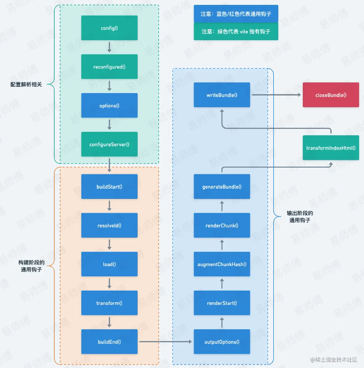
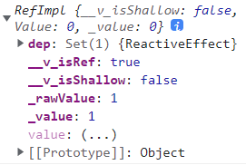
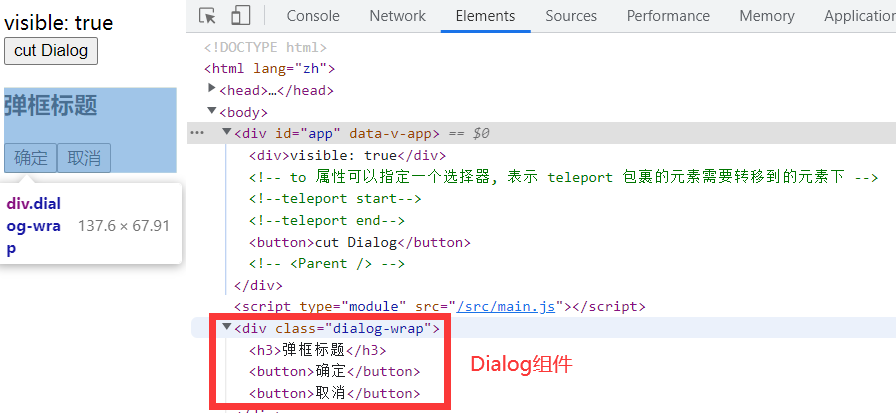

:::v-pre

# Vue3

- [官网](https://v3.cn.vuejs.org/)
- [中文官网(new)](https://staging-cn.vuejs.org/)
- [Vue2迁移指南](https://v3.cn.vuejs.org/guide/migration/introduction.html#%E4%BB%8B%E7%BB%8D)


[[toc]]

## vite

[Vite](https://vitejs.cn/)是一种新型前端构建工具，能够显著提升前端开发体验。它主要由两部分组成: 

- 一个开发服务器，它基于 [原生 ES 模块](https://developer.mozilla.org/en-US/docs/Web/JavaScript/Guide/Modules) 提供了 [丰富的内建功能](https://vitejs.cn/guide/features.html)，如速度快到惊人的 [模块热更新（HMR）](https://vitejs.cn/guide/features.html#hot-module-replacement)
- 一套构建指令，它使用 [Rollup](https://rollupjs.org/) 打包你的代码，并且它是预配置的，可输出用于生产环境的高度优化过的静态资源

Vite 意在提供开箱即用的配置，同时它的 [插件 API](https://vitejs.cn/guide/api-plugin.html) 和 [JavaScript API](https://vitejs.cn/guide/api-javascript.html) 带来了高度的可扩展性，并有完整的类型支持

### 构建项目

### 创建vite项目

使用 NPM:

```sh
npm create vite@latest projectName
```

使用 Yarn:

```sh
yarn create vite projectName
```

使用 PNPM:

```sh
pnpm create vite projectName
```

按照提示选择框架, 然后安装依赖并运行项目

```sh
cd projectName  # 进入工程项目文件夹
npm install     # 安装项目依赖
npm run dev     # 运行项目
```

Vite 配置

`Vite`的配置文件叫`vite.config.js`同之前一样也是要配置到[项目根目录](https://cn.vitejs.dev/guide/#index-html-and-project-root)下

```js
// vite.config.js
export default {
  // 配置选项
}
```

注意: 即使项目没有在 `package.json` 中开启 `type: "module"`，`Vite`也支持在配置文件中使用**ESM 语法**, 这种情况下，配置文件会在被加载前自动进行预处理

你可以显式地通过 `--config` 命令行选项指定一个配置文件（相对于 `cwd` 路径进行解析）

```sh
vite --config my-config.js
```

注意: Vite 会在 **CommonJS** 和 **TypeScript** 配置文件中替换 `__filename`，`__dirname` 以及 `import.meta.url`。如果使用这些名称作为变量名可能会导致代码报错: 

```js
const __filename = "value"
// 将转化为
const "path/vite.config.js" = "value"
```

#### 配置智能提示

因为 Vite 本身附带 Typescript 类型，所以可以通过 IDE 和 jsdoc 的配合来实现智能提示: 

```js
/**
 * @type {import('vite').UserConfig}
 */
const config = {
    // 这里面编写配置项会获得类型提示
}

export default config
```

另外可以使用 `defineConfig` 工具函数，这样不用 jsdoc 注解也可以获取类型提示:

```js
import { defineConfig } from "vite";

export default defineConfig({
  // ...
})
```

> Vite 也直接支持 TS 配置文件。你可以在 `vite.config.ts` 中使用 `defineConfig` 工具函数

#### 简单配置 vite 

在 Vue3 中不自带`@`(**/src**)地址别名, 需手动配置

```ts
import { defineConfig } from "vite";
import vue from "@vitejs/plugin-vue";

import { resolve } from "path";
import { fileURLToPath } from "url";

const __dirname = fileURLToPath(new URL(".", import.meta.url));

export default defineConfig({
	plugins: [vue()],
	resolve: {
		// 设置路径别名
		alias: {
			"@": resolve(__dirname, "./src"),
			"components": resolve(__dirname, "./src/components"),
			"assets": resolve(__dirname, "./src/assets")
		}
		// 也可以写成数组
		// alias: [
		//  { find: /^@$/, replacement: resolve(__dirname, "./src") },
		// ]
	},
	base: "./", // 打包路径
	server: {
    host: true, // 显示多个开发地址
		port: 8080, // 服务端口号
		open: true, // 服务启动时是否自动打开浏览器
		cors: true // 允许跨域
	}
});
```

#### 环境变量

在vite项目中可以通过`import.meta.env`来获取环境变量, 默认的环境变量如下: 

```ts
// import.meta.env

{
    "BASE_URL": "/",
    "MODE": "development", // production
    "DEV": true,
    "PROD": false,
    "SSR": false
}
```

可以在根目录下新建`.env.[模式名]`文件来指定对应模式的环境变量, 例如: `.env.development`则表示在`development`模式下读取该文件的环境变量:

```sh
# 环境变量需要以 VITE_ 开头 (只有以 VITE_ 为前缀的变量才会经过 vite 处理)
VITE_BASE_API="http://localhost/api"
VITE_PUBLIC_PATH = "/"
```

>   vite启动时可以使用`--mode [模式名]`来指定模式

在Typescript项目下还需要在`tsconfig.json`中的`compilerOptions.type`里面配置`vite/client`:

```json
{
	"compilerOptions": {
    // ...
		"types": [
			"vite/client"
		]
	}
}
```

##### 环境变量类型配置

```ts
interface ImportMeta {
  readonly env: ImportMetaEnv;
}

interface ImportMetaEnv {
  readonly VITE_MicroApp_main: string;
  readonly VITE_VOC_CODE: string;
  // ...
}
```


### 集成 vue-router, vuex, pinia

#### 配置 vue-router

`npm install vue-router@4 --save`

[`vue-router4`](https://router.vuejs.org/zh/introduction.html)匹配 Vue3

新建文件`src/modules/router.js`

``` js
import { createRouter, createWebHashHistory } from 'vue-router';

const router = createRouter({
    history: createWebHashHistory(), // 或者 createWebHistory
    routes: [
        {
            path: '/home',
            name: 'Home',
            // 异步路由 + 分块
            component: () => import(/* webpackChunkName: "Home" */ '@/pages/Home.vue')
        },
        {
            path: '/about',
            name: 'About',
            component: () => import('@/pages/About.vue')
        },
        {
            path: '/',
            redirect: { name: 'Home' }
        },
    ]
})

export default router
```

`main.js`添加路由

```js
import { createApp } from 'vue';
import App from './App.vue';
import router from '@/modules/router.js';

const app = createApp(App);
// 添加 router
app.use(router);
app.mount('#app');
```

页面使用路由

```js
<script setup>
import { useRoute, useRouter } from "vue-router";
// 等价于 this.$router
const router = useRouter();
// 等价于 this.$route
const route = useRoute();
</script>
```

#### 配置 Vuex

`npm install vuex@next --save`

[`Vuex4`](https://vuex.vuejs.org/zh/)匹配 Vue3

新建文件`src/modules/store.js`

```js
import { createStore } from 'vuex'

const defaultState = {
    count: 1
}

export default createStore({
    // state() { // 也可以是一个函数
    //     return defaultState
    // },
    state: defaultState,
    actions: {
        INCREMENT(context) {
            context.commit('increment')
        }
    },
    mutations: {
        increment(state) {
            state.count += 1
        }
    },
    getters: {
        double(state) {
            return 2 * state.count
        }
    }
})
```

`main.js`添加 Vuex

```js
import { createApp } from 'vue';
import App from './App.vue';
import store from '@/modules/store.js';

const app = createApp(App);
// 添加 Vuex
app.use(store);
app.mount('#app');
```

#### 使用[组合式API](https://vuex.vuejs.org/zh/guide/composition-api.html)

可以通过调用 `useStore` 函数，来在 `setup` 钩子函数中访问 store。这与在组件中使用选项式 API 访问 `this.$store` 是等效的

##### 访问 Mutation 和 Action

要使用 mutation 和 action 时，只需要在 `setup` 钩子函数中调用 `commit` 和 `dispatch` 函数。

`<script setup>`

```js
<script setup>
import { useStore } from "vuex";
const store = useStore();

console.log(store.state.count); // => 1

// 使用 active
store.dispatch("INCREMENT");

console.log(store.state.count); // => 2

// 使用 mutation
store.commit("increment");

console.log(store.state.count); // => 3
</script>
```

`setup`

```js
import { useStore } from 'vuex'

export default {
  setup () {
    const store = useStore()

    return {
      // 使用 mutation
      increment: () => store.commit('increment'),

      // 使用 action
      asyncIncrement: () => store.dispatch('INCREMENT')
    }
  }
}
```

##### 访问 State 和 Getter

为了访问 state 和 getter，需要创建 `computed` 引用以保留响应性，这与在选项式 API 中创建计算属性等效。

`<script setup>`

```js
<script setup>
import { computed } from "vue";
import { useStore } from "vuex";
const store = useStore();

// 在 computed 函数中访问 state
const count = computed(() => store.state.count);

// 在 computed 函数中访问 getter
const double = computed(() => store.getters.double);
</script>
```

`setup`

```js
import { computed } from 'vue'
import { useStore } from 'vuex'

export default {
  setup () {
    const store = useStore()

    return {
      // 在 computed 函数中访问 state
      count: computed(() => store.state.count),

      // 在 computed 函数中访问 getter
      double: computed(() => store.getters.double)
    }
  }
}
```

#### 配置 Pinia

`npm install pinia --save`

新建文件`src/modules/pinia.js`(**创建pinia**)

```js
import { createPinia } from 'pinia';

const pinia = createPinia();

export default pinia;
```

> 更多配置可以查看官网[pinia](https://pinia.vuejs.org/)

`main.js`添加 `pinia`

```js
import { createApp } from 'vue';
import App from './App.vue';
import pinia from '@/modules/pinia.js';

const app = createApp(App);
// 添加 pinia
app.use(pinia);
app.mount('#app');
```

新建文件`src/stores/count.js`(**创建状态文件)**

```js
import { defineStore } from "pinia";

interface stateType {
	count: number;
};

export const useCountStore = defineStore("countStore", {
    // 显示的指定类型
    state: (): stateType => {
        return {
            count: 1,
          
            // 声明单个值的类型
            history: [] as Array<historyType>,
            len: 0 as number,
        }
    },
    actions: {
        increment() {
            this.count++
        }
    }
})
```

页面使用

```js
<script setup>
import { useCountStore } from "@/stores/count.js";

const countStore = useCountStore();

// 直接使用, 不需要 .stae.count
console.log(countStore.count); // => 1
// 也不需要 .actions.increment()
countStore.increment()
console.log(countStore.count); // => 2
</script>
```

### 自动按需引入组件

可以使用[`unplugin-vue-components`](https://www.npmjs.com/package/unplugin-vue-components)插件来完成

安装: `npm install unplugin-vue-components --save-dev`

```js
// vite.config.js
import { defineConfig } from 'vite';
import Components from 'unplugin-vue-components/vite'

export default defineConfig({
  // 添加 unplugin-vue-components 插件即可
  plugins: [
    Components(),
  ],
})
```

这样就可以实现自动按需引入组件了

#### 按需引入组件库组件

`unplugin-vue-components`插件同样可以自动按需引入组件库的组件, 该插件提供了一些组件库的解析器:

```js
// vite.config.js
import { defineConfig } from 'vite';
import Components from 'unplugin-vue-components/vite';
import {
    ElementPlusResolver,
    AntDesignVueResolver,
    NaiveUiResolver,
    VantResolver
} from 'unplugin-vue-components/resolvers';


export default defineConfig({
    plugins: [
        Components({
            resolvers: [
                // 按需引入 element-plus
                ElementPlusResolver(),
                // 按需引入 ant-design-vue3.x
                AntDesignVueResolver(),
                // 按需引入 naive UI
                NaiveUiResolver(),
                // 按需引入 vant
                VantResolver
            ]
        }),
    ]
})
```

### 自动按需引入API

可以使用[`unplugin-auto-import`](https://www.npmjs.com/package/unplugin-auto-import)插件来完成

```js
// vite.config.js

import { defineConfig } from 'vite';
import AutoImport from 'unplugin-auto-import/vite';

import { ElementPlusResolver } from 'unplugin-vue-components/resolvers';


export default defineConfig({
    plugins: [
        AutoImport({
            // 预设自动引入的 API
            // 更多预设可见 https://github.com/antfu/unplugin-auto-import/tree/main/src/presets
            imports: ['vue','vue-router','pinia'] // vuex 和 piain 不能同时出现在这里
            
            // element-plus 可以同时放到这里来(按需引入API)
            resolvers: [ ElementPlusResolver() ]
        }),
    ],
})
```

使用插件前

```js
import { computed, ref } from 'vue'
const count = ref(0);
const doubled = computed(() => count.value * 2);
```

使用插件后(**自动引入API**)

```js
const count = ref(0);
const doubled = computed(() => count.value * 2);
```
> 项目中自定义的模块还是需要引入的才可以使用, `unplugin-auto-import`只针对于第三方库

### 自动引入文件路由

日常开发中没新建一个路由文件, 就需要修改一下路由表, 使用`vite-plugin-pages`插件即可实现自动引入文件路由

```sh
npm install -D vite-plugin-pages
npm install vue-router
```

添加插件

```js
// vite.config.js

import { defineConfig } from 'vite';
import Pages from 'vite-plugin-pages'

export default defineConfig({
    plugins: [
        Pages({
            dirs: 'src/pages', // 扫描那个文件夹
        }),
    ],
})
```

修改路由表

```js
// src/modules/router.js

import { createRouter } from 'vue-router'
import routes from '~pages'

const router = createRouter({
  // ...
  routes,
})

console.log(routes); // 所有的路由信息

// 也可以添加参数
routes[0].mate = { name: 123 }

// 添加路由守卫
router.afterEach((to, form) => {
    console.log('afterEach', to, form);
});


export default router;
```

可以通过`<route>` 块添加对应的元数据

需要安装`npm install @vue/compiler-sfc --save`

```js
// src/pages/Home.vue

<script setup>
import { toRaw } from "vue";
import { useRoute } from "vue-router";
const route = toRaw(useRoute());
console.log(route.meta);
console.log(route.params);
console.log(route.query);
</script>


<route>
{
  name: "home",
  meta: {
    requiresAuth: false
  }
}
</route>
```

添加`query`参数, 路径拼接即可

```js
// 在跳转路径时添加即可
<router-link to="/about?id=1&title=query">about</router-link>


// 对应的路由获取到的 query 对象
{
    id: 1,
    title: "query"
}
```

添加`params`参数需要在组件文件名上添加, 例如: 

`src/pages/about/[id]/[title].vue` --> `/about/:id/:title` 

```js
// 在跳转路径时正常添加参数
<router-link to="/about/2/params">about</router-link>


// 对应的路由获取到的 params 对象
{
    id: 2,
    title: "params"
}
```

### 开发vite插件

vite的[插件](https://cn.vitejs.dev/guide/api-plugin.html#plugin-api)就是一个函数, 这个函数返回一个对象, 这个对象里面可以定义一些属性或者**Hooks**, 如下所示: 

```ts
import type { PluginOption } from "vite";

// https://cn.vitejs.dev/guide/api-plugin.html
export default () => {
  const option: PluginOption = {
		// 插件名称
		name: "vite-plugin-hello",

    // pre: 在 Vite 核心插件之前调用该插件
    // 默认: 在 Vite 核心插件之后调用该插件
    // post: 在 Vite 构建插件之后调用该插件
		enforce: "pre", // post

		// 指明它们仅在 "build" 或 "serve" 模式时调用
    // 默认情况下插件在开发 (serve) 和生产 (build) 模式中都会调用
		// apply: "build",

    // 在解析 Vite 配置前调用
		config(config, { command }) {
			console.log("config");
		},

    // 在解析 Vite 配置后调用
		configResolved(resolvedConfig) {
			console.log("configResolved");
		},

    // 用于配置开发服务器的钩子
		configureServer(server) {
			console.log("configureServer");
		},

    // 转换 index.html 的专用钩子
		transformIndexHtml(html) {
			console.log("transformIndexHtml");
		},

    // 每个传入模块请求时被调用
    transform(src, id) {
      // id 为文件路径
      // src 为文件字符串
      console.log("transform");
      return {
        code: src,
        map: null, // 如果可行将提供 source map
      }
    }
	}

	return option;
};
```

#### vite 独有的钩子

| 参数                             | 解释                                                         |
| -------------------------------- | ------------------------------------------------------------ |
| `name`                           | 插件名称                                                     |
| `enforce`                        | 值可以是`pre` 或 `post`, `pre` 会较于 `post`(默认)先执行     |
| `config(config, env)`            | 可以在 vite 被解析之前修改 vite 的相关配置。钩子接收原始用户配置 `config` 和一个描述配置环境的变量env |
| `configResolved(resolvedConfig)` | 在解析 vite 配置后调用。使用这个钩子读取和存储最终解析的配置。当插件需要根据运行的命令做一些不同的事情时，它很有用 |
| `configureServer(server)`        | 主要用来配置开发服务器，为 dev-server (connect 应用程序) 添加自定义的中间件 |
| `transformIndexHtml(html)`       | 转换 `index.html` 的专用钩子, 钩子接收当前的 HTML 字符串和转换上下文 |
| `handleHotUpdate(ctx)`           | 执行自定义HMR更新，可以通过ws往客户端发送自定义的事件        |

#### vite 与 rollup 的通用钩子之构建阶段


| hooks                                  | 解释                                                         |
| -------------------------------------- | ------------------------------------------------------------ |
| `options(options)`                     | 在服务器启动时被调用：获取、操纵Rollup选项，严格意义上来讲，它执行于属于构建阶段之前； |
| `buildStart(options)`                  | 在每次开始构建时调用                                         |
| `resolveId(source, importer, options)` | 在每个传入模块请求时被调用，创建自定义确认函数，可以用来定位第三方依赖 |
| `load(id)`                             | 在每个传入模块请求时被调用，可以自定义加载器，可用来返回自定义的内容 |
| `transform(code, id)`                  | 在每个传入模块请求时被调用，主要是用来转换单个模块           |
| `buildEnd(error?: Error)`              | 在构建阶段结束后被调用，此处构建结束只是代表所有模块转义完成 |

#### vite 与 rollup 的通用钩子之输出阶段

| hooks                                      | 解释                                                         |
| ------------------------------------------ | ------------------------------------------------------------ |
| `outputOptions(options)`                   | 接受输出参数                                                 |
| `renderStart(outputOptions, inputOptions)` | 每次 `bundle.generate` 和 `bundle.write` 调用时都会被触发    |
| `augmentChunkHash(chunkInfo)`              | 用来给 `chunk` 增加 `hash`                                   |
| `renderChunk(code, chunk, options)`        | 转译单个的`chunk`时触发。rollup 输出每一个chunk文件的时候都会调用 |
| `generateBundle(options, bundle, isWrite)` | 在调用 `bundle.write` 之前立即触发这个 hook                  |
| `writeBundle(options, bundle)`             | 在调用 `bundle.write`后，所有的`chunk`都写入文件后，最后会调用一次 `writeBundle` |
| `closeBundle()`                            | 在服务器关闭时被调用                                         |

#### hook调用顺序图

 

## 全局API

### createApp

在 Vue2 中创建 Vue 实例, 需要`new Vue`

```ts
import Vue from "vue";
import App from "./App";

new Vue({
  render: h => h(App)
}).$mount("#app");
```

在 Vue3 中通过调用`createApp`方法返回一个 Vue 实例

```ts
import { createApp } from "vue";
import App from "./App.vue";
import "./index.css";

createApp(App).mount("#app");
```

在 Vue3 中 **[全局API](https://v3.cn.vuejs.org/guide/migration/global-api.html#%E5%85%A8%E5%B1%80-api)** 现在都移动到应用实例上app上, 以下是当前全局 API 及其相应实例 API 的表: 

| 2.x 全局 API               | 3.x 实例 API               |
| -------------------------- | -------------------------- |
| Vue.config                 | app.config                 |
| Vue.config.productionTip   | 已移除                     |
| Vue.config.ignoredElements | app.config.isCustomElement |
| Vue.component              | app.component              |
| Vue.directive              | app.directive              |
| Vue.mixin                  | app.mixin                  |
| Vue.use                    | app.use                    |

## Fragment

在 Vue2 中组件的根目录必须要使用一个根元素包裹, 但是在 Vue3 中可以不需要一个根目录

```vue
<template>
  
  <HelloWorld msg="Hello Vue 3.0 + Vite" />
</template>
```

实际上内部会将多个标签包含在一个`Fraagment`虚拟元素中, 减少了很多没有意义的**div**, 对实现**tree**组件有很大帮助

## v-model 更改

以下是对变化的总体概述: 

- 非兼容: [`v-model`](https://v3.cn.vuejs.org/guide/migration/v-model.html#v-model)用于自定义组件时, **prop** 和`事件默认名称`已更改: 

	- **prop**: `value`->`modelValue`
	- 事件: `input`->`update:modelValue`
	
- **非兼容**: `v-bind`的`.sync`修饰符和组件的`model`选项已移除，可在`v-model`上加一个参数代替, 如: `v-modle:visible="xxx"`

- **新增**: 现在可以在同一个组件上使用多个`v-model`绑定；

- **新增**: 现在可以自定义`v-model`修饰符

### 2.x 用法

在组件上使用`v-model`相当于绑定`value`(默认值)prop 并触发`input`事件: 

```js
<ChildComponent v-model="pageTitle" />

<!-- 是以下的简写: -->

<ChildComponent :value="pageTitle" @input="pageTitle = $event" />
```

如果想要更改 prop 或事件名称，则需要在`ChildComponent`组件中添加`model`选项: 

```ts
// ChildComponent.vue

export default {
  model: {
    prop: 'title', // 修改 v-model 绑定的 props 名
    event: 'change' // 修改 v-model 绑定的事件名
  },
  props: {
    // 这将允许 value 属性用于其他用途
    value: String,
    // 使用 title 代替 value 作为 model 的 prop
    title: {
      type: String,
      default: 'Default title'
    }
  }
}
```

这个例子中`v-model`是以下的简写: 

```ts
<ChildComponent :title="pageTitle" @change="pageTitle = $event" />
```

####  使用`v-bind.sync`

在 Vue2 中是这样使用`v-bind.sync`来对一个`prop`实现数据的"双向绑定":

```js
<!-- 父组件中使用 v-bind.sync 绑定需要传递的 prop -->
<ChildComponent :visible.sync="myVisible" />


<!-- 子组件中通过 update:xxx 事件来通知更新 prop -->
this.$emit('update:visible', newVisible);
```

### 3.x 用法

在 Vue3 中, 自定义组件上的`v-model`相当于传递了`modelValue`prop 并接收抛出的`update:modelValue`事件: 

```html
<ChildComponent v-model="pageTitle" />

<!-- 是以下的简写: -->

<ChildComponent
  :modelValue="pageTitle"
  @update:modelValue="pageTitle = $event"
/>
```

#### `v-model`参数

若需要更改`model`的名称, 可以为`v-model`传递一个**参数**，以作为组件内`model`选项的替代: 

```html
<ChildComponent v-model:title="pageTitle" />

<!-- 是以下的简写: -->

<ChildComponent :title="pageTitle" @update:title="pageTitle = $event" />
```

这也可以作为`.sync`修饰符的替代，而且允许我们在自定义组件上使用多个`v-model`

```html
<ChildComponent v-model:title="pageTitle" v-model:visible="pageVisible" />

<!-- 是以下的简写:  -->

<ChildComponent
  :title="pageTitle"
  @update:title="pageTitle = $event"
  :visible="pageVisible"
  @update:visible="pageVisible = $event"
/>
```

#### `v-model`修饰符

除了像`.trim`这样的 2.x 硬编码的`v-model`修饰符外，现在 3.x 还支持自定义修饰符:

```html
<ChildComponent v-model.capitalize="pageTitle" />
```

需要了解更多可以参考 [v-model 处理修饰符](https://v3.cn.vuejs.org/guide/component-custom-events.html#%E5%A4%84%E7%90%86-v-model-%E4%BF%AE%E9%A5%B0%E7%AC%A6)

## 组合式API

Vue3 提出了[`组合式(Composition)API`](https://v3.cn.vuejs.org/guide/composition-api-introduction.html), 在 Vue2 中使用的`选项式(Option)API`里面有`data`,`computed`,`methds`,`watch`等

在 Vue3 中, 依然可以使用`Option API`但是不建议和 Vue3 混用

在`Vue2`中, 实现一个功能得分到不同的地方，把数据放在`data`,`computed`中, 把方法放在`methods`里面，分开的太散乱了，几个功能还好，几十个上百个，那就不好维护, 代码也不直观

所以 Vue3 提出了`Composition API`, 它可以把`一个逻辑的代码都收集在一起`单独写个`hook`, 然后再引入，这样相关的代码逻辑就不会到处分布了

### script差异

```vue
<!-- 可以在 script 使用 ts 只需 设置 lang 即可 -->
<script lang="ts">

// defineComponent 方法创建一个组件
import { defineComponent } from "vue";

// export default 导出一个组件
export default defineComponent({
  name: "App",
  setup() {
    return {
      // 这里的属性 和 方法 会合并到 data函数 和 methods对象 里
    }
  },
})
</script>
```

## 响应式 API

[响应式基础](https://v3.cn.vuejs.org/guide/reactivity-fundamentals.html#%E5%93%8D%E5%BA%94%E6%80%A7%E5%9F%BA%E7%A1%80)

### 响应式基础API

[响应式基础API](https://v3.cn.vuejs.org/api/basic-reactivity.html)

#### reactive

返回对象的响应式副本

[`reactive`](https://v3.cn.vuejs.org/api/basic-reactivity.html#reactive)响应式转换是“深层”的, 它影响所有嵌套的属性; 在基于 [ES2015 Proxy](https://developer.mozilla.org/zh-CN/docs/Web/JavaScript/Reference/Global_Objects/Proxy) 的实现中，返回的 proxy 是**不等于原始对象的**; 建议只使用返回的响应式 proxy, 避免依赖原始对象

```vue
<template>
  <div>{{ state.count }}</div>
  <button @click="state.count++">点我加1</button>
</template>

<script lang="ts">
import { defineComponent, reactive } from "vue";
export default defineComponent({
  name: "App",
  setup() {
    const state = reactive({
      count: 0
    })
    // 对引用数据类型不需要访问其 .value 属性
    state.count++;
    console.log(state); // => Proxy {count: 1}
    return { state };
  },
});
</script>
```

**ts类型声明: **

```ts
function reactive<T extends object>(target: T): UnwrapNestedRefs<T>
```

`reactive`将解包所有深层的 refs，同时维持 ref 的响应性

```ts
import { ref, reactive } from "vue";

const count = ref(1);
// 将 ref 对象再使用 reactive 转换为响应式
const obj = reactive({ count });

// ref 会被解包
console.log(obj.count === count.value); // true

// 它会更新 obj.count 的值
count.value++;
console.log(count.value); // 2
console.log(obj.count); // 2

// 它也会更新 count的值(ref)
obj.count++;
console.log(obj.count); // 3
console.log(count.value); // 3
```

当将 `ref` 分配给`reactive`的属性时，`ref` 将被自动解包

```ts
import { ref, reactive } from "vue";

const count = ref(1);
const obj = reactive({ count: null });

obj.count = count;
obj.count++;

console.log(obj.count); // => 2
console.log(obj.count === count.value); // => true
```

#### readonly

同`reactive`一样, 只不过是有只读的特性

#### isProxy

检查对象是否是由`reactive`或`readonly`创建代理

#### isReactive

检查对象是否是由`reactive`创建的响应式代理

#### isReadonly

检查对象是否是由`readonly`创建的只读代理

#### toRaw

返回`reactive`或`readonly`代理的原始对象, 这是一个“逃生舱”; 可用于临时读取数据而无需承担代理访问/跟踪的开销，也可用于写入数据而避免触发更改; **不建议**保留对原始对象的持久引用, 请谨慎使用

#### markRaw

标记一个对象，使其永远不会转换为 proxy, 返回对象本身

```ts
import { reactive, markRaw } from "vue";

const foo = markRaw({})
console.log(isReactive(reactive(foo))) // false

// 嵌套在其他响应式对象中时也可以使用
const bar = reactive({ foo })
console.log(isReactive(bar.foo)) // false
```

`markRaw`标记的原始选择退出是根级别的, 如果将嵌套在内的、未标记的原始对象添加进响应式对象，然后再次访问该响应式对象，就会得到原始对象被代理后的版本, 这可能导致**同一性风险**, 就是根数据是被`markRaw`标记为不可代理的对象但是其子属性被代理后出现的数据不一致的问题:

```ts
import { reactive, markRaw } from "vue";

const foo = markRaw({
      nested: {},
});
const bar = reactive({
      // 虽然 foo 被标记为原始, 但 foo.nested 不是
      nested: foo.nested,
});
console.log(foo.nested === bar.nested); // false
```

####  shallowReactive

效果同`reactive`不过该响应式代理是"浅"层次的

####  shallowReactive

效果同`reactive`不过该响应式代理是"浅"层次的

```ts
import { shallowReactive, isReactive } from "vue";

const state = shallowReactive({
  foo: 1,
  nested: {
    bar: 2
  }
})

// 改变 state 本身的性质是响应式的
state.foo++
// ...但是不转换嵌套对象
isReactive(state.nested) // false
state.nested.bar++ // 非响应式
```

> 与`reactive`不同，任何使用`ref`的 property 都**不会**被代理自动解包

#### shallowReadonly

效果同`readonly`不过该响应式代理是"浅"层次的, 同样不会自动解包`ref`

### Refs

[Refs](https://v3.cn.vuejs.org/api/refs-api.html)

#### Ref

接受一个基本数据类型的值并返回一个响应式且可变的 [ref 对象](https://v3.cn.vuejs.org/guide/composition-api-introduction.html#%E5%B8%A6-ref-%E7%9A%84%E5%93%8D%E5%BA%94%E5%BC%8F%E5%8F%98%E9%87%8F), ref 对象仅有一个`.value`属性, 指向该基本数据类型的值

```ts
import { ref } from 'vue'

const count = ref(1);
console.log(count.value) // 1
count.value++
console.log(count.value) // 2
```

或者使用一个变量也是可以的:

```ts
const count = 1;
const countRef = ref(count);
countRef.value++
console.log(countRef.value); // => 2
```

如下是控制台打印`ref`函数的返回值: 

 

可以看到`ref`函数返回的是一个代理对象, 根据该代理对象的`.value`值去读取值, 但是在模板是不需要`.value`去读取的:

```vue
<template>
  <!-- 在模板中不需要 .value -->
  <div>{{ count }}</div>
  <button @click="count++">点我加1</button>
</template>

<script lang="ts">
import { defineComponent, ref } from "vue";
export default defineComponent({
  name: "App",
  setup() {
    const count = ref(0);
    count.value++;
    console.log(count.value); // => 1
    return { count };
  },
});
</script>
```

将值封装在一个对象中，看似没有必要，但为了保持 JavaScript 中不同数据类型的行为统一，这是必须的。因为在 JavaScript 中，`Number`或`String`等基本类型是通过值而非引用传递的: 

 

在任何值周围都有一个封装对象，这样我们就可以在整个应用中安全地传递它，而不必担心在某个地方失去它的响应性

> 换句话说,`ref`为我们的值创建了一个**响应式引用**, 在整个组合式 API 中会经常使用**引用**的概念

> 如果将对象分配为 ref函数 则它将被 [reactive](https://v3.cn.vuejs.org/api/basic-reactivity.html#reactive) 函数处理为深层的响应式对象

#### unref

如果参数是一个`ref`，则返回内部值，否则返回参数本身; 这是`val = isRef(val) ? val.value : val`的语法糖函数

#### toRef

为源响应式对象上的某个属性新创建一个`ref`, 该`ref`可以被传递, 它会保持对其源 property 的响应式连接

```ts
import { reactive, toRef } from "vue";

const state = reactive({
      foo: 1,
      bar: 2,
});

const fooRef = toRef(state, "foo");

// 会影响 state.foo 的值
fooRef.value++;
console.log(state.foo); // 2

// 会影响 fooRef 的值(ref)
state.foo++;
console.log(fooRef.value); // 3
```

#### toRefs

[toRefs](https://v3.cn.vuejs.org/api/refs-api.html#torefs) 将响应式对象转换为普通对象，其中结果对象的每个属性都是指向原始对象相应属性的[`ref`](https://v3.cn.vuejs.org/api/refs-api.html#ref)

```js
import {  reactive, toRefs } from "vue";
const state = reactive({
  foo: 1,
  bar: 2,
});
// 相当于将 state 里的每个属性都变成 ref 并且放到返回的这个新对象中
const stateAsRefs = toRefs(state);
console.log(stateAsRefs.foo.value); // => 1
console.log(stateAsRefs.bar.value); // => 2
```

从 `setup` 函数返回需要**解构的响应式对象**或者从合成函数返回响应式对象时**toRefs**非常有用, 这样消费组件就可以在不丢失响应式的情况下对返回的对象进行解构/展开: 

**从 setup 函数返回需要解构的响应式对象**

```vue
<template>
  <p>姓名: {{ state.name }}</p>
  <p>年龄: {{ state.age }}</p>
  <p>性别: {{ state.gender }}</p>
  <button @click="state.age++">年龄增加</button>
</template>

<script lang="ts">
import { defineComponent, reactive } from "vue";
export default defineComponent({
  name: "App",
  setup() {
    const state = reactive({
      name: "张三",
      age: 18,
      gender: "男",
    });
    return { state };
  },
});
</script>
```

上面的代码是可以正常运行的就是在模板中必须`state.xxx`访问响应式对象里的数据不是很方便, 这是我们可以使用 ES6 中的对象解构方法在**setup函数**返回响应式对象时将里面的响应式数据解构出来并返回, 如下: 

```js
setup() {
    const state = reactive({
      name: "张三",
      age: 18,
      gender: "男",
    });
    return { 
        // 将响应式对象解构
        ...state // => name: "张三",
                 // => age: 18,
                 // => gender: "男",
    };
}
```

这样在模板中就可以直接使用对应的响应式数据了

```vue
<p>姓名: {{ name }}</p>
<p>年龄: {{ age }}</p>
<p>性别: {{ gender }}</p>
<button @click="age++">年龄增加</button>
```

数据展示没有问题但是当点击年龄增加按钮时发现数据的**响应式丢失**, 其实解构响应式对象是会丢失其响应式的: 

```js
import { reactive } from "vue";    
const state = reactive({
      name: "张三",
});

// 这里解构对象的时候响应式数据就丢失了
const newState = { ...state };
state.name = "李四";

console.log(state.name); // => 李四
console.log(newState.name); // => 张三
console.log(state); // => Proxy {name: '李四'}
console.log(newState); // => {name: '张三'}
```

使用**toRefs函数**就可以解决上面的问题:

```js
const state = reactive({
      name: "张三",
});
const newState = { ...toRefs(state) };
state.name = "李四";
console.log(state.name); // => 李四
console.log(newState.name.value); // => 李四
console.log(state); // => Proxy {name: '李四'}
// 里面的每个属性都会变成 ref 对象
console.log(newState); // => {name: ObjectRefImpl}
```

可以在**setup函数**或者其他合成函数返回的响应式对象数据时使用**toRefs函数**来将属性都转换为 ref 再进行解构就不会丢失响应式了, 如下: 

```vue
<template>
  <p>姓名: {{ name }}</p>
  <p>年龄: {{ age }}</p>
  <p>性别: {{ gender }}</p>
  <button @click="age++">年龄增加</button>
</template>

<script lang="ts">
import { defineComponent, reactive, toRefs } from "vue";
export default defineComponent({
  name: "App",
  setup() {
    const state = reactive({
      name: "张三",
      age: 18,
      gender: "男",
    });
    // 这里使用 toRefs函数 转换成 ref 后再进行解构
    return { ...toRefs(state) };
  },
});
</script>
```

#### isRef

检查值是否为一个 ref 对象

### Computed 与 watch

[Computed 与 watch](https://v3.cn.vuejs.org/api/computed-watch-api.html)

#### computed

传入一个 getter 函数，**返回一个默认不可手动修改的 ref 对象**

```ts
import { ref, computed } from "vue";
const count = ref(1);
const plusOne = computed(() => count.value + 1);

console.log(plusOne.value); // => 2

plusOne.value++; // Errir 没有 setter
```

接受一个具有`get`和`set`函数的对象，用来创建可写的 ref 对象

```ts
const count = ref(1);
const plusOne = computed({
  get: () => count.value,
  set: newVal => count.value = newVal
});

console.log(plusOne.value); // => 1

plusOne.value = 10;
console.log(plusOne.value); // => 10
```

**类型声明: **

```ts
// 只读的
function computed<T>(
  getter: () => T,
  debuggerOptions?: DebuggerOptions
): Readonly<Ref<Readonly<T>>>

// 可写的
function computed<T>(
  options: {
    get: () => T
    set: (value: T) => void
  },
  debuggerOptions?: DebuggerOptions
): Ref<T>
interface DebuggerOptions {
  onTrack?: (event: DebuggerEvent) => void
  onTrigger?: (event: DebuggerEvent) => void
}
interface DebuggerEvent {
  effect: ReactiveEffect
  target: any
  type: OperationTypes
  key: string | symbol | undefined
}
```

#### watchEffect

[watchEffect](https://v3.cn.vuejs.org/guide/reactivity-computed-watchers.html#watcheffect) 立即执行传入的一个函数，同时响应式追踪其依赖，并在其依赖变更时重新运行该函数

```ts
import { ref, watchEffect } from "vue";

const count = ref(1);
const foo = ref(2);

const countEffect = () => {
  console.log("countEffect");
  console.log(count.value);
};

watchEffect(() => {
  // 一开始就会执行一次副作用函数, 然后会自动追踪该副作用函数使用到的依赖
  // 当依赖改变时自动执行该副作用函数, 相当于高级自动版 watch
  countEffect();
  console.log(foo.value);
});

setTimeout(() => {
  count.value = 10; // 依赖变更会自动执行 countEffect函数 和 打印 foo.value
}, 500);
```

##### 停止侦听

当`watchEffect`在组件的`setup函数`或`生命周期钩子`被调用时, 侦听器会被链接到该组件的生命周期，并在组件卸载时自动停止

在一些情况下, 也可以显式调用返回值以停止侦听: 

```ts
// 会返回一个函数
const stop = watchEffect(() => {
  /* ... */
})

// 调用返回的函数可以停止侦听
stop();
```

##### 清除副作用

有时副作用函数会执行一些异步的副作用，这些响应需要在其失效时清除 (即完成之前状态已改变了) 。所以侦听副作用传入的函数可以接收一个`onInvalidate`函数作入参，用来注册清理失效时的回调。当以下情况发生时，这个失效回调会被触发: 

- 副作用即将重新执行时
- 侦听器被停止 (如果在`setup()`或生命周期钩子函数中使用了`watchEffect`，则在组件卸载时)

**文本框防抖案例**

```vue
<template>
  <div>
    <input type="text" v-model="keyword" />
  </div>
</template>

<script>
import { ref, watchEffect } from "vue";

export default {
  setup() {
    const keyword = ref("");

    // 异步操作
    const asyncPrint = (val) => {
      return setTimeout(() => {
        console.log("文本框的内容为: ", val);
      }, 500);
    };

    watchEffect(
      (onInvalidate) => {
        // 用户输入的时间间隔小于0.5秒, 都会立刻清除掉异步操作的定时器
        // 大于 0.5秒 才会打印出文本框的值(防抖)
        const timer = asyncPrint(keyword.value);
        onInvalidate(() => clearTimeout(timer));
      },
    );

    return {
      keyword,
    };
  },
};
</script>
```

##### 副作用刷新时机

Vue 的响应性系统会缓存副作用函数，并异步地刷新它们，这样可以避免同一个“tick” 中多个状态改变导致的不必要的重复调用。在核心的具体实现中，组件的`update`函数也是一个被侦听的副作用。当一个用户定义的副作用函数进入队列时，默认情况下，会在所有的组件`update`**前**执行

```ts
<template>
  <div>{{ count }}</div>
  <button @click="count++">点我加1</button>
</template>

<script lang="ts">
import { defineComponent, ref, watchEffect, onUpdated } from "vue";

export default defineComponent({
  setup() {
    const count = ref(0);

    watchEffect(() => {
      console.log(count.value);
    });

    // onUpdated 就是 Vue2 中的 update 生命周期
    onUpdated(() => {
      console.log('onUpdated');
    });

    return { count };
  },
});
</script>
```

在上面的例子中: 

-   `count`会在初始运行时同步打印出来

- 更改`count`时, 将在组件**更新前**执行副作用

如果需要在组件更新(例如: 当与[模板引用](https://v3.cn.vuejs.org/guide/composition-api-template-refs.html#侦听模板引用)一起)**后**重新运行侦听器副作用, 可以传递带有`flush`选项的附加`options`对象: 

```ts
// 在组件更新后触发，这样你就可以访问更新的 DOM
// 注意: 这也将推迟副作用的初始运行, 直到组件的首次渲染完成
watchEffect(
  () => {
    // 操作DOM
  },
  {
    flush: 'post'
  }
)
```

`pre`: 选项(**默认值**)来定义, `watch`和`watchEffect`在 DOM 挂载或更新之前运行副作用, 所以当侦听器运行时, 模板引用还未被更新

`post`: 选项来定义, 将在 DOM 更新后运行副作用，确保模板引用与 DOM 保持同步，并引用正确的元素

`sync`: 选项将强制效果始终同步触发, 然而，这是低效的，应该很少需要

> watchEffect 在开发模式下还可以进行[侦听器调试](https://v3.cn.vuejs.org/guide/reactivity-computed-watchers.html#%E4%BE%A6%E5%90%AC%E5%99%A8%E8%B0%83%E8%AF%95)

#### watch

`watch`API 完全等效于 2.x`this.$watch`（以及`watch`中相应的选项）,`watch`需要侦听特定的数据源, 并在回调函数中执行副作用; 默认情况下, 它是**惰性的**, 即只有当被侦听的源发生变化时才执行回调

与`watchEffect`比较，`watch`允许我们: 

- 懒执行副作用
- 更具体地说明什么状态应该触发侦听器重新运行
- 访问侦听状态变化前后的值

`watch`接收的第一个参数被称作"数据源", 它可以是: 

- 一个返回任意值的`getter`函数
- 一个包装对象(可以是`ref`或者`reactive`包装的对象)
- 一个包含上述两种数据源的`数组`

第二个参数是回调函数, 回调函数只有当数据源发生变动时才会被触发: 

#####  侦听单个数据源

```ts
import { ref, watch } from "vue";

const state = reactive({ count });
const count = ref(0);


watch(
  // () => state.count, // 侦听一个 reactive
  () => count.value, // 侦听一个 ref
  (newValue, oldValue)=>{
    console.log('newValue: ', newValue);
    console.log('oldValue: ', oldValue);
  }
)
```

##### 侦听多个数据源

侦听器还可以使用数组同时侦听多个源:

```ts
import { ref, watch } from "vue";

const firstName = ref("firstName");
const lastName = ref("lastName");

// 新旧值参数这里也可以是数组跟监听数据源对应 一个侦听源对应一个包含新旧元素数组
watch([firstName, lastName], (newValues, prevValues) => {
  console.log("newValues", newValues, "prevValues", prevValues);
});

setTimeout(() => {
  firstName.value = "张三"; // => ["张三", "lastName"], ["firstName", "lastName"]
    
  setTimeout(() => {
    lastName.value = "李四"; // => ['张三', '李四'], ['张三', 'lastName']
  }, 500);
}, 500);
```

在同一个函数里同时改变这些被侦听的来源, 侦听器仍只会执行一次, 多个同步更改只会触发**一次**侦听器

##### 侦听复杂的嵌套对象

```ts
import { reactive, watch } from "vue";

const state = reactive({
      person: {
        id: 1,
        info: {
          name: "张三",
          age: 18,
          gender: "男",
        },
      },
    });
watch(
  () => state.person,
  (newValue, oldValue) => {
    console.log("newValue:", newValue, "oldValue:", oldValue);
  },
  {
    // immediate: true, // 立即监视
    deep: true, // 深度监视
  }
);

setTimeout(() => {
  state.person.id = 2;
  state.person.info.age = 28;
  // 同步任务执行多次, 只会执行一次
}, 500);
```

`watch`与`watchEffect`共享[停止侦听](https://v3.cn.vuejs.org/guide/reactivity-computed-watchers.html#停止侦听)，[清除副作用](https://v3.cn.vuejs.org/guide/reactivity-computed-watchers.html#清除副作用) (相应地`onInvalidate`会作为回调的第三个参数传入)、[副作用刷新时机](https://v3.cn.vuejs.org/guide/reactivity-computed-watchers.html#副作用刷新时机)和[侦听器调试](https://v3.cn.vuejs.org/guide/reactivity-computed-watchers.html#侦听器调试)行为

**类型声明: **

```ts
function watchEffect(
  effect: (onInvalidate: InvalidateCbRegistrator) => void,
  options?: WatchEffectOptions
): StopHandle

interface WatchEffectOptions {
  flush?: 'pre' | 'post' | 'sync' // 默认: 'pre'
  onTrack?: (event: DebuggerEvent) => void
  onTrigger?: (event: DebuggerEvent) => void
}

interface DebuggerEvent {
  effect: ReactiveEffect
  target: any
  type: OperationTypes
  key: string | symbol | undefined
}

type InvalidateCbRegistrator = (invalidate: () => void) => void

type StopHandle = () => void
```

## setup

[setup函数](https://v3.cn.vuejs.org/guide/composition-api-setup.html#setup)是一个新的组件选项, 作为组件内使用`Composition API`的入口点

### setup 的执行顺序

`setup`会在`beforeCreate`**之前**执行一次, 此时`this`还没有被初始化所以不能通过`this`来 调用方法 和 获取属性

```js
setup() {
    console.log(this); // => undefined
}
```

### setup 的返回值

**`setup`的返回值是一个对象**

返回的这个对象的属性可以直接在模板中使用

```ts
<template>
  <!-- 可以直接使用 setup 返回的数据 -->
  {{ msg }}
</template>

<script lang="ts">
import { defineComponent } from "vue";

export default defineComponent({
  name: "App",
  setup() {
    console.log(this); // => undefined
    const msg: string = "hello";

    // 这里返回的 msg 可以在模板中直接使用
    return { msg };
  },
});
</script>
```

[defineComponent 函数](https://v3.cn.vuejs.org/api/global-api.html#definecomponent) 只返回传递给它的对象, 但是, 就类型而言, 返回的值有一个合成类型的构造函数，用于手动渲染函数、TSX 和 IDE 工具支持

**和`options`一起使用时(不推荐)**

这个返回的对象会与组件中的`data`函数返回的对象进行**合并**, 返回的方法会与`methods`中的方法进行**合并**, 合并之后直接可以在模板中使用，如果有重名的情况，会优先使用`setup`返回的**属性**和**方法**，`methods`和`data`能够拿到`setup`中的返回的数据和方法，反之`setup`**不能**拿到它们的属性和方法，因为在`setup`中`this`是`undefined`

```vue
<template>
  <!-- 可以直接使用 setup 返回的数据 -->
  {{ msg }}
</template>

<script lang="ts">
import { defineComponent } from "vue";

export default defineComponent({
  name: "App",
  data() {
    return {
      // 这里可以读取到 setup 返回的数据
      dataMsg: this.msg,
    };
  },
  mounted() {
    console.log("mounted: ", this.dataMsg); // => mounted: hello 
  },

  setup() {
    console.log(this); // => undefined
    const msg: string = "hello";

    // 这里返回的 msg 可以在模板中直接使用
    return { msg };
  },
});
</script>
```

**`setup`的返回值是一个函数**

该函数会作为组件的`render`函数

```js
<script>
import { ref, h } from "vue";
export default {
  setup() {
    let count = ref(0);
    return () => {
      return h(
        "button",
        {
          onClick: () => count.value++,
        },
        `count is ${count.value}`
      );
    };
  },
};
</script>
```

### Suspense 组件

如果我们需要使用`async`去修饰`setup`返回的数据, 这样会返回`promise`是我们不想看见情况，如果我们必须使用`async`修饰，就得在用它的父组件外层嵌套一个[`<suspense>`](https://staging-cn.vuejs.org/guide/built-ins/suspense.html)内置组件，里面放置一些不确定的操作，比如可以把异步组件放进去, 如下: 

**子组件**

```vue
<template>
  Child: {{ res }}
</template>


<script lang="ts">
import { defineComponent } from "vue";

export default defineComponent({
  name: "Child",
  async setup() {
    // 模拟请求函数, 2秒后返回结果
    const asyncFn = () => {
      return new Promise((resolve, reject) => {
        setTimeout(() => {
          resolve("await + async + setup");
        }, 2000);
      });
    };

    const res = await asyncFn();
    return { res };
  },
});
</script>
```

**父组件**

```vue
<template>
  <Suspense>
    <!-- 异步子组件 -->
    <Child />

    <!-- 在 #fallback 插槽中显示 “正在加载中” -->
    <template #fallback> Loading... </template>
  </Suspense>
</template>

<script lang="ts">
import { defineComponent } from "vue";
import Child from "./Child.vue";

export default defineComponent({
  name: "Parent",
  components: { Child }
});
</script>
```

#### Suspense 插槽

`<Suspense>`组件有[两个插槽](https://staging-cn.vuejs.org/guide/built-ins/suspense.html#loading-state): `#default`和`#fallback`, 两个插槽都只允许**一个**直接子节点; 在可能的时候都将显示默认槽(**default**)中的节点, 否则将显示后备槽(**fallback**)中的节点

在初始渲染时，`<Suspense>`将在内存中渲染其默认的插槽内容。如果在这个过程中遇到任何异步依赖，则会进入**挂起**状态。在挂起状态期间，展示的是后备内容。当所有遇到的异步依赖都完成后，`<Suspense>`会进入**完成**状态，并将展示出默认插槽的内容。

如果在初次渲染时没有遇到异步依赖，`<Suspense>`会直接进入完成状态。

进入完成状态后，只有当默认插槽的根节点被替换时，`<Suspense>`才会回到挂起状态。组件树中新的更深层次的异步依赖**不会**造成`<Suspense>`回退到挂起状态。

发生回退时，后备内容不会立即展示出来。相反，`<Suspense>`在等待新内容和异步依赖完成时，会展示之前`#default`插槽的内容。这个行为可以通过一个`timeout`prop 进行配置: 在等待渲染新内容耗时超过`timeout`之后，`<Suspense>`将会切换为展示后备内容。若`timeout`值为`0`将导致在替换默认内容时立即显示后备内容。

#### Suspense 事件

除了 **pending** 事件之外，`<suspense>`组件还有 **resolve** 和 **fallback** 事件; **pending** 事件是在进入挂起状态时触发; **resolve事件** 是在 **default 插槽**完成获取新内容时触发; **fallback 事件**则是在 **fallback** 插槽展示时触发

**父组件**

```ts
<template>
  <Suspense
    @pending="handlePending"
    @fallback="handleFallback"
    @resolve="handleResolve"
  >
    <Child />

    <template #fallback>
       Loading... 
    </template>
  </Suspense>
</template>

<script lang="ts">
import { defineComponent } from "vue";
import Child from "./Child.vue";

export default defineComponent({
  name: "Parent",
  components: { Child },
  setup() {
    const handlePending = () => console.log("handlePending");
    const handleFallback = () => console.log("hadleFallback");
    const handleResolve = () => console.log("handleResolve");
    return { handlePending, handleFallback, handleResolve };
  },
});
</script>
```

#### Suspense 错误处理

`<Suspense>`组件自身目前还不提供错误处理，不过你可以使用 [`errorCaptured`](https://staging-cn.vuejs.org/api/options-lifecycle.html#errorcaptured) 选项或者 [`onErrorCaptured()`](https://staging-cn.vuejs.org/api/composition-api-lifecycle.html#onerrorcaptured) 钩子，在使用到`<Suspense>`的父组件中捕获和处理异步错误

#### 和其他组件结合

我们常常会将`<Suspense>`和 [`<Transition>`](https://staging-cn.vuejs.org/guide/built-ins/transition.html)、[`<KeepAlive>`](https://staging-cn.vuejs.org/guide/built-ins/transition.html) 等组件结合。要保证这些组件都能正常工作，嵌套的顺序非常重要

另外，这些组件都通常与 [Vue Router](https://next.router.vuejs.org/) 中的`<RouterView>`组件结合使用

下面的例子展示它们的嵌套关系:

```vue
<RouterView v-slot="{ Component }">
  <template v-if="Component">
    <Transition mode="out-in">
      <KeepAlive>
        <Suspense>
          <!-- 主要内容 -->
          <component :is="Component"></component>

          <!-- 加载中状态 -->
          <template #fallback>
            Loading...
          </template>
        </Suspense>
      </KeepAlive>
    </Transition>
  </template>
</RouterView>
```

Vue Router 使用动态导入对[懒加载组件](https://next.router.vuejs.org/guide/advanced/lazy-loading.html)进行了内置支持。这些与异步组件不同，目前他们不会触发`<Suspense>`。但是，它们仍然可以有异步组件作为后代，这些组件可以照常触发`<Suspense>`

### setup 参数

`setup`函数可以接收[两个参数,](https://v3.cn.vuejs.org/guide/composition-api-setup.html#%E5%8F%82%E6%95%B0)`props`和`setupContext`

`setup`函数的第一个参数是`props`, 它接受父组件传递的值, 即`prop`

父组件:

```js
<template>
  <Child :prop1="prop1" :prop2="prop2" />
</template>

<script lang="ts">
import { ref, reactive } from "vue";
import Child from "./Child.vue";

export default{
  name: "Parent",
  components: { Child },
  setup() {
    const prop1 = ref("这是prop1数据");
    const prop2 = reactive({
      data: "这是prop2数据",
    });

    return { prop1, prop2 };
  },
};
</script>
```

子组件: 

```js
<template>
  <div>{{ prop1 }}</div>
  <div>{{ prop1.data }}</div>
</template>

export default {
  name: "Child",
  props: ["prop1", "prop2"], // 这里不接受的话在 setup 和 模板 中就无法使用 props
  setup(props, setupContext) {
    // 请不要解构 props 对象，因为它会失去响应式 
    // const { prop1, prop2 } = props;
    console.log(props.prop1); // => 这是prop1数据 (这里会自动解包不需要 .value)
    console.log(props.prop2); // => Proxy {data: '这是prop2数据'}
    return {};
  },
};
```

> 注意点: 
>
> - 请不要**解构**`props`对象, 因为它会**失去响应式** 
>
> - 通过`props`传递的`ref`在子组件中不需要`.value`取值

`setup`函数的第二个参数里面包含4个常用的属性`{ attrs, slots, emit, expose }`, 前三个分别对应 Vue2 中的`this.$attrs`, `this.$slots`, `this.$emit`

- `attrs`: 除了`props`中的其他属性

- `slots`: 组件接受到的插槽对象
- `emit`:  一个函数, 用于发射自定义事件
- `expose`: 一个函数, 用来显示暴露组件对外暴露的属性(Vue 3.2)

## 生命周期

Vue3 的[生命周期](https://v3.cn.vuejs.org/api/options-lifecycle-hooks.html)相较于 Vue2 的一些区别: 

- `destroyed`生命周期选项被重命名为`unmounted`
- `beforeDestroy`生命周期选项被重命名为`beforeUnmount`

- **hook** 里的生命周期都是需要在其前面加上`on`

| 选项式 API        | Hook inside`setup`|
| ----------------- | ------------------- |
|`beforeCreate`   | 删除                |
|`created`        | 删除                |
|`beforeMount`    |`onBeforeMount`    |
|`mounted`        |`onMounted`        |
|`beforeUpdate`   |`onBeforeUpdate`   |
|`updated`        |`onUpdated`        |
|`beforeUnmount`  |`onBeforeUnmount`  |
|`unmounted`      |`onUnmounted`      |
|`errorCaptured`  |`onErrorCaptured`  |
|`renderTracked`  |`onRenderTracked`  |
|`renderTriggered`|`onRenderTriggered`|
|`activated`      |`onActivated`      |
|`deactivated`    |`onDeactivated`    |

 在 Vue3 中`setup`函数取代了`beforeCreate`和`created`生命周期, 钩子中编写的任何代码都应该直接在`setup`函数中编写

这些函数接受一个回调函数，当钩子被组件调用时将会被执行:

```vue
<template>
  <div id="count">{{ count }}</div>
  <button @click="count++">点我+1</button>
</template>

<script lang="ts">
import {
  defineComponent,
  ref,
  onBeforeMount,
  onMounted,
  onBeforeUpdate,
  onUpdated,
  onBeforeUnmount,
  onUnmounted,
} from "vue";

export default defineComponent({
  setup() {
    const count = ref(0);
    const getCountDOM = () => document.getElementById("count");
      
	// beforeCreate + created
    console.log("setup 相当于是 beforeCreate + created");
      
    onBeforeMount(() => console.log("组件挂载之前"));
      
    onMounted(() => console.log("组件挂载完成", getCountDOM()));
      
    onBeforeUpdate(()=> console.log("组件更新之前", getCountDOM().innerText));
      
    onUpdated(()=> console.log("组件更新完成", getCountDOM().innerText));
      
    onBeforeUnmount(() => console.log('组件卸载之前'));
      
    onUnmounted(() => console.log('组件卸载完成'));

    return { count };
  },
});
</script>
```

### 生命周期事件前缀改变

在 Vue2 中生命周期触发时还会触发一个对应前缀(`hook:`)的钩子:

```vue
<template>
  <child-component @hook:updated="onUpdated">
</template>
```

在 Vue3 中前缀修改为`vnode-`:

```vue
<template>
  <!-- 注意: 这里是用 - 分割 -->
  <child-component @vnode-updated="onUpdated">
</template>
```

或者在驼峰命名法的情况下附带前缀`vnode`:

```vue
<template>
  <child-component @vnodeUpdated="onUpdated">
</template>
```

## 依赖注入

`provide`和`inject`提供[依赖注入](https://v3.cn.vuejs.org/guide/component-provide-inject.html#provide-inject), 功能类似 Vue2 的`provide/inject`, 但是两者都只能在当前组件的`setup()`中调用

`provide`函数允许你通过两个参数定义 property: 

1. **name** (`<String>`类型)
2. **value**

父组件使用`provide`注入数据: 

```vue
<template>
  <Child />
</template>

<script lang="ts">
import { defineComponent, reactive, provide } from "vue";
import Child from "./Child.vue";

export default defineComponent({
  name: "Parent",
  components: { Child },
  setup() {
    // 先定义数据源 
    const list = reactive([
      { name: "张三", age: 18, gender: "男" },
      { name: "李四", age: 28, gender: "女" },
    ]);
	  // 注入
    const personList = provide("personList", list);

    return { personList };
  },
});
</script>
```

`inject`函数有两个参数: 

1. 要 **inject** 的 **property** 的 **name**
2. 默认值 (**可选**)

子组件使用`inject`获取祖先组件的数据: 

```vue
<template>
  <h1>PersonList info</h1>
  <ul v-for="(person, index) in personList" :key="index">
    <li>姓名: {{ person.name }}</li>
    <li>年龄: {{ person.age }}</li>
    <li>性别: {{ person.gender }}</li>
    <br />
  </ul>
</template>

<script lang="ts">
import { defineComponent, inject } from "vue";

export default defineComponent({
  name: "Child",
  setup() {
    // 获取指定的 key 的数据, 没有则返回空数组
    const personList = inject("personList", []);
    return { personList };
  },
});
</script>
```

## 模板引用ref

当使用组合式API时,`reactive refs`和`template refs`的概念已经是统一的了, 为了获得对模板内元素或者组件实例的引用, 可以直接在`setup()`中声明一个同名的`ref`并返回它(`script setup`同理): 

```vue
<template>
  <div class="test" ref="testRef">test DOM</div>
  <Child ref="ChildRef" />
</template>

<script lang="ts">
import { defineComponent, ref, onMounted } from "vue";
import Child from "./Child.vue";

export default defineComponent({
  name: "Parent",
  components: { Child },
  setup() {
    const testRef = ref(null);
    const ChildRef = ref(null);

    // 注意要在 onMounted 生命周期之后才可以拿到元素
    onMounted(() => {
      console.log(testRef.value); // 获取的 div 元素
      console.log(ChildRef.value); // 获取的 Child 组件实例
    });

    return { testRef, ChildRef };
  },
});
</script>
```

## emit 和 emits

Vue 3 新增了一个`emits`选项，和现有的`props`选项类似, 这个选项可以用来定义一个组件可以向其父组件触发的事件

父组件绑定自定义事件: 

```vue
<template>
  <Child @myClick="myClick" />
</template>

<script lang="ts">
import Child from "./Child.vue";

export default {
  name: "Parent",
  components: { Child },
  setup() {
    const myClick = (e, arg) => {
      console.log("Parent myClick: ", e, arg);
    };

    return { myClick };
  },
}
</script>
```

子组件触发父组件绑定的自定义事件: 

```vue
<template>
  <button @click="$emit('myClick', $event, myClickData)">
    触发父组件的 myCilck 事件
  </button>
</template>


<script lang="ts">
import { ref } from "vue";

export default {
  name: "Child",
  emits: ["myClick"],
  setup() {
    const myClickData = ref("我是myClick事件携带的数据");
    return { myClickData };
  },
}
</script>
```

`emits`也可以定义为一个对象，该对象允许开发者定义传入事件参数的验证器，和`props`定义里的验证器类似, 更多信息可以查看[emits](https://v3.cn.vuejs.org/api/options-data.html#emits)

```ts
export default{
  emits: {
    // myClick: null, // myClick 事件没有验证函数
      
    // myClick 事件的自定义验证函数
    myClick: (...payload) => {
      if(!payload.length) {
        alert('myClick 事件必须携带参数');
        return false;
      }
      return true;
    },
  },
}
```

建议使用`emits`记录每个组件所触发的所有事件, 这尤为重要，因为Vue3[移除了`.native`修饰符](https://v3.cn.vuejs.org/guide/migration/v-on-native-modifier-removed.html), 任何未在`emits`中声明的事件监听器都会被算入组件的`$attrs`, 并将默认绑定到组件的根节点上, 这会导致**透传原生事件**的隐患, 如下例子: 

父组件中为子组件绑定了一个 click 事件: 

```vue
<my-button v-on:click="handleClick"></my-button>
```

子组件触发了**click**事件: 

```vue
<template>
  <button v-on:click="$emit('click', $event)">OK</button>
</template>
<script>
export default {
  emits: [] // 不声明事件父组件绑定的事件将会被添加到组件的 attrs 上
}
</script>
```

上面的例子因为子组件的`emits`中没有声明任何事件, 导致父组件绑定的`click`事件添加到`button`元素上, 如果该元素被点击以后会错误的触发**两次**`click`事件, 一次是`$emit`发出的, 一次是DOM原生事件

>`emits`选项中列出的事件**不会**从组件的根元素继承, 也将从`$attrs`**property** 中移除

## Teleport

Teleport 就像是哆啦 A 梦中的「任意门」, 任意门的作用就是可以将人瞬间传送到另一个地方, 而 [Teleport](https://v3.cn.vuejs.org/guide/teleport.html#teleport) 的作用就是可以将被其包裹的模板元素**传递**到任何指定的地方, 比如, 使用**Teleport**实现`Dialog`组件

`Dialog`组件: 

```vue
<template>
  <!-- to 属性可以指定一个选择器, 表示 teleport 包裹的元素需要转移到的元素下 -->
  <teleport to="body">
    <div class="dialog-wrap" v-if="visible">
      <h3>{{ title }}</h3>
      <button @click="setVisible(false)">确定</button>
      <button @click="setVisible(false)">取消</button>
    </div>
  </teleport>
</template>


<script>
export default {
  name: "Dialog",
  props: ["visible", "title"],
  emits: ["update:visible"],
  setup(props, { emit }) {

    console.log(props); // => Proxy {visible: false, title: '弹框标题'}

    // 更新 visible
    const setVisible = (val) => emit("update:visible", val);

    return { setVisible };
  },
};
</script>
```

通过`v-bind`+`v-model`绑定 **prop**

```vue
<template>
  <div>visible: {{ visible }}</div>
  <Dialog v-model:visible="visible" title="弹框标题"/>
  <button @click="visible = !visible">cut Dialog</button>
</template>

<script>
import { ref } from "vue";
import Dialog from "./Dialog.vue";

export default {
  name: "HelloWorld",
  components: { Dialog },
  setup() {
    const visible = ref(false);
    return { visible };
  },
};
</script>
```

上面的例子中,`Dialog`组件是定义在`HelloWorld`组件内的但是渲染的元素(`<teleport>`包裹的)会被"传送"到`to`属性指定的元素(即`body`)下, 如下: 

 

## API 的 Tree Treeshaking 优化

在 Vue2 中有不少的全局API是作为静态函数直接挂在在Vue构造函数上的, 这类全局API造成的"死代码"无法使用 **webapck**, **Rollup** 等一些打包工具的`tree-shaking`进行“死代码消除”

```js
import Vue from 'vue'
Vue.nextTick(()=>{
  // ...
})
```

因此, Vue3 做了相应的改变, 将它们抽离成为独立的函数(**hook**)，这样打包工具的`tree-shaking`可以将这些"死代码"排除掉, 全局 API 现在只能作为 ES 模块构建的命名导出进行访问, 例如上面的`nextTick`: 

```js
import { nextTick } from 'vue'

nextTick(()=>{
  // ...
})

```

很多的API都是通过**hook**的形式引入, 可以参考[全局API Treeshaking](https://v3.cn.vuejs.org/guide/migration/global-api-treeshaking.html)

## slot

Vue 实现了一套内容分发的 API([插槽](https://v3.cn.vuejs.org/guide/component-slots.html#%E6%8F%92%E6%A7%BD)), 这套 API 的设计灵感源自 [Web Components 规范草案](https://github.com/w3c/webcomponents/blob/gh-pages/proposals/Slots-Proposal.md), 将`<slot>`元素作为承载分发内容的出口

### 默认插槽

同 Vue2 一样父组件可以合成子组件: 

```vue
<!-- Parent 组件 -->

<Child>
	<div>default slot</div>
</Child>
```

在`Child`组件中:

```vue
<template>
  <!-- slot 会替换成 <div>default slot</div>  -->
  <slot></slot>
</template>
```

> 如果上面的例子中`Child`组件内**没有**一个`<slot>`元素则`Child`组件元素开始标签到结束标签内的所有内容都会被舍弃

### 具名插槽

父组件中: 

```vue
<template>
  <Child>
    <template v-slot:header>
      <div>我是 header slot 的内容</div>
    </template>

    <!-- v-shot 可以简写为 # -->
    <template #default>
      <div>我是 default slot 的内容</div>
    </template>

    <template #footer>
      <div>我是 footer slot 的内容</div>
    </template>
  </Child>
</template>

<script lang="ts">
import Child from "./Child.vue";

export default {
  name: "Parent",
  components: { Child }
};
</script>
```

子组件中:

```vue
<template>
  <h1>Child</h1>

  <div class="container">
    <header>
      <slot name="header"></slot>
    </header>
    <main>
      <!-- 不带 name 的 <slot> 出口会带有隐含的名字 default -->
      <slot></slot>
    </main>
    <footer>
      <slot name="footer"></slot>
    </footer>
  </div>
</template>

<script lang="ts">
export default {
  name: "Child",
  setup(prop, { slots }) {
    // 可以拿到对应的插槽数据
    console.log(slots); 
    // 每一个可以插槽通过同名的函数获取
    console.log(slots.default());
    return {};
  },
};
</script>
```

### 作用域插槽

在 Vue2. 中具名插槽和作用域插槽分别使用`slot`和`slot-scope`来实现, 在 Vue3 中统一使用`v-slot`

父组件中使用数据: 

```vue
<template>
  <Child>
    <!-- 支持将作用域插槽的数据进行解构赋值 -->
    <template #:content="{ count, data }">
      <div>Child组件的数据: data: {{ data }}, count: {{ count }}</div>
      <!-- 在子组件的插槽内依然可以访问当前作用域 -->
      <div>{{ text }}</div>
    </template>
  </Child>
</template>

<script lang="ts">
import { ref } from "vue";
import Child from "./Child.vue";

export default {
  name: "Parent",
  components: { Child },
  setup() {
    const text = ref('我是Parent的数据')
    return { text };
  },
};
</script>
```

> 插槽作用域的访问规则: 父级模板里的所有内容都是在父级作用域中编译的；子模板里的所有内容都是在子作用域中编译的

子组件中声明数据:

```vue
<template>
  <h1>Child</h1>
  <!-- 绑定多个数据的话数据会被汇总到一起 -->
  <slot name="content" :data="data" :count="count"></slot>
</template>

<script lang="ts">
import { reactive, ref } from "vue";

export default {
  name: "Child",
  setup(prop, { slots }) {
    console.log(slots);
    
    // 声明数据
    const data = reactive({
      text: "我是 Child 组件的文本",
      name: "Child",
    });

    const count = ref(0);

    return { data, count };
  },
};
</script>
```

### 后备内容

有时为一个插槽指定备用 (也就是默认的) 内容是很有用的, 它只会在没有提供内容的时候被渲染

父组件: 

```vue
<template>
  <!-- 不声明任何插槽 -->
  <Child></Child>
</template>

<script lang="ts">
import Child from "./Child.vue";

export default {
  name: "Parent",
  components: { Child }
};
</script>
```

子组件: 

```vue
<template>
  <h1>Child</h1>

  <div class="container">
    <header>
      <slot name="header">我是 header slot 的后备内容</slot>
    </header>
    <main>
      <slot>我是 default slot 的后备内容</slot>
    </main>
    <footer>
      <slot name="footer">我是 footer slot 的后备内容</slot>
    </footer>
  </div>
</template>

<script lang="ts">
export default {
  name: "Child",
  setup(prop, { slots }) {
    console.log(slots); // 可以拿到对应的插槽数据
    return {};
  },
};
</script>
```

## 渲染函数API改变

[`h`](https://v3.cn.vuejs.org/api/global-api.html#h)函数现在可以通过**hook**导入, 而不是作为参数传递给[渲染函数](https://v3.cn.vuejs.org/guide/render-function.html#%E6%B8%B2%E6%9F%93%E5%87%BD%E6%95%B0)(`render`)

`Vue2`

```javascript
<script>
export default {
  render(h) {
    return h(
      "div", 
      { id: "box1", onclick: () => alert("hi") }, 
      "Vue2 使用 h 函数"
    );
  }
}
</script>
```

`Vue3 setup + render`

```ts
<script lang="ts">
import { defineComponent, ref, h } from "vue";

export default defineComponent({
  setup(props, { attrs, slots, emit, expose }) {
    const text = ref("Vue3 使用 h 函数");
    return { text };
  },
  // 参数是组件实例
  render(vm: any) {
    // 在模板中可以通过 this 或者 vm 来访问 setup return 的响应式数据
    return h(
      "div",
      {
        id: "box2",
        onclick: () => alert("hi") // 绑定事件
      },
      `setup return ${this.text}, ${this === vm}`
    );
  }
});
</script>
```

`Vue3 script setup `

```typescript
<template>
  <div>
    <component :is="el"></component>
  </div>
</template>

// script setup 需要配合 component 来使用
<script lang="ts" setup>
import { ref, h } from "vue";

const text = ref("Vue3 使用 h 函数");

const el = h(
  "div",
  {
    id: "box2",
    onclick: () => alert("hi")
  },
  `setup function ${text.value}`
);
</script>
```

简单示例: 

```vue
<template>
  <div>父组件 title: {{ title }}</div>
  <ChildComponent v-model="title" data-slot="slot-data">
    <!-- 默认插槽 -->
    <template v-slot:default> default slot 内容 </template>
    <!-- 具名插槽 -->
    <template v-slot:content> content slot 内容 </template>
  </ChildComponent>
</template>
<script>
import { ref, h } from "vue";

export default {
  setup() {
    // 给 ChildComponent 组件使用 v-model 绑定的文本
    const title = ref("双向数据绑定");
    return { title };
  },

  components: {
    // 定义 ChildComponent 组件
    ChildComponent: {
      // 声明 v-model 绑定的 prop
      props: {
        modelValue: {
          // Vue3 默认值叫 modelValue, Vue2 中叫 value
          type: String,
          default: "",
        },
      },
      setup(props, { attrs, slots, emit }) {
        console.log(props); // => Proxy {modelValue: '双向数据绑定'}

        // Vue2 是通过 $scopedSlots 获取对应的插槽
        // Vue3 统一使用 slots 获取
        console.log(slots.default()); // 获取默认插槽
        console.log(slots.content()); // 获取名字为 content 的插槽

        // input change 事件处理函数
        const handleInputChange = (newVal) => {
          // 更新 v-model 绑定的值(title)
          emit("update:modelValue", newVal.target.value);
        };
        const ChildTitle = ref("Child");

        return () =>
          h(
            "div",
            {
              class: "child-wrap",
            },
            [
              // 内部照样可以使用 响应式数据
              h("h3", { id: "child" }, ChildTitle.value),
              h("input", {
                // 绑定事件
                onInput: handleInputChange,
                // input标签设置 value 为父组件传递的 title
                value: props.modelValue,
              }),
              h("div", {},`子组件 title: ${props.modelValue}`),
              // DOM property 可以直接使用 $attrs 子元素可以是插槽
              h("div", attrs, slots.default()),
              h("div", attrs, slots.content()),
            ]
          );
      },
    },
  },
};
</script>
```

同时，演示了`$scopedSlots`property已删除, 所有插槽都通过`$slots`作为函数暴露

## 异步组件的更改

- 新的定义异步组件的API`defineAsyncComponent`, 它显示定义异步组件
-`componnet`选项命名为`loader`
- 加载程序函数被本身不接受`resolve`和`reject`参数，必须返回一个`Promise`

### 2.x 用法

在 Vue2 中异步组件是通过将组件定义为返回 promise 的函数来创建的, 例如:

```ts
const asyncPage = () => import('./NextPage.vue');
```

对于带有选项的更高阶组件语法: 

```ts
const asyncPage = {
  component: () => import('./NextPage.vue'),
  delay: 200,
  timeout: 3000,
  error: ErrorComponent,
  loading: LoadingComponent
}
```

### 3.x 用法

在 Vue3 中, 由于功能组件被定义为纯函数, 因为需要通过将异步组件定义包装在[`defineAsyncComponent`](https://v3.cn.vuejs.org/api/global-api.html#defineasynccomponent)里显式的定义异步组件, 例如:

```ts
import { defineAsyncComponent } from 'vue'
import ErrorComponent from './components/ErrorComponent.vue'
import LoadingComponent from './components/LoadingComponent.vue'

const AsyncComp = defineAsyncComponent({
  // 工厂函数(`componnet`选项重命名为`loader`)
  loader: () => import('./NextPage.vue'),
  // 加载异步组件时要使用的组件
  loadingComponent: LoadingComponent,
  // 加载失败时要使用的组件
  errorComponent: ErrorComponent,
  // 在显示 loadingComponent 之前的延迟 | 默认值: 200（单位 ms）
  delay: 200,
  // 如果提供了 timeout ，并且加载组件的时间超过了设定值，将显示错误组件
  // 默认值: Infinity（即永不超时，单位 ms）
  timeout: 3000,
  // 定义组件是否可挂起 | 默认值: true
  suspensible: false,
  /**
   *
   * @param {*} error 错误信息对象
   * @param {*} retry 一个函数，用于指示当 promise 加载器 reject 时，加载器是否应该重试
   * @param {*} fail  一个函数，指示加载程序结束退出
   * @param {*} attempts 允许的最大重试次数
   */
  onError(error, retry, fail, attempts) {
    if (error.message.match(/fetch/) && attempts <= 3) {
      // 请求发生错误时重试，最多可尝试 3 次
      retry()
    } else {
      // 注意，retry/fail 就像 promise 的 resolve/reject 一样: 
      // 必须调用其中一个才能继续错误处理。
      fail()
    }
  }
})
```

## 自定义指令

[自定义指令](https://v3.cn.vuejs.org/api/application-api.html#directive)里的钩子函数已重命名, 以便更好地与组件生命周期保持一致

- bind --> **beforeMount**

- inserted --> **mounted**

- **beforeUpdate**:`新的`, 这是在元素本身更新之前调用的，很像组件生命周期钩子

- update --> **移除**, 有太多的相似之处要更新，所以这是多余的，请改用`updated`

- componentUpdated --> **updated**

- **beforeUnmount**:`新的`与组件生命周期钩子类似，它将在卸载元素之前调用。

- unbind --> **unmounted**

```ts
import { createApp } from 'vue'
const app = createApp({})

// 注册
app.directive('my-directive', {
  // 指令具有一组生命周期钩子: 
  // 在绑定元素的 attribute 或事件监听器被应用之前调用
  created() {},
  // 在绑定元素的父组件挂载之前调用
  beforeMount() {},
  // 在绑定元素的父组件挂载之后调用
  mounted() {},
  // 在包含组件的 VNode 更新之前调用
  beforeUpdate() {},
  // 在包含组件的 VNode 及其子组件的 VNode 更新之后调用
  updated() {},
  // 在绑定元素的父组件卸载之前调用
  beforeUnmount() {},
  // 在绑定元素的父组件卸载之后调用
  unmounted() {}
})

// 注册 (函数指令)
app.directive('my-directive', () => {
  // 这将被作为`mounted`和`updated`调用
})

// getter, 如果已注册，则返回指令定义
const myDirective = app.directive('my-directive')

// 模板中使用 加上 v- 前缀
<div v-my-directive>directive DOM</div>
```

上面例子中的钩子函数会收到的参数: 

- **el**: 指令绑定到的元素。这可用于直接操作 DOM
- [**binding**](https://v3.cn.vuejs.org/api/application-api.html#directive): 包含指令相关信息的对象
- **vnode**: **el**参数对应的虚拟DOM
- **prevNode**: 上一个虚拟节点, 仅在`beforeUpdate`和`updated`钩子中可用

> 除了`el`之外, 你应该将这些参数视为只读, 并且永远不要修改它们; 如果你需要跨钩子共享信息, 建议通过元素的[自定义数据属性集](https://developer.mozilla.org/zh-CN/docs/Learn/HTML/Howto/Use_data_attributes)进行共享

## transition 更改过渡类名

`transition`内置组件过渡的 [class](https://v3.cn.vuejs.org/guide/migration/transition.html#%E6%A6%82%E8%A7%88) 名更改

- v-enter --> **v-enter-from**
- v-leave --> **v-leave-from**

Vue2 中对应的过渡类名:

 

Vue3 中对应的过渡类名: 

 

## script setup

[`<script setup>`](https://cn.vuejs.org/api/sfc-script-setup.html)是在单文件组件 (SFC) 中使用[组合式 API](https://v3.cn.vuejs.org/api/composition-api.html)的编译时语法糖, 相比于普通的`<script>`语法，它具有更多优势: 

- 更少的样板内容，更简洁的代码
- 能够使用纯 **Typescript** 声明`props`和`抛出事件`
- 更好的运行时性能 (其模板会被编译成与其同一作用域的渲染函数，没有任何的中间代理)
- 更好的 IDE 类型推断性能 (减少语言服务器从代码中抽离类型的工作)

### 基本语法

要使用这个语法, 需要将`setup`attribute 添加到`<script>`代码块上: 

```vue
<script setup>
	console.log('hello script setup')
</script>
```

里面的代码会被编译成组件`setup()`函数的内容; 这意味着与普通的`<script>`只在组件被首次引入的时候执行一次不同,`<script setup>`中的代码会在**每次组件实例被创建的时候执行**

### 顶层的绑定会被暴露给模板

当使用`<script setup>`的时候，任何在`<script setup>`声明的顶层的绑定 (包括变量，函数声明，以及 import 引入的内容) 都能在模板中直接使用: 

```vue
<template>
  <!-- 模板中可以直接使用 script setup 中的变量和函数 -->
  <div>{{ text }}</div>
  <button @click="log">按钮</button>
</template>


<!-- 添加 setup 属性到 script 标签中 -->
<script lang="ts" setup>
// 变量
const text = "hello script setup";
// 函数	
const log = () => alert(text);
</script>
```

**import** 导入的内容也会以同样的方式暴露, 意味着可以在模板表达式中直接使用导入的`add`函数，并不需要通过`methods`选项来暴露它: 

```vue
<template>
  <button @click="log(1, 2)">按钮</button>
</template>

<script lang="ts" setup>
import { add } from "../util.js";

const log = (a, b) => alert(add(a, b));
</script>
```

**util.js**:

```ts
export const add = (a, b) => {
    return a + b;
}
```

### 响应式

响应式状态需要明确使用[响应式 APIs](https://v3.cn.vuejs.org/api/basic-reactivity.html) 来创建; 和从`setup()`函数中返回值一样, **ref** 值在模板中使用的时候会自动解包: 

```vue
<template>
    <div>{{ count }}</div>
    <button @click="count++">点我+1</button>
</template>

<script lang="ts" setup>
	import { ref } from "vue";
	const count = ref(0);
</script>
```

### 使用组件

`<script setup>`范围里的值也能被直接作为自定义组件的标签名使用: 

```vue
<template> 
  <h1>Parent</h1>
  <Child><Child/>
</template>

<script lang="ts" setup>
  import Child from './Child.vue';
</script>
```

**Child.vue**: 

```vue
<template>
  <h3>{{ text }}</h3>
</template>

<script lang="ts" setup>
import { ref } from "vue";
const text = ref("I'm is Child");
</script>
```

将`MyComponent`看做被一个变量所引用。如果你使用过 JSX，在这里的使用它的心智模型是一样的。其 kebab-case 格式的`<my-component>`同样能在模板中使用。不过，我们强烈建议使用 PascalCase 格式以保持一致性。同时也有助于区分原生的自定义元素

### 动态组件

由于组件被引用为变量而不是作为字符串键来注册的, 在`<script setup>`中要使用动态组件的时候应该使用`<component>`内置组件动态的`:is`来绑定: 

```vue
<!-- Foo.vue -->
<template>
  <h3>Foo</h3>
</template>

<!-- Bar.vue -->
<template>
  <h3>Bar</h3>
</template>

<!-- App.vue -->
<template>
  <component :is="Foo" />
  <component :is="flag ? Foo : Bar" />
  <button @click="flag = !flag">切换</button>
</template>

<script lang="ts" setup>
import { ref } from "vue";
import Foo from "./components/Foo.vue";
import Bar from "./components/Bar.vue";

let flag = ref(false);
</script>
```

### 递归组件

一个单文件组件可以通过它的文件名被其自己所引用, 例如: 名为`Foo.vue`的组件可以在其模板中用`<Foo/>`引用它自己

请注意这种方式相比于`import`导入的组件优先级更低, 如果有命名的`import`导入和组件的推断名冲突了，可以使用`import`别名导入:

```ts
import { Foo as MyFoo } from './Foo.vue'
```

### 命名空间组件

可以使用带点的组件标记, 例如`<Foo.Bar>`来引用嵌套在对象属性中的组件; 这在需要从单个文件中导入多个组件的时候非常有用:

```vue
<!-- form-components.js --> 
import Input from "./Input.vue";
import Label from "./Label.vue";
export { Input, Label }


<!-- App.vue -->
<template>
  <Form.Input>
    <Form.Label>label</Form.Label>
  </Form.Input>
</template>


<script lang="ts" setup>
  import * as Form from "./form-components.js";
</script>
```

### 使用自定义指令

全局注册的自定义指令将以符合预期的方式工作，且本地注册的指令可以直接在模板中使用，就像上文所提及的组件一样。

但这里有一个需要注意的限制: 必须以`vNameDirective`的形式来命名本地自定义指令, 以使得它们可以直接在模板中使用: 

```vue
<template>
    <h1 v-my-directive>This is a Heading</h1>
</template>

<script lang="ts" setup>
const vMyDirective = {
    beforeMount: (el) => {
        const cssStr =`color: #f00; 
                    background-color: #ff0;`;

        // el.style = cssStr;
        el.style.cssText = cssStr;
    },
};
</script>
```

```ts
<script setup>
// 导入的指令同样能够工作，并且能够通过重命名来使其符合命名规范
import { myDirective as vMyDirective } from "./MyDirective.js";
</script>
```

### defineProps 和 defineEmits

在`<script setup>`中必须使用`defineProps`和`defineEmits`API 来声明`props`和`emits`，它们具备完整的类型推断并且在`<script setup>`中是直接可用的: 

`Parent.vue`

```vue
<template>
    <h3>Parent</h3>
    <Child foo="hello foo" :bar="999" @myEvent="handleMyEvent" />
</template>

<script lang="ts" setup>
import Child from "./Child.vue";
const handleMyEvent = (e, msg) => window.alert(msg);
</script>
```

`Child.vue`

```vue
<template>
    <h3>Child</h3>
    <div>props: {{ props }}</div>
    <button @click="emit('myEvent', $event, 'child Data')">trigger</button>
</template>

<script lang="ts" setup>
const count = 1;

// 获取 props
const props = defineProps({
    foo: String,
    bar: {
        type: Number,
        default: 1,
        // default: count, // Error
    },
});

// 获取 emit
const emit = defineEmits(["myEvent"]);
</script>
```

-   `defineProps`和`defineEmits`都是只在`<script setup>`中才能使用的**编译器宏**。他们不需要导入且会随着`<script setup>`处理过程一同被编译掉。
    -   `defineProps`接收与 [`props`选项](https://v3.cn.vuejs.org/api/options-data.html#props)相同的值，`defineEmits`也接收 [`emits`选项](https://v3.cn.vuejs.org/api/options-data.html#emits)相同的值（在模板中可以直接使用`props`中的值相当于默认有`...toRefs(props)`）
    -   `defineProps`和`defineEmits`在选项传入后，会提供恰当的类型推断。

- 传入到`defineProps`和`defineEmits`的选项会从`setup`中提升到模块的范围。因此，传入的选项**不能**引用在`setup`范围中声明的局部变量。这样做会引起编译错误。但是，它**可以引用导入的绑定**，因为它们也在模块范围内。

> 如果使用了 Typescript，[使用纯类型声明来声明 prop 和 emits](https://v3.cn.vuejs.org/api/sfc-script-setup.html#仅限-typescript-的功能) 也是可以的

>   直接使用`defineProps`定义`props`类型就可以在页面中直接使用`props`里的值了

### defineExpose

使用`<script setup>`的组件是**默认关闭**内部定义的数据变量的, 即通过`模板ref`或者`$parent`获取到的组件的公开实例，不会暴露任何在`<script setup>`中声明的绑定数据

为了在`<script setup>`组件中明确要暴露出去的属性, 使用`defineExpose`编译器宏:

`Child.vue`

```vue
<template>
      <div>Child</div>
</template>

<script setup>
import { ref } from "vue";

const count = 999;
const msg = ref("hello i'm Child");

defineExpose({ count, msg });
</script>
```

`Parent.vue`

```vue
<template>
    <Child ref="ChildRef" />
</template>

<script setup>
import Child from "./Child.vue";
import { ref, onMounted } from "vue";

const ChildRef = ref(null);

onMounted(() => {
    console.log(ChildRef.value); // Child 组件实例
    // 会被自动解包
    console.log(ChildRef.value.count); // => 999
    console.log(ChildRef.value.msg); // => hello i'm Child
});
</script>
```

上面的例子当父组件通过`模板ref`的方式获取到当前组件的实例, 获取到的实例会像这样`{ a: number, b: number }`(`ref`会和在普通实例中一样被**自动解包**)

### useSlots 和 useAttrs

在`<script setup>`使用`slots`和`attrs`的情况应该是很罕见的，因为可以在模板中通过`$slots`和`$attrs`来访问它们。在你的确需要使用它们的罕见场景中，可以分别用`useSlots`和`useAttrs`两个辅助函数:

`Parent.vue`

```vue
<template>
    <Child id="child-id" class="child-cls">
        <div>Child slot content</div>
    </Child>
</template>

<script setup>
import Child from "./Child.vue";
</script>
```

`Child.vue`

```vue
<template>
    <div>Child</div>
    <slot></slot>
</template>

<script setup>
import { useSlots, useAttrs } from "vue";

const slots = useSlots();
const attrs = useAttrs();
console.log(slots.default());
console.log(attrs);
</script>
```

`useSlots`和`useAttrs`是真实的运行时函数，它会返回与`setupContext.slots`和`setupContext.attrs`等价的值，同样也能在普通的组合式 API 中使用

### 与普通的 script 一起使用

`<script setup>`可以和普通的`<script>`一起使用。普通的`<script>`在有这些需要的情况下或许会被使用到:

- 无法在`<script setup>`声明的选项，例如`inheritAttrs`或通过插件启用的自定义的选项
- 声明命名导出
- 运行副作用或者创建只需要执行一次的对象

```vue
<script>
// 普通 <script>, 在模块范围下执行(只执行一次)
runSideEffectOnce();

// 声明额外的选项
export default {
    inheritAttrs: false,
    customOptions: {},
};
</script>

<script setup>
// 在 setup() 作用域中执行 (对每个实例皆如此)
</script>
```

> 该场景下不支持使用`render`函数, 请使用一个普通的`<script>`结合`setup`选项来代替

### 顶层 await

`<script setup>`中可以使用顶层`await`, 结果代码会被编译成`async setup()`:

```ts
<script setup>
const response = await fetch("http://127.0.0.1:8888/test/testData4");
if (response.ok) {
    const res = await response.json();
    console.log(res.data);
} else {
    throw new Error(response.statusText);
}
</script>
```

另外，await 的表达式会自动编译成在`await`之后保留当前组件实例上下文的格式

> 注意:`async setup()`必须与`Suspense`组合使用,`Suspense`目前还是处于实验阶段的特性

### 仅限 TypeScript 的功能

#### 仅限类型的 props/emit 声明

`props`和`emits`都可以使用传递字面量类型的纯类型语法做为参数给`defineProps`和`defineEmits`来声明: 

```ts
<script lang="ts" setup>
const props = defineProps<{
    foo: string;
    bar?: number;
}>();

console.log(props);

const emit = defineEmits<{
    (e: "change", id: number): void;
    (e: "update", value: string): void;
}>();

setTimeout(() => {
    emit("change", 1);
}, 2000);
</script>
```

`defineProps`或`defineEmits`只能是要么使用运行时声明，要么使用类型声明。同时使用两种声明方式会导致编译报错。

- 使用类型声明的时候，静态分析会自动生成等效的运行时声明，以消除双重声明的需要并仍然确保正确的运行时行为。

  - 在开发环境下，编译器会试着从类型来推断对应的运行时验证。例如这里从`foo: string`类型中推断出`foo: String`。如果类型是对导入类型的引用，这里的推断结果会是`foo: null`(与`any`类型相等)，因为编译器没有外部文件的信息。
  - 在生产模式下，编译器会生成数组格式的声明来减少打包体积 (这里的 props 会被编译成`['foo', 'bar']`)。
  - 生成的代码仍然是有着类型的 Typescript 代码, 它会在后续的流程中被其它工具处理(代码提示, 类型分析)

- 截至目前，类型声明参数必须是以下内容之一，以确保正确的静态分析: 

  - 类型字面量
  - 在同一文件中的接口或类型字面量的引用

  > 现在还不支持复杂的类型和从其它文件进行类型导入

#### 使用类型声明时的默认 props 值

仅限类型的`defineProps`声明的不足之处在于，它没有可以给 props 提供默认值的方式。为了解决这个问题，提供了`withDefaults`编译器宏: 

```ts
<script lang="ts" setup>
// 定义接口
interface Props {
    msg?: string;
    labels?: string[];
}

const props = withDefaults(defineProps<Props>(), {
    // 指定默认值
    msg: "hello",
    labels: () => ["one", "two"],
});

console.log(props);
</script>
```

上面代码会被编译为等价的运行时 props 的`default`选项。此外，`withDefaults`辅助函数提供了对默认值的类型检查，并确保返回的`props`的类型删除了已声明默认值的属性的可选标志

### 限制: 没有 Src 导入

由于模块执行语义的差异,`<script setup>`中的代码依赖单文件组件的上下文, 当将其移动到外部的`.js`或者`.ts`文件中的时候，对于开发者和工具来说都会感到混乱。因而 **`<script setup>`** 不能和`src`attribute 一起使用

## style scoped

当`<style>`标签带有`scoped`attribute 的时候，它的 CSS 只会应用到当前组件的元素上

```vue
<template>
    <h1>this is a heading</h1>
</template>

<style scoped>
h1 {
    color: #f00;
}
</style>
```

会自动在当前组件的元素中添加一个`data-v-xxx`的 attribute 转换成如下代码: 

```vue
<template>
    <h1 data-v-ff971dee>this is a heading</h1>
	<span data-v-ff971dee>this is a text</span>
</template>

<style scoped>
h1[data-v-ff971dee] {
    color: #f00;
}
</style>
```

### 子组件的根元素

在带有`scoped`的时候，父组件的样式将不会泄露到子组件当中。不过，子组件的根节点会同时被父组件的作用域样式和子组件的作用域样式影响。这是有意为之的，这样父组件就可以设置子组件根节点的样式，以达到调整布局的目的

### 深度选择器

处于`scoped`样式中的选择器如果想要做更“深度”的选择, 也即: 影响到子组件, 可以使用`:deep(className)`这个伪类: 

`Child.vue`

```vue
<template>
    <main>
        <div class="title">Child title</div>
        <div class="contetn">Child contetn</div>
    </main>
</template>

<style scoped>
main {
    color: green;
    width: 100px;
    height: 100px;
    font-size: 14px;
    border: 1px solid red;
}
</style>
```

`Parent.vue`

```vue
<template>
    <div>Parent</div>
    <Child class="child"></Child>
</template>

<script setup>
import Child from "./Child.vue";
</script>

<style scoped>
/* .child .title {  */ /* 不生效 */
/* .child /deep/ .title { */ /* 可以 */
.child :deep(.title) {  /* 可以 */
    background-color: red;
}
</style>
```

上面的深度选择器代码会被编译成:

```css
.child[data-v-f2200afa] .title {
    background-color: red;
}
```

> 通过`v-html`创建的 DOM 内容不会被作用域样式影响, 但你仍然可以使用深度选择器来设置其样式

### 插槽选择器

默认情况下，作用域样式不会影响到`<slot/>`渲染出来的内容，因为它们被认为是父组件所持有并传递进来的。使用`:slotted`伪类以确切地将插槽内容作为选择器的目标:

```vue
<style scoped>
:slotted(div) {
  color: red;
}
</style>
```

### 全局选择器

如果想让其中一个样式规则应用到全局，比起另外创建一个`<style>`，可以使用`:global`伪类来实现 (看下面的代码):

```vue
<style scoped>
:global(.red) {
  color: red;
}
</style>
```

### 混合使用局部与全局样式

你也可以在同一个组件中同时包含作用域样式和非作用域样式:

```vue
<style>
/* global styles */
</style>

<style scoped>
/* local styles */
</style>
```

**作用域样式提示**: 

- **作用域样式并没有消除对 CSS 类的需求**。由于浏览器渲染各种各样 CSS 选择器的方式，`p { color: red }`结合作用域样式使用时会慢很多倍 (即，当与 attribute 选择器组合使用的时候)。如果使用 class 或者 id 来替代，例如`.example { color: red }`，那你几乎就可以避免这个性能的损失。
- **小心递归组件中的后代选择器**。对于一个使用了`.a .b`选择器的样式规则来说，如果匹配到`.a`的元素包含了一个递归的子组件，那么所有的在那个子组件中的`.b`都会匹配到这条样式规则

## style module

`<style module>`标签会被编译为 [CSS Modules](https://github.com/css-modules/css-modules) 并且将生成的 CSS 类作为`$style`对象的键暴露给组件:

```vue
<template>
    <h1 :class="$style.colorRed">this is a heading</h1>
    <span>this is a text</span>
</template>

<style module>
.color-red {
    color: #f00;
}
</style>
```

>   需要注意的是, `style module`和`CSSModule`不支持嵌套的类名

#### 自定义注入名称

可以通过给`module`一个值来自定义注入的类对象的 `property` 键: 

```vue
<template>
    <h1 :class="classes.colorRed">this is a heading</h1>
    <span>this is a text</span>
</template>

<style module="classes">
.color-red {
    color: #f00;
}
</style>
```

####  与组合式 API 一同使用

注入的类可以通过 [`useCssModule`](https://v3.cn.vuejs.org/api/global-api.html#usecssmodule) API 在`setup()`和`<script setup>`中使用。对于使用了自定义注入名称的`<style module>`模块，`useCssModule`接收一个对应的`module`attribute 值作为第一个参数

```vue
<script setup>
import { useCssModule } from "vue";

// 默认, 返回 <style module> 中的类
const $style = useCssModule();
console.log($style); // {hide: '_hide_17omn_2'}

// 自定义命名, 返回 <style module="classes"> 中的类
const classes = useCssModule("classes");
console.log(classes); // {color-red: '_color-red_1fl2n_2'}
</script>

<style scoped module>
.hide {
  display: none;
}
</style>

<style scoped module="classes">
.color-red {
  color: #f00;
}
</style>
```

## CSSModule

除了`style module`还可以使用`CSSModule`(不支持嵌套的类名):

```vue
<template>
  <!-- 直接使用对应的类名即可 -->
  <div :class="classes.box">
    App...
  </div>
</template>

<script lang="ts" setup>
import classes from "./index.module.css";

console.log("classes: ", classes);

</script>
```

##  状态驱动的动态 CSS

单文件组件的 `<style>` 标签可以通过 `v-bind` 这一 CSS 函数将 CSS 的值关联到动态的组件状态上: 

```vue
<template>
  <h1 class="box">this is a heading</h1>
  <span>this is a text</span>
</template>

<script lang="ts" setup>
import { ref } from "vue";

const color = "red";
const state = {
  size: "50px",
  bgc: "yellow"
};

</script>

<style scoped>
.box {
  color: v-bind(color);
  font-size: v-bind("state.size");
  background-color: v-bind("state.bgc");
}
</style>
```

`script setup`中同样可以使用

```vue
<template>
    <h1 class="color-red">this is a heading</h1>
    <span>this is a text</span>
</template>

<script setup>

const color = 'red';
const state = {
    fontSize: '50px'
}

</script>

<style scoped>
.color-red {
    color: v-bind(color);
    font-size: v-bind('state.fontSize');
}
</style>
```

实际的值会被编译成 hash 的 CSS 自定义 property, CSS 本身仍然是静态的。自定义 property 会通过**内联样式**的方式应用到组件的根元素上，并且在源值变更的时候**响应式更新**

## JSX 和 TSX

[JSX和TSX](https://cn.vuejs.org/guide/extras/render-function.html#jsx-tsx)

`Vue`项目如果要使用`JSX`需要配置[`@vitejs/plugin-vue-jsx`](https://github.com/vuejs/babel-plugin-jsx)插件

>   不是`vite`项目则使用`@vue/babel-plugin-js`插件

```typescript
// 安装
pnpm add @vitejs/plugin-vue-jsx -D

// 配置 vite.config.ts
import { defineConfig } from "vite";
import vueJsx from "@vitejs/plugin-vue-jsx";

export default defineConfig({
  plugins: [
    // ...
    vueJsx()
  ]
})
```

声明文件添加`.tsx`后缀名文件类型

```typescript
// vite-env.d.ts
declare module "*.tsx" {
  const src: any;
  export default src;
}
```

使用`TSX`之后就不能使用`.vue`文件命令了需要改成`.tsx`即可

```typescript
// App.tsx

import { defineComponent, ref } from "vue";

export default defineComponent({
	setup(props, { attrs, slots, emit, expose }) {
		const count = ref(1);
    
		// 需要返回一个函数
		return () => (
			<button
				id="box"
				style={{ fontSize: "30px" }}
				onClick={() => (count.value += 1)}
			>
				click me {count.value}
			</button>
		);
	}
});
```

### tsx技巧

-   事件都变成`on`前缀事件名首字母大写, 比如: `onClick`, `onChange`
-   属性带`-`都变成小驼峰命名, 比如: `append-to-body`则变成`appendToBody`

-   tsx里是支持`v-model`指令的, 还有`v-slots`

    ```tsx
    // v-model 指令
    <input type="text" value={msg.value} v-model={msg} />
    
    
    // v-slots 指令
    const slot1 = <div>slot1</div>
    const slot2 = <div>slot2</div>
    
    const slots = {
       slot1,
       slot2
    }
    
    return () => (
      <div v-slots={slots}></div>
    );
    ```

-   当需要根据变量名动态渲染组件时需要使用[`resolveComponent`](https://cn.vuejs.org/api/render-function.html#resolvecomponent)+[`h`](https://cn.vuejs.org/api/render-function.html#h)函数来手动解析组件

    ```tsx
    import { defineComponent, resolveComponent, h } from "vue";
    import Child from "./Child";
    
    export default defineComponent({
      components: { Child },
    	setup() {
        // 手动解析组件
        const Child = h(resolveComponent("Child"), { msg: "hello" });
    		return () => (
    			<div>{Child}</div>
    		);
    	}
    });
    ```

## 插件

`Vue3`的插件和`Vue2`是一样的, 都是一个拥有`install`方法的对象, 第一个参数为`app`后续参数为插件配置:

使用:

```typescript
// main.ts
import test from "./testPlugin";

app.use(test, { title: "hello" }).mount("#app");
```

定义:

```typescript
// testPlugin.ts
import type { App } from "vue";

export default {
  install: (app: App<Element>, options: Record<string, any>): void => {
    console.log("app: ", app); // app 实例
    console.log("options: ", options); // {title: 'hello'}
  }
}
```

## Vue3 更改汇总

### 值得注意的新特性

- [组合式 API](https://v3.cn.vuejs.org/guide/composition-api-introduction.html)
- [Teleport](https://v3.cn.vuejs.org/guide/teleport.html)
- [Fragment(片段)](https://v3.cn.vuejs.org/guide/migration/fragments.html)
- [触发组件选项](https://v3.cn.vuejs.org/guide/component-custom-events.html)
- [来自`@vue/runtime-core`的`createRenderer`API](https://github.com/vuejs/vue-next/tree/master/packages/runtime-core)，用于创建自定义渲染器
- [单文件组件组合式 API 语法糖 (`<script setup>`)](https://v3.cn.vuejs.org/api/sfc-script-setup.html)
- [单文件组件状态驱动的 CSS 变量 (`<style>`中的`v-bind`)](https://v3.cn.vuejs.org/api/sfc-style.html#状态驱动的动态-css)
- [SFC`<style scoped>`现在可以包含全局规则或只针对插槽内容的规则](https://github.com/vuejs/rfcs/blob/master/active-rfcs/0023-scoped-styles-changes.md)
- [Suspense](https://v3.cn.vuejs.org/guide/migration/suspense.html) (实验性)

### 非兼容性变更

#### 全局 API

- [全局 Vue API 已更改为使用应用程序实例](https://v3.cn.vuejs.org/guide/migration/global-api.html)
- [全局和内部 API 已经被重构为支持 tree-shake](https://v3.cn.vuejs.org/guide/migration/global-api-treeshaking.html)

#### 模板指令

- [组件上`v-model`用法已更改，以替换`v-bind.sync`](https://v3.cn.vuejs.org/guide/migration/v-model.html)
- [在同一元素上使用的`v-if`和`v-for`优先级已更改](https://v3.cn.vuejs.org/guide/migration/v-if-v-for.html)
- [`v-bind="object"`现在排序敏感](https://v3.cn.vuejs.org/guide/migration/v-bind.html)
- [`v-on:event.native`修饰符已移除](https://v3.cn.vuejs.org/guide/migration/v-on-native-modifier-removed.html)
- [`v-for`中的`ref`不再注册 ref 数组](https://v3.cn.vuejs.org/guide/migration/array-refs.html)

#### 组件

- [只能使用普通函数创建函数式组件](https://v3.cn.vuejs.org/guide/migration/functional-components.html)
- [`functional`attribute 在单文件组件 (SFC) 的`<template>`和`functional`组件选项中被废弃](https://v3.cn.vuejs.org/guide/migration/functional-components.html)
- [异步组件现在需要使用`defineAsyncComponent`方法来创建](https://v3.cn.vuejs.org/guide/migration/async-components.html)
- [组件事件现在需要在`emits`选项中声明](https://v3.cn.vuejs.org/guide/migration/emits-option.html)

#### 渲染函数

- [渲染函数 API 更改](https://v3.cn.vuejs.org/guide/migration/render-function-api.html)
- [`$scopedSlots`property 已移除，所有插槽都通过`$slots`作为函数暴露](https://v3.cn.vuejs.org/guide/migration/slots-unification.html)
- [`$listeners`被移除或整合到`$attrs`](https://v3.cn.vuejs.org/guide/migration/listeners-removed)
- [`$attrs`现在包含`class`和`style`attribute](https://v3.cn.vuejs.org/guide/migration/attrs-includes-class-style.html)

#### 自定义元素

- [自定义元素检测现在在模板编译时执行](https://v3.cn.vuejs.org/guide/migration/custom-elements-interop.html)
- [特殊的`is`attribute 的使用被严格限制在被保留的`<component>`标签中](https://v3.cn.vuejs.org/guide/migration/custom-elements-interop.html#定制内置元素)

#### 其他小改变

-   `destroyed`生命周期选项被重命名为`unmounted`
-   `beforeDestroy`生命周期选项被重命名为`beforeUnmount`

- [`default`prop 工厂函数不再可以访问`this`上下文](https://v3.cn.vuejs.org/guide/migration/props-default-this.html)
- [自定义指令的 API 已更改为与组件生命周期一致，且`binding.expression`已移除](https://v3.cn.vuejs.org/guide/migration/custom-directives.html)
- [`data`选项应始终被声明为一个函数](https://v3.cn.vuejs.org/guide/migration/data-option.html)
- [来自 mixin 的`data`选项现在为浅合并](https://v3.cn.vuejs.org/guide/migration/data-option.html#mixin-合并行为变更)
- [Attribute 强制策略已更改](https://v3.cn.vuejs.org/guide/migration/attribute-coercion.html)
- [一些过渡的 class 被重命名](https://v3.cn.vuejs.org/guide/migration/transition.html)
- [`<TransitionGroup>`不再默认渲染包裹元素](https://v3.cn.vuejs.org/guide/migration/transition-group.html)
- [当侦听一个数组时，只有当数组被替换时，回调才会触发，如果需要在变更时触发，则必须指定`deep`选项](https://v3.cn.vuejs.org/guide/migration/watch.html)
- 没有特殊指令的标记 (`v-if/else-if/else`、`v-for`或`v-slot`) 的`<template>`现在被视为普通元素，并将渲染为原生的`<template>`元素，而不是渲染其内部内容。
- [已挂载的应用不会取代它所挂载的元素](https://v3.cn.vuejs.org/guide/migration/mount-changes.html)
- [生命周期的`hook:`事件前缀改为`vnode-`](https://v3.cn.vuejs.org/guide/migration/vnode-lifecycle-events.html)

#### 被移除的 API

- [`keyCode`作为`v-on`修饰符的支持](https://v3.cn.vuejs.org/guide/migration/keycode-modifiers.html)
- [\$on、\$off 和 \$once 实例方法](https://v3.cn.vuejs.org/guide/migration/events-api.html)
- [过滤器 (filter)](https://v3.cn.vuejs.org/guide/migration/filters.html)
- [内联模板 attribute](https://v3.cn.vuejs.org/guide/migration/inline-template-attribute.html)
- [`$children`实例 property](https://v3.cn.vuejs.org/guide/migration/children.html)
- [`propsData`选项](https://v3.cn.vuejs.org/guide/migration/props-data.html)
-   `$destroy`实例方法; 用户不应再手动管理单个 Vue 组件的生命周期
- 全局函数`set`和`delete`以及实例方法`$set`和`$delete`; 基于代理的变化检测已经不再需要它们了


