# VS Code扩展开发

[[toc]]

[官方文档](https://code.visualstudio.com/api)

[扩展指南](https://code.visualstudio.com/api/extension-guides/overview)

[VSCodeAPI](https://code.visualstudio.com/api/references/vscode-api)

[通用能力](https://code.visualstudio.com/api/extension-capabilities/common-capabilities)

[贡献点配置](https://code.visualstudio.com/api/references/contribution-points)

[扩展事件](https://code.visualstudio.com/api/references/activation-events)

[官方扩展示例](https://code.visualstudio.com/api/extension-guides/overview)

[官方图标](https://code.visualstudio.com/api/references/icons-in-labels#icon-listing)

[扩展发布](https://code.visualstudio.com/api/working-with-extensions/publishing-extension)

## UI界面分类

- 标题栏`Title Bar`: VSCode界面顶部的横栏及弹出菜单
- 活动栏`Activity Bar`: VSCode界面最左侧的选项栏
- 侧栏`Side Bar`: 活动栏右侧的内容栏
- 面板`Panel`: VSCode的命令面板，包括错误、输出、调试控制台和终端面板
- 编辑组`Editor Group`: 编辑界面部分，一个编辑组内包含一个或者多个编辑窗口。VSCode支持拆分出多个编辑组
- 状态栏`Status Bar`: VSCode界面最底下的横栏
- 标题栏`Title Bar`: VSCode界面顶部的横栏及弹出菜单
- 活动栏`Activity Bar`: VSCode界面最左侧的选项栏
- 侧栏`Side Bar`: 活动栏右侧的内容栏
- 面板`Panel`: VSCode的命令面板，包括错误、输出、调试控制台和终端面板
- 编辑组`Editor Group`: 编辑界面部分，一个编辑组内包含一个或者多个编辑窗口。VSCode支持拆分出多个编辑组
- 状态栏`Status Bar`: VSCode界面最底下的横栏

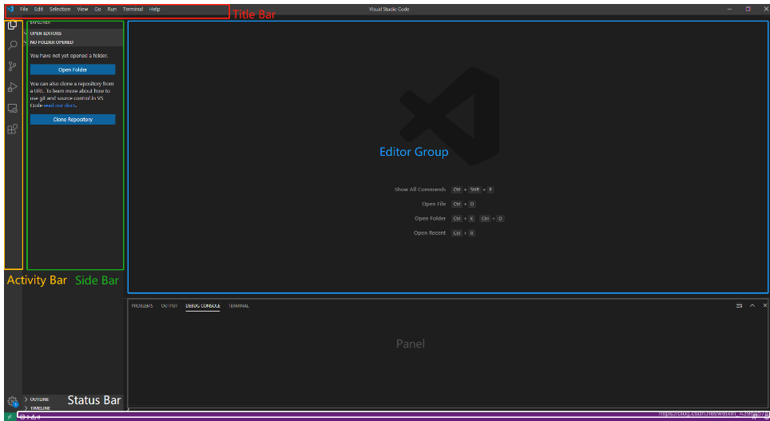 

## 扩展方向

- 命令注册: 命令注册后，VSCode通过Ctrl+Shift+P调出命令搜索栏，即可在直接搜到
- 菜单显示: 编辑器右键菜单、编辑器标题右键菜单等，菜单显示一般和命令绑定
- 快捷键设置: 一般和命令绑定，作用就是通过快捷键调用命令
- 主题显示: 色彩主题、文件图标主题等，用来改变VSCode的主题显示
- 树视图: 涉及Activity Bar和Side Bar，可在这两个区域增加树视图
- WebView: VSCode内嵌的Html网页，可以实现更加复杂、灵活的交互
- 语法高亮: 用于语言方面，优化可读性
- 片段补全: 用于语言方面，增加编辑效率

## hello world

### 环境准备

安装官方代码生成模板工具

```sh
npm install -g yo generator-code
```

### 初始化

初始化命令

```sh
yo code
```

根据提示填写相关内容

#### 文件说明

项目中两个重要的文件: **extension.ts** 和 **package.json**

##### extension.ts

该文件是入口文件, 代码如下: 

```ts
// vscode 模块包含 vscode 扩展的相关 API
import * as vscode from "vscode";

// 当扩展被激活时触发
export function activate(context: vscode.ExtensionContext) {
	// 此代码行仅在激活扩展时执行一次
	console.log("active 函数运行了");

	// 注册一个 hello.helloWorld 事件
	// 命令id参数必须与 package.json 中的 contributes.commands.command 命令字段匹配
	const disposable = vscode.commands.registerCommand("hello.helloWorld", () => {
		// 触发此事件会显示一段 Info 类型的 message
		vscode.window.showInformationMessage("这是我的第一个 vscode 插件");
	});

  // 将注册的事件添加到上下文对象中
	context.subscriptions.push(disposable);
}

// 当扩展被停用时触发
export function deactivate() {}
```

##### package.json

这个文件配置项很多, 具体配置可见[官方文档](https://code.visualstudio.com/api/references/extension-manifest), 下面的是比较重要的属性: 

- **engines.vscode**: 指定vscode兼容的**最低版本**

- **activationEvents**(`Array`): 此扩展的[激活事件](https://code.visualstudio.com/api/references/activation-events)数组
  - `onLanguage: ${xxx}` 打开指定语言的文件激活
  - `onCommand: ${xxx}` 在命令列表中执行时激活
  - `onDebug: ${xxx}` 调试时激活
  - `workspaceContains: ${xxx}` 打开一个文件夹并且该文件夹包含至少一个匹配的文件时激活
  - `onFileSystem: ${xxx}` 读取来自特定的文件或文件夹时激活
  - `onView: ${xxx}` 在 VS Code 侧边栏中展开指定 id 的视图激活
  - `onUri: ${xxx}` 打开该扩展的系统范围 Uri 时激活
  - `*`: 一启动 VS Code, 插件就会被激活(不建议使用, 会减慢VS Code的启动速度)
  - `onStartupFinished`: 类似于 `*` 激活事件，但它不会减慢 VS Code 的启动速度

  > 上面扩展事件的激活是指`extension.ts`文件的`activate`钩子函数激活

- **contributes**(`Object`): 描述扩展[贡献](https://code.visualstudio.com/api/references/contribution-points)的对象, 也就是说这个插件有哪些功能, `contributes`字段是使用的最多的它可以定义`vscode`插件可以做什么
  
  - `configuration`: 设置(`settings.json`)
  - `commands`: 命令
  - `menus`: 菜单
  - `keybindings`: 快捷键绑定
  - `languages`: 新语言支持
  - `debuggers`: 调试
  - `breakpoints`: 断点
  - `grammars`: 语法
  - `themes`: 主题
  - `snippets`: 代码片段
  - `jsonValidation`: 自定义JSON校验
  - `views`: 左侧侧边栏视图
  - `viewsContainers`: 自定义activitybar
  - `problemMatchers`: 匹配器
  - `taskDefinitions`: 任务
  - `colors`: 主题颜色

```json
{
	"name": "vscode-demo",
	"displayName": "vscode-demo",
	"description": "",
	"version": "0.0.1",
	"engines": {
		"vscode": "^1.40.0" // 表示插件最低支持的vscode版本, 低于此版本号的vscode代码不执行(并且要与 @types/vscode 对应版本)
	},
	"categories": [
		"Other"
	],
  // 扩展的激活事件, 如果这里不声明则不会触发对应的命令事件, 可以使用 `*` 通配
	"activationEvents": [
		"onCommand:hello.helloWorld" // onCommand: 表示接受到指定的命令时激活事件
	],
	"main": "./out/extension.js",
	"contributes": {
    // 如果这里不声明则不会出现对应的UI界面
		"commands": [
			{
				"command": "hello.helloWorld", // 要执行的命令的id
				"title": "hello vscode 插件", // 显示的文本, 会在`F1`命令栏显示(可以是中文)
        "category": "test" // 指定分组
			}
		]
	},
	// ...
}
```

##### 运行程序

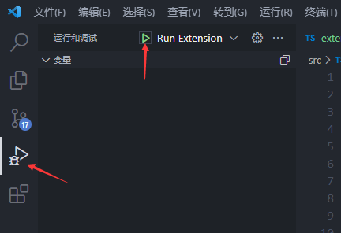 

或者按<kbd>F5</kbd>这时会打开一个扩展开发宿主环境

<kbd>F1</kbd>输入`hello vscode 插件`

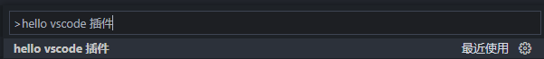 

然后右下角出现提示

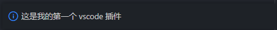 

如果命令注册和`package.json`中配置的一致但是无法识别命令的话可以执行

`package.json`里`script`里的`vscode:prepublish`的命令

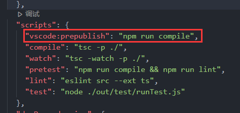 

注意点: 

- `tsconfig.json`文件的`compilerOptions.module`一定要设置为`commonjs`即使使用的是`ESModule`
- `package.json`里的`engines.vscode`字段表示的最低兼容版本不可以低于当前开发的版本

更详细的`package.json`如下: 

```json
{
  // 插件的名字，应全部小写，不能有空格
  "name": "vscode-demo",
  // 插件的友好显示名称，用于显示在应用市场，支持中文
  "displayName": "VSCode插件vscode-demo",
  // 描述
  "description": "插件描述",
  // 关键字，用于应用市场搜索
  "keywords": [
    "vscode",
    "plugin",
    "cli"
  ],
  // 版本号
  "version": "0.0.1",
  // 发布者，如果要发布到应用市场的话，这个名字必须与发布者一致
  "publisher": "water",
  // 表示插件最低支持的vscode版本, 低于此版本号的vscode代码不执行
  "engines": {
    "vscode": "^1.52.0"
  },
  // 插件应用市场分类，可选值:  [Programming Languages, Snippets, Linters, Themes, Debuggers, Formatters, Keymaps, SCM Providers, Other, Extension Packs, Language Packs]
  "categories": [
    "Other"
  ],
  // 插件图标，至少128x128像素 从根目录开始找 images文件夹
  "icon": "images/icon.png",
  // 扩展的激活事件数组
  "activationEvents": [
    "onCommand:extension.createPage",
    "onCommand:extension.createComponent"
  ],
  // 插件的主入口
  "main": "./src/extension",
  // 整个插件最重要最多的配置项
  "contributes": {
    // 插件配置项
    "configuration": {
      "type": "object",
      // 配置项标题，会显示在vscode的设置页
      "title": "wxTemp",
      "properties": {
        // 相关配置
        "wxTemp.page.js": {
          "type": "string",
          "default": "",
          "description": "模版js"
        }
      }
    },
    // 命令
    "commands": [
      {
        "command": "extension.createPage", // 对应的命令id
        "title": "创建页面", // ui界面显示的标题, 也是匹配的文本
        "icon": "$(book)", // 当该命令被绑定到编辑器标题栏时显示 https://code.visualstudio.com/api/references/icons-in-labels#icon-listing
        "category": "分组", // 指定分组
      }
    ],
    // 快捷键绑定
    "keybindings": [
      {
        "command": "extension.createPage",
        "key": "ctrl+f10", // windown快捷键
        "mac": "cmd+f10", // mac快捷键
        "when": "editorTextFocus"
      }
    ],
    // 菜单
    "menus": {
      // 编辑器右键菜单
      "editor/context": [
        {
          // 表示只有编辑器具有焦点时才会在菜单中出现
          "when": "editorFocus",
          "command": "extension.createPage",
          // navigation是一个永远置顶的分组，后面的@6是人工进行组内排序
          "group": "navigation@6"
        }
        {
          // 只有编辑器具有焦点，并且打开的是JS文件才会出现
          "when": "editorFocus && resourceLangId == javascript",
          "command": "extension.createComponentDemo",
          "group": "z_commands"
        }
      ],
      // 编辑器右上角图标，不配置icon就显示文字
      "editor/title": [
        {
          "when": "editorFocus && resourceLangId == javascript",
          "command": "extension.createComponentDemo3",
          "group": "navigation"
        }
      ],
      // 编辑器标题右键菜单
      "editor/title/context": [
        {
          "when": "resourceLangId == javascript",
          "command": "extension.createComponentDemo4",
          "group": "navigation"
        }
      ],
      // 资源管理器右键菜单
      "explorer/context": [
        {
          "command": "extension.createComponentDemo5",
          "group": "navigation"
        }
      ]
    },
    // 代码片段
    "snippets": [
      {
        "language": "javascript",
        "path": "./snippets/javascript.json"
      },
      {
        "language": "html",
        "path": "./snippets/html.json"
      }
    ],
    // 自定义新的activitybar图标，也就是左侧侧边栏大的图标
    "viewsContainers": {
      "activitybar": [
        {
          "id": "wxapp",
          "title": "wxapp",
          "icon": "images/icon.png"
        }
      ]
    },
    // 自定义侧边栏内view的实现
    "views": {
      // 和 viewsContainers 的id对应
      "wxapp": [
        {
          "id": "wxapp1",
          "name": "天时"
        },
        {
          "id": "wxapp2",
          "name": "地利"
        },
        {
          "id": "wxapp3",
          "name": "人和"
        }
      ]
    },
    // 图标主题
    "iconThemes": [
      {
        "id": "IconTheme",
        "label": "测试图标主题",
        "path": "./theme/icon-theme.json"
      }
    ]
  },
  // npm scripts
  "scripts": {},
  // 开发依赖
  "devDependencies": {},
  "license": "SEE LICENSE IN LICENSE.txt",
  "bugs": {
    "url": "https://github.com/xxx/issues"
  },
  "repository": {
    "type": "git",
    "url": "https://github.com/xxx"
  },
  // 说明页
  "homepage": "https://github.com/XXXXXXX/README.md",
  // 作者信息
  "author": {
    "name": "an",
    "email": "331536495@qq.com",
    "url": "https://gitee.com/Ann-yang"
  },
}
```

## 命令

上面的hello world例子就是一个简单的命令

### 执行命令

使用`vscode.commands.executeCommand`可以执行一些内置的命令

```ts
import * as vscode from "vscode";

export default (context: vscode.ExtensionContext) => {
  const disposable = vscode.commands.registerCommand("hello.helloWorld", () => {
    // 执行其他的命令(打开 帮助 -> 关于)
    vscode.commands.executeCommand("workbench.action.showAboutDialog", (res: any) => {
      console.log(res);
    })
    // 查看发行说明
    vscode.commands.executeCommand("update.showCurrentReleaseNotes");
  })
  context.subscriptions.push(disposable);
}
```

### 获取命令

关于键盘的内置命令可以在键盘快捷键方式中获取

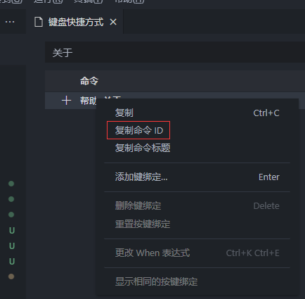 

在代码中也可以获取命令

```ts
// 获取所有命令
vscode.commands.getCommands().then(allCommands => {
	console.log("所有的命令", allCommands);
});
```

> 有一些复杂的内置命令可以参考[官方](https://code.visualstudio.com/api/references/commands)

## 通知和状态栏

### 通知

```ts
import * as vscode from "vscode";

// 右下角通知提示
vscode.window.showInformationMessage("info message");
vscode.window.showWarningMessage("warning message");
vscode.window.showErrorMessage("error message");
```

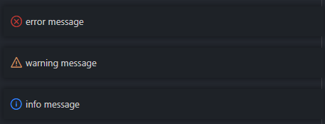 

#### 带按钮回调

```ts
// 第一个参数是信息, 后续的参数会生成对应的按钮, then 回调收到点击的按钮文本
vscode.window.showInformationMessage("是否要打开文件选择", "是", "否", "不再提示")
	.then(result => {
		switch (result) {
			case "是":
				vscode.window.showOpenDialog()
					.then((value: vscode.Uri[] | undefined) => {
						if (value) {
							const filePath = value[0].fsPath;
							vscode.window.showInformationMessage(filePath);
						}
					});
				break;
			case "不再提示":
				// ...
				break;
			default:
				break;
		}
	});
```

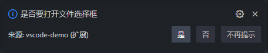 

#### 带进度的通知

```ts
vscode.window.withProgress({
  // 进度显示类型, Notification(右下角通知和进度) | Window(状态栏转圈) | SourceControl(源代码控制栏图标和进度)
  location: vscode.ProgressLocation.Notification,
  title: "获取网络资源", // 标题
  cancellable: true // 显示取消按钮
}, (progress, token) => {

  // 取消按钮回调
  token.onCancellationRequested(() => {
    vscode.window.showInformationMessage("取消成功");
  });

  // 进度0%, 无文本
  progress.report({ increment: 0 });

  // 修改进度条到10%, 增加文本
  setTimeout(() => {
    progress.report({ increment: 10, message: "发送请求中.." });
  }, 1000);

  setTimeout(() => {
    progress.report({ increment: 30, message: "请求发送成功..." });
  }, 2000);

  setTimeout(() => {
    progress.report({ increment: 50, message: "请求已到达..." });
  }, 3000);

  // 4秒后关闭
  return new Promise<void>(resolve => {
    setTimeout(() => {
      resolve();
    }, 4000);
  });
});
```

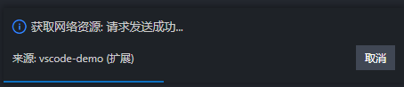 

### 状态栏

```ts
import * as vscode from "vscode";
// 添加一个默认的状态栏
// 选择动画只有 sync, loading, gear 图标支持
const loading = vscode.window.setStatusBarMessage("$(loading~spin) loading...");

setTimeout(() => {
  // 1.5s后释放
  loading.dispose();
}, 1500);
```

 

#### 自定义状态栏

```ts
import * as vscode from "vscode";

export function activate(context: vscode.ExtensionContext) {
	const disposable = vscode.commands.registerCommand("learn-vscode-extends.status", () => {
		// 创建一个状态栏对象, 右对应, 优先级 999
		const statusBarItem: vscode.StatusBarItem = vscode.window.createStatusBarItem(vscode.StatusBarAlignment.Right, 9999);
		statusBarItem.text = "$(loading~spin) loading..."; // 文本和图标(动画)
		statusBarItem.tooltip = "鼠标的悬浮提示"; // 鼠标的悬浮提示
		statusBarItem.color = "#ff0000"; // 前景色
		statusBarItem.backgroundColor = new vscode.ThemeColor("statusBarItem.warningBackground"); // 背景颜色
		statusBarItem.command = "learn-vscode-extends.statusClick"; // 绑定点击的命令

		// 显示
		statusBarItem.show();

		setTimeout(() => {			
			// 隐藏
			statusBarItem.hide();
			// 注销
			// statusBarItem.dispose();
		}, 5000);
	});

	context.subscriptions.push(disposable);
  
  // 状态栏点击命令
	context.subscriptions.push(vscode.commands.registerCommand("learn-vscode-extends.statusClick", () => {
		vscode.window.showInformationMessage("状态栏的点击命令回调");
	}));
}

export function deactivate() { }
```

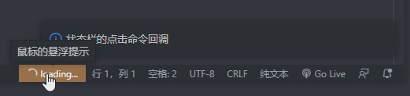 

## 接受输入内容

使用`vscode.window.showInputBox`可以打开一个输入框, 让用户输入内容

新建一个文件`dome/input.ts`如下: 

```ts
import * as vscode from "vscode";

export function activate(context: vscode.ExtensionContext) {
	// 注册一个命令 learn-vscode-extends.input
	const disposable = vscode.commands.registerCommand("learn-vscode-extends.input", () => {
		// 打开一个 input
		vscode.window.showInputBox({
			ignoreFocusOut: true, // 当焦点移动到编辑器的另一部分或另一个窗口时, 保持输入框打开
			password: false, // 为 true 就表示是密码类型
			prompt: "请输入文本", // 文本输入提示
			value: "hello world", // 默认值, 默认全部选中
			valueSelection: [6, -1],  // 指定默认值选中的范围
		}).then(value => {
			if (!value || !value?.trim()) {
				vscode.window.showErrorMessage("你输入的文本无效");
				return;
			};

			vscode.window.showInformationMessage(`你输入的文本是: ${value.trim()}`);
		})
	});

	context.subscriptions.push(disposable);
}

export function deactivate() { }
```

对应的在`pageage.json`里注册命令

```json
"activationEvents": [
  "onCommand:hello.input"
],
"contributes": {
  "commands": [
    {
      "command": "hello.input",
      "title": "hello input 标题"
    }
  ]
},
```

然后再`extension.ts`里调用

```ts
import * as vscode from "vscode";

// 注意: 这里千万不要使用.ts后缀, 可以使用.js后缀也可以省略
import input from "./demo/input";

export function activate(context: vscode.ExtensionContext) {
	input(context);
}

export function deactivate() { }
```

## 快速选择框

```ts
import * as vscode from "vscode";

export function activate(context: vscode.ExtensionContext) {
	// 注册一个命令 learn-vscode-extends.quickPick
	const disposable = vscode.commands.registerCommand("learn-vscode-extends.quickPick", () => {
		// 打开一个快速选择列表
		vscode.window.showQuickPick(
			// ["选项一", "选项二", "选项三"], // 简单的显示多个选项
			[
				{ // 对象的形式可以配置更多东西
					label: "选项一",
					description: "选项一描述$(bug)", // 可以指定官方提供的图标id https://code.visualstudio.com/api/references/icons-in-labels#icon-listing
					detail: "选项一详细信息",
					mate: { // 这里也可以放一些自定义的对象
						script: "learn-vscode-extends.helloWrold" 
					},
				},
				{
					label: "选项二",
					description: "选项二描述",
					detail: "选项二详细信息$(gear)",
				}
			],
			{
				title: "请选择一个选项", // 标题
				placeHolder: "用户类型", // 占位符文本
				canPickMany: false, // 是否可以多选
			}
		).then((res: vscode.QuickPickItem | undefined) => {
			if (!res) return;
			console.log(res); // 这里就是上面数组中对应的对象信息
		})
	});

	context.subscriptions.push(disposable);
}

export function deactivate() { }
```

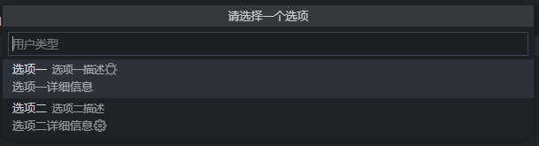 

## 自定义WebView欢迎页面

[webview](https://code.visualstudio.com/api/extension-guides/webview)

使用`vscode.window.createWebviewPanel`可以创建一些简单页面展示, 欢迎页面等, 如下: 

```ts
import * as vscode from "vscode";
import * as path from "path";
import * as fs from "fs";

export function activate(context: vscode.ExtensionContext) {
	const disposable = vscode.commands.registerCommand("learn-vscode-extends.welcome", () => {

		// 创建一个 weilcome
		const panel = vscode.window.createWebviewPanel(
			"weilcome", // webview面板的类型, 内部使用
			"自定义欢迎页面标题", // table 标题
			vscode.ViewColumn.One, // 显示在第一个编辑器
			{
				enableScripts: true, // 控制脚本是否在webview内容中启用, 默认为false(脚本禁用)
				retainContextWhenHidden: true, // webview被隐藏时保持状态，避免被重置
			}
		);

		// html文件路径
		const hemlPath = path.resolve(
			context.extensionPath, // 项目根路径
			"./src/render/welcome.html"
		);

		// 读取html文本
		const html = fs.readFileSync(hemlPath, "utf-8");

		// 赋值html文本
		panel.webview.html = html;
	});

	context.subscriptions.push(disposable);
}

export function deactivate() { }
```

注册命令, 主文件调用, 然后执行命令, 效果如下: 

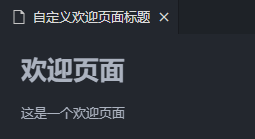 

### 加载本地资源

出于安全考虑，`Webview`默认无法直接访问本地资源，它在一个孤立的上下文中运行，想要加载本地图片、js、css等必须通过特殊的`vscode-resource:`协议，网页里面所有的静态资源都要转换成这种格式，否则无法被正常加载

`vscode-resource:`协议类似于`file:`协议，但它只允许访问特定的本地文件, 和`file:`一样, `vscode-resource:`从磁盘加载绝对路径的资源

`file:`协议通过`vscode.Uri.parse`可以将一个路径解析成Uri对象

### 消息通知

`Webview`和普通网页非常类似，不能直接调用任何VSCodeAPI，但是，它唯一特别之处就在于多了一个`acquireVsCodeApi()`方法，执行这个方法会返回一个低配版的vscode对象，这个对象里面有且仅有如下3个可以和插件通信的API: `getState()`,`postMessage()`,`setState()`

插件给`Webview`发送消息（支持发送任意可以被`JSON`化的数据）

```ts
panel.webview.postMessage({text: "我是插件发送的信息"});
```

`Webview`端接收：

```ts
window.addEventListener("message", event => {
	console.log("Webview接收到的消息是: ", event.data);
}
```

`Webview`发送消息给插件: 

```ts
vscode.postMessage({text: "我是Webview发送的信息"});
```

插件接收: 

```ts
panel.webview.onDidReceiveMessage(message => {
	console.log("插件收到的消息是: ", message);
}, undefined, context.subscriptions);
```

### 保存状态

在webview的js中可以使用`vscode.getState()`和`vscode.setState()`方法来保存和恢复JSON可序列化状态对象

当webview被隐藏时，即使webview内容本身被破坏，这些状态仍然会保存。当然, 当webview被销毁时，状态将被销毁

**序列化**

通过注册`WebviewPanelSerializer`可以实现在`VScode`重启后自动恢复`webview`, 当然，序列化其实也是建立在`getState`和`setState`之上的

注册方法: `vscode.window.registerWebviewPanelSerializer`

**retainContextWhenHidden**

对于具有非常复杂的UI或状态且无法快速保存和恢复的webview，可以直接使用`retainContextWhenHidden`选项, 设置`retainContextWhenHidden: true`后即使webview被隐藏到后台其状态也不会丢失, 注意: 它需要很高的内存开销，一般是建议使用`getState`和`setState`来实现持久化

## 快捷键绑定

[keybinds](https://code.visualstudio.com/docs/getstarted/keybindings)

vscode插件快捷键注册如下: 

```ts
// package.json

"activationEvents": [
  "onCommand:learn-vscode-extends.keyboardTest"
],
"contributes": {
  "commands": [
    {
      "command": "learn-vscode-extends.keyboardTest",
      "title": "keyboardTest"
    }
  ],
  "keybindings": [
    {
      "command": "learn-vscode-extends.keyboardTest", // 快捷键触发的事件id
      "key": "ctrl+f1", // windown 下的快捷键
      "mac": "ctrl+f1", // mac 下的快捷键
      "args": { // 通过快捷键触发时, 这个参数会被传递给对应命令注册的回调中
        "text": "Hello World" 
      },
      "when": "editorTextFocus" // 当编辑器聚焦时才会触发
    }
  ]
},
```

```ts
import * as vscode from "vscode";

export function activate(context: vscode.ExtensionContext) {
	const disposable = vscode.commands.registerCommand("learn-vscode-extends.keyboardTest", (arg) => {		
		if (arg && typeof arg.text === "string") {
			vscode.window.showInformationMessage("快捷键触发" + arg.text);
		} else {
			vscode.window.showInformationMessage("命令触发");
		}
	});
	context.subscriptions.push(disposable);
}

export function deactivate() { }
```

在本地窗口, 可以按下: <kbd>ctrl</kbd>+<kbd>]</kbd>就可以触发定义的`learn-vscode-extends.keyboardTest`事件

> [when子句](https://code.visualstudio.com/api/references/when-clause-contexts)

## 自定义菜单

[menu](https://code.visualstudio.com/api/references/contribution-points#contributes.menus)

```json
"activationEvents": [
  "onCommand:hello.helloWorld",
  "onCommand:hello.customMenu"
],
"main": "./out/extension.js",
"contributes": {
  "commands": [
    {
      "command": "hello.helloWorld",
      "title": "hello vscode 插件"
    },
    {
      "command": "hello.customMenu",
      "title": "customMenu 启动自定义菜单", // 菜单标题
      "category": "avue-tools", // 分组
      "icon": "$(tools)" // 指定icon(当被菜单绑定时显示, 否则显示 title)
    }
  ],
  "menus": {
    "editor/title": [ //编辑器标题(可以配置图片, 没有则显示文本)
      {
        "command": "hello.customMenu", // 点击触发事件
        "alt": "hello.helloWorld", // 按住 ait 键显示切换到 hello.helloWorld 命令
        "group": "navigation", // 指定分组 "navigation" 分组总是被排序到菜单的顶部/开头
        "when": "editorFocus && resourceLangId == javascript", // 编辑器具有焦点，并且打开的是JS文件才会出现
      }
    ],
    "explorer/context": [ // 资源管理器右键菜单
        {
          "command": "an.copyCompImport",
          "group": "6_copypath"
        }
     ]
  }
}
```

效果如下: 

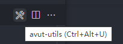 

> 还有其他菜单类型`editor/context`(编辑器右键菜单), `editor/title/context`(编辑器标题右键菜单), `explorer/context`(资源管理器右键菜单)

## 添加右键子菜单

[submenus](https://code.visualstudio.com/api/references/contribution-points#contributes.submenus)

## 悬停提示

鼠标光标hover至某个代码时的提示

```ts
import * as vscode from "vscode";

export function activate(context: vscode.ExtensionContext) {
	console.log("activate run ...");
	vscode.languages.registerHoverProvider(
		{ scheme: "file", language: "json", }, // 匹配 json 文件
		{
			provideHover(doc: vscode.TextDocument, position: vscode.Position, token: vscode.CancellationToken) {

				// 当前文件类型
				console.log(doc.languageId);

				// 文件是否未保存更改
				console.log(doc.isDirty);

				// 获取当前文件名
				console.log(doc.fileName);

				// 获取当前hover的单词 
				const word = doc.getText(
					doc.getWordRangeAtPosition(position)
				);

				// 对 json 文件中的 description 单词进行悬停提示
				if (/\bdescription\b/.test(word)) {
					return new vscode.Hover("悬停提示: 填写描述信息");
				}
			},
		});
}
export function deactivate() { }
```

修改激活扩展设置, `package.json`文件中配置`activationEvents`添加一个`onLanguage:json`即可,

表示当打开`json`文件时激活扩展, 即会调用`src/extension.ts`文件里的`activate`函数

```ts
"activationEvents": [
	"onLanguage:json", // 当碰到 json 文件时激活扩展
]
```

效果如下:

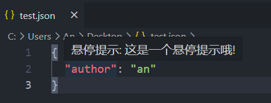 

## 代码片段

[snippets](https://code.visualstudio.com/api/references/contribution-points#contributes.snippets)

插件添加和vscode添加类似, 如下: 

```json
// papckage.json

{
  "categories": ["Snippets"], // 将扩展程序标记为片段扩展程序
  "contributes": {
    "snippets": [
			{
				"language": "javascript", // 指定语言
				"path": "./src/snippets/js.json" // 指定模板路径
			}
		]
  }
}
```

```json
// ./src/snippets/js.json

{
  "这里是显示的文本": {
    "prefix": [ // 指定关键字
      "vs",
      "vscode",
      "ve"
    ],
    "body": [ // 等同于代码片段
      "import * as vscode from 'vscode';",
      "export default ${1}"
    ],
    "description": "自定义的snippets" // 描述
  }
}
```

效果如下: 

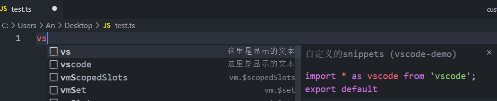 

下面是一些常用的代码片段语法: 
- `${n}`: 表示是第几个光标(多个光标通过`tab`跳到下一个光标), `${0}`则表示最后一个光标
- `${1:hello}`: 第一个光标中的默认值为`hello`
- `${1|one,two,three|}`: 第一个光标中提供三个下拉单选值, 默认为`one`

## 左侧自定义侧边栏

注意: **侧边栏按钮(Tree View Container)和面板视图(Tree View)要同时配置，否则不生效**

```json
// package.json

{
  "contributes": {
    "viewsContainers": {
      "activitybar": [
        {
          "id": "hello-sugar",
          "title": "这是侧边栏标题",
          "icon": "./src/asstes/svg/menu.svg"
        }
      ]
    },
    "views": {
      "hello-sugar": [
        {
          "id": "Hello-Command",
          "name": "你好"
        },
        {
          "id": "Hello-PackageAnalysis",
          "name": "世界"
        }
      ]
    },
    "viewsWelcome": [ // 欢迎页
			{
				"view": "Hello-Command", // 对应上面的id
        
        // contents 里可以使用`自定义的命令或者`vacode的内置命令`
				"contents": "这里的内容可以写markdown格式的文本, 支持命令, 支持链接\n[helloWorld](command:hello.helloWorld)\n了解更多可以查看 VS Code [scm 文档](https://aka.ms/vscode-scm)",
				"when": "config.git.enabled && git.state == initialized && workbenchState == empty" // 支持 when 子句(没有初始化git时出现)
			},
			{
				"view": "Hello-PackageAnalysis",
				"contents": "这里的内容可以写markdown格式的文本, 支持命令, 支持链接\n[打开文件](command:vscode.openFolder)\n[克隆存储库](command:git.clone)\n了解更多可以查看 VS Code [scm 文档](https://aka.ms/vscode-scm)",
				"when": "workbenchState == empty"
			}
		]
  }
}
```

添加对应的路径`./src/asstes/svg/menu.svg`的`svg`图片资源即可, 效果如下: 

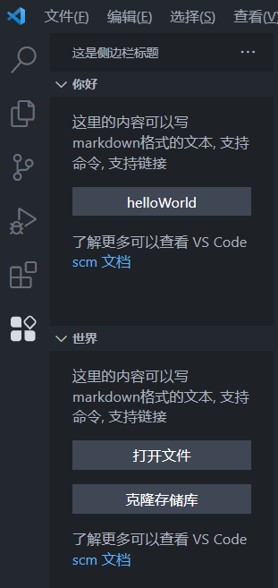 

给侧边栏添加子项, 并绑定命令

```json
// package.json

"activationEvents": [ // 这里注册父的对应命令(给其子节点使用用)
  "onView:Hello-Command",
  "onView:Hello-PackageAnalysis",
],
```

代码如下: 

```ts
// ./src/demo/sidebar.ts

import * as vscode from "vscode";

// 命令数组
const scripts = [
  {
    title: "webpack启动",
    script: "npm run serve",
  },
  {
    title: "vite启动",
    script: "npm run vite",
  },
  {
    title: "打包",
    script: "npm run build",
  },
];

// 重写每一个节点类
export class SideBarEntryItem extends vscode.TreeItem {
  constructor(
    private version: string, // 版本
    private readonly script: string | null, // 命令
    public readonly title: string, // 标题
    public readonly collapsibleState: vscode.TreeItemCollapsibleState
  ) {
    super(title, collapsibleState);
    // 这里可以自定义保存一些数据会存到每一个子节点上面
    this.tooltip = `${this.title}---${this.script}---${this.version}`;
  }
}

// 这个注册 Hello-Command 窗口对应的子节点
export class SideBarHelloCommand
  implements vscode.TreeDataProvider<SideBarEntryItem> {

  constructor(private workspaceRoot?: string) { }

  getTreeItem(element: SideBarEntryItem): vscode.TreeItem {
    return element;
  }

  // 获取子节点
  getChildren(
    element?: SideBarEntryItem
  ): vscode.ProviderResult<SideBarEntryItem[]> {
    if (element) {
      // 存放子节点
      const childrenList = []
      for (let i = 0; i < scripts.length; i++) {
        const { script, title } = scripts[i];

        // 创建对应命令数组数量的子节点
        const child = new SideBarEntryItem(
          "1.0.0", // 版本
          script, // 命令
          title, // 标题
          vscode.TreeItemCollapsibleState.None
        )
        // 注册对应 Hello-Command 父的 openChild 命令(点击子节点)
        child.command = {
          command: "Hello-Command.openChild", // 命令id
          title: script, // 命令
          arguments: [script, title], //命令接收的参数
        }
        // 添加到 childrenList 数组中
        childrenList.push(child);
      }
      return childrenList
    } else {
      const Collapsed = vscode.TreeItemCollapsibleState.Collapsed;
      //根节点
      return [
        new SideBarEntryItem("1.0.0", null, "你好父级一", Collapsed),
        new SideBarEntryItem("1.0.0", null, "你好父级二", Collapsed),
      ]
    }
  }
}


// 这个注册 Hello-PackageAnalysis 窗口对应的子节点
export class SideBarHelloPackageAnalysis
  implements vscode.TreeDataProvider<SideBarEntryItem> {
  constructor(private workspaceRoot?: string) { }

  getTreeItem(element: SideBarEntryItem): vscode.TreeItem {
    return element
  }

  getChildren(
    element?: SideBarEntryItem
  ): vscode.ProviderResult<SideBarEntryItem[]> {
    if (element) {
      //子节点
      const childrenList = []
      for (let i = 0; i < scripts.length; i++) {
        const { script, title } = scripts[i];
        const child = new SideBarEntryItem(
          "1.0.0", script, title,
          vscode.TreeItemCollapsibleState.None
        )
        child.command = {
          command: "Hello-PackageAnalysis.openChild",
          title: script,
          arguments: [child.tooltip, i],
        }
        childrenList.push(child);
      }
      return childrenList
    } else {
      //根节点
      return [
        new SideBarEntryItem(
          "1.0.0", null, "世界父级",
          vscode.TreeItemCollapsibleState.Collapsed),
      ]
    }
  }
}

// 插件代码
export default (context: vscode.ExtensionContext) => {
  const { window: vsWin, commands } = vscode;

  // 注册侧边栏面板
  const sidebarHelloCommand = new SideBarHelloCommand();
  // 注册父命令(对应上面的)
  vsWin.registerTreeDataProvider("Hello-Command", sidebarHelloCommand);
  //注册子命令
  commands.registerCommand("Hello-Command.openChild", (...args) => {
    console.log("[Hello-Command.openChild] 当前选中的是:", ...args);
    vsWin.showInformationMessage(args[0] + args[1]);
  });

  const sidebarHelloPackageAnalysis = new SideBarHelloPackageAnalysis();
  vsWin.registerTreeDataProvider("Hello-PackageAnalysis", sidebarHelloPackageAnalysis);
  commands.registerCommand("Hello-PackageAnalysis.openChild", (...args) => {
    console.log("[Hello-PackageAnalysis.openChild] 当前选中的是:", ...args);
    vsWin.showInformationMessage(args[0]);
  });
}
```

然后在`extension.ts`导入调用, 效果如下: 

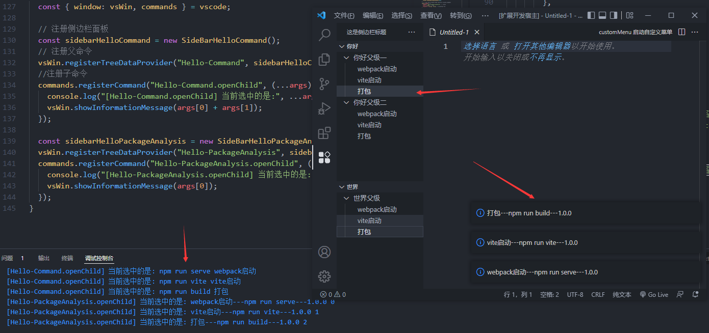 

## 读取文件夹目录

vscode可以通过`vscode.workspace.workspaceFolders`获取当前工作区所有**根文件夹数组**

`vscode.env.clipboard.writeText(text)`: 写入文本到剪切板

```ts
import * as vscode from "vscode";

export default (context: vscode.ExtensionContext) => {
  const disposable = vscode.commands.registerCommand("an-tools.hello", () => {
    // 获取根目录数组第一个文件夹
    const root = (vscode.workspace.workspaceFolders as any)[0];
    // 写入到剪切板
    // vscode.env.clipboard.writeText(rootPath);
    vscode.window.showInformationMessage("根目录(file)第一个为: " + root.uri.fsPath);
  });
  context.subscriptions.push(disposable);
}
```

## 自定义插件首选项配置

[默认配置](https://code.visualstudio.com/api/references/contribution-points#contributes.configuration)

每一个插件都可以自行添加首选项的配置, 当打开`vscode`时, 可以根据首选项选择的配置, 执行不同的逻辑

```json
"activationEvents": [
		"onCommand:learn-vscode-extends.customConfig"
	],
	"contributes": {
		"commands": [
			{
				"command": "learn-vscode-extends.customConfig",
				"title": "customConfig"
			}
		],
    "configuration": {
      "title": "learn-vscode-extends", // 这里大标题对应项目名称即可, 对应的首选项会被分到一组
      "properties": {
        "hello.title": { // 这里是副标题, 也是这个配置项的key
          "type": "string", // 类型为字符串
          "description": "这里是描述, 随便写", // 描述
          "enum": [ // 下拉选项
            "选项一",
            "选项二",
            "选项三"
          ],
          "markdownEnumDescriptions": [ // 每个选择项的说明, 可以是 markdown 格式的文本, 还有 enumDescriptions 则对应普通的文本
						"`选项一的描述文本`",
						"*选项二的描述文本*",
						"**选项三的描述文本**"
					],
          "default": "选项三", // 默认值
          "scope": "window" // 指定该配置的范围
        },
        "hello.radio": {
					"type": "boolean",
					"default": false,
					"description": "这是一个单选按钮"
				},
				"hello.input": {
					"type": "string",
					"default": "我是默认的内容",
					"description": "这是一个文本输入框"
				},
				"hello.arrayConfig": {
          "type": "array",
          "default": [],
          "scope": "window",
          "description": "数组类型的配置"
        },
				"hello.markdown": {
					"type": "boolean",
					// 可以设置一些设置链接语法, 格式为: `#配置标题#` 如 `#files.autoSave#`
					"markdownDescription": "设置自动保存`#files.autoSave#`, 设置字体大小`#editor.fontSize#`, 支持markdown语法\n- `高亮`**加粗***斜体*\n- 列表1 \n- 列表2"
				}
      }
    }
  },
```

插件代码

```ts
import * as vscode from "vscode";

export function activate(context: vscode.ExtensionContext) {

	const { showInformationMessage, showErrorMessage } = vscode.window;

	const disposable = vscode.commands.registerCommand("learn-vscode-extends.customConfig", () => {

		// 通过副标题获取指定的配置
		const config = vscode.workspace.getConfiguration().get("hello.title");
		// 效果同上
		// const config = (vscode.workspace.getConfiguration().get("hello") as any).title;

		switch (config) {
			case "选项一":
				showInformationMessage("匹配选项一");
				break;
			case "选项二":
				showInformationMessage("匹配选项二");
				break;
			case "选项三":
				showInformationMessage("匹配选项三");
				break;
			default:
				showErrorMessage("没有对应首选项");
				break;
		}
		// 代码中更新配置, 最后一个参数, 为 true 表示写入全局配置, 为 false 或不传时则只写入工作区配置
		vscode.workspace.getConfiguration().update("hello.title", "选项一", true);
	})
	context.subscriptions.push(disposable);
}
export function deactivate() { }
```

效果如下: 

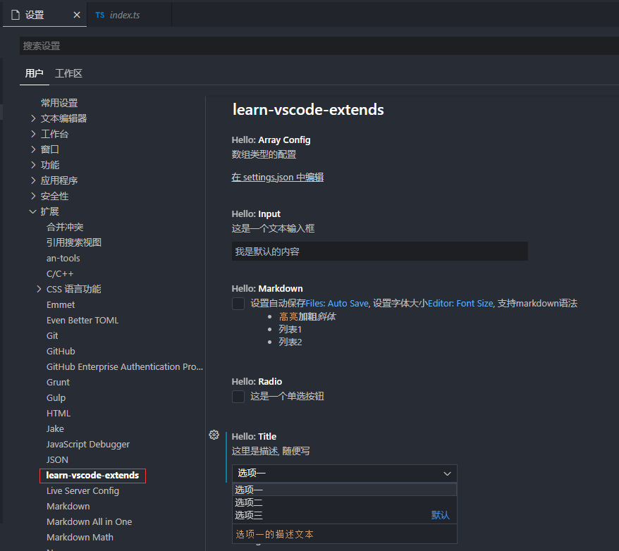 

## 编辑器内容操作

### 打开新的活动编辑器并插入文本

```ts
import * as vscode from "vscode";

export function activate(context: vscode.ExtensionContext) {

	const disposable = vscode.commands.registerCommand("learn-vscode-extends.operateEditor", () => {

		// 执行内置的命令, 新建一个活动窗口
		vscode.commands.executeCommand("workbench.action.files.newUntitledFile").then(() => {
			// 获取当前的编辑器对象
			const textEditor: vscode.TextEditor | undefined = vscode.window.activeTextEditor;
			if (textEditor) {
				// 编辑模式
				textEditor.edit((editBuilder: vscode.TextEditorEdit) => {
					const codeStr = "const sayHi = () => console.log(\"hello world\");";
					// 插入内容
					editBuilder.insert(new vscode.Position(0, 0), codeStr);
				});

				// 自动切换活动文件扩展名
				// vscode.commands.executeCommand("workbench.action.editor.changeLanguageMode")
				// 	.then((res: any) => {
				// 		console.log("语言切换完成");
				// 	});
			}
		});
	});
	context.subscriptions.push(disposable);
}
export function deactivate() { }
```

### 编辑内容

如果需要操作编辑器的内容就需要获取编辑器, 可以通过`registerTextEditorCommand`来注册命令, `registerTextEditorCommand`与`registerCommand`不同

`registerTextEditorCommand`注册的命令, 只有在编辑器被激活时调用才生效, 还有, 这个命令可以接受到`textEditor`(当前活动的编辑器)和`edit`(编辑器操作对象)

> `vscode.window.activeTextEditor`也可以获取到当前活动编辑器(**如果有的话)**

### 替换内容

```ts
import * as vscode from "vscode";

export function activate(context: vscode.ExtensionContext) {
	const disposable = vscode.commands.registerTextEditorCommand("learn-vscode-extends.operateEditor", (textEditor: vscode.TextEditor, edit: vscode.TextEditorEdit) => {
		const document = textEditor.document;
		// 获取当前编辑器的文本
		const text = document.getText();
		// 替换指定的内容
		const result = text.replace(/hello/g, "HELLO");
    // 开始位置
		const start = new vscode.Position(0, 0);
    // 结束位置
		const end = new vscode.Position(document.lineCount + 1, 0);
		const range = new vscode.Range(start, end);
		// 然后重新替换
		edit.replace(range, result);
    
    // 将指定文本插入到当前编辑器 11行6个字符处
    // edit.insert(new vscode.Position(10, 5), "测试文本");
	});
	context.subscriptions.push(disposable);
}
export function deactivate() { }
```

### 获取当前编辑器的信息

```ts
import * as vscode from "vscode";

export function activate(context: vscode.ExtensionContext) {
	const disposable = vscode.commands.registerTextEditorCommand("learn-vscode-extends.operateEditor", (textEditor: vscode.TextEditor, edit: vscode.TextEditorEdit) => {
		
		const document = textEditor.document;

		// 获取当前编辑器文件的地址
		console.log(document.fileName);

		// 获取编辑器所有的内容
		const text = document.getText();
		console.log(text);

		// 获取当前选中的文本
		const selectText = document.getText(textEditor.selection);
		console.log(selectText);

		// 获取当前编辑器的语言
		console.log(document.languageId);

		// 修改当前活动编辑器的语言
		// vscode.languages.setTextDocumentLanguage(document, "vue");
	});
	context.subscriptions.push(disposable);
}
export function deactivate() { }
```

### 文字高亮显示

```ts
import * as vscode from "vscode";

export function activate(context: vscode.ExtensionContext) {
	const disposable = vscode.commands.registerTextEditorCommand("learn-vscode-extends.operateEditor", (textEditor: vscode.TextEditor, edit: vscode.TextEditorEdit) => {
		const decorationType = vscode.window.createTextEditorDecorationType({
			backgroundColor: "red", // 背景颜色
			textDecoration: "underline", // 下划线
		});
		// 第1行第2个字符到第1行第4个字符
		const r1 = new vscode.Range(0, 1, 0, 5);
		// 第2行第4个字符到第2行第5个字符
		const r2 = new vscode.Range(1, 3, 1, 6);
		textEditor.setDecorations(decorationType, [r1, r2]);
	});
	context.subscriptions.push(disposable);
}
export function deactivate() { }
```

 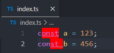 

## 打开文件并选中部分内容

```ts
import * as vscode from "vscode";

// 打开文件选择框
vscode.window.showOpenDialog({
  title: "请选择一个文件", // 对话框的标题
  openLabel: "打开", // 打开按钮文本
  canSelectFiles: true, // 是否允许选择文件
  canSelectFolders: false, // 是否允许选择文件夹
  canSelectMany: false, // 允许选择多个文件或文件夹
  filters: { // 文件筛选器
    "文本": ["txt", "md"],
    "img": ["png", "jpg"],
    "ts": ["ts", "tsx"]
  }
})
  .then((res: vscode.Uri[] | undefined) => {
    if (!res) return;
		// 文件地址
    const filePath = res[0].path; 
    const start = new vscode.Position(2, 0);
    const end = new vscode.Position(4, 22);

    const options = {
      // 选中第3行第1列 到 第3行第23列
      selection: new vscode.Range(start, end),
      // 是否预览，默认true，预览的意思是下次再打开文件是否会替换当前文件
      preview: false,
      // 显示在第二个编辑器
      viewColumn: vscode.ViewColumn.Two
    };

    // 打开一个文件内容, 可以指定配置项
    vscode.window.showTextDocument(vscode.Uri.file(filePath), options);
  })
```

## 终端操作

```ts
import * as vscode from "vscode";

export function activate(context: vscode.ExtensionContext) {
	const disposable = vscode.commands.registerCommand("learn-vscode-extends.operateTerminal", () => {

		// 创建一个终端
		const terminal: vscode.Terminal = vscode.window.createTerminal({
			name: "myTerminal", // 终端名称
			cwd: __dirname, // 改变路径
			message: "我是插件的消息" // 第一次启动时会打印出来
		});

		// 发送 shell 文本到 stdin 
		terminal.sendText("npm -v");
		// 显示终端 UI
		terminal.show();

		// 隐藏和销毁
		// terminal.hide();
		// terminal.dispose();
	});
	context.subscriptions.push(disposable);
}
export function deactivate() { }
```

触发命令后直接效果如下: 

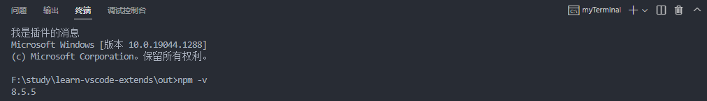  

## 全局存储

```ts
export function activate(context: vscode.ExtensionContext) {
	const disposable = vscode.commands.registerTextEditorCommand("an.hello", (textEditor: vscode.TextEditor, edit: vscode.TextEditorEdit) => {
    
		// 获取全局存储没有则使用默认值
		const userName: string = context.globalState.get("userName", "张三");
		// 更新全局存储的值
		context.globalState.update("userName", "尼古拉斯-张三");
		const newUserName: string | undefined = context.globalState.get("userName");
		context.globalState.update("password", 123456789);
		// 获取键组成的数组
		const keys: readonly string[] = context.globalState.keys();
		// 根据键值进行跨设备同步
		context.globalState.setKeysForSync(["userName", "password"]);
	});
  
	context.subscriptions.push(disposable, disposable2);
}
```

## 打包发布

安装[vsce](https://github.com/microsoft/vsce)对应[官方文档](https://code.visualstudio.com/api/working-with-extensions/publishing-extension)

```sh
npm install vsce -g # 一定要全局安装

vsce package # 打包
vsce login <publisher name> # 登录
vsce publice # 发布
```

打包时使用的`@types/vscode`版本需要与`engines.vscode`版本对应, 然后`package.json`里需要(可选)指定`repository`字段

打包时如果报了如下错

```sh
Cannot write file 'xxx' because it would overwrite input file.
```

就需要在`tsconfig.json`文件里`exclude`排除掉`outDir`这个目录输出的文件

然后打包前需要使用`vsce ls`检查一下扩展的依赖是否包含了`node_modules`里的依赖

如果打包的时候卡在`watch`ts文件更改的话, 可以试一下把`tsconfig.json`里的`compilerOptions.watch`选项去掉

> 注意: vsce在执行打包时不会打包`devDependencies`里的依赖
