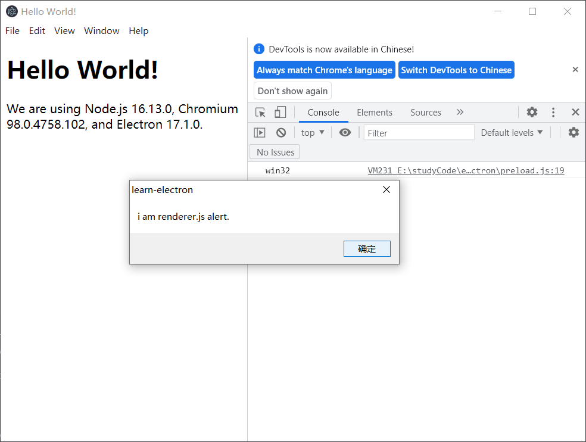
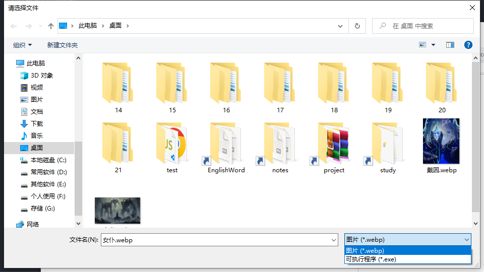
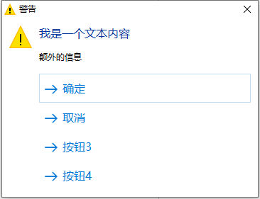
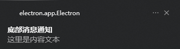

# electron

[Electron](https://www.electronjs.org/)是一个使用 JavaScript、HTML 和 CSS 构建桌面应用程序的框架。 嵌入 [Chromium](https://www.chromium.org/) 和 [Node.js](https://nodejs.org/) 到 二进制的 Electron 允许您保持一个 JavaScript 代码代码库并创建 在Windows上运行的跨平台应用 macOS和Linux——不需要本地开发经验

[文档](https://www.electronjs.org/zh/docs/latest/)

[重大更改](https://www.electronjs.org/zh/docs/latest/breaking-changes)

[安全建议清单](https://www.electronjs.org/zh/docs/latest/tutorial/security#%E6%B8%85%E5%8D%95%E5%AE%89%E5%85%A8%E5%BB%BA%E8%AE%AE)

[环境变量](https://www.electronjs.org/zh/docs/latest/api/environment-variables)

[[toc]]

## 快速入门	

- 安装`npm install electron`

- 初始化`npm`, 修改 `main`字段(主页入口), 并设置`script`命令, 

```json
// package.json
{
  "name": "learn-electron",
  "version": "1.0.0",
  "description": "",
  "main": "./main.js", // 这个字段就是启动主线程的文件路径
  "scripts": {
    // `chcp 65001` 防止控制台输出中文乱码
    "dev": "chcp 65001 && electron .",
    "build": "electron build"
  },
  "keywords": [],
  "author": "",
  "license": "ISC"
}
```

根目录创建`index.html`文件

```html
<!-- index.html -->

<!DOCTYPE html>
<html>
  <head>
    <meta charset="UTF-8">
    <!-- https://developer.mozilla.org/en-US/docs/Web/HTTP/CSP -->
    <meta http-equiv="Content-Security-Policy" content="default-src 'self'; script-src 'self'">
    <meta http-equiv="X-Content-Security-Policy" content="default-src 'self'; script-src 'self'">
    <title>Hello World!</title>
  </head>
  <body>
    <h1>Hello World!</h1>
    We are using Node.js <span id="node-version"></span>,
    Chromium <span id="chrome-version"></span>,
    and Electron <span id="electron-version"></span>.

    <!-- 引入额外的js脚本 需要在 body标签结束之前引入 -->
    <script src="./renderer.js"></script>
  </body>
</html>
```

根目录创建`main.js`文件

```js
// main.js

const { resolve } = require('path');

// app 模块, 它控制应用程序的事件生命周期
// BrowserWindow 模块, 它创建和管理应用程序 窗口
const { app, BrowserWindow } = require('electron');

// 主页面
let win = null;

const createWindow = () => {
  // 创建浏览器窗口
  win = new BrowserWindow({
    width: 800, // 窗口宽度
    height: 600, // 窗口高度
    // 将指定脚本注入到该页面中, 并执行
    webPreferences: {
      nodeIntegration: true, // 脚本内可以访问 Node API
      preload: resolve(__dirname, './preload.js') // 脚本会被执行
    },
    icon: "xxx", // 设置任务栏图标
    title: "xxx", // 设置标题
      
  })
  // 主进程加载一个文件
  win.loadFile('index.html');
    
  // 主进程加载一个链接(只能加载文件或者链接)
  // win.loadURL("https://www.bilibili.com");
    
  // 设置为最顶层
  // win.setAlwaysOnTop(true);

  // 打开开发者工具
  win.webContents.openDevTools();
  
  // 关闭开发者工具
  // win.webContents.closeDevTools();
  
  // 删除菜单
  // win.removeMenu();
  
  // 注入一段代码并执行
  win.webContents.executeJavaScript("alert('注入的代码执行了')", true).then((res) => {
    console.log("res: ", res);
  }).catch(err => {
    console.log("err: ", err);
  });
}

// ready 事件表示页面被打开后
app.on("ready", () => {
// app.whenReady().then(() => { // 等价于监听 app模块的 ready事件
    
  // 创建浏览器窗口
  createWindow();

  // 关闭所有窗口事件
  app.on('window-all-closed', () => {
    // process.platform 属性返回标识运行 Node.js 进程的操作系统平台的字符串

    // 在 macOS 上, 除非用户用 Cmd + Q 确定地退出, 
    // 否则绝大部分应用及其菜单栏会保持激活
    if (global.process.platform !== 'darwin') {
      app.quit();
    }

    win = null;
  });

  // 如果没有窗口打开则打开一个窗口 (macOS)
  app.on('activate', () => {
    // BrowserWindow.getAllWindows() 返回所有打开的窗口的数组
    if (BrowserWindow.getAllWindows().length === 0) {
      // 在macOS上, 当单击dock图标并且没有其他窗口打开时
      // 通常在应用程序中重新创建一个窗口
      createWindow();
    }
  })
})
```

根目录创建`preload.js`文件

```js
// preload.js 
// 所有 Node.js API都可以在预加载过程中使用
// 它拥有与 Chrome扩展 一样的沙盒

// DOMContentLoaded事件咋子 DOM 加载完成后事件
window.addEventListener('DOMContentLoaded', () => {
    // 选择指定元素(selector)并设置其innerText属性为text
    const replaceText = (selector, text) => {
        const element = document.getElementById(selector)
        if (element) element.innerText = text
    }

    // 读取 process.versions(版本信息对象)
    for (const dependency of ['chrome', 'node', 'electron']) {
        // 将 'chrome', 'node', 'electron'的版本信息插入到指定 DOM 中
        replaceText(`${dependency}-version`, process.versions[dependency])
    }

    console.log(process.platform);
})
```

根目录创建`renderer.js`文件

```js
// renderer.js
setTimeout(alert, 1000, 'i am renderer.js alert.');
```

运行`npm run start`后就出现一个窗口会自动打开 开发者工具, 0.5s后弹出提示

 

> 开发者工具和**chrome/edge浏览器**一样, 在菜单栏的`View -> Toggle Developer Tools`, 快捷键`Ctrl + Shift + i` 或者`win.webContents.openDevTools()`就能调用出来可以用来调试页面

### electron的加载

electron的加载先读取`package.json`文件中的`main`字段, 并将其对应的文件加载为**主线程**

主线程内通过主线程的`loadFile(filePath)`方法可以加载一个渲染器进程(子窗口)

## 新建窗口

在渲染进程中(**html文件或其加载的js文件**)中是不能使用`new BrowserWindow()`来新建窗口的, 如果在渲染进程中打开新的窗口就必须使用`remote`模块, `remote`模块里面提供很多`main`主进程对象的方法或对象, `BrowserWindow`就是其中之一

**electron14.0**之前版本使用

- 在**主进程**的窗口中加入`webPreferences.enableRemoteModule: true`参数才能够调用`remote`模块

- ```js
	// 导入 remote 中的  BrowserWindow
	const { BrowserWindow } = require('electron').remote;
	let newWin = new BrowserWindow({
	  width: 800,
	  height: 600,
	})
	
	win.loadFile('index2.html');
	
	newWin.on('close', () => {
	  newWin = null;
	})
	```

**electron14.0**版本API修改

- 安装`npm install --save-dev @electron/remote`

- 在**主进程**中导入

  ```js
  const { app, BrowserWindow } = require('electron');
  const remote = require('@electron/remote/main');
  
  // import * as remote from "@electron/remote/main";
  
  let win;
  app.on('ready', () => {
    win = new BrowserWindow({
      width: 800,
      height: 600,
    })
    
    // 初始化
    remote.initialize();
    // 这里要在主线程创建以后添加
    remote.enable(win.webContents);
  })
  ```

- 在**渲染进程**中使用

	```js
	// 从 @electron/remote 引入 remote
	const { BrowserWindow } = require("@electron/remote");
	const newWin  = new BrowserWindow({
	  width: 500,
	  height: 500
	});
	
	newWin.loadFile("demo.html");
	
	newWin.on("closed", () => {
	  newWin = null;
	}) 
	```

### 创建窗口的常用配置

[`BrowserWindow`](https://www.electronjs.org/zh/docs/latest/api/browser-window)

```js
new BrowserWindow({
  // fullscreen: true, // 全屏
  // frame: false, // 让桌面应用没有边框, 这样菜单栏也会消失
  resizable: false, // 不允许用户改变窗口大小
  center: true, // 是否居中
  width: 800, // 设置窗口宽
  height: 600, // 设置窗口高
  hasShadow: true, // 显示阴影
  icon: iconPath, // 应用运行时的标题栏图标
  minWidth: 300, // 最小宽度
  minHeight: 500, // 最小高度
  maxWidth: 300, // 最大宽度
  maxHeight: 600, // 最大高度
  // parent: BrowserWindow.getFocusedWindow() || undefined, // 指定父窗口(创建子窗口时使用)
  // modal: true, // 是否是模态窗口, 这只在窗口是子窗口时有效
  // 进行对首选项的设置
  webPreferences: {
    webviewTag: true, // 启用 webview 标签
    backgroundThrottling: false, // 设置应用在后台正常运行
    enableRemoteModule: true, // 允许使用 remote 模块
    nodeIntegration: true, // 设置能在页面或导入的js文件中使用 nodejs的API(需要配合contextIsolation一起使用)
    contextIsolation: false, // 关闭警告信息
    // preload: path.join(__dirname, './preload.js') // 在渲染器流程中加载文件
  }
})
```

开启了`webPreferences`的`nodeIntegration`和`contextIsolation`就可以直接在`<script>`或js文件中直接使用`node`的API了, 如下: 

```html
<h1 id="title">hello world</h1>
<button id="btn">点击读取文件</button>

<!-- 这个引入的文件里可以使用node的API -->
<script src="./index.js"></script>

<script>
  // script标签里也可以使用node的API
  const fs = require("fs");
  window.onload = () => {
    const title = document.getElementById("title");
    const btn = document.getElementById("btn");

    btn.addEventListener("click", () => {
      const txt = fs.readFileSync("test.txt");
      title.innerText = txt;
    })
  }
</script>
```

## 设置无边框

```js
win = new BrowserWindow({
    frame: false, // 让桌面应用没有边框, 这样菜单栏也会消失
    width: 800,
    height: 600,
})
```

菜单其实它还在, 仍然可以通过快捷键调用出菜单, 可以直接删除菜单`win.removeMenu()`

设置窗口可以拖动

```css
html {
  -webkit-app-region: drag; /* drag 可拖动 | no-drag 不可拖动 */
}
```

在页面使用css样式时需要设置`meta`标签的`content`属性为`style-src 'unsafe-inline'`, 否则会报错

```html
<meta 
  http-equiv="content-security-policy" 
  content="default-src 'none'; script-src 'self';
    connect-src 'self'; img-src 'self';
    style-src 'unsafe-inline'" />
```


## app

[`app`](https://www.electronjs.org/zh/docs/latest/api/app)模块控制应用程序的事件生命周期和提供一些主线程相关的方法

## 菜单

### 操作栏菜单添加和事件

如果不给主程序创建操作栏菜单则会使用默认的菜单, 创建操作栏菜单使用[`Menu`](https://www.electronjs.org/zh/docs/latest/api/menu)模块, 代码如下: 

```js
const { Menu } = require("@electron/remote");

// 定义一个方法创建菜单
const createMenu = () => {
  // 定义菜单模板
  const menuTemplate = [
    {
      // 菜单显示的文本
      label: "菜单一号",
      // submenu 代表下一级菜单
      submenu: [
        { label: "文件" },
        { label: "保存" },
        {
          label: "首选项",
          submenu: [
            { label: "首选项1" },
            { label: "首选项2" }
          ]
        }
      ]
    },
    {
      label: "菜单一号",
      submenu: [
        {
          label: "新建窗口",
          // 添加快捷键(会触发click事件)
          accelerator: "ctrl+n",
          // 绑定单击事件
          click() {
            let newWin = new BrowserWindow({
              width: 500,
              height: 500
            })
            newWin.loadFile("./render/remote/dome.html");
            newWin.on("closed", () => {
              newWin = null;
            })
          }
        },
        { label: "首选项" },
        { label: "帮助" },
        {
          label: "退出",
          click() {
            app.quit();
          }
        }
      ]
    },
  ];

  // 从模板中创建菜单
  const myMenu = Menu.buildFromTemplate(menuTemplate);

  // 设置为应用程序菜单
  Menu.setApplicationMenu(myMenu);
}


app.on("ready", () => {
  // ...
  // 创建菜单
  createMenu();
})
```

### 右键菜单添加和事件

右键菜单是通过渲染器(**html**)页面的`contextmenu`事件添加的

在渲染进程中需要通过`remote`模块加载

```js
const { Menu, getCurrentWindow } = require('@electron/remote');


// 右键菜单模板
// 和操作栏菜单是一样的
const rightMenuTemplate = [
  {
    label: "右键菜单一号",
    submenu: [
      { label: "菜单1" },
      { label: "菜单2" },
      {
        label: "菜单3",
        accelerator: "ctrl+l",
        click() {
          alert("右键菜单一号");
        }
      }
    ]
  },
  {
    label: "右键菜单二号",
    submenu: [
      { label: "菜单4" },
      { label: "菜单5" },
      { label: "菜单6" }
    ]
  },
]

// 从模板中创建菜单
const menu = Menu.buildFromTemplate(rightMenuTemplate);

window.addEventListener("contextmenu", e => {
  // 阻止默认行为
  e.preventDefault();

  // 显示菜单
  menu.popup({
    window: getCurrentWindow(),
    // window: newWin 给对应的 BrowserWindow 对象即可
  })
})
```

## 通过浏览器打开链接

默认electron打开a标签的链接是直接在客户端打开的, electron提供了`shell`模块可以设置为使用浏览器打开, `shell`模块可以直接在渲染器中直接使用, 如下: 

**dome.html**

```html
<div>
  <a id="aHref" href="https://www.bilibili.com">bilibili</a>
</div>
<script src="./dome.js"></script>
```

**dome.js**

```js
const { shell } = require("electron");

const bindAHrefClick = () => {
  const aHref = document.getElementById("aHref");
  // 绑定点击事件
  aHref.addEventListener("click", e => {
    // 阻止默认行为
    e.preventDefault();
    // 获取链接
    const href = aHref.getAttribute("href");
    // 本地浏览器打开
    shell.openExternal(href);
  })
}


window.onload = () => {
  bindBtnClick()
}
```

## 应用中嵌入网页

嵌入网页类似于**iframe**, electron提供了[`BrowserView`](https://www.electronjs.org/zh/docs/latest/api/browser-view)模块, `BrowserView`模块只能在主线程中使用

```js
const { app, BrowserWindow, Menu, BrowserView } = require('electron');
app.on("ready", () => {
  //...
  
  // 创建 BrowserView 对象
  const view = new BrowserView();
  // 主线程加载 BrowserView 对象
  win.setBrowserView(view);
  // 相关属性设置
  view.setBounds({ x: 0, y: 200, width: 400, height: 400 });
  view.webContents.loadURL("https://electronjs.org");
})
```

如果electron报`Electron Security Warning (Insecure Content-Security-Policy)`则需要引入一个`meta`标签的`http-equiv`属性如下

```html
<meta http-equiv="Content-Security-Policy">
```

## 打开子窗口和父子通信

### 打开子窗口

这个打开子窗口是使用的`windown.open()`不是`BrowserWindow`

```js
const bindBtn2Click = () => {
  const btn2 = document.getElementById("btn2");
  btn2.addEventListener("click", () => {
    // 可以打开一个URL链接
    window.open("https://electronjs.org");
    // 也可以打开一个html文件
    // window.open("./child.html");
  })
}
```

### 子窗口向父窗口通信

父窗口打开一个子窗口并监听`message`事件

```js
const btn = document.getElementById("btn");
btn.addEventListener("click", () => {
  // 打开一个子窗口
  window.open("./render/remote/demo.html", "_blank", "width=700, height=500, left=200");
})


// 监听 message 事件
window.addEventListener("message", e => {
  console.log(e);
	console.log("父窗口收到的数据", e.data);
})
```

子窗口通过`window.opener.postMessage()`方法向父窗口发送数据

```js
// window.opener.postMessage("子窗口数据", "/"); // 发送给路径 / 对应的页面
window.opener.postMessage("子窗口数据", "*"); // 发送所有的路径对应的页面
```

### 父窗口向子窗口通信

父窗口在打开一个子窗口的时候会获得这个子窗口对象

```js
const btn2 = document.getElementById("btn2");
btn2.addEventListener("click", () => {
  // 获得子窗口对象
  const childWin = window.open("./render/remote/demo.html");

  setTimeout(() => {
    // 传输数据
    childWin.postMessage("父窗口的数据");
  }, 1500);
})
```

在子窗口监听`message`事件即可

```js
window.addEventListener("message", e => {
  console.log(e);
  console.log("父窗口传递的数据", e.data);
})
```

## 进程间通信

官方文档：[ipcMain](https://www.electronjs.org/zh/docs/latest/api/ipc-main), [ipcRenderer](https://www.electronjs.org/zh/docs/latest/api/ipc-renderer), [webContents](https://www.electronjs.org/zh/docs/latest/api/web-contents)

**主线程** 到 **渲染线程** 通过 `webContents.send()` 来发送 --->`ipcRenderer.on()` 来监听

**渲染线程** 到 **主线程** 需要通过 `ipcRenderer.send()`发送 ---> `ipcMain.on()`来监听

> 也可以使用node的`events`模块进行通信


### 主进程到渲染进程

主进程发送消息

```js
// 省略新建 win 的代码

// 主进程发送一个 mainMsg 类的消息给渲染线程
setTimeout(() => {
  win.webContents.send("mainMsg", "我是主线程发送的消息");
}, 1500);
```

在渲染线程中使用`ipcRenderer.on`来进行监听对应的消息

```js
const { ipcRenderer } = require("electron");

// 渲染器进程通过 ipcRenderer.on  监听 mainMsg 消息
ipcRenderer.on("mainMsg", (e, msg) => {
  console.log(e);
  console.log(msg);
});
```

### 渲染进程到主进程

渲染线程中通过`ipcRenderer.send()`进行发送消息

```js
const { ipcRenderer } = require("electron");

setTimeout(() => {
  // 渲染器进程发送 renderMsg 类型的消息
  ipcRenderer.send("renderMsg", "我是渲染器进程发送的消息");
  // ipcRenderer.sendSync(); // 同步发送
}, 1500);
```

主进程通过`ipcMain.on()`监听`renderMsg `类型的消息

还可以通过`ipcMain.once()`只监听一次消息事件

```js
const { ipcMain } = require("electron");

// 省略其他代码

// 主进程通过 ipcMain.on 监听 renderMsg 类型的消息
ipcMain.on("renderMsg", (e, msg) => {
  console.log(e);
  console.log(msg);
})
```

### 渲染进程到渲染进程

渲染进程发送消息到渲染进程使用`ipcRenderer.sendTo()`方法, 第一个参数为要发送给的渲染器进程对应的`webContentsId `

获取渲染器进程`webContentsId `通过[`process`](https://www.electronjs.org/zh/docs/latest/api/process)模块的`pid`属性获取

```js
const { process } = require("@electron/remote");

console.log("index.js 渲染器进程的id为: ", process.pid);
```

electron提供的`process`模块和node的`process`模块重名了, 解决方法是node`process`模块使用`global.process`访问或者从`@electron/remote`导出模块时重命名

### 互相通信

**渲染进程**使用`@electron/remote`的`ipcMain.on`监听到**主进程**的事件, 使用`ipcMain.emit`发送事件

**主进程**通过`electron`的`ipcMain.emit`发送事件, 使用`ipcMain.on`监听事件

## 系统托盘

系统托盘使用[`Tray`](https://www.electronjs.org/zh/docs/latest/api/tray)模块, 常用方法如下: 

- `tray.destroy()`: 立即销毁该任务栏图标

- `tray.setImage(image)`: 设置`image`作为托盘中显示的图标

- `tray.setToolTip(toolTip)`: 设置鼠标指针在托盘图标上悬停时显示的文本

```js
const { Menu, Tray, nativeImage } = require("electron");

let tray
const createTray = () => {
  // 这里使用的是一个 png 来创建 icon
  const icon = nativeImage.createFromPath(resolve(__dirname, "./static/icon.png"));
  // 创建 Tray
  tray = new Tray(icon);

  // 鼠标移动到托盘上的提示
  tray.setToolTip("这个是系统托盘的提示文本");

  // 监听托盘右键事件
  tray.on("right-click", () => {
    // 右键菜单模板
    const tempate = [
      { label: "无操作" },
      { label: "退出", click: () => app.quit() },
    ]
    // 通过 Menu 创建菜单
    const contextMenu = Menu.buildFromTemplate(tempate);
    // 应用托盘右键菜单
    tray.popUpContextMenu(contextMenu);
  })

  // 监听点击托盘的事件
  tray.on("click", () => {
    // 判断窗口是否显示状态
    if (win.isVisible()) {
      // 隐藏窗口
      win.hide()
    } else {
      // 显示窗口
      win.show()
    }
  })
}


app.on("ready", () => {
  // ...
  
  // 创建系统托盘
  createTray();
})
```

### 托盘气泡通知

托盘气泡通知使用`tray.displayBalloon(options)`方法, `options`具体参数如下: 

- `icon`: 当 `iconType` 是 `custom` 时, 该字段被使用
- `iconType`: 可以是 `none`, `info`, `warning`, `error` 或 `custom`, 默认值为 `custom`
- `title` : 标题
- `content`: 内容
- `noSound`: 不播放相关声音。 默认值为 `false`, 映射到`NIIF_NOSOUND`

`tray.removeBalloon()`: 移除托盘气球

```js
const createTrayTip = () => {
  tray.on("balloon-show", () => {
    console.log("托盘气泡显示");
  })
  tray.on("balloon-click", () => {
    console.log("点击托盘气泡");
  })
  tray.on("balloon-closed", () => {
    console.log("托盘气泡被关闭");
  })

  tray.displayBalloon({
    iconType: "warning",
    title: "托盘气泡标题",
    content: "托盘气泡内容文本",
  });

  setTimeout(() => {
    // 移除托盘气泡
    tray.removeBalloon();
  }, 500);
}
```


## 对话框

### 打开文件对话框

electron提供[`dialog`](https://www.electronjs.org/zh/docs/latest/api/dialog)模块来生成一个对话框, 打开文件选择对话框使用`dialog.showOpenDialog()`方法(加`Sync`后缀为同步API), 传递两个参数, 一个是设置基本属性, 另一个是回调函数可以使用异步(`Promise`)的`then()`方法, 接受到如下参数: 

- **title**: 对话框的标题
- **defaultPath**:  默认打开路径
- **buttonLabel**:  确认按钮的自定义标签
- **filters**: 文件选择过滤器
- **properties**: 打开文件的属性

```js
const openBtn = document.getElementById("openBtn");
openBtn.addEventListener("click", () => {
  // 打开文件对话框
  dialog.showOpenDialog({
    title: "请选择文件", // dialog标题
    defaultPath: "C:\\Users\\33153\\Desktop\\女仆.webp", // 默认打开的文件路径
    buttonLabel: "自定义确认按钮文本", // 确认按钮文本
    // properties: ["openFile"],
    filters: [ // 文件过滤器
      {
        name: "图片", // 这个文本是显示在过滤器前面的, 会显示为: 图片 (*.webp) 格式
        extensions: ["webp"] // 只显示 webp 后缀格式的文件
      },
      {
        name: "可执行程序",
        extensions: ["exe"]
      },
    ] 
  }).then(res => {
    console.log(res.filePaths);

    const img = document.createElement("img");
    img.setAttribute("alt", "图片");
    img.setAttribute("style", "width: 100%");
    img.setAttribute("src", res.filePaths[0]);
    document.body.appendChild(img);
  }).catch(err => console.log(err));
})
```

效果如下: 

 

### 保存文件对话框

保存文件用的是`dialog.showSaveDialog()`方法, 参数和`dialog.showOpenDialog()`方法基本是一样的

```js
const fs = require("fs");
const bindSaveBtnClick = () => {
  const saveBtn = document.getElementById("saveBtn");
  saveBtn.addEventListener("click", () => {
    dialog.showSaveDialog({
      title: "保存文件"
    }).then(res => {
      console.log(res);
      
      // 使用 fs模块保存文件即可
      fs.writeFileSync(res.filePath, "electron保存的文件");
      
      alert("文件保存成功");
    }).catch(err => console.log(err))
  })
}
```

### 消息对话框

消息文件对话框使用`dialog.showMessageBox()`方法, 主要属性如下: 

- **type**: 图标样式类型：有`none`, `info`, `error`, `question`, `warning`
- **title**: 标题
- **message**(必填): 内容文本
- **buttons**: 数组类型, 表示对话框上面的按钮, 当其中的按钮被点击时返回其在数组中的**下标**
- **defaultId**: 默认选中的按钮下标
- **detail**: 内容文本下面的小字文本
- **cancelId**: 当用户关闭对话框的时候(点击右上角的`x`)后的默认返回的下标, 不设置则默认返回`0`

```js
const msgBtn = document.getElementById("msgBtn");
// 对话框的按钮
const buttons = ["确定", "取消", "按钮3", "按钮4"];
msgBtn.addEventListener("click", () => {
  // 打开对话框
  dialog.showMessageBox({
    type: "warning",
    title: "警告",
    message: "我是一个文本内容",
    buttons,
    defaultId: 0,
    detail: "额外的信息",
    cancelId: 999
  }).then(res => {
    console.log(res);
    const idx = res.response; // 点击了对应按钮的在 buttons 中的下标
    console.log(idx); 
    if (idx !== 999) {
      alert("你点击了" + buttons[idx]);
    }
  }).catch(err => console.log(err));
})
```

效果如下: 

 

## 断网提示

使用**windown**事件`online`和`offline`

- `online`: 网络从关闭到连接上触发
- `offline`: 网络关闭时触发

```js
window.addEventListener("online", e => {
  console.log(e);
  alert("网络连接上了");
})

window.addEventListener("offline", e => {
  console.log(e);
  alert("应用开小差了");
})
```

## 系统桌面通知

系统桌面通知使用[`Notification`](https://www.electronjs.org/zh/docs/latest/api/notification#%E7%B1%BB-notification)类, 这个类在`window.Notification`存储着, 需要对齐使用`new`创建实例

基本使用如下: 

```js
const option = {
  title: "底部消息通知",
  body: "这里是内容文本",
}

// 创建实例时默认触发 show 事件
const notification = new window.Notification(option.title, option);
  console.log(notification);

  notification.addEventListener("show", e => {
    console.log("通知显示了");
  })
  // 绑定事件可以通过 onclick 和 addEventListener
  notification.addEventListener("click", e => {
    console.log("点击了通知");
  })
  notification.addEventListener("close", e => {
    console.log("取消了通知"); // 只是隐藏起来了
  })
  notification.addEventListener("failed", e => {
    console.log("通知出现错误");
  })

setTimeout(() => {
  // 手动取消通知(会触发 close 事件并请除通知记录)
  notification.close();
}, 2000);
```

效果如下: 

 

## 注册全局快捷键

注册全局快捷键需要使用[`globalShortcut`](https://www.electronjs.org/zh/docs/latest/api/global-shortcut)模块, 同理主进程直接从`electron`里获取使用, 渲染器进程需要从`@electron/remote`里获取使用

- `register(accelerator, callback)`: 注册单个快捷键
- `registerAll(accelerators, callback)`: 注册多个快捷键, `accelerators`为字符串数组

```js
// 主进程获取
const { globalShortcut } = require('electron');
// 渲染器进程获取
// const { globalShortcut } = require("@electron/remote");


app.on("ready", () => {
  // 主进程使用 globalShortcut.registe 必须在 ready 事件之后
  const isCtrlN = globalShortcut.register("ctrl+n", () => {
    console.log("main ctrl+n");
  })
  // 返回的布尔值判断是否绑定成功快捷键
  console.log("快捷键 ctrl+N 绑定: ", isCtrlN ? "成功" : "失败");


  // 判断某个快捷键是否绑定成功
  const isCtrlB = globalShortcut.isRegistered("ctrl+b") ? "有" : "没有";
  console.log("ctrl+b 是否绑定快捷键: ", isCtrlB);


  // 当所有窗口被关闭后触发
  app.on("will-quit", () => {
    // 注销指定快捷键
    globalShortcut.unregister("ctrl+n");
    console.log("已注销 ctrl+n 快捷键");

    // 注销所有快捷键
    // globalShortcut.unregisterAll();
  })
})
```

> 快捷方式是全局的, 即使应用程序没有键盘焦点, 它也仍然在持续监听键盘事件

## 剪切和复制

electron提供[`clipboard`](https://www.electronjs.org/zh/docs/latest/api/clipboard)模块来提供复制功能, `clipboard`模块在渲染器进程可以直接使用, 常用方法如下:

- `writeText(text)`和`readText()`: 向剪切板中写入文本和读取文本
- `writeHTML(htmlText)`和`readHTML()`: 向剪切板中写入HTML文本和读取HTML文本
- `writeImage(image)`和`readImage()`: 向剪切板中写入图像和读取图像
- `clear()`: 清除剪切板内容

```js
const { clipboard } = require("electron");

copyCodeBtn.addEventListener("click", () => {
  const text = code.innerText;
  clipboard.writeText(code.innerText);
  alert("复制文本成功: " + text);
})

pasteCodeBtn.addEventListener("click", () => {
  const text = clipboard.readText();
  paste.innerText = text;
})
```

> 在 Linux 上, 还有一个 `selection` 粘贴板 , 想要操作该剪切板, 你需要为每个函数传递 `selection` 参数

## Vue + Electron

利用`vue ui`的可视化界面来创建一个项目, 然后在`插件`中添加一个`vue-cli-plugin-electron-builder`

然后配置插件选择版本即可, 还可以在命令行中进行安装, 如下: 

```sh
vue add electron-builder
```

>   如果发现安装时卡住了, 可以取消, 把`node_modules`下面的`electron`删掉, 使用`cnpm`重新下载一个	`electron`	

在当前vue项目下运行项目

```sh
npm run electron:serve
```

项目的主进程文件是`background.js`, 这个文件在 `src`目录下面, 也可以通过查看`package.json`文件来寻找主进程文件

### 打包

打包命令如下: 

```sh
npm run electron:build
```

打包的文件会出现在项目的`dist_electron`目录下

> 如果打包出现问题可以把`node_modules`目录下的`electro`先删除, 然后重新安装

### 自定义安装配置

安装打包工具

```sh
npm install electron-builder --save-dev
```

#### 生成icon图片

找一个`icon`图片, 也可以使用`electron-icon-builder `插件来将图片转换为`icon`

```js
npm install electron-icon-builder --save
```

在`package.json`中`scripts`添加`build-icon`指令

- `--input`指定图片
- `--output`指定图片生成输出的目录

```json
"scripts": {
    "build-icon": "electron-icon-builder --input=./public/图片.jpg --output=build --flatten"
  }
```

#### 自定义打包

- `electron-builder`是打包普通项目, 打包配置直接在`package.json`里面写

- `vue-cli-plugin-electron-builder`的打包配置是在项目根目录下`vue.config.js`里面配置

```js
module.exports = {
  pluginOptions: {
    electronBuilder: {
      builderOptions: {
        appId: "com.test.app",
        productName: "demo", // 项目名, 也是生成的安装文件名, 即demo.exe
        copyright: "Copyright © 2021", // 版权信息
        directories: {
          output: "./dist" // 输出文件路径
        },
        win: {
          // win相关配置
          icon: "./build/icons/icon.ico", // 图标, 当前图标在根目录下, 注意这里有两个坑
          target: [
            {
              target: "nsis", // 利用nsis制作安装程序,打包文件的后缀为exe
              arch: [
                "x64", // 64位
                "ia32" // 32位
              ]
            }
          ]
        },
        nsis: {
          oneClick: false, // 一键安装
          language: "2052", // 安装语言
          perMachine: true, // 应用所有用户
          allowToChangeInstallationDirectory: true // 用户可以选择路径
        }
      }
    }
  }
};
```

打包的详细配置见这篇[文章](https://juejin.cn/post/6980105328801087518)

打包下载慢可以参考这篇[文章](https://blog.csdn.net/wm9028/article/details/114583011)


## React + Electrom

推荐使用[`electron-react-boilerplate`](https://github.com/electron-react-boilerplate/electron-react-boilerplate)

```sh
git clone --depth 1 --branch main https://github.com/electron-react-boilerplate/electron-react-boilerplate.git your-project-name

cd your-project-name

npm install

# 运行命令
npm run start

# 打包命令
npm run package
```

>   更多模板可见[boilerplates-and-clis](https://www.electronjs.org/docs/latest/tutorial/boilerplates-and-clis)


